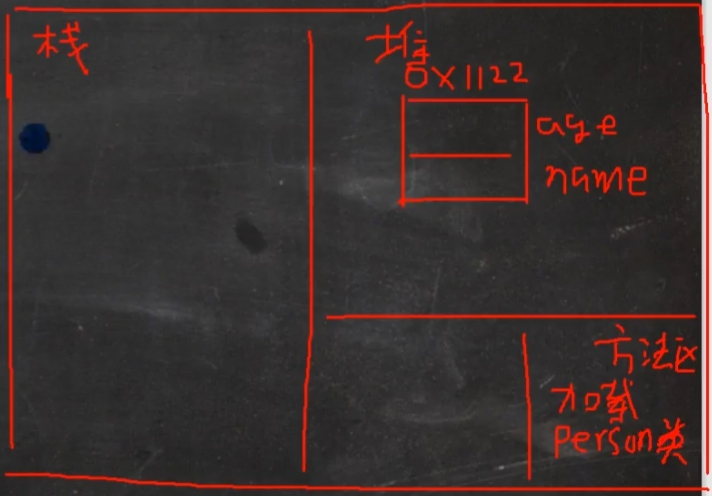
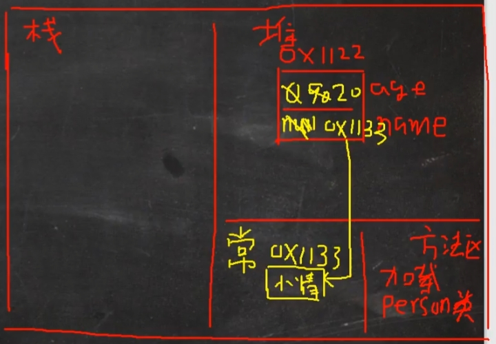

# Chapter02 Java概述

## 2.运行第一个java文件

```java
public class Test{
	public static void main(String[] args){
		System.out.println("Hello java!");
	}
}
```

### 解释性语言

解释性语言：javascript，PHP，java 编译性语言：c/c++

- ==解释性语言==：==编译后==的代码，==不能==直接被机器执行，==需要解释器==来执行

- ==编译性语言==：编译后的代码，==可以==直接被机器执行，c/c++

### 环境变量

在当前目录找不到==javac==和==java==，则会在==环境变量path==下寻找

因此在当前用户的==path下新增%JAVA_HOME%\bin==，其中==%JAVA_HOME%为jdk1.8的安装地址==

### javac

==javac==：==Java编程语言中的编译器==，它用于将Java源代码文件（*.java文件*）编译成Java*字节码文件*（*.class文件*）。编译器==将源代码翻译成机器可以执行的指令集==（*字节码文件*），使得Java程序可以在Java虚拟机上运行。通过javac，开发人员可以将自己的Java程序代码转换成可执行的字节码文件，从而创建可运行的Java应用程序。

### JVM

JVM负责==解释和执行==字节码*.class文件*

不同操作系统的Java虚拟机不同，对应的Java虚拟机运行.class文件

==Java虚拟机在执行字节码时，把字节码解释成具体平台上的机器指令执行。这就是Java的能够“一次编译，到处运行”的原因。==

### JDK和JRE

==JDK (Java Development Kit)==是用于开发Java应用程序的==完整工具包==，包括==Java编译器（javac）==、运行Java应用程序所需的==Java虚拟机（JVM）==，以及==其他开发工具和库==。JDK适用于开发人员需要编写、编译和调试Java应用程序的情况。

 ==JRE (Java Runtime Environment)== 则是仅包含Java运行时环境的工具包，它提供了运行已编译好的Java应用程序==所需的环境和库==，但**不包括用于开发的工具**（*如编译器和调试器*）。==JRE适用于仅需运行Java应用程序而无需进行开发的用户==。 因此，*开发人员通常需要安装JDK，而普通用户只需要安装JRE即可*。

- ==JDK = JRE + 开发工具集（javac等）==
- ==JRE = JVM + Java SE 标准类库==
- 需要运行*.class文件*，*只需JRE即可*

### Java执行流程

1. *.java 源文件*通过*javac.exe编译器*编译为*.class字节码文件*
2. *.class字节码文件*通过java.exe运行
3. 所谓运行，就是将*.class字节码文件*装载到*对应的JVM中执行*


### Java转义字符

| 转义字符 | 字符   | 转义字符 | 字符        |
| -------- | ------ | -------- | ----------- |
| \\       | 反斜杠 | \f       | 换页        |
| \b       | 退格   | \t       | 跳出一个Tab |
| \r       | 回车   | \n       | 换行        |
| \"       | 双引号 | \'       | 单引号      |

### Java文档注释

文档注释以 **/\==* 开始，以 ==/** 结束，通常出现在类、方法、字段等的声明前面，用于生成代码文档，这种注释可以被工具提取并生成 API 文档，如 JavaDoc。

```java
/**
* @author Garry
* @version 1.2
*/
```

```shell
javadot -d xxx.java
```

javadoc 工具软件识别以下标签：

| **标签**      |                        **描述**                        |                           **示例**                           |
| :------------ | :----------------------------------------------------: | :----------------------------------------------------------: |
| @author       |                    标识一个类的作者                    |                     @author description                      |
| @deprecated   |                 指名一个过期的类或成员                 |                   @deprecated description                    |
| {@docRoot}    |                指明当前文档根目录的路径                |                        Directory Path                        |
| @exception    |                  标志一个类抛出的异常                  |            @exception exception-name explanation             |
| {@inheritDoc} |                  从直接父类继承的注释                  |      Inherits a comment from the immediate surperclass.      |
| {@link}       |               插入一个到另一个主题的链接               |                      {@link name text}                       |
| {@linkplain}  |  插入一个到另一个主题的链接，但是该链接显示纯文本字体  |          Inserts an in-line link to another topic.           |
| @param        |                   说明一个方法的参数                   |              @param parameter-name explanation               |
| @return       |                     说明返回值类型                     |                     @return explanation                      |
| @see          |               指定一个到另一个主题的链接               |                         @see anchor                          |
| @serial       |                   说明一个序列化属性                   |                     @serial description                      |
| @serialData   | 说明通过writeObject( ) 和 writeExternal( )方法写的数据 |                   @serialData description                    |
| @serialField  |             说明一个ObjectStreamField组件              |              @serialField name type description              |
| @since        |               标记当引入一个特定的变化时               |                        @since release                        |
| @throws       |                 和 @exception标签一样.                 | The @throws tag has the same meaning as the @exception tag.  |
| {@value}      |         显示常量的值，该常量必须是static属性。         | Displays the value of a constant, which must be a static field. |
| @version      |                      指定类的版本                      |                        @version info                         |

### Java代码规范


还有一点就是*一个.java中只有一个public类，且文件名与public类名一致*

### Dots指令

移步Missing Semester


# Chapter03 变量

## 3.变量入门

### 程序中 + 的作用

- 左右两边有一边是字符串时，+ 号做字符串拼接运算


## 4.几种常见数据类型

### 整类型 int

- int只分配4字节的空间，而*1L有8字节的空间*，因此编译器会报错

```java
public class IntDetail{
	public static void main(String[] args){
		int n1 = 1;//4个字节
		//int n2 = 1L;//int只分配4字节的空间，而1L有8字节的空间，因此编译器会报错
		long n2 = 1L;//8个字节
	}
}
```

### 浮点类型 double

- 关于浮点数在机器中存放形式：==浮点数 = 符号位 + 指数位 + 尾数位==

- ==尾数部分可能丢失==，造成精度损失 (==小数都是近似值==)

```java
public class FloatDetail{
	public static void main(String[] args){
		/*
			1. 浮点数的默认类型，以及隐式转换
		 */
		//float num1 = 1.1;		//1.1默认为double，占8个字节，而float只占4个字节，会报错
		float num1 = 1.1F;
		double num2 = 1.1;
		double num3 = 1.1F;//可行，小的可以隐式转为大的类型

		/*
			2. 浮点数的十进制表示法，和科学计数法
		 */
		//十进制表示法
		double num4 = .123;//0.123，零可以省略，小数点不可省略
		//科学计数法
		double num5 = 5.12e2;//5.12 * 10 ^ 2，512.0
		double num6 = 5.12e-2;//5.12 * 10 ^ (-2)，0.0512
		System.out.println("num5 = " + num5);//num5 = 512.0
		System.out.println("num6 = " + num6);//num6 = 0.0512

		/*
			3. 通常情况下选择double，精度更高
		 */
		float  num7 = 2.123456789f;
		double num8 = 2.123456789;
		System.out.println("num7 = " + num7);//num7 = 2.1234567，损失精度
		System.out.println("num8 = " + num8);//num8 = 2.123456789

		/*
			4. 浮点数的使用陷阱：2.7 和 8.1 / 3 比较
		 */
		double num9 = 2.7;
		double num10 = 8.1 / 3;
		System.out.println("num9 = " + num9);//num9 = 2.7
		System.out.println("num10 = " + num10);//num10 = 2.6999999999999997
		//WARNING: 对运算之后的小数进行比较时非常危险的，因为计算机中的小数只是一个近似值，有精度
		//判断方式应该为：两个数差值的绝对值在某个精度范围之内
		System.out.println(num10 == num9);//false
		System.out.println(Math.abs(num10 - num9));//4.440892098500626E-16
		System.out.println(Math.abs(num10 - num9) < 0.000001);//true
		//细节:如果是直接查询得的的小数或者直接赋值，是可以判断相等
	}
}
```

1. Java的浮点数==默认为double类型==（如1.2会默认为double类型），如果要用float类型，==需要在浮点数的后边加上 f 或 F== （1.2f 或 1.2F）

2. 浮点数的十进制表示法，和科学计数法

	- 十进制表示法：*零可以省略，**小数点不可省略==
	- 科学计数法：e和E均可，可直接5.12e-2

3. 通常情况下选择double，精度更高

4. WARNING: 对运算之后的小数进行比较时非常危险的，因为==计算机中的小数只是一个近似值==，有精度

	判断方式应该为：*两个数差值的绝对值在某个精度范围之内*

	细节:如果是*直接查询得*的的小数或者*直接赋值*，是可以判断相等

### Java API

APl (Application Programming Interface，==应用程序编程接口== ) 是 Java 提供的基本编程接口


### 字符类型 char

==Java字符类型根据不同的编码方式，占用的内存不同==

```java
public class CharDetail{
	public static void main(String[] args){
		char c1 = 'a';
		char c2 = '\t';
		char c3 = '杨';
		char c4 = 97;
		System.out.println("c1 = " + c1);
		System.out.println("c2 = " + c2);
		System.out.println("c3 = " + c3);
		System.out.println("c4 = " + c4);//c4 = a
	}
}
```

### 字符编码


1. ASCII码表
	- 一个字节最多表示256个字符，而==ASCII码只用了128个字符==
	- 缺点：不能表示所有字符


2. Unicode编码
	- ==所有字符都使用2个字节==
	- 最多表示$2^8 \times 2^8 = 65536$个字符
	- ==Unicode码兼容ASCII码==，如'a'均为97


3. UTF-8编码

	- Unicode的改进

	- ==可以采用1~6个字节表示一个符号==
	- 字母一个字节，==汉字三个字节==


### 布尔类型 boolean

用于逻辑运算，while，if，for…

(int)0=false，(int)(大于0的数)=true

## 5.数据类型转换

### 自动类型转换

==精度小的可以自动转换为精度大的==


1. 多种数据混合运算时，*自动转成容量最大的数据类型*，再进行计算
2. 大精度不能自动转换为小精度的
3. *char，byte，short间不存在自动类型转换*
4. char，byte，short**不管是单独还是相互运算**，*都要先转换为 int型*
5. 自动提升原则

```java
public class autoConvert{
	public static void main(String[] args){
		int num = 'a';//char自动转int
		double d1 = 80;//int自动转double

		/*
			1. 多种数据混合运算时，自动转成容量最大的数据类型，再进行计算
		 */
		float f1 = num + 1.1f + (short)10;
		//int n2 = 1.1;//报错
		
		/*
			2. 大精度不能自动转换为小精度的
		 */
		byte b1 = 10;//可以
		//byte b2 = num;//不行，int 4字节

		/*
			3. char，byte，short间不存在自动类型转换
		 */
		//char c1 = b1;//报错，byte不能自动转换为char
		 
		/*
			4. char，byte，short不管是单独还是相互运算，都要先转换为int型
		 */
		byte b2 = 1;
		byte b3 = 2;
		short s1 = 1;
		//short s2 = b2 + s1;//错, b2 + s1 => int
		int s2 = b2 + s1;//对, b2 + s1 => int
		//byte b4 = b2 + b3; //错误: b2 + b3 => int **重点**
		
		/*
			5. 自动提升原则
		 */
		byte b4 = 1;
		short s3 = 100;
		int num200 = 1;
		float num300 = 1.1F;
		double num500 = b4 + s3 + num200 + num300; //float -> double
	}
}
```

### 强制类型转换

自动类型转换的逆过程，*将容量大的数据类型转换为容量小的数据类型*。使用时要加上强制转换符 ( )，但可能造成==精度降低或溢出==，格外要注意。

1. 强转符号==只针对于最近的操作数有效==，往往会使用小括号提升优先级

2. char==能保存int常量型==，==但不能保存int变量型==

	```java
	char c1 = 100; //ok
	int m = 100; //ok
	//char c2 = m; //错误，int不能自动转char
	char c3 = (char)m; //ok
	System.out.println(c3);//100 对应的字符, d 字符
	```

3. ==byte和short，char 类型在进行运算时，当做int类型处理==

### String和基本数据类型转换

1. ==String => 基本数据类型==：基本数据类型 ==+ ""==

```java
int n1 = 100;
float f1 = 1.1F;
double d1 = 4.5;
boolean b1 = true;
String s1 = n1 + "";
String s2 = f1 + "";
String s3 = d1 + "";
String s4 = b1 + "";
System.out.println(s1 + " " + s2 + " " + s3 + " " + s4)
```

2. ==基本数据类型 => String==：通过==基本类型的包装类调用parseXX方法==即可

```java
String s5 = "123";
int num1 = Integer.parseInt(s5);
double num2 = Double.parseDouble(s5);
float num3 = Float.parseFloat(s5);
long num4 = Long.parseLong(s5);
byte num5 = Byte.parseByte(s5);
boolean b = Boolean.parseBoolean("true");
short num6 = Short.parseShort(s5);
```


# Chapter04 运算符

## 7.运算符

### 算术运算符

#### %运算符

- 原则：**a % b = a - a / b * b**

- ==当a为小数时==，**a % b = a - (int)a / b * b**

```
// % 取模 ,取余
// 在 % 的本质 看一个公式!!!! a % b = a - a / b * b
// -10 % 3 => -10 - (-10) / 3 * 3 = -10 + 9 = -1
// 10 % -3 = 10 - 10 / (-3) * (-3) = 10 - 9 = 1
// -10 % -3 = (-10) - (-10) / (-3) * (-3) = -10 + 9 = -1
```

#### 自增运算符

本质，==创建一个临时变量==，将变量的值赋给临时变量，==返回临时变量==

1. 前自增

	```java
	1) i = i + 1
	2) temp = i
	3) return temp
	```

2. 后自增

	```java
	1) temp = i
	2) i = i + 1
	3) return temp
	```

面试例题

```java
int i = 1;
i = i++;//temp=1;i+=1;return temp;然后将temp赋给i，temp=1，因此i=1
System.out.println(i);//输出1
```

### 逻辑运算符

#### 短路 && 和逻辑 &

1. ==&&短路与==：如果第一个条件为 false，则==第二个条件不会判断==，最终结果为 false，==效率高==
2. ==& 逻辑与==：不管第一个条件是否为 false，==第二个条件都要判断==，效率低

```java
public class LogicOperator{
	public static void main(String[] args){
		int a = 4;
		int b = 9;
		//对于&&短路与而言，如果第一个条件为 false ,后面的条件不再判断
		if(a < 1 && ++b < 50) {
			System.out.println("ok300");
		}
		System.out.println("a=" + a + " b=" + b);// 4 9

		//对于&逻辑与而言，如果第一个条件为 false ,后面的条件仍然会判断
		if(a < 1 & ++b < 50) {
			System.out.println("ok300");
		}
		System.out.println("a=" + a + " b=" + b);// 4 10
	}
}
```

#### 短路 || 和逻辑 |

1. ==||短路或==：如果第一个条件为 true，则==第二个条件不会判断==，最终结果为 true，==效率高==
2. ==| 逻辑或==：不管第一个条件是否为 true，==第二个条件都要判断==，效率低

### 赋值运算符

1. 运算顺序*从右往左 *

	```java
	int num = a + b + c;
	```

2. 赋值运算符的*左边只能是变量*，*右边 可以是变量、表达式、常量值*

	```java
	int num = 20; 
	int num2 = 78 * 34 - 10; 
	int num3 = a;
	```

3. 复合赋值运算符等价于下面的效果

	```java
	比如：a += 3;
	等价于 a = a + 3;
	其他类推
	```

4.  ==复合赋值运算符会进行类型转换==

	```java
	byte b = 2;
	b += 3;等价于：b = (byte)(b + 3)
	b++;等价于：b = (byte)(b + 1)
	```

### 运算符优先级


```
1. () {} . -> 等
2. 单目运算符++，- -
3. 算术运算符
4. 位移运算符
5. 比较运算符
6. 逻辑运算符
7. 三元运算符
8. 赋值运算符
```

1. 只有==单目运算符==、==赋值运算符==是==从右向左==运算的
2. ==位移运算符低于算术运算符==
3. == & | 优先于 && ||==
4. ==== != 优先于其它逻辑运算符==


## 8.标识符，保留字，键盘输入

### 标识符

就是变量、函数、类等等的名字

==规则==：

1. 字母大小写 ， 数字 ， __   ， $
2. ==数字不能开头==
3. ==不能是关键字或保留字==
4. 区分大小写
5. 不能有空格

==规范==：

1. ==包名==：多单词组成时所有字母都小写：aaa.bbb.ccc //

	比如 ==com.hsp.crm==

2. ==类名、接口名==：多单词组成时，所有单词的首字母大写：XxxYyyZzz

	比如：==ArrayList==

3. ==变量名、方法名==：多单词组成时，第一个单词首字母小写，第二个单词开始每个单词首字母大写：xxxYyyZzz。

	比如： ==tankShotGame==

4. ==常量名==：所有字母都大写。多单词时每个单词用下划线连接：XXX_YYY_ZZZ

	比如 ： ==TAX_RATE==

### 关键字，保留字

==关键字==：被 Java 语言赋予了特殊含义，用做*专门用途的字符串*（*均为小写*）


==保留字==：现有 Java 版本**尚未使用**，但**以后版本可能会作为关键字使用**。

```java
byValue、cast、future、 generic、 inner、 operator、 outer、 rest、 var 、 goto 、const
```

### 键盘输入

```java
import java.util.Scanner;//包名：jave.util	类名：Scanner	遵守命名规范

public class Input{
	public static void main(String[] args){
		//Scanner 类 表示 简单文本扫描器，在 java.util 包
		//1. 引入/导入 Scanner 类所在的包
		//2. 创建 Scanner 对象 , new 创建一个对象,体会
		// myScanner 就是 Scanner 类的对象
		Scanner myScanner = new Scanner(System.in);//in为System类的字段，表示输入流
		//3. 接收用户输入了， 使用 相关的方法
		System.out.println("请输入名字");
		String name = myScanner.next(); //接收用户输入字符串
		System.out.println("请输入年龄");
		int age = myScanner.nextInt(); //接收用户输入 int
		System.out.println("请输入薪水");
		double sal = myScanner.nextDouble(); //接收用户输入 double
		System.out.println("人的信息如下:");
		System.out.println("名字=" + name + " 年龄=" + age + " 薪水=" + sal);
	}
}
```


## 9.进制转换与位运算

### 进制转换

- 二进制：0,1 ，满 2 进 1，==以 0b 或 0B 开头==。

- 十进制：0-9 ，满 10 进 1。

- 八进制：0-7 ，满 8 进 1， ==以数字 0 开头表示==。

- 十六进制：0-9 及 A(10)-F(15)，满 16 进 1，==以 0x 或 0X 开头表示==。此处的 A-F 不区分大小写。

```java
public class BinaryTest{
	public static void main(String[] args){
		//n1 二进制
		int n1 = 0b1111111111111111;
		//n2 10 进制
		int n2 = 65535;
		//n3 8 进制
		int n3 = 077777;
		//n4 16 进制
		int n4 = 0XFFFF;
		System.out.println("n1=" + n1);//65535
		System.out.println("n2=" + n2);//32767
		System.out.println("n3=" + n3);//65535
		System.out.println("n4=" + n4);//65535
		System.out.println(0x23A);
	}
}
```

==十进制转其它进制：==

1. 模n，将值压入栈
2. 除以n
3. 循环1，2直到数为0
4. ans += myStack.top();
5. ans *= 10;
6. 重复4，5直到栈空

==其它进制转十进制：==

1. ans += 模n
2. ans *= n
3. 重复1，2直到数为0

==2进制转8和16进制：==从右边开始3（4）个一组开始转即可

==8和16进制转2进制：==反之

### 位运算

#### 按位运算符

| 符号 | 描述 | 运算规则                 |
| :--- | :--- | :----------------------- |
| &    | 与   | 两个位都为1时，结果才为1 |
| \|   | 或   | 两个位都为0时，结果才为0 |
| ^    | 异或 | 两个位相同为0，相异为1   |
| ~    | 取反 | 0变1，1变0               |

#### 原码、反码、补码


1. int型4字节，最高位0为正，1为负

2. ==正数三码合一==

3. ==负数反码 = 原码除符号位外取反==

4. ==负数补码 = 负数反码 + 1==

	```java
	2的原码：00000000 00000000 00000000 00000010
	2的反码：00000000 00000000 00000000 00000010
	2的补码：00000000 00000000 00000000 00000010
	
	-2的原码：10000000 00000000 00000000 00000010
	-2的反码：11111111 11111111 11111111 11111101
	-2的补码：11111111 11111111 11111111 11111110
	```

5. 0的三码均为0

6. ==计算机进行位运算时，都是以补码的形式进行运算！==（*重中之重*）

7. 以补码运算完后，==最终的结果要换回原码==（*重中之重*）

```java
-2的原码：10000000 00000000 00000000 00000010
-2的反码：11111111 11111111 11111111 11111101
-2的补码：11111111 11111111 11111111 11111110
~-2位运算通过-2的补码进行运算：
~-2的补码：00000000 00000000 00000000 00000001
~-2的原码：00000000 00000000 00000000 00000001
故~-2 = 1

2的补码：00000000 00000000 00000000 00000010
~2的补码：11111111 11111111 11111111 11111101
~2的反码：11111111 11111111 11111111 11111100
~2的原码：10000000 00000000 00000000 00000011
故~2 = -3
```

#### 位移运算符

| 符号 | 描述       | 运算规则                                     |
| ---- | ---------- | -------------------------------------------- |
| <<   | 算术左移   | 符号位不变，其它位左移                       |
| >>   | 算术右移   | 符号位不变，其它位右移                       |
| >>>  | 无符号右移 | ==先转成补码，然后所有位右移（包括符号位）== |

```java
-2的原码：10000000 00000000 00000000 00000010
-2的补码：11111111 11111111 11111111 11111110

-2 >> 1的原码：10000000 00000000 00000000 00000001
int temp = -2 >> 1;
System.out.println("-2>>1 = " + temp);//-1

-2 << 1的原码：10000000 00000000 00000000 00000100
temp = -2 << 1;
System.out.println("-2<<1 = " + temp);//-4

-2的补码：		11111111 11111111 11111111 11111110
-2 >>> 1的补码：01111111 11111111 11111111 11111111
-2 >>> 1的原码：01111111 11111111 11111111 11111111
temp = -2 >>> 1;
System.out.println("-2>>>1 = " + temp);//2147483647
```


# Chapter05 程序控制结构

## 11.分支

跟C++一致，没什么好记的


## 12.switch详解

1. 表达式数据类型，应和case 后的常量类型一致，或者是可以自动转成可以相互比较的类型，比如输入的是字符，而常量是 int

2. *switch(表达式)中表达式的返回值必须是:(byte,short,int,char,enum[枚举],String)*

	==不能是浮点型或long型，因为其无法自动转换到int==

	```java
	double c = 1.1;
	switch(c){//错误: 不兼容的类型: 从double转换到int可能会有损失
		case 1.1://错误
			System.out.println("OK");
			break;
	}
	```

3. *case子句的值必须是常量，而不能是变量*

4. ==如果没有写break，程序会从匹配的case开始一直执行到switch结尾，除非遇到break==

	```java
	public class SwitchTest {
		public static void main(String[] args) {
			int num = 1;
			switch(num){
				case 0:
					System.out.println("OK0");//未输出
				case 1:
					System.out.println("OK1");//输出
				case 2:
					System.out.println("OK2");//输出
				case 3:
					System.out.println("OK3");//输出
				default:
					System.out.println("OK666");//输出
			}
		}
	}
	```


## 13.for详解

跟C++一致，没什么好记的


## 14.while 和 do while

跟C++一致，没什么好记的


## 15.多重循环训练

跟C++一致，没什么好记的


## 16.break详解

1. break语句出现在多层嵌套的语句块中时，==可以通过标签指明要终止的是哪一层语句块==

2. ```java
	label1:
	for(int i = 0; i < 10; i++) {
	    label2:
	    for(int j = 0; j < 10; j++) {
	        if(j == 2){
	            break label1;
	        }
	        System.out.println("j = " + j);
	    }
	}
	```


## 17.continue 和 return

1. continue语句出现在多层嵌套的语句块中时，==可以通过标签指明要继续的是哪一层语句块==

2. ```java
	label1:
	for(int i = 0; i < 10; i++) {
	    label2:
	    for(int j = 0; j < 10; j++) {
	        if(j == 2){
	            continue label1;
	        }
	        System.out.println("j = " + j);
	    }
	}
	```


# Chapter06 数组、排序和查找

## 19.数组详解

### 数组使用

1. 动态初始化：声明 + 创建

  ```java
  int arrayName[] = new int[SIZE];
  int arrayName[] = new int[]{Elem1, Elem2, ...};//注意此处new后[]不能有值！
  ```

  - ==直接使用初始化列表，则new后[]必须为空==

2. 动态初始化：先声明，再创建

  1. 先声明

  ```java
  int arrayName[] 或 int[] arrayName;
  ```

  2. 再创建

  ```java
  arrayName = new int[SIZE];
  arrayName = new int[]{Elem1, Elem2, ...};//注意此处new后[]不能有值！
  ```

  - ==只声明的话在内存中不会开辟空间，arrName是野指针==
  - ==直接使用初始化列表，则new后[]必须为空==

3. 静态初始化：

	```java
	int arrayName[] = {Elem1, Elem2, ...}
	```

### 数组赋值机制

1. 默认拷贝构造为浅拷贝

	```java
	public class ArrayCopy {
		public static void main(String[] args) {
			int[] arr1 = {10,20,30}; 
			int[] arr2 = arr1;//浅拷贝，直接把arr1的地址传给arr2
			for(int i = 0; i < arr2.length; i++) {
				arr2[i] += 100;
			}
			System.out.println("====arr1元素====");
			for(int i = 0; i < arr1.length; i++) {
				System.out.println(arr1[i]);//110，120，130
			}
		}
	}
	```

2. 深拷贝需要arr2 new一块地址，然后重新赋值


## 20.排序与查找入门

没啥好看的


## 21.二维数组详解

### 二维数组使用

1. 动态初始化：声明 + 创建

	```java
	int a[][] = new int[2][3]
	int a[][] = new int[][]{{1,2,3},{4,5},{6}};
	```

	- ==直接使用初始化列表，则new后[]必须为空==

2. 动态初始化：先声明，再创建

	1. 先声明

	```java
	int arrayName[][] 或 int[][] arrayName 或 int[] arrayName[]
	```

	2. 再创建

	```java
	arrayName = new int[SIZE1][SIZE2];
	arrayName = new int[][]{{1,1,1}, {8,8,9}, {100}}；
	```

	- ==只声明的话在内存中不会开辟空间，arrName是野指针==
	- ==直接使用初始化列表，则new后[]必须为空==

3. 动态初始化-列数不确定

	```java
	i = 0: 1
	i = 1: 2 2
	i = 2: 3 3 3
	
	//创建 二维数组，一个有 3 个一维数组，但是每个一维数组还没有开数据空间
	int[][] arr = new int[3][];
	
	for(int i = 0; i < arr.length; i++) {
		arr[i] = new int[i + 1];
		for(int j = 0; j < arr[i].length; j++) {
			arr[i][j] = i + 1;//赋值
		}
	}
	```

4. 静态初始化

	```java
	int[][] arr = {{1,1,1}, {8,8,9}, {100}};
	```


# Chapter07 面向对象编程(基础部分)

## 23.类与对象快速入门


### 属性 | 成员变量 | 字段

1. *成员变量 = 属性 = field(字段)*

2. 属性是类的一个组成部分，*一般是基本数据类型，也可是引用类型*(对象，数组)

3. 属性的定义语法同变量：==访问修饰符 属性类型 属性名==

	```java
	public String name;
	```

	*访问修饰符： 控制属性的访问范围*：public，proctected，默认，private

	*属性如果不赋值，有默认值*

```java
//创建 Person 对象
//p1 是对象名(对象引用)，存在栈区
//new Person() 创建的对象空间(数据) 才是真正的对象，存在堆区和方法区
Person p1 = new Person();
```

### 对象内存分配机制

1. ==可以把实例化的对象名理解为指针==，*存在栈区*
2. ==new申请的空间在堆区==
3. ==对象名指向堆区中申请内存的首地址==
4. 如果类的属性有==引用类型==，则*在堆区中为一个指向方法区中实例化对象的指针*


### Java内存的结构分析

1. ==栈区==：一般存放基本数据类型（==局部变量==）
2. ==堆区==：存放==对象，数组==等
3. ==方法区==：常量池存放==常量（如字符串）==，==类加载信息==

### Java 创建对象流程

1. 先==加载 Person 类信息==(属性和方法信息, 只会加载一次，即==再创建一个对象就不会加载==了)
2. 在==堆中分配空间,== 进行默认初始化
3. 把==地址赋给 p== ,== p 就指向对象==
4. 进行指定初始化， 比如 p.name =”jack” p.age = 10


## 24.方法详解

### 方法的调用机制原理


```java
访问修饰符 返回数据类型 方法名（形参列表..） {//方法体
public void func(ELemTye Elem...) {//function...
```

### 方法的传参

1. 值传递：在方法的栈区里创建临时变量，即形参

	```java
	public void func(int num1, int num2) {//function...
	```

2. 引用传递：==本质也是在栈区创建临时对象==，只不过该对象可以理解为一个==临时指针==

	==形参与实参指向同一块堆区的地址==，因此p.age = 666==会改堆区对象属性的地址，会影响到实参==

	但是诸如p = null，p = new Person，==会改变形参指针的指向，从而不会影响到实参指针==

	```java
	public void func(int[] arr, Person obj) {//function...
	```

	example:

	```java
	public class MethodParameter {
		public static void main(String[] args) {
			B b = new B;
			Person p = new Person();
			p.name = "jack";
			p.age = 10;
			b.test(p);
			//测试题, 如果 test 执行的是 p = null ,下面的结果是 10
			//测试题, 如果 test 执行的是 p = new Person();..., 下面输出的是 10
			System.out.println("main 的 p.age=" + p.age);//10
		}
	}
	
	class B {
	public void test(Person p) {
	    //p.age = 10000; //修改对象属性
	    //思考
	    p = new Person();
	    p.name = "tom";
	    p.age = 99;
	    //思考
	    //p = null;
	}
	```

	1. test中 ==p.age = 10000 的操作会影响到实参的age==，因为==改了堆区同一区域的地址==
	2. 但是 ==p = null 和 p = new Person() 只会改变形参指针的指向，不改变实参指针的指向==


## 25.克隆与递归

克隆就是指深拷贝

### 递归的内存分配


1. main栈中创建对象，在==堆区中开辟空间==
2. main栈中调用方法，在==栈区开辟一块方法栈区==
	1. 方法栈中的==局部变量是独立的，不会相互影响==
	2. 方法栈中使用==引用类型变量，则其指向同一块地址==
3. 递归调用函数的过程中，==不断在栈区开辟新的方法栈==
4. ==递归调用的过程中，之前的方法栈不会销毁==


## 26.几个典型递归案例

### 汉诺塔问题

```java
public class HanoiTower {
	public static void main(String[] args) {
		char a = '1';
		char b = '2';
		char c = '3';
		int n = 5;
		Tower tower = new Tower();
		System.out.println("移动" + n + "根柱子的汉诺塔需要" + tower.move(n, a, b, c) + "步");
	}
}

class Tower{
	//放回借助b塔，将a塔所有柱子移到c塔的步骤
	public int move(int num, char a, char b, char c){
		if(num == 1){
			System.out.println(a + "->" + c);
			return 1;
		}
		//将a塔上的num根柱子看作是上面num-1根和底部的一根
        
		//先将a上的num-1根移到b
		int num1 = move(num - 1, a, c, b);
		//再把底部的移动到c
		int num2 = move(1, a, b, c);
		//最后把b的移动到c
		int num3 = move(num - 1, b, a, c);
		return num1 + num2 + num3;
	}
}
```


## 27.重载详解

1. 方法名必须相同

2. 形参列表必须不同 ==(形参类型或个数或顺序==，至少有一样不同，参数名无要求)

3. 返回类型无影响

	==如果只有返回类型不同，不构成重载！==


## 28.可变参数与作用域

### 可变参数

语法：*访问修饰符 返回类型 方法名(数据类型... 形参名) {函数体*

```java
public int sum(int... nums) {function
```

*相当于开辟一个数组，存储输入*

```java
public class VarParamter {
	public static void main(String[] args) {
		HspMethod obj = new HspMethod();
		System.out.println(obj.sum(1, 5, 100));
	}
}

class HspMethod{
	public int sum(int... nums){
		System.out.println("接收的参数个数=" + nums.length);
		int res = 0;
		for(int i = 0; i < nums.length; i++) {
			res += nums[i];	//相当于开辟一个数组，存储输入
		}
		return res;
	}
}
```

1. 可变参数的实参可以是*0到任意多个*
2. 可变参数的*实参可以是数组*
3. ==可变参数的本质就是数组==
4. 可变参数可以和普通类型的参数一起放在形参列表，但==必须保证可变参数在最后==
5. 一个形参列表中==只能出现一个可变参数==

### 作用域

1. *主要的变量*就是==属性(成员变量、全局变量)和局部变量==
2. ==全局变量==：也就是属性，==作用域为整个类体==
3. ==局部变量==：一般是指在==成员方法中定义的变量==，作用域为==定义它的代码块==
4. 全局变量有默认值；==局部变量没有默认值，必须初始化==

### 属性和局部变量

1. ==属性和局部变量可以重名==，访问时遵循==就近原则==

2. 在同一个作用域中，比如在同一个成员方法中，==两个局部变量，不能重名==

3. ==生命周期不同：==

	==属性生命周期较长==，伴随着==对象的创建而创建==，伴随着==对象的销毁而销毁==

	==局部变量生命周期较短==，伴随着它的==代码块的执行而创建==，伴随着==代码块的结束而销毁==

4. ==作用域范围不同：==

	==全局变量/属性==：可以被==本类使用==，或==其他类使用==(*通过对象调用*)

	==局部变量==：只能在==本类中对应的方法==中使用

5. ==修饰符不同：==

	==全局变量/属性==：可以加修饰符

	==局部变量==：不可以加修饰符


## 29.构造器与对象创建详解

### 构造器

语法：*[修饰符] 方法名(形参列表) {*

1. 方法名和类名相同

2. 没有返回值

3. 构造器是==完成对象的初始化，并不是创建对象==

4. ==一旦定义了自己的构造器，默认的构造器就覆盖了==，就不能再使用默认的无参构造器

	比如自定义一个有参构造，就不能再使用默认的无参构造了

### 对象创建流程

```java
class Person{
	int age = 90;
    String name;
    public Person(int a, String na) {
		age = a;
        name = na;
    }
}

Person p = new Person(20, "小倩");//问该对象的创建流程
```

1. ==方法区中加载 Person类信息== (Person.class)，*只会加载一次*

	

2. 在==堆中分配空间==  (地址)

	

3. 完成对象初始化

	1. ==默认初始化== age=0 name=null

		

	2. ==显式初始化== age=90,name=null

		

	3. ==构造器的初始化== age =20,name=小倩

		

4. 在对象在堆中的地址,返回给 p (p 是对象名,也可以理解成是对象的引用)

	


## 30.this详解

==哪个对象调用，this就代表哪个对象==


1. this 关键字可以用来访问本类的属性、方法、构造器

2. this 用于区分当前类的属性和局部变量

3. 访问成员方法的语法：this.方法名(参数列表);

	```java
	public void func1() {
	    System.out.println("调用func1()");
	}
	public void func2() {
	    System.out.println("调用func2()");
	    //第一种方法
	    func1();
	    //第二种方法
	    this.func1();
	}				//两种方法不一样，但是这里不细讲，留到继承的时候填坑
	```

4. 访问构造器语法：this(参数列表)；==注意只能在构造器中使用==（即==只能在构造器中访问另外一个构造器==，==必须放在第一条语句==）

	```java
	class T{
		public String name;
		public int age;
	
		public T() {
			//System.out.println("T() 的构造器");
			this("张三", 33);//如果要在构造器中调用其它的构造器，必须放在第一条语句
	        System.out.println("T() 的构造器");
		}
		public T(String name, int age) {
			System.out.println("T(String name, int age) 的构造器");
			this.name = name;
			this.age = age;
		}
	}
	```

5. this 不能在类定义的外部使用，只能在类定义的方法中使用


# Chapter08 面向对象编程(中级部分)

## 32.IDEA入门

1. Java源文件放在src目录下
2. 输出的.class文件放在out目录下

==快捷键==

1. 删除当前行：Ctrl + D
2. 复制当前行：Ctrl + alt + 向下光标
3. 导入该行需要的类：先配置 auto import，然后使用 alt+enter 即可
4. 快速格式化代码：Ctrl + alt + L
5. 快速运行程序：Ctrl + alt + R
6. 生成构造器：alt + insert
7. 查看一个类的层级关系：Ctrl + H
8. 将光标放在一个方法上：输入 Ctrl + B , 可以定位到方法
9. 自动的分配变量名 , 通过 在后面假 .var

==模板快捷键：==Settings => Editor => Live Templates

1. 输出：sout + Tab
2. main：main + Tab
3. for循环：fori

==IDEA项目目录或类名变成红色的原因及解决办法：==

1. 类名变为红色是因为你安装了版本控制工具（例如Git，SVN等），==更新了代码，没有提交上去==，起提示作用，不影响实际功能。
2. 点击 `file —> setting —>version control`
	点击加号：添加项目目录，项目改为`none`


## 33.包与访问修饰符

### 包

包基本语法：==package com.hspedu;==

1. package 关键字,表示打包
2. com.hspedu: 表示包名

==包的本质就是创建不同的文件夹/目录来保存类文件==

*创建方法*：*在选中的文件夹/目录下右键 New => package*

==注意事项：==

若*多个包中存在名字相同的类*，*一个类只能同时引入一个包中的类*，==避免名字冲突==

```java
package com.use;//package必须放在最上面

import com.xiaoqiang.Dog;
//import com.xiaoming.Dog;
// 'com.xiaoqiang.Dog' is already defined in a single-type import
// 只能导入一个包的.Dog，作为此类的默认Dog，若要使用其它包的.Dog，需要使用com.xiaoming.Dog

public class Test {
    public static void main(String[] args) {
        Dog dogQiang = new Dog();
        System.out.println(dogQiang);//com.xiaoqiang.Dog@1540e19d，后面的是HashCode
        com.xiaoming.Dog dogMing = new com.xiaoming.Dog();
        System.out.println(dogMing);//com.xiaoming.Dog@677327b6
    }
}

```

==包的命名规则：==

1. 只能包含数字、字母、下划线、小圆点
2. ==任何一个文件夹/目录== 都不能用数字开头
3. ==任何一个文件夹/目录== 不能是关键字或保留字

```java
demo.class.exec1 //错误 class是关键字
demo.12a //错误 12a 是数字开头
demo.ab12.oa //对
```

==包的命名规范：==小写字母 + 小圆点

```java
com.公司名.项目名.业务模块名
com.sina.crm.user //用户模块
com.sina.crm.order //订单模块
com.sina.crm.utils //工具类
```

==常用的包：==

```java
1. java.lang	lang 包是基本包，默认引入，不需要再引入
2. java.util 	util 包，系统提供的工具包，工具类，使用 Scanner
3. java.net		网络包，网络开发
4. java.awt		做java 的界面开发，GUI
```

### 访问修饰符

1. 公开级别：用 public 修饰，对外公开
2. 受保护级别：用 protected 修饰，对子类和同一个包中的类公开
3. 默认级别：没有修饰符号，向同一个包的类公开，==注意不向不同包的子类公开==
4. 私有级别：用 private 修饰，只有类本身可以访问，不对外公开


## 34.封装和继承详解

### 封装

与C++的不同就是*在属性和成员方法前加上访问修饰符*，其它思想一致

### 继承

语法：class 子类 extends 父类 {

```java
class Son extends Parent {
```

1. ==子类继承了所有的属性和方法==，非私有的属性和方法可以在子类直接访问, 但是==私有属性和方法不能在子类直接访问，要通过父类提供公共的方法去访问==

2. 子类==必须调用父类的构造器， 完成父类的初始化==

	==子类构造器中有一个隐藏的 super语句==

	1. ==super在使用时，必须放在构造器第一行==
	2. super() 和 this() 都只能放在构造器第一行，因此这==两个方法不能共存在==一个构造器this() 不能再使用了
	3. 当创建子类对象时，不管使用子类的哪个构造器，==默认情况下总会去调用父类的无参构造器==，如果==父类没有提供无参构造器==，则必须在==子类的构造器中用 super 去指定使用父类的哪个构造器==完成对父类的初始化工作，否则，编译不通过
	4. 如果希望指定去调用父类的某个构造器，则显式的调用一下 :== super(参数列表)==

	```java
	public Sub(String name, int age) {
	    //1. 老师要调用父类的无参构造器, 如下或者 什么都不写,默认就是调用super()
	    //super();//父类的无参构造器
	    //2. 老师要调用父类的 Base(String name) 构造器
	    //super("hsp");
	    //3. 老师要调用父类的 Base(String name, int age) 构造器
	    super("king", 20);
	
	    //细节： super在使用时，必须放在构造器第一行
	    //细节: super() 和 this() 都只能放在构造器第一行，因此这两个方法不能共存在一个构造器
	    //this() 不能再使用了
	    System.out.println("子类Sub(String name, int age)构造器被调用....");
	}
	```

3. java ==所有类都是 Object 类的子类==, Object 是所有类的基类

	

4. 父类构造器的调用不限于直接父类！将一直往上追溯直到 Object 类(顶级父类)（==自上而下顺序调用==）

5. 子类最多只能继承一个父类(指直接继承)，即 ==java 中是单继承机制==（==和C++不一样，不能菱形继承==）

### 继承的本质

```java 
public class ExtendsTheory {
    public static void main(String[] args) {
        Son son = new Son();//内存的布局
        //(1) 首先看子类是否有该属性
        //(2) 如果子类有这个属性，并且可以访问，则返回信息
        //(3) 如果子类没有这个属性，就看父类有没有这个属性
        	//如果父类有且非私有即返回，私有就报错，不会继续向上找
        //(4) 如果父类没有就按照(3)的规则，继续找上级父类，直到Object...
        System.out.println(son.name);//返回就是大头儿子
        //System.out.println(son.age);//查找过程中只要找到，就不会再向上找了，如果private就报错
        System.out.println(son.hobby);//返回的就是旅游
    }
}

class GrandPa { //爷类
    String name = "大头爷爷";
    String hobby = "旅游";
    int age = 89;
}

class Father extends GrandPa {//父类
    String name = "大头爸爸";
    private int age = 39;

    public int getAge() {
        return age;
    }
}

class Son extends Father { //子类
    String name = "大头儿子";
}
```

1. ==加载顺序：从 Object到 Son==（*方法区中进行*，一个类只加载一次）

2. 在堆区开辟内存，从GrandPa开始开辟，然后是Father和Son，注意==每个类的所有属性方法都会开辟==

	派生类和基类如有==名字相同的属性方法并不会冲突==

3. 将==堆区中对象的地址返回给栈区中的对象名==


## 35.Super详解

==super== 代表==父类的引用==，用于==访问父类的属性、方法、构造器==

1. 调用父类的构造器的好处（==分工明确==，==父类属性由父类初始化==，子类的属性由子类初始化）

2. 当子类中有和父类中的成员(属性和方法*)重名时，为了访问父类的成员，必须通过super*

	==如果没有重名，使用super、this、直接访问是一样的效果==

3. super的访问==不限于直接父类==，如果爷爷类和本类中有同名的成员，也可以使用super去访问爷爷类的成员

	如果多个基类(上级类)中都有同名的成员，使用super访问遵循==就近原则==

4. ==一旦找到就不会再找了，如果private就会报错==

==super vs this==


## 36.方法重写

方法覆盖：==子类有一个方法,和父类的某个方法的名称、返回类型、参数一样==

1. 子类的方法的==形参列表，方法名称==，要==和父类方法的形参列表，方法名称完全一样==

2. 子类方法的==返回类型==和父类方法返回类型一样，或者==是父类返回类型的子类==

	比如 父类 返回类型是 Object，子类方法返回类型是String 

	```java
	public object getInfo(){}			public string getInfo(){}
	```

3. ==子类方法不能缩小父类方法的访问权限==

	```java
	void sayok(){			public void sayok(){	//默认 => 公有
	```
	
4. ==不能重写 private和 static方法==

  > Java 中 static 方法不能被覆盖，因为方法覆盖是基于运行时动态绑定的，而 static 方法是编译时静态绑定的。static 方法跟类的任何实例都不相关，所以概念上不适用。
  >
  > Java 中也不可以覆盖 private 的方法，因为 private 修饰的变量和方法只能在当前类中使用， 如果是其他的类继承当前类是不能访问到 private 变量或方法的，当然也不能覆盖。

==重载  vs 重写：==


## 37.多态详解


==对象多态：==

1. 一个对象的编译类型和运行类型可以不一致，==父类的指针可以指向堆区中子类的实体==

2. ==编译类型在定义对象时就确定了==，不能改变

3. ==运行类型是可以变化的==，可以用getClass()查看运行类型

4. 编译类型看定义时=号 的左边， 运行类型看 =号的 右边

	```java
	Animal animal = new Dog();
	```

### 向上转型

1. 本质：父类的引用指向了子类的对象

2. 语法：父类类型引用名 = new 子类类型()

	```java
	Animal animal = new Cat();
	```

3. ==可以调用父类中的所有成员== (需遵守*访问权限*)

4. ==不能调用子类中特有成员==

	*因为再编译阶段，能调用哪些成员，由编译类型来决定*

5. 最终运行效果看子类的具体实现

### 向下转型

1. 语法:子类类型引用名=(子类类型)父类引用

	```java
	Cat cat = (Cat)animal;
	```

2. 只能强转父类的引用，不能强转父类的对象

	```java
	//Cat cat = new Animal();//不能强转父类的对象
	```

3. 要求==父类的引用==必须指向的是==当前目标类型的对象==

	```java
	Animal animal = new Dog();
	//Cat cat = (Cat)animal;//父类的引用必须指向的是当前目标类型的对象
	```

4. 当向下转型后，可以调用子类类型中所有的成员

### 属性重写

==属性没有重写之说！属性的值看编译类型==

```java
public class PolyDetail02 {
    public static void main(String[] args) {
        //属性没有重写之说！属性的值看编译类型
        Base base = new Sub();//向上转型
        System.out.println(base.count);//看编译类型 10
        Sub sub = new Sub();
        System.out.println(sub.count);//20
    }
}

class Base { //父类
    int count = 10;//属性
}
class Sub extends Base {//子类
    int count = 20;//属性
}
```

==instanceof 比较操作符==，用于判断对象的==运行类型== 是否为==XX类型或 XX类型的子类型==

### 动态绑定机制

1. 当==调用对象方法== 的时候，该方法会==和该对象的内存地址/运行类型绑定==

2. 当==调用对象属性== 时，==没有动态绑定机制，哪里声明，那里使用==

```java
public class DynamicBinding {
    public static void main(String[] args) {
        //a 的编译类型 A, 运行类型 B
        A a = new B();//向上转型
        System.out.println(a.sum());//40 -> 30
        System.out.println(a.sum1());//30 -> 20
    }
}

class A {//父类
    public int i = 10;
    //动态绑定机制:
    public int sum() {
        return getI() + 10;//和该对象的内存地址/运行类型(B)绑定，调用B的getI()，20 + 
    }

    public int sum1() {//调用属性没有动态绑定机制，就用A的i，10 + 10 = 20
        return i + 10;
    }

    public int getI() {
        return i;
    }
}

class B extends A {//子类
    public int i = 20;

//    public int sum() {
//        return i + 20;
//    }

    public int getI() {//子类getI()
        return i;
    }

//    public int sum1() {
//        return i + 10;
//    }
}
```

==多态数组：==数组的==定义类型为父类类型==，里面保存的==实际元素类型为子类类型==

==多态参数：方法==定义的==形参类型为父类类型==，==实参类型允许为子类类型==

```java
public void testWork(Employee e) {
    if(e instanceof  Worker) {
        ((Worker) e).work();//有向下转型操作
    } else if(e instanceof Manager) {
        ((Manager) e).manage();//有向下转型操作
    } else {
        System.out.println("不做处理...");
    }
}
```


## 38.= = 和 equals

###  = =

1. 既可以==判断基本类型==，又可以==判断引用类型==
2. 如果判断==基本类型==，判断的是==值是否相等==。示例:int i=10; double d=10.0; i == d;//true
3. 如果判断==引用类型==，判断的是==地址是否相等==，即==是否指向同一个对象==

### equals方法

1. 是java.lang.Object类中的方法，==只能判断引用类型==

2. ==默认判断的是地址是否相等==，子类中往往重写该方法，用于==判断内容是否相等==

	String 类中重写的equals方法源码

	```java
	public boolean equals(Object anObject) {
	    if (this == anObject) {//默认判断地址是否相等
	        return true;
	    }
	    if (anObject instanceof String) {//地址不同，看内容是否相同
	        String anotherString = (String)anObject;//向下转型
	        int n = value.length;//value为String类的属性
	        if (n == anotherString.value.length) {//转化为char[]型比较内容
	            char v1[] = value;
	            char v2[] = anotherString.value;
	            int i = 0;
	            while (n-- != 0) {
	                if (v1[i] != v2[i])
	                    return false;
	                i++;
	            }
	            return true;
	        }
	    }
	    return false;
	}
	```

### = = 和 equals 的区别

1. ==可以对基本数据类型和引用类型使用，而==equals只能对引用类型使用==（equals是从Object继承下来的）

2. 对引用类型使用时：

	====：只比较地址是否一致==，即对象名==是否指向同一块地址==

	==equals：==根据不同对象的重写而不同，==默认比较地址是否一致==，地址不一致==就看内容是否一致==


## 39.hashCode | toString | finalize

### hashCode方法

1. 提高具有哈希结构的容器的效率
2. 两个引用，如果指向的是同一个对象，则哈希值肯定是一样的
3. 两个引用，如果指向的是不同对象，则哈希值是不一样的
4. ==哈希值主要根据地址号来的==，==不能完全将哈希值等价于地址==

- 可以将hashCode理解为地址，==但不完全等价于地址==

	> 这一般是通过将该对象的==内部地址转换成一个整数== 来实现的

	由于== Java是跑在虚拟机上的，拿不到真实的的内部地址，因此可以将其转换为一个整数，即 hashCode==

### toString方法

1. ==默认返回==：*全类名+@+哈希值的十六进制*

  ```java
  /Object的toString() 源码
      //getClass().getName() //类的全类名(包名 + 类名)
      //getClass(),getSimpleName	//只有类名
      //Integer.toHexString(hashCode()) //将对象的hashCode值转成16进制字符串
  public String toString() {
      return getClass().getName() + "@" + Integer.toHexString(hashCode());
  }
  ```

  *子类往往重写 toString 方法，用于返回对象的属性信息*

2. ==打印对象或拼接对象时，都会自动调用该对象的 toString 形式==

	比如 `System.out.println(monster);` 就会默认调用 `monster.toString()`

### finalize方法

1. 垃圾回收器会回收(销毁)对象,== 在销毁对象前，会调用该对象的 finalize方法==
2. 程序员就可以在 finalize中，*写自己的业务逻辑代码(比如释放资源：数据库连接,或者打开文件..)*
3. 如果程序员不重写 finalize，*那么就会调用 Object类的 finalize，即默认处理*
4. ==不是说一个对象变成垃圾就马上回收==，垃圾回收机制的调用，==是由系统来决定(即有自己的 GC 算法)==，也可以通过 `System.gc()` 主动触发垃圾回收机制

```java
//演示 Finalize的用法
public class Finalize_ {
    public static void main(String[] args) {

        Car bmw = new Car("宝马");
        bmw = null;
        //这时 new Car("宝马")对象就是一个垃圾
        //垃圾回收器就会回收(销毁)对象, 在销毁对象前，会调用该对象的finalize方法
        //程序员就可以在 finalize中，写自己的业务逻辑代码(比如释放资源：数据库连接,或者打开文件..)
        //如果程序员不重写 finalize，那么就会调用 Object类的 finalize，即默认处理
        //如果程序员重写了finalize，就可以实现自己的逻辑
        
        //不是说一个对象变成垃圾就马上回收，它有一套自己的算法
        System.gc();//主动调用垃圾回收器

        System.out.println("程序退出了....");
    }
}
class Car {
    private String name;
    //属性, 资源。。
    public Car(String name) {
        this.name = name;
    }
    //重写finalize
    @Override
    protected void finalize() throws Throwable {
        System.out.println("我们销毁 汽车" + name );
        System.out.println("释放了某些资源...");
    }
}
```


## 40.断点测试

右键点击Debug，==此时程序处于运行状态，变量均为运行类型==

1. `F7`(跳入)，比如调用一个类的方法，使用跳入==进入对应类的方法处==

	

2. `F8`(跳过)，不会进入方法的位置，==直接执行到下一行==

3. `Alt + Shift + F7`(强制跳入)，可以进入`java.\*`和`javax.\*`的方法中（==看源码==）

4. Shift+F8(跳出)，回到上一级

5. F9(resume，==执行到下一个断点==)

---

# JavaBasicNotes完结，请移步至JavaAdvanceNotes
