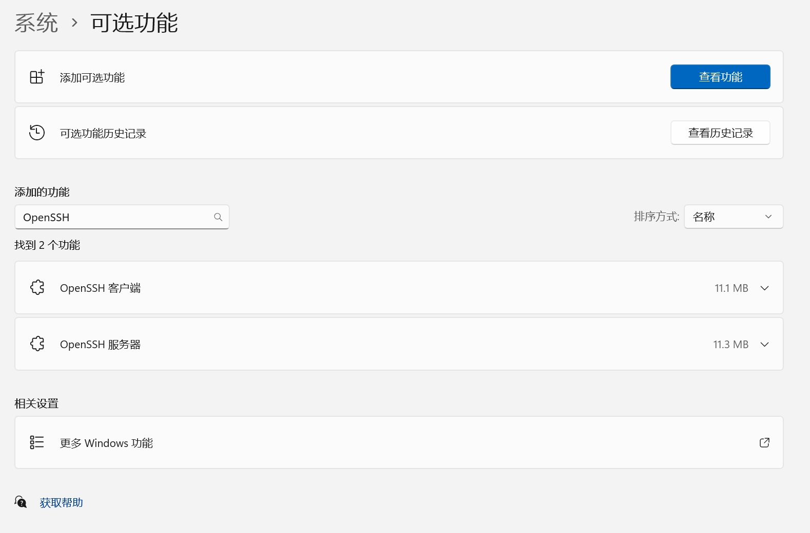
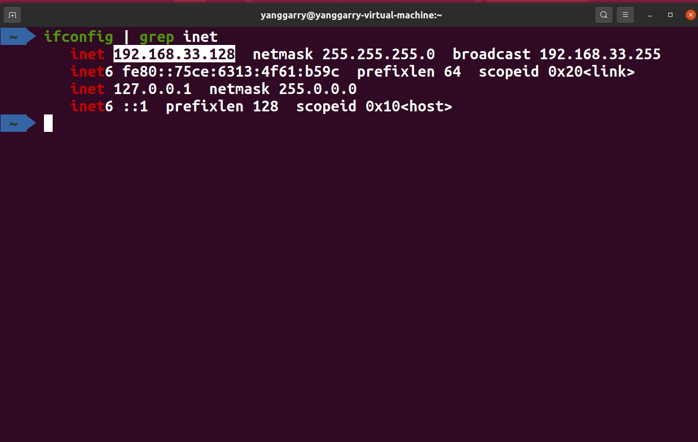
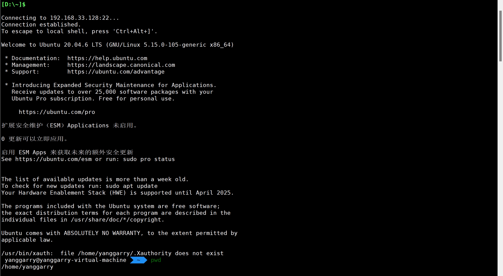
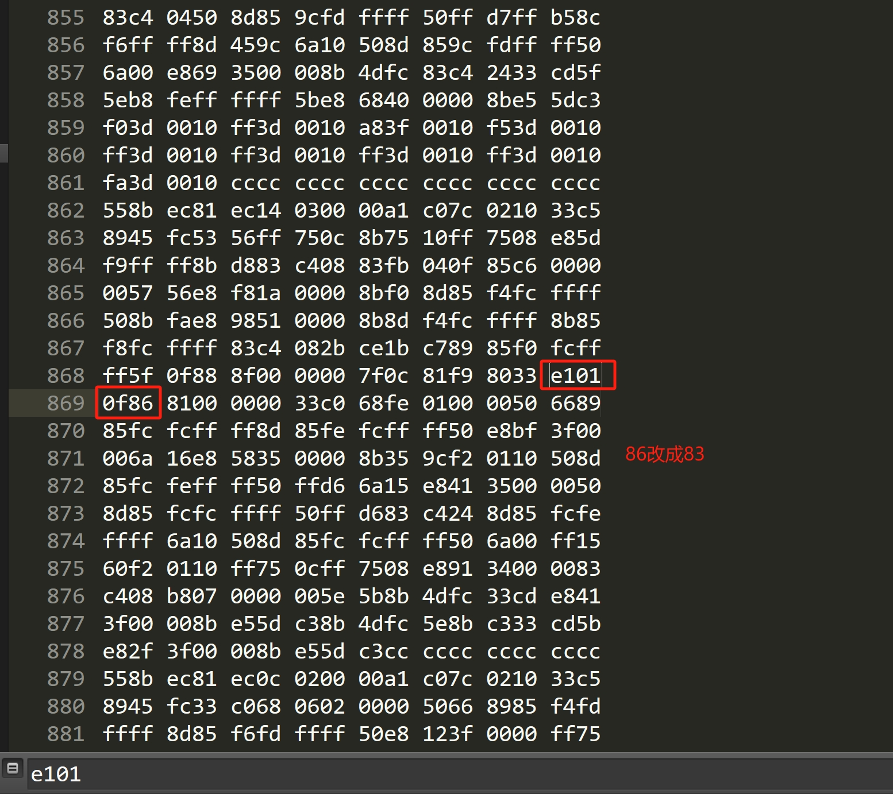
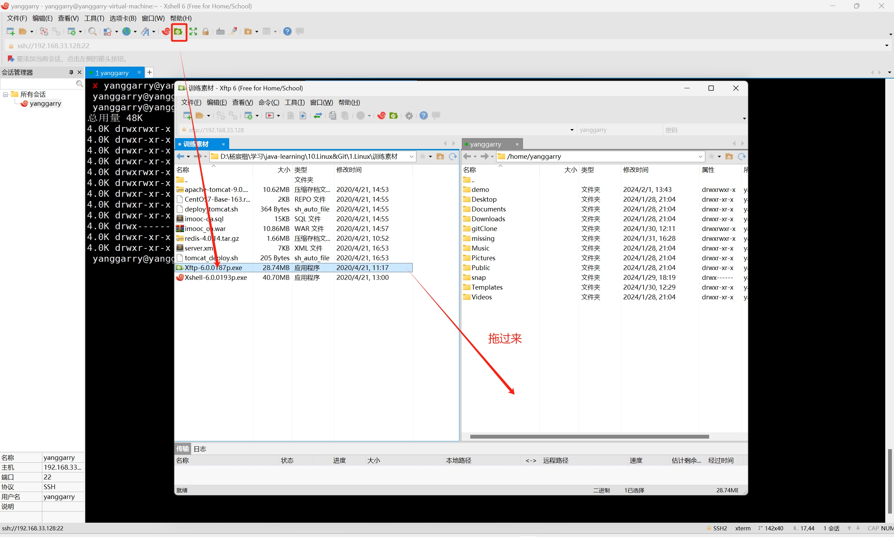
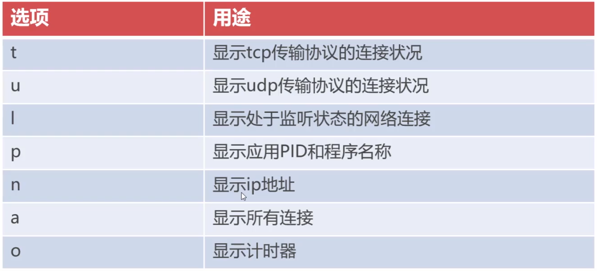
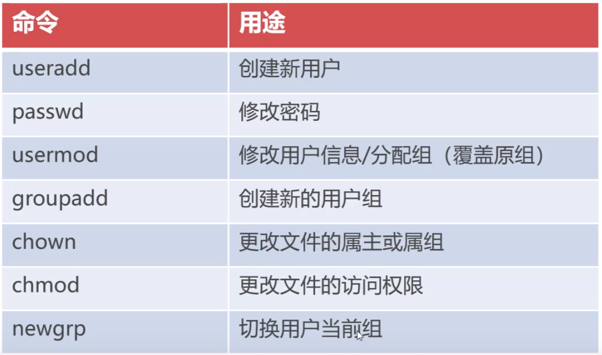
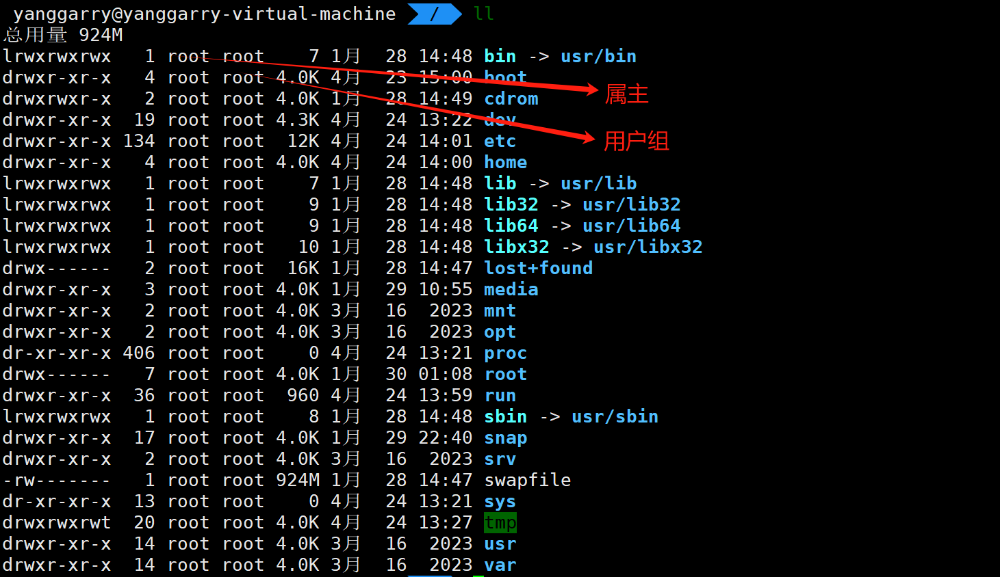
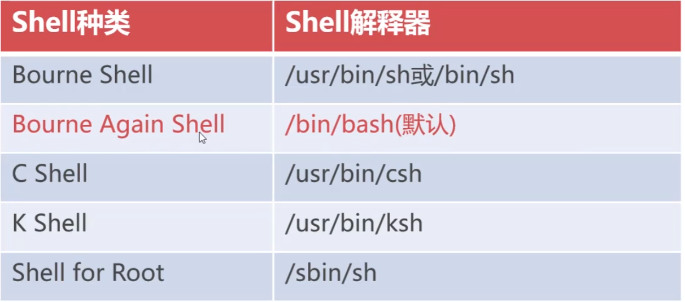

## 1.Xshell 

1. ==Xshell== 是 Linux 客户端，用于==在 Windows 下进行远程访问 Linux 服务器==。

2. 问题：==Xshell打开时提醒安装最新版，然后又莫名其妙说你已经安好了==。

	> 详见：https://blog.csdn.net/B11050729/article/details/131617334
	>
	> 我采用的是方案二，在sublime中搜索`0f86`就找到了`7F 0C 81 F9 80 33 E1 01 0F 86 81`，然后把`0F86`改为`0F83`。

3. ==连接远程服务器操作步骤==：

	> 1. 保证虚拟机处于打开状态
	>
	> 2. ==检查windows有没有打开ssh，Linux系统有没有打开sshd==
	>
	> 	> ==检查步骤和打开方式看这里==：https://blog.csdn.net/m0_52452585/article/details/123766668
	> 	>
	> 	> Windows 安装 OpenSSH 看官网：https://learn.microsoft.com/zh-cn/windows-server/administration/openssh/openssh_install_firstuse?tabs=gui#install-openssh-for-windows
	> 	>
	> 	> 
	>
	> 3. 使用 ==ifconfig 查看虚拟机的 ip 地址==（把虚拟机当作远程服务器，此时不能再把它们当作同一台）
	>
	> 	
	>
	> 4. ==在 Xshell 上创建新会话==
	>
	> 	
	>
	> 5. 连接成功，可以在 Windows 系统上远程访问 Linux 服务器（虚拟机）
	>
	> 	

---


## 2.Xftp

1. ==Xftp== 是 Xshell 的配套组件，用于==向服务器上传/下载文件==。

2. 问题：==Xshell打开时提醒安装最新版，然后又莫名其妙说你已经安好了==。

	> 详见：https://blog.csdn.net/weixin_39921821/article/details/120850951
	>
	> 在sublime中搜索`e101`就找到了`7F 0C 81 F9 80 33 E1 01 0F 86 81`，然后把`0F86`改为`0F83`。
	>
	> 

3. ==Xftp 在 Xshell 中的使用方法==：

	> 

---


## 3.Vim

1. vim 用于==远程环境==下用命令对文本文件进行==在线编辑==。

---


## 4.文本命令

1. ==echo==

	> - ```bash
	> 	echo "hello" > hello.txt
	> 	```
	>
	> 	用于==覆盖写入==hello.txt
	>
	> - ```bash
	> 	echo "hello" >> hello.txt
	> 	```
	>
	> 	用于==追加写入==

2. ==cat==

	> 1. ```bash
	> 	cat hello.txt lili.txt >> full.txt
	> 	cat -nE full.txt # -n 表示标行号，-E 表示给每行结尾标上 $                  
	> 	     1	hello$
	> 	     2	lili$
	> 	```
	>
	> 2. ```bash
	> 	cat -nE full.txt 
	> 	     1	hello$
	> 	     2	lili$
	> 	cat >> full.txt << EOF # EOF 只是一个结束符，换成其它字符也可以！
	> 	heredoc> "my name is Garry!"
	> 	heredoc> EOF
	> 	cat -nE full.txt      
	> 	     1	hello$
	> 	     2	lili$
	> 	     3	"my name is Garry!"$
	> 	cat >> full.txt << garry # 比如这里就把结束字符换成了 garry
	> 	heredoc> MY NAME IS GARRY!
	> 	heredoc> garry        
	> 	cat -nE full.txt        
	> 	     1	hello$
	> 	     2	lili$
	> 	     3	"my name is Garry!"$
	> 	     4	MY NAME IS GARRY!$
	> 	```

3. ==tail==

	> - ```bash
	> 	yanggarry@yanggarry-virtual-machine $ tail full.txt 
	> 	hello
	> 	lili
	> 	"my name is Garry!"
	> 	MY NAME IS GARRY!
	> 	yanggarry@yanggarry-virtual-machine$ tail -n 2 full.txt
	> 	"my name is Garry!"
	> 	MY NAME IS GARRY!
	> 	```
	>
	> - ```bash
	> 	tail -f full.txt # 动态监视最新增的最后一行，会占用当前terminal，输出新增的文本
	> 	```

4. ==grep==

	> - 按指定条件对文本的每一行进行筛选
	>
	> - ```bash
	> 	cat full.txt | grep -v G # 排除包含 G 的行，选择其余的行
	> 	```
	>
	> - ```bash
	> 	ll | grep -E "log[0-9]{1,5}.txt" # 通道，-E 表示使用扩展正则表达式
	> 	```

---


## 5.打包和压缩

1. ==压缩==：对==单个文件==压缩，减小文件的大小。

2. ==打包==：将==多个文件==打包，以便用于传输等。

3. ==gzip==：Linux 系统中压缩工具。

4. ==tar==：Linux 系统中==将多个文件打包和压缩的工具==。结合 gzip 的文件后缀为 `.tar.gz`。

5. ```bash
	# 压缩命令: 
	tar zcvf tomcat.tar.gz /usr/local/tomcat
	```

6. ```bash
	# 解压缩命令: 
	tar zxvf tomcat.tar.gz -C usr/local/tomcat
	```

7. > 

----


## 6.安装和卸载应用程序

1. CentOS 使用 yum，Ubuntu 使用 apt（不同发行版的包管理器不同，因此命令不互通）。

2. CentOS 下安装 tree：

	> ```bash
	> yum install tree.86_64
	> ```

3. Ubuntu 下安装 tree：

	> ```bash
	> sudo apt-get install tree
	> ```

4. Ubuntu 安装 jdk1.8

	> ```bash
	> apt search jdk | grep jdk
	> 
	> default-jdk/focal 2:1.11-72 amd64
	> default-jdk-doc/focal 2:1.11-72 amd64
	> default-jdk-headless/focal 2:1.11-72 amd64
	> golang-github-jdkato-prose-dev/focal,focal 1.1.1-1 all
	> golang-github-jdkato-syllables-dev/focal,focal 0.1.0+git20170409.10.8961fa0-1 all
	> libhtsjdk-java/focal,focal 2.18.2+dfsg-2 all
	> libhtsjdk-java-doc/focal,focal 2.18.2+dfsg-2 all
	> openjdk-11-dbg/focal-updates,focal-security 11.0.22+7-0ubuntu2~20.04.1 amd64
	> openjdk-11-demo/focal-updates,focal-security 11.0.22+7-0ubuntu2~20.04.1 amd64
	> openjdk-11-doc/focal-updates,focal-updates,focal-security,focal-security 11.0.22+7-0ubuntu2~20.04.1 all
	> openjdk-11-jdk/focal-updates,focal-security 11.0.22+7-0ubuntu2~20.04.1 amd64
	> openjdk-11-jdk-headless/focal-updates,focal-security 11.0.22+7-0ubuntu2~20.04.1 amd64
	> openjdk-11-jre/focal-updates,focal-security 11.0.22+7-0ubuntu2~20.04.1 amd64
	> openjdk-11-jre-dcevm/focal 11.0.3+1-1 amd64
	> openjdk-11-jre-headless/focal-updates,focal-security 11.0.22+7-0ubuntu2~20.04.1 amd64
	> openjdk-11-jre-zero/focal-updates,focal-security 11.0.22+7-0ubuntu2~20.04.1 amd64
	> openjdk-11-source/focal-updates,focal-updates,focal-security,focal-security 11.0.22+7-0ubuntu2~20.04.1 all
	> openjdk-13-dbg/focal-updates 13.0.7+5-0ubuntu1~20.04 amd64
	> openjdk-13-demo/focal-updates 13.0.7+5-0ubuntu1~20.04 amd64
	> openjdk-13-doc/focal-updates,focal-updates 13.0.7+5-0ubuntu1~20.04 all
	> openjdk-13-jdk/focal-updates 13.0.7+5-0ubuntu1~20.04 amd64
	> openjdk-13-jdk-headless/focal-updates 13.0.7+5-0ubuntu1~20.04 amd64
	> openjdk-13-jre/focal-updates 13.0.7+5-0ubuntu1~20.04 amd64
	> openjdk-13-jre-headless/focal-updates 13.0.7+5-0ubuntu1~20.04 amd64
	> openjdk-13-jre-zero/focal-updates 13.0.7+5-0ubuntu1~20.04 amd64
	> openjdk-13-source/focal-updates,focal-updates 13.0.7+5-0ubuntu1~20.04 all
	> openjdk-16-dbg/focal-updates,focal-security 16.0.1+9-1~20.04 amd64
	> openjdk-16-demo/focal-updates,focal-security 16.0.1+9-1~20.04 amd64
	> openjdk-16-doc/focal-updates,focal-updates,focal-security,focal-security 16.0.1+9-1~20.04 all
	> openjdk-16-jdk/focal-updates,focal-security 16.0.1+9-1~20.04 amd64
	> openjdk-16-jdk-headless/focal-updates,focal-security 16.0.1+9-1~20.04 amd64
	> openjdk-16-jre/focal-updates,focal-security 16.0.1+9-1~20.04 amd64
	> openjdk-16-jre-headless/focal-updates,focal-security 16.0.1+9-1~20.04 amd64
	> openjdk-16-jre-zero/focal-updates,focal-security 16.0.1+9-1~20.04 amd64
	> openjdk-16-source/focal-updates,focal-updates,focal-security,focal-security 16.0.1+9-1~20.04 all
	> openjdk-17-dbg/focal-updates,focal-security 17.0.10+7-1~20.04.1 amd64
	> openjdk-17-demo/focal-updates,focal-security 17.0.10+7-1~20.04.1 amd64
	> openjdk-17-doc/focal-updates,focal-updates,focal-security,focal-security 17.0.10+7-1~20.04.1 all
	> openjdk-17-jdk/focal-updates,focal-security 17.0.10+7-1~20.04.1 amd64
	> openjdk-17-jdk-headless/focal-updates,focal-security 17.0.10+7-1~20.04.1 amd64
	> openjdk-17-jre/focal-updates,focal-security 17.0.10+7-1~20.04.1 amd64
	> openjdk-17-jre-headless/focal-updates,focal-security 17.0.10+7-1~20.04.1 amd64
	> openjdk-17-jre-zero/focal-updates,focal-security 17.0.10+7-1~20.04.1 amd64
	> openjdk-17-source/focal-updates,focal-updates,focal-security,focal-security 17.0.10+7-1~20.04.1 all
	> openjdk-21-dbg/focal-updates,focal-security 21.0.2+13-1~20.04.1 amd64
	> openjdk-21-demo/focal-updates,focal-security 21.0.2+13-1~20.04.1 amd64
	> openjdk-21-doc/focal-updates,focal-updates,focal-security,focal-security 21.0.2+13-1~20.04.1 all
	> openjdk-21-jdk/focal-updates,focal-security 21.0.2+13-1~20.04.1 amd64
	> openjdk-21-jdk-headless/focal-updates,focal-security 21.0.2+13-1~20.04.1 amd64
	> openjdk-21-jre/focal-updates,focal-security 21.0.2+13-1~20.04.1 amd64
	> openjdk-21-jre-headless/focal-updates,focal-security 21.0.2+13-1~20.04.1 amd64
	> openjdk-21-jre-zero/focal-updates,focal-security 21.0.2+13-1~20.04.1 amd64
	> openjdk-21-source/focal-updates,focal-updates,focal-security,focal-security 21.0.2+13-1~20.04.1 all
	> openjdk-8-dbg/focal-updates,focal-security 8u402-ga-2ubuntu1~20.04 amd64
	> openjdk-8-demo/focal-updates,focal-security 8u402-ga-2ubuntu1~20.04 amd64
	> openjdk-8-doc/focal-updates,focal-updates,focal-security,focal-security 8u402-ga-2ubuntu1~20.04 all
	> # 下面这个就是我们需要的，复制 openjdk-8-jdk
	> openjdk-8-jdk/focal-updates,focal-security,now 8u402-ga-2ubuntu1~20.04 amd64
	> openjdk-8-jdk-headless/focal-updates,focal-security,now 8u402-ga-2ubuntu1~20.04 amd64
	> openjdk-8-jre/focal-updates,focal-security,now 8u402-ga-2ubuntu1~20.04 amd64 [已安装，自动]
	> openjdk-8-jre-headless/focal-updates,focal-security,now 8u402-ga-2ubuntu1~20.04 amd64
	> openjdk-8-jre-zero/focal-updates,focal-security 8u402-ga-2ubuntu1~20.04 amd64
	> openjdk-8-source/focal-updates,focal-updates,focal-security,focal-security 8u402-ga-2ubuntu1~20.04 all
	> uwsgi-plugin-jvm-openjdk-11/focal 2.0.18-11ubuntu1 amd64
	> uwsgi-plugin-jwsgi-openjdk-11/focal 2.0.18-11ubuntu1 amd64
	> uwsgi-plugin-ring-openjdk-11/focal 2.0.18-11ubuntu1 amd64
	> uwsgi-plugin-servlet-openjdk-11/focal 2.0.18-11ubuntu1 amd64
	> ```
	>
	> ```bash
	> sudo apt-get install openjdk-8-jdk # 安装命令
	> ```
	>
	> ```
	> java -version
	> openjdk version "1.8.0_402"
	> OpenJDK Runtime Environment (build 1.8.0_402-8u402-ga-2ubuntu1~20.04-b06)
	> OpenJDK 64-Bit Server VM (build 25.402-b06, mixed mode)
	> 
	> which java
	> /usr/bin/java
	> ```
	
5. Ubuntu 下搜索已安装的应用

  ```bash
  apt list --installed
  apt info firewalld # c
  ```

----


## 7.编译安装

1. make：本身不具备编译的功能，而是调用第三方库进行编译操作。
2. ==编译安装不会自动配置环境变量==。

----


## 8.netstat, ps, kill

1. ==netstat==

	> - 
	> - 常用

2. ==ps==

	> - ```bash
	> 	ps -ef #显示现在所有进程的pid和cmd
	> 	```

3. ==kill==

	> - 删除指定 PID（进程号）的进程
	>
	> 	```bash
	> 	kill -9 PID
	> 	```

---


## 9.应用服务化（CentOS和Ubuntu这里不一样）

https://blog.csdn.net/csucsgoat/article/details/118612323

---


## 10.用户与用户组管理（CentOS和Ubuntu这里不一样）

1. ==常用命令==：

	> - 

2. ==创建用户==

	> - ==useradd==：
	>
	> 	```bash
	> 	useradd d1
	> 	useradd d2
	> 	useradd t1
	> 	```
	>
	> - ==passwd==：
	>
	> 	```bash
	> 	passwd d1
	> 	passwd d2
	> 	passwd t1
	> 	```
	>
	> - ==groupadd==：
	>
	> 	```bash
	> 	groupadd developer
	> 	groupadd testor
	> 	```
	>
	> - ==usermod==：
	>
	> 	```bash
	> 	usermod -g developer d1 # 将 d1 分配到 developer 组
	> 	usermod -g developer d2
	> 	usermod -g testor t1
	> 	
	> 	usermod -G developer,testor d1 # -G 大写的 G 用于给用户添加多个用户组
	> 	```
	>
	> - ==groups==：查看当前用户隶属的组

3. ==文件的属主和用户组==

	> 

4. ==文件权限代码表==

	> 
	>
	> 这里的组指的是该用户组中的用户所拥有的权限

5. ==chown==：改变文件的属主和用户组

	> ```bash
	> chown d1:developer dev-document
	> ```

6. ==chmod==：改变文件的权限代码表

	> ```bash
	> chmod 750 dev-document
	> ```
	>
	> 目录的w(写)权限的意思是：不能修改目录名

7. ==newgrp==

	> ```bash
	> newgrp testor # 将当前使用的用户组切换为 testor (同一时间只能使用一个用户组)
	> ```

---


## 11.防火墙

1. 为外部应用开放端口

2. ```bash
	firewall-cmd --state # 查看防火墙的状态
	running
	firewall-cmd --list-ports # 列出防火墙放行的端口
	
	firewall-cmd --zone=public --permanent --add-port=8080/tcp # 永久放行tcp协议下的8080
	success
	firewall-cmd --reload # 永久变更需要重载一下
	success
	firewall-cmd --zone=public --permanent --remove-port=8080/tcp # 移除放行端口
	success
	firewall-cmd --zone=public --permanent --add-port=8000-9000/tcp # 放行8000-9000端口
	success
	```

---


## 12.批处理脚本：bash shell

1. > 
	>
	> shell有不同的解释器，使用bash开发的脚本使用其它解释器可能无法运行，因为部分语法可能不同

----


​	
