## 6.给文件重命名的简单方式

1. ```bash
	git mv (old name) (new name)
	```

	> 

---


## 7.git log 用法

1. ```bash
	git log --all --oneline --graph # 全部分支，每个提交只显示一行内容，图状结构显示
	```

	> 

---


## 8.gitk 查看 GUI

1. ```bash
	gitk --all
	```

	> 

---


## 9.了解.git目录

1. ==HEAD中存储的是当前HEAD指针所指向的分支==

2. ==config文件==中存储的是==当前仓库中的配置==（local配置）

3. refs中有两个文件夹，==heads存放项目所有的分支名==，==分支名文件的内容是该分支最近的commit编号==。

	> ```bash
	> $ cat master
	> b6ddba28f9cfc371c5ea1bfce61ac145dcf3e11f
	> 
	> $ git cat-file -t b6dd # -t 查看编号指针指向的对象类型
	> commit
	> ```
	>
	> ```bash
	> $ git cat-file -p b6dd # -p 查看指向的对象的详情，比如这里就是该commit的详情
	> tree 5845b5940f17ef18fc446cd68f8867e15682ece4
	> parent b6deef4a6a869ad477fb67c00f2915421bdf2afb
	> author Garry <garry@gmail.com> 1713959554 +0800
	> committer Garry <garry@gmail.com> 1713959554 +0800
	> 
	> mv readme to README.md
	> ```

4. objects文件夹中有许多以对象编号的前几个字符开头的文件夹，每一个这种文件夹下有一个以编号为名的文件，==将文件夹的名字拼到文件名之前得到的编号，即为一个完整编号==，我们可以通过`git cat-file -t xxxxxxxxxx(编号)`来查看指针指向的对象类型。

	```bash
	git cat-file -t xxxxxxxxxx(编号)
	```

	> 

---


## 10.commit, tree, blob

1. > 

2. git根据文件的内容产生一个blob，只要文件的内容相同，那么在git的眼里就是同一个blob。

3. 一个大tree下可能会嵌套很多小tree。

4. ==可以把tree理解成文件夹，blob理解为只和内容有关，不会重复的文件==。

5. > 

---


## 12.分离头指针

1. 分离头指针是指==当前的HEAD指针没有指向任何一个分支，而是指向了某一个commit==，你==仍然可以在没有指向任何分支的情况下commit==，但是危险的是==如果checkout到其它分支，那么分离头指针上的修改可能就没了==。

2. > 
	>
	> ---
	>
	> 
	>
	> ---
	>
	> 

---


## 13.进一步了解 HEAD 和 branch

1. ```bash
	git branch (new branch) (base branch / code) # 创建并切换到新分支
	# 注意：创建分支用branch，而不要用checkout，后者用于 切换分支 和 创建分离头指针
	```

2. ```bash
	git diff (branch / code) (branch / code) # 查看后一个相比前一个的变化 
	```

3. ```bash
	git diff HEAD^ HEAD # 表示HEAD的父提交到HEAD的变化，等同于: 
	git diff HEAD~1 HEAD
	```

	> 

---


## 14.删除分支

1. > 

	```bash
	git branch -d (branch name) # 只能删除不需要merge的分支，比如上面的from_first
	
	# 如果使用 -d 删除需要merge的分支时会报错: 
	error: the branch 'test_detached' is not fully merged.
	If you are sure you want to delete it, run 'git branch -D test_detached'
	```

2. 删除需要merge的分支需要用`-D`。

	```bash
	git branch -D (branch name)
	```

---


## 15.修改最近 commit 的 message

1. ```bash
	git commit --amend # 修改最近一次commit的message
	```

	> 

2. 将==默认文本编辑器从vs code切换为vim==

	```bash
	git config --global core.editor "vim"
	```

---


## 16.修改老旧 commit 的 message

1. ==先选择从当前HEAD所指分支开始，包含所有需要修改的commit的一条路径的起点，作为基底==。

	> 

	```bash
	git rebase -i (基底的code) 
	```

2. > 
	>
	> ---
	>
	> 之后分别跳转到需要修改的两个commit的对应界面
	>
	> 
	>
	> 

3. ==重命名之后，整条路径上的code都变了，可以理解为重新创建了commit，赋予了新的code==。

	> 

---


## 17.把多个连续的 commit 合成一个

1. > 
	>
	> ---
	>
	> 

2. ==注意：rebase有关的操作都是以每个分支为单位的==。

---


## 18.把多个间隔的 commit 合成一个

1. ==操作步骤==：

	> 
	>
	> ----
	>
	> 把下面的commit复制一份放到需要合并的更早的commit的下面，将其改成s
	>
	> 
	>
	> ---
	>
	> 此时最下面的那个commit没用了，删掉
	>
	> 
	>
	> ----
	>
	> 之后跳到合并页面
	>
	> 
	>
	> ---
	>
	> 

2. ==合并前后对比==

	> 之前：
	>
	> 
	>
	> ---
	>
	> 之后：
	>
	> 

---


## 19.比较暂存区和 HEAD 的差异

1. ```bash
	git diff --cached # 比较当前暂存区和 HEAD 的差别
	```

	> 

---


## 20.比较工作区和暂存区的差异

1. ==暂存区：add 过的==；==工作区：没有 add 的==。

	```bash
	git diff # 默认比较暂存区和工作区的差异
	```

2. > 

3. ```bash
	git diff -- README.md # 只看一个文件的差异
	```

	> 

---


## 21.让暂存区全部文件恢复成跟 HEAD 一致

1. 让暂存区恢复成跟HEAD一致，==即丢弃暂存区中所有已经add的变更==。

2. ==将暂存区恢复到和HEAD一致的状态==，然后把==原暂存区中add的变更恢复到工作区==。

	```bash
	git reset HEAD # 将暂存区恢复到和HEAD一致的状态，然后把原暂存区中add的变更恢复到工作区
	```

	> 

---


## 22.让工作区指定文件恢复成跟暂存区一致

1. ==变暂存区用`reset`，变工作区用`checkout`==。

2. ```bash
	git checkout -- <file>
	```

	> 改变前：
	>
	> 
	>
	> ---
	>
	> 比较暂存区和工作区的差异：工作区把暂存区的bare repository改为了裸仓库，我们不要这个变更，而是想要就用暂存区的内容bare repository
	>
	> 
	>
	> ---
	>
	> 改变后：
	>
	> 
	>
	> - 可以看到==工作区的index.html不见了，而暂存区依旧有==，这是因为==暂存区的index.html覆盖了工作区的index.html==，因此==工作区的index.html和暂存区的一致，自然没有显示==，此时之==前工作区中对于index.html的修改已经丢失了==。
	>
	> ---
	>
	> 查看现在index.html的内容，如果是bare respository则说明暂存区的确已覆盖工作区。
	>
	> 

3. `git reset HEAD` vs `git checkout -- <filename>`

	> -  `git reset HEAD` 是==将暂存区的内容恢复成和 HEAD 一致==，并==把原暂存区的修改移至工作区==。
	> - `git checkout -- <filename>` 是==将暂存区对应文件的版本移至工作区==，并==覆盖原工作区中对于对应文件的修改==（因此可能存在==丢失当前工作区修改==的风险，慎用）。

---


## 23.让暂存区部分文件恢复成跟 HEAD 一致

1. > 

2. ```bash
	git reset HEAD -- README.md # 只将暂存区的 README.md 恢复到 HEAD 的状态
	```

	> 只有README.md从暂存区移动到工作区
	>
	> 

---


## 24.消除最近的几次提交

1. ```bash
	git reset --hard <code> # 慎用...git
	```

---


## 25.比较不同的版本差异

1. ```bash
	git diff <from_name/code> <to_name/code> -- <filename>
	```

---


## 26.删除文件

1. ```bash
	git rm <filename> # 可以直接到暂存区
	```

---


## 27.把工作区变更存到临时区

1. ```bash
	git stash # 把当前工作区的内容存到临时区
	```

2. ```bash
	git stash list # 展示当前的临时区
	```

3. ```bash
	git stash pop # 临时区恢复到工作区，list没了
	git stash apply # 临时区恢复到工作区，list还在
	```

---


## 28..gitignore

1. 必须叫`.gitignore`才有效。
2. `xxx/`代表忽略文件下的文件。
3. `xxx`忽略文件夹和文件名的文件。

---


## 29.备份到本地

1. > 

2. ==哑协议 vs 智能协议==

	> 1. ==直观区别：==哑协议传输进度不可⻅；==智能协议传输可⻅==。
	> 2. ==传输速度：== ==智能协议==⽐哑协议==传输速度快==。

==操作==：

1. ```bash
	git clone --bare # 没有工作区的代码，只有.git目录中的文件
	# 必须要是 --bare 才能被 push，否则如下报错
	```

	> 

4. ```bash
	$ git clone --bare /d/杨宸楷/学习/书籍/7.Git/001\ 玩转Git三剑客【完结】/课件/代码/Git-learning/.git ya.git # 哑协议
	
	Cloning into 'ya.git'...
	done.
	```

5. ```bash
	git clone --bare file:///d/杨宸楷/学习/书籍/7.Git/001\ 玩转Git三剑客【完结】/课件/代码/Git-learning origin.git # 智能协议
	
	Cloning into bare repository 'origin.git'...
	remote: Enumerating objects: 23, done.
	remote: Counting objects: 100% (23/23), done.
	remote: Compressing objects: 100% (16/16), done.
	remote: Total 23 (delta 4), reused 0 (delta 0), pack-reused 0
	Receiving objects: 100% (23/23), 22.08 KiB | 1.30 MiB/s, done.
	Resolving deltas: 100% (4/4), done.
	```

6. ```bash
	git remote add <origin> file://<pwd of respository>
	```

7. ```bash
	git push origin
	
	fatal: The current branch master has no upstream branch.
	To push the current branch and set the remote as upstream, use
	
	    git push --set-upstream origin master
	
	To have this happen automatically for branches without a tracking
	upstream, see 'push.autoSetupRemote' in 'git help config'.
	```

8. ```bash
	git push --set-upstream origin master
	
	Enumerating objects: 5, done.
	Counting objects: 100% (5/5), done.
	Delta compression using up to 16 threads
	Compressing objects: 100% (3/3), done.
	Writing objects: 100% (3/3), 496 bytes | 496.00 KiB/s, done.
	Total 3 (delta 1), reused 0 (delta 0), pack-reused 0
	To file:///d/杨宸楷/学习/书籍/7.Git/001 玩转Git三剑客【完结】/课件/代码/origin.git
	   2753e42..f34e296  master -> master
	branch 'master' set up to track 'origin/master'.
	```

	> 

---


## 30.创建 Github 账户

1. 已完成，并且创建了第一个仓库并完成提交！

---


## 31.生成 SSH 公私钥并复制到 Github

1. ```bash
	ssh-keygen -t rsa -b 4096 -C "your_email@example.com" # 生成公私钥
	```

	> 之后一路回车就行，不用设置passphase。
	>
	> 注意：要先检查是否有公私钥，有了就不用再创建了。
	>
	> ```bash
	> ls -al ~/.ssh | grep rsa # 没有内容就说明没有，有内容就说明已经有公私钥了
	> ```
	
2. ```bash
	ls -al ~/.ssh | grep rsa # 查看创建的公私钥详情，其中带有.pub的是公钥，需要复制到Github
	```

3. ```bash
	cat ~/.ssh/id_rsa.pub # 获取公钥，需要复制到Github
	```

4. Github > settings > SSH and GPG keys > New SSH key，甚至可以给它起个名字！

5. 之后第一次push的时候可能有一个授权弹窗，vertify 之后就不会再有了。

---


## 33.把本地仓库同步到 githuhb

1. ```bash
	git push -u github
	```

2. ```bash
	git push -u --set-upstream github # 远程仓库没有当前push的分支，自动为远程仓库创建该分支
	```

3. ==如果远程仓库有本地没有的文件，则不会接受本次push==。

	> 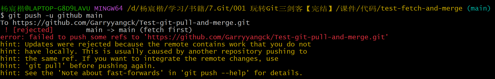
	>
	> 从提示中可以得知，==需要把远程仓库fetch下来和本地仓库merge，这样最新的commit会有两个parent – main 和 github/main==，==最新commit必须以远程仓库为parent才能完成push==。

4. ```bash
	git pull github main # 把远端的main fetch下来并和本地的main merge
	```

5. ```bash
	git fetch github main # 把远端的main拉取下来
	```

	> ```bash
	> remote: Enumerating objects: 5, done.
	> remote: Counting objects: 100% (5/5), done.
	> remote: Compressing objects: 100% (5/5), done.
	> remote: Total 5 (delta 0), reused 0 (delta 0), pack-reused 0
	> Unpacking objects: 100% (5/5), 1.81 KiB | 264.00 KiB/s, done.
	> From https://github.com/Garryyangck/Test-git-pull-and-merge
	>  * branch            main       -> FETCH_HEAD
	>  * [new branch]      main       -> github/main
	> ```
	>
	> 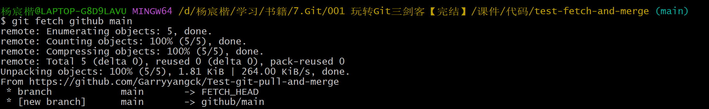
	>
	> ---
	>
	> 可以看到==多了一个远端的分支==。
	>
	> 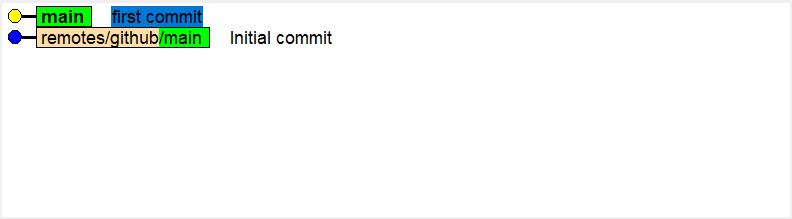
	>
	> ---
	>
	> 可以看到==fetch之后出现了一个远端分支==，但注意==它们不是相连的，而是独立的树==。
	>
	> 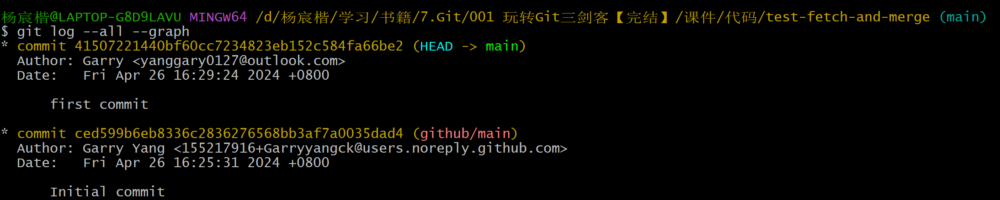

6. ```bash
	git merge github/main # 将当前HEAD所在的main分支和fetch下来的github/main进行merge
	```

	> 报错：==不能将两个不在同一树上的分支进行merge==
	>
	> 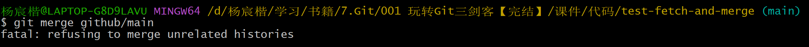
	>
	> ---
	>
	> ```bash
	> git merge --allow-unrelated-histories  github/main # 允许merge不在同一树上的分支
	> ```
	>
	> 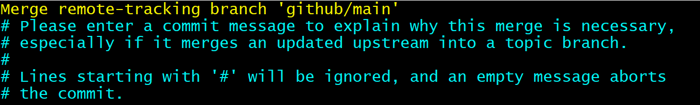
	>
	> ---
	>
	> ==本地的main和远端的main完成merge==，==新commit有README.md, LICENSE, .gitignore==。
	>
	> 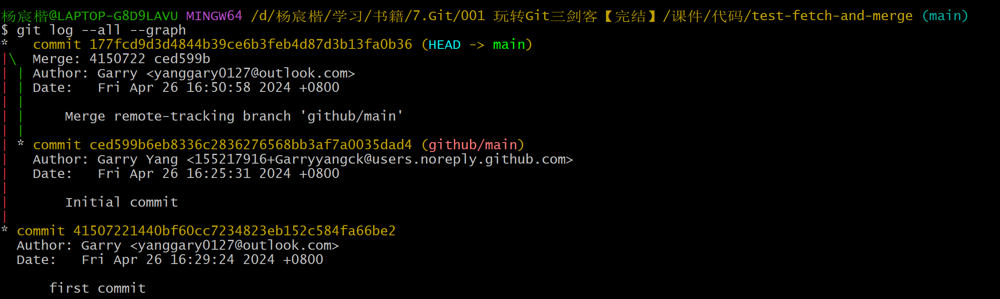

7. 重新进行push，成功。

	> ```bash
	> git push --set-upstream github main
	> ```
	>
	> 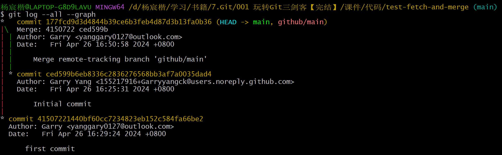

8. 同时也把git-learning那个网页push上去了

	> 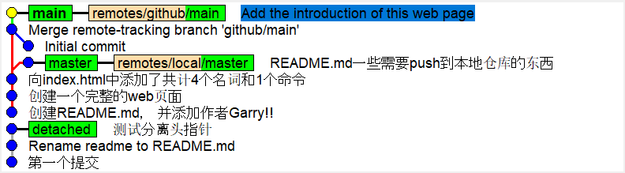

---


## 34.不同人修改不同文件

1. ```bash
	git fetch github # 把远端他人的修改fetch下来
	git merge <他人修改的分支> # 把他人修改的分支和自己的分支合并，由于是不同文件，因此很顺利
	# 成功达成fast-forwards之后，很顺利就能push
	```

---


## 35.不同人修改相同文件的不同区域

1. ==他人在我提交之前进行提交，导致我提交的时候远端发现我的提交`none fast-forward`==。

	> 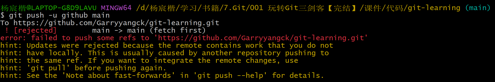

2. ==fetch之后可以看到他人提交的处于树的另一分支，这也解释我们为何不是`fast-forward`==。

	> 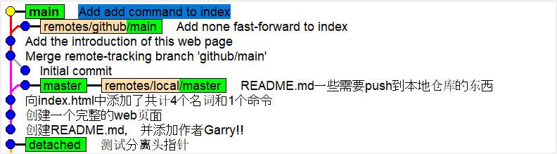

3. 使用merge进行合并，合并成功。

	> ```bash
	> git merge github/main
	> ```
	>
	> 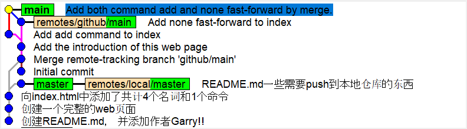
	>
	> ---
	>
	> 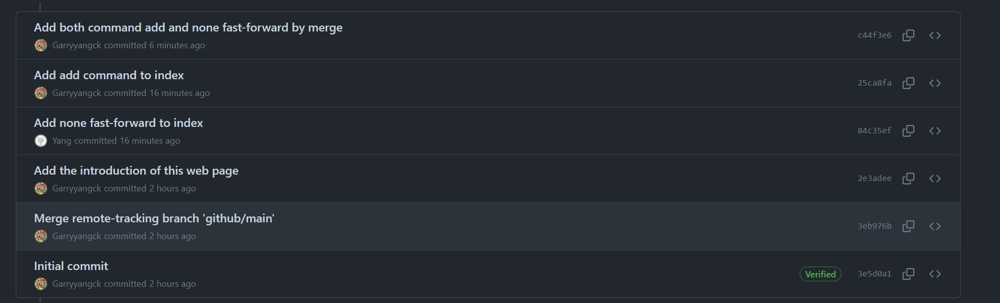

---


## 36.不同人修改相同文件的相同区域

1. ==第二个人提交时发生了合并冲突==。

	> 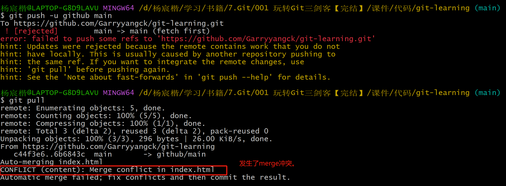

2. ```bash
	vim index.html # 手动解决冲突
	```

3. 完成之后：

	> 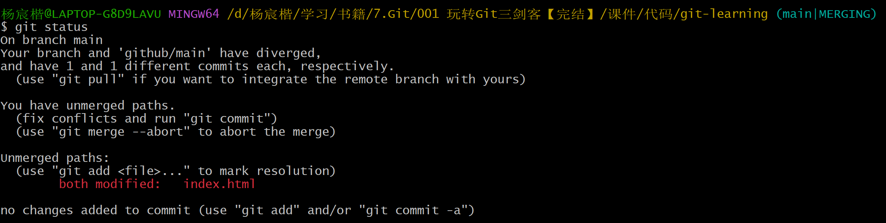
	>
	> 直接commit，示意完成冲突修复：
	>
	> ```bash
	> git commit -am'xxx'
	> ```
	>
	> ---
	>
	> 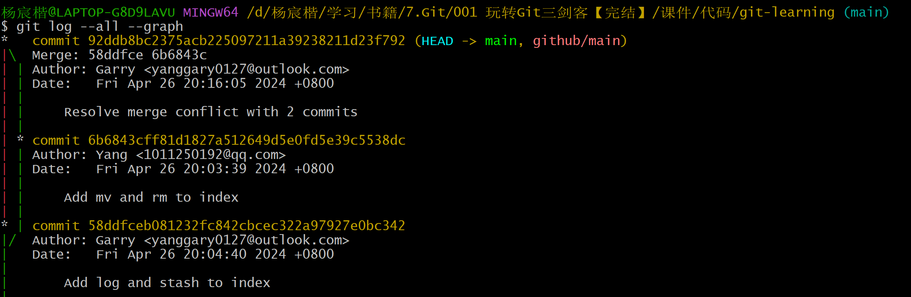

---


## 37.一个人变更文件名另一人文件内容

1. 变更文件名的先提交，后面变更内容的人直接

	```bash
	git pull
	```

	==git就直接帮我们同时变更文件名和内容了，不会冲突==。

---


## 38.多人修改同一文件的文件名

1. ==git直接创建两个内容相同，文件名不同的文件，让我们自行决定保留==。

	> 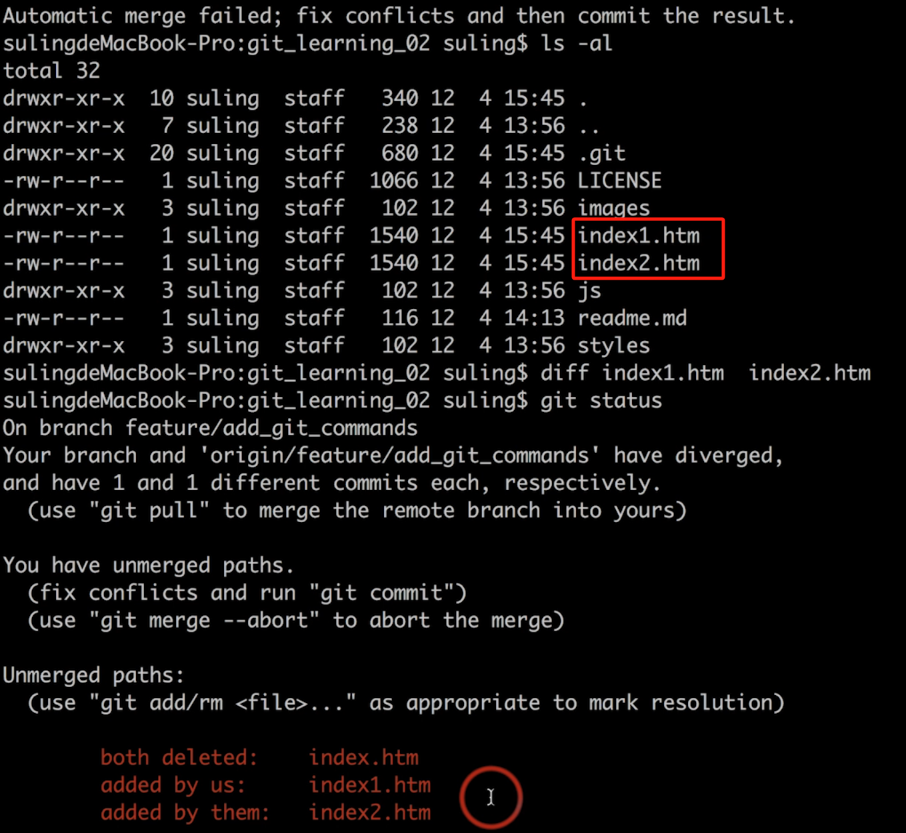

---


## 39.禁止对集成分支 push -f

1. ==比如你`reset --hard`到一个老版本，再`push -f`，就把远端这之间所有变更干没了==。

----


## 40.禁止对集成分支 rebase

1. 一定不能改变集成分支的历史，否则可能导致rebase生成一个新分叉，然后其它人的HEAD和你rebase出来并push到远端的新分叉不在一个子树上，无法push。

	> 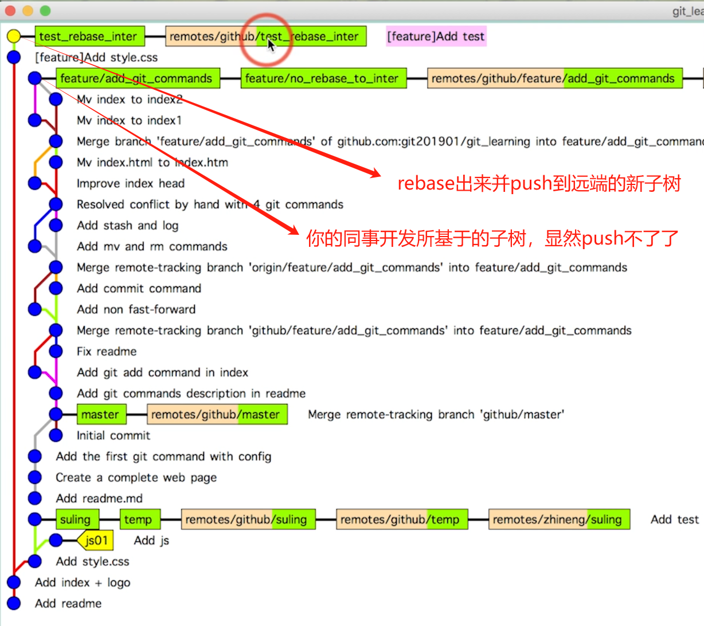

---


## 43.Github怎么搜项目

1. https://docs.github.com/en/search-github/searching-on-github/searching-for-repositories【官方】
2. `in:readme`，`stars:>100`，`filename:xxx`，`'xxx'+'yyy'`。
3. `'BIT' + '北理工' + '资料' in:readme stars:>10`

---


