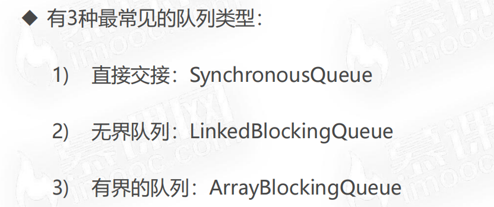
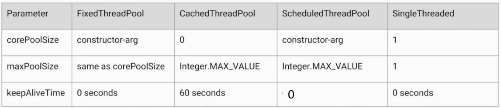
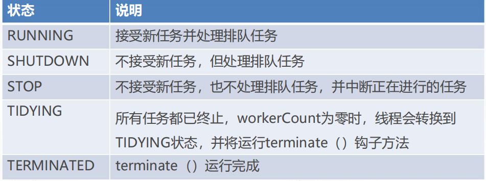

### 1.初始线程池

1. for循环中直接new1000个线程，这样开销太大（==每一个java线程直接对应操作系统的一个线程==），我们希望有==固定数量的线程，来执行这1000个线程==，这样就==避免了反复创建并销毁线程所带来的开销问题==。
2. 使用==线程池的好处==：
	1. 响应速度加快，因为节省了反复创建和销毁线程带来的事件开销。
	2. 合理分配CPU和内存。
	3. 统一管理线程。

---


### 2.线程增减的好处

1. ==线程池的参数==：

	> 

2. ==线程添加的规则==：

	> 1. 如果==线程数小于corePoolsize==，即使==其他已创建的线程处于空闲状态，也会创建一个新线程==来运行新任务。
	> 2. 如果线程数==等于(或大于)corePoolSize但少干maximumPoolSize==，任务==放入队列==(workQueue)。
	> 3. 如果==队列已满==，并且线程数==小于maxPoolSize==，则==创建一个新线程==来运行任务。
	> 4. 如果队列已满，并且==线程数大于或等于maxPoolSize==，则==拒绝==该任务。
	>
	> 

3. ==例子==：

	> 

4. 通过设置==corePoolSize和maximumPoolSize 相同，就可以创建固定大小的线程池==。

	> 社区项目里就是设置的两个值相同，意思是线程数不会超过这个值，队列满了没有扩展的空间。

---


### 3.线程存活时间和工作队列

1. 线程数多于corePoolSize，那么如果**多余的线程空闲时间超过keepAliveTime，它们就会被终止**。

2. **工作队列**：

	> 

---


### 4.自动创建线程池的风险

1. ```java
	public class FixedThreadPoolOOM {
	    public static void main(String[] args) {
	        ExecutorService executorService = Executors.newFixedThreadPool(1);
	        for (int i = 0; i < Integer.MAX_VALUE; i++) {
	            executorService.execute(new Task()); // 一直往无界队列里塞任务，最后填满分配的内存空间，导致OOM
	        }
	    }
	
	    static class Task implements Runnable {
	        @Override
	        public void run() { // 一直sleep，无法及时完成任务
	            try {
	                Thread.sleep(Long.MAX_VALUE);
	            } catch (InterruptedException e) {
	                e.printStackTrace();
	            }
	        }
	    }
	}
	```

---


### 5.常见线程池的用法演示

1. **SingleThreadPool**：线程数为1的线程池。

2. **CacheThreadPool**：线程数上限无限大，且任务队列为直接交接队列，也存在OOM风险。

3. **ScheduledThreadPool**：

	```java
	public static void main(String[] args) {
	    ScheduledExecutorService pool = Executors.newScheduledThreadPool(5);
	    pool.schedule(new Task(), 1, TimeUnit.SECONDS);
	    pool.scheduleAtFixedRate(new Task(), 1, 3, TimeUnit.SECONDS);
	    pool.shutdown();
	}
	```

---


### 6.几种线程池的对比

1. > 

---


### 7.正确关闭线程池

1. **shutdown**：**拒绝之后的执行请求**，但是当前**没有执行完的线程和任务队列中剩余的任务依旧继续执行**。

2. **isShutdown**：判断当前**线程是否已经shutdown**。

3. **isTerminated**：判断当前线程已经shutdown且**所有任务是否已经完成**。

4. **awaitTermination**：检测线程池在**指定时间内是否terminated**。

5. **shutdownNow**：**正在被线程执行的任务被interrupted，返回队列中的任务**。

	```java
	public class Shutdown {
	    public static void main(String[] args) throws InterruptedException {
	        ExecutorService threadPool = Executors.newFixedThreadPool(10);
	        for (int i = 0; i < 1000; i++) {
	            threadPool.execute(new Shutdown.Task());
	        }
	        Thread.sleep(2000);
	        // 返回队列中的任务
	        List<Runnable> unExecutedTaskList = threadPool.shutdownNow();
	        for (Runnable runnable : unExecutedTaskList) {
	            System.out.println(runnable);
	        }
	    }
	
	    static class Task implements Runnable {
	
	        @Override
	        public void run() {
	            try {
	                Thread.sleep(500);
	                System.out.println(Thread.currentThread());
	            } catch (InterruptedException e) {
	                System.out.println(Thread.currentThread() + " is interrupted!");
	            }
	        }
	    }
	}
	
	Thread[pool-1-thread-2,5,main]
	Thread[pool-1-thread-10,5,main]
	Thread[pool-1-thread-8,5,main]
	Thread[pool-1-thread-1,5,main]
	Thread[pool-1-thread-4,5,main]
	Thread[pool-1-thread-5,5,main]
	Thread[pool-1-thread-9,5,main]
	Thread[pool-1-thread-3,5,main]
	Thread[pool-1-thread-6,5,main]
	Thread[pool-1-thread-7,5,main]
	Thread[pool-1-thread-9,5,main]
	Thread[pool-1-thread-2,5,main]
	Thread[pool-1-thread-8,5,main]
	Thread[pool-1-thread-10,5,main]
	Thread[pool-1-thread-7,5,main]
	Thread[pool-1-thread-5,5,main]
	Thread[pool-1-thread-3,5,main]
	Thread[pool-1-thread-6,5,main]
	Thread[pool-1-thread-1,5,main]
	Thread[pool-1-thread-4,5,main]
	Thread[pool-1-thread-7,5,main]
	Thread[pool-1-thread-1,5,main]
	Thread[pool-1-thread-10,5,main]
	Thread[pool-1-thread-2,5,main]
	Thread[pool-1-thread-5,5,main]
	Thread[pool-1-thread-6,5,main]
	Thread[pool-1-thread-9,5,main]
	Thread[pool-1-thread-8,5,main]
	Thread[pool-1-thread-3,5,main]
	Thread[pool-1-thread-4,5,main]
	Thread[pool-1-thread-7,5,main] is interrupted! // 正在被线程执行的任务被interrupted
	Thread[pool-1-thread-9,5,main] is interrupted!
	Thread[pool-1-thread-8,5,main] is interrupted!
	Thread[pool-1-thread-2,5,main] is interrupted!
	Thread[pool-1-thread-5,5,main] is interrupted!
	Thread[pool-1-thread-6,5,main] is interrupted!
	Thread[pool-1-thread-10,5,main] is interrupted!
	Thread[pool-1-thread-4,5,main] is interrupted!
	Thread[pool-1-thread-1,5,main] is interrupted!
	Thread[pool-1-thread-3,5,main] is interrupted!
	garry.threadpool.Shutdown$Task@29453f44
	garry.threadpool.Shutdown$Task@5cad8086
	garry.threadpool.Shutdown$Task@6e0be858
	garry.threadpool.Shutdown$Task@61bbe9ba
	garry.threadpool.Shutdown$Task@610455d6
	garry.threadpool.Shutdown$Task@511d50c0
	garry.threadpool.Shutdown$Task@60e53b93
	...
	```

---


### 8.暂停和恢复线程池

**自定义**线程池，使用**钩子方法**pause和resume**实现线程池的暂停和恢复**。

```java
public class PauseableThreadPool extends ThreadPoolExecutor {

    private boolean isPaused;

    private final ReentrantLock lock = new ReentrantLock();

    // 和当前的锁绑定
    private final Condition unpaused = lock.newCondition();

    /*
        子类的构造函数必须要调用父类的构造函数才能完成父类的构造
     */
    public PauseableThreadPool(int corePoolSize, int maximumPoolSize, long keepAliveTime, TimeUnit unit, BlockingQueue<Runnable> workQueue) {
        super(corePoolSize, maximumPoolSize, keepAliveTime, unit, workQueue);
    }

    public PauseableThreadPool(int corePoolSize, int maximumPoolSize, long keepAliveTime, TimeUnit unit, BlockingQueue<Runnable> workQueue, ThreadFactory threadFactory) {
        super(corePoolSize, maximumPoolSize, keepAliveTime, unit, workQueue, threadFactory);
    }

    public PauseableThreadPool(int corePoolSize, int maximumPoolSize, long keepAliveTime, TimeUnit unit, BlockingQueue<Runnable> workQueue, RejectedExecutionHandler handler) {
        super(corePoolSize, maximumPoolSize, keepAliveTime, unit, workQueue, handler);
    }

    public PauseableThreadPool(int corePoolSize, int maximumPoolSize, long keepAliveTime, TimeUnit unit, BlockingQueue<Runnable> workQueue, ThreadFactory threadFactory, RejectedExecutionHandler handler) {
        super(corePoolSize, maximumPoolSize, keepAliveTime, unit, workQueue, threadFactory, handler);
    }

    /**
     * 在任务执行前判断当前线程是否处于暂停状态
     */
    @Override
    protected void beforeExecute(Thread t, Runnable r) {
        super.beforeExecute(t, r);
        lock.lock();
        try {
            while (isPaused) {
                unpaused.await(); // 让当前的线程暂停，直到被重新激活
            }
        } catch (InterruptedException e) {
            e.printStackTrace();
        } finally {
            lock.unlock();
        }

    }

    /**
     * 让当前线程暂停
     */
    public void pause() {
        lock.lock();
        try {
            isPaused = true;
        } catch (Exception e) {
            lock.unlock();
        }
    }

    public void resume() {
        lock.lock();
        try {
            isPaused = false;
            unpaused.signal();
            unpaused.signalAll(); // 唤醒该Condition上全部的线程
        } catch (Exception e) {
            lock.unlock();
        }
    }

    public static void main(String[] args) throws InterruptedException {
        PauseableThreadPool threadPool = new PauseableThreadPool(10, 10, 0L, TimeUnit.SECONDS, new LinkedBlockingDeque<>());
        Runnable runnable = new Runnable() {
            @Override
            public void run() {
                System.out.println("我被执行");
                try {
                    Thread.sleep(10);
                } catch (InterruptedException e) {
                    e.printStackTrace();
                }
            }
        };
        for (int i = 0; i < 10000; i++) {
            threadPool.execute(runnable);
        }
        Thread.sleep(1500);
        threadPool.pause();
        System.out.println("线程池被暂停...");
        Thread.sleep(1500);
        threadPool.resume();
        System.out.println("线程池被恢复...");
    }
}
```

---


### 9.线程池实现复用的原因

1. > 

2. **线程池里的线程只被start一次**，之后它会一直**检测任务队列有没有新的任务**，**调用任务的run方法**。

---


### 10.线程池状态

1. > 

2. 