## Java 并发编程实战

### 1.可见性、原子性和有序性问题：并发编程Bug的源头

1. ==并发程序幕后的故事==

	> - ==核心矛盾一直存在，就是CPU、内存、I/O 设备的速度差异==。
	> - CPU 增加了==缓存==，以均衡==与内存的速度差异==；
	> - 操作系统增加了==进程、线程，以分时复用 CPU==，进而均衡 CPU 与 I/O 设备的速度差异；
	> - ==编译程序优化指令执行次序==，使得缓存能够得到更加合理地利用。

2. ==源头之一：缓存导致的可见性问题==

	> - 我们假设线程 A 和线程 B 同时开始执行，那么第一次==都会将 count=0 读到各自的 CPU 缓存里（已经破坏可见性了）==，执行完 count+=1 之后，各自 CPU 缓存里的值都是 1，==同时写入内存==后，我们会发现==内存中是 1，而不是我们期望的 2==。之后由于各自的 CPU 缓存里都有了 count 的值，两个线程都是基于 CPU 缓存里的 count 值来计算，所以导致最终 count 的值都是小于 20000 的。这就是缓存的==可见性问题==。

3. ==源头之二：线程切换带来的原子性问题==

	> - 操作系统允许某个进程执行一小段时间，例如 50 毫秒，==过了 50 毫秒操作系统就会重新选择一个进程来执行==（我们称为“任务切换”），这个 50 毫秒称为“==时间片==”。
	>
	> - ==线程切换示意图==：
	>
	> 	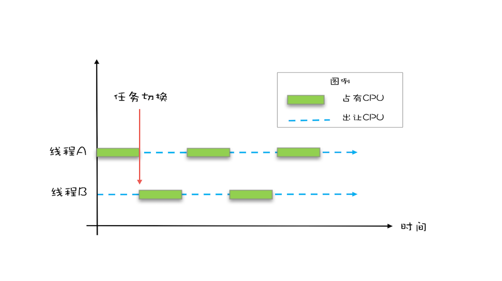
	>
	> - ==操作系统做任务切换，可以发生在任何一条 CPU 指令执行完==。
	>
	> - 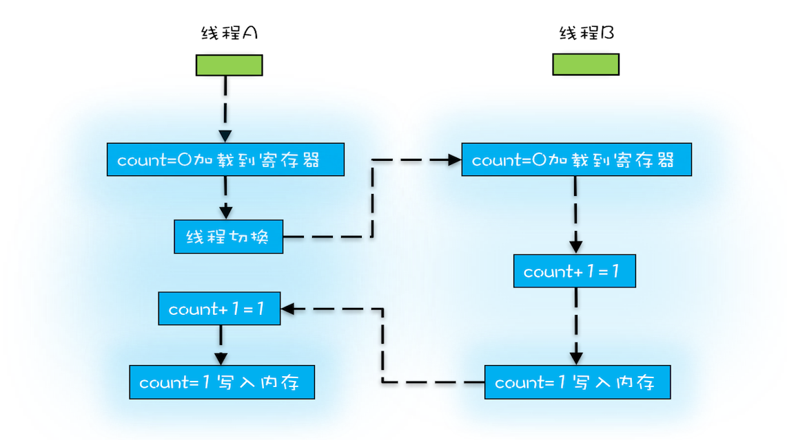
	>
	> - ==我们把一个或者多个操作在 CPU 执行的过程中不被中断的特性称为原子性==。

4. ==源头之三：编译优化带来的有序性问题==

	> - ==编译器为了优化性能，有时候会改变程序中语句的先后顺序==，例如程序中：“a=6；b=7；”编译器优化后可能变成“b=7；a=6；”，在这个例子中，编译器调整了语句的顺序，但是不影响程序的最终结果。不过==有时候编译器及解释器的优化可能导致意想不到的 Bug==。
	>
	> - ==例子==：
	>
	> 	- ```java
	> 		public class Singleton {
	> 		    static Singleton instance;
	> 		    static Singleton getInstance(){
	> 		        if (instance == null) {
	> 		            synchronized(Singleton.class) {
	> 		                if (instance == null)
	> 		                    instance = new Singleton();
	> 		            }
	> 		        }
	> 		        return instance;
	> 		    }
	> 		}
	> 		```
	>
	> 	- 我们以为的 new 操作应该是：
	>
	> 		1. 分配一块内存 M；
	> 		2. 在内存 M 上初始化 Singleton 对象；
	> 		3. 然后 M 的地址赋值给 instance 变量。
	>
	> 	- 但是实际上优化后的执行路径却是这样的：
	>
	> 		1. 分配一块内存 M；
	> 		2. 将 M 的地址赋值给 instance 变量；
	> 		3. 最后在内存 M 上初始化 Singleton 对象。
	>
	> 	- 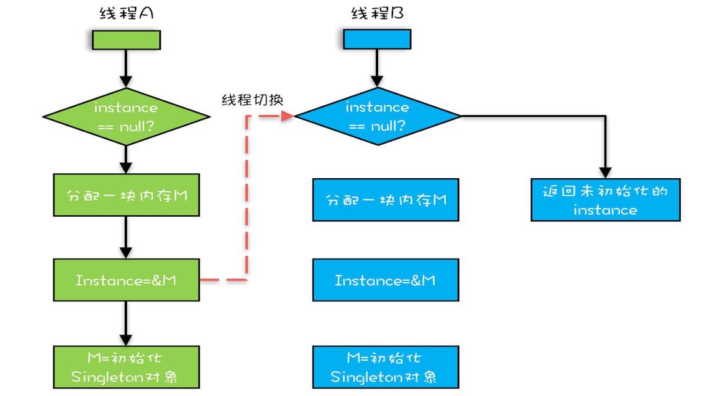
	>
	> 	- 当执行完指令 2 时恰好发生了线程切换，切换到了线程 B 上；如果此时线程 B 也执行 getInstance() 方法，那么==线程 B 在执行第一个判断时会发现 instance != null ，所以直接返回 instance，而此时的 instance 是没有初始化过的==，如果我们这个时候访问 instance 的成员变量就可能触发==空指针异常==。

5. 在介绍可见性、原子性、有序性的时候，特意提到==缓存导致的可见性问题==，==线程切换带来的原子性问题==，==编译优化带来的有序性问题==，其实缓存、线程、编译优化的目的和我们写并发程序的目的是相同的，都是提高程序性能。

---


### 2.Java内存模型：看Java如何解决可见性和有序性问题

1. ==什么是 Java 内存模型？==

	> - Java 内存模型规范了 JVM ==如何提供按需禁用缓存和编译优化的方法== 。具体来说，这些方法包括 ==volatile==、==synchronized== 和 ==final== 三个关键字，以及六项 ==Happens-Before 规则==，这也正是本期的重点内容。

2. ==使用 volatile 的困惑==

	> - volatile 关键字并不是 Java 语言的特产，C 语言里也有，它最原始的意义就是==禁用 CPU 缓存==。

3. ==Happens-Before 规则==

	> - Happens-Before 真正要表达的是：==前面一个操作的结果对后续操作是可见的==。
	>
	> - ==Happens-Before 约束了编译器的优化行为==，虽允许编译器优化，但是==要求编译器优化后一定遵守 Happens-Before 规则==。
	>
	> - ==Happens-Before 的六项规则==：
	>
	> 	1. ==程序的顺序性规则==
	>
	> 		- 程序==前面对某个变量的修改一定是对后续操作可见的==。
	>
	> 	2. ==volatile 变量规则==
	>
	> 		- 对一个 volatile 变量的写操作， Happens-Before 于后续对这个 volatile 变量的读操作。
	>
	> 	3. ==传递性==
	>
	> 		- 如果 A Happens-Before B，且 B Happens-Before C，那么 A Happens-Before C。
	>
	> 		- 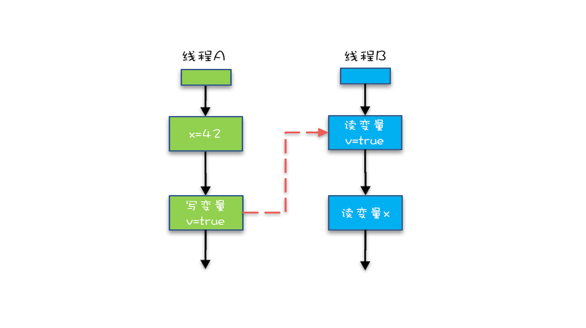
	>
	> 		- “x=42” Happens-Before 写变量 “v=true” ，这是规则 1 的内容；
	>
	> 			写变量“v=true” Happens-Before 读变量 “v=true”，这是规则 2 的内容 。
	>
	> 			==如果线程 B 读到了“v=true”，那么线程 A 设置的“x=42”对线程 B 是可见的==。也就是说，==线程 B 能看到 “x = 42==” ，有没有一种恍然大悟的感觉？这就是 1.5 版本==对 volatile 语义的增强==，这个增强意义重大，1.5 版本的并发工具包（java.util.concurrent）就是靠 volatile 语义来搞定可见性的。
	>
	> 	4. ==管程中锁的规则==
	>
	> 		- 这条规则是指==对一个锁的解锁 Happens-Before 于后续对这个锁的加锁==。
	> 		- ==管程==是一种通用的同步原语，==在 Java 中指的就是 synchronized，synchronized 是 Java 里对管程的实现==。
	>
	> 	5. ==线程 start() 规则==
	>
	> 		- 这条是关于线程启动的。它是指==主线程 A 启动子线程 B 后，子线程 B 能够看到主线程 A 在启动子线程 B 前的操作==。
	>
	> 		- ```java
	> 			Thread B = new Thread(()->{
	> 			  // 主线程调用B.start()之前
	> 			  // 所有对共享变量的修改，此处皆可见
	> 			  // 此例中，var==77
	> 			});
	> 			// 此处对共享变量var修改
	> 			var = 77;
	> 			// 主线程启动子线程
	> 			B.start();
	> 			```
	>
	> 	6. ==线程 join() 规则==
	>
	> 		- 如果在==线程 A 中，调用线程 B 的 join() 并成功返回，那么线程 B 中的任意操作 Happens-Before 于该 join() 操作的返回==。
	>
	> 		- ```java
	> 			Thread B = new Thread(()->{
	> 			  // 此处对共享变量var修改
	> 			  var = 66;
	> 			});
	> 			// 例如此处对共享变量修改，
	> 			// 则这个修改结果对线程B可见
	> 			// 主线程启动子线程
	> 			B.start();
	> 			B.join()
	> 			// 子线程所有对共享变量的修改
	> 			// 在主线程调用B.join()之后皆可见
	> 			// 此例中，var==66
	> 			```

4. ==被我们忽视的 final==

	> - ==final 修饰变量时，初衷是告诉编译器：这个变量生而不变，可以可劲儿优化==。
	>
	> - 在 1.5 以后 Java 内存模型对 final 类型变量的重排进行了约束。现在==只要我们提供正确构造函数没有“逸出”，就不会出问题==了。
	>
	> 	“逸出”有点抽象，我们还是举个例子吧，在下面例子中，在构造函数里面将 this 赋值给了全局变量 global.obj，这就是“逸出”，线程==通过 global.obj 读取 x 是有可能读到 0 的（编译优化把`global.obj = this;`优化到最前面）==。因此我们一定要避免“逸出”。
	>
	> 	```java
	> 	// 以下代码来源于【参考1】
	> 	final int x;
	> 	// 错误的构造函数
	> 	public FinalFieldExample() { 
	> 	  x = 3;
	> 	  y = 4;
	> 	  // 此处就是讲this逸出，
	> 	  global.obj = this;
	> 	}
	> 	```

5. ==Happens-Before 的语义本质上是一种可见性，A Happens-Before B 意味着 A 事件对 B 事件来说是可见的，无论 A 事件和 B 事件是否发生在同一个线程里==。例如 A 事件发生在线程 1 上，B 事件发生在线程 2 上，Happens-Before 规则保证线程 2 上也能看到 A 事件的发生。

---


### 3.互斥锁（上）：解决原子性问题

1. ==Java 语言提供的锁技术：synchronized==

	> - 我们把一段需要互斥执行的代码称为==临界区==。
	> - 当修饰==静态方法的时候，锁定的是当前类的 Class 对象==，在上面的例子中就是 Class X；
	> - 当修饰==非静态方法的时候，锁定的是当前实例对象 this==。

2. ==锁和受保护资源的关系==

	> - ==受保护资源和锁之间的关联关系是 N:1 的关系==。
	>
	> - ```java
	> 	class SafeCalc {
	> 	    long value = 0L;
	> 	    synchronized long get() {
	> 	        return value;
	> 	    }
	> 	    synchronized void addOne() {
	> 	        value += 1;
	> 	    }
	> 	}
	> 	```
	>
	> 	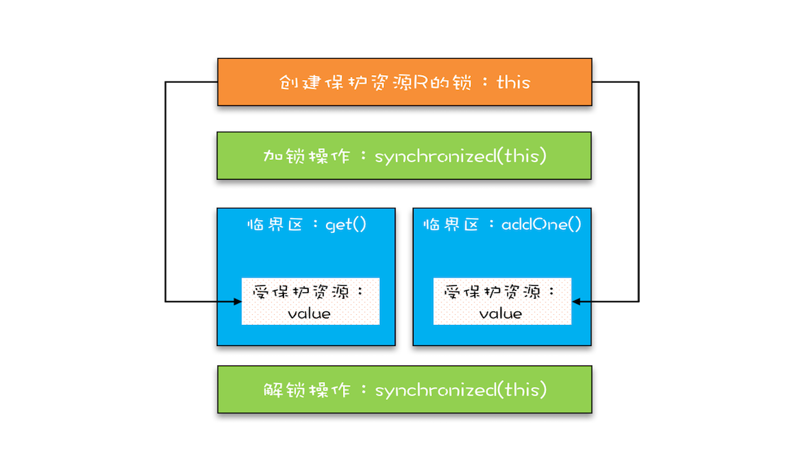
	>
	> - ==如果把 addOne 改为 static 方法，那么就会导致并发问题==：
	>
	> 	```java
	> 	class SafeCalc {
	> 	    static long value = 0L;
	> 	    synchronized long get() {
	> 	        return value;
	> 	    }
	> 	    synchronized static void addOne() {
	> 	        value += 1;
	> 	    }
	> 	}
	> 	```
	>
	> 	如果你仔细观察，就会发现改动后的代码是==用两个锁保护一个资源==。这个受保护的资源就是静态变量 value，两个锁分别是 this 和 SafeCalc.class。我们可以用下面这幅图来形象描述这个关系。
	>
	> 	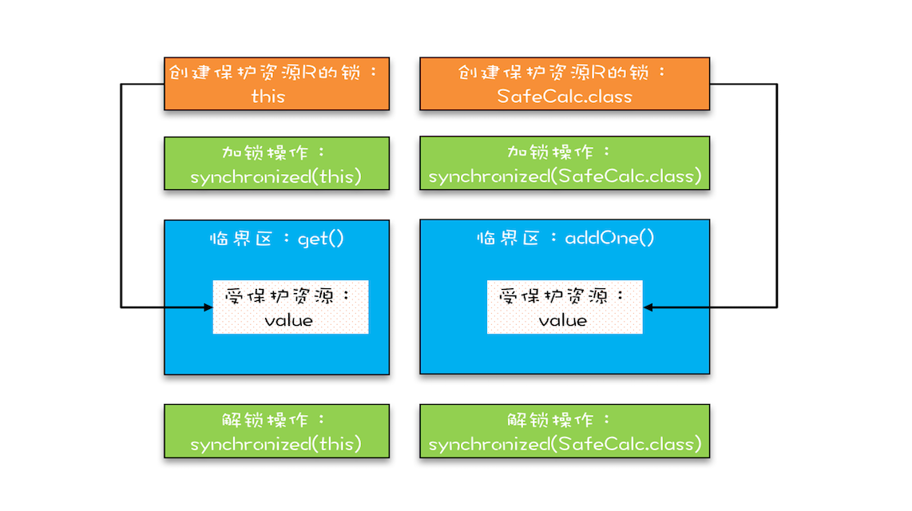
	>
	> 	由于临界区 get() 和 addOne() 是用两个锁保护的，因此==这两个临界区没有互斥关系==，==临界区 addOne() 对 value 的修改对临界区 get() 也没有可见性保证，这就导致并发问题==了。
	>
	> - ==可以用一把锁来保护多个资源，但是不能用多把锁来保护一个资源==。

---


### 4.互斥锁（下）：如何用一把锁保护多个资源？

1. ==保护没有关联关系的多个资源==

	> - 我们用两把锁，取款和修改密码是可以并行的。==用不同的锁对受保护资源进行精细化管理，能够提升性能==。这种锁还有个名字，叫==细粒度锁==。

2. ==保护有关联关系的多个资源==

	> - ```java
	> 	class Account {
	> 	    private int balance;
	> 	    // 转账
	> 	    synchronized void transfer(Account target, int amt) {
	> 	        if (this.balance > amt) {
	> 	            this.balance -= amt;
	> 	            target.balance += amt;
	> 	        }
	> 	    } 
	> 	}
	> 	```
	> 	
	>- 假设线程 1 执行账户 A 转账户 B 的操作，线程 2 执行账户 B 转账户 C 的操作。这两个线程分别在两颗 CPU 上同时执行，那它们是互斥的吗？我们期望是，但实际上并不是。
	> 
	>- 最终账户 B 的余额可能是 300（线程 1 后于线程 2 写 B.balance，线程 2 写的 B.balance 值被线程 1 覆盖），可能是 100（线程 1 先于线程 2 写 B.balance，线程 1 写的 B.balance 值被线程 2 覆盖），就是不可能是 200。
	> 
	>- 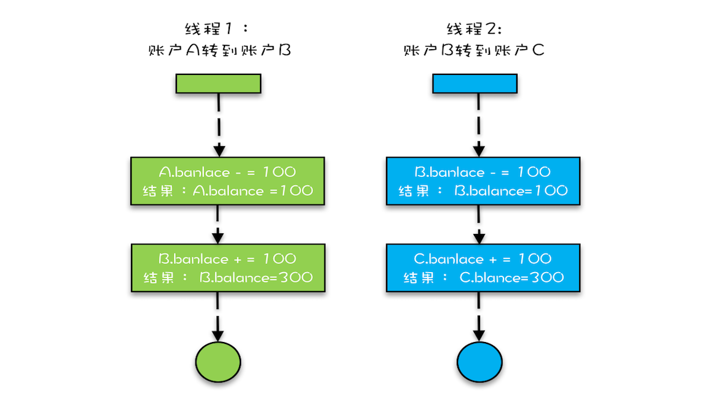
	
3. ==使用锁的正确姿势==

	> - 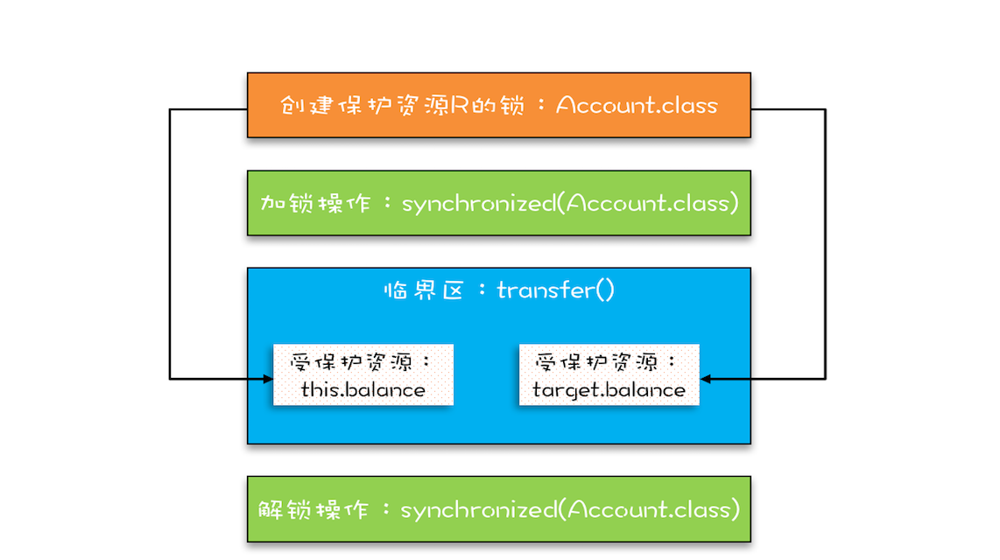
	> - 锁 Account.class

---


### 5.一不小心就死锁了，怎么办？

1. ==向现实世界要答案==

  > - 用两把锁就实现了，转出账本一把，转入账本另一把。在 transfer() 方法内部，我们首先尝试锁定转出账户 this（先把转出账本拿到手），然后尝试锁定转入账户 target（再把转入账本拿到手），==只有当两把锁都获取时，才执行转账操作==。这个逻辑可以图形化为下图这个样子。
  > - 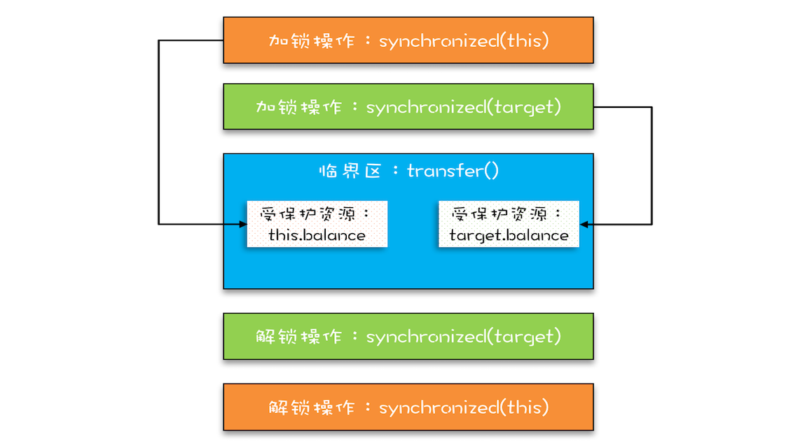

2. ==没有免费的午餐==

	> - ==使用细粒度锁是有代价的，这个代价就是可能会导致死锁==。
	> - ==死锁==的一个比较专业的定义是：==一组互相竞争资源的线程因互相等待，导致“永久”阻塞的现象==。

3. ==如何预防死锁==

	> - ==只有以下这四个条件都发生时才会出现死锁==：
	> 	1. ==资源互斥==，共享资源 X 和 Y 只能被一个线程占用；
	> 	2. ==占有且等待==，线程 T1 已经取得共享资源 X，在等待共享资源 Y 的时候，不释放共享资源 X；
	> 	3. ==不可抢占==，其他线程不能强行抢占线程 T1 占有的资源；
	> 	4. ==循环等待==，线程 T1 等待线程 T2 占有的资源，线程 T2 等待线程 T1 占有的资源。

4. ==破坏占用且等待条件==

	> - 要破坏这个条件，可以==一次性申请所有资源==。
	> - “==同时申请多个资源”这个操作是一个临界区，我们也需要一个角色（Java 里面的类）来管理这个临界区，我们就把这个角色定为 Allocator==。它有两个重要功能，分别是：==同时申请资源 apply() 和同时释放资源 free()==。

5. ==破坏不可抢占条件==

	> - 核心是要能够==主动释放它占有的资源==，这一点 ==synchronized 是做不到的==。原因是 ==synchronized 申请资源的时候，如果申请不到，线程直接进入阻塞状态==了，而==线程进入阻塞状态，啥都干不了，也释放不了线程已经占有的资源==。
	> - 但是 ==java.util.concurrent 这个包下面提供的 Lock 是可以轻松解决这个问题==。

6. ==破坏循环等待条件==

	> - ==对资源进行排序，然后按序申请资源==。
	>
	> - 比如按照账户的 id 大小排序，由小到大的顺序依次锁定账户，==这样两个账户争夺时都会优先争夺较小的账户，得不到则阻塞，得到了就可以依次得到其它所有锁==。
	>
	> - ```java
	> 	class Account {
	> 	    private int id;
	> 	    private int balance;
	> 	    // 转账
	> 	    void transfer(Account target, int amt){
	> 	        Account left = this        
	> 	            Account right = target;    
	> 	        if (this.id > target.id) { // 排序
	> 	            left = target;           
	> 	            right = this;            
	> 	        }                          
	> 	        // 优先争夺较小的账户
	> 	        synchronized(left){
	> 	            // 得到了就可以依次得到其它所有锁
	> 	            synchronized(right){ 
	> 	                if (this.balance > amt){
	> 	                    this.balance -= amt;
	> 	                    target.balance += amt;
	> 	                }
	> 	            }
	> 	        }
	> 	    } 
	> 	}
	> 	```

7. ==用细粒度锁来锁定多个资源时，要注意死锁的问题==。

---


### 6.用“等待-通知”机制优化循环等待

1. 如果 ==apply() 同时申请转入和转出账户操作耗时长，或者并发冲突量大==的时候，==没有申请到就while循环申请就不适用==了，因为在这种场景下，==可能要循环上万次才能获取到锁，太消耗 CPU 了==。

2. 最好的方案应该是：如果线程要求的条件（转出账本和转入账本同在文件架上）不满足，则==线程阻塞自己，进入等待状态==；当线程要求的条件（转出账本和转入账本同在文件架上）满足后，==通知==等待的线程重新执行。

3. ==完美的就医流程==

	> - ==完整的等待 – 通知机制：线程首先获取互斥锁，当线程要求的条件不满足时，释放互斥锁，进入等待状态；当要求的条件满足时，通知等待的线程，重新获取互斥锁==。

4. ==用 synchronized 实现等待 – 通知机制==

	> - ==Java 语言内置的 synchronized 配合 wait()、notify()、notifyAll() 这三个方法可以快速实现这种机制==。
	> - 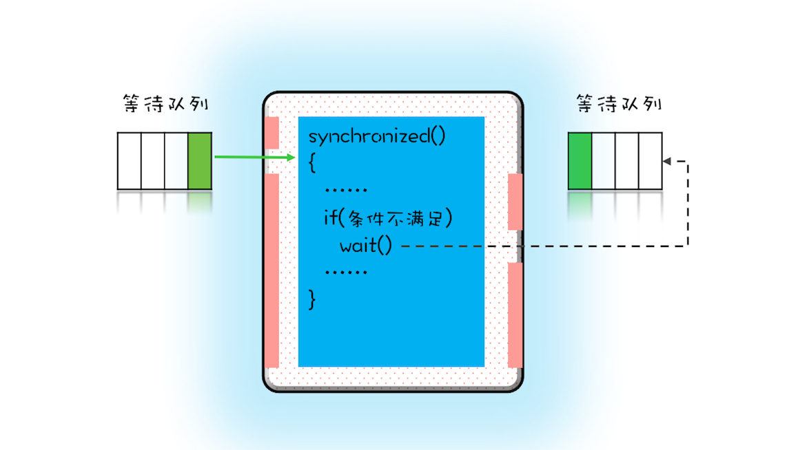
	> - ==调用 wait() 方法后，当前线程就会被阻塞，并且进入到右边的等待队列==中，==这个等待队列也是互斥锁的等待队列==。 线程在进入等待队列的同时，==会释放持有的互斥锁==，线程释放锁后，==其他线程就有机会获得锁，并进入临界区==了。
	> - 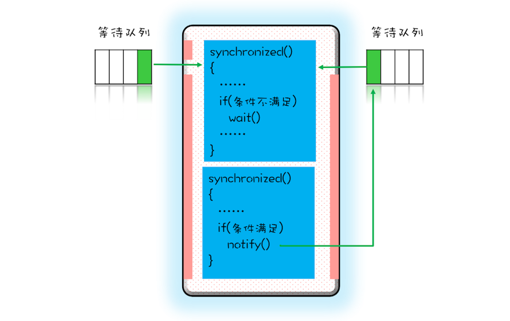
	> - 当条件满足时调用 notify()，会通知等待队列（==互斥锁的等待队列==）中的线程，告诉它==条件曾经满足过==。因为 ==notify() 只能保证在通知时间点，条件是满足的==。而被通知线程的==执行时间点和通知的时间点基本上不会重合==，所以==当线程执行的时候，很可能条件已经不满足了（如有其他线程插队==）。
	> - ==被通知的线程要想重新执行，仍然需要获取到互斥锁==（曾经获取的锁在调用 wait() 时释放了）。
	> - 所以如果 synchronized 锁定的是 this，那么对应的一定是 this.wait()、this.notify()、this.notifyAll()；==如果 synchronized 锁定的是 target，那么对应的一定是 target.wait()、target.notify()、target.notifyAll() ==。

5. ==小试牛刀：一个更好地资源分配器==

	> - 上面提到的==账户转入转出问题==：
	>
	> 	1. 互斥锁：上一篇文章我们提到 Allocator 需要是单例的，所以我们可以用 this 作为互斥锁。
	> 	2. ==线程要求的条件：转出账户和转入账户都没有被分配过==。
	> 	3. 何时等待：线程要求的条件不满足就等待。
	> 	4. ==何时通知：当有线程释放账户时就通知==。
	>
	> - ```java
	> 	class Allocator {
	> 	    private List<Object> als;
	> 	    // 一次性申请所有资源
	> 	    synchronized void apply(
	> 	        Object from, Object to){
	> 	        // 经典写法
	> 	        while(als.contains(from) ||
	> 	              als.contains(to)){
	> 	            try{
	> 	                wait();
	> 	            }catch(Exception e){
	> 	            }   
	> 	        } 
	> 	        als.add(from);
	> 	        als.add(to);  
	> 	    }
	> 	    // 归还资源
	> 	    synchronized void free(
	> 	        Object from, Object to){
	> 	        als.remove(from);
	> 	        als.remove(to);
	> 	        notifyAll();
	> 	    }
	> 	}
	> 	```

6. ==尽量使用 notifyAll()==

	> - ==notify() 是会随机地通知等待队列中的一个线程，而 notifyAll() 会通知等待队列中的所有线程==。
	> - ==使用 notify() 很有风险==，它的风险在于可能导致==某些线程永远不会被通知到==。
	> - 假设我们有资源 A、B、C、D，线程 1 申请到了 AB，线程 2 申请到了 CD，此时线程 3 申请 AB，会进入等待队列（AB 分配给线程 1，线程 3 要求的条件不满足），线程 4 申请 CD 也会进入等待队列。我们再假设之后线程 1 归还了资源 AB，==如果使用 notify() 来通知等待队列中的线程，有可能被通知的是线程 4，但线程 4 申请的是 CD，所以此时线程 4 还是会继续等待，而真正该唤醒的线程 3 就再也没有机会被唤醒了==。

---


### 7.安全性、活跃性以及性能问题

1. 并发编程中我们需要注意的问题有很多，很庆幸前人已经帮我们总结过了，主要有三个方面，分别是：==安全性问题、活跃性问题和性能问题==。

2. ==安全性问题==

	> - 当==多个线程同时访问同一数据，并且至少有一个线程会写这个数据==的时候，如果我们不采取防护措施，那么就会导致并发 Bug，对此还有一个专业的术语，叫做==数据竞争==（Data Race）。
	> - ==竞态条件，指的是程序的执行结果依赖线程执行的顺序==。在==并发环境里，线程的执行顺序是不确定的==，如果程序存在竞态条件问题，那就意味着程序执行的结果是不确定的。
	> - 解决方法：互斥加锁。

3. ==活跃性问题==

	> - 所谓==活跃性问题，指的是某个操作无法执行下去==。我们常见的“死锁”就是一种典型的活跃性问题，当然==除了死锁外，还有两种情况，分别是“活锁”和“饥饿”==。
	> - ==有时线程虽然没有发生阻塞，但仍然会存在执行不下去的情况，这就是所谓的“活锁”==。
	> - ==解决活锁的方案==很简单，==谦让时==，尝试==等待一个随机的时间==就可以了。
	> - ==所谓“饥饿”指的是线程因无法访问所需资源而无法执行下去的情况==。如果线程优先级“不均”，在 CPU 繁忙的情况下，优先级低的线程得到执行的机会很小，就可能发生线程“饥饿”；持有锁的线程，如果执行的时间过长，也可能导致“饥饿”问题。
	> - ==饥饿问题的方案很简单，有三种方案：一是保证资源充足，二是公平地分配资源，三就是避免持有锁的线程长时间执行==。这三个方案中，方案一和方案三的适用场景比较有限，因为很多场景下，资源的稀缺性是没办法解决的，持有锁的线程执行的时间也很难缩短。倒是==方案二的适用场景相对来说更多一些==。
	> - 那==如何公平地分配资源呢==？在并发编程里，主要是使用==公平锁==。所谓公平锁，是一种先来后到的方案，线程的等待是有顺序的，==排在等待队列前面的线程会优先获得资源==。

4. ==性能问题==

	> - ==“锁”的过度使用可能导致串行化的范围过大，这样就不能够发挥多线程的优势==了，而我们之所以使用多线程搞并发程序，为的就是提升性能。
	> - ==Java SDK 并发包里之所以有那么多东西，有很大一部分原因就是要提升在某个特定领域的性能==。
	> - ==解决使用锁导致并发性能下降问题的方案==：
	> 	1. 第一，既然使用锁会带来性能问题，那最好的方案自然就是==使用无锁的算法和数据结构==了。在这方面有很多相关的技术，例如线程本地存储 (==Thread Local== Storage, TLS)、==写入时复制 (Copy-on-write，Redis RDB fork 子进程时使用写时复制，使得执行快照时依然可以进行写操作)==、==乐观锁==等；Java ==并发包里面的原子类也是一种无锁的数据结构==；==Disruptor 则是一个无锁的内存队列==，性能都非常好……
	> 	2. 第二，==减少锁持有的时间==。==互斥锁本质上是将并行的程序串行化==，所以要增加并行度，一定要减少持有锁的时间。这个方案具体的实现技术也有很多，例如使用==细粒度的锁==，一个典型的例子就是 Java 并发包里的 ==ConcurrentHashMap，它使用了所谓分段锁的技术==（这个技术后面我们会详细介绍）；还可以使用==读写锁，也就是读是无锁的，只有写的时候才会互斥==。
	> - ==检验性能的三个指标==
	> 	1. ==吞吐量==：指的是==单位时间内能处理的请求数量==。吞吐量越高，说明性能越好。
	> 	2. ==延迟==：指的是从==发出请求到收到响应的时间==。延迟越小，说明性能越好。
	> 	3. ==并发量==：指的是能==同时处理的请求数量==，一般来说随着并发量的增加、延迟也会增加。所以延迟这个指标，一般都会是基于并发量来说的。例如并发量是 1000 的时候，延迟是 50 毫秒。

5. 并发编程是一个复杂的技术领域，==微观上涉及到原子性问题、可见性问题和有序性问题==，==宏观则表现为安全性、活跃性以及性能问题==。

---


### 8.管程：并发编程的万能钥匙

1. ==什么是管程==

	> - ==管程，指的是管理共享变量以及对共享变量的操作过程，让他们支持并发==。翻译为 ==Java 领域的语言，就是管理类的成员变量和成员方法，让这个类是线程安全的==。那管程是怎么管的呢？

2. ==MESA 模型==

	> - 管程是如何解决==互斥==问题的：
	>
	> 	- 管程解决互斥问题的思路很简单，就是将==共享变量及其对共享变量的操作统一封装起来==。
	> 	- 比如线程 A 和线程 B 如果想访问共享变量 queue，==只能通过调用管程提供的 enq()、deq() 方法来实现==。
	> 	- 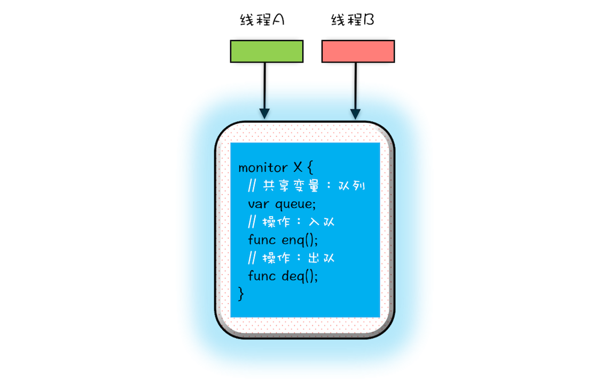
	>
	> - 管程如何解决线程间的==同步==问题：
	>
	> 	- 管程里还引入了条件变量的概念，而且==每个条件变量都对应有一个等待队列==。
	>
	> 	- 
	>
	> 	- ==条件变量==和==条件变量等待队列==的作用是什么呢？其实就是解决线程同步问题。
	>
	> 	- ==“阻塞队列不空”这个条件对于线程 T1 来说已经满足了，此时线程 T2 要通知 T1，告诉它需要的条件已经满足了。当线程 T1 得到通知后，会从等待队列==里面出来，但是出来之后不是马上执行，而是重新进入到==入口等待队列==里面。
	>
	> 	- 前面提到线程 ==T1 发现“阻塞队列不空”这个条件不满足，需要进到对应的等待队列里等待==。这个过程就是==通过调用 wait() 来实现==的。如果我们用对象 A 代表“阻塞队列不空”这个条件，那么线程 T1 需要调用 A.wait()。同理==当“阻塞队列不空”这个条件满足时，线程 T2 需要调用 A.notify() 来通知 A 等待队列中的一个线程==，此时这个等待队列里面只有线程 T1。至于 ==notifyAll() 这个方法，它可以通知等待队列中的所有线程==。
	>
	> 	- ==伪代码==：
	>
	> 		```java
	> 		public class BlockedQueue<T>{
	> 		    
	> 		    final Lock lock = new ReentrantLock();
	> 		    
	> 		    // 条件变量：队列不满  
	> 		    final Condition notFull = lock.newCondition();
	> 		    
	> 		    // 条件变量：队列不空  
	> 		    final Condition notEmpty = lock.newCondition();
	> 		    
	> 		    // 入队
	> 		    void enq(T x) {
	> 		        lock.lock();
	> 		        try {
	> 		            while (队列已满){
	> 		                // 等待队列不满 
	> 		                notFull.await();
	> 		            }  
	> 		            // 省略入队操作...
	> 		            // 入队后,通知可出队
	> 		            notEmpty.signal();
	> 		        }finally {
	> 		            lock.unlock();
	> 		        }
	> 		    }
	> 		    
	> 		    // 出队
	> 		    void deq(){
	> 		        lock.lock();
	> 		        try {
	> 		            while (队列已空){
	> 		                // 等待队列不空
	> 		                notEmpty.await();
	> 		            }
	> 		            // 省略出队操作...
	> 		            // 出队后，通知可入队
	> 		            notFull.signal();
	> 		        }finally {
	> 		            lock.unlock();
	> 		        }  
	> 		    }
	> 		}
	> 		```
	>
	> 	- ==await() 和前面提到的 wait() 语义是一样的；signal() 和前面提到的 notify() 语义是一样的==。

3. ==wait() 的正确姿势==

	> - 对于 MESA 管程来说，有一个编程范式，就是需要在一个 while 循环里面调用 wait()。==这个是 MESA 管程特有的==。
	>
	> 	```java
	> 	while(条件不满足) {
	> 	    wait();
	> 	}
	> 	```
	>
	> - ==Hasen 模型==里面，要求 ==notify() 放在代码的最后，这样 T2 通知完 T1 后，T2 就结束了，然后 T1 再执行==，这样就能保证同一时刻只有一个线程执行。
	>
	> - ==Hoare 模型==里面，==T2 通知完 T1 后，T2 阻塞，T1 马上执行；等 T1 执行完，再唤醒 T2==，也能保证同一时刻只有一个线程执行。但是相比 Hasen 模型，T2 多了一次阻塞唤醒操作。
	>
	> - ==MESA 管程==里面，==T2 通知完 T1 后，T2 还是会接着执行，T1 并不立即执行，仅仅是从条件变量的等待队列进到入口等待队列里面==。这样做的好处是 notify() 不用放到代码的最后，T2 也没有多余的阻塞唤醒操作。但是也有个副作用，就是==当 T1 再次执行的时候，可能曾经满足的条件，现在已经不满足了，所以需要以循环方式检验条件变量==。

4. ==notify() 何时可以使用==

	> - ==除非经过深思熟虑，否则尽量使用 notifyAll()==。那==什么时候可以使用 notify() 呢？需要满足以下三个条件==：
	> 	1. 所有等待线程==拥有相同的等待条件==；
	> 	2. 所有等待线程==被唤醒后，执行相同的操作==；
	> 	3. ==只需要唤醒一个线程==。

5. ==小结==：

	> - ==管程==是一个解决并发问题的==模型==，你可以参考医院就医的流程来加深理解。理解这个模型的重点在于理解==条件变量==及其==等待队列==的工作原理。
	> - ==Java 参考了 MESA 模型，语言内置的管程（synchronized==）对 MESA 模型进行了精简。==MESA 模型中，条件变量可以有多个==，==Java 语言内置的管程（synchronized）里只有一个条件变量==。
	> - 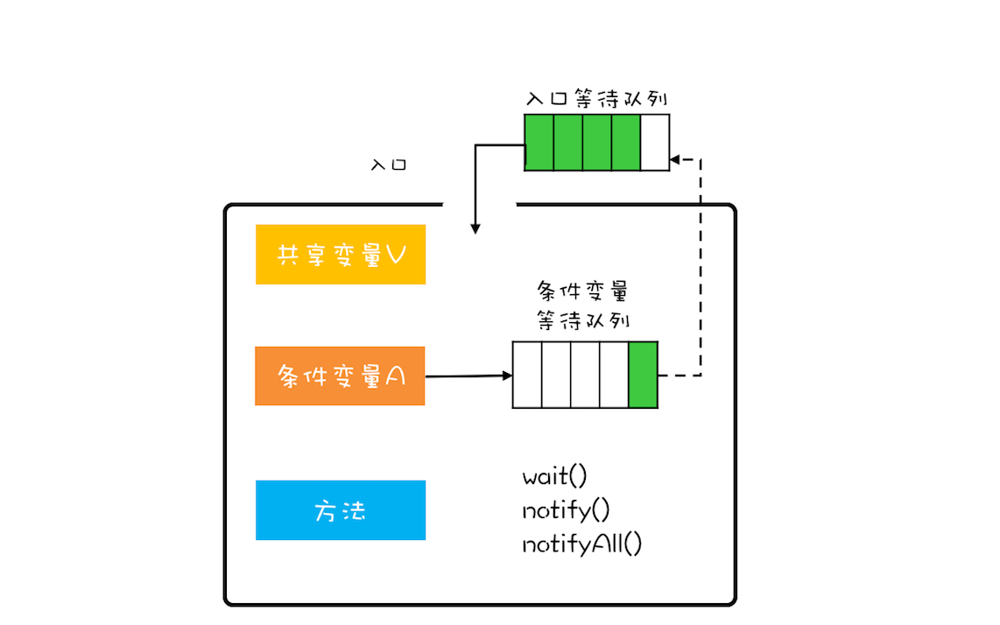
	> - Java 内置的管程方案（synchronized）使用简单，==synchronized 关键字修饰的代码块，在编译期会自动生成相关加锁和解锁的代码==，但是==仅支持一个条件变量==；而 ==Java SDK 并发包实现的管程支持多个条件变量==，不过==并发包里的锁，需要开发人员人为进行加锁和解锁操作==。

---


### 9.Java线程（上）：Java线程的生命周期

1. ==通用的线程生命周期==

	> - 通用的线程生命周期基本上可以用下图这个“五态模型”来描述。这五态分别是：==初始状态、可运行状态、运行状态、休眠状态==和==终止状态==。
	> - 
	> - ==初始状态==，指的是==线程已经被创建，但是还不允许分配 CPU 执行==。这个状态属于编程语言特有的，不过==这里所谓的被创建，仅仅是在编程语言层面被创建，而在操作系统层面，真正的线程还没有创建==。
	> - ==可运行状态==，指的是线程可以分配 CPU 执行。在这种状态下，==真正的操作系统线程已经被成功创建了，所以可以分配 CPU 执行==。
	> - 当有空闲的 CPU 时，==操作系统会将其分配给一个处于可运行状态的线程==，被分配到 CPU 的线程的状态就转换成了==运行状态==。
	> - 运行状态的线程如果==调用一个阻塞的 API（例如以阻塞方式读文件==）或者==等待某个事件（例如条件变量==），那么线程的状态就会转换到==休眠状态==，同时==释放 CPU 使用权==，休眠状态的线程永远没有机会获得 CPU 使用权。当==等待的事件出现了，线程就会从休眠状态转换到可运行状态==。
	> - 线程执行完或者出现异常就会进入==终止状态==，终止状态的线程不会切换到其他任何状态，==进入终止状态也就意味着线程的生命周期结束了==。

2. ==Java 中线程的生命周期==

	> - Java 语言中线程共有六种状态，分别是：
	> 	1. ==NEW==（初始化状态）
	> 	2. ==RUNNABLE==（可运行 / 运行状态）
	> 	3. ==BLOCKED==（阻塞状态）
	> 	4. ==WAITING==（无时限等待）
	> 	5. ==TIMED_WAITING==（有时限等待）
	> 	6. ==TERMINATED==（终止状态）
	> - 在==操作系统层面==，Java 线程中的 ==BLOCKED、WAITING、TIMED_WAITING 是一种状态==，即前面我们提到的==休眠状态==。也就是说==只要 Java 线程处于这三种状态之一，那么这个线程就永远没有 CPU 的使用权==。
	> - 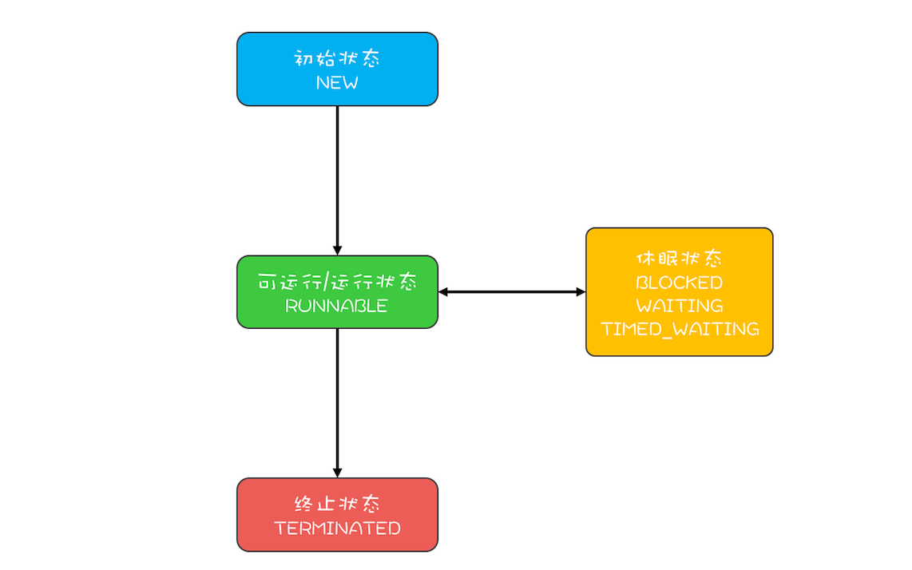

3. ==RUNNABLE 与 BLOCKED 的状态转换==

	> - ==只有一种场景==会触发这种转换，就是线程==等待 synchronized 的隐式锁==。当==等待的线程获得 synchronized 隐式锁==时，就又会从 ==BLOCKED 转换到 RUNNABLE== 状态。
	> - ==线程调用阻塞式 API 时，是否会转换到 BLOCKED 状态呢？==在==操作系统层面，线程是会转换到休眠状态==的，但是在 ==JVM 层面，Java 线程的状态不会发生变化==，也就是说 Java 线程的状态会依然保持 RUNNABLE 状态。==JVM 层面并不关心操作系统调度相关的状态==，因为在 JVM 看来，等待 CPU 使用权（操作系统层面此时处于可执行状态）与等待 I/O（操作系统层面此时处于休眠状态）没有区别，都是在==等待某个资源，所以都归入了 RUNNABLE 状态==。
	> - 而我们平时所谓的 ==Java 在调用阻塞式 API 时，线程会阻塞，指的是操作系统线程的休眠状态==，并==不是 Java 线程的状态==。

4. ==RUNNABLE 与 WAITING 的状态转换==

	> - 有三种场景会触发这种转换。
	> - 第一种场景，==获得 synchronized 隐式锁的线程，调用无参数的 Object.wait() 方法（和转换为 BLOCKED 时不同，转换为 BLOCKED 时是没有获得 synchronized 的条件对象，而转换为 WAITING 则是获得了条件对象，但是在代码块内部调用 Object.wait() 方法）==。
	> - 第二种场景，==调用无参数的 Thread.join() 方法==。例如有一个线程对象 thread A，当调用 A.join() 的时候，==执行这条语句的线程会等待 thread A 执行完（等待的线程调用 A 线程的 join 方法，意为让 A 线程插队到该线程，该线程在插队的 A 线程执行完成之前都处于 WAITING 状态）==，而等待中的这个线程，其状态会从 RUNNABLE 转换到 WAITING。
	> - 第三种场景，==调用 LockSupport.park() 方法==。Java 并发包中的锁，都是基于 LockSupport 实现的。调用 LockSupport.park() 方法，当前线程会阻塞，线程的状态会从 RUNNABLE 转换到 WAITING。调用 LockSupport.unpark(Thread thread) 可唤醒目标线程，目标线程的状态又会从 WAITING 状态转换到 RUNNABLE。

5. ==RUNNABLE 与 TIMED_WAITING 的状态转换==

	> - 有以下五种情况：
	> 	1. 调用==带超时参数==的 Thread.sleep(long millis) 方法；
	> 	2. 获得 synchronized 隐式锁的线程，调用==带超时参数==的 Object.wait(long timeout) 方法；
	> 	3. 调用==带超时参数==的 Thread.join(long millis) 方法；
	> 	4. 调用==带超时参数==的 LockSupport.parkNanos(Object blocker, long deadline) 方法；
	> 	5. 调用==带超时参数==的 LockSupport.parkUntil(long deadline) 方法。
	> - ==TIMED_WAITING 和 WAITING 状态的区别，仅仅是触发条件多了超时参数==。

6. ==从 NEW 到 RUNNABLE 状态==

	> - 进入 NEW 状态，继承 Thread 类重写 Runable.run 方法，或实现 Runable 接口实现 run 方法。
	> - NEW -> RUNNABLE 调用线程对象的 start 方法。

7. ==从 RUNNABLE 到 TERMINATED 状态==

	> - 线程==执行完 run() 方法==后，会自动转换到 TERMINATED 状态，当然如果==执行 run() 方法的时候异常抛出==，也会导致==线程终止==。
	> - 有时候我们需要==强制中断 run() 方法的执行==，例如 run() 方法访问一个很慢的网络，我们等不下去了，想终止怎么办呢？Java 的 ==Thread 类里面倒是有个 stop() 方法==，不过已经标记为 @Deprecated，所以==不建议使用==了。正确的姿势其实是==调用 interrupt() 方法==。
	> - ==那 stop() 和 interrupt() 方法的主要区别是什么呢？==
	> 	1. ==stop() 方法会真的杀死线程==，不给线程喘息的机会，==如果线程持有 ReentrantLock 锁，被 stop() 的线程并不会自动调用 ReentrantLock 的 unlock() 去释放锁==，那==其他线程就再也没机会获得 ReentrantLock 锁==，这实在是太危险了。
	> 	2. 而 interrupt() 方法就温柔多了，==interrupt() 方法仅仅是通知线程==，线程有机会执行一些后续操作，同时也可以无视这个通知。被 interrupt 的线程，是==怎么收到通知的呢==？一种是==异常==，另一种是==主动检测==。
	> 		- 当线程 A 处于 WAITING、TIMED_WAITING 状态时，如果==其他线程调用线程 A 的 interrupt() 方法，会使线程 A 返回到 RUNNABLE 状态==，同时==线程 A 的代码会触发 InterruptedException 异常==。类似 wait()、join()、sleep() 这样的方法，我们看==这些方法的签名，发现都会 throws InterruptedException 这个异常==。
	> 		- 如果其他线程调用线程 A 的 interrupt() 方法，那么==线程 A 可以通过 isInterrupted() 方法，检测是不是自己被中断了==。

8. 你可以通过 ==jstack 命令或者Java VisualVM这个可视化工具将 JVM 所有的线程栈信息导出来==，完整的线程栈信息不仅包括线程的当前状态、调用栈，还包括了锁的信息。

	> 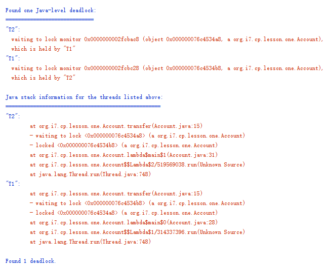

---


### 10.Java线程（中）：创建多少线程才是合适的？

1. ==为什么要使用多线程？==

	> - ==降低延迟，提高吞吐量==。这也是我们使用多线程的主要目的。

2. ==多线程的应用场景==

	> - ==在并发编程领域，提升性能本质上就是提升硬件的利用率，再具体点来说，就是提升 I/O 的利用率和 CPU 的利用率==。
	>
	> - ==操作系统解决硬件利用率问题的对象往往是单一的硬件设备==，而我们的并发程序，往往需要 CPU 和 I/O 设备相互配合工作，也就是说，==我们需要解决 CPU 和 I/O 设备综合利用率的问题==。关于这个综合利用率的问题，操作系统虽然没有办法完美解决，但是却给我们提供了方案，那就是：==多线程==。
	>
	> - ==单线程执行示意图==：
	>
	> 	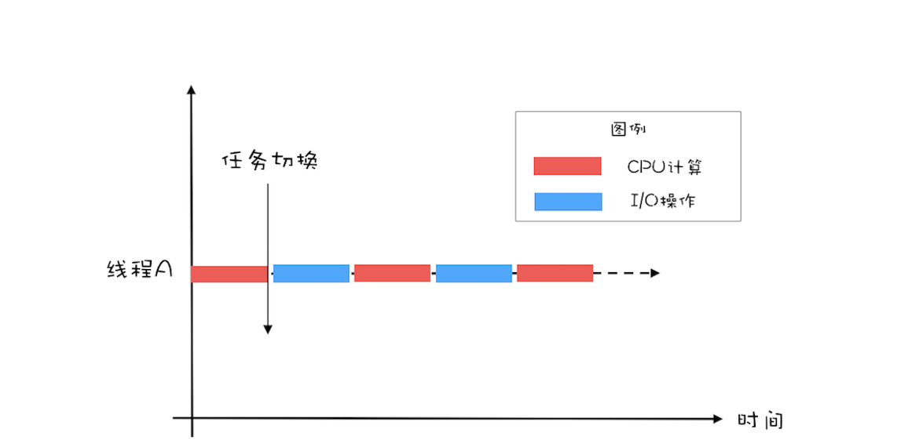
	>
	> - ==多线程执行示意图==：
	>
	> 	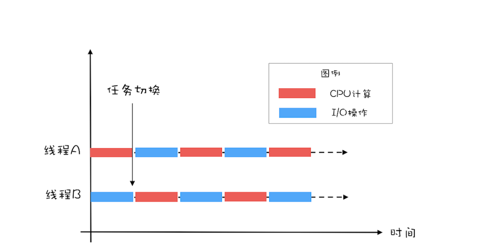
	>
	> 	==多线程下 CPU 利用率可以拉满==。
	>
	> - ==纯计算型（无 IO==）的程序也可以利用多线程来提升性能，可以==多线程每个线程计算一部分==。

3. ==创建多少线程合适？==

	> - ==CPU 密集型程序==
	> 	- 对于 ==CPU 密集型计算，多线程本质上是提升多核 CPU 的利用率==，所以对于一个 4 核的 CPU，每个核一个线程，理论上创建 4 个线程就可以了，==再多创建线程也只是增加线程切换的成本==。所以，==对于 CPU 密集型的计算场景，理论上“线程的数量 =CPU 核数”就是最合适的==。不过在工程上，==线程的数量一般会设置为“CPU 核数 +1”==，这样的话，当线程因为==偶尔的内存页失效或其他原因导致阻塞时，这个额外的线程可以顶上==，从而保证 CPU 的利用率。
	> - ==I/O 密集型程序==
	> 	- 如果 CPU 计算和 I/O 操作的耗时是 1:1，那么 2 个线程是最合适的。==如果 CPU 计算和 I/O 操作的耗时是 1:2，那多少个线程合适呢？是 3 个线程==。对于线程 A，==当 CPU 从 B、C 切换回来时，线程 A 正好执行完 I/O 操作（CPU 计算时才会用到 CPU，IO 操作 CPU 只不过是在等待数据传输，因此采用多线程，这样 CPU 在等 IO 的时候可以切换到其它线程继续 CPU 计算，而不用傻乎乎地等待，浪费 CPU 资源）==。这样 CPU 和 I/O 设备的利用率都达到了 100%。
	> 	- 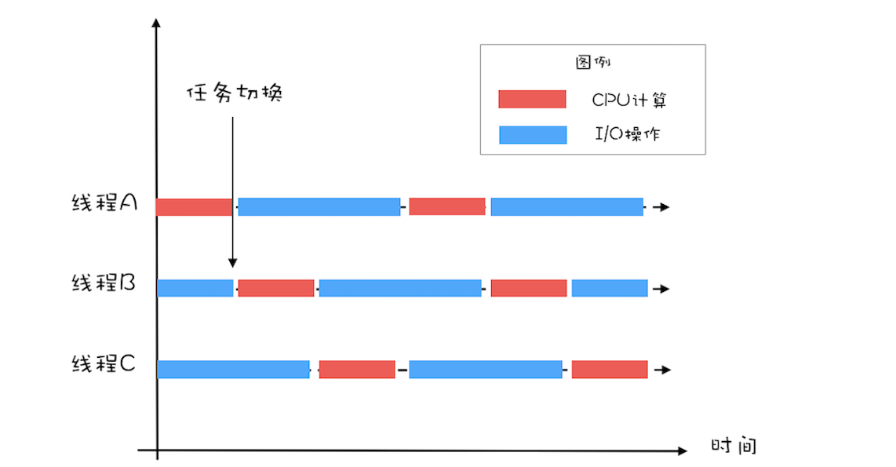
	> 	- ==单核 CPU 的最佳线程数 =1 +（I/O 耗时 / CPU 耗时）==。
	> 	- ==对于多核 CPU，最佳线程数 =CPU 核数 * [ 1 +（I/O 耗时 / CPU 耗时）]==。

4. 线程设置多少合适呢，本质就是==将硬件的性能发挥到极致==。上面我们针对 CPU 密集型和 I/O 密集型计算场景都给出了理论上的最佳公式，这些公式背后的目标其实就是==将硬件的性能发挥到极致==。

5. 对于 I/O 密集型计算场景，==I/O 耗时和 CPU 耗时的比值是一个关键参数==，不幸的是==这个参数是未知的==，而且是==动态变化==的，所以我们要==估算这个参数==，然后==做各种不同场景下的压测==来验证我们的估计。

----


### 11.Java线程（下）：为什么局部变量是线程安全的？

1. 不同线程中调用同一个 fibnacci 方法，其局部变量存在对应方法的 java 虚拟机栈的栈帧的局部变量表里，也就是不同线程的方法访问的根本就不在互斥区。

	> 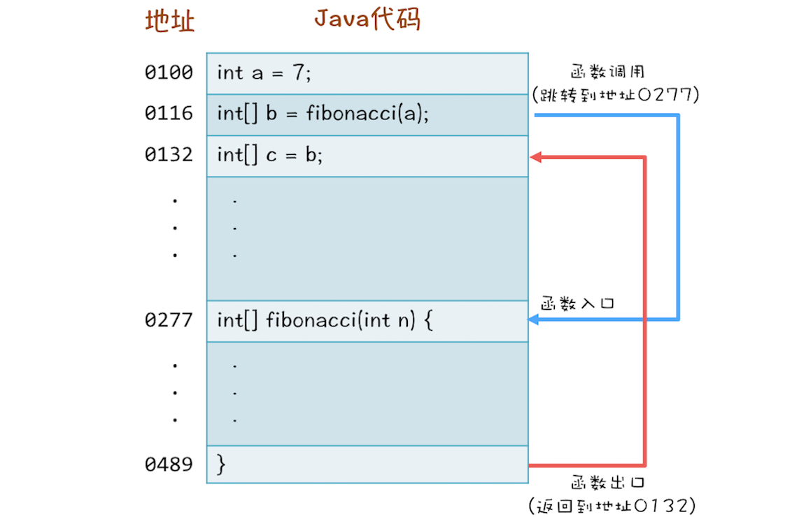
	>
	> ---
	>
	> 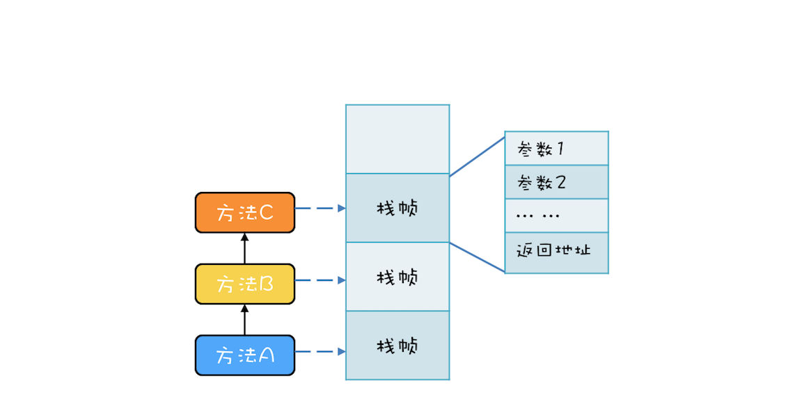
	>
	> ---
	>
	> 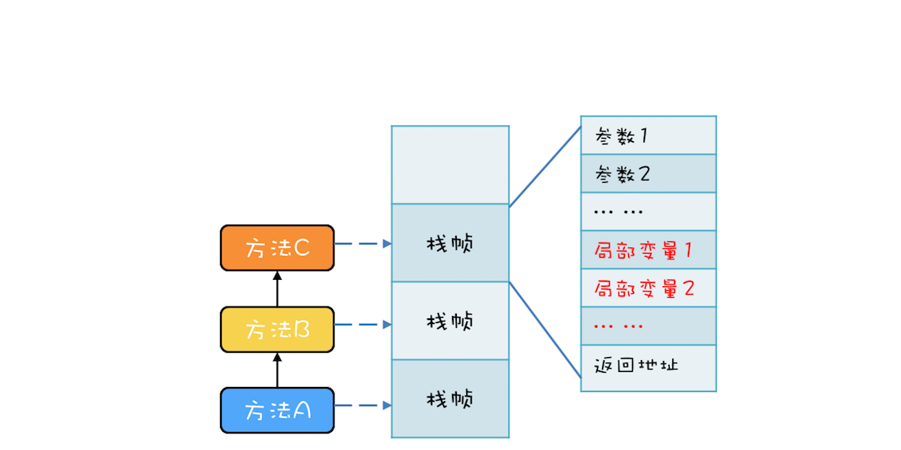
	>
	> ---
	>
	> 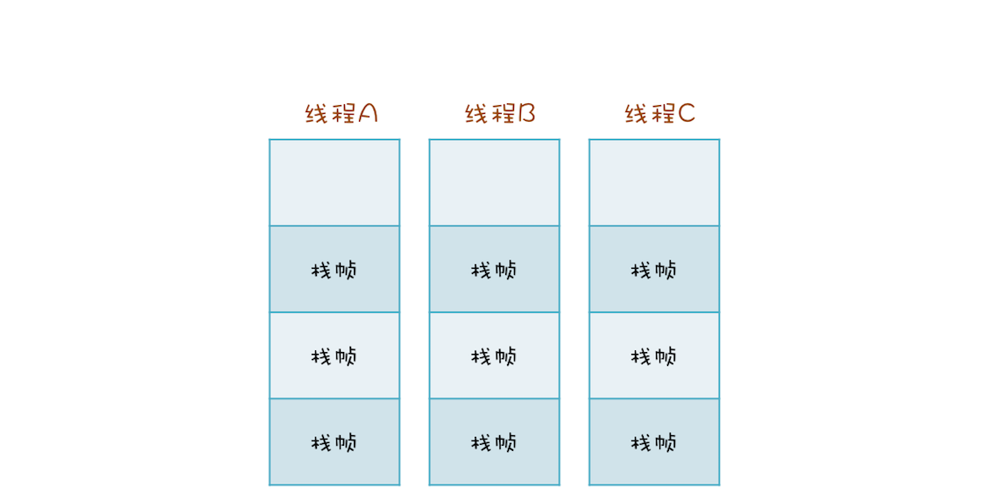

2. ==方法里的局部变量，因为不会和其他线程共享，所以没有并发问题==。同时还有个响当当的名字叫做==线程封闭==，比较官方的解释是：==仅在单线程内访问数据==。

3. 采用==线程封闭技术的案例==非常多，例如==从数据库连接池里获取的连接 Connection==，在 JDBC 规范里并没有要求这个 Connection 必须是线程安全的。数据库连接池通过线程封闭技术，==保证一个 Connection 一旦被一个线程获取之后，在这个线程关闭 Connection 之前的这段时间里，不会再分配给其他线程，从而保证了 Connection 不会有并发问题==。

----


## 多线程基础

### 1.进程和线程的区别

1. ==进程和线程的由来==

	> 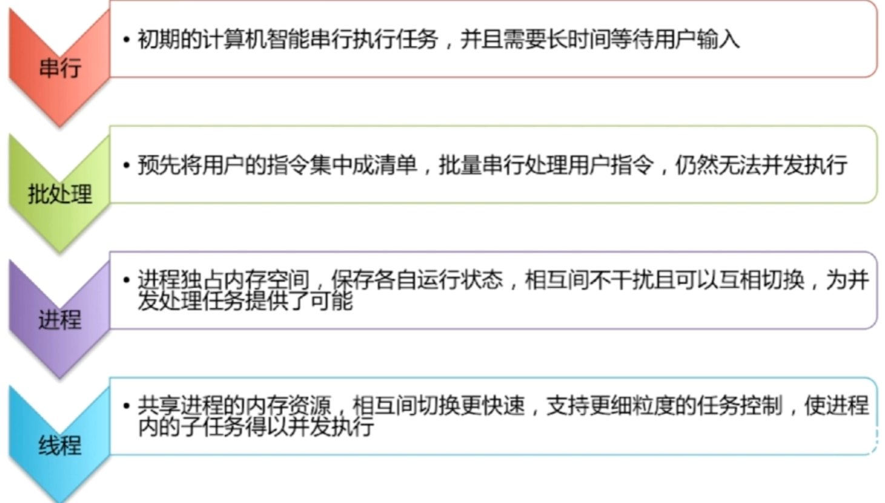

2. ==进程是资源分配的最小单位==，==线程是 CPU 调度的最小单位==。

	> 1. 所有与进程相关的资源，都被记录在PCB中。
	> 2. ==进程是抢占处理机的调度单位==；==线程属于某个进程，共享所属进程的资源==。
	> 3. 线程只由堆栈寄存器、程序计数器和TCB组成。

3. ==进程 vs 线程==

	> 1. ==线程不能看作是独立的应用==，而==进程则可以看作是独立的应用==。
	> 2. ==进程有独立的地址空间==，相互不影响，==线程只是进程的不同执行路径==。
	> 3. ==线程没有独立的地址空间==，而进程有，因此==多进程的程序比多线程的程序更健壮==。
	> 4. ==进程的切换比线程的切换开销大==。
	> 5. 线程不能独立执行，必须依存于某一个应用程序。

4. ==Java 中的进程和线程==

	> 1. Java 提供平台无关的 api 控制进程和线程。
	> 2. ==运行一个 JVM 就是启动一个进程==。
	> 3. ==一个程序是一个可执行的文件，一个进程是一个可执行文件中的实例==。
	> 4. ==每一个进程对应一个 JVM 实例，每一个 JVM 实例对应一个堆==。

---


### 2.线程 start 和 run 的区别

1. run 就是个普普通通的方法而已，而 ==start 这个方法（start0）才会调用相关的函数去创建一个子线程==
2. ==start -> start0 -> JVM_StartThread(C语言)==

---


### 3.Thread 和 Runnable 的区别

1. Thread实现Runnable类，Runnable只有一个run方法。
2. 可以通过Thread的构造器传入Runnable的实现对象（实现Runnable没有start方法）。

---


### 4.如何实现处理线程的返回值

1. 使用==子线程的join方法==，让它插队主线程，这样==主线程必须等待子线程执行完毕才能从WAITING变回RUNNABLE==。但是==缺点是粒度不细==。

2. ==通过 Callable 接口实现：通过 FutureTask 或线程池来获取 Callable 实现类==。

	==使用 FutureTask==

	```java
	public interface Callable<V> {
	    /==
	     * Computes a result, or throws an exception if unable to do so.
	     *
	     * @return computed result
	     * @throws Exception if unable to compute a result
	     */
	    V call() throws Exception; // 可以返回泛型
	}
	```

	```java
	/==
	     * Creates a {@code FutureTask} that will, upon running, execute the
	     * given {@code Callable}.
	     *
	     * @param  callable the callable task
	     * @throws NullPointerException if the callable is null
	     */
	public FutureTask(Callable<V> callable) { // 获取 Callable 实现类
	    if (callable == null)
	        throw new NullPointerException();
	    this.callable = callable;
	    this.state = NEW;       // ensure visibility of callable
	}
	
	
	// 获取Callable的返回值
	public V get() throws InterruptedException, ExecutionException { 
	    int s = state;
	    if (s <= COMPLETING)
	        s = awaitDone(false, 0L);
	    return report(s);
	}
	```

	```java
	// 传入我们自行定义的 Callable
	FutureTask<Strina> task = new FutureTask<Strina>(new MyCallable()):
	new Thread(task).start(); // FutureTask 也是 Runnable 的
	if(!task.isDone()){
	    System.out.println("task has not finished, please wait!");
	}
	System.out.println("task return:"+task.qet());
	```

	==使用线程池==，向线程池传入 Callable，然后获取返回的 Future 对象，Future.isDone。


---


### 5.线程的状态

1. TERMINATE 之后，再次调用 Thread.start() 方法会失败，==因为已经完成调用，不能再次调用==。

---


### 6.sleep 和 wait 的方法

1. sleep 可以在任何地方使用；==而 wait 方法只能在 synchronized 方法和 synchronized 块中使用==。

	```java
	* This method should only be called by a thread that is the owner
	* of this object's monitor. // wait 方法必须当前线程持有管程才可调用
	* @throws  IllegalMonitorStateException  if the current thread is not
	*          the owner of the object's monitor. // 不持有管程则会抛出异常
	```

2. ==sleep 不会释放锁，只让出 CPU；而 wait 则会释放锁资源==。

---


### 7.notify 和 notifyall 的区别

1. notifyAll 会让==所有处于等待池的线程==全部==进入锁池去竞争锁资源==。
2. notify 只会随机选一个，==可能随机选到的线程不满足 condition==，而==需要此 condition 的线程得不到竞争锁资源的机会==。

---


### 8.yield 方法

1. 表示==当前线程愿意让出 CPU 的使用权==，让其他线程使用 CPU 资源，而==线程调度器可以忽视这个 yield==。
2. ==yield== 只是愿意让出 CPU 资源，但是==并不会释放锁资源==！

---


### 9.interrupt 方法

1. 为什么 stop 被废弃了？==stop 强制中断线程，不会自动释放其锁资源==，可能存在锁资源永远不被释放。
2. ==调用interrupt()，通知线程应该中断了==。
	- 如果线程处于==被阻塞状态==，那么线程将==立即退出被阻塞状态==，并==抛出InterruptedException异常==。
	- 如果线程处于==正常活动状态==，那么会将该线程的==中断标志设置为true==。==被设置中断标志的线程将继续正常运行，不受影响==。
3. 因此==被调用的线程需要配合中断==。
	- 在==正常运行==任务时，==经常检查本线程的中断标志位==，如果被设置了中断标志就自行停止线程。
	- ==比如 catch 到 InterruptedException 异常后就退出线程==。

---


## 并发基础

### 1.使用 intellij idea 查看Java字节码

1. > 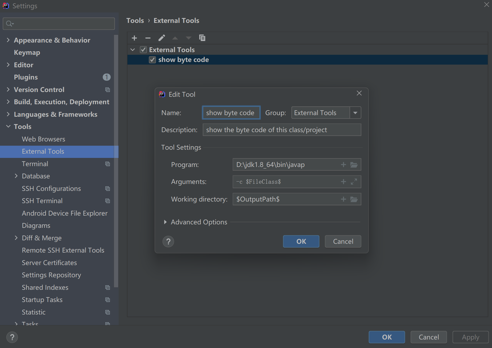
	>
	> ---
	>
	> 注：javap 命令的可选参数，不一定只用 -c：
	>
	> ```bash
	> -help  --help  -?        输出此用法消息
	> -version                 版本信息，其实是当前javap所在jdk的版本信息，
	> 						 不是class在哪个jdk下生成的。
	> -v  -verbose             输出附加信息（包括行号、本地变量表，反汇编等详细信息）
	> -l                       输出行号和本地变量表
	> -public                  仅显示公共类和成员
	> -protected               显示受保护的/公共类和成员
	> -package                 显示程序包/受保护的/公共类 和成员 (默认)
	> -p  -private             显示所有类和成员
	> -c                       对代码进行反汇编
	> -s                       输出内部类型签名
	> -sysinfo                 显示正在处理的类的系统信息 (路径, 大小, 日期, MD5 散列)
	> -constants               显示静态最终常量
	> -classpath <path>        指定查找用户类文件的位置
	> -bootclasspath <path>    覆盖引导类文件的位置
	> ```

2. ==然后在类里面直接右键 -> External Tools -> show byte code==

	> 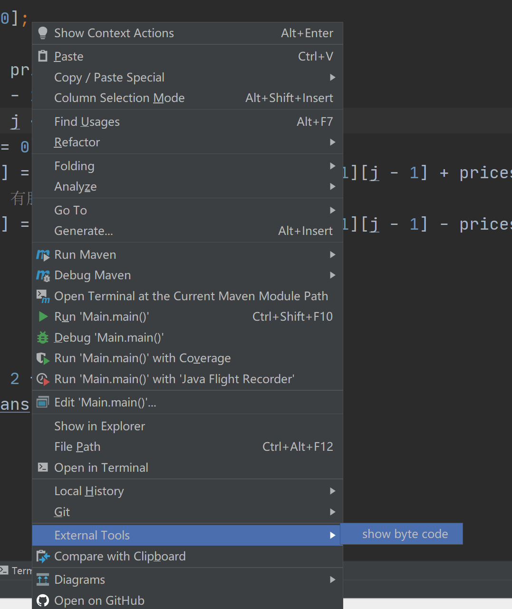
	
3. ==synchronized 的字节码==：

  > - ==java 源代码==：
  >
  > 	```java
  > 	public class Test {
  > 	    public static final Object lockObject = new Object();//随便创建一个对象
  > 	
  > 	    public static void main(String[] args) {
  > 	        for (int i = 0; i < 10; i++) {
  > 	            new Thread(new Runnable() {
  > 	                @Override
  > 	                public void run() {
  > 	                    f();
  > 	                }
  > 	            }).start();
  > 	        }
  > 	    }
  > 	
  > 	    public static void f() {
  > 	        synchronized (lockObject) {
  > 	            System.out.println("hello synchronized");
  > 	            try {
  > 	                Thread.sleep(1000);
  > 	            } catch (InterruptedException e) {
  > 	                e.printStackTrace();
  > 	            }
  > 	        }
  > 	    }
  > 	}
  > 	```
  >
  > - ==字节码==：
  >
  > 	```
  > 	Compiled from "Test.java"
  > 	public class Test {
  > 	  public static final java.lang.Object lockObject;
  > 	
  > 	  public Test();
  > 	    Code:
  > 	       0: aload_0
  > 	       1: invokespecial #1                  // Method java/lang/Object."<init>":()V
  > 	       4: return
  > 	
  > 	  public static void main(java.lang.String[]);
  > 	    Code:
  > 	       0: iconst_0
  > 	       1: istore_1
  > 	       2: iload_1
  > 	       3: bipush        10
  > 	       5: if_icmpge     31
  > 	       8: new           #2                  // class java/lang/Thread
  > 	      11: dup
  > 	      12: new           #3                  // class Test$1
  > 	      15: dup
  > 	      16: invokespecial #4                  // Method Test$1."<init>":()V
  > 	      19: invokespecial #5                  // Method java/lang/Thread."<init>":(Ljava/lang/Runnable;)V
  > 	      22: invokevirtual #6                  // Method java/lang/Thread.start:()V
  > 	      25: iinc          1, 1
  > 	      28: goto          2
  > 	      31: return
  > 	
  > 	  public static void f();
  > 	    Code:
  > 	       0: getstatic     #7                  // Field lockObject:Ljava/lang/Object;
  > 	       3: dup
  > 	       4: astore_0
  > 	       5: monitorenter
  > 	       6: getstatic     #8                  // Field java/lang/System.out:Ljava/io/PrintStream;
  > 	       9: ldc           #9                  // String hello synchronized
  > 	      11: invokevirtual #10                 // Method java/io/PrintStream.println:(Ljava/lang/String;)V
  > 	      14: ldc2_w        #11                 // long 1000l
  > 	      17: invokestatic  #13                 // Method java/lang/Thread.sleep:(J)V
  > 	      20: goto          28
  > 	      23: astore_1
  > 	      24: aload_1
  > 	      25: invokevirtual #15                 // Method java/lang/InterruptedException.printStackTrace:()V
  > 	      28: aload_0
  > 	      29: monitorexit
  > 	      30: goto          38
  > 	      33: astore_2
  > 	      34: aload_0
  > 	      35: monitorexit
  > 	      36: aload_2
  > 	      37: athrow
  > 	      38: return
  > 	    Exception table:
  > 	       from    to  target type
  > 	          14    20    23   Class java/lang/InterruptedException
  > 	           6    30    33   any
  > 	          33    36    33   any
  > 	
  > 	  static {};
  > 	    Code:
  > 	       0: new           #16                 // class java/lang/Object
  > 	       3: dup
  > 	       4: invokespecial #1                  // Method java/lang/Object."<init>":()V
  > 	       7: putstatic     #7                  // Field lockObject:Ljava/lang/Object;
  > 	      10: return
  > 	}
  > 	
  > 	Process finished with exit code 0
  > 	
  > 	```
  >
  > - ==主要看 f() 的字节码==：
  >
  > 	```java
  > 	public static void f();
  > 	    Code:
  > 	       0: getstatic     #7                  // Field lockObject:Ljava/lang/Object;
  > 	       3: dup
  > 	       4: astore_0
  > 	       5: monitorenter
  > 	       6: getstatic     #8                  // Field java/lang/System.out:Ljava/io/PrintStream;
  > 	       9: ldc           #9                  // String hello synchronized
  > 	      11: invokevirtual #10                 // Method java/io/PrintStream.println:(Ljava/lang/String;)V
  > 	      14: ldc2_w        #11                 // long 1000l
  > 	      17: invokestatic  #13                 // Method java/lang/Thread.sleep:(J)V
  > 	      20: goto          28
  > 	      23: astore_1
  > 	      24: aload_1
  > 	      25: invokevirtual #15                 // Method java/lang/InterruptedException.printStackTrace:()V
  > 	      28: aload_0
  > 	      29: monitorexit
  > 	      30: goto          38
  > 	      33: astore_2
  > 	      34: aload_0
  > 	      35: monitorexit
  > 	      36: aload_2
  > 	      37: athrow
  > 	      38: return
  > 	    Exception table:
  > 	       from    to  target type
  > 	          14    20    23   Class java/lang/InterruptedException
  > 	           6    30    33   any
  > 	          33    36    33   any
  > 	```
  >
  > - ==AI 给出的解释==：
  >
  > 	```java
  > 	0: getstatic     #7 - 加载静态字段lockObject到栈顶。#7是一个指向常量池的索引，常量池中存储了lockObject的引用。
  > 	3: dup - 复制栈顶的lockObject引用。
  > 	4: astore_0 - 将复制的lockObject引用存储到局部变量槽0中。
  > 	    		
  > 	// 管程开始同步
  > 	5: monitorenter - 进入lockObject对象的监视器（也就是开始同步）。
  > 	    		
  > 	6: getstatic     #8 - 加载静态字段java/lang/System.out到栈顶，这是System.out的PrintStream对象。
  > 	9: ldc           #9 - 将字符串"hello synchronized"加载到栈顶。
  > 	11: invokevirtual #10 - 调用PrintStream.println方法输出字符串。
  > 	14: ldc2_w        #11 - 将长整型1000l（1000毫秒）加载到栈顶。
  > 	17: invokestatic  #13 - 调用Thread.sleep方法，使当前线程暂停1000毫秒。
  > 	20: goto          28 - 如果没有异常发生，跳转到第28行。
  > 	23: astore_1 - 如果Thread.sleep抛出InterruptedException异常，将其存储在局部变量槽1中。
  > 	24: aload_1 - 加载InterruptedException到栈顶。
  > 	25: invokevirtual #15 - 调用InterruptedException.printStackTrace方法，打印异常堆栈。
  > 	28: aload_0 - 加载局部变量槽0中的lockObject引用到栈顶。
  > 	    		
  > 	// 结束管程同步
  > 	29: monitorexit - 退出lockObject的监视器（也就是结束同步）。
  > 	    
  > 	    
  > 	30: goto          38 - 跳转到第38行，结束方法。
  > 	33: astore_2 - 如果在退出监视器之前发生任何异常，将其存储在局部变量槽2中。
  > 	34: aload_0 - 加载局部变量槽0中的lockObject引用到栈顶。
  > 	    		
  > 	// 退出管程
  > 	35: monitorexit - 退出lockObject的监视器。
  > 	    
  > 	    
  > 	36: aload_2 - 加载局部变量槽2中的异常到栈顶。
  > 	37: athrow - 重新抛出存储在局部变量槽2中的异常。
  > 	38: return - 方法正常结束，返回。
  > 	Exception table: - 异常表，列出了可能抛出的异常及其处理方式：
  > 	from 14 to 20 target 23 type java/lang/InterruptedException - 如果在Thread.sleep期间发生InterruptedException，则跳转到第23行处理。
  > 	from 6 to 30 target 33 type any - 如果在进入监视器到退出监视器之间的任何位置发生任何类型的异常，则跳转到第33行处理。
  > 	from 33 to 36 target 33 type any - 如果在退出监视器时发生任何类型的异常，则跳转到第33行处理。
  > 	```

---


### 2.一句话撸完重量级锁、自旋锁、轻量级锁、偏向锁、悲观、乐观锁等各种锁

1. ==重量级锁==

	> - 获取不到锁就==马上==进入阻塞状态的锁，我们称之为==重量级锁==。比如 ==synchronized 管程中的锁==。

2. ==自旋锁==

	> - 自旋锁就是，如果此时拿不到锁，它==不马上进入阻塞状态，而是等待一段时间==，看看这段时间有没其他人把这锁给释放了。怎么等呢？这个就类似于线程在那里做==空循环==，如果循环一定的次数==还拿不到锁，那么它才会进入阻塞==的状态。
	> - 至于是循环等待几次，这个是可以==人为指定一个数字==的。

3. ==自适应自旋锁==

	> - 它==自己本身会进行判断==要循环几次，而且每个线程可能循环的次数也是不一样的。
	> - 而之所以这样做，主要是我们觉得，如果一个线程在==不久前拿到过这个锁==，或者它==之前经常拿到过这个锁==，那么我们认为==它再次拿到锁的几率非常大==，所以循环的次数会多一些。
	> - 而如果有些线程==从来就没有拿到过这个锁==，或者说，平时很少拿到，那么我们认为，它再次拿到的概率是比较小的，所以我们就让它==循环的次数少一些==。因为你在那里做空循环是很消耗 CPU 的。

4. ==轻量级锁==

	> - 如果根本就==没有线程来和他们竞争锁，那他们不是白白上锁==了？要知道，==加锁这个过程是需要操作系统这个大佬来帮忙的，是很消耗时间==的。轻量级锁解决这种==动不动就加锁==带来的开销。
	>
	> - 当我们进入一个方法的时候==根本就不用加锁==，我们只需要==做一个标记==就可以了，也就是说，我们可以用一个变量来记录此时该方法是否有人在执行。也就是说，如果这个方法没人在执行，当我们进入这个方法的时候，采用==CAS==机制，把这个方法的状态标记为==已经有人在执行==，退出这个方法时，在把这个状态改为了==没有人在执行==了。
	>
	> - ==比起加锁操作，这个采用CAS来改变状态的操作，花销就小多了==。
	>
	> - 如果真的遇到了竞争，我们就会认为==轻量级锁==已经不适合了，就会把==轻量级锁升级为重量级锁==。
	>
	> 	所以轻量级锁==适合用在那种，很少出现多个线程竞争一个锁的情况==，也就是说，适合那种多个线程总是==错开时间==来获取锁的情况。

5. ==偏向锁==

	> - 偏向锁比轻量级锁更乐观。
	> - 偏向锁进入一个方法的时候是这样处理的：如果这个方法没有人进来过，那么一个线程==首次进入==这个方法的时候，会==采用CAS机制，把这个方法标记为有人在执行==了，和轻量级锁加锁有点类似，并且也会==把该线程的 ID 也记录进去==，相当于记录了哪个线程在执行。
	> - 然后，但这个线程退出这个方法的时候，它不会改变这个方法的状态，而是==直接退出来，懒的去改==，因为它认为除了自己这个线程之外，其他线程并不会来执行这个方法。
	> - 然后当这个线程想要再次进入这个方法的时候，会判断一下这个方法的状态，如果这个方法已经被标记为==有人在执行==了，并且==线程的ID是自己==，那么它就==直接进入==这个方法执行，啥也不用做。
	> - ==至少有两个线程要来执行这个方法论（轻量级锁的升级条件是冲突，而这里只要有另一个线程看到ID不是自己，得知还有其它线程在执行这个方法时，就直接升级成轻量级锁了）==，这意味着==偏向锁已经不适用了==，这个时候就会从偏向锁升级为轻量级锁。

6. ==悲观锁和乐观锁==

	> - ==重量级锁、自旋锁和自适应自旋锁==，==进入方法之前，就一定要先加一个锁==，这种我们为称之为==悲观锁==。悲观锁总认为，如果不事先加锁的话，就会出事，这种想法确实悲观了点，这估计就是==悲观锁==的来源了。
	> - 乐观锁却相反，认为不加锁也没事，我们可以先不加锁，如果出现了冲突，我们在想办法解决，例如 CAS 机制，上面说的==轻量级锁和偏向锁，就是乐观锁==的。不==会马上加锁，而是等待真的出现了冲突，再想办法解决（比如切换锁）==。

----


### 3.CAS 是什么？Java8 是如何优化 CAS 的？

1. ```java
	public class CASTest {
	    static int i = 0;
	
	    public synchronized static void increment() {
	        i++;
	    }
	}
	```

	> 一个简简单单的自增操作，就加了 synchronized 进行同步，好像有点大材小用的感觉，加了 synchronized 关键词之后，当有很多线程去竞争 increment 这个方法的时候，拿不到锁的方法是会被==阻塞==在方法外面的，最后再来唤醒他们，而==阻塞/唤醒这些操作，是非常消耗时间的==。

2. ==CAS 是什么==

	> - 1、线程从内存中读取 i 的值，假如此时 i 的值为 0，我们把这个值称为 k 吧，即此时 k = 0。
	>
	> - 2、令 j = k + 1。
	>
	> - 3、用 k 的值与内存中i的值相比，如果==相等==，这意味着==没有其他线程修改过 i 的值==，我们就==把 j（此时为1） 的值写入内存==；如果==不相等（意味着i的值被其他线程修改过==），我们就==不把j的值写入内存，而是重新跳回步骤 1==，继续这三个操作。
	>
	> 	```java
	> 	public static void increment() {
	> 	    do{
	> 	        int k = i;
	> 	        int j = k + 1;
	> 	    }while (compareAndSet(i, k, j))
	> 	}
	> 	```
	>
	> - 我们就把 compareAndSet 称为 ==CAS==。

3. ==CAS：谁偷偷更改了我的值==

	> - 虽然这种 CAS 的机制能够保证increment() 方法，但依然有一些问题，例如，当线程A即将要执行第三步的时候，线程 B 把 i 的值加1，之后又马上把 i 的值减 1，然后，线程 A 执行第三步，这个时候线程 A 是认为并没有人修改过 i 的值，因为 i 的值并没有发生改变。而这，就是我们平常说的==ABA问题==。
	> - 对于基本类型的值来说，这种把==数字改变了在改回原来的值==是没有太大影响的，但如果是==对于引用类型的话，就会产生很大的影响==了。
	> - ==来个版本控制吧==：
	> - 为了解决这个 ABA 的问题，我们可以引入版本控制，例如，==每次有线程修改了引用的值，就会进行版本的更新，虽然两个线程持有相同的引用，但他们的版本不同==，这样，我们就可以预防 ABA 问题了。Java 中提供了 AtomicStampedReference 这个类，就可以进行版本控制了。

---


### 4.一文搞懂 volatile 关键字

1. ==volatile保证变量可见性的原理==

	> 当一个变量被声明为volatile时，在==编译成会变指令的时候，会多出下面一行==：
	>
	> ```java
	> 0x00bbacde: lock add1 $0x0,(%esp);
	> ```
	>
	> - 这句指令的意思就是在寄存器执行一个加0的空操作。不过==这条指令的前面有一个lock(锁)前缀==。
	> - 当处理器在==处理拥有lock前缀的指令时==：
	> - 处理器遇到lock指令时==不会再锁住总线==，而是会检查数据所在的内存区域，如果==该数据是在处理器的内部缓存中，则会锁定此缓存区域，处理完后把缓存写回到主存中==，并且会利用==缓存一致性协议==来保证其他处理器中的缓存数据的一致性。

2. ==防止重排序==

	> - 如果一个变量被声明volatile的话，那么这个变量不会被进行重排序，也就是说，虚拟机会==保证这个变量之前的代码一定会比它先执行==，而之后的代码一定会比它后执行。
	> - 不过这里需要注意的是，虚拟机只是保证这个变量之前的代码一定比它先执行，但==并没有保证这个变量之前的代码不可以重排序==。

3. 但 volatile 并不能保证线程安全，因为==可能还存在原子性的问题==。

4. ==什么情况下volatile能够保证线程安全==

	> - 同时满足：
	> 	1. 运算结果并不依赖变量的当前值，或者能够确保只有单一的线程修改变量的值。
	> 	2. 变量不需要与其他状态变量共同参与不变约束。

---


### 5.一文读懂 synchronized 关键字

1. synchronized 并非一开始就该对象加上重量级锁，也是==从偏向锁，轻量级锁，再到重量级锁的过程==。

2. 这个过程也告诉我们，==假如我们一开始就知道某个同步代码块的竞争很激烈、很慢的话，那么我们一开始就应该使用重量级锁了，从而省掉一些锁转换的开销==。

3. ==锁对象==

	> - java==对象在内存中的存储结构==主要有一下三个部分：
	>
	> 	1. 对象头
	> 	2. 实例数据
	> 	3. 填充数据
	>
	> - ==对象头==里的数据主要是一些运行时的数据，其简单的结构如下：
	>
	> 	| 长度     | 内容                   | 说明                            |
	> 	| -------- | ---------------------- | ------------------------------- |
	> 	| 32/64bit | Mark Work              | hashCode,GC分代年龄，==锁信息== |
	> 	| 32/64bit | Class Metadata Address | 指向对象类型数据的指针          |
	> 	| 32/64bit | Array Length           | 数组的长度(当对象为数组时)      |
	>
	> - 当我们创建一个对象LockObject时，该对象的部分==Mark Word关键数据==如下：
	>
	> 	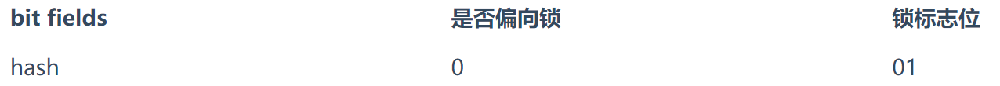
	> 	
	> - 从图中可以看出，==偏向锁==的标志位是“01”，==状态是“0”，表示该对象还没有被加上偏向锁==（“1”是表示被加上偏向锁）。该==对象被创建出来的那一刻，就有了偏向锁的标志位，这也说明了所有对象都是可偏向的==，但所有对象的状态都为“0”，也同时说明==所有被创建的对象的偏向锁并没有生效==。
	>

---


### 6.图解 | 你管这破玩意叫线程池？

1. 我们可以给==非核心线程==设定一个超时时间 ==keepAliveTime==，当这么长时间没能从队列里获取任务时，就不再等了，销毁线程。

	> 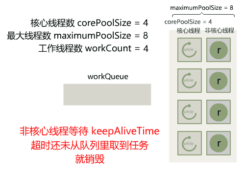

2. 线程池的样例：

	```java
	public FlashExecutor(
	    int corePoolSize,
	    int maximumPoolSize,
	    long keepAliveTime,
	    TimeUnit unit,
	    BlockingQueue<Runnable> workQueue,
	    ThreadFactory threadFactory,
	    RejectedExecutionHandler handler) 
	{
	    ... // 省略一些参数校验
	        this.corePoolSize = corePoolSize;
	    this.maximumPoolSize = maximumPoolSize;
	    this.workQueue = workQueue;
	    this.keepAliveTime = unit.toNanos(keepAliveTime);
	    this.threadFactory = threadFactory;
	    this.handler = handler;
	}
	
	int corePoolSize：// 核心线程数
	int maximumPoolSize：// 最大线程数
	long keepAliveTime：// 非核心线程的空闲时间
	TimeUnit unit：// 空闲时间的单位
	BlockingQueue<Runnable> workQueue：// 任务队列（线程安全的阻塞队列）
	ThreadFactory threadFactory：// 线程工厂
	RejectedExecutionHandler handler：// 拒绝策略
	```

3. ==线程池执行流程==：

	> 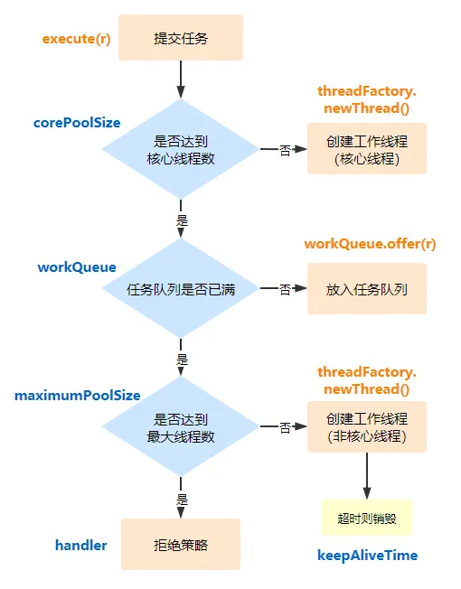

4. ==两个常见问题==：

	> 1. ==线程池中的线程是越多越好吗==？
	> 2. ==为什么线程池可以加快速度==？

---


### 7.Java并发包中最重要的几个同步类

1. ==ReenTrantLock==

	> - ==ReentrantLock 是可重入锁的意思==。
	>
	> - ==可重入锁==：就是从一个线程获取锁之后，到这个线程==释放该锁之前==，该线程可以==再次进入获取该锁==，这像==递归调用，同一个线程多次进入同一个锁==。
	>
	> - 在 ReenTrantLock 中，通过==调用 lock() 方法来获取锁==，==调用 unlock() 方法来释放锁==的机制进行代码块的同步。
	>
	> - ReentrantLock 的实现==依赖于同步器框架 AbstranctQueuedSynchronizer==。
	>
	> - AbstrancQueuedSynchronizer，这个类也简称为 AQS。==AQS 使用一个整型的 volatile 变量(名为 state)来维护同步状态==，而==这个变量的操作是靠 CAS 机制来保证他的原子性==。
	>
	> - ==默认==情况下，ReenTrantLock 使用的是==非公平锁==，我们也可以通过构造器指定是否要公平锁。
	>
	> 	```java
	> 	/==
	> 	  * Creates an instance of {@code ReentrantLock} with the
	> 	  * given fairness policy.
	> 	  *
	> 	  * @param fair {@code true} if this lock should use a fair ordering policy
	> 	  */
	> 	public ReentrantLock(boolean fair) {
	> 	    sync = fair ? new FairSync() : new NonfairSync();
	> 	}
	> 	```
	>
	> - ==公平锁==：做个比喻就是在银行门口等待的人，==先来的==，等下可以==先获取==到锁来办理事情。即在锁的获取上，是按照时间的顺序公平获取的。==非公平锁==：和公平锁相反，==慢来的也有可能先获取到锁==。

2. ==CountDownLatch==

	> - 这是一个==计数同步类==，他可以==让当前线程处于等待状态，直到计数为0时才能继续往下执行==。
	>
	> - ==常用方法==：
	>
	> 	```java
	> 	// 构造器，必须制定计数次数
	> 	public CountDownLatch(int count) {
	> 	    if (count < 0) throw new IllegalArgumentException("count < 0");
	> 	    this.sync = new Sync(count);
	> 	}
	> 	
	> 	// 进入等待状态，直到计数数为 0 时，才可以继续往下执行，如果该线程被打断的话，则会抛出 InterruptedException 异常
	> 	public void await() throws InterruptedException {
	> 	    sync.acquireSharedInterruptibly(1);
	> 	}
	> 	
	> 	// 计数减一
	> 	public void countDown() {
	> 	    sync.releaseShared(1);
	> 	}
	> 	```
	>
	> - ==经典示例，主线程必须等两个子线程均执行完才能继续，否则会被 count.wait 阻塞==。
	>
	> 	```java
	> 	public class CountDownLatchTest {
	> 	    static CountDownLatch count = new CountDownLatch(2); // 计数为 2
	> 	    static int sum1 = 0; // 1 到 100 相加
	> 	    static int sum2 = 0; // 101 到 200 相加
	> 	
	> 	    public static void main (String[] args) {
	> 	        // 线程 1
	> 	        new Thread(new Runnable() {
	> 	            @Override
	> 	            public void run() {
	> 	                // 执行 1 到 10 相加
	> 	                for (int i = 1; i <= 100; i++) {
	> 	                    sum1 += i;
	> 	                }
	> 	                count.countDown();
	> 	            }
	> 	        }).start();
	> 	        // 线程2
	> 	        new Thread(new Runnable() {
	> 	            @Override
	> 	            public void run() {
	> 	                // 执行 101 到 200 相加
	> 	                for (int i = 101; i <= 200; i++) {
	> 	                    // 假设每次执行相加都会花一些时间
	> 	                    sum1 += i;
	> 	                }
	> 	                count.countDown();
	> 	            }
	> 	        }).start();
	> 	        // 等到两个线程都执行完，在把他们相加
	> 	        try {
	> 	            count.wait();
	> 	            System.out.println("最终的结果：" + (sum1 + sum2));
	> 	        } catch (Exception e) {
	> 	            e.printStackTrace();
	> 	        }
	> 	    }
	> 	}
	> 	```
	>
	> - 该类==内部维护着一个 Sync 类==，该==内部类继承了同步阻塞队列（AQS==），实现核心方法。
	>
	> 	```java
	> 	 private static final class Sync extends AbstractQueuedSynchronizer
	> 	```
	>
	> - 真正执行减 1 的是 Sync.doReleaseShared() 方法，该方法的内部实现逻辑主要是依靠 CAS 机制来实现计数减一。

3. ==CyclicBarrier 同步类==

	> - Barrier 是阻拦的意思，他和 CountDownLatch 有点类似，当指定的线程数都执行到某个位置的时候，他才会继续往下执行。主要特点是==可以让几个线程相互等待，就像被一道围栏给阻塞了一样，等到人齐了，在一同往下执行==。
	>
	> - ==操作演示==：
	>
	> 	```java
	> 	public class CyclicBarrierTest {
	> 	    // 表示 await 的线程达到3个时，这3个线程才会继续向下执行
	> 	    static CyclicBarrier barrier = new CyclicBarrier(3);
	> 	    
	> 	    static int sum1 = 0; // 1 到 100 相加
	> 	    static int sum2 = 0; // 101 到 200 相加
	> 	    public static void main (String[] args) {
	> 	        // 线程 1
	> 	        new Thread(new Runnable() {
	> 	            @Override
	> 	            public void run() {
	> 	                // 执行 1 到 10 相加
	> 	                for (int i = 1; i <= 100; i++) {
	> 	                    sum1 += i;
	> 	                }
	> 	                // 进入等待
	> 	                try {
	> 	                    barrier.await();
	> 	                } catch (Exception e) {
	> 	                    e.printStackTrace();
	> 	                }
	> 	            }
	> 	        }).start();
	> 	        // 线程2
	> 	        new Thread(new Runnable() {
	> 	            @Override
	> 	            public void run() {
	> 	                // 执行 101 到 200 相加
	> 	                for (int i = 101; i <= 200; i++) {
	> 	                    // 假设每次执行相加都会花一些时间
	> 	                    sum1 += i;
	> 	                }
	> 	                // 进入等待
	> 	                try {
	> 	                    barrier.await();
	> 	                } catch (Exception e) {
	> 	                    e.printStackTrace();
	> 	                }
	> 	            }
	> 	        }).start();
	> 	        // 等到两个线程都执行完，在把他们相加
	> 	        try {
	> 	            barrier.await();
	> 	            System.out.println("最终的结果：" + (sum1 + sum2));
	> 	        } catch (Exception e) {
	> 	            e.printStackTrace();
	> 	        }
	> 	    }
	> 	}
	> 	```
	>
	> - CyclicBarrier 是如何实现线程安全的呢？==CyclicBarrier 主要是依赖于 ReenTrantLock 来实现线程同步安全的==。
	>
	> - ==CountDownLatch vs CyclicBarrier==
	>
	> 	- 相比与 CountDownLatch，==CyclicBarrier 实例可以重复利用，我们可以通过重置方法 reset() 实现重复利用==。
	> 	- CycliBarrier 是==多个线程互相等待==，而 CountDownLatch 是==一个线程等待其他线程执行完毕==。
	> 	- 还有在同步锁上也有些不同，==一个是依赖于 ReentrantLock==，==一个是依赖于 CAS==（虽然 ReentrantLock的底层也是依赖于 CAS 机制）。
	
4. ==Semaphore==

      > - semaphore 是信号量的意思，通过这个类，可以==控制某个资源最多可以被几个线程所持有==。
      >
      > - ==常用方法==：
      >
      > 	```java
      > 	// 如果还有许可，则继续执行，否则将进入WAITING状态，直到有许可
      > 	public void acquire() throws InterruptedException {
      > 	    sync.acquireSharedInterruptibly(1);
      > 	}
      > 	
      > 	// 释放持有的许可
      > 	public void release() {
      > 	    sync.releaseShared(1);
      > 	}
      > 	```
      >
      > - 演示：一个银行4个窗口，10个人前来办理业务。
      >
      > 	```java
      > 	public class SemaphoreTest {
      > 	
      > 	    // 假设有4个许可证，每次都需要一个许可证
      > 	    static Semaphore semaphore = new Semaphore(4);
      > 	
      > 	    static class EatingThread implements Runnable{
      > 	        @Override
      > 	        public void run() {
      > 	            // 尝试是否能够拿到可用的许可证
      > 	            try {
      > 	                semaphore.acquire(); // 尝试获取许可，没有则WAITING，直到有许可
      > 	                System.out.println(Thread.currentThread() + "拿到许可证了，窗口办理事情中");
      > 	                Thread.sleep(10000);
      > 	            } catch (Exception e) {
      > 	                e.printStackTrace();
      > 	            }finally {
      > 	                // 释放持有的许可证
      > 	                semaphore.release();
      > 	            }
      > 	
      > 	        }
      > 	    }
      > 	
      > 	    // 开始测试
      > 	    public static void main(String[] args) {
      > 	        // 10个人来银行办理，不过总共只有3个窗口，每次只能有三个人同时在办理
      > 	        for (int i = 0; i < 10; i++) {
      > 	            Thread t = new Thread(new EatingThread());
      > 	            t.start();
      > 	        }
      > 	    }
      > 	}
      > 	```
      >
      > - 这个类的主要特点是，可以==对资源的同时访问人数进行控制==。

---


### 8.AQS 原理（暂时没看）


## 线程池视频课

### 1.初始线程池

1. for循环中直接new1000个线程，这样开销太大（==每一个java线程直接对应操作系统的一个线程==），我们希望有==固定数量的线程，来执行这1000个线程==，这样就==避免了反复创建并销毁线程所带来的开销问题==。
2. 使用==线程池的好处==：
	1. 响应速度加快，因为节省了反复创建和销毁线程带来的事件开销。
	2. 合理分配CPU和内存。
	3. 统一管理线程。

---


### 2.线程增减的好处

1. ==线程池的参数==：

	> 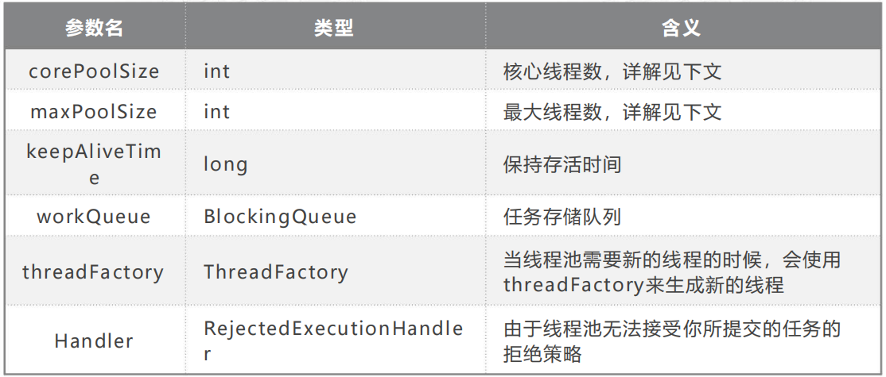

2. ==线程添加的规则==：

	> 1. 如果==线程数小于corePoolsize==，即使==其他已创建的线程处于空闲状态，也会创建一个新线程==来运行新任务。
	> 2. 如果线程数==等于(或大于)corePoolSize但少干maximumPoolSize==，任务==放入队列==(workQueue)。
	> 3. 如果==队列已满==，并且线程数==小于maxPoolSize==，则==创建一个新线程==来运行任务。
	> 4. 如果队列已满，并且==线程数大于或等于maxPoolSize==，则==拒绝==该任务。
	>
	> 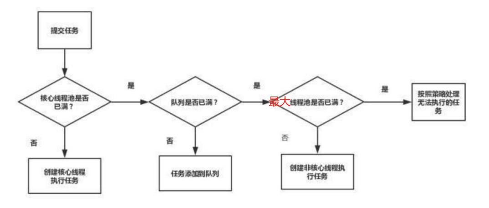

3. ==例子==：

	> 

4. 通过设置==corePoolSize和maximumPoolSize 相同，就可以创建固定大小的线程池==。

	> 社区项目里就是设置的两个值相同，意思是线程数不会超过这个值，队列满了没有扩展的空间。

---


### 3.线程存活时间和工作队列

1. 线程数多于corePoolSize，那么如果==多余的线程空闲时间超过keepAliveTime，它们就会被终止==。

2. ==工作队列==：

	> 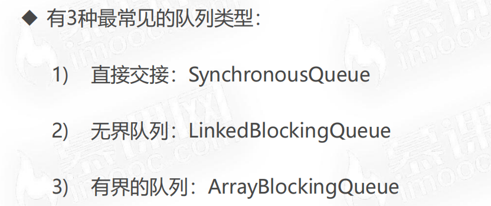

---


### 4.自动创建线程池的风险

1. ```java
	public class FixedThreadPoolOOM {
	    public static void main(String[] args) {
	        ExecutorService threadPool = Executors.newFixedThreadPool(1);
	        for (int i = 0; i < Integer.MAX_VALUE; i++) {
	            threadPool.execute(new Task()); // 一直往无界队列里塞任务，最后填满分配的内存空间，导致OOM
	        }
	    }
	
	    static class Task implements Runnable {
	        @Override
	        public void run() { // 一直sleep，无法及时完成任务
	            try {
	                Thread.sleep(Long.MAX_VALUE);
	            } catch (InterruptedException e) {
	                e.printStackTrace();
	            }
	        }
	    }
	}
	```

---


### 5.常见线程池的用法演示

1. ==SingleThreadPool==：线程数为1的线程池。

2. ==CacheThreadPool==：线程数上限无限大，且任务队列为直接交接队列，也存在OOM风险。

3. ==ScheduledThreadPool==：

	```java
	public static void main(String[] args) {
	    ScheduledExecutorService pool = Executors.newScheduledThreadPool(5);
	    pool.schedule(new Task(), 1/*延迟*/, TimeUnit.SECONDS);
	    pool.scheduleAtFixedRate(new Task(), 1/*延迟*/, 3/*频率*/, TimeUnit.SECONDS);
	    pool.shutdown();
	}
	```

---


### 6.几种线程池的对比

1. > 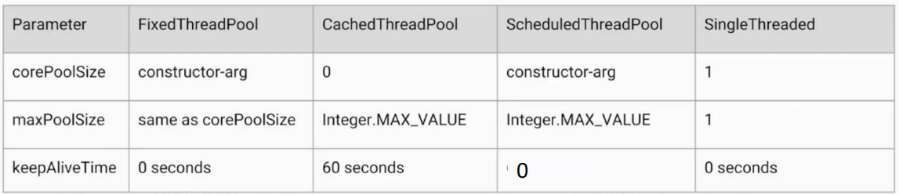

---


### 7.正确关闭线程池

1. ==shutdown==：==拒绝之后的执行请求==，但是当前==没有执行完的线程和任务队列中剩余的任务依旧继续执行==。

2. ==isShutdown==：判断当前==线程是否已经shutdown==。

3. ==isTerminated==：判断当前线程已经shutdown且==所有任务是否已经完成==。

4. ==awaitTermination==：检测线程池在==指定时间内是否terminated==。

5. ==shutdownNow==：==正在被线程执行的任务被interrupted，返回队列中的任务==。

	```java
	public class Shutdown {
	    public static void main(String[] args) throws InterruptedException {
	        ExecutorService threadPool = Executors.newFixedThreadPool(10);
	        for (int i = 0; i < 1000; i++) {
	            threadPool.execute(new Shutdown.Task());
	        }
	        Thread.sleep(2000);
	        // 返回队列中的任务
	        List<Runnable> unExecutedTaskList = threadPool.shutdownNow();
	        for (Runnable runnable : unExecutedTaskList) {
	            System.out.println(runnable);
	        }
	    }
	
	    static class Task implements Runnable {
	
	        @Override
	        public void run() {
	            try {
	                Thread.sleep(500);
	                System.out.println(Thread.currentThread());
	            } catch (InterruptedException e) {
	                System.out.println(Thread.currentThread() + " is interrupted!");
	            }
	        }
	    }
	}
	
	Thread[pool-1-thread-2,5,main]
	Thread[pool-1-thread-10,5,main]
	Thread[pool-1-thread-8,5,main]
	Thread[pool-1-thread-1,5,main]
	Thread[pool-1-thread-4,5,main]
	Thread[pool-1-thread-5,5,main]
	Thread[pool-1-thread-9,5,main]
	Thread[pool-1-thread-3,5,main]
	Thread[pool-1-thread-6,5,main]
	Thread[pool-1-thread-7,5,main]
	Thread[pool-1-thread-9,5,main]
	Thread[pool-1-thread-2,5,main]
	Thread[pool-1-thread-8,5,main]
	Thread[pool-1-thread-10,5,main]
	Thread[pool-1-thread-7,5,main]
	Thread[pool-1-thread-5,5,main]
	Thread[pool-1-thread-3,5,main]
	Thread[pool-1-thread-6,5,main]
	Thread[pool-1-thread-1,5,main]
	Thread[pool-1-thread-4,5,main]
	Thread[pool-1-thread-7,5,main]
	Thread[pool-1-thread-1,5,main]
	Thread[pool-1-thread-10,5,main]
	Thread[pool-1-thread-2,5,main]
	Thread[pool-1-thread-5,5,main]
	Thread[pool-1-thread-6,5,main]
	Thread[pool-1-thread-9,5,main]
	Thread[pool-1-thread-8,5,main]
	Thread[pool-1-thread-3,5,main]
	Thread[pool-1-thread-4,5,main]
	Thread[pool-1-thread-7,5,main] is interrupted! // 正在被线程执行的任务被interrupted
	Thread[pool-1-thread-9,5,main] is interrupted!
	Thread[pool-1-thread-8,5,main] is interrupted!
	Thread[pool-1-thread-2,5,main] is interrupted!
	Thread[pool-1-thread-5,5,main] is interrupted!
	Thread[pool-1-thread-6,5,main] is interrupted!
	Thread[pool-1-thread-10,5,main] is interrupted!
	Thread[pool-1-thread-4,5,main] is interrupted!
	Thread[pool-1-thread-1,5,main] is interrupted!
	Thread[pool-1-thread-3,5,main] is interrupted!
	garry.threadpool.Shutdown$Task@29453f44
	garry.threadpool.Shutdown$Task@5cad8086
	garry.threadpool.Shutdown$Task@6e0be858
	garry.threadpool.Shutdown$Task@61bbe9ba
	garry.threadpool.Shutdown$Task@610455d6
	garry.threadpool.Shutdown$Task@511d50c0
	garry.threadpool.Shutdown$Task@60e53b93
	...
	```

---


### 8.暂停和恢复线程池

==自定义==线程池，使用==钩子方法==pause和resume==实现线程池的暂停和恢复==。

```java
public class PauseableThreadPool extends ThreadPoolExecutor {

    private boolean isPaused;

    private final ReentrantLock lock = new ReentrantLock();

    // 和当前的锁绑定
    private final Condition unpaused = lock.newCondition();

    /*
        子类的构造函数必须要调用父类的构造函数才能完成父类的构造
     */
    public PauseableThreadPool(int corePoolSize, int maximumPoolSize, long keepAliveTime, TimeUnit unit, BlockingQueue<Runnable> workQueue) {
        super(corePoolSize, maximumPoolSize, keepAliveTime, unit, workQueue);
    }

    public PauseableThreadPool(int corePoolSize, int maximumPoolSize, long keepAliveTime, TimeUnit unit, BlockingQueue<Runnable> workQueue, ThreadFactory threadFactory) {
        super(corePoolSize, maximumPoolSize, keepAliveTime, unit, workQueue, threadFactory);
    }

    public PauseableThreadPool(int corePoolSize, int maximumPoolSize, long keepAliveTime, TimeUnit unit, BlockingQueue<Runnable> workQueue, RejectedExecutionHandler handler) {
        super(corePoolSize, maximumPoolSize, keepAliveTime, unit, workQueue, handler);
    }

    public PauseableThreadPool(int corePoolSize, int maximumPoolSize, long keepAliveTime, TimeUnit unit, BlockingQueue<Runnable> workQueue, ThreadFactory threadFactory, RejectedExecutionHandler handler) {
        super(corePoolSize, maximumPoolSize, keepAliveTime, unit, workQueue, threadFactory, handler);
    }

    /==
     * 在任务执行前判断当前线程是否处于暂停状态
     */
    @Override
    protected void beforeExecute(Thread t, Runnable r) {
        super.beforeExecute(t, r);
        lock.lock();
        try {
            while (isPaused) {
                unpaused.await(); // 让当前的线程暂停，直到被重新激活
            }
        } catch (InterruptedException e) {
            e.printStackTrace();
        } finally {
            lock.unlock();
        }

    }

    /==
     * 让当前线程暂停
     */
    public void pause() {
        lock.lock();
        try {
            isPaused = true;
        } catch (Exception e) {
            lock.unlock();
        }
    }

    public void resume() {
        lock.lock();
        try {
            isPaused = false;
            unpaused.signal();
            unpaused.signalAll(); // 唤醒该Condition上全部的线程
        } catch (Exception e) {
            lock.unlock();
        }
    }

    public static void main(String[] args) throws InterruptedException {
        PauseableThreadPool threadPool = new PauseableThreadPool(10, 10, 0L, TimeUnit.SECONDS, new LinkedBlockingDeque<>());
        Runnable runnable = new Runnable() {
            @Override
            public void run() {
                System.out.println("我被执行");
                try {
                    Thread.sleep(10);
                } catch (InterruptedException e) {
                    e.printStackTrace();
                }
            }
        };
        for (int i = 0; i < 10000; i++) {
            threadPool.execute(runnable);
        }
        Thread.sleep(1500);
        threadPool.pause();
        System.out.println("线程池被暂停...");
        Thread.sleep(1500);
        threadPool.resume();
        System.out.println("线程池被恢复...");
    }
}
```

---


### 9.线程池实现复用的原因

1. > 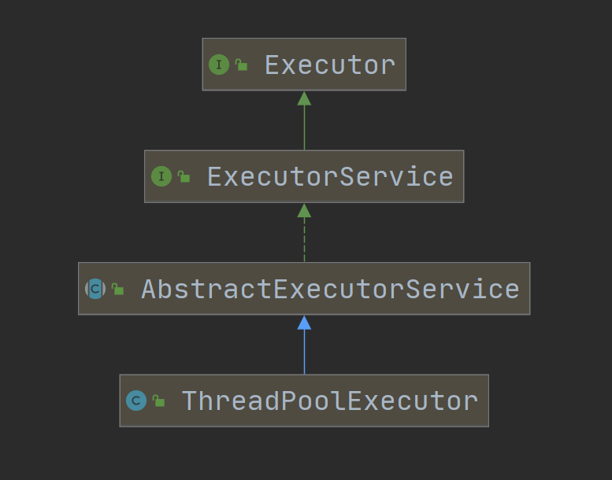

2. ==线程池里的线程只被start一次==，之后它会一直==检测任务队列有没有新的任务==，==调用任务的run方法==。

---


### 10.线程池状态

1. > 

---


