# 1.Java系列

## 1.Java基础

### 1.介绍一下 Object 常见方法？🌟🌟🌟🌟🌟

==我的回答==：

1. Object 的常用方法包括  getClass(), equals(Object), hashCode(), toString(), notify(), notifyAll(), wait(无参/long/long, int), finalize() ，下面我将一一进行介绍。

2. getClass() 方法用于返回对象==运行时的类对象(Class对象)==。可进一步获取某一对象运行时类的信息。

	> ```java
	> /* Returns the runtime class of this {@code Object}.
	> ```

3. equals 方法==默认情况下使用 == ， 比较引用类型是否相等==。比如 String 类中就重写了此方法，优先比较两对象的地址和运行时类是否相同，随后以比较字符串的方式比较两个 String 对象。

4. hashCode  方法==在默认情况下根据对象的内存地址返回一个int整数==。

	```java
	/* This is typically implemented by converting the internal address of the object into an integer
	```

	==值得注意的是：由于 hashCode 方法可以被重写，因此其返回值不能直接和对象的内存地址挂钩==。hashCode 方法可以用于==帮助 HashMap 实现哈希映射==，但是一个对象在 HashMap 中映射的结果并不等同于其 hashCode，而是基于 hashCode 做了一层封装。

	```java
	static final int hash(Object key) {
	    int h;
	    return (key == null) ? 0 : (h = key.hashCode()) ^ (h >>> 16);
	}
	```

	此外还规定：==如果两个对象使用 equals 方法得到 true 的话，那么它们的 hashCode 必须相同==。

	```java
	/* If two objects are equal according to the {@code equals(Object)} method, then calling the {@code hashCode} method on each of the two objects must produce the same integer result.
	```

	所以==一般两个方法会一同被重写==。

	```java
	@Override
	public boolean equals(Object o) {
	    if (this == o) return true; // 先判断内存地址是否一致，相同则必然相等
	    if (o == null || getClass() != o.getClass()) return false; // 然后判断两对象的运行
	    // 时类型（getClass( )方法）是否与该对象一致，不一致就肯定不相等
	    ThisClass that = (ThisClass) o;
	    return field1 == that.field1 && // 基本数据类型字段直接判断值是否相等
	        field2.equals(that.field2) && // 引用类型则调用其各自的 equals 方法
	        field3.equals(that.field3); // field1 为基本类型，2、3为引用类型
	}
	
	@Override
	public int hashCode() { // 同时重写 hashCode 方法
	    return Objects.hash(field1, field2, field3);
	}
	```

5.  toString  方法用于生成一个 String 字符串以描述一个对象。==默认情况下为==

	```java
	object.getClass().getName() + "@" + Integer.toHexString(object.hashCode())
	```

	==建议所有的类都自行实现 toString 方法==，以更友好的方式告诉程序员某个对象。

6. wait(无参/long/long, int) 方法用于==将此对象上的线程置于等待状态==，直到它被另一个线程以该对象的 notify 方法或 notifyAll() 方法唤醒。

7. notify(), notifyAll() 用于==唤醒某一对象上处于等待状态的线程==。值得注意的是， notify() 随机挑选一个线程唤醒，而另一个则唤醒全部线程。

8. finalize() 方法用于在JVM垃圾回收阶段，==当一个对象将被回收时，会先调用其 finalize() 方法==，目的是==尝试让该对象获得 GC Roots 的引用以逃过这次回收==。

==参考答案==：

- Object 类常见的方法有 toString( )，equals( ) 和 hashCode( )，wait( ) 和 notify( ) 等等。下面分别说一下：
- ==toString( ) 返回的是对象的字符串表示==，==默认为 「class 名 + @ + hashCode 的十六进制表示」==，我们一般会在子类将它重写为打印各个字段的值，==在调试和打日志中用的多==。
- ==equals( ) 和 hashCode( ) 通常用于对象之间的比较==。其中 equals( ) 用于判断两个对象是否相等，==默认使用 “= =” 判断==，hashCode( ) 用于获取对象的哈希码，==默认以对象的内存地址为参考==。在实践中，==为了保证元素在 HashMap 和 HashSet 等集合中的正确存储，通常需要将它俩一起重写==。
- wait( )，notify( ) 以及 notifyAll( ) 通常用于==线程间的协作和同步==。其中 ==wait( ) 使当前线程释放锁并进入等待状态==，直至被其它线程的 notify 或 notifyAll 唤醒。
- notify( ) 会在对该对象调用了 wait( ) 的线程中，==随机挑选一个唤醒，解除其阻塞状态==。而 notifyAll( ) 会唤醒==所有==在该对象上等待的线程。==wait( ) 搭配 notify( ) 可以实现一个简单的“生产-消费模型”：生产者线程产生消息后，调用 notify( ) 唤醒消费者。消费者被唤醒后消费消息，消费完成后调用 wait( ) 等待==。

> 参考答案里举了更多的例子，使得回答更形象具体，让面试官感觉你是真的懂并且能够正确运用，而不是只会干巴巴地背诵。

---


### 2.Java为什么被称为平台无关性语言？🌟🌟🌟🌟🌟

==我的回答==：

1. 首先我想说说==什么是平台无关性语言==。平台无关性语言是指“==一次编译，处处运行(Write once, run anywhere)==”的语言，平台无关性是java的设计者在设计java时的美好愿景。
2. Java实现“一次编译，处处运行”的方法是通过==javac编译器将Java源代码编译为的字节码==，而==不同的操作系统有不同的JVM==，==JVM将同一份字节码翻译为对应操作系统的指令集==，这样就让原本不能跨平台的Java源代码实现了平台无关性。

==参考答案==：

- 平台无关性是说，==一种语言在一台计算机上的运行不受平台的限制，一次编译，到处运行==。
- Java 语言具有平台无关性的关键在于 JVM。虽然==不同的操作系统使用不同的机器指令集来执行任务，同一份代码在不同的操作系统上可能无法直接执行==，但是 Java 源文件经过 ==javac 编译器编译后形成的二进制字节码，可以被各个操作系统的 JVM 翻译成该操作系统所需的指令集==，进而执行。这可以提高 Java 程序的可移植性，因为==只需针对不同操作系统提供对应的 JVM 即可，无需修改源代码==。

---


### 3.= =和equals有什么区别？🌟🌟🌟🌟🌟

==我的回答==：

1. ====是一个操作符==，可以比较==基本数据类型==之间和==引用数据类型==之间是否相等。而 ==equals 是 Object 类的一个方法==，==只能比较两个引用数据类型==是否相等。

2. 具体地说，====比较基本数据类型时，就直接比较值是否相等==。比如int就比较整型值是否相等，boolean就比较布尔值。而==\==比较引用数据类型时，则比较对象的内存地址是否一致==。

3. 而 ==equals 方法在 Object 方法中就是使用 == 比较两个对象是否相等==：

	```java
	public boolean equals(Object obj) {
	    return (this == obj);
	}
	```

	但是==我们可以根据不同对象的意义重写此方法==，以自定义的方式判断两个对象是否相等。比如 String 类就重写了 equals 方法，优先判断两个对象的内存地址和运行时类型是否一致，然后以比较字符串的方法判断两个 String 对象是否相等。==由于要求 equals 为 true 的两个对象的 hashCode 也必须相同，因此一般该方法的重写会伴随着 hashCode 方法的重写==。

	```java
	@Override
	public boolean equals(Object o) {
	    if (this == o) return true; // 先判断内存地址是否一致，相同则必然相等
	    if (o == null || getClass() != o.getClass()) return false; // 然后判断两对象的运行
	    // 时类型（getClass( )方法）是否与该对象一致，不一致就肯定不相等
	    ThisClass that = (ThisClass) o;
	    return field1 == that.field1 && // 基本数据类型字段直接判断值是否相等
	        field2.equals(that.field2) && // 引用类型则调用其各自的 equals 方法
	        field3.equals(that.field3); // field1 为基本类型，2、3为引用类型
	}
	
	@Override
	public int hashCode() { // 同时重写 hashCode 方法
	    return Objects.hash(field1, field2, field3);
	}
	```

==参考答案==：

- 首先 === = 是一个操作符== ，==equals 是超类 Object 中的方法==，==默认==是用 = = 来比较的。也就是说，对于没有重写 equals 方法的子类，equals 和 = = 是一样的。
- 而 = = 在比较时，根据所比较的类的类型不同，功能也有所不同：对于==基础数据类型==，如 int 类型等，==比较的是具体的值==；而对于==引用数据类型==，比较的是==引用的地址==是否相同。
- 对于重写的 equals 方法，比的内容==取决于这个方法的实现==。

---


### 4.讲一下equals()与hashcode()，什么时候重写，为什么重写，怎么重写？🌟🌟🌟🌟🌟

==我的回答==：

1. 首先我想说说 equals 和 hashCode 方法。它们都是 Object 类的方法。在==默认情况下，equals 方法采用 == 操作符比较引用类型的内存地址==，而 ==hashCode 方法默认情况下根据内存地址返回哈希值==。

2. 由于 equals 方法默认只能比较引用类型的内存地址，而==在业务中我们常常有自己判断两个对象是否相等的逻辑==，比如一个 Person 类有 name 和 identity 两个字段，我们可以认为这两个字段都相同的 Person 实例对象相等，于是就可以重写 Person 类的 equals 方法。

3. 由于有==规定：如果两个对象使用 equals 方法相同，那么它们的 hashCode 也必须相同==。因此 ==equals 方法的重写一般也伴随着 hashCode 方法的重写==。

4. 至于重写的方法，还是以上述的 Person 类为例，重写 equals 方法时，可以==先判断内存地址是否一致==，相同则必然相等，然后==判断两对象的运行时类型（getClass( )方法）是否与该对象一致==，不一致就肯定不相等，最后对于==基本数据类型字段直接判断值==是否相等，而==引用类型则调用其各自的 equals 方法==。

	```java
	@Override
	public boolean equals(Object o) {
	    if (this == o) return true; // 先判断内存地址是否一致，相同则必然相等
	    if (o == null || getClass() != o.getClass()) return false; // 然后判断两对象的运行
	    // 时类型（getClass( )方法）是否与该对象一致，不一致就肯定不相等
	    ThisClass that = (ThisClass) o;
	    return field1 == that.field1 && // 基本数据类型字段直接判断值是否相等
	        field2.equals(that.field2) && // 引用类型则调用其各自的 equals 方法
	        field3.equals(that.field3); // field1 为基本类型，2、3为引用类型
	}
	```

5. 重写 hashCode 方法可以使用==工具类 Objects 的 hash 方法==根据所有指定字段返回一个哈希值。

	```java
	@Override
	public int hashCode() { // 同时重写 hashCode 方法
	    return Objects.hash(field1, field2, field3);
	}
	```

==参考答案==：

- 首先 equals( ) 是 Object 中的方法，默认是用 = = 来比较的。hashCode( ) 也是 Object 类的方法，根据一定的规则将与对象相关的信息，比如对象的内存地址，映射成一个数值，这个数值称作为哈希值。
- 有时候我们想要==自定义类的比较规则时，需要重写 equals( )==，但是为了==保证类在 HashSet 和 HashMap 等集合中的正确存储，也要同时重写 hashCode( )== 。
- 以 HashMap 为例， ==HashMap底层在添加相同的元素时，会先调用两个对象的 hashCode( ) 是否相同，如果相同还会再用 equals( ) 比较两个对象是否相同==。
- 假设有一个 Person 类，有 name 和 age 两个字段，我们现在重写 equals( ) 规定只有两个 Person 的 name 和 age 都相同时，才认为两个 Person 相等。现在 new 出两个 name 和 age 都相同的 Person，分别添加到 HashMap 中。
- ==我们期望最后 HashMap 中只有一个 Person，但其实是有两个==。原因在于添加第二个 Person 时，先比较的是两个 Person 的 hashCode( )，注意此时我们==没有重写 hashCode( ) ==，那么分别 new 出来的 Person 的哈希值肯定是不同的，到这里 HashMap 就会将两个 Person 认定为不同的元素添加进去。
- 解决的办法就是重写 hashCode( )，最简单的返回 name 和 age 的哈希值的乘积即可。

---


### 5.讲一下重载和重写的区别？🌟🌟🌟🌟🌟

==我的回答==：

1. ==重载==是指在一个类中，可以==定义多个方法名相同的方法==，它们的参数个数或类型必须不同，而==返回类型对方法是否构成重载没有影响==，比如一个方法如果只有返回类型和另一个类中的方法不同，不构成重载。
2. ==重写==是指子类某个方法==覆盖了==其父类或实现的接口中的某个方法。这两个方法必须方法名，参数完全相同，==返回类型相同或子类返回类型为父类返回类型的子类==。
3. 同时，==子类重写的方法不能缩小父类方法的访问范围==。比如如果父类方法是 public，那么子类方法就只能是 public，而不能是 protected 或 private，因为这会缩小父类方法的访问范围，如果不同包下的一个类可以调用父类接口，但是==如果父类的运行时类型是子类，那么就会出现没有子类访问权限的问题==。
4. 此外，==子类还不能重写父类的 static 和 private 方法==。对于 static 方法，因为==方法覆盖是基于运行时动态绑定的，而 static 方法是编译时静态绑定的==。==static 方法跟类的任何实例都不相关==。
5. 而被 ==private 修饰的方法只能在本类中被调用==，因此==子类无法访问父类的 private 方法==，自然不能重写。

==参考答案==：

- 重载是指在同一个类中定义多个方法，它们具有相同的函数名，但参数的类型，个数和顺序可能不同。它提供了一种灵活的方式来实现相似的功能。
- 重写是指在子类中重新定义并覆盖父类中的方法。它使子类可以根据具体的类型调用相应的方法实现。
- 在 JVM 中，==方法重载对应 “静态分配” 的过程==，也就是 ==JVM 在编译期就根据参数(重载方法的参数)的静态类型，决定了会使用方法的哪个重载版本==。而==方法重写对应 “动态分配” 的过程==，具体的，重写方法的调用是由字节码中的 invokevirtual 指令实现的，而 ==invokevirtual 指令会在运行(Runtime)期间，根据方法接受者的实际类型来选择方法的执行版本==。

---


### 6.抽象和接口的区别？🌟🌟🌟🌟🌟

==我的回答==：

1. 抽象关键字 ==abstract 可以作用于类或方法==。被 abstract 修饰的方法没有方法体，其方法体由子类自行实现，因此==如果一个类存在 abstract 方法，那么它也必定是抽象类==，且==不能 new 创建实例==（因为其抽象方法没有方法体）。但是==抽象类本质上还是一个类(Class)==，它依然==可以有成员变量，构造器，静态代码块，并可以继承自或实现其它类==。
2. 接口关键字 ==interface 只能作用于类==。在 ==jdk7 及更早版本中，interface 下的所有方法都默认为 public abstract== 类型。而在 ==jdk8 及之后的版本中==，==interface 允许拥有被 static 或 default 修饰的方法==。其中==接口类中的 static 方法只能被本接口调用==。而==被 default 修饰的方法允许在接口类中定义默认的方法体，即它的实现类可以选择性地重写被 default 修饰的方法==，这一点和继承很类似，在我看来接口中 default 方法设计的初衷是对 java 单继承机制的一个补充，实际上==接口本身就是对 java 单继承机制的补充==，只不过被 default 修饰的方法与继承关系中子类重写父类方法的行为逻辑更相似。==接口类中允许存在字段，但是所有的字段都默认为 public static final== 类型，因此对于一个项目中的常量，我们可以把它们放到一个接口类中，然后所有需要使用这些常量的其它类只需实现这个接口即可安全的使用这些常量。接口类同样不能创建实例，和抽象类不同的是，==接口类不能有构造器和静态代码块==，并且==只能实现其它接口而不能继承其它类==。

==参考答案==：

- 抽象在 Java 中是指被 abstract 修饰的类或方法，接口是指被 interface 修饰的类。接口中声明的方法，默认也被定义为 abstract 。
- ==抽象主要是为了代码复用==。比如一些类拥有一些通用的功能，为了不在每一类中重新写一遍这个方法的代码，就可以定义一个抽象类，这样一来，只需让每一个类继承抽象类就可以了，如果后期需要修改方法，只需要修改抽象类中的方法就行，如果子类想要自己实现不一样的行为，只需子类重写抽象类的方法。
- 这样一来，普通类就可以完成这个工作，为什么需要抽象类，==抽象类还起了一个限制作用==，比如要求每一个子类必须自己独特实现的一个方法，也是抽象类定义的抽象方法。
- 缺点也很明显，因为Java没有多继承，导致一个类只能继承一个父类。在表示是什么的关系时，一般使用抽象类。
- ==接口更多的是为了解耦==。比如==我需要制定一套方法的规范，就可以将这套方法规范抽象为一个接口==。每一个继承这个接口的类都必须实现接口中所有的方法。在表示有什么的关系时，使用接口。

---


### 7.谈一谈你对 final 关键字的理解？什么需要用这个关键字来定义呢？🌟🌟🌟🌟

==我的回答==：

1. final 关键字可以修饰类，方法，成员变量以及局部变量。
2. 当修饰类时，该类无法被继承。==比如基本类型的包装类以及 String 都被 final 修饰，它们不能被继承，因此在实际的业务中我们不同担心在调用这些类的方法时会动态绑定到其它类==，因为它们不能被继承，也就没有子类了，因此==我们可以把业务中的核心类设置为 final，以提高安全性==。
3. 当修饰方法时，表示该方法不能被子类重写。类似的，==把核心 api 设置为 final，避免运行时动态绑定==。
4. 修饰成员变量时，该成员变量无法被修改，因此==必须赋初值==。当成员变量不是 static 时，可以在==初始化，构造器或普通代码块==中进行赋初值；而对于 static 成员变量，则只能在==初始化和静态代码块==中赋初值。
5. 值得注意的是，当成员变量为引用类型变量时，只是==引用变量的地址不能改变，但是放的内容可以改变==。
6. 此外，==final 不能修饰构造器==。当 ==final static 连用时，JVM 底层做了优化，不会加载类==。

==参考答案==：

- final是Java中的一个关键字，可以用来修饰类、方法、变量。
- 当用final来修饰类时，表示这个类不可以被继承，==可以确保一些安全性，防止类被纂改==。而final用来修饰方法，表示方法不可以被重写，final修饰变量时，如果是基本数据类型，值不变。
- 如果是==引用类型，引用指向的地址值不变，但地址的内容可能会变==。==final可以用来解决一些安全性问题（多态中的安全）。比如Java的一些核心类库的类的API接口不想被纂改就使用final修饰方法==。
- ==Java希望String类是不可变的，就使用final修饰String类并且修饰成员变量char[]数组，并且没有提供setter方法，这样就可以确保String类是不可变的（举例说明 final 的使用场景，解决安全性问题）==。
- 另外，如果有多个线程操作同一个变量，并且这个变量的值不会变化，可以考虑使用final修饰解决线程安全问题。

---


### 8.异常连击，按照提问逐一回答🌟🌟🌟🌟

==问题一==：==说一说你对异常的理解？==（指导：就是回答异常有啥用之类的）

==我的回答==：

1. ==程序遇到未经处理的异常时会终止，而捕获异常并处理后程序可以继续运行==。
2. 我们可以==将可能会出现错误的代码单独提出来==，当出现异常时进行捕获并处理，保障程序的正确进行并为后续维护提供帮助。比如我们在捕获到异常后可以把异常发生的位置和详细情况写到日志中，这样运维人员可以根据日志内容对程序进行排查和修复，以避免后续出现同样的异常。

==参考答案==：

- 异常是程序在执行过程中可能发生的一些错误，==它会暂时终止程序，并转到异常处理部分尝试恢复==。异常的出现可以使==我们把程序中可能出现错误的代码从正常代码中分离出来，单独进行处理==。

---

==问题二==：==异常有哪些种类，可以举几个例子吗？（指导：先回答分类，之后举几个自己经常看到的例子）==

==我的回答==：

1. ==异常类 Exception 继承自 Throwable，同样继承自 Throwable 的还有 Error 类==。==Error 是指程序遇到的无法处理的严重错误，比如 StackOverFlow Error （栈溢出） 和 OutOfMemory（OOM，内存不足）Error==。而 ==Exception 可以通过代码进行处理==。
2. ==Exception 类下的异常可以分为有 RuntimeException 和 CheckedException==。==CheckedException 为编译时异常，其在编译期就可以被 JVM 检测出来==，值得注意的是 ==CheckedException 并不是 java.lang 包下的类==，而只是作为一个分类存在。常见的编译时异常有 FileNotFoundException，ClassNotFoundException，IOException 等。
3. 而 ==RuntimeException 为运行时异常，在编译期无法被发现，只有程序运行时才会被检测到==，比如指针异常，数组越界异常，类型转换异常等。

==参考答案==：

- 类似于 Object 类，==Throwable 是所有异常的父类==。下一层分为 Error 类和 Exception 类。
- ==Error 类表示严重的错误，一般由 JVM 和底层系统引发，并且不可恢复==，例如内存溢出，class 没有主方法等。==Exception 类是可以被程序捕获和处理的异常情况==。
- Exception 再往下，按照异常的性质又分为==编译异常 CheckedException 和运行时异常 RuntimeException==。其中==编译异常在编译阶段就能被检测出==，例如 IO 异常 IOException，文件找不到异常 FileNotFoundException等。==运行时异常只有在程序运行时才能被检测出==，例如空指针异常 NullPointerException，数组下标越界 ArrayIndexOutOfBoundsException 等。

---

==问题三==：==throw 和 throws 有啥区别？直接 try catch 不好吗，为啥还要抛呢？（指导：有时候自己无法处理，必须得让调用该方法的人来处理，于是得用抛出）==

==我的回答==：

1. ==throw 是一个关键字==，用于手动抛出异常，==后面跟的是异常对象==。比如我们可以自定义一个异常，然后当业务出现某个特定错误时，我们可以人为抛出这个自定义异常，以便对其进行特定处理。
2. ==throws 是处理异常的一种方式==，它存在于方法的声明处，后面跟的是异常的类型，这些异常不会在本方法中进行处理，而是==抛给它的调用者，由调用者进行处理==。
3. try-catch 只能在本方法中处理异常，而 throws 则是将异常抛给调用者进行处理，==如果出现本方法中无法处理异常的情况，就需要用 throws 让方法的调用者尝试处理此异常==。

==参考答案==：

- ==throw 用在方法体内==，表示某个地方需要抛出一个异常，是一个具体的动作。而 ==throws 用在方法声明后面==，表示这个方法可能会抛出哪些异常，是一个声明。
- 这个需要分情况对待。首先，对于能在方法内处理的异常，可以直接用 try catch，但对于在==当前方法内无法处理的异常，我们只能选择抛出==，将它交给方法调用者去处理。其次，==有时多个方法可能会抛出相同类型的异常，如果每个方法都用 try catch 会非常冗余，这时可以在这些方法中只 throw，在调用这些方法的地方整体 try catch，统一进行处理==。
- 还有的话就是，有时候得把异常交给上层调用的人来处理。

---

==问题四==：==try catch会影响性能吗？为什么抛出异常的时候会影响性能？==

==我的回答==：

1. 如果程序==没有产生异常，则对性能几乎没有影响==。只有程序==捕获异常时才会影响性能==。
2. 程序捕获到异常的时候，会==跳转到 catch 代码块中执行处理异常的逻辑==，因此会影响性能。

==参考答案==：

- 几乎不会，也就是==程序没有异常时，try catch 加和不加性能几乎一样==，只有在程序==有异常需要捕获时才会影响性能==。
- 原因在于，==处理异常的 catch 语句在 class 文件中是用异常表实现的==。异常表有四个字段，分别是 From, To, Target 和 Type。From 和 To 分别对应 try 块对应的行号，如果其中有异常抛出，会跳转到 Target 对应的行号，也就是 catch 语句对应的位置，而这个异常的类型记录在 Type 中。如果程序在 try 中没有异常抛出，最终会通过一条 goto 指令跳转到 try catch 块后的语句继续执行，这一条 goto 指令性能的消耗可以忽略不计。==如果有异常，才会去查异常表，再跳转到对应的 catch 块位置去执行，这个过程可能会影响性能==。

---

==问题五==：==try-catch-finally 中，如果 catch 中 return 了，finally 还会执行吗？==

==我的回答==：

1. ==无论是在 try 中 return 还是在 catch 中 return，finally 都会被执行==。在 catch 中 return 时，==程序会先把当前的返回值存到一个 temp 中，然后执行 finally 中的代码==。

2. 比如 catch 中返回 a，会==先把此时 a 的值赋给 temp，然后执行 finally==，那么这时候==就算 finally 中改变了 a 的值，catch 中返回值也不会变化，因为修改 a 无法影响 temp 的值==。

	```java
	public static void main(String[] args) {
	    System.out.println("the return value of f() is " + f()); // 2
	}
	
	static int f() {
	    int a = 1;
	    try {
	        throw new RuntimeException();
	    } catch (RuntimeException e) {
	        a = 2;
	        return a;
	    } finally {
	        a = 3;
	    }
	}
	```

3. 但是，==如果在 finally 中也有 return 的话，就直接返回 finally 中的 return==，否则就会返回 temp。

	```java
	public static void main(String[] args) {
	    System.out.println("the return value of f is " + f()); // 3
	}
	
	static int f() {
	    int a = 1;
	    try {
	        throw new RuntimeException();
	    } catch (RuntimeException e) {
	        a = 2;
	        return a;
	    } finally {
	        a = 3;
	        return a;
	    }
	}
	```

==参考答案==：

- 会的，==无论 catch 块中有异常还是有返回语句，最终一定会在方法真正结束之前执行 finally==。
- 但是需要考虑一种==特殊情况==，就是如果 ==try 块中抛出了异常但没有被 catch 捕获，且此时 finally 中也抛出了异常==，那么 ==finally 中的异常会覆盖掉 try 中的异常，成为这个方法最终抛出的异常==。实践中需要注意一下这个异常覆盖问题。

---


### 9.String 五连击按照提问逐一回答🌟🌟🌟🌟🌟

==问题一==：==String 为什么要设计为不可变类==？（指导：可以从安全性，性能等方面来考虑）

==我的回答==：

1. ==String 被 final 修饰，String 的本质是一个 char[] 字符数组，它也被 final 修饰，在堆中的地址不能改变，并且 String 没有对外提供接口改变 char[] 的内容的 api==。因此可以保证一个 String 实例对象在运行时无法改变，因此在并发条件下不用担心 String 对象的同步问题，具有线程安全性。

==参考答案==：

- 这个主要是出于==线程安全==和==性能方面==的考虑。

- 线程安全体现在，由于 String 是不可变的，==多个线程共享一个 String 时不用担心它的同步问题==；

- ==性能体现在缓存哈希值和设计常量池上==。==String 在被创建时就缓存了自己的哈希值，==

	```java
	/== Cache the hash code for the string */
	private int hash; // Default to 0
	```

	==使用时直接拿出来就行，不用重新计算==，==这使得 String 适合用来作为 Map 的 Key，可以快速获得 Key 的哈希值==，提高查找和比较的效率；除此之外，基于 String 的不可变，==Java 使用常量池来尽可能的共享相同的字符串，来节约 String 的存储空间==。具体的，当我们使用字面值==创建 String 时，会先去查它是否已经存在于常量池中，如果是则直接返回这个已存在于常量池中的字符串的引用，而不会在堆区创建新的对象==。

---

==问题二==：==String a = new String(“aa”) + “bb” “这句话创建了多少个对象？为什么？==

==我的回答==：

1. 创建了4个对象。首先在==常量池创建 "aa" 字符串常量对象==。然后==在堆区创建 String 实例对象，并使其 value 字段指向常量池中的 "aa" 字符串常量对象==。随后在==常量池创建 "bb" 字符串常量对象==。最后：

	```java
	StringBuilder builder = new StringBuilder;
	builder.append("aa");
	builder.append("bb");
	a = builder.toString(); // 在此又创建了一个 String 实例对象
	```

	将这两个字符串常量进行拼接，创建出 a 对象，共4个对象。

==参考答案==：

- 共创建了 4 个 String 对象，第一个是常量池中的对象 “aa”，如果常量池中有 “aa” 就直接返回，没有就创建并添加进常量池中。第二个是 new 出来的以 “aa” 为初始值创建的 String 对象，第三个 “bb” 同 “aa”，第四个是通过 “+” 拼接前两个对象，创建出的新 String 对象。

---

==问题三==：==String 对象最多可以存放多少个字符（长度）？（指导：可以从源码角度分析勒）==

==我的回答==：

1. String 的本质是一个 char[] 字符型数组，由于==数组的 length 字段的类型是 int，因此该字符型数组的长度最大为 $2^{31}-1$==。

2. 但是 ==JVM 字节码的常量池部分规定 CONSTANT_Utf8_info 的 length 只能用两个字节表示==：

	> 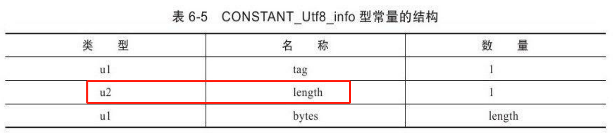

	因此 ==String 的长度不能超过 $2^{16}-2$，否则无法通过编译==。

==参考答案==：

- String 在源码中使用 char[] 来维护字符序列的，而 ==char[] 的长度是 int 类型，所以理论上 String 的长度最大为 2^31−1== ，占用空间大约为 4 GB，不过根据实际 ==JVM 的堆内存限制，编译时，String长度最多可以是2的16次方减2==，运行时长度最多可以是2的31次方减1，意思是==可以在编译时定义一些短的字符串，运行时可以进行拼接，长一点也可以==。

---

==问题四==：==字符串常量池是放在堆中吗？==

==我的回答==：

1. ==字符串常量不是放在堆中的，而是放在方法区的常量池中==，并且在编译期生成字节码的时候便已完成。

==参考答案==：

- 不是，==Java 8 以前被放在永久代中==，==Java 8 及以后被放在方法区的元数据 metadata 中==。

---

==问题五==：==String中 “+” 和 StringBuffer 中的 append 会有性能上的差别吗？==

==我的回答==：

1. 有差别。String 中的 "+" ==本质是创建 StringBuilder 实例对象，调用其 append 方法，然后再 toString== ==在堆区创建拼接后的新的 String 实例对象，最后将其赋给变量==，这样做是因为 String 本身是不可变的，其 value 一旦初始化完成便不能改变，同时没有 setter 方法因此其内容也无法改变。
2. 而 StringBuffer 的 value 没有被 final 修饰，并且 ==StringBuffer 的父类 AbstractStringBuffer 提供了齐全的对 value CRUD 操作的 api==，因此 StringBuffer 的 append 不用创建新对象，而是==直接修改 value 字段==，因此其性能大于 String 中的 "+" 操作。

==参考答案==：

- ==String 的 “+” 效率低于 StringBuffer 的 append( )==。原因在于 ==String 是不可变类，任何对 String 的操作都会创建新的 String 对象==。而 “+” 的执行过程实际上是==先创建了一个 StringBuffer，然后调用 append( )，最后在 toString( )==。效率上肯定是不如 StringBuffer 直接 append( ) 高的。

---


### 10.聊一聊你对多态的理解？🌟🌟🌟🌟

==我的回答==：

1. ==多态允许一个对象编译时的类型和运行时的类型不一致，即父类的指针可以指向子类的实例==。==编译类型在对象创建时就已经确定，而运行时类型可以动态地绑定在子类的实体上==。
2. 多态允许对象在允许过程中向上转型和向下转型。==向上转型是指父类的引用指向了子类的实体==。父类引用可以调用父类的所有方法，但是==不能调用子类的方法，这在编译阶段就决定==了。而==父类方法的具体实现则会动态地绑定到子类上，取决于子类的具体实现==。
3. ==向下转型则是将父类的引用强制转换为子类的引用，前提是在转换前父类的引用必须指向子类的实体==。在向下转型之后，新的子类引用就可以调用子类所有的方法。
4. 值得注意的是，当==调用对象的方法时，会根据该对象的内存地址/运行时类型进行动态绑定==，而==对象的字段在调用时则没有动态绑定机制，哪里声明，就在哪里调用==。

==参考答案==：

- 多态可以理解为 “事物运行时的不同状态”，在 Java 中==具体指，通过动态绑定，在运行时根据对象的实际类型来调用对应的方法==。多态可以通过继承或者接口来实现。拿继承来说，子类必须重写父类的方法，通过向上转型，使用父类类型来调用子类对象的方法，结果是在运行时执行子类中重写的方法。
- ==实践中我的项目的支付模块就用到了多态==。具体来说，有一个基类 “支付方式 Payment”，它有一个 pay 方法，之后分别创建 “微信支付 WeChatPay” 和 “支付宝支付 AliPay” 两个类，并且都继承自 Payment 并重写 pay 方法。那么在之后的支付代码中，无论用户选择的哪种支付方式，都可以统一用 Payment 来进行具体的 pay 操作。原因是 ==Java 的动态绑定会确保这个方法在真正执行时，去调用子类中微信或者支付宝的 pay 方法==。另外，在修改具体的支付逻辑时，也只需单独去微信或者支付宝的类里面去修改，而不用动主逻辑里面的代码，体现出多态的灵活和可扩展性。
- 除了以上说的运行时多态，==我还听说过一个有争议的编译时多态，它具体指 Java 中的方法重载==，在编译期就根据已知的参数列表，决定了需要调用的方法。不过一般说多态都默认说的是运行时多态。

---


### 11.StringBuilder、StringBuffer有什么区别？🌟🌟🌟🌟🌟

==我的回答==：

1. ==StringBuffer 的底层是一个可变的 char[] 字符型数组==。和 String 不同的是，==StringBuffer 的 char[] 没有被 final 修饰==，并且 StringBuffer 的直接父类 ==AbstractStringBuffer 提供了针对 char[] 的 CRUD 方法==，它们==不需要像 String 那样遇到修改只能重新创建字符型常量和变量，并更改引用==，而是==直接修改 char[]==，从而显著提升了修改的效率。
2. 而 StringBuilder 相比于 StringBuffer，最大的不同是 ==StringBuilder 没有像 StringBuffer 那样对众多涉及char[] 修改的方法使用 synchronized 关键字加互斥锁实现线程安全==，换言之，==StringBuilder 是线程不安全的==，但也正因如此其运行效率在大多数情况下快于 StringBuffer，这使得==在单线程的环境下我们可以优先选择使用 StringBuilder 来构建 String 对象==，以谋求更高的效率。

==参考答案==：

- ==StringBuilder 和 StringBuffer 都是可变类，任何对它们的操作都不会产生新的对象==。两者的区别在于：==StringBuilder 没有加锁不是线程安全的，而 StringBuffer 大多数方法都加了 synchronized，是线程安全的，但执行效率会低点==。

- 源码中有一个细节，就是 ==StringBuffer 的 append 方法在执行真正的字符串拼接逻辑之前，会先清除 toStringCache，它是用来缓存最后一次 toString 结果的地方，主要用来加快 toString 的执行效率==。

	```java
	public synchronized StringBuffer append(StringBuffer sb) {
	    toStringCache = null; // 清空 toString 缓存
	    super.append(sb);
	    return this;
	}
	```

---


### 12.什么是序列化？什么情况下需要序列号？序列化在Java中是怎么实现的？🌟🌟

==我的回答==：

1. ==序列化是将java对象转化为二进制字节流的方法==。如果一个对象想要进行序列化，那么其类==必须实现 Serilizable 接口或 Externalizable 接口==。
2. 序列化一般用于在==向持久型数据库写入数据==，==使用 Redis 等键值对数据库进行数据缓存==，以及==网络传输中需要将对象序列化为字节流才能进行传输==。
3. 在Java中我们使用使用==对象IO流进行对象的序列化和反序列化==。比如在一个多用户即时通讯项目中，我们可以将一个==用户的 Message 对象通过 ObjectOutputStream.writeObject 方法转换为二进制流进行对象的网络传输==。而服务端在接收到此二进制流后也可以==使用 ObjectInputStream.readObject 方法将收到的二进制字节流反序列化为 Object 对象，并向下转型为所需的 Message 对象==，从而实现网络通讯。

==参考答案==：

- ==参考回答==1：
- ==序列化就是指将 Java 对象转换成二进制字节流的过程==。
- 当我们需要对某些对象进行==持久化==时，需要先对它们序列化成二进制字节序列，然后存到数据库或者内存中。或者两个 Java 进程==远程通信==时，也需要==将 Java 对象转换为字节序列才能在网络中传送==。
- 首先被序列化的对象一定需要==实现 Serializable 或 Externalizable 接口==。序列化与反序列化分别是通过 Java io 包下的 ObjectOutputStream 的 writeObject( ) 和 ObjectInputStream 的 readObject( ) 实现的。
- ==writeObject( ) 会对指定的 obj 对象进行序列化，并把得到的字节序列写到一个目标输出流中==。而 ==readObject( ) 会从一个输入流中读取字节序列，并将其反序列化成一个对象返回==。
- ==参考回答==2：
- 序列化就是把java对象，转换为字节序列。一般情况下，当需要持久化或者网络传输的时候，会用到序列化。例如：当我们需要把一个对象保存到文件里，或者通过网络传输这个对象，需要把这个对象序列化成字节序列，再操作。当从文件读取到字节序列时，需要对字节序列进行反序列化，把字节序列变回java对象，才能用java程序来操作这个对象。==前后端互传数据的时候，也一般会将对象序列化成json格式。这样可以统一数据的格式，方便前后端的开发人员进行联调==。使用序列化可以将对象还原成原来的状态。
- 实现序列化，需要让对象所属的类实现Serializable接口，==这个接口，我们不需要实现任何方法，只是告诉JVM，这个类的对象可以被序列化==，然后我们要==给这个类定义个long类型的常量serialVersionUID为1L，这个属性的意思是对象序列化的版本号，用来在反序列化的时候进行版本匹配==。==当我们修改这个类的结构时，要改一下serialVersionUID，改为跟之前的不一样的就可以了，否则会导致反序列化失败==。

---


### 13.Java 中的反射是什么意思？有哪些应用场景？有哪些优缺点？🌟🌟🌟

==我的回答==：

1. ==反射是一种在运行时动态获取类的Class对象，然后调用Class对象的方法实现业务逻辑的技术==。
1. 比如 ==Spring 框架中就大量使用了反射技术==。我们在 ==Application.xml 中配置一个 Bean 的全类名，之后 Spring 在项目启动时就根据这个全类名使用反射获取 Bean 对应的 Class 对象==，并通过 Class.newInstance 方法创建 Bean 实例。再比如我们可以==通过反射获取一个方法的 Method 对象，然后通过此 Method 对象查看该方法是否有某个注解==，并由此进一步实现业务逻辑。
1. ==反射的优点是具有高灵活性和可扩展性==，比如在上述的 Spring 框架中我们可以通过 Application.xml 统一管理所有的 Bean。==缺点是性能不如非反射操作，且存在安全风险==，比如==我们可以通过反射调用一个类的 private 方法==。

==参考答案==：

- ==反射就是在 Java 程序运行的过程中，动态获得某个类的方法变量，并调用的技术==。
- ==Spring 里面就大量用到了反射，比如通过 xml 文件获取 bean 的过程==。具体来说，在配置 bean 时需要指定类的完全限定名，之后 Spring 就会从 xml 文件中读取到这个类名，并通过反射获取到对应的类，进而调用该类的构造函数创建实例对象。
- 除此之外，==Java 的动态代理，序列化与反序列化中也用到了反射==。在我的项目中为了实现对某些接口限频，先是对这些接口加上自定义的限频注解，然后在拦截器中利用反射，判断将要执行的接口是否含有限频的注解。
- ==反射的优点就是能提高程序的灵活性和可扩展性==，比如刚说的通过 Spring 的 xml 文件来统一管理 bean 信息，同时也==简化了某些功能的实现==。==缺点主要是性能和安全问题==。==反射涉及了动态类型的解析，会有一定的性能开销，所以反射操作的效率要比那些非反射操作低==。其次，==反射可以绕过访问修饰符的限制==，对于私有成员也可以访问和修改，可能会导致安全问题。

---


### 14.什么是动态代理？有什么用？Java中可以怎么样实现动态代理？🌟🌟🌟

==我的回答==：

1. ==动态代理是在不改变原有方法的前提下，对这些方法进行功能扩展==。比如我们打印一个方法执行的用时，那么我们就可以通过创建代理对象进行实现。而在 ==Spring 框架下的 aop 面向切面编程也是通过动态代理扩展原有方法==，从而实现前置通知，后置通知，环绕通知等。
2. 实现动态代理的方法一般有两种，==java.reflect 包的 proxy 类，和 CGlib 的 enhancer==。
3. ==java.reflect 包的 proxy 是面向接口的动态代理，它要求被代理的类必须实现接口==，这也是该方法的局限性。具体操作是==创建一个类实现这些接口，通过反射获取到该对象的 Method 类，然后在 method.invoke 周围实现扩展的功能==。
4. ==CGlib 则会创建一个目标类的子类，通过重写其方法实现对原方法的功能扩展==。

==参考答案==：

- 我的理解是==动态代理，实际上就是在不改变原有代码的情况下对原有的方法增强==。对于一些方法，他们可能需要一些统一的处理逻辑，例如打印日志，这时候我们就可以==通过创建代理对象，来对原有方法进行功能上的加强==。实现动态代理有两种方式，==一种是通过jdk reflect包提供的proxy类实现，还有一种是通过cglib的enhancer实现==。
- 对于jdk proxy它是面向接口的动态代理，也就是说==只有一个类实现了接口，我们才能对它进行代理==，本质上来说就是这个==代理对象实现了被代理对象的接口，所以它只能增强接口中的方法==，具体代码逻辑是通过==重写invokationhandler的invoke方法，通过反射的方式对原有方法进行增强==。
- 对于==cglib的enhancer它是面向父类的动态代理==，也就是说它代理一个对象就是==通过继承被代理对象对原有方法增强==，这就意味着它可以增强被代理对象的所有方法，==并且由于反射机制的存在，可以获取到父类方法上的所有注解==。
- 动态代理经常出现在框架中，例如mybatis通过面向接口的动态代理，对接口进行实现。==在spring aop机制中，通过动态代理机制，对方法进行增强，aop中的前置通知，返回通知，异常通知等，都是通过在动态代理过程中，在相对原方法的不同位置执行对应逻辑而实现的==。

---


## 2.Java集合

### 1.【HashMap专题】hashmap 连环炮，看看你能接住多少招🌟🌟🌟🌟🌟

==问题一==：==HashMap 了解吗？平时在什么地方使用过它呢==？（说明：发现没有，我喜欢问使用场景，希望大家也是能够思考使用场景的，因为掌握了这个，你说话更加有说服力）

==我的回答==：

1. HashMap 也可以称作哈希表，它的==底层数据结构是一个可变数组==，并使用==链地址法处理哈希冲突==，具体的实现是遇到哈希冲突时优先以==链表==的形式加到可变数组对应位置的节点后面，且==当可变数组达到一定长度且链表长度也达到一定长度后，会将链表转化为红黑树==，以提高 CRUD 的效率，并且由于红黑树是 “黑节点平衡” 的，因此查询的时间也比较稳定。
2. ==HashMap 主要用于对储存的数据进行高效的随机读写==，比如可根据一个对象的唯一字段对这个对象的集合进行高效的随机读写。

==参考答案==：

- HashMap 也就是哈希表，==底层利用数组支持下标随机访问数据的特性，快速的对键值对进行读写操作==。

---

==问题二==：==HashMap 底层数据结构说一下？（指导：直接说最新的即可，不需要去对比以前的版本，因为面试官也听烦了，另外在说的时候，为了你语言的严谨，一定要强调下是哪个JDK版本的哈）==

==我的回答==：

1. 在 jdk1.8 及以后的版本中，底层数据结构是 “==可变数组 + 链表 + 红黑树==”。首先如果可变数组为空则==先初始化大小为16==，将 key 的 hashCode 经 hash 算法得到 ==hash 值后，`i = (n - 1) & hash` 和当前可变数组大小 - 1作按位与运算，目的是让得到的索引位置不出界==。
2. 如果索引位置没有元素则将 Node 放在这里；否则会==先以链表的形式在其后创建新节点==，然后==判断链表总长是否达到默认值8，达到后即尝试将链表转换为红黑树==。但是值得注意的是，==尝试转换红黑树时如果可变数组的长度小于默认值64，则转化失败，并对可变数组进行扩容==。

==参考答案==：

- 在最新的 JDK 1.8 中，HashMap 的底层数据结构为 “==哈希表 + 链表 + 红黑树==”。当哈希表中出现哈希冲突时，HashMap 采用 “==链地址法==” 来解决，也就是==哈希表中的每个槽位，都会对应一个链表==，所有哈希值相同的元素都会被放到同一个槽位对应的链表中。但随着链表长度的增加，元素的读取效率会下降，==直到达到某个阈值时（目前JDK是8），HashMap 会将链表转化为红黑树==，进一步提升性能。

---

==问题三==：==为什么用红黑树呢？用平衡二叉树不可以吗？或者你讲一讲他们各自的优缺点吗？==

==我的回答==：

1. ==红黑树是弱平衡树==，而==AVL树是强平衡树，其插入和删除节点的速度涉及较多的子树旋转操作==，因此==红黑树的插入和删除节点的速度比AVL树更快==。但是==红黑树需要额外的字段存储节点的颜色信息==，因此在空间上不如AVL树。

==参考答案==：

- ==红黑树是弱平衡二叉树，整棵树可以有局部的不平衡==。==AVL 树是强平衡二叉树==，它严格要求整棵树的平衡性。也就是说，虽然两者的插入，删除复杂度都为 O*(*logn)，实际中 ==AVL 树需要执行更多的旋转操作来保证强平衡性，效率要低于红黑树==。但红黑树也有缺点，==它需要额外的字段来记录每个节点的颜色==，因此会占用更多的存储空间。

----

==问题四==：==为什么选择 8 之后转为红黑树呢？另外链表转为红黑树之后，还会继续转为链表吗？==（最好看过源码说明）

==我的回答==：

1. 当链表的长度过长时，哈希表对这些元素读写的效率会降低，将其==转化为红黑树可以提升读写的效率==。
2. 之所以选择8则是因为==发生哈希冲突导致某一链表的长度达到8并不容易，这是为了防止极端情况下哈希表读写效率降低的风险==。
3. 当==红黑树的节点个数小于6时，会将红黑树转回链表==。这是由于当节点个数较少时，使用红黑树在时间和空间上都反而不如链表。

==参考答案==：

- 这个在源码的注释中有解释，大致意思为：如果元素的哈希值足够随机，理想情况下链表的长度对应的概率符合泊松分布，==达到 8 的概率小于千万分之一==。

	```java
	     * Because /*TreeNodes are about twice the size of regular nodes*/, we
	     * use them only when bins contain enough nodes to warrant use
	     * (see TREEIFY_THRESHOLD). /*And when they become too small (due to
	     * removal or resizing) they are converted back to plain bins*/. In
	     * usages with well-distributed user hashCodes, tree bins are
	     * rarely used. The first values are:
	     *
	     * 0:    0.60653066
	     * 1:    0.30326533
	     * 2:    0.07581633
	     * 3:    0.01263606
	     * 4:    0.00157952
	     * 5:    0.00015795
	     * 6:    0.00001316
	     * 7:    0.00000094
	     * 8:    0.00000006
	     * more: less than 1 in ten million
	```

	也就是说，一般情况下并不会发生链表到红黑树的转化，更多是一种==防止自己选取的哈希算法不好的保底策略==，在极端情况下仍会有较好的效率。

- 但是，当==红黑树的节点小于 6 时，红黑树又会转回链表==，原因是数据量很小的情况下，空间和时间上链表都要比红黑树优秀。==至于为什么要把这个阈值定为 6，而不同样定为 8，主要是而为了防止元素数量在 8 附近导致两种数据结构的频繁转换==。

---

==问题五==：==简单描述下 put 的流程？可以说一下JDK为了效率更快，在 put 的时候，做了哪些优化不？==

==我的回答==：

1. 首先会==调用 HashMap 的 hash 方法根据 key 的 hashCode 生成一个 hash 值==，将其和 KV 一同传入 putVal 方法。

2. 在 putVal 方法中，==首先会检查可变数组是否为空，为空则初始化至16的大小==。然后通过

	```java
	i = (n - 1) & hash
	```

	==计算索引值==，进行按位与运算是为了防止索引值出界。然后==判断索引处节点是否为空==，为空就直接将新的 Node 放置在这里。

3. 如果不为空则==先遍历查看是否已插入该节点，已有则更新 value 值==，否则==尝试以链表形式添加节点==，然后==判断链表总长是否达到默认值8，达到后即尝试将链表转换为红黑树==。但是值得注意的是，==尝试转换红黑树时如果可变数组的长度小于默认值64，则转化失败，并对可变数组进行扩容==。

4. ==最后判断添加完成后可变数组已用节点数是否达到总大小的默认0.75倍==，达到就进行扩容。

5. 优化之一是在==计算索引值时，以按位与运算代替取模运算提升了效率==。

==参考答案==：

- 首先 put( ) 会计算出要插入 key 的哈希值，通过哈希值计算出其在数组中的==索引位置==，如果该位置上没有元素则直接插入，有元素则需要遍历这个位置上的所有元素。==如果能找到与当前键相等的键值对，则将其更新为当前值并返回旧值==，如果找不到与当前键相等的键值对，则需要执行真正的插入操作，将其==插入到链表或者红黑树中==，最后==判断插入后是否需要扩==容。
- put( ) 的优化我印象深的是计算 key 哈希值的 hash( )，主要有==两个优化的点==：==使用位运算代替取模运算==和==对 hashCode 进行搅动计算==。具体来说，可以用x这个公式==将取模转变为位运算来提升性能==，但是同时也需要底层数组的长度是 2 的倍数，这个在 HashMap 的初始化和扩容方法中做了保证。
- 除此之外，==为了进一步降低哈希冲突的概率，hash( ) 又通过多个与运算将哈希值的高位和低位进行搅动，尽可能的做到在不同 key 中哪怕有一个位的不同，都会对最终产生的哈希值造成影响==。

---

==问题六==：==多线程情况下，put 是线程安全的吗？可以简单举个例子，说一下哪里不安全吗？==

==我的回答==：

1. ==put 线程不安全==，因为 HashMap 的 put 和 putVal 方法中并没有采取并发控制的措施。
2. 比如有==大量线程同时向同一个 HashMap 中 put 同一个 KV==，假设索引位置不为空，就可能出现之前的 KV 还没放入 HashMap，==后续线程在遍历链表时发现该 KV 还没写入哈希表中，便向同一个链表中插入大量相同的节点，导致链表过长==，并没有被化为红黑树。

==参考答案==：

- ==不是==，在 JDK 1.7 中==多线程同时进行 put( ) 会出现数据覆盖问题==，在需要扩容时也可能会出现链死循环问题。JDK 1.8 修复了链死循环，==但数据覆盖问题依然存在==。
- ==JDK 1.7== 的 HashMap 底层为数组 + 链表，扩容的 transfer( ) 会遍历原链表中的每个节点，采用==头插法==将其转移到新哈希表槽位的链表中，这个过程在多线程下会==导致新链表中出现环路==，并造成某些元素丢失。
- JDK 1.8 采用的是尾插法，保证了元素在扩容前后的顺序一致，避免了死循环问题，但还会造成数据覆盖。==如两个线程同时执行 put，且两个线程都同时判断槽位为空，则后插入的数据会覆盖先插入的数据==。

---

==问题七==：==如果我想要让 hashmap 变成线程安全的，你觉得可以怎么做？（有时候会扯到 concurrentHashMap，不过咱们这里先不追击这个）==

==我的回答==：

1. ==可以使用 HashTable 代替==，HashTable 给大部分方法用 synchronized 修饰，以加互斥锁的方式实现了线程安全。

==参考答案==：

- 想要解决 HashMap 的线程不安全问题，首先我们不能修改源码，那就要么使用一些 “辅助” 操作，让它变得安全，要么就寻找替代品。首先说的 “辅助” 操作是指，==使用 Collections 类的 synchronizedMap 方法包装一下，它返回由指定映射支持的同步映射，是线程安全的==。换替代品的话，可以考虑 HashTable，==HashTable 通过将整个表上锁来实现线程安全==，某些情况下效率很低。还可以使用 ==ConcurrentHashMap，它使用分段锁或者 CAS 操作来保证线程安全==。

---

==问题八==：==头插法会导致死循环，那你觉得在以前的版本中，为啥会使用头插法呢？==

==我的回答==：

1. 之所以把新元素插到链表头部，是因为==认为新加入的元素在之后更有可能被访问到==，因此放到头部可以略微提升性能。

==参考答案==：

- 采用头插法的话，最新插入的数据就会在链表的最前边，==根据程序的局部性原理，最近被访问的数据很可能不久之后会再次访问==，那么此时可以在 O(1) 时间返回。

---

==问题九==：==那我们再说一说 HashMap 的扩容吧，什么时候会扩容呢？你觉得为啥负载因子为啥选择 0.75 呢？==

==我的回答==：

1. HashMap 扩容的时机一般有两个，==可变数组使用元素个数达到总量乘负载因子==和==链表转化为红黑树时可变数组容量没有达到默认值64==。
2. 负载因子选择为0.75是==空间利用率和哈希冲突率间的一个平衡==。如果==负载因子过低，会导致频繁触发扩容，而浪费较多空间==；而==负载因子过高，会导致迟迟不扩容，提高了哈希冲突发生的风险==。

==参考答案==：

- HashMap 需要扩容时，可以分为几种情况来考虑。
- 首先是在无参的构造函数中。在第一次进行 put 操作之前，HashMap 内部数组为 null，第一次 put 后才会开始==第一次初始化扩容，默认为 16== 。
- 其次是指定了初始容量的构造参数，也是在第一次 put 操作之后才开始初始化扩容，但此时的==容量是第一个不小于指定容量的 2 的幂数==，阈值为计算后容量乘负载因子。
- 其它情况就是，非首次 put，导致容量大于阈值，需要扩容。==容量和阈值都变为原来的 2 倍，负载因子不变==。
- 负载因子为 0,75 的原因，简单来说是 “==哈希冲突” 和 “空间利用率“ 矛盾的一个折中==。原因是，扩容因子是用来计算阈值的，阈值为底层 table 长度乘负载因子，当 HashMap 容量大于阈值时会触发扩容。所以如果负载因子过小，table 中还没填几个元素就要扩容，虽然哈希冲突概率很小，但空间浪费太多。相反，如果负载因子过大，空间利用率是高，但哈希冲突的概率也大大增加。那就取个折中吧，为 0.75。

----

==问题十==：==频繁扩容会导致效率比较低下，那你觉得在平时，在实际的开发场景中，可以怎么优化来避免频繁扩容呢？==

==我的回答==：

1. 在创建哈希表之前合理估算业务的规模，在==哈希表初始化时显示地将哈希表的初始容量设置为大于业务规模的最小2的幂次==。
2. ==优化哈希函数==，提升不同 key 值得到的 hash 值的区分度，降低冲突的概率。

==参考答案==：

- 容易想到的就是，提前预估业务的存储量，设置一个较大的初始容量。==这时不用考虑它是否是 2 的次幂，HashMap 自己会计算出第一个大于等于给定容量的 2 次幂来作为初始容量==。除此之外，可以==自定义负载因子的大小，对哈希函数优化==等等。

---

==问题十一==：==一个场景题：只存60个键值对，需要设置初始化容量吗？设置的话设置多少初始化容量比较好呢？==

==我的回答==：

1. 如果不设置初始化容量的话，==60个键值对可能会16->32->64->128经过最多三次扩容，较为频繁==。
2. 第一个大于60的2的幂次是64，==但是64*0.75=48<60，依然很有可能会触发一次扩容==，而64/0.75=85，==一个场景题：只存60个键值对，需要设置初始化容量吗？设置的话设置多少初始化容量比较好呢？==。

==参考答案==：

- HashMap 默认的初始容量大小为 16。如果不设置初始容量的话，根据规则 size > threshold 时会触发扩容，且 threshold = loadFactor *capacitry，==最终 capacity 会经历 16 – 32 – 64 – 128 三次扩容操作==。==考虑到HashMap 自己会计算出第一个大于等于给定容量的 2 次幂来作为初始容量，所以随机选一个 65 – 128 之间的数作为初始容量即可==。

---


### 2.【ArrayList与LinkedList专题】连环炮，看看你能接住多少招？🌟🌟🌟🌟🌟

==问题一==：==请你说一说 ArrayList 和 LinkedList 区别？==

==我的回答==：

1. ==ArrayList 底层实现是可变数组==，可以通过下标以O(1)的时间复杂度进行读取和修改的操作，但是添加和删除元素涉及到数组元素的迁移，复杂度为O(n)。
2. 而 ==LinkedList 底层实现是双向链表==，可以以O(1)复杂度进行增删操作，但是查找速度为O(n)较慢。
3. 因此涉及较多读取操作的业务建议采用 ArrayList，而数据增删操作较多的业务建议使用 LinkedList，==比如 LRU 和 LFU 缓存就可以使用双向链表实现==。

==参考答案==：

- ==ArrayList 底层是用数组实现的==，根据索引访问元素，使得查询的复杂度仅为 O(1)。但在插入和删除时有数组的复制和移动，复杂度为 O*(*n)；
- ==LinkedList 底层使用双向链表实现的==，由于每个节点都含有前驱和后继节点的引用，所以它插入删除时只需修改这些引用，效率要比 ArrayList 高 。但在查询元素时需要从头节点开始依次遍历整个链表，时间复杂度为 O*(*n)

---

==问题二==：==如果我要删除第 k 个元素，也就是会执行 remove(k)，那么这个 remove 的操作，它们的时间复杂度各自是多少？==

==我的回答==：

1. ArrayList 可以使用下标O(1)定位到第k个元素，以O(n)复杂度删除，整体复杂度为O(n)。
2. LinkedList 需要以O(n)复杂度定位到第k个元素，但只需O(1)时间完成删除，整体复杂度也为O(1)。

==参考答案==：

- 都是 O*(*n) 。
- ArrayList 首先会以 O(1) 时间定位到第 k 个元素，然后将被这个元素分割的两部分复制拼接到一个新数组上，总体为 O*(*n) 。
- LinkedList 首先以 O(*n*) 时间定位到第 k 个元素，然后 O(1) 时间处理这个元素前后节点的引用，总体也为 O*(*n) 。

---

==问题三==：==可以说一说它们的使用场景吗？或者说一说你平时在处理什么事情的时候，用过它们？==

==我的回答==：

1. 对于 ArrayList，我一般在==从数据库中读取一个集合的数据时使用 ArrayList==，因为==后续的业务一般涉及较多数据库数据的读取操作==，而很少涉及增删，并且 ArrayList 的内存占用相比于 LinkedList 也更小。
2. 而 LinkedList 则在==设计 LRU 和 LFU 缓存更新算法时可以使用==。因为==每进行一个操作，就涉及将元素迁移到表头的操作，而双向链表在这个过程中的增删用时均为O(1)==。

==参考答案==：

暂无。

---

==问题四==：==AarrayList 底层实现是数组，数组就会有容量限制，可以简单说一下 ArrayList 的扩容机制吗？==

==我的回答==：

1. ==无参构造的情况下可变数组初始长度为0，第一次扩容会括容到10==。之后按照==1.5倍扩容==。
2. 而有参构造则第一次扩容到指定参数，之后一直按照==1.5倍进行扩容==。

==参考答案==：

- ArrayList 的默认容量为 10，当需要扩容时，会==先申请一个容量为旧容量 1.5 倍的新数组，然后把旧数组复制到新数组中==。值得注意的是，==JDK 1.8 中 ArrayList 底层数组的最大容量为 Integer.MAX_VALUE – 8 ，目的是防止某些虚拟机会在数组中存一些额外的信息导致内存溢出==。

---


### 3.【counrrenthashmap】看看你了解多少？🌟🌟🌟

==问题一==：==counrrenthashmap 是如何实现线程安全的？可以简单说一下为了效率更快，比起 HashTable，counrrenthashmap 作了哪些优化吗？==

==我的回答==：

1. 不了解。

==参考答案==：

- JDK 1.7 中 ConcurrentHashMap 使用了分段锁来实现线程安全。它的底层是一个 Segment 数组，每个 Segment 通过继承 ReetrantLock 来控制自己这部分的加锁。其中每个 Segment 就类似一个 HashTable，这样只要保证每个 Segment 是线程安全的，就能确保整个哈希表也是安全的了。

- JDK 1.8 为了摆脱哈希表中 Segment 个数对并发度的限制，==底层采用和 HashMap 类似的实现：数组 + 链表 + 红黑树==，==加锁用 CAS 和 synchronized 实现==。

- 具体来说，在==进行 putVal 操作时，如果槽位为空，则使用 CAS 插入新节点==。

	```java
	else if ((f = tabAt(tab, i = (n - 1) & hash)) == null) {
	    if (casTabAt(tab, i, null,
	                 new Node<K,V>(hash, key, value, null)))
	        break;                   // no lock when adding to empty bin
	}
	```

- 如果槽位不为空，则需要==进一步判断其它线程是否在对其扩容，是则协助扩容==，

	```java
	else if ((fh = f.hash) == MOVED)
	    tab = helpTransfer(tab, f);
	```

- ==不是则使用 synchronized 锁住当前槽位==，再进行插入节点操作。

	```java
	else {
	    V oldVal = null;
	    synchronized (f) { // 使用 synchronized 锁住当前槽位
	        if (tabAt(tab, i) == f) {
	            if (fh >= 0) {
	                binCount = 1;
	                for (Node<K,V> e = f;; ++binCount) {
	                    K ek;
	                    if (e.hash == hash &&
	                        ((ek = e.key) == key ||
	                         (ek != null && key.equals(ek)))) {
	                        oldVal = e.val;
	                        if (!onlyIfAbsent)
	                            e.val = value;
	                        break;
	                    }
	                    Node<K,V> pred = e;
	                    if ((e = e.next) == null) {
	                        pred.next = new Node<K,V>(hash, key,
	                                                  value, null);
	                        break;
	                    }
	                }
	            }
	            else if (f instanceof TreeBin) {
	                Node<K,V> p;
	                binCount = 2;
	                if ((p = ((TreeBin<K,V>)f).putTreeVal(hash, key,
	                                               value)) != null) {
	                    oldVal = p.val;
	                    if (!onlyIfAbsent)
	                        p.val = value;
	                }
	            }
	        }
	    }
	    if (binCount != 0) {
	        if (binCount >= TREEIFY_THRESHOLD)
	            treeifyBin(tab, i);
	        if (oldVal != null)
	            return oldVal;
	        break;
	    }
	}
	```

---

==问题二==：==平时我们会经常使用 HashMap，但是 counrrenthashmap 很少使用到，你可以简单说一下什么样的场景下使用 counrrenthashmap 吗==？（指导：这个是个开放性问题，大家思考一下吧，千万不要只说 多线程 情况下使用 counrrenthashmap 哈，那样没有意义，因为有时候，线程的安全，可以由我们程序员来控制，不一定要使用 counrrenthashmap，所以需要大家思考一下）

==我的回答==：

1. 不了解。

==参考答案==：

- 比如==在日志分析时，可以将日志分成多个数据块，同时开启多个线程进行对日志进行并发处理，最终将结果汇总到 ConcurrentHashMap 中==；再比如==一个并发执行的多任务列表，可以用 ConcurrentHashMap 来作为任务管理的数据结构。任务为 Key，任务的执行状态为 Value，多个线程可以同时查找和更新任务的状态，实现对多任务的控制==。

---


### 4.【其他集合问题】简单说一下 list 和 set 的区别？以及使用场景？

==我的回答==：

1. List 和 Set 均实现了 Collection 接口，而 Collection 接口也实现了 Iterable 接口，因此 List 和 Set 均可使用迭代器进行遍历。
2. List 可以顺序存储，允许相同的元素。
3. 而 Set 只能根据 hash() 值在底层可变数组索引的映射进行随机位置的存储，并且不能存储相同的元素。
4. List 的常见实现类为 ArrayList 和 LinkedList。前者可以根据下标快速对数据进行读写操作；后者可实现原地增删节点。
5. Set 的常见实现类为 HashSet 和 TreeSet。其中后者在构造器中需要传入一个 Comparator 实现类以确定排序的方式，而其底层 TreeMap 的 table 数组中每个节点均为一个红黑树。

==参考答案==：

- 两者都继承自 Collection，都是用来存储数据的集合。其中 ==List 接口会维护元素的插入顺序，并且允许根据索引进行数据查询和操作==。而 ==Set 接口只强调元素的不可重复性，不保证元素的特定顺序，也不支持索引查询==。
- List 接口常见的实现类有 ArrayList，LinkedList 等，前者底层为数组，适合随机访问多的场景。后者底层为双向链表，适合插入删除操作多的场景。
- Set 接口常见的实现类有 HashSet，TreeSet 等，前者底层为哈希表，提供快速的插入，删除和查找性能，但不保证元素的顺序。==后者底层为红黑树，元素间可以使用自定义比较器进行排序==。

---


## 3.JVM

### 1.【JVM专题】垃圾回收基本问题🌟🌟🌟🌟🌟

==问题一==：==为什么要有垃圾回收==？

==我的回答==：

1. 对于 C/C++ 语言而言，程序员在创建了对象实例，在不需要此对象后需要手动释放内存。但是 ==java 中并不要求程序员手动释放创建对象的内存==，而是==在 JVM 进程开始时，在后台自动创建一个垃圾回收线程用于回收不需要的对象==，释放它们的内存，以==提高资源利用率==和==程序执行效率==，并==降低内存泄露的风险==。

==参考答案==：

- 在传统的 C/C++ 语言中，开发人员需要手动分配和释放内存，这样就==容易导致人为的忘记释放内存的情况==，造成内存泄漏。Java 的垃圾回收机制可以把帮忙解决这个问题，它可以==自动检测并回收不再使用的对象，也就是垃圾，可以减少内存泄漏的风险==。

---

==问题二==：==Java 垃圾回收中是如何判断一个对象死亡的？请简单介绍一下==

==我的回答==：

1. 如果一个对象==没有被 GC Roots 直接或间接地引用==，那么垃圾回收系统就认为该对象死亡了。
2. GC Roots 是指==类的静态成员变量==和 ==java 虚拟机栈中的局部变量==。
3. 此外，如果将要被回收的对象==重写了 Object 类的 finalize 方法==，则垃圾回收系统会调用此方法。==如果在重写的 finalize 方法中对象重新获得了 GC Roots 的引用，则可逃离本次回收==。

==参考答案==：

- 常用的算法有两个，也就是 “==引用计数算法==” 和 “==可达性分析法==”。
- 引用计数法的思路很简单，当对象被引用时给计数器 + 1，当对象引用失效时计数器值 – 1。当计数器为零时，说明对象不再被使用，可以回收。（==由于引用计数法存在对象间循环引用导致无法回收的风险，因此当下主流的虚拟机都不采用此方法==）
- 可达性分析法的思路就是==从 GC Roots 开始向下搜索，当对象到 GC Roots 都没有任何引用相连时，说明对象是不可用的==，可以被回收。其中 GC Roots 是一组必须活跃的引用，==从 GC Roots 出发，程序通过直接引用或间接引用，能够找到可能正在被使用的对象==。

---

==问题三==：==刚才说到了引用计数法，引用计数法存在什么问题？==

==我的回答==：

1. ==引用计数法无法解决对象间循环引用的问题==。比如 A 对象引用 B，B 对象引用 A，而它们又没有被其它对象所引用，此时引用计数法无法将它们判断为死亡对象。

==参考答案==：

- ==引用计数法的缺点是，如果对象存在循环依赖，那就无法定位该对象是否改被回收==，比如 A 引用 B，B 引用 A 这种情况。

---

==问题四==：==刚才说到了可达性分析，知道哪些可以作为 GC ROOT 吗？==（需要记住几个）

==我的回答==：

1. 常见的 GC Roots 有：==类的静态成员变量==，==java 虚拟机栈的局部变量==，==方法区常量池中的常量==，以及本地方法栈中 Native 方法所引用的对象。

==参考答案==：

- 比方说 JVM 内存结构中的虚拟机栈，虚拟机栈中有栈帧，栈帧里面存储着有指向堆的对象引用，那么==位于虚拟机栈顶的栈帧就可以称作是 “活跃” 的栈帧，因为此刻它正在被线程调用==。所以，==当前活跃的栈帧指向堆里的对象引用就可以是 GC Roots。除此之外，类的静态变量，Java 本地方法所引用的对象都可以是 GC Roots==。

---

==问题五==：==垃圾回收算法介绍一下==

==我的回答==：

1. 常见的垃圾回收算法有 “==复制算法==” 和 “==标记-整理法==”。
2. ==复制算法一般用于对新生代进行垃圾回收==。它首先标记 Eden 区和当前存有对象的 Survivor 区中所有存活的对象，将它们==转移至另一个 Survivor 区中，整齐紧密的排列，避免出现内存碎片浪费内存资源==。随后将 Eden 区和前一个 Survivor 区中剩余的需要被回收的对象一次性全部回收完。
3. ==标记-整理法一般用于对老年代进行垃圾回收==。它首先==标记老年代中的存活对象，将其移动并整齐紧密的排列==，避免内存碎片浪费内存空间，然后一次性清理垃圾对象。

==参考答案==：

- 垃圾回收的第一步是 “标记”，标记那些没有被 GC Roots 引用的对象，也就是垃圾。标记完之后，JVM 就可以选择直接清除那些垃圾，这个算法叫做 “==标记清除算法==”。
- 这个过程简单粗暴，但也存在==内存碎片问题，导致可能我有 10M 的内存，但程序申请 9M 的空间却会失败，也就是说整个内存空间的 10M 是不连续的==。解决的办法就是在标记完垃圾后，不直接清除，而是先==把存活的对象都复制到另一块空间，复制完了之后，再把整个原空间给清除掉==。这个过程叫做 “==标记复制算法==”。
- 这种算法也有缺点：内存利用率很低，得有一块新的内存留作复制。那就不如折中一下，可以在标记之后，==把存活的对象移到当前空间的一边，把垃圾移到另一边，然后再清除==，就没有内存碎片的问题，同时内存利用率也不会降低。这个过程叫做 “==标记整理算法==”。

---

==问题六==：==垃圾回收会发生在哪几个区域？==

==我的回答==：

1. 垃圾回收会发生在堆区的==新生代和老年代==。
2. 此外，垃圾回收系统也会回收==方法区中的 Class 对象==。回收的时机为当此类==所有实例均被回收==，==ClassLoader 被回收==，并且==该 Class 类没有被 GC Roots 引用==时。==常量池中的常量==在没有被引用时也会被回收，只不过方法区中对象被==回收的空间较少==。

==参考答案==：

- 垃圾回收主要是发生在==堆==上，尤其是在==新生代==中，一次垃圾回收通常可以回收 70% 到 99% 的内存空间。但其实==也会对方法区进行垃圾回收==。==对方法区主要回收的是废弃的常量和不再使用的类==，一般回收的空间比较少。

---


### 2.【JVM专题】年轻代与老年代连环炮🌟🌟🌟🌟🌟

==问题一==：==为什么要区分年轻代和老年代？==

==我的回答==：

1. 之所以区分新生代和老年代，是因为==不同的对象在堆区存活的时间不同==。大多数对象在创建后不久就不再被引用成为了垃圾，少部分对象则长久存活。因此将新生代和老年代区分后，我们可以==对它们采用不同的垃圾回收策略==，这样可以==减少垃圾回收的 STW 机制对业务的影响==。

==参考答案==：

- 主要是有两个原因，==一个是大部分对象的生命周期都很短，只有少部分对象可能会存活很长时间==。另一个是==垃圾回收会导致 `stop the world`，也就是应用会暂时停止访问==。为了==使 `stop the world` 持续的时间尽可能短以提高并发式 GC 所能应付的内存分配速率==，有些垃圾收集器就将对象分成两类，存活时间短的对象所处的区域叫年轻代，存活时间长的对象叫老年代。JDK 8 及以前的垃圾收集器都是有这个分代概念的。

---

==问题二==：==哪些对像会进入老年代？==

==我的回答==：

1. 对象进入老年代的时机主要有4个。
2. 对象在新生代==逃过一定次数默认15次垃圾回收==。
3. ==动态年龄判断==。比如新生代年龄n以下的对象超过了默认50%的 Survivor 区总大小，就把年龄n及以上的对象直接存入老年代。
4. ==一次加入 Survivor 区的对象大于 Survivor 区的总大小==，则会直接加入老年代。比如 JVM 配置中 Survivor 区的大小设置过小，则导致大量对象被放入老年代，导致老年代频繁 GC，严重影响业务性能。
5. ==大对象==会直接进入老年代。
6. ==老年代的空间分配担保规则==。具体为如果老年代剩余总空间小于新生代总大小，则判断是否设置 HandlePromotionFailure 参数，这个参数默认就是设置了的，然后判断老年代剩余空间是否大于之前进入老年代的平均大小，小于则直接整体 Full GC。否则会冒险尝试 Young GC，如果老年代空间不足就会 Full GC，清理后任然不足就会 OOM 报错。

==参考答案==：

- 一般有两种情况，第一种是先创建的对象太大了，就会直接进入老年代，另一种是对象的年龄太老了，每发生一次 Minor GC，存活的年龄就 +1，达到默认值 15 就会自动晋升成老年代。

---

==问题三==：==什么时候会进行年轻代GC？==

==我的回答==：

1. ==Eden 区空间不足==时会进行 Young GC。

==参考答案==：

- 一般在年轻代的 ==Eden 区空间不足时==，就会触发年轻代 GC，也就是 Minor GC。

---

==问题四==：==什么时候会进行老年代GC？==

==我的回答==：

1. 根据==老年代的空间分配担保规则==，在一次 Young GC 之前，如果==老年代剩余总空间小于新生代总大小==，则判断是否设置 HandlePromotionFailure 参数，这个参数默认就是设置了的，然后==判断老年代剩余空间是否大于之前进入老年代的平均大小，小于则 Old GC==。
2. 否则会==冒险尝试 Young GC，如果老年代空间不足就会 Full GC==，清理后任然不足就会 OOM 报错。
3. ==老年代的空间占用超过默认 92%==，即剩余的空间可能不足以存放其在 ==CMS 并发清理阶段新加入老年代的垃圾时也会进行 Old GC==。值得注意的是，如果老年代没有达到 92% 的占用率，但是==并发清理阶段新加入老年代的垃圾仍然放不下时==，则会使用 ==Serial Old 回收期单线程地对老年代进行垃圾回收==，极大地降低了业务的性能。

==参考答案==：

- 大约有三种情况，第一次是 Young GC 发生之前，如果==老年代的可用内存小于以往 Young GC 后升入老年代的对象的平均大小==，此时就带先触发一次 Old GC，腾出更多空间；第二次是 ==Young GC 触发之后，如果需要晋升老年代的对象在老年代中空间不足==，此时还带进行一次 Old GC；第三次是如果==老年代的内存使用率超过了 92%==，也会直接触发 Old GC。
- 总之就是如果老年代空间不足以放下更多对象了，那就带进行 Old GC 腾空间了。

---


### 3.【JVM专题】垃圾回收器常见问题🌟🌟🌟🌟🌟

==问题一==：==常用的垃圾回收器有哪些？（直接给出答案就行，等提问具体的回收器）==

==我的回答==：

1. 单线程的 Serial 和 Serial Old，分别回收新生代和老年代。
2. ParNew 和 CMS，这俩通常一起使用，分别回收新生代和老年代。
3. G1，可以同时回收新生代和老年代。

==参考答案==：

- 常用的垃圾回收器有 CMS，G1，还有比较早的 Serial，Serial Old，Parallel New，Parallel Old 等等。

---

==问题二==：==CMS垃圾回收器介绍一下==

==我的回答==：

1. CMS 是回收老年代的垃圾回收器，它的回收过程分4个阶段：==初始标记，并发标记，重新标记和并发整理，最后还会对存活对象进行整理==。
2. ==初始标记只标记 GC Roots 的直接引用==，虽然会 STW ，但是时间很短。
3. 并发标记会标记 GC Roots 的==直接和间接引用==，这个阶段==比较耗时==，但是和其它线程并发进行，所以并不会显著影响业务的性能。
4. 重新标记阶段是==将并发标记阶段其它线程新添加的对象进行存活标记==，虽然这个阶段也会 STW，但是由于新加入的对象并不多所以速度还是很快。
5. 并发整理阶段，垃圾回收器全力将没有标记存活的对象进行清理，==并在清理完成之后将存活对象进行整理==，减少内存碎片节省内存。这个阶段同样是并发进行的，==其它线程可以在此阶段向老年代送入对象，因此默认情况下老年代会至少预留8%的内存来存放这一阶段新加入老年代的对象==。

==参考答案==：

- ==CMS 在 JDK 8 是比较新的垃圾回收器，它最大的特点是并发，也就是能尽量减少 STW 的时间==，在某些场景下让用户线程和 GC 线程并发执行。
- CMS 的工作流程简单来说分为五个步骤：初始标记，并发标记，并发预清理，重新标记以及并发清除。
- ==初始标记会标记 GC Roots 直接关联的对象==，这个过程会发生短暂的 STW。初始标记完之后会进入并发标记，在这个过程中不会发生 STW，用户线程与 GC 线程可以同时工作，这个阶段主要是==从 GC Roots 向下追溯，标记所有可达的对象==。之后会进入并发预处理阶段，这个阶段主要目标是减少下一个会发生 STW 的阶段的执行时间，通过扫描卡表或者遍历新生代来确认在并发标记中发生改变的对象。接着就是重新标记，==这个阶段 STW 停顿的时间主要取决于上个阶段，接着标记还存活的老年代对象==。最后就是并发清除阶段，这个阶段不会 STW，==用户线程一边执行，GC 线程一边回收刚标记过的垃圾==。
- 不过 CMS 也有缺点，主要是存在==内存碎片问题==，因为它本质上还是按照 ”标记-清除“ 算法 去实现的。如果内存碎片太多的话会触发 Full GC，CMS 一般在 Full GC 这个过程中对碎片进行整理。==整理的过程又包括 ”移动“，”标记“，也是会发生 STW 的==；还有就是 CMS 回收过程中会产生==浮动垃圾，主要是在并发清除阶段，由于 GC 的过程中用户线程也一直在执行，那就会一直产生垃圾==，这些垃圾只能到下一次 GC 时才能清理。

---

==问题三==：==G1回收器了解吗？介绍一下==

==我的回答==：

1. ==G1 回收器不再明确划分新生代和老年代，而是划分众多小区域 Region==，每一个 ==Region 既可以属于新生代也可以属于老年代==，其目的是可以==追踪每一个 Region 可回收对象的大小并预估回收时间==，从而使得==我们可以指定一个大致的 STW 时间==。
2. G1 采取的回收算法是==复制算法==，当==老年代的占用率达到总堆内存的45%时==，会触发新生代和老年代的混合GC。其步骤分为==初始标记，并发标记，最终标记和混合回收==。
3. 初始标记也是只标记 GC Roots 直接引用的对象。并发标记则标记直接和间接引用。最终标记同样是标记并发标记阶段新加入的对象存货状态。
4. ==混合回收则是 STW 的==，它会根据跟踪 Region 的数据==优先回收性价比高的 Region==，并==把总 STW 时间控制在我们设定的时间左右==。这个阶段==既会回收新生代，也会回收老年代和大对象的垃圾==，同时对于大对象，G1 专门为他们分配特定空间进行存储。
5. 并且==在混合回收的过程中，对象会进行多次回收，默认8次==，其目的是==进一步降低每次回收 STW 的时间==。
6. ==一旦回收时空闲的 Region 达到总数的5%，就会立即停止混合回收==。且对于==存活对象大于85%的 Region 不会进行回收==，因为复制算法涉及到对象迁移，迁移这么多存活对象有损效率。

==参考答案==：

- 使用 G1 回收器时，JVM 堆的划分不再是物理的形式，而是以逻辑的形式==将整个堆划分成多个小的 Region，这样在垃圾回收时能比较容易的控制垃圾回收的时间，减少 STW==。

- G1 垃圾回收的过程主要分为 Minor GC 和 Mixed GC，某些特殊的场景会发生 Full GC。 对于 ==Minor GC 来说也是 Eden 区满了就触发 Minor GC==。当==整个堆空间的占用率到达一定阈值时才会触发 Mixed GC==。

- Minor GC 的过程可以简单分为三个步骤：根扫描，更新和处理 RSet，复制对象。根扫描的过程就和 CMS 的初始标记过程差不多，扫描与 GC Roots 直接关联的对象。第二步就是更新和处理 RSet，将老年代对象持有年轻代对象的引用都加入到 GC Roots 下，避免被回收。最后是复制对象，把扫描之后存活的对象往 ”空的 Survivor 区“ 或 ”老年代“ 存放，其它的 Eden 区清除。

	> RSet 是 G1 回收器中用来解决垮代引用问题的一块存储空间。==每个 Region 都会有一小块区域作为 Rset，记录着其它 Region 引用了当前 Region 的对象关系==。对于年轻代的 Region，它的 RSet 只保存了来自老年代的引用。对于老年代的 Region，它的 RSet 也只会保存老年代对它的引用。
	>
	> 除此之外，还有一个名词是 CSet，它保存了一次 GC 中，将执行垃圾回收的 Region。CSet 中的所有存活对象都会被转移到别的可用 Regin 上。在 Minor GC 的最后，会处理软引用，弱引用等等，结束收集。

- ==Mixed GC 是一个混合的 GC，它不仅会回收年轻代，触发 Minor GC，也会回收部分老年代的 Region==。回收过程大概是初始标记，并发标记，重新标记，清理。

- 首先初始标记的过程复用了 Minor GC 扫描 GC Roots 的操作，速度很快。然后进行并发标记，GC 线程与用户线程一起执行，GC 线程负责收集各个 Region 的存活对象信息，从 GC Roots 往下追随，查找整个堆存活的对象。然后是重新标记，用 STAB 算法标记那些在并发标记阶段发生变化的对象，带有 STW。最后是清理，也会发生 STW，==主要回收所有的年轻代 Region，部分回收价值高的老年代 Region==。

- 某些情况下，如果 Mixed GC 中回收速度跟不上用户线程分配内存的速度，导致==老年代填满无法继续进行 Mixed GC，就会降级到 Serial Old GC 对整个堆进行 GC==。

---

==问题四==：==G1和CMS有啥区别？==

==我的回答==：

1. G1 可用于新生代和老年代的垃圾回收，而 CMS 只能用于老年代。G1 不再明确划分新生代和老年代，而是划分众多小区域 Region，而 CMS 中明确划分了新生代和老年代。G1 使用复制算法进行回收，而 CMS 使用标记-整理法。G1 可以人为设置每次 STW 的时间，相比于 CMS 可以有效控制 STW。

==参考答案==：

- 首先是 G1 回收器的内存结构完全区别于 CMS。G1 整体上是基于 ”标记-整理“ 算法的实现，==不会出现内存碎片==，而 CMS 本质上是基于 ”标记-清除“ 算法实现，会有==内存碎片问题==。除此之外，==G1 回收器可以根据自定义停顿时间模型，来决定本次回收多少 Region==。

---

==问题五==：==STW了解吗？CMS什么时候会STW？为什么要STW？==

==我的回答==：

1. STW 为 Stop the World 的缩写，表示垃圾回收过程中为避免其它线程对垃圾回收线程的影响而==暂时阻塞其它线程，全力回收垃圾的机制==。如果 JVM 内存设定不合理，可能导致频繁进行垃圾回收而频繁导致业务中其它线程被阻塞，比如在网页访问时用户会经常感到卡顿，影响用户体验。
2. CMS 中==初始标记和重新标记会 STW==，但是它们耗时都比较短。
3. 如果不进行 STW 的话，==其它线程会在垃圾线程回收的过程中继续向堆区创建对象，影响垃圾回收线程的正常执行==。

==参考答案==：

- STW 就是 Stop the World，在垃圾回收时除 GC 线程外，其它线程都要停止工作，导致应用暂时停止访问。
- CMS 会在初始标记和重新标记阶段发生 STW，在初始阶段会标记与 GC Roots 相关的对象，这时是需要用户线程停止工作的。之后在重新标记阶段也一样，需要标记还存活着的老年代对象，这个过程也要 STW。

---

==问题六==：==说一下垃圾回收？如果GC突然很慢怎么排查，比如原来GC完成只需要1秒，现在要5秒？==

==我的回答==：

1. 突然变慢可能是因为 ==JVM 参数设置不合理==，或者对业务产生和处理垃圾的速度评估出错导致机器的数量或配置选择有误导致老年代 GC 或使用 Serial 进行单线程垃圾回收。
2. 这里可以==查看 GC 日志，根据业务新增和处理垃圾的速度合理分配资源==，避免大量对象误入老年代而频繁触发老年代 GC。
3. 还有对于==内存过大的机器，由于一次回收的垃圾数量过大可能 STW 时间过长，可以使用 G1 回收器==指定垃圾回收时间，控制 STW 的时长。

==参考答案==：

- 出现这种情况可以==先去看下 GC 日志==，==看是哪个环节的时间很长==，比如 ==root scraning，object copy 啥的==。最好是用 ==gceasy 工具使 GC 日志可视化看看堆信息，交互式图表==等等。
- 除此之外还可以 ==dump 线程进行分析==。

---


### 4.【JVM专题】内存模型相关🌟🌟🌟🌟🌟

==问题一==：==能说一下JVM运行时的内存区域划分吗==？（大家需要把这个和JVM模型搞乱，最好问清楚点，有时候模型是指进程/线程模型）

==我的回答==：

1. JVM 运行时内存区域分为==程序计数器，Java 虚拟机栈，本地方法栈，堆区和方法区5个部分==。
2. 程序计数器统计对应线程字节码执行的位置。主要用于==分支、循环、异常处理和线程跳转后的恢复==。值得一提的是==每一个内核轮流执行多个线程中的一条指令==，因此为了在==线程切换后能恢复到正确的执行位置==，==每条线程都应该有一个程序计数器==。
3. 每一个线程都有一个 ==Java 虚拟机栈，用于存储当前线程调用的方法的栈帧==，==栈帧中包含当前方法所需参数，局部变量和方法出口==等。
4. ==本地方法栈中存放虚拟机中所需的 Native 方法==。本地方法栈中所使用的语言没有限制，虚拟机可以采用合适的语言自行实现这些 Native 方法。==即 Native 方法存放在本地方法栈中，其具体实现取决于 JVM，并且没有语言的限制==。
5. ==堆区中主要存放运行时产生的对象实例==，在垃圾回收中部分垃圾回收器如 ParNew 和 CMS 还将其分为新生代和老年代以提高回收效率。
6. ==方法区则存放加载后的类信息 Class 对象，静态变量和常量，以及编译后的代码==。方法区中有一个==常量池，里面存放基本数据类型的常量以及 String 类型常量==，值得一提的是==类名，字段名以及方法名和它们的限制符名都以 CONSTANT_utf8_info 的类型存储在常量池==。

==参考答案==：

- 简单来说 JVM 运行时的内存区域分为了五大块：==程序计数器，虚拟机栈，本地方法栈，堆，方法区==。
- 其中==程序计数器用来记录各个线程执行的字节码地址==，通常在==线程上下文切换==时用来==保存当前线程的执行信息==。
- ==虚拟机栈用于保存方法的局部变量，操作树并参与方法的调用和返回==。==每个线程在创建时都会创建一个虚拟机栈，每次方法调用都会创建一个栈帧并压入虚拟机栈中。栈帧中保存的就是方法信息，如操作数栈，局部变量表等等==。
- ==本地方法栈就是用于管理 native 方法的调用，一般是由 C 语言实现的==。
- ==堆是线程共享的区域，几乎类的实例和数组分配的内存都来自于它==。堆被划分为 “新生代” 和 “老年代”，新生代又被进一步划分为 Eden 和 Survivor 区，这些都主要跟垃圾回收机制有关。
- 首先==方法区只是 JVM 的规范，具体的实现可能各个厂商不一样==，在 HotSpot 虚拟机中，JDK 8 以前是用 “永久代” 实现的 “方法区”，==在 JDK 8 中用 “元空间” 代替了 “永久代” 作为方法区的实现==。那么==方法区主要是用来存放虚拟机加载的 “类相关信息”，比如类信息，常量池等等==。其中类信息包括类中的字段，方法，父类等等。==常量池又包括静态常量池和动态常量池，静态常量池用来保存字面量以及符号引用等信息==，==动态常量池用来存储类加载时生成的 “直接引用” 等信息==。

---

==问题二==：==那 JVM 进程与线程模型呢？介绍一下==

==我的回答==：

1. 一个运行的 JVM，在操作系统层面，就是一个进程。在每一个进程内部可以执行多个线程以运行多个 java 应用程序。

==参考答案==：

- 在操作系统层面，==一个 JVM 实例被视为一个独立的进程==，这个进程拥有自己的内存空间和执行环境。==在单个 JVM 进程内，可以同时运行多个 Java 应用程序，它们之间相互独立==。

- JVM 的线程模型在 Java 规范中并没有要求用哪种方法实现，在 JDK 1.2 以前，是使用一种叫 “绿色线程” 的用户线程实现的。绿色线程是指由虚拟机调度，而不是本地的操作系统调度的线程，它可以在本来不支持多线程的操作系统上实现多线程。==在 JDK 1.2 以后，采用的是内核线程来实现 Java 线程==。==内核线程是操作系统内核直接支持的线程，它由内核的线程调度器对内核线程进行控制和分配==，==程序一般不直接使用内核线程，而是使用它的高级接口：轻量级线程。每个轻量级线程都由一个内核线程与其对应==，所以也叫做 1:1 的线程模型。

	> 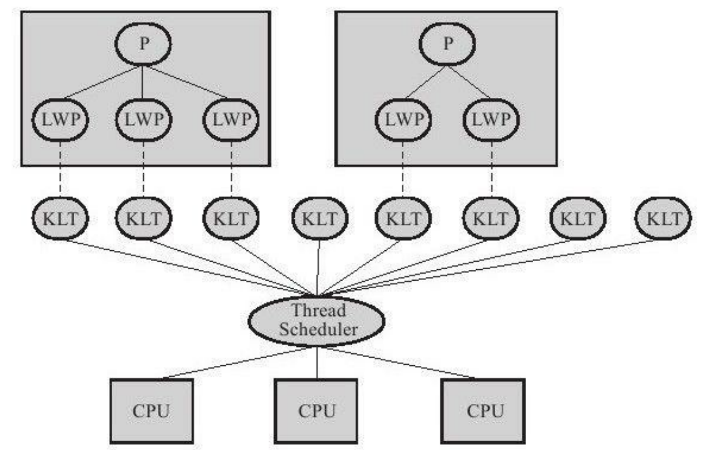

---

==问题三==：==堆和栈有啥区别？介绍一下==

==我的回答==：

1. 在==存储的内容==上，堆主要存储程序运行时创建的对象。而 ==java 虚拟机栈则存储当前线程下方法调用所产生的栈帧，栈帧中包含局部变量表，操作树以及返回信息==等。
2. 在==生命周期==上，==堆区的对象在失去 GC Roots 的引用后不会别立即清除==，而是在触发垃圾回收时才会一并被清理。而 ==java 虚拟机栈的栈帧一旦方法调用结束就会出栈，并清除其参数和局部变量的引用==。
3. 在==内存分配==上，堆区的对象主要通过 ==new 关键字动态分配内存空间==。而 java 虚拟机栈中的==栈帧则是在方法调用时创建栈帧，压入虚拟机栈中==。

==参考答案==：

- 主要有==存储内容，内存分配和生命周期==三个方面的不同。
- 存储内容方面，==Java 堆主要用于存储对象实例和数组==等动态分配的内容。同时堆中分配的内存==由垃圾回收器自动回收==，防止内存泄漏；==虚拟机主要用于存储方法调用时的方法信息，方法调用上下文等等。这块内存的管理是自动进行的，当方法调用结束时，虚拟机栈上有关方法的内存会被自动清除==。
- 内存分配方面，Java 堆主要由 JVM 动态分配和管理，==对象实例一般通过 new 关键字==来在堆中分配内存。==虚拟机栈则是在方法调用时动态创建栈帧，压入栈中==。
- 生命周期方面，对象在 Java 堆上分配内存后，其生命周期可以贯穿整个 Java 程序的运行，而==虚拟机栈中的栈帧则取决于方法何时调用和返回==。

---

==问题四==：==什么时候会出现堆栈溢出呢？如何排查？==

==我的回答==：

1. ==所谓堆栈溢出指的是 OOM 内存空间不足==。发生时机是新生代将对象转移到老年代时，老年代即使通过 Serial 进行全盘清理之后依然放不下这一部分对象时，则会触发 OOM 错误。
2. ==导致堆栈溢出的原因主要是短时间创建大量对象实例导致堆空间不足==。如果是==程序上死循环创建大量对象==，则可以==根据控制台的堆栈信息定位到相应程序位置==。如果是 ==JVM 参数不合理==导致对象不能被有效回收，则可以==扩大老年代和 Survivor 区大小，采用内存更大的机器，或集群部署多台机器负载均衡==。

==参考答案==：

- ==堆溢出也就是内存溢出 OOM==，一般是由于==创建的对象太多，导致超过了堆的最大容量==。排查时可以通过==性能检测工具如 jconsole，获取堆内存快照，然后观察溢出的对象是否是必要的==，==是的话就需要检查代码中对象的生命周期是否过长，或者优化算法==，实在不行可以==调整 JVM 的堆参数==设置 -Xmx 和 -Xms，增加 JVM 最大内存和启动初始内存；如果溢出的==对象不是必要的，就表明发生了内存泄漏，这时可以查看泄漏对象的 GC Roots 引用链，找到具体泄漏的位置==。
- 如果是==虚拟机栈溢出，很可能就是存在死循环，过多的递归调用导致把栈撑满了==，此时可以直接==看控制台的堆栈信息，比较容易定位==。

---

==问题五==：==对象一定是在堆在分配的吗？==

==我的回答==：

1. 不一定。==JVM 在进行编译期优化时可能对 java 虚拟机栈帧上的局部变量引用进行逃逸分析==。如果该==对象不会被其它方法或其它线程调用的话，则会直接在栈上分配==，即将此对象实例创建在栈区而不是堆区，这样在==方法调用结束时，此对象会随着栈帧出栈而被自动销毁==，减轻了垃圾回收线程的压力。

==参考答案==：

- 不一定，==JVM 会通过 “逃逸分析” 技术，对于逃不出方法的对象，会直接在栈空间上分配内存==。这样可以直接在栈上快速创建和销毁对象，不用再将对象分配到堆中，减轻 JVM 垃圾回收的压力。
- 逃逸分析技术就是用来判断对象是否逃逸的技术。==对象逃逸分为方法逃逸和线程逃逸==。方法逃逸就是指，当一个对象在方法中被定义后，它被外部方法引用了，例如作为调用参数传递到其他方法中。线程逃逸是指一个对象被外部线程访问到了，比如赋值给可以在其他线程中访问的实例变量。

---

==问题六==：==常量池了解吗，有啥用？介绍一下==

==我的回答==：

1. 在 jdk8 及以后的版本中，==常量池为方法区中的一部分==。其主要存储基本数据类型常量，以及 String 类型常量。==其中 String 类型常量还包括类名、对象名、方法名、字段名和它们的修饰符名（符号引用==）。
2. String 类型常量在常量池中的常量类型为 ==CONSTANT_utf8_info，规定其在字节码中长度用两个字节表示==，因此理论上 String 类型在编译期长度不能超过 $2^{16}-2$。

==参考答案==：

- Java 8 以前常量池存在于 JVM 方法区的永久代中，==Java 8 及以后存在于元空间中==，它主要用来存储编译期生成的各种字面量和符号引用等等。而==这些字面量可以在程序运行时直接使用，不需要再创建==，提高运行效率。对于==符号引用，其中包括类的全限定名，方法名等等==，主要用==在类加载，动态绑定等阶段，来定位具体的类，方法==等等。

---


### 5.【JVM专题】类加载相关🌟🌟🌟

==问题一==：==JAVA类加载过程介绍一下？==

==我的回答==：

1. Java 类加载分为5个阶段：加载，验证，准备，解析，初始化。
2. 加载阶段==获取字节码与此类对应的二进制字节流==，并在方法区生成一个 Class 对象，作为访问该类相关信息的入口。
3. 验证阶段==检验获取的字节流是否符合 JVM 规范，防止其对程序造成危害==。
4. 准备阶段==为类的静态成员变量在方法区分配内存空间，并对其进行默认初始化==。
5. 解析阶段==将符号引用转化为直接引用==。
6. 初始化阶段==执行类构造器 \<clinit>== 对类进行初始化，==类构造器由类变量的显示初始化和静态代码块拼接而成==。因此==静态代码块只能访问定义在它之前的类变量==。==父类的类构造器总是在子类的类构造器之前调用==。

==参考答案==：

- Java 类加载分为三个阶段，第一个阶段是 “加载”，是类加载过程的起始点，在这个阶段，==虚拟机通过类的全限定名找到对应的二进制字节码==。这个过程==主要是由类加载器来完成==的；第二个阶段是 “连接“，它又包括三个子阶段：==验证，准备和解析==。验证阶段，虚拟机主要会验证加载的字节码==是否符合 JVM 规范，包括类的结构，语义等方面==。准备阶段，虚拟机会==为类的静态字段分配内存并设置默认值==。解析阶段，虚拟机会==将符号引用转换为直接引用，这样虚拟机可以直接定位到目标类，方法==等等；第三个阶段是 ”初始化“，这个阶段虚拟机主要会==执行类的初始化代码==，之后就完成了类加载过程。

---

==问题二==：==双亲委派原则了解吗？介绍一下==

==我的回答==：

1. 类加载器是分层级的，自顶向下依次是==启动类加载器，用于加载 java lib 目录下的所有类==；==扩展类加载器，用于加载 lib/txt 下的类==；==应用程序加载器，用于加载我们写的 java 代码中的类==。而在==应用程序加载器之下，还有自定义类加载器==。
2. 双亲委派机制则为下层的类加载器需要加载某个类时，==先将该加载请求发给其父类加载器，以此类推，直到顶层的启动类加载器==。如果父类加载器可以加载，则由父类进行加载，==否则父类告知子类自己加载不了，这时才由子类进行加载==。

==参考答案==：

- 双亲委派模型是一种层次化的类加载结构，从上往下依次由 BootStrapClassLoader，ExtClassLoader，AppClassLoader 和 自定义的 ClassLoader 构成。其中 ==BootStrapClassLoader，由 C++ 编写，用来加载核心库 Java==.；==ExtClassLoader 用来加载扩展库 javax==.；==AppClassLoader 用来加载用户类路径上的所有库==；最后==自定义的 ClassLoader 用来实现定制化加载==。
- 它的工作原理为：==当一个类加载器接收到类加载的请求时，它首先将这个请求委托给它的父加载器进行处理，直到顶层的 BootStrapClassLoader 被委托为止==。如果父加载器可以找到并加载这个类，那么这个类加载的请求就结束了，==否则，子加载器才会尝试加载该类，以此类推==。

---

==问题三==：==为什么需要双亲委派？==

==我的回答==：

1. 双亲委派机制可以==保证每一个类只会加载一次==。如果没有双亲委派机制的话，==假设同一个类可以被两个类加载器加载，而这两个类加载器之间没有沟通，因此可能会把这个类加载两次==。而==如果这个类是 java 的核心类，其中用户自己实现了一个和核心类同名的类，可能导致应用程序类加载器用我们自己写的类把启动类加载器中的加载到的核心类覆盖，致使整个系统无法正常运行==。

==参考答案==：

- 这种委派机制可以==确保 Java 类的唯一性==，==避免类的重复加载==。同时还==保证了 Java 核心库的安全性和稳定性==。==因为Java核心库都是由 BootStrapClassLoader 加载的，任何用户自定义的类都无法覆盖核心类库中的类==。

---

==问题四==：==怎么打破双亲委派模型？了解过吗？==

==我的回答==：

1. 可以定义一个类继承 java.lang.ClassLoader 类并重写其 findClass 方法。这样就形成了一个自定义类加载器。==在 loadClass 方法中，如果请求父类加载器加载失败，则会我们自己的调用 findClass 方法==。

	```java
	protected Class<?> loadClass(String name, boolean resolve)
	    throws ClassNotFoundException
	{
	    synchronized (getClassLoadingLock(name)) {
	        // First, check if the class has already been loaded
	        Class<?> c = findLoadedClass(name);
	        if (c == null) {
	            long t0 = System.nanoTime();
	            try {
	                if (parent != null) {
	                    c = parent.loadClass(name, false); // 先委托父类加载器进行加载
	                } else {
	                    c = findBootstrapClassOrNull(name);
	                }
	            } catch (ClassNotFoundException e) {
	                // ClassNotFoundException thrown if class not found
	                // from the non-null parent class loader
	            }
	
	            if (c == null) {
	                // If still not found, then invoke findClass in order
	                // to find the class.
	                long t1 = System.nanoTime();
	                c = findClass(name); // 调用自己的 findClass 方法
	
	                // this is the defining class loader; record the stats
	                sun.misc.PerfCounter.getParentDelegationTime().addTime(t1 - t0);
	                sun.misc.PerfCounter.getFindClassTime().addElapsedTimeFrom(t1);
	                sun.misc.PerfCounter.getFindClasses().increment();
	            }
	        }
	        if (resolve) {
	            resolveClass(c);
	        }
	        return c;
	    }
	}
	
	protected Class<?> findClass(String name) throws ClassNotFoundException {
	    throw new ClassNotFoundException(name); // 不重写会直接抛异常，因此自定义时必须重写该方法，否则在父类加载器找不到调用 findClass 方法时一定会报错
	}
	```

==参考答案==：

- 打破双亲委派模型的思路就是在加载类时，不按照依次往上匹配类加载器的方式加载。那么只需要==自定义一个 ClassLoader，然后重写 loadClass 方法，自己定义一个其他的加载方式就行==。
- 实际的应用中，==Tomcat 就破坏了双亲委派模型==。通常在用 Tomcat 部署 web 应用时，需要将 war 包放在 webapp 目录下，然后 Tomcat 就能运行这个 web 应用了。现在==假设有两个 web 应用类，并且它们刚好都有一个全限定名都相同的 user 类，但具体的实现不一样。如果按照双亲委派模型的思路，最终只有一个 user 能被加载，也就只有一个 web 应用能部署成功==。Tomcat 为了解决这个问题，它==给每个 Web 应用都创建了一个 WebAppClassLoader，该类加载器重写了 loadClass 方法，优先加载当前应用目录下的类==，如果当前目录找不到，才会一层一层往上找。这样的话，==Tomcat 就做到了 Web 应用层级别的隔离==。
- 还有比如 JDBC 也算是破坏了双亲委派模型，当我们使用 JDBC 时，是用 DriverManager.getConnection( ) 来获取连接的，但由于 DriverManager 本身是属于 Java 包下的，是由 BootStrapClassLoader 加载的，而通过 getConnection 得到的是其它厂商的实现类，显然是不能由 BootStrapClassLoader 加载。那么在这里就用到了 “线程上下文加载器”，DriverManager 在初始化时就会去得到线程上下文加载器，然后由它代替 BootStrapClassLoader 来加载具体的 Connection 类。

---


## 4.多线程和Java并发（暂时没有看高频题）

> 这一部分专门写了笔记，高频题好像是速成版的那个，还没有看


# 2.设计模式+框架

## 1.设计模式

### 1.Spring 设计模式总结🌟🌟🌟🌟

1. ==控制反转(IoC)和依赖注入(DI)==

	> - ==IoC(Inversion of Control,控制反转)== 它不是什么技术，而是一种==解耦的设计思想==。它的主要目的是==借助于“第三方”(Spring 中的 IOC 容器) 实现具有依赖关系的对象之间的解耦(IOC容器管理对象，你只管使用即可)，从而降低代码之间的耦合度==。==IOC 是一个原则，而不是一个模式==。
	>
	> - ==Spring IOC 容器就像是一个工厂一样，当我们需要创建一个对象的时候，只需要配置好配置文件/注解即可，完全不用考虑对象是如何被创建出来的==。
	>
	> - 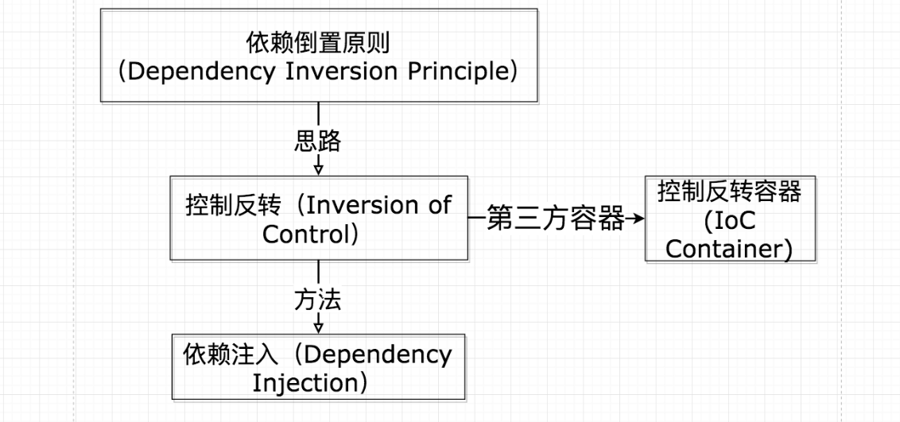
	>
	> -  ==从底层向上依次注入==：
	>
	> 	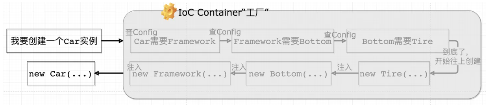
	>
	> - ==DI(Dependecy Inject,依赖注入==)是==实现控制反转的一种设计模式==，依赖注入就是将==实例变量==传入到一个对象中去。

2. ==工厂设计模式==

	> - Spring使用工厂模式可以通过 `BeanFactory` 或 `ApplicationContext` 创建 bean 对象。
	>
	> - ApplicationContext的三个实现类：
	>
	> 	1. `ClassPathXmlApplication`：把上下文文件当成类路径资源。
	> 	2. `FileSystemXmlApplication`：从文件系统中的 XML 文件载入上下文定义信息。
	> 	3. `XmlWebApplicationContext`：从Web系统中的XML文件载入上下文定义信息。
	>
	> - ```java
	> 	ApplicationContext context = new FileSystemXmlApplicationContext("C:/work/IOC/Containers/springframework.applicationcontext/src/main/resources/bean-factory-config.xml");
	> 	```

3. ==单例设计模式==

	> - 如果制造出==多个实例==就可能会==导致一些问题==的产生，比如：程序的行为异常、资源使用过量、或者不一致性的结果。
	>
	> - ==使用单例模式的好处:==
	>
	> 	- 对于频繁使用的对象，可以==省略创建对象所花费的时间==，这对于那些重量级对象而言，是非常可观的一笔系统开销；
	> 	- 由于 new 操作的次数减少，因而==对系统内存的使用频率也会降低==，这将==减轻 GC 压力==，缩短 GC 停顿时间。
	>
	> - ==Spring 实现单例的方式：==
	>
	> 	- xml : `<bean id="userService" class="top.snailclimb.UserService" scope="singleton"/>`
	> 	- 注解：`@Scope(value = "singleton")`
	>
	> - 单例模式在 Spring 中的时机运用：==单例注册表==
	>
	> 	```java
	> 	// 通过 ConcurrentHashMap（线程安全） 实现单例注册表
	> 	private final Map<String, Object> singletonObjects = new ConcurrentHashMap<String, Object>(64);
	> 	```

4. ==代理设计模式==

	> - ==AOP==(Aspect-Oriented Programming:面向切面编程)能够将那些与业务无关，==却为业务模块所共同调用的逻辑或责任（例如事务处理、日志管理、权限控制等）封装起来==，便于==减少系统的重复代码==，==降低模块间的耦合度==，并==有利于未来的可拓展性和可维护性==。
	> - ==Spring AOP 就是基于动态代理的==，如果要代理的对象，==实现了某个接口==，那么Spring AOP会使用==JDK Proxy==，去创建代理对象，而对于==没有实现接口的对象==，就无法使用 JDK Proxy 去进行代理了，这时候Spring AOP会使用==Cglib== ，这时候Spring AOP会使用 ==Cglib== 生成一个被代理对象的子类来作为代理。
	> - ==Spring AOP 和 AspectJ AOP 有什么区别==?
	> 	- ==Spring AOP 属于运行时增强，而 AspectJ 是编译时增强。== 
	> 	- ==Spring AOP 基于动态代理==(Proxying)，而 ==AspectJ 基于字节码操作==(Bytecode Manipulation)。

5. ==模板方法==

	> - 模板方法模式是一种==行为设计模式==，它定义一个操作中的==骨架==，而==将一些步骤延迟到子类==中。 

6. ==观察者模式==

	> - 观察者模式是一种对象行为型模式。它表示的是一种==对象与对象之间具有依赖关系==，当==一个对象发生改变的时候，这个对象所依赖的对象也会做出反应==。==Spring 事件驱动模型==就是观察者模式很经典的一个应用。
	>
	> - ==Spring 的事件流程总结==：
	>
	> 	1. 定义一个==事件==: 实现一个继承自 `ApplicationEvent`，并且写相应的构造函数；
	> 	2. 定义一个==事件监听者==：实现 `ApplicationListener` 接口，重写 `onApplicationEvent()` 方法；
	> 	3. 使用==事件发布者==发布消息: 可以通过 `ApplicationEventPublisher` 的 `publishEvent()` 方法发布消息。
	>
	> - ==示例==：
	>
	> 	```java
	> 	// 定义一个事件,继承自ApplicationEvent并且写相应的构造函数
	> 	public class DemoEvent extends ApplicationEvent{
	> 	    private static final long serialVersionUID = 1L;
	> 																																	
	> 	    private String message;
	> 																																	
	> 	    public DemoEvent(Object source,String message){
	> 	        super(source);
	> 	        this.message = message;
	> 	    }
	> 																																	
	> 	    public String getMessage() {
	> 	        return message;
	> 	    }
	> 	}
	> 																																	
	> 	// 定义一个事件监听者,实现ApplicationListener接口，重写 onApplicationEvent() 方法；
	> 	@Component
	> 	public class DemoListener implements ApplicationListener<DemoEvent>{
	> 																																	
	> 	    //使用onApplicationEvent接收消息
	> 	    @Override
	> 	    public void onApplicationEvent(DemoEvent event) {
	> 	        String msg = event.getMessage();
	> 	        System.out.println("接收到的信息是："+msg);
	> 	    }
	> 	}
	> 																																	
	> 	// 发布事件，可以通过ApplicationEventPublisher  的 publishEvent() 方法发布消息。
	> 	@Component
	> 	public class DemoPublisher {
	> 																																	
	> 	    @Autowired
	> 	    ApplicationContext applicationContext;
	> 																																	
	> 	    public void publish(String message){
	> 	        //发布事件
	> 	        applicationContext.publishEvent(new DemoEvent(this, message));
	> 	    }
	> 	}
	> 	```

7. ==适配器模式==

	> - 适配器模式(Adapter Pattern) ==将一个接口转换成客户希望的另一个接口==，适配器模式使接口不兼容的那些类可以一起工作，其别名为包装器(Wrapper)。
	> - ==Spring AOP== 中的应用：Spring 预定义的==通知要通过对应的适配器，适配成 `MethodInterceptor`(方法拦截器)类型的对象==。
	> - ==Spring MVC== 中的应用：`DispatcherServlet` 根据请求信息调用 `HandlerMapping`，解析请求对应的 `Handler`。==解析到对应的 `Handler`（也就是我们平常说的 `Controller` 控制器）后，开始由`HandlerAdapter` 适配器处理。`HandlerAdapter` 作为期望接口，具体的适配器实现类用于对目标类进行适配==，`Controller` 作为需要适配的类。
	> - ==为什么要在 Spring MVC 中使用适配器模式==？
	> 	-  Spring MVC 中的 `Controller` 种类众多，==不同类型的 `Controller` 通过不同的方法来对请求进行处理==。如果==不利用适配器模式的话，`DispatcherServlet` 直接获取对应类型的 `Controller`，需要的自行来判断 Controller 的类型==。
	> 	- 假如我们==再增加一个 `Controller `类型就要再加入一行判断语句==，这种形式就使得程序难以维护，也违反了设计模式中的开闭原则 – ==对扩展开放，对修改关闭==。

8. ==装饰者模式==

	> - 当我们需要==修改原有的功能，但我们又不愿直接去修改原有的代码==时，==设计一个Decorator套在原有代码外面==。其实在 JDK 中就有很多地方用到了装饰者模式，==比如 `InputStream`家族，`InputStream` 类下有 `FileInputStream` (读取文件)、`BufferedInputStream` (增加缓存,使读取文件速度大大提升)等子类都在不修改`InputStream` 代码的情况下扩展了它的功能==。

9. ==总结==：

	> - ==工厂设计模式== : Spring使用工厂模式通过 `BeanFactory`、`ApplicationContext` 创建 bean 对象。
	> - ==代理设计模式== : ==Spring AOP 功能的实现==。
	> - ==单例设计模式== : Spring 中的 Bean 默认都是单例（singleton）的。
	> - ==模板方法模式== : Spring 中==`jdbcTemplate`、`hibernateTemplate` 等以 Template 结尾的对数据库操作的类，它们就使用到了模板模式==。
	> - ==装饰者设计模式== : 我们的项目需要连接多个数据库，而且==不同的客户在每次访问中根据需要会去访问不同的数据库==。这种模式让我们可以==根据客户的需求能够动态切换不同的数据源==。
	> - ==观察者模式==： ==Spring 事件驱动模型==就是观察者模式很经典的一个应用。
	> - ==适配器模式== : Spring AOP 的增强或通知(Advice)使用到了适配器模式、==spring MVC 中也是用到了适配器模式适配`Controller`==。

---


### 2.什么是单例模式？🌟🌟🌟🌟🌟

1. 如果单例初始值是null，还未构建，则构建单例对象并返回。这个写法属于单例模式当中的==懒汉模式。==

2. 如果单例对象一开始就被new Singleton()主动构建，则不再需要判空操作，这种写法属于==饿汉模式==。

3. 多线程下的线程安全问题，==创建多个对象==：

	> 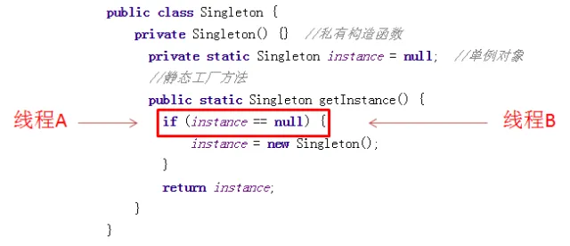

4. ==隐藏的线程安全问题==：

	> - ==先看看改进后存在隐藏线程安全问题的代码==：
	>
	> 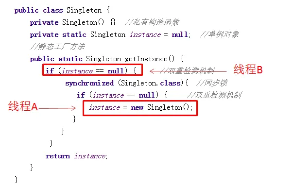
	>
	> - ==线程安全问题的原因==：==指令重排==
	>
	> 	- 比如java中简单的一句 instance = new Singleton，会被编译器编译成如下JVM指令：
	>
	> 		```java
	> 		memory = allocate();  //1：分配对象的内存空间 
	> 		
	> 		ctorInstance(memory); //2：初始化对象 
	> 		
	> 		instance = memory;   //3：设置instance指向刚分配的内存地址 
	> 		```
	>
	> 		但是这些指令顺序并非一成不变，==有可能会经过JVM和CPU的优化，指令重排成下面的顺序==：
	>
	> 		```java
	> 		memory = allocate();  //1：分配对象的内存空间 
	> 		
	> 		instance = memory;   //3：设置instance指向刚分配的内存地址 
	> 		
	> 		ctorInstance(memory); //2：初始化对象 
	> 		```
	>
	> 	- 当线程A执行完1,3,时，==instance对象还未完成初始化，但已经不再指向null==。此时如果线程B抢占到CPU资源，执行 if（instance == null）的结果会是 ==false==，从而返回一个==没有初始化完成的instance对象==。
	>
	> 		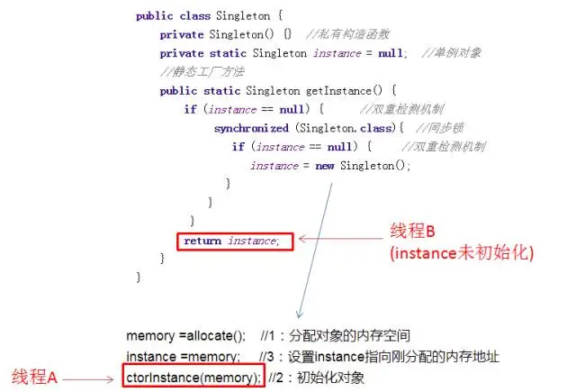
	>
	> 	- 解决方式：==给单例对象加上 volatile 修饰符 `private static volatile instance`，避免编译期重排序==。

5. ==用静态内部类实现单例模式==：

	> - ```java
	> 	public class Singleton {
	> 	    private static class LazyHolder {
	> 	        private static final Singleton INSTANCE = new Singleton();
	> 	    }
	> 	    private Singleton (){}
	> 	    public static Singleton getInstance() {
	> 	        return LazyHolder.INSTANCE;
	> 	    }
	> 	}
	> 	```
	>
	> - INSTANCE对象初始化的时机并不是在单例类Singleton被加载的时候，而是在==调用getInstance方法的时候，使得静态内部类LazyHolder被加载==。因此这种实现方式是利用==classloader的加载机制==来实现==懒加载==，并保证构建单例的线程安全。

6. ==利用反射打破单例==：

	> - ```java
	> 	//获得构造器
	> 	Constructor con = Singleton.class.getDeclaredConstructor();
	> 	//设置为可访问
	> 	con.setAccessible(true);
	> 	//构造两个不同的对象
	> 	Singleton singleton1 = (Singleton)con.newInstance();
	> 	Singleton singleton2 = (Singleton)con.newInstance();
	> 	//验证是否是不同对象
	> 	System.out.println(singleton1.equals(singleton2)); // false
	> 	```

7. ==用枚举实现单例模式==：

	> ```java
	> public enum SingletonEnum {
	>     INSTANCE;
	> }
	> ```
	>
	> ==有了 enum 语法糖，JVM 会阻止反射获取枚举类的私有构造方法==。
	>
	> ==再次尝试使用反射打破单例时报错==：
	>
	> ```java
	> Exception in thread "main" java.lang.NoSuchMethodException: com.xiaohui.singleton.test.SingletonEnum.<init>()
	> ```
	>
	> ==缺点==：==饿汉式加载==。

8. ==总结==：

	> - 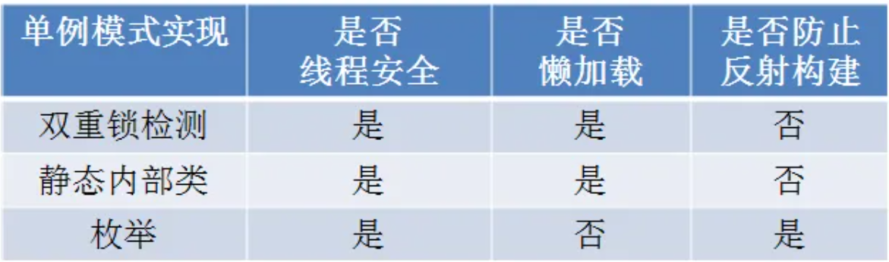
	> - 使用枚举实现的单例模式，不但可以防止利用反射强行构建单例对象，而且可以在枚举类对象被==反序列化==的时候，保证反序列的==返回结果是同一对象==。
	> - 对于==其他方式实现的单例模式==，如果既想要做到可==序列化，又想要反序列化为同一对象，则必须实现 readResolve 方法==。

---


### 3.什么是代理模式？🌟🌟🌟🌟

1. ==静态代理==：==写死代理的类，缺点是泛用性差==，比如我想给很多类添加同一个功能，那我总不能给每一个类都编写一个代理类吧。

2. ==实现InvocationHandler接口，定义调用方法前后所做的事情==：

	```java
	public class StudentInvocationHandler implements InvocationHandler {
	
	    private IStudentService studentService;
	
	    public StudentInvocationHandler(IStudentService studentService){
	        this.studentService = studentService;
	    }
	
	    @Override
	    public Object invoke(Object proxy, Method method, Object[] args) 
	        throws Throwable {
	        System.out.println(method.getName() + "方法调用前");
	        method.invoke(studentService, args);
	        System.out.println(method.getName() + "方法调用后");
	        return null;
	    }
	}
	```

3. 通过 ==Proxy 类的 newProxyInstance 方法，动态生成代理对象 studentServiceProxy==：

	```java
	public class Client {
	    public static void main(String[] args) {
	        // 初始化 studentService
	        IStudentService studentService = new StudentService();
	        
	        //初始化 studentInvocationHandler(实现 InvocationHandler 接口)
	        InvocationHandler studentInvocationHandler = 
	            new StudentInvocationHandler(studentService);
	        
	        // 通过 Proxy.newProxyInstance 获取代理类 studentServiceProxy
	        IStudentService studentServiceProxy = (IStudentService) Proxy
	            .newProxyInstance(
	            // 传入 studentInvocationHandler 的类加载器
	            studentInvocationHandler.getClass().getClassLoader(), 
	            // 传入 studentService 实现的接口        
	            studentService.getClass().getInterfaces(), 
	            // 传入 studentInvocationHandler
	            studentInvocationHandler);
	        
	        studentServiceProxy.insertStudent();
	        studentServiceProxy.deleteStudent();
	    }
	}
	```

4. ==代理模式 vs 装饰器模式==

	> 对于原有的类来说，==装饰器==是“自己人”，==增加的功能是对自身的增强==；
	>
	> 而==代理==是“外人”，==增加的功能和自身并无直接关系==。

---


### 4.什么是工厂模式？🌟🌟

1. 工厂模式在创建型模式当中比较常用，它并不是一个独立的设计模式，而是==三种功能接近的设计模式的统称==。分别为==简单工厂模式，工厂方法模式，抽象工厂模式==。
2. 通过工厂类创建对象并且==根据传入参数决定具体子类对象==的做法，就是==简单工厂模式==。
3. ==每一个口罩子类都对应一个工厂子类，利用多态特性动态创建对象的模式==，就是==工厂方法模式==。

---


### 5.什么是观察者模式？🌟🌟

1. > 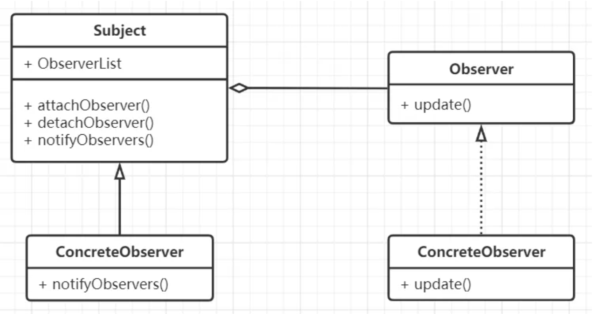

2. 在上面的UML图中，主要有两组实体对象，一组是观察者，一组是被观察者。==所有的观察者，都实现了Observer接口==；==所有的被观察者，都继承自Subject抽象类==。

3. ==Subject类的成员OberverList，存储着已注册的观察者==，当==事件发生时，会通知列表中的所有观察者==。需要注意的是，OberverList所依赖的是的Observer接口，这样就避免了观察者与被观察者的紧耦合。

4. ==示例，创建 Observer 和 Subject==：

	```java
	//观察者
	public interface Observer {
	    public void update();
	}
	
	//被观察者
	abstract public class Subject {
	
	    private List<Observer> observerList = new ArrayList<Observer>();
	
	    public void attachObserver(Observer observer) {
	        observerList.add(observer);
	    }
	
	    public void detachObserver(Observer observer){
	        observerList.remove(observer);
	    }
	
	    public void notifyObservers(){
	        for (Observer observer: observerList){
	            observer.update();
	        }
	    }
	}
	```

5. 观察者们实现 Observer 接口，自行实现 update 逻辑

	```java
	//怪物
	public class Monster implements Observer {
	
	    @Override
	    public void update() {
	        if(inRange()){
	            System.out.println("怪物 对主角攻击！");
	        }
	    }
	
	    private boolean inRange(){
	        //判断主角是否在自己的影响范围内，这里忽略细节，直接返回true
	        return true;
	    }
	}
	
	//陷阱
	public class Trap implements Observer {
	
	    @Override
	    public void update() {
	        if(inRange()){
	            System.out.println("陷阱 困住主角！");
	        }
	    }
	
	    private boolean inRange(){
	        //判断主角是否在自己的影响范围内，这里忽略细节，直接返回true
	        return true;
	    }
	}
	
	//宝物
	public class Treasure implements Observer {
	
	    @Override
	    public void update() {
	        if(inRange()){
	            System.out.println("宝物 为主角加血！");
	        }
	    }
	
	    private boolean inRange(){
	        //判断主角是否在自己的影响范围内，这里忽略细节，直接返回true
	        return true;
	    }
	}
	```

	游戏的主角继承 Subject 类

	```java
	public class Hero extends Subject{
	    void move(){
	        System.out.println("主角向前移动");
	        notifyObservers(); // 通知所有 Oberser，自己行动了
	    }
	}
	```

---


## 2.Java Web

### 1.什么是单点登录？🌟🌟🌟

1. 单点登录就是==在多个系统中，用户只需一次登录，各个系统即可感知该用户已经登录==。

	> 比如阿里系的==淘宝和天猫==，很明显地我们可以知道这是两个系统，但是你在使用的时候，登录了天猫，淘宝也会自动登录。

2. 回顾我们当初的==单系统登录==：

	> - 用户登录时，验证用户的账户和密码。
	> - 生成一个 LoginToken 保存在数据库中，将 LoginToken 写到 Cookie 中。
	> - 将用户数据保存在 Session / ThreadLocal 中。
	> - 请求时都会带上 Cookie，检查有没有登录，如果已经登录则放行；没有登录则根据 LoginToken 查询对应 User，然后写入 Session / ThreadLocal 实现自动登录。

3. ==多系统登录的问题==：

	> - ==Session不共享问题==
	> - ==Cookie跨域的问题==
	> - ==CAS原理==

4. ==Session不共享问题==

	> - 单系统登录功能主要是用Session保存用户信息来实现的，但是：==多系统即可能有多个Tomcat==，而==Session依赖的是当前系统的Tomcat==，所以==系统A的Session和系统B的Session==是==不共享==的。
	>
	> - 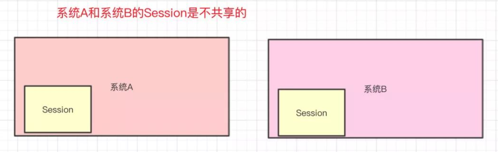
	>
	> - 我们可以将登录功能==单独抽取==出来，做成一个==子系统==。
	>
	> 	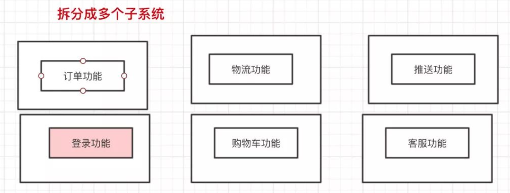
	>
	> 	- ==SSO系统生成一个token，并将用户信息存到Redis中==，并设置过期时间。
	> 	- ==其他系统请求SSO系统==进行登录，==得到SSO返回的token，写到Cookie==中。
	> 	- 每次请求时，Cookie都会带上，==拦截器得到token，判断是否已经登录==。
	>
	> 	到这里，其实我们会发现其实就两个变化：
	>
	> 	- ==将登陆功能抽取为一个系统（SSO），其他系统请求SSO进行登录==。
	> 	- ==本来将用户信息存到Session，现在将用户信息存到Redis==。

5. ==Cookie跨域的问题==

	> - ==Cookie是不能跨域的==。比如说，我们请求`<https://www.google.com/>`时，浏览器会自动把`google.com`的Cookie带过去给`google`的服务器，而不会把`<https://www.baidu.com/>`的Cookie带过去给`google`的服务器。
	> - ==由于域名不同==，用户向系统A登录后，==系统A返回给浏览器的Cookie，用户再请求系统B的时候不会将系统A的Cookie带过去==。
	> - ==解决方案==：
	> 	1. 服务端将Cookie写到客户端后，==客户端对Cookie进行解析，将Token解析出来==，==此后请求都把这个Token带上就行了==。
	> 	2. ==多个域名共享Cookie==，在写到客户端的时候==设置Cookie的domain==。
	> 	3. 将Token保存在SessionStroage中（==不依赖Cookie==就没有跨域的问题了）

6. ==CAS原理==

	> - 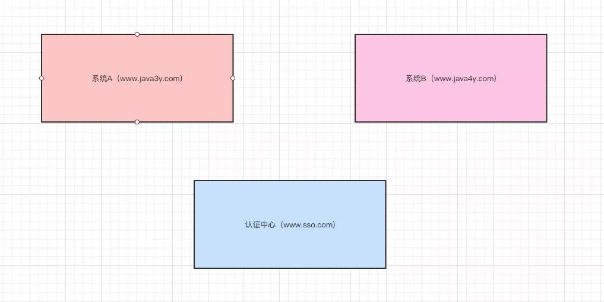
	> - 系统A`www.java3y.com`发现用户并没有登录，于是==重定向到sso认证中心，并将自己的地址作为参数==：==`www.sso.com?service=www.java3y.com`==。
	> - sso认证中心发现用户未登录，将用户引导至登录页面，用户进行输入用户名和密码进行登录，==用户与认证中心==建立==全局会话（生成一份Token，写到Cookie中，保存在浏览器上）==。
	> - 随后，认证中心==重定向回系统A==，并把Token携带过去给系统A，重定向的地址如下：==`www.java3y.com?token=xxxxxxx`==。
	> - 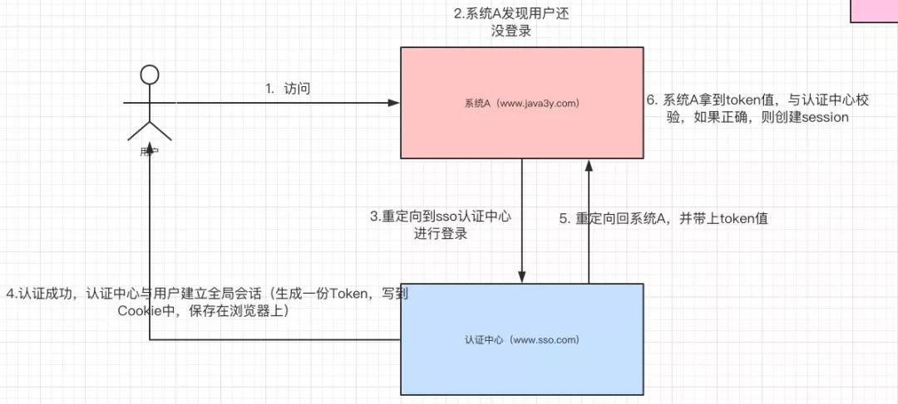
	> - 此时，用户想要访问系统B`www.java4y.com`受限的资源(比如说订单功能，订单功能需要登录后才能访问)，系统B`www.java4y.com`发现用户并没有登录，于是==重定向到sso认证中心，并将自己的地址作为参数==。认证中心==根据带过来的Cookie==发现==已经与用户建立了全局会话==了，认证中心==重定向回系统B==，并把==Token携带过去给系统B==。
	> - 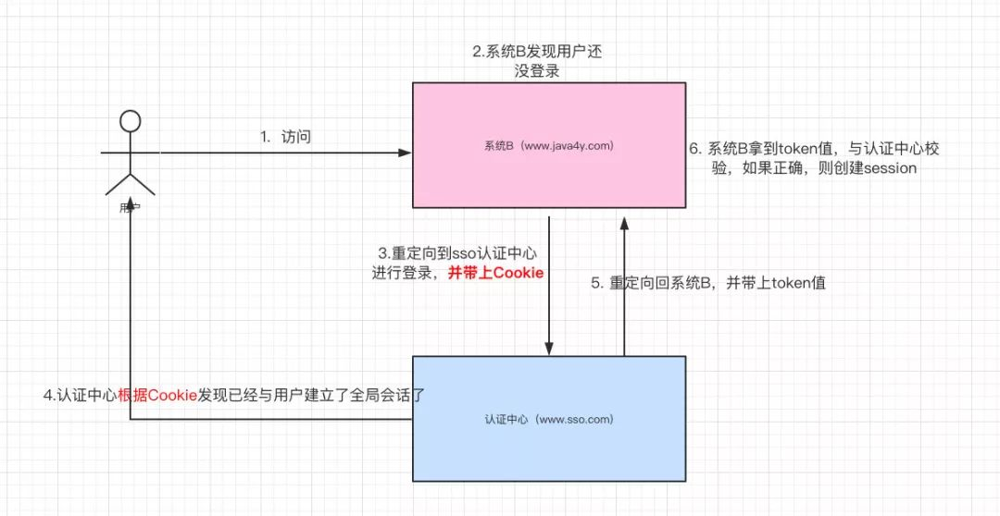
	> - 看到这里，其实SSO认证中心就类似一个==中转站==。

---


### 2.面试题：给我说一下你项目中的单点登录是如何实现的？🌟🌟🌟

1. ==http无状态协议==

	> - ==http是无状态协议==，浏览器的每一次请求，服务器会独立处理，==不与之前或之后的请求产生关联==。
	> - 
	> - ==既然http协议无状态，那就让服务器和浏览器共同维护一个状态吧==！这就是==会话机制==。

2. ==会话机制==

	> - 浏览器第一次请求服务器，==服务器创建一个会话，并将会话的id作为响应的一部分发送给浏览器==，浏览器存储会话id，==并在后续第二次和第三次请求中带上会话id，服务器取得请求中的会话id就知道是不是同一个用户了==。
	> - 
	> - tomcat会话机制当然也实现了cookie，访问tomcat服务器时，浏览器中可以看到一个名为“==JSESSIONID”的cookie，这就是tomcat会话机制维护的会话id==。
	> - 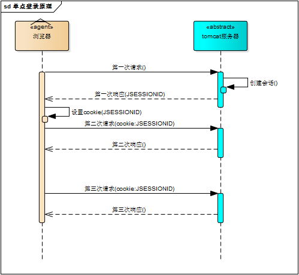

3. ==登录状态==

	> - 
	> - ==以上讨论，都是在单系统的范畴中==。

4. ==多系统的复杂性==

	> - ==web系统早已从久远的单系统发展成为如今由多系统组成的应用群==，面对如此众多的系统，用户==难道要一个一个登录、然后一个一个注销==吗？就像下图描述的这样：
	>
	> 	
	>
	> - 虽然单系统的登录解决方案很完美，但对于多系统应用群已经不再适用了，为什么呢？
	>
	> 	- ==Cookie 不能跨域==。
	>
	> 	
	>
	> - ==共享 Cookie== 解决 Cookie 跨域问题：
	>
	> 	- 既然这样，为什么不将web应用群中所有子系统的域名统一在一个顶级域名下，例如“*.baidu.com”，然后==将它们的cookie域设置为“baidu.com”==，这种做法理论上是可以的，甚至早期很多多系统登录就采用这种==同域名共享cookie==的方式。
	> 	- 然而，可行并不代表好，共享cookie的方式存在==众多局限==。
	> 		1. 首先，==应用群域名得统一==；
	> 		2. 其次，应用群各系统使用的技术（==至少是web服务器）要相同==，==不然cookie的key值（tomcat为JSESSIONID）不同，无法维持会话==；
	> 		3. 共享cookie的方式是==无法实现跨语言技术平台登录==的，比如java、php、.net系统之间；第三，cookie本身不安全。

5. ==单点登录==

	> - 单点登录全称Single Sign On（以下简称SSO），是指==在多系统应用群中登录一个系统，便可在其他所有系统中得到授权而无需再次登录==。
	> - 
	> - ==对上图的解释==：
	> 	1. 用户访问系统1的受保护资源，系统1发现用户未登录，==重定向至sso认证中心，并将自己的地址作为参数==。
	> 	2. sso认证中心发现用户未登录，将用户引导至登录页面。
	> 	3. 用户输入用户名密码提交登录申请。
	> 	4. sso认证中心校验用户信息，==创建用户与sso认证中心之间的会话，称为全局会话==，同时==创建授权令牌==。
	> 	5. sso认证中心带着令牌跳转回最初的请求地址（系统1）
	> 	6. ==系统1拿到令牌==，去sso认证中心==校验令牌是否有效==。
	> 	7. ==sso认证中心校验令牌，返回有效，注册系统1==。
	> 	8. ==系统1使用该令牌创建与用户的会话，称为局部会话==，返回受保护资源。
	> 	9. 用户访问系统2的受保护资源。
	> 	10. 系统2发现用户未登录，跳转至sso认证中心，并将自己的地址作为参数。
	> 	11. ==sso认证中心发现用户已登录（全局会话），跳转回系统2的地址，并附上令牌==。
	> 	12. 系统2拿到令牌，去sso认证中心校验令牌是否有效。
	> 	13. sso认证中心校验令牌，返回有效，注册系统2。
	> 	14. 系统2使用该令牌创建与用户的局部会话，返回受保护资源。
	> - ==用户登录成功之后，会与sso认证中心及各个子系统建立会话==。
	> - 用户==与sso认证中心建立的会话称为全局会话==，用户==与各个子系统建立的会话称为局部会话==。
	> - ==局部会话建立之后，用户访问子系统受保护资源将不再通过sso认证中心==。

6. ==单点注销==

	> - 单点登录自然也要单点注销，==在一个子系统中注销，所有子系统的会话都将被销毁==。
	>
	> 	
	>
	> - ==解释==：
	>
	> 	1. 用户向系统1发起注销请求。
	> 	2. 系统1根据用户与系统1建立的会话id拿到令牌，向sso认证中心发起注销请求。
	> 	3. sso认证中心校验令牌有效，==销毁全局会话，同时取出所有用此令牌注册的系统地址==。
	> 	4. sso认证中心==向所有注册系统发起注销请求==。
	> 	5. ==各注册系统接收sso认证中心的注销请求，销毁局部会话==。
	> 	6. sso认证中心引导用户至登录页面。

7. ==部署图==

	> - 单点登录涉及sso认证中心与众子系统，子系统与sso认证中心需要通信以交换令牌、校验令牌及发起注销请求，因而==子系统必须集成sso的客户端==，==sso认证中心则是sso服务端==，==整个单点登录过程实质是sso客户端与服务端通信的过程==，用下图描述：
	>
	> 	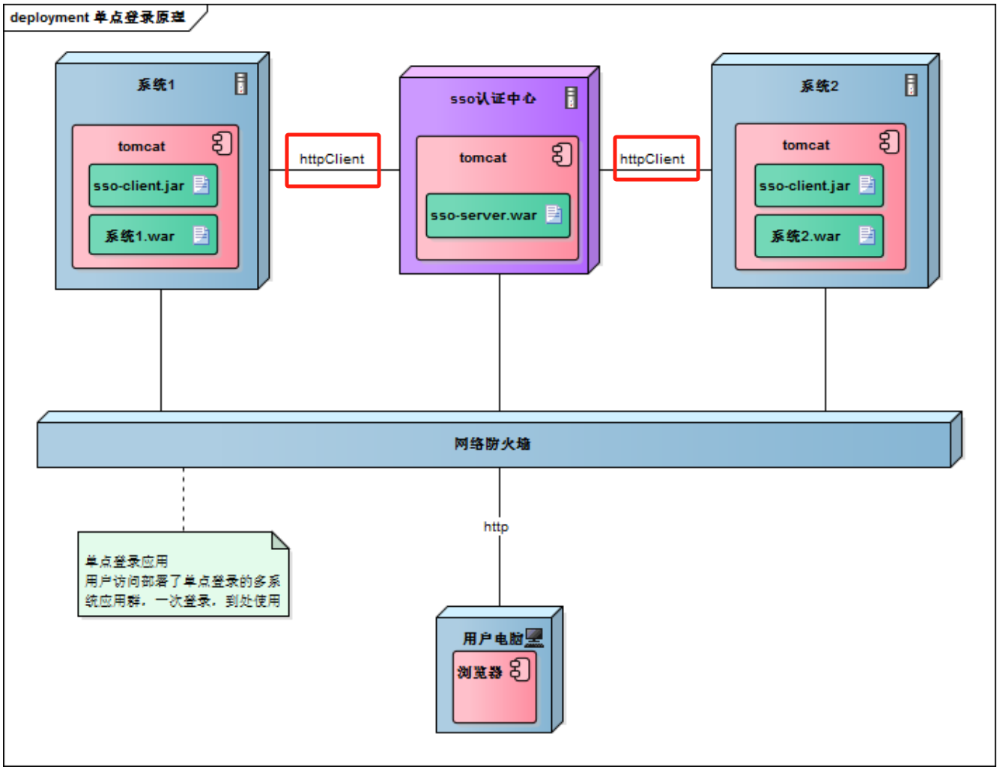

8. ==实现==

	> - sso-server 和 sso-cli 需要实现的功能：
	> 	- ==sso-client==
	> 		1. ==拦截子系统未登录用户请求，跳转至sso认证中心==
	> 		2. ==接收并存储sso认证中心发送的令牌==
	> 		3. ==与sso-server通信，校验令牌的有效性==
	> 		4. ==建立局部会话==
	> 		5. ==拦截用户注销请求，向sso认证中心发送注销请求==
	> 		6. ==接收sso认证中心发出的注销请求，销毁局部会话==
	> 	- ==sso-server==
	> 		1. ==验证用户的登录信息==
	> 		2. ==创建全局会话==
	> 		3. ==创建授权令牌==
	> 		4. ==与sso-client通信发送令牌==
	> 		5. ==校验sso-client令牌有效性==
	> 		6. ==系统地址注册==
	> 		7. ==接收sso-client注销请求，注销所有会话==

---


### 3.Servlet 的执行流程🌟🌟

1. 浏览器给 tomcat 发送请求。
2. tomcat 根据收到的 url ==在 web.xml 中查找对应的 servlet==，==如果该 servlet 是第一次被访问，则进行实例化==。并将其输出结果返回给浏览器。

---


### 4.Servlet 生命周期🌟🌟

1. > 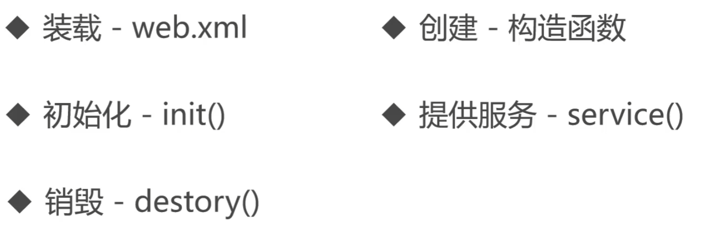

---


### 5.请求转发与响应重定向的区别🌟🌟

1. ==请求转发==：

	> 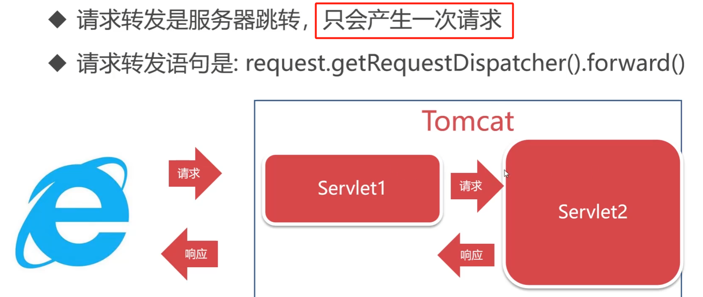
	>
	> - ==服务器跳转==。
	> - ==只有一次请求（request 是相同的）==。

2. ==响应重定向==：

	> 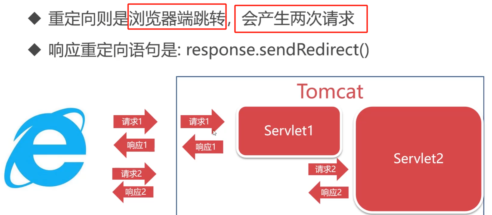
	>
	> - ==浏览器跳转，地址栏变化==。
	> - ==第一次请求返回的请求，要求浏览器重新访问另一个 url==。

---


### 6.Statement 和 PreparedStatement 的区别🌟🌟

1. PreparedStatement 是==预编译的 SQL 语句==，效率高于 Statement。

2. PreparedStatement ==支持 ? 操作符==，相对于 Statement 更加灵活。

3. PreparedStatement ==可以防止 SQL 注入==。

4. ==PreparedStatement==：

	```sql
	select * from user where username = ?
	```

	假如查询很多次，==只需要解释一次，因为 sql 没有改变，只需填入不同参数==。

	而 ==Statement 则会解释很多次，因为 sql 直接拼接而来，因此每次的 sql 都不同==。

	==将传入的参数的特殊字符转移防止 sql 注入==。

---


## 3.框架

### 1.Spring 的本质系列(1) — 依赖注入🌟🌟🌟🌟🌟

1. ==Spring 依赖注入==

	> - ==步骤==：
	>
	> 	1. 解析xml，获取各种元素
	> 	2. 通过 ==Java 反射==把各个 bean 的实例创建起来： com.coderising.OrderProcessor，OrderServiceImpl，EmailServiceImpl。
	> 	3. 还是通过 ==Java 反射==调用 OrderProcessor 的两个方法：setOrderService(….) 和 setEmailService(…) 把orderService，emailService 实例 注入进去。
	>
	> - ```java
	> 	XmlAppContext ctx = new XmlAppContext("c:\\bean.xml");
	> 																															
	> 	OrderProcessor op = (OrderProcessor) ctx.getBean("order-processor");
	> 																															
	> 	op.process();
	> 	```
	>
	> - ==既然对象的创建过程和装配过程都是Spring做的， 那Spring 在这个过程中就可以玩很多把戏了， 比如对你的业务类做点字节码级别的增强， 搞点AOP什么的， 这都不在话下了==。

---


### 2.Spring本质系列(2) — AOP🌟🌟🌟🌟🌟

实现 AOP 的几种技术：

(1) 在编译的时候， 根据AOP的配置信息，悄悄的把日志，安全，事务等“切面”代码和业务类编译到一起去。

(2) 在运行期，业务类加载以后， 通过Java动态代理技术==为业务类生产一个代理类==， ==把“切面”代码放到代理类中==， Java 动态代理要求业务类==需要实现接口==才行。

(3) 在运行期， 业务类加载以后， ==动态的使用字节码构建一个业务类的子类，将“切面”逻辑加入到子类当中==去，==CGLIB==就是这么做的。

Spring采用的就是(1) +(2) 的方式，限于篇幅，这里不再展开各种技术了， 不管使用哪一种方式， 在运行时，==真正干活的“业务类”其实已经不是原来单纯的业务类了， 它们被AOP了== ！

---


# 3.Mysql

## 1.索引模块

### 1.为什么MySQL数据库要用B+树存储索引？🌟🌟🌟🌟🌟

1. ==hashtable vs B+ tree==

	> - 这和业务场景有关。如果只选一个数据，那确实是hash更快。但是数据库中经常会==选择多条==，这时候由于B+树索引有序，并且又有链表相连，它的查询效率比hash就快很多了。
	> - 而且==数据库中的索引一般是在磁盘==上，==数据量大的情况可能无法一次装入内存==，==B+树的设计可以允许数据分批加载，同时树的高度较低，提高查找效率==。
	> - ==优点==：
	> 	1. ==减少磁盘操作==：B+树非叶子不存 Value，只存放 key，所以==一次更可以加载更多节点，减少磁盘加载到内存的次数==。
	> 	2. ==范围查找更多优势==：mysql经常有范围查找，B+树的叶子结点之间是一个==双向链表，很好支持范围查找==。
	> 	3. ==查找速度快==：B+树类似一个多路的树了，所以同样节点，==树的高度更低，查找速度更快==。

---


### 2.高频面试题：什么是B树？为啥文件索引要用B树而不用二叉查找树？

1. ==为啥不同哈希表==？

	> 1. 哈希表虽然能够在 O(1) 查找到目标数据，不过如果我们要进行==模糊查找==的话，却==只能遍历所有数据==，并且如果出现了==极端情况，哈希表冲突的元素太多==，也会导致线性时间的查找效率的。

2. ==为啥不用二叉查找树==？

	> 1. 如果是查找效率（即比较次数）的话，实际上二叉树可以说是最快的了，但是，我们的文件索引是存放在==磁盘==上的，所以我们不仅要考虑查找效率，还要考虑==磁盘的寻址加载次数==哦，而这也是我们为什么要用 B 树的原因。
	>
	> 2. 把磁盘里的数据加载到内存中的时候，是==以页为单位来加载==的，而我们也知道，==节点与节点之间的数据是不连续的==，所以==不同的节点，很有可能分布在不同的磁盘页中==。所以对于上面的二叉查找树，我们可能需要==进行 4 次寻址加载==，如图：
	>
	> 	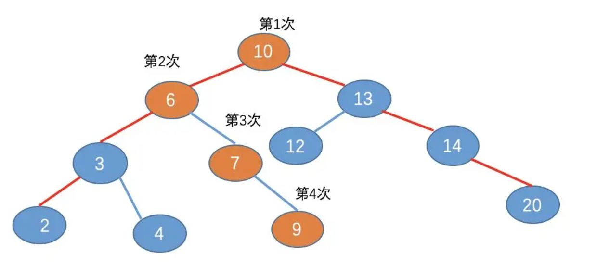
	>
	> 3. 由于 ==B 树的每一个节点，可以存放多个元素==，所以==磁盘寻址加载的次数会比较少==，例如上面的例子中，用 B 树的话，==只需要加载 3 次==，如图：
	>
	> 	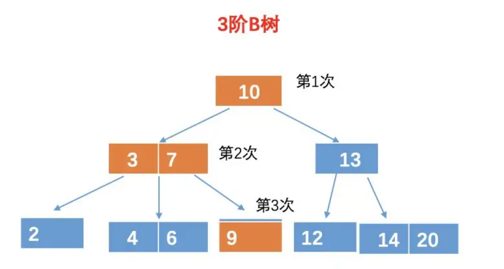
	>
	> 4. 在==内存的运算速度是非常快的，至少比磁盘的寻址加载速度，快了几百倍==，而我们进行数值比较的时候，是在内存中进行的，虽然 B 树的比较次数可能比二叉查找树多，但是==磁盘操作次数少，所以总体来说，还是 B 树快的多==。
	>
	> 5. 实际上磁盘的加载次数，基本上是和树的==高度==相关联的，高==度越高，加载次数越多，越矮，加载次数越少==。所以对于这种文件索引的存储，我们一般会选择==矮胖==的树形结构。

---


### 3.深入浅出索引（上）🌟🌟🌟🌟🌟

见笔记。

---


### 4.深入浅出索引（下）🌟🌟🌟🌟🌟

见笔记。

---


### 5.MyISAM与InnoDB的索引，究竟有什么差异？🌟🌟

1. ==MyISAM的索引==

	> - ==MyISAM的索引与行记录是分开存储==的，叫做==非聚集索引==（UnClustered Index）。
	>
	> - （1）有连续聚集的区域单独存储行记录；
	>
	> 	（2）主键索引的叶子节点，存储主键，==与对应行记录的指针==；
	>
	> 	（3）普通索引的叶子结点，存储索引列，==与对应行记录的指针==；
	>
	> - 即：主键索引和普通索引的叶子节点==均存储对应那一行的指针==。
	>
	> - 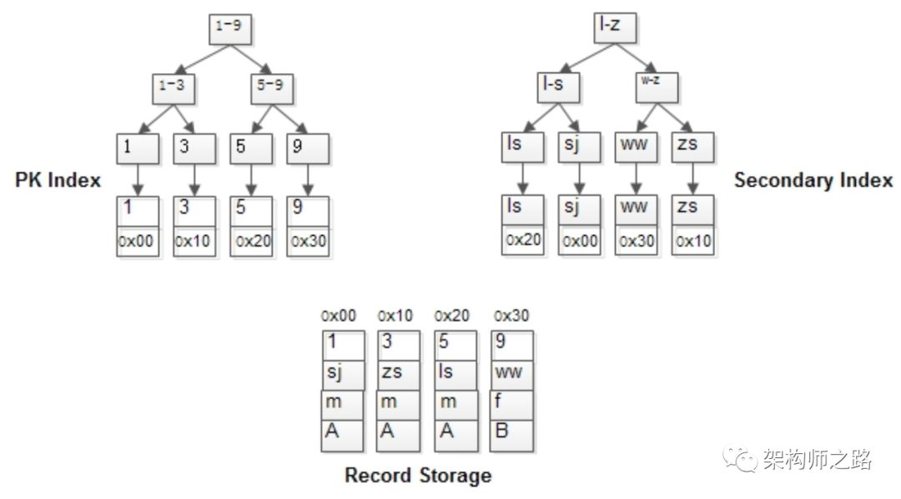

2. ==InnoDB的索引==

	> - InnoDB的==主键索引与==行记录是存储在一起的，故叫做==聚集索引==（Clustered Index）：
	>
	> 	（1）==没有单独区域存储行记录==；
	>
	> 	（2）主键索引的叶子节点，存储主键，与对应行记录（而不是指针）；
	>
	> 	画外音：因此，==InnoDB的PK查询是非常快的==。
	>
	> - 因为这个特性，==InnoDB的表必须要有聚集索引==：
	>
	> 	（1）如果表定义了PK，则PK就是聚集索引；
	>
	> 	（2）如果表==没有定义PK，则第一个非空unique列是聚集索引==；
	>
	> 	（3）==否则==，InnoDB会==创建一个隐藏的row-id作为聚集索引==；
	>
	> - 启示：
	>
	> 	（1）==不建议使用较长的列做主键==，例如char(64)，因为所有的普通索引都会存储主键，会导致普通索引过于庞大；
	>
	> 	（2）建议使用==趋势递增的key做主键==，由于数据行与索引一体，这样不至于插入记录时，有大量索引分裂，行记录移动；
	>
	> - 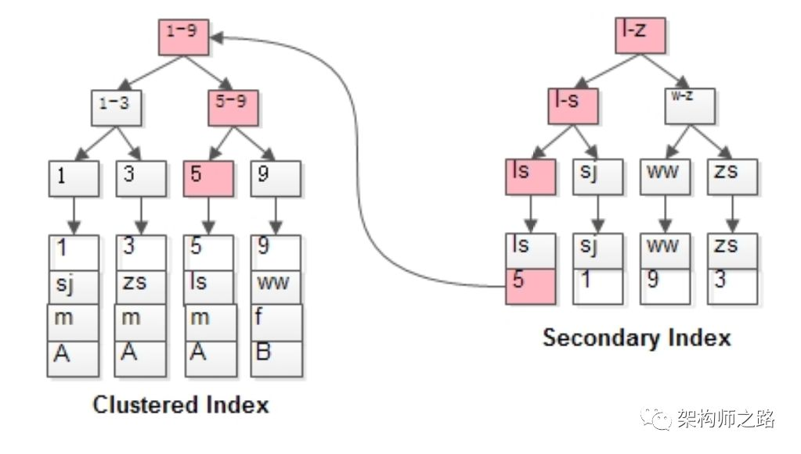

3. ==总结==：

	> ==MyISAM和InnoDB都使用B+树来实现索引==：
	>
	> （1）MyISAM的==索引与数据分开存储==；
	>
	> （2）MyISAM的索引==叶子存储指针==，主键索引与普通索引无太大区别；
	>
	> （3）InnoDB的==聚集索引==和数据行统一存储；
	>
	> （4）InnoDB的==聚集索引存储数据行本身==，==普通索引存储主键==；
	>
	> （5）InnoDB==一定有且只有一个聚集索引==；
	>
	> （6）InnoDB建议使用趋势递增整数作为PK，而==不宜使用较长的列作为PK==；

---


## 2.锁

### 1.全局锁和表锁🌟🌟🌟🌟

见笔记。

---


### 2.行锁功过：怎么减少行锁对性能的影响？🌟🌟🌟🌟

见笔记。

---


### 3.行锁到底锁住的是什么？记录？字段？索引？

1.  ==InnoDB的行锁，就是通过锁住索引来实现的==。

	> 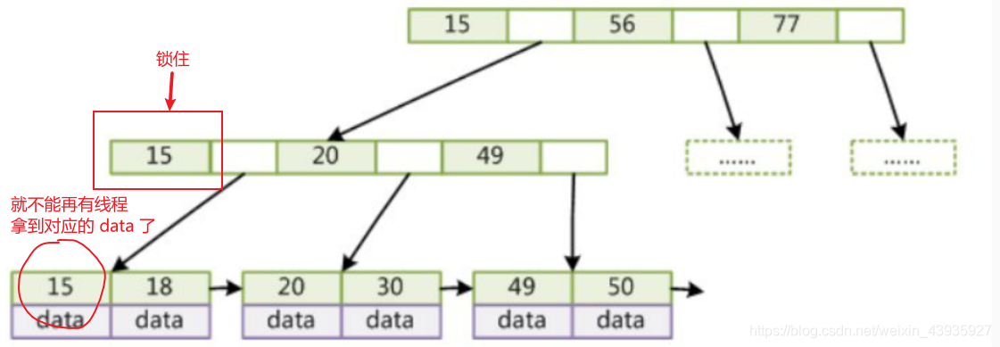

2. ==问题一==：为什么表里面==没有索引的时候==，实验一==锁住一行数据会导致锁表==？或者说，==如果锁住的是索引，一张表没有索引怎么办==？所以，一张表有没有可能没有索引？

	> 1. 如果我们定义了主键(PRIMARYKEY)，那么 InnoDB 会选择主键作为聚集索引。
	> 2. 如果==没有显式定义主键==，则 InnoDB 会选择==第一个不包含有 NULL 值的唯一索引作为主键索引==。
	> 3. 如果==也没有这样的唯一索引==，则 InnoDB 会选择==内置 6 字节长的 ROWID 作为隐藏的聚集索引==，它会==随着行记录的写入而主键递增==。
	>
	> 所以，实验一为什么锁表，是因为==查询时没有索引可使用，会进行全表扫描==，然后==把每一个隐藏的聚集索引都锁住了==。

3. ==问题二==：实验二为什么==通过唯一索引给数据行加锁，主键索引也会被锁住==？

	> 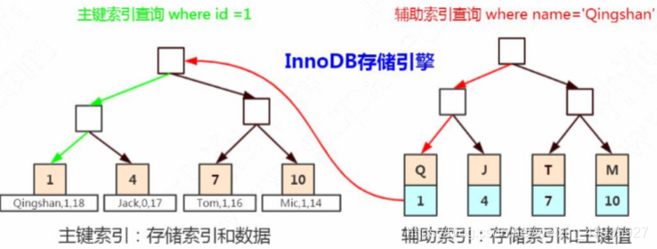

---


### 4.这次终于懂了，InnoDB的七种锁🌟

1. InnoDB共有==七种类型的锁==：

	> （1）自增锁(Auto-inc Locks)；
	>
	> （2）共享/排它锁(Shared and Exclusive Locks)；
	>
	> （3）意向锁(Intention Locks)；
	>
	> （4）插入意向锁(Insert Intention Locks)；
	>
	> （5）记录锁(Record Locks)；
	>
	> （6）间隙锁(Gap Locks)；
	>
	> （7）临键锁(Next-key Locks)；

2. ==自增锁==（Auto-inc Locks）

	> - 自增锁是一种特殊的==表级别锁==（table-level lock），==针对事务插入AUTO_INCREMENT类型的列==。
	> - 最简单的情况，如果一个事务正在往表中插入记录，==所有其他事务的插入必须等待==，==以便第一个事务插入的行，是连续的主键值==。

3. ==共享/排它锁==(Shared and Exclusive Locks)

	> - （1）多个事务可以拿到一把S锁，==读读可以并行==；
	> - （2）而只有一个事务可以拿到X锁，==写写/读写必须互斥==；

4. ==意向锁(Intention Locks)==

	> - 意向锁有这样一些==特点==：
	>
	> 	（1）首先，意向锁，是一个==表级别的锁==(table-level locking)；
	>
	> 	（2）意向锁分为：
	>
	> 	- ==意向共享锁==(intention shared lock, IS)，它预示着，事务==有意向==对表中的==某些行加共享S锁==。
	> 	- ==意向排它锁==(intention exclusive lock, IX)，它预示着，事务==有意向==对表中的==某些行加排它X锁==。
	>
	> - ==例子==：
	>
	> 	- `select … lock in share mode`，要设置==IS锁==；
	> 	- `select … for update`，要设置==IX锁==；
	>
	> - ==意向锁协议== (intention locking protocol)：
	>
	> 	- 事务要获得某些行的S锁，==必须先获得表的IS锁==。
	> 	- 事务要获得某些行的X锁，==必须先获得表的IX锁==。
	>
	> - 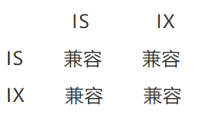
	>
	> - 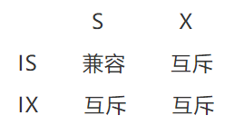

5. ==插入意向锁(Insert Intention Locks)==

	> - ==多个事务==，在==同一个索引，同一个范围区间插入记录==时，如果==插入的位置不冲突，不会阻塞彼此==。
	>
	> - *10, shenjian*
	>
	> 	*20, zhangsan*
	>
	> 	*30, lisi*
	>
	> 	事务A先执行，在10与20两条记录中插入了一行，还未提交：
	>
	> 	```sql
	> 	insert into t values(11, xxx);
	> 	```
	>
	> 	事务B后执行，也在10与20两条记录中插入了一行：
	>
	> 	```sql
	> 	insert into t values(12, ooo);
	> 	```
	>
	> 	（1）会使用什么锁？
	>
	> 	（2）事务B会不会被阻塞呢？
	>
	> 	==回答==：虽然事务隔离级别是RR，虽然是同一个索引，虽然是同一个区间，但==插入的记录并不冲突==，故这里：
	>
	> 	（1）使用的是==插入意向锁==；
	>
	> 	（2）并==不会阻塞事务B==；

6. ==记录锁(Record Locks)==

	> - ==记录锁==，它==封锁索引记录==，例如：
	>
	> 	```sql
	> 	select * from t where id=1 for update;
	> 	```
	>
	> 	它会在 id=1 的==索引记录上加锁==，以阻止其他事务插入，更新，删除id=1的这一行。
	>
	> 	==需要说明的是==：
	>
	> 	```sql
	> 	select * from t where id=1;
	> 	```
	>
	> 	是==快照读==(SnapShot Read)，它==并没有加锁==。

7. ==间隙锁(Gap Locks)==

	> - ==间隙锁==，它==封锁索引记录中的间隔==，或者第一条索引记录之前的范围，又或者最后一条索引记录之后的范围。
	>
	> 	*1, shenjian, m, A*
	>
	> 	*3, zhangsan, m, A*
	>
	> 	*5, lisi, m, A*
	>
	> 	*9, wangwu, f, B*
	>
	> 	```sql
	> 	select * from t where id between 8 and 15 for update;
	> 	```
	>
	> 	会==封锁区间==，以==阻止其他事务id=10的记录插入==。
	>
	> 	==为什么要阻止id=10的记录插入？如果能够插入成功，头一个事务执行相同的SQL语句，会发现结果集多出了一条记录，即幻影数据==。
	>
	> 	间隙锁的==主要目的==，就是为了==防止其他事务在间隔中插入数据，以导致“不可重复读”==。
	>
	> 	如果把事务的隔离级别==降级为读提交==(Read Committed, RC)，==间隙锁则会自动失效==。

8. ==临键锁(Next-Key Locks)==

	> - ==临键锁==，是记录锁与间隙锁的组合，它的封锁范围，既包含索引记录，又包含索引区间。
	>
	> - 一个会话占有了==索引记录R的共享/排他锁==，其他会话==不能==立刻在==R之前的区间插入新的索引记录==。
	>
	> - 表中有四条记录：
	>
	> 	*1, shenjian, m, A*
	>
	> 	*3, zhangsan, m, A*
	>
	> 	*5, lisi, m, A*
	>
	> 	*9, wangwu, f, B*
	>
	> 	PK上==潜在的临键锁为==：
	>
	> 	*(-infinity, 1]*
	>
	> 	*(1, 3]*
	>
	> 	*(3, 5]*
	>
	> 	*(5, 9]*
	>
	> 	*(9, +infinity)*
	>
	> 	临键锁的主要目的，也是为了==避免幻读==(Phantom Read)。如果把事务的隔离级别==降级为RC==，==临键锁则也会失效==。

9. ==总结==：

	> （1）==自增锁==(Auto-inc Locks)：==表级锁，专门针对事务插入AUTO_INC的列==，如果插入位置冲突，多个事务会阻塞，以保证数据一致性；
	>
	> （2）==共享/排它锁==(Shared and Exclusive Locks)：==行级锁==，S锁与X锁，==强锁==；
	>
	> （3）==意向锁==(Intention Locks)：==表级锁==，IS锁与IX锁，==弱锁==，仅==仅表明意向==；
	>
	> （4）==插入意向锁==(Insert Intention Locks)：==针对insert==的，如果==插入位置不冲突，多个事务不会阻塞==，以提高插入并发；
	>
	> （5）==记录锁==(Record Locks)：==索引记录上加锁==，对索引记录实施互斥，以保证数据一致性；
	>
	> （6）==间隙锁==(Gap Locks)：==封锁索引记录中间的间隔==，在RR下有效，防止间隔中被其他事务插入；
	>
	> （7）==临键锁==(Next-key Locks)：==封锁索引记录，以及索引记录中间的间隔==，在RR下有效，==防止幻读==；

---


### 5.一条sql执行的很慢的原因有哪些🌟🌟🌟🌟🌟

1. ==数据库在刷新脏页我也无奈啊（偶尔很慢）==

	> - 如果==数据库一直很忙，更新又很频繁==，这个时候 ==redo log 很快就会被写满了==，这个时候就没办法等到空闲的时候再把数据同步到磁盘的，==只能暂停其他操作，全身心来把数据同步到磁盘中去的==，而这个时候，==就会导致我们平时正常的SQL语句突然执行的很慢==，所以说，数据库在在同步数据到磁盘的时候，就有可能导致我们的SQL语句执行的很慢了。

2. ==拿不到锁我能怎么办（偶尔很慢）==

	> - 如果要判断是否真的在等待锁，我们可以用 ==show processlist ==这个命令来查看当前的状态哦。

3. ==扎心了，没用到索引（一直很慢，一般都是 sql 语句的问题）==

	> - ==函数操作导致没有用上索引==。
	> - 或者 `select * from t where c - 1 = 1000;`，使用加法函数.

4. ==呵呵，数据库自己选错索引了（一直很慢）==

	> - ==系统是有可能走全表扫描而不走索引的。那系统是怎么判断呢？==
	> 	- 判断来源于==系统的预测==，也就是说，如果要走 c 字段索引的话，系==统会预测走 c 字段索引大概需要扫描多少行==。如果预测到要扫描的行数很多，它可能就不走索引而直接扫描全表了。
	> - ==系统是怎么预测判断的呢？==
	> 	- ==索引的区分度==来判断的，一个==索引上不同的值越多，意味着出现相同数值的索引越少==，意味着索引的区分度越高。我们也把区分度称之为==基数==。
	> 	- 系统通过==采样==的方式，来==预测索引的基数==的。
	> 	- ==采样的时候，却很不幸，把这个索引的基数预测成很小==。例如你采样的那一部分数据刚好基数很小，然后就误以为索引的基数很小。==然后系统就不走 c 索引了，直接走全部扫描了==。
	> - 系统判断是否走索引，==扫描行数的预测其实只是原因之一==，这条查询语句==是否需要使用使用临时表、是否需要排序==等也是会影响系统的选择的。

5. 我们有时候也可以通过==强制走索引的方式来查询==，例如

	```sql
	select * from t force index(a) where c < 100 and c < 100000;
	```

	我们也可以通过

	```sql
	show index from t;
	```

	来==查询索引的基数和实际是否符合==，如果和实际很不符合的话，我们可以==重新来统计索引的基数==，可以用这条命令

	```sql
	analyze table t;
	```

	来==重新统计分析==。

6. ==既然会预测错索引的基数，这也意味着，当我们的查询语句有多个索引的时候，系统有可能也会选错索引哦==，这也可能是 SQL 执行的很慢的一个原因。

7. ==总结==：

	> 1、大多数情况下很正常，==偶尔很慢==，则有如下原因
	>
	> (1) 数据库在刷新脏页，例如 ==redo log 写满了需要同步到磁盘==。
	>
	> (2) 执行的时候，==遇到锁==，如表锁、行锁。
	>
	> 2、这条 SQL 语句==一直执行==的很慢，则有如下原因。
	>
	> (1) ==没有用上索引==：例如该字段没有索引；由于对字段进行运算、函数操作导致无法用索引。
	>
	> (2) 数据库==选错了索引==。

---


### 6.为什么我只改一行的语句，锁这么多？🌟🌟🌟🌟

见笔记。

---


### 7.幻读是什么，幻读有什么问题？🌟🌟🌟🌟🌟

见笔记。

---


## 3.日志与事务

### 1.日志：一条SQL更新语句是如何执行的🌟🌟🌟🌟🌟

见笔记。

---


### 2.事务隔离：为什么你改了我还看不见？🌟🌟🌟🌟🌟

见笔记。

---


## 4.其他

### 1.如何用 explain 来分析 sql 的性能🌟🌟🌟🌟🌟

1. 最为常见的扫描方式（==type==）有：

	> - ==system==：系统表，少量数据，往往不需要进行磁盘IO；
	> - ==const==：常量连接；
	> - ==eq_ref==：主键索引(primary key)或者非空唯一索引(unique not null)等值扫描；
	> - ==ref==：非主键非唯一索引等值扫描；
	> - ==range==：范围扫描；
	> - ==index==：索引树扫描；
	> - ==ALL==：全表扫描(full table scan)；

2. 上面各类扫描方式==由快到慢==：

	```java
	system > const > eq_ref > ref > range > index > ALL
	```

3. ==system==

	> - 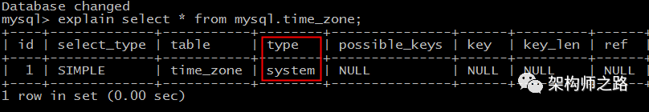
	>
	> 	```sql
	> 	explain select * from mysql.time_zone;
	> 	```
	>
	> 	上例中，从系统库mysql的系统表time_zone里查询数据，扫码类型为system，==这些数据已经加载到内存里，不需要进行磁盘IO==。因此这类扫描是速度最快的。
	>
	> - 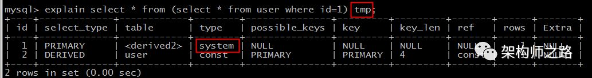
	>
	> 	```sql
	> 	explain select * from (select * from user where id=1) tmp;
	> 	```
	>
	> 	再举一个例子，==内层嵌套(const)返回了一个临时表==，==外层嵌套从临时表查询，其扫描类型也是system==，也不需要走磁盘IO，速度超快。

4. ==const==

	> - const扫描的条件为：
	>
	> 	（1）命中==主键(primary key)==或者==唯一索引(unique)==；
	>
	> 	（2）被==连接的部分是一个常量(const)值（右边的值为常量）==；
	>
	> 	```sql
	> 	explain select * from user where id=1;
	> 	```
	>
	> 	如上例，id是PK，连接部分是常量1。
	>
	> - ==画外音：别搞什么类型转换的幺蛾子。==
	>
	> 	这类扫描效率极高，返回数据量少，速度非常快。

5. ==eq_ref==

	> - eq_ref扫描的条件为，对于==前表的每一行(row)==，==后表只有一行被扫描==。
	>
	> 	再细化一点：
	>
	> 	（1）==join查询==；
	>
	> 	（2）命中==主键(primary key)==或者非空==唯一(unique not null)索引==；
	>
	> 	（3）==等值连接==； 
	>
	> - 	```sql
	> 	explain select * from user,user_ex where user.id = user_ex.id;
	> 	```
	>
	> 	如上例，==user.id 和 user_ex.id 都是主键==，该 join 查询为 eq_ref 扫描。
	>
	> 	这类扫描的速度也异常之快。
	
6. ==ref==

      > - 如果把上例eq_ref案例中的==主键索引，改为普通非唯一(non unique)索引==。
      >
      > 	```sql
      > 	explain select * from user,user_ex where user.id=user_ex.id;
      > 	```
      >
      > 	就==由 eq_ref 降级为了 ref==，此时对于前表的每一行(row)，后表可能有多于一行的数据被扫描。
      >
      > - 当id==改为普通非唯一索引后==，常量的连接查询，也由==const降级为了ref==，因为也==可能有多于一行的数据被扫描==。
      >
      > - ref扫描，可能出现在join里，也可能出现在==单表普通索引==里，==每一次匹配可能有多行数据返回==，虽然它比eq_ref要慢，但它仍然是一个很快的join类型。

7. ==range==

      > - 像上例中的 ==between，in，>== 都是典型的范围(range)查询。
      >
      > 	==画外音：必须是索引，否则不能批量”跳过”。==

8. ==index==

    > - 如果id上不建索引，对于前表的每一行(row)，后表都要被全表扫描。

9. ==总结==：

      > - ==system==最快：==不进行磁盘IO==
      > - ==const==：==PK或者unique==上的==等值查询（右侧是常量）==
      > - ==eq_ref==：==PK或者unique==上的==join查询==，==等值匹配（多表联立）==，对于前表的每一行(row)，后表只有一行命中
      > - ==ref==：==非唯一索引，等值匹配==，可能有多行命中
      > - ==range==：索引上的==范围扫描==，例如：==between/in/>==
      > - ==index==：索引上的==全集扫描==，例如：InnoDB的==count==
      > - ==ALL==最慢：全表扫描(full table scan)

---


### 2.分析 sql 又一关键字段：Extra🌟🌟

1. ```sql
	create table user (
	    id int primary key,
	    name varchar(20),
	    sex varchar(5),
	    index(name)
	) engine=innodb;
	
	insert into user values(1, 'shenjian','no');
	insert into user values(2, 'zhangsan','no');
	insert into user values(3, 'lisi', 'yes');
	insert into user values(4, 'lisi', 'no');
	```

2. ==Using where==

	> - Extra为Using where说明，==SQL使用了where条件过滤数据==。

3. ==Using index==

	> - Extra为Using index说明，==SQL所需要返回的所有列数据均在一棵索引树上==，而无需访问实际的行记录。
	>
	> - 如：
	>
	> 	```sql
	> 	explain select id,name from user where name='shenjian';
	> 	```

4. ==Using index condition==

	> - Extra为Using index condition说明，确实==命中了索引，但不是所有的列数据都在索引树上==，还需要访问实际的行记录。
	>
	> - 如：
	>
	> 	```sql
	> 	explain select id,name,sex from user # sex 没有索引
	> 	where name='shenjian';
	> 	```

5. ==Using filesort==

	> - ```sql
	> 	explain select * from user order by sex;
	> 	```
	>
	> 	结果说明：
	>
	> - Extra为Using filesort说明，得到==所需结果集，需要对所有记录进行文件排序==。
	>
	> - 这类SQL语句==性能极差==，需要进行优化。
	>
	> - 典型的，==在一个没有建立索引的列上进行了order by，就会触发filesort==，常见的==优化方案==是，在==order by的列上添加索引==，==避免每次查询都全量排序==。

6. ==Using temporary==

	> - ```sql
	> 	explain select * from user group by name order by sex;
	> 	```
	>
	> 	结果说明：
	>
	> - Extra为Using temporary说明，==需要建立临时表(temporary table)来暂存中间结果==。
	>
	> - 这类SQL语句==性能较低==，往往也需要进行优化。
	>
	> - 典型的，==group by和order by同时存在，且作用于不同的字段时，就会建立临时表==，以便计算出最终的结果集。

7. ==Using join buffer (Blocked Nested Loop)==

	> - ```sql
	> 	explain select * from user where id in(select id from user where sex='no');
	> 	```
	>
	> 	结果说明：
	>
	> - Extra为Using join buffer (Block Nested Loop)说明，需要进行==嵌套循环计算==。
	>
	> - *画外音：内层和外层的 type均为 ALL，rows均为4，需要循环进行 4\*4次计算。*
	>
	> - 这类SQL语句==性能往往也较低==，需要进行优化。
	>
	> - 典型的，两个关联表join，关联字段均未建立索引，就会出现这种情况。常见的优化方案是，==在关联字段上添加索引，避免每次嵌套循环计算==。

---


### 3.数据库允许空值(null)，往往是悲剧的开始🌟🌟

```sql
create table user (
    id int,
    name varchar(20),
    index(id)
) engine=innodb;

insert into user values(1,'shenjian');
insert into user values(2,'zhangsan');
insert into user values(3,'lisi');
```

1. ==负向比较==（例如：!=）会引发==全表扫描==；

	> 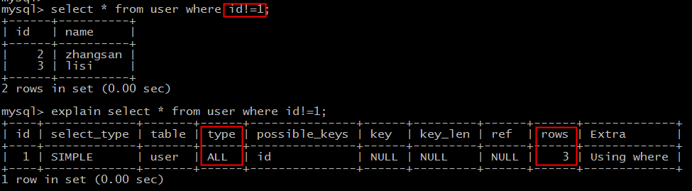

2. 如果允许空值，==不等于(!=)的查询，不会将空值行(row)包含进来==，此时的结果集往往是不符合预期的，此时==往往要加上一个or条件，把空值(is null)结果包含进来==；

	> 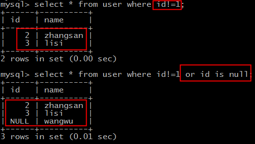

3. ==or可能会导致全表扫描==，此时可以==优化为union查询==；

	> ==使用 or is null==，==全表查询==：
	>
	> 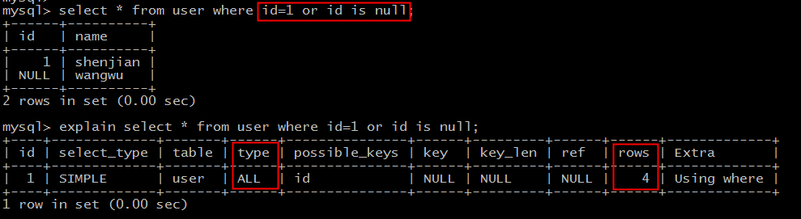
	>
	> ---
	>
	> ==使用 union==，使用==普通索引查询==：
	>
	> 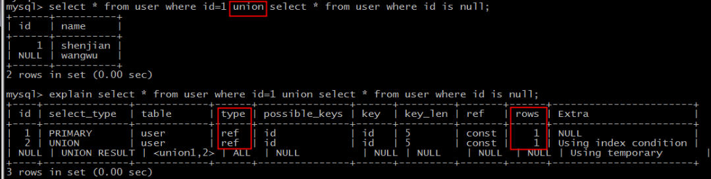

4. 建表时加上==默认(default)值==，这样能==避免空值的坑==；

---


### 4.count( * )这么慢，我该怎么办?🌟🌟

见笔记。

---


# 4.Redis

## 一轮复习中的问题

### 1.Redis单线程为啥还能这么快？🌟🌟🌟🌟🌟

1. ==memcached 与 redis 的区别==：

	> - Redis 拥有==更多的数据结构和操作种类==，可以进行更复杂的操作。
	> - ==Redis 单线程，而 memcached 多线程==。存储少量数据时 Redis 的效率更高，但是存储 100k 以上的数据时 memcached 性能要好一些。
	> - ==memcached 没有原生的集群环境==，需要依靠客户端实现往集群中分片写入数据。

2. ==Redis 单线程为什么这么快==？

      > - 相比于多线程，单线程不需要进行==并发控制==和操作系统==内核态与用户态之间的切换==。
      > - Redis 大部分==操作在内存中==，并且有大量==高效的数据结构==。
      > - 采用 ==IO 多路复用技术==，避免在 accept() 建立连接和 resv() 读取请求时==等待客户端数据造成阻塞==。

见笔记：4.高性能IO模型：为什么单线程Redis能那么快？🌟🌟🌟🌟🌟

---


### 2.redis都有哪些数据类型？分别在哪些场景下使用比较合适呢？🌟🌟🌟🌟🌟

1. > 

2. ==Redis 适合的场景==

	> 1. ==缓存==：减轻 MySQL 的==查询压力==，提升系统性能；
	> 2. ==排行榜==：利用 Redis 的 ==SortSet==（有序集合）实现；
	> 3. ==计算器/限速器==：利用 Redis 中==原子性的自增操作(INCR)==，我们可以统计类似用户点赞数、用户访问数等。这类操作如果用 MySQL，频繁的读写会带来相当大的压力；==限速器比较典型的使用场景是限制某个用户访问某个 API 的频率==，常用的有抢购时，防止用户疯狂点击带来不必要的压力；
	> 4. ==好友关系==：利用集合的一些命令，比如==求交集、并集、差集等。可以方便解决一些共同好友、共同爱好之类的功能==；
	> 5. ==消息队列==：==除了== Redis 自身的==发布/订阅模式==，我们==也==可以利用 ==List 来实现一个队列机制==，比如：到货通知、邮件发送之类的需求，不需要高可靠，但是会带来非常大的 DB 压力，完全可以用 List 来完成异步解耦；
	> 6. ==Session 共享==：Session 是保存在服务器的文件中，如果是==集群服务，同一个用户过来可能落在不同机器上==，这就会导致用户频繁登陆；==采用 Redis 保存 Session 后，无论用户落在那台机器上都能够获取到对应的 Session 信息==。

3. ==Redis 不适合的场景==

	> ==数据量太大==、数据==访问频率非常低==的业务都不适合使用 Redis，==数据太大会增加成本==，==访问频率太低，保存在内存中纯属浪费资源==。

见笔记：3.数据结构：快速的Redis有哪些慢操作？🌟🌟🌟🌟🌟

---


### 3.Redis持久化机制🌟🌟🌟🌟

==RDB==

> RDB 是 Redis DataBase 的缩写。按照一定的时间周期策略把内存的数据以快照的形式保存到硬盘的==二进制文件==。即 Snapshot 快照存储，对应产生的数据文件为 dump.rdb，通过配置文件中的 save 参数来定义快照的周期。核心函数：rdbSave（生成 RDB 文件）和 rdbLoad（从文件加载内存）两个函数。
>
> 

==AOF==

> AOF 是 ==Append-only file== 的缩写。Redis会==将每一个收到的写命令都通过 Write 函数追加到文件最后==，==类似于 MySQL 的 binlog（储存命令）==。当 Redis ==重启==是会通过==重新执行==文件中==保存的写命令来在内存中重建整个数据库的内容==。每当执行服务器（定时）任务或者函数时，flushAppendOnlyFile 函数都会被调用， 这个函数执行以下两个工作：
>
> - WRITE：根据条件，将 aof_buf 中的缓存写入到 AOF 文件；
> - SAVE：根据条件，调用 fsync 或 fdatasync 函数，将 AOF 文件保存到磁盘中。
>
> 

==RDB 和 AOF 的区别：==

> 1. ==AOF 文件比 RDB 更新频率高==，优先使用 AOF 还原数据；
> 2. AOF比 RDB 更安全也更大；
> 3. RDB 性能比 AOF 好；
> 4. 如果两个都配了==优先加载 AOF==。

见笔记：5.AOF日志：宕机了，Redis如何避免数据丢失？🌟🌟🌟🌟🌟

见笔记：6.内存快照：宕机后，Redis如何实现快速恢复？🌟🌟🌟🌟

---


### 4.Redis实现分布式锁🌟🌟🌟🌟

1. ==加锁==：

	> ==set 命令可以设置过期参数保证原子性==，而 ==setnx 命令和 expire 命令合用则不能保证原子性==。
	>
	> ```bash
	> # 加锁, unique_value 作为客户端唯一性的标识，过期时间10秒。
	> SET lock_key unique_value NX PX 10000 # unique_value 防止误删锁，
	> 									  # expire 防止异常一直不释放锁
	> 									  # NX: 只在键不存在时，才对键进行设置操作
	> ```

2. ==解锁==：

	> ==使用 lua 脚本保证原子性==。
	>
	> ```lua
	> //释放锁 比较unique_value是否相等，避免误释放
	> if redis.call("get",KEYS[1]) == ARGV[1] then
	>     return redis.call("del",KEYS[1])
	> else
	>     return 0
	> end
	> ```

3. ==可能遇到的问题==：

	> 1. ==原子性问题==：
	> 	- setnx 设置锁之后没来得及设置 expire 就异常，导致锁永远不会释放。
	> 	- ==解决方式==：==使用可以设置 PX 参数的 set 命令==，保证原子性。
	> 2. ==锁误解锁==：
	> 	- 主要是指 A 客户端误 del 了 B 客户端上的分布式锁。
	> 	- ==解决方式==：每一个客户端==加锁前设置unique_value唯一值==，==解锁时判断是否时加锁的客户端==。
	> 3. ==锁超时导致和其它客户端并发执行==：
	> 	- ==没能在锁过期的时限内完成操作==，导致==锁到时自动释放，其它客户端获得锁==与当前的并发执行。
	> 	- ==解决方法==：设置足够长时间的 expire 时间。为获取锁的线程==增加守护线程==，==为将要过期但未释放的锁增加有效时间==。
	> 4. ==无法等待锁释放==：
	> 	- 解决方式：没有获取到锁循环重复尝试获取，比较消耗 CPU 资源；采用发布订阅功能，当==获取锁失败时，订阅锁释放消息==，获取锁成功后==释放时，发送锁释放消息==。

见笔记：31.如何使用Redis实现分布式锁？⭐️⭐️⭐️⭐️⭐️

---


### 5.Redis实现消息队列🌟🌟🌟

见笔记：16.消息队列的考验：Redis有哪些解决方案？🌟🌟🌟🌟

----


### 6.redis的过期策略能介绍一下？要不你再手写一个LRU？🌟🌟🌟🌟🌟

1. Redis 缓存需要对数据设置过期时间。
2. Redis 对过期数据的删除策略是==惰性删除（访问到才删）+定期删除（定期抽样进行检查，删除样本中过期的键，可能出现有的过期键迟迟不被抽到的情况）==两种策略对==过期键删除==。

见笔记：25.替换策略：缓存满了怎么办？⭐️⭐️⭐️⭐️⭐️

---


### 7.你能说说redis的并发竞争问题该如何解决吗？🌟🌟

视频中的重点：对于==缓存的更新==，不是说加锁就行，核心还得==加上时间戳==。

1. 你要写入缓存的数据，都先写入mysql中，==写入mysq中的是时候必须保存一个时间戳==。从mysql查出来的时候，==时间戳也查出来==。
2. 每次要写之前，先==判断==一下当前这个value的时间戳==是否比缓存里的vle的时间戳要更新==，如果更新，那么可以写。如果更旧，就==不能用旧的数据覆盖新的数据==。

见笔记：30.无锁的原子操作：Redis如何应对并发访问？⭐️⭐️⭐️⭐️

见笔记：31.如何使用Redis实现分布式锁？⭐️⭐️⭐️⭐️⭐️

---


### 8.缓存雪崩+穿透+数据库缓存一致性问题⭐️⭐️⭐️⭐️⭐️

1. ==缓存雪崩==：

	> - ==原因==：
	> 	1. ==Redis 实例挂掉了==，请求全部走数据库。
	> 	2. 对缓存数据设置相同的过期时间，导致某段时间内==缓存集体失效==，请求全部走数据库。
	> - ==解决方法==：
	> 	1. 事发前：实现Redis的==高可用==(主从架构+Sentinel 或者Redis Cluster，==一个挂了或出事了还有其它的实例==)，尽量避免Redis挂掉这种情况发生。
	> 	2. 事发中：万一Redis真的挂了，我们可以设置==本地缓存(ehcache，即在服务器本地进行缓存而暂时不使用 Redis 实例) + 限流(hystrix)==，尽量避免我们的数据库被干掉(起码能保证我们的服务还是能正常工作的)
	> 	3. 事发后：redis持久化，重启后自动从磁盘上加载数据，==快速恢复缓存数据==。

2. ==缓存穿透==：

	> - ==原因==：
	> 	1. 请求的数据在==缓存大量不命中==，导致请求走数据库。
	> - ==解决方法==：
	> 	1. 使用==布隆过滤器==(BloomFilter)或者压缩filter==提前拦截==，不合法就不让这个请求到数据库层！
	> 	2. 当我们从数据库找不到的时候，我们也将这个==空对象设置到缓存里边去（比如-1:null）==。下次再请求的时候，就可以从缓存里边获取了。
	> 		- 这种情况我们一般会将==空对象==设置一个==较短的过期时间==。

3. ==先更新数据库，再删除缓存==

	> - ==数据库里是新数据，而缓存里是旧数据==。
	> - ==解决思路==：
	> 	- 将==需要删除的key存到消息队列中==。
	> 	- 自己消费消息，==删除成功就把对应的key从消息队列中删除==。
	> 	- ==失败不断重试删除操作，直到成功（有上限次数，达到还是没成功就报错）==。

4. ==先删除缓存，再更新数据库==

	> - 第一步成功(删除缓存)，第二步失败(更新数据库)，数据库和缓存的数据还是一致的。
	> - ==解决方法==：
	> 	- 将删除缓存、修改数据库、读取缓存等的操作积压到==队列==里边，实现==串行化==。
	> 	- 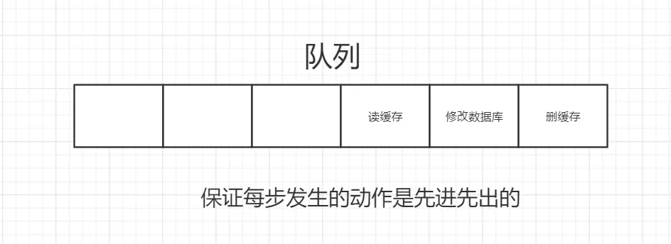

见笔记：24.旁路缓存：Redis是如何工作的？⭐️⭐️⭐️⭐️（只读缓存和几种读写缓存）

见笔记：26.缓存异常（上）：如何解决缓存和数据库的数据不一致问题？⭐️⭐️⭐️⭐️⭐️

见笔记：27.缓存异常（下）：如何解决缓存雪崩、击穿、穿透难题？⭐️⭐️⭐️⭐️⭐️

---


### 9.哈希扩容：rehash⭐️⭐️⭐️

1. redis 有==两个数组==，主要用于==渐进式扩容==。
2. 之所以需要渐进，主要是为了分摊扩容的压力，==避免一次性移到大量数据阻塞线程==。

见笔记：3.数据结构：快速的Redis有哪些慢操作？🌟🌟🌟🌟🌟

---


### 10.分布式一致性算法：leader选举⭐️⭐️

见笔记：9.哨兵集群：哨兵挂了，主从库还能切换吗？🌟🌟🌟（Leader选举）

见笔记：7.同步：主从库如何实现数据一致？🌟🌟🌟🌟（主从同步）

---


# 5.计算机网络

## 计算机网络面试题

> 笔记直接看 ComputerNetworks

### 1.OSI 的七层模型分别是？各自的功能是什么？

==我的回答==：

1. ==物理层==：==使用物理设备将计算机连接起来==，实现通信。

	常用的物理设备有==双绞线，同轴电缆，光纤==等。==比如我们的家庭宽带就是使用光纤连接==起来的。我们发送的==数据在物理层都是以高低电平的形式进行传输的==。

	这也意味着发送方和接收方需要有==统一的编码和解码方式，从而将高低电平转化为0,1==。

2. ==数据链路层==：根据以太网协议，数据链路层中数据传输的==最小单位是帧==。帧的存在是为了==将物理层传来的0,1字节流封装成帧，并进行差错检验==。

	既然我们要进行数据的传输，那么肯定需要标识数据的发送者和接收者，而 ==MAC 地址就能唯一地标识一台设备，它在网卡生产的时候就被唯一确定了==，且是==不可变==的。一个 ==MAC 地址由12个16进制数组成==，比如 `88-A4-C2-57-C7-F6`。因此在==帧的头部会有12个字节分别标识数据的目的地址和源地址==。

	位于数据链路层的==交换机==收到帧之后，就==根据目的地址的 MAC 地址在自己的 MAC 地址表中查找对应的端口==，进行数据帧的转发。

3. ==网络层==：如果说数据链路层是进行局域网内部的数据传输的话，那么==网络层就是将数据在网络和网络之间进行传输==，所依赖的设备是==路由器==。

	网络层进行数据传输的协议是 ==IP 协议==。==IP 协议的数据报位于数据链路层帧的数据部分中==，可以理解为==数据链路层的帧就是网络层的 IP 协议数据报在两端加上帧首部和帧尾部==。而 IP 协议的数据报中存储了目的 IP 地址和源 IP 地址。

	路由器收到 IP 数据报后，==根据其路由表找出下一跳的路由器的 IP 地址或是转发信息的端口==。

	如果==目标 IP 地址就处于该路由器所连接的某个端口下，路由器则根据其 ARP 缓存表查询目的 MAC 地址==，并==写入到新数据帧的帧表头中==，==发送给对应端口下的交换机==以进行进一步数据传输。

4. ==传输层==：负责==建立浏览器进程和服务器后台进程间的通信==，而由于浏览器进程和服务器后台进程都占用了所属设备的某个端口，因此传输层的工作便是==建立端口到端口之间的通信==。传输层常用的协议是 ==TCP 和 UDP 协议==。其中 ==TCP 协议==在数据传输前会进行==连接==，以实现==点对点的通信==，并提供==拥塞控制==和==流量控制==，实现了==可靠的数据传输==。

5. ==应用层==：虽然我们收到了传输层传来的数据，可是这些传过来的数据五花八门，有html格式的，有mp4格式的，各种各样。因此==我们需要指定这些数据的格式规则，收到后才好解读渲染==。例如我们最常见的 Http 数据包中，就会指定该数据包是什么格式的文件了。

==参考答案==：

- ==物理层==：负责==把两台计算机连起来==，然后在计算机之间通过==高低电频来传送0,1这样的电信号==，比如通过一些==电缆线传输比特流==。
- ==链路层==：链路层涉及到的协议比较多，比如 Mac 地址啊，ARP 等，这一层主要就是==负责数据的通信==，使==各节点之间可以通信==，比如通过 ==MAC 地址唯一识别不同的节点，通过以太网协议定义数据包==等。
- ==网络层==：网络层负责==把一个数据从一个网络传递到另外一个网络==，最大的功能就是进行==路由决策==，比如通过 ==IP，子网==等概念，使数据更好着==在不同的局域网中传递==。
- ==传输层==：传输层的功能就是==建立端口到端口的通信==，刚才说的==网络层的功能则是建立主机到主机的通信==，比如通过网络层我们可以把信息从 A 主机传递到 B 主机，但是 ==B 主机有多个程序，我们具体要发给哪个程序，则是靠传输层的协议来识别==，常见协议有 ==UDP 和 TCP==。
- ==应用层==：虽然我们收到了传输层传来的数据，可是这些传过来的数据五花八门，有html格式的，有mp4==格式的，各种各样==，我们用户也看不懂，因此我们需要==指定这些数据的格式规则，收到后才好解读渲染==。例如我们最常见的 Http 数据包中，就会指定该数据包是什么格式的文件了。

----


### 2.为什么需要三次握手？两次不行？

==我的回答==：

1. 三次握手是 TCP 协议在传输前==建立端口与端口间连接的方法==，它可以==让客户端和服务端都能确认双方接收和发送数据的能力正常==，从而提供==可靠的数据服务==。
2. 三次握手的流程是首先客户端想要和服务端建立连接，先发送一个 SYN 报文，里面附加一个==客户端动态生成的序列号（之所以动态是防止被伪造==），发送后客户端处于 ==SYNC-SENT== 状态。
3. 服务端接收到客户端的 SYN 报文后，需要==回复两个报文==。一个是 ACK 报文，标识服务端成功接收 SYN 报文，该 ACK 报文中传输一个序列号，==其值为客户端发来的 SYN 报文中的序列号 + 1==，以==向客户端证明自己的接收能力没有问题==。同时，还需发送一个 SYN 报文，里面有一个在服务端动态生成的序列号。发送这两个报文后，服务端处于 ==SYNC-RCVD== 状态。
4. 客户端接收到 ACK 报文后，看到里面的序列号的确是自己这里生成的序列号 + 1，于是可以确认服务端的接收能力没有问题。而收到 SYN 报文后，和服务端类似的返回一个含有 SYN 中服务端序列号 + 1的序列号的 ACK 报文。此时==客户端已经可以确认双方接收和发送数据的能力均正常==，进入 ==ESTABLISHED==。
5. 最后，服务端收到 ACK 报文，也能确认双方接收和发送数据的能力均正常，进入 ==ESTABLISHED==。
6. 如果只握手==两次的话，只有客户端能确认双方接收和发送数据的能力均正常，而服务端不能==。

==参考答案==：

- 第一次握手：客户端发送网络包，服务端收到了。这样服务端就能得出结论：客户端的发送能力、服务端的接收能力是正常的。
- 第二次握手：服务端发包，客户端收到了。这样==客户端就能得出结论：服务端的接收、发送能力，客户端的接收、发送能力是正常的==。==不过此时服务器并不能确认客户端的接收能力是否正常==。
- 第三次握手：客户端发包，服务端收到了。这样服务端就能得出结论：客户端的接收、发送能力正常，服务器自己的发送、接收能力也正常。

----


### 3.为什么需要四次挥手？三次不行？

==我的回答==：

1. 四次挥手是 TCP 协议中客户端和服务端需要断开连接时，==保证双方都能把当前的数据处理完==的机制，也体现了 TCP 的==可靠性传输==。
2. 值得一提的是，==客户端或服务端都可以主动请求断开 TCP 连接==，下面假设客户端主动请求断开连接。
3. 首先客户端发送一个 FIN 报文，报文携带一个在客户端动态生成的序列号，随后进入 FIN_WAIT1状态。
4. 服务端接收到 FIN 报文后，回复一个 ACK 报文，为了向客户端证明自己的确收到了断开连接的请求，ACK 报文中会携带一个序列号，其值为客户端发来的 FIN 报文中的序列号的值 + 1，随后服务端进入 ==CLOSE_WAIT 状态，此时服务端会尽快处理完自己剩下的数据，以便随后发起断开连接请求==。
5. 而客户端接收到服务端的 ACK，并通过验证序列号确认其收到后，边进入 ==FIN_WAIT2 状态，等待服务端确认服务端可以结束后再发送的 FIN 报文==。
6. 服务端处理完所有数据，确保自己可以断开连接后，向客户端发送一个 FIN 报文，类似的携带一个在服务端动态生成的序列号，随后进入 ==LACK_ACK 状态，意为等待客户端最后的确认==。
7. 客户端收到 FIN 报文后，回复 ACK 报文并携带收到的序列号 + 1，之后进入 TIME_WAIT 状态。==TIME_WAIT 状态至少等待 2MSL==。
8. 服务端收到 ACK 报文后，进入 CLOSED 状态，断开 TCP 连接。
9. 而客户端在等待 2MSL 后也进入 CLOSED 状态。
10. ==为什么 TIME_WAIT 至少要等待 2MSL==？==MSL 是一个报文的最大存活时间==，如果服务端在 LACK_ACK 状态下等待 1MSL 后没有收到客户端的 ACK 报文，那么此报文必定已经过期了。服务端意识到 ACK 报文可能由于网络拥塞等原因没能成功送达，便赶紧==重新发送一个 FIN 报文==，意为让客户端重新确认。==这一来一回的最长时间正是两个报文的最大存活时间 2MSL==。因此 ==TIME_WAIT 至少等待 2MSL 可以保证来得及接收到服务端可能再次发送的 FIN 报文==，这也是 TCP 可靠传输服务的一个体现。
11. 四次挥手主要原因是，==客户端主动==发起断开连接的请求后，==服务器可能仍有数据需要处理和发送==，所以==需要等待服务器处理完数据==后，主动调用断开函数，因此==服务端的 ACK 和 FIN 需要分开发送，就需要四次挥手==。

==参考答案==：

- 四次挥手主要原因是，==客户端主动==发起断开连接的请求后，==服务器可能仍有数据需要处理和发送==，所以==需要等待服务器处理完数据==后，主动调用断开函数，因此==服务端的 ACK 和 FIN 需要分开发送，就需要四次挥手==。

---


### 4.TCP与UDP有哪些区别？各自应用场景？

==我的回答==：

1. TCP 协议是有连接的协议，比如再正式传输数据之前会先进行三次握手保证双发发送接收能力正常，而在断开连接时也会进行四次挥手以保证客户端和服务端数据处理完毕。而 UDP 是无连接协议。
2. TCP 协议时面向字节流的协议，可以将一份数据拆分成多份数据报进行发送。而 UDP 时面向报文的协议，即不会对报文进行拆分或重组。
3. TCP 协议是可靠的传输协议，提供网络拥塞控制以及接收方流量控制以防止传输数据被阻塞或丢弃，并且能保证接收方能按顺序接收发送方发出的报文。而 UDP 协议不能保证可靠传输，比如发送方发出报文和接收方接收报文的顺序不一定相同。
4. UDP 报文的首部开销很小，传输速度快。而 TCP 报文首部较大，传输速度也不及 UDP 报文。
5. 因此传输对准确性要求高，性能要求较宽松的数据，如登录凭证，重要文件，邮件信息建议使用 TCP。
6. 而对传输速度要求高，但是允许传输失败或失误的数据可以使用 UDP，如在线聊天，视频通话，广播。

==参考答案==：

- (1)TCP是==可靠==传输,UDP是不可靠传输;

	(2)TCP面向==连接==,UDP无连接;

	(3)TCP传输数据==有序==,UDP不保证数据的有序性;

	(4)TCP==不保存数据边界==,UDP保留数据边界;

	(5)TCP==传输速度==相对UDP较慢;

	(6)TCP有==流量控制和拥塞控制==,UDP没有;

	(７)TCP是==重量级协议==,UDP是轻量级协议;

	(８)TCP==首部较长==20字节,UDP首部较短8字节;

- 基于 TCP 和 UDP 的==常用协议==

	==HTTP、HTTPS==、FTP、TELNET、==SMTP==(简单邮件传输协议)协议基于==可靠的TCP协议==。

	==DNS、DHCP==、TFTP、SNMP(简单网络管理协议)、RIP基于==不可靠的UDP协议==。

- ==TCP 应用场景==：

	==效率要求相对低，但对准确性要求相对高==的场景。因为传输中需要对数据确认、重发、排序等操作，相比之下效率没有UDP高。举几个例子：==文件传输==（准确高要求高、但是速度可以相对慢）、==接受邮件、远程登录==。

- ==UDP 应用场景==：

	==效率要求相对高，对准确性要求相对低==的场景。举几个例子：==QQ聊天、在线视频、网络语音电话==（即时通讯，速度要求高，但是出现偶尔断续不是太大问题，并且此处完全不可以使用重发机制）、==广播通信==（广播、多播）

---


### 5.HTTP1.0，1.1，2.0 的版本区别

==我的回答==：

1. ==HTTP1.0 每个 TCP 连接只能发送一个请求==，如果还需发送其它的请求，那么就需要重新建立连接。==新建连接的成本较高==，比如需要进行三次握手，因此如果请求一个需要大量外部资源的网页，那么这个缺点就会进一步被放大，因此 HTTP1.0 的效率较低。
2. HTTP1.1 支持持久连接和管道，==持久连接指一个 TCP 连接在发出一个请求之后不会立即断开==。而==管道则是在同一个连接里，客户端可以发送多个请求==，同时服务端可以发送多个回应。但是既然允许发送多个请求，就必须有方法可以区分每个回应，HTTP1.1 中采取的方式是在报文中加入报文长度，这样浏览器就能判断哪一串字节流是一个回应了。
3. HTTP1.1 中的数据体既可以是二进制流，也可以是文本。而在 ==HTTP2.0 中，数据体只能是二进制流==，而这就==方便将数据分割成更小的消息和帧==，并对它们==进行二进制编码==。除此以外，HTTP2.0 支持多路复用，即再一次连接中，客户端和服务端均可以发送多个请求和回应，且不用按照顺序一一对应，而==多路复用的前提则是上面提到的二进制分帧==。

==参考答案==：

- ==HTTP/1.0==：==HTTP/1.0规定浏览器与服务器只保持短暂的连接，浏览器的每次请求都需要与服务器建立一个TCP连接，服务器完成请求处理后立即断开TCP连接==。


暂时止步于此，主要感觉有点厌倦了，先学一些其它的东西调节一下。

---


# 6.操作系统

### 1.进程之间的通信有哪些？

1. ==管道==：

	> - ==匿名管道==就是我们常用的 `|` ，意为把前一条命令的输出作为后一条命令的输入。
	> - ==命名管道==则是通过 `>` 和 `<` 实现，但是==命名管道中的数据没有被另一个进程读取，这条命令就会一直停留在这里==。
	> - 因此==管道就像是缓存==，一个进程吧数据放在一个缓存区域，等待其它进程去拿，但是==必须要等待其它进程拿走这份数据后，原进程才能返回==，因此管道的==效率较为低下==。

2. ==消息队列==：

	> - 这种通信方式也==类似于缓存==，只不过数据的发送方==只需把数据甩到消息队列就可以返回==。
	> - 缺点是如果==数据占用的内存较大==，且进程之间的==通信频繁==的话，==发送消息阶段就会占用很多时间==。

3. ==共享内存==：

	> - ==共享内存==这个通信方式就可以很好着==解决拷贝所消耗的时间==。
	> - 系统加载一个进程的时候，分配给进程的内存并不是==实际物理内存==，而是==虚拟内存空间==。那么我们可以让两个进程==各自拿出一块虚拟地址空间来，然后映射到相同的物理内存==中，这样，==两个进程虽然有着独立的虚拟内存空间，但有一部分却是映射到相同的物理内存==，就完成了==内存共享==机制了。

4. ==信号量==：

	> - 信号量的本质就是一个==计数器==，用来实现进程之间的互斥与同步，以==解决多个线程并发访问共享内存而带来的线程安全问题==。
	> - 例如信号量的初始值是 1，然后 a 进程来访问==内存1==的时候，我们就把信号量的值设为 0，然后进程b 也要来访问==内存1==的时候，看到信号量的值为 0 就知道已经有进程在访问==内存1==了，这个时候进程 b 就会访问不了==内存1==。所以说，信号量也是进程之间的一种通信方式。

5. ==Socket==

---


### 2.进程和线程的区别

1. ==进程相当一个容器，而线程只是里面的一个东西==，并且程==序本质是线程在执行==，基于这个，再去回答他们的其他区别，比如通信，内存结构，等等。

---


# 7.Linux

## 1.Linux 性能排查（重点）

### 1.你使用过监控软件吗？说说其特点

1. ==top==

	> - 它提供了实时的系统状态，包括==CPU使用率、内存使用、进程信息==等。它非常适合于快速查看系统的当前状态。
	> - 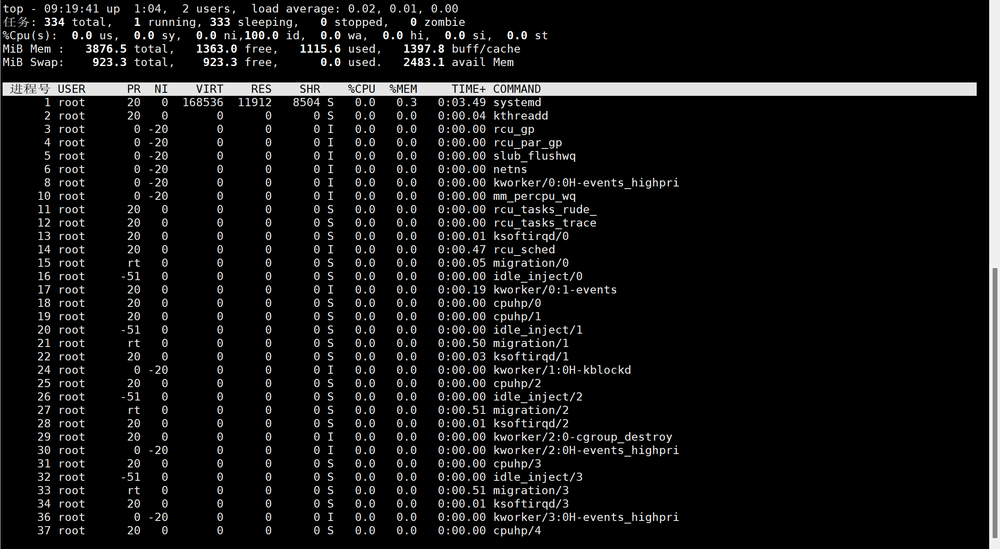

2. ==htop==

	> - 相比于top，htop提供了一个更为友好的用户界面，支持==彩色显示==，可以==通过键盘操作来管理进程（如杀死进程）==。它还显示了==CPU的使用情况分布在所有核心上的视图==，使得信息的获取更直观。
	> - 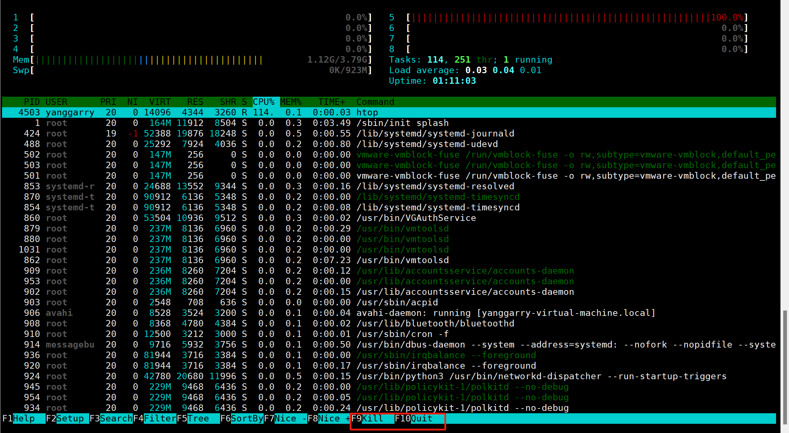

3. ==iotop==

	> - 这个工具==专注于磁盘I/O==，它显示了==哪些进程正在进行磁盘读写操作以及操作的强度==。这==对于识别磁盘I/O瓶颈非常有用==。
	> - 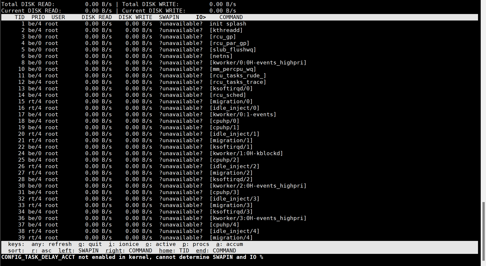

4. ==vmstat==

	> - 它提供了关于==虚拟内存、进程、CPU活动以及I/O阻塞==的信息。vmstat能够以时间序列的方式显示系统性能指标，有助于识别性能趋势。
	> - 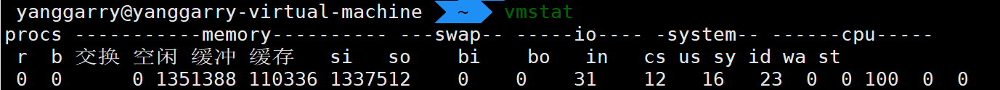

5. ==dstat==

	> - dstat是一个强大的工具，可以看作是==vmstat、iotop和ifstat的结合体==。它能够报告关于==CPU、内存、磁盘以及网络性能的综合视图==，支持自定义输出以关注特定的性能指标。
	> - 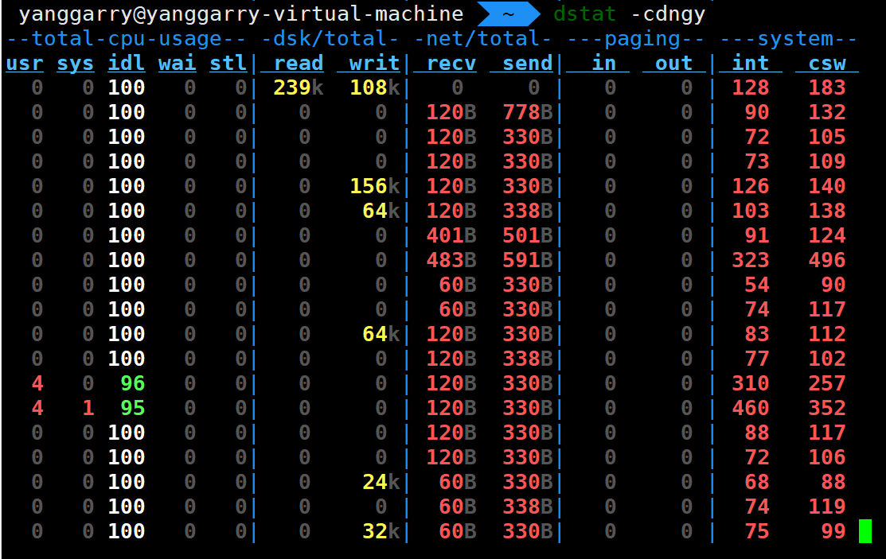

6. ==Prometheus和Grafana==

	> - 这是一种更现代的监控解决方案，Prometheus负责收集和存储性能数据，而Grafana用于数据的可视化。这种组合支持高度自定义的仪表板，能够显示复杂的时间序列数据，适用于大规模环境的监控。

7. ==例子==

	> - 如果我们想要监控一个Web服务器的性能，我们可以使用`top`或`htop`来观察哪些进程消耗了最多的CPU和内存资源。如果发现磁盘I/O是性能瓶颈，那么`iotop`可以帮助我们确定是哪个进程导致的磁盘压力。而对于长期的性能监控和趋势分析，则可以部署`Prometheus`和`Grafana`，通过精美的图表来直观展示性能数据，从而帮助我们做出相应的优化决策。

---


### 2.Linux 如何查看 CPU 运行状态?

1. ==top命令==：

	> - 这是最基础的命令之一，可以实时显示系统进程的动态运行情况，包括==CPU使用率、内存使用、以及进程信息==。在top界面中，CPU状态显示在顶部，包括各个核心的使用情况。

2. ==htop命令==：

	> - htop是top命令的一个增强版，提供了一个更友好的用户界面，支持==彩色显示==，并且可以通过==键盘直接操作进程（如结束进程）==。它显示了每个CPU核心的使用情况，并且提供了更多的信息和更好的视觉体验。

3. ==vmstat命令==：

	> - vmstat（Virtual Memory Statistics）命令报告关于==虚拟内存、进程、CPU活动==等的信息。它可以显示==系统的平均负载以及CPU的空闲时间、用户时间、系统时间和等待I/O的时间==。
	> - 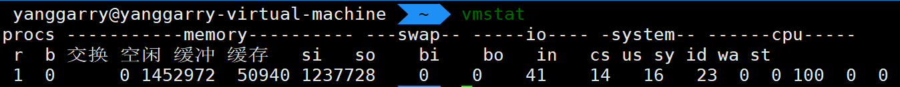

4. ==mpstat命令==：

	> - ==mpstat是sysstat包的一部分==，用于显示各个CPU或者核心的性能统计。它可以报告==CPU的使用细节==，包括==每个CPU在用户模式、系统模式下的时间花费，以及空闲时间==等。
	> - 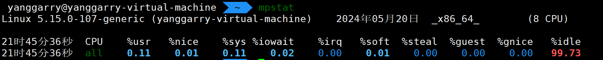

5. ==lscpu命令==：

	> - lscpu显示了CPU架构的信息，包括==CPU的数量、每个CPU的核数、每个核的线程数、CPU的家族、型号==等。这个命令更多地提供了==CPU的静态信息==，而不是动态的性能数据。
	> - 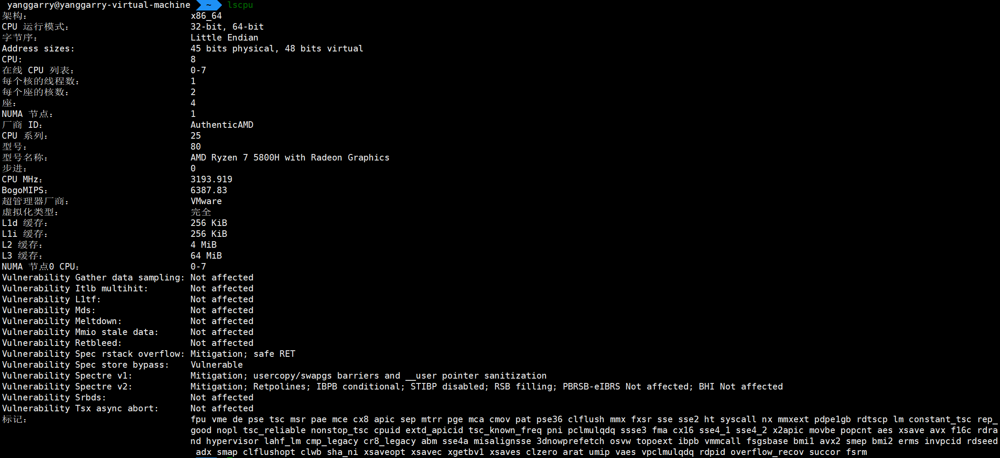

6. ==cat /proc/cpuinfo==：

	> - 这个命令 `cat /proc/cpuinfo` 提供了关于==CPU的详细信息==，包括==每个CPU的型号、核心数、速度==等。`/proc/cpuinfo`文件包含了当前系统CPU的所有详细信息。

---


### 3Linux 如何查看内存的使用情况？

1. ==free命令==：

	> - `free`命令是查看内存使用情况最直接的方法。它显示了==总内存、已使用内存、空闲内存、缓存和缓冲区使用的内存==以及==交换空间==的使用情况。通过`free -h`可以获得易于阅读的格式。
	> - 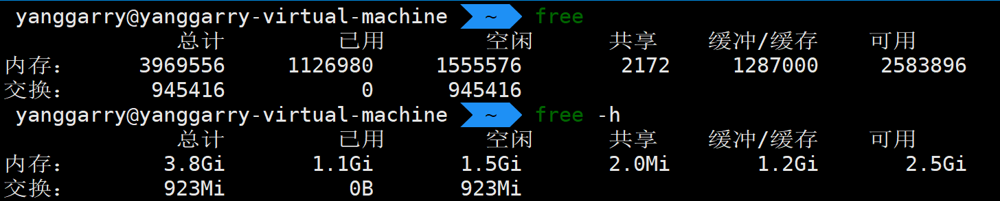

2. ==top命令==：

	> - `top`命令不仅可以查看CPU的使用情况，也能显示==内存的总体使用状况，包括总内存、空闲内存、缓冲区和缓存==的使用情况。此外，它还能显示每个==进程的内存占用==。

3. ==htop命令==：

	> - 与`top`类似，`htop`提供了一个更易于使用的界面来显示系统的==内存使用情况，包括物理内存和交换空间的使用==。它还允许用户通过==图形界面==管理进程，包括查看==进程的内存占用==。

4. ==vmstat命令==：

	> - `vmstat`报告了==虚拟内存==的统计信息，包括系统的==交换活动、空闲内存量以及内存的使用==情况。它对于==分析系统的内存压力和性能瓶颈==非常有用。

5. ==/proc/meminfo文件==：

	> - 通过查看`/proc/meminfo`文件，可以获取关于==系统内存使用的详细信息==，包括==总内存、空闲内存、可用内存、缓存、交换空间==等。使用`cat /proc/meminfo`命令可以查看这些详细数据。

6. ==sar命令==：

	> - `sar`是一个系统活动报告工具，它可以报告历史数据和实时数据，包括CPU使用、内存使用、I/O等。对于内存使用情况，`sar -r`可以显示实时的内存使用情况，包括交换空间的使用。
	>
	> - 无法打开 /var/log/sysstat/sa21 的解决办法：
	>
	> 	- ```bash
	> 		sudo vim /etc/default/sysstat
	> 							
	> 		#
	> 		# Default settings for /etc/init.d/sysstat, /etc/cron.d/sysstat
	> 		# and /etc/cron.daily/sysstat files
	> 		#
	> 							
	> 		# Should sadc collect system activity informations? Valid values
	> 		# are "true" and "false". Please do not put other values, they
	> 		# will be overwritten by debconf!
	> 		ENABLED="true" # 将 false 改为 true
	> 		```
	>
	> 	- 重启 sysstat 服务：
	>
	> 		```java
	> 		sudo systemctl restart sysstat
	> 		```
	>
	> - 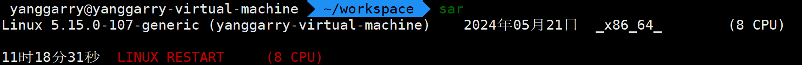

7. 这些工具和命令从不同的角度提供了内存使用情况的视图，可以帮助系统管理员和用户监控内存的使用情况，识别可能的内存泄漏或是为系统优化提供数据支持。例如，==使用`free`命令可以快速了解系统的内存总览==，而==`htop`提供了一种交互式的方式来深入每个进程的内存==使用详情。

---


### 4.Linux 如何查看硬盘的读写性能？

1. ==hdparm命令==：

	> - `hdparm`是一个查看和设置SATA/IDE设备性能的命令行工具。它可以用来进行磁盘的读取性能测试。例如，`hdparm -Tt /dev/sda`命令可以测试设备`/dev/sda`的==缓存读取性能（`-T`）==和==磁盘读取性能（`-t`）==。
	> - 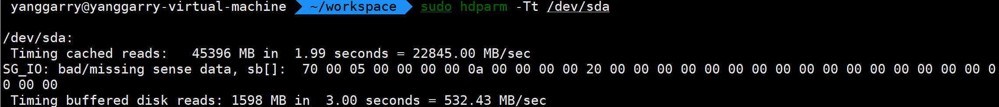

2. ==dd命令==：

	> - `dd`命令通常用于复制和转换文件，但也可以用来测试磁盘的读写性能。通过写入一个大文件到磁盘，并读取它，可以简单地测量磁盘的写入和读取速率。例如，==使用`dd if=/dev/zero of=testfile bs=1G count=1 oflag=dsync`可以测试写速度==，==使用`dd if=testfile of=/dev/null bs=1G count=1`可以测试读速度==。
	>
	> - 测试读速度
	>
	> 	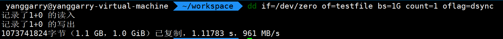
	>
	> - 测试写速度
	>
	> 	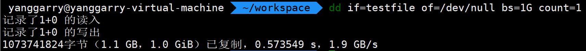

3. ==iostat命令==：

	> - `iostat`是一个用于监控系统==输入/输出设备负载==的工具。它可以报告==CPU统计信息和所有块设备的I/O统计信息==，包括==每个磁盘的读写速度、每次读写操作的数据量以及总的读写请求==等。`iostat -dx 1`命令可以每秒更新这些统计信息。

4. ==iotop命令==：

	> - `iotop`是一个实时的I/O监视工具，它可以显示==哪些进程==在进行==读写操作以及这些操作的速度==。这对于==识别哪个进程对磁盘性能影响最大==非常有用。

5. ==fio工具==：

	> - `fio`是一个灵活的I/O测试工具，可以模拟不同类型的I/O负载，包括随机读写和顺序读写。它支持多种I/O引擎，如POSIX AIO、libaio等，并可以详细配置测试的参数，如块大小、队列深度等。`fio`能够提供==详细的性能测试报告==，包括IOPS（==每秒输入/输出操作次数）、延迟和吞吐量==等。

6. 使用这些工具，你可以从不同的角度评估硬盘的读写性能。例如，==`hdparm`和`dd`适合快速简单==的性能测试，而==`iostat`和`iotop`则适用于实时监控==。对于需要深入分析和==定制测试场景的情况，`fio`==是一个非常强大的选择。

----


### 5.Linux 机器上跟踪系统事件的守护进程名是什么？

1. 在Linux机器上，跟踪系统事件的守护进程通常是`syslogd`或`rsyslogd`。
2. ==syslogd==：这是最基本的系统日志守护进程，负责收集系统的日志信息并根据配置决定如何处理这些日志，比如将其写入到不同的日志文件中。
3. ==rsyslogd==：是一个增强版的syslog守护进程，提供了更高的性能和更灵活的配置选项。==`rsyslog`可以接收日志数据来自于本地系统以及网络，支持各种日志数据的格式和目的地==，包括数据库、电子邮件以及支持TCP和UDP的远程日志服务器。==`rsyslog`由于其强大的功能和灵活性，已经成为许多现代Linux发行版的默认日志系统守护进程==。

---


### 6.CPU 负载和 CPU 利用率的区别是什么？

1. ==CPU利用率==

	> - ==定义==：CPU利用率指的是CPU在==一段时间==内处于==非空闲状态的百分比==。它反映了CPU正在执行进程的时间比例，包括用户空间程序和内核空间程序的执行时间。
	> - ==表达方式==：通常以百分比表示，例如，如果CPU利用率是25%，这意味着CPU在过去的测量周期内有==25%的时间==用于执行进程，而==剩余的75%时间==处于空闲状态。
	> - ==重要性==：CPU利用率是衡量单个CPU或整个系统性能的一个直接指标。==高CPU利用率可能表示CPU繁忙，正在频繁地处理任务==，但如果长时间处于极高水平，可能表示CPU成为性能瓶颈。

2. ==CPU负载==

	> - ==定义==：CPU负载指的是在特定==时间间隔内==，系统中处于==运行状态和等待状态的平均进程数==。等待状态指的是等待CPU资源或正在执行的进程。
	> - ==表达方式==：通常以一组数字表示，分别对应过去1分钟、5分钟和15分钟的平均负载值。例如，一个系统的CPU负载为==1.00, 0.50, 0.25==，这表示在==过去1分钟内平均有1个进程处于运行或等待CPU，过去5分钟内平均为0.5个，过去15分钟内平均为0.25个==。
	> - ==重要性==：CPU负载提供了系统需求对CPU资源的总体要求的视图，它包括了当前正在执行的进程以及等待CPU资源的进程。==负载过高可能意味着有许多进程竞争CPU资源==，这可能导致性能下降。

3. ==区别==

	> - ==本质区别==：==CPU利用率==反映了==CPU活跃的程度==，而==CPU负载==表示系统对CPU资源的==需求量==。
	> - ==影响因素==：==CPU利用率==仅考虑了==CPU的活动时间==，而==CPU负载==则包括了==所有请求CPU资源的进程==，无论它们是否正在CPU上运行。
	> - ==使用场景==：==CPU利用率==适合评估==CPU的工作强度==，==CPU负载==则更适合评估系统整体的性能状态和==CPU资源需求==。

---


### 7.CPU 负载很高，利用率却很低该怎么办？

1. 当遇到CPU负载很高而CPU利用率却很低的情况时，这通常指示系统有很多进程等待资源（不一定是CPU资源），但实际上==CPU并没有被充分利用==。这种情况可能是由于多种原因造成的，例如==I/O等待、网络延迟或进程间的锁等待==。

2. ==检查I/O等待==：

	> - 高的I/O等待可能导致进程不能有效执行，增加了系统的负载而不影响CPU利用率。使用`iostat`、`vmstat`等工具可以帮助识别是否存在I/O瓶颈。

3. ==分析进程状态==：

	> - 使用`top`或`htop`命令查看进程状态，==关注处于等待（D状态）的进程==。这些进程可能正在等待I/O操作完成，从而影响了系统的响应时间。

4. 优化==应用程序==：

	> - 检查和优化应用程序的代码，减少不必要的I/O操作，或者改进数据库查询效率，可以减少对资源的等待时间。

5. 增加或==优化硬件==：

	> - 如果硬件资源确实是瓶颈（例如，磁盘I/O性能低），考虑升级硬件或者使用更快的存储解决方案，如SSD代替传统硬盘。

6. 使用==并发或异步编程==模型：

	> - 对于网络密集或I/O密集的应用，使用并发或异步的编程模型可以提高应用性能，==减少因等待I/O操作==而导致的高负载问题。

7. 调整==系统配置==：

	> - 根据应用的需求调整系统配置，比如调整文件系统的挂载选项、网络参数或内核参数，以减少系统的等待时间。

8. 分析网络延迟：

	> - 对于依赖外部服务的应用，网络延迟也可能导致高负载。使用网络监控工具和分析方法来识别并解决网络瓶颈问题。

9. 查看系统日志：

	> - 系统日志（如`/var/log/messages`、`/var/log/syslog`等）可能包含有用的信息，可以帮助识别系统性能问题的原因。

---


### 8.CPU 负载很低，利用率却很高该怎么办？

1. 当CPU负载很低而CPU利用率却很高的情况发生时，这通常意味着系统中有==少数几个进程占用了大量的CPU资源==，而其他进程并没有产生太多的CPU负荷。这种情况可能导致系统响应变慢，特别是当==高CPU利用率的进程占用了大部分或全部CPU资源==时。

2. ==识别高CPU使用的进程==

	> - 使用`top`或==`htop`命令来识别哪些进程正在占用大量的CPU资源==。这将帮助你了解是哪个应用或服务导致了高CPU利用率。

3. 分析==进程行为==

	> - 对于占用CPU资源的进程，进行进一步分析以了解其行为。如果是你的应用程序，检查代码中是否存在==无限循环、过度的计算或其他效率低下的操作==。

4. 优化或更新应用

	> - 如果确定某个应用程序是问题的根源，尝试优化其性能，减少不必要的CPU消耗。如果是第三方应用，查看是否有更新或补丁可用，或者联系供应商寻求帮助。

5. 调整==系统或应用配置==

	> - 某些情况下，调整应用或系统的配置设置可以减少CPU的使用。例如，==减少数据库查询的频率，调整缓存设置，或者更改服务的并发设置==。

6. 利用nice和cpulimit工具

	> - 使用==`nice`命令降低进程的优先级，让其他更重要的进程有更多的CPU时间==。==`cpulimit`工具可以限制进程的CPU使用率==，防止它们占用过多的CPU时间。

7. ==负载均衡==

	> - 如果运行在多核CPU系统上，考虑使用任务调度或负载均衡技术，将==工作负载分散到不同的CPU或核心上==，以避免单个CPU过载。

8. 扩展或升级硬件

	> - 如果优化和配置调整不能解决问题，且应用确实需要更多的CPU资源，考虑==扩展系统资源或升级硬件==以提供更多的处理能力。

9. ==监控和预警==

	> - 实施系统监控和预警机制，以便==在CPU利用率异常升高时及时得到通知==，可以使用如==Prometheus和Grafana==等工具来实现。

---


## 2.Linux 命令考察

### 1.如何查看占用端口8080 的进程 ？

1. 使用`netstat`命令

	如果你的系统上安装了`netstat`，可以使用：

	```bash
	sudo netstat -ltnp | grep ':8080'
	```

2. 使用`lsof`命令

	另一个选项是使用`lsof`命令：

	```bash
	sudo lsof -i :8080
	```

	- `-i :8080`选项指定查找所有使用端口8080的进程。

---


### 2.Linux如何查询端口占用并杀掉占用端口的进程?

1. ```bash
	sudo kill PID
	```

	或者强制终止：

	```bash
	sudo kill -9 PID
	```

---


### 3.简述Linux终止进程用什么命令？

1. ==使用`kill`命令==

	`kill`命令通过指定进程ID（PID）来发送信号给进程。

	- ==发送SIGTERM==（默认信号，允许进程优雅地清理和退出）：

	```bash
	kill PID
	```

	- ==发送SIGKILL==（强制终止进程，不能被进程捕获或忽略）：

	```bash
	kill -9 PID
	```

2. ==使用`pkill`命令==

	`pkill`命令根据进程名来发送信号，这对于不知道PID的情况很有用。

	- 发送SIGTERM给指定名称的所有进程：

	```bash
	pkill 进程名
	```

3. ==使用`killall`命令==

	`killall`命令也是根据进程名来发送信号，但与`pkill`不同的是，`killall`在某些系统上（如Linux）作用于所有匹配名称的进程，而在其他系统（如Solaris）则完全不同。

	- 发送SIGTERM给指定名称的所有进程：

	```bash
	killall 进程名
	```

---


### 4.简述du 和 df 命令的区别？

1. du（Disk Usage）
	- ==用途==：`du`命令用于计算文件和目录所占用的磁盘空间大小。它可以提供关于单个文件、目录或整个文件系统中各个文件和目录所使用的空间量的详细信息。
	- ==工作方式==：`du`递归地检查指定目录（默认为当前目录），报告每个子目录和文件所使用的磁盘空间。
	- ==输出==：显示的是文件和目录的磁盘使用情况，通常以字节为单位，但可以通过选项调整为更易读的格式（如KB、MB、GB）。
	- ==用例==：找出占用大量磁盘空间的文件和目录，帮助用户管理和清理磁盘空间。
	- 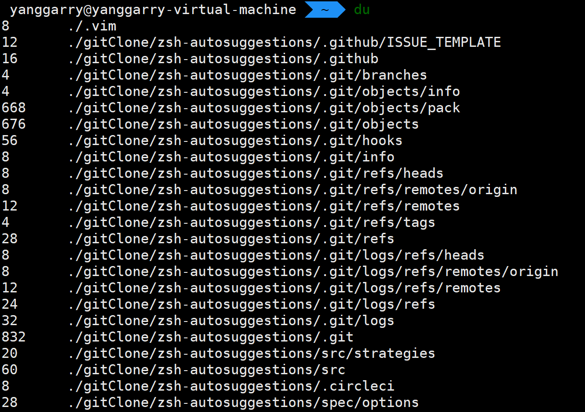
2. df（Disk Free）
	- ==用途==：`df`命令用于显示文件系统的总空间、已使用空间、可用空间以及挂载点信息。它提供了一个高层次的磁盘使用概览。
	- ==工作方式==：`df`检查整个文件系统的磁盘空间使用情况，包括所有挂载的文件系统。
	- ==输出==：显示的是整个文件系统级别的磁盘使用情况，包括总大小、已用空间、可用空间和使用率，以及文件系统的挂载点。
	- ==用例==：监控和管理系统的整体磁盘空间使用情况，确保足够的磁盘空间供系统和应用程序使用。
	- 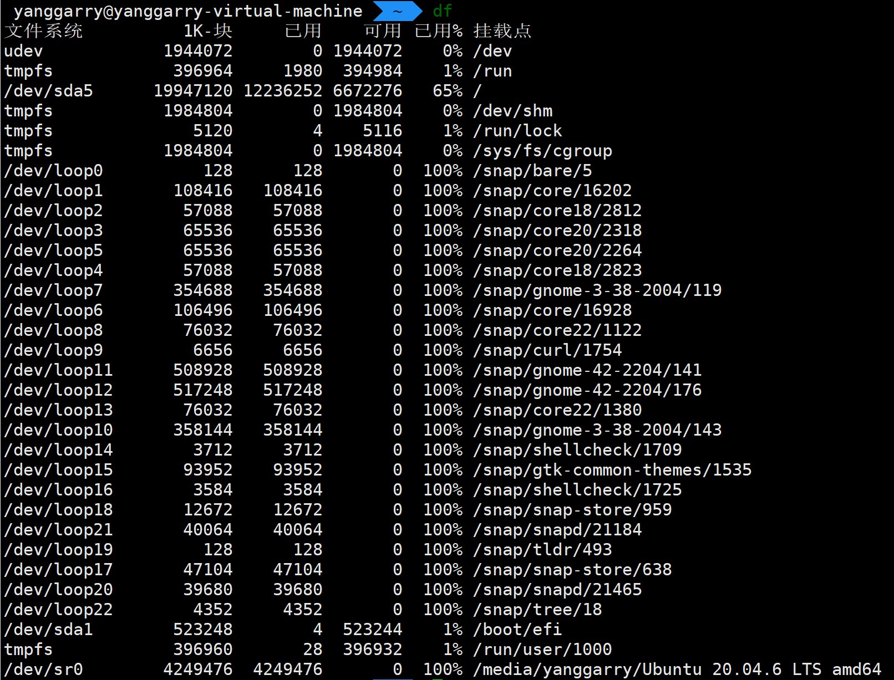
3. 主要区别
	- ==粒度==：==`du`提供了更细粒度的信息==，可以针对单个文件和目录；而==`df`提供了文件系统级别==的宏观视图。
	- ==目的==：`du`主要用于分析==特定文件和目录==的空间占用情况；`df`用于查看==整个文件系统==的空间使用情况。
	- ==使用场景==：如果你想知道==某个目录树中哪些文件或子目录占用了大量空间，使用`du`==；如果你想检查==系统上有哪些文件系统、它们各自的容量和使用情况，使用`df`==。

---


### 5.误操作，执行了rm -rf \* ，会有哪些情况发生？请举例？

1. ==例子==
	- ==个人数据丢失==：如果你在`~/Documents`执行了`rm -rf *`，将会删除你所有的文档。
	- ==系统破坏==：以root用户在`/`执行该命令，可能导致==系统立即崩溃，重启后无法再次启动==，因为==关键的启动文件和配置已被删除==。
	- ==服务失败==：在`/var/log`执行这个命令会==删除所有日志文件，可能导致无法跟踪系统问题或服务状态==。
2. ==预防措施==
	- ==谨慎使用root权限==：避免以root用户执行命令，除非绝对必要。
	- ==使用绝对路径==：在使用`rm`命令时尽量使用完整的绝对路径，并仔细检查路径是否正确。
	- ==备份==：==定期备份重要数据和配置文件==。
	- ==使用安全措施==：在删除大量文件之前，可以先使用`ls`或其他命令确认文件列表，或者先移动到临时目录而不是直接删除。

----


### 6.如何查看 http 的并发请求数与其 TCP 连接状态？

1. ==使用`netstat`命令==

	`netstat`是一个非常有用的命令，可以显示网络连接、路由表、接口统计等信息。要查看TCP连接的状态，包括与HTTP服务器相关的连接，你可以使用：

	```bash
	netstat -an | grep ':80'
	```

	- `-a`选项表示显示==所有连接和监听端口==。
	- `-n`选项表示==以数字形式显示地址和端口号==，不进行名称解析（更快）。
	- `grep`用于过滤出特定端口的连接（HTTP默认是80端口，HTTPS是443端口）。

2. ==使用`ss`命令==

	`ss`是另一个实用工具，用于查看套接字统计信息。它被认为是`netstat`的现代替代品，提供了更多的信息和更快的执行速度。类似地，要查看HTTP或HTTPS连接，可以使用：

	```bash
	ss -tan | grep ':80'
	```

	- `-t`表示显示==TCP套接字==。
	- `-a`表示显示==所有套接字==。
	- `-n`表示不解析服务名称。

---


## 3.Linux 日志

### 1.如何动态监听 Linux 日志 ？

1. ==使用 `tail` 命令==

	`tail` 命令可以用来查看文件的最后几行内容。当==与 `-f` 参数一起使用时，`tail -f` 会持续监视指定的文件，当文件增长时，新添加的内容会实时显示出来==。这是最常见和简单的动态监听日志文件的方法。

	例如，动态监听系统消息日志：

	```bash
	tail -f /var/log/messages
	```

2. ==使用 `less` 命令==

	`less` 命令也可以用于动态监听日志。首先使用 `less` 打开一个日志文件，然后按下 `Shift+F`，`less` 会进入类似 `tail -f` 的监视模式，实时显示日志文件的新内容。

	例如，使用 `less` 监听安全日志：

	```bash
	less +F /var/log/auth.log
	```

3. ==使用 `multitail` 命令==

	`multitail` 是一个强大的工具，它不仅可以==动态监听多个日志文件==，还可以在一个窗口中以分屏的形式显示，还支持日志文件的彩色显示，使得日志的阅读更加直观。

	安装 `multitail`（如果系统中没有预装的话）：

	```bash
	sudo apt-get install multitail  # Debian/Ubuntu
	sudo yum install multitail      # CentOS/RedHat
	```

	动态监听多个日志文件：

	```bash
	multitail /var/log/apache2/access.log /var/log/apache2/error.log
	```

4. ==使用 `journalctl` 命令==

	对于使用 systemd 的系统，`journalctl` 是查看和监控==系统日志==的强大工具。使用 `-f` 参数，可以动态监听系统的日志。

	例如，动态监听系统日志：

	```bash
	journalctl -f
	```

----


### 2.如何带关键词查询 Linux 日志文件 ？

1.  ==使用 `grep` 命令==

	`grep` 是最基本也是最强大的文本搜索工具之一，它可以搜索包含指定模式（可以是字符串或正则表达式）的行。

	例如，搜索 `/var/log/syslog` 文件中包含关键词 “error” 的行：

	```bash
	grep "error" /var/log/syslog
	```

	如果你想同时查看匹配行的上下文（例如，显示==每个匹配行前后各2行==），可以==使用 `-C`（上下文==）选项：

	```bash
	grep -C 2 "error" /var/log/syslog
	```

2. ==使用 `awk` 命令==

	```bash
	awk '/failed/' /var/log/auth.log
	```

3. ==使用 `sed` 命令==

	```bash
	sed -n '/usb/p' /var/log/dmesg
	```

4. ==结合使用 `zgrep` 命令搜索压缩的日志文件==

	许多 Linux 系统会==压缩旧的日志文件以节省空间，这些文件通常以 `.gz` 结尾==。`zgrep` 命令可以在这些压缩文件中搜索文本，==无需先解压==。

	例如，搜索所有压缩的 `.log.gz` 文件中包含 “warning” 的行：

	```bash
	sudo zgrep "warning" /var/log/*.gz
	```

---


### 3.Linux 下日志文件过大，如何实现分割，转储 ？

1. ==使用 `logrotate`==

	- ==配置 `logrotate`==：你可以通过==编辑 `/etc/logrotate.conf` 文件或在 `/etc/logrotate.d/` 目录下创建新的配置文件来定制 `logrotate` 的行为==。配置文件允许你设置轮转周期、压缩选项、轮转前后执行的脚本等。

2. ==手动分割日志文件==

	如果你需要立即分割一个过大的日志文件，而不等待 `logrotate` 的自动执行，可以手动进行。一种方法是使用 `split` 命令分割文件，另一种方法是直接移动当前日志文件然后通知相关服务创建一个新的日志文件。

	- ==移动日志文件==：

	```bash
	mv /var/log/large.log /var/log/large.log.old
	```

	- ==通知相关服务==：对于大多数服务，特别是那些通过 `systemd` 管理的，可以使用 `systemctl` 重新加载或重启服务来使其开始写入新的日志文件。

	```bash
	systemctl restart myservice
	```

	或者，如果服务支持不重启即可重新打开日志文件的信号（例如，==许多守护进程会在接收到 `SIGHUP` 信号时重新打开日志文件==），你可以发送 `SIGHUP`：

	```bash
	pkill -HUP myservice
	```

---


## 4.Linux 概念基础

### 1.Linux系统中符号链接与硬链接的区别？

1. ==符号链接（软链接）==

	> - 符号链接，也称为软链接，是一种特殊类型的文件，它==包含的是另一个文件或目录的路径==。它==仅仅是指向另一个文件的指针==。
	>
	> - ```bash
	> 	ln -s file1.txt link1.txt
	> 	```
	>
	> 	如果`file1.txt`被删除，`link1.txt`仍然存在，但是它==不再指向一个有效文件==。
	>
	> - 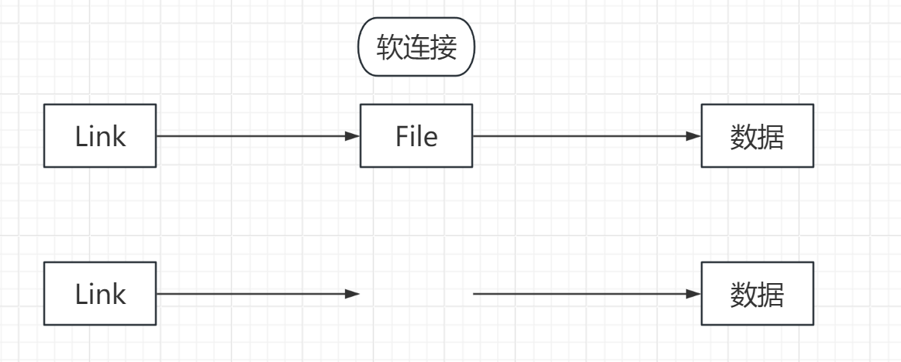
	>
	> - ==特点==：
	>
	> 	- 可以跨文件系统链接。
	> 	- 可以链接到目录。
	> 	- 如果==删除了原文件，符号链接将失效，显示为悬空链接==。
	> 	- ==符号链接文件本身有独立的inode==（文件系统中的索引节点）。

2. ==硬链接==

	> - 硬链接是另一个文件的另一个名称，它指向相同的文件内容和inode。在==文件系统中，所有的文件名实际上都是硬链接，指向存储数据的inode==。
	>
	> - ```bash
	> 	ln file2.txt link2.txt
	> 	```
	>
	> 	如果`file2.txt`被删除，通过`link2.txt`依然可以访问到文件的内容，因为==`link2.txt`和`file2.txt`实际上指向同一个inode和数据块==。
	>
	> - 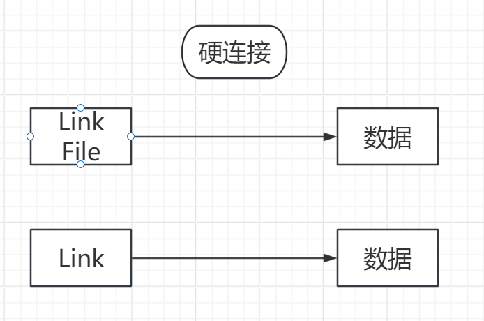
	>
	> - ==特点==：
	>
	> 	- 不能跨文件系统链接。
	> 	- 不能链接到目录（为了防止产生循环）。
	> 	- 如果==删除了原文件，任何硬链接都仍然可以访问文件的内容==。
	> 	- 硬链接和其原始文件==共享相同的inode==。

3. 总结

	> - ==符号链接类似于Windows的快捷方式==，是一个==指向另一个文件路径的特殊文件==。
	> - ==硬链接是文件的另一个名称，它和原始文件共享相同的数据==。
	> - 符号链接可以指向不存在的文件，而硬链接保证了即使原始文件名被删除，文件内容仍然存在。
	> - 符号链接和硬链接在文件备份、快速访问等场景下非常有用。

---


### 2.常见的Linux目录结构？

#### `/`（根目录）

- 所有文件和目录在Linux中都从根目录开始。

#### `/bin`（用户二进制文件）

- 包含==用户级别的程序和命令==，如`ls`、`cp`等。这些命令对所有用户都可用。

#### `/sbin`（系统二进制文件）

- 存放系统管==理员使用的系统管理命令==，如`fdisk`、`sysctl`等。

#### `/etc`（配置文件）

- 包含==系统的配置文件==。这些文件通常是文本文件，可以被编辑来改变系统的设置。

#### `/dev`（设备文件）

- 包含所有设备和特殊文件的位置。在Linux中，==设备被视为文件，可以像操作文件一样操作这些设备==。

#### `/proc`（进程信息）

- 一个虚拟的文件系统，==包含运行中的系统进程和内核信息==。它不占用磁盘空间，主要用于系统监控目的。

#### `/var`（可变文件）

- 存放==经常变化的文件==，如==日志文件==（`/var/log`）、包和数据库文件。

#### `/tmp`（临时文件）

- 用于存放临时文件，系统重启时，这个目录下的文件可能会被删除。

#### `/usr`（用户程序）

- 包含用户应用程序和文件。它通常包含多个子目录，如`/usr/bin`、`/usr/sbin`、`/usr/local`等，用于==不同类型的用户级程序和数据==。

#### `/home`（用户主目录）

- 存放==普通用户的个人数据和配置文件==。每个用户都有一个以其用户名命名的目录。

#### `/root`（root用户的主目录）

- `root`用户的个人主目录，而不是`/home/root`。

#### `/boot`（启动加载器文件）

- 包含启动Linux系统时使用的文件，如内核映像和引导加载程序（GRUB或LILO）的配置文件。

#### `/lib`（系统库）

- 存放==系统和应用程序使用的共享库文件==，以及==内核模块==。

---


### 3.描述Linux运行级别0-6的各自含义？

#### 运行级别0

- ==关机==（Halt）：此运行级别会关闭系统。

#### 运行级别1

- ==单用户模式==（Single-User Mode）：这是一种维护或紧急修复模式，此时==只有根用户可以登录，不启动网络服务==，一般用于==系统维护==。

#### 运行级别2

- ==多用户模式，不带NFS==（Multi-User Mode without NFS）：这个级别允许多用户登录但不启动网络文件系统（NFS），在不同的Linux发行版中这个模式的具体含义可能有所不同。

#### 运行级别3

- ==完全的多用户模式==（Full Multi-User Mode）：这是标准的多用户模式，支持多用户登录并启动网络服务，但不启动图形用户界面（GUI）。

#### 运行级别4

- ==未定义==：保留未使用，可以被个别==Linux发行版特定地定义用途==。

#### 运行级别5

- ==图形模式==（X11）：与运行级别3相似，但在此基础上启动==图形用户界面==（GUI），是==大多数桌面Linux发行版的默认运行级别==。

#### 运行级别6

- ==重启==（Reboot）：此运行级别会重启系统。

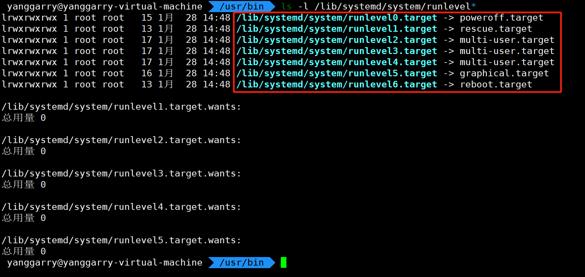

要查看或更改当前运行级别，传统的方法是使用==`runlevel`命令查看==和==`init`命令来更改运行级别==。在使用systemd的系统中，可以使用`systemctl`命令来实现相似的功能，例如==`systemctl get-default`查看默认目标（运行级别==），==`systemctl set-default`来设置默认目标==。

----


### 4.给出正确的关机和重启服务器的命令？

1. ==使用 Systemd 的系统（大多数 Linux 发行版）==

	> - ```bash
	> 	# 关机
	> 	sudo systemctl poweroff 
	> 	sudo shutdown -h now # -h 表示 halt，即停止所有 CPU 功能
	> 				
	> 	# 重启
	> 	sudo systemctl reboot
	> 	sudo shutdown -r now
	> 	```

2. ==使用 System V init 的系统==

	> - ```bash
	> 	sudo shutdown -h now
	> 	sudo shutdown -r now
	> 	```

3. ==其它命令==

	> - ```bash
	> 	sudo poweroff
	> 	sudo halt
	> 	sudo reboot
	> 	```

4. ==`systemctl`命令是推荐的方式，因为它与systemd系统管理器直接交互，提供了一致的接口来管理启动过程和服务==。不过，`shutdown`、`poweroff`、`halt`、和`reboot`命令在大多数情况下仍然有效，因为它们通常被链接到systemd提供的相应命令，以保持向后兼容性。

----


### 5.Linux 中的用户模式和内核模式是什么含意？

1. 用户模式（User Mode）和内核模式（Kernel Mode）是指CPU的两种不同的运行级别或状态，这两种模式主要是为了提供==系统的安全性和稳定性==。

2. ==内核模式（Kernel Mode）==

	> - 在内核模式下，==CPU可以执行任何指令==，访问系统的==所有内存地址和硬件资源==。操作系统的核心部分（内核）在这个模式下运行，负责==管理硬件设备、管理内存、处理系统调用==等低级任务。
	> - 任何在内核模式下运行的错误代码都可能导致系统崩溃或==安全漏洞==。因此，==只有受信任的操作系统代码==应在内核模式下执行。

3. ==用户模式（User Mode）==

	> - 用户模式是一个受限制的执行模式，用于运行==用户程序和应用软件==。在用户模式下，程序==不能直接执行==某些保护系统安全和稳定性的操作（==如直接访问硬件资源==）。
	> - 用户模式通过==限制程序的能力来增加系统的安全性和稳定性==。即使用户程序崩溃，也==不会直接影响到系统的核心部分==。

4. ==用户模式和内核模式的切换==

	> - ==系统调用==：当用户程序需要执行==文件操作、网络通信或其他需要内核介入的操作时==，它会执行系统调用。这会导致CPU==从用户模式切换到内核模式==，并执行相应的内核函数。==完成后，CPU切换回用户模式==，继续执行用户程序。
	> - ==中断和异常==：当发生==硬件中断或异常==时，CPU也会从用户模式==切换到内核模式，以便内核处理这些事件==。

---


### 6.Linux 软中断和工作队列的作用是什么？

1. ==软中断（Softirqs）==

	> - ==作用==：软中断是一种低开销的中断机制，用于处理可延迟的任务，如网络数据包的接收和发送、定时器处理等。它们是在中断上下文中执行的，意味着它们不能被普通的进程抢占，但可以被硬件中断（Hardirqs）抢占。
	> - ==设计目的==：软中断的主要设计目的是减少硬件中断处理程序（Hardirqs）的执行时间。通过将部分工作延迟到软中断中，硬件中断处理程序可以快速返回，从而减少系统对硬件中断的响应时间。
	> - 特点：
	> 	- 软中断可以并发运行在多个CPU上。
	> 	- 软中断的执行不能被其他软中断或任务抢占，但可以被硬件中断抢占。
	> 	- 适用于处理==需要快速响应但不需要立即完成==的任务。

2. ==工作队列（Workqueues）==

	> - ==作用==：工作队列提供了一种机制，允许内核将需要在进程上下文中执行的==长时间运行的任务排队==。这些任务可能包括设备驱动程序的底层任务，如==磁盘I/O操作、文件系统的延迟写入==等。
	> - ==设计目的==：工作队列允许任务在进程上下文中==异步执行==，这意味着它们可以睡眠（等待资源、睡眠锁等），这在中断上下文中是不允许的。
	> - 特点：
	> 	- 工作队列任务在特定的内核线程中执行，这些线程可以被普通进程和软中断抢占。
	> 	- 适用于==不需要立即处理的任务==，特别是那些可能需要睡眠的任务。
	> 	- 提供了更大的灵活性，可以处理复杂的任务，但相比软中断和硬件中断处理程序，其开销较大。

3. ==总结==

	> - ==软中断==主要用于处理==需要较快处理但可以稍微延迟的中断驱动任务==，例如在接收到大量网络数据包时快速处理它们。
	> - ==工作队列==用于处理那些==可能需要较长时间、可能需要睡眠的任务==，它们在进程上下文中执行，提供了执行复杂操作的能力。

---


### 7.Linux 中进程有哪几种状态？在 ps 显示出来的信息中，分别用什么符号表示的？

#### 1. 运行（Running）

- ==符号==：`R`
- ==含义==：进程正在运行或在运行队列中等待。

#### 2. 睡眠（Sleeping）

- ==符号==：`S`
- ==含义==：进程处于睡眠状态，等待某个事件或资源。
- 特定类型的睡眠状态：
	- ==可中断睡眠==：`S`，进程等待事件完成，可以被信号唤醒。
	- ==不可中断睡眠==：`D`，进程在等待I/O操作，如磁盘I/O，不能被信号唤醒。

#### 3. 停止（Stopped/Terminal）

- ==符号==：`T`
- ==含义==：进程已停止执行，通常是因为收到了一个==停止信号==（如由`Ctrl+Z`生成的SIGSTOP）。

#### 4. 僵尸（Zombie）

- ==符号==：`Z`
- ==含义==：==进程已完成执行==，但其==父进程尚未==通过`wait()`系统调用来==读取其退出状态，释放资源==。

#### 5. 跟踪或被调试（Traced or Debugged）

- ==符号==：通常用`T`表示，但这可能依赖于具体的`ps`实现。
- ==含义==：进程被另一个进程监视或控制，如调试器。

#### 6. 分页（Paging）

- ==符号==：不常见，某些系统可能使用`W`表示，但这在现代Linux版本中不常用。
- ==含义==：进程正在等待页面调入（较旧的系统可能显示此状态）。

#### 7. 死锁（Deadlocked）

- ==符号==：Linux通常不直接显示死锁状态，但死锁情况可以通过系统监控和调试工具识别。

---


### 8.如何检查Linux某项服务是否在运行？

1. ==使用`systemctl`命令==：

	> - ```bash
	> 	systemctl status <服务名>
	> 	systemctl status nginx
	> 	systemctl is-active <服务名>
	> 	```

2. ==使用`service`命令==：

	> - ```bash
	> 	service <服务名> status
	> 	service httpd status
	> 	/etc/init.d/<服务名> status
	> 	```

3. ==使用`ps`命令==：

	> - ```bash
	> 	ps aux | grep <服务名>
	> 	```

4. ==使用`pgrep`命令==：

	> - ```bash
	> 	pgrep <服务名>
	> 	```

----


### 9.块设备和字符设备有什么区别？

1. ==块设备==

	> - ==数据处理方式==：块设备以==固定大小的块==（通常为512字节或更大）为单位读写数据。这意味着即使要==读写的数据量小于一个块的大小，操作系统也会处理一个完整的块==。
	> - ==例子==：==硬盘驱动器、固态硬盘、USB==闪存驱动器等。
	> - 特点：
	> 	- 支持==随机访问==：可以直接读写存储在任何位置的数据块。
	> 	- 通常用于存储文件系统。
	> 	- 数据==可以被缓存==：出于性能考虑，操作系统可以缓存块设备的数据，延迟写入操作。

2. ==字符设备==

	> - ==数据处理方式==：字符设备以字节为单位顺序处理数据，通常==不支持随机访问==。==数据按照顺序一个接一个地传输，没有缓冲==。
	> - ==例子==：==键盘、鼠标、串口、打印机==等。
	> - 特点：
	> 	- 数据直接从设备读取或直接写入设备，不经过缓冲区。
	> 	- 主要用于==输入/输出设备==，支持==流式数据传输==。

3. ==主要区别==

	- ==访问模式==：==块设备支持随机访问==，允许访问任意位置的数据块；==字符设备处理流式数据==，通常以==顺序==方式访问。
	- ==数据单位==：块设备==以块（一组字节）为单位==处理数据；字符设备==以单个字符（字节）为单位==处理数据。
	- ==缓存==：==块设备的数据可以被缓存==，提高数据访问效率；==字符设备的数据通常不被缓存，直接传输==。

---


### 10.Linux系统里，您知道buffer和cache如何区分吗？

1. 区分点

	> - ==目标对象==：`buffer`针对的是==块设备的原始数据块==；而`cache`针对的是文件系统层面的==文件数据==。
	> - ==优化策略==：`buffer`通过==优化块设备的读写操作==来提高效率；`cache`通过==减少对实际磁盘的访问==来加速文件的读写操作。
	> - ==数据处理==：虽然两者都是用来缓存数据的，但==`buffer`更多关注于磁盘I/O操作的缓冲==，而==`cache`关注于文件内容的缓存==。

2. 随着Linux内核的发展，特别是从2.4版本开始，内核引入了统一的缓冲区管理机制，将`buffer`和`cache`更紧密地集成在一起。==在现代Linux系统中，`buffer cache`已经被页缓存机制所取代，对文件和块设备的缓存都通过页缓存来处理==。

---


# 8.消息队列

## 1.视频课

### 1.体验一下面试官对于消息队列的7个连环炮

1. 从一个点开始谈，然后由浅入深，步步深挖。

---


### 2.如何进行消息队列的技术选型？

1. ==为什么使用消息队列==？

	> - 面试官心理：看看你是不是真的知道这个技术的运用场景，防止你进入团队后乱用不懂的技术，给团队挖坑。
	>
	> - ==解耦==：
	>
	> 	- ==不用消息队列产生严重耦合的场景==：
	>
	> 		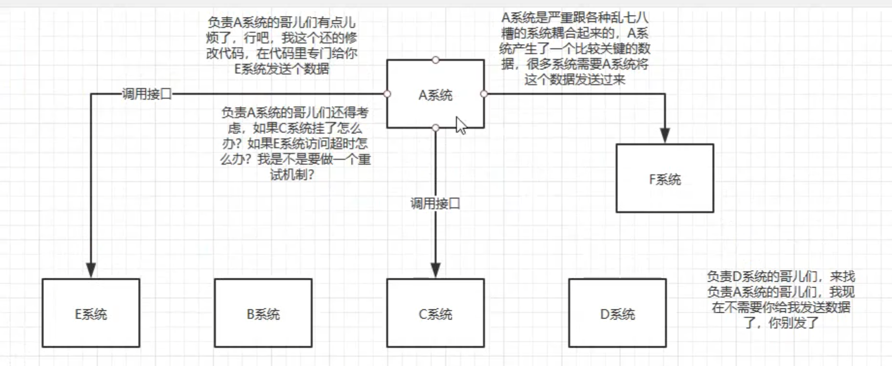
	>
	> 		A 系统有一个重要数据，需要发给其它系统，但是一会儿又来一个新的系统要求 A 系统把数据给它也发一份，这时候 A 系统就不得不修改代码，调用 E 系统的接口。又可能过一会儿 D 系统又不需要 A 系统的数据了，A 系统又要删除对 D 系统接口的调用。这就是因为 ==A 系统和其它乱七八糟系统严重耦合，导致代码写死了，难以维护和扩展==。
	>
	> 	- ==使用消息队列解耦==：
	>
	> 		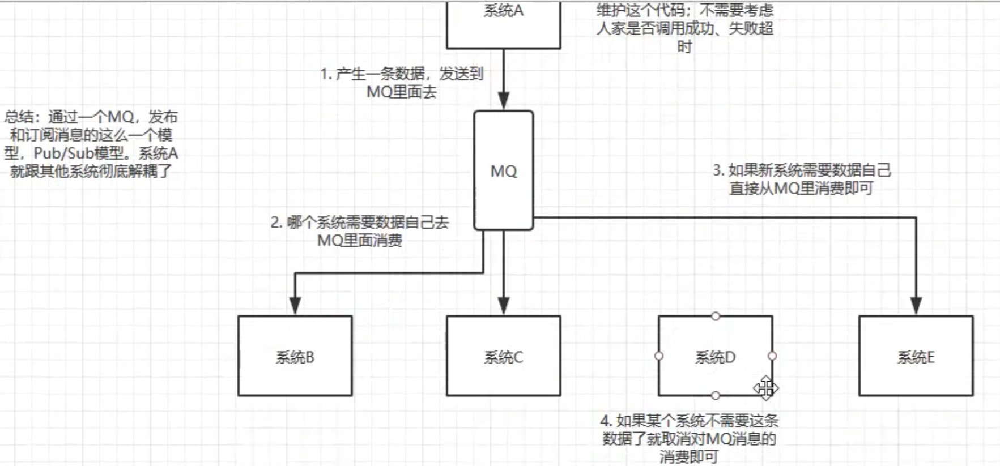
	>
	> 		A 系统只需要把这个重要数据放到消息队列中，这样其它系统需要这个数据，就不要找 A 系统了，而是自己去消息队列里找。这样一来 ==A 系统只用调用消息队列的 api，而无需关注其它系统获取重要数据的业务逻辑，实现了 A 系统和其它乱七八糟的系统的解耦==。
	>
	> 		实际上，这里的消息队列可以理解为一个==发布/订阅模式==，其它系统订阅拥有重要数据的消息队列，从中获取数据即可。
	>
	> - ==异步==：
	>
	> 	- ==不用消息队列导致同步情况下的高延迟请求==：
	>
	> 		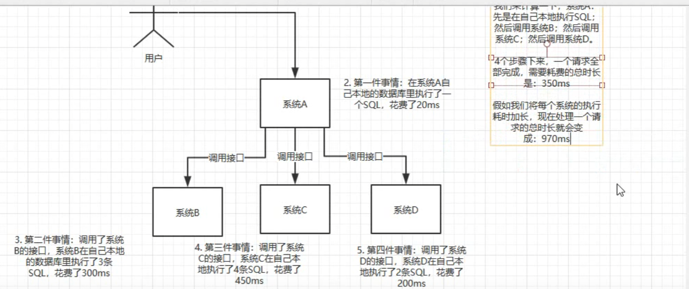
	>
	> 		比如有一个用户，发起了一个请求，==这个请求需要调用其它系统的接口。假如要调用的其它系统比较多，而且每个接口调用的时间比较长==，这样最后==整个请求的完成时间可能会很长==，比如超过了1秒，这就==严重影响了用户的体验==。
	>
	> 	- ==异步化之后大幅提升调用高延迟接口的用户体验==：
	>
	> 		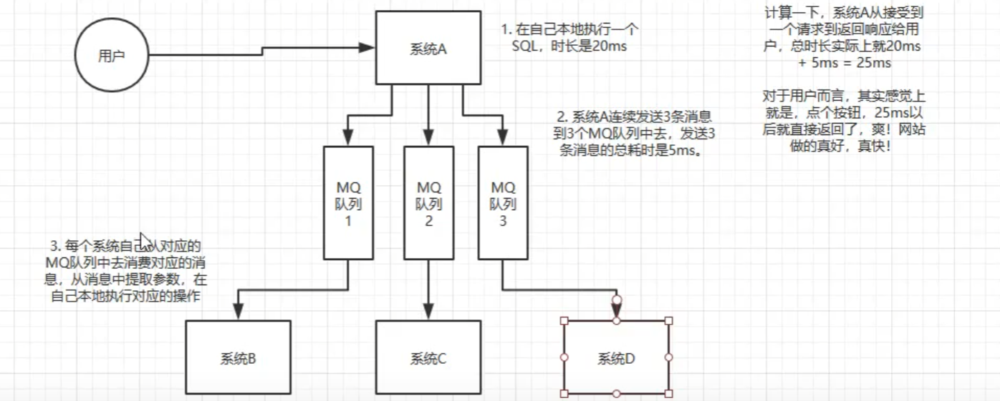
	>
	> 		系统 A 只需要把其它乱七八糟的系统需要的数据==丢到消息队列里，然后就不管了，直接返回==，这样响应用户的速度很快，用户的体验很好。而那些乱七八糟的系统发现消息队列里有消息之后取出来，调用指定的接口完成这些业务，这样异步后==用户几乎感觉不到调用高延迟接口的延迟==。
	>
	> - ==消峰==：
	>
	> 	- ==不用消息队列高峰期大量请求涌入 Mysql 挂了==
	>
	> 	- ==使用消息队列进行消峰==：
	>
	> 		比如高峰期一秒5000个请求，但是 Mysql 每秒能处理的请求极限为2000个，那么这个时候，就可以在请求送到 Mysql 之前==先全部放进消息队列，然后规定每秒最多从消息队列中读取2000条请求，这样就可以保证 Mysql 肯定不会挂掉==。然后等到低峰期再把积压的消息处理了。

2. ==消息队列的优点和缺点==？

  > - 面试官心理：防止你不知道某个技术可能带来的风险就乱用，给团队挖坑。
  > - ==系统可用性降低==：
  > 	- 本来直接调用接口没问题，结果多加了一个 MQ 进来，导致下面的问题：
  > 		1. ==MQ 挂掉==：A 系统无法把重要的数据放到消息队列，同时下面那些==乱七八糟的系统全部都没办法从 MQ 中获取数据，服务全崩溃==了。
  > 		2. ==消费者挂了==：A 系统放到 MQ 中的消息==迟迟没人消费，导致 MQ 满了，占用大量磁盘空间==。
  > 		3. ==A 系统和 MQ 的联调出了问题==：比如 A 系统只想放一条消息，结果最终放的时候放了两条，那么下面的系统就消费两条数据，处理了两次业务。
  > - ==系统复杂性上升==：
  > 	- 重复消费，消息丢失，顺序性问题。
  > - ==一致性问题==：
  > 	- 比如本来是所有系统都执行成功，才给用户返回。但==结果其中一个消费者执行失败==了，但是==此时 A 系统早就已经给用户返回执行成功了，这就导致用户收到的信息和后台实际情况不一致==。

---


### 3.引入消息队列之后该如何保证其高可用性

1. ==RabbitMQ 的高可用（非分布式）==：

	> - ==镜像集群模式实现高可用性==：
	>
	> 	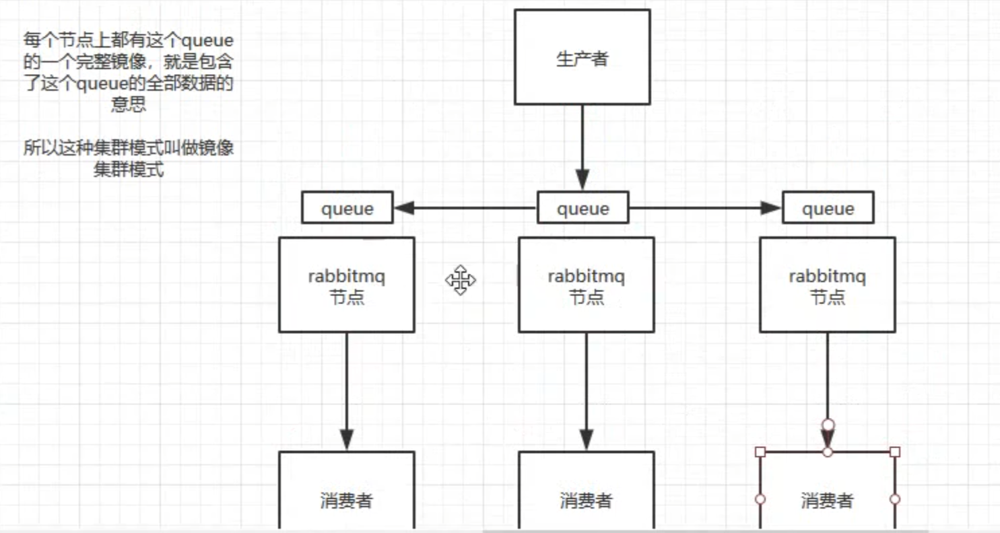
	>
	> - 任何一个节点挂了，==其它节点上还有这个 queue 的完整数据==，这样保证的可用性。
	>
	> - ==缺点：任然不是分布式的系统==。

2. ==Kafka 的高可用性（分布式）==：

	> - 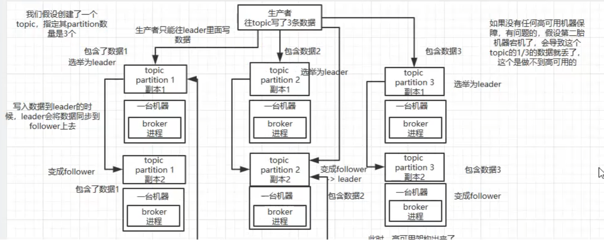
	> - 把==一个 topic 里的数据分散到多个 partition 中==，防止出现一台机器存储不了大量的数据。
	> - 但是如果只是分散到多个 partition 中，并不能实现高可用，因为==一旦某一个 partition 挂了，那么我们就会损失一部分 MQ 的数据==，这是我们无法接收的。
	> - 那么我们可以==对每一个 partition 分别实现主从集群==，即生产者写数据只往每一个 partition 的主节点中写数据，然后再同步到从节点。如果==主节点挂了，就会选举新的从节点==。

---


### 4.我为什么在消息队列里消费到了重复的数据

1. Kafka 给==每一个消息一个 offer，表示序号==。消费者在==完成消费后，将自己所期待的下一个消息的编号发给 zookeeper，由 zookeeper 告诉 Kafka 消费者期待的下一条消息的序号==。
2. 当然，如果出现消费者==准备提交下一个编号，但是重启了，提交失败==的情况，那么如果这时 ==Kafka 恰好出现了重传，那么还是会把重复的消息传给消费者==。
3. 因此一种可行的方式是在==消费者消费一条数据后，在内存或 Redis 中采用 set 记录自己消费过的消息的序号==，在消费一条新的消息时==先去 set 中查找判断是否重复消费==。
4. 另一种可行方法是==利用数据库的唯一键来限制不能插入多次==。比如==消费者出现意外任然像数据库插入两条数据，这时由于有唯一键约束，就不会插入成功==。

---


