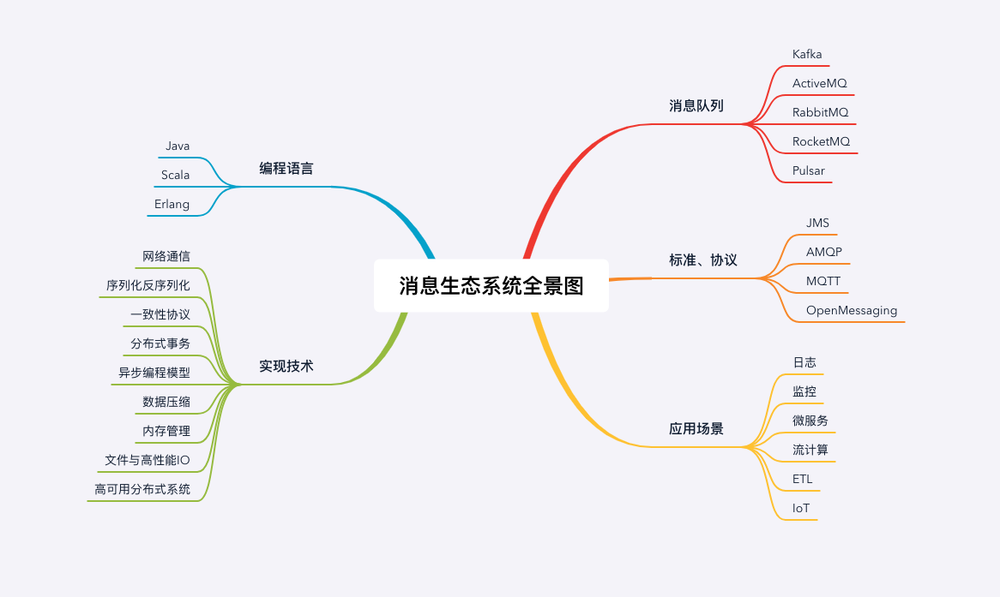
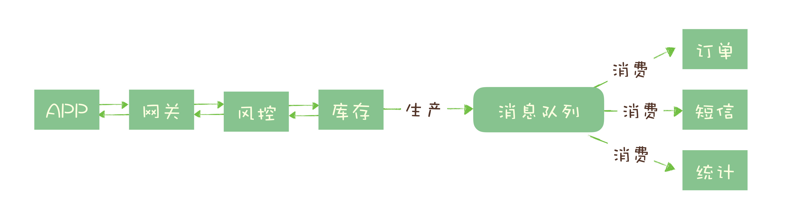

## 消息队列高手课

### 0.怎样更好地学习这门课？

1. 
2. 市面上有的消息队列产品很多，像 Kafka、ActiveMQ、RocketMQ、Pulsar、RabbitMQ 等等，其中比较==主流==的==开源==消息队列为 ==Kafka、RocketMQ 和 RabbitMQ==。
3. 与消息队列相关的协议和标准有 ==JMS、AMQP、MQTT 和 OpenMessaging==。
3. 消息队列涉及到的语言有 ==Java、Scala 和 Erlang==。

---

### 1.为什么需要消息队列？🌟🌟🌟🌟🌟

1. ==异步处理==：

	> - 典型场景：==秒杀项目==
	>
	> - 秒杀项目的==步骤==：
	>
	> 	1. 风险控制
	> 	2. 库存锁定
	> 	3. 生成订单
	> 	4. 短信通知
	> 	5. 更新统计数据
	>
	> 	
	>
	> - 只要用户的秒杀请求==通过风险控制==，并在服务端完成==库存锁定==，就可以给用户==返回秒杀结果==了。
	>
	> - 然后把请求的数据放入消息队列中，由==消息队列异步地进行后续的操作==。
	>
	> - 异步处理的==好处==是：
	>
	> 	- 可以==更快地返回结果==；
	> 	- 减少等待，==自然实现了步骤之间的并发==，提升系统总体的性能。
	
2. ==流量控制==：

      > - 典型场景：==秒杀项目==
      > - 问题：如何避免过多的请求压垮我们的秒杀系统？
      > - 方法：==使用消息队列隔离网关和后端服务，以达到“消峰”的目的==。
      > - 
      > - ==缺点==：
      > 	- 增加了系统调用链环节，导致==总体的响应时延变长==。
      > 	- 上下游系统都要将同步调用改为异步消息，增加了系统的复杂度。
      > - ==改进思路==：在消息队列前加上一个“==令牌桶==”：
      > 	- 令牌发生器按照==预估==的处理能力，==匀速生产令牌并放入令牌队列==（如果队列满了则丢弃令牌）
      > 	- 网关在收到请求时==去令牌队列消费一个令牌==，获取到令牌则继续调用后端秒杀服务，如果==获取不到令牌则直接返回秒杀失败==。

3. ==服务解耦==：

      > - 系统间高度耦合的下场：下游系统改变时，上游系统也要跟着去改变：
      > 	- 订单是电商系统中比较核心的数据，当一个新订单（==订单系统==）创建时：
      > 		1. ==支付系统==需要发起支付流程；
      > 		2. ==风控系统==需要审核订单的合法性；
      > 		3. ==客服系统==需要给用户发短信告知用户；
      > 		4. ==经营分析系统==需要更新统计数据；
      > 		5. ……
      > - 引入消息队列后，订单服务在订单变化时发送一条消息到==消息队列的一个主题 Order 中==，所有下游系统都==订阅主题 Order==，这样每个下游系统都可以获得一份实时完整的订单数据。
      > - ==无论增加、减少下游系统或是下游系统需求如何变化，订单服务都无需做任何更改==，实现了订单服务与下游服务的解耦。

4. ==消息队列的其它作用==：

      > - 作为发布 / 订阅系统实现一个微服务级系统间的观察者模式；
      > - 连接流计算任务和数据；
      > - 用于将消息广播给大量接收者。

5. ==消息队列的缺点==：

      > - 引入消息队列带来的==延迟（从 MQ 存入、取出数据）==问题；
      > - 增加了系统的==复杂度（额外调研 MQ 的 api）==；
      > - 可能产生==数据不一致==的问题。

---

### 2.该如何选择消息队列？🌟🌟🌟🌟🌟

1. ==选择消息队列产品的基本标准==：

	> - ==必须是开源的产品==，这个非常重要。可以通过==修改源代码==来迅速修复或规避某个 Bug。
	> - 近年来比较流行并且有一定==社区活跃度==的产品。网上搜索到类似的问题。
	> - 流行的产品==与周边生态系统==会有一个比较好的==集成和兼容==。比如，Kafka 和 Flink 就有比较好的兼容性，Flink 内置了 Kafka 的 Data Source；如果你用一个比较小众的消息队列产品，在进行流计算的时候，你就不得不自己开发一个 Flink 的 Data Source。
	> - 最后可以保证一下几点：
	> 	- 消息的==可靠传递==：确保不丢消息；
	> 	- Cluster：==支持集群==，确保不会因为某个节点宕机导致服务不可用，当然也不能丢消息；
	> 	- ==性能==：具备足够好的性能，能满足绝大多数场景的性能要求。

2. ==可供选择的消息队列产品==：

	> - ==RabbitMQ==：
	>
	> 	- Erlang 语言编写，少数几个支持 ==AMQP== 协议的消息队列之一。
	> 	- RabbitMQ 是一个相当==轻量级==的消息队列，==非常容易部署和使用==。
	> 	- 它==在生产者（Producer）和队列（Queue）之间增加了一个 Exchange 模块==，你可以理解为交换机。Exchange 根据配置的路由规则==将生产者发出的消息分发到不同的队列中==。路由的规则也非常灵活，甚至你可以自己来实现路由规则。
	> 	- RabbitMQ 的==客户端支持的编程语言大概是所有消息队列中最多的==。
	> 	- ==缺点==：
	> 		1. RabbitMQ ==对消息堆积的支持并不好==，在它的设计理念里面，消息队列是一个管道，大量的消息积压是一种不正常的情况，应当尽量去避免。当==大量消息积压的时候，会导致 RabbitMQ 的性能急剧下降==。
	> 		2. RabbitMQ 的==性能是我们介绍的这几个消息队列中最差的==，根据官方给出的测试数据综合我们日常使用的经验，依据硬件配置的不同，它大概==每秒钟可以处理几万到十几万条消息==。
	> 		3. RabbitMQ 使用的编程语言 ==Erlang，这个编程语言不仅是非常小众的语言，更麻烦的是，这个语言的学习曲线非常陡峭（基础语法和 Java / C++ 等差别很大）==。
	>
	> - ==RocketMQ==：
	>
	> 	- RocketMQ 有==非常活跃的中文社区==。
	> 	- RocketMQ 使用 ==Java 语言开发==，它的贡献者大多数都是中国人，源代码相对也比较容易读懂，你很容易对 RocketMQ 进行==扩展或者二次开发==。
	> 	- RocketMQ 对在线业务的响应时延做了很多的优化，大多数情况下可以做到毫秒级的响应，==如果你的应用场景很在意响应时延，那应该选择使用 RocketMQ==。
	> 	- RocketMQ 的==性能比 RabbitMQ 要高一个数量级==，每秒钟大概能处理==几十万条消息==。
	>
	> - ==Kafka==：
	>
	> 	- ==Kafka 与周边生态系统的兼容性是最好的没有之一，尤其在大数据和流计算领域，几乎所有的相关开源软件系统都会优先支持 Kafka==。
	>
	> 	- Kafka 使用 ==Scala 和 Java== 语言开发，设计上大量使用了==批量和异步==的思想。
	>
	> 	- Kafka 的==性能==，尤其是异步收发的性能，是三者中==最好==的，但与 RocketMQ 并没有量级上的差异，大约每秒钟可以处理几十万条消息。
	>
	> 	- ==缺点==：但是 Kafka 这种异步批量的设计带来的问题是，它的同步收发消息的==响应时延比较高==。
	>
	> 		> 因为当客户端发送一条消息的时候，Kafka 并不会立即发送出去，而是要等一会儿攒一批再发送，在它的 Broker 中，很多地方都会使用这种“==先攒一波再一起处理==”的设计。==当你的业务场景中，每秒钟消息数量没有那么多的时候，Kafka 的时延反而会比较高==。所以，==Kafka 不太适合在线业务场景==。

3. ==技术选型建议（重要）==：

	> - 如果说，消息队列并不是你将要构建系统的主角之一，你==对消息队列功能和性能都没有很高的要求==，只需要一个==开箱即用易于维护==的产品，我建议你使用 ==RabbitMQ==。
	> - 如果你的系统使用消息队列主要场景是处理==在线业务（响应速度必须快）==，比如在交易系统中用消息队列传递订单，那 ==RocketMQ== 的==低延迟==和金融级的==稳定性==是你需要的。
	> - 如果你需要处理==海量的消息==，像收集日志、监控信息或是前端的埋点这类数据，或是你的应用场景大量使用了==大数据、流计算相关的开源产品==，那 ==Kafka== 是最适合你的消息队列。

---

### 3.消息模型：主题和队列有什么区别？🌟🌟🌟🌟🌟

1. 每种消息队列都有自己的一套消息模型，像队列（**Queue**）、主题（**Topic**）或是分区（**Partition**）这些名词概念，在每个消息队列模型中都会涉及一些，含义还不太一样。

2. **主题和队列**：

	> - **发布 – 订阅模型（Publish-Subscribe Pattern）**：
	>
	> 	
	>
	> - 发布 – 订阅模式和队列模式最大的区别其实就是，**一份消息数据能不能被消费多次**的问题。

3. **RabbitMQ 的消息模型**：

	> - 在 RabbitMQ 中，**Exchange 位于生产者和队列之间**，生产者并不关心将消息发送给哪个队列，而是**将消息发送给 Exchange**，由 Exchange 上配置的策略来**决定将消息投递到哪些队列**中。
	> - 

4. **RocketMQ 的消息模型**：

	> - 
