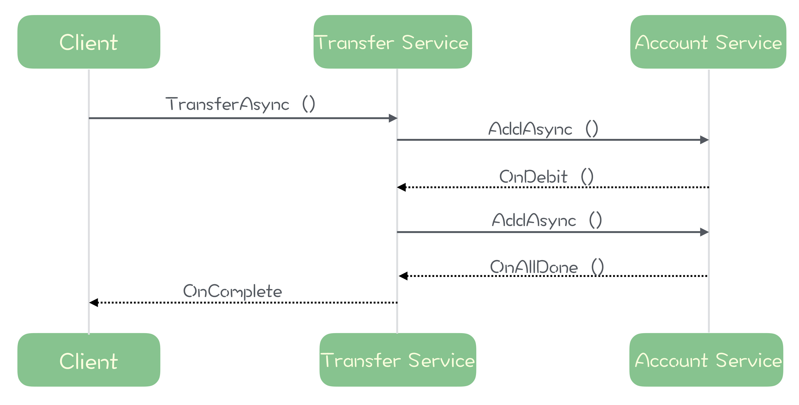

## 消息队列高手课

### 0.怎样更好地学习这门课？

1. > 
2. 市面上有的消息队列产品很多，像 Kafka、ActiveMQ、RocketMQ、Pulsar、RabbitMQ 等等，其中比较==主流==的==开源==消息队列为 ==Kafka、RocketMQ 和 RabbitMQ==。
3. 与消息队列相关的协议和标准有 ==JMS、AMQP、MQTT 和 OpenMessaging==。
3. 消息队列涉及到的语言有 ==Java、Scala 和 Erlang==。

---


### 1.为什么需要消息队列？🌟🌟🌟🌟🌟

> ==为什么需要消息队列（消息队列的好处==）

1. ==异步处理==：

	> - 典型场景：==秒杀项目==
	>
	> - 秒杀项目的==步骤==：
	>
	> 	1. 风险控制
	> 	2. 库存锁定
	> 	3. 生成订单
	> 	4. 短信通知
	> 	5. 更新统计数据
	>
	> 	
	>
	> - 只要用户的秒杀请求==通过风险控制==，并在服务端完成==库存锁定==，就可以给用户==返回秒杀结果==了。
	>
	> - 然后把请求的数据放入消息队列中，由==消息队列异步地进行后续的操作==。
	>
	> - 异步处理的==好处==是：
	>
	> 	- 可以==更快地返回结果==；
	> 	- 减少等待，==自然实现了步骤之间的并发==，提升系统总体的性能。
	
2. ==流量控制==：

      > - 典型场景：==秒杀项目==
      > - 问题：如何避免过多的请求压垮我们的秒杀系统？
      > - 方法：==使用消息队列隔离网关和后端服务，以达到“消峰”的目的==。
      > - 
      > - ==缺点==：
      > 	- 增加了系统调用链环节，导致==总体的响应时延变长==。
      > 	- 上下游系统都要将同步调用改为异步消息，增加了系统的复杂度。
      > - ==改进思路==：在消息队列前加上一个“==令牌桶==”：
      > 	- 令牌发生器按照==预估==的处理能力，==匀速生产令牌并放入令牌队列==（如果队列满了则丢弃令牌）
      > 	- 网关在收到请求时==去令牌队列消费一个令牌==，获取到令牌则继续调用后端秒杀服务，如果==获取不到令牌则直接返回秒杀失败==。

3. ==服务解耦==：

      > - 系统间高度耦合的下场：下游系统改变时，上游系统也要跟着去改变：
      > 	- 订单是电商系统中比较核心的数据，当一个新订单（==订单系统==）创建时：
      > 		1. ==支付系统==需要发起支付流程；
      > 		2. ==风控系统==需要审核订单的合法性；
      > 		3. ==客服系统==需要给用户发短信告知用户；
      > 		4. ==经营分析系统==需要更新统计数据；
      > 		5. ……
      > - 引入消息队列后，订单服务在订单变化时发送一条消息到==消息队列的一个主题 Order 中==，所有下游系统都==订阅主题 Order==，这样每个下游系统都可以获得一份实时完整的订单数据。
      > - ==无论增加、减少下游系统或是下游系统需求如何变化，订单服务都无需做任何更改==，实现了订单服务与下游服务的解耦。

4. ==消息队列的其它作用==：

      > - 作为发布 / 订阅系统实现一个微服务级系统间的观察者模式；
      > - 连接流计算任务和数据；
      > - 用于将消息广播给大量接收者。

5. ==消息队列的缺点==：

      > - 引入消息队列带来的==延迟（从 MQ 存入、取出数据）==问题；
      > - 增加了系统的==复杂度（额外调研 MQ 的 api）==；
      > - 可能产生==数据不一致==的问题。

---


### 2.该如何选择消息队列？🌟🌟🌟🌟🌟

> ==如何选择消息队列？（消息队列的技术选型==）

1. ==选择消息队列产品的基本标准==：

	> - ==必须是开源的产品==，这个非常重要。可以通过==修改源代码==来迅速修复或规避某个 Bug。
	> - 近年来比较流行并且有一定==社区活跃度==的产品。网上搜索到类似的问题。
	> - 流行的产品==与周边生态系统==会有一个比较好的==集成和兼容==。比如，Kafka 和 Flink 就有比较好的兼容性，Flink 内置了 Kafka 的 Data Source；如果你用一个比较小众的消息队列产品，在进行流计算的时候，你就不得不自己开发一个 Flink 的 Data Source。
	> - 最后可以保证一下几点：
	> 	- 消息的==可靠传递==：确保不丢消息；
	> 	- Cluster：==支持集群==，确保不会因为某个节点宕机导致服务不可用，当然也不能丢消息；
	> 	- ==性能==：具备足够好的性能，能满足绝大多数场景的性能要求。

2. ==可供选择的消息队列产品==：

	> - ==RabbitMQ==：
	>
	> 	- Erlang 语言编写，少数几个支持 ==AMQP== 协议的消息队列之一。
	> 	- RabbitMQ 是一个相当==轻量级==的消息队列，==非常容易部署和使用==。
	> 	- 它==在生产者（Producer）和队列（Queue）之间增加了一个 Exchange 模块==，你可以理解为交换机。Exchange 根据配置的路由规则==将生产者发出的消息分发到不同的队列中==。路由的规则也非常灵活，甚至你可以自己来实现路由规则。
	> 	- RabbitMQ 的==客户端支持的编程语言大概是所有消息队列中最多的==。
	> 	- ==缺点==：
	> 		1. RabbitMQ ==对消息堆积的支持并不好==，在它的设计理念里面，消息队列是一个管道，大量的消息积压是一种不正常的情况，应当尽量去避免。当==大量消息积压的时候，会导致 RabbitMQ 的性能急剧下降==。
	> 		2. RabbitMQ 的==性能是我们介绍的这几个消息队列中最差的==，根据官方给出的测试数据综合我们日常使用的经验，依据硬件配置的不同，它大概==每秒钟可以处理几万到十几万条消息==。
	> 		3. RabbitMQ 使用的编程语言 ==Erlang，这个编程语言不仅是非常小众的语言，更麻烦的是，这个语言的学习曲线非常陡峭（基础语法和 Java / C++ 等差别很大）==。
	>
	> - ==RocketMQ==：
	>
	> 	- RocketMQ 有==非常活跃的中文社区==。
	> 	- RocketMQ 使用 ==Java 语言开发==，它的贡献者大多数都是中国人，源代码相对也比较容易读懂，你很容易对 RocketMQ 进行==扩展或者二次开发==。
	> 	- RocketMQ 对在线业务的响应时延做了很多的优化，大多数情况下可以做到毫秒级的响应，==如果你的应用场景很在意响应时延，那应该选择使用 RocketMQ==。
	> 	- RocketMQ 的==性能比 RabbitMQ 要高一个数量级==，每秒钟大概能处理==几十万条消息==。
	>
	> - ==Kafka==：
	>
	> 	- ==Kafka 与周边生态系统的兼容性是最好的没有之一，尤其在大数据和流计算领域，几乎所有的相关开源软件系统都会优先支持 Kafka==。
	>
	> 	- Kafka 使用 ==Scala 和 Java== 语言开发，设计上大量使用了==批量和异步==的思想。
	>
	> 	- Kafka 的==性能==，尤其是异步收发的性能，是三者中==最好==的，但与 RocketMQ 并没有量级上的差异，大约每秒钟可以处理几十万条消息。
	>
	> 	- ==缺点==：但是 Kafka 这种异步批量的设计带来的问题是，它的同步收发消息的==响应时延比较高==。
	>
	> 		> 因为当客户端发送一条消息的时候，Kafka 并不会立即发送出去，而是要等一会儿攒一批再发送，在它的 Broker 中，很多地方都会使用这种“==先攒一波再一起处理==”的设计。==当你的业务场景中，每秒钟消息数量没有那么多的时候，Kafka 的时延反而会比较高==。所以，==Kafka 不太适合在线业务场景==。

3. ==技术选型建议（重要）==：

	> - 如果说，消息队列并不是你将要构建系统的主角之一，你==对消息队列功能和性能都没有很高的要求==，只需要一个==开箱即用易于维护==的产品，我建议你使用 ==RabbitMQ==。
	> - 如果你的系统使用消息队列主要场景是处理==在线业务（响应速度必须快）==，比如在交易系统中用消息队列传递订单，那 ==RocketMQ== 的==低延迟==和金融级的==稳定性==是你需要的。
	> - 如果你需要处理==海量的消息==，像收集日志、监控信息或是前端的埋点这类数据，或是你的应用场景大量使用了==大数据、流计算相关的开源产品==，那 ==Kafka== 是最适合你的消息队列。

---


### 3.消息模型：主题和队列有什么区别？🌟🌟🌟🌟🌟

> ==主流的消息队列有哪些，它们的架构是什么样的==？

1. 每种消息队列都有自己的一套消息模型，像队列（==Queue==）、主题（==Topic==）或是分区（==Partition==）这些名词概念，在每个消息队列模型中都会涉及一些，含义还不太一样。

2. ==主题和队列==：

	> - ==发布 – 订阅模型（Publish-Subscribe Pattern）==：
	>
	> 	
	>
	> - 发布 – 订阅模式和队列模式最大的区别其实就是，==一份消息数据能不能被消费多次==的问题。

3. ==RabbitMQ 的消息模型==：

      > - RabbitMQ 采用 “队列” 模型。
      > - 在 RabbitMQ 中，==Exchange 位于生产者和队列之间==，生产者并不关心将消息发送给哪个队列，而是==将消息发送给 Exchange==，由 Exchange 上配置的策略来==决定将消息投递到哪些队列==中。
      > - 

4. ==RocketMQ 的消息模型==：

	> - RocketMQ 使用的消息模型是==标准的发布 – 订阅模型==，在 RocketMQ 的术语表中，生产者、消费者和主题与我在上面讲的发布 – 订阅模型中的概念是完全一样的。
	> - “==请求 – 确认==”机制，防止消息在传输过程中丢失。
	> 	- 如果==生产者==没有收到服务端的确认或者收到失败的响应，则会==重新发送消息==；
	> 	- 在消费端，消费者在收到消息并==完成自己的消费业务逻辑==（比如，将数据保存到数据库中）后，也会==给服务端==发送消费成功的确认，服务端没收到就会给消费者重新发送这条消息。
	> 	- “请求 – 确认”机制的==缺点==：为了确保消息的有序性，==在某一条消息被成功消费之前，下一条消息是不能被消费的==，否则就会出现消息空洞，违背了有序性这个原则。
	> - 解决“请求 – 确认”机制消息空洞的方法：==每个主题包含多个队列，通过多个队列来实现多实例并行生产和消费。==（需要注意的是，RocketMQ ==只在队列上保证消息的有序性==，==主题层面是无法保证==消息的严格顺序的）
	> - 订阅者的概念是通过==消费组==（==Consumer Group==）来体现的，一条消息被 Consumer Group1 消费过，也会再给 Consumer Group2 消费。
	> - 同一个组内的消费者是竞争消费的关系，如果一条消息被消费者 Consumer1 消费了，那==同组的其他消费者就不会再收到这条消息==。
	> - RocketMQ 为每个消费组在每个队列上维护一个==消费位置==（==Consumer Offset==），这个位置之前的消息都被消费过，之后的消息都没有被消费过，每成功消费一条消息，消费位置就加一。
	> - 
	
5. ==Kafka 的消息模型==：

      > - 我们再来看看另一种常见的消息队列 Kafka，==Kafka 的消息模型和 RocketMQ 是完全一样的==，我刚刚讲的所有 RocketMQ 中对应的概念，和==生产者 – 消费者模型，确认 – 重传机制，以消费组为单位，同一个 topic 下多个 Queue / Patition，消费位置 Offset==，都完全适用于 Kafka。
      > - 唯一的区别是，在 Kafka 中，==队列这个概念的名称不一样==，Kafka 中==队列的名称是分区==（==Partition==），含义和功能是没有任何区别的。
      > - Kafka 和 RocketMQ 的业务模型基本是一样的，但==底层实现是完全不同==的。

---


### 4.如何利用事务消息实现分布式事务？

1. ==消息队列中的“事务”，主要解决的是消息生产者和消息消费者的数据一致性问题==。

2. ==什么是分布式事务==？

	> - 对于==分布式系统==来说，==严格==的实现 ACID 这四个特性几乎是==不可能==的，或者说实现的代价太大，大到我们无法接受。
	> - 所以，目前大家所说的分布式事务，更多情况下，是在分布式系统中事务的==不完整实现==。在不同的应用场景中，有不同的实现，目的都是通过一些妥协来解决实际问题。
	> - 比较常见的分布式事务实现有 ==2PC==（Two-phase Commit，也叫二阶段提交）、==TCC==（Try-Confirm-Cancel) 和==事务消息==。

3. ==消息队列是如何实现分布式事务的==？

      > - 
      >
      > - 如果在==第四步提交事务消息时失败了怎么办==？
      >
      > 	Kafka 的解决方案比较简单粗暴，直接抛出异常，让用户自行处理。我们可以在业务代码中反复重试提交，直到提交成功，或者删除之前创建的订单进行补偿。
      >
      > - RocketMQ 则给出了另外一种解决方案：

4. ==RocketMQ 中的分布式事务实现==

	> - 

---


### 5.如何确保消息不会丢失🌟🌟🌟🌟🌟

> ==消息队列如何实现可靠性==（==消息不丢==）？

1. ==检测消息丢失的方法（标序号）==

	> - ==我们可以利用消息队列的有序性来验证是否有消息丢失==。如连续发一串连续编号的消息。
	> - 需要==注意的问题==：
	> 	- ==Patition 多例问题==：像 ==Kafka 和 RocketMQ== 这样的消息队列，它是==不保证在 Topic 上的严格顺序==的，只能保证==分区（Patition, Queue）上的消息是有序==的，所以我们在发消息的时候必须要指定分区。
	> 	- ==Producer 多例问题==：如果你的系统中 Producer 是多实例的，由于并不好协调多个 Producer 之间的发送顺序，所以也需要==每个 Producer 分别生成各自的消息序号==，并且需要附加上 Producer 的标识，在 ==Consumer 端按照每个 Producer 分别来检测序号的连续性==。
	> 	- ==Consumer 实例的数量最好和分区数量一致==，做到 Consumer 和分区==一一对应==，这样会比较方便地在 Consumer 内检测消息序号的连续性。

2. ==确保消息可靠的方法==

	> - 消息从生产到消费的==过程==：
	>
	> 	
	>
	> - ==生产阶段==：主要是注意 broker 在收到消息后需要给 Producer 响应，响应分为同步和异步响应：
	>
	> 	- ==同步响应==：通过在 broker 抛出异常，由 Producer 端==捕获异常==实现：
	>
	> 		```java
	> 		try {
	> 		    RecordMetadata metadata = producer.send(record).get();
	> 		    System.out.println("消息发送成功。");
	> 		} catch (Throwable e) {
	> 		    System.out.println("消息发送失败！");
	> 		    System.out.println(e);
	> 		}
	> 		```
	>
	> 	- ==异步响应==：由 broker 调用 Produer 指定的回调方法，由 Producer ==检验回调方法参数==实现：
	>
	> 		```java
	> 		producer.send(record, (metadata, exception) -> {
	> 		    if (metadata != null) {
	> 		        System.out.println("消息发送成功。");
	> 		    } else {
	> 		        System.out.println("消息发送失败！");
	> 		        System.out.println(exception);
	> 		    }
	> 		});
	> 		```
	>
	> - ==存储阶段==：
	>
	> 	- 在存储阶段正常情况下，==只要 Broker 在正常运行，就不会出现丢失消息的问题==，但是如果 Broker 出现了故障，比如==进程死掉了或者服务器宕机了，还是可能会丢失消息==的。
	> 	- ==如果对消息的可靠性要求非常高，可以通过配置 Broker 参数来避免因为宕机丢消息==。
	> 	- broker 消息==持久化==，再返回 ACK。
	> 	- broker ==集群==，消息同时发给多个 broker。
	>
	> - ==消费阶段==：
	>
	> 	- 只需记住一点：==Consumer 不要在收到消息之后马上返回 ACK==，而是必须==完成自己的业务逻辑==之后再 ACK（配置某一个参数即可）。
	>
	> - 注意：==无论是 Broker 还是 Consumer 都是有可能收到重复消息的==，因此如何避免收到重复的消息也是需要考虑的（序号）。

---


### 6.如何处理消费过程中的重复消息？🌟🌟🌟🌟🌟

> 回顾消息出现故障的几个原因：==丢失、出错、乱序、重复==
>
> ==怎么解决消息重复的问题==？

1. ==消息重复的情况必然存在==

	> - ==At most once==: 至多一次。消息在传递时，最多会被送达一次。换一个说法就是，没什么消息可靠性保证，允许丢消息。一般都是一些对消息可靠性要求不太高的监控场景使用，比如每分钟上报一次机房温度数据，可以接受数据少量丢失。
	> - ==At least once==: 至少一次。消息在传递时，至少会被送达一次。也就是说，不允许丢消息，但是允许有少量重复消息出现。
	> - ==Exactly once==：恰好一次。消息在传递时，只会被送达一次，不允许丢失也不允许重复，这个是最高的等级。
	> - 我们现在常用的==绝大部分消息队列提供的服务质量都是 At least once==，包括 RocketMQ、RabbitMQ 和 Kafka 都是这样。也就是说，消息队列很难保证消息不重复。

2. ==利用数据库的唯一约束实现幂等==

      > - 幂等操作的特点是，==无论执行顺序，任意多次执行所产生的影响均与一次执行的影响相同==。
      > - 这里的唯一约束包括了==联合索引==的唯一约束。
      > - 前置条件 + 操作，成功后修改前置条件，避免由于网络延迟等原因导致 broker 重复发送相同的消息时，前置条件未修改而执行成功。

3. ==为更新的数据设置前置条件==

	> - 给数据变更设置一个前置条件，如果满足条件就更新数据，否则拒绝更新数据，在==更新数据的时候，同时变更前置条件中需要判断的数据==。
	> - 给你的数据增加一个==版本号属性==，每次更数据前，比较==期待的版本号和消息中的版本号==。

4. ==记录并检查操作==

	> - 在执行数据更新操作之前，先检查一下是否执行过这个更新操作。
	> - 缺点：==检测、修改和写回操作必须保证原子性==。

----


### 7.消息积压了该如何处理？🌟🌟🌟🌟🌟

> ==如果消息队列里积压了很多消息，怎么快速把它们消费掉==？

1. ==优化性能避免消息堆积==

	> - ==消息队列处理消息的速度是远远快于业务系统的==，消息队列每秒处理消息的数量可以达到几万甚至几十万条，而业务系统能够每秒上千条就很厉害了。
	>
	> 	因此避免消息堆积的==关键==，在于==优化生产者和消费者对于消息的处理速度==。
	>
	> - ==生产者==性能优化：
	>
	> 	- ==一次发送大量消息==，减少网络 IO 的开销，缺点是会增加响应时延，毕竟消息队列要接收的消息变多了。不在乎时延的系统，如离线计算的系统就可以采取批量发送的方式。
	> 	- ==Producer 并发发送消息==。比如像支持多线程高并发的微服务框架，就更适合增加并发。
	>
	> - ==消费者==性能优化
	>
	> 	- 要是==消费速度一直比生产速度慢==，消息队列的==存储被填满==无法提供服务，要么==消息丢失==，这对于整个系统来说都是严重故障。
	> 	- ==在扩容 Consumer 的实例数量（不是消费组）的同时，必须同步扩容 Topic 中的 Patition（也叫 Queue）数量，确保 Consumer 的实例数和 Patition 数量是相等的。==因为对于消费者来说，在==每个 Patition 上实际上只能支持单线程消费（消费组中只有一个消费者能消费数据）==。
	
2. ==消息积压了该如何处理==

      > - ==增加消费组数量和 Patition 的数量==。
      > - 服务降级，==直接扔掉一些不重要的服务的消息==。
      > - ==检测是不是消费者消费时报错==了，导致迟迟无法完成消息的消费，==不能返回 ACK==，导致某一个 ==Patition 一直重发重发，阻塞==在这里了。

---


### 8.消息模型详解、消息有序🌟🌟🌟🌟🌟

> ==什么是消费组、消费者、主题、分区/队列、消费位置==？
>
> ==消息是在 Topic 下有序还是在 Patition 下有序？怎么让某一部分消息有序==？

1. ==每个消费组就是一份订阅，它要消费主题 MyTopic 下，所有队列的全部消息==。注意，==队列里的消息并不是消费掉就没有了==，消息并没有删除，==消费完这条消息还是在队列里面==。

2. ==消费组之间是互不影响的==。一条消息可以被 GroupA 消费，同时也能被 GroupB 消费。G0 消费过的消息，G1 还可以消费。==即使 G0 积压了很多消息，对 G1 来说也没有任何影响==。

3. ==队列占用只是针对消费组内部来说的==。比如，我们可以让消费者 C0 消费 Q0，Q1 和 Q2，C1 消费 Q3 和 Q4，如果 C0 宕机了，会触发重新分配，这时候 C1 同时消费全部 5 个队列。==G1 的队列占用对于其他的消费组来说是没有影响的==。

4. 下图阐述消费组的消费位置和 Patition/Queue 的关系：

	

5. ==如何实现单个队列的并行消费==？

	> 比如说，队列中当前有 10 条消息，对应的编号是 0-9，当前的消费位置是 5。同时来了三个消费者来拉消息，==把编号为 5、6、7 的消息分别给三个消费者，每人一条==。过了一段时间，三个消费成功的响应都回来了，这时候就可以==把消费位置更新为 8== 了，这样就实现并行消费。
	>
	> 这是理想的情况。还有可能编号为 6、7 的消息响应回来了，==编号 5 的消息响应一直回不来==，怎么办？这个位置 5 就是一个消息空洞。为了避免位置 5 把这个队列卡住，==可以先把消费位置 5 这条消息，复制到一个特殊重试队列中，然后依然把消费位置更新为 8==，继续消费。再有消费者来拉消息的时候，优先把重试队列中的那条消息给消费者就可以了。

6. ==如何保证消息的"严格"顺序==？

	> - ==主题层面是无法保证严格顺序的==，只有在==队列上才能保证消息的严格顺序==。
	> - 如果需要保证==局部严格顺序==（比如，在传递账户流水记录的时候，只要保证==每个账户的流水有序==就可以了，不同账户之间的流水记录是不需要保证顺序的。），可以在发送端，使用==账户 ID 作为 Key==，采用一致性==哈希算法计算出队列编号==，==发给指定队列==。

---

> 消息队列基础篇完结。

---


### 9.学习开源代码该如何入手？

1. ==为什么要学习源码==：理解开源软件的==底层逻辑和原理==，便于出现问题时根据现象和原理进行==问题排查==。
2. 你首先需要看的文档是 Quick Start，按照 Quick Start 中的指导快速把它的环境搭起来，把它运行起来。
3. Introduction 里面有比如 Topic、Producer、 Consumer、Partition 这些概念在 Kafka 中代表的含义。
4. 对项目有个基本的了解之后呢，接下来可以看一下==使用场景、功能特性以及相关的生态系统的介绍==。
5. ==源代码的结构是一个网状结构==，关系错综复杂，所以这种结构是非常不适合人类去阅读的。推荐阅读源码的方式是，==带着问题去读源码，最好是带着问题的答案去读源码。==你每次读源码之前，确定一个具体的问题，比如：
	- RocketMQ 的消息是怎么写到文件里的？
	- Kafka 的 Coordinator 是怎么维护消费位置的？
6. 如果你想了解一个开源项目，学习它的代码，最佳的切入点就是去读它的==官方文档==，这些文档里面，==最重要的灵魂就是项目背后的那篇论文==，它一般是这个开源项目的理论基础。
7. 在阅读源码的时候呢，==最佳的方式是带着问题去阅读，最好是带着问题的答案去读==，这样难度低、周期短、收获快。不要想着一定要从总体上去全面掌握一个项目的所有源代码，也没有必要。

---


### 37.10个消息队列热点问题自测🌟🌟🌟🌟🌟

1. ==以下哪些问题可以用消息队列解决？==

	A. 暂存埋点数据，后续用于统计分析

	B. 解耦上下游系统

	C. 实现一个分布式锁

	D. 实现一个分布式的任务调度系统

	> ==答案：AB==
	>
	> ==解析==：消息队列最常被使用的三种场景：异步处理、流量控制（削峰填谷）和服务解耦。答案 A 中描述的问题，使用消息队列解决，符合异步处理和流量控制这两种场景。选项 B，显而易见也是正确的。C、D 选项提到的实现分布式锁和分布式的任务调度系统，并不是消息队列擅长解决的（==我还并不清除什么是分布式==）。
	>
	> 相关阅读：01 | 为什么需要消息队列？

2. ==哪些消息队列可以保证在“从消息生产直到消费完成”这个过程中，消息不重不丢（Exactly once）？==

	A. Kafka

	B. RocketMQ

	C. RabbitMQ

	D. 以上都不能

	> ==答案：D==
	>
	> ==解析：==Kafka、RocketMQ 和 RabbitMQ 以及我们常见的大部分消息队列，能提供的服务水平都是一样的：At least once，也就是至少一次，==消息有可能会重复，但可以保证不丢消息==。
	>
	> 这里面比较容易出错的是 Kafka，因为 Kafka 宣称是支持 Exactly Once 特性的，但是，Kafka 支持的这个“Exactly once”特性，并不是保证我们这个题目中所说的“从消息生产直到消费完成”这一过程中消息不重不丢。
	>
	> 那 ==Kafka 中的 Exactly Once== 又是解决的什么问题呢？它解决的是，在流计算中，用 Kafka 作为数据源，并且将计算结果保存到 Kafka 这种场景下，数据从 Kafka 的某个主题中消费，在计算集群中计算，再把计算结果保存在 Kafka 的其他主题中。这样一个过程中，Kafka 的 Exactly Once 机制，保证每条消息都被恰好计算一次，确保计算结果正确。所以，在这个题目中，选项 ABC 提到的这三种消息队列都保证不了消息不重不丢。答案是 D。
	>
	> 相关阅读：03 | 消息模型：主题和队列有什么区别？

3. ==在生产者发送消息时，需要使用分片算法把消息均匀地分布到主题的所有分区（队列）上。如果需要保证 Key 相同的消息的严格顺序，并且能支持对分区数量进行水平扩容。可以选择哪些分片算法？==

	A. 检索表算法：在检索表中存储 Key 和分区的对应关系，通过查表确定分区号。

	B. 取模算法：分区号 = Key mod 分区总数

	C. 一致性哈希算法

	D. 轮询算法

	> ==答案：AC==
	>
	> ==解析：==大部分消息队列都只能保证在分区（队列）上的严格顺序，所以，对于这道题目，我们选择的分片算法必须保证具有==相同 Key 的消息，都分到同一个分区上==。对于这个要求，答案 ABC 都能做到，所以答案 D 先淘汰掉。
	>
	> 然后我们再看，扩容的时候怎么来保证严格顺序呢？那就是要选择具备==单调性的分片算法==，==单调性：如果有新的 Patition 加入到 Topic 中，原有的映射依然会映射到原来的 Patition，而不会因为增加 Patition 而映射到其它 Patition==。只要是满足单调性的分片算法，我们就可以按照“先扩容分区 -> 将旧分区中的遗留消息消费完 -> 同时消费所有分区”这样一个方式，确保扩容过程中消息的严格顺序。
	>
	> 选项 C 中的一致性哈希算法是满足单调性的，这个没有问题。选项 A 中的检索表法，由于这个表中映射关系是可以手工配置的，那我们可以把这个映射关系配置成满足单调性，所以选项 A 也是正确的。选项 B 中的==取模算法不符合单调性原则==，所以这道题的答案是 AC。
	>
	> 相关阅读：08 |消息模型详解、消息有序

4. ==以下关于主题、消费组和消费者的说法，哪些是正确的：==

	A. 同一个主题的多个消费组之间是竞争消费

	B. 同一个消费组的多个消费者之间是竞争消费

	C. 每个消费组都会消费主题的一份全量消息

	D. 每个消费者都会消费主题的一份全量消息

	> ==答案：BC==
	>
	> ==解析：==这是一个关于消费模型概念的问题。==每个消费组就是一份订阅，它要消费主题的所有分区（队列）的全部消息==。注意，==队列里的消息并不是消费掉就没有了==，这里的消费只是去队列里面读了消息，并没有删除，消费完这条消息还是在队列里面。所以，==其他的消费组依然可以消费这条消息==。
	>
	> 然后我们再说消费组的内部，一个消费组中可以包含多个消费者的实例，==同一个消费组内这些消费之间是竞争消费，他们共同竞争消费一份主题的全量消息==。
	>
	> 所以，这道题的答案是 BC。
	>
	> 相关阅读：03 | 消息模型：主题和队列有什么区别？
	>
	> 08 | 消息模型详解、消息有序

5. ==以下哪些问题适合使用 RocketMQ 的事务消息来解决？==

	A. 在执行转账操作时，在数据库中更新账户余额同时发送事务消息，异步记录转账流水。

	B. 在支付系统中，完成账户余额变更的同时发送事务消息，异步通知支付发起方。

	C. 在同一个事务中发送多条消息，确保这些消息要么都发送成功，要么都发送失败。

	D. 配合流计算平台，确保数据在流计算过程中不重不丢。

	> ==答案：B==
	>
	> ==解析：==选项 ==A 描述的场景，因为它需要保证流水和余额严格一致，所以并不适合用事务消息来解决==。即使非要用事务消息来解决，也应该先在数据库事务中记录流水，再异步更新余额。这样，即使出现数据不一致的问题，也可以用流水来更正余额，反过来，我们无法通过余额反推出流水记录的。
	>
	> 选项 ==B 是 RocketMQ 事务消息适用的典型场景==，选项 ==C、D 是 Kafka 事务适用的典型场景==，也不适合用 RocketMQ 的事务消息来解决。所以，这道题的答案是 B。
	>
	> 相关阅读：04 | 如何利用事务消息实现分布式事务？

6. ==以下哪些使用消息队列的方式是错误的？==

	A. 在集群模式下，将 Broker 配置为异步刷盘（持久化）以提升 Broker 的写入性能。

	B. 为了保证 Kafka 的 Producer 在任何情况下都不丢消息，需要把参数 acks 设置为 all，并将每次发消息的批量大小 batch.size 设置为 1。

	C. 如果不需要严格顺序，为了提升消费性能，可以将 Consumer 设置为自动确认消费位置，然后批量拉取消息放到内存队列中，然后异步多线程并行执行消费业务逻辑。

	D. 在采用主从模式的 RocketMQ 集群中，创建主题时为了保证主题的可用性，必须把主题中的队列分布到多个 Broker 上。

	> ==答案：BC==
	>
	> ==解析：==选项 A，==配置为异步刷盘（内存中的数据持久化到磁盘）确实可以提升消息队列的性能==，这个是没问题的。由于是在==集群模式下，即使节点故障，内存中的数据还没来得及刷盘也不会丢消息==，因为在集群模式下，消息的可靠性是靠复制来保证的，我们仍然可以从其他节点上读到故障节点丢失的那部分消息，所以这个做法是没问题的。
	>
	> 选项 B，Kafka 发送消息的可靠性依靠的是"请求 – 确认"机制，==即使是批量发送，"请求 – 确认"机制依然可以保证不丢消息，所以没必要把批量大小设置为 1==，这个做法是错误的。
	>
	> 选项 C，是我们在课程中提到过的典型的错误做法，因为，这种==“先确认消费位置再执行消费业务逻辑“的做法，消息队列就没有办法保证消费过程中不丢消息==，一旦消费节点宕机，内存中未处理的消息就丢了。这个做法也是错误的。
	>
	> 选项 D，由于 ==RocketMQ 的主从模式集群时不支持自动选举的，一旦主节点宕机，虽然消费者可以自动切换到从节点继续消费，但生产者就不能再往这个从节点上的队列发消息了==。所以，为了保证生产的可用性，必须把主题中的队列分布到多个 Broker 上。这个做法也是没问题的。
	>
	> 这道题是让我们选择错误的使用方式，所以答案是 BC。
	>
	> 相关阅读：05 | 如何确保消息不会丢失？

7. ==如果可以保证以下这些操作的原子性，哪些操作在并发调用的情况下具备幂等性？==

	A. f(n, a)：给账户 n 转入 a 元。

	B. f(n, a)：将账户 n 的余额更新为 a 元。

	C. f(n, b, a)：如果账户 n 当前的余额为 b 元，那就将账户的余额更新为 a 元。

	D. f(n, v, a)：如果账户 n 当前的流水号等于 v，那么给账户的余额加 a 元，并将流水号加 1。

	> ==答案：D==
	>
	> ==解析：==在这道题中，具备幂等性的选项只有 CD 两个选项，但是在并发调用的情况下，==选项 C 有可能出现 ABA 问题==：==比如我们需要进行 2 次变更余额操作: 第一次，从 100 元变为 200 元，第二次，从 200 元再变为 100 元==。
	>
	> 考虑下面这种情况：依次调用这两次操作, 可能会出现这==两次操作实际上都执行成功了，这时候账户余额是 100 元==，但是==第一次操作的响应在网络传输过程中丢失了，请求方执行了重试，这时，再次执行第一次操作，也就是“如果账户余额是 100 元，那就更新为 200 元”，正好是可以执行成功的，这时候账户余额被错误地更新成了 200 元==。在并发环境中，选项 C 是不具备幂等性的。
	>
	> 所以，这道题的答案是 D。
	>
	> 相关阅读：06 | 如何处理消费过程中的重复消息？

8. ==设计一个账户管理系统中，提供转账和账户余额查询服务，账户余额信息保存在 MySQL 中，并使用 Redis 进行缓存，以下哪种设计最合理：==

	A. 在 MySQL 事务中，同步变更数据库和 Redis 中的账户余额。

	B. 订阅 MySQL 的 binlog，异步更新 Redis 中账户余额。

	C. 使用 RocketMQ 的事务消息，在本地事务中更新 MySQL 中账户余额，异步更新 Redis 中的账户余额。

	D. 将转账请求发送到消息队列中，异步并行更新 MySQL 和 Redis 中的账户余额。

	> ==答案：A==
	>
	> ==解析：== ==对于账户管理系统，如果要使用缓存，它需要保证缓存和数据库中数据的严格一致性（启发：一切系统和设计都必须把用户需求放到第一位==）。==转账成功（Mysql）后，查询余额（Redis）却没有变化，这肯定是不能接受的==。所以，==必须用事务来保证缓存和数据库同步更新==。这道题的答案是 A。
	>
	> 相关阅读：16 | 缓存策略：如何使用缓存来减少磁盘 IO？

9. ==气象台使用消息队列作为接口，提供实时的天气信息发布服务，其他系统可以订阅主题来接收实时的天气变化消息。每条消息都是复杂的结构化的数据，包含发布时间、事件类型、未来 24 小时天气变化、出行建议等各种信息。对于这个需求，气象台应该选择哪种消息序列化方式？==

	A. Protobuf

	B. JSON

	C. 专用的二进制序列化

	D. 以上都可以

	> ==答案：B==
	>
	> ==解析：==这个接口，它的特点是：==数据量不大，对性能要求不高，接口数据复杂，接入方众多==。针对这种情况，应该选择 ==JSON 这种可视化的序列化方式，便于接口调试==。所以这道题的答案是 B。
	>
	> 相关阅读：12 | 序列化与反序列化：如何通过网络传输结构化的数据？

10. ==数据被写入到 PageCache 之后，如果不强制刷盘，以下哪些操作有可能会丢失数据：==

	A. kill [pid]

	B. kill -9 [pid]

	C. shutdown now

	D. 拔掉服务器电源线

	> ==答案：D==
	>
	> ==解析：==对于这道题，首先需要明白：PageCache 是由操作系统来维护的，而不是使用 PageCache 的应用程序。==操作系统可以保证，即使是应用程序意外退出了，操作系统也会把这部分数据同步到磁盘上==。==操作系统在正常关机过程中，也会保证把 PageCache 中的脏页同步到磁盘中==。所以，只有选项 D 这种情况，是有可能丢失数据的。

---


### 10.如何使用异步设计提升系统性能？

1. ==同步等待的缺陷==

	> - CPU、内存，还是网卡流量或者是磁盘的 IO 都空闲的很，==采用同步实现的方式，整个服务器的所有线程大部分时间都没有在工作，而是都在等待==。

2. ==异步实现解决等待问题==

	> - ```java
	> 	TransferAsync(accountFrom, accountTo, amount, OnComplete()) {
	> 	    // 异步从accountFrom的账户中减去相应的钱数，然后调用OnDebit方法。
	> 	    AddAsync(accountFrom, -1 * amount, OnDebit(accountTo, amount, OnAllDone(OnComplete())))
	> 	}
	> 	// 扣减账户accountFrom完成后调用
	> 	OnDebit(accountTo, amount, OnAllDone(OnComplete())) {
	> 	    // 再异步把减去的钱数加到accountTo的账户中，然后执行OnAllDone方法
	> 	    AddAsync(accountTo, amount, OnAllDone(OnComplete()))
	> 	}
	> 	// 转入账户accountTo完成后调用
	> 	OnAllDone(OnComplete()) {
	> 	    OnComplete()
	> 	}
	> 	```
	>
	> - ==异步服务比同步多了一个参数，并且这个参数传入的是一个回调方法== OnComplete()（虽然 ==Java 语言并不支持将方法作为方法参数传递==，但像 JavaScript 等很多语言都具有这样的特性，==在 Java 语言中，也可以通过传入一个回调类的实例来变相实现类似的功能==）
	>
	> - 回调方法：
	>
	> 	- ==OnDebit()==：扣减账户 accountFrom 完成后调用的回调方法；
	> 	- ==OnAllDone()==：转入账户 accountTo 完成后调用的回调方法。
	>
	> - 整个异步实现的语义相当于：
	>
	> 	1. 异步从 accountFrom 的账户中减去相应的钱数，然后调用 OnDebit 方法；
	> 	2. 在 OnDebit 方法中，异步把减去的钱数加到 accountTo 的账户中，再执行 OnAllDone 方法；
	> 	3. 在 OnAllDone 方法中，调用 OnComplete 方法。
	>
	> - 
	>
	> - 异步化实现后，整个流程的==时序和同步实现是完全一样的==。
	>
	> - 在服务器 CPU、网络带宽==资源达到极限之前==，==响应时延不会随着请求数量增加而显著升高==。

3. ==简单实用的异步框架: CompletableFuture==

	> - Java 中比较常用的异步框架有 Java8 内置的 CompletableFuture 和 ReactiveX 的 RxJava。
	> - 具体使用方法不写了，没怎么看懂。

4. 异步思想就是，==当我们要执行一项比较耗时的操作时，不去等待操作结束，而是给这个操作一个命令：“当操作完成后，接下来去执行什么（回调方法）。”==

---


### 15.Kafka如何实现高性能IO？🌟🌟🌟🌟🌟

> 你刚刚提到 Kafka 的吞吐量是最高的，可以达到每秒千万，那么==Kafka 为什么可以有这么高的吞吐量==？

1. 使用==批量消息==提升服务端处理能力

	> - 在 Kafka 内部，消息都是以“批”为单位处理的。
	> - 尽管 Kafka 的 SDK 中只给 Producer 提供了 send 这一个接口，看似是发送单条消息，实际上，Kafka 根本就不支持单条消息发送。
	> - Kafka 将收到的消息在==内存中缓存==起来，然后将这些消息组成一批，异步地一次性发给 Broker。
	> - Broker 在接收到消息后不会将“批”拆开，而是仍然以“批”为单位进行处理。即无论是写入磁盘、从磁盘读出来、还是复制到其他副本这些流程中，==批消息都不会被解开==，一直是作为一条“批消息”来进行处理的。
	> - Consumer 接收到一批消息后，再将解开，一条条用于业务逻辑处理。
	> - 好处是==减少了 Broker 的处理请求次数==，即网络传输的次数。
	
2. 使用==顺序读写==提升磁盘 IO 性能

      > - 对于磁盘而言，==顺序读写的速度远远大于随机读写==。
      > - 操作系统每次从磁盘读写数据的时候，需要先==寻址==，也就是先要找到数据在磁盘上的物理位置，然后再进行数据读写，==随机读写寻址需要比较长的时间==，而顺序读写只需要寻址一次。
      > - Kafka 将从 Producer 得到的消息都==顺序写入 log== 中，这样消费的时候也是从 log 的某个位置开始顺序读取出来。

3. 利用 ==PageCache== 加速消息读写

      > - PageCache 类似于 Mysql 中的 change buffer，写入数据的时候，先写入 PageCache，再由 PageCache 一批批地写入磁盘；读取时也类似于缓存，先读 PageCache，没有再从磁盘中读取到 PageCache。
      > - 使用 LRU 类似的策略淘汰 PageCache。

4. ==ZeroCopy：零拷贝技术==

      > - Broker 的处理逻辑：
      > 	1. 从文件复制数据到 PageCache 中，如果命中 PageCache，这一步可以省掉；
      > 	2. 从 PageCache 复制到应用程序的内存空间中，也就是我们可以操作的对象所在的内存；
      > 	3. 从应用程序的内存空间复制到 Socket 的缓冲区，这个过程就是我们调用网络应用框架的 API 发送数据的过程。
      > - Kafka 使用零拷贝技术可以把这个复制次数减少一次，==上面的 2、3 步骤两次复制合并成一次复制==。==直接从 PageCache 中把数据复制到 Socket 缓冲区中==，这样不仅减少一次数据复制，更重要的是，由于不用把数据复制到用户内存空间，DMA 控制器可以直接完成数据复制，不需要 CPU 参与，速度更快。

---


### 26.MQTT协议：如何支持海量的在线IoT设备🌟🌟🌟🌟🌟

> ==听说过 MQ 的 MQTT 协议吗，它的使用场景和特点是什么==？

1. ==IoT，也就是物联网==（Internet of things）

2. 物联网设备，它要实现互相通信，也必须有一套标准的通信协议，==MQTT 就是专门为物联网设备设计的一套标准的消息队列通信协议==。使用 MQTT 协议的 IoT 设备，可以连接到任何支持 MQTT 协议的消息队列上，进行通信。

3. ==MQTT 的特点== 

	> 1. ==相同点==：“==发布 – 订阅==”的消息模型。网络结构上，也是 ==C/S 架构==，IoT 设备是客户端，Broker 是服务端，客户端与 Broker 通信进行收发消息。
	> 2. 客户端都是运行在 ==IoT 设备==上。IoT 设备最大的特点就是==便宜==，一个水杯才卖几十块钱，它上面的智能模块的成本十块钱最多了，再贵就卖不出去了。这样的设备就需要==通信协议不能太复杂==，功能不能太多。另外，==IoT 设备一般都采用无线连接==，很多设备都是经常移动的，这就导致，==IoT 设备的网络连接不稳定==，并且这种不稳定的网络是一个常态。
	> 3. MQTT 协议的==报文极其精简==，协议的==功能也非常简单==，基本上就只有发布订阅主题和收发消息这两个最核心的功能。
	> 4. 另外，为==应对网络连接不稳定==的问题，MQTT 增加了==心跳和会话==的机制。
	> 	1. ==心跳机制==，可以让客户端和服务端双方都能随时掌握当前连接状态，一旦连接中断可==重连==。
	> 	2. ==会话机制==，在==服务端来保存会话状态==，客户端重连之后就可以==恢复之前的会话==，继续来收发消息。这样，==把复杂度转移到服务端==，客户端的实现就会更简单。
	> 5. MQTT ==服务端需要支撑海量的 IoT 设备同时在线==。
	> 6. MQTT 它是==不支持点对点通信==的，一般的做法都是，每个==客户端都创建一个以自己 ID 为名字的主题==，然后客户端来订阅自己的专属主题，用于接收专门发给这个客户端的消息。这就意味着，在 MQTT 的集群中，==主题的数量是海量的==，和客户端的数量基本是同一个量级的。

4. ==MQTT 集群如何支持海量在线的 IoT 设备？==？

	> 1. ==MQTT 集群的架构图==：
	>
	> 	
	>
	> 2. 这个图从左向右看，首先接入的地址最好是一个域名，这样==域名的后面可以配置多个 IP 地址做负载均衡（域名原来还有这种用处！）==，当然这个域名不是必需的。也可以直接连接==负载均衡器==，如 Nginx。
	>
	> 3. 负载均衡器的后面，需要部署一个 ==Proxy 集群==，这个 Proxy 集群承担了三个重要的作用：第一个作用是来==承接海量 IoT 设备的连接==，第二个作用是来==维护与客户端的会话==，第三个作用是作为代理，==在客户端和 Broker 之间进行消息转发==。Proxy 集群的后面是 Broker 集群，负责保存和收发消息。
	>
	> ---
	>
	> 1. ==前置 Proxy 的方式很容易解决海量连接的问题==，由于 ==Proxy 是可以水平扩展==的，只要用==足够多数量的 Proxy 节点，就可以抗住海量客户端同时连接==。每个 Proxy 和每个 Broker 只用一个连接通信就可以了，这样对于每个 Broker 来说，它的连接数量最多不会超过 Proxy 节点的数量。
	> 2. Proxy 对于会话的处理方式，可以借鉴 Tomcat 处理会话的方式。一种方式是，==将会话保存在 Proxy 本地，每个 Proxy 节点都只维护连接到自己的这些客户端的会话==。但是，这种方式需要配合负载均衡来使用，负载均衡设备需要支持 sticky session，保证将相同会话的连接总是转发到同一个 Proxy 节点上。另一种方式是，==将会话保存在一个外置的存储集群中==，比如一个 Redis 集群或者 MySQL 集群。这样 Proxy 就可以设计成完全无状态的，对于负载均衡设备也没有特殊的要求。但这种方式要求外置存储集群具备存储千万级数据的能力，同时具有很好的性能。
	> 3. 对于==如何支持海量的主题==，比较可行的解决方案是，在 Proxy 集群的后端，==部署多组 Broker 小集群==，比如说，可以是多组 Kafka 小集群，==每个小集群只负责存储一部分主题==。这样对于每个 Broker 小集群，主题的数量就可以控制在可接受的范围内。由于消息是通过 Proxy 来进行转发的，我们==可以在 Proxy 中采用一些像一致性哈希等分片算法，根据主题名称找到对应的 Broker 小集群==。这样就解决了支持海量主题的问题。

5. 在物联网应用场景中，==IoT 设备性能差==，==网络连接不稳定==。服务端面临的挑战主要是，==需要支撑海量的客户端和主题==。已有的开源的 MQTT 产品，对于协议的支持都不错，在客户端数量小于十万级别的情况下，可以选择。==对于海量客户端的场景，服务端必须使用集群来支撑==，可以选择收费的云服务和企业版产品。也可以选择自行来构建 MQTT 集群。通过==前置的 Proxy 集群==来==解决海量连接==、==会话管理==和==海量主题==这三个问题。

---


