# 1.Java 系列

## 1.Java 基础

### 1.介ç»ä¸€ä¸‹ Object 常è§æ–¹æ³•ï¼ŸðŸŒŸðŸŒŸðŸŒŸðŸŒŸðŸŒŸ

==我的回答==：

> 1. Object 的常用方法包括 getClass(), equals(Object), hashCode(), toString(), notify(), notifyAll(), wait(æ— å‚/long/long, int), finalize()，下é¢æˆ‘将一一进行介ç»ã€‚
>
> 2. getClass() 方法用于返回对象==è¿è¡Œæ—¶çš„类对象(Class对象)==。å¯è¿›ä¸€æ­¥èŽ·å–è¿è¡Œæ—¶å¯¹è±¡ã€‚
>
> 	```java
> 	/* Returns the runtime class of this {@code Object}.
> 	```
>
> 3. equals 方法==默认情况下使用 = = ， 比较引用类型是å¦ç›¸ç­‰==。比如 String 类中就é‡å†™äº†æ­¤æ–¹æ³•ï¼Œä¼˜å…ˆæ¯”较两对象的地å€å’Œè¿è¡Œæ—¶ç±»æ˜¯å¦ç›¸åŒï¼ŒéšåŽä»¥æ¯”较字符串的方å¼æ¯”较两个 String 对象。
>
> 4. hashCode  方法==在默认情况下根æ®å¯¹è±¡çš„内存地å€è¿”回一个intæ•´æ•°==。
>
> 	```java
> 	/* This is typically implemented by converting the internal address of the object into an integer
> 	```
>
> 	==值得注æ„的是：由于 hashCode 方法å¯ä»¥è¢«é‡å†™ï¼Œå› æ­¤å…¶è¿”回值ä¸èƒ½ç›´æŽ¥å’Œå¯¹è±¡çš„内存地å€æŒ‚é’©==。hashCode 方法å¯ä»¥ç”¨äºŽ==帮助 HashMap 实现哈希映射==，但是一个对象在 HashMap 中映射的结果并ä¸ç­‰åŒäºŽå…¶ hashCode，而是基于 hashCode åšäº†ä¸€å±‚å°è£…。
>
> 	```java
> 	static final int hash(Object key) {
> 	    int h;
> 	    return (key == null) ? 0 : (h = key.hashCode()) ^ (h >>> 16);
> 	}
> 	```
>
> 	此外还规定：==如果两个对象使用 equals 方法得到 true çš„è¯ï¼Œé‚£ä¹ˆå®ƒä»¬çš„ hashCode 必须相åŒ==。
>
> 	```java
> 	/* If two objects are equal according to the {@code equals(Object)} method, then calling the {@code hashCode} method on each of the two objects must produce the same integer result.
> 	```
>
> 	所以==一般两个方法会一åŒè¢«é‡å†™==。
>
> 	```java
> 	@Override
> 	public boolean equals(Object o) {
> 	    if (this == o) return true; // 先判断内存地å€æ˜¯å¦ä¸€è‡´ï¼Œç›¸åŒåˆ™å¿…然相等
> 	    if (o == null || getClass() != o.getClass()) return false; // 然åŽåˆ¤æ–­ä¸¤å¯¹è±¡çš„è¿è¡Œ
> 	    // 时类型（getClass( )方法）是å¦ä¸Žè¯¥å¯¹è±¡ä¸€è‡´ï¼Œä¸ä¸€è‡´å°±è‚¯å®šä¸ç›¸ç­‰
> 	    ThisClass that = (ThisClass) o;
> 	    return field1 == that.field1 && // 基本数æ®ç±»åž‹å­—段直接判断值是å¦ç›¸ç­‰
> 	        field2.equals(that.field2) && // 引用类型则调用其å„自的 equals 方法
> 	        field3.equals(that.field3); // field1 为基本类型，2ã€3为引用类型
> 	}
> 	
> 	@Override
> 	public int hashCode() { // åŒæ—¶é‡å†™ hashCode 方法
> 	    return Objects.hash(field1, field2, field3);
> 	}
> 	```
>
> 5.  toString  方法用于生æˆä¸€ä¸ª String 字符串以æ述一个对象。==默认情况下为==
>
> 	```java
> 	object.getClass().getName() + "@" + Integer.toHexString(object.hashCode())
> 	```
>
> 	==建议所有的类都自行实现 toString 方法==，以更å‹å¥½çš„æ–¹å¼å‘Šè¯‰ç¨‹åºå‘˜æŸä¸ªå¯¹è±¡ã€‚
>
> 6. wait(æ— å‚/long/long, int) 方法用于==将此对象上的线程置于等待状æ€==，直到它被å¦ä¸€ä¸ªçº¿ç¨‹ä»¥è¯¥å¯¹è±¡çš„ notify 方法或 notifyAll() 方法唤醒。
>
> 7. notify(), notifyAll() 用于==唤醒æŸä¸€å¯¹è±¡ä¸Šå¤„于等待状æ€çš„线程==。值得注æ„的是， notify() éšæœºæŒ‘选一个线程唤醒，而å¦ä¸€ä¸ªåˆ™å”¤é†’全部线程。
>
> 8. finalize() 方法用于在JVM垃圾回收阶段，==当一个对象将被回收时，会先调用其 finalize() 方法==，目的是==å°è¯•è®©è¯¥å¯¹è±¡èŽ·å¾— GC Roots 的引用以逃过这次回收==。
>

==å‚考答案==：

> - Object 类常è§çš„方法有 toString( )，equals( ) å’Œ hashCode( )，wait( ) å’Œ notify( ) 等等。下é¢åˆ†åˆ«è¯´ä¸€ä¸‹ï¼š
> - ==toString( ) 返回的是对象的字符串表示==，==默认为 「class å + @ + hashCode çš„å六进制表示ã€==，我们一般会在å­ç±»å°†å®ƒé‡å†™ä¸ºæ‰“å°å„个字段的值，==在调试和打日志中用的多==。
> - ==equals( ) å’Œ hashCode( ) 通常用于对象之间的比较==。其中 equals( ) 用于判断两个对象是å¦ç›¸ç­‰ï¼Œ==默认使用 “= =†判断==，hashCode( ) 用于获å–对象的哈希ç ï¼Œ==默认以对象的内存地å€ä¸ºå‚考==。在实践中，==为了ä¿è¯å…ƒç´ åœ¨ HashMap å’Œ HashSet 等集åˆä¸­çš„正确存储，通常需è¦å°†å®ƒä¿©ä¸€èµ·é‡å†™==。
> - wait( )，notify( ) ä»¥åŠ notifyAll( ) 通常用于==线程间的å作和åŒæ­¥==。其中 ==wait( ) 使当å‰çº¿ç¨‹é‡Šæ”¾é”并进入等待状æ€==，直至被其它线程的 notify 或 notifyAll 唤醒。
> - notify( ) 会在对该对象调用了 wait( ) 的线程中，==éšæœºæŒ‘选一个唤醒，解除其阻塞状æ€==。而 notifyAll( ) 会唤醒==所有==在该对象上等待的线程。==wait( ) æ­é… notify( ) å¯ä»¥å®žçŽ°ä¸€ä¸ªç®€å•çš„“生产-消费模型â€ï¼šç”Ÿäº§è€…线程产生消æ¯åŽï¼Œè°ƒç”¨ notify( ) 唤醒消费者。消费者被唤醒åŽæ¶ˆè´¹æ¶ˆæ¯ï¼Œæ¶ˆè´¹å®ŒæˆåŽè°ƒç”¨ wait( ) 等待==。
>

> å‚考答案里举了更多的例å­ï¼Œä½¿å¾—回答更形象具体，让é¢è¯•å®˜æ„Ÿè§‰ä½ æ˜¯çœŸçš„懂并且能够正确è¿ç”¨ï¼Œè€Œä¸æ˜¯åªä¼šå¹²å·´å·´åœ°èƒŒè¯µã€‚

---


### 2.Java为什么被称为平å°æ— å…³æ€§è¯­è¨€ï¼ŸðŸŒŸðŸŒŸðŸŒŸðŸŒŸðŸŒŸ

==我的回答==：

> 1. 首先我想说说==什么是平å°æ— å…³æ€§è¯­è¨€==。平å°æ— å…³æ€§è¯­è¨€æ˜¯æŒ‡â€œ==一次编译，处处è¿è¡Œ(Write once, run anywhere)==â€çš„语言，平å°æ— å…³æ€§æ˜¯java的设计者在设计java时的美好愿景。
> 2. Java实现“一次编译，处处è¿è¡Œâ€çš„方法是通过==javac编译器将Javaæºä»£ç ç¼–译为的字节ç ==，而==ä¸åŒçš„æ“作系统有ä¸åŒçš„JVM==，==JVMå°†åŒä¸€ä»½å­—节ç ç¿»è¯‘为对应æ“作系统的指令集==，这样就让原本ä¸èƒ½è·¨å¹³å°çš„Javaæºä»£ç å®žçŽ°äº†å¹³å°æ— å…³æ€§ã€‚
>

==å‚考答案==：

> - å¹³å°æ— å…³æ€§æ˜¯è¯´ï¼Œ==一ç§è¯­è¨€åœ¨ä¸€å°è®¡ç®—机上的è¿è¡Œä¸å—å¹³å°çš„é™åˆ¶ï¼Œä¸€æ¬¡ç¼–译，到处è¿è¡Œ==。
> - Java 语言具有平å°æ— å…³æ€§çš„关键在于 JVM。虽然==ä¸åŒçš„æ“作系统使用ä¸åŒçš„机器指令集æ¥æ‰§è¡Œä»»åŠ¡ï¼ŒåŒä¸€ä»½ä»£ç åœ¨ä¸åŒçš„æ“作系统上å¯èƒ½æ— æ³•ç›´æŽ¥æ‰§è¡Œ==，但是 Java æºæ–‡ä»¶ç»è¿‡ ==javac 编译器编译åŽå½¢æˆçš„二进制字节ç ï¼Œå¯ä»¥è¢«å„个æ“作系统的 JVM 翻译æˆè¯¥æ“作系统所需的指令集==，进而执行。这å¯ä»¥æ高 Java 程åºçš„å¯ç§»æ¤æ€§ï¼Œå› ä¸º==åªéœ€é’ˆå¯¹ä¸åŒæ“作系统æ供对应的 JVM å³å¯ï¼Œæ— éœ€ä¿®æ”¹æºä»£ç ==。
>

---


### 3.= =和equals有什么区别？🌟🌟🌟🌟🌟

==我的回答==：

> 1. === =是一个æ“作符==，å¯ä»¥æ¯”较==基本数æ®ç±»åž‹==之间和==引用数æ®ç±»åž‹==之间是å¦ç›¸ç­‰ã€‚而 ==equals 是 Object 类的一个方法==，==åªèƒ½æ¯”较两个引用数æ®ç±»åž‹==是å¦ç›¸ç­‰ã€‚
>
> 2. 具体地说，==比较基本数æ®ç±»åž‹æ—¶ï¼Œå°±ç›´æŽ¥æ¯”较值是å¦ç›¸ç­‰==。比如int就比较整型值是å¦ç›¸ç­‰ï¼Œboolean就比较布尔值。而==比较引用数æ®ç±»åž‹æ—¶ï¼Œåˆ™æ¯”较对象的内存地å€æ˜¯å¦ä¸€è‡´==。
>
> 3. 而 ==equals 方法在 Object 方法中就是使用 == 比较两个对象是å¦ç›¸ç­‰==：
>
> 	```java
> 	public boolean equals(Object obj) {
> 	    return (this == obj);
> 	}
> 	```
>
> 	但是==我们å¯ä»¥æ ¹æ®ä¸åŒå¯¹è±¡çš„æ„义é‡å†™æ­¤æ–¹æ³•==，以自定义的方å¼åˆ¤æ–­ä¸¤ä¸ªå¯¹è±¡æ˜¯å¦ç›¸ç­‰ã€‚比如 String 类就é‡å†™äº† equals 方法，优先判断两个对象的内存地å€å’Œè¿è¡Œæ—¶ç±»åž‹æ˜¯å¦ä¸€è‡´ï¼Œç„¶åŽä»¥æ¯”较字符串的方法判断两个 String 对象是å¦ç›¸ç­‰ã€‚==由于è¦æ±‚ equals 为 true 的两个对象的 hashCode 也必须相åŒï¼Œå› æ­¤ä¸€èˆ¬è¯¥æ–¹æ³•çš„é‡å†™ä¼šä¼´éšç€ hashCode 方法的é‡å†™==。
>
> 	```java
> 	@Override
> 	public boolean equals(Object o) {
> 	    if (this == o) return true; // 先判断内存地å€æ˜¯å¦ä¸€è‡´ï¼Œç›¸åŒåˆ™å¿…然相等
> 	    if (o == null || getClass() != o.getClass()) return false; // 然åŽåˆ¤æ–­ä¸¤å¯¹è±¡çš„è¿è¡Œ
> 	    // 时类型（getClass( )方法）是å¦ä¸Žè¯¥å¯¹è±¡ä¸€è‡´ï¼Œä¸ä¸€è‡´å°±è‚¯å®šä¸ç›¸ç­‰
> 	    ThisClass that = (ThisClass) o;
> 	    return field1 == that.field1 && // 基本数æ®ç±»åž‹å­—段直接判断值是å¦ç›¸ç­‰
> 	        field2.equals(that.field2) && // 引用类型则调用其å„自的 equals 方法
> 	        field3.equals(that.field3); // field1 为基本类型，2ã€3为引用类型
> 	}
> 			
> 	@Override
> 	public int hashCode() { // åŒæ—¶é‡å†™ hashCode 方法
> 	    return Objects.hash(field1, field2, field3);
> 	}
> 	```
>

==å‚考答案==：

> - 首先 === = 是一个æ“作符== ，==equals 是超类 Object 中的方法==，==默认==是用 = = æ¥æ¯”较的。也就是说，对于没有é‡å†™ equals 方法的å­ç±»ï¼Œequals å’Œ = = 是一样的。
> - 而 = = 在比较时，根æ®æ‰€æ¯”较的类的类型ä¸åŒï¼ŒåŠŸèƒ½ä¹Ÿæœ‰æ‰€ä¸åŒï¼šå¯¹äºŽ==基础数æ®ç±»åž‹==，如 int 类型等，==比较的是具体的值==；而对于==引用数æ®ç±»åž‹==，比较的是==引用的地å€==是å¦ç›¸åŒã€‚
> - 对于é‡å†™çš„ equals 方法，比的内容==å–决于这个方法的实现==。
>

---


### 4.讲一下equals()与hashcode()，什么时候é‡å†™ï¼Œä¸ºä»€ä¹ˆé‡å†™ï¼Œæ€Žä¹ˆé‡å†™ï¼ŸðŸŒŸðŸŒŸðŸŒŸðŸŒŸðŸŒŸ

==我的回答==：

> 1. 首先我想说说 equals å’Œ hashCode 方法。它们都是 Object 类的方法。在==默认情况下，equals 方法采用 == æ“作符比较引用类型的内存地å€==，而 ==hashCode 方法默认情况下根æ®å†…存地å€è¿”回哈希值==。
>
> 2. 由于 equals 方法默认åªèƒ½æ¯”较引用类型的内存地å€ï¼Œè€Œ==在业务中我们常常有自己判断两个对象是å¦ç›¸ç­‰çš„逻辑==，比如一个 Person 类有 name å’Œ identity 两个字段，我们å¯ä»¥è®¤ä¸ºè¿™ä¸¤ä¸ªå­—段都相åŒçš„ Person 实例对象相等，于是就å¯ä»¥é‡å†™ Person 类的 equals 方法。
>
> 3. 由于有==规定：如果两个对象使用 equals 方法相åŒï¼Œé‚£ä¹ˆå®ƒä»¬çš„ hashCode 也必须相åŒ==。因此 ==equals 方法的é‡å†™ä¸€èˆ¬ä¹Ÿä¼´éšç€ hashCode 方法的é‡å†™==。
>
> 4. 至于é‡å†™çš„方法，还是以上述的 Person 类为例，é‡å†™ equals 方法时，å¯ä»¥==先判断内存地å€æ˜¯å¦ä¸€è‡´==，相åŒåˆ™å¿…然相等，然åŽ==判断两对象的è¿è¡Œæ—¶ç±»åž‹ï¼ˆgetClass( )方法）是å¦ä¸Žè¯¥å¯¹è±¡ä¸€è‡´==，ä¸ä¸€è‡´å°±è‚¯å®šä¸ç›¸ç­‰ï¼Œæœ€åŽå¯¹äºŽ==基本数æ®ç±»åž‹å­—段直接判断值==是å¦ç›¸ç­‰ï¼Œè€Œ==引用类型则调用其å„自的 equals 方法==。
>
> 	```java
> 	@Override
> 	public boolean equals(Object o) {
> 	    if (this == o) return true; // 先判断内存地å€æ˜¯å¦ä¸€è‡´ï¼Œç›¸åŒåˆ™å¿…然相等
> 	    if (o == null || getClass() != o.getClass()) return false; // 然åŽåˆ¤æ–­ä¸¤å¯¹è±¡çš„è¿è¡Œ
> 	    // 时类型（getClass( )方法）是å¦ä¸Žè¯¥å¯¹è±¡ä¸€è‡´ï¼Œä¸ä¸€è‡´å°±è‚¯å®šä¸ç›¸ç­‰
> 	    ThisClass that = (ThisClass) o;
> 	    return field1 == that.field1 && // 基本数æ®ç±»åž‹å­—段直接判断值是å¦ç›¸ç­‰
> 	        field2.equals(that.field2) && // 引用类型则调用其å„自的 equals 方法
> 	        field3.equals(that.field3); // field1 为基本类型，2ã€3为引用类型
> 	}
> 	```
>
> 5. é‡å†™ hashCode 方法å¯ä»¥ä½¿ç”¨==工具类 Objects çš„ hash 方法==æ ¹æ®æ‰€æœ‰æŒ‡å®šå­—段返回一个哈希值。
>
> 	```java
> 	@Override
> 	public int hashCode() { // åŒæ—¶é‡å†™ hashCode 方法
> 	    return Objects.hash(field1, field2, field3);
> 	}
> 	```
>

==å‚考答案==：

> - 首先 equals( ) 是 Object 中的方法，默认是用 = = æ¥æ¯”较的。hashCode( ) 也是 Object 类的方法，根æ®ä¸€å®šçš„规则将与对象相关的信æ¯ï¼Œæ¯”如对象的内存地å€ï¼Œæ˜ å°„æˆä¸€ä¸ªæ•°å€¼ï¼Œè¿™ä¸ªæ•°å€¼ç§°ä½œä¸ºå“ˆå¸Œå€¼ã€‚
> - 有时候我们想è¦==自定义类的比较规则时，需è¦é‡å†™ equals( )==，但是为了==ä¿è¯ç±»åœ¨ HashSet å’Œ HashMap 等集åˆä¸­çš„正确存储，也è¦åŒæ—¶é‡å†™ hashCode( )== 。
> - 以 HashMap 为例， ==HashMap底层在添加相åŒçš„元素时，会先调用两个对象的 hashCode( ) 是å¦ç›¸åŒï¼Œå¦‚果相åŒè¿˜ä¼šå†ç”¨ equals( ) 比较两个对象是å¦ç›¸åŒ==。
> - å‡è®¾æœ‰ä¸€ä¸ª Person 类，有 name å’Œ age 两个字段，我们现在é‡å†™ equals( ) 规定åªæœ‰ä¸¤ä¸ª Person çš„ name å’Œ age 都相åŒæ—¶ï¼Œæ‰è®¤ä¸ºä¸¤ä¸ª Person 相等。现在 new 出两个 name å’Œ age 都相åŒçš„ Person，分别添加到 HashMap 中。
> - ==æˆ‘ä»¬æœŸæœ›æœ€åŽ HashMap 中åªæœ‰ä¸€ä¸ª Person，但其实是有两个==。原因在于添加第二个 Person 时，先比较的是两个 Person çš„ hashCode( )，注æ„此时我们==没有é‡å†™ hashCode( ) ==，那么分别 new 出æ¥çš„ Person 的哈希值肯定是ä¸åŒçš„，到这里 HashMap 就会将两个 Person 认定为ä¸åŒçš„元素添加进去。
> - 解决的办法就是é‡å†™ hashCode( )，最简å•çš„返回 name å’Œ age 的哈希值的乘积å³å¯ã€‚
>

---


### 5.讲一下é‡è½½å’Œé‡å†™çš„区别？🌟🌟🌟🌟🌟

==我的回答==：

> 1. ==é‡è½½==是指在一个类中，å¯ä»¥==定义多个方法å相åŒçš„方法==，它们的å‚数个数或类型必须ä¸åŒï¼Œè€Œ==返回类型对方法是å¦æž„æˆé‡è½½æ²¡æœ‰å½±å“==，比如一个方法如果åªæœ‰è¿”回类型和å¦ä¸€ä¸ªç±»ä¸­çš„方法ä¸åŒï¼Œä¸æž„æˆé‡è½½ã€‚
> 2. ==é‡å†™==是指å­ç±»æŸä¸ªæ–¹æ³•==覆盖了==其父类或实现的接å£ä¸­çš„æŸä¸ªæ–¹æ³•ã€‚这两个方法必须方法å，å‚数完全相åŒï¼Œ==返回类型相åŒæˆ–å­ç±»è¿”回类型为父类返回类型的å­ç±»==。
> 3. åŒæ—¶ï¼Œ==å­ç±»é‡å†™çš„方法ä¸èƒ½ç¼©å°çˆ¶ç±»æ–¹æ³•çš„访问范围==。比如如果父类方法是 public，那么å­ç±»æ–¹æ³•å°±åªèƒ½æ˜¯ public，而ä¸èƒ½æ˜¯ protected 或 private，因为这会缩å°çˆ¶ç±»æ–¹æ³•çš„访问范围，如果ä¸åŒåŒ…下的一个类å¯ä»¥è°ƒç”¨çˆ¶ç±»æŽ¥å£ï¼Œä½†æ˜¯==如果父类的è¿è¡Œæ—¶ç±»åž‹æ˜¯å­ç±»ï¼Œé‚£ä¹ˆå°±ä¼šå‡ºçŽ°æ²¡æœ‰å­ç±»è®¿é—®æƒé™çš„问题==。
> 4. 此外，==å­ç±»è¿˜ä¸èƒ½é‡å†™çˆ¶ç±»çš„ static å’Œ private 方法==。对于 static 方法，因为==方法覆盖是基于è¿è¡Œæ—¶åŠ¨æ€ç»‘定的，而 static 方法是编译时é™æ€ç»‘定的==。==static 方法跟类的任何实例都ä¸ç›¸å…³==。
> 5. 而被 ==private 修饰的方法åªèƒ½åœ¨æœ¬ç±»ä¸­è¢«è°ƒç”¨==，因此==å­ç±»æ— æ³•è®¿é—®çˆ¶ç±»çš„ private 方法==，自然ä¸èƒ½é‡å†™ã€‚
>

==å‚考答案==：

> - é‡è½½æ˜¯æŒ‡åœ¨åŒä¸€ä¸ªç±»ä¸­å®šä¹‰å¤šä¸ªæ–¹æ³•ï¼Œå®ƒä»¬å…·æœ‰ç›¸åŒçš„函数å，但å‚数的类型，个数和顺åºå¯èƒ½ä¸åŒã€‚它æ供了一ç§çµæ´»çš„æ–¹å¼æ¥å®žçŽ°ç›¸ä¼¼çš„功能。
> - é‡å†™æ˜¯æŒ‡åœ¨å­ç±»ä¸­é‡æ–°å®šä¹‰å¹¶è¦†ç›–父类中的方法。它使å­ç±»å¯ä»¥æ ¹æ®å…·ä½“的类型调用相应的方法实现。
> - 在 JVM 中，==方法é‡è½½å¯¹åº” “é™æ€åˆ†é…†的过程==，也就是 ==JVM 在编译期就根æ®å‚æ•°(é‡è½½æ–¹æ³•çš„å‚æ•°)çš„é™æ€ç±»åž‹ï¼Œå†³å®šäº†ä¼šä½¿ç”¨æ–¹æ³•çš„哪个é‡è½½ç‰ˆæœ¬==。而==方法é‡å†™å¯¹åº” “动æ€åˆ†é…†的过程==，具体的，é‡å†™æ–¹æ³•çš„调用是由字节ç ä¸­çš„ invokevirtual 指令实现的，而 ==invokevirtual 指令会在è¿è¡Œ(Runtime)期间，根æ®æ–¹æ³•æŽ¥å—者的实际类型æ¥é€‰æ‹©æ–¹æ³•çš„执行版本==。
>

---


### 6.抽象和接å£çš„区别？🌟🌟🌟🌟🌟

==我的回答==：

> 1. 抽象关键字 ==abstract å¯ä»¥ä½œç”¨äºŽç±»æˆ–方法==。被 abstract 修饰的方法没有方法体，其方法体由å­ç±»è‡ªè¡Œå®žçŽ°ï¼Œå› æ­¤==如果一个类存在 abstract 方法，那么它也必定是抽象类==，且==ä¸èƒ½ new 创建实例==（因为其抽象方法没有方法体）。但是==抽象类本质上还是一个类(Class)==，它ä¾ç„¶==å¯ä»¥æœ‰æˆå‘˜å˜é‡ï¼Œæž„造器，é™æ€ä»£ç å—，并å¯ä»¥ç»§æ‰¿è‡ªæˆ–实现其它类==。
> 2. 接å£å…³é”®å­— ==interface åªèƒ½ä½œç”¨äºŽç±»==。在 ==jdk7 åŠæ›´æ—©ç‰ˆæœ¬ä¸­ï¼Œinterface 下的所有方法都默认为 public abstract== 类型。而在 ==jdk8 åŠä¹‹åŽçš„版本中==，==interface å…许拥有被 static 或 default 修饰的方法==。其中==接å£ç±»ä¸­çš„ static 方法åªèƒ½è¢«æœ¬æŽ¥å£è°ƒç”¨==。而==被 default 修饰的方法å…许在接å£ç±»ä¸­å®šä¹‰é»˜è®¤çš„方法体，å³å®ƒçš„实现类å¯ä»¥é€‰æ‹©æ€§åœ°é‡å†™è¢« default 修饰的方法==，这一点和继承很类似，在我看æ¥æŽ¥å£ä¸­ default 方法设计的åˆè¡·æ˜¯å¯¹ java å•ç»§æ‰¿æœºåˆ¶çš„一个补充，实际上==接å£æœ¬èº«å°±æ˜¯å¯¹ java å•ç»§æ‰¿æœºåˆ¶çš„补充==，åªä¸è¿‡è¢« default 修饰的方法与继承关系中å­ç±»é‡å†™çˆ¶ç±»æ–¹æ³•çš„行为逻辑更相似。==接å£ç±»ä¸­å…许存在字段，但是所有的字段都默认为 public static final== 类型，因此对于一个项目中的常é‡ï¼Œæˆ‘们å¯ä»¥æŠŠå®ƒä»¬æ”¾åˆ°ä¸€ä¸ªæŽ¥å£ç±»ä¸­ï¼Œç„¶åŽæ‰€æœ‰éœ€è¦ä½¿ç”¨è¿™äº›å¸¸é‡çš„其它类åªéœ€å®žçŽ°è¿™ä¸ªæŽ¥å£å³å¯å®‰å…¨çš„使用这些常é‡ã€‚接å£ç±»åŒæ ·ä¸èƒ½åˆ›å»ºå®žä¾‹ï¼Œå’ŒæŠ½è±¡ç±»ä¸åŒçš„是，==接å£ç±»ä¸èƒ½æœ‰æž„造器和é™æ€ä»£ç å—==，并且==åªèƒ½å®žçŽ°å…¶å®ƒæŽ¥å£è€Œä¸èƒ½ç»§æ‰¿å…¶å®ƒç±»==。
>

==å‚考答案==：

> - 抽象在 Java 中是指被 abstract 修饰的类或方法，接å£æ˜¯æŒ‡è¢« interface 修饰的类。接å£ä¸­å£°æ˜Žçš„方法，默认也被定义为 abstract 。
> - ==抽象主è¦æ˜¯ä¸ºäº†ä»£ç å¤ç”¨==。比如一些类拥有一些通用的功能，为了ä¸åœ¨æ¯ä¸€ç±»ä¸­é‡æ–°å†™ä¸€é这个方法的代ç ï¼Œå°±å¯ä»¥å®šä¹‰ä¸€ä¸ªæŠ½è±¡ç±»ï¼Œè¿™æ ·ä¸€æ¥ï¼Œåªéœ€è®©æ¯ä¸€ä¸ªç±»ç»§æ‰¿æŠ½è±¡ç±»å°±å¯ä»¥äº†ï¼Œå¦‚æžœåŽæœŸéœ€è¦ä¿®æ”¹æ–¹æ³•ï¼Œåªéœ€è¦ä¿®æ”¹æŠ½è±¡ç±»ä¸­çš„方法就行，如果å­ç±»æƒ³è¦è‡ªå·±å®žçŽ°ä¸ä¸€æ ·çš„行为，åªéœ€å­ç±»é‡å†™æŠ½è±¡ç±»çš„方法。
> - 这样一æ¥ï¼Œæ™®é€šç±»å°±å¯ä»¥å®Œæˆè¿™ä¸ªå·¥ä½œï¼Œä¸ºä»€ä¹ˆéœ€è¦æŠ½è±¡ç±»ï¼Œ==抽象类还起了一个é™åˆ¶ä½œç”¨==，比如è¦æ±‚æ¯ä¸€ä¸ªå­ç±»å¿…须自己独特实现的一个方法，也是抽象类定义的抽象方法。
> - 缺点也很明显，因为Java没有多继承，导致一个类åªèƒ½ç»§æ‰¿ä¸€ä¸ªçˆ¶ç±»ã€‚在表示是什么的关系时，一般使用抽象类。
> - ==接å£æ›´å¤šçš„是为了解耦==。比如==我需è¦åˆ¶å®šä¸€å¥—方法的规范，就å¯ä»¥å°†è¿™å¥—方法规范抽象为一个接å£==。æ¯ä¸€ä¸ªç»§æ‰¿è¿™ä¸ªæŽ¥å£çš„类都必须实现接å£ä¸­æ‰€æœ‰çš„方法。在表示有什么的关系时，使用接å£ã€‚
>

---


### 7.谈一谈你对 final 关键字的ç†è§£ï¼Ÿä»€ä¹ˆéœ€è¦ç”¨è¿™ä¸ªå…³é”®å­—æ¥å®šä¹‰å‘¢ï¼ŸðŸŒŸðŸŒŸðŸŒŸðŸŒŸ

==我的回答==：

> 1. final 关键字å¯ä»¥ä¿®é¥°ç±»ï¼Œæ–¹æ³•ï¼Œæˆå‘˜å˜é‡ä»¥åŠå±€éƒ¨å˜é‡ã€‚
> 2. 当修饰类时，该类无法被继承。==æ¯”å¦‚åŸºæœ¬ç±»åž‹çš„åŒ…è£…ç±»ä»¥åŠ String 都被 final 修饰，它们ä¸èƒ½è¢«ç»§æ‰¿ï¼Œå› æ­¤åœ¨å®žé™…的业务中我们ä¸ç”¨æ‹…心在调用这些类的方法时会动æ€ç»‘定到其它类==，因为它们ä¸èƒ½è¢«ç»§æ‰¿ï¼Œä¹Ÿå°±æ²¡æœ‰å­ç±»äº†ï¼Œå› æ­¤==我们å¯ä»¥æŠŠä¸šåŠ¡ä¸­çš„核心类设置为 final，以æ高安全性==。
> 3. 当修饰方法时，表示该方法ä¸èƒ½è¢«å­ç±»é‡å†™ã€‚类似的，==把核心 api 设置为 final，é¿å…è¿è¡Œæ—¶åŠ¨æ€ç»‘定==。
> 4. 修饰æˆå‘˜å˜é‡æ—¶ï¼Œè¯¥æˆå‘˜å˜é‡æ— æ³•è¢«ä¿®æ”¹ï¼Œå› æ­¤==必须赋åˆå€¼==。当æˆå‘˜å˜é‡ä¸æ˜¯ static 时，å¯ä»¥åœ¨==åˆå§‹åŒ–，构造器或普通代ç å—==中进行赋åˆå€¼ï¼›è€Œå¯¹äºŽ static æˆå‘˜å˜é‡ï¼Œåˆ™åªèƒ½åœ¨==åˆå§‹åŒ–å’Œé™æ€ä»£ç å—==中赋åˆå€¼ã€‚
> 5. 值得注æ„的是，当æˆå‘˜å˜é‡ä¸ºå¼•ç”¨ç±»åž‹å˜é‡æ—¶ï¼Œåªæ˜¯==引用å˜é‡çš„地å€ä¸èƒ½æ”¹å˜ï¼Œä½†æ˜¯æ”¾çš„内容å¯ä»¥æ”¹å˜==。
> 6. 此外，==final ä¸èƒ½ä¿®é¥°æž„造器==。当 ==final static 连用时，JVM 底层åšäº†ä¼˜åŒ–，ä¸ä¼šåŠ è½½ç±»==。
>

==å‚考答案==：

> - final是Java中的一个关键字，å¯ä»¥ç”¨æ¥ä¿®é¥°ç±»ã€æ–¹æ³•ã€å˜é‡ã€‚
> - 当用finalæ¥ä¿®é¥°ç±»æ—¶ï¼Œè¡¨ç¤ºè¿™ä¸ªç±»ä¸å¯ä»¥è¢«ç»§æ‰¿ï¼Œ==å¯ä»¥ç¡®ä¿ä¸€äº›å®‰å…¨æ€§ï¼Œé˜²æ­¢ç±»è¢«çº‚改==。而final用æ¥ä¿®é¥°æ–¹æ³•ï¼Œè¡¨ç¤ºæ–¹æ³•ä¸å¯ä»¥è¢«é‡å†™ï¼Œfinal修饰å˜é‡æ—¶ï¼Œå¦‚果是基本数æ®ç±»åž‹ï¼Œå€¼ä¸å˜ã€‚
> - 如果是==引用类型，引用指å‘的地å€å€¼ä¸å˜ï¼Œä½†åœ°å€çš„内容å¯èƒ½ä¼šå˜==。==finalå¯ä»¥ç”¨æ¥è§£å†³ä¸€äº›å®‰å…¨æ€§é—®é¢˜ï¼ˆå¤šæ€ä¸­çš„安全）。比如Java的一些核心类库的类的API接å£ä¸æƒ³è¢«çº‚改就使用final修饰方法==。
> - ==Java希望String类是ä¸å¯å˜çš„，就使用final修饰String类并且修饰æˆå‘˜å˜é‡char[]数组，并且没有æä¾›setter方法，这样就å¯ä»¥ç¡®ä¿String类是ä¸å¯å˜çš„（举例说明 final 的使用场景，解决安全性问题）==。
> - å¦å¤–，如果有多个线程æ“作åŒä¸€ä¸ªå˜é‡ï¼Œå¹¶ä¸”这个å˜é‡çš„值ä¸ä¼šå˜åŒ–，å¯ä»¥è€ƒè™‘使用final修饰解决线程安全问题。
>

---


### 8.异常连击，按照æé—®é€ä¸€å›žç­”🌟🌟🌟🌟

==问题一==：==说一说你对异常的ç†è§£ï¼Ÿ==（指导：就是回答异常有啥用之类的）

==我的回答==：

> 1. ==程åºé‡åˆ°æœªç»å¤„ç†çš„异常时会终止，而æ•èŽ·å¼‚常并处ç†åŽç¨‹åºå¯ä»¥ç»§ç»­è¿è¡Œ==。
> 2. 我们å¯ä»¥==å°†å¯èƒ½ä¼šå‡ºçŽ°é”™è¯¯çš„代ç å•ç‹¬æ出æ¥==，当出现异常时进行æ•èŽ·å¹¶å¤„ç†ï¼Œä¿éšœç¨‹åºçš„正确进行并为åŽç»­ç»´æŠ¤æ供帮助。比如我们在æ•èŽ·åˆ°å¼‚常åŽå¯ä»¥æŠŠå¼‚常å‘生的ä½ç½®å’Œè¯¦ç»†æƒ…况写到日志中，这样è¿ç»´äººå‘˜å¯ä»¥æ ¹æ®æ—¥å¿—内容对程åºè¿›è¡ŒæŽ’查和修å¤ï¼Œä»¥é¿å…åŽç»­å‡ºçŽ°åŒæ ·çš„异常。
>

==å‚考答案==：

> - 异常是程åºåœ¨æ‰§è¡Œè¿‡ç¨‹ä¸­å¯èƒ½å‘生的一些错误，==它会暂时终止程åºï¼Œå¹¶è½¬åˆ°å¼‚常处ç†éƒ¨åˆ†å°è¯•æ¢å¤==。异常的出现å¯ä»¥ä½¿==我们把程åºä¸­å¯èƒ½å‡ºçŽ°é”™è¯¯çš„代ç ä»Žæ­£å¸¸ä»£ç ä¸­åˆ†ç¦»å‡ºæ¥ï¼Œå•ç‹¬è¿›è¡Œå¤„ç†==。
>

---

==问题二==：==异常有哪些ç§ç±»ï¼Œå¯ä»¥ä¸¾å‡ ä¸ªä¾‹å­å—？（指导：先回答分类，之åŽä¸¾å‡ ä¸ªè‡ªå·±ç»å¸¸çœ‹åˆ°çš„例å­ï¼‰==

==我的回答==：

> 1. 异常类 Exception 继承自 Throwable，åŒæ ·ç»§æ‰¿è‡ª Throwable 的还有 Error 类。Error 是指程åºé‡åˆ°çš„无法处ç†çš„严é‡é”™è¯¯ï¼Œæ¯”如 StackOverFlow Error （栈溢出） å’Œ OutOfMemory（OOM，内存ä¸è¶³ï¼‰Error。而 ==Exception å¯ä»¥é€šè¿‡ä»£ç è¿›è¡Œå¤„ç†==。
> 2. Exception 类下的异常å¯ä»¥åˆ†ä¸ºæœ‰ RuntimeException å’Œ CheckedException。==CheckedException 为编译时异常，其在编译期就å¯ä»¥è¢« JVM 检测出æ¥==，值得注æ„的是 CheckedException 并ä¸æ˜¯ java.lang 包下的类，而åªæ˜¯ä½œä¸ºä¸€ä¸ªåˆ†ç±»å­˜åœ¨ã€‚常è§çš„编译时异常有 FileNotFoundException，ClassNotFoundException，IOException 等。==CheckedException(编译时异常)必须处ç†==。
> 3. 而 ==RuntimeException 为è¿è¡Œæ—¶å¼‚常，在编译期无法被å‘现，åªæœ‰ç¨‹åºè¿è¡Œæ—¶æ‰ä¼šè¢«æ£€æµ‹åˆ°==，比如指针异常，数组越界异常，类型转æ¢å¼‚常等。==RuntimeException(è¿è¡Œæ—¶å¼‚常)ä¸å¿…须处ç†ï¼Œå› æ­¤ä¸€èˆ¬æˆ‘们手动抛出异常时都抛出 RuntimeException==。
>

==å‚考答案==：

> - 类似于 Object 类，==Throwable 是所有异常的父类==。下一层分为 Error 类和 Exception 类。
> - ==Error 类表示严é‡çš„错误，一般由 JVM 和底层系统引å‘，并且ä¸å¯æ¢å¤==，例如内存溢出，class 没有主方法等。==Exception 类是å¯ä»¥è¢«ç¨‹åºæ•èŽ·å’Œå¤„ç†çš„异常情况==。
> - Exception å†å¾€ä¸‹ï¼ŒæŒ‰ç…§å¼‚常的性质åˆåˆ†ä¸º==编译异常 CheckedException å’Œè¿è¡Œæ—¶å¼‚常 RuntimeException==。其中==编译异常在编译阶段就能被检测出==，例如 IO 异常 IOException，文件找ä¸åˆ°å¼‚常 FileNotFoundException等。==è¿è¡Œæ—¶å¼‚常åªæœ‰åœ¨ç¨‹åºè¿è¡Œæ—¶æ‰èƒ½è¢«æ£€æµ‹å‡º==，例如空指针异常 NullPointerException，数组下标越界 ArrayIndexOutOfBoundsException 等。
>

---

==问题三==：==throw å’Œ throws 有啥区别？直接 try catch ä¸å¥½å—，为啥还è¦æŠ›å‘¢ï¼Ÿï¼ˆæŒ‡å¯¼ï¼šæœ‰æ—¶å€™è‡ªå·±æ— æ³•å¤„ç†ï¼Œå¿…须得让调用该方法的人æ¥å¤„ç†ï¼ŒäºŽæ˜¯å¾—用抛出）==

==我的回答==：

> 1. ==throw 是一个关键字==，用于手动抛出异常，==åŽé¢è·Ÿçš„是异常对象==。比如我们å¯ä»¥è‡ªå®šä¹‰ä¸€ä¸ªå¼‚常，然åŽå½“业务出现æŸä¸ªç‰¹å®šé”™è¯¯æ—¶ï¼Œæˆ‘们å¯ä»¥äººä¸ºæŠ›å‡ºè¿™ä¸ªè‡ªå®šä¹‰å¼‚常，以便对其进行特定处ç†ã€‚
> 2. ==throws 是处ç†å¼‚常的一ç§æ–¹å¼==，它存在于方法的声明处，åŽé¢è·Ÿçš„是异常的类型，这些异常ä¸ä¼šåœ¨æœ¬æ–¹æ³•ä¸­è¿›è¡Œå¤„ç†ï¼Œè€Œæ˜¯==抛给它的调用者，由调用者进行处ç†==。
> 3. try-catch åªèƒ½åœ¨æœ¬æ–¹æ³•ä¸­å¤„ç†å¼‚常，而 throws 则是将异常抛给调用者进行处ç†ï¼Œ==如果出现本方法中无法处ç†å¼‚常的情况，就需è¦ç”¨ throws 让方法的调用者å°è¯•å¤„ç†æ­¤å¼‚常==。
>

==å‚考答案==：

> - ==throw 用在方法体内==，表示æŸä¸ªåœ°æ–¹éœ€è¦æŠ›å‡ºä¸€ä¸ªå¼‚常，是一个具体的动作。而 ==throws 用在方法声明åŽé¢==，表示这个方法å¯èƒ½ä¼šæŠ›å‡ºå“ªäº›å¼‚常，是一个声明。
> - 这个需è¦åˆ†æƒ…况对待。首先，对于能在方法内处ç†çš„异常，å¯ä»¥ç›´æŽ¥ç”¨ try catch，但对于在==当å‰æ–¹æ³•å†…无法处ç†çš„异常，我们åªèƒ½é€‰æ‹©æŠ›å‡º==，将它交给方法调用者去处ç†ã€‚其次，==有时多个方法å¯èƒ½ä¼šæŠ›å‡ºç›¸åŒç±»åž‹çš„异常，如果æ¯ä¸ªæ–¹æ³•éƒ½ç”¨ try catch 会éžå¸¸å†—余，这时å¯ä»¥åœ¨è¿™äº›æ–¹æ³•ä¸­åª throw，在调用这些方法的地方整体 try catch，统一进行处ç†==。
> - 还有的è¯å°±æ˜¯ï¼Œæœ‰æ—¶å€™å¾—把异常交给上层调用的人æ¥å¤„ç†ã€‚
>

---

==问题四==：==try catch会影å“性能å—？为什么抛出异常的时候会影å“性能？==

==我的回答==：

> 1. 如果程åº==没有产生异常，则对性能几乎没有影å“==。åªæœ‰ç¨‹åº==æ•èŽ·å¼‚常时æ‰ä¼šå½±å“性能==。
> 2. 程åºæ•èŽ·åˆ°å¼‚常的时候，会==跳转到 catch 代ç å—中执行处ç†å¼‚常的逻辑==，因此会影å“性能。
>

==å‚考答案==：

> - 几乎ä¸ä¼šï¼Œä¹Ÿå°±æ˜¯==程åºæ²¡æœ‰å¼‚常时，try catch 加和ä¸åŠ æ€§èƒ½å‡ ä¹Žä¸€æ ·==，åªæœ‰åœ¨ç¨‹åº==有异常需è¦æ•èŽ·æ—¶æ‰ä¼šå½±å“性能==。
> - 原因在于，==处ç†å¼‚常的 catch 语å¥åœ¨ class 文件中是用异常表实现的==。异常表有四个字段，分别是 From, To, Target å’Œ Type。From å’Œ To 分别对应 try å—对应的行å·ï¼Œå¦‚果其中有异常抛出，会跳转到 Target 对应的行å·ï¼Œä¹Ÿå°±æ˜¯ catch 语å¥å¯¹åº”çš„ä½ç½®ï¼Œè€Œè¿™ä¸ªå¼‚常的类型记录在 Type 中。如果程åºåœ¨ try ä¸­æ²¡æœ‰å¼‚å¸¸æŠ›å‡ºï¼Œæœ€ç»ˆä¼šé€šè¿‡ä¸€æ¡ goto 指令跳转到 try catch å—åŽçš„语å¥ç»§ç»­æ‰§è¡Œï¼Œè¿™ä¸€æ¡ goto 指令性能的消耗å¯ä»¥å¿½ç•¥ä¸è®¡ã€‚==如果有异常，æ‰ä¼šåŽ»æŸ¥å¼‚常表，å†è·³è½¬åˆ°å¯¹åº”çš„ catch å—ä½ç½®åŽ»æ‰§è¡Œï¼Œè¿™ä¸ªè¿‡ç¨‹å¯èƒ½ä¼šå½±å“性能==。
>

---

==问题五==：==try-catch-finally 中，如果 catch 中 return 了，finally 还会执行å—？==

==我的回答==：

> 1. ==无论是在 try 中 return 还是在 catch 中 return，finally 都会被执行==。在 catch 中 return 时，==程åºä¼šå…ˆæŠŠå½“å‰çš„返回值存到一个 temp 中，然åŽæ‰§è¡Œ finally 中的代ç ==。
>
> 2. 比如 catch 中返回 a，会==先把此时 a 的值赋给 temp，然åŽæ‰§è¡Œ finally==，那么这时候==就算 finally 中改å˜äº† a 的值，catch 中返回值也ä¸ä¼šå˜åŒ–，因为修改 a æ— æ³•å½±å“ temp 的值==。
>
> 	```java
> 	public static void main(String[] args) {
> 	    System.out.println("the return value of f() is " + f()); // 2
> 	}
> 	
> 	static int f() {
> 	    int a = 1;
> 	    try {
> 	        throw new RuntimeException();
> 	    } catch (RuntimeException e) {
> 	        a = 2;
> 	        return a;
> 	    } finally {
> 	        a = 3;
> 	    }
> 	}
> 	```
>
> 3. 但是，==如果在 finally 中也有 return çš„è¯ï¼Œå°±ç›´æŽ¥è¿”回 finally 中的 return==，å¦åˆ™å°±ä¼šè¿”回 temp。
>
> 	```java
> 	public static void main(String[] args) {
> 	    System.out.println("the return value of f is " + f()); // 3
> 	}
> 		
> 	static int f() {
> 	    int a = 1;
> 	    try {
> 	        throw new RuntimeException();
> 	    } catch (RuntimeException e) {
> 	        a = 2;
> 	        return a;
> 	    } finally {
> 	        a = 3;
> 	        return a;
> 	    }
> 	}
> 	```
>

==å‚考答案==：

> - 会的，==无论 catch å—中有异常还是有返回语å¥ï¼Œæœ€ç»ˆä¸€å®šä¼šåœ¨æ–¹æ³•çœŸæ­£ç»“æŸä¹‹å‰æ‰§è¡Œ finally==。
> - 但是需è¦è€ƒè™‘一ç§==特殊情况==，就是如果 ==try å—中抛出了异常但没有被 catch æ•èŽ·ï¼Œä¸”此时 finally 中也抛出了异常==，那么 ==finally 中的异常会覆盖掉 try 中的异常，æˆä¸ºè¿™ä¸ªæ–¹æ³•æœ€ç»ˆæŠ›å‡ºçš„异常==。实践中需è¦æ³¨æ„一下这个异常覆盖问题。
>

---


### 9.String 五连击按照æé—®é€ä¸€å›žç­”🌟🌟🌟🌟🌟

==问题一==：==String 为什么è¦è®¾è®¡ä¸ºä¸å¯å˜ç±»==？（指导：å¯ä»¥ä»Žå®‰å…¨æ€§ï¼Œæ€§èƒ½ç­‰æ–¹é¢æ¥è€ƒè™‘）

==我的回答==：

1. > ==String 被 final 修饰，String 的本质是一个 char[] 字符数组，它也被 final 修饰，在堆中的地å€ä¸èƒ½æ”¹å˜ï¼Œå¹¶ä¸” String 没有对外æ供接å£æ”¹å˜ char[] 的内容的 api==。因此å¯ä»¥ä¿è¯ä¸€ä¸ª String 实例对象在è¿è¡Œæ—¶æ— æ³•æ”¹å˜ï¼Œå› æ­¤åœ¨å¹¶å‘æ¡ä»¶ä¸‹ä¸ç”¨æ‹…心 String 对象的åŒæ­¥é—®é¢˜ï¼Œå…·æœ‰çº¿ç¨‹å®‰å…¨æ€§ã€‚

==å‚考答案==：

> - 这个主è¦æ˜¯å‡ºäºŽ==线程安全==å’Œ==性能方é¢==的考虑。
>
> - 线程安全体现在，由于 String 是ä¸å¯å˜çš„，==多个线程共享一个 String æ—¶ä¸ç”¨æ‹…心它的åŒæ­¥é—®é¢˜==ï¼›
>
> - ==性能体现在缓存哈希值和设计常é‡æ± ä¸Š==。==String 在被创建时就缓存了自己的哈希值，==
>
> 	```java
> 	/* * Cache the hash code for the string */
> 	private int hash; // Default to 0
> 	```
>
> 	==使用时直接拿出æ¥å°±è¡Œï¼Œä¸ç”¨é‡æ–°è®¡ç®—==，==这使得 String 适åˆç”¨æ¥ä½œä¸º Map çš„ Key，å¯ä»¥å¿«é€ŸèŽ·å¾— Key 的哈希值==，æ高查找和比较的效率；除此之外，基于 String çš„ä¸å¯å˜ï¼Œ==Java 使用常é‡æ± æ¥å°½å¯èƒ½çš„共享相åŒçš„字符串，æ¥èŠ‚约 String 的存储空间==。具体的，当我们使用字é¢å€¼==创建 String 时，会先去查它是å¦å·²ç»å­˜åœ¨äºŽå¸¸é‡æ± ä¸­ï¼Œå¦‚果是则直接返回这个已存在于常é‡æ± ä¸­çš„字符串的引用，而ä¸ä¼šåœ¨å †åŒºåˆ›å»ºæ–°çš„对象==。
>

---

==问题二==：==String a = new String(“aaâ€) + “bb†“这å¥è¯åˆ›å»ºäº†å¤šå°‘个对象？为什么？==

==我的回答==：

> 1. 创建了4个对象。首先在==常é‡æ± åˆ›å»º "aa" 字符串常é‡å¯¹è±¡==。然åŽ==在堆区创建 String 实例对象，并使其 value 字段指å‘常é‡æ± ä¸­çš„ "aa" 字符串常é‡å¯¹è±¡==。éšåŽåœ¨==常é‡æ± åˆ›å»º "bb" 字符串常é‡å¯¹è±¡==。最åŽï¼š
>
> 	```java
> 	StringBuilder builder = new StringBuilder;
> 	builder.append("aa");
> 	builder.append("bb");
> 	a = builder.toString(); // 在此åˆåˆ›å»ºäº†ä¸€ä¸ª String 实例对象
> 	```
>
> 	将这两个字符串常é‡è¿›è¡Œæ‹¼æŽ¥ï¼Œåˆ›å»ºå‡º a 对象，共4个对象。

==å‚考答案==：

> - 共创建了 4 个 String 对象，第一个是常é‡æ± ä¸­çš„对象 “aaâ€ï¼Œå¦‚果常é‡æ± ä¸­æœ‰ “aa†就直接返回，没有就创建并添加进常é‡æ± ä¸­ã€‚第二个是 new 出æ¥çš„以 “aa†为åˆå§‹å€¼åˆ›å»ºçš„ String 对象，第三个 “bbâ€ åŒ â€œaaâ€ï¼Œç¬¬å››ä¸ªæ˜¯é€šè¿‡ “+†拼接å‰ä¸¤ä¸ªå¯¹è±¡ï¼Œåˆ›å»ºå‡ºçš„æ–° String 对象。
>

---

==问题三==：==String 对象最多å¯ä»¥å­˜æ”¾å¤šå°‘个字符（长度）？（指导：å¯ä»¥ä»Žæºç è§’度分æžå‹’）==

==我的回答==：

> 1. String 的本质是一个 char[] 字符型数组，由于==数组的 length 字段的类型是 int，因此该字符型数组的长度最大为 $2^{31}-1$==。
>
> 2. 但是 ==JVM 字节ç çš„常é‡æ± éƒ¨åˆ†è§„定 CONSTANT_Utf8_info çš„ length åªèƒ½ç”¨ä¸¤ä¸ªå­—节表示==：
>
> 	> 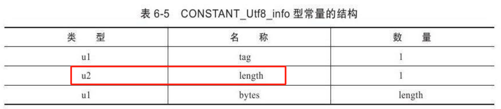
>
> 	å› æ­¤ ==String 的长度ä¸èƒ½è¶…过 $2^{16}-2$，å¦åˆ™æ— æ³•é€šè¿‡ç¼–译==。
>

==å‚考答案==：

> - String 在æºç ä¸­ä½¿ç”¨ char[] æ¥ç»´æŠ¤å­—符åºåˆ—的，而 ==char[] 的长度是 int 类型，所以ç†è®ºä¸Š String 的长度最大为 2^31−1== ，å ç”¨ç©ºé—´å¤§çº¦ä¸º 4 GB，ä¸è¿‡æ ¹æ®å®žé™… ==JVM 的堆内存é™åˆ¶ï¼Œç¼–译时，String长度最多å¯ä»¥æ˜¯2çš„16次方å‡2==，è¿è¡Œæ—¶é•¿åº¦æœ€å¤šå¯ä»¥æ˜¯2çš„31次方å‡1，æ„æ€æ˜¯==å¯ä»¥åœ¨ç¼–译时定义一些短的字符串，è¿è¡Œæ—¶å¯ä»¥è¿›è¡Œæ‹¼æŽ¥ï¼Œé•¿ä¸€ç‚¹ä¹Ÿå¯ä»¥==。
>

---

==问题四==：==字符串常é‡æ± æ˜¯æ”¾åœ¨å †ä¸­å—？==

==我的回答==：

> 1. ==字符串常é‡ä¸æ˜¯æ”¾åœ¨å †ä¸­çš„，而是放在方法区的常é‡æ± ä¸­==，并且在编译期生æˆå­—节ç çš„时候便已完æˆã€‚
>

==å‚考答案==：

> - ä¸æ˜¯ï¼Œ==Java 8 以å‰è¢«æ”¾åœ¨æ°¸ä¹…代中==，==Java 8 åŠä»¥åŽè¢«æ”¾åœ¨æ–¹æ³•åŒºçš„å…ƒæ•°æ® metadata 中==。
>

---

==问题五==：==String中 “+†和 StringBuffer 中的 append 会有性能上的差别å—？==

==我的回答==：

> 1. 有差别。String 中的 "+" ==本质是创建 StringBuilder 实例对象，调用其 append 方法，然åŽå† toString== ==在堆区创建拼接åŽçš„æ–°çš„ String 实例对象，最åŽå°†å…¶èµ‹ç»™å˜é‡==，这样åšæ˜¯å› ä¸º String 本身是ä¸å¯å˜çš„，其 value 一旦åˆå§‹åŒ–完æˆä¾¿ä¸èƒ½æ”¹å˜ï¼ŒåŒæ—¶æ²¡æœ‰ setter 方法因此其内容也无法改å˜ã€‚
> 2. 而 StringBuffer çš„ value 没有被 final 修饰，并且 ==StringBuffer 的父类 AbstractStringBuffer æ供了é½å…¨çš„对 value CRUD æ“作的 api==，因此 StringBuffer çš„ append ä¸ç”¨åˆ›å»ºæ–°å¯¹è±¡ï¼Œè€Œæ˜¯==直接修改 value 字段==，因此其性能大于 String 中的 "+" æ“作。
>

==å‚考答案==：

> - ==String çš„ “+†效率低于 StringBuffer çš„ append( )==。原因在于 ==String 是ä¸å¯å˜ç±»ï¼Œä»»ä½•å¯¹ String çš„æ“作都会创建新的 String 对象==。而 “+†的执行过程实际上是==先创建了一个 StringBuffer，然åŽè°ƒç”¨ append( )，最åŽåœ¨ toString( )==。效率上肯定是ä¸å¦‚ StringBuffer 直接 append( ) 高的。
>

---


### 10.èŠä¸€èŠä½ å¯¹å¤šæ€çš„ç†è§£ï¼ŸðŸŒŸðŸŒŸðŸŒŸðŸŒŸ

==我的回答==：

> 1. ==多æ€å…许一个对象编译时的类型和è¿è¡Œæ—¶çš„类型ä¸ä¸€è‡´ï¼Œå³çˆ¶ç±»çš„指针å¯ä»¥æŒ‡å‘å­ç±»çš„实例==。==编译类型在对象创建时就已ç»ç¡®å®šï¼Œè€Œè¿è¡Œæ—¶ç±»åž‹å¯ä»¥åŠ¨æ€åœ°ç»‘定在å­ç±»çš„实体上==。
> 2. 多æ€å…许对象在å…许过程中å‘上转型和å‘下转型。==å‘上转型是指父类的引用指å‘了å­ç±»çš„实体==。父类引用å¯ä»¥è°ƒç”¨çˆ¶ç±»çš„所有方法，但是==ä¸èƒ½è°ƒç”¨å­ç±»çš„方法，这在编译阶段就决定==了。而==父类方法的具体实现则会动æ€åœ°ç»‘定到å­ç±»ä¸Šï¼Œå–决于å­ç±»çš„具体实现==。
> 3. ==å‘下转型则是将父类的引用强制转æ¢ä¸ºå­ç±»çš„引用，å‰æ是在转æ¢å‰çˆ¶ç±»çš„引用必须指å‘å­ç±»çš„实体==。在å‘下转型之åŽï¼Œæ–°çš„å­ç±»å¼•ç”¨å°±å¯ä»¥è°ƒç”¨å­ç±»æ‰€æœ‰çš„方法。
> 4. 值得注æ„的是，当==调用对象的方法时，会根æ®è¯¥å¯¹è±¡çš„内存地å€/è¿è¡Œæ—¶ç±»åž‹è¿›è¡ŒåŠ¨æ€ç»‘定==，而==对象的字段在调用时则没有动æ€ç»‘定机制，哪里声明，就在哪里调用==。
>

==å‚考答案==：

> - 多æ€å¯ä»¥ç†è§£ä¸º “事物è¿è¡Œæ—¶çš„ä¸åŒçŠ¶æ€â€ï¼Œåœ¨ Java 中==具体指，通过动æ€ç»‘定，在è¿è¡Œæ—¶æ ¹æ®å¯¹è±¡çš„实际类型æ¥è°ƒç”¨å¯¹åº”的方法==。多æ€å¯ä»¥é€šè¿‡ç»§æ‰¿æˆ–者接å£æ¥å®žçŽ°ã€‚拿继承æ¥è¯´ï¼Œå­ç±»å¿…é¡»é‡å†™çˆ¶ç±»çš„方法，通过å‘上转型，使用父类类型æ¥è°ƒç”¨å­ç±»å¯¹è±¡çš„方法，结果是在è¿è¡Œæ—¶æ‰§è¡Œå­ç±»ä¸­é‡å†™çš„方法。
> - ==实践中我的项目的支付模å—就用到了多æ€==。具体æ¥è¯´ï¼Œæœ‰ä¸€ä¸ªåŸºç±» â€œæ”¯ä»˜æ–¹å¼ Paymentâ€ï¼Œå®ƒæœ‰ä¸€ä¸ª pay 方法，之åŽåˆ†åˆ«åˆ›å»º “微信支付 WeChatPay†和 “支付å®æ”¯ä»˜ AliPay†两个类，并且都继承自 Payment 并é‡å†™ pay 方法。那么在之åŽçš„支付代ç ä¸­ï¼Œæ— è®ºç”¨æˆ·é€‰æ‹©çš„哪ç§æ”¯ä»˜æ–¹å¼ï¼Œéƒ½å¯ä»¥ç»Ÿä¸€ç”¨ Payment æ¥è¿›è¡Œå…·ä½“çš„ pay æ“作。原因是 ==Java 的动æ€ç»‘定会确ä¿è¿™ä¸ªæ–¹æ³•åœ¨çœŸæ­£æ‰§è¡Œæ—¶ï¼ŒåŽ»è°ƒç”¨å­ç±»ä¸­å¾®ä¿¡æˆ–者支付å®çš„ pay 方法==。å¦å¤–，在修改具体的支付逻辑时，也åªéœ€å•ç‹¬åŽ»å¾®ä¿¡æˆ–者支付å®çš„类里é¢åŽ»ä¿®æ”¹ï¼Œè€Œä¸ç”¨åŠ¨ä¸»é€»è¾‘里é¢çš„代ç ï¼Œä½“现出多æ€çš„çµæ´»å’Œå¯æ‰©å±•æ€§ã€‚
> - 除了以上说的è¿è¡Œæ—¶å¤šæ€ï¼Œ==我还å¬è¯´è¿‡ä¸€ä¸ªæœ‰äº‰è®®çš„编译时多æ€ï¼Œå®ƒå…·ä½“指 Java 中的方法é‡è½½==，在编译期就根æ®å·²çŸ¥çš„å‚数列表，决定了需è¦è°ƒç”¨çš„方法。ä¸è¿‡ä¸€èˆ¬è¯´å¤šæ€éƒ½é»˜è®¤è¯´çš„是è¿è¡Œæ—¶å¤šæ€ã€‚
>

---


### 11.StringBuilderã€StringBuffer有什么区别？🌟🌟🌟🌟🌟

==我的回答==：

> 1. ==StringBuffer 的底层是一个å¯å˜çš„ char[] 字符型数组==。和 String ä¸åŒçš„是，==StringBuffer çš„ char[] 没有被 final 修饰==，并且 StringBuffer 的直接父类 ==AbstractStringBuffer æ供了针对 char[] çš„ CRUD 方法==，它们==ä¸éœ€è¦åƒ String 那样é‡åˆ°ä¿®æ”¹åªèƒ½é‡æ–°åˆ›å»ºå­—符型常é‡å’Œå˜é‡ï¼Œå¹¶æ›´æ”¹å¼•ç”¨==，而是==直接修改 char[]==，从而显著æå‡äº†ä¿®æ”¹çš„效率。
> 2. 而 StringBuilder 相比于 StringBuffer，最大的ä¸åŒæ˜¯ ==StringBuilder æ²¡æœ‰åƒ StringBuffer 那样对众多涉åŠchar[] 修改的方法使用 synchronized 关键字加互斥é”实现线程安全==，æ¢è¨€ä¹‹ï¼Œ==StringBuilder 是线程ä¸å®‰å…¨çš„==，但也正因如此其è¿è¡Œæ•ˆçŽ‡åœ¨å¤§å¤šæ•°æƒ…况下快于 StringBuffer，这使得==在å•çº¿ç¨‹çš„环境下我们å¯ä»¥ä¼˜å…ˆé€‰æ‹©ä½¿ç”¨ StringBuilder æ¥æž„建 String 对象==，以谋求更高的效率。
>

==å‚考答案==：

> - ==StringBuilder å’Œ StringBuffer 都是å¯å˜ç±»ï¼Œä»»ä½•å¯¹å®ƒä»¬çš„æ“作都ä¸ä¼šäº§ç”Ÿæ–°çš„对象==。两者的区别在于：==StringBuilder 没有加é”ä¸æ˜¯çº¿ç¨‹å®‰å…¨çš„，而 StringBuffer 大多数方法都加了 synchronized，是线程安全的，但执行效率会低点==。
>
> - æºç ä¸­æœ‰ä¸€ä¸ªç»†èŠ‚，就是 ==StringBuffer çš„ append 方法在执行真正的字符串拼接逻辑之å‰ï¼Œä¼šå…ˆæ¸…除 toStringCache，它是用æ¥ç¼“存最åŽä¸€æ¬¡ toString 结果的地方，主è¦ç”¨æ¥åŠ å¿« toString 的执行效率==。
>
> 	```java
> 	public synchronized StringBuffer append(StringBuffer sb) {
> 	    toStringCache = null; // 清空 toString 缓存
> 	    super.append(sb);
> 	    return this;
> 	}
> 	```
>

---


### 12.什么是åºåˆ—化？什么情况下需è¦åºåˆ—å·ï¼Ÿåºåˆ—化在Java中是怎么实现的？🌟🌟

==我的回答==：

> 1. ==åºåˆ—化是将java对象转化为二进制字节æµçš„方法==。如果一个对象想è¦è¿›è¡Œåºåˆ—化，那么其类==必须实现 Serilizable 接å£æˆ– Externalizable 接å£==。
> 2. åºåˆ—化一般用于在==å‘æŒä¹…åž‹æ•°æ®åº“写入数æ®==，==使用 Redis 等键值对数æ®åº“进行数æ®ç¼“å­˜==，以åŠ==网络传输中需è¦å°†å¯¹è±¡åºåˆ—化为字节æµæ‰èƒ½è¿›è¡Œä¼ è¾“==。
> 3. 在Java中我们使用使用==对象IOæµè¿›è¡Œå¯¹è±¡çš„åºåˆ—化和ååºåˆ—化==。比如在一个多用户å³æ—¶é€šè®¯é¡¹ç›®ä¸­ï¼Œæˆ‘们å¯ä»¥å°†ä¸€ä¸ª==用户的 Message 对象通过 ObjectOutputStream.writeObject 方法转æ¢ä¸ºäºŒè¿›åˆ¶æµè¿›è¡Œå¯¹è±¡çš„网络传输==。而æœåŠ¡ç«¯åœ¨æŽ¥æ”¶åˆ°æ­¤äºŒè¿›åˆ¶æµåŽä¹Ÿå¯ä»¥==使用 ObjectInputStream.readObject 方法将收到的二进制字节æµååºåˆ—化为 Object 对象，并å‘下转型为所需的 Message 对象==，从而实现网络通讯。
>

==å‚考答案==：

> - ==å‚考回答==1：
> - ==åºåˆ—化就是指将 Java 对象转æ¢æˆäºŒè¿›åˆ¶å­—节æµçš„过程==。
> - 当我们需è¦å¯¹æŸäº›å¯¹è±¡è¿›è¡Œ==æŒä¹…化==时，需è¦å…ˆå¯¹å®ƒä»¬åºåˆ—化æˆäºŒè¿›åˆ¶å­—节åºåˆ—，然åŽå­˜åˆ°æ•°æ®åº“或者内存中。或者两个 Java 进程==远程通信==时，也需è¦==å°† Java 对象转æ¢ä¸ºå­—节åºåˆ—æ‰èƒ½åœ¨ç½‘络中传é€==。
> - 首先被åºåˆ—化的对象一定需è¦==实现 Serializable 或 Externalizable 接å£==。åºåˆ—化与ååºåˆ—化分别是通过 Java io 包下的 ObjectOutputStream çš„ writeObject( ) å’Œ ObjectInputStream çš„ readObject( ) 实现的。
> - ==writeObject( ) 会对指定的 obj 对象进行åºåˆ—化，并把得到的字节åºåˆ—写到一个目标输出æµä¸­==。而 ==readObject( ) 会从一个输入æµä¸­è¯»å–字节åºåˆ—，并将其ååºåˆ—化æˆä¸€ä¸ªå¯¹è±¡è¿”回==。
> - ==å‚考回答==2：
> - åºåˆ—化就是把java对象，转æ¢ä¸ºå­—节åºåˆ—。一般情况下，当需è¦æŒä¹…化或者网络传输的时候，会用到åºåˆ—化。例如：当我们需è¦æŠŠä¸€ä¸ªå¯¹è±¡ä¿å­˜åˆ°æ–‡ä»¶é‡Œï¼Œæˆ–者通过网络传输这个对象，需è¦æŠŠè¿™ä¸ªå¯¹è±¡åºåˆ—化æˆå­—节åºåˆ—，å†æ“作。当从文件读å–到字节åºåˆ—时，需è¦å¯¹å­—节åºåˆ—进行ååºåˆ—化，把字节åºåˆ—å˜å›žjava对象，æ‰èƒ½ç”¨java程åºæ¥æ“作这个对象。==å‰åŽç«¯äº’ä¼ æ•°æ®çš„时候，也一般会将对象åºåˆ—化æˆjsonæ ¼å¼ã€‚这样å¯ä»¥ç»Ÿä¸€æ•°æ®çš„æ ¼å¼ï¼Œæ–¹ä¾¿å‰åŽç«¯çš„å¼€å‘人员进行è”è°ƒ==。使用åºåˆ—化å¯ä»¥å°†å¯¹è±¡è¿˜åŽŸæˆåŽŸæ¥çš„状æ€ã€‚
> - 实现åºåˆ—化，需è¦è®©å¯¹è±¡æ‰€å±žçš„类实现Serializable接å£ï¼Œ==这个接å£ï¼Œæˆ‘们ä¸éœ€è¦å®žçŽ°ä»»ä½•æ–¹æ³•ï¼Œåªæ˜¯å‘Šè¯‰JVM，这个类的对象å¯ä»¥è¢«åºåˆ—化==，然åŽæˆ‘们è¦==给这个类定义个long类型的常é‡serialVersionUID为1L，这个属性的æ„æ€æ˜¯å¯¹è±¡åºåˆ—化的版本å·ï¼Œç”¨æ¥åœ¨ååºåˆ—化的时候进行版本匹é…==。==当我们修改这个类的结构时，è¦æ”¹ä¸€ä¸‹serialVersionUID，改为跟之å‰çš„ä¸ä¸€æ ·çš„å°±å¯ä»¥äº†ï¼Œå¦åˆ™ä¼šå¯¼è‡´ååºåˆ—化失败==。
>

---


### 13.Java 中的å射是什么æ„æ€ï¼Ÿæœ‰å“ªäº›åº”用场景？有哪些优缺点？🌟🌟🌟

==我的回答==：

> 1. ==å射是一ç§åœ¨è¿è¡Œæ—¶åŠ¨æ€èŽ·å–类的Class对象，然åŽè°ƒç”¨Class对象的方法实现业务逻辑的技术==。
> 1. 比如 ==Spring 框架中就大é‡ä½¿ç”¨äº†å射技术==。我们在 ==Application.xml 中é…置一个 Bean 的全类åï¼Œä¹‹åŽ Spring 在项目å¯åŠ¨æ—¶å°±æ ¹æ®è¿™ä¸ªå…¨ç±»å使用åå°„èŽ·å– Bean 对应的 Class 对象==，并通过 Class.newInstance 方法创建 Bean 实例。å†æ¯”如我们å¯ä»¥==通过å射获å–一个方法的 Method 对象，然åŽé€šè¿‡æ­¤ Method 对象查看该方法是å¦æœ‰æŸä¸ªæ³¨è§£==，并由此进一步实现业务逻辑。
> 1. ==å射的优点是具有高çµæ´»æ€§å’Œå¯æ‰©å±•æ€§==，比如在上述的 Spring 框架中我们å¯ä»¥é€šè¿‡ Application.xml 统一管ç†æ‰€æœ‰çš„ Bean。==缺点是性能ä¸å¦‚éžåå°„æ“作，且存在安全风险==，比如==我们å¯ä»¥é€šè¿‡å射调用一个类的 private 方法==。
>

==å‚考答案==：

> - ==å射就是在 Java 程åºè¿è¡Œçš„过程中，动æ€èŽ·å¾—æŸä¸ªç±»çš„方法å˜é‡ï¼Œå¹¶è°ƒç”¨çš„技术==。
> - ==Spring 里é¢å°±å¤§é‡ç”¨åˆ°äº†å射，比如通过 xml æ–‡ä»¶èŽ·å– bean 的过程==。具体æ¥è¯´ï¼Œåœ¨é…ç½® bean 时需è¦æŒ‡å®šç±»çš„完全é™å®šåï¼Œä¹‹åŽ Spring 就会从 xml 文件中读å–到这个类å，并通过å射获å–到对应的类，进而调用该类的构造函数创建实例对象。
> - 除此之外，==Java 的动æ€ä»£ç†ï¼Œåºåˆ—化与ååºåˆ—化中也用到了åå°„==。在我的项目中为了实现对æŸäº›æŽ¥å£é™é¢‘，先是对这些接å£åŠ ä¸Šè‡ªå®šä¹‰çš„é™é¢‘注解，然åŽåœ¨æ‹¦æˆªå™¨ä¸­åˆ©ç”¨å射，判断将è¦æ‰§è¡Œçš„接å£æ˜¯å¦å«æœ‰é™é¢‘的注解。
> - ==å射的优点就是能æ高程åºçš„çµæ´»æ€§å’Œå¯æ‰©å±•æ€§==，比如刚说的通过 Spring çš„ xml 文件æ¥ç»Ÿä¸€ç®¡ç† bean ä¿¡æ¯ï¼ŒåŒæ—¶ä¹Ÿ==简化了æŸäº›åŠŸèƒ½çš„实现==。==缺点主è¦æ˜¯æ€§èƒ½å’Œå®‰å…¨é—®é¢˜==。==å射涉åŠäº†åŠ¨æ€ç±»åž‹çš„解æžï¼Œä¼šæœ‰ä¸€å®šçš„性能开销，所以åå°„æ“作的效率è¦æ¯”那些éžåå°„æ“作低==。其次，==åå°„å¯ä»¥ç»•è¿‡è®¿é—®ä¿®é¥°ç¬¦çš„é™åˆ¶==，对于ç§æœ‰æˆå‘˜ä¹Ÿå¯ä»¥è®¿é—®å’Œä¿®æ”¹ï¼Œå¯èƒ½ä¼šå¯¼è‡´å®‰å…¨é—®é¢˜ã€‚
>

---


### 14.什么是动æ€ä»£ç†ï¼Ÿæœ‰ä»€ä¹ˆç”¨ï¼ŸJava中å¯ä»¥æ€Žä¹ˆæ ·å®žçŽ°åŠ¨æ€ä»£ç†ï¼ŸðŸŒŸðŸŒŸðŸŒŸ

==我的回答==：

> 1. ==动æ€ä»£ç†æ˜¯åœ¨ä¸æ”¹å˜åŽŸæœ‰æ–¹æ³•çš„å‰æ下，对这些方法进行功能扩展==。比如我们打å°ä¸€ä¸ªæ–¹æ³•æ‰§è¡Œçš„用时，那么我们就å¯ä»¥é€šè¿‡åˆ›å»ºä»£ç†å¯¹è±¡è¿›è¡Œå®žçŽ°ã€‚而在 ==Spring 框架下的 aop é¢å‘切é¢ç¼–程也是通过动æ€ä»£ç†æ‰©å±•åŽŸæœ‰æ–¹æ³•==，从而实现å‰ç½®é€šçŸ¥ï¼ŒåŽç½®é€šçŸ¥ï¼ŒçŽ¯ç»•é€šçŸ¥ç­‰ã€‚
> 2. 实现动æ€ä»£ç†çš„方法一般有两ç§ï¼Œ==java.reflect 包的 proxy 类，和 CGlib çš„ enhancer==。
> 3. ==java.reflect 包的 proxy 是é¢å‘接å£çš„动æ€ä»£ç†ï¼Œå®ƒè¦æ±‚被代ç†çš„类必须实现接å£==，这也是该方法的局é™æ€§ã€‚具体æ“作是==创建一个类实现这些接å£ï¼Œé€šè¿‡å射获å–到该对象的 Method 类，然åŽåœ¨ method.invoke 周围实现扩展的功能==。
> 4. ==CGlib 则会创建一个目标类的å­ç±»ï¼Œé€šè¿‡é‡å†™å…¶æ–¹æ³•å®žçŽ°å¯¹åŽŸæ–¹æ³•çš„功能扩展==。
>

==å‚考答案==：

> - 我的ç†è§£æ˜¯==动æ€ä»£ç†ï¼Œå®žé™…上就是在ä¸æ”¹å˜åŽŸæœ‰ä»£ç çš„情况下对原有的方法增强==。对于一些方法，他们å¯èƒ½éœ€è¦ä¸€äº›ç»Ÿä¸€çš„处ç†é€»è¾‘，例如打å°æ—¥å¿—，这时候我们就å¯ä»¥==通过创建代ç†å¯¹è±¡ï¼Œæ¥å¯¹åŽŸæœ‰æ–¹æ³•è¿›è¡ŒåŠŸèƒ½ä¸Šçš„加强==。实现动æ€ä»£ç†æœ‰ä¸¤ç§æ–¹å¼ï¼Œ==一ç§æ˜¯é€šè¿‡jdk reflect包æ供的proxy类实现，还有一ç§æ˜¯é€šè¿‡cglibçš„enhancer实现==。
> - 对于jdk proxy它是é¢å‘接å£çš„动æ€ä»£ç†ï¼Œä¹Ÿå°±æ˜¯è¯´==åªæœ‰ä¸€ä¸ªç±»å®žçŽ°äº†æŽ¥å£ï¼Œæˆ‘们æ‰èƒ½å¯¹å®ƒè¿›è¡Œä»£ç†==，本质上æ¥è¯´å°±æ˜¯è¿™ä¸ª==代ç†å¯¹è±¡å®žçŽ°äº†è¢«ä»£ç†å¯¹è±¡çš„接å£ï¼Œæ‰€ä»¥å®ƒåªèƒ½å¢žå¼ºæŽ¥å£ä¸­çš„方法==，具体代ç é€»è¾‘是通过==é‡å†™invokationhandlerçš„invoke方法，通过åå°„çš„æ–¹å¼å¯¹åŽŸæœ‰æ–¹æ³•è¿›è¡Œå¢žå¼º==。
> - 对于==cglibçš„enhancer它是é¢å‘父类的动æ€ä»£ç†==，也就是说它代ç†ä¸€ä¸ªå¯¹è±¡å°±æ˜¯==通过继承被代ç†å¯¹è±¡å¯¹åŽŸæœ‰æ–¹æ³•å¢žå¼º==，这就æ„味ç€å®ƒå¯ä»¥å¢žå¼ºè¢«ä»£ç†å¯¹è±¡çš„所有方法，==并且由于å射机制的存在，å¯ä»¥èŽ·å–到父类方法上的所有注解==。
> - 动æ€ä»£ç†ç»å¸¸å‡ºçŽ°åœ¨æ¡†æž¶ä¸­ï¼Œä¾‹å¦‚mybatis通过é¢å‘接å£çš„动æ€ä»£ç†ï¼Œå¯¹æŽ¥å£è¿›è¡Œå®žçŽ°ã€‚==在spring aop机制中，通过动æ€ä»£ç†æœºåˆ¶ï¼Œå¯¹æ–¹æ³•è¿›è¡Œå¢žå¼ºï¼Œaop中的å‰ç½®é€šçŸ¥ï¼Œè¿”回通知，异常通知等，都是通过在动æ€ä»£ç†è¿‡ç¨‹ä¸­ï¼Œåœ¨ç›¸å¯¹åŽŸæ–¹æ³•çš„ä¸åŒä½ç½®æ‰§è¡Œå¯¹åº”逻辑而实现的==。
>

---


## 2.Java 集åˆ

### 1.ã€HashMap专题】hashmap 连环炮，看看你能接ä½å¤šå°‘招🌟🌟🌟🌟🌟

==问题一==：==HashMap 了解å—？平时在什么地方使用过它呢==？（说明：å‘现没有，我喜欢问使用场景，希望大家也是能够æ€è€ƒä½¿ç”¨åœºæ™¯çš„，因为掌æ¡äº†è¿™ä¸ªï¼Œä½ è¯´è¯æ›´åŠ æœ‰è¯´æœåŠ›ï¼‰

==我的回答==：

> 1. HashMap 也å¯ä»¥ç§°ä½œå“ˆå¸Œè¡¨ï¼Œå®ƒçš„==底层数æ®ç»“构是一个å¯å˜æ•°ç»„==，并使用==链地å€æ³•å¤„ç†å“ˆå¸Œå†²çª==，具体的实现是é‡åˆ°å“ˆå¸Œå†²çªæ—¶ä¼˜å…ˆä»¥==链表==çš„å½¢å¼åŠ åˆ°å¯å˜æ•°ç»„对应ä½ç½®çš„节点åŽé¢ï¼Œä¸”==当å¯å˜æ•°ç»„达到一定长度且链表长度也达到一定长度åŽï¼Œä¼šå°†é“¾è¡¨è½¬åŒ–为红黑树==，以æ高 CRUD 的效率，并且由于红黑树是 “黑节点平衡†的，因此查询的时间也比较稳定。
> 2. ==HashMap 主è¦ç”¨äºŽå¯¹å‚¨å­˜çš„æ•°æ®è¿›è¡Œé«˜æ•ˆçš„éšæœºè¯»å†™==，比如å¯æ ¹æ®ä¸€ä¸ªå¯¹è±¡çš„唯一字段对这个对象的集åˆè¿›è¡Œé«˜æ•ˆçš„éšæœºè¯»å†™ã€‚
>

==å‚考答案==：

> - HashMap 也就是哈希表，==底层利用数组支æŒä¸‹æ ‡éšæœºè®¿é—®æ•°æ®çš„特性，快速的对键值对进行读写æ“作==。
>

---

==问题二==：==HashMap 底层数æ®ç»“构说一下？（指导：直接说最新的å³å¯ï¼Œä¸éœ€è¦åŽ»å¯¹æ¯”以å‰çš„版本，因为é¢è¯•å®˜ä¹Ÿå¬çƒ¦äº†ï¼Œå¦å¤–在说的时候，为了你语言的严谨，一定è¦å¼ºè°ƒä¸‹æ˜¯å“ªä¸ªJDK版本的哈）==

==我的回答==：

> 1. 在 jdk1.8 åŠä»¥åŽçš„版本中，底层数æ®ç»“构是 “==å¯å˜æ•°ç»„ + 链表 + 红黑树==â€ã€‚首先如果å¯å˜æ•°ç»„为空则==å…ˆåˆå§‹åŒ–大å°ä¸º16==，将 key çš„ hashCode ç» hash 算法得到 ==hash 值åŽï¼Œ`i = (n - 1) & hash` 和当å‰å¯å˜æ•°ç»„å¤§å° - 1作按ä½ä¸Žè¿ç®—，目的是让得到的索引ä½ç½®ä¸å‡ºç•Œ==。
> 2. 如果索引ä½ç½®æ²¡æœ‰å…ƒç´ åˆ™å°† Node 放在这里；å¦åˆ™ä¼š==先以链表的形å¼åœ¨å…¶åŽåˆ›å»ºæ–°èŠ‚点==，然åŽ==判断链表总长是å¦è¾¾åˆ°é»˜è®¤å€¼8，达到åŽå³å°è¯•å°†é“¾è¡¨è½¬æ¢ä¸ºçº¢é»‘æ ‘==。但是值得注æ„的是，==å°è¯•è½¬æ¢çº¢é»‘树时如果å¯å˜æ•°ç»„的长度å°äºŽé»˜è®¤å€¼64，则转化失败，并对å¯å˜æ•°ç»„进行扩容==。
>

==å‚考答案==：

> - 在最新的 JDK 1.8 中，HashMap 的底层数æ®ç»“构为 “==哈希表 + 链表 + 红黑树==â€ã€‚当哈希表中出现哈希冲çªæ—¶ï¼ŒHashMap 采用 “==链地å€æ³•==†æ¥è§£å†³ï¼Œä¹Ÿå°±æ˜¯==哈希表中的æ¯ä¸ªæ§½ä½ï¼Œéƒ½ä¼šå¯¹åº”一个链表==，所有哈希值相åŒçš„元素都会被放到åŒä¸€ä¸ªæ§½ä½å¯¹åº”的链表中。但éšç€é“¾è¡¨é•¿åº¦çš„增加，元素的读å–效率会下é™ï¼Œ==直到达到æŸä¸ªé˜ˆå€¼æ—¶ï¼ˆç›®å‰JDK是8），HashMap 会将链表转化为红黑树==，进一步æå‡æ€§èƒ½ã€‚
>

---

==问题三==：==为什么用红黑树呢？用平衡二å‰æ ‘ä¸å¯ä»¥å—？或者你讲一讲他们å„自的优缺点å—？==

==我的回答==：

> 1. ==红黑树是弱平衡树==，而==AVL树是强平衡树，其æ’入和删除节点的速度涉åŠè¾ƒå¤šçš„å­æ ‘旋转æ“作==，因此==红黑树的æ’入和删除节点的速度比AVLæ ‘æ›´å¿«==。但是==红黑树需è¦é¢å¤–的字段存储节点的颜色信æ¯==，因此在空间上ä¸å¦‚AVL树。
>

==å‚考答案==：

> - ==红黑树是弱平衡二å‰æ ‘，整棵树å¯ä»¥æœ‰å±€éƒ¨çš„ä¸å¹³è¡¡==。==AVL 树是强平衡二å‰æ ‘==，它严格è¦æ±‚整棵树的平衡性。也就是说，虽然两者的æ’入，删除å¤æ‚度都为 O*(*logn)，实际中 ==AVL 树需è¦æ‰§è¡Œæ›´å¤šçš„旋转æ“作æ¥ä¿è¯å¼ºå¹³è¡¡æ€§ï¼Œæ•ˆçŽ‡è¦ä½ŽäºŽçº¢é»‘æ ‘==。但红黑树也有缺点，==它需è¦é¢å¤–的字段æ¥è®°å½•æ¯ä¸ªèŠ‚点的颜色==，因此会å ç”¨æ›´å¤šçš„存储空间。
>

----

==问题四==：==为什么选择 8 之åŽè½¬ä¸ºçº¢é»‘树呢？å¦å¤–链表转为红黑树之åŽï¼Œè¿˜ä¼šç»§ç»­è½¬ä¸ºé“¾è¡¨å—？==（最好看过æºç è¯´æ˜Žï¼‰

==我的回答==：

> 1. 当链表的长度过长时，哈希表对这些元素读写的效率会é™ä½Žï¼Œå°†å…¶==转化为红黑树å¯ä»¥æå‡è¯»å†™çš„效率==。
> 2. 之所以选择8则是因为==å‘生哈希冲çªå¯¼è‡´æŸä¸€é“¾è¡¨çš„长度达到8并ä¸å®¹æ˜“，这是为了防止æžç«¯æƒ…况下哈希表读写效率é™ä½Žçš„风险==。
> 3. 当==红黑树的节点个数å°äºŽ6时，会将红黑树转回链表==。这是由于当节点个数较少时，使用红黑树在时间和空间上都å而ä¸å¦‚链表。
>

==å‚考答案==：

> - 这个在æºç çš„注释中有解释，大致æ„æ€ä¸ºï¼šå¦‚果元素的哈希值足够éšæœºï¼Œç†æƒ³æƒ…况下链表的长度对应的概率符åˆæ³Šæ¾åˆ†å¸ƒï¼Œ==达到 8 的概率å°äºŽåƒä¸‡åˆ†ä¹‹ä¸€==。
>
> 	```java
> 	     * Because /*TreeNodes are about twice the size of regular nodes*/, we
> 	     * use them only when bins contain enough nodes to warrant use
> 	     * (see TREEIFY_THRESHOLD). /*And when they become too small (due to
> 	     * removal or resizing) they are converted back to plain bins*/. In
> 	     * usages with well-distributed user hashCodes, tree bins are
> 	     * rarely used. The first values are:
> 	     *
> 	     * 0:    0.60653066
> 	     * 1:    0.30326533
> 	     * 2:    0.07581633
> 	     * 3:    0.01263606
> 	     * 4:    0.00157952
> 	     * 5:    0.00015795
> 	     * 6:    0.00001316
> 	     * 7:    0.00000094
> 	     * 8:    0.00000006
> 	     * more: less than 1 in ten million
> 	```
>
> 	也就是说，一般情况下并ä¸ä¼šå‘生链表到红黑树的转化，更多是一ç§==防止自己选å–的哈希算法ä¸å¥½çš„ä¿åº•ç­–ç•¥==，在æžç«¯æƒ…况下ä»ä¼šæœ‰è¾ƒå¥½çš„效率。
>
> - 但是，当==红黑树的节点å°äºŽ 6 时，红黑树åˆä¼šè½¬å›žé“¾è¡¨==，原因是数æ®é‡å¾ˆå°çš„情况下，空间和时间上链表都è¦æ¯”红黑树优秀。==至于为什么è¦æŠŠè¿™ä¸ªé˜ˆå€¼å®šä¸º 6，而ä¸åŒæ ·å®šä¸º 8，主è¦æ˜¯è€Œä¸ºäº†é˜²æ­¢å…ƒç´ æ•°é‡åœ¨ 8 附近导致两ç§æ•°æ®ç»“构的频ç¹è½¬æ¢==。
>

---

==问题五==：==简å•æ述下 put çš„æµç¨‹ï¼Ÿå¯ä»¥è¯´ä¸€ä¸‹JDK为了效率更快，在 put 的时候，åšäº†å“ªäº›ä¼˜åŒ–ä¸ï¼Ÿ==

==我的回答==：

> 1. 首先会==调用 HashMap çš„ hash æ–¹æ³•æ ¹æ® key çš„ hashCode 生æˆä¸€ä¸ª hash 值==，将其和 KV 一åŒä¼ å…¥ putVal 方法。
>
> 2. 在 putVal 方法中，==首先会检查å¯å˜æ•°ç»„是å¦ä¸ºç©ºï¼Œä¸ºç©ºåˆ™åˆå§‹åŒ–至16的大å°==。然åŽé€šè¿‡
>
> 	```java
> 	i = (n - 1) & hash
> 	```
>
> 	==计算索引值==，进行按ä½ä¸Žè¿ç®—是为了防止索引值出界。然åŽ==判断索引处节点是å¦ä¸ºç©º==，为空就直接将新的 Node 放置在这里。
>
> 3. 如果ä¸ä¸ºç©ºåˆ™==å…ˆé历查看是å¦å·²æ’入该节点，已有则更新 value 值==，å¦åˆ™==å°è¯•ä»¥é“¾è¡¨å½¢å¼æ·»åŠ èŠ‚点==，然åŽ==判断链表总长是å¦è¾¾åˆ°é»˜è®¤å€¼8，达到åŽå³å°è¯•å°†é“¾è¡¨è½¬æ¢ä¸ºçº¢é»‘æ ‘==。但是值得注æ„的是，==å°è¯•è½¬æ¢çº¢é»‘树时如果å¯å˜æ•°ç»„的长度å°äºŽé»˜è®¤å€¼64，则转化失败，并对å¯å˜æ•°ç»„进行扩容==。
>
> 4. ==最åŽåˆ¤æ–­æ·»åŠ å®ŒæˆåŽå¯å˜æ•°ç»„已用节点数是å¦è¾¾åˆ°æ€»å¤§å°çš„默认0.75å€==，达到就进行扩容。
>
> 5. 优化之一是在==计算索引值时，以按ä½ä¸Žè¿ç®—代替å–模è¿ç®—æå‡äº†æ•ˆçŽ‡==。
>

==å‚考答案==：

> - 首先 put( ) 会计算出è¦æ’å…¥ key 的哈希值，通过哈希值计算出其在数组中的==索引ä½ç½®==，如果该ä½ç½®ä¸Šæ²¡æœ‰å…ƒç´ åˆ™ç›´æŽ¥æ’入，有元素则需è¦é历这个ä½ç½®ä¸Šçš„所有元素。==如果能找到与当å‰é”®ç›¸ç­‰çš„键值对，则将其更新为当å‰å€¼å¹¶è¿”回旧值==，如果找ä¸åˆ°ä¸Žå½“å‰é”®ç›¸ç­‰çš„键值对，则需è¦æ‰§è¡ŒçœŸæ­£çš„æ’å…¥æ“作，将其==æ’入到链表或者红黑树中==，最åŽ==判断æ’å…¥åŽæ˜¯å¦éœ€è¦æ‰©==容。
> - put( ) 的优化我å°è±¡æ·±çš„是计算 key 哈希值的 hash( )，主è¦æœ‰==两个优化的点==：==使用ä½è¿ç®—代替å–模è¿ç®—==å’Œ==对 hashCode 进行æ…动计算==。具体æ¥è¯´ï¼Œå¯ä»¥ç”¨x这个公å¼==å°†å–模转å˜ä¸ºä½è¿ç®—æ¥æå‡æ€§èƒ½==，但是åŒæ—¶ä¹Ÿéœ€è¦åº•å±‚数组的长度是 2 çš„å€æ•°ï¼Œè¿™ä¸ªåœ¨ HashMap çš„åˆå§‹åŒ–和扩容方法中åšäº†ä¿è¯ã€‚
> - 除此之外，==为了进一步é™ä½Žå“ˆå¸Œå†²çªçš„概率，hash( ) åˆé€šè¿‡å¤šä¸ªä¸Žè¿ç®—将哈希值的高ä½å’Œä½Žä½è¿›è¡Œæ…动，尽å¯èƒ½çš„åšåˆ°åœ¨ä¸åŒ key 中哪怕有一个ä½çš„ä¸åŒï¼Œéƒ½ä¼šå¯¹æœ€ç»ˆäº§ç”Ÿçš„哈希值造æˆå½±å“==。
>

---

==问题六==：==多线程情况下，put 是线程安全的å—？å¯ä»¥ç®€å•ä¸¾ä¸ªä¾‹å­ï¼Œè¯´ä¸€ä¸‹å“ªé‡Œä¸å®‰å…¨å—？==

==我的回答==：

> 1. ==put 线程ä¸å®‰å…¨==，因为 HashMap çš„ put å’Œ putVal 方法中并没有采å–并å‘控制的措施。
> 2. 比如有==大é‡çº¿ç¨‹åŒæ—¶å‘åŒä¸€ä¸ª HashMap 中 put åŒä¸€ä¸ª KV==，å‡è®¾ç´¢å¼•ä½ç½®ä¸ä¸ºç©ºï¼Œå°±å¯èƒ½å‡ºçŽ°ä¹‹å‰çš„ KV 还没放入 HashMap，==åŽç»­çº¿ç¨‹åœ¨é历链表时å‘现该 KV 还没写入哈希表中，便å‘åŒä¸€ä¸ªé“¾è¡¨ä¸­æ’入大é‡ç›¸åŒçš„节点，导致链表过长==，并没有被化为红黑树。
>

==å‚考答案==：

> - ==ä¸æ˜¯==，在 JDK 1.7 中==多线程åŒæ—¶è¿›è¡Œ put( ) 会出现数æ®è¦†ç›–问题==，在需è¦æ‰©å®¹æ—¶ä¹Ÿå¯èƒ½ä¼šå‡ºçŽ°é“¾æ­»å¾ªçŽ¯é—®é¢˜ã€‚JDK 1.8 ä¿®å¤äº†é“¾æ­»å¾ªçŽ¯ï¼Œ==但数æ®è¦†ç›–问题ä¾ç„¶å­˜åœ¨==。
> - ==JDK 1.7== çš„ HashMap 底层为数组 + 链表，扩容的 transfer( ) 会é历原链表中的æ¯ä¸ªèŠ‚点，采用==头æ’法==将其转移到新哈希表槽ä½çš„链表中，这个过程在多线程下会==导致新链表中出现环路==，并造æˆæŸäº›å…ƒç´ ä¸¢å¤±ã€‚
> - JDK 1.8 采用的是尾æ’法，ä¿è¯äº†å…ƒç´ åœ¨æ‰©å®¹å‰åŽçš„顺åºä¸€è‡´ï¼Œé¿å…了死循环问题，但还会造æˆæ•°æ®è¦†ç›–。==如两个线程åŒæ—¶æ‰§è¡Œ put，且两个线程都åŒæ—¶åˆ¤æ–­æ§½ä½ä¸ºç©ºï¼Œåˆ™åŽæ’入的数æ®ä¼šè¦†ç›–å…ˆæ’入的数æ®==。
>

---

==问题七==：==如果我想è¦è®© hashmap å˜æˆçº¿ç¨‹å®‰å…¨çš„，你觉得å¯ä»¥æ€Žä¹ˆåšï¼Ÿï¼ˆæœ‰æ—¶å€™ä¼šæ‰¯åˆ° concurrentHashMap，ä¸è¿‡å’±ä»¬è¿™é‡Œå…ˆä¸è¿½å‡»è¿™ä¸ªï¼‰==

==我的回答==：

> 1. ==å¯ä»¥ä½¿ç”¨ HashTable 代替==，HashTable 给大部分方法用 synchronized 修饰，以加互斥é”çš„æ–¹å¼å®žçŽ°äº†çº¿ç¨‹å®‰å…¨ã€‚
>

==å‚考答案==：

> - 想è¦è§£å†³ HashMap 的线程ä¸å®‰å…¨é—®é¢˜ï¼Œé¦–先我们ä¸èƒ½ä¿®æ”¹æºç ï¼Œé‚£å°±è¦ä¹ˆä½¿ç”¨ä¸€äº› “辅助†æ“作，让它å˜å¾—安全，è¦ä¹ˆå°±å¯»æ‰¾æ›¿ä»£å“。首先说的 “辅助†æ“作是指，==使用 Collections 类的 synchronizedMap 方法包装一下，它返回由指定映射支æŒçš„åŒæ­¥æ˜ å°„，是线程安全的==。æ¢æ›¿ä»£å“çš„è¯ï¼Œå¯ä»¥è€ƒè™‘ HashTable，==HashTable 通过将整个表上é”æ¥å®žçŽ°çº¿ç¨‹å®‰å…¨==，æŸäº›æƒ…况下效率很低。还å¯ä»¥ä½¿ç”¨ ==ConcurrentHashMap，它使用分段é”或者 CAS æ“作æ¥ä¿è¯çº¿ç¨‹å®‰å…¨==。
>

---

==问题八==：==头æ’法会导致死循环，那你觉得在以å‰çš„版本中，为啥会使用头æ’法呢？==

==我的回答==：

> 1. 之所以把新元素æ’到链表头部，是因为==认为新加入的元素在之åŽæ›´æœ‰å¯èƒ½è¢«è®¿é—®åˆ°==，因此放到头部å¯ä»¥ç•¥å¾®æå‡æ€§èƒ½ã€‚
>

==å‚考答案==：

> - 采用头æ’法的è¯ï¼Œæœ€æ–°æ’入的数æ®å°±ä¼šåœ¨é“¾è¡¨çš„最å‰è¾¹ï¼Œ==æ ¹æ®ç¨‹åºçš„局部性原ç†ï¼Œæœ€è¿‘被访问的数æ®å¾ˆå¯èƒ½ä¸ä¹…之åŽä¼šå†æ¬¡è®¿é—®==，那么此时å¯ä»¥åœ¨ O(1) 时间返回。
>

---

==问题ä¹==：==那我们å†è¯´ä¸€è¯´ HashMap 的扩容å§ï¼Œä»€ä¹ˆæ—¶å€™ä¼šæ‰©å®¹å‘¢ï¼Ÿä½ è§‰å¾—为啥负载因å­ä¸ºå•¥é€‰æ‹© 0.75 呢？==

==我的回答==：

> 1. HashMap 扩容的时机一般有两个，==å¯å˜æ•°ç»„使用元素个数达到总é‡ä¹˜è´Ÿè½½å› å­==å’Œ==链表转化为红黑树时å¯å˜æ•°ç»„容é‡æ²¡æœ‰è¾¾åˆ°é»˜è®¤å€¼64==。
> 2. 负载因å­é€‰æ‹©ä¸º0.75是==空间利用率和哈希冲çªçŽ‡é—´çš„一个平衡==。如果==负载因å­è¿‡ä½Žï¼Œä¼šå¯¼è‡´é¢‘ç¹è§¦å‘扩容，而浪费较多空间==；而==负载因å­è¿‡é«˜ï¼Œä¼šå¯¼è‡´è¿Ÿè¿Ÿä¸æ‰©å®¹ï¼Œæ高了哈希冲çªå‘生的风险==。
>

==å‚考答案==：

> - HashMap 需è¦æ‰©å®¹æ—¶ï¼Œå¯ä»¥åˆ†ä¸ºå‡ ç§æƒ…况æ¥è€ƒè™‘。
> - 首先是在无å‚的构造函数中。在第一次进行 put æ“作之å‰ï¼ŒHashMap 内部数组为 null，第一次 put åŽæ‰ä¼šå¼€å§‹==第一次åˆå§‹åŒ–扩容，默认为 16== 。
> - 其次是指定了åˆå§‹å®¹é‡çš„构造å‚数，也是在第一次 put æ“作之åŽæ‰å¼€å§‹åˆå§‹åŒ–扩容，但此时的==容é‡æ˜¯ç¬¬ä¸€ä¸ªä¸å°äºŽæŒ‡å®šå®¹é‡çš„ 2 的幂数==，阈值为计算åŽå®¹é‡ä¹˜è´Ÿè½½å› å­ã€‚
> - 其它情况就是，éžé¦–次 put，导致容é‡å¤§äºŽé˜ˆå€¼ï¼Œéœ€è¦æ‰©å®¹ã€‚==容é‡å’Œé˜ˆå€¼éƒ½å˜ä¸ºåŽŸæ¥çš„ 2 å€ï¼Œè´Ÿè½½å› å­ä¸å˜==。
> - 负载因å­ä¸º 0,75 的原因，简å•æ¥è¯´æ˜¯ “==哈希冲çªâ€ å’Œ “空间利用率“ 矛盾的一个折中==。原因是，扩容因å­æ˜¯ç”¨æ¥è®¡ç®—阈值的，阈值为底层 table 长度乘负载因å­ï¼Œå½“ HashMap 容é‡å¤§äºŽé˜ˆå€¼æ—¶ä¼šè§¦å‘扩容。所以如果负载因å­è¿‡å°ï¼Œtable 中还没填几个元素就è¦æ‰©å®¹ï¼Œè™½ç„¶å“ˆå¸Œå†²çªæ¦‚率很å°ï¼Œä½†ç©ºé—´æµªè´¹å¤ªå¤šã€‚相å，如果负载因å­è¿‡å¤§ï¼Œç©ºé—´åˆ©ç”¨çŽ‡æ˜¯é«˜ï¼Œä½†å“ˆå¸Œå†²çªçš„概率也大大增加。那就å–个折中å§ï¼Œä¸º 0.75。
>

----

==问题å==：==频ç¹æ‰©å®¹ä¼šå¯¼è‡´æ•ˆçŽ‡æ¯”较低下，那你觉得在平时，在实际的开å‘场景中，å¯ä»¥æ€Žä¹ˆä¼˜åŒ–æ¥é¿å…频ç¹æ‰©å®¹å‘¢ï¼Ÿ==

==我的回答==：

> 1. 在创建哈希表之å‰åˆç†ä¼°ç®—业务的规模，在==哈希表åˆå§‹åŒ–时显示地将哈希表的åˆå§‹å®¹é‡è®¾ç½®ä¸ºå¤§äºŽä¸šåŠ¡è§„模的最å°2的幂次==。
> 2. ==优化哈希函数==，æå‡ä¸åŒ key 值得到的 hash 值的区分度，é™ä½Žå†²çªçš„概率。
>

==å‚考答案==：

> - 容易想到的就是，æå‰é¢„估业务的存储é‡ï¼Œè®¾ç½®ä¸€ä¸ªè¾ƒå¤§çš„åˆå§‹å®¹é‡ã€‚==这时ä¸ç”¨è€ƒè™‘它是å¦æ˜¯ 2 的次幂，HashMap 自己会计算出第一个大于等于给定容é‡çš„ 2 次幂æ¥ä½œä¸ºåˆå§‹å®¹é‡==。除此之外，å¯ä»¥==自定义负载因å­çš„大å°ï¼Œå¯¹å“ˆå¸Œå‡½æ•°ä¼˜åŒ–==等等。
>

---

==问题å一==：==一个场景题：åªå­˜60个键值对，需è¦è®¾ç½®åˆå§‹åŒ–容é‡å—？设置的è¯è®¾ç½®å¤šå°‘åˆå§‹åŒ–容é‡æ¯”较好呢？==

==我的回答==：

> 1. 如果ä¸è®¾ç½®åˆå§‹åŒ–容é‡çš„è¯ï¼Œ==60个键值对å¯èƒ½ä¼š16->32->64->128ç»è¿‡æœ€å¤šä¸‰æ¬¡æ‰©å®¹ï¼Œè¾ƒä¸ºé¢‘ç¹==。
> 2. 第一个大于60çš„2的幂次是64，==但是64*0.75=48<60，ä¾ç„¶å¾ˆæœ‰å¯èƒ½ä¼šè§¦å‘一次扩容==，而64/0.75=85，==考虑到HashMap 自己会计算出第一个大于等于给定容é‡çš„ 2 次幂æ¥ä½œä¸ºåˆå§‹å®¹é‡ï¼Œæ‰€ä»¥éšæœºé€‰ä¸€ä¸ª 65 – 128 之间的数作为åˆå§‹å®¹é‡å³å¯==。
>

==å‚考答案==：

> - HashMap 默认的åˆå§‹å®¹é‡å¤§å°ä¸º 16。如果ä¸è®¾ç½®åˆå§‹å®¹é‡çš„è¯ï¼Œæ ¹æ®è§„则 size > threshold 时会触å‘扩容，且 threshold = loadFactor *capacitry，==最终 capacity 会ç»åŽ† 16 – 32 – 64 – 128 三次扩容æ“作==。==考虑到HashMap 自己会计算出第一个大于等于给定容é‡çš„ 2 次幂æ¥ä½œä¸ºåˆå§‹å®¹é‡ï¼Œæ‰€ä»¥éšæœºé€‰ä¸€ä¸ª 65 – 128 之间的数作为åˆå§‹å®¹é‡å³å¯==。
>

---


### 2.ã€ArrayList与LinkedList专题】连环炮，看看你能接ä½å¤šå°‘招？🌟🌟🌟🌟🌟

==问题一==：==请你说一说 ArrayList 和 LinkedList 区别？==

==我的回答==：

> 1. ==ArrayList 底层实现是å¯å˜æ•°ç»„==，å¯ä»¥é€šè¿‡ä¸‹æ ‡ä»¥O(1)的时间å¤æ‚度进行读å–和修改的æ“作，但是添加和删除元素涉åŠåˆ°æ•°ç»„元素的è¿ç§»ï¼Œå¤æ‚度为O(n)。
> 2. 而 ==LinkedList 底层实现是åŒå‘链表==，å¯ä»¥ä»¥O(1)å¤æ‚度进行增删æ“作，但是查找速度为O(n)较慢。
> 3. 因此涉åŠè¾ƒå¤šè¯»å–æ“作的业务建议采用 ArrayList，而数æ®å¢žåˆ æ“作较多的业务建议使用 LinkedList，==比如 LRU å’Œ LFU 缓存就å¯ä»¥ä½¿ç”¨åŒå‘链表实现==。
>

==å‚考答案==：

> - ==ArrayList 底层是用数组实现的==，根æ®ç´¢å¼•è®¿é—®å…ƒç´ ï¼Œä½¿å¾—查询的å¤æ‚度仅为 O(1)。但在æ’入和删除时有数组的å¤åˆ¶å’Œç§»åŠ¨ï¼Œå¤æ‚度为 O*(*n)ï¼›
> - ==LinkedList 底层使用åŒå‘链表实现的==，由于æ¯ä¸ªèŠ‚点都å«æœ‰å‰é©±å’ŒåŽç»§èŠ‚点的引用，所以它æ’入删除时åªéœ€ä¿®æ”¹è¿™äº›å¼•ç”¨ï¼Œæ•ˆçŽ‡è¦æ¯” ArrayList 高 。但在查询元素时需è¦ä»Žå¤´èŠ‚点开始ä¾æ¬¡é历整个链表，时间å¤æ‚度为 O*(*n)
>

---

==问题二==：==如果我è¦åˆ é™¤ç¬¬ k 个元素，也就是会执行 remove(k)，那么这个 remove çš„æ“作，它们的时间å¤æ‚度å„自是多少？==

==我的回答==：

> 1. ArrayList å¯ä»¥ä½¿ç”¨ä¸‹æ ‡O(1)定ä½åˆ°ç¬¬k个元素，以O(n)å¤æ‚度删除，整体å¤æ‚度为O(n)。
> 2. LinkedList 需è¦ä»¥O(n)å¤æ‚度定ä½åˆ°ç¬¬k个元素，但åªéœ€O(1)时间完æˆåˆ é™¤ï¼Œæ•´ä½“å¤æ‚度也为O(1)。
>

==å‚考答案==：

> - 都是 O*(*n) 。
> - ArrayList 首先会以 O(1) 时间定ä½åˆ°ç¬¬ k 个元素，然åŽå°†è¢«è¿™ä¸ªå…ƒç´ åˆ†å‰²çš„两部分å¤åˆ¶æ‹¼æŽ¥åˆ°ä¸€ä¸ªæ–°æ•°ç»„上，总体为 O*(*n) 。
> - LinkedList 首先以 O(*n*) 时间定ä½åˆ°ç¬¬ k ä¸ªå…ƒç´ ï¼Œç„¶åŽ O(1) 时间处ç†è¿™ä¸ªå…ƒç´ å‰åŽèŠ‚点的引用，总体也为 O*(*n) 。
>

---

==问题三==：==å¯ä»¥è¯´ä¸€è¯´å®ƒä»¬çš„使用场景å—？或者说一说你平时在处ç†ä»€ä¹ˆäº‹æƒ…的时候，用过它们？==

==我的回答==：

> 1. 对于 ArrayList，我一般在==从数æ®åº“中读å–一个集åˆçš„æ•°æ®æ—¶ä½¿ç”¨ ArrayList==，因为==åŽç»­çš„业务一般涉åŠè¾ƒå¤šæ•°æ®åº“æ•°æ®çš„读å–æ“作==，而很少涉åŠå¢žåˆ ï¼Œå¹¶ä¸” ArrayList 的内存å ç”¨ç›¸æ¯”于 LinkedList 也更å°ã€‚
> 2. 而 LinkedList 则在==设计 LRU å’Œ LFU 缓存更新算法时å¯ä»¥ä½¿ç”¨==。因为==æ¯è¿›è¡Œä¸€ä¸ªæ“作，就涉åŠå°†å…ƒç´ è¿ç§»åˆ°è¡¨å¤´çš„æ“作，而åŒå‘链表在这个过程中的增删用时å‡ä¸ºO(1)==。
>

==å‚考答案==：

> - 暂无。
>

---

==问题四==：==ArrayList 底层实现是数组，数组就会有容é‡é™åˆ¶ï¼Œå¯ä»¥ç®€å•è¯´ä¸€ä¸‹ ArrayList 的扩容机制å—？==

==我的回答==：

> 1. ==æ— å‚构造的情况下å¯å˜æ•°ç»„åˆå§‹é•¿åº¦ä¸º0，第一次扩容会括容到10==。之åŽæŒ‰ç…§==1.5å€æ‰©å®¹==。
> 2. 而有å‚构造则第一次扩容到指定å‚数，之åŽä¸€ç›´æŒ‰ç…§==1.5å€è¿›è¡Œæ‰©å®¹==。
>

==å‚考答案==：

> - ArrayList 的默认容é‡ä¸º 10，当需è¦æ‰©å®¹æ—¶ï¼Œä¼š==先申请一个容é‡ä¸ºæ—§å®¹é‡ 1.5 å€çš„新数组，然åŽæŠŠæ—§æ•°ç»„å¤åˆ¶åˆ°æ–°æ•°ç»„中==。值得注æ„的是，==JDK 1.8 中 ArrayList 底层数组的最大容é‡ä¸º Integer.MAX_VALUE – 8 ，目的是防止æŸäº›è™šæ‹Ÿæœºä¼šåœ¨æ•°ç»„中存一些é¢å¤–çš„ä¿¡æ¯å¯¼è‡´å†…存溢出==。
>

---


### 3.ã€counrrenthashmap】看看你了解多少？🌟🌟🌟

==问题一==：==counrrenthashmap 是如何实现线程安全的？å¯ä»¥ç®€å•è¯´ä¸€ä¸‹ä¸ºäº†æ•ˆçŽ‡æ›´å¿«ï¼Œæ¯”èµ· HashTable，counrrenthashmap 作了哪些优化å—？==

==我的回答==：

> 1. ä¸äº†è§£ã€‚
>

==å‚考答案==：

> - JDK 1.7 中 ConcurrentHashMap 使用了分段é”æ¥å®žçŽ°çº¿ç¨‹å®‰å…¨ã€‚它的底层是一个 Segment 数组，æ¯ä¸ª Segment 通过继承 ReetrantLock æ¥æŽ§åˆ¶è‡ªå·±è¿™éƒ¨åˆ†çš„加é”。其中æ¯ä¸ª Segment 就类似一个 HashTable，这样åªè¦ä¿è¯æ¯ä¸ª Segment 是线程安全的，就能确ä¿æ•´ä¸ªå“ˆå¸Œè¡¨ä¹Ÿæ˜¯å®‰å…¨çš„了。
>
> - JDK 1.8 为了摆脱哈希表中 Segment 个数对并å‘度的é™åˆ¶ï¼Œ==底层采用和 HashMap 类似的实现：数组 + 链表 + 红黑树==，==加é”用 CAS å’Œ synchronized 实现==。
>
> - 具体æ¥è¯´ï¼Œåœ¨==进行 putVal æ“作时，如果槽ä½ä¸ºç©ºï¼Œåˆ™ä½¿ç”¨ CAS æ’入新节点==。
>
> 	```java
> 	else if ((f = tabAt(tab, i = (n - 1) & hash)) == null) {
> 	    if (casTabAt(tab, i, null,
> 	                 new Node<K,V>(hash, key, value, null)))
> 	        break;                   // no lock when adding to empty bin
> 	}
> 	```
>
> - 如果槽ä½ä¸ä¸ºç©ºï¼Œåˆ™éœ€è¦==进一步判断其它线程是å¦åœ¨å¯¹å…¶æ‰©å®¹ï¼Œæ˜¯åˆ™å助扩容==，
>
> 	```java
> 	else if ((fh = f.hash) == MOVED)
> 	    tab = helpTransfer(tab, f);
> 	```
>
> - ==ä¸æ˜¯åˆ™ä½¿ç”¨ synchronized é”ä½å½“å‰æ§½ä½==，å†è¿›è¡Œæ’入节点æ“作。
>
> 	```java
> 	else {
> 	    V oldVal = null;
> 	    synchronized (f) { // 使用 synchronized é”ä½å½“å‰æ§½ä½
> 	        if (tabAt(tab, i) == f) {
> 	            if (fh >= 0) {
> 	                binCount = 1;
> 	                for (Node<K,V> e = f;; ++binCount) {
> 	                    K ek;
> 	                    if (e.hash == hash &&
> 	                        ((ek = e.key) == key ||
> 	                         (ek != null && key.equals(ek)))) {
> 	                        oldVal = e.val;
> 	                        if (!onlyIfAbsent)
> 	                            e.val = value;
> 	                        break;
> 	                    }
> 	                    Node<K,V> pred = e;
> 	                    if ((e = e.next) == null) {
> 	                        pred.next = new Node<K,V>(hash, key,
> 	                                                  value, null);
> 	                        break;
> 	                    }
> 	                }
> 	            }
> 	            else if (f instanceof TreeBin) {
> 	                Node<K,V> p;
> 	                binCount = 2;
> 	                if ((p = ((TreeBin<K,V>)f).putTreeVal(hash, key,
> 	                                               value)) != null) {
> 	                    oldVal = p.val;
> 	                    if (!onlyIfAbsent)
> 	                        p.val = value;
> 	                }
> 	            }
> 	        }
> 	    }
> 	    if (binCount != 0) {
> 	        if (binCount >= TREEIFY_THRESHOLD)
> 	            treeifyBin(tab, i);
> 	        if (oldVal != null)
> 	            return oldVal;
> 	        break;
> 	    }
> 	}
> 	```
>

---

==问题二==：==平时我们会ç»å¸¸ä½¿ç”¨ HashMap，但是 counrrenthashmap 很少使用到，你å¯ä»¥ç®€å•è¯´ä¸€ä¸‹ä»€ä¹ˆæ ·çš„场景下使用 counrrenthashmap å—==？（指导：这个是个开放性问题，大家æ€è€ƒä¸€ä¸‹å§ï¼Œåƒä¸‡ä¸è¦åªè¯´ 多线程 情况下使用 counrrenthashmap 哈，那样没有æ„义，因为有时候，线程的安全，å¯ä»¥ç”±æˆ‘们程åºå‘˜æ¥æŽ§åˆ¶ï¼Œä¸ä¸€å®šè¦ä½¿ç”¨ counrrenthashmap，所以需è¦å¤§å®¶æ€è€ƒä¸€ä¸‹ï¼‰

==我的回答==：

> 1. ä¸äº†è§£ã€‚
>

==å‚考答案==：

> - 比如==在日志分æžæ—¶ï¼Œå¯ä»¥å°†æ—¥å¿—分æˆå¤šä¸ªæ•°æ®å—，åŒæ—¶å¼€å¯å¤šä¸ªçº¿ç¨‹è¿›è¡Œå¯¹æ—¥å¿—进行并å‘处ç†ï¼Œæœ€ç»ˆå°†ç»“果汇总到 ConcurrentHashMap 中==ï¼›å†æ¯”如==一个并å‘执行的多任务列表，å¯ä»¥ç”¨ ConcurrentHashMap æ¥ä½œä¸ºä»»åŠ¡ç®¡ç†çš„æ•°æ®ç»“构。任务为 Key，任务的执行状æ€ä¸º Value，多个线程å¯ä»¥åŒæ—¶æŸ¥æ‰¾å’Œæ›´æ–°ä»»åŠ¡çš„状æ€ï¼Œå®žçŽ°å¯¹å¤šä»»åŠ¡çš„控制==。
>

---


### 4.ã€å…¶ä»–集åˆé—®é¢˜ã€‘简å•è¯´ä¸€ä¸‹ list å’Œ set 的区别？以åŠä½¿ç”¨åœºæ™¯ï¼Ÿ

==我的回答==：

> 1. List å’Œ Set å‡å®žçŽ°äº† Collection 接å£ï¼Œè€Œ Collection 接å£ä¹Ÿå®žçŽ°äº† Iterable 接å£ï¼Œå› æ­¤ List å’Œ Set å‡å¯ä½¿ç”¨è¿­ä»£å™¨è¿›è¡Œé历。
> 2. List å¯ä»¥é¡ºåºå­˜å‚¨ï¼Œå…许相åŒçš„元素。
> 3. 而 Set åªèƒ½æ ¹æ® hash() 值在底层å¯å˜æ•°ç»„索引的映射进行éšæœºä½ç½®çš„存储，并且ä¸èƒ½å­˜å‚¨ç›¸åŒçš„元素。
> 4. List 的常è§å®žçŽ°ç±»ä¸º ArrayList å’Œ LinkedList。å‰è€…å¯ä»¥æ ¹æ®ä¸‹æ ‡å¿«é€Ÿå¯¹æ•°æ®è¿›è¡Œè¯»å†™æ“作；åŽè€…å¯å®žçŽ°åŽŸåœ°å¢žåˆ èŠ‚点。
> 5. Set 的常è§å®žçŽ°ç±»ä¸º HashSet å’Œ TreeSet。其中åŽè€…在构造器中需è¦ä¼ å…¥ä¸€ä¸ª Comparator 实现类以确定排åºçš„æ–¹å¼ï¼Œè€Œå…¶åº•å±‚ TreeMap çš„ table 数组中æ¯ä¸ªèŠ‚点å‡ä¸ºä¸€ä¸ªçº¢é»‘树。
>

==å‚考答案==：

> - 两者都继承自 Collection，都是用æ¥å­˜å‚¨æ•°æ®çš„集åˆã€‚其中 ==List 接å£ä¼šç»´æŠ¤å…ƒç´ çš„æ’入顺åºï¼Œå¹¶ä¸”å…许根æ®ç´¢å¼•è¿›è¡Œæ•°æ®æŸ¥è¯¢å’Œæ“作==。而 ==Set 接å£åªå¼ºè°ƒå…ƒç´ çš„ä¸å¯é‡å¤æ€§ï¼Œä¸ä¿è¯å…ƒç´ çš„特定顺åºï¼Œä¹Ÿä¸æ”¯æŒç´¢å¼•æŸ¥è¯¢==。
> - List 接å£å¸¸è§çš„实现类有 ArrayList，LinkedList 等，å‰è€…底层为数组，适åˆéšæœºè®¿é—®å¤šçš„场景。åŽè€…底层为åŒå‘链表，适åˆæ’入删除æ“作多的场景。
> - Set 接å£å¸¸è§çš„实现类有 HashSet，TreeSet 等，å‰è€…底层为哈希表，æ供快速的æ’入，删除和查找性能，但ä¸ä¿è¯å…ƒç´ çš„顺åºã€‚==åŽè€…底层为红黑树，元素间å¯ä»¥ä½¿ç”¨è‡ªå®šä¹‰æ¯”较器进行排åº==。
>

---


## 3.JVM

### 1.ã€JVM专题】垃圾回收基本问题🌟🌟🌟🌟🌟

==问题一==：==为什么è¦æœ‰åžƒåœ¾å›žæ”¶==？

==我的回答==：

> 1. 对于 C/C++ 语言而言，程åºå‘˜åœ¨åˆ›å»ºäº†å¯¹è±¡å®žä¾‹ï¼Œåœ¨ä¸éœ€è¦æ­¤å¯¹è±¡åŽéœ€è¦æ‰‹åŠ¨é‡Šæ”¾å†…存。但是 ==java 中并ä¸è¦æ±‚程åºå‘˜æ‰‹åŠ¨é‡Šæ”¾åˆ›å»ºå¯¹è±¡çš„内存==，而是==在 JVM 进程开始时，在åŽå°è‡ªåŠ¨åˆ›å»ºä¸€ä¸ªåžƒåœ¾å›žæ”¶çº¿ç¨‹ç”¨äºŽå›žæ”¶ä¸éœ€è¦çš„对象==，释放它们的内存，以==æ高资æºåˆ©ç”¨çŽ‡==å’Œ==程åºæ‰§è¡Œæ•ˆçŽ‡==，并==é™ä½Žå†…存泄露的风险==。
>

==å‚考答案==：

> - 在传统的 C/C++ 语言中，开å‘人员需è¦æ‰‹åŠ¨åˆ†é…和释放内存，这样就==容易导致人为的忘记释放内存的情况==，造æˆå†…存泄æ¼ã€‚Java 的垃圾回收机制å¯ä»¥æŠŠå¸®å¿™è§£å†³è¿™ä¸ªé—®é¢˜ï¼Œå®ƒå¯ä»¥==自动检测并回收ä¸å†ä½¿ç”¨çš„对象，也就是垃圾，å¯ä»¥å‡å°‘内存泄æ¼çš„风险==。
>

---

==问题二==：==Java 垃圾回收中是如何判断一个对象死亡的？请简å•ä»‹ç»ä¸€ä¸‹==

==我的回答==：

> 1. 如果一个对象==没有被 GC Roots 直接或间接地引用==，那么垃圾回收系统就认为该对象死亡了。
> 2. GC Roots 是指==类的é™æ€æˆå‘˜å˜é‡==å’Œ ==java 虚拟机栈中的局部å˜é‡==。
> 3. 此外，如果将è¦è¢«å›žæ”¶çš„对象==é‡å†™äº† Object 类的 finalize 方法==，则垃圾回收系统会调用此方法。==如果在é‡å†™çš„ finalize 方法中对象é‡æ–°èŽ·å¾—了 GC Roots 的引用，则å¯é€ƒç¦»æœ¬æ¬¡å›žæ”¶==。
>

==å‚考答案==：

> - 常用的算法有两个，也就是 “==引用计数算法==†和 “==å¯è¾¾æ€§åˆ†æžæ³•==â€ã€‚
> - 引用计数法的æ€è·¯å¾ˆç®€å•ï¼Œå½“对象被引用时给计数器 + 1，当对象引用失效时计数器值 – 1。当计数器为零时，说明对象ä¸å†è¢«ä½¿ç”¨ï¼Œå¯ä»¥å›žæ”¶ã€‚（==由于引用计数法存在对象间循环引用导致无法回收的风险，因此当下主æµçš„虚拟机都ä¸é‡‡ç”¨æ­¤æ–¹æ³•==）
> - å¯è¾¾æ€§åˆ†æžæ³•çš„æ€è·¯å°±æ˜¯==从 GC Roots 开始å‘下æœç´¢ï¼Œå½“对象到 GC Roots 都没有任何引用相连时，说明对象是ä¸å¯ç”¨çš„==，å¯ä»¥è¢«å›žæ”¶ã€‚其中 GC Roots 是一组必须活跃的引用，==从 GC Roots 出å‘，程åºé€šè¿‡ç›´æŽ¥å¼•ç”¨æˆ–间接引用，能够找到å¯èƒ½æ­£åœ¨è¢«ä½¿ç”¨çš„对象==。
>

---

==问题三==：==刚æ‰è¯´åˆ°äº†å¼•ç”¨è®¡æ•°æ³•ï¼Œå¼•ç”¨è®¡æ•°æ³•å­˜åœ¨ä»€ä¹ˆé—®é¢˜ï¼Ÿ==

==我的回答==：

> 1. ==引用计数法无法解决对象间循环引用的问题==。比如 A 对象引用 B，B 对象引用 A，而它们åˆæ²¡æœ‰è¢«å…¶å®ƒå¯¹è±¡æ‰€å¼•ç”¨ï¼Œæ­¤æ—¶å¼•ç”¨è®¡æ•°æ³•æ— æ³•å°†å®ƒä»¬åˆ¤æ–­ä¸ºæ­»äº¡å¯¹è±¡ã€‚
>

==å‚考答案==：

> - ==引用计数法的缺点是，如果对象存在循环ä¾èµ–，那就无法定ä½è¯¥å¯¹è±¡æ˜¯å¦æ”¹è¢«å›žæ”¶==，比如 A 引用 B，B 引用 A è¿™ç§æƒ…况。
>

---

==问题四==：==刚æ‰è¯´åˆ°äº†å¯è¾¾æ€§åˆ†æžï¼ŒçŸ¥é“哪些å¯ä»¥ä½œä¸º GC ROOT å—？==（需è¦è®°ä½å‡ ä¸ªï¼‰

==我的回答==：

> 1. 常è§çš„ GC Roots 有：==类的é™æ€æˆå‘˜å˜é‡==，==java 虚拟机栈的局部å˜é‡==，==方法区常é‡æ± ä¸­çš„常é‡==，以åŠæœ¬åœ°æ–¹æ³•æ ˆä¸­ Native 方法所引用的对象。
>

==å‚考答案==：

> - 比方说 JVM 内存结构中的虚拟机栈，虚拟机栈中有栈帧，栈帧里é¢å­˜å‚¨ç€æœ‰æŒ‡å‘堆的对象引用，那么==ä½äºŽè™šæ‹Ÿæœºæ ˆé¡¶çš„栈帧就å¯ä»¥ç§°ä½œæ˜¯ “活跃†的栈帧，因为此刻它正在被线程调用==。所以，==当å‰æ´»è·ƒçš„栈帧指å‘堆里的对象引用就å¯ä»¥æ˜¯ GC Roots。除此之外，类的é™æ€å˜é‡ï¼ŒJava 本地方法所引用的对象都å¯ä»¥æ˜¯ GC Roots==。
>

---

==问题五==：==垃圾回收算法介ç»ä¸€ä¸‹==

==我的回答==：

> 1. 常è§çš„垃圾回收算法有 “==å¤åˆ¶ç®—法==†和 “==标记-æ•´ç†æ³•==â€ã€‚
> 2. ==å¤åˆ¶ç®—法一般用于对新生代进行垃圾回收==。它首先标记 Eden 区和当å‰å­˜æœ‰å¯¹è±¡çš„ Survivor 区中所有存活的对象，将它们==转移至å¦ä¸€ä¸ª Survivor 区中，整é½ç´§å¯†çš„排列，é¿å…出现内存碎片浪费内存资æº==。éšåŽå°† Eden 区和å‰ä¸€ä¸ª Survivor 区中剩余的需è¦è¢«å›žæ”¶çš„对象一次性全部回收完。
> 3. ==标记-æ•´ç†æ³•ä¸€èˆ¬ç”¨äºŽå¯¹è€å¹´ä»£è¿›è¡Œåžƒåœ¾å›žæ”¶==。它首先==标记è€å¹´ä»£ä¸­çš„存活对象，将其移动并整é½ç´§å¯†çš„排列==，é¿å…内存碎片浪费内存空间，然åŽä¸€æ¬¡æ€§æ¸…ç†åžƒåœ¾å¯¹è±¡ã€‚
>

==å‚考答案==：

> - 垃圾回收的第一步是 “标记â€ï¼Œæ ‡è®°é‚£äº›æ²¡æœ‰è¢« GC Roots 引用的对象，也就是垃圾。标记完之åŽï¼ŒJVM å°±å¯ä»¥é€‰æ‹©ç›´æŽ¥æ¸…除那些垃圾，这个算法å«åš “==标记清除算法==â€ã€‚
> - 这个过程简å•ç²—暴，但也存在==内存碎片问题，导致å¯èƒ½æˆ‘有 10M 的内存，但程åºç”³è¯· 9M 的空间å´ä¼šå¤±è´¥ï¼Œä¹Ÿå°±æ˜¯è¯´æ•´ä¸ªå†…存空间的 10M 是ä¸è¿žç»­çš„==。解决的办法就是在标记完垃圾åŽï¼Œä¸ç›´æŽ¥æ¸…除，而是先==把存活的对象都å¤åˆ¶åˆ°å¦ä¸€å—空间，å¤åˆ¶å®Œäº†ä¹‹åŽï¼Œå†æŠŠæ•´ä¸ªåŽŸç©ºé—´ç»™æ¸…除掉==。这个过程å«åš “==标记å¤åˆ¶ç®—法==â€ã€‚
> - è¿™ç§ç®—法也有缺点：内存利用率很低，得有一å—新的内存留作å¤åˆ¶ã€‚那就ä¸å¦‚折中一下，å¯ä»¥åœ¨æ ‡è®°ä¹‹åŽï¼Œ==把存活的对象移到当å‰ç©ºé—´çš„一边，把垃圾移到å¦ä¸€è¾¹ï¼Œç„¶åŽå†æ¸…除==，就没有内存碎片的问题，åŒæ—¶å†…存利用率也ä¸ä¼šé™ä½Žã€‚这个过程å«åš “==标记整ç†ç®—法==â€ã€‚
>

---

==问题六==：==垃圾回收会å‘生在哪几个区域？==

==我的回答==：

> 1. 垃圾回收会å‘生在堆区的==新生代和è€å¹´ä»£==。
> 2. 此外，垃圾回收系统也会回收==方法区中的 Class 对象==。回收的时机为当此类==所有实例å‡è¢«å›žæ”¶==，==ClassLoader 被回收==，并且==该 Class 类没有被 GC Roots 引用==时。==常é‡æ± ä¸­çš„常é‡==在没有被引用时也会被回收，åªä¸è¿‡æ–¹æ³•åŒºä¸­å¯¹è±¡è¢«==回收的空间较少==。
>

==å‚考答案==：

> - 垃圾回收主è¦æ˜¯å‘生在==å †==上，尤其是在==新生代==中，一次垃圾回收通常å¯ä»¥å›žæ”¶ 70% 到 99% 的内存空间。但其实==也会对方法区进行垃圾回收==。==对方法区主è¦å›žæ”¶çš„是废弃的常é‡å’Œä¸å†ä½¿ç”¨çš„ç±»==，一般回收的空间比较少。
>

---


### 2.ã€JVM专题】年轻代与è€å¹´ä»£è¿žçŽ¯ç‚®ðŸŒŸðŸŒŸðŸŒŸðŸŒŸðŸŒŸ

==问题一==：==为什么è¦åŒºåˆ†å¹´è½»ä»£å’Œè€å¹´ä»£ï¼Ÿ==

==我的回答==：

> 1. 之所以区分新生代和è€å¹´ä»£ï¼Œæ˜¯å› ä¸º==ä¸åŒçš„对象在堆区存活的时间ä¸åŒ==。大多数对象在创建åŽä¸ä¹…å°±ä¸å†è¢«å¼•ç”¨æˆä¸ºäº†åžƒåœ¾ï¼Œå°‘部分对象则长久存活。因此将新生代和è€å¹´ä»£åŒºåˆ†åŽï¼Œæˆ‘们å¯ä»¥==对它们采用ä¸åŒçš„垃圾回收策略==，这样å¯ä»¥==å‡å°‘垃圾回收的 STW 机制对业务的影å“==。
>

==å‚考答案==：

> - 主è¦æ˜¯æœ‰ä¸¤ä¸ªåŽŸå› ï¼Œ==一个是大部分对象的生命周期都很短，åªæœ‰å°‘部分对象å¯èƒ½ä¼šå­˜æ´»å¾ˆé•¿æ—¶é—´==。å¦ä¸€ä¸ªæ˜¯==垃圾回收会导致 `stop the world`，也就是应用会暂时åœæ­¢è®¿é—®==。为了==使 `stop the world` æŒç»­çš„时间尽å¯èƒ½çŸ­ä»¥æ高并å‘å¼ GC 所能应付的内存分é…速率==，有些垃圾收集器就将对象分æˆä¸¤ç±»ï¼Œå­˜æ´»æ—¶é—´çŸ­çš„对象所处的区域å«å¹´è½»ä»£ï¼Œå­˜æ´»æ—¶é—´é•¿çš„对象å«è€å¹´ä»£ã€‚JDK 8 åŠä»¥å‰çš„垃圾收集器都是有这个分代概念的。
>

---

==问题二==：==哪些对åƒä¼šè¿›å…¥è€å¹´ä»£ï¼Ÿ==

==我的回答==：

> 1. 对象进入è€å¹´ä»£çš„时机主è¦æœ‰4个。
> 2. 对象在新生代==逃过一定次数默认15次垃圾回收==。
> 3. ==动æ€å¹´é¾„判断==。比如新生代年龄n以下的对象超过了默认50%çš„ Survivor 区总大å°ï¼Œå°±æŠŠå¹´é¾„nåŠä»¥ä¸Šçš„对象直接存入è€å¹´ä»£ã€‚
> 4. ==一次加入 Survivor 区的对象大于 Survivor 区的总大å°==，则会直接加入è€å¹´ä»£ã€‚比如 JVM é…置中 Survivor 区的大å°è®¾ç½®è¿‡å°ï¼Œåˆ™å¯¼è‡´å¤§é‡å¯¹è±¡è¢«æ”¾å…¥è€å¹´ä»£ï¼Œå¯¼è‡´è€å¹´ä»£é¢‘ç¹ GC，严é‡å½±å“业务性能。
> 5. ==大对象==会直接进入è€å¹´ä»£ã€‚
> 6. ==è€å¹´ä»£çš„空间分é…æ‹…ä¿è§„则==。具体为如果è€å¹´ä»£å‰©ä½™æ€»ç©ºé—´å°äºŽæ–°ç”Ÿä»£æ€»å¤§å°ï¼Œåˆ™åˆ¤æ–­æ˜¯å¦è®¾ç½® HandlePromotionFailure å‚数，这个å‚数默认就是设置了的，然åŽåˆ¤æ–­è€å¹´ä»£å‰©ä½™ç©ºé—´æ˜¯å¦å¤§äºŽä¹‹å‰è¿›å…¥è€å¹´ä»£çš„å¹³å‡å¤§å°ï¼Œå°äºŽåˆ™ç›´æŽ¥æ•´ä½“ Full GC。å¦åˆ™ä¼šå†’险å°è¯• Young GC，如果è€å¹´ä»£ç©ºé—´ä¸è¶³å°±ä¼š Full GC，清ç†åŽä»»ç„¶ä¸è¶³å°±ä¼š OOM 报错。
>

==å‚考答案==：

> - 一般有两ç§æƒ…况，第一ç§æ˜¯å…ˆåˆ›å»ºçš„对象太大了，就会直接进入è€å¹´ä»£ï¼Œå¦ä¸€ç§æ˜¯å¯¹è±¡çš„年龄太è€äº†ï¼Œæ¯å‘生一次 Minor GC，存活的年龄就 +1，达到默认值 15 就会自动晋å‡æˆè€å¹´ä»£ã€‚
>

---

==问题三==：==什么时候会进行年轻代GC？==

==我的回答==：

> 1. ==Eden 区空间ä¸è¶³==时会进行 Young GC。
>

==å‚考答案==：

> - 一般在年轻代的 ==Eden 区空间ä¸è¶³æ—¶==，就会触å‘年轻代 GC，也就是 Minor GC。
>

---

==问题四==：==什么时候会进行è€å¹´ä»£GC？==

==我的回答==：

> 1. æ ¹æ®==è€å¹´ä»£çš„空间分é…æ‹…ä¿è§„则==，在一次 Young GC 之å‰ï¼Œå¦‚æžœ==è€å¹´ä»£å‰©ä½™æ€»ç©ºé—´å°äºŽæ–°ç”Ÿä»£æ€»å¤§å°==，则判断是å¦è®¾ç½® HandlePromotionFailure å‚数，这个å‚数默认就是设置了的，然åŽ==判断è€å¹´ä»£å‰©ä½™ç©ºé—´æ˜¯å¦å¤§äºŽä¹‹å‰è¿›å…¥è€å¹´ä»£çš„å¹³å‡å¤§å°ï¼Œå°äºŽåˆ™ Old GC==。
> 2. å¦åˆ™ä¼š==冒险å°è¯• Young GC，如果è€å¹´ä»£ç©ºé—´ä¸è¶³å°±ä¼š Full GC==，清ç†åŽä»»ç„¶ä¸è¶³å°±ä¼š OOM 报错。
> 3. ==è€å¹´ä»£çš„空间å ç”¨è¶…过默认 92%==，å³å‰©ä½™çš„空间å¯èƒ½ä¸è¶³ä»¥å­˜æ”¾å…¶åœ¨ ==CMS 并å‘清ç†é˜¶æ®µæ–°åŠ å…¥è€å¹´ä»£çš„垃圾时也会进行 Old GC==。值得注æ„的是，如果è€å¹´ä»£æ²¡æœ‰è¾¾åˆ° 92% çš„å ç”¨çŽ‡ï¼Œä½†æ˜¯==并å‘清ç†é˜¶æ®µæ–°åŠ å…¥è€å¹´ä»£çš„垃圾ä»ç„¶æ”¾ä¸ä¸‹æ—¶==，则会使用 ==Serial Old 回收期å•çº¿ç¨‹åœ°å¯¹è€å¹´ä»£è¿›è¡Œåžƒåœ¾å›žæ”¶==，æžå¤§åœ°é™ä½Žäº†ä¸šåŠ¡çš„性能。
>

==å‚考答案==：

> - 大约有三ç§æƒ…况，第一次是 Young GC å‘生之å‰ï¼Œå¦‚æžœ==è€å¹´ä»£çš„å¯ç”¨å†…å­˜å°äºŽä»¥å¾€ Young GC åŽå‡å…¥è€å¹´ä»£çš„对象的平å‡å¤§å°==，此时就带先触å‘一次 Old GC，腾出更多空间；第二次是 ==Young GC 触å‘之åŽï¼Œå¦‚果需è¦æ™‹å‡è€å¹´ä»£çš„对象在è€å¹´ä»£ä¸­ç©ºé—´ä¸è¶³==，此时还带进行一次 Old GC；第三次是如果==è€å¹´ä»£çš„内存使用率超过了 92%==ï¼Œä¹Ÿä¼šç›´æŽ¥è§¦å‘ Old GC。
> - 总之就是如果è€å¹´ä»£ç©ºé—´ä¸è¶³ä»¥æ”¾ä¸‹æ›´å¤šå¯¹è±¡äº†ï¼Œé‚£å°±å¸¦è¿›è¡Œ Old GC 腾空间了。
>

---


### 3.ã€JVM专题】垃圾回收器常è§é—®é¢˜ðŸŒŸðŸŒŸðŸŒŸðŸŒŸðŸŒŸ

==问题一==：==常用的垃圾回收器有哪些？（直接给出答案就行，等æ问具体的回收器）==

==我的回答==：

> 1. å•çº¿ç¨‹çš„ Serial å’Œ Serial Old，分别回收新生代和è€å¹´ä»£ã€‚
> 2. ParNew å’Œ CMS，这俩通常一起使用，分别回收新生代和è€å¹´ä»£ã€‚
> 3. G1，å¯ä»¥åŒæ—¶å›žæ”¶æ–°ç”Ÿä»£å’Œè€å¹´ä»£ã€‚
>

==å‚考答案==：

> - 常用的垃圾回收器有 CMS，G1，还有比较早的 Serial，Serial Old，Parallel New，Parallel Old 等等。
>

---

==问题二==：==CMS垃圾回收器介ç»ä¸€ä¸‹==

==我的回答==：

> 1. CMS 是回收è€å¹´ä»£çš„垃圾回收器，它的回收过程分4个阶段：==åˆå§‹æ ‡è®°ï¼Œå¹¶å‘标记，é‡æ–°æ ‡è®°å’Œå¹¶å‘æ•´ç†ï¼Œæœ€åŽè¿˜ä¼šå¯¹å­˜æ´»å¯¹è±¡è¿›è¡Œæ•´ç†==。
> 2. ==åˆå§‹æ ‡è®°åªæ ‡è®° GC Roots 的直接引用==，虽然会 STW ，但是时间很短。
> 3. 并å‘标记会标记 GC Roots çš„==直接和间接引用==，这个阶段==比较耗时==，但是和其它线程并å‘进行，所以并ä¸ä¼šæ˜¾è‘—å½±å“业务的性能。
> 4. é‡æ–°æ ‡è®°é˜¶æ®µæ˜¯==将并å‘标记阶段其它线程新添加的对象进行存活标记==，虽然这个阶段也会 STW，但是由于新加入的对象并ä¸å¤šæ‰€ä»¥é€Ÿåº¦è¿˜æ˜¯å¾ˆå¿«ã€‚
> 5. 并å‘æ•´ç†é˜¶æ®µï¼Œåžƒåœ¾å›žæ”¶å™¨å…¨åŠ›å°†æ²¡æœ‰æ ‡è®°å­˜æ´»çš„对象进行清ç†ï¼Œ==并在清ç†å®Œæˆä¹‹åŽå°†å­˜æ´»å¯¹è±¡è¿›è¡Œæ•´ç†==，å‡å°‘内存碎片节çœå†…存。这个阶段åŒæ ·æ˜¯å¹¶å‘进行的，==其它线程å¯ä»¥åœ¨æ­¤é˜¶æ®µå‘è€å¹´ä»£é€å…¥å¯¹è±¡ï¼Œå› æ­¤é»˜è®¤æƒ…况下è€å¹´ä»£ä¼šè‡³å°‘预留8%的内存æ¥å­˜æ”¾è¿™ä¸€é˜¶æ®µæ–°åŠ å…¥è€å¹´ä»£çš„对象==。
>

==å‚考答案==：

> - ==CMS 在 JDK 8 是比较新的垃圾回收器，它最大的特点是并å‘，也就是能尽é‡å‡å°‘ STW 的时间==，在æŸäº›åœºæ™¯ä¸‹è®©ç”¨æˆ·çº¿ç¨‹å’Œ GC 线程并å‘执行。
> - CMS 的工作æµç¨‹ç®€å•æ¥è¯´åˆ†ä¸ºäº”个步骤：åˆå§‹æ ‡è®°ï¼Œå¹¶å‘标记，并å‘预清ç†ï¼Œé‡æ–°æ ‡è®°ä»¥åŠå¹¶å‘清除。
> - ==åˆå§‹æ ‡è®°ä¼šæ ‡è®° GC Roots 直接关è”的对象==，这个过程会å‘生短暂的 STW。åˆå§‹æ ‡è®°å®Œä¹‹åŽä¼šè¿›å…¥å¹¶å‘标记，在这个过程中ä¸ä¼šå‘生 STW，用户线程与 GC 线程å¯ä»¥åŒæ—¶å·¥ä½œï¼Œè¿™ä¸ªé˜¶æ®µä¸»è¦æ˜¯==从 GC Roots å‘下追溯，标记所有å¯è¾¾çš„对象==。之åŽä¼šè¿›å…¥å¹¶å‘预处ç†é˜¶æ®µï¼Œè¿™ä¸ªé˜¶æ®µä¸»è¦ç›®æ ‡æ˜¯å‡å°‘下一个会å‘生 STW 的阶段的执行时间，通过扫æå¡è¡¨æˆ–者é历新生代æ¥ç¡®è®¤åœ¨å¹¶å‘标记中å‘生改å˜çš„对象。接ç€å°±æ˜¯é‡æ–°æ ‡è®°ï¼Œ==这个阶段 STW åœé¡¿çš„时间主è¦å–决于上个阶段，接ç€æ ‡è®°è¿˜å­˜æ´»çš„è€å¹´ä»£å¯¹è±¡==。最åŽå°±æ˜¯å¹¶å‘清除阶段，这个阶段ä¸ä¼š STW，==用户线程一边执行，GC 线程一边回收刚标记过的垃圾==。
> - ä¸è¿‡ CMS 也有缺点，主è¦æ˜¯å­˜åœ¨==内存碎片问题==，因为它本质上还是按照 â€æ ‡è®°-清除“ 算法 去实现的。如果内存碎片太多的è¯ä¼šè§¦å‘ Full GC，CMS 一般在 Full GC 这个过程中对碎片进行整ç†ã€‚==æ•´ç†çš„过程åˆåŒ…括 â€ç§»åŠ¨â€œï¼Œâ€æ ‡è®°â€œï¼Œä¹Ÿæ˜¯ä¼šå‘生 STW çš„==；还有就是 CMS 回收过程中会产生==浮动垃圾，主è¦æ˜¯åœ¨å¹¶å‘清除阶段，由于 GC 的过程中用户线程也一直在执行，那就会一直产生垃圾==，这些垃圾åªèƒ½åˆ°ä¸‹ä¸€æ¬¡ GC æ—¶æ‰èƒ½æ¸…ç†ã€‚
>

---

==问题三==：==G1回收器了解å—？介ç»ä¸€ä¸‹==

==我的回答==：

> 1. ==G1 回收器ä¸å†æ˜Žç¡®åˆ’分新生代和è€å¹´ä»£ï¼Œè€Œæ˜¯åˆ’分众多å°åŒºåŸŸ Region==，æ¯ä¸€ä¸ª ==Region æ—¢å¯ä»¥å±žäºŽæ–°ç”Ÿä»£ä¹Ÿå¯ä»¥å±žäºŽè€å¹´ä»£==，其目的是å¯ä»¥==追踪æ¯ä¸€ä¸ª Region å¯å›žæ”¶å¯¹è±¡çš„大å°å¹¶é¢„估回收时间==，从而使得==我们å¯ä»¥æŒ‡å®šä¸€ä¸ªå¤§è‡´çš„ STW 时间==。
> 2. G1 采å–的回收算法是==å¤åˆ¶ç®—法==，当==è€å¹´ä»£çš„å ç”¨çŽ‡è¾¾åˆ°æ€»å †å†…存的45%æ—¶==，会触å‘新生代和è€å¹´ä»£çš„æ··åˆGC。其步骤分为==åˆå§‹æ ‡è®°ï¼Œå¹¶å‘标记，最终标记和混åˆå›žæ”¶==。
> 3. åˆå§‹æ ‡è®°ä¹Ÿæ˜¯åªæ ‡è®° GC Roots 直接引用的对象。并å‘标记则标记直接和间接引用。最终标记åŒæ ·æ˜¯æ ‡è®°å¹¶å‘标记阶段新加入的对象存货状æ€ã€‚
> 4. ==æ··åˆå›žæ”¶åˆ™æ˜¯ STW çš„==，它会根æ®è·Ÿè¸ª Region çš„æ•°æ®==优先回收性价比高的 Region==，并==把总 STW 时间控制在我们设定的时间左å³==。这个阶段==既会回收新生代，也会回收è€å¹´ä»£å’Œå¤§å¯¹è±¡çš„垃圾==，åŒæ—¶å¯¹äºŽå¤§å¯¹è±¡ï¼ŒG1 专门为他们分é…特定空间进行存储。
> 5. 并且==在混åˆå›žæ”¶çš„过程中，对象会进行多次回收，默认8次==，其目的是==进一步é™ä½Žæ¯æ¬¡å›žæ”¶ STW 的时间==。
> 6. ==一旦回收时空闲的 Region 达到总数的5%，就会立å³åœæ­¢æ··åˆå›žæ”¶==。且对于==存活对象大于85%çš„ Region ä¸ä¼šè¿›è¡Œå›žæ”¶==，因为å¤åˆ¶ç®—法涉åŠåˆ°å¯¹è±¡è¿ç§»ï¼Œè¿ç§»è¿™ä¹ˆå¤šå­˜æ´»å¯¹è±¡æœ‰æŸæ•ˆçŽ‡ã€‚
>

==å‚考答案==：

> - 使用 G1 回收器时，JVM 堆的划分ä¸å†æ˜¯ç‰©ç†çš„å½¢å¼ï¼Œè€Œæ˜¯ä»¥é€»è¾‘çš„å½¢å¼==将整个堆划分æˆå¤šä¸ªå°çš„ Region，这样在垃圾回收时能比较容易的控制垃圾回收的时间，å‡å°‘ STW==。
>
> - G1 垃圾回收的过程主è¦åˆ†ä¸º Minor GC å’Œ Mixed GC，æŸäº›ç‰¹æ®Šçš„场景会å‘生 Full GC。 对于 ==Minor GC æ¥è¯´ä¹Ÿæ˜¯ Eden åŒºæ»¡äº†å°±è§¦å‘ Minor GC==。当==整个堆空间的å ç”¨çŽ‡åˆ°è¾¾ä¸€å®šé˜ˆå€¼æ—¶æ‰ä¼šè§¦å‘ Mixed GC==。
>
> - Minor GC 的过程å¯ä»¥ç®€å•åˆ†ä¸ºä¸‰ä¸ªæ­¥éª¤ï¼šæ ¹æ‰«æï¼Œæ›´æ–°å’Œå¤„ç† RSet，å¤åˆ¶å¯¹è±¡ã€‚根扫æ的过程就和 CMS çš„åˆå§‹æ ‡è®°è¿‡ç¨‹å·®ä¸å¤šï¼Œæ‰«æ与 GC Roots 直接关è”çš„å¯¹è±¡ã€‚ç¬¬äºŒæ­¥å°±æ˜¯æ›´æ–°å’Œå¤„ç† RSet，将è€å¹´ä»£å¯¹è±¡æŒæœ‰å¹´è½»ä»£å¯¹è±¡çš„引用都加入到 GC Roots 下，é¿å…被回收。最åŽæ˜¯å¤åˆ¶å¯¹è±¡ï¼ŒæŠŠæ‰«æ之åŽå­˜æ´»çš„对象往 â€ç©ºçš„ Survivor 区“ 或 â€è€å¹´ä»£â€œ 存放，其它的 Eden 区清除。
>
> 	> RSet 是 G1 回收器中用æ¥è§£å†³åž®ä»£å¼•ç”¨é—®é¢˜çš„一å—存储空间。==æ¯ä¸ª Region 都会有一å°å—区域作为 Rset，记录ç€å…¶å®ƒ Region å¼•ç”¨äº†å½“å‰ Region 的对象关系==。对于年轻代的 Region，它的 RSet åªä¿å­˜äº†æ¥è‡ªè€å¹´ä»£çš„引用。对于è€å¹´ä»£çš„ Region，它的 RSet 也åªä¼šä¿å­˜è€å¹´ä»£å¯¹å®ƒçš„引用。
> 	>
> 	> 除此之外，还有一个åè¯æ˜¯ CSet，它ä¿å­˜äº†ä¸€æ¬¡ GC 中，将执行垃圾回收的 Region。CSet 中的所有存活对象都会被转移到别的å¯ç”¨ Regin 上。在 Minor GC 的最åŽï¼Œä¼šå¤„ç†è½¯å¼•ç”¨ï¼Œå¼±å¼•ç”¨ç­‰ç­‰ï¼Œç»“æŸæ”¶é›†ã€‚
>
> - ==Mixed GC 是一个混åˆçš„ GC，它ä¸ä»…ä¼šå›žæ”¶å¹´è½»ä»£ï¼Œè§¦å‘ Minor GC，也会回收部分è€å¹´ä»£çš„ Region==。回收过程大概是åˆå§‹æ ‡è®°ï¼Œå¹¶å‘标记，é‡æ–°æ ‡è®°ï¼Œæ¸…ç†ã€‚
>
> - 首先åˆå§‹æ ‡è®°çš„过程å¤ç”¨äº† Minor GC 扫æ GC Roots çš„æ“作，速度很快。然åŽè¿›è¡Œå¹¶å‘标记，GC 线程与用户线程一起执行，GC 线程负责收集å„个 Region 的存活对象信æ¯ï¼Œä»Ž GC Roots 往下追éšï¼ŒæŸ¥æ‰¾æ•´ä¸ªå †å­˜æ´»çš„对象。然åŽæ˜¯é‡æ–°æ ‡è®°ï¼Œç”¨ STAB 算法标记那些在并å‘标记阶段å‘生å˜åŒ–的对象，带有 STW。最åŽæ˜¯æ¸…ç†ï¼Œä¹Ÿä¼šå‘生 STW，==主è¦å›žæ”¶æ‰€æœ‰çš„年轻代 Region，部分回收价值高的è€å¹´ä»£ Region==。
>
> - æŸäº›æƒ…况下，如果 Mixed GC 中回收速度跟ä¸ä¸Šç”¨æˆ·çº¿ç¨‹åˆ†é…内存的速度，导致==è€å¹´ä»£å¡«æ»¡æ— æ³•ç»§ç»­è¿›è¡Œ Mixed GC，就会é™çº§åˆ° Serial Old GC 对整个堆进行 GC==。
>

---

==问题四==：==G1和CMS有啥区别？==

==我的回答==：

> 1. G1 å¯ç”¨äºŽæ–°ç”Ÿä»£å’Œè€å¹´ä»£çš„垃圾回收，而 CMS åªèƒ½ç”¨äºŽè€å¹´ä»£ã€‚G1 ä¸å†æ˜Žç¡®åˆ’分新生代和è€å¹´ä»£ï¼Œè€Œæ˜¯åˆ’分众多å°åŒºåŸŸ Region，而 CMS 中明确划分了新生代和è€å¹´ä»£ã€‚G1 使用å¤åˆ¶ç®—法进行回收，而 CMS 使用标记-æ•´ç†æ³•ã€‚G1 å¯ä»¥äººä¸ºè®¾ç½®æ¯æ¬¡ STW 的时间，相比于 CMS å¯ä»¥æœ‰æ•ˆæŽ§åˆ¶ STW。
>

==å‚考答案==：

> - 首先是 G1 回收器的内存结构完全区别于 CMS。G1 整体上是基于 â€æ ‡è®°-æ•´ç†â€œ 算法的实现，==ä¸ä¼šå‡ºçŽ°å†…存碎片==，而 CMS 本质上是基于 â€æ ‡è®°-清除“ 算法实现，会有==内存碎片问题==。除此之外，==G1 回收器å¯ä»¥æ ¹æ®è‡ªå®šä¹‰åœé¡¿æ—¶é—´æ¨¡åž‹ï¼Œæ¥å†³å®šæœ¬æ¬¡å›žæ”¶å¤šå°‘ Region==。
>

---

==问题五==：==STW了解å—？CMS什么时候会STW？为什么è¦STW？==

==我的回答==：

> 1. STW 为 Stop the World 的缩写，表示垃圾回收过程中为é¿å…其它线程对垃圾回收线程的影å“而==暂时阻塞其它线程，全力回收垃圾的机制==。如果 JVM 内存设定ä¸åˆç†ï¼Œå¯èƒ½å¯¼è‡´é¢‘ç¹è¿›è¡Œåžƒåœ¾å›žæ”¶è€Œé¢‘ç¹å¯¼è‡´ä¸šåŠ¡ä¸­å…¶å®ƒçº¿ç¨‹è¢«é˜»å¡žï¼Œæ¯”如在网页访问时用户会ç»å¸¸æ„Ÿåˆ°å¡é¡¿ï¼Œå½±å“用户体验。
> 2. CMS 中==åˆå§‹æ ‡è®°å’Œé‡æ–°æ ‡è®°ä¼š STW==，但是它们耗时都比较短。
> 3. 如果ä¸è¿›è¡Œ STW çš„è¯ï¼Œ==其它线程会在垃圾线程回收的过程中继续å‘堆区创建对象，影å“垃圾回收线程的正常执行==。
>

==å‚考答案==：

> - STW 就是 Stop the World，在垃圾回收时除 GC 线程外，其它线程都è¦åœæ­¢å·¥ä½œï¼Œå¯¼è‡´åº”用暂时åœæ­¢è®¿é—®ã€‚
> - CMS 会在åˆå§‹æ ‡è®°å’Œé‡æ–°æ ‡è®°é˜¶æ®µå‘生 STW，在åˆå§‹é˜¶æ®µä¼šæ ‡è®°ä¸Ž GC Roots 相关的对象，这时是需è¦ç”¨æˆ·çº¿ç¨‹åœæ­¢å·¥ä½œçš„。之åŽåœ¨é‡æ–°æ ‡è®°é˜¶æ®µä¹Ÿä¸€æ ·ï¼Œéœ€è¦æ ‡è®°è¿˜å­˜æ´»ç€çš„è€å¹´ä»£å¯¹è±¡ï¼Œè¿™ä¸ªè¿‡ç¨‹ä¹Ÿè¦ STW。
>

---

==问题六==：==说一下垃圾回收？如果GCçªç„¶å¾ˆæ…¢æ€Žä¹ˆæŽ’查，比如原æ¥GC完æˆåªéœ€è¦1秒，现在è¦5秒？==

==我的回答==：

> 1. çªç„¶å˜æ…¢å¯èƒ½æ˜¯å› ä¸º ==JVM å‚数设置ä¸åˆç†==，或者对业务产生和处ç†åžƒåœ¾çš„速度评估出错导致机器的数é‡æˆ–é…置选择有误导致è€å¹´ä»£ GC 或使用 Serial 进行å•çº¿ç¨‹åžƒåœ¾å›žæ”¶ã€‚
> 2. 这里å¯ä»¥==查看 GC 日志，根æ®ä¸šåŠ¡æ–°å¢žå’Œå¤„ç†åžƒåœ¾çš„速度åˆç†åˆ†é…资æº==，é¿å…大é‡å¯¹è±¡è¯¯å…¥è€å¹´ä»£è€Œé¢‘ç¹è§¦å‘è€å¹´ä»£ GC。
> 3. 还有对于==内存过大的机器，由于一次回收的垃圾数é‡è¿‡å¤§å¯èƒ½ STW 时间过长，å¯ä»¥ä½¿ç”¨ G1 回收器==指定垃圾回收时间，控制 STW 的时长。
>

==å‚考答案==：

> - 出现这ç§æƒ…况å¯ä»¥==先去看下 GC 日志==，==看是哪个环节的时间很长==，比如 ==root scraning，object copy 啥的==。最好是用 ==gceasy 工具使 GC 日志å¯è§†åŒ–看看堆信æ¯ï¼Œäº¤äº’å¼å›¾è¡¨==等等。
> - 除此之外还å¯ä»¥ ==dump 线程进行分æž==。
>

---


### 4.ã€JVM专题】内存模型相关🌟🌟🌟🌟🌟

==问题一==：==能说一下JVMè¿è¡Œæ—¶çš„内存区域划分å—==？（大家需è¦æŠŠè¿™ä¸ªå’ŒJVM模型æžä¹±ï¼Œæœ€å¥½é—®æ¸…楚点，有时候模型是指进程/线程模型）

==我的回答==：

> 1. JVM è¿è¡Œæ—¶å†…存区域分为==程åºè®¡æ•°å™¨ï¼ŒJava 虚拟机栈，本地方法栈，堆区和方法区5个部分==。
> 2. 程åºè®¡æ•°å™¨ç»Ÿè®¡å¯¹åº”线程字节ç æ‰§è¡Œçš„ä½ç½®ã€‚主è¦ç”¨äºŽ==分支ã€å¾ªçŽ¯ã€å¼‚常处ç†å’Œçº¿ç¨‹è·³è½¬åŽçš„æ¢å¤==。值得一æ的是==æ¯ä¸€ä¸ªå†…核轮æµæ‰§è¡Œå¤šä¸ªçº¿ç¨‹ä¸­çš„指令==，因此为了在==线程切æ¢åŽèƒ½æ¢å¤åˆ°æ­£ç¡®çš„执行ä½ç½®==，==æ¯æ¡çº¿ç¨‹éƒ½åº”该有一个程åºè®¡æ•°å™¨==。
> 3. æ¯ä¸€ä¸ªçº¿ç¨‹éƒ½æœ‰ä¸€ä¸ª ==Java 虚拟机栈，用于存储当å‰çº¿ç¨‹è°ƒç”¨çš„方法的栈帧==，==栈帧中包å«å½“å‰æ–¹æ³•æ‰€éœ€å‚数，局部å˜é‡å’Œæ–¹æ³•å‡ºå£==等。
> 4. ==本地方法栈中存放虚拟机中所需的 Native 方法==。本地方法栈中所使用的语言没有é™åˆ¶ï¼Œè™šæ‹Ÿæœºå¯ä»¥é‡‡ç”¨åˆé€‚的语言自行实现这些 Native 方法。==å³ Native 方法存放在本地方法栈中，其具体实现å–决于 JVM，并且没有语言的é™åˆ¶==。
> 5. ==堆区中主è¦å­˜æ”¾è¿è¡Œæ—¶äº§ç”Ÿçš„对象实例==，在垃圾回收中部分垃圾回收器如 ParNew å’Œ CMS 还将其分为新生代和è€å¹´ä»£ä»¥æ高回收效率。
> 6. ==方法区则存放加载åŽçš„ç±»ä¿¡æ¯ Class 对象，é™æ€å˜é‡å’Œå¸¸é‡ï¼Œä»¥åŠç¼–译åŽçš„代ç ==。方法区中有一个==常é‡æ± ï¼Œé‡Œé¢å­˜æ”¾åŸºæœ¬æ•°æ®ç±»åž‹çš„常é‡ä»¥åŠ String 类型常é‡==，值得一æ的是==ç±»å，字段å以åŠæ–¹æ³•å和它们的é™åˆ¶ç¬¦å都以 CONSTANT_utf8_info 的类型存储在常é‡æ± ==。
>

==å‚考答案==：

> - 简å•æ¥è¯´ JVM è¿è¡Œæ—¶çš„内存区域分为了五大å—：==程åºè®¡æ•°å™¨ï¼Œè™šæ‹Ÿæœºæ ˆï¼Œæœ¬åœ°æ–¹æ³•æ ˆï¼Œå †ï¼Œæ–¹æ³•åŒº==。
> - 其中==程åºè®¡æ•°å™¨ç”¨æ¥è®°å½•å„个线程执行的字节ç åœ°å€==，通常在==线程上下文切æ¢==时用æ¥==ä¿å­˜å½“å‰çº¿ç¨‹çš„执行信æ¯==。
> - ==虚拟机栈用于ä¿å­˜æ–¹æ³•çš„局部å˜é‡ï¼Œæ“作树并å‚与方法的调用和返回==。==æ¯ä¸ªçº¿ç¨‹åœ¨åˆ›å»ºæ—¶éƒ½ä¼šåˆ›å»ºä¸€ä¸ªè™šæ‹Ÿæœºæ ˆï¼Œæ¯æ¬¡æ–¹æ³•è°ƒç”¨éƒ½ä¼šåˆ›å»ºä¸€ä¸ªæ ˆå¸§å¹¶åŽ‹å…¥è™šæ‹Ÿæœºæ ˆä¸­ã€‚栈帧中ä¿å­˜çš„就是方法信æ¯ï¼Œå¦‚æ“作数栈，局部å˜é‡è¡¨ç­‰ç­‰==。
> - ==æœ¬åœ°æ–¹æ³•æ ˆå°±æ˜¯ç”¨äºŽç®¡ç† native 方法的调用，一般是由 C 语言实现的==。
> - ==堆是线程共享的区域，几乎类的实例和数组分é…的内存都æ¥è‡ªäºŽå®ƒ==。堆被划分为 “新生代†和 “è€å¹´ä»£â€ï¼Œæ–°ç”Ÿä»£åˆè¢«è¿›ä¸€æ­¥åˆ’分为 Eden å’Œ Survivor 区，这些都主è¦è·Ÿåžƒåœ¾å›žæ”¶æœºåˆ¶æœ‰å…³ã€‚
> - 首先==方法区åªæ˜¯ JVM 的规范，具体的实现å¯èƒ½å„个厂商ä¸ä¸€æ ·==，在 HotSpot 虚拟机中，JDK 8 以å‰æ˜¯ç”¨ “永久代†实现的 “方法区â€ï¼Œ==在 JDK 8 中用 “元空间†代替了 “永久代†作为方法区的实现==。那么==方法区主è¦æ˜¯ç”¨æ¥å­˜æ”¾è™šæ‹ŸæœºåŠ è½½çš„ “类相关信æ¯â€ï¼Œæ¯”如类信æ¯ï¼Œå¸¸é‡æ± ç­‰ç­‰==。其中类信æ¯åŒ…括类中的字段，方法，父类等等。==常é‡æ± åˆåŒ…括é™æ€å¸¸é‡æ± å’ŒåŠ¨æ€å¸¸é‡æ± ï¼Œé™æ€å¸¸é‡æ± ç”¨æ¥ä¿å­˜å­—é¢é‡ä»¥åŠç¬¦å·å¼•ç”¨ç­‰ä¿¡æ¯==，==动æ€å¸¸é‡æ± ç”¨æ¥å­˜å‚¨ç±»åŠ è½½æ—¶ç”Ÿæˆçš„ “直接引用†等信æ¯==。
>

---

==问题二==：==é‚£ JVM 进程与线程模型呢？介ç»ä¸€ä¸‹==

==我的回答==：

> 1. 一个è¿è¡Œçš„ JVM，在æ“作系统层é¢ï¼Œå°±æ˜¯ä¸€ä¸ªè¿›ç¨‹ã€‚在æ¯ä¸€ä¸ªè¿›ç¨‹å†…部å¯ä»¥æ‰§è¡Œå¤šä¸ªçº¿ç¨‹ä»¥è¿è¡Œå¤šä¸ª java 应用程åºã€‚
>

==å‚考答案==：

> - 在æ“作系统层é¢ï¼Œ==一个 JVM 实例被视为一个独立的进程==，这个进程拥有自己的内存空间和执行环境。==在å•ä¸ª JVM 进程内，å¯ä»¥åŒæ—¶è¿è¡Œå¤šä¸ª Java 应用程åºï¼Œå®ƒä»¬ä¹‹é—´ç›¸äº’独立==。
>
> - JVM 的线程模型在 Java 规范中并没有è¦æ±‚用哪ç§æ–¹æ³•å®žçŽ°ï¼Œåœ¨ JDK 1.2 以å‰ï¼Œæ˜¯ä½¿ç”¨ä¸€ç§å« “绿色线程†的用户线程实现的。绿色线程是指由虚拟机调度，而ä¸æ˜¯æœ¬åœ°çš„æ“作系统调度的线程，它å¯ä»¥åœ¨æœ¬æ¥ä¸æ”¯æŒå¤šçº¿ç¨‹çš„æ“作系统上实现多线程。==在 JDK 1.2 以åŽï¼Œé‡‡ç”¨çš„是内核线程æ¥å®žçŽ° Java 线程==。==内核线程是æ“作系统内核直接支æŒçš„线程，它由内核的线程调度器对内核线程进行控制和分é…==，==程åºä¸€èˆ¬ä¸ç›´æŽ¥ä½¿ç”¨å†…核线程，而是使用它的高级接å£ï¼šè½»é‡çº§çº¿ç¨‹ã€‚æ¯ä¸ªè½»é‡çº§çº¿ç¨‹éƒ½ç”±ä¸€ä¸ªå†…核线程与其对应==，所以也å«åš 1:1 的线程模型。
>
> 	> 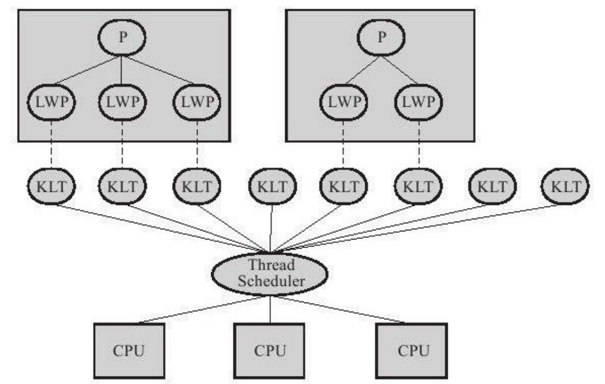
>

---

==问题三==：==堆和栈有啥区别？介ç»ä¸€ä¸‹==

==我的回答==：

> 1. 在==存储的内容==上，堆主è¦å­˜å‚¨ç¨‹åºè¿è¡Œæ—¶åˆ›å»ºçš„对象。而 ==java 虚拟机栈则存储当å‰çº¿ç¨‹ä¸‹æ–¹æ³•è°ƒç”¨æ‰€äº§ç”Ÿçš„栈帧，栈帧中包å«å±€éƒ¨å˜é‡è¡¨ï¼Œæ“作树以åŠè¿”回信æ¯==等。
> 2. 在==生命周期==上，==堆区的对象在失去 GC Roots 的引用åŽä¸ä¼šåˆ«ç«‹å³æ¸…除==，而是在触å‘垃圾回收时æ‰ä¼šä¸€å¹¶è¢«æ¸…ç†ã€‚而 ==java 虚拟机栈的栈帧一旦方法调用结æŸå°±ä¼šå‡ºæ ˆï¼Œå¹¶æ¸…除其å‚数和局部å˜é‡çš„引用==。
> 3. 在==内存分é…==上，堆区的对象主è¦é€šè¿‡ ==new 关键字动æ€åˆ†é…内存空间==。而 java 虚拟机栈中的==栈帧则是在方法调用时创建栈帧，压入虚拟机栈中==。
>

==å‚考答案==：

> - 主è¦æœ‰==存储内容，内存分é…和生命周期==三个方é¢çš„ä¸åŒã€‚
> - 存储内容方é¢ï¼Œ==Java 堆主è¦ç”¨äºŽå­˜å‚¨å¯¹è±¡å®žä¾‹å’Œæ•°ç»„==等动æ€åˆ†é…的内容。åŒæ—¶å †ä¸­åˆ†é…的内存==由垃圾回收器自动回收==，防止内存泄æ¼ï¼›==虚拟机主è¦ç”¨äºŽå­˜å‚¨æ–¹æ³•è°ƒç”¨æ—¶çš„方法信æ¯ï¼Œæ–¹æ³•è°ƒç”¨ä¸Šä¸‹æ–‡ç­‰ç­‰ã€‚è¿™å—内存的管ç†æ˜¯è‡ªåŠ¨è¿›è¡Œçš„，当方法调用结æŸæ—¶ï¼Œè™šæ‹Ÿæœºæ ˆä¸Šæœ‰å…³æ–¹æ³•çš„内存会被自动清除==。
> - 内存分é…æ–¹é¢ï¼ŒJava 堆主è¦ç”± JVM 动æ€åˆ†é…和管ç†ï¼Œ==对象实例一般通过 new 关键字==æ¥åœ¨å †ä¸­åˆ†é…内存。==虚拟机栈则是在方法调用时动æ€åˆ›å»ºæ ˆå¸§ï¼ŒåŽ‹å…¥æ ˆä¸­==。
> - 生命周期方é¢ï¼Œå¯¹è±¡åœ¨ Java 堆上分é…内存åŽï¼Œå…¶ç”Ÿå‘½å‘¨æœŸå¯ä»¥è´¯ç©¿æ•´ä¸ª Java 程åºçš„è¿è¡Œï¼Œè€Œ==虚拟机栈中的栈帧则å–决于方法何时调用和返回==。
>

---

==问题四==：==什么时候会出现堆栈溢出呢？如何排查？==

==我的回答==：

> 1. ==所谓堆栈溢出指的是 OOM 内存空间ä¸è¶³==。å‘生时机是新生代将对象转移到è€å¹´ä»£æ—¶ï¼Œè€å¹´ä»£å³ä½¿é€šè¿‡ Serial 进行全盘清ç†ä¹‹åŽä¾ç„¶æ”¾ä¸ä¸‹è¿™ä¸€éƒ¨åˆ†å¯¹è±¡æ—¶ï¼Œåˆ™ä¼šè§¦å‘ OOM 错误。
> 2. ==导致堆栈溢出的原因主è¦æ˜¯çŸ­æ—¶é—´åˆ›å»ºå¤§é‡å¯¹è±¡å®žä¾‹å¯¼è‡´å †ç©ºé—´ä¸è¶³==。如果是==程åºä¸Šæ­»å¾ªçŽ¯åˆ›å»ºå¤§é‡å¯¹è±¡==，则å¯ä»¥==æ ¹æ®æŽ§åˆ¶å°çš„堆栈信æ¯å®šä½åˆ°ç›¸åº”程åºä½ç½®==。如果是 ==JVM å‚æ•°ä¸åˆç†==导致对象ä¸èƒ½è¢«æœ‰æ•ˆå›žæ”¶ï¼Œåˆ™å¯ä»¥==扩大è€å¹´ä»£å’Œ Survivor 区大å°ï¼Œé‡‡ç”¨å†…存更大的机器，或集群部署多å°æœºå™¨è´Ÿè½½å‡è¡¡==。
>

==å‚考答案==：

> - ==堆溢出也就是内存溢出 OOM==，一般是由于==创建的对象太多，导致超过了堆的最大容é‡==。排查时å¯ä»¥é€šè¿‡==性能检测工具如 jconsole，获å–堆内存快照，然åŽè§‚察溢出的对象是å¦æ˜¯å¿…è¦çš„==，==是的è¯å°±éœ€è¦æ£€æŸ¥ä»£ç ä¸­å¯¹è±¡çš„生命周期是å¦è¿‡é•¿ï¼Œæˆ–者优化算法==，实在ä¸è¡Œå¯ä»¥==调整 JVM çš„å †å‚æ•°==设置 -Xmx å’Œ -Xms，增加 JVM 最大内存和å¯åŠ¨åˆå§‹å†…存；如果溢出的==对象ä¸æ˜¯å¿…è¦çš„，就表明å‘生了内存泄æ¼ï¼Œè¿™æ—¶å¯ä»¥æŸ¥çœ‹æ³„æ¼å¯¹è±¡çš„ GC Roots 引用链，找到具体泄æ¼çš„ä½ç½®==。
> - 如果是==虚拟机栈溢出，很å¯èƒ½å°±æ˜¯å­˜åœ¨æ­»å¾ªçŽ¯ï¼Œè¿‡å¤šçš„递归调用导致把栈撑满了==，此时å¯ä»¥ç›´æŽ¥==看控制å°çš„堆栈信æ¯ï¼Œæ¯”较容易定ä½==。
>

---

==问题五==：==对象一定是在堆在分é…çš„å—？==

==我的回答==：

> 1. ä¸ä¸€å®šã€‚==JVM 在进行编译期优化时å¯èƒ½å¯¹ java 虚拟机栈帧上的局部å˜é‡å¼•ç”¨è¿›è¡Œé€ƒé€¸åˆ†æž==。如果该==对象ä¸ä¼šè¢«å…¶å®ƒæ–¹æ³•æˆ–其它线程调用的è¯ï¼Œåˆ™ä¼šç›´æŽ¥åœ¨æ ˆä¸Šåˆ†é…==，å³å°†æ­¤å¯¹è±¡å®žä¾‹åˆ›å»ºåœ¨æ ˆåŒºè€Œä¸æ˜¯å †åŒºï¼Œè¿™æ ·åœ¨==方法调用结æŸæ—¶ï¼Œæ­¤å¯¹è±¡ä¼šéšç€æ ˆå¸§å‡ºæ ˆè€Œè¢«è‡ªåŠ¨é”€æ¯==，å‡è½»äº†åžƒåœ¾å›žæ”¶çº¿ç¨‹çš„压力。
>

==å‚考答案==：

> - ä¸ä¸€å®šï¼Œ==JVM 会通过 “逃逸分æžâ€ 技术，对于逃ä¸å‡ºæ–¹æ³•çš„对象，会直接在栈空间上分é…内存==。这样å¯ä»¥ç›´æŽ¥åœ¨æ ˆä¸Šå¿«é€Ÿåˆ›å»ºå’Œé”€æ¯å¯¹è±¡ï¼Œä¸ç”¨å†å°†å¯¹è±¡åˆ†é…到堆中，å‡è½» JVM 垃圾回收的压力。
> - 逃逸分æžæŠ€æœ¯å°±æ˜¯ç”¨æ¥åˆ¤æ–­å¯¹è±¡æ˜¯å¦é€ƒé€¸çš„技术。==对象逃逸分为方法逃逸和线程逃逸==。方法逃逸就是指，当一个对象在方法中被定义åŽï¼Œå®ƒè¢«å¤–部方法引用了，例如作为调用å‚数传递到其他方法中。线程逃逸是指一个对象被外部线程访问到了，比如赋值给å¯ä»¥åœ¨å…¶ä»–线程中访问的实例å˜é‡ã€‚
>

---

==问题六==：==常é‡æ± äº†è§£å—，有啥用？介ç»ä¸€ä¸‹==

==我的回答==：

> 1. 在 jdk8 åŠä»¥åŽçš„版本中，==常é‡æ± ä¸ºæ–¹æ³•åŒºä¸­çš„一部分==。其主è¦å­˜å‚¨åŸºæœ¬æ•°æ®ç±»åž‹å¸¸é‡ï¼Œä»¥åŠ String 类型常é‡ã€‚==其中 String 类型常é‡è¿˜åŒ…括类åã€å¯¹è±¡åã€æ–¹æ³•åã€å­—段å和它们的修饰符å（符å·å¼•ç”¨==）。
> 2. String 类型常é‡åœ¨å¸¸é‡æ± ä¸­çš„常é‡ç±»åž‹ä¸º ==CONSTANT_utf8_info，规定其在字节ç ä¸­é•¿åº¦ç”¨ä¸¤ä¸ªå­—节表示==，因此ç†è®ºä¸Š String 类型在编译期长度ä¸èƒ½è¶…过 $2^{16}-2$。
>

==å‚考答案==：

> - Java 8 以å‰å¸¸é‡æ± å­˜åœ¨äºŽ JVM 方法区的永久代中，==Java 8 åŠä»¥åŽå­˜åœ¨äºŽå…ƒç©ºé—´ä¸­==，它主è¦ç”¨æ¥å­˜å‚¨ç¼–译期生æˆçš„å„ç§å­—é¢é‡å’Œç¬¦å·å¼•ç”¨ç­‰ç­‰ã€‚而==这些字é¢é‡å¯ä»¥åœ¨ç¨‹åºè¿è¡Œæ—¶ç›´æŽ¥ä½¿ç”¨ï¼Œä¸éœ€è¦å†åˆ›å»º==，æ高è¿è¡Œæ•ˆçŽ‡ã€‚对于==符å·å¼•ç”¨ï¼Œå…¶ä¸­åŒ…括类的全é™å®šå，方法å等等==，主è¦ç”¨==在类加载，动æ€ç»‘定等阶段，æ¥å®šä½å…·ä½“的类，方法==等等。
>

---


### 5.ã€JVM专题】类加载相关🌟🌟🌟

==问题一==：==JAVA类加载过程介ç»ä¸€ä¸‹ï¼Ÿ==

==我的回答==：

> 1. Java 类加载分为5个阶段：加载，验è¯ï¼Œå‡†å¤‡ï¼Œè§£æžï¼Œåˆå§‹åŒ–。
> 2. 加载阶段==获å–字节ç ä¸Žæ­¤ç±»å¯¹åº”的二进制字节æµ==，并在方法区生æˆä¸€ä¸ª Class 对象，作为访问该类相关信æ¯çš„å…¥å£ã€‚
> 3. 验è¯é˜¶æ®µ==检验获å–的字节æµæ˜¯å¦ç¬¦åˆ JVM 规范，防止其对程åºé€ æˆå±å®³==。
> 4. 准备阶段==为类的é™æ€æˆå‘˜å˜é‡åœ¨æ–¹æ³•åŒºåˆ†é…内存空间，并对其进行默认åˆå§‹åŒ–==。
> 5. 解æžé˜¶æ®µ==将符å·å¼•ç”¨è½¬åŒ–为直接引用==。
> 6. åˆå§‹åŒ–阶段==执行类构造器 \<clinit>== 对类进行åˆå§‹åŒ–，==类构造器由类å˜é‡çš„显å¼åˆå§‹åŒ–å’Œé™æ€ä»£ç å—拼接而æˆ==。因此==é™æ€ä»£ç å—åªèƒ½è®¿é—®å®šä¹‰åœ¨å®ƒä¹‹å‰çš„ç±»å˜é‡==。==父类的类构造器总是在å­ç±»çš„类构造器之å‰è°ƒç”¨==。
>

==å‚考答案==：

- > Java 类加载分为三个阶段，第一个阶段是 “加载â€ï¼Œæ˜¯ç±»åŠ è½½è¿‡ç¨‹çš„起始点，在这个阶段，==虚拟机通过类的全é™å®šå找到对应的二进制字节ç ==。这个过程==主è¦æ˜¯ç”±ç±»åŠ è½½å™¨æ¥å®Œæˆ==的；第二个阶段是 “连接“，它åˆåŒ…括三个å­é˜¶æ®µï¼š==验è¯ï¼Œå‡†å¤‡å’Œè§£æž==。验è¯é˜¶æ®µï¼Œè™šæ‹Ÿæœºä¸»è¦ä¼šéªŒè¯åŠ è½½çš„字节ç ==是å¦ç¬¦åˆ JVM 规范，包括类的结构，语义等方é¢==。准备阶段，虚拟机会==为类的é™æ€å­—段分é…内存并设置默认值==。解æžé˜¶æ®µï¼Œè™šæ‹Ÿæœºä¼š==将符å·å¼•ç”¨è½¬æ¢ä¸ºç›´æŽ¥å¼•ç”¨ï¼Œè¿™æ ·è™šæ‹Ÿæœºå¯ä»¥ç›´æŽ¥å®šä½åˆ°ç›®æ ‡ç±»ï¼Œæ–¹æ³•==等等；第三个阶段是 â€åˆå§‹åŒ–“，这个阶段虚拟机主è¦ä¼š==执行类的åˆå§‹åŒ–代ç ==，之åŽå°±å®Œæˆäº†ç±»åŠ è½½è¿‡ç¨‹ã€‚

---

==问题二==：==åŒäº²å§”派原则了解å—？介ç»ä¸€ä¸‹==

==我的回答==：

> 1. 类加载器是分层级的，自顶å‘下ä¾æ¬¡æ˜¯==å¯åŠ¨ç±»åŠ è½½å™¨ï¼Œç”¨äºŽåŠ è½½ java lib 目录下的所有类==ï¼›==扩展类加载器，用于加载 lib/txt 下的类==ï¼›==应用程åºåŠ è½½å™¨ï¼Œç”¨äºŽåŠ è½½æˆ‘们写的 java 代ç ä¸­çš„ç±»==。而在==应用程åºåŠ è½½å™¨ä¹‹ä¸‹ï¼Œè¿˜æœ‰è‡ªå®šä¹‰ç±»åŠ è½½å™¨==。
> 2. åŒäº²å§”派机制则为下层的类加载器需è¦åŠ è½½æŸä¸ªç±»æ—¶ï¼Œ==先将该加载请求å‘给其父类加载器，以此类推，直到顶层的å¯åŠ¨ç±»åŠ è½½å™¨==。如果父类加载器å¯ä»¥åŠ è½½ï¼Œåˆ™ç”±çˆ¶ç±»è¿›è¡ŒåŠ è½½ï¼Œ==å¦åˆ™çˆ¶ç±»å‘ŠçŸ¥å­ç±»è‡ªå·±åŠ è½½ä¸äº†ï¼Œè¿™æ—¶æ‰ç”±å­ç±»è¿›è¡ŒåŠ è½½==。
>

==å‚考答案==：

> - åŒäº²å§”派模型是一ç§å±‚次化的类加载结构，从上往下ä¾æ¬¡ç”± BootStrapClassLoader，ExtClassLoader，AppClassLoader å’Œ 自定义的 ClassLoader æž„æˆã€‚其中 ==BootStrapClassLoader，由 C++ 编写，用æ¥åŠ è½½æ ¸å¿ƒåº“ Java==.ï¼›==ExtClassLoader 用æ¥åŠ è½½æ‰©å±•åº“ javax==.ï¼›==AppClassLoader 用æ¥åŠ è½½ç”¨æˆ·ç±»è·¯å¾„上的所有库==；最åŽ==自定义的 ClassLoader 用æ¥å®žçŽ°å®šåˆ¶åŒ–加载==。
> - 它的工作原ç†ä¸ºï¼š==当一个类加载器接收到类加载的请求时，它首先将这个请求委托给它的父加载器进行处ç†ï¼Œç›´åˆ°é¡¶å±‚çš„ BootStrapClassLoader 被委托为止==。如果父加载器å¯ä»¥æ‰¾åˆ°å¹¶åŠ è½½è¿™ä¸ªç±»ï¼Œé‚£ä¹ˆè¿™ä¸ªç±»åŠ è½½çš„请求就结æŸäº†ï¼Œ==å¦åˆ™ï¼Œå­åŠ è½½å™¨æ‰ä¼šå°è¯•åŠ è½½è¯¥ç±»ï¼Œä»¥æ­¤ç±»æŽ¨==。
>

---

==问题三==：==为什么需è¦åŒäº²å§”派？==

==我的回答==：

> 1. åŒäº²å§”派机制å¯ä»¥==ä¿è¯æ¯ä¸€ä¸ªç±»åªä¼šåŠ è½½ä¸€æ¬¡==。如果没有åŒäº²å§”派机制的è¯ï¼Œ==å‡è®¾åŒä¸€ä¸ªç±»å¯ä»¥è¢«ä¸¤ä¸ªç±»åŠ è½½å™¨åŠ è½½ï¼Œè€Œè¿™ä¸¤ä¸ªç±»åŠ è½½å™¨ä¹‹é—´æ²¡æœ‰æ²Ÿé€šï¼Œå› æ­¤å¯èƒ½ä¼šæŠŠè¿™ä¸ªç±»åŠ è½½ä¸¤æ¬¡==。而==如果这个类是 java 的核心类，其中用户自己实现了一个和核心类åŒå的类，å¯èƒ½å¯¼è‡´åº”用程åºç±»åŠ è½½å™¨ç”¨æˆ‘们自己写的类把å¯åŠ¨ç±»åŠ è½½å™¨ä¸­çš„加载到的核心类覆盖，致使整个系统无法正常è¿è¡Œ==。
>

==å‚考答案==：

> - è¿™ç§å§”派机制å¯ä»¥==ç¡®ä¿ Java 类的唯一性==，==é¿å…类的é‡å¤åŠ è½½==。åŒæ—¶è¿˜==ä¿è¯äº† Java 核心库的安全性和稳定性==。==因为Java核心库都是由 BootStrapClassLoader 加载的，任何用户自定义的类都无法覆盖核心类库中的类==。
>

---

==问题四==：==怎么打破åŒäº²å§”派模型？了解过å—？==

==我的回答==：

> 1. å¯ä»¥å®šä¹‰ä¸€ä¸ªç±»ç»§æ‰¿ java.lang.ClassLoader 类并é‡å†™å…¶ findClass 方法。这样就形æˆäº†ä¸€ä¸ªè‡ªå®šä¹‰ç±»åŠ è½½å™¨ã€‚==在 loadClass 方法中，如果请求父类加载器加载失败，则会我们自己的调用 findClass 方法==。
>
> 	```java
> 	protected Class<?> loadClass(String name, boolean resolve)
> 	    throws ClassNotFoundException
> 	{
> 	    synchronized (getClassLoadingLock(name)) {
> 	        // First, check if the class has already been loaded
> 	        Class<?> c = findLoadedClass(name);
> 	        if (c == null) {
> 	            long t0 = System.nanoTime();
> 	            try {
> 	                if (parent != null) {
> 	                    c = parent.loadClass(name, false); // 先委托父类加载器进行加载
> 	                } else {
> 	                    c = findBootstrapClassOrNull(name);
> 	                }
> 	            } catch (ClassNotFoundException e) {
> 	                // ClassNotFoundException thrown if class not found
> 	                // from the non-null parent class loader
> 	            }
> 		
> 	            if (c == null) {
> 	                // If still not found, then invoke findClass in order
> 	                // to find the class.
> 	                long t1 = System.nanoTime();
> 	                c = findClass(name); // 调用自己的 findClass 方法
> 		
> 	                // this is the defining class loader; record the stats
> 	                sun.misc.PerfCounter.getParentDelegationTime().addTime(t1 - t0);
> 	                sun.misc.PerfCounter.getFindClassTime().addElapsedTimeFrom(t1);
> 	                sun.misc.PerfCounter.getFindClasses().increment();
> 	            }
> 	        }
> 	        if (resolve) {
> 	            resolveClass(c);
> 	        }
> 	        return c;
> 	    }
> 	}
> 		
> 	protected Class<?> findClass(String name) throws ClassNotFoundException {
> 	    throw new ClassNotFoundException(name); // ä¸é‡å†™ä¼šç›´æŽ¥æŠ›å¼‚常，因此自定义时必须é‡å†™è¯¥æ–¹æ³•ï¼Œå¦åˆ™åœ¨çˆ¶ç±»åŠ è½½å™¨æ‰¾ä¸åˆ°è°ƒç”¨ findClass 方法时一定会报错
> 	}
> 	```

==å‚考答案==：

> - 打破åŒäº²å§”派模型的æ€è·¯å°±æ˜¯åœ¨åŠ è½½ç±»æ—¶ï¼Œä¸æŒ‰ç…§ä¾æ¬¡å¾€ä¸ŠåŒ¹é…类加载器的方å¼åŠ è½½ã€‚那么åªéœ€è¦==自定义一个 ClassLoader，然åŽé‡å†™ loadClass 方法，自己定义一个其他的加载方å¼å°±è¡Œ==。
> - 实际的应用中，==Tomcat 就破å了åŒäº²å§”派模型==。通常在用 Tomcat 部署 web 应用时，需è¦å°† war 包放在 webapp ç›®å½•ä¸‹ï¼Œç„¶åŽ Tomcat 就能è¿è¡Œè¿™ä¸ª web 应用了。现在==å‡è®¾æœ‰ä¸¤ä¸ª web 应用类，并且它们刚好都有一个全é™å®šå都相åŒçš„ user 类，但具体的实现ä¸ä¸€æ ·ã€‚如果按照åŒäº²å§”派模型的æ€è·¯ï¼Œæœ€ç»ˆåªæœ‰ä¸€ä¸ª user 能被加载，也就åªæœ‰ä¸€ä¸ª web 应用能部署æˆåŠŸ==。Tomcat 为了解决这个问题，它==ç»™æ¯ä¸ª Web 应用都创建了一个 WebAppClassLoader，该类加载器é‡å†™äº† loadClass 方法，优先加载当å‰åº”用目录下的类==，如果当å‰ç›®å½•æ‰¾ä¸åˆ°ï¼Œæ‰ä¼šä¸€å±‚一层往上找。这样的è¯ï¼Œ==Tomcat å°±åšåˆ°äº† Web 应用层级别的隔离==。
> - 还有比如 JDBC 也算是破å了åŒäº²å§”派模型，当我们使用 JDBC 时，是用 DriverManager.getConnection( ) æ¥èŽ·å–连接的，但由于 DriverManager 本身是属于 Java 包下的，是由 BootStrapClassLoader 加载的，而通过 getConnection 得到的是其它厂商的实现类，显然是ä¸èƒ½ç”± BootStrapClassLoader 加载。那么在这里就用到了 “线程上下文加载器â€ï¼ŒDriverManager 在åˆå§‹åŒ–时就会去得到线程上下文加载器，然åŽç”±å®ƒä»£æ›¿ BootStrapClassLoader æ¥åŠ è½½å…·ä½“çš„ Connection 类。
>

---


## 4.多线程和 Java 并å‘

### 1.ã€å¤šçº¿ç¨‹åŸºç¡€ä¸“题】关于线程安全 + é”的一些概念性问题（é‡è¦ï¼‰ðŸŒŸðŸŒŸðŸŒŸðŸŒŸðŸŒŸ

==问题一==：==你是怎么ç†è§£çº¿ç¨‹ä¸å®‰å…¨çš„？线程ä¸å®‰å…¨ä¼šå¸¦æ¥å“ªäº›é—®é¢˜ï¼Ÿ==（回答指导：采用ç»å…¸çš„ i++ æ¥å›žç­”ä¸å®‰å…¨ï¼Œè‡³äºŽå¸¦æ¥ä»€ä¹ˆé—®é¢˜ï¼Œå¦‚æžœå¯ä»¥è·ç¦»å®žé™…项目那最好了）

==我的回答==：

> 1. 线程安全问题指的是在==多个线程åŒæ—¶è®¿é—®å’Œæ“作共享数æ®==时造æˆæ•°æ®ç»“果出错和å‰åŽä¸ä¸€è‡´çš„情况。就拿在电商系统中用户购买商å“å‡å°‘库存æ¥ä¸¾ä¾‹ï¼Œè¿™ä¸ªè¿‡ç¨‹æ¶‰åŠçš„æ“作有：查询当å‰çš„库存，将该数æ®å‡å°‘，将å‡å°‘åŽçš„æ•°æ®å†™å›žåˆ°æ•°æ®åº“中。å‡è®¾æœ‰ä¸¤ä¸ªçº¿ç¨‹å¹¶å‘执行å‡åº“存这一æ“作，å¯èƒ½å‰ä¸€ä¸ªçº¿ç¨‹è¿˜æ²¡æ¥å¾—åŠå†™å›žæ•°æ®åº“，åŽä¸€ä¸ªçº¿ç¨‹è¯»å–库存时å‘现还有库存，也执行å‡åº“存的æ“作，就å¯èƒ½é€ æˆè¶…å–问题。
>

==å‚考答案==：

> - 线程ä¸å®‰å…¨å°±æ˜¯æŒ‡åœ¨å¤šçº¿ç¨‹çŽ¯å¢ƒä¸‹ï¼Œ==多个线程åŒæ—¶è®¿é—®å’Œä¿®æ”¹å…±äº«æ•°æ®==时，å¯èƒ½ä¼šæ•°æ®å‡ºçŽ°é”™è¯¯æˆ–者ä¸ä¸€è‡´çš„情况。比如多个线程åŒæ—¶å¯¹ä¸€ä¸ª int i å˜é‡è¿›è¡Œ i++ 时，会出现丢失更新。具体æ¥è¯´ï¼Œi++ å¯ä»¥åˆ†è§£ä¸ºä¸‰ä¸ªåŠ¨ä½œï¼šè¯»å–当å‰å€¼ã€å¯¹è¯¥å€¼åŠ 1ã€å°†è¯¥å€¼å†™å›žã€‚è¿™å¯èƒ½ä¼šå¯¼è‡´å¤šä¸ªçº¿ç¨‹åŒæ—¶è¯»åˆ°ç›¸åŒçš„值并对其加 1，导致最终结果一共åªå¢žåŠ  1，而ä¸æ˜¯æ¯ä¸ªçº¿ç¨‹éƒ½åŠ  1。åŒæ—¶ç”±äºŽçº¿ç¨‹ä¹‹é—´çš„执行顺åºæ˜¯ä¸ç¡®å®šçš„，æ¯æ¬¡è¿è¡Œæ—¶éƒ½å¯èƒ½ä¼šå¾—到ä¸åŒçš„结果，使程åºå…·æœ‰ä¸ç¡®å®šæ€§ã€‚
> - 项目中有一个用户å¯ä»¥å¯¹æŸä¸ªä¸“æ ç‚¹èµžçš„功能，多个用户åŒæ—¶è¿›è¡Œç‚¹èµžçš„过程就类似==点赞数é‡++ 的过程，å¯èƒ½ä¼šå‡ºçŽ° “点赞被åžâ€ 的情况==。这时å¯ä»¥å¯¹ “点赞†的æ“作加é”，也å¯ä»¥ç›´æŽ¥==使用 Java 并å‘包æ供的原å­æ›´æ–°ç±» atomicInteger 类，底层使用 CAS 完æˆè‡ªå¢žæ“作==，效率高。
>

---

==问题二==：==多线程环境下，我们å¯ä»¥æ€Žä¹ˆè§£å†³çº¿ç¨‹ä¸å®‰å…¨çš„问题？==

==我的回答==：

> 1. 首先æ¥è¯´ä¸€ä¸‹äº§ç”Ÿçº¿ç¨‹å®‰å…¨é—®é¢˜çš„几个原因：
> 2. ==缓存带æ¥çš„ä¸å¯è§é—®é¢˜==。比如线程 A 和线程 B 都从共享数æ®ä¸­è¯»å–，然åŽæŠŠå…¶å‚¨å­˜åˆ°è‡ªå·±çš„ CPU 缓存中，然åŽéƒ½å¯¹å…¶æ‰§è¡Œ++æ“作，由于ä¸å¯è§å…¶å®ƒ CPU 的缓存数æ®ï¼Œæœ€åŽå†™å›žæ—¶æœ¬æ¥åº”该+2，结果åªåŠ 1。==å¯ä»¥ä½¿ç”¨ volatile 关键字，使得被修饰的对象无法在 CPU 缓存中被使用==。
> 3. ==线程切æ¢å¸¦æ¥çš„原å­æ€§é—®é¢˜==。还是上é¢å“ªä¸ªä¾‹å­ï¼Œæœ¬æ¥æ•´ä¸ªè¯»å–，值+1，写回æ“作应该时具有原å­æ€§çš„，但是由于线程切æ¢çš„缘故，å¯èƒ½åœ¨ä»»æ„一æ¡æŒ‡ä»¤ç»“æŸåŽåˆ‡æ¢åˆ°å¦ä¸€ä¸ªçº¿ç¨‹ï¼Œä»Žè€Œå¯¼è‡´å¦ä¸€ä¸ªçº¿ç¨‹è¯»åˆ°çš„也是旧数æ®ï¼Œé€ æˆä¸€è‡´æ€§é—®é¢˜ã€‚==å¯ä»¥ä½¿ç”¨ synchronized 给数æ®åŠ é”，从而赋予增值æ“作原å­æ€§==。
> 4. ==编译优化带æ¥çš„有åºæ€§é—®é¢˜==。编译器为了优化性能，å¯èƒ½ä¼šæ”¹å˜æŸäº›è¯­å¥çš„顺åºã€‚比如创建对象的newæ“作中，应该先åˆå§‹åŒ–对象，å†æŠŠåœ°å€èµ‹ç»™å®žä¾‹å¯¹è±¡ï¼›ä½†æ˜¯å¦‚æžœå过æ¥ï¼Œå°±å¯èƒ½å‡ºçŽ°å®žä¾‹å¯¹è±¡å·²ç»æœ‰åœ°å€ï¼Œä½†æ˜¯å¯¹è±¡æ²¡æœ‰åˆ›å»ºï¼Œä»Žè€Œå¯¼è‡´ç©ºæŒ‡é’ˆå¼‚常。å¯ä»¥==使用 final 关键字修饰，表示此å˜é‡ä¸å˜ï¼Œå¯éšæ„优化==。
>

==å‚考答案==：

> - 最先想到的是å¯ä»¥ç”¨ ==synchronized 关键字==为方法或者代ç å—加é”，ä¿è¯åŒä¸€æ—¶åˆ»åªæœ‰ä¸€ä¸ªçº¿ç¨‹å¯ä»¥è®¿é—®å…±äº«èµ„æºã€‚还å¯ä½¿ç”¨==volatile，它是轻é‡çº§çš„ synchronized，能够ä¿è¯æ‰€ä¿®é¥°å˜é‡çš„å¯è§æ€§å’Œæœ‰åºæ€§==。
> - 除了这两个关键字，JDK 还æ供了一些线程安全的数æ®ç»“构，如 ==ConcurrentHashMap，ConcurrentLinkedQueue== 等等，å¯ä»¥ç›´æŽ¥ä½¿ç”¨ã€‚还有并å‘包下的原å­æ“作类 ==atomicInteger 类等，并å‘工具类 CountDownLatch，Semaphore ç±»==等等，都å¯ä»¥è¾…助我们实现线程安全。
>

---

==问题三==：==刚æ‰è¯´åˆ°äº†é”，那你觉得é”怎是么实现线程安全？（回答指导：这个得从æ“作系统角度回答了）==

==我的回答==：

> 1. 在线程å°è¯•è®¿é—®å¹¶æ“作共享数æ®å‰ï¼Œå¿…须先å°è¯•èŽ·å–é”，获å–到é”之åŽè¿›å…¥ä¸´ç•ŒåŒºï¼Œå¹¶åœ¨å®Œæˆæ“作之åŽé‡Šæ”¾è¯¥å…±äº«æ•°æ®çš„é”，退出临界区。
> 2. 在 Java 中 synchronized 关键字和上述的逻辑很类似。==被 synchronized 修饰的代ç å—会在编译的代ç å‰åŽåˆ†åˆ«æ·»åŠ  monitorenter å’Œ monitorexit 指令==。JVM ç¡®ä¿è¢« synchronized é”定的对象都会对应一个 monitor，当线程执行到 monitorenter 时会å°è¯•èŽ·å–当å‰çš„ monitor 对象，也就是加é”æ“作。åŒæ ·çš„，执行到 monitorexit 指令时会释放这个 monitor，也就是解é”æ“作。
>

==å‚考答案==：

> - 一个简å•çš„é”模型是，==在临界区代ç å‰åŽåˆ†åˆ«åŠ ä¸ŠåŠ é”和解é”çš„æ“作==。线程在进入临界区之å‰ä¼šå…ˆå°è¯•åŠ é”，如果æˆåŠŸåˆ™è¿›å…¥ä¸´ç•ŒåŒºï¼Œæ­¤æ—¶è¿™ä¸ªçº¿ç¨‹æŒæœ‰é”。å¦åˆ™å½“å‰çº¿ç¨‹ç­‰å¾…，指导æŒæœ‰é”的线程执行完临界区的代ç åŽè§£é”。
> - Java 中的 synchronized 实现就跟这个æ€è·¯ç±»ä¼¼ï¼Œå®ƒæ˜¯==在编译åŽçš„代ç å‰åŽåˆ†åˆ«æ·»åŠ  monitorenter å’Œ monitorexit 指令==，JVM ç¡®ä¿æŸä¸ªå¯¹è±¡éƒ½ä¼šå¯¹åº”一个 monitor，当线程执行到 monitorenter 时会å°è¯•èŽ·å–当å‰çš„ monitor 对象，也就是加é”æ“作。åŒæ ·çš„，执行到 monitorexit 指令时会释放这个 monitor，也就是解é”æ“作。
>

---

==问题四==：==刚æ‰æˆ‘们说到了é”，ä¹è§‚é”和悲观é”了解å—？å¯ä»¥è¯´ä¸€è¯´ä»–们的区别å—？==

==我的回答==：

> 1. ==悲观é”认为åªè¦è¿›è¡Œå¹¶å‘æ“作就一定会产生并å‘问题==，因此严格é™åˆ¶å¤šçº¿ç¨‹å¯¹äºŽå…±äº«æ•°æ®çš„访问。在线程å°è¯•è®¿é—®æˆ–æ“作共享数æ®å‰éƒ½å¿…é¡»è¦èŽ·å–é”，并在æ“作结æŸåŽé‡Šæ”¾é”。这其实是一ç§å°†å¹¶å‘æ“作é™ä¸ºä¸²è¡Œæ“作的方法，虽然安全性高，但是性能æŸè€—较大。synchronized 关键字就是一ç§æ‚²è§‚é”。
> 2. ==ä¹è§‚é”则认为进行并å‘æ“作也ä¸ä¸€å®šä¼šäº§ç”Ÿå¹¶å‘问题==，因此无需对共享数æ®åŠ é”，åªéœ€è¦åœ¨æ交数æ®çš„æ›´æ–°å‰åˆ¤æ–­æ˜¯å¦æœ‰å…¶å®ƒçº¿ç¨‹çº¿ç¨‹æ­£åœ¨ä¿®æ”¹æ•°æ®ã€‚如果是则å¯ä»¥å›žæ»šé‡è¯•ï¼Œå¹¶å¯ä»¥è®¾ç½®æœ€å¤§é‡è¯•æ¬¡æ•°é˜²æ­¢çº¿ç¨‹å¤§é‡æ¶ˆè€— CPU 资æºï¼Œå¦åˆ™å°±ç›´æŽ¥æ交。
>

==å‚考答案==：

> - ä¹è§‚é”在==读å–æ•°æ®æ—¶å¹¶ä¸ä¼šå¯¹æ•°æ®è¿›è¡ŒåŠ é”==，而是在==æ交更新时检查是å¦æœ‰å…¶ä»–线程对数æ®è¿›è¡Œäº†ä¿®æ”¹==。如果没有å‘生冲çªï¼Œé‚£ä¹ˆæ›´æ–°æˆåŠŸï¼Œå¦åˆ™å°±è¦é‡‡å–一些冲çªè§£å†³ç­–略，比如==回滚或或者é‡è¯•==。
> - 悲观é”则是一ç§æ¯”较ä¿å®ˆçš„策略，它在访问数æ®ä¹‹å‰ï¼Œä¼šå…ˆå¯¹èµ„æºè¿›è¡ŒåŠ é”，==ç¡®ä¿å…¶ä»–线程无法åŒæ—¶è®¿é—®==，必须等待é”释放åŽæ‰èƒ½ç»§ç»­æ‰§è¡Œã€‚
>

---

==问题五==：==Java 中有些是基于ä¹è§‚é”实现的，有些是基于悲观é”实现的，你了解到的有哪些呢？==

==我的回答==：

> 1. 悲观é”有 ==synchronized== 关键字，它å¯ä»¥å¯¹æŸä¸€ä¸ªå¯¹è±¡ä¸Šé”，线程在访问其修饰的代ç å—之å‰å¿…é¡»å°è¯•èŽ·å–该对象上的é”。此外还有 ==ReetrantLock 对象==，它相比 synchronized 更加çµæ´»ï¼Œå¯ä»¥==手动地 lock å’Œ unlock==。
> 2. ä¹è§‚é”一般使用 ==CAS 机制==实现，代表有 AtomicInteger 类，其底层使用 CAS 机制实现并å‘控制。
>

==å‚考答案==：

> - 并å‘包下的原å­æ›´æ–°ç±»æ¯”如 ==AtomicInteger 类就是典型的ä¹è§‚é”，底层使用 CAS æ“作实现==。
> - 悲观é”有 synchronized，整个方法或代ç å—加é”ï¼›==ReetrantLock，比 synchronized 更加çµæ´»ï¼Œå¯æ‰‹åŠ¨æŽ§åˆ¶åŠ é”和解é”的过程==ï¼›==ReetrantReadWriteLock，å…许多个线程åŒæ—¶è¯»ï¼Œä½†åªå…许一个线程写==。
>

---

==问题六==：==æ­»é”了解å—？å¯ä»¥ç®€å•è¯´ä¸‹æ­»é”以åŠæ€Žä¹ˆè§£å†³æ­»é”问题的ä¸ï¼Ÿ==

==我的回答==：

> 1. ==两个线程æŒæœ‰å¯¹æ–¹æƒ³è¦èŽ·å–çš„é”，åˆå°è¯•èŽ·å–对方请求的é”，这样就会导致这两个线程都一直处于获å–ä¸åˆ°é”的阻塞状æ€==，这就出现了死é”。
> 2. ç ´åæ­»é”产生的“==å æœ‰ä¸”等待==æ¡ä»¶â€ï¼Œä½¿ç”¨==一次获å–所有资æºçš„方法==。åªè¦ä¸€ä¸ªçº¿ç¨‹ä¸€æ¬¡æ€§èŽ·å–所有所需的共享资æºçš„é”，就ä¸è¦æ‹…心自己会被其它线程æŒæœ‰çš„é”阻塞。
> 3. ç ´åæ­»é”产生的“==ä¸å¯æŠ¢å ==æ¡ä»¶â€ã€‚==如果一个线程长时间获å–ä¸åˆ°æ‰€éœ€çš„é”资æºï¼Œå°±é‡Šæ”¾è‡ªå·±çš„é”资æº==。
> 4. ç ´åæ­»é”产生的“==循环等待==æ¡ä»¶â€ï¼Œ==把多个线程所需获å–的多个é”资æºæŽ’åºï¼Œè¦æ±‚这些线程必须顺åºèŽ·å–这些é”资æº==。这样就é¿å…出现线程 T1 等待线程 T2 å æœ‰çš„资æºï¼Œçº¿ç¨‹ T2 等待线程 T1 å æœ‰çš„资æºçš„情况。
>

==å‚考答案==：

> - æ­»é”就是：==一组互相竞争资æºçš„线程因互相等待，导致永久阻塞的现象==。
> - æ­»é”出现时一定会满足==四个æ¡ä»¶==：第一个是==互斥==，å³å…±äº«èµ„æºåªèƒ½è¢«ä¸€ä¸ªçº¿ç¨‹å ç”¨ï¼›ç¬¬äºŒä¸ªæ˜¯==å æœ‰ä¸”等待==，å³==线程在æŒæœ‰ä¸€ä¸ªå…±äº«èµ„æºï¼Œå¹¶ç­‰å¾…å¦ä¸€ä¸ªå…±äº«èµ„æºæ—¶ï¼Œä¸ä¼šé‡Šæ”¾å½“å‰çš„共享资æº==；第三个是==ä¸å¯æŠ¢å ==，å³ä»»ä½•çº¿ç¨‹ä¸èƒ½æŠ¢å å…¶ä»–线程的共享资æºï¼›ç¬¬å››ä¸ªæ˜¯==环路等待==，最终形æˆæ­»é”时，å„个线程会形æˆä¸€ä¸ªè¿›ç¨‹åˆ°èµ„æºçš„环形链。
> - 因为é”一定是互斥的，所以解决死é”åªéœ€ç ´å以上åŽä¸‰ä¸ªæ¡ä»¶ä»»æ„一个å³å¯ã€‚对于==å æœ‰ä¸”等待，å¯ä»¥è®©çº¿ç¨‹åŠ é”时一次性申请所有的资æº==，这样就ä¸å­˜åœ¨çº¿ç¨‹ç­‰å¾…了。对于==ä¸å¯æŠ¢å ï¼Œå¯ä»¥è®©çº¿ç¨‹èŽ·å–ä¸åˆ°èµ„æºæ—¶ï¼Œä¸»åŠ¨é‡Šæ”¾å½“å‰å·²ç»å æœ‰çš„资æº==。对于==环路等待，å¯ä»¥å¯¹èµ„æºè¿›è¡ŒæŒ‰åºç”³è¯·==。也就是说，线程在申请资æºæ—¶ä¼˜å…ˆç”³è¯·åºå·å°çš„，å†ç”³è¯·åºå·å¤§çš„，这样就ä¸ä¼šå­˜åœ¨ç­‰å¾…环路了。
>

---

==问题七==：==Java里é¢çš„线程和æ“作系统的线程一样å—？比如我在Java中创建了一个线程，那么æ“作系统也会创建一个线程å—？==

==我的回答==：

> 1. ==Java 的线程和æ“作系统的线程是åŒä¸€ä¸ªå«ä¹‰==。进程是存储应用程åºçš„一个容器，而其中的众多线程æ‰æ˜¯æ‰§è¡Œåº”用程åºçš„å•ä½ã€‚
>

==å‚考答案==：

> - JDK 1.2 以å‰é‡‡ç”¨çš„是绿色线程，由 JVM 管ç†å’Œè°ƒåº¦ï¼Œå‘生在æ“作系统的用户空间。这对æ“作系统是é€æ˜Žçš„，æ“作系统åªèƒ½çœ‹åˆ°è¿›ç¨‹ï¼Œè€Œä¸èƒ½çœ‹åˆ°å…¶ä¸­çš„线程。
> - è¿™ç§æ¨¡å¼çš„缺点为，因为æ“作系统ä¸çŸ¥é“线程的存在，CPU 的时间片是以进程为调度的，如果进程中的æŸä¸ªçº¿ç¨‹é˜»å¡žï¼Œåˆ™ä¼šå¯¼è‡´æ•´ä¸ªè¿›ç¨‹æŠ˜å°„。优点也很明显，å¯ä»¥åœ¨ä¸æ”¯æŒå¤šçº¿ç¨‹çš„æ“作系统上实现多线程，并且线程切æ¢åªéœ€åœ¨ç”¨æˆ·æ€å°±å¯ä»¥å®žçŽ°ï¼Œå…去了用户æ€åˆ°å†…æ ¸æ€çš„æ¥å›žåˆ‡æ¢ã€‚
> - JDK 1.2 ä»¥åŽ Java 线程就是直接ä¾èµ–æ“作系统实现的，是 1:1 的关系。也就是说 Java 中的线程，实质上就是æ“作系统中的线程。
> - 因此，就目å‰æ¥çœ‹ï¼Œ==在 Java 中创建了一个线程，æ“作系统也会创建一个线程，是对的==。
>

---


### 2.ã€å¤šçº¿ç¨‹åŸºç¡€ä¸“题】关于Java线程的一些关键字问题🌟🌟🌟

==问题一==：==在 Java 中，一个线程的生命周期有哪些？==

==我的回答==：

> 1. 首先线程==åˆšåˆšè¢«åˆ›å»ºï¼Œè€Œæ²¡æœ‰åˆ†é… CPU 资æº==的时候，处于==åˆå§‹çŠ¶æ€ï¼ˆNew）==。这时åªæ˜¯åœ¨ç¼–程语言层é¢è¢«åˆ›å»ºï¼Œå¹¶æ²¡æœ‰åœ¨æ“作系统层é¢åˆ›å»ºæ–°çº¿ç¨‹ã€‚
> 2. éšåŽæ“作系统为刚刚创建的线程==åˆ†é… CPU 资æº==åŽè¿›å…¥==å¯è¿è¡ŒçŠ¶æ€ï¼ˆRunnable）==，并开始è¿è¡Œã€‚
> 3. 如果线程在==等待 synchronized çš„éšå¼é”==，那么就会进入==阻塞状æ€ï¼ˆBlocked）==，而获å–到 synchronized çš„éšå¼é”åŽå°±ä¼šé‡æ–°å›žåˆ° Runnable 状æ€ã€‚
> 4. ==获å–到 synchronized éšå¼é”的线程调用 Object.wait== 方法，或者线程==调用其它线程的 Thread.join 方法==，让其它线程æ’队时，都会进入==æ— æ—¶é™ç­‰å¾…状æ€ï¼ˆWAITING）==，被其它线程 notify 唤醒åŽæ‰ä¼šé‡å›ž Runnable 状æ€ã€‚
> 5. 调用带å‚æ•°çš„ wait 或 join 或 sleep 方法则会进入==有时é™ç­‰å¾…状æ€ï¼ˆTIMED_WAITING）==。
> 6. 最åŽ==终止状æ€ï¼ˆTerminated）==，当 run 方法执行完毕，或者使用 ==iterrupted 方法==æ醒线程需è¦ç»ˆæ­¢ï¼Œç”±çº¿ç¨‹ä½¿ç”¨å¼‚常机制或者自行检测自身是å¦è¢« iterrupted åŽæ‰§è¡Œè‡ªå®šçš„代ç åŽç»“æŸçº¿ç¨‹ã€‚
>

==å‚考答案==：

> - 大致有六ç§ï¼Œæˆ‘串起æ¥è¯´ä¸€ä¸‹ï¼šå½“一个==线程对象被创建时，它会处于创建状æ€==。当调用线程的 ==start( ) åŽï¼Œçº¿ç¨‹è¿›å…¥å°±ç»ªçŠ¶æ€==，此时线程还没有真正的执行，需è¦==ç­‰å¾…åˆ†é… CPU 时间片==，åªåŽæ‰ä¼šè¿›å…¥çœŸæ­£çš„è¿è¡ŒçŠ¶æ€ï¼Œå¼€å§‹æ‰§è¡Œ run( ) 中的代ç ã€‚
> - 在线程è¿è¡Œæ—¶ï¼Œå¯èƒ½ä¼šå› ä¸ºéœ€è¦==等待é”的释放等而进入阻塞状æ€==。或者会==调用自身的 wait( ) 和其它线程的 join( ) 进入等待状æ€==。
> - 最åŽçº¿ç¨‹æ­£å¸¸æ‰§è¡Œå®Œï¼Œæˆ–者==å‘生了未æ•èŽ·çš„异常，会进入终止状æ€==，结æŸã€‚
>

---

==问题二==：==在 Java 的中，创建线程的方å¼æœ‰å“ªäº›ï¼Ÿ==（一定è¦è‡ªå·±ä¼šåˆ›å»ºï¼Œå› ä¸ºæœ‰æ—¶å€™ä¼šé‡åˆ°é¢è¯•å®˜è®©ä½ åˆ›å»ºä¸€ä¸ªçº¿ç¨‹ï¼‰

==我的回答==：

> 1. 创建一个类继承 Thread 类，é‡å†™å…¶ run 方法。
> 2. 或者实现 Runnable 接å£ï¼Œå®žçŽ°å…¶ run 方法。
> 3. 实现 Callable 接å£ï¼Œå’Œ Runnable 接å£ä¸åŒçš„是，==Callable çš„ call 方法是有返回å‚æ•°çš„==，å¯ä»¥é€šè¿‡==å°† Callable ä¼ å…¥ `FutureTask(Callable)`==，==`new Thread(FutureTask).start`å¼€å¯çº¿ç¨‹==，并==æ ¹æ® `futureTask.isDone`判断线程是å¦æ‰§è¡Œå®Œæ¯•==，以åŠ==`futureTask.get`èŽ·å– Callable 的返回值==。
>

==å‚考答案==：

> - Java 中一共有三ç§æ–¹å¼åˆ›å»ºä¸€ä¸ªçº¿ç¨‹ï¼š
> - 第一ç§ä¹Ÿæ˜¯æœ€å¸¸è§çš„一ç§å°±æ˜¯é€šè¿‡å®žçŽ° Runnable 接å£ï¼Œè¦†å†™å…¶ä¸­çš„ run( )。
> - 第二ç§æ˜¯ç»§æ‰¿ Thread 类，Thread 类本身就实现了 Runnable 接å£ï¼Œæ‰€ä»¥ä¹Ÿåªéœ€è¦†å†™ run 方法å³å¯ã€‚
> - 第三ç§æ˜¯å®žçŽ° Callable 接å£ï¼Œå®ƒä¸Ž Runnale 的区别在于 ==Callable 为线程的执行æ供了一个返回值 FutureTask ç±»==，å¯ä»¥==使用这个 FutureTask 类的 get 等方法查询这个线程是å¦æ‰§è¡Œå®Œæ¯•==。
>

---

==问题三==：==你觉得Thread类和Runable接å£çš„最大区别是什么？==

==我的回答==：

> 1. Thread 类是一个类，而 Runnable 是一个接å£ã€‚在 Java 中åªèƒ½è¿›è¡Œå•ç»§æ‰¿ï¼Œä½†æ˜¯å¯ä»¥åŒæ—¶å®žçŽ°å¤šä¸ªæŽ¥å£ã€‚如果选择继承 Thread 类的è¯ï¼Œè™½ç„¶åªé‡å†™äº† run 方法，但是也无法在继承其它类，这é™ä½Žäº†ä»£ç çš„çµæ´»æ€§ï¼Œå› æ­¤åˆ›å»ºçº¿ç¨‹ä¸€èˆ¬é€‰æ‹©å®žçŽ° Runnable 接å£ï¼Œç„¶åŽä¼ ç»™ Thread 类。
>

==å‚考答案==：

> - Runnable 是一个接å£ï¼ŒThread 是一个实现了 Runnable 接å£çš„类。按照 Java 中的å•ç»§æ‰¿ã€å¤šå®žçŽ°çš„特性，==如果使用继承 Thread ç±»æ¥åˆ›å»ºè¿›ç¨‹ï¼Œåˆ™æ— æ³•å†ç»§æ‰¿å…¶ä»–类，会é™ä½Žä»£ç çš„çµæ´»æ€§==。这时用实现 Runnable 接å£æ¯”较好。
>

---

==问题四==：==说一说run() 方法和 start() 的区别？==（PS：最好自己点进去æºç ï¼Œçœ‹çœ‹ä»–们的区别）

==我的回答==：

> 1. run 方法åªæ˜¯ Runnable 接å£å’Œ Thread 类中的一个普通的方法，如果直接调用 run 方法并ä¸ä¼šåˆ›å»ºçº¿ç¨‹ï¼Œè€Œæ˜¯åœ¨å½“å‰çš„线程中执行这个 run 方法。而åªæœ‰è°ƒç”¨ start 方法，æ‰ä¼šåˆ›å»ºä¸€ä¸ªçº¿ç¨‹ï¼Œåœ¨æ–°åˆ›å»ºçš„线程中执行 run 方法。从æºç æ¥çœ‹ï¼Œæ˜¯ start 方法中的 start0 方法执行创建新线程的任务，start0 是一个 native 方法，用于创建线程。
>

==å‚考答案==：

> - Thread çš„ run( ) åªæ˜¯åœ¨ä¸»çº¿ç¨‹ä¸­çš„一个==普通方法调用==，而 start( ) 则会创建一个新的å­çº¿ç¨‹æ¥æ‰§è¡Œï¼Œå®ƒåº•å±‚使用 native 方法实现的，用æ¥å¼€å¯ä¸€ä¸ªæ–°çº¿ç¨‹å¹¶æ‰§è¡Œè‡ªå·±å®šä¹‰çš„ run 方法。
>

---

==问题五==：==说一说 wait和sleep的区别？==

==我的回答==：

> 1. ==sleep 是 Thread 类的方法==，å¯ä»¥åœ¨==ä»»æ„ä½ç½®ä½¿ç”¨==，使用åŽçº¿ç¨‹è¿›å…¥ ==WAITING== 状æ€ï¼Œæ­¤æ—¶çº¿ç¨‹å¹¶==ä¸ä¼šé‡Šæ”¾è‡ªå·±çš„åŒæ­¥èµ„æºé”==（比如 synchronized 对共享资æºçš„é”）在 ==sleep 结æŸåŽçº¿ç¨‹ä¼šç»§ç»­æ‰§è¡Œ==。
> 2. 而 ==wait 是 Object 类的方法==，==åªèƒ½åœ¨åŒæ­¥å—中进行调用==，调用åŽçº¿ç¨‹è¿›å…¥ ==BLOCKED== 状æ€ï¼Œæ­¤æ—¶çº¿ç¨‹==会释放自己的åŒæ­¥èµ„æºé”==，并加入等待队列，==被 notify 唤醒åŽä¼šé‡æ–°å°è¯•èŽ·å–åŒæ­¥èµ„æºé”==。
>

==å‚考答案==：

> - sleep( ) 是 Thread 类的方法，wait( ) 是 Object 类的方法。
> - ==sleep( ) å¯ä»¥åœ¨ä»»ä½•åœ°æ–¹ä½¿ç”¨ï¼Œwait( ) 则åªèƒ½åœ¨åŒæ­¥æ–¹æ³•æˆ–åŒæ­¥å—中使用==，并且 ==sleep( ) åªæ˜¯è®©å‡ºäº† CPU，并没有释放åŒæ­¥èµ„æºé”==，sleep 结æŸä¹‹åŽä¼šç»§ç»­æ‰§è¡Œã€‚
> - 而 ==wait( ) 则是让当å‰çº¿ç¨‹é€€å‡ºåŒæ­¥èµ„æºé”==，==进入等待队列==，让其他正在等待这个é”的线程争夺资æºå¹¶è¿è¡Œã€‚在这之åŽï¼Œåªæœ‰è°ƒç”¨äº† notify( ) / notifyAll( ) 唤醒这个线程，它æ‰ä¼šè¿›å…¥é”池，并加入到==争夺资æº==的过程中。
>

---

==问题六==：==说一说 notify å’Œ notifyAll 的区别以åŠä½¿ç”¨åœºæ™¯ï¼Ÿ==

==我的回答==：

> 1. notify 会éšæœºå”¤é†’一个处于等待队列中的线程，而 notifyAll 则是唤醒所有等待队列中的线程，让它们自行争夺æ¡ä»¶å˜é‡èµ„æºã€‚
> 2. notify 存在的问题是，由于==唤醒的线程是éšæœºçš„，因此有些线程å¯èƒ½æ°¸è¿œä¸ä¼šè¢«å”¤é†’==。
> 3. notify 还有一个问题是å¯èƒ½==éšæœºå”¤é†’的线程ä¾ç„¶å¾—ä¸åˆ°æ‰€éœ€çš„æ¡ä»¶å˜é‡==，这是因为我们的逻辑是åªè¦æŸä¸€ä¸ªæ¡ä»¶å˜é‡è¢«é‡Šæ”¾ï¼Œåˆ™è°ƒç”¨ notify éšæœºå”¤é†’一个线程，但是==这个线程所需è¦çš„资æºå¯èƒ½ä¸å¯¹å£ï¼Œå°±å¯¼è‡´çœŸæ­£éœ€è¦è¿™ä¸ªèµ„æºçš„线程没有被唤醒==，造æˆèµ„æºçš„浪费，性能的æŸè€—。
> 4. å› æ­¤==一般æ¡ä»¶ä¸‹å°½é‡ notifyAll==，除éžæ‰€æœ‰åœ¨ç­‰å¾…队列中的线程所需è¦çš„æ¡ä»¶å˜é‡èµ„æºç›¸åŒï¼Œå¹¶ä¸”åŽåºçš„æ“作也相åŒæ‰è€ƒè™‘å¯ä»¥ä½¿ç”¨ notify。
>

==å‚考答案==：

> - notify( ) 会éšæœºå”¤é†’一个处于等待池中的线程，进入é”池去竞争获å–é”的机会。
> - notifyAll( ) 会唤醒所有处于等待池中的线程，一起进入é”池去竞争获å–é”的机会。
> - 在生产-消费模型中，==生产者生产出消æ¯æ—¶ï¼Œå¯ä»¥è°ƒç”¨ notify( ) 通知消费者消费==。当==多个线程需è¦éƒ½æ»¡è¶³æŸä¸ªæ¡ä»¶æ‰èƒ½å…±åŒè¿è¡Œæ—¶ï¼Œå¯ä»¥ä½¿ç”¨ notifyAll( )== 唤醒所有等待线程，åŒæ—¶æ‰§è¡Œä»»åŠ¡ã€‚
>

---


### 3.ã€å¹¶å‘专题】CAS 连环炮🌟🌟🌟🌟🌟

==问题一==：==简å•ä»‹ç»ä¸€ä¸‹ CAS，什么是 CAS ？==

==我的回答==：

> 1. CAS 是实现ä¹è§‚é”进行并å‘控制的一ç§ç®—法，是 ==compareAndSwap== 的缩写。
>
> 2. 该算法包括三个å˜é‡ï¼Œåˆ†åˆ«æ˜¯ value，expectedValue，newValue，其中 value 是需è¦è¿›è¡Œå¹¶å‘控制的å˜é‡ï¼Œè€Œ expectedValue 表示进行 swap æ“作（更新 value 的值）å‰æ‰€æœŸæœ› value 的值。
>
> 3. ==如果 `value == expectedValue`，则å¯ä»¥è¿›è¡Œ swap æ“作==，å¦åˆ™è¯´æ˜Žæœ‰å…¶å®ƒçº¿ç¨‹æ­£åœ¨å¹¶å‘æ“作 value å˜é‡ï¼Œå› æ­¤å½“å‰çº¿ç¨‹æ“作失败，å¯ä»¥è‡ªè¡Œå†³å®šåŽç»­æ“作（自旋 OR 阻塞）。
>
> 4. ```java
> 	public volatile int value;
> 		
> 	public static void increment() {
> 	    do {
> 	        int expectedValue = this.value;
> 	        int newValue = expectedValue + 1;
> 	    } while (!compareAndSwap(expectedValue, newValue)) 
> 	        // 如果有其它线程，则 value 在创建 expectedValue 和 newValue 的这段
> 	        // 时间内被其它线程修改，导致 value å’Œ expectedValue ä¸ä¸€æ ·
> 	        // 需è¦é‡æ–°è¿›è¡Œ value++ æ“作
> 	        // å¦åˆ™å°† value 设置为 newValue
> 	}
> 		
> 	public boolean compareAndSwap(int expectedValue, int newValue) {
> 	    if (this.value == expectedValue) { // compare æ“作
> 	        this.value = newValue; // swap æ“作
> 	        return true;
> 	    }
> 	    return false;
> 	}
> 	```
>

==å‚考答案==：

> - CAS 是==比较并交æ¢==的缩写，是==并å‘编程中的一个原å­æ“作==。它包å«ä¸‰ä¸ªæ“作数：内存ä½ç½®ã€é¢„期原值和新值。在æ“作期间会==先比较「内存ä½ç½®ä¸Šçš„值ã€å’Œã€Œé¢„期原值ã€æ˜¯å¦ç›¸ç­‰ï¼Œå¦‚果相等则交æ¢æˆæ–°å€¼ï¼Œå¦‚æžœä¸ç›¸ç­‰åˆ™ä¸äº¤æ¢==。
>

---

==问题二==：==CAS 包å«äº† Compare å’Œ Swap 两个æ“作，它åˆå¦‚何ä¿è¯åŽŸå­æ€§å‘¢ï¼Ÿ==

==我的回答==：

> 1. compareAndSet 方法的==底层是调用了 unsafe.compareAndSwapInt==：
>
>   ```java
>   public final boolean compareAndSet(int expect, int update) {
>       return unsafe.compareAndSwapInt(this, valueOffset, expect, update);
>   }
>   ```
>
> 2. 这里的 unsafe 是 JVM 为我们æ供的一个==直接访问æ“作系统的接å£==，为我们æ供了å¯ä»¥è¿›è¡Œ==æ“作系统底层硬件级别的原å­æ“作的 api==。
>
> 3. 而至于 `unsafe.compareAndSwapInt` çš„å‚æ•° ==valueOffset，则是 value 属性在内存中的å移é‡ï¼Œå…¶ç±»åž‹ä¸º long 类型，因此å¯ä»¥å°†å…¶ç†è§£ä¸º value 的地å€==，以便进行 swap æ“作。
>

==å‚考答案==：

> - 这个主è¦æ˜¯é€šè¿‡==æ“作系统底层硬件级别的支æŒ==，æ¥å®žçŽ° CAS æ“作的原å­æ€§çš„。比如现代 x86 架构的处ç†å™¨ï¼Œæ˜¯ç”¨ cmpxchg 指令将 CAS 的多个æ“作通过一æ¡å¤„ç†å™¨æŒ‡ä»¤å®žçŽ°ã€‚
> - å†å¾€ä¸‹è¯´ï¼Œå¤„ç†å™¨æŒ‡ä»¤çš„原å­æ€§é€šå¸¸ç”±å¤„ç†å™¨æ供「总线é”定ã€å’Œã€Œç¼“å­˜é”定ã€ä¸¤ä¸ªæœºåˆ¶æ¥ä¿è¯ã€‚
> - 总线é”定本质上就是一个 LOCK# ä¿¡å·ï¼Œå½“一个处ç†å™¨åœ¨æ€»çº¿ä¸Šå‘出这个信å·æ—¶ï¼Œå…¶å®ƒå¤„ç†å™¨çš„请求将被阻塞，那么此时这个处ç†å™¨å°±å¯ä»¥ç‹¬å å…±äº«å†…存。这ç§é”定方å¼çš„开销很大，直接把 CPU 和内存之间的通信给é”ä½äº†ï¼Œå¯¼è‡´åœ¨é”定期间其他处ç†å™¨ä¹Ÿä¸èƒ½æ“作其它内存地å€çš„æ•°æ®ã€‚
> - 缓存é”定主è¦æ˜¯åˆ©ç”¨äº† MESI ，也就是缓存一致性å议，通过跟踪和维护å„处ç†å™¨ç¼“存行的状æ€ï¼Œç¡®ä¿å¤šå¤„ç†å™¨å¯¹åŒä¸€å†…存地å€è¯»å†™çš„一致性。这个过程是处ç†å™¨ç›´æŽ¥æ“作数æ®çš„内存地å€ï¼Œä¸ä¼šå½±å“其它处ç†å™¨å¯¹å…¶å®ƒå†…存地å€çš„æ“作。
>

---

==问题三==：==CAS是如何解决 ABA 问题的？==

==我的回答==：

> 1. ABA 问题是指在进行 compare å‰ï¼Œ==其它的线程将 value 的值进行修改åŽï¼Œåˆæ”¹å›žäº† oldValue 的值==，这对于 compare æ¥è¯´ä¾ç„¶ä¼šè®¤ä¸ºæ­¤æ—¶æ²¡æœ‰å‡ºçŽ°å¹¶å‘访问的问题。
> 2. 解决 ABA 问题的方法是==ç»™ value 加上版本å·==，任何一个线程在修改 value 时都会更新版本å·ï¼Œè¿™æ ·æŠŠ compare 的内容从 value 的值改为版本å·çš„值å³å¯ã€‚
>

==å‚考答案==：

> - å¯ä»¥åœ¨==æ¯æ¬¡ä¿®æ”¹å€¼æ—¶å¸¦ä¸Šç‰ˆæœ¬å·==就行。
>
> - 比如 JUC atomic 包下的 ==AtomicStampedReference== 类，通过==引入一个整数戳（stamp）==，在对对象的引用修改时，也会改对应的整数戳，é¿å…了 ABA 问题。
>
> 	```java
> 	public boolean compareAndSet(V   expectedReference,
> 	                             V   newReference,
> 	                             int expectedStamp,
> 	                             int newStamp) {
> 	    Pair<V> current = pair;
> 	    return
> 	        expectedReference == current.reference &&
> 	        expectedStamp == current.stamp && // åŒæ—¶æ¯”较整数戳是å¦ç›¸åŒ
> 	        ((newReference == current.reference &&
> 	          newStamp == current.stamp) ||
> 	         casPair(current, Pair.of(newReference, newStamp)));
> 	}
> 	```
>

---

==问题四==：==比起其他é”，CAS è¿™ç§é”有哪些优缺点呢？CAS 适用于哪些应用场景呢？==

==我的回答==：

> 1. 优点是å¯ä»¥==é¿å…==使用悲观é”时涉åŠåˆ°çš„大é‡==æ“作系统内核æ€å’Œç”¨æˆ·æ€ä¹‹é—´çš„转æ¢ï¼ŒèŠ‚约时间==。
> 2. 缺点有会产生 ==ABA 问题==，这å¯ä»¥ç”¨åŠ ç‰ˆæœ¬å·è§£å†³ï¼›åœ¨é«˜å¹¶å‘下，如果 CAS æ“作åå¤ä¸æˆåŠŸï¼Œä¼šå¯¼è‡´==å ç”¨å¤§é‡ CPU 资æº==ï¼›==åªèƒ½å¹¶å‘控制一个共享å˜é‡==，如果涉åŠåˆ°å¤šä¸ªå…±äº«å¯¹è±¡æˆ–代ç å—的时候，还是需è¦ä½¿ç”¨æ‚²è§‚é”。
> 3. CAS 机制å¯ä»¥ç”¨äºŽå®žçŽ°ä¹è§‚é”，比如 AtomicInteger 中就是用 CAS 机制æ¥å®žçŽ°å¯¹ Integer 的并å‘控制。
>

==å‚考答案==：

> - CAS 是ä¹è§‚é”的一ç§å®žçŽ°ï¼Œæ˜¯éžå¸¸è½»é‡çº§çš„æ“作，效率很高。但也有缺点。首先就是 ==ABA== 问题，å¯ä»¥å¸¦ä¸Šç‰ˆæœ¬å·è§£å†³ï¼›è¿˜æœ‰å°±æ˜¯==循环时间长开销大==，高并å‘情况下，自旋 CAS 如果长时间ä¸æˆåŠŸï¼Œä¼šç™½ç™½æµªè´¹ CPUï¼›åŒæ—¶ CAS 也==åªèƒ½ä¿è¯ä¸€ä¸ªå…±äº«å˜é‡çš„原å­æ“作==。当需è¦å¯¹å¤šä¸ªå…±äº«å˜é‡æ“作时，就带考虑使用é”，或者把多个å˜é‡æ”¾åœ¨ä¸€ä¸ªå¯¹è±¡é‡Œï¼Œä½¿ç”¨ AtomicReference ä¿è¯å¼•ç”¨å¯¹è±¡æ“作的原å­æ€§ã€‚
> - CAS æ“作å¯ä»¥ç”¨äºŽå®žçŽ°ä¹è§‚é”ï¼Œåƒ AtomicInteger 之类的。也å¯ä»¥ç”¨äºŽä¸€äº›å¹¶å‘容器底层åŒæ­¥çŠ¶æ€çš„设置，比如 JDK 中 AQS å’Œ ReetrantLock 都有的 tryAcquire( )，都是用 CAS æ“作独å å¼åœ°èŽ·å–并设置当å‰çº¿ç¨‹çš„åŒæ­¥çŠ¶æ€ã€‚还有 Java 中的åå‘é”和轻é‡çº§é”底层也用到了 CAS，作用类似。
>

---

==问题五==：==我们说了，在高并å‘情况下，CAS 或许效率更低，那么对此，你觉得å¯ä»¥æ€Žä¹ˆä¼˜åŒ– CAS 呢？（PS：Java8 就有进行了一些优化）==

==我的回答==：

> 1. CAS 在高并å‘下性能é™ä½Žçš„原因主è¦æ˜¯åå¤è‡ªæ—‹é•¿æ—¶é—´èŽ·å–ä¸åˆ°å…±äº«å˜é‡ï¼Œå ç”¨å¤§é‡ CPU 资æºã€‚å› æ­¤å¯ä»¥==设置自旋次数的上é™==。
>

==å‚考答案==：

> - 高并å‘下主è¦æ˜¯ CAS 自旋带æ¥çš„性能问题，å¯ä»¥å¯¹çº¿ç¨‹==加入自旋次数的é™åˆ¶==，超过é™åˆ¶æ—¶å¯ä»¥æ ¹æ®æƒ…况调整自旋次数。
>
> - 还有就是 Java 8 中引入了 ==LongAdder== 类，它用「==分段计数==ã€çš„方法æ¥ä¼˜åŒ– CAS，具体æ¥è¯´ï¼ŒLongAdder 将内部的数值分为多个段，æ¯ä¸ªæ®µéƒ½æ˜¯ç‹¬ç«‹çš„计数器。当多个线程åŒæ—¶æ›´æ–°æ•°æ®æ—¶ï¼Œä¼šå°†è¿™äº›æ›´æ–°åˆ†å‘ç»™ä¸åŒçš„段，å‡å°‘了竞争。
>
> 	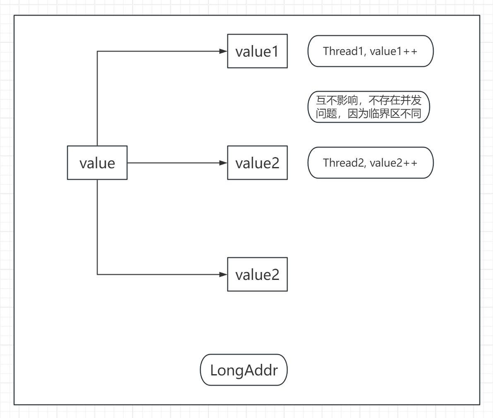
>

---


### 4.ã€å¹¶å‘专题】volitale 连环炮🌟🌟🌟🌟🌟

==问题一==：==Volitale 了解å—？简å•ä»‹ç»ä¸€ä¸‹ï¼ˆæŒ‡å¯¼ï¼šå›žç­”它的三个作用）==

==我的回答==：

> 1. volatie 用于ä¿è¯æ‰€ä¿®é¥°å˜é‡å¯¹æ‰€æœ‰çº¿ç¨‹çš„==å¯è§æ€§==å’Œ==顺åºæ€§==。
> 2. volatile ==最åˆçš„语义就是ç¦ç”¨ CPU 缓存==，让==多个处ç†å™¨è¯»å–çš„æ•°æ®éƒ½æ¥è‡ªäºŽå†…å­˜==，从而ä¿è¯å¯è§æ€§ã€‚å¯è§æ€§å°±æ˜¯æŒ‡å½“一个线程修改一个共享å˜é‡æ—¶ï¼Œå¦å¤–一个线程能立马读到这个修改的值。
> 3. volatile 还å¯ä»¥==防止é‡æŽ’åº==。å³ä¿è¯==被 volatile 修饰的å˜é‡ä¹‹å‰çš„代ç ä¸€å®šä¼šåœ¨å…¶ä¹‹å‰æ‰§è¡Œ==，但是并ä¸èƒ½ä¿è¯åŽé¢çš„代ç ä¸ä¼šè¿›è¡Œé‡æŽ’åºã€‚
> 4. 但是被 volatile 修饰的å˜é‡==还是å¯èƒ½å‡ºçŽ°çº¿ç¨‹ä¸å®‰å…¨çš„问题==，因为 ==volatile ä¸èƒ½ä¿è¯åŽŸå­æ€§==。
>

==å‚考答案==：

> - volatie 用于ä¿è¯æ‰€ä¿®é¥°å˜é‡å¯¹æ‰€æœ‰çº¿ç¨‹çš„==å¯è§æ€§==å’Œ==顺åºæ€§==。
> - å¯è§æ€§å°±æ˜¯æŒ‡å½“一个线程修改一个共享å˜é‡æ—¶ï¼Œå¦å¤–一个线程能立马读到这个修改的值。顺åºæ€§å°±æ˜¯æŒ‡å¯¹ ==volatile å˜é‡çš„读写æ“作都是按顺åºæ‰§è¡Œ==的，ä¸ä¼šå‡ºçŽ°é‡æŽ’åºæƒ…况。
> - 没有原å­æ€§æ˜¯å› ä¸ºï¼Œå®ƒ==åªå¯¹å•ä¸ª volatile å˜é‡çš„读写具有原å­æ€§==，如果是==多个 volatile æ“作或是 volatile++ è¿™ç§å¤åˆæ“作，整体上ä¸ä¿è¯åŽŸå­æ€§==。
>

---

==问题二==：==Volitale å¯è§æ€§åº•å±‚实现了解ä¸ï¼Ÿç®€å•è¯´ä¸€ä¸‹==

==我的回答==：

> 1. 当被 volatile 修饰的å˜é‡åœ¨ç¼–译之å‰ï¼Œä¼š==在下é¢åŠ ä¸€è¡Œä»¥ `lock` 开头的指令==，当处ç†å™¨è¯»å–到以 `lock` 开头的指令时，ä¸ä¼šå†é”ä½æ€»çº¿ï¼Œè€Œæ˜¯ä¼šæ£€æŸ¥æ•°æ®æ‰€åœ¨çš„内存区域，如果==该数æ®æ˜¯åœ¨å¤„ç†å™¨çš„内部缓存中，则会é”定此缓存区域，处ç†å®ŒåŽæŠŠç¼“存写回到主存中==，并且会利用==缓存一致性å议（MESI å议）==æ¥ä¿è¯==其他处ç†å™¨ä¸­çš„缓存数æ®çš„一致性==。
>

==å‚考答案==：

> - 其实就是在对 volatile å˜é‡è¿›è¡Œå†™æ“作的汇编代ç ä¹‹å‰ï¼Œ==åŠ äº†ä¸€æ¡ Lock å‰ç¼€æŒ‡ä»¤==。这个 Lock å‰ç¼€æŒ‡ä»¤åœ¨å¤šæ ¸å¤„ç†å™¨ä¸‹ä¼šå°†ï¼šå½“å‰==处ç†å™¨ç¼“存行的数æ®å†™å›žåˆ°å†…å­˜==并使==其它 CPU 里缓存了该内存地å€çš„æ•°æ®æ— æ•ˆ==。åŽè€…主è¦æ˜¯é€šè¿‡å¤„ç†å™¨éµå¾ª ==MESI åè®®==æ¥å®žçŽ°çš„，æ¯ä¸ªå¤„ç†å™¨é€šè¿‡å—…探总线æ¥æ£€æŸ¥è‡ªå·±çš„æ•°æ®æ˜¯å¦è¿‡æœŸï¼Œå¹¶åšå¯¹åº”的处ç†ã€‚
>

---

==问题三==：==你觉得什么样的场景下需è¦ç”¨åˆ° volitale，å¯ä»¥ä½ è§è¿‡çš„一些例å­å—？==

==我的回答==：

> 1. 现实场景中如果è¦ç”¨åˆ° volatile，å¯ä»¥åˆ©ç”¨å®ƒçš„å¯è§æ€§å’Œé¡ºåºæ€§ã€‚
> 2. 利用==å¯è§æ€§==的例å­ï¼šç”¨äºŽ==标记状æ€å˜é‡==，比如在多线程的æ¡ä»¶ä¸‹æŸä¸€ä¸ªçº¿ç¨‹å°†æ­¤çŠ¶æ€å˜é‡æ›´æ”¹ä¸º false，那么==其它的线程å¯ä»¥ç«‹å³å¯¹æ­¤å˜åŒ–åšå‡ºå“应==。
> 3. 利用==顺åºæ€§==的例å­ï¼šæ¯”如==å•ä¾‹æ¨¡å¼==中å¯ä»¥ä½¿ç”¨ ==volatile 修饰å•ä¾‹å®žä¾‹å¯¹è±¡==，==防止在编译期间对其进行é‡æŽ’åºï¼Œå¯¼è‡´å…ˆèµ‹åœ°å€ï¼Œåœ¨åˆ›å»ºå®žä¾‹å¯¹è±¡ï¼Œé€ æˆå¯èƒ½çš„空指针异常==。
>

 ==å‚考答案==：

> - volatile 基于å¯è§æ€§ï¼Œæ¯”较适åˆç”¨äºŽ==标记一个状æ€å˜é‡==。比如在多线程间控制循环或者任务的执行。当一个线程修改了 volatile 修饰的状æ€å˜é‡åŽï¼Œ==其他线程能立马感知并åšå¯¹åº”的处ç†==。
> - 除此之外，å•ä¾‹æ¨¡å¼çš„一ç§å®žçŽ°æ˜¯åˆ©ç”¨åŒé‡æ£€æŸ¥é”定æ¥åˆ›å»ºå¯¹è±¡ï¼Œå…¶ä¸­å°±ç”¨åˆ°äº† ==volatile æ¥ä¿®é¥°é‚£ä¸ªå•ä¾‹å®žä¾‹==，目的就在于==é¿å… new 对象时å¯èƒ½å‡ºçŽ°çš„指令é‡æŽ’åºï¼Œå¯¼è‡´é”™è¯¯ç»“æžœ==。这个过程主è¦ç”¨åˆ°äº† volatile 的顺åºæ€§ã€‚
>

----


### 5.ã€å¹¶å‘专题】synchronized 连环炮🌟🌟🌟🌟🌟

==问题一==：==简å•è¯´ä¸€ä¸‹ synchronized 的作用？==

==我的回答==：

> 1. synchronized 关键字一般用于==并å‘控制==，它是一ç§==é‡é‡çº§é”==，被 synchronized 修饰的共享å˜é‡æˆ–共享代ç å—最多åªèƒ½æœ‰ä¸€ä¸ªçº¿ç¨‹è¿›è¡Œè®¿é—®å’Œæ“作。线程在进入临界区之å‰ï¼Œä¼šå°è¯•èŽ·å–é”，如果获å–ä¸åˆ°åˆ™è¿›å…¥é˜»å¡žçŠ¶æ€ï¼Œç­‰å¾…其它线程释放é”åŽå”¤é†’。比如在电商系统中存在商å“超å–的问题，因为这个过程有三个æ“作，由于线程调度，在任æ„一个æ“作完æˆä¹‹åŽéƒ½å¯èƒ½åˆ‡æ¢åˆ°å¦ä¸€ä¸ªçº¿ç¨‹ä¸Šï¼Œå› æ­¤ä¸èƒ½ä¿è¯åŽŸå­æ€§ã€‚而如果用 synchronized 关键字修饰此代ç å—，就能ä¿è¯å…¶åŽŸå­æ€§ï¼Œä»Žè€Œè§£å†³å•†å“超å–问题。
>

==å‚考答案==：

> - synchronized 主è¦ç”¨æ¥å®žçŽ°åŒæ­¥ï¼Œ==被 synchronized 修饰的代ç å—或方法称为临界区代ç ==，在进入临界区之å‰ï¼Œ==线程会å°è¯•èŽ·å–é”==，如果é”å¯ç”¨ï¼Œåˆ™çº¿ç¨‹ä¼šèŽ·å–é”并进入临界区，执行相应的代ç ã€‚å¦åˆ™çº¿ç¨‹å°†è¢«==阻塞==，直到获å–到é”为止。
>

---

==问题二==：==synchronized 加在类方法，éžç±»æ–¹æ³•ï¼Œä»£ç å—上时，有什么ä¸åŒï¼Ÿ==

> ==synchronized ä¸èƒ½ä¿®é¥°å±žæ€§==。

==我的回答==：

> 1. 当 synchronized 加在被 static 修饰的类方法上时，é”是默认夹在类的 Class 对象上的。
> 2. 加在éžç±»æ–¹æ³•ä¸Šæ—¶ï¼Œé”默认加在当å‰çš„实例对象上。
> 3. 加载代ç å—上时，é”加载 synchronized åŽé¢æ‹¬å·ä¸­æŒ‡å®šçš„对象上。
>

==å‚考答案==：

> - 对于普通åŒæ­¥æ–¹æ³•ï¼Œé”的是当å‰çš„实例对象；对于é™æ€åŒæ­¥æ–¹æ³•ï¼Œé”的是当å‰ç±»çš„ Class 对象；对于åŒæ­¥ä»£ç å—，é”的是 synchronized 括å·é‡Œé…置的对象。
>

---

==问题三==：==讲一下 synchronized 的底层是怎么实现的？（PS：加在实例上和加在方法上，实现ä¸ä¸€æ ·ï¼Œéƒ½è¦è¯´æ˜Žï¼Œä¸€ä¸ªä»Žå­—节ç è§’度说，一个从对象头角度说）==

==我的回答==：

> 1. ==被 synchronized 修饰的代ç å—会在编译的代ç å‰åŽåˆ†åˆ«æ·»åŠ  monitorenter å’Œ monitorexit 指令==。JVM ç¡®ä¿è¢« synchronized é”定的对象都会对应一个 ==monitor==，当线程执行到 ==monitorenter 时会å°è¯•èŽ·å–当å‰çš„ monitor 对象==，也就是加é”æ“作，如果获å–ä¸åˆ°åˆ™ä¼šè¿›å…¥é˜»å¡žçŠ¶æ€ã€‚åŒæ ·çš„，执行到 ==monitorexit 指令时会释放这个 monitor==，也就是解é”æ“作，以供其它线程获å–。
> 2. 而对于==被 synchronized 修饰的方法==而言，处ç†å™¨é¦–å…ˆ==查看字节ç çš„方法表的 access_flags 字段是å¦æœ‰ ACC_SYNCHRONIZED 标志==。如果有则å°è¯•èŽ·å– monitor é”，并在执行完åŽé‡Šæ”¾ã€‚
>

==å‚考答案==：

> - 对于==方法级==çš„åŒæ­¥æ¥è¯´ï¼ŒJVM 利用==方法常é‡æ± ä¸­çš„ ACC_SYNCHRONIZED 标志==（==方法字节ç çš„ access_flags 字段==）æ¥åŒºåˆ†ä¸€ä¸ªæ–¹æ³•æ˜¯å¦ä¸ºåŒæ­¥æ–¹æ³•ã€‚当线程访问åŒæ­¥æ–¹æ³•æ—¶ï¼Œé¦–先会检查这个标志是å¦è¢«è®¾ç½®ï¼Œå¦‚果是，则需è¦å…ˆèŽ·å¾—监视器é”，然åŽå¼€å§‹æ‰§è¡Œæ–¹æ³•ï¼Œæ‰§è¡Œç»“æŸä¼šé‡Šæ”¾ç›‘视器é”。
> - 对于==åŒæ­¥ä»£ç å—==æ¥è¯´ï¼ŒJVM 是在编译åŽä»£ç å—的开始和结æŸå¤„，==æ’å…¥ monitorenter å’Œ monitorexit 指令==æ¥å®žçŽ°çš„。任何对象都会对应一个 monitor，线程执行到 monitorenter 时会å°è¯•èŽ·å–对象所对应的 monitor 的所有æƒï¼Œä¹Ÿå°±æ˜¯åŠ é”。执行到 monitorexit 时会释放 monitor 的所有æƒï¼Œä¹Ÿå°±æ˜¯è§£é”。
>

---

==问题四==：==在 Java 中，synchronized 属于é‡é‡çº§é”，为了让 synchronized 效率更快，JDKåšäº†å“ªäº›å‡çº§ï¼Ÿ==

==我的回答==：

> 1. 由于é‡é‡çº§é”涉åŠåˆ°å¤§é‡çš„线程阻塞和唤醒æ“作，这使得æ“作系统频ç¹çš„在用户æ€å’Œå†…æ ¸æ€ä¹‹é—´åˆ‡æ¢ï¼Œæ¶ˆè€—大é‡çš„时间。因此为了æå‡æ•ˆçŽ‡ï¼Œå¯ä»¥è€ƒè™‘å‡å°‘阻塞和唤醒æ“作的频率。
> 2. 具体的措施是==首先使用åå‘é”，如果产生冲çªåˆ™é™çº§ä¸ºè½»é‡çº§é”，å†äº§ç”Ÿå†²çªæ‰é™çº§ä¸ºé‡é‡çº§é”==。
>

==å‚考答案==：

> - Java 1.6 以åŽä¸»è¦å¼•å…¥äº†åå‘é”，轻é‡çº§é”和适应性自旋等特性。总体上æ¥è¯´ï¼Œé”å‡çº§çš„过程为：无é”->åå‘é”->è½»é‡çº§é”->é‡é‡çº§é”。
> - 对于åå‘é”æ¥è¯´ï¼Œé¦–次获å–时需è¦ç”¨ CAS 设置 Java 对象头中 mark word 字段的线程 id ，之åŽæŒæœ‰åå‘é”的线程æ¯æ¬¡è¿›å…¥è¿™ä¸ªé”相关的åŒæ­¥å—时，åªéœ€æ¯”对一下是å¦ä¸ºæœ¬çº¿ç¨‹ï¼Œå¦‚果是则直接获å–é”æˆåŠŸã€‚==这适用在一个线程åå¤èŽ·å–åŒä¸€ä¸ªé”的情况==，å¯ä»¥æ高带有åŒæ­¥ä½†æ— ç«žäº‰çš„程åºæ€§èƒ½ã€‚
> - åå‘é”中å‘生线程竞争，会å‡çº§ä¸ºè½»é‡çº§é”。轻é‡çº§é”在æ¯æ¬¡èŽ·å–时都需è¦ç”¨ ==CAS== 比较并替æ¢å¯¹è±¡å¤´ä¸­çš„整个 Mark Wrod 字段，如果 CAS æˆåŠŸåˆ™ä»£è¡¨èŽ·å–é”æˆåŠŸã€‚由于ç»å¤§éƒ¨åˆ†çš„é”在整个生命周期内都ä¸ä¼šå­˜åœ¨ç«žäº‰ï¼Œé‚£ä¹ˆåœ¨å¤šçº¿ç¨‹äº¤æ›¿æ‰§è¡ŒåŒæ­¥å—的情况下，轻é‡çº§é”å¯ä»¥é¿å…é‡é‡çº§é”引起的性能消耗。
> - è½»é‡çº§é”释放时若存在其它线程竞争，é”将膨胀为é‡é‡çº§é”，==任何没有竞争到é”的线程都会被阻塞，直到被其它线程唤醒==。但线程唤醒的过程涉åŠåˆ°æ“作系统的调用，会有é¢å¤–的开销。
> - 为了é¿å…这个问题，在线程竞争轻é‡çº§é”失败åŽï¼Œ==膨胀为é‡é‡çº§é”之å‰çº¿ç¨‹ä¼šå°è¯•é€‚应性自旋（循环多次å°è¯•èŽ·å–é”，而ä¸æ˜¯æ²¡å¾—到就直接阻塞）==，==自旋的次数根æ®å‰ä¸€æ¬¡åœ¨åŒä¸€ä¸ªé”上的自旋时间åŠé”的拥有者的状æ€æ¥å†³å®š==。如果这个é”很少自旋æˆåŠŸï¼Œé‚£ä¹ˆä»¥åŽæœ‰å¯èƒ½çœç•¥æŽ‰è‡ªæ—‹è¿‡ç¨‹ä»¥é¿å… CPU 资æºæµªè´¹ã€‚
>

---


### 6.ã€å¹¶å‘专题】AQS 连环炮🌟🌟（还没学呢）


### 7.ã€å¹¶å‘专题】ReentrantLock 连环炮🌟🌟

==问题一==：==简å•ä»‹ç»ä¸‹ ReentrantLock？==

==我的回答==：

> 1. ReenTrantLock æ„为==å¯é‡å…¥é”==，å³==å·²ç»èŽ·å–é”的线程å¯ä»¥å†æ¬¡èŽ·å–é”资æº==。
> 1. ReenTrantLock çš„==底层是 AQS==，在åŒä¸€ä¸ªçº¿ç¨‹ä¸­åŠ é”时递增，释放é”时递å‡ã€‚
>

==å‚考答案==：

> - ReentrantLock 是 Java 中==é‡å…¥é”==的一ç§å®žçŽ°ï¼Œå¯ä»¥æ”¯æŒ==一个线程对æŸä¸ªèµ„æºçš„é‡å¤åŠ é”==，==底层是基于 AQS 实现==，在åŒä¸€ä¸ªçº¿ç¨‹åŠ é”时递增，释放é”时递å‡åŒæ­¥çŠ¶æ€çš„值。
>

---

==问题二==：==synchronized 和 ReentrantLock 有什么区别？==

==我的回答==：

> 1. 两者==都支æŒé‡å…¥==，但是 ==synchronized çš„é‡å…¥æ˜¯éšå¼çš„==，比如递归调用一个被 synchronized 修饰的方法；而 ==ReenTrantLock 支æŒæ˜¾ç¤ºé‡å…¥==，使用 lock 方法。
> 2. ReenTrantLock 比 synchronized 更加çµæ´»ã€‚ReentrantLock æ供有 ==tryLock( )，å¯ä»¥å°è¯•èŽ·å–é”而ä¸é˜»å¡ž==，并且å¯ä»¥è®¾ç½®==超时时间==。
> 3. ReenTrantLock å¯ä»¥è®¾ç½®==公平é”或éžå…¬å¹³é”==。
>

==å‚考答案==：

> - 两者相åŒä¹‹å¤„在于==都支æŒé‡å…¥æ€§==，synchronized 支æŒ==éšæ€§==çš„é‡è¿›å…¥ï¼Œæ¯”如线程å¯ä»¥åœ¨é€’归执行åŒæ­¥å—里的代ç è€Œä¸è¢«é˜»å¡žï¼ŒReentrantLock 需è¦æ˜¾ç¤ºè°ƒç”¨ lock( )。
> - ä¸åŒä¹‹å¤„在于 ReentrantLock 比 synchronized 更加çµæ´»ã€‚ReentrantLock æ供有 ==tryLock( )，å¯ä»¥å°è¯•èŽ·å–é”而ä¸é˜»å¡ž==，并且å¯ä»¥è®¾ç½®==超时时间==。除此之外 ReentrantLock 还支æŒèŽ·å–é”时的公平和éžå…¬å¹³æ€§é€‰æ‹©ã€‚
>

---

==问题三==：==既然说到了å¯é‡å…¥é”，那你觉得为啥需è¦å¯é‡å…¥é”？==

==我的回答==：

> 1. å¯é‡å…¥é”主è¦æ˜¯ä¸ºäº†==é¿å…æ­»é”==。比如一个线程获å–了éžå¯é‡å…¥é”，如果å†æ¬¡å°è¯•èŽ·å–该é”，则会因为==æ— é™ç­‰å¾…自己申请的é”而陷入死é”==。而å¯é‡å…¥é”则ä¸ä¼šå‡ºçŽ°è¿™ä¸ªé—®é¢˜ã€‚
> 2. 在实际的场景中比如在åŒä¸€ä¸ªçº¿ç¨‹ä¸­==递归调用一个使用é”的方法==，如果é”ä¸å¯é‡å…¥ï¼Œé‚£ä¹ˆè¯¥çº¿ç¨‹è°ƒç”¨çš„时候就会被递归栈里的å‰ä¸€ä¸ªæ–¹æ³•æ‰€é˜»å¡žï¼Œé™·å…¥æ­»é”。
>

==å‚考答案==：

> - å¯é‡å…¥é”主è¦æ˜¯ç”¨æ¥è§£å†³çº¿ç¨‹åœ¨æŒæœ‰é”的情况下，å†æ¬¡è¯·æ±‚åŒä¸€ä¸ªé”æ—¶å‘生的死é”问题。如果没有å¯é‡å…¥é”，当一个线程已ç»èŽ·å–了é”åŽï¼Œå†æ¬¡è¯·æ±‚该é”会导致自己è¦ç­‰å¾…自己释放é”，进而产生死é”。
> - 具体的场景比如，递归函数中需è¦èŽ·å–é”，如果没有é‡å…¥é”，线程在æ¯æ¬¡é€’归调用时都会被自己阻塞。还有多个方法å¯èƒ½éƒ½éœ€è¦èŽ·å–相åŒçš„é”，没有é‡å…¥é”çš„è¯ï¼Œå®ƒä»¬ä¹‹é—´å°±ä¸èƒ½ç›¸äº’调用。
>

---

==问题四==：==ReentrantLock 底层是怎么实现的？==

==我的回答==：

> 1. ReenTrantLock çš„==底层是 AQS==（AbstractQueuedSynchronizer 抽象åŒæ­¥é˜Ÿåˆ—）
> 2. 当已ç»èŽ·å–é”的线程å†æ¬¡å°è¯•==获å–é”==时，AQS 中被 ==volatile 修饰的 int å˜é‡è‡ªå¢ž==，表示增加了一层é”。
> 3. 而当å°è¯•==释放é”==时，==该值自å‡ï¼Œå‡åˆ°é›¶æ—¶è¡¨ç¤ºè¯¥çº¿ç¨‹ä¸Šçš„é”全部释放==。
>

==å‚考答案==：

> - ReentrantLock 需è¦åœ¨ AQS 的基础上多考虑两个问题，一个是获å–é”的线程==å†æ¬¡èŽ·å–é”==的判断，此时需è¦å°†åº•å±‚==表示åŒæ­¥çŠ¶æ€ volatile int 类型的值 + 1==。å¦ä¸€ä¸ªæ˜¯é”的最终释放，线程é‡å¤èŽ·å– n 次é”，那么释放时也è¦é‡å¤é‡Šæ”¾ n 次，对应åŒæ­¥çŠ¶æ€çš„值自å‡ï¼Œç›´è‡³==为 0 代表é”å·²æˆåŠŸé‡Šæ”¾==。
>

---


### 8.ã€å¹¶å‘专题】threadLocal 连环炮🌟🌟

==问题一==：==介ç»ä¸€ä¸‹ threadLocal，简å•è¯´ä¸€ä¸‹ä»–的使用场景？==

==我的回答==：

> 1. ThreadLocal 中有一个==内部类 ThreadLocalMap==；
> 2. 而在 ==Thread 类中有一个属性 threadLocals，其类型就是 ThreadLocal.ThreadLocalMap==。设计这个属性的目的是在 ==Thread 中创建一个åªå±žäºŽè¯¥çº¿ç¨‹çš„空间，用于存储åªå±žäºŽè¯¥çº¿ç¨‹çš„æ•°æ®==，防止多线程并å‘的情况下由于线程调度的原å­æ€§é—®é¢˜äº§ç”Ÿçš„æ•°æ®è¦†ç›–等问题，==ä¿è¯å¹¶å‘安全==。
> 3. 比如在涉åŠåˆ°ç”¨æˆ·ç™»å½•çš„系统中，我们å¯ä»¥åˆ›å»ºä¸€ä¸ªç”¨äºŽ==存储å„线程的 User 对象的 ThreadLocal 实例==，使用其 set 方法，以该 ThreadLocal 实例为 key，将 `(ThreadLocal, value)` 键值对存储到å„个线程的 threadLocals 属性中；然åŽåœ¨åŽç»­éœ€è¦å„个线程的 User 对象时，使用 ThreadLocal.get 方法，以该 ThreadLocal 实例为 key，从当å‰çº¿ç¨‹çš„ threadLocals 属性中å–出自己 User。
>

==å‚考答案==：

> - ThreadLocal 用于æ供线程的局部å˜é‡ï¼Œ==在多线程环境å¯ä»¥ä¿è¯å„个线程里的å˜é‡ç‹¬ç«‹äºŽå…¶å®ƒçº¿ç¨‹==，是一个以 ThreadLocal 对象为键，任æ„对象为值的存储结构。==底层是 ThreadLocalMap==。它å¯ä»¥ç”¨äºŽå¤šçº¿ç¨‹å¤„ç†å¤šä»»åŠ¡çš„场景，==æ¯ä¸ªçº¿ç¨‹ä½¿ç”¨ ThreadLocal å•ç‹¬ä¿å­˜è‡ªå·±çš„任务上下文==，然åŽæ‰§è¡Œè®¡ç®—。
>

---

==问题二==：==ThreadLocalçš„key是哪ç§å¼•ç”¨ç±»åž‹ï¼Ÿä¸ºå•¥è¿™ä¹ˆè®¾è®¡ï¼Ÿ==

==我的回答==：

> 1. ==弱引用==。这样设计是为了==防止æŸäº›æƒ…况下 ThreadLocal å¯èƒ½ä¼šå¯¼è‡´çš„内存泄æ¼==。
>

==å‚考答案==：

> - ==弱引用==。这样设计是为了==防止æŸäº›æƒ…况下 ThreadLocal å¯èƒ½ä¼šå¯¼è‡´çš„内存泄æ¼==。
>

---

==问题三==：==ThreadLocal 是怎么防止内存泄æ¼ï¼Ÿ==

==我的回答==：

> 1. Thread.threadLocals 中的 ==Entry 对 ThreadLocal 的引用是弱引用==，因此==在堆栈对 ThreadLocal 的引用置为 null 之åŽï¼Œå°±ä¼šå¯¹ ThreadLocal 进行垃圾回收==。但是此时由于 Thread.threadLocal.entry.value ä»ç„¶==对 value 有强引用==，因此 ==value 并ä¸ä¼šè¢«åžƒåœ¾å›žæ”¶ï¼Œå³ value 会å‘生内存泄æ¼==。
> 2. 解决上述内存泄露的方法则是==æ¯æ¬¡ç”¨å®Œ ThreadLocal 之åŽéƒ½è°ƒç”¨ ThreadLocal.remove()==，==æ¸…é™¤å½“å‰ ThreadLocal.threadLocal.entry，这样就能使得 value 也会正常被垃圾回收==。
>

==å‚考答案==：

> - 简å•æ¥è¯´æ˜¯==「弱引用ã€åŠ ã€Œæ‰‹åŠ¨è°ƒç”¨ remove( ) ã€==方法。
> - 因为 ThreadLocalMap 主è¦æœ‰ä¸€ä¸ª Entry 数组，æ¯ä¸€ä¸ª ==Entry 是继承了 ThreadLocal 类型的弱引用==，并将其作为 key。value 是 Entry 中的一个 Object æˆå‘˜å˜é‡ã€‚那么我们在创建 ThreadLocal å˜é‡æ—¶ï¼Œ==æ¯ä¸€ä¸ª ThreadLocal 对象就有两个引用，一个是堆栈对它的强引用，一个是 ThreadLocalMap 中的 Entry 对它的弱引用==。
> - 现在å‡è®¾ Entry 是对 ThreadLocal 的强引用而ä¸æ˜¯å¼±å¼•ç”¨ï¼Œåœ¨==å°† ThreadLocal 置空åŽï¼Œå †æ ˆä¸Šçš„ ThreadLocal 强引用就会消失==，但 Entry 对它的强引用还在，无法被回收，并且 ==Entry çš„ value 值也是个强引用，也无法被回收，这就导致了内存泄æ¼==。
> - ==å°† Entry 继承自 ThreadLocal 的弱引用å¯ä»¥è§£å†³ ThreadLocal 的回收问题==，但还是无法解决 value 的回收问题。ThreadLocal 在设计时就考虑到了这个问题，并且有一些防护措施：==在调用 ThreadLocal çš„ get( )，set( ) å’Œ remove( ) 的时候都会清除当å‰çº¿ç¨‹ ThreadLocalMap 中所有 key 为 null çš„ value==。所以在使用 ThreadLocal 的时候，==æ¯æ¬¡ç”¨å®Œéƒ½æœ€å¥½æ‰‹åŠ¨è°ƒç”¨ä¸€ä¸‹ remove( ) 方法，æ¥é˜²æ­¢å†…存泄æ¼==。
>

---


### 9.ã€å¹¶å‘专题】线程池 连环炮🌟🌟🌟

==问题一==：==为什么è¦ä½¿ç”¨çº¿ç¨‹æ± ï¼Ÿçº¿ç¨‹æ± æ˜¯æ€Žä¹ˆæå‡æ•ˆçŽ‡çš„？==

==我的回答==：

> 1. ==å‡å°‘é‡å¤åˆ›å»ºå’Œé”€æ¯çº¿ç¨‹æ‰€å ç”¨çš„大é‡æ—¶é—´==，从而æå‡å¯¹ä»»åŠ¡çš„å“应速度。
> 2. 比如我们有1000个任务需è¦æ‰§è¡Œï¼Œå¦‚果创建1000个线程的è¯ï¼Œå°±ä¼šåœ¨åˆ›å»ºå’Œé”€æ¯çº¿ç¨‹çš„过程中浪费大é‡çš„时间。而如果使用线程池，我们åªéœ€åˆ›å»ºä¸€å®šæ•°é‡çš„线程æ¥æ‰§è¡Œå³å¯ã€‚
> 3. å¦ä¸€æ–¹é¢ï¼Œé€šè¿‡çº¿ç¨‹æ± å¯ä»¥==对这些线程进行统一的é…置和管ç†==，比如å¯ä»¥ä½¿ç”¨ shutdown æ¥ç»Ÿä¸€åœ°è®©çº¿ç¨‹æ± ä¸­çš„所有线程åœæ­¢æŽ¥æ”¶æ–°çš„任务。
>

==å‚考答案==：

> - 使用线程池å¯ä»¥é¿å…手动创建线程带æ¥çš„==难以管ç†==å’Œ==频ç¹åˆ›å»ºå¼€é”€å¤§==的缺点。åˆç†çš„使用线程池å¯ä»¥==é™ä½Žèµ„æºæ¶ˆè€—，æ高å“应速度和æ高线程的å¯ç®¡ç†æ€§==。
> - 具体æ¥è¯´ï¼Œçº¿ç¨‹æ± å¯ä»¥==é‡å¤åˆ©ç”¨å·²åˆ›å»ºçš„线程，æ¥é™ä½Žçº¿ç¨‹åˆ›å»ºå’Œé”€æ¯å¸¦æ¥çš„开销==ï¼›åŒæ—¶ä¹Ÿå¯ä»¥ä½¿==任务到达时就å¯ä»¥ç«‹åˆ»æ‰§è¡Œï¼Œå“应速度快（çœä¸‹æ¥é¢å¤–创建新线程的时间）==；线程池还å¯ä»¥å¯¹åˆ›å»ºçš„线程进行==统一分é…，调度和监控==。
>

---

==问题二==：==简å•è¯´ä¸€ä¸‹çº¿ç¨‹æ± éƒ½æœ‰å“ªäº›å¯é€‰å‚数？==

==我的回答==：

> 1. ==corePoolSize==：==核心线程数==，如果新任务产生时，线程池线程==总数没有到达 corePoolSize，则会直接创建新的线程执行此任务==，并且就算==没有任务å¯æ‰§è¡Œï¼Œæ ¸å¿ƒçº¿ç¨‹ä¹Ÿä¸ä¼šè¢«é”€æ¯==。
> 2. ==maxPoolSize==：==最大线程数==，如果当储存队列（workingQueue）被填满了，还有新任务时，如果没有达到 maxPoolSize，则会创建新的线程。==超过 keepAliveTime 没有任务执行，则会将此线程销æ¯==。
> 3. ==keepAliveTime==：éžæ ¸å¿ƒçº¿ç¨‹ keepAliveTime 没有执行任务则会销æ¯ã€‚
> 4. ==workQueue==：任务储存队列。达到核心线程数åŽçš„新任务放到储存队列中。
> 5. ==threadFactory==：使用 threadFactory 创建新的线程。
> 6. ==Handler==：类型是 ==RejectedExecutionHandler==，拒ç»ä»»åŠ¡æ—¶çš„业务逻辑。
>

==å‚考答案==：

> - Java å¯ä»¥ä½¿ç”¨ ==ThreadPoolExecutor ç±»æ¥æ‰‹åŠ¨åˆ›å»ºçº¿ç¨‹æ± ==，它的构造å‚数有七个，有：线程池的核心线程数和最大线程数，空闲线程的存活时长和时长å•ä½ï¼Œå­˜æ”¾ä»»åŠ¡çš„阻塞队列，线程工厂和拒ç»æ‰§è¡Œç­–略。
> - 其中存放任务的==阻塞队列常è§çš„有四ç§å¯é€‰==，å‰ä¸¤ç§åˆ†åˆ«æ˜¯==基于数组或链表的队列，都按 FIFO 排åº==任务。第三ç§æ˜¯==ä¸å­˜å‚¨å…ƒç´ çš„==阻塞队列，æ¯ä¸ªä»»åŠ¡çš„加入都必须阻塞等待，直到腾出æ¥çº¿ç¨‹æ‰§è¡Œã€‚第四ç§æ˜¯ä¸€ä¸ªå…·æœ‰==优先级==çš„æ— é™é˜»å¡žé˜Ÿåˆ—。
>

---

==问题三==：==线程数是越大越好å—？讲一下核心线程数与最大线程数之间的关系？==

==我的回答==：

> 1. 如果程åºæ˜¯ ==CPU 密集型==（大é‡çš„计算任务），那么线程数ä¸è¦å¤ªå¤šï¼Œå¦åˆ™==线程间的频ç¹åˆ‡æ¢==å而会耗费大é‡æ—¶é—´ï¼›
> 2. 如果程åºæ˜¯ ==IO 密集型==（输入输出任务，ç£ç›˜å†™å…¥å†™å›žä¹‹ç±»çš„任务），那么就å¯ä»¥é€‚当增加线程数，以==充分è¿ç”¨ç­‰å¾… IO 的时间==。
> 3. ==核心线程数==å¯ä»¥ç†è§£ä¸ºæœ€å°çš„线程数，如果核心线程没有任务å¯å¤„ç†ï¼Œä¹Ÿä¸ä¼šè¢«é”€æ¯ã€‚
> 4. ==最大线程数==是阻塞队列被填满åŽï¼Œä¸´æ—¶å¢žåŠ çš„线程，用于快速处ç†å®Œå †ç§¯å†é˜»å¡žé˜Ÿåˆ—里的线程，如果它们==超过 keepAliveTime 没有处ç†æ–°ä»»åŠ¡ï¼Œåˆ™ä¼šè¢«é”€æ¯==。
>

==å‚考答案==：

> - ä¸æ˜¯çš„，如果程åºæ˜¯ CPU 密集型任务，线程数ä¸èƒ½å¤ªå¤§ï¼Œé¿å…线程间的频ç¹åˆ‡æ¢ï¼›å¦‚果程åºæ˜¯ IO 密集型任务，å¯ä»¥é€‚当增加线程数，æ¥å……分利用 CPU 等待 IO 的时间，æ高åžåé‡ã€‚但å³ä½¿æ˜¯ IO 密集型任务线程数也ä¸èƒ½è¿‡å¤§ï¼Œå¦åˆ™ä¹Ÿä¼šå‡ºçŽ°çº¿ç¨‹é¢‘ç¹åˆ‡æ¢å¸¦æ¥çš„é¢å¤–开销。
> - 核心线程数表示线程池中ä¿æŒæ´»åŠ¨çŠ¶æ€çš„线程数é‡ï¼Œå³ç©ºé—²çº¿ç¨‹çš„最å°æ•°é‡ï¼Œè¿™äº›çº¿ç¨‹æ‰§è¡Œå®Œä»»åŠ¡åŽä¸ä¼šè¢«é”€æ¯ã€‚
> - 最大线程数是指线程池中å…许的最大线程数é‡ï¼ŒåŒ…括核心线程数和éžæ ¸å¿ƒçº¿ç¨‹æ•°ã€‚éžæ ¸å¿ƒçº¿ç¨‹æ•°æ˜¯åœ¨ä»»åŠ¡é˜Ÿåˆ—已满且核心线程数已满的情况下，创建的é¢å¤–线程数é‡ï¼Œè¿™äº›çº¿ç¨‹åœ¨æ‰§è¡Œå®Œä»»åŠ¡åŽå°±ä¼šè¢«é”€æ¯ã€‚
>

---

==问题四==：==è¿è¡Œçš„时候，核心线程数能ä¸èƒ½ä¿®æ”¹ï¼Ÿ==

==我的回答==：

> 1. å¯ä»¥ï¼Œ==调用 ThreadPoolExecutor.setCorePoolSize å¯ä»¥ä¿®æ”¹æ ¸å¿ƒçº¿ç¨‹æ•°==。如果修改åŽçš„线程数少了，那么多余的线程在执行完当å‰çš„任务之åŽå°±ä¼šè¢«é”€æ¯ï¼›çº¿ç¨‹å˜å¤šäº†ï¼Œé˜Ÿåˆ—有任务就会创建新的线程。
>

==å‚考答案==：

> - å¯ä»¥ï¼Œ==ThreadPoolExecutor ç±»æ供了 setCorePoolSize( )==，å¯ä»¥åœ¨çº¿ç¨‹æ± è¿è¡Œæ—¶åŠ¨æ€ä¿®æ”¹æ ¸å¿ƒçº¿ç¨‹æ•°ã€‚如果我们调用这个方法å°è¯•å‡å°‘核心线程数，那么就会==中断一部分空闲线程==。如果是增加，则需è¦æ ¹æ®å½“å‰==工作队列是å¦æœ‰ä»»åŠ¡==æ¥å†³å®šæ˜¯å¦å¢žåŠ æ ¸å¿ƒçº¿ç¨‹ã€‚
>

---

==问题五==：==一个任务进æ¥åŽï¼Œçº¿ç¨‹æ± æ˜¯æ€Žä¹ˆå¤„ç†çš„？==

==我的回答==：

> 1. 首先填满==核心线程数==，然åŽæ”¾åˆ°==阻塞队列==中，如果阻塞队列放满了还有新任务，那就å°è¯•æŠŠæœ€å¤§çº¿ç¨‹æ•°å¡«æ»¡ï¼Œå¦‚果最大线程数满了还有新任务，就拒ç»ï¼Œå¹¶æ‰§è¡Œä¼ å…¥çš„ Handler 处ç†è¢«æ‹’ç»çš„任务。
>

==å‚考答案==：

> - 首先需è¦åˆ¤æ–­==核心线程池==是å¦å·²æ»¡ï¼Œå¦‚果没满则创建一个核心线程执行任务。
> - 如果核心线程池里的线程都在执行任务，接ç€è¦åˆ¤æ–­==工作队列==是å¦å·²æ»¡ï¼Œå¦‚果没满则将这个任务添加到工作队列中。
> - 如果工作队列也满了，还需判断线程池中所有的线程是å¦è¶…出了==最大线程数==，如果没有，则创建一个éžæ ¸å¿ƒçº¿ç¨‹æ‰§è¡Œä»»åŠ¡ã€‚
> - 如果整个线程池都满了，则需è¦äº¤ç»™åˆ›å»ºçº¿ç¨‹æ—¶æŒ‡å®šçš„==「拒ç»æ‰§è¡Œç­–ç•¥ã€==去处ç†ã€‚
>

---

==问题六==：==线程池的拒ç»ç­–略有哪几ç§ï¼Ÿè®²ä¸€ä¸‹å¸¸è§çš„几ç§==

==我的回答==：

> 1. 常è§çš„有四ç§ç­–略：
> 2. 第一ç§æ˜¯å¼‚常策略（AbortPolicy），==直接抛出异常==。
> 3. 第二章是调用者è¿è¡Œç­–略（CallerRunsPolicy），==将该任务交给调用者所在的线程==去执行。
> 4. 第三ç§æ˜¯ä¸¢å¼ƒæœ€ä¹…策略（DiscardOldestPolicy），==丢弃队列中最早æ交的任务==，并执行当å‰ä»»åŠ¡ã€‚
> 5. 第四ç§æ˜¯ç›´æŽ¥ä¸¢å¼ƒç­–略（DiscardPolicy），==直接丢弃ä¸å¤„ç†==。
>

==å‚考答案==：

> - 常è§çš„有四ç§ç­–略：
> - 第一ç§æ˜¯å¼‚常策略（AbortPolicy），==直接抛出异常==。
> - 第二章是调用者è¿è¡Œç­–略（CallerRunsPolicy），==将该任务交给调用者所在的线程==去执行。
> - 第三ç§æ˜¯ä¸¢å¼ƒæœ€ä¹…策略（DiscardOldestPolicy），==丢弃队列中最早æ交的任务==，并执行当å‰ä»»åŠ¡ã€‚
> - 第四ç§æ˜¯ç›´æŽ¥ä¸¢å¼ƒç­–略（DiscardPolicy），==直接丢弃ä¸å¤„ç†==。
>

---

==问题七==：==平时å¯ä»¥æ€Žä¹ˆåˆ›å»ºä¸€ä¸ªçº¿ç¨‹æ± ï¼Ÿ==

==我的回答==：

> 1. å¯ä»¥é€šè¿‡ ==ThreadPoolExecutor 的构造方法==自定义相关å‚数创建，也å¯ä»¥ä½¿ç”¨ ==Executors 的方法==直接获å–几个创建好的线程池。但是一般情况下是使用 ThreadPoolExecutor 的构造方法，更加çµæ´»ã€‚
>

==å‚考答案==：

> - 最好是用 ThreadPoolExecutor 创建，ä¸æŽ¨è使用 Executors 创建。因为==从 Executors 返回的线程池对象，请求队列的长度或者å…许创建的线程数为 Integer.MAX_VALUE，å¯èƒ½ä¼šå †ç§¯å¤§é‡çš„请求或者线程，导致 OOM==。
>

---

==问题八==：==线程池有哪些关闭方å¼ï¼Ÿä»–们的区别？==

==我的回答==：

> 1. 使用 shutdown 或者 shutdownNow 方法。两者的区别是 ==shutdown 方法相对更加柔和==，如果当å‰çº¿ç¨‹æ± ä¸­è¿˜æœ‰ä»»åŠ¡æ²¡æœ‰æ‰§è¡Œå®Œçš„è¯ï¼Œä¼šå°†æ²¡æ‰§è¡Œå®Œçš„任务执行完å†å…³é—­ï¼›è€Œ ==shutdownNow 则会直接强行终止所有正在执行任务，并把所有未执行完的任务打包为 List\<Runnable> 返回==，æ„在让我们自行处ç†ã€‚
>

==å‚考答案==：

> - 有两ç§æ–¹å¼ï¼Œä½¿ç”¨ shutdown( ) 或者 shutdownNow( ) æ¥å…³é—­çº¿ç¨‹æ± ã€‚它们的==原ç†æ˜¯é历线程池中的工作线程，然åŽé€ä¸ªè°ƒç”¨çº¿ç¨‹çš„ interrupt 方法æ¥ä¸­æ–­çº¿ç¨‹==。但也有一定的区别，==shutdown( ) åªæ˜¯çº¿ç¨‹æ± çš„状æ€è®¾ç½®æˆ SHUTDOWN，然åŽä¸­æ–­æ‰€æœ‰æ²¡æœ‰æ‰§è¡Œä»»åŠ¡çš„线程==，而 ==shutdownNow( ) 是先将线程池状æ€è®¾ä¸º STOP，然åŽå°è¯•åœæ­¢æ‰€æœ‰çš„正在执行任务的线程==，并返回等待执行任务的列表。
> - 无论调用这两个方法的哪一个，isShutdown( ) 都会返回 true。==当所有的任务都执行完åŽï¼Œæ‰çœŸæ­£è¡¨ç¤ºçº¿ç¨‹æ± å…³é—­æˆåŠŸï¼Œæ­¤æ—¶ isTerminaed( ) 返回 true==。实际中如果期望此时正在执行的任务继续执行完，å¯ä»¥ç”¨ shutdown( )，å之å¯ä»¥ç”¨ shutdownNow( )。
>

---


## 5.Java IO + Java8 新特性

### 文章

#### 1.你管这破玩æ„å« IO 多路å¤ç”¨ï¼Ÿ

1. ==阻塞 IO==：

	> - 简å•æ¥è¯´å°±æ˜¯æœåŠ¡ç«¯ç›´æŽ¥ç­‰å¾…客户端传æ¥çš„æ•°æ®ã€‚如果客户端迟迟ä¸æŠŠæ•°æ®ä¼ æ¥ï¼ŒæœåŠ¡ç«¯å°±ä¼šä¸€ç›´åœ¨ read 处被阻塞，无法接收其它客户端的请求。
	> - 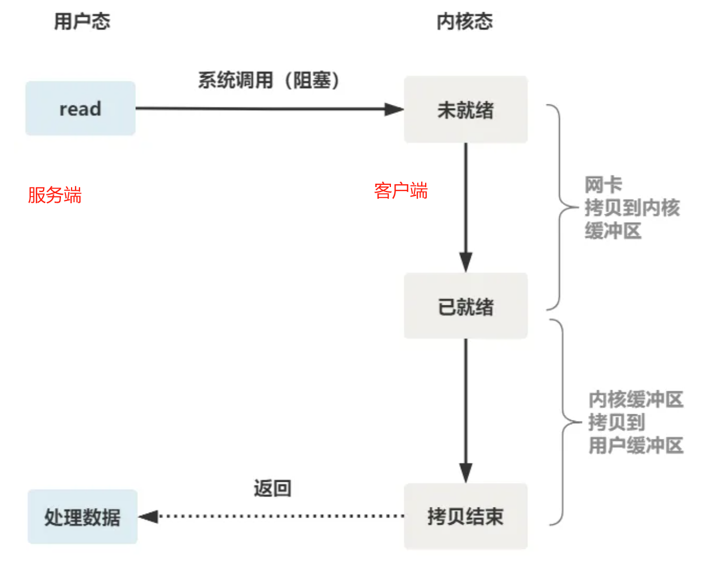
	> - 为了解决这ç§é˜»å¡žæœåŠ¡ç«¯çš„问题，å¯ä»¥æ¯æ¬¡éƒ½==创建一个新的进程或线程与客户端ä¿æŒè”ç³»==，去调用 read 函数，并åšä¸šåŠ¡å¤„ç†ï¼ˆ==这样ä¾ç„¶æ˜¯é˜»å¡ž IO==）

2. ==éžé˜»å¡ž IO==：

	> - 为了实现éžé˜»å¡ž IO，需è¦è®©==æ“作系统为我们æ供一个éžé˜»å¡žçš„ read 函数==。
	> - 这个 read 函数的效果是，如果==没有数æ®åˆ°è¾¾ï¼ˆæ²¡æœ‰åˆ°è¾¾ç½‘å¡å¹¶æ‹·è´åˆ°å†…核缓冲区），立刻返回一个错误值（-1）==，而ä¸æ˜¯é˜»å¡žåœ°ç­‰å¾…。
	> - 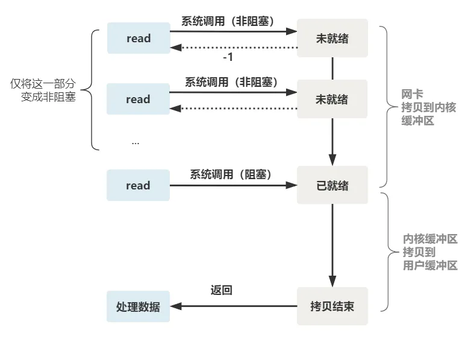
	> - å¯ä»¥çœ‹åˆ°ï¼Œ==åªæœ‰å½“æ•°æ®è¿˜æœªåˆ°è¾¾ç½‘å¡ï¼Œæˆ–者还没有拷è´åˆ°å†…核缓冲区之å‰ï¼Œæ‰æ˜¯éžé˜»å¡žçš„==。
	> - 而当==æ•°æ®å·²åˆ°è¾¾å†…核缓冲区，此时调用 read 函数ä»ç„¶æ˜¯é˜»å¡žçš„==，需è¦ç­‰å¾…æ•°æ®ä»Žå†…核缓冲区拷è´åˆ°ç”¨æˆ·ç¼“冲区，æ‰èƒ½è¿”回。

3. ==IO 多路å¤ç”¨==：

	> - 首先一个线程ä¸æ–­æŽ¥å—客户端连接，并==把 socket 文件æ述符放到一个 list== 里。
	> - 然åŽï¼Œå¦ä¸€ä¸ªçº¿ç¨‹ä¸å†è‡ªå·±é历，而是==调用 select，将这批文件æ述符 list 交给æ“作系统的内核æ€åŽ»é历（如果自己é历的è¯ï¼Œæ¯ä¸€ä¸ªéƒ½éœ€è¦ä»Žç”¨æˆ·æ€åˆ‡æ¢åˆ°å†…æ ¸æ€ï¼Œè¿™æ ·åªéœ€ä¸€æ¬¡è½¬æ¢ï¼‰==。
	> - ä¸è¿‡ï¼Œå½“ select 函数返回åŽï¼Œç”¨æˆ·ä¾ç„¶éœ€è¦é历刚刚æ交给æ“作系统的 list。åªä¸è¿‡ï¼Œ==æ“作系统会将准备就绪的文件æ述符åšä¸Šæ ‡è¯†==，用户层就无需等待文件。
	> - 
	>
	> 1. select 调用需è¦ä¼ å…¥ fd 数组，==需è¦æ‹·è´ä¸€ä»½åˆ°å†…æ ¸==，高并å‘场景下这样的==æ‹·è´æ¶ˆè€—的资æºæ˜¯æƒŠäººçš„==。（å¯ä¼˜åŒ–为ä¸å¤åˆ¶ï¼‰
	>
	> 2. ==select 在内核层==ä»ç„¶æ˜¯é€šè¿‡é历的方å¼æ£€æŸ¥æ–‡ä»¶æ述符的就绪状æ€ï¼Œæ˜¯ä¸ª==åŒæ­¥è¿‡ç¨‹==，åªä¸è¿‡==无系统调用切æ¢ä¸Šä¸‹æ–‡çš„开销==。（内核层å¯ä¼˜åŒ–为异步事件通知）
	>
	> 3. ==select 仅仅返回å¯è¯»æ–‡ä»¶æ述符的个数==，具体哪个å¯è¯»è¿˜æ˜¯è¦ç”¨æˆ·è‡ªå·±é历。（å¯ä¼˜åŒ–为åªè¿”回给用户就绪的文件æ述符，无需用户åšæ— æ•ˆçš„é历）
	>
	> è¿™ç§æ–¹å¼ï¼Œæ—¢åšåˆ°äº†==一个线程处ç†å¤šä¸ªå®¢æˆ·ç«¯è¿žæŽ¥ï¼ˆæ–‡ä»¶æ述符==），åˆ==å‡å°‘了系统调用==的开销。

4. ==poll==：

	> - poll 也是æ“作系统æ供的系统调用函数。
	> - 它和 select 的主è¦åŒºåˆ«å°±æ˜¯ï¼Œ==去掉了 select åªèƒ½ç›‘å¬ 1024 个文件æ述符的é™åˆ¶==。

5. ==epoll==：

	> - 还记得上é¢è¯´çš„ select 的三个细节么？
	>
	> 	1. select 调用需è¦ä¼ å…¥ fd 数组，需è¦æ‹·è´ä¸€ä»½åˆ°å†…核，高并å‘场景下这样的拷è´æ¶ˆè€—的资æºæ˜¯æƒŠäººçš„。（å¯ä¼˜åŒ–为ä¸å¤åˆ¶ï¼‰
	>
	> 	2. select 在内核层ä»ç„¶æ˜¯é€šè¿‡é历的方å¼æ£€æŸ¥æ–‡ä»¶æ述符的就绪状æ€ï¼Œæ˜¯ä¸ªåŒæ­¥è¿‡ç¨‹ï¼Œåªä¸è¿‡æ— ç³»ç»Ÿè°ƒç”¨åˆ‡æ¢ä¸Šä¸‹æ–‡çš„开销。（内核层å¯ä¼˜åŒ–为异步事件通知）
	>
	> 	3. select 仅仅返回å¯è¯»æ–‡ä»¶æ述符的个数，具体哪个å¯è¯»è¿˜æ˜¯è¦ç”¨æˆ·è‡ªå·±é历。（å¯ä¼˜åŒ–为åªè¿”回给用户就绪的文件æ述符，无需用户åšæ— æ•ˆçš„é历）
	>
	> - 所以 ==epoll 主è¦å°±æ˜¯é’ˆå¯¹è¿™ä¸‰ç‚¹è¿›è¡Œäº†æ”¹è¿›==。
	>
	> 	1. ==内核中ä¿å­˜ä¸€ä»½æ–‡ä»¶æ述符集åˆ==，无需用户æ¯æ¬¡éƒ½é‡æ–°ä¼ å…¥ï¼Œ==åªéœ€å‘Šè¯‰å†…核修改的部分==å³å¯ã€‚
	>
	> 	2. 内核ä¸å†é€šè¿‡è½®è¯¢çš„æ–¹å¼æ‰¾åˆ°å°±ç»ªçš„文件æ述符，而是==通过异步 IO 事件唤醒==。
	>
	> 	3. 内核==仅会将有 IO 事件的文件æ述符返回给用户==，用户也无需é历整个文件æ述符集åˆã€‚

6. ==总结==：

	> - 一切的开始，都起æºäºŽè¿™ä¸ª read 函数是æ“作系统æ供的，而且是阻塞的，我们å«å®ƒ ==阻塞 IO==。
	>
	> 	为了破这个局，程åºå‘˜åœ¨ç”¨æˆ·æ€é€šè¿‡==多线程æ¥é˜²æ­¢ä¸»çº¿ç¨‹å¡æ­»==。
	>
	> - åŽæ¥æ“作系统å‘现这样==对线程的需求比较大==，于是在æ“作系统层é¢æ供了==éžé˜»å¡žçš„ read 函数==，这样程åºå‘˜å°±å¯ä»¥==在一个线程内完æˆå¤šä¸ªæ–‡ä»¶æ述符的读å–==，这就是 ==éžé˜»å¡ž IO==。
	>
	> 	但多个文件æ述符的读å–就需è¦é历，当高并å‘场景越æ¥è¶Šå¤šæ—¶ï¼Œ==用户æ€é历的文件æ述符也越æ¥è¶Šå¤š==，相当于在 while 循环里进行了越æ¥è¶Šå¤šçš„系统调用。
	>
	> - åŽæ¥æ“作系统åˆå‘现这个场景需求é‡è¾ƒå¤§ï¼ŒäºŽæ˜¯åˆåœ¨æ“作系统层é¢æ供了这样的é历文件æ述符的机制，这就是 ==IO 多路å¤ç”¨==。
	>
	> - 多路å¤ç”¨æœ‰ä¸‰ä¸ªå‡½æ•°ï¼Œæœ€å¼€å§‹æ˜¯ select，然åŽåˆå‘明了==poll 解决了 select 文件æ述符的é™åˆ¶==，然åŽåˆå‘明了 ==epoll 解决 select 的三个ä¸è¶³==。

---


#### 2.åŒæ­¥/异步/阻塞/éžé˜»å¡ž/BIO/NIO/AIO

1. ==åŒæ­¥å’Œå¼‚æ­¥==：

	> - ==åŒæ­¥==，==资æºå°‘需求多的场景==下使用，还存在一ç§ç”±äºŽ==逻辑上的先åŽé¡ºåº==导致的åŒæ­¥ã€‚
	> - åŒæ­¥çš„==范围==：并ä¸éœ€è¦åœ¨å…¨å±€èŒƒå›´å†…都去åŒæ­¥ï¼Œ==åªéœ€è¦åœ¨æŸäº›å…³é”®çš„点执行åŒæ­¥==å³å¯ã€‚
	> - åŒæ­¥çš„==粒度==：并ä¸æ˜¯åªæœ‰å¤§ç²’度的事物æ‰æœ‰åŒæ­¥ï¼Œå°ç²’度的事物也有åŒæ­¥ã€‚
	> - ==异步==：多个事物å¯ä»¥ä½ è¿›è¡Œä½ çš„ã€æˆ‘进行我的，è°éƒ½ä¸ç”¨ç®¡è°ï¼Œæ‰€æœ‰çš„事物都在åŒæ—¶è¿›è¡Œä¸­ã€‚

2. ==阻塞和éžé˜»å¡ž==：

	> - 阻塞åŒæ ·æ„味ç€åœä¸‹æ¥ç­‰å¾…，éžé˜»å¡žè¡¨æ˜Žå¯ä»¥ç»§ç»­å‘下执行。

3. ==阻塞和等待==：

	> - 阻塞的真正å«ä¹‰æ˜¯ä½ å…³å¿ƒçš„事物由于æŸäº›åŽŸå› æ— æ³•ç»§ç»­è¿›è¡Œï¼Œå› æ­¤è®©ä½ ç­‰å¾…。但==没必è¦å¹²ç­‰==，你==å¯ä»¥åšä¸€äº›å…¶å®ƒæ— å…³çš„事物==，因为这并ä¸å½±å“你对相关事物的等待。
	> - 计算机中，一般在阻塞时，选在干等，因为这最容易实现，åªéœ€è¦==挂起线程，让出CPUå³å¯==。在æ¡ä»¶æ»¡è¶³æ—¶ï¼Œä¼š==é‡æ–°è°ƒåº¦è¯¥çº¿ç¨‹==。

4. ==I/O==：

	> - IO 指的就是读入/写出数æ®çš„过程，和==等待==读入/写出数æ®çš„过程。一旦拿到数æ®åŽå°±å˜æˆäº†æ•°æ®æ“作了，就ä¸æ˜¯ IO 了。
	> - 拿网络 IO æ¥è¯´ï¼Œ==等待==的过程就是==æ•°æ®ä»Žç½‘络到网å¡å†åˆ°å†…核空间==。==读写==的过程就是==内核空间和用户空间的相互拷è´==。
	> - 所以 IO 就包括两个过程，一个是==等待数æ®==的过程，一个是==读写（拷è´ï¼‰æ•°æ®==的过程。而且还è¦æ˜Žç™½ï¼Œä¸€å®š==ä¸èƒ½åŒ…括æ“作数æ®çš„过程==。

5. ==阻塞 IO å’Œéžé˜»å¡ž IO==：

	> - 阻塞 IO：用户线程被阻塞在==等待数æ®==上或==æ‹·è´æ•°æ®==上。
	> - éžé˜»å¡ž IO：就是用户线程==ä¸å‚与以上两个过程==，å³æ•°æ®å·²ç»æ‹·è´åˆ°ç”¨æˆ·ç©ºé—´åŽï¼Œæ‰åŽ»==通知用户线程==，一上æ¥å°±å¯ä»¥==直接æ“作数æ®==了。

6. ==åŒæ­¥ IO å’ŒåŒæ­¥é˜»å¡ž IO==：

	> - åŒæ­¥ IO 是指å‘èµ· IO 请求åŽï¼Œ==必须拿到 IO çš„æ•°æ®æ‰å¯ä»¥ç»§ç»­æ‰§è¡Œ==。
	> - 在等待数æ®çš„过程中，和拷è´æ•°æ®çš„过程中，线程都在阻塞，这就是åŒæ­¥é˜»å¡ž IO。
	> - 在==等待数æ®çš„过程中，线程采用死循环å¼è½®è¯¢==，在==æ‹·è´æ•°æ®çš„过程中，线程在阻塞==，这其实还是åŒæ­¥é˜»å¡ž IO。
	> - ==åŒæ­¥ IO== æ„味ç€å¿…须拿到 IO çš„æ•°æ®ï¼Œæ‰å¯ä»¥ç»§ç»­æ‰§è¡Œã€‚因为==åŽç»­æ“作ä¾èµ– IO æ•°æ®ï¼Œæ‰€ä»¥å®ƒå¿…须是阻塞的==。==éžé˜»å¡ž IO== æ„味ç€å‘èµ· IO 请求åŽï¼Œå¯ä»¥ç»§ç»­å¾€ä¸‹æ‰§è¡Œã€‚==说明åŽç»­æ‰§è¡Œä¸ä¾èµ–于 IO æ•°æ®==，所以它肯定ä¸æ˜¯åŒæ­¥çš„。
	> - 所以，==åŒæ­¥ IO 一定是阻塞 IO==，åŒæ­¥ IO 也就是åŒæ­¥é˜»å¡ž IO。

7. ==异步 IO 和异步阻塞/éžé˜»å¡ž IO==：

	> - 异步阻塞 IO：用户线程==没有å‚与数æ®ç­‰å¾…的过程，所以它是异步的==。但==用户线程å‚与了数æ®æ‹·è´çš„过程，所以它åˆæ˜¯é˜»å¡žçš„==。
	> - 异步éžé˜»å¡ž IO：用户线程既没有å‚与等待过程也没有å‚与拷è´è¿‡ç¨‹ï¼Œæ‰€ä»¥å®ƒæ˜¯å¼‚步的。==当它接到通知时，数æ®å·²ç»å‡†å¤‡å¥½äº†ï¼Œå®ƒæ²¡æœ‰å› ä¸ºIOæ•°æ®è€Œé˜»å¡žè¿‡==，所以它åˆæ˜¯éžé˜»å¡žçš„。

---


#### 3.Java8 的新特性与案例解æž

1. ==Lambda 表达å¼==：

	> - Lambda ==主è¦è§£å†³çš„是代ç çš„冗余问题==。Java 8 之å‰ï¼Œä¸ºäº†ä¼ é€’功能到方法中，必须使用==匿å内部类，导致代ç éžå¸¸å†—余且难以阅读==，使用 lambda 表达å¼å¯ä»¥ä»¥ä¸€ç§éžå¸¸==简æ´çš„æ–¹å¼==替代它，åŒæ—¶ä¹Ÿä¸º Java 引入了函数å¼ç¼–程的能力。
	> - Lambda 的好处在于它能以更紧凑的方å¼è¡¨ç¤ºä»£ç é€»è¾‘，写出æ¥çš„代ç ç®€æ´æ¸…晰，å¯è¯»æ€§å¥½ã€‚==ç»“åˆ Stream API å¯ä»¥ç®€æ´é«˜æ•ˆçš„对集åˆè¿›è¡Œæ“作==。

2. ==Stream API==：

	> - ä¸åŒäºŽé›†åˆå…³æ³¨çš„是对数æ®çš„存储，它关注的是对数æ®çš„è¿ç®—处ç†ï¼Œæ¯”如å¯ä»¥å¯¹é›†åˆè¿›è¡Œ==过滤（filter），映射（map），排åºï¼ˆsort）==等等，使用起æ¥ä¹Ÿå分简æ´ã€‚
	>
	> - Lambda + Stream demo：
	>
	> 	```java
	> 	public class LambdaStreamExample {
	> 	    public static void main(String[] args) {
	> 	        List numbers = Arrays.asList(1, 2, 3, 4, 5, 6, 7, 8, 9, 10);
	> 																					
	> 	        // 使用Lambdaå’ŒStream API过滤和映射集åˆ
	> 	        List result = numbers.stream()
	> 	            .filter(n -> n % 2 != 0) // 过滤掉å¶æ•°
	> 	            .map(n -> n * 2) // 将剩下的数字加å€
	> 	            .toList();
	> 																					
	> 	        // 输出结果
	> 	        System.out.println(result); // 输出: [2, 6, 10, 14, 18]
	> 	    }
	> 	}
	> 	```

3. ==Optional 类==：

	> - Optional类是Java 8中引入的一个新类，用于==解决空指针异常问题==。它是一个容器对象，==å¯ä»¥åŒ…å«ä¸€ä¸ªéžç©ºå€¼æˆ–者为空==。
	>
	> - ```java
	> 	public static void main(String[] args) {
	> 																					
	> 	    // 创建一个包å«éžç©ºå€¼çš„Optional对象
	> 	    Optional<String> optional1 = Optional.of("Hello World");
	> 																					
	> 	    // 创建一个为空的Optional对象
	> 	    Optional<String> optional2 = Optional.empty();
	> 																					
	> 	    // 输出Optional对象的值
	> 	    System.out.println(optional1.get()); // Hello World
	> 																					
	> 	    // 如果Optional对象为空，则抛出NoSuchElementException异常
	> 	    System.out.println(optional2.get()); // 抛出NoSuchElementException异常
	> 																					
	> 	    // 判断Optional对象是å¦æœ‰å€¼
	> 	    System.out.println(optional1.isPresent()); // true
	> 	    System.out.println(optional2.isPresent()); // false
	> 																					
	> 	    // 如果Optional对象为空，则返回指定的默认值
	> 	    System.out.println(optional2.orElse("Default Value")); // Default Value
	> 																					
	> 	    // 如果Optional对象为空，则执行指定的æ“作
	> 	    optional2.ifPresent(value -> System.out.println("Value is present"));
	> 	}
	> 	```

4. ==时间 API==：

	> - ==LocalDateTime==：LocalDateTime是一个åŒæ—¶è¡¨ç¤ºæ—¥æœŸå’Œæ—¶é—´çš„类，å¯ä»¥ç”¨äºŽå­˜å‚¨å’Œæ“作==å¹´ã€æœˆã€æ—¥ã€å°æ—¶ã€åˆ†é’Ÿã€ç§’==等信æ¯ã€‚
	>
	> - ==Instant==：Instant是一个表示时间戳的类，å¯ä»¥ç”¨äºŽ==存储和æ“作以1970å¹´1月1日为起点的秒数==。
	>
	> - ==Duration==：Duration是一个表示时间间隔的类，å¯ä»¥ç”¨äºŽ==计算两个时间点之间的差值==。以下是一个示例代ç ï¼Œå±•ç¤ºäº†å¦‚何使用Durationæ¥è®¡ç®—两个时间点的差值：
	>
	> 	```java
	> 	LocalDateTime dateTime1 = LocalDateTime.of(2021, 1, 1, 0, 0, 0);
	> 	LocalDateTime dateTime2 = LocalDateTime.now();
	> 	Duration duration = Duration.between(dateTime1, dateTime2);
	> 	System.out.println("Duration between " + dateTime1 + " and " + dateTime2 + ": " + duration);
	> 	```
	>
	> - ==Period==：Period是一个表示日期间隔的类，å¯ä»¥ç”¨äºŽè®¡ç®—==两个日期之间的差值==。

5. ==接å£çš„默认方法和é™æ€æ–¹æ³•==

6. ==方法引用==：

	> - ==é™æ€æ–¹æ³•å¼•ç”¨==：
	>
	> 	```java
	> 	public class MethodReferenceExample {
	> 	
	> 	    public static void printMessage() {
	> 	        System.out.println("Hello, world!");
	> 	    }
	> 	
	> 	    public static void main(String[] args) {
	> 	        // 使用方法引用的方å¼å°†å®ƒä¼ é€’给一个函数å¼æŽ¥å£
	> 	        Runnable runnable = MethodReferenceExample::printMessage;
	> 	        Thread thread = new Thread(runnable);
	> 	        thread.start();
	> 	    }
	> 	}
	> 	```
	>
	> - ==实例方法引用==：
	>
	> 	```java
	> 	public class MethodReferenceExample {
	> 	
	> 	    public static void main(String[] args) {
	> 	        List<Person> people = Arrays.asList(
	> 	            new Person("Alice"), new Person("Bob"), new Person("Charlie"));
	> 	
	> 	        // 使用 Lambda 表达å¼
	> 	        people.forEach(person -> System.out.println(person.getName()));
	> 	
	> 	        // 使用方法引用
	> 	        people.forEach(Person::getName);
	> 	    }
	> 	}
	> 	
	> 	class Person {
	> 	    private String name;
	> 	
	> 	    public Person(String name) {
	> 	        this.name = name;
	> 	    }
	> 	
	> 	    public String getName() {
	> 	        return name;
	> 	    }
	> 	}
	> 	```
	>
	> - ==构造方法引用==：
	>
	> 	```java
	> 	public class MethodReferenceExample {
	> 																					
	> 	    public static void main(String[] args) {
	> 	        // 使用 Lambda 表达å¼
	> 	        Supplier<Person> supplier1 = () -> new Person();
	> 																					
	> 	        // 使用方法引用
	> 	        Supplier<Person> supplier2 = Person::new;
	> 	    }
	> 	}
	> 																					
	> 	class Person {
	> 	    public Person() {
	> 	    }
	> 	}
	> 	```

---


### 题目

#### 1.ã€IO专题】åŒæ­¥ 异步 阻塞 éžé˜»å¡žæ¦‚念问题

==问题一==：==解释一下 åŒæ­¥ 异步 阻塞 éžé˜»å¡ž 的概念？🌟🌟🌟🌟🌟==

==我的回答==：

> 1. åŒæ­¥æ˜¯æŒ‡å¤šä¸ªä»»åŠ¡ä¸èƒ½åŒæ—¶æ‰§è¡Œï¼Œå¿…须按照顺åºä¸€ä¸ªä¸€ä¸ªæ‰§è¡Œã€‚
> 2. 异步则å…许多个任务åŒæ—¶æ‰§è¡Œï¼Œå®ƒä»¬ä¹‹é—´äº’ä¸å¹²æ‰°ã€‚
> 3. ==阻塞就是æŸä¸ªäº‹ä»¶ç”±äºŽæŸäº›åŽŸå› ä¸èƒ½è¿›è¡Œï¼Œéœ€è¦åœä¸‹ç­‰å¾…，ä¸è¿‡è¿™æœŸé—´å¯ä»¥å¹²å…¶å®ƒçš„事==。
> 4. éžé˜»å¡žå°±æ˜¯ç¨‹åºè¿è¡Œæ—¶ç•…通无阻，ä¸éœ€è¦ç­‰å¾…。
>

==å‚考答案==：

> - åŒæ­¥å°±æ˜¯æŒ‡å¤šä¸ªäº‹ä»¶ä¸èƒ½åŒæ—¶è¿›è¡Œï¼Œéœ€è¦æŒ‰ç…§ä¸€å®šçš„次åºä¸€ä¸ªä¸€ä¸ªè¿›è¡Œã€‚异步就是指多个事件能够åŒæ—¶è¿›è¡Œï¼Œäº’ä¸å¹²æ‰°ã€‚
> - ==阻塞就是æŸä¸ªäº‹ä»¶ç”±äºŽæŸäº›åŽŸå› ä¸èƒ½è¿›è¡Œï¼Œéœ€è¦åœä¸‹æ¥ç­‰å¾…，但在等待的期间å¯ä»¥å¹²å…¶ä»–事情==。éžé˜»å¡žå°±æ˜¯äº‹ä»¶çš„进行畅通无阻，没有阻ç¢ã€‚
>

---

==问题二==：==åŒæ­¥/异步 å’Œ 阻塞/éžé˜»å¡ž 有什么区别？==

==我的回答==：

> 1. åŒæ­¥å’Œå¼‚步的区别在于==任务是å¦å¯ä»¥åŒæ—¶æ‰§è¡Œ==；阻塞和éžé˜»å¡žçš„区别在于==任务能ä¸èƒ½ç»§ç»­æ‰§è¡Œ==。
>

==å‚考答案==：

> - åŒæ­¥/异步关心的是事件之间能ä¸èƒ½åŒæ—¶è¿›è¡Œï¼Œé˜»å¡ž/éžé˜»å¡žå…³å¿ƒçš„是当å‰äº‹ä»¶èƒ½ä¸èƒ½å¤Ÿç»§ç»­è¿›è¡Œã€‚
> - 也å¯ä»¥æŠŠå®ƒä»¬ä¸¤ä¸¤ç»„åˆï¼Œä»¥çº¿ç¨‹ä¸ºä¾‹å­ï¼š
> - åŒæ­¥é˜»å¡žï¼Œç›¸å½“与åŒä¸€æ—¶åˆ»åªèƒ½è¿è¡Œä¸€ä¸ªçº¿ç¨‹ï¼Œå¹¶ä¸”此时还在等待。
> - åŒæ­¥éžé˜»å¡žï¼Œç›¸å½“与一个线程在正常è¿è¡Œã€‚
> - 异步阻塞，相当与åŒä¸€æ—¶åˆ»å¯ä»¥è¿è¡Œå¤šä¸ªçº¿ç¨‹ï¼Œä½†æ­¤æ—¶æŸäº›çº¿ç¨‹åœ¨ç­‰å¾…。
> - 异步éžé˜»å¡žï¼Œç›¸ç­‰äºŽå¤šä¸ªçº¿ç¨‹éƒ½åœ¨åŒæ—¶æ­£å¸¸è¿è¡Œã€‚
>

---

==问题三==：==解释下我们常说的 IO 是指什么？==

==我的回答==：

> 1. IO 指的是线程在==等待数æ®==å’Œ==æ‹·è´æ•°æ®==的过程。
> 2. 以网络 IO 为例，==等待数æ®æ˜¯å®¢æˆ·ç«¯çš„资æºé€šè¿‡ç½‘络传输到æœåŠ¡ç«¯çš„过程==；而拷è´æ•°æ®åˆ™æ˜¯åœ¨==æœåŠ¡ç«¯ï¼Œå°†æŽ¥æ”¶åˆ°çš„资æºåœ¨ç”¨æˆ·æ€å’Œå†…æ ¸æ€ä¸­æ‹·è´çš„过程==。
>

==å‚考答案==：

> - ==IO 是读/写数æ®çš„过程，以åŠç­‰å¾…æ•°æ®è¿›è¡Œè¯»/写的过程==。拿网络 IO æ¥è¯´ï¼Œ==等待的过程就是数æ®ä»Žç½‘络到网å¡å†åˆ°å†…核空间==，==真正读写的过程是数æ®ä»Žå†…核空间到用户空间的相互拷è´==。

---

==问题四==：==什么是阻塞 IO å’Œéžé˜»å¡ž IO？==

==我的回答==：

> 1. 阻塞 IO：用户线程被阻塞在==等待数æ®==上或==æ‹·è´æ•°æ®==上。
> 2. éžé˜»å¡ž IO：就是用户线程==ä¸å‚与以上两个过程==，å³æ•°æ®å·²ç»æ‹·è´åˆ°ç”¨æˆ·ç©ºé—´åŽï¼Œæ‰åŽ»==通知用户线程==，一上æ¥å°±å¯ä»¥==直接æ“作数æ®==了。
>

==å‚考答案==：

> - 阻塞IO 是指程åºåœ¨å‘出 IO 请求时，如果==æ•°æ®æ²¡æœ‰å‡†å¤‡å¥½è¢«æ“作或无法立å³è¿›è¡Œè¯»å–或写入==，程åºå°†ä¼šè¢«é˜»å¡žï¼Œä¹Ÿå°±æ˜¯æš‚åœæ‰§è¡Œï¼Œç›´åˆ°æ“作完æˆæˆ–者有数æ®å¯ç”¨ï¼Œæ‰èƒ½è¿›è¡Œä¸‹ä¸€æ­¥æ“作。
> - éžé˜»å¡ž IO 则是相å的概念。éžé˜»å¡ž IO 是指程åºå‘出 IO 请求时，如果数æ®æ²¡æœ‰å‡†å¤‡å¥½æˆ–无法立å³è¿›è¡Œè¯»å–或写入，==程åºä¸ä¼šè¢«é˜»å¡žï¼Œè€Œæ˜¯ç«‹å³è¿”回==，并==å…许程åºåŽ»æ‰§è¡Œå…¶ä»–任务（其它任务需è¦ä¸ä¾èµ– IO çš„æ•°æ®ï¼‰==。程åºå¯ä»¥==定期轮询== IO æ“作的状æ€ï¼Œæ¥ç¡®å®šä½•æ—¶æ•°æ®å·²ç»å‡†å¤‡å¥½ï¼Œæˆ–者å¯ä»¥ä½¿ç”¨==回调函数==或==事件通知==等机制æ¥æŽ¥æ”¶é€šçŸ¥ã€‚
>

---

==问题五==：==什么是 åŒæ­¥ IO å’ŒåŒæ­¥é˜»å¡ž IO？==

==我的回答==：

> 1. åŒæ­¥ IO 其实就是åŒæ­¥é˜»å¡ž IO，因为åŒæ­¥å’Œé˜»å¡ž==都需è¦ä¾èµ– IO çš„æ•°æ®æ‰èƒ½è¿›è¡ŒåŽç»­çš„æ“作==。
>

==å‚考答案==：

> - åŒæ­¥IO 就是åŒæ­¥é˜»å¡ž IO，都属于阻塞IO，表示程åºå‘èµ· IO 请求åŽï¼Œå¿…须拿到 IO çš„æ•°æ®åŽæ‰èƒ½ç»§ç»­æ‰§è¡Œï¼Œå¹¶ä¸”在等待数æ®æˆ–者拷è´æ•°æ®çš„期间，程åºéƒ½æ˜¯é˜»å¡žçŠ¶æ€ã€‚
>

---

==问题六==：==什么是异步 IO 和异步阻塞/éžé˜»å¡ž IO？==

==我的回答==：

> 1. ==异步 IO 无需进行 IO æ“作中的等待数æ®==的部分，å³å¯ç»§ç»­æ‰§è¡Œã€‚
> 2. 而异步的阻塞和éžé˜»å¡ž IO，则由==是å¦ä¼šåœ¨æ‹·è´æ•°æ®æ—¶é˜»å¡žåŒºåˆ†==。异步阻塞 IO 会在拷è´æ•°æ®æ—¶é˜»å¡žï¼Œè€Œéžé˜»å¡ž IO 则ä¸ä¼šè¢«æ‹·è´æ•°æ®é˜»å¡žã€‚
>

==å‚考答案==：

> - 异步IO 就是程åºå‘èµ· IO 请求åŽï¼Œ==ä¸ç”¨æ‹¿åˆ°æ•°æ®å°±å¯ä»¥ç»§ç»­æ‰§è¡Œï¼Œä¹Ÿå°±æ˜¯åœ¨ç­‰å¾…æ•°æ®çš„过程中，程åºæ˜¯å¯ä»¥ç»§ç»­æ‰§è¡Œçš„==。但根æ®==æ‹·è´æ•°æ®æ—¶ç¨‹åºæ˜¯å¦é˜»å¡ž==，åˆå¯ä»¥åˆ†ä¸ºå¼‚步阻塞/éžé˜»å¡žIO。
> - 也就是说，==等待数æ®è¿‡ç¨‹ä¸­ï¼Œç¨‹åºç»§ç»­æ‰§è¡Œ==，但==æ‹·è´æ•°æ®æ—¶ç¨‹åºé˜»å¡žï¼Œæ˜¯å¼‚步阻塞IO==。等待过程中，程åºç»§ç»­æ‰§è¡Œï¼Œæ‹·è´æ•°æ®æ—¶ç¨‹åºä¹Ÿç»§ç»­æ‰§è¡Œï¼Œæ˜¯å¼‚æ­¥éžé˜»å¡žIO。
>

---


#### 2.ã€IO专题】select, poll, epoll🌟🌟🌟🌟

==问题一==：==I/O多路å¤ç”¨è®²ä¸€ä¸‹ï¼Œæœ‰ä»€ä¹ˆä¼˜ç¼ºç‚¹ï¼Ÿ==

==我的回答==：

> 1. 首先一个线程ä¸æ–­æŽ¥å—客户端连接，并==把 socket 文件æ述符放到一个 list== 里。
> 2. 然åŽï¼Œå¦ä¸€ä¸ªçº¿ç¨‹ä¸å†è‡ªå·±é历，而是==调用 select，将这批文件æ述符 list 交给æ“作系统的内核æ€åŽ»é历（如果自己é历的è¯ï¼Œæ¯ä¸€ä¸ªéƒ½éœ€è¦ä»Žç”¨æˆ·æ€åˆ‡æ¢åˆ°å†…æ ¸æ€ï¼Œè¿™æ ·åªéœ€ä¸€æ¬¡è½¬æ¢ï¼‰==。
> 3. ä¸è¿‡ï¼Œå½“ select 函数返回åŽï¼Œç”¨æˆ·ä¾ç„¶éœ€è¦é历刚刚æ交给æ“作系统的 list。åªä¸è¿‡ï¼Œ==æ“作系统会将准备就绪的文件æ述符åšä¸Šæ ‡è¯†==，用户层就无需等待文件。
> 4. 它的优点很明显，使用==å•çº¿ç¨‹å°±å¯ä»¥ç›‘å¬å¤šä¸ª IO 事件==，==é¿å…了线程切æ¢çš„开销==。åŒæ—¶==利用了æ“作系统æ供的系统调用，效率很高==。但它==ä¸èƒ½å……分利用多核处ç†å™¨==，并且使用ä¸åŒçš„系统调用，优缺点也ä¸åŒã€‚
>

==å‚考答案==：

> - I/O 多路å¤ç”¨æ˜¯æŒ‡ï¼Œ==用一个线程åŒæ—¶ç›‘å¬å¤šä¸ªæ–‡ä»¶æ述符==。它的==主è¦æ€æƒ³æ˜¯å°†å¤šä¸ª I/O 事件注册到一个统一的事件循环中==，然åŽé€šè¿‡è°ƒç”¨ç³»ç»Ÿè°ƒç”¨ï¼Œå¸¸è§çš„有 select，poll，epoll，等待其中任æ„一个事件å‘生。一旦有事件å‘生，系统调用就会返回并告诉应用程åºå“ªäº›äº‹ä»¶å·²ç»å°±ç»ªï¼Œåº”用程åºå¯ä»¥æ ¹æ®è¿”回的结果进行相应的处ç†ã€‚
> - 它的优点很明显，使用==å•çº¿ç¨‹å°±å¯ä»¥ç›‘å¬å¤šä¸ª IO 事件，é¿å…了线程切æ¢çš„开销==。åŒæ—¶==利用了æ“作系统æ供的系统调用，效率很高==。但它==ä¸èƒ½å……分利用多核处ç†å™¨==，并且使用ä¸åŒçš„系统调用，优缺点也ä¸åŒã€‚
>

---

==问题二==：==介ç»ä¸€ä¸‹ select，poll å’Œ epoll，他们区别知é“嘛？讲一下，它们算åŒæ­¥è¿˜æ˜¯å¼‚æ­¥ IO？==

==我的回答==：

> 1. select ==å°† socker 文件æ述符数组传给æ“作系统的内核æ€==，由内核æ€é历调用éžé˜»å¡ž read，然åŽå°†==筛选出å¯ä»¥è¿›è¡Œè¯»å†™çš„文件æ述符并åšä¸ªæ ‡è®°==，然åŽå°†å…¶ã€Œä¸ªæ•°ã€é€šè¿‡å‡½æ•°è¿”回值告知用户层，用户层此时å†é历这个文件æ述符数组，找出åšè¿‡æ ‡è®°çš„文件æ述符å³å¯ã€‚
> 2. poll 相较于 select，主è¦æ˜¯==å–消了 select åªèƒ½ç›‘å¬ 1024 个文件æ述符的é™åˆ¶==，也就是无é™åˆ¶ã€‚
> 3. epoll 针对 select，poll 的缺点åšäº†ç›¸å¯¹åº”的改进。比如 ==epoll 会在内核æ€ä¸­ä¿å­˜æ–‡ä»¶æ述符的集åˆï¼Œé¿å…æ¯æ¬¡è°ƒç”¨æ—¶éƒ½æ‹·è´==；并且 epoll ==åªä¼šå°†å‘生 IO 事件的文件æ述符返回给用户==，çœåŽ»äº†ç”¨æˆ·å±‚çš„é历æ“作；除此之外，epoll 将原先对文件æ述符集åˆçš„==轮询优化为了基于 IO 事件的回调==，整体效率ä¸ä¼šéšç€æ–‡ä»¶æ述符的增多而é™ä½Žï¼Œæ•ˆçŽ‡è¿œé«˜äºŽ select å’Œ poll。ä¸è¿‡ ==epoll åªèƒ½åœ¨ linux 下使用==。
>

==å‚考答案==：

> - select 就是将在用户æ€å¯¹==文件æ述符数组==çš„é历æ“作，==交给æ“作系统在内核æ€åŽ»è¿›è¡Œ==。æ“作系统会==筛选==出å¯ä»¥è¿›è¡Œè¯»å†™çš„文件æ述符并åšä¸ª==标记==，然åŽå°†å…¶ã€Œä¸ªæ•°ã€é€šè¿‡å‡½æ•°è¿”回值告知用户层，用户层此时å†é历这个文件æ述符数组，找出åšè¿‡æ ‡è®°çš„文件æ述符å³å¯ã€‚
> - select 最早实现了==一个线程处ç†å¤šä¸ªæ–‡ä»¶æ述符==的功能，å‡å°‘了系统调用的开销。但是整个过程会å‘生==文件æ述符数组从用户æ€åˆ°å†…æ ¸æ€çš„æ¥å›žæ‹·è´ï¼Œé«˜å¹¶å‘场景下资æºæ¶ˆè€—多==。并且 select 最多åªèƒ½ç›‘å¬ 1024 个文件æ述符。
> - poll 相较于 select，主è¦æ˜¯==å–消了 select åªèƒ½ç›‘å¬ 1024 个文件æ述符的é™åˆ¶==，也就是无é™åˆ¶ã€‚
> - epoll 针对 select，poll 的缺点åšäº†ç›¸å¯¹åº”的改进。比如 ==epoll 会在内核æ€ä¸­ä¿å­˜æ–‡ä»¶æ述符的集åˆï¼Œé¿å…æ¯æ¬¡è°ƒç”¨æ—¶éƒ½æ‹·è´==；并且 epoll ==åªä¼šå°†å‘生 IO 事件的文件æ述符返回给用户==，çœåŽ»äº†ç”¨æˆ·å±‚çš„é历æ“作；除此之外，epoll 将原先对文件æ述符集åˆçš„==轮询优化为了基于 IO 事件的回调==，整体效率ä¸ä¼šéšç€æ–‡ä»¶æ述符的增多而é™ä½Žï¼Œæ•ˆçŽ‡è¿œé«˜äºŽ select å’Œ poll。ä¸è¿‡ ==epoll åªèƒ½åœ¨ linux 下使用==。
> - 它们==都算是åŒæ­¥ IO==，因为程åºåœ¨æ‰§è¡Œè¿™ä¸‰ç§ç³»ç»Ÿè°ƒç”¨å‡½æ•°æ—¶ï¼Œ==都需è¦é˜»å¡žç­‰å¾…直到 I/O æ“作完æˆ==。
>

---

==问题三==：==关于 select, epoll 的应用，你了解哪些？（就是哪些工具用了这些机制）==

==我的回答==：

> 1. 比如 Redis 是å•çº¿ç¨‹å´è¿˜é‚£ä¹ˆå¿«ï¼ŒåŽŸå› å°±æ˜¯ ==Redis 借用了 Linux çš„ IO 多路å¤ç”¨æœºåˆ¶==。该机制中的==内核（内核æ€ï¼‰ä¼šæœ‰å¤šä¸ªç›‘å¬å¥—接字和已连接套接字==，åŒæ—¶å†…核会一直监å¬è¿™äº›å¥—接字的连接请求或数æ®è¯·æ±‚，==一旦有请求到达，就会将其交给 Redis 线程（标记并返回给用户æ€ï¼‰å¤„ç†==。
> 2. 其它的比如 ==Nginx，Netty è¿™ç§é«˜æ€§èƒ½ç½‘络应用框架==，底层都会用到 IO 多路å¤ç”¨æ¥æ高性能。
>

==å‚考答案==：

> - 比如 Redis 是å•çº¿ç¨‹å´è¿˜é‚£ä¹ˆå¿«ï¼ŒåŽŸå› å°±æ˜¯ ==Redis 借用了 Linux çš„ IO 多路å¤ç”¨æœºåˆ¶==。该机制中的==内核（内核æ€ï¼‰ä¼šæœ‰å¤šä¸ªç›‘å¬å¥—接字和已连接套接字==，åŒæ—¶å†…核会一直监å¬è¿™äº›å¥—接字的连接请求或数æ®è¯·æ±‚，==一旦有请求到达，就会将其交给 Redis 线程（标记并返回给用户æ€ï¼‰å¤„ç†==。
> - 其它的比如 ==Nginx，Netty è¿™ç§é«˜æ€§èƒ½ç½‘络应用框架==，底层都会用到 IO 多路å¤ç”¨æ¥æ高性能。
>

#### 3.ã€Java8新特性】Java8新特性相关é¢è¯•é¢˜

==问题一==：==关于Java8的新特性，你了解多少？å¯ä»¥è®²å‡ ä¸ªå—？（PS：讲3～4个å³å¯ï¼ŒLambda å’Œ stream 必须包å«ï¼‰==

==我的回答==：

> 1. ==Lambda 表达å¼==，它å¯ä»¥ç›´æŽ¥==作为å‚数传递给方法==或存储在å˜é‡ä¸­ï¼Œå¯ä»¥åœ¨ä»»ä½•éœ€è¦==函数å¼æŽ¥å£==的地方使用。并且以å‰ä½¿ç”¨==匿å内部类的地方现在都å¯ä»¥ç”¨ Lambda 表达å¼æ¥åŒ–简==。
> 2. ==Stream API==，ä¸åŒäºŽé›†åˆå…³æ³¨çš„是对数æ®çš„存储，它关注的是对数æ®çš„è¿ç®—处ç†ï¼Œæ¯”如å¯ä»¥==对集åˆè¿›è¡Œè¿‡æ»¤ï¼Œæ˜ å°„，排åº==等等，使用起æ¥ä¹Ÿå分简æ´ã€‚
> 3. ==Optional ç±»==，它主è¦æ˜¯ä¸ºäº†==解决 Java 中的空指针==而生的。它å¯ä»¥==包装一个对象，该对象å¯èƒ½ä¸ºç©ºï¼Œé€šè¿‡ä¸€ç³»åˆ—的方法æ“作该对象==，而无需显示地进行 null 检查。
> 4. ==方法引用==ï¼Œé€šè¿‡ä¸€å¯¹å†’å· â€˜ :: ‘ æ“作符æ¥è¡¨ç¤ºã€‚对于é™æ€æ–¹æ³•å¼•ç”¨ï¼Œå¯ä»¥ç”¨ ‘==ç±»å::é™æ€æ–¹æ³•å==’ 表示，对于示例方法引用，å¯ä»¥ç”¨ ‘==ç±»å::方法å==’ 表示等等，==å’Œ Lambda 表达å¼ä¸€æ ·ç”¨äºŽå‡½æ•°å¼æŽ¥å£==。
>

==å‚考答案==：

> - ==Lambda 表达å¼==，它å¯ä»¥ç›´æŽ¥==作为å‚数传递给方法==或存储在å˜é‡ä¸­ï¼Œå¯ä»¥åœ¨ä»»ä½•éœ€è¦==函数å¼æŽ¥å£==的地方使用。并且以å‰ä½¿ç”¨==匿å内部类的地方现在都å¯ä»¥ç”¨ Lambda 表达å¼æ¥åŒ–简==。
> - ==Stream API==，ä¸åŒäºŽé›†åˆå…³æ³¨çš„是对数æ®çš„存储，它关注的是对数æ®çš„è¿ç®—处ç†ï¼Œæ¯”如å¯ä»¥==对集åˆè¿›è¡Œè¿‡æ»¤ï¼Œæ˜ å°„，排åº==等等，使用起æ¥ä¹Ÿå分简æ´ã€‚
> - ==Optional ç±»==，它主è¦æ˜¯ä¸ºäº†==解决 Java 中的空指针==而生的。它å¯ä»¥==包装一个对象，该对象å¯èƒ½ä¸ºç©ºï¼Œé€šè¿‡ä¸€ç³»åˆ—的方法æ“作该对象==，而无需显示地进行 null 检查。
> - ==方法引用==ï¼Œé€šè¿‡ä¸€å¯¹å†’å· â€˜ :: ‘ æ“作符æ¥è¡¨ç¤ºã€‚对于é™æ€æ–¹æ³•å¼•ç”¨ï¼Œå¯ä»¥ç”¨ ‘==ç±»å::é™æ€æ–¹æ³•å==’ 表示，对于示例方法引用，å¯ä»¥ç”¨ ‘==ç±»å::方法å==’ 表示等等，==å’Œ Lambda 表达å¼ä¸€æ ·ç”¨äºŽå‡½æ•°å¼æŽ¥å£==。
>

---

==问题二==：==Lambda 表达å¼è§£å†³äº†ä»€ä¹ˆé—®é¢˜ï¼ŸLambda 真正的好处是什么？==

==我的回答==：

> 1. Lambda 主è¦è§£å†³çš„是==代ç çš„冗余问题==。Java 8 之å‰ï¼Œä¸ºäº†ä¼ é€’功能到方法中，必须使用==匿å内部类（都å¯ä½¿ç”¨ Lambda 表示是化简，IDEA 也建议你这样åšï¼Œå½“然，最好直接化简为方法引用）==，导致代ç éžå¸¸å†—余且难以阅读，使用 lambda 表达å¼å¯ä»¥ä»¥ä¸€ç§éžå¸¸ç®€æ´çš„æ–¹å¼æ›¿ä»£å®ƒï¼ŒåŒæ—¶ä¹Ÿ==为 Java 引入了函数å¼ç¼–程的能力==。
>

---


## 6.æ•°æ®ç»“æž„

### 排åºç®—法

#### 1.什么是排åºç®—法的稳定性，内部排åºå’Œå¤–部排åºï¼Ÿ

1. 如果排åºå®Œæˆä¹‹åŽï¼Œç›¸åŒå…ƒç´ çš„相对ä½ç½®ä¸å˜ï¼Œé‚£ä¹ˆå°±æ˜¯ç¨³å®šçš„算法，å¦åˆ™å°±æ˜¯ä¸ç¨³å®šçš„算法。比如归并排åºå°±æ˜¯ç¨³å®šçš„算法，而快速排åºå°±æ˜¯ä¸ç¨³å®šçš„算法。
2. 内部排åºå°±æ˜¯ä¸éœ€è¦é¢å¤–空间的算法，比如快速排åºå°±æ˜¯å†…部排åºï¼›å之就是外部排åºï¼Œä¸å¦‚归并排åºéœ€è¦ä¾èµ–é¢å¤–空间，因此是外部排åºã€‚

---


#### 2.冒泡排åºæ€Žä¹ˆä¼˜åŒ–？

1. 一ç§ä¼˜åŒ–方法是如果在æŸæ¬¡å†’泡的过程中没有å‘生交æ¢ï¼Œé‚£ä¹ˆè¯´æ˜Žå·²ç»æœ‰åºã€‚
2. 在此基础上，还å¯ä»¥åœ¨æ¯æ¬¡å†’泡完æˆåŽï¼Œè®°å½•ä»Žæœ¬è½®ç¬¬ä¸€ä¸ªæ•°å¼€å§‹æœ€é•¿æœªå‘生交æ¢çš„长度，在下一次冒泡的过程中就å¯ä»¥å°‘é历这么多次。

---


#### 3.选择排åºæ˜¯ç¨³å®šæŽ’åºå—，为什么？

1. 选择排åºä¸æ˜¯ç¨³å®šæŽ’åºã€‚因为æ¯ä¸€æ¬¡é€‰æ‹©ä¸­ï¼Œç›¸åŒçš„数无法确知会选择哪一个，因此会破环相对顺åºã€‚

---


#### 4.æ’入排åºçš„时间å¤æ‚度一定是 $O(n^2)$ å—？

1. ä¸ä¸€å®šï¼Œæ’入排åºçš„åºåˆ—越相对有åºï¼Œé‚£ä¹ˆå…¶å¤æ‚度就会越低。最æžç«¯çš„情况下，如果这个åºåˆ—本就是有åºçš„，那么å¤æ‚度仅为 $O(n)$。希尔排åºå°±æ˜¯åˆ©ç”¨äº†æ’入排åºè¶Šç›¸å¯¹æœ‰åºï¼Œå¤æ‚度越低的特性。
2. åŒæ—¶ï¼Œç”±äºŽè¿™ä¸€ç‰¹æ€§ï¼Œæ’入排åºåœ¨åºåˆ—越短时，往往越容易相对有åºï¼Œå¤æ‚度也就越低，因此å¯ä»¥ç”¨æ’入排åºä¼˜åŒ–归并排åºï¼Œæ¯”如当å‰çš„区间长度å°äºŽ10时，就使用æ’入排åºç›´æŽ¥è¿›è¡ŒæŽ’åºï¼Œè€Œä¸ç”¨ç»§ç»­é€’归了。

---


#### 5.希尔排åºä¸ºä»€ä¹ˆæ¯”æ’入排åºçš„性能好？

1. 希尔排åºå°±æ˜¯åˆ©ç”¨äº†æ’入排åºåœ¨åºåˆ—越相对有åºï¼Œå¤æ‚度越低的特性。它首先根æ®ä¸€ä¸ªè¾ƒå¤§é—´éš”把原åºåˆ—拆分æˆå¤šä¸ªå­åºåˆ—，这时æ¯ä¸ªå­åºåˆ—长度都很å°ï¼Œé‡‡ç”¨æ’入排åºé€Ÿåº¦å¾ˆå¿«ã€‚
2. 这样一轮æ’入排åºä¹‹åŽï¼Œåºåˆ—å˜å¾—更相对有åºäº†ï¼Œç„¶åŽæˆ‘们å‡å°é—´éš”，é‡å¤ä¸Šè¿°æ“作，直到间隔被å‡å°åˆ°1，最åŽå°±æ˜¯æ•´ä¸ªåºåˆ—进行一次æ’入排åºï¼Œæ­¤æ—¶åºåˆ—å·²ç»åŸºæœ¬æœ‰åºäº†ï¼Œæ’入排åºæ€§èƒ½å¾ˆå¥½ã€‚

---


#### 6.如何优化归并排åºï¼Ÿ

1. 由于æ’入排åºåœ¨å¤„ç†è¾ƒçŸ­åºåˆ—的性能很好，因此递归时如果å‘现当å‰åŒºé—´çš„长度å°åˆ°ä¸€å®šç¨‹åº¦äº†ï¼Œé‚£ä¹ˆå°±ç›´æŽ¥ä½¿ç”¨æ’入排åºå°±å¯ä»¥äº†ã€‚
2. 还有就是å¯ä»¥ä¼˜åŒ– base 的选å–，比如å¯ä»¥éšæœºå–åŒºé—´ä¸­çš„ä¸€ä¸ªæ•°ï¼Œæˆ–è€…å– left, right, mid 的中ä½æ•°ã€‚

---


#### 7.你会归并排åºçš„迭代写法å—？

1. 我们常用的递归方法写的归并排åºæ˜¯è‡ªé¡¶å‘下的，而迭代写法的归并排åºåˆ™æ˜¯è‡ªåº•å‘上的。

2. 具体地，就是外层循环å­åºåˆ—的长度，最åˆåˆå¹¶é•¿åº¦ä¸º1çš„å­åºåˆ—，之åŽé•¿åº¦ä¹˜2，直到超出åºåˆ—总长。内层循环将相邻的å­åºåˆ—åˆå¹¶ã€‚

3. 伪代ç å¦‚下：

	```java
	// 最开始å­åºåˆ—长度为1，之åŽä¸æ–­ä¹˜2扩大
	for (int size = 1; size < nums.length; size *= 2) {
	    for (int l = 0; l + size - 1 < nums.length; l += size * 2) {
	        int mid = l + size - 1;
	        // 这里å³åŒºé—´è¦å—到nums.lengthçš„é™åˆ¶
	        int r = Math.min(l + size * 2 - 1, nums.length - 1);
	        merge(nums, l, mid, r);
	    }
	}
	```

---


#### 8.如何优化快速排åºï¼Ÿ

1. å¯ä»¥ä½¿ç”¨æ’入排åºç›´æŽ¥æŽ’åºè¾ƒçŸ­çš„区间，因为æ’入排åºåœ¨åŒºé—´é•¿åº¦è¾ƒä½Žæ—¶ï¼Œåºåˆ—的整体有åºæ€§è¾ƒé«˜ï¼Œå› æ­¤æ€§èƒ½æ¯”较好。

---


#### 9.快速排åºå¦‚何优化数组有大é‡é‡å¤å…ƒç´ çš„场景？

1. 快速排åºçš„瓶颈在于如果存在大é‡é‡å¤çš„元素，此时如果一个é‡å¤å…ƒç´ è¢«é€‰æˆäº† base，那么就会因为对相åŒæ•°çš„大é‡æ— ç”¨äº¤æ¢è€ŒæŠŠå¤æ‚度é™ä½Žä¸º $O(n^2)$。

2. å› æ­¤å¯ä»¥ä½¿ç”¨ä¸‰è·¯å¿«é€ŸæŽ’åºï¼Œé¢å¤–引入一个 i å˜é‡ï¼Œè®© $[lt,l)$ 为和 base 相等的元素，然åŽåŽç»­çš„递归就åªéœ€è¦è®¡ç®—两侧éžå°äºŽå’Œå¤§äºŽ base 的区间å³å¯ã€‚

3. 伪代ç å¦‚下：

	```java
	int v = nums[l];
	int i = l + 1; // [lt, i)	等于区间
	int lt = l + 1;// [l, lt)	å°äºŽåŒºé—´
	int gt = r;    // (gt, r]	大于区间
	while (i <= gt) {
	    if (nums[i] < v) {
	        swap(nums, i++, lt++);
	    } else if (nums[i] > v) {
	        swap(nums, i, gt--);
	    } else {
	        i++;
	    }
	}
	swap(nums, l, lt - 1);
	quickSort(nums, l, lt - 2);
	quickSort(nums, gt + 1, r);
	```

---


#### 10.计数排åºçš„时间å¤æ‚度是多少？

1. $O(n)$，放进桶里é历一次，拿出æ¥å†é历一次。

---


#### 11.基数排åºä¸ºä»€ä¹ˆä»Žå…ƒç´ çš„最低ä½å¼€å§‹æŽ’åºï¼Ÿ

1. LSD 基数排åºä»Žä½Žä½å¼€å§‹æŽ’åºï¼Œæ¯ä¸€æ¬¡æŽ’åºåŽå‡ ä½æ˜¯æœ‰åºçš„，直到把æ¯ä¸€ä½éƒ½é历完，那么就完全有åºã€‚
2. 相应地，还有 MSD 基数排åºï¼Œå…ˆæŽ’高ä½ï¼Œå†æŽ’到低ä½ã€‚

---


#### 12.堆排åºçš„过程是怎么实现的？

1. 首先找到最åŽä¸€ä¸ª parent çš„ index，å‘å‰é¢é历，把æ¯ä¸ª parent 都执行“下沉â€æ“作，把原åºåˆ—å…ˆå˜æˆä¸€ä¸ªæœ€å¤§å †ã€‚
2. 然åŽå†æŠŠå †é¡¶æœ€å¤§çš„元素和最åŽä¸€ä¸ªå…ƒç´ äº¤æ¢ï¼Œè¿™æ ·æœ€å¤§çš„数便æˆåŠŸæ”¾åˆ°æœ€åŽäº†ï¼Œä¹‹åŽæŠŠäº¤æ¢ä¸ŠåŽ»çš„元素执行“下沉â€æ“ä½œï¼ŒæŠŠå‰ n-1 个元素å†å˜æˆæœ€å¤§å †ï¼ˆå †é¡¶çš„å·¦å³å­æ ‘都已ç»æ˜¯å †äº†ï¼Œå› æ­¤åªéœ€åªéœ€ä¸€æ¬¡â€œä¸‹æ²‰â€æ“作）。é‡å¤æ‰§è¡Œ n 次此æ“作å³å¯ã€‚

---


# 2.设计模å¼+框架

## 1.设计模å¼

### 1.Spring 设计模å¼æ€»ç»“🌟🌟🌟🌟

1. ==控制å转 (IoC) å’Œä¾èµ–注入 (DI)==

	> - ==IoC (Inversion of Control,控制å转)== 它ä¸æ˜¯ä»€ä¹ˆæŠ€æœ¯ï¼Œè€Œæ˜¯ä¸€ç§==解耦的设计æ€æƒ³==。它的主è¦ç›®çš„是==借助于“第三方â€(Spring 中的 IOC 容器) 实现具有ä¾èµ–关系的对象之间的解耦(IOC容器管ç†å¯¹è±¡ï¼Œä½ åªç®¡ä½¿ç”¨å³å¯)，从而é™ä½Žä»£ç ä¹‹é—´çš„耦åˆåº¦==。==IOC 是一个原则，而ä¸æ˜¯ä¸€ä¸ªæ¨¡å¼==。
	>
	> - ==Spring IOC 容器就åƒæ˜¯ä¸€ä¸ªå·¥åŽ‚一样，当我们需è¦åˆ›å»ºä¸€ä¸ªå¯¹è±¡çš„时候，åªéœ€è¦é…置好é…置文件/注解å³å¯ï¼Œå®Œå…¨ä¸ç”¨è€ƒè™‘对象是如何被创建出æ¥çš„==。
	>
	> - 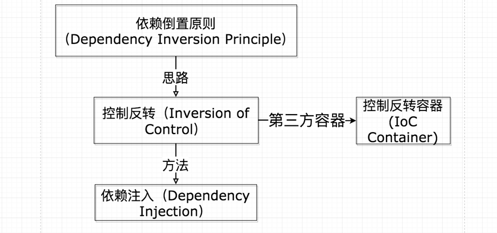
	>
	> -  ==从底层å‘上ä¾æ¬¡æ³¨å…¥==：
	>
	> 	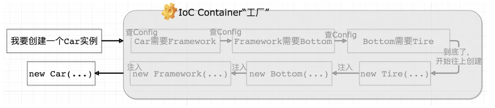
	>
	> - ==DI(Dependecy Inject,ä¾èµ–注入==)是==实现控制å转的一ç§è®¾è®¡æ¨¡å¼==，ä¾èµ–注入就是将==实例å˜é‡==传入到一个对象中去。

2. ==工厂设计模å¼==

      > - Spring使用工厂模å¼å¯ä»¥é€šè¿‡ `BeanFactory` 或 `ApplicationContext` 创建 bean 对象。
      >
      > - ApplicationContext的三个实现类：
      >
      > 	1. `ClassPathXmlApplication`：把上下文文件当æˆç±»è·¯å¾„资æºã€‚
      > 	2. `FileSystemXmlApplication`：从文件系统中的 XML 文件载入上下文定义信æ¯ã€‚
      > 	3. `XmlWebApplicationContext`：从Web系统中的XML文件载入上下文定义信æ¯ã€‚
      >
      > - ```java
      > 	ApplicationContext context = new FileSystemXmlApplicationContext("C:/work/IOC/Containers/springframework.applicationcontext/src/main/resources/bean-factory-config.xml");
      > 	```

3. ==å•ä¾‹è®¾è®¡æ¨¡å¼==

	> - 如果制造出==多个实例==å°±å¯èƒ½ä¼š==导致一些问题==的产生，比如：程åºçš„行为异常ã€èµ„æºä½¿ç”¨è¿‡é‡ã€æˆ–者ä¸ä¸€è‡´æ€§çš„结果。
	>
	> - ==使用å•ä¾‹æ¨¡å¼çš„好处:==
	>
	> 	- 对于频ç¹ä½¿ç”¨çš„对象，å¯ä»¥==çœç•¥åˆ›å»ºå¯¹è±¡æ‰€èŠ±è´¹çš„时间==，这对于那些é‡é‡çº§å¯¹è±¡è€Œè¨€ï¼Œæ˜¯éžå¸¸å¯è§‚的一笔系统开销；
	> 	- 由于 new æ“作的次数å‡å°‘，因而==对系统内存的使用频率也会é™ä½Ž==，这将==å‡è½» GC 压力==，缩短 GC åœé¡¿æ—¶é—´ã€‚
	>
	> - ==Spring 实现å•ä¾‹çš„æ–¹å¼ï¼š==
	>
	> 	- xml : `<bean id="userService" class="top.snailclimb.UserService" scope="singleton"/>`
	> 	- 注解：`@Scope(value = "singleton")`
	>
	> - å•ä¾‹æ¨¡å¼åœ¨ Spring 中的时机è¿ç”¨ï¼š==å•ä¾‹æ³¨å†Œè¡¨==
	>
	> 	```java
	> 	// 通过 ConcurrentHashMap（线程安全） 实现å•ä¾‹æ³¨å†Œè¡¨
	> 	private final Map<String, Object> singletonObjects = new ConcurrentHashMap<String, Object>(64);
	> 	```

4. ==代ç†è®¾è®¡æ¨¡å¼==

	> - ==AOP==(Aspect-Oriented Programming:é¢å‘切é¢ç¼–程)能够将那些与业务无关，==å´ä¸ºä¸šåŠ¡æ¨¡å—所共åŒè°ƒç”¨çš„逻辑或责任（例如事务处ç†ã€æ—¥å¿—管ç†ã€æƒé™æŽ§åˆ¶ç­‰ï¼‰å°è£…èµ·æ¥==，便于==å‡å°‘系统的é‡å¤ä»£ç ==，==é™ä½Žæ¨¡å—间的耦åˆåº¦==，并==有利于未æ¥çš„å¯æ‹“展性和å¯ç»´æŠ¤æ€§==。
	> - ==Spring AOP 就是基于动æ€ä»£ç†çš„==，如果è¦ä»£ç†çš„对象，==实现了æŸä¸ªæŽ¥å£==，那么Spring AOP会使用==JDK Proxy==，去创建代ç†å¯¹è±¡ï¼Œè€Œå¯¹äºŽ==没有实现接å£çš„对象==，就无法使用 JDK Proxy 去进行代ç†äº†ï¼Œè¿™æ—¶å€™Spring AOP会使用==Cglib== ，这时候Spring AOP会使用 ==Cglib== 生æˆä¸€ä¸ªè¢«ä»£ç†å¯¹è±¡çš„å­ç±»æ¥ä½œä¸ºä»£ç†ã€‚
	> - ==Spring AOP 和 AspectJ AOP 有什么区别==?
	> 	- ==Spring AOP 属于è¿è¡Œæ—¶å¢žå¼ºï¼Œè€Œ AspectJ 是编译时增强。== 
	> 	- ==Spring AOP 基于动æ€ä»£ç†==(Proxying)，而 ==AspectJ 基于字节ç æ“作==(Bytecode Manipulation)。

5. ==模æ¿æ–¹æ³•==

	> - 模æ¿æ–¹æ³•æ¨¡å¼æ˜¯ä¸€ç§==行为设计模å¼==，它定义一个æ“作中的==骨架==，而==将一些步骤延迟到å­ç±»==中。 

6. ==观察者模å¼==

	> - 观察者模å¼æ˜¯ä¸€ç§å¯¹è±¡è¡Œä¸ºåž‹æ¨¡å¼ã€‚它表示的是一ç§==对象与对象之间具有ä¾èµ–关系==，当==一个对象å‘生改å˜çš„时候，这个对象所ä¾èµ–的对象也会åšå‡ºå应==。==Spring 事件驱动模型==就是观察者模å¼å¾ˆç»å…¸çš„一个应用。
	>
	> - ==Spring 的事件æµç¨‹æ€»ç»“==：
	>
	> 	1. 定义一个==事件==: 实现一个继承自 `ApplicationEvent`，并且写相应的构造函数；
	> 	2. 定义一个==事件监å¬è€…==：实现 `ApplicationListener` 接å£ï¼Œé‡å†™ `onApplicationEvent()` 方法；
	> 	3. 使用==事件å‘布者==å‘布消æ¯: å¯ä»¥é€šè¿‡ `ApplicationEventPublisher` çš„ `publishEvent()` 方法å‘布消æ¯ã€‚
	>
	> - ==示例==：
	>
	> 	```java
	> 	// 定义一个事件,继承自ApplicationEvent并且写相应的构造函数
	> 	public class DemoEvent extends ApplicationEvent{
	> 	    private static final long serialVersionUID = 1L;
	> 																																																																	
	> 	    private String message;
	> 																																																																	
	> 	    public DemoEvent(Object source,String message){
	> 	        super(source);
	> 	        this.message = message;
	> 	    }
	> 																																																																	
	> 	    public String getMessage() {
	> 	        return message;
	> 	    }
	> 	}
	> 																																																																	
	> 	// 定义一个事件监å¬è€…,实现ApplicationListener接å£ï¼Œé‡å†™ onApplicationEvent() 方法；
	> 	@Component
	> 	public class DemoListener implements ApplicationListener<DemoEvent>{
	> 																																																																	
	> 	    //使用onApplicationEvent接收消æ¯
	> 	    @Override
	> 	    public void onApplicationEvent(DemoEvent event) {
	> 	        String msg = event.getMessage();
	> 	        System.out.println("接收到的信æ¯æ˜¯ï¼š"+msg);
	> 	    }
	> 	}
	> 																																																																	
	> 	// å‘布事件，å¯ä»¥é€šè¿‡ApplicationEventPublisher  çš„ publishEvent() 方法å‘布消æ¯ã€‚
	> 	@Component
	> 	public class DemoPublisher {
	> 																																																																	
	> 	    @Autowired
	> 	    ApplicationContext applicationContext;
	> 																																																																	
	> 	    public void publish(String message){
	> 	        //å‘布事件
	> 	        applicationContext.publishEvent(new DemoEvent(this, message));
	> 	    }
	> 	}
	> 	```

7. ==适é…器模å¼==

	> - 适é…器模å¼(Adapter Pattern) ==将一个接å£è½¬æ¢æˆå®¢æˆ·å¸Œæœ›çš„å¦ä¸€ä¸ªæŽ¥å£==，适é…器模å¼ä½¿æŽ¥å£ä¸å…¼å®¹çš„那些类å¯ä»¥ä¸€èµ·å·¥ä½œï¼Œå…¶åˆ«å为包装器(Wrapper)。
	> - ==Spring AOP== 中的应用：Spring 预定义的==通知è¦é€šè¿‡å¯¹åº”的适é…器，适é…æˆ `MethodInterceptor`(方法拦截器)类型的对象==。
	> - ==Spring MVC== 中的应用：`DispatcherServlet` æ ¹æ®è¯·æ±‚ä¿¡æ¯è°ƒç”¨ `HandlerMapping`，解æžè¯·æ±‚对应的 `Handler`。==解æžåˆ°å¯¹åº”çš„ `Handler`（也就是我们平常说的 `Controller` 控制器）åŽï¼Œå¼€å§‹ç”±`HandlerAdapter` 适é…器处ç†ã€‚`HandlerAdapter` 作为期望接å£ï¼Œå…·ä½“的适é…器实现类用于对目标类进行适é…==，`Controller` 作为需è¦é€‚é…的类。
	> - ==为什么è¦åœ¨ Spring MVC 中使用适é…器模å¼==？
	> 	-  Spring MVC 中的 `Controller` ç§ç±»ä¼—多，==ä¸åŒç±»åž‹çš„ `Controller` 通过ä¸åŒçš„方法æ¥å¯¹è¯·æ±‚进行处ç†==。如果==ä¸åˆ©ç”¨é€‚é…器模å¼çš„è¯ï¼Œ`DispatcherServlet` 直接获å–对应类型的 `Controller`，需è¦çš„自行æ¥åˆ¤æ–­ Controller 的类型==。
	> 	- å‡å¦‚我们==å†å¢žåŠ ä¸€ä¸ª `Controller `类型就è¦å†åŠ å…¥ä¸€è¡Œåˆ¤æ–­è¯­å¥==，这ç§å½¢å¼å°±ä½¿å¾—程åºéš¾ä»¥ç»´æŠ¤ï¼Œä¹Ÿè¿å了设计模å¼ä¸­çš„开闭原则 – ==对扩展开放，对修改关闭==。

8. ==装饰者模å¼==

	> - 当我们需è¦==修改原有的功能，但我们åˆä¸æ„¿ç›´æŽ¥åŽ»ä¿®æ”¹åŽŸæœ‰çš„代ç ==时，==设计一个Decorator套在原有代ç å¤–é¢==。其实在 JDK 中就有很多地方用到了装饰者模å¼ï¼Œ==比如 `InputStream`家æ—，`InputStream` 类下有 `FileInputStream` (读å–文件)ã€`BufferedInputStream` (增加缓存,使读å–文件速度大大æå‡)ç­‰å­ç±»éƒ½åœ¨ä¸ä¿®æ”¹`InputStream` 代ç çš„情况下扩展了它的功能==。

9. ==总结==：

	> - ==工厂设计模å¼== : Spring使用工厂模å¼é€šè¿‡ `BeanFactory`ã€`ApplicationContext` 创建 bean 对象。
	> - ==代ç†è®¾è®¡æ¨¡å¼== : ==Spring AOP 功能的实现==。
	> - ==å•ä¾‹è®¾è®¡æ¨¡å¼== : Spring 中的 Bean 默认都是å•ä¾‹ï¼ˆsingleton）的。
	> - ==模æ¿æ–¹æ³•æ¨¡å¼== : Spring 中==`jdbcTemplate`ã€`hibernateTemplate` 等以 Template 结尾的对数æ®åº“æ“作的类，它们就使用到了模æ¿æ¨¡å¼==。
	> - ==装饰者设计模å¼== : 我们的项目需è¦è¿žæŽ¥å¤šä¸ªæ•°æ®åº“，而且==ä¸åŒçš„客户在æ¯æ¬¡è®¿é—®ä¸­æ ¹æ®éœ€è¦ä¼šåŽ»è®¿é—®ä¸åŒçš„æ•°æ®åº“==。这ç§æ¨¡å¼è®©æˆ‘们å¯ä»¥==æ ¹æ®å®¢æˆ·çš„需求能够动æ€åˆ‡æ¢ä¸åŒçš„æ•°æ®æº==。
	> - ==观察者模å¼==： ==Spring 事件驱动模型==就是观察者模å¼å¾ˆç»å…¸çš„一个应用。
	> - ==适é…器模å¼== : Spring AOP 的增强或通知(Advice)使用到了适é…器模å¼ã€==spring MVC 中也是用到了适é…器模å¼é€‚é…`Controller`==。

---


### 2.什么是å•ä¾‹æ¨¡å¼ï¼ŸðŸŒŸðŸŒŸðŸŒŸðŸŒŸðŸŒŸ

1. 如果å•ä¾‹åˆå§‹å€¼æ˜¯null，还未构建，则构建å•ä¾‹å¯¹è±¡å¹¶è¿”回。这个写法属于å•ä¾‹æ¨¡å¼å½“中的==懒汉模å¼ã€‚==

2. 如果å•ä¾‹å¯¹è±¡ä¸€å¼€å§‹å°±è¢«new Singleton()主动构建，则ä¸å†éœ€è¦åˆ¤ç©ºæ“作，这ç§å†™æ³•å±žäºŽ==饿汉模å¼==。

3. 多线程下的线程安全问题，==创建多个对象==：

	> 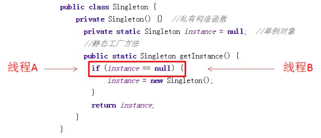

4. ==éšè—的线程安全问题==：

	> - ==先看看改进åŽå­˜åœ¨éšè—线程安全问题的代ç ==：
	>
	> 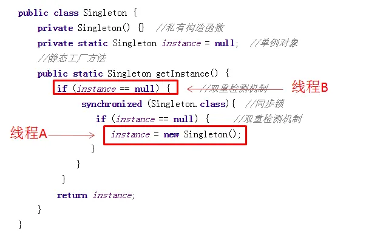
	>
	> - ==线程安全问题的原因==：==指令é‡æŽ’==
	>
	> 	- 比如java中简å•çš„ä¸€å¥ instance = new Singleton，会被编译器编译æˆå¦‚下JVM指令：
	>
	> 		```java
	> 		memory = allocate();  //1：分é…对象的内存空间 
	> 		
	> 		ctorInstance(memory); //2：åˆå§‹åŒ–对象 
	> 		
	> 		instance = memory;   //3：设置instance指å‘刚分é…çš„å†…å­˜åœ°å€ 
	> 		```
	>
	> 		但是这些指令顺åºå¹¶éžä¸€æˆä¸å˜ï¼Œ==有å¯èƒ½ä¼šç»è¿‡JVMå’ŒCPU的优化，指令é‡æŽ’æˆä¸‹é¢çš„顺åº==：
	>
	> 		```java
	> 		memory = allocate();  //1：分é…对象的内存空间 
	> 		
	> 		instance = memory;   //3：设置instance指å‘刚分é…çš„å†…å­˜åœ°å€ 
	> 		
	> 		ctorInstance(memory); //2：åˆå§‹åŒ–对象 
	> 		```
	>
	> 	- 当线程A执行完1,3,时，==instance对象还未完æˆåˆå§‹åŒ–，但已ç»ä¸å†æŒ‡å‘null==。此时如果线程B抢å åˆ°CPU资æºï¼Œæ‰§è¡Œ if（instance == null）的结果会是 ==false==，从而返回一个==没有åˆå§‹åŒ–完æˆçš„instance对象==。
	>
	> 		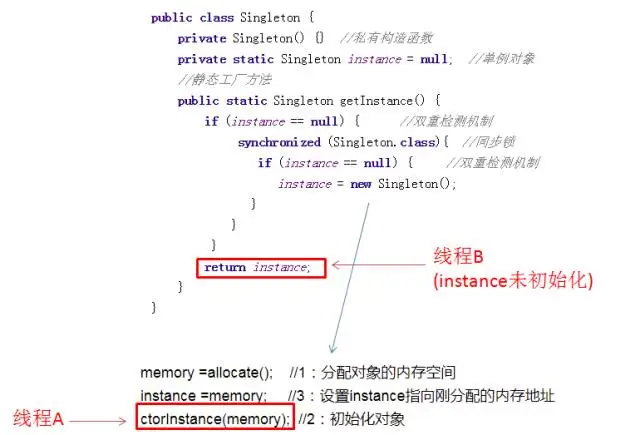
	>
	> 	- 解决方å¼ï¼š==ç»™å•ä¾‹å¯¹è±¡åŠ ä¸Š volatile 修饰符 `private static volatile instance`，é¿å…编译期é‡æŽ’åº==。

5. ==用é™æ€å†…部类实现å•ä¾‹æ¨¡å¼==：

	> - ```java
	> 	public class Singleton {
	> 	    private static class LazyHolder {
	> 	        private static final Singleton INSTANCE = new Singleton();
	> 	    }
	> 	    private Singleton (){}
	> 	    public static Singleton getInstance() {
	> 	        return LazyHolder.INSTANCE;
	> 	    }
	> 	}
	> 	```
	>
	> - INSTANCE对象åˆå§‹åŒ–的时机并ä¸æ˜¯åœ¨å•ä¾‹ç±»Singleton被加载的时候，而是在==调用getInstance方法的时候，使得é™æ€å†…部类LazyHolder被加载==。因此这ç§å®žçŽ°æ–¹å¼æ˜¯åˆ©ç”¨==classloader的加载机制==æ¥å®žçŽ°==懒加载==，并ä¿è¯æž„建å•ä¾‹çš„线程安全。

6. ==利用å射打破å•ä¾‹==：

	> - ```java
	> 	//获得构造器
	> 	Constructor con = Singleton.class.getDeclaredConstructor();
	> 	//设置为å¯è®¿é—®
	> 	con.setAccessible(true);
	> 	//构造两个ä¸åŒçš„对象
	> 	Singleton singleton1 = (Singleton)con.newInstance();
	> 	Singleton singleton2 = (Singleton)con.newInstance();
	> 	//验è¯æ˜¯å¦æ˜¯ä¸åŒå¯¹è±¡
	> 	System.out.println(singleton1.equals(singleton2)); // false
	> 	```

7. ==用枚举实现å•ä¾‹æ¨¡å¼==：

	> ```java
	> public enum SingletonEnum {
	>     INSTANCE;
	> }
	> ```
	>
	> ==有了 enum 语法糖，JVM 会阻止å射获å–枚举类的ç§æœ‰æž„造方法==。
	>
	> ==å†æ¬¡å°è¯•ä½¿ç”¨å射打破å•ä¾‹æ—¶æŠ¥é”™==：
	>
	> ```java
	> Exception in thread "main" java.lang.NoSuchMethodException: com.xiaohui.singleton.test.SingletonEnum.<init>()
	> ```
	>
	> ==缺点==：==饿汉å¼åŠ è½½==。

8. ==总结==：

	> - 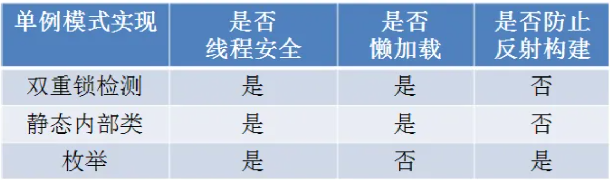
	> - 使用枚举实现的å•ä¾‹æ¨¡å¼ï¼Œä¸ä½†å¯ä»¥é˜²æ­¢åˆ©ç”¨å射强行构建å•ä¾‹å¯¹è±¡ï¼Œè€Œä¸”å¯ä»¥åœ¨æžšä¸¾ç±»å¯¹è±¡è¢«==ååºåˆ—化==的时候，ä¿è¯ååºåˆ—çš„==返回结果是åŒä¸€å¯¹è±¡==。
	> - 对于==其他方å¼å®žçŽ°çš„å•ä¾‹æ¨¡å¼==，如果既想è¦åšåˆ°å¯==åºåˆ—化，åˆæƒ³è¦ååºåˆ—化为åŒä¸€å¯¹è±¡ï¼Œåˆ™å¿…须实现 readResolve 方法==。

---


### 3.什么是代ç†æ¨¡å¼ï¼ŸðŸŒŸðŸŒŸðŸŒŸðŸŒŸ

1. ==é™æ€ä»£ç†==：==写死代ç†çš„类，缺点是泛用性差==，比如我想给很多类添加åŒä¸€ä¸ªåŠŸèƒ½ï¼Œé‚£æˆ‘总ä¸èƒ½ç»™æ¯ä¸€ä¸ªç±»éƒ½ç¼–写一个代ç†ç±»å§ã€‚

2. ==实现InvocationHandler接å£ï¼Œå®šä¹‰è°ƒç”¨æ–¹æ³•å‰åŽæ‰€åšçš„事情==：

	```java
	public class StudentInvocationHandler implements InvocationHandler {
	
	    private IStudentService studentService;
	
	    public StudentInvocationHandler(IStudentService studentService){
	        this.studentService = studentService;
	    }
	
	    @Override
	    public Object invoke(Object proxy, Method method, Object[] args) 
	        throws Throwable {
	        System.out.println(method.getName() + "方法调用å‰");
	        method.invoke(studentService, args);
	        System.out.println(method.getName() + "方法调用åŽ");
	        return null;
	    }
	}
	```

3. 通过 ==Proxy 类的 newProxyInstance 方法，动æ€ç”Ÿæˆä»£ç†å¯¹è±¡ studentServiceProxy==：

	```java
	public class Client {
	    public static void main(String[] args) {
	        // åˆå§‹åŒ– studentService
	        IStudentService studentService = new StudentService();
	        
	        //åˆå§‹åŒ– studentInvocationHandler(实现 InvocationHandler 接å£)
	        InvocationHandler studentInvocationHandler = 
	            new StudentInvocationHandler(studentService);
	        
	        // 通过 Proxy.newProxyInstance 获å–代ç†ç±» studentServiceProxy
	        IStudentService studentServiceProxy = (IStudentService) Proxy
	            .newProxyInstance(
	            // 传入 studentInvocationHandler 的类加载器
	            studentInvocationHandler.getClass().getClassLoader(), 
	            // ä¼ å…¥ studentService å®žçŽ°çš„æŽ¥å£        
	            studentService.getClass().getInterfaces(), 
	            // ä¼ å…¥ studentInvocationHandler
	            studentInvocationHandler);
	        
	        studentServiceProxy.insertStudent();
	        studentServiceProxy.deleteStudent();
	    }
	}
	```

4. ==代ç†æ¨¡å¼ vs 装饰器模å¼==

	> 对于原有的类æ¥è¯´ï¼Œ==装饰器==是“自己人â€ï¼Œ==增加的功能是对自身的增强==ï¼›
	>
	> 而==代ç†==是“外人â€ï¼Œ==增加的功能和自身并无直接关系==。

---


### 4.什么是工厂模å¼ï¼ŸðŸŒŸðŸŒŸ

1. 工厂模å¼åœ¨åˆ›å»ºåž‹æ¨¡å¼å½“中比较常用，它并ä¸æ˜¯ä¸€ä¸ªç‹¬ç«‹çš„设计模å¼ï¼Œè€Œæ˜¯==三ç§åŠŸèƒ½æŽ¥è¿‘的设计模å¼çš„统称==。分别为==简å•å·¥åŽ‚模å¼ï¼Œå·¥åŽ‚方法模å¼ï¼ŒæŠ½è±¡å·¥åŽ‚模å¼==。
2. 通过工厂类创建对象并且==æ ¹æ®ä¼ å…¥å‚数决定具体å­ç±»å¯¹è±¡==çš„åšæ³•ï¼Œå°±æ˜¯==简å•å·¥åŽ‚模å¼==。
3. ==æ¯ä¸€ä¸ªå£ç½©å­ç±»éƒ½å¯¹åº”一个工厂å­ç±»ï¼Œåˆ©ç”¨å¤šæ€ç‰¹æ€§åŠ¨æ€åˆ›å»ºå¯¹è±¡çš„模å¼==，就是==工厂方法模å¼==。

---


### 5.什么是观察者模å¼ï¼ŸðŸŒŸðŸŒŸ

1. > 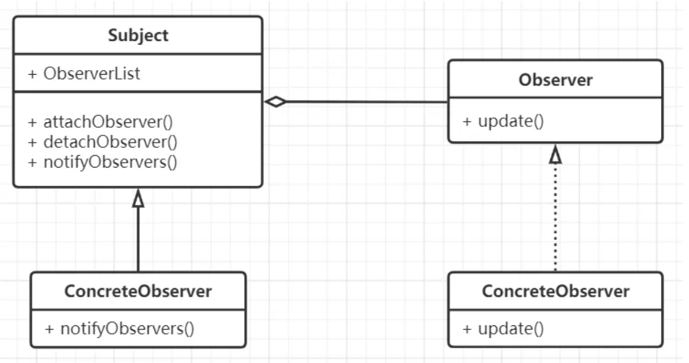

2. 在上é¢çš„UML图中，主è¦æœ‰ä¸¤ç»„实体对象，一组是观察者，一组是被观察者。==所有的观察者，都实现了Observer接å£==ï¼›==所有的被观察者，都继承自Subject抽象类==。

3. ==Subject类的æˆå‘˜OberverList，存储ç€å·²æ³¨å†Œçš„观察者==，当==事件å‘生时，会通知列表中的所有观察者==。需è¦æ³¨æ„的是，OberverList所ä¾èµ–的是的Observer接å£ï¼Œè¿™æ ·å°±é¿å…了观察者与被观察者的紧耦åˆã€‚

4. ==示例，创建 Observer 和 Subject==：

	```java
	//观察者
	public interface Observer {
	    public void update();
	}
	
	//被观察者
	abstract public class Subject {
	
	    private List<Observer> observerList = new ArrayList<Observer>();
	
	    public void attachObserver(Observer observer) {
	        observerList.add(observer);
	    }
	
	    public void detachObserver(Observer observer){
	        observerList.remove(observer);
	    }
	
	    public void notifyObservers(){
	        for (Observer observer: observerList){
	            observer.update();
	        }
	    }
	}
	```

5. 观察者们实现 Observer 接å£ï¼Œè‡ªè¡Œå®žçŽ° update 逻辑

	```java
	//怪物
	public class Monster implements Observer {
	
	    @Override
	    public void update() {
	        if(inRange()){
	            System.out.println("怪物 对主角攻击ï¼");
	        }
	    }
	
	    private boolean inRange(){
	        //判断主角是å¦åœ¨è‡ªå·±çš„å½±å“范围内，这里忽略细节，直接返回true
	        return true;
	    }
	}
	
	//陷阱
	public class Trap implements Observer {
	
	    @Override
	    public void update() {
	        if(inRange()){
	            System.out.println("陷阱 å›°ä½ä¸»è§’ï¼");
	        }
	    }
	
	    private boolean inRange(){
	        //判断主角是å¦åœ¨è‡ªå·±çš„å½±å“范围内，这里忽略细节，直接返回true
	        return true;
	    }
	}
	
	//å®ç‰©
	public class Treasure implements Observer {
	
	    @Override
	    public void update() {
	        if(inRange()){
	            System.out.println("å®ç‰© 为主角加血ï¼");
	        }
	    }
	
	    private boolean inRange(){
	        //判断主角是å¦åœ¨è‡ªå·±çš„å½±å“范围内，这里忽略细节，直接返回true
	        return true;
	    }
	}
	```

	游æˆçš„主角继承 Subject ç±»

	```java
	public class Hero extends Subject{
	    void move(){
	        System.out.println("主角å‘å‰ç§»åŠ¨");
	        notifyObservers(); // 通知所有 Oberser，自己行动了
	    }
	}
	```

---


## 2.Java Web

### 1.什么是å•ç‚¹ç™»å½•ï¼ŸðŸŒŸðŸŒŸðŸŒŸ

1. å•ç‚¹ç™»å½•å°±æ˜¯==在多个系统中，用户åªéœ€ä¸€æ¬¡ç™»å½•ï¼Œå„个系统å³å¯æ„ŸçŸ¥è¯¥ç”¨æˆ·å·²ç»ç™»å½•==。

	> 比如阿里系的==æ·˜å®å’Œå¤©çŒ«==，很明显地我们å¯ä»¥çŸ¥é“这是两个系统，但是你在使用的时候，登录了天猫，淘å®ä¹Ÿä¼šè‡ªåŠ¨ç™»å½•ã€‚

2. 回顾我们当åˆçš„==å•ç³»ç»Ÿç™»å½•==：

	> - 用户登录时，验è¯ç”¨æˆ·çš„账户和密ç ã€‚
	> - 生æˆä¸€ä¸ª LoginToken ä¿å­˜åœ¨æ•°æ®åº“中，将 LoginToken 写到 Cookie 中。
	> - 将用户数æ®ä¿å­˜åœ¨ Session / ThreadLocal 中。
	> - 请求时都会带上 Cookie，检查有没有登录，如果已ç»ç™»å½•åˆ™æ”¾è¡Œï¼›æ²¡æœ‰ç™»å½•åˆ™æ ¹æ® LoginToken 查询对应 User，然åŽå†™å…¥ Session / ThreadLocal 实现自动登录。

3. ==多系统登录的问题==：

	> - ==Sessionä¸å…±äº«é—®é¢˜==
	> - ==Cookie跨域的问题==
	> - ==CAS原ç†==

4. ==Sessionä¸å…±äº«é—®é¢˜==

	> - å•ç³»ç»Ÿç™»å½•åŠŸèƒ½ä¸»è¦æ˜¯ç”¨Sessionä¿å­˜ç”¨æˆ·ä¿¡æ¯æ¥å®žçŽ°çš„，但是：==多系统å³å¯èƒ½æœ‰å¤šä¸ªTomcat==，而==Sessionä¾èµ–的是当å‰ç³»ç»Ÿçš„Tomcat==，所以==系统Açš„Session和系统Bçš„Session==是==ä¸å…±äº«==的。
	>
	> - 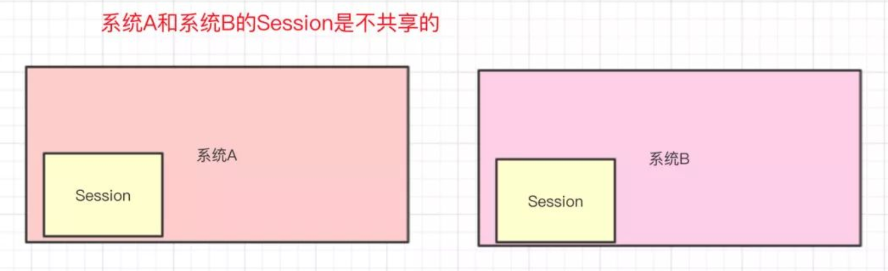
	>
	> - 我们å¯ä»¥å°†ç™»å½•åŠŸèƒ½==å•ç‹¬æŠ½å–==出æ¥ï¼Œåšæˆä¸€ä¸ª==å­ç³»ç»Ÿ==。
	>
	> 	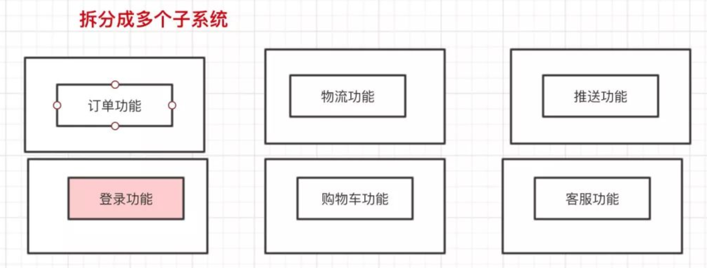
	>
	> 	- ==SSO系统生æˆä¸€ä¸ªtoken，并将用户信æ¯å­˜åˆ°Redis中==，并设置过期时间。
	> 	- ==其他系统请求SSO系统==进行登录，==得到SSO返回的token，写到Cookie==中。
	> 	- æ¯æ¬¡è¯·æ±‚时，Cookie都会带上，==拦截器得到token，判断是å¦å·²ç»ç™»å½•==。
	>
	> 	到这里，其实我们会å‘现其实就两个å˜åŒ–：
	>
	> 	- ==将登陆功能抽å–为一个系统（SSO），其他系统请求SSO进行登录==。
	> 	- ==本æ¥å°†ç”¨æˆ·ä¿¡æ¯å­˜åˆ°Session，现在将用户信æ¯å­˜åˆ°Redis==。

5. ==Cookie跨域的问题==

	> - ==Cookie是ä¸èƒ½è·¨åŸŸçš„==。比如说，我们请求`<https://www.google.com/>`时，æµè§ˆå™¨ä¼šè‡ªåŠ¨æŠŠ`google.com`çš„Cookie带过去给`google`çš„æœåŠ¡å™¨ï¼Œè€Œä¸ä¼šæŠŠ`<https://www.baidu.com/>`çš„Cookie带过去给`google`çš„æœåŠ¡å™¨ã€‚
	> - ==由于域åä¸åŒ==，用户å‘系统A登录åŽï¼Œ==系统A返回给æµè§ˆå™¨çš„Cookie，用户å†è¯·æ±‚系统B的时候ä¸ä¼šå°†ç³»ç»ŸAçš„Cookie带过去==。
	> - ==解决方案==：
	> 	1. æœåŠ¡ç«¯å°†Cookie写到客户端åŽï¼Œ==客户端对Cookie进行解æžï¼Œå°†Token解æžå‡ºæ¥==，==æ­¤åŽè¯·æ±‚都把这个Token带上就行了==。
	> 	2. ==多个域å共享Cookie==，在写到客户端的时候==设置Cookieçš„domain==。
	> 	3. å°†Tokenä¿å­˜åœ¨SessionStroage中（==ä¸ä¾èµ–Cookie==就没有跨域的问题了）

6. ==CAS原ç†==

	> - 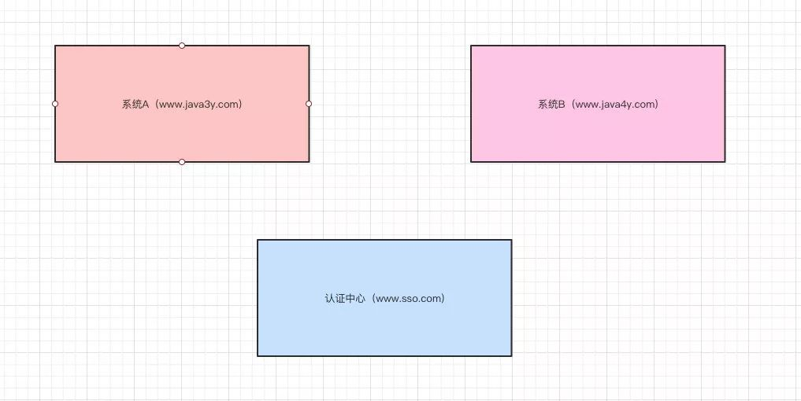
	> - 系统A`www.java3y.com`å‘现用户并没有登录，于是==é‡å®šå‘到sso认è¯ä¸­å¿ƒï¼Œå¹¶å°†è‡ªå·±çš„地å€ä½œä¸ºå‚æ•°==：==`www.sso.com?service=www.java3y.com`==。
	> - sso认è¯ä¸­å¿ƒå‘现用户未登录，将用户引导至登录页é¢ï¼Œç”¨æˆ·è¿›è¡Œè¾“入用户å和密ç è¿›è¡Œç™»å½•ï¼Œ==用户与认è¯ä¸­å¿ƒ==建立==全局会è¯ï¼ˆç”Ÿæˆä¸€ä»½Token，写到Cookie中，ä¿å­˜åœ¨æµè§ˆå™¨ä¸Šï¼‰==。
	> - éšåŽï¼Œè®¤è¯ä¸­å¿ƒ==é‡å®šå‘回系统A==，并把Tokenæºå¸¦è¿‡åŽ»ç»™ç³»ç»ŸA，é‡å®šå‘的地å€å¦‚下：==`www.java3y.com?token=xxxxxxx`==。
	> - 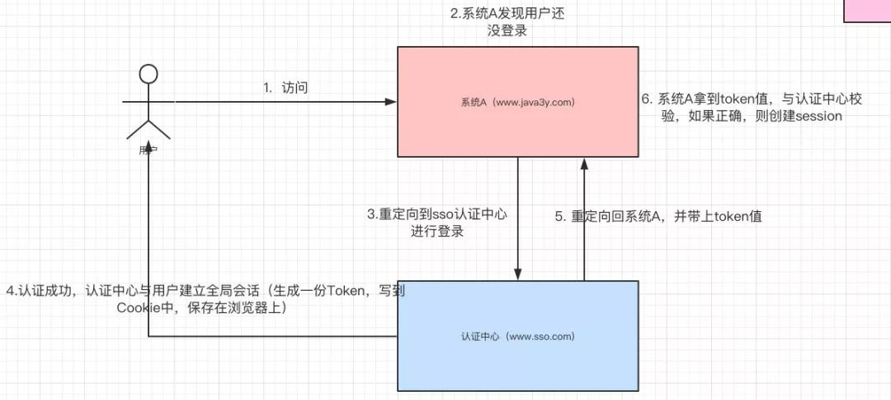
	> - 此时，用户想è¦è®¿é—®ç³»ç»ŸB`www.java4y.com`å—é™çš„资æº(比如说订å•åŠŸèƒ½ï¼Œè®¢å•åŠŸèƒ½éœ€è¦ç™»å½•åŽæ‰èƒ½è®¿é—®)，系统B`www.java4y.com`å‘现用户并没有登录，于是==é‡å®šå‘到sso认è¯ä¸­å¿ƒï¼Œå¹¶å°†è‡ªå·±çš„地å€ä½œä¸ºå‚æ•°==。认è¯ä¸­å¿ƒ==æ ¹æ®å¸¦è¿‡æ¥çš„Cookie==å‘现==å·²ç»ä¸Žç”¨æˆ·å»ºç«‹äº†å…¨å±€ä¼šè¯==了，认è¯ä¸­å¿ƒ==é‡å®šå‘回系统B==，并把==Tokenæºå¸¦è¿‡åŽ»ç»™ç³»ç»ŸB==。
	> - 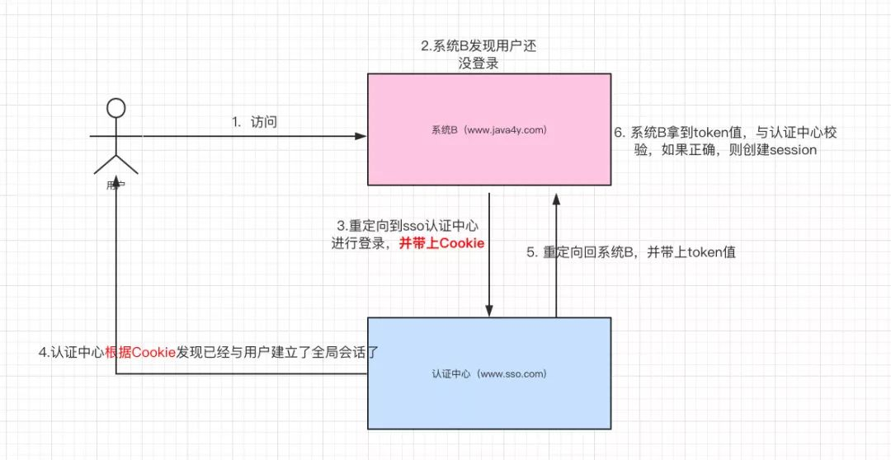
	> - 看到这里，其实SSO认è¯ä¸­å¿ƒå°±ç±»ä¼¼ä¸€ä¸ª==中转站==。

---


### 2.é¢è¯•é¢˜ï¼šç»™æˆ‘说一下你项目中的å•ç‚¹ç™»å½•æ˜¯å¦‚何实现的？🌟🌟🌟

1. ==http无状æ€åè®®==

	> - ==http是无状æ€åè®®==，æµè§ˆå™¨çš„æ¯ä¸€æ¬¡è¯·æ±‚，æœåŠ¡å™¨ä¼šç‹¬ç«‹å¤„ç†ï¼Œ==ä¸ä¸Žä¹‹å‰æˆ–之åŽçš„请求产生关è”==。
	> - 
	> - ==既然httpå议无状æ€ï¼Œé‚£å°±è®©æœåŠ¡å™¨å’Œæµè§ˆå™¨å…±åŒç»´æŠ¤ä¸€ä¸ªçŠ¶æ€å§==ï¼è¿™å°±æ˜¯==会è¯æœºåˆ¶==。

2. ==会è¯æœºåˆ¶==

	> - æµè§ˆå™¨ç¬¬ä¸€æ¬¡è¯·æ±‚æœåŠ¡å™¨ï¼Œ==æœåŠ¡å™¨åˆ›å»ºä¸€ä¸ªä¼šè¯ï¼Œå¹¶å°†ä¼šè¯çš„id作为å“应的一部分å‘é€ç»™æµè§ˆå™¨==，æµè§ˆå™¨å­˜å‚¨ä¼šè¯id，==并在åŽç»­ç¬¬äºŒæ¬¡å’Œç¬¬ä¸‰æ¬¡è¯·æ±‚中带上会è¯id，æœåŠ¡å™¨å–得请求中的会è¯id就知é“是ä¸æ˜¯åŒä¸€ä¸ªç”¨æˆ·äº†==。
	> - 
	> - tomcat会è¯æœºåˆ¶å½“然也实现了cookie，访问tomcatæœåŠ¡å™¨æ—¶ï¼Œæµè§ˆå™¨ä¸­å¯ä»¥çœ‹åˆ°ä¸€ä¸ªå为“==JSESSIONIDâ€çš„cookie，这就是tomcat会è¯æœºåˆ¶ç»´æŠ¤çš„会è¯id==。
	> - 

3. ==登录状æ€==

	> - 
	> - ==以上讨论，都是在å•ç³»ç»Ÿçš„范畴中==。

4. ==多系统的å¤æ‚性==

	> - ==web系统早已从久远的å•ç³»ç»Ÿå‘展æˆä¸ºå¦‚今由多系统组æˆçš„应用群==，é¢å¯¹å¦‚此众多的系统，用户==éš¾é“è¦ä¸€ä¸ªä¸€ä¸ªç™»å½•ã€ç„¶åŽä¸€ä¸ªä¸€ä¸ªæ³¨é”€==å—？就åƒä¸‹å›¾æ述的这样：
	>
	> 	
	>
	> - 虽然å•ç³»ç»Ÿçš„登录解决方案很完美，但对于多系统应用群已ç»ä¸å†é€‚用了，为什么呢？
	>
	> 	- ==Cookie ä¸èƒ½è·¨åŸŸ==。
	>
	> 	
	>
	> - ==共享 Cookie== 解决 Cookie 跨域问题：
	>
	> 	- 既然这样，为什么ä¸å°†web应用群中所有å­ç³»ç»Ÿçš„域å统一在一个顶级域å下，例如“*.baidu.comâ€ï¼Œç„¶åŽ==将它们的cookie域设置为“baidu.comâ€==，这ç§åšæ³•ç†è®ºä¸Šæ˜¯å¯ä»¥çš„，甚至早期很多多系统登录就采用这ç§==åŒåŸŸå共享cookie==çš„æ–¹å¼ã€‚
	> 	- 然而，å¯è¡Œå¹¶ä¸ä»£è¡¨å¥½ï¼Œå…±äº«cookieçš„æ–¹å¼å­˜åœ¨==众多局é™==。
	> 		1. 首先，==应用群域å得统一==ï¼›
	> 		2. 其次，应用群å„系统使用的技术（==至少是webæœåŠ¡å™¨ï¼‰è¦ç›¸åŒ==，==ä¸ç„¶cookieçš„key值（tomcat为JSESSIONID）ä¸åŒï¼Œæ— æ³•ç»´æŒä¼šè¯==ï¼›
	> 		3. 共享cookieçš„æ–¹å¼æ˜¯==无法实现跨语言技术平å°ç™»å½•==的，比如javaã€phpã€.net系统之间；第三，cookie本身ä¸å®‰å…¨ã€‚

5. ==å•ç‚¹ç™»å½•==

	> - å•ç‚¹ç™»å½•å…¨ç§°Single Sign On（以下简称SSO），是指==在多系统应用群中登录一个系统，便å¯åœ¨å…¶ä»–所有系统中得到授æƒè€Œæ— éœ€å†æ¬¡ç™»å½•==。
	> - 
	> - ==对上图的解释==：
	> 	1. 用户访问系统1çš„å—ä¿æŠ¤èµ„æºï¼Œç³»ç»Ÿ1å‘现用户未登录，==é‡å®šå‘至sso认è¯ä¸­å¿ƒï¼Œå¹¶å°†è‡ªå·±çš„地å€ä½œä¸ºå‚æ•°==。
	> 	2. sso认è¯ä¸­å¿ƒå‘现用户未登录，将用户引导至登录页é¢ã€‚
	> 	3. 用户输入用户å密ç æ交登录申请。
	> 	4. sso认è¯ä¸­å¿ƒæ ¡éªŒç”¨æˆ·ä¿¡æ¯ï¼Œ==创建用户与sso认è¯ä¸­å¿ƒä¹‹é—´çš„会è¯ï¼Œç§°ä¸ºå…¨å±€ä¼šè¯==，åŒæ—¶==创建授æƒä»¤ç‰Œ==。
	> 	5. sso认è¯ä¸­å¿ƒå¸¦ç€ä»¤ç‰Œè·³è½¬å›žæœ€åˆçš„请求地å€ï¼ˆç³»ç»Ÿ1）
	> 	6. ==系统1拿到令牌==，去sso认è¯ä¸­å¿ƒ==校验令牌是å¦æœ‰æ•ˆ==。
	> 	7. ==sso认è¯ä¸­å¿ƒæ ¡éªŒä»¤ç‰Œï¼Œè¿”回有效，注册系统1==。
	> 	8. ==系统1使用该令牌创建与用户的会è¯ï¼Œç§°ä¸ºå±€éƒ¨ä¼šè¯==，返回å—ä¿æŠ¤èµ„æºã€‚
	> 	9. 用户访问系统2çš„å—ä¿æŠ¤èµ„æºã€‚
	> 	10. 系统2å‘现用户未登录，跳转至sso认è¯ä¸­å¿ƒï¼Œå¹¶å°†è‡ªå·±çš„地å€ä½œä¸ºå‚数。
	> 	11. ==sso认è¯ä¸­å¿ƒå‘现用户已登录（全局会è¯ï¼‰ï¼Œè·³è½¬å›žç³»ç»Ÿ2的地å€ï¼Œå¹¶é™„上令牌==。
	> 	12. 系统2拿到令牌，去sso认è¯ä¸­å¿ƒæ ¡éªŒä»¤ç‰Œæ˜¯å¦æœ‰æ•ˆã€‚
	> 	13. sso认è¯ä¸­å¿ƒæ ¡éªŒä»¤ç‰Œï¼Œè¿”回有效，注册系统2。
	> 	14. 系统2使用该令牌创建与用户的局部会è¯ï¼Œè¿”回å—ä¿æŠ¤èµ„æºã€‚
	> - ==用户登录æˆåŠŸä¹‹åŽï¼Œä¼šä¸Žsso认è¯ä¸­å¿ƒåŠå„个å­ç³»ç»Ÿå»ºç«‹ä¼šè¯==。
	> - 用户==与sso认è¯ä¸­å¿ƒå»ºç«‹çš„会è¯ç§°ä¸ºå…¨å±€ä¼šè¯==，用户==与å„个å­ç³»ç»Ÿå»ºç«‹çš„会è¯ç§°ä¸ºå±€éƒ¨ä¼šè¯==。
	> - ==局部会è¯å»ºç«‹ä¹‹åŽï¼Œç”¨æˆ·è®¿é—®å­ç³»ç»Ÿå—ä¿æŠ¤èµ„æºå°†ä¸å†é€šè¿‡sso认è¯ä¸­å¿ƒ==。

6. ==å•ç‚¹æ³¨é”€==

	> - å•ç‚¹ç™»å½•è‡ªç„¶ä¹Ÿè¦å•ç‚¹æ³¨é”€ï¼Œ==在一个å­ç³»ç»Ÿä¸­æ³¨é”€ï¼Œæ‰€æœ‰å­ç³»ç»Ÿçš„会è¯éƒ½å°†è¢«é”€æ¯==。
	>
	> 	
	>
	> - ==解释==：
	>
	> 	1. 用户å‘系统1å‘起注销请求。
	> 	2. 系统1æ ¹æ®ç”¨æˆ·ä¸Žç³»ç»Ÿ1建立的会è¯id拿到令牌，å‘sso认è¯ä¸­å¿ƒå‘起注销请求。
	> 	3. sso认è¯ä¸­å¿ƒæ ¡éªŒä»¤ç‰Œæœ‰æ•ˆï¼Œ==销æ¯å…¨å±€ä¼šè¯ï¼ŒåŒæ—¶å–出所有用此令牌注册的系统地å€==。
	> 	4. sso认è¯ä¸­å¿ƒ==å‘所有注册系统å‘起注销请求==。
	> 	5. ==å„注册系统接收sso认è¯ä¸­å¿ƒçš„注销请求，销æ¯å±€éƒ¨ä¼šè¯==。
	> 	6. sso认è¯ä¸­å¿ƒå¼•å¯¼ç”¨æˆ·è‡³ç™»å½•é¡µé¢ã€‚

7. ==部署图==

	> - å•ç‚¹ç™»å½•æ¶‰åŠsso认è¯ä¸­å¿ƒä¸Žä¼—å­ç³»ç»Ÿï¼Œå­ç³»ç»Ÿä¸Žsso认è¯ä¸­å¿ƒéœ€è¦é€šä¿¡ä»¥äº¤æ¢ä»¤ç‰Œã€æ ¡éªŒä»¤ç‰ŒåŠå‘起注销请求，因而==å­ç³»ç»Ÿå¿…须集æˆsso的客户端==，==sso认è¯ä¸­å¿ƒåˆ™æ˜¯ssoæœåŠ¡ç«¯==，==整个å•ç‚¹ç™»å½•è¿‡ç¨‹å®žè´¨æ˜¯sso客户端与æœåŠ¡ç«¯é€šä¿¡çš„过程==，用下图æ述：
	>
	> 	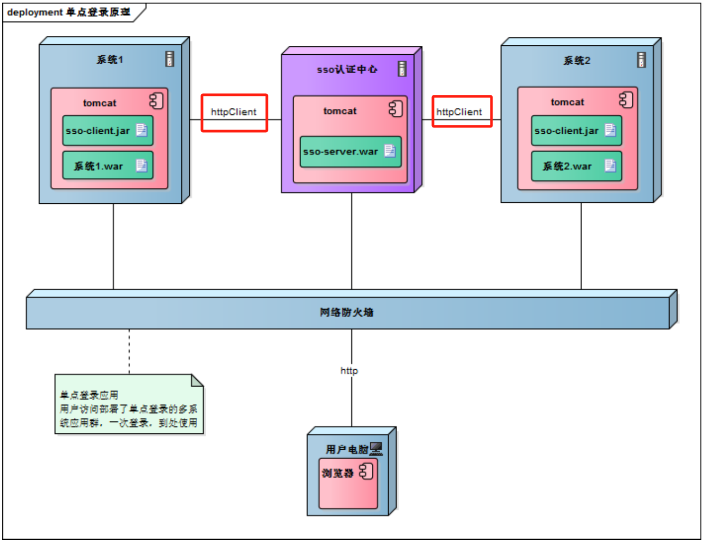

8. ==实现==

	> - sso-server å’Œ sso-cli 需è¦å®žçŽ°çš„功能：
	> 	- ==sso-client==
	> 		1. ==拦截å­ç³»ç»Ÿæœªç™»å½•ç”¨æˆ·è¯·æ±‚，跳转至sso认è¯ä¸­å¿ƒ==
	> 		2. ==接收并存储sso认è¯ä¸­å¿ƒå‘é€çš„令牌==
	> 		3. ==与sso-server通信，校验令牌的有效性==
	> 		4. ==建立局部会è¯==
	> 		5. ==拦截用户注销请求，å‘sso认è¯ä¸­å¿ƒå‘é€æ³¨é”€è¯·æ±‚==
	> 		6. ==接收sso认è¯ä¸­å¿ƒå‘出的注销请求，销æ¯å±€éƒ¨ä¼šè¯==
	> 	- ==sso-server==
	> 		1. ==验è¯ç”¨æˆ·çš„登录信æ¯==
	> 		2. ==创建全局会è¯==
	> 		3. ==创建授æƒä»¤ç‰Œ==
	> 		4. ==与sso-client通信å‘é€ä»¤ç‰Œ==
	> 		5. ==校验sso-client令牌有效性==
	> 		6. ==系统地å€æ³¨å†Œ==
	> 		7. ==接收sso-client注销请求，注销所有会è¯==

---


### 3.Servlet 的执行æµç¨‹ðŸŒŸðŸŒŸ

1. æµè§ˆå™¨ç»™ tomcat å‘é€è¯·æ±‚。
2. tomcat æ ¹æ®æ”¶åˆ°çš„ url ==在 web.xml 中查找对应的 servlet==，==如果该 servlet 是第一次被访问，则进行实例化==。并将其输出结果返回给æµè§ˆå™¨ã€‚

---


### 4.Servlet 生命周期🌟🌟

1. > 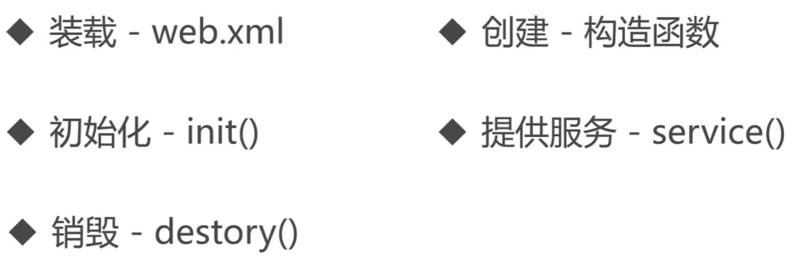

---


### 5.请求转å‘与å“应é‡å®šå‘的区别🌟🌟

1. ==请求转å‘==：

	> 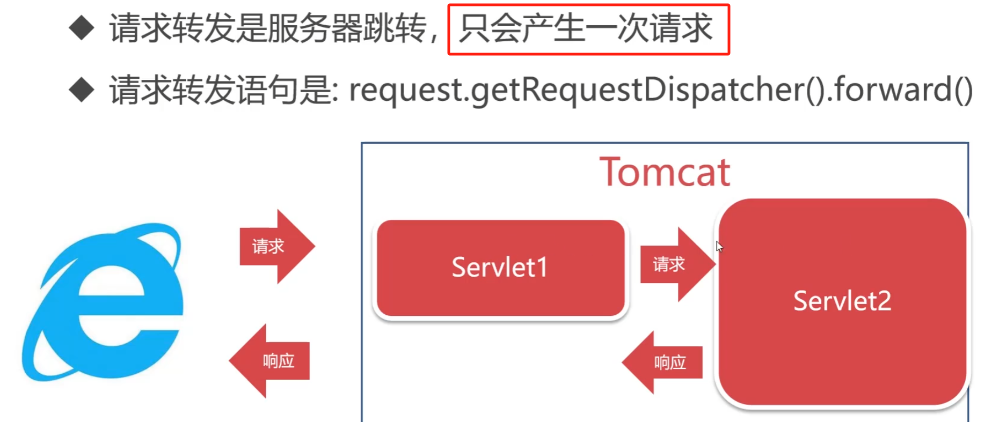
	>
	> - ==æœåŠ¡å™¨è·³è½¬==。
	> - ==åªæœ‰ä¸€æ¬¡è¯·æ±‚（request 是相åŒçš„）==。

2. ==å“应é‡å®šå‘==：

	> 
	>
	> - ==æµè§ˆå™¨è·³è½¬ï¼Œåœ°å€æ å˜åŒ–==。
	> - ==第一次请求返回的请求，è¦æ±‚æµè§ˆå™¨é‡æ–°è®¿é—®å¦ä¸€ä¸ª url==。

---


### 6.Statement 和 PreparedStatement 的区别🌟🌟

1. PreparedStatement 是==预编译的 SQL 语å¥==，效率高于 Statement。

2. PreparedStatement ==æ”¯æŒ ? æ“作符==，相对于 Statement 更加çµæ´»ã€‚

3. PreparedStatement ==å¯ä»¥é˜²æ­¢ SQL 注入==。

4. ==PreparedStatement==：

	```sql
	select * from user where username = ?
	```

	å‡å¦‚查询很多次，==åªéœ€è¦è§£é‡Šä¸€æ¬¡ï¼Œå› ä¸º sql 没有改å˜ï¼Œåªéœ€å¡«å…¥ä¸åŒå‚æ•°==。

	而 ==Statement 则会解释很多次，因为 sql 直接拼接而æ¥ï¼Œå› æ­¤æ¯æ¬¡çš„ sql 都ä¸åŒ==。

	==将传入的å‚数的特殊字符转移防止 sql 注入==。

---


## 3.框架

### 1.Spring 的本质系列 (1) — ä¾èµ–注入🌟🌟🌟🌟🌟

1. ==Spring ä¾èµ–注入==

	> - ==步骤==：
	>
	> 	1. 解æžxml，获å–å„ç§å…ƒç´ 
	> 	2. 通过 ==Java åå°„==把å„个 bean 的实例创建起æ¥ï¼š com.coderising.OrderProcessor，OrderServiceImpl，EmailServiceImpl。
	> 	3. 还是通过 ==Java åå°„==调用 OrderProcessor 的两个方法：setOrderService(….) å’Œ setEmailService(…) 把orderService，emailService 实例 注入进去。
	>
	> - ```java
	> 	XmlAppContext ctx = new XmlAppContext("c:\\bean.xml");
	> 																																																															
	> 	OrderProcessor op = (OrderProcessor) ctx.getBean("order-processor");
	> 																																																															
	> 	op.process();
	> 	```
	>
	> - ==既然对象的创建过程和装é…过程都是Springåšçš„， é‚£Spring 在这个过程中就å¯ä»¥çŽ©å¾ˆå¤šæŠŠæˆäº†ï¼Œ 比如对你的业务类åšç‚¹å­—节ç çº§åˆ«çš„增强， æžç‚¹AOP什么的， 这都ä¸åœ¨è¯ä¸‹äº†==。

---


### 2.Spring的本质系列 (2) — AOP🌟🌟🌟🌟🌟

实现 AOP 的几ç§æŠ€æœ¯ï¼š

(1) 在编译的时候， æ ¹æ®AOPçš„é…置信æ¯ï¼Œæ‚„悄的把日志，安全，事务等“切é¢â€ä»£ç å’Œä¸šåŠ¡ç±»ç¼–译到一起去。

(2) 在è¿è¡ŒæœŸï¼Œä¸šåŠ¡ç±»åŠ è½½ä»¥åŽï¼Œ 通过Java动æ€ä»£ç†æŠ€æœ¯==为业务类生产一个代ç†ç±»==， ==把“切é¢â€ä»£ç æ”¾åˆ°ä»£ç†ç±»ä¸­==， Java 动æ€ä»£ç†è¦æ±‚业务类==需è¦å®žçŽ°æŽ¥å£==æ‰è¡Œã€‚

(3) 在è¿è¡ŒæœŸï¼Œ 业务类加载以åŽï¼Œ ==动æ€çš„使用字节ç æž„建一个业务类的å­ç±»ï¼Œå°†â€œåˆ‡é¢â€é€»è¾‘加入到å­ç±»å½“中==去，==CGLIB==就是这么åšçš„。

Spring采用的就是(1) +(2) çš„æ–¹å¼ï¼Œé™äºŽç¯‡å¹…，这里ä¸å†å±•å¼€å„ç§æŠ€æœ¯äº†ï¼Œ ä¸ç®¡ä½¿ç”¨å“ªä¸€ç§æ–¹å¼ï¼Œ 在è¿è¡Œæ—¶ï¼Œ==真正干活的“业务类â€å…¶å®žå·²ç»ä¸æ˜¯åŽŸæ¥å•çº¯çš„业务类了， 它们被AOP了== ï¼

---


## 4.题目（未完待续）

### 1.ã€Spring专题】

#### 1.AOP 原ç†

==我的回答==：

1. AOP 是é¢å‘切é¢ç¼–程，在 ==Spring 中使用动æ€ä»£ç†==实现。如果æŸä¸€ä¸ª Bean 被é…置为切é¢ï¼Œé‚£ä¹ˆ ==Spring 在创建它的时候，就会å†åˆ›å»ºä¸€ä¸ªè¯¥ Bean 的代ç†ç±»==，由代ç†ç±»åœ¨è¯¥ Bean 的基础上实现切é¢çš„逻辑。==我们在调用该 Bean 的方法时，实际上是在调用代ç†ç±»å¯¹åº”的方法==。Spring 中实现动æ€ä»£ç†çš„方法有 Java 原生的 ==JDK 动æ€ä»£ç†==å’Œ ==CGLib 动æ€ä»£ç†==。
2. ==JDK 动æ€ä»£ç†==è¦æ±‚被代ç†çš„ Bean ==必须实现æŸä¸ªæŽ¥å£==，然åŽ==创建一个实现 InvocatorHandler 的动æ€ä»£ç†ç±»==，之åŽ==调用 java.reflect.Proxy.newProxyInstance 方法，传入目标类的类加载器，所有接å£ï¼Œä»¥åŠåˆšåˆšåˆ›å»ºçš„动æ€ä»£ç†ç±»ï¼Œå³å¯å¾—到代ç†å®žä¾‹==。这个æ“作的底层是利用==å射获å–到 Method 并 invoke==。
3. ==CGLib 动æ€ä»£ç†==则ä¸éœ€è¦ç›®æ ‡ç±»å®žçŽ°æŽ¥å£ï¼Œè€Œæ˜¯==创建一个继承自目标类的å­ç±»==，通过å射获å–目标类的所有方法，然åŽåœ¨æ­¤åŸºç¡€ä¸Šè¿›è¡Œ==é‡å†™==，实现代ç†çš„逻辑。
4. JDK 动æ€ä»£ç†ä¸éœ€è¦å¤–部ä¾èµ–，但是会å—到目标类必须实现接å£çš„é™åˆ¶ï¼›è€Œ CGLib 没有此é™åˆ¶ï¼Œä½†æ˜¯å±žäºŽå¤–部ä¾èµ–，åŒæ—¶ï¼Œ==由于其需è¦ç»§æ‰¿ç›®æ ‡ç±»ï¼Œå¦‚果目标类被 final 修饰就无法继承，并且需è¦é‡å†™çš„方法如果是 private 或 final，则也无法é‡å†™==。

==å‚考答案==：

- Spring çš„ AOP 是用==动æ€ä»£ç†==实现的。如果我们为 Spring çš„æŸä¸ª bean é…置了切é¢ï¼Œé‚£ä¹ˆ ==Spring 在创建这个 Bean 时会直接创建这个 Bean 的代ç†å¯¹è±¡==。åŽç»­å¯¹ Bean 方法的调用，==实际调用的是代ç†ç±»é‡å†™çš„代ç†æ–¹æ³•==。Spring çš„ AOP 采用了两ç§æ–¹æ³•å®žçŽ°åŠ¨æ€ä»£ç†ï¼Œåˆ†åˆ«æ˜¯ ==JDK 动æ€ä»£ç†==å’Œ ==CGLib 动æ€ä»£ç†==。
- 其中 Spring 默认使用 JDK 的动æ€ä»£ç†å®žçŽ° AOP，å‰ææ¡ä»¶æ˜¯ç±»è¦==实现了æŸä¸ªå€Ÿå£==，然åŽå€ŸåŠ© reflect 包下的 ==Proxy 类和 InvocationHandler 接å£æ¥åŠ¨æ€ç”Ÿæˆä»£ç†å¯¹è±¡==。当我们通过代ç†å¯¹è±¡==调用方法时，底层将通过åå°„==，去调用我们实现的代ç†æ–¹æ³•ã€‚
- æ­£å¼ç”±äºŽ JDK 的动æ€ä»£ç†å­˜åœ¨ç±»å¿…须实现接å£çš„é™åˆ¶ï¼Œ==Spring 在其他情况下会使用 CGLib 动æ€ä»£ç†æ¥ä»£ç†å¯¹è±¡==。CGLib 实现动æ€ä»£ç†çš„原ç†æ˜¯ï¼Œåº•å±‚采用了ASM 字节ç ç”Ÿæˆæ¡†æž¶ï¼Œ==直接对需è¦ä»£ç†çš„类的字节ç è¿›è¡Œæ“作，生æˆè¿™ä¸ªç±»çš„一个å­ç±»ï¼Œå¹¶é‡å†™ç±»ä¸­æ‰€æœ‰å¯ä»¥é‡å†™çš„方法==，==在é‡å†™çš„过程中，将我们定义的é¢å¤–的逻辑织入到方法中，对方法进行增强==。
- 两ç§æ–¹å¼å„有优劣，JDK 动æ€ä»£ç†æ˜¯ JDK 原生的，ä¸éœ€è¦ä»»ä½•ä¾èµ–å³å¯ä½¿ç”¨ã€‚缺点是目标类必须实现了æŸä¸ªæŽ¥å£ï¼Œæ‰èƒ½ç”¨ JDK 动æ€ä»£ç†ã€‚CGLib 动æ€ä»£ç†ä¸éœ€è¦ç›®æ ‡ç±»å¿…须实现接å£ï¼Œä¾µå…¥æ€§å°ã€‚但 CGLib 是通过继承的方å¼ï¼Œç”Ÿæˆä¸€ä¸ªç›®æ ‡ç±»çš„å­ç±»ä½œä¸ºä»£ç†ç±»ï¼Œå› æ­¤==å‡å¦‚目标类是 final 类也无法使用 CGLib 代ç†==。并且 CGLib 实现代ç†æ–¹æ³•çš„æ–¹å¼æ˜¯é‡å†™ç›®æ ‡ç±»çš„方法，所以==无法对 final，private 方法进行代ç†==。

---


2.


# 3.Mysql

## 1.索引模å—

### 1.为什么MySQLæ•°æ®åº“è¦ç”¨B+树存储索引？🌟🌟🌟🌟🌟

1. ==hashtable vs B+ tree==

	> - 这和业务场景有关。如果åªé€‰ä¸€ä¸ªæ•°æ®ï¼Œé‚£ç¡®å®žæ˜¯hash更快。但是数æ®åº“中ç»å¸¸ä¼š==选择多æ¡==，这时候由于B+树索引有åºï¼Œå¹¶ä¸”åˆæœ‰é“¾è¡¨ç›¸è¿žï¼Œå®ƒçš„查询效率比hash就快很多了。
	> - 而且==æ•°æ®åº“中的索引一般是在ç£ç›˜==上，==æ•°æ®é‡å¤§çš„情况å¯èƒ½æ— æ³•ä¸€æ¬¡è£…入内存==，==B+树的设计å¯ä»¥å…许数æ®åˆ†æ‰¹åŠ è½½ï¼ŒåŒæ—¶æ ‘的高度较低，æ高查找效率==。
	> - ==优点==：
	> 	1. ==å‡å°‘ç£ç›˜æ“作==：B+æ ‘éžå¶å­ä¸å­˜ Value，åªå­˜æ”¾ key，所以==一次更å¯ä»¥åŠ è½½æ›´å¤šèŠ‚点，å‡å°‘ç£ç›˜åŠ è½½åˆ°å†…存的次数==。
	> 	2. ==范围查找更多优势==：mysqlç»å¸¸æœ‰èŒƒå›´æŸ¥æ‰¾ï¼ŒB+æ ‘çš„å¶å­ç»“点之间是一个==åŒå‘链表，很好支æŒèŒƒå›´æŸ¥æ‰¾==。
	> 	3. ==查找速度快==：B+树类似一个多路的树了，所以åŒæ ·èŠ‚点，==树的高度更低，查找速度更快==。

---


### 2.高频é¢è¯•é¢˜ï¼šä»€ä¹ˆæ˜¯B树？为啥文件索引è¦ç”¨B树而ä¸ç”¨äºŒå‰æŸ¥æ‰¾æ ‘？

1. ==为啥ä¸åŒå“ˆå¸Œè¡¨==？

	> 1. 哈希表虽然能够在 O(1) 查找到目标数æ®ï¼Œä¸è¿‡å¦‚果我们è¦è¿›è¡Œ==模糊查找==çš„è¯ï¼Œå´==åªèƒ½é历所有数æ®==，并且如果出现了==æžç«¯æƒ…况，哈希表冲çªçš„元素太多==，也会导致线性时间的查找效率的。

2. ==为啥ä¸ç”¨äºŒå‰æŸ¥æ‰¾æ ‘==？

	> 1. 如果是查找效率（å³æ¯”较次数）的è¯ï¼Œå®žé™…上二å‰æ ‘å¯ä»¥è¯´æ˜¯æœ€å¿«çš„了，但是，我们的==文件索引是存放在ç£ç›˜==上的，所以我们ä¸ä»…è¦è€ƒè™‘查找效率，还è¦è€ƒè™‘==ç£ç›˜çš„寻å€åŠ è½½æ¬¡æ•°==哦，而这也是我们为什么è¦ç”¨ B 树的原因。
	>
	> 2. 把ç£ç›˜é‡Œçš„æ•°æ®åŠ è½½åˆ°å†…存中的时候，是==以页为å•ä½æ¥åŠ è½½==的，而我们也知é“，==节点与节点之间的数æ®æ˜¯ä¸è¿žç»­çš„==，所以==ä¸åŒçš„节点，很有å¯èƒ½åˆ†å¸ƒåœ¨ä¸åŒçš„ç£ç›˜é¡µä¸­==。所以对于上é¢çš„二å‰æŸ¥æ‰¾æ ‘，我们å¯èƒ½éœ€è¦==进行 4 次寻å€åŠ è½½==，如图：
	>
	> 	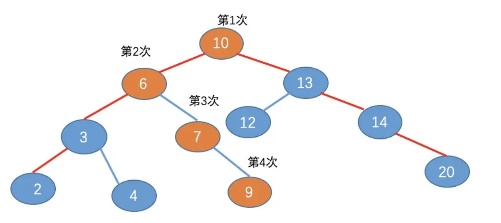
	>
	> 3. 由于 ==B æ ‘çš„æ¯ä¸€ä¸ªèŠ‚点，å¯ä»¥å­˜æ”¾å¤šä¸ªå…ƒç´ ==，所以==ç£ç›˜å¯»å€åŠ è½½çš„次数会比较少==，例如上é¢çš„例å­ä¸­ï¼Œç”¨ B æ ‘çš„è¯ï¼Œ==åªéœ€è¦åŠ è½½ 3 次==，如图：
	>
	> 	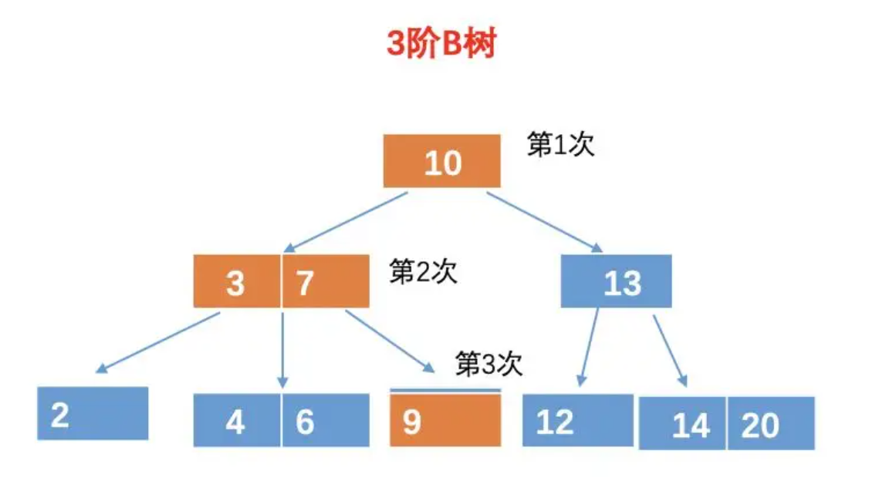
	>
	> 4. 在==内存的è¿ç®—速度是éžå¸¸å¿«çš„，至少比ç£ç›˜çš„寻å€åŠ è½½é€Ÿåº¦ï¼Œå¿«äº†å‡ ç™¾å€==，而我们进行数值比较的时候，是在内存中进行的，虽然 B 树的比较次数å¯èƒ½æ¯”二å‰æŸ¥æ‰¾æ ‘多，但是==ç£ç›˜æ“作次数少，所以总体æ¥è¯´ï¼Œè¿˜æ˜¯ B 树快的多==。
	>
	> 5. 实际上ç£ç›˜çš„加载次数，基本上是和树的==高度==相关è”的，高==度越高，加载次数越多，越矮，加载次数越少==。所以对于这ç§æ–‡ä»¶ç´¢å¼•çš„存储，我们一般会选择==矮胖==的树形结构。

---


### 3.深入浅出索引（上）🌟🌟🌟🌟🌟

è§ç¬”记。

---


### 4.深入浅出索引（下）🌟🌟🌟🌟🌟

è§ç¬”记。

---


### 5.MyISAM与InnoDB的索引，究竟有什么差异？🌟🌟

1. ==MyISAM的索引==

	> - ==MyISAM的索引与行记录是分开存储==的，å«åš==éžèšé›†ç´¢å¼•==（UnClustered Index）。
	>
	> - （1）有连续èšé›†çš„区域å•ç‹¬å­˜å‚¨è¡Œè®°å½•ï¼›
	>
	> 	（2）主键索引的å¶å­èŠ‚点，存储主键，==与对应行记录的指针==ï¼›
	>
	> 	（3）普通索引的å¶å­ç»“点，存储索引列，==与对应行记录的指针==ï¼›
	>
	> - å³ï¼šä¸»é”®ç´¢å¼•å’Œæ™®é€šç´¢å¼•çš„å¶å­èŠ‚点==å‡å­˜å‚¨å¯¹åº”那一行的指针==。
	>
	> - 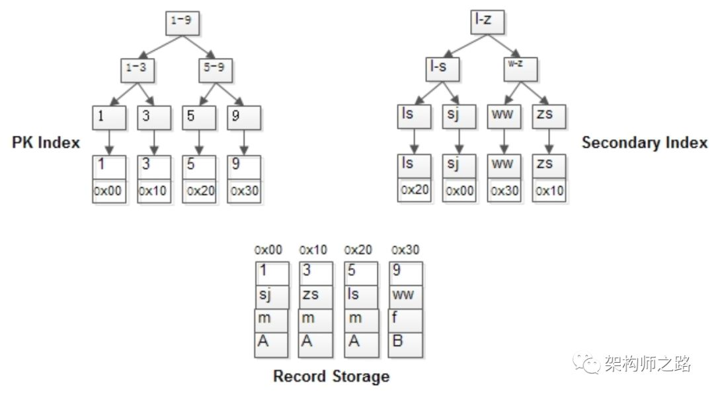

2. ==InnoDB的索引==

	> - InnoDBçš„==主键索引与==行记录是存储在一起的，故å«åš==èšé›†ç´¢å¼•==（Clustered Index）：
	>
	> 	（1）==没有å•ç‹¬åŒºåŸŸå­˜å‚¨è¡Œè®°å½•==ï¼›
	>
	> 	（2）主键索引的å¶å­èŠ‚点，存储主键，与对应行记录（而ä¸æ˜¯æŒ‡é’ˆï¼‰ï¼›
	>
	> 	画外音：因此，==InnoDBçš„PK查询是éžå¸¸å¿«çš„==。
	>
	> - 因为这个特性，==InnoDB的表必须è¦æœ‰èšé›†ç´¢å¼•==：
	>
	> 	（1）如果表定义了PK，则PK就是èšé›†ç´¢å¼•ï¼›
	>
	> 	（2）如果表==没有定义PK，则第一个éžç©ºunique列是èšé›†ç´¢å¼•==ï¼›
	>
	> 	（3）==å¦åˆ™==，InnoDB会==创建一个éšè—çš„row-id作为èšé›†ç´¢å¼•==ï¼›
	>
	> - å¯ç¤ºï¼š
	>
	> 	（1）==ä¸å»ºè®®ä½¿ç”¨è¾ƒé•¿çš„列åšä¸»é”®==，例如char(64)，因为所有的普通索引都会存储主键，会导致普通索引过于庞大；
	>
	> 	（2）建议使用==趋势递增的keyåšä¸»é”®==，由于数æ®è¡Œä¸Žç´¢å¼•ä¸€ä½“，这样ä¸è‡³äºŽæ’入记录时，有大é‡ç´¢å¼•åˆ†è£‚，行记录移动；
	>
	> - 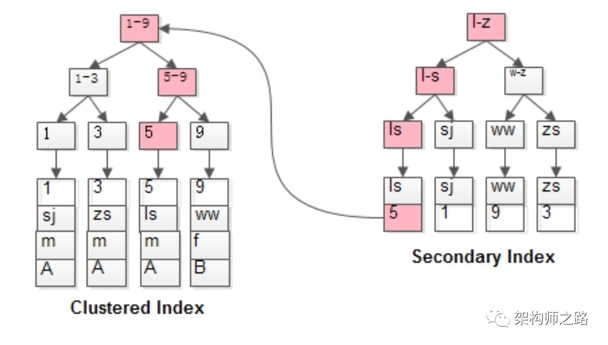

3. ==总结==：

	> ==MyISAMå’ŒInnoDB都使用B+æ ‘æ¥å®žçŽ°ç´¢å¼•==：
	>
	> （1）MyISAMçš„==索引与数æ®åˆ†å¼€å­˜å‚¨==ï¼›
	>
	> （2）MyISAM的索引==å¶å­å­˜å‚¨æŒ‡é’ˆ==，主键索引与普通索引无太大区别；
	>
	> （3）InnoDBçš„==èšé›†ç´¢å¼•==和数æ®è¡Œç»Ÿä¸€å­˜å‚¨ï¼›
	>
	> （4）InnoDBçš„==èšé›†ç´¢å¼•å­˜å‚¨æ•°æ®è¡Œæœ¬èº«==，==普通索引存储主键==ï¼›
	>
	> （5）InnoDB==一定有且åªæœ‰ä¸€ä¸ªèšé›†ç´¢å¼•==ï¼›
	>
	> （6）InnoDB建议使用趋势递增整数作为PK，而==ä¸å®œä½¿ç”¨è¾ƒé•¿çš„列作为PK==ï¼›

---


## 2.é”

### 1.全局é”和表é”🌟🌟🌟🌟

è§ç¬”记。

---


### 2.è¡Œé”功过：怎么å‡å°‘è¡Œé”对性能的影å“？🌟🌟🌟🌟

è§ç¬”记。

---


### 3.è¡Œé”到底é”ä½çš„是什么？记录？字段？索引？

1.  ==InnoDBçš„è¡Œé”，就是通过é”ä½ç´¢å¼•æ¥å®žçŽ°çš„==。

	> 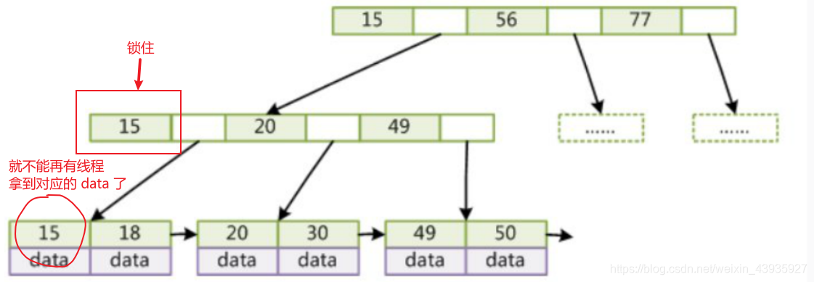

2. ==问题一==：为什么表里é¢==没有索引的时候==，实验一==é”ä½ä¸€è¡Œæ•°æ®ä¼šå¯¼è‡´é”表==？或者说，==如果é”ä½çš„是索引，一张表没有索引怎么办==？所以，一张表有没有å¯èƒ½æ²¡æœ‰ç´¢å¼•ï¼Ÿ

	> 1. 如果我们定义了主键(PRIMARYKEY)，那么 InnoDB 会选择主键作为èšé›†ç´¢å¼•ã€‚
	> 2. 如果==没有显å¼å®šä¹‰ä¸»é”®==，则 InnoDB 会选择==第一个ä¸åŒ…å«æœ‰ NULL 值的唯一索引作为主键索引==。
	> 3. 如果==也没有这样的唯一索引==，则 InnoDB 会选择==内置 6 字节长的 ROWID 作为éšè—çš„èšé›†ç´¢å¼•==，它会==éšç€è¡Œè®°å½•çš„写入而主键递增==。
	>
	> 所以，实验一为什么é”表，是因为==查询时没有索引å¯ä½¿ç”¨ï¼Œä¼šè¿›è¡Œå…¨è¡¨æ‰«æ==，然åŽ==把æ¯ä¸€ä¸ªéšè—çš„èšé›†ç´¢å¼•éƒ½é”ä½äº†==。

3. ==问题二==：实验二为什么==通过唯一索引给数æ®è¡ŒåŠ é”，主键索引也会被é”ä½==？

	> 

---


### 4.这次终于懂了，InnoDB的七ç§é”🌟

1. InnoDB共有==七ç§ç±»åž‹çš„é”==：

	> （1）自增é”(Auto-inc Locks)ï¼›
	>
	> （2）共享/排它é”(Shared and Exclusive Locks)ï¼›
	>
	> （3）æ„å‘é”(Intention Locks)ï¼›
	>
	> （4）æ’å…¥æ„å‘é”(Insert Intention Locks)ï¼›
	>
	> （5）记录é”(Record Locks)ï¼›
	>
	> （6）间隙é”(Gap Locks)ï¼›
	>
	> （7）临键é”(Next-key Locks)ï¼›

2. ==自增é”==（Auto-inc Locks）

	> - 自增é”是一ç§ç‰¹æ®Šçš„==表级别é”==（table-level lock），==针对事务æ’å…¥AUTO_INCREMENT类型的列==。
	> - 最简å•çš„情况，如果一个事务正在往表中æ’入记录，==所有其他事务的æ’入必须等待==，==以便第一个事务æ’入的行，是连续的主键值==。

3. ==共享/排它é”==(Shared and Exclusive Locks)

	> - （1）多个事务å¯ä»¥æ‹¿åˆ°ä¸€æŠŠSé”，==读读å¯ä»¥å¹¶è¡Œ==ï¼›
	> - （2）而åªæœ‰ä¸€ä¸ªäº‹åŠ¡å¯ä»¥æ‹¿åˆ°Xé”，==写写/读写必须互斥==ï¼›

4. ==æ„å‘é”(Intention Locks)==

	> - æ„å‘é”有这样一些==特点==：
	>
	> 	（1）首先，æ„å‘é”，是一个==表级别的é”==(table-level locking)ï¼›
	>
	> 	（2）æ„å‘é”分为：
	>
	> 	- ==æ„å‘共享é”==(intention shared lock, IS)，它预示ç€ï¼Œäº‹åŠ¡==有æ„å‘==对表中的==æŸäº›è¡ŒåŠ å…±äº«Sé”==。
	> 	- ==æ„å‘排它é”==(intention exclusive lock, IX)，它预示ç€ï¼Œäº‹åŠ¡==有æ„å‘==对表中的==æŸäº›è¡ŒåŠ æŽ’它Xé”==。
	>
	> - ==例å­==：
	>
	> 	- `select … lock in share mode`，è¦è®¾ç½®==ISé”==ï¼›
	> 	- `select … for update`，è¦è®¾ç½®==IXé”==ï¼›
	>
	> - ==æ„å‘é”åè®®== (intention locking protocol)：
	>
	> 	- 事务è¦èŽ·å¾—æŸäº›è¡Œçš„Sé”，==必须先获得表的ISé”==。
	> 	- 事务è¦èŽ·å¾—æŸäº›è¡Œçš„Xé”，==必须先获得表的IXé”==。
	>
	> - 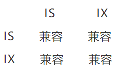
	>
	> - 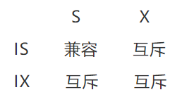

5. ==æ’å…¥æ„å‘é”(Insert Intention Locks)==

	> - ==多个事务==，在==åŒä¸€ä¸ªç´¢å¼•ï¼ŒåŒä¸€ä¸ªèŒƒå›´åŒºé—´æ’入记录==时，如果==æ’入的ä½ç½®ä¸å†²çªï¼Œä¸ä¼šé˜»å¡žå½¼æ­¤==。
	>
	> - *10, shenjian*
	>
	> 	*20, zhangsan*
	>
	> 	*30, lisi*
	>
	> 	事务A先执行，在10与20两æ¡è®°å½•ä¸­æ’入了一行，还未æ交：
	>
	> 	```sql
	> 	insert into t values(11, xxx);
	> 	```
	>
	> 	事务BåŽæ‰§è¡Œï¼Œä¹Ÿåœ¨10与20两æ¡è®°å½•ä¸­æ’入了一行：
	>
	> 	```sql
	> 	insert into t values(12, ooo);
	> 	```
	>
	> 	（1）会使用什么é”？
	>
	> 	（2）事务B会ä¸ä¼šè¢«é˜»å¡žå‘¢ï¼Ÿ
	>
	> 	==回答==：虽然事务隔离级别是RR，虽然是åŒä¸€ä¸ªç´¢å¼•ï¼Œè™½ç„¶æ˜¯åŒä¸€ä¸ªåŒºé—´ï¼Œä½†==æ’入的记录并ä¸å†²çª==，故这里：
	>
	> 	（1）使用的是==æ’å…¥æ„å‘é”==ï¼›
	>
	> 	（2）并==ä¸ä¼šé˜»å¡žäº‹åŠ¡B==ï¼›

6. ==记录é”(Record Locks)==

	> - ==记录é”==，它==å°é”索引记录==，例如：
	>
	> 	```sql
	> 	select * from t where id=1 for update;
	> 	```
	>
	> 	它会在 id=1 çš„==索引记录上加é”==，以阻止其他事务æ’入，更新，删除id=1的这一行。
	>
	> 	==需è¦è¯´æ˜Žçš„是==：
	>
	> 	```sql
	> 	select * from t where id=1;
	> 	```
	>
	> 	是==快照读==(SnapShot Read)，它==并没有加é”==。

7. ==é—´éš™é”(Gap Locks)==

	> - ==é—´éš™é”==，它==å°é”索引记录中的间隔==，或者第一æ¡ç´¢å¼•è®°å½•ä¹‹å‰çš„范围，åˆæˆ–者最åŽä¸€æ¡ç´¢å¼•è®°å½•ä¹‹åŽçš„范围。
	>
	> 	*1, shenjian, m, A*
	>
	> 	*3, zhangsan, m, A*
	>
	> 	*5, lisi, m, A*
	>
	> 	*9, wangwu, f, B*
	>
	> 	```sql
	> 	select * from t where id between 8 and 15 for update;
	> 	```
	>
	> 	会==å°é”区间==，以==阻止其他事务id=10的记录æ’å…¥==。
	>
	> 	==为什么è¦é˜»æ­¢id=10的记录æ’入？如果能够æ’å…¥æˆåŠŸï¼Œå¤´ä¸€ä¸ªäº‹åŠ¡æ‰§è¡Œç›¸åŒçš„SQL语å¥ï¼Œä¼šå‘现结果集多出了一æ¡è®°å½•ï¼Œå³å¹»å½±æ•°æ®==。
	>
	> 	é—´éš™é”çš„==主è¦ç›®çš„==，就是为了==防止其他事务在间隔中æ’入数æ®ï¼Œä»¥å¯¼è‡´â€œä¸å¯é‡å¤è¯»â€==。
	>
	> 	如果把事务的隔离级别==é™çº§ä¸ºè¯»æ交==(Read Committed, RC)，==é—´éš™é”则会自动失效==。

8. ==临键é”(Next-Key Locks)==

	> - ==临键é”==，是记录é”与间隙é”的组åˆï¼Œå®ƒçš„å°é”范围，既包å«ç´¢å¼•è®°å½•ï¼ŒåˆåŒ…å«ç´¢å¼•åŒºé—´ã€‚
	>
	> - 一个会è¯å æœ‰äº†==索引记录R的共享/排他é”==，其他会è¯==ä¸èƒ½==立刻在==R之å‰çš„区间æ’入新的索引记录==。
	>
	> - 表中有四æ¡è®°å½•ï¼š
	>
	> 	*1, shenjian, m, A*
	>
	> 	*3, zhangsan, m, A*
	>
	> 	*5, lisi, m, A*
	>
	> 	*9, wangwu, f, B*
	>
	> 	PK上==潜在的临键é”为==：
	>
	> 	*(-infinity, 1]*
	>
	> 	*(1, 3]*
	>
	> 	*(3, 5]*
	>
	> 	*(5, 9]*
	>
	> 	*(9, +infinity)*
	>
	> 	临键é”的主è¦ç›®çš„，也是为了==é¿å…幻读==(Phantom Read)。如果把事务的隔离级别==é™çº§ä¸ºRC==，==临键é”则也会失效==。

9. ==总结==：

	> （1）==自增é”==(Auto-inc Locks)：==表级é”，专门针对事务æ’å…¥AUTO_INC的列==，如果æ’å…¥ä½ç½®å†²çªï¼Œå¤šä¸ªäº‹åŠ¡ä¼šé˜»å¡žï¼Œä»¥ä¿è¯æ•°æ®ä¸€è‡´æ€§ï¼›
	>
	> （2）==共享/排它é”==(Shared and Exclusive Locks)：==行级é”==，Sé”与Xé”，==强é”==ï¼›
	>
	> （3）==æ„å‘é”==(Intention Locks)：==表级é”==，ISé”与IXé”，==å¼±é”==，仅==仅表明æ„å‘==ï¼›
	>
	> （4）==æ’å…¥æ„å‘é”==(Insert Intention Locks)：==针对insert==的，如果==æ’å…¥ä½ç½®ä¸å†²çªï¼Œå¤šä¸ªäº‹åŠ¡ä¸ä¼šé˜»å¡ž==，以æ高æ’入并å‘ï¼›
	>
	> （5）==记录é”==(Record Locks)：==索引记录上加é”==，对索引记录实施互斥，以ä¿è¯æ•°æ®ä¸€è‡´æ€§ï¼›
	>
	> （6）==é—´éš™é”==(Gap Locks)：==å°é”索引记录中间的间隔==，在RR下有效，防止间隔中被其他事务æ’入；
	>
	> （7）==临键é”==(Next-key Locks)：==å°é”索引记录，以åŠç´¢å¼•è®°å½•ä¸­é—´çš„é—´éš”==，在RR下有效，==防止幻读==ï¼›

---


### 5.一æ¡sql执行的很慢的原因有哪些🌟🌟🌟🌟🌟

1. ==æ•°æ®åº“在刷新è„页我也无奈啊（å¶å°”很慢）==

	> - 如果==æ•°æ®åº“一直很忙，更新åˆå¾ˆé¢‘ç¹==，这个时候 ==redo log 很快就会被写满了==，这个时候就没办法等到空闲的时候å†æŠŠæ•°æ®åŒæ­¥åˆ°ç£ç›˜çš„，==åªèƒ½æš‚åœå…¶ä»–æ“作，全身心æ¥æŠŠæ•°æ®åŒæ­¥åˆ°ç£ç›˜ä¸­åŽ»çš„==，而这个时候，==就会导致我们平时正常的SQL语å¥çªç„¶æ‰§è¡Œçš„很慢==，所以说，数æ®åº“在在åŒæ­¥æ•°æ®åˆ°ç£ç›˜çš„时候，就有å¯èƒ½å¯¼è‡´æˆ‘们的SQL语å¥æ‰§è¡Œçš„很慢了。

2. ==æ‹¿ä¸åˆ°é”我能怎么办（å¶å°”很慢）==

	> - 如果è¦åˆ¤æ–­æ˜¯å¦çœŸçš„在等待é”，我们å¯ä»¥ç”¨ ==show processlist ==这个命令æ¥æŸ¥çœ‹å½“å‰çš„状æ€å“¦ã€‚

3. ==扎心了，没用到索引（一直很慢，一般都是 sql 语å¥çš„问题）==

	> - ==函数æ“作导致没有用上索引==。
	> - 或者 `select * from t where c - 1 = 1000;`，使用加法函数.

4. ==呵呵，数æ®åº“自己选错索引了（一直很慢）==

	> - ==系统是有å¯èƒ½èµ°å…¨è¡¨æ‰«æ而ä¸èµ°ç´¢å¼•çš„。那系统是怎么判断呢？==
	> 	- 判断æ¥æºäºŽ==系统的预测==，也就是说，如果è¦èµ° c 字段索引的è¯ï¼Œç³»==统会预测走 c 字段索引大概需è¦æ‰«æ多少行==。如果预测到è¦æ‰«æ的行数很多，它å¯èƒ½å°±ä¸èµ°ç´¢å¼•è€Œç›´æŽ¥æ‰«æ全表了。
	> - ==系统是怎么预测判断的呢？==
	> 	- ==索引的区分度==æ¥åˆ¤æ–­çš„，一个==索引上ä¸åŒçš„值越多，æ„味ç€å‡ºçŽ°ç›¸åŒæ•°å€¼çš„索引越少==，æ„味ç€ç´¢å¼•çš„区分度越高。我们也把区分度称之为==基数==。
	> 	- 系统通过==采样==çš„æ–¹å¼ï¼Œæ¥==预测索引的基数==的。
	> 	- ==采样的时候，å´å¾ˆä¸å¹¸ï¼ŒæŠŠè¿™ä¸ªç´¢å¼•çš„基数预测æˆå¾ˆå°==。例如你采样的那一部分数æ®åˆšå¥½åŸºæ•°å¾ˆå°ï¼Œç„¶åŽå°±è¯¯ä»¥ä¸ºç´¢å¼•çš„基数很å°ã€‚==然åŽç³»ç»Ÿå°±ä¸èµ° c 索引了，直接走全部扫æ了==。
	> - 系统判断是å¦èµ°ç´¢å¼•ï¼Œ==扫æ行数的预测其实åªæ˜¯åŽŸå› ä¹‹ä¸€==，这æ¡æŸ¥è¯¢è¯­å¥==是å¦éœ€è¦ä½¿ç”¨ä½¿ç”¨ä¸´æ—¶è¡¨ã€æ˜¯å¦éœ€è¦æŽ’åº==等也是会影å“系统的选择的。

5. 我们有时候也å¯ä»¥é€šè¿‡==强制走索引的方å¼æ¥æŸ¥è¯¢==，例如

	```sql
	select * from t force index(a) where c < 100 and c < 100000;
	```

	我们也å¯ä»¥é€šè¿‡

	```sql
	show index from t;
	```

	æ¥==查询索引的基数和实际是å¦ç¬¦åˆ==，如果和实际很ä¸ç¬¦åˆçš„è¯ï¼Œæˆ‘们å¯ä»¥==é‡æ–°æ¥ç»Ÿè®¡ç´¢å¼•çš„基数==，å¯ä»¥ç”¨è¿™æ¡å‘½ä»¤

	```sql
	analyze table t;
	```

	æ¥==é‡æ–°ç»Ÿè®¡åˆ†æž==。

6. ==既然会预测错索引的基数，这也æ„味ç€ï¼Œå½“我们的查询语å¥æœ‰å¤šä¸ªç´¢å¼•çš„时候，系统有å¯èƒ½ä¹Ÿä¼šé€‰é”™ç´¢å¼•å“¦==，这也å¯èƒ½æ˜¯ SQL 执行的很慢的一个原因。

7. ==总结==：

	> 1ã€å¤§å¤šæ•°æƒ…况下很正常，==å¶å°”很慢==，则有如下原因
	>
	> (1) æ•°æ®åº“在刷新è„页，例如 ==redo log 写满了需è¦åŒæ­¥åˆ°ç£ç›˜==。
	>
	> (2) 执行的时候，==é‡åˆ°é”==，如表é”ã€è¡Œé”。
	>
	> 2ã€è¿™æ¡ SQL 语å¥==一直执行==的很慢，则有如下原因。
	>
	> (1) ==没有用上索引==：例如该字段没有索引；由于对字段进行è¿ç®—ã€å‡½æ•°æ“作导致无法用索引。
	>
	> (2) æ•°æ®åº“==选错了索引==。

---


### 6.为什么我åªæ”¹ä¸€è¡Œçš„语å¥ï¼Œé”这么多？🌟🌟🌟🌟

è§ç¬”记。

---


### 7.幻读是什么，幻读有什么问题？🌟🌟🌟🌟🌟

è§ç¬”记。

---


## 3.日志与事务

### 1.日志：一æ¡SQL更新语å¥æ˜¯å¦‚何执行的🌟🌟🌟🌟🌟

è§ç¬”记。

---


### 2.事务隔离：为什么你改了我还看ä¸è§ï¼ŸðŸŒŸðŸŒŸðŸŒŸðŸŒŸðŸŒŸ

è§ç¬”记。

---


## 4.其他

### 1.如何用 explain æ¥åˆ†æž sql 的性能🌟🌟🌟🌟🌟

1. 最为常è§çš„扫ææ–¹å¼ï¼ˆ==type==）有：

	> - ==system==：系统表，少é‡æ•°æ®ï¼Œå¾€å¾€ä¸éœ€è¦è¿›è¡Œç£ç›˜IOï¼›
	> - ==const==：常é‡è¿žæŽ¥ï¼›
	> - ==eq_ref==：主键索引(primary key)或者éžç©ºå”¯ä¸€ç´¢å¼•(unique not null)等值扫æï¼›
	> - ==ref==：éžä¸»é”®éžå”¯ä¸€ç´¢å¼•ç­‰å€¼æ‰«æï¼›
	> - ==range==：范围扫æï¼›
	> - ==index==：索引树扫æï¼›
	> - ==ALL==：全表扫æ(full table scan)ï¼›

2. 上é¢å„类扫ææ–¹å¼==由快到慢==：

	```java
	system > const > eq_ref > ref > range > index > ALL
	```

3. ==system==

	> - 
	>
	> 	```sql
	> 	explain select * from mysql.time_zone;
	> 	```
	>
	> 	上例中，从系统库mysql的系统表time_zone里查询数æ®ï¼Œæ‰«ç ç±»åž‹ä¸ºsystem，==这些数æ®å·²ç»åŠ è½½åˆ°å†…存里，ä¸éœ€è¦è¿›è¡Œç£ç›˜IO==。因此这类扫æ是速度最快的。
	>
	> - 
	>
	> 	```sql
	> 	explain select * from (select * from user where id=1) tmp;
	> 	```
	>
	> 	å†ä¸¾ä¸€ä¸ªä¾‹å­ï¼Œ==内层嵌套(const)返回了一个临时表==，==外层嵌套从临时表查询，其扫æ类型也是system==，也ä¸éœ€è¦èµ°ç£ç›˜IO，速度超快。

4. ==const==

	> - const扫æçš„æ¡ä»¶ä¸ºï¼š
	>
	> 	（1）命中==主键(primary key)==或者==唯一索引(unique)==；
	>
	> 	（2）被==连接的部分是一个常é‡(const)值（å³è¾¹çš„值为常é‡ï¼‰==ï¼›
	>
	> 	```sql
	> 	explain select * from user where id=1;
	> 	```
	>
	> 	如上例，id是PK，连接部分是常é‡1。
	>
	> - ==画外音：别æžä»€ä¹ˆç±»åž‹è½¬æ¢çš„幺蛾å­ã€‚==
	>
	> 	这类扫æ效率æžé«˜ï¼Œè¿”回数æ®é‡å°‘，速度éžå¸¸å¿«ã€‚

5. ==eq_ref==

	> - eq_ref扫æçš„æ¡ä»¶ä¸ºï¼Œå¯¹äºŽ==å‰è¡¨çš„æ¯ä¸€è¡Œ(row)==，==åŽè¡¨åªæœ‰ä¸€è¡Œè¢«æ‰«æ==。
	>
	> 	å†ç»†åŒ–一点：
	>
	> 	（1）==join查询==；
	>
	> 	（2）命中==主键(primary key)==或者éžç©º==唯一(unique not null)索引==ï¼›
	>
	> 	（3）==等值连接==； 
	>
	> - 	```sql
	> 	explain select * from user,user_ex where user.id = user_ex.id;
	> 	```
	>
	> 	如上例，==user.id å’Œ user_ex.id 都是主键==，该 join 查询为 eq_ref 扫æ。
	>
	> 	这类扫æ的速度也异常之快。
	
6. ==ref==

      > - 如果把上例eq_ref案例中的==主键索引，改为普通éžå”¯ä¸€(non unique)索引==。
      >
      > 	```sql
      > 	explain select * from user,user_ex where user.id=user_ex.id;
      > 	```
      >
      > 	å°±==ç”± eq_ref é™çº§ä¸ºäº† ref==，此时对于å‰è¡¨çš„æ¯ä¸€è¡Œ(row)，åŽè¡¨å¯èƒ½æœ‰å¤šäºŽä¸€è¡Œçš„æ•°æ®è¢«æ‰«æ。
      >
      > - 当id==改为普通éžå”¯ä¸€ç´¢å¼•åŽ==，常é‡çš„连接查询，也由==consté™çº§ä¸ºäº†ref==，因为也==å¯èƒ½æœ‰å¤šäºŽä¸€è¡Œçš„æ•°æ®è¢«æ‰«æ==。
      >
      > - ref扫æ，å¯èƒ½å‡ºçŽ°åœ¨join里，也å¯èƒ½å‡ºçŽ°åœ¨==å•è¡¨æ™®é€šç´¢å¼•==里，==æ¯ä¸€æ¬¡åŒ¹é…å¯èƒ½æœ‰å¤šè¡Œæ•°æ®è¿”回==，虽然它比eq_refè¦æ…¢ï¼Œä½†å®ƒä»ç„¶æ˜¯ä¸€ä¸ªå¾ˆå¿«çš„join类型。

7. ==range==

      > - åƒä¸Šä¾‹ä¸­çš„ ==between，in，>== 都是典型的范围(range)查询。
      >
      > 	==画外音：必须是索引，å¦åˆ™ä¸èƒ½æ‰¹é‡â€è·³è¿‡â€ã€‚==

8. ==index==

    > - 如果id上ä¸å»ºç´¢å¼•ï¼Œå¯¹äºŽå‰è¡¨çš„æ¯ä¸€è¡Œ(row)，åŽè¡¨éƒ½è¦è¢«å…¨è¡¨æ‰«æ。

9. ==总结==：

      > - ==system==最快：==ä¸è¿›è¡Œç£ç›˜IO==
      > - ==const==：==PK或者unique==上的==等值查询（å³ä¾§æ˜¯å¸¸é‡ï¼‰==
      > - ==eq_ref==：==PK或者unique==上的==join查询==，==等值匹é…（多表è”立）==，对于å‰è¡¨çš„æ¯ä¸€è¡Œ(row)，åŽè¡¨åªæœ‰ä¸€è¡Œå‘½ä¸­
      > - ==ref==：==éžå”¯ä¸€ç´¢å¼•ï¼Œç­‰å€¼åŒ¹é…==，å¯èƒ½æœ‰å¤šè¡Œå‘½ä¸­
      > - ==range==：索引上的==范围扫æ==，例如：==between/in/>==
      > - ==index==：索引上的==全集扫æ==，例如：InnoDBçš„==count==
      > - ==ALL==最慢：全表扫æ(full table scan)

---


### 2.åˆ†æž sql åˆä¸€å…³é”®å­—段：Extra🌟🌟

1. ```sql
	create table user (
	    id int primary key,
	    name varchar(20),
	    sex varchar(5),
	    index(name)
	) engine=innodb;
	
	insert into user values(1, 'shenjian','no');
	insert into user values(2, 'zhangsan','no');
	insert into user values(3, 'lisi', 'yes');
	insert into user values(4, 'lisi', 'no');
	```

2. ==Using where==

	> - Extra为Using where说明，==SQL使用了whereæ¡ä»¶è¿‡æ»¤æ•°æ®==。

3. ==Using index==

	> - Extra为Using index说明，==SQL所需è¦è¿”回的所有列数æ®å‡åœ¨ä¸€æ£µç´¢å¼•æ ‘上==，而无需访问实际的行记录。
	>
	> - 如：
	>
	> 	```sql
	> 	explain select id,name from user where name='shenjian';
	> 	```

4. ==Using index condition==

	> - Extra为Using index condition说明，确实==命中了索引，但ä¸æ˜¯æ‰€æœ‰çš„列数æ®éƒ½åœ¨ç´¢å¼•æ ‘上==，还需è¦è®¿é—®å®žé™…的行记录。
	>
	> - 如：
	>
	> 	```sql
	> 	explain select id,name,sex from user # sex 没有索引
	> 	where name='shenjian';
	> 	```

5. ==Using filesort==

	> - ```sql
	> 	explain select * from user order by sex;
	> 	```
	>
	> 	结果说明：
	>
	> - Extra为Using filesort说明，得到==所需结果集，需è¦å¯¹æ‰€æœ‰è®°å½•è¿›è¡Œæ–‡ä»¶æŽ’åº==。
	>
	> - 这类SQL语å¥==性能æžå·®==，需è¦è¿›è¡Œä¼˜åŒ–。
	>
	> - 典型的，==在一个没有建立索引的列上进行了order by，就会触å‘filesort==，常è§çš„==优化方案==是，在==order by的列上添加索引==，==é¿å…æ¯æ¬¡æŸ¥è¯¢éƒ½å…¨é‡æŽ’åº==。

6. ==Using temporary==

	> - ```sql
	> 	explain select * from user group by name order by sex;
	> 	```
	>
	> 	结果说明：
	>
	> - Extra为Using temporary说明，==需è¦å»ºç«‹ä¸´æ—¶è¡¨(temporary table)æ¥æš‚存中间结果==。
	>
	> - 这类SQL语å¥==性能较低==，往往也需è¦è¿›è¡Œä¼˜åŒ–。
	>
	> - 典型的，==group byå’Œorder byåŒæ—¶å­˜åœ¨ï¼Œä¸”作用于ä¸åŒçš„字段时，就会建立临时表==，以便计算出最终的结果集。

7. ==Using join buffer (Blocked Nested Loop)==

	> - ```sql
	> 	explain select * from user where id in(select id from user where sex='no');
	> 	```
	>
	> 	结果说明：
	>
	> - Extra为Using join buffer (Block Nested Loop)说明，需è¦è¿›è¡Œ==嵌套循环计算==。
	>
	> - *画外音：内层和外层的 typeå‡ä¸º ALL，rowså‡ä¸º4，需è¦å¾ªçŽ¯è¿›è¡Œ 4\*4次计算。*
	>
	> - 这类SQL语å¥==性能往往也较低==，需è¦è¿›è¡Œä¼˜åŒ–。
	>
	> - 典型的，两个关è”表join，关è”字段å‡æœªå»ºç«‹ç´¢å¼•ï¼Œå°±ä¼šå‡ºçŽ°è¿™ç§æƒ…况。常è§çš„优化方案是，==在关è”字段上添加索引，é¿å…æ¯æ¬¡åµŒå¥—循环计算==。

---


### 3.æ•°æ®åº“å…许空值(null)，往往是悲剧的开始🌟🌟

```sql
create table user (
    id int,
    name varchar(20),
    index(id)
) engine=innodb;

insert into user values(1,'shenjian');
insert into user values(2,'zhangsan');
insert into user values(3,'lisi');
```

1. ==è´Ÿå‘比较==（例如：!=）会引å‘==全表扫æ==ï¼›

	> 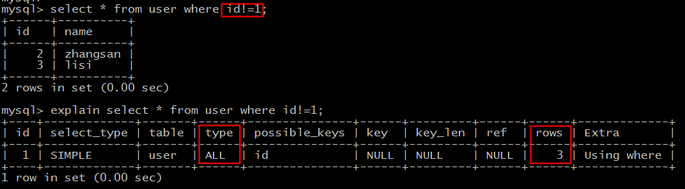

2. 如果å…许空值，==ä¸ç­‰äºŽ(!=)的查询，ä¸ä¼šå°†ç©ºå€¼è¡Œ(row)包å«è¿›æ¥==，此时的结果集往往是ä¸ç¬¦åˆé¢„期的，此时==往往è¦åŠ ä¸Šä¸€ä¸ªoræ¡ä»¶ï¼ŒæŠŠç©ºå€¼(is null)结果包å«è¿›æ¥==ï¼›

	> 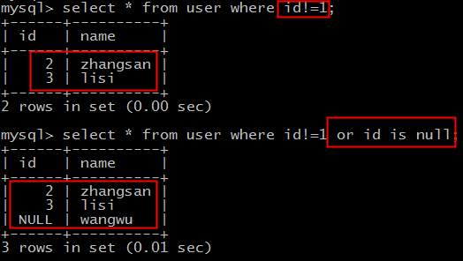

3. ==orå¯èƒ½ä¼šå¯¼è‡´å…¨è¡¨æ‰«æ==，此时å¯ä»¥==优化为union查询==ï¼›

	> ==使用 or is null==，==全表查询==：
	>
	> 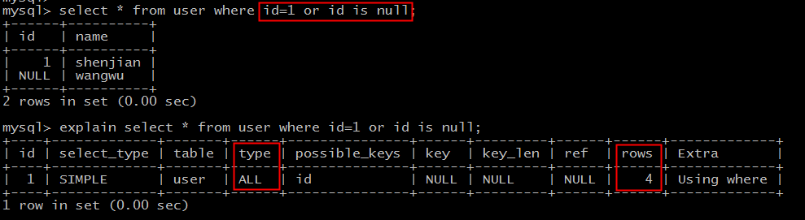
	>
	> ---
	>
	> ==使用 union==，使用==普通索引查询==：
	>
	> 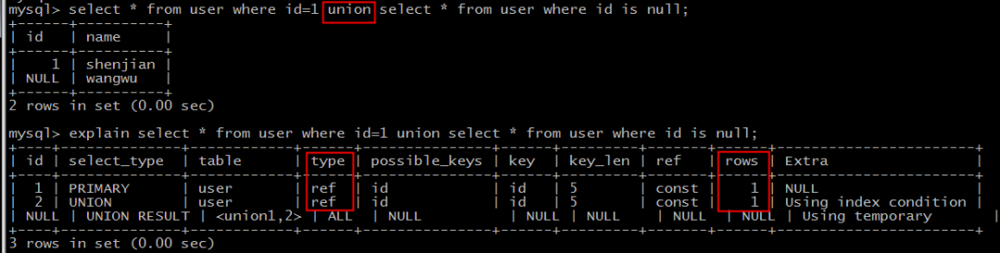

4. 建表时加上==默认(default)值==，这样能==é¿å…空值的å‘==ï¼›

---


### 4.count( * )这么慢，我该怎么办?🌟🌟

è§ç¬”记。

---


# 4.Redis

### 1.Rediså•çº¿ç¨‹ä¸ºå•¥è¿˜èƒ½è¿™ä¹ˆå¿«ï¼ŸðŸŒŸðŸŒŸðŸŒŸðŸŒŸðŸŒŸ

1. ==memcached 与 redis 的区别==：

	> - Redis 拥有==更多的数æ®ç»“æž„å’Œæ“作ç§ç±»==，å¯ä»¥è¿›è¡Œæ›´å¤æ‚çš„æ“作。
	> - ==Redis å•çº¿ç¨‹ï¼Œè€Œ memcached 多线程==。存储少é‡æ•°æ®æ—¶ Redis 的效率更高，但是存储 100k 以上的数æ®æ—¶ memcached 性能è¦å¥½ä¸€äº›ã€‚
	> - ==memcached 没有原生的集群环境==，需è¦ä¾é å®¢æˆ·ç«¯å®žçŽ°å¾€é›†ç¾¤ä¸­åˆ†ç‰‡å†™å…¥æ•°æ®ã€‚

2. ==Redis å•çº¿ç¨‹ä¸ºä»€ä¹ˆè¿™ä¹ˆå¿«==？

      > - 相比于多线程，å•çº¿ç¨‹ä¸éœ€è¦è¿›è¡Œ==并å‘控制==å’Œæ“作系统==内核æ€ä¸Žç”¨æˆ·æ€ä¹‹é—´çš„切æ¢==。
      > - Redis 大部分==æ“作在内存中==，并且有大é‡==高效的数æ®ç»“æž„==。
      > - 采用 ==IO 多路å¤ç”¨æŠ€æœ¯==，é¿å…在 accept() 建立连接和 resv() 读å–请求时==等待客户端数æ®é€ æˆé˜»å¡ž==。

è§ç¬”记：4.高性能IO模型：为什么å•çº¿ç¨‹Redis能那么快？🌟🌟🌟🌟🌟

---


### 2.redis都有哪些数æ®ç±»åž‹ï¼Ÿåˆ†åˆ«åœ¨å“ªäº›åœºæ™¯ä¸‹ä½¿ç”¨æ¯”较åˆé€‚呢？🌟🌟🌟🌟🌟

1. > 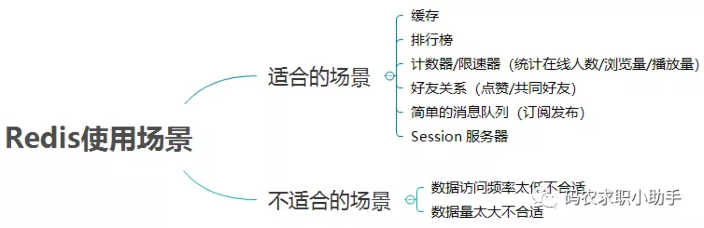

2. ==Redis 适åˆçš„场景==

	> 1. ==缓存==：å‡è½» MySQL çš„==查询压力==，æå‡ç³»ç»Ÿæ€§èƒ½ï¼›
	> 2. ==排行榜==：利用 Redis çš„ ==SortSet==（有åºé›†åˆï¼‰å®žçŽ°ï¼›
	> 3. ==计算器/é™é€Ÿå™¨==：利用 Redis 中==原å­æ€§çš„自增æ“作(INCR)==，我们å¯ä»¥ç»Ÿè®¡ç±»ä¼¼ç”¨æˆ·ç‚¹èµžæ•°ã€ç”¨æˆ·è®¿é—®æ•°ç­‰ã€‚这类æ“作如果用 MySQL，频ç¹çš„读写会带æ¥ç›¸å½“大的压力；==é™é€Ÿå™¨æ¯”较典型的使用场景是é™åˆ¶æŸä¸ªç”¨æˆ·è®¿é—®æŸä¸ª API 的频率==，常用的有抢购时，防止用户疯狂点击带æ¥ä¸å¿…è¦çš„压力；
	> 4. ==好å‹å…³ç³»==：利用集åˆçš„一些命令，比如==求交集ã€å¹¶é›†ã€å·®é›†ç­‰ã€‚å¯ä»¥æ–¹ä¾¿è§£å†³ä¸€äº›å…±åŒå¥½å‹ã€å…±åŒçˆ±å¥½ä¹‹ç±»çš„功能==ï¼›
	> 5. ==消æ¯é˜Ÿåˆ—==：==除了== Redis 自身的==å‘布/订阅模å¼==，我们==也==å¯ä»¥åˆ©ç”¨ ==List æ¥å®žçŽ°ä¸€ä¸ªé˜Ÿåˆ—机制==，比如：到货通知ã€é‚®ä»¶å‘é€ä¹‹ç±»çš„需求，ä¸éœ€è¦é«˜å¯é ï¼Œä½†æ˜¯ä¼šå¸¦æ¥éžå¸¸å¤§çš„ DB 压力，完全å¯ä»¥ç”¨ List æ¥å®Œæˆå¼‚步解耦；
	> 6. ==Session 共享==：Session 是ä¿å­˜åœ¨æœåŠ¡å™¨çš„文件中，如果是==集群æœåŠ¡ï¼ŒåŒä¸€ä¸ªç”¨æˆ·è¿‡æ¥å¯èƒ½è½åœ¨ä¸åŒæœºå™¨ä¸Š==，这就会导致用户频ç¹ç™»é™†ï¼›==采用 Redis ä¿å­˜ Session åŽï¼Œæ— è®ºç”¨æˆ·è½åœ¨é‚£å°æœºå™¨ä¸Šéƒ½èƒ½å¤ŸèŽ·å–到对应的 Session ä¿¡æ¯==。

3. ==Redis ä¸é€‚åˆçš„场景==

	> ==æ•°æ®é‡å¤ªå¤§==ã€æ•°æ®==访问频率éžå¸¸ä½Ž==的业务都ä¸é€‚åˆä½¿ç”¨ Redis，==æ•°æ®å¤ªå¤§ä¼šå¢žåŠ æˆæœ¬==，==访问频率太低，ä¿å­˜åœ¨å†…存中纯属浪费资æº==。

è§ç¬”记：3.æ•°æ®ç»“构：快速的Redis有哪些慢æ“作？🌟🌟🌟🌟🌟

---


### 3.RedisæŒä¹…化机制🌟🌟🌟🌟

==RDB==

> RDB 是 Redis DataBase 的缩写。按照一定的时间周期策略把内存的数æ®ä»¥å¿«ç…§çš„å½¢å¼ä¿å­˜åˆ°ç¡¬ç›˜çš„==二进制文件==ã€‚å³ Snapshot 快照存储，对应产生的数æ®æ–‡ä»¶ä¸º dump.rdb，通过é…置文件中的 save å‚æ•°æ¥å®šä¹‰å¿«ç…§çš„周期。核心函数：rdbSaveï¼ˆç”Ÿæˆ RDB 文件）和 rdbLoad（从文件加载内存）两个函数。
>
> 

==AOF==

> AOF 是 ==Append-only file== 的缩写。Redis会==å°†æ¯ä¸€ä¸ªæ”¶åˆ°çš„写命令都通过 Write 函数追加到文件最åŽ==，==类似于 MySQL çš„ binlog（储存命令）==。当 Redis ==é‡å¯==是会通过==é‡æ–°æ‰§è¡Œ==文件中==ä¿å­˜çš„写命令æ¥åœ¨å†…存中é‡å»ºæ•´ä¸ªæ•°æ®åº“的内容==。æ¯å½“执行æœåŠ¡å™¨ï¼ˆå®šæ—¶ï¼‰ä»»åŠ¡æˆ–者函数时，flushAppendOnlyFile 函数都会被调用， 这个函数执行以下两个工作：
>
> - WRITE：根æ®æ¡ä»¶ï¼Œå°† aof_buf 中的缓存写入到 AOF 文件；
> - SAVE：根æ®æ¡ä»¶ï¼Œè°ƒç”¨ fsync 或 fdatasync 函数，将 AOF 文件ä¿å­˜åˆ°ç£ç›˜ä¸­ã€‚
>
> 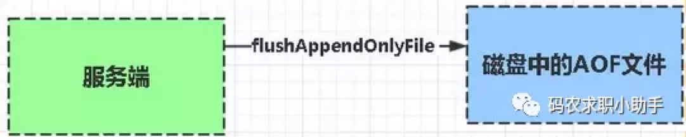

==RDB 和 AOF 的区别：==

> 1. ==AOF 文件比 RDB 更新频率高==，优先使用 AOF 还原数æ®ï¼›
> 2. AOF比 RDB 更安全也更大；
> 3. RDB 性能比 AOF 好；
> 4. 如果两个都é…了==优先加载 AOF==。

è§ç¬”记：5.AOF日志：宕机了，Redis如何é¿å…æ•°æ®ä¸¢å¤±ï¼ŸðŸŒŸðŸŒŸðŸŒŸðŸŒŸðŸŒŸ

è§ç¬”记：6.内存快照：宕机åŽï¼ŒRedis如何实现快速æ¢å¤ï¼ŸðŸŒŸðŸŒŸðŸŒŸðŸŒŸ

---


### 4.Redis实现分布å¼é”🌟🌟🌟🌟

1. ==加é”==：

	> ==set 命令å¯ä»¥è®¾ç½®è¿‡æœŸå‚æ•°ä¿è¯åŽŸå­æ€§==，而 ==setnx 命令和 expire 命令åˆç”¨åˆ™ä¸èƒ½ä¿è¯åŽŸå­æ€§==。
	>
	> ```bash
	> # 加é”, unique_value 作为客户端唯一性的标识，过期时间10秒。
	> SET lock_key unique_value NX PX 10000 # unique_value 防止误删é”，
	> 									  # expire 防止异常一直ä¸é‡Šæ”¾é”
	> 									  # NX: åªåœ¨é”®ä¸å­˜åœ¨æ—¶ï¼Œæ‰å¯¹é”®è¿›è¡Œè®¾ç½®æ“作
	> ```

2. ==解é”==：

	> ==使用 lua 脚本ä¿è¯åŽŸå­æ€§==。
	>
	> ```lua
	> //é‡Šæ”¾é” æ¯”è¾ƒunique_value是å¦ç›¸ç­‰ï¼Œé¿å…误释放
	> if redis.call("get",KEYS[1]) == ARGV[1] then
	>     return redis.call("del",KEYS[1])
	> else
	>     return 0
	> end
	> ```

3. ==å¯èƒ½é‡åˆ°çš„问题==：

	> 1. ==原å­æ€§é—®é¢˜==：
	> 	- setnx 设置é”之åŽæ²¡æ¥å¾—åŠè®¾ç½® expire 就异常，导致é”永远ä¸ä¼šé‡Šæ”¾ã€‚
	> 	- ==解决方å¼==：==使用å¯ä»¥è®¾ç½® PX å‚æ•°çš„ set 命令==，ä¿è¯åŽŸå­æ€§ã€‚
	> 2. ==é”误解é”==：
	> 	- 主è¦æ˜¯æŒ‡ A 客户端误 del 了 B 客户端上的分布å¼é”。
	> 	- ==解决方å¼==：æ¯ä¸€ä¸ªå®¢æˆ·ç«¯==加é”å‰è®¾ç½®unique_value唯一值==，==解é”时判断是å¦æ—¶åŠ é”的客户端==。
	> 3. ==é”超时导致和其它客户端并å‘执行==：
	> 	- ==没能在é”过期的时é™å†…完æˆæ“作==，导致==é”到时自动释放，其它客户端获得é”==与当å‰çš„并å‘执行。
	> 	- ==解决方法==：设置足够长时间的 expire 时间。为获å–é”的线程==增加守护线程==，==为将è¦è¿‡æœŸä½†æœªé‡Šæ”¾çš„é”增加有效时间==。
	> 4. ==无法等待é”释放==：
	> 	- 解决方å¼ï¼šæ²¡æœ‰èŽ·å–到é”循环é‡å¤å°è¯•èŽ·å–，比较消耗 CPU 资æºï¼›é‡‡ç”¨å‘布订阅功能，当==获å–é”失败时，订阅é”释放消æ¯==，获å–é”æˆåŠŸåŽ==释放时，å‘é€é”释放消æ¯==。

è§ç¬”记：31.如何使用Redis实现分布å¼é”？â­ï¸â­ï¸â­ï¸â­ï¸â­ï¸

---


### 5.Redis实现消æ¯é˜Ÿåˆ—🌟🌟🌟

è§ç¬”记：16.消æ¯é˜Ÿåˆ—的考验：Redis有哪些解决方案？🌟🌟🌟🌟

----


### 6.redis的过期策略能介ç»ä¸€ä¸‹ï¼Ÿè¦ä¸ä½ å†æ‰‹å†™ä¸€ä¸ªLRU？🌟🌟🌟🌟🌟

1. Redis 缓存需è¦å¯¹æ•°æ®è®¾ç½®è¿‡æœŸæ—¶é—´ã€‚
2. Redis 对过期数æ®çš„删除策略是==惰性删除（访问到æ‰åˆ ï¼‰+定期删除（定期抽样进行检查，删除样本中过期的键，å¯èƒ½å‡ºçŽ°æœ‰çš„过期键迟迟ä¸è¢«æŠ½åˆ°çš„情况）==两ç§ç­–略对==过期键删除==。

è§ç¬”记：25.替æ¢ç­–略：缓存满了怎么办？â­ï¸â­ï¸â­ï¸â­ï¸â­ï¸

---


### 7.你能说说redis的并å‘竞争问题该如何解决å—？🌟🌟

视频中的é‡ç‚¹ï¼šå¯¹äºŽ==缓存的更新==，ä¸æ˜¯è¯´åŠ é”就行，核心还得==加上时间戳==。

1. ä½ è¦å†™å…¥ç¼“存的数æ®ï¼Œéƒ½å…ˆå†™å…¥mysql中，==写入mysq中的是时候必须ä¿å­˜ä¸€ä¸ªæ—¶é—´æˆ³==。从mysql查出æ¥çš„时候，==时间戳也查出æ¥==。
2. æ¯æ¬¡è¦å†™ä¹‹å‰ï¼Œå…ˆ==判断==一下当å‰è¿™ä¸ªvalue的时间戳==是å¦æ¯”缓存里的vle的时间戳è¦æ›´æ–°==，如果更新，那么å¯ä»¥å†™ã€‚如果更旧，就==ä¸èƒ½ç”¨æ—§çš„æ•°æ®è¦†ç›–æ–°çš„æ•°æ®==。

è§ç¬”记：30.æ— é”的原å­æ“作：Redis如何应对并å‘访问？â­ï¸â­ï¸â­ï¸â­ï¸

è§ç¬”记：31.如何使用Redis实现分布å¼é”？â­ï¸â­ï¸â­ï¸â­ï¸â­ï¸

---


### 8.缓存雪崩+ç©¿é€+æ•°æ®åº“缓存一致性问题â­ï¸â­ï¸â­ï¸â­ï¸â­ï¸

1. ==缓存雪崩==：

	> - ==原因==：
	> 	1. ==Redis 实例挂掉了==，请求全部走数æ®åº“。
	> 	2. 对缓存数æ®è®¾ç½®ç›¸åŒçš„过期时间，导致æŸæ®µæ—¶é—´å†…==缓存集体失效==，请求全部走数æ®åº“。
	> - ==解决方法==：
	> 	1. 事å‘å‰ï¼šå®žçŽ°Redisçš„==高å¯ç”¨==(主从架构+Sentinel 或者Redis Cluster，==一个挂了或出事了还有其它的实例==)，尽é‡é¿å…Redis挂掉这ç§æƒ…况å‘生。
	> 	2. 事å‘中：万一Redis真的挂了，我们å¯ä»¥è®¾ç½®==本地缓存(ehcache，å³åœ¨æœåŠ¡å™¨æœ¬åœ°è¿›è¡Œç¼“存而暂时ä¸ä½¿ç”¨ Redis 实例) + é™æµ(hystrix)==，尽é‡é¿å…我们的数æ®åº“被干掉(èµ·ç èƒ½ä¿è¯æˆ‘们的æœåŠ¡è¿˜æ˜¯èƒ½æ­£å¸¸å·¥ä½œçš„)
	> 	3. 事å‘åŽï¼šredisæŒä¹…化，é‡å¯åŽè‡ªåŠ¨ä»Žç£ç›˜ä¸ŠåŠ è½½æ•°æ®ï¼Œ==快速æ¢å¤ç¼“存数æ®==。

2. ==缓存穿é€==：

	> - ==原因==：
	> 	1. 请求的数æ®åœ¨==缓存大é‡ä¸å‘½ä¸­==，导致请求走数æ®åº“。
	> - ==解决方法==：
	> 	1. 使用==布隆过滤器==(BloomFilter)或者压缩filter==æå‰æ‹¦æˆª==，ä¸åˆæ³•å°±ä¸è®©è¿™ä¸ªè¯·æ±‚到数æ®åº“层ï¼
	> 	2. 当我们从数æ®åº“找ä¸åˆ°çš„时候，我们也将这个==空对象设置到缓存里边去（比如-1:null）==。下次å†è¯·æ±‚的时候，就å¯ä»¥ä»Žç¼“存里边获å–了。
	> 		- è¿™ç§æƒ…况我们一般会将==空对象==设置一个==较短的过期时间==。

3. ==先更新数æ®åº“，å†åˆ é™¤ç¼“å­˜==

	> - ==æ•°æ®åº“里是新数æ®ï¼Œè€Œç¼“存里是旧数æ®==。
	> - ==解决æ€è·¯==：
	> 	- å°†==需è¦åˆ é™¤çš„key存到消æ¯é˜Ÿåˆ—中==。
	> 	- 自己消费消æ¯ï¼Œ==删除æˆåŠŸå°±æŠŠå¯¹åº”çš„key从消æ¯é˜Ÿåˆ—中删除==。
	> 	- ==失败ä¸æ–­é‡è¯•åˆ é™¤æ“作，直到æˆåŠŸï¼ˆæœ‰ä¸Šé™æ¬¡æ•°ï¼Œè¾¾åˆ°è¿˜æ˜¯æ²¡æˆåŠŸå°±æŠ¥é”™ï¼‰==。

4. ==先删除缓存，å†æ›´æ–°æ•°æ®åº“==

	> - 第一步æˆåŠŸ(删除缓存)，第二步失败(æ›´æ–°æ•°æ®åº“)，数æ®åº“和缓存的数æ®è¿˜æ˜¯ä¸€è‡´çš„。
	> - ==解决方法==：
	> 	- 将删除缓存ã€ä¿®æ”¹æ•°æ®åº“ã€è¯»å–缓存等的æ“作积压到==队列==里边，实现==串行化==。
	> 	- 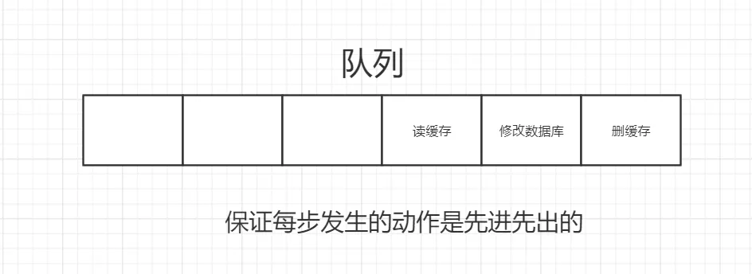

è§ç¬”记：24.æ—路缓存：Redis是如何工作的？â­ï¸â­ï¸â­ï¸â­ï¸ï¼ˆåªè¯»ç¼“存和几ç§è¯»å†™ç¼“存）

è§ç¬”记：26.缓存异常（上）：如何解决缓存和数æ®åº“çš„æ•°æ®ä¸ä¸€è‡´é—®é¢˜ï¼Ÿâ­ï¸â­ï¸â­ï¸â­ï¸â­ï¸

è§ç¬”记：27.缓存异常（下）：如何解决缓存雪崩ã€å‡»ç©¿ã€ç©¿é€éš¾é¢˜ï¼Ÿâ­ï¸â­ï¸â­ï¸â­ï¸â­ï¸

---


### 9.哈希扩容：rehashâ­ï¸â­ï¸â­ï¸

1. redis 有==两个数组==，主è¦ç”¨äºŽ==æ¸è¿›å¼æ‰©å®¹==。
2. 之所以需è¦æ¸è¿›ï¼Œä¸»è¦æ˜¯ä¸ºäº†åˆ†æ‘Šæ‰©å®¹çš„压力，==é¿å…一次性移到大é‡æ•°æ®é˜»å¡žçº¿ç¨‹==。

è§ç¬”记：3.æ•°æ®ç»“构：快速的Redis有哪些慢æ“作？🌟🌟🌟🌟🌟

---


### 10.分布å¼ä¸€è‡´æ€§ç®—法：leader选举â­ï¸â­ï¸

è§ç¬”记：9.哨兵集群：哨兵挂了，主从库还能切æ¢å—？🌟🌟🌟（Leader选举）

è§ç¬”记：7.åŒæ­¥ï¼šä¸»ä»Žåº“如何实现数æ®ä¸€è‡´ï¼ŸðŸŒŸðŸŒŸðŸŒŸðŸŒŸï¼ˆä¸»ä»ŽåŒæ­¥ï¼‰

---


# 5.计算机网络

> 笔记直接看 ComputerNetworks

### 1.OSI 的七层模型分别是？å„自的功能是什么？

==我的回答==：

1. ==物ç†å±‚==：==使用物ç†è®¾å¤‡å°†è®¡ç®—机连接起æ¥==，实现通信。

	常用的物ç†è®¾å¤‡æœ‰==åŒç»žçº¿ï¼ŒåŒè½´ç”µç¼†ï¼Œå…‰çº¤==等。==比如我们的家庭宽带就是使用光纤连接==èµ·æ¥çš„。我们å‘é€çš„==æ•°æ®åœ¨ç‰©ç†å±‚都是以高低电平的形å¼è¿›è¡Œä¼ è¾“çš„==。

	这也æ„味ç€å‘é€æ–¹å’ŒæŽ¥æ”¶æ–¹éœ€è¦æœ‰==统一的编ç å’Œè§£ç æ–¹å¼ï¼Œä»Žè€Œå°†é«˜ä½Žç”µå¹³è½¬åŒ–为0,1==。

2. ==æ•°æ®é“¾è·¯å±‚==：根æ®ä»¥å¤ªç½‘å议，数æ®é“¾è·¯å±‚中数æ®ä¼ è¾“çš„==最å°å•ä½æ˜¯å¸§==。帧的存在是为了==将物ç†å±‚ä¼ æ¥çš„0,1字节æµå°è£…æˆå¸§ï¼Œå¹¶è¿›è¡Œå·®é”™æ£€éªŒ==。

	既然我们è¦è¿›è¡Œæ•°æ®çš„传输，那么肯定需è¦æ ‡è¯†æ•°æ®çš„å‘é€è€…和接收者，而 ==MAC 地å€å°±èƒ½å”¯ä¸€åœ°æ ‡è¯†ä¸€å°è®¾å¤‡ï¼Œå®ƒåœ¨ç½‘å¡ç”Ÿäº§çš„时候就被唯一确定了==，且是==ä¸å¯å˜==的。一个 ==MAC 地å€ç”±12个16进制数组æˆ==，比如 `88-A4-C2-57-C7-F6`。因此在==帧的头部会有12个字节分别标识数æ®çš„目的地å€å’Œæºåœ°å€==。

	ä½äºŽæ•°æ®é“¾è·¯å±‚çš„==交æ¢æœº==收到帧之åŽï¼Œå°±==æ ¹æ®ç›®çš„地å€çš„ MAC 地å€åœ¨è‡ªå·±çš„ MAC 地å€è¡¨ä¸­æŸ¥æ‰¾å¯¹åº”的端å£==，进行数æ®å¸§çš„转å‘。

3. ==网络层==：如果说数æ®é“¾è·¯å±‚是进行局域网内部的数æ®ä¼ è¾“çš„è¯ï¼Œé‚£ä¹ˆ==网络层就是将数æ®åœ¨ç½‘络和网络之间进行传输==，所ä¾èµ–的设备是==路由器==。

	网络层进行数æ®ä¼ è¾“çš„å议是 ==IP åè®®==。==IP å议的数æ®æŠ¥ä½äºŽæ•°æ®é“¾è·¯å±‚帧的数æ®éƒ¨åˆ†ä¸­==，å¯ä»¥ç†è§£ä¸º==æ•°æ®é“¾è·¯å±‚的帧就是网络层的 IP å议数æ®æŠ¥åœ¨ä¸¤ç«¯åŠ ä¸Šå¸§é¦–部和帧尾部==。而 IP å议的数æ®æŠ¥ä¸­å­˜å‚¨äº†ç›®çš„ IP 地å€å’Œæº IP 地å€ã€‚

	路由器收到 IP æ•°æ®æŠ¥åŽï¼Œ==æ ¹æ®å…¶è·¯ç”±è¡¨æ‰¾å‡ºä¸‹ä¸€è·³çš„路由器的 IP 地å€æˆ–是转å‘ä¿¡æ¯çš„端å£==。

	如果==目标 IP 地å€å°±å¤„于该路由器所连接的æŸä¸ªç«¯å£ä¸‹ï¼Œè·¯ç”±å™¨åˆ™æ ¹æ®å…¶ ARP 缓存表查询目的 MAC 地å€==，并==写入到新数æ®å¸§çš„帧表头中==，==å‘é€ç»™å¯¹åº”端å£ä¸‹çš„交æ¢æœº==以进行进一步数æ®ä¼ è¾“。

4. ==传输层==：负责==建立æµè§ˆå™¨è¿›ç¨‹å’ŒæœåŠ¡å™¨åŽå°è¿›ç¨‹é—´çš„通信==，而由于æµè§ˆå™¨è¿›ç¨‹å’ŒæœåŠ¡å™¨åŽå°è¿›ç¨‹éƒ½å ç”¨äº†æ‰€å±žè®¾å¤‡çš„æŸä¸ªç«¯å£ï¼Œå› æ­¤ä¼ è¾“层的工作便是==建立端å£åˆ°ç«¯å£ä¹‹é—´çš„通信==。传输层常用的å议是 ==TCP å’Œ UDP åè®®==。其中 ==TCP åè®®==在数æ®ä¼ è¾“å‰ä¼šè¿›è¡Œ==连接==，以实现==点对点的通信==，并æä¾›==拥塞控制==å’Œ==æµé‡æŽ§åˆ¶==，实现了==å¯é çš„æ•°æ®ä¼ è¾“==。

5. ==应用层==：虽然我们收到了传输层传æ¥çš„æ•°æ®ï¼Œå¯æ˜¯è¿™äº›ä¼ è¿‡æ¥çš„æ•°æ®äº”花八门，有htmlæ ¼å¼çš„，有mp4æ ¼å¼çš„，å„ç§å„样。因此==我们需è¦æŒ‡å®šè¿™äº›æ•°æ®çš„æ ¼å¼è§„则，收到åŽæ‰å¥½è§£è¯»æ¸²æŸ“==。例如我们最常è§çš„ Http æ•°æ®åŒ…中，就会指定该数æ®åŒ…是什么格å¼çš„文件了。

==å‚考答案==：

- ==物ç†å±‚==：负责==把两å°è®¡ç®—机连起æ¥==，然åŽåœ¨è®¡ç®—机之间通过==高低电频æ¥ä¼ é€0,1这样的电信å·==，比如通过一些==电缆线传输比特æµ==。
- ==链路层==：链路层涉åŠåˆ°çš„å议比较多，比如 Mac 地å€å•Šï¼ŒARP 等，这一层主è¦å°±æ˜¯==负责数æ®çš„通信==，使==å„节点之间å¯ä»¥é€šä¿¡==，比如通过 ==MAC 地å€å”¯ä¸€è¯†åˆ«ä¸åŒçš„节点，通过以太网å议定义数æ®åŒ…==等。
- ==网络层==：网络层负责==把一个数æ®ä»Žä¸€ä¸ªç½‘络传递到å¦å¤–一个网络==，最大的功能就是进行==路由决策==，比如通过 ==IP，å­ç½‘==等概念，使数æ®æ›´å¥½ç€==在ä¸åŒçš„局域网中传递==。
- ==传输层==：传输层的功能就是==建立端å£åˆ°ç«¯å£çš„通信==，刚æ‰è¯´çš„==网络层的功能则是建立主机到主机的通信==，比如通过网络层我们å¯ä»¥æŠŠä¿¡æ¯ä»Ž A 主机传递到 B 主机，但是 ==B 主机有多个程åºï¼Œæˆ‘们具体è¦å‘给哪个程åºï¼Œåˆ™æ˜¯é ä¼ è¾“层的åè®®æ¥è¯†åˆ«==，常è§å议有 ==UDP å’Œ TCP==。
- ==应用层==：虽然我们收到了传输层传æ¥çš„æ•°æ®ï¼Œå¯æ˜¯è¿™äº›ä¼ è¿‡æ¥çš„æ•°æ®äº”花八门，有htmlæ ¼å¼çš„，有mp4==æ ¼å¼çš„，å„ç§å„æ ·==，我们用户也看ä¸æ‡‚，因此我们需è¦==指定这些数æ®çš„æ ¼å¼è§„则，收到åŽæ‰å¥½è§£è¯»æ¸²æŸ“==。例如我们最常è§çš„ Http æ•°æ®åŒ…中，就会指定该数æ®åŒ…是什么格å¼çš„文件了。

----


### 2.为什么需è¦ä¸‰æ¬¡æ¡æ‰‹ï¼Ÿä¸¤æ¬¡ä¸è¡Œï¼Ÿ

==我的回答==：

1. 三次æ¡æ‰‹æ˜¯ TCP å议在传输å‰==建立端å£ä¸Žç«¯å£é—´è¿žæŽ¥çš„方法==，它å¯ä»¥==让客户端和æœåŠ¡ç«¯éƒ½èƒ½ç¡®è®¤åŒæ–¹æŽ¥æ”¶å’Œå‘é€æ•°æ®çš„能力正常==，从而æä¾›==å¯é çš„æ•°æ®æœåŠ¡==。
2. 三次æ¡æ‰‹çš„æµç¨‹æ˜¯é¦–先客户端想è¦å’ŒæœåŠ¡ç«¯å»ºç«‹è¿žæŽ¥ï¼Œå…ˆå‘é€ä¸€ä¸ª SYN 报文，里é¢é™„加一个==客户端动æ€ç”Ÿæˆçš„åºåˆ—å·ï¼ˆä¹‹æ‰€ä»¥åŠ¨æ€æ˜¯é˜²æ­¢è¢«ä¼ªé€ ==），å‘é€åŽå®¢æˆ·ç«¯å¤„于 ==SYNC-SENT== 状æ€ã€‚
3. æœåŠ¡ç«¯æŽ¥æ”¶åˆ°å®¢æˆ·ç«¯çš„ SYN 报文åŽï¼Œéœ€è¦==回å¤ä¸¤ä¸ªæŠ¥æ–‡==。一个是 ACK 报文，标识æœåŠ¡ç«¯æˆåŠŸæŽ¥æ”¶ SYN 报文，该 ACK 报文中传输一个åºåˆ—å·ï¼Œ==其值为客户端å‘æ¥çš„ SYN 报文中的åºåˆ—å· + 1==，以==å‘客户端è¯æ˜Žè‡ªå·±çš„接收能力没有问题==。åŒæ—¶ï¼Œè¿˜éœ€å‘é€ä¸€ä¸ª SYN 报文，里é¢æœ‰ä¸€ä¸ªåœ¨æœåŠ¡ç«¯åŠ¨æ€ç”Ÿæˆçš„åºåˆ—å·ã€‚å‘é€è¿™ä¸¤ä¸ªæŠ¥æ–‡åŽï¼ŒæœåŠ¡ç«¯å¤„于 ==SYNC-RCVD== 状æ€ã€‚
4. 客户端接收到 ACK 报文åŽï¼Œçœ‹åˆ°é‡Œé¢çš„åºåˆ—å·çš„确是自己这里生æˆçš„åºåˆ—å· + 1，于是å¯ä»¥ç¡®è®¤æœåŠ¡ç«¯çš„接收能力没有问题。而收到 SYN 报文åŽï¼Œå’ŒæœåŠ¡ç«¯ç±»ä¼¼çš„返回一个å«æœ‰ SYN 中æœåŠ¡ç«¯åºåˆ—å· + 1çš„åºåˆ—å·çš„ ACK 报文。此时==客户端已ç»å¯ä»¥ç¡®è®¤åŒæ–¹æŽ¥æ”¶å’Œå‘é€æ•°æ®çš„能力å‡æ­£å¸¸==，进入 ==ESTABLISHED==。
5. 最åŽï¼ŒæœåŠ¡ç«¯æ”¶åˆ° ACK 报文，也能确认åŒæ–¹æŽ¥æ”¶å’Œå‘é€æ•°æ®çš„能力å‡æ­£å¸¸ï¼Œè¿›å…¥ ==ESTABLISHED==。
6. 如果åªæ¡æ‰‹==两次的è¯ï¼Œåªæœ‰å®¢æˆ·ç«¯èƒ½ç¡®è®¤åŒæ–¹æŽ¥æ”¶å’Œå‘é€æ•°æ®çš„能力å‡æ­£å¸¸ï¼Œè€ŒæœåŠ¡ç«¯ä¸èƒ½==。

==å‚考答案==：

- 第一次æ¡æ‰‹ï¼šå®¢æˆ·ç«¯å‘é€ç½‘络包，æœåŠ¡ç«¯æ”¶åˆ°äº†ã€‚这样æœåŠ¡ç«¯å°±èƒ½å¾—出结论：客户端的å‘é€èƒ½åŠ›ã€æœåŠ¡ç«¯çš„接收能力是正常的。
- 第二次æ¡æ‰‹ï¼šæœåŠ¡ç«¯å‘包，客户端收到了。这样==客户端就能得出结论：æœåŠ¡ç«¯çš„接收ã€å‘é€èƒ½åŠ›ï¼Œå®¢æˆ·ç«¯çš„接收ã€å‘é€èƒ½åŠ›æ˜¯æ­£å¸¸çš„==。==ä¸è¿‡æ­¤æ—¶æœåŠ¡å™¨å¹¶ä¸èƒ½ç¡®è®¤å®¢æˆ·ç«¯çš„接收能力是å¦æ­£å¸¸==。
- 第三次æ¡æ‰‹ï¼šå®¢æˆ·ç«¯å‘包，æœåŠ¡ç«¯æ”¶åˆ°äº†ã€‚这样æœåŠ¡ç«¯å°±èƒ½å¾—出结论：客户端的接收ã€å‘é€èƒ½åŠ›æ­£å¸¸ï¼ŒæœåŠ¡å™¨è‡ªå·±çš„å‘é€ã€æŽ¥æ”¶èƒ½åŠ›ä¹Ÿæ­£å¸¸ã€‚

----


### 3.为什么需è¦å››æ¬¡æŒ¥æ‰‹ï¼Ÿä¸‰æ¬¡ä¸è¡Œï¼Ÿ

==我的回答==：

1. 四次挥手是 TCP å议中客户端和æœåŠ¡ç«¯éœ€è¦æ–­å¼€è¿žæŽ¥æ—¶ï¼Œ==ä¿è¯åŒæ–¹éƒ½èƒ½æŠŠå½“å‰çš„æ•°æ®å¤„ç†å®Œ==的机制，也体现了 TCP çš„==å¯é æ€§ä¼ è¾“==。
2. 值得一æ的是，==客户端或æœåŠ¡ç«¯éƒ½å¯ä»¥ä¸»åŠ¨è¯·æ±‚æ–­å¼€ TCP 连接==，下é¢å‡è®¾å®¢æˆ·ç«¯ä¸»åŠ¨è¯·æ±‚断开连接。
3. 首先客户端å‘é€ä¸€ä¸ª FIN 报文，报文æºå¸¦ä¸€ä¸ªåœ¨å®¢æˆ·ç«¯åŠ¨æ€ç”Ÿæˆçš„åºåˆ—å·ï¼ŒéšåŽè¿›å…¥ FIN_WAIT1状æ€ã€‚
4. æœåŠ¡ç«¯æŽ¥æ”¶åˆ° FIN 报文åŽï¼Œå›žå¤ä¸€ä¸ª ACK 报文，为了å‘客户端è¯æ˜Žè‡ªå·±çš„确收到了断开连接的请求，ACK 报文中会æºå¸¦ä¸€ä¸ªåºåˆ—å·ï¼Œå…¶å€¼ä¸ºå®¢æˆ·ç«¯å‘æ¥çš„ FIN 报文中的åºåˆ—å·çš„值 + 1，éšåŽæœåŠ¡ç«¯è¿›å…¥ ==CLOSE_WAIT 状æ€ï¼Œæ­¤æ—¶æœåŠ¡ç«¯ä¼šå°½å¿«å¤„ç†å®Œè‡ªå·±å‰©ä¸‹çš„æ•°æ®ï¼Œä»¥ä¾¿éšåŽå‘起断开连接请求==。
5. 而客户端接收到æœåŠ¡ç«¯çš„ ACK，并通过验è¯åºåˆ—å·ç¡®è®¤å…¶æ”¶åˆ°åŽï¼Œè¾¹è¿›å…¥ ==FIN_WAIT2 状æ€ï¼Œç­‰å¾…æœåŠ¡ç«¯ç¡®è®¤æœåŠ¡ç«¯å¯ä»¥ç»“æŸåŽå†å‘é€çš„ FIN 报文==。
6. æœåŠ¡ç«¯å¤„ç†å®Œæ‰€æœ‰æ•°æ®ï¼Œç¡®ä¿è‡ªå·±å¯ä»¥æ–­å¼€è¿žæŽ¥åŽï¼Œå‘客户端å‘é€ä¸€ä¸ª FIN 报文，类似的æºå¸¦ä¸€ä¸ªåœ¨æœåŠ¡ç«¯åŠ¨æ€ç”Ÿæˆçš„åºåˆ—å·ï¼ŒéšåŽè¿›å…¥ ==LACK_ACK 状æ€ï¼Œæ„为等待客户端最åŽçš„确认==。
7. 客户端收到 FIN 报文åŽï¼Œå›žå¤ ACK 报文并æºå¸¦æ”¶åˆ°çš„åºåˆ—å· + 1，之åŽè¿›å…¥ TIME_WAIT 状æ€ã€‚==TIME_WAIT 状æ€è‡³å°‘等待 2MSL==。
8. æœåŠ¡ç«¯æ”¶åˆ° ACK 报文åŽï¼Œè¿›å…¥ CLOSED 状æ€ï¼Œæ–­å¼€ TCP 连接。
9. 而客户端在等待 2MSL åŽä¹Ÿè¿›å…¥ CLOSED 状æ€ã€‚
10. ==为什么 TIME_WAIT 至少è¦ç­‰å¾… 2MSL==？==MSL 是一个报文的最大存活时间==，如果æœåŠ¡ç«¯åœ¨ LACK_ACK 状æ€ä¸‹ç­‰å¾… 1MSL åŽæ²¡æœ‰æ”¶åˆ°å®¢æˆ·ç«¯çš„ ACK 报文，那么此报文必定已ç»è¿‡æœŸäº†ã€‚æœåŠ¡ç«¯æ„识到 ACK 报文å¯èƒ½ç”±äºŽç½‘络拥塞等原因没能æˆåŠŸé€è¾¾ï¼Œä¾¿èµ¶ç´§==é‡æ–°å‘é€ä¸€ä¸ª FIN 报文==，æ„为让客户端é‡æ–°ç¡®è®¤ã€‚==这一æ¥ä¸€å›žçš„最长时间正是两个报文的最大存活时间 2MSL==。因此 ==TIME_WAIT 至少等待 2MSL å¯ä»¥ä¿è¯æ¥å¾—åŠæŽ¥æ”¶åˆ°æœåŠ¡ç«¯å¯èƒ½å†æ¬¡å‘é€çš„ FIN 报文==，这也是 TCP å¯é ä¼ è¾“æœåŠ¡çš„一个体现。
11. 四次挥手主è¦åŽŸå› æ˜¯ï¼Œ==客户端主动==å‘起断开连接的请求åŽï¼Œ==æœåŠ¡å™¨å¯èƒ½ä»æœ‰æ•°æ®éœ€è¦å¤„ç†å’Œå‘é€==，所以==需è¦ç­‰å¾…æœåŠ¡å™¨å¤„ç†å®Œæ•°æ®==åŽï¼Œä¸»åŠ¨è°ƒç”¨æ–­å¼€å‡½æ•°ï¼Œå› æ­¤==æœåŠ¡ç«¯çš„ ACK å’Œ FIN 需è¦åˆ†å¼€å‘é€ï¼Œå°±éœ€è¦å››æ¬¡æŒ¥æ‰‹==。

==å‚考答案==：

- 四次挥手主è¦åŽŸå› æ˜¯ï¼Œ==客户端主动==å‘起断开连接的请求åŽï¼Œ==æœåŠ¡å™¨å¯èƒ½ä»æœ‰æ•°æ®éœ€è¦å¤„ç†å’Œå‘é€==，所以==需è¦ç­‰å¾…æœåŠ¡å™¨å¤„ç†å®Œæ•°æ®==åŽï¼Œä¸»åŠ¨è°ƒç”¨æ–­å¼€å‡½æ•°ï¼Œå› æ­¤==æœåŠ¡ç«¯çš„ ACK å’Œ FIN 需è¦åˆ†å¼€å‘é€ï¼Œå°±éœ€è¦å››æ¬¡æŒ¥æ‰‹==。

---


### 4.TCP与UDP有哪些区别？å„自应用场景？

==我的回答==：

1. TCP å议是有连接的å议，比如å†æ­£å¼ä¼ è¾“æ•°æ®ä¹‹å‰ä¼šå…ˆè¿›è¡Œä¸‰æ¬¡æ¡æ‰‹ä¿è¯åŒå‘å‘é€æŽ¥æ”¶èƒ½åŠ›æ­£å¸¸ï¼Œè€Œåœ¨æ–­å¼€è¿žæŽ¥æ—¶ä¹Ÿä¼šè¿›è¡Œå››æ¬¡æŒ¥æ‰‹ä»¥ä¿è¯å®¢æˆ·ç«¯å’ŒæœåŠ¡ç«¯æ•°æ®å¤„ç†å®Œæ¯•ã€‚而 UDP 是无连接å议。
2. TCP å议时é¢å‘字节æµçš„å议，å¯ä»¥å°†ä¸€ä»½æ•°æ®æ‹†åˆ†æˆå¤šä»½æ•°æ®æŠ¥è¿›è¡Œå‘é€ã€‚而 UDP æ—¶é¢å‘报文的å议，å³ä¸ä¼šå¯¹æŠ¥æ–‡è¿›è¡Œæ‹†åˆ†æˆ–é‡ç»„。
3. TCP å议是å¯é çš„传输å议，æ供网络拥塞控制以åŠæŽ¥æ”¶æ–¹æµé‡æŽ§åˆ¶ä»¥é˜²æ­¢ä¼ è¾“æ•°æ®è¢«é˜»å¡žæˆ–丢弃，并且能ä¿è¯æŽ¥æ”¶æ–¹èƒ½æŒ‰é¡ºåºæŽ¥æ”¶å‘é€æ–¹å‘出的报文。而 UDP åè®®ä¸èƒ½ä¿è¯å¯é ä¼ è¾“，比如å‘é€æ–¹å‘出报文和接收方接收报文的顺åºä¸ä¸€å®šç›¸åŒã€‚
4. UDP 报文的首部开销很å°ï¼Œä¼ è¾“速度快。而 TCP 报文首部较大，传输速度也ä¸åŠ UDP 报文。
5. 因此传输对准确性è¦æ±‚高，性能è¦æ±‚较宽æ¾çš„æ•°æ®ï¼Œå¦‚登录凭è¯ï¼Œé‡è¦æ–‡ä»¶ï¼Œé‚®ä»¶ä¿¡æ¯å»ºè®®ä½¿ç”¨ TCP。
6. 而对传输速度è¦æ±‚高，但是å…许传输失败或失误的数æ®å¯ä»¥ä½¿ç”¨ UDP，如在线èŠå¤©ï¼Œè§†é¢‘通è¯ï¼Œå¹¿æ’­ã€‚

==å‚考答案==：

- (1)TCP是==å¯é ==传输,UDP是ä¸å¯é ä¼ è¾“;

	(2)TCPé¢å‘==连接==,UDP无连接;

	(3)TCP传输数æ®==有åº==,UDPä¸ä¿è¯æ•°æ®çš„有åºæ€§;

	(4)TCP==ä¸ä¿å­˜æ•°æ®è¾¹ç•Œ==,UDPä¿ç•™æ•°æ®è¾¹ç•Œ;

	(5)TCP==传输速度==相对UDP较慢;

	(6)TCP有==æµé‡æŽ§åˆ¶å’Œæ‹¥å¡žæŽ§åˆ¶==,UDP没有;

	(ï¼—)TCP是==é‡é‡çº§åè®®==,UDP是轻é‡çº§åè®®;

	(８)TCP==首部较长==20字节,UDP首部较短8字节;

- 基于 TCP å’Œ UDP çš„==常用åè®®==

	==HTTPã€HTTPS==ã€FTPã€TELNETã€==SMTP==(简å•é‚®ä»¶ä¼ è¾“åè®®)å议基于==å¯é çš„TCPåè®®==。

	==DNSã€DHCP==ã€TFTPã€SNMP(简å•ç½‘络管ç†åè®®)ã€RIP基于==ä¸å¯é çš„UDPåè®®==。

- ==TCP 应用场景==：

	==效率è¦æ±‚相对低，但对准确性è¦æ±‚相对高==的场景。因为传输中需è¦å¯¹æ•°æ®ç¡®è®¤ã€é‡å‘ã€æŽ’åºç­‰æ“作，相比之下效率没有UDP高。举几个例å­ï¼š==文件传输==（准确高è¦æ±‚高ã€ä½†æ˜¯é€Ÿåº¦å¯ä»¥ç›¸å¯¹æ…¢ï¼‰ã€==接å—邮件ã€è¿œç¨‹ç™»å½•==。

- ==UDP 应用场景==：

	==效率è¦æ±‚相对高，对准确性è¦æ±‚相对低==的场景。举几个例å­ï¼š==QQèŠå¤©ã€åœ¨çº¿è§†é¢‘ã€ç½‘络语音电è¯==（å³æ—¶é€šè®¯ï¼Œé€Ÿåº¦è¦æ±‚高，但是出现å¶å°”æ–­ç»­ä¸æ˜¯å¤ªå¤§é—®é¢˜ï¼Œå¹¶ä¸”此处完全ä¸å¯ä»¥ä½¿ç”¨é‡å‘机制）ã€==广播通信==（广播ã€å¤šæ’­ï¼‰

---


### 5.HTTP1.0，1.1，2.0 的版本区别

==我的回答==：

1. ==HTTP1.0 æ¯ä¸ª TCP 连接åªèƒ½å‘é€ä¸€ä¸ªè¯·æ±‚==，如果还需å‘é€å…¶å®ƒçš„请求，那么就需è¦é‡æ–°å»ºç«‹è¿žæŽ¥ã€‚==新建连接的æˆæœ¬è¾ƒé«˜==，比如需è¦è¿›è¡Œä¸‰æ¬¡æ¡æ‰‹ï¼Œå› æ­¤å¦‚果请求一个需è¦å¤§é‡å¤–部资æºçš„网页，那么这个缺点就会进一步被放大，因此 HTTP1.0 的效率较低。
2. HTTP1.1 支æŒæŒä¹…连接和管é“，==æŒä¹…连接指一个 TCP 连接在å‘出一个请求之åŽä¸ä¼šç«‹å³æ–­å¼€==。而==管é“则是在åŒä¸€ä¸ªè¿žæŽ¥é‡Œï¼Œå®¢æˆ·ç«¯å¯ä»¥å‘é€å¤šä¸ªè¯·æ±‚==，åŒæ—¶æœåŠ¡ç«¯å¯ä»¥å‘é€å¤šä¸ªå›žåº”。但是既然å…许å‘é€å¤šä¸ªè¯·æ±‚，就必须有方法å¯ä»¥åŒºåˆ†æ¯ä¸ªå›žåº”，HTTP1.1 中采å–çš„æ–¹å¼æ˜¯åœ¨æŠ¥æ–‡ä¸­åŠ å…¥æŠ¥æ–‡é•¿åº¦ï¼Œè¿™æ ·æµè§ˆå™¨å°±èƒ½åˆ¤æ–­å“ªä¸€ä¸²å­—节æµæ˜¯ä¸€ä¸ªå›žåº”了。
3. HTTP1.1 中的数æ®ä½“æ—¢å¯ä»¥æ˜¯äºŒè¿›åˆ¶æµï¼Œä¹Ÿå¯ä»¥æ˜¯æ–‡æœ¬ã€‚而在 ==HTTP2.0 中，数æ®ä½“åªèƒ½æ˜¯äºŒè¿›åˆ¶æµ==，而这就==方便将数æ®åˆ†å‰²æˆæ›´å°çš„消æ¯å’Œå¸§==，并对它们==进行二进制编ç ==。除此以外，HTTP2.0 支æŒå¤šè·¯å¤ç”¨ï¼Œå³å†ä¸€æ¬¡è¿žæŽ¥ä¸­ï¼Œå®¢æˆ·ç«¯å’ŒæœåŠ¡ç«¯å‡å¯ä»¥å‘é€å¤šä¸ªè¯·æ±‚和回应，且ä¸ç”¨æŒ‰ç…§é¡ºåºä¸€ä¸€å¯¹åº”，而==多路å¤ç”¨çš„å‰æ则是上é¢æ到的二进制分帧==。

==å‚考答案==：

- ==HTTP/1.0==：==HTTP/1.0规定æµè§ˆå™¨ä¸ŽæœåŠ¡å™¨åªä¿æŒçŸ­æš‚的连接，æµè§ˆå™¨çš„æ¯æ¬¡è¯·æ±‚都需è¦ä¸ŽæœåŠ¡å™¨å»ºç«‹ä¸€ä¸ªTCP连接，æœåŠ¡å™¨å®Œæˆè¯·æ±‚处ç†åŽç«‹å³æ–­å¼€TCP连接==。


暂时止步于此，主è¦æ„Ÿè§‰æœ‰ç‚¹åŽŒå€¦äº†ï¼Œå…ˆå­¦ä¸€äº›å…¶å®ƒçš„东西调节一下。

---


# 6.æ“作系统

### 1.进程之间的通信有哪些？

1. ==管é“==：

	> - ==匿å管é“==就是我们常用的 `|` ，æ„为把å‰ä¸€æ¡å‘½ä»¤çš„输出作为åŽä¸€æ¡å‘½ä»¤çš„输入。
	> - ==命å管é“==则是通过 `>` å’Œ `<` 实现，但是==命å管é“中的数æ®æ²¡æœ‰è¢«å¦ä¸€ä¸ªè¿›ç¨‹è¯»å–，这æ¡å‘½ä»¤å°±ä¼šä¸€ç›´åœç•™åœ¨è¿™é‡Œ==。
	> - å› æ­¤==管é“å°±åƒæ˜¯ç¼“å­˜==，一个进程å§æ•°æ®æ”¾åœ¨ä¸€ä¸ªç¼“存区域，等待其它进程去拿，但是==å¿…é¡»è¦ç­‰å¾…其它进程拿走这份数æ®åŽï¼ŒåŽŸè¿›ç¨‹æ‰èƒ½è¿”回==，因此管é“çš„==效率较为低下==。

2. ==消æ¯é˜Ÿåˆ—==：

	> - è¿™ç§é€šä¿¡æ–¹å¼ä¹Ÿ==类似于缓存==，åªä¸è¿‡æ•°æ®çš„å‘é€æ–¹==åªéœ€æŠŠæ•°æ®ç”©åˆ°æ¶ˆæ¯é˜Ÿåˆ—å°±å¯ä»¥è¿”回==。
	> - 缺点是如果==æ•°æ®å ç”¨çš„内存较大==，且进程之间的==通信频ç¹==çš„è¯ï¼Œ==å‘é€æ¶ˆæ¯é˜¶æ®µå°±ä¼šå ç”¨å¾ˆå¤šæ—¶é—´==。

3. ==共享内存==：

	> - ==共享内存==这个通信方å¼å°±å¯ä»¥å¾ˆå¥½ç€==解决拷è´æ‰€æ¶ˆè€—的时间==。
	> - 系统加载一个进程的时候，分é…给进程的内存并ä¸æ˜¯==实际物ç†å†…å­˜==，而是==虚拟内存空间==。那么我们å¯ä»¥è®©ä¸¤ä¸ªè¿›ç¨‹==å„自拿出一å—虚拟地å€ç©ºé—´æ¥ï¼Œç„¶åŽæ˜ å°„到相åŒçš„物ç†å†…å­˜==中，这样，==两个进程虽然有ç€ç‹¬ç«‹çš„虚拟内存空间，但有一部分å´æ˜¯æ˜ å°„到相åŒçš„物ç†å†…å­˜==，就完æˆäº†==内存共享==机制了。

4. ==ä¿¡å·é‡==：

	> - ä¿¡å·é‡çš„本质就是一个==计数器==，用æ¥å®žçŽ°è¿›ç¨‹ä¹‹é—´çš„互斥与åŒæ­¥ï¼Œä»¥==解决多个线程并å‘访问共享内存而带æ¥çš„线程安全问题==。
	> - 例如信å·é‡çš„åˆå§‹å€¼æ˜¯ 1ï¼Œç„¶åŽ a 进程æ¥è®¿é—®==内存1==的时候，我们就把信å·é‡çš„值设为 0，然åŽè¿›ç¨‹b 也è¦æ¥è®¿é—®==内存1==的时候，看到信å·é‡çš„值为 0 就知é“å·²ç»æœ‰è¿›ç¨‹åœ¨è®¿é—®==内存1==了，这个时候进程 b 就会访问ä¸äº†==内存1==。所以说，信å·é‡ä¹Ÿæ˜¯è¿›ç¨‹ä¹‹é—´çš„一ç§é€šä¿¡æ–¹å¼ã€‚

5. ==Socket==

---


### 2.进程和线程的区别

1. ==进程相当一个容器，而线程åªæ˜¯é‡Œé¢çš„一个东西==，并且==程åºæœ¬è´¨æ˜¯çº¿ç¨‹åœ¨æ‰§è¡Œ==，基于这个，å†åŽ»å›žç­”他们的其他区别，比如通信，内存结构，等等。

---


# 7.Linux

## 1.Linux 性能排查（é‡ç‚¹ï¼‰

### 1.你使用过监控软件å—？说说其特点

1. ==top==

	> - 它æ供了实时的系统状æ€ï¼ŒåŒ…括==CPU使用率ã€å†…存使用ã€è¿›ç¨‹ä¿¡æ¯==等。它éžå¸¸é€‚åˆäºŽå¿«é€ŸæŸ¥çœ‹ç³»ç»Ÿçš„当å‰çŠ¶æ€ã€‚
	> - 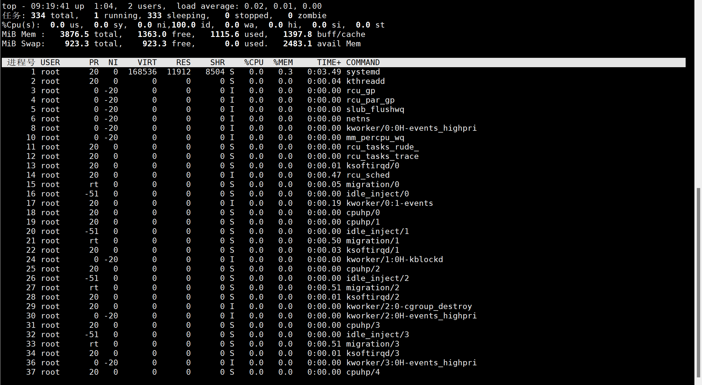

2. ==htop==

	> - 相比于top，htopæ供了一个更为å‹å¥½çš„用户界é¢ï¼Œæ”¯æŒ==彩色显示==，å¯ä»¥==通过键盘æ“作æ¥ç®¡ç†è¿›ç¨‹ï¼ˆå¦‚æ€æ­»è¿›ç¨‹ï¼‰==。它还显示了==CPU的使用情况分布在所有核心上的视图==，使得信æ¯çš„获å–更直观。
	> - 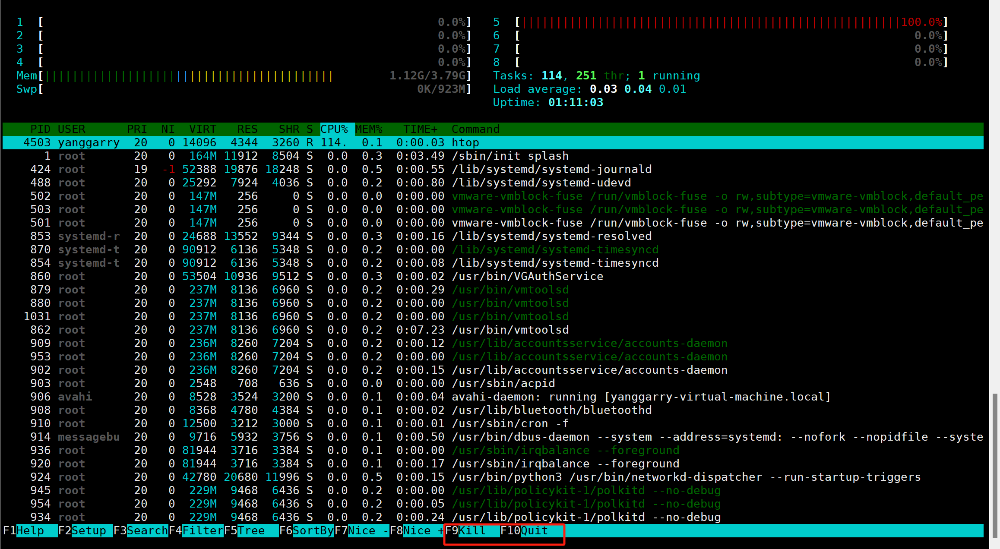

3. ==iotop==

	> - 这个工具==专注于ç£ç›˜I/O==，它显示了==哪些进程正在进行ç£ç›˜è¯»å†™æ“作以åŠæ“作的强度==。这==对于识别ç£ç›˜I/O瓶颈éžå¸¸æœ‰ç”¨==。
	> - 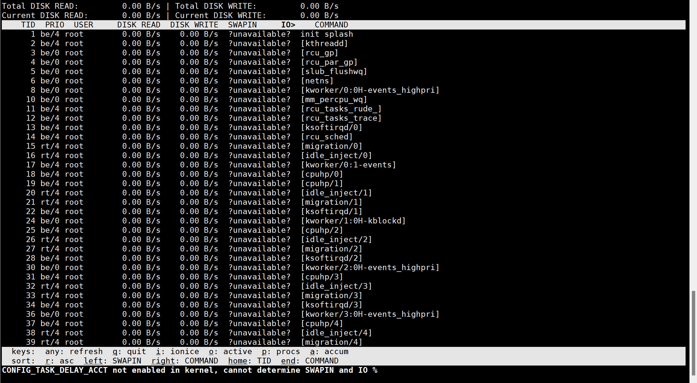

4. ==vmstat==

	> - 它æ供了关于==虚拟内存ã€è¿›ç¨‹ã€CPU活动以åŠI/O阻塞==çš„ä¿¡æ¯ã€‚vmstat能够以时间åºåˆ—çš„æ–¹å¼æ˜¾ç¤ºç³»ç»Ÿæ€§èƒ½æŒ‡æ ‡ï¼Œæœ‰åŠ©äºŽè¯†åˆ«æ€§èƒ½è¶‹åŠ¿ã€‚
	> - 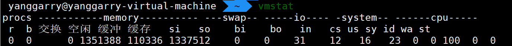

5. ==dstat==

	> - dstat是一个强大的工具，å¯ä»¥çœ‹ä½œæ˜¯==vmstatã€iotopå’Œifstat的结åˆä½“==。它能够报告关于==CPUã€å†…å­˜ã€ç£ç›˜ä»¥åŠç½‘络性能的综åˆè§†å›¾==，支æŒè‡ªå®šä¹‰è¾“出以关注特定的性能指标。
	> - 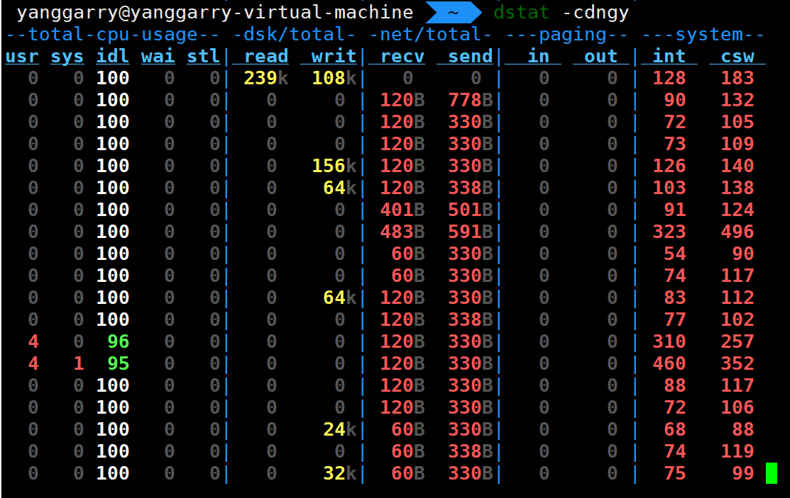

6. ==Prometheuså’ŒGrafana==

	> - 这是一ç§æ›´çŽ°ä»£çš„监控解决方案，Prometheus负责收集和存储性能数æ®ï¼Œè€ŒGrafana用于数æ®çš„å¯è§†åŒ–。这ç§ç»„åˆæ”¯æŒé«˜åº¦è‡ªå®šä¹‰çš„仪表æ¿ï¼Œèƒ½å¤Ÿæ˜¾ç¤ºå¤æ‚的时间åºåˆ—æ•°æ®ï¼Œé€‚用于大规模环境的监控。

7. ==例å­==

	> - 如果我们想è¦ç›‘控一个WebæœåŠ¡å™¨çš„性能，我们å¯ä»¥ä½¿ç”¨`top`或`htop`æ¥è§‚察哪些进程消耗了最多的CPU和内存资æºã€‚如果å‘现ç£ç›˜I/O是性能瓶颈，那么`iotop`å¯ä»¥å¸®åŠ©æˆ‘们确定是哪个进程导致的ç£ç›˜åŽ‹åŠ›ã€‚而对于长期的性能监控和趋势分æžï¼Œåˆ™å¯ä»¥éƒ¨ç½²`Prometheus`å’Œ`Grafana`，通过精美的图表æ¥ç›´è§‚展示性能数æ®ï¼Œä»Žè€Œå¸®åŠ©æˆ‘们åšå‡ºç›¸åº”的优化决策。

---


### 2.Linux 如何查看 CPU è¿è¡ŒçŠ¶æ€?

1. ==top命令==：

	> - 这是最基础的命令之一，å¯ä»¥å®žæ—¶æ˜¾ç¤ºç³»ç»Ÿè¿›ç¨‹çš„动æ€è¿è¡Œæƒ…况，包括==CPU使用率ã€å†…存使用ã€ä»¥åŠè¿›ç¨‹ä¿¡æ¯==。在topç•Œé¢ä¸­ï¼ŒCPU状æ€æ˜¾ç¤ºåœ¨é¡¶éƒ¨ï¼ŒåŒ…括å„个核心的使用情况。

2. ==htop命令==：

	> - htop是top命令的一个增强版，æ供了一个更å‹å¥½çš„用户界é¢ï¼Œæ”¯æŒ==彩色显示==，并且å¯ä»¥é€šè¿‡==键盘直接æ“作进程（如结æŸè¿›ç¨‹ï¼‰==。它显示了æ¯ä¸ªCPU核心的使用情况，并且æ供了更多的信æ¯å’Œæ›´å¥½çš„视觉体验。

3. ==vmstat命令==：

	> - vmstat（Virtual Memory Statistics）命令报告关于==虚拟内存ã€è¿›ç¨‹ã€CPU活动==等的信æ¯ã€‚它å¯ä»¥æ˜¾ç¤º==系统的平å‡è´Ÿè½½ä»¥åŠCPU的空闲时间ã€ç”¨æˆ·æ—¶é—´ã€ç³»ç»Ÿæ—¶é—´å’Œç­‰å¾…I/O的时间==。
	> - 

4. ==mpstat命令==：

	> - ==mpstat是sysstat包的一部分==，用于显示å„个CPU或者核心的性能统计。它å¯ä»¥æŠ¥å‘Š==CPU的使用细节==，包括==æ¯ä¸ªCPU在用户模å¼ã€ç³»ç»Ÿæ¨¡å¼ä¸‹çš„时间花费，以åŠç©ºé—²æ—¶é—´==等。
	> - 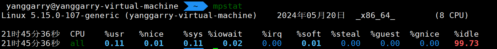

5. ==lscpu命令==：

	> - lscpu显示了CPU架构的信æ¯ï¼ŒåŒ…括==CPUçš„æ•°é‡ã€æ¯ä¸ªCPU的核数ã€æ¯ä¸ªæ ¸çš„线程数ã€CPU的家æ—ã€åž‹å·==等。这个命令更多地æ供了==CPUçš„é™æ€ä¿¡æ¯==，而ä¸æ˜¯åŠ¨æ€çš„性能数æ®ã€‚
	> - 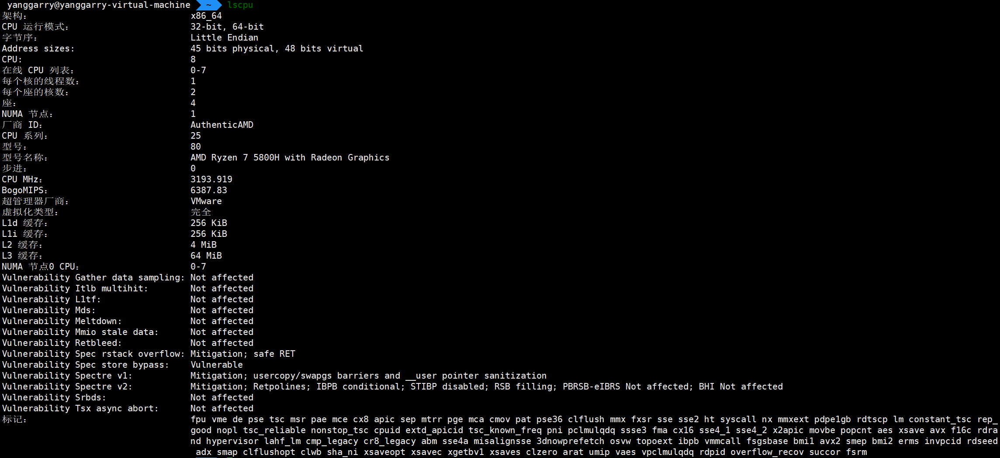

6. ==cat /proc/cpuinfo==：

	> - 这个命令 `cat /proc/cpuinfo` æ供了关于==CPU的详细信æ¯==，包括==æ¯ä¸ªCPUçš„åž‹å·ã€æ ¸å¿ƒæ•°ã€é€Ÿåº¦==等。`/proc/cpuinfo`文件包å«äº†å½“å‰ç³»ç»ŸCPU的所有详细信æ¯ã€‚

---


### 3Linux 如何查看内存的使用情况？

1. ==free命令==：

	> - `free`命令是查看内存使用情况最直接的方法。它显示了==总内存ã€å·²ä½¿ç”¨å†…å­˜ã€ç©ºé—²å†…å­˜ã€ç¼“存和缓冲区使用的内存==以åŠ==交æ¢ç©ºé—´==的使用情况。通过`free -h`å¯ä»¥èŽ·å¾—易于阅读的格å¼ã€‚
	> - 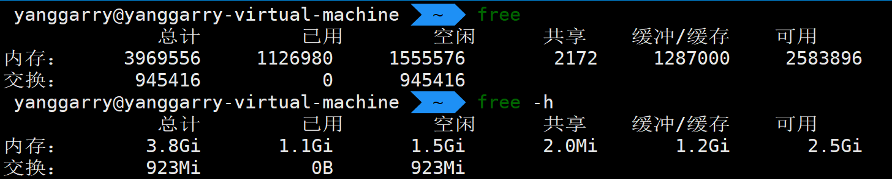

2. ==top命令==：

	> - `top`命令ä¸ä»…å¯ä»¥æŸ¥çœ‹CPU的使用情况，也能显示==内存的总体使用状况，包括总内存ã€ç©ºé—²å†…å­˜ã€ç¼“冲区和缓存==的使用情况。此外，它还能显示æ¯ä¸ª==进程的内存å ç”¨==。

3. ==htop命令==：

	> - 与`top`类似，`htop`æ供了一个更易于使用的界é¢æ¥æ˜¾ç¤ºç³»ç»Ÿçš„==内存使用情况，包括物ç†å†…存和交æ¢ç©ºé—´çš„使用==。它还å…许用户通过==图形界é¢==管ç†è¿›ç¨‹ï¼ŒåŒ…括查看==进程的内存å ç”¨==。

4. ==vmstat命令==：

	> - `vmstat`报告了==虚拟内存==的统计信æ¯ï¼ŒåŒ…括系统的==交æ¢æ´»åŠ¨ã€ç©ºé—²å†…å­˜é‡ä»¥åŠå†…存的使用==情况。它对于==分æžç³»ç»Ÿçš„内存压力和性能瓶颈==éžå¸¸æœ‰ç”¨ã€‚

5. ==/proc/meminfo文件==：

	> - 通过查看`/proc/meminfo`文件，å¯ä»¥èŽ·å–关于==系统内存使用的详细信æ¯==，包括==总内存ã€ç©ºé—²å†…å­˜ã€å¯ç”¨å†…å­˜ã€ç¼“å­˜ã€äº¤æ¢ç©ºé—´==等。使用`cat /proc/meminfo`命令å¯ä»¥æŸ¥çœ‹è¿™äº›è¯¦ç»†æ•°æ®ã€‚

6. ==sar命令==：

	> - `sar`是一个系统活动报告工具，它å¯ä»¥æŠ¥å‘ŠåŽ†å²æ•°æ®å’Œå®žæ—¶æ•°æ®ï¼ŒåŒ…括CPU使用ã€å†…存使用ã€I/O等。对于内存使用情况，`sar -r`å¯ä»¥æ˜¾ç¤ºå®žæ—¶çš„内存使用情况，包括交æ¢ç©ºé—´çš„使用。
	>
	> - 无法打开 /var/log/sysstat/sa21 的解决办法：
	>
	> 	- ```bash
	> 		sudo vim /etc/default/sysstat
	> 																																							
	> 		#
	> 		# Default settings for /etc/init.d/sysstat, /etc/cron.d/sysstat
	> 		# and /etc/cron.daily/sysstat files
	> 		#
	> 																																							
	> 		# Should sadc collect system activity informations? Valid values
	> 		# are "true" and "false". Please do not put other values, they
	> 		# will be overwritten by debconf!
	> 		ENABLED="true" # 将 false 改为 true
	> 		```
	>
	> 	- é‡å¯ sysstat æœåŠ¡ï¼š
	>
	> 		```java
	> 		sudo systemctl restart sysstat
	> 		```
	>
	> - 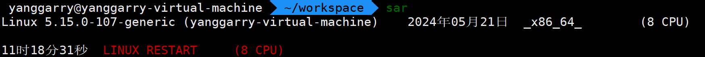

7. 这些工具和命令从ä¸åŒçš„角度æ供了内存使用情况的视图，å¯ä»¥å¸®åŠ©ç³»ç»Ÿç®¡ç†å‘˜å’Œç”¨æˆ·ç›‘控内存的使用情况，识别å¯èƒ½çš„内存泄æ¼æˆ–是为系统优化æ供数æ®æ”¯æŒã€‚例如，==使用`free`命令å¯ä»¥å¿«é€Ÿäº†è§£ç³»ç»Ÿçš„内存总览==，而==`htop`æ供了一ç§äº¤äº’å¼çš„æ–¹å¼æ¥æ·±å…¥æ¯ä¸ªè¿›ç¨‹çš„内存==使用详情。

---


### 4.Linux 如何查看硬盘的读写性能？

1. ==hdparm命令==：

	> - `hdparm`是一个查看和设置SATA/IDE设备性能的命令行工具。它å¯ä»¥ç”¨æ¥è¿›è¡Œç£ç›˜çš„读å–性能测试。例如，`hdparm -Tt /dev/sda`命令å¯ä»¥æµ‹è¯•è®¾å¤‡`/dev/sda`çš„==缓存读å–性能（`-T`）==å’Œ==ç£ç›˜è¯»å–性能（`-t`）==。
	> - 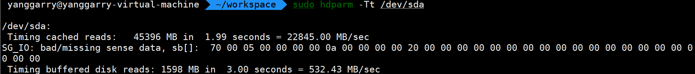

2. ==dd命令==：

	> - `dd`命令通常用于å¤åˆ¶å’Œè½¬æ¢æ–‡ä»¶ï¼Œä½†ä¹Ÿå¯ä»¥ç”¨æ¥æµ‹è¯•ç£ç›˜çš„读写性能。通过写入一个大文件到ç£ç›˜ï¼Œå¹¶è¯»å–它，å¯ä»¥ç®€å•åœ°æµ‹é‡ç£ç›˜çš„写入和读å–速率。例如，==使用`dd if=/dev/zero of=testfile bs=1G count=1 oflag=dsync`å¯ä»¥æµ‹è¯•å†™é€Ÿåº¦==，==使用`dd if=testfile of=/dev/null bs=1G count=1`å¯ä»¥æµ‹è¯•è¯»é€Ÿåº¦==。
	>
	> - 测试读速度
	>
	> 	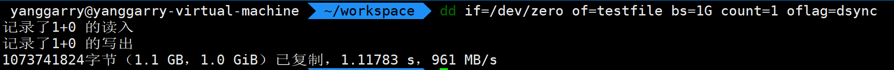
	>
	> - 测试写速度
	>
	> 	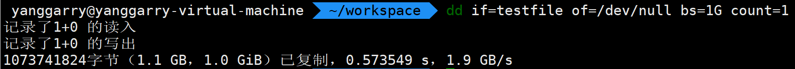

3. ==iostat命令==：

	> - `iostat`是一个用于监控系统==输入/输出设备负载==的工具。它å¯ä»¥æŠ¥å‘Š==CPU统计信æ¯å’Œæ‰€æœ‰å—设备的I/O统计信æ¯==，包括==æ¯ä¸ªç£ç›˜çš„读写速度ã€æ¯æ¬¡è¯»å†™æ“作的数æ®é‡ä»¥åŠæ€»çš„读写请求==等。`iostat -dx 1`命令å¯ä»¥æ¯ç§’更新这些统计信æ¯ã€‚

4. ==iotop命令==：

	> - `iotop`是一个实时的I/O监视工具，它å¯ä»¥æ˜¾ç¤º==哪些进程==在进行==读写æ“作以åŠè¿™äº›æ“作的速度==。这对于==识别哪个进程对ç£ç›˜æ€§èƒ½å½±å“最大==éžå¸¸æœ‰ç”¨ã€‚

5. ==fio工具==：

	> - `fio`是一个çµæ´»çš„I/O测试工具，å¯ä»¥æ¨¡æ‹Ÿä¸åŒç±»åž‹çš„I/O负载，包括éšæœºè¯»å†™å’Œé¡ºåºè¯»å†™ã€‚它支æŒå¤šç§I/O引擎，如POSIX AIOã€libaio等，并å¯ä»¥è¯¦ç»†é…置测试的å‚数，如å—大å°ã€é˜Ÿåˆ—深度等。`fio`能够æä¾›==详细的性能测试报告==，包括IOPS（==æ¯ç§’输入/输出æ“作次数）ã€å»¶è¿Ÿå’Œåžåé‡==等。

6. 使用这些工具，你å¯ä»¥ä»Žä¸åŒçš„角度评估硬盘的读写性能。例如，==`hdparm`å’Œ`dd`适åˆå¿«é€Ÿç®€å•==的性能测试，而==`iostat`å’Œ`iotop`则适用于实时监控==。对于需è¦æ·±å…¥åˆ†æžå’Œ==定制测试场景的情况，`fio`==是一个éžå¸¸å¼ºå¤§çš„选择。

----


### 5.Linux 机器上跟踪系统事件的守护进程å是什么？

1. 在Linux机器上，跟踪系统事件的守护进程通常是`syslogd`或`rsyslogd`。
2. ==syslogd==：这是最基本的系统日志守护进程，负责收集系统的日志信æ¯å¹¶æ ¹æ®é…置决定如何处ç†è¿™äº›æ—¥å¿—，比如将其写入到ä¸åŒçš„日志文件中。
3. ==rsyslogd==：是一个增强版的syslog守护进程，æ供了更高的性能和更çµæ´»çš„é…置选项。==`rsyslog`å¯ä»¥æŽ¥æ”¶æ—¥å¿—æ•°æ®æ¥è‡ªäºŽæœ¬åœ°ç³»ç»Ÿä»¥åŠç½‘络，支æŒå„ç§æ—¥å¿—æ•°æ®çš„æ ¼å¼å’Œç›®çš„地==，包括数æ®åº“ã€ç”µå­é‚®ä»¶ä»¥åŠæ”¯æŒTCPå’ŒUDP的远程日志æœåŠ¡å™¨ã€‚==`rsyslog`由于其强大的功能和çµæ´»æ€§ï¼Œå·²ç»æˆä¸ºè®¸å¤šçŽ°ä»£Linuxå‘行版的默认日志系统守护进程==。

---


### 6.CPU 负载和 CPU 利用率的区别是什么？

1. ==CPU利用率==

	> - ==定义==：CPU利用率指的是CPU在==一段时间==内处于==éžç©ºé—²çŠ¶æ€çš„百分比==。它å映了CPU正在执行进程的时间比例，包括用户空间程åºå’Œå†…核空间程åºçš„执行时间。
	> - ==表达方å¼==：通常以百分比表示，例如，如果CPU利用率是25%，这æ„味ç€CPU在过去的测é‡å‘¨æœŸå†…有==25%的时间==用于执行进程，而==剩余的75%时间==处于空闲状æ€ã€‚
	> - ==é‡è¦æ€§==：CPU利用率是衡é‡å•ä¸ªCPU或整个系统性能的一个直接指标。==高CPU利用率å¯èƒ½è¡¨ç¤ºCPUç¹å¿™ï¼Œæ­£åœ¨é¢‘ç¹åœ°å¤„ç†ä»»åŠ¡==，但如果长时间处于æžé«˜æ°´å¹³ï¼Œå¯èƒ½è¡¨ç¤ºCPUæˆä¸ºæ€§èƒ½ç“¶é¢ˆã€‚

2. ==CPUè´Ÿè½½==

	> - ==定义==：CPU负载指的是在特定==时间间隔内==，系统中处于==è¿è¡ŒçŠ¶æ€å’Œç­‰å¾…状æ€çš„å¹³å‡è¿›ç¨‹æ•°==。等待状æ€æŒ‡çš„是等待CPU资æºæˆ–正在执行的进程。
	> - ==表达方å¼==：通常以一组数字表示，分别对应过去1分钟ã€5分钟和15分钟的平å‡è´Ÿè½½å€¼ã€‚例如，一个系统的CPU负载为==1.00, 0.50, 0.25==，这表示在==过去1分钟内平å‡æœ‰1个进程处于è¿è¡Œæˆ–等待CPU，过去5分钟内平å‡ä¸º0.5个，过去15分钟内平å‡ä¸º0.25个==。
	> - ==é‡è¦æ€§==：CPUè´Ÿè½½æ供了系统需求对CPU资æºçš„总体è¦æ±‚的视图，它包括了当å‰æ­£åœ¨æ‰§è¡Œçš„进程以åŠç­‰å¾…CPU资æºçš„进程。==负载过高å¯èƒ½æ„味ç€æœ‰è®¸å¤šè¿›ç¨‹ç«žäº‰CPU资æº==，这å¯èƒ½å¯¼è‡´æ€§èƒ½ä¸‹é™ã€‚

3. ==区别==

	> - ==本质区别==：==CPU利用率==å映了==CPU活跃的程度==，而==CPUè´Ÿè½½==表示系统对CPU资æºçš„==需求é‡==。
	> - ==å½±å“å› ç´ ==：==CPU利用率==仅考虑了==CPU的活动时间==，而==CPUè´Ÿè½½==则包括了==所有请求CPU资æºçš„进程==，无论它们是å¦æ­£åœ¨CPU上è¿è¡Œã€‚
	> - ==使用场景==：==CPU利用率==适åˆè¯„ä¼°==CPU的工作强度==，==CPUè´Ÿè½½==则更适åˆè¯„估系统整体的性能状æ€å’Œ==CPU资æºéœ€æ±‚==。

---


### 7.CPU 负载很高，利用率å´å¾ˆä½Žè¯¥æ€Žä¹ˆåŠžï¼Ÿ

1. 当é‡åˆ°CPU负载很高而CPU利用率å´å¾ˆä½Žçš„情况时，这通常指示系统有很多进程等待资æºï¼ˆä¸ä¸€å®šæ˜¯CPU资æºï¼‰ï¼Œä½†å®žé™…上==CPU并没有被充分利用==。这ç§æƒ…况å¯èƒ½æ˜¯ç”±äºŽå¤šç§åŽŸå› é€ æˆçš„，例如==I/O等待ã€ç½‘络延迟或进程间的é”等待==。

2. ==检查I/O等待==：

	> - 高的I/O等待å¯èƒ½å¯¼è‡´è¿›ç¨‹ä¸èƒ½æœ‰æ•ˆæ‰§è¡Œï¼Œå¢žåŠ äº†ç³»ç»Ÿçš„负载而ä¸å½±å“CPU利用率。使用`iostat`ã€`vmstat`等工具å¯ä»¥å¸®åŠ©è¯†åˆ«æ˜¯å¦å­˜åœ¨I/O瓶颈。

3. ==分æžè¿›ç¨‹çŠ¶æ€==：

	> - 使用`top`或`htop`命令查看进程状æ€ï¼Œ==关注处于等待（D状æ€ï¼‰çš„进程==。这些进程å¯èƒ½æ­£åœ¨ç­‰å¾…I/Oæ“作完æˆï¼Œä»Žè€Œå½±å“了系统的å“应时间。

4. 优化==应用程åº==：

	> - 检查和优化应用程åºçš„代ç ï¼Œå‡å°‘ä¸å¿…è¦çš„I/Oæ“作，或者改进数æ®åº“查询效率，å¯ä»¥å‡å°‘对资æºçš„等待时间。

5. 增加或==优化硬件==：

	> - 如果硬件资æºç¡®å®žæ˜¯ç“¶é¢ˆï¼ˆä¾‹å¦‚，ç£ç›˜I/O性能低），考虑å‡çº§ç¡¬ä»¶æˆ–者使用更快的存储解决方案，如SSD代替传统硬盘。

6. 使用==并å‘或异步编程==模型：

	> - 对于网络密集或I/O密集的应用，使用并å‘或异步的编程模型å¯ä»¥æ高应用性能，==å‡å°‘因等待I/Oæ“作==而导致的高负载问题。

7. 调整==系统é…ç½®==：

	> - æ ¹æ®åº”用的需求调整系统é…置，比如调整文件系统的挂载选项ã€ç½‘络å‚数或内核å‚数，以å‡å°‘系统的等待时间。

8. 分æžç½‘络延迟：

	> - 对于ä¾èµ–外部æœåŠ¡çš„应用，网络延迟也å¯èƒ½å¯¼è‡´é«˜è´Ÿè½½ã€‚使用网络监控工具和分æžæ–¹æ³•æ¥è¯†åˆ«å¹¶è§£å†³ç½‘络瓶颈问题。

9. 查看系统日志：

	> - 系统日志（如`/var/log/messages`ã€`/var/log/syslog`等）å¯èƒ½åŒ…å«æœ‰ç”¨çš„ä¿¡æ¯ï¼Œå¯ä»¥å¸®åŠ©è¯†åˆ«ç³»ç»Ÿæ€§èƒ½é—®é¢˜çš„原因。

---


### 8.CPU 负载很低，利用率å´å¾ˆé«˜è¯¥æ€Žä¹ˆåŠžï¼Ÿ

1. 当CPU负载很低而CPU利用率å´å¾ˆé«˜çš„情况å‘生时，这通常æ„味ç€ç³»ç»Ÿä¸­æœ‰==少数几个进程å ç”¨äº†å¤§é‡çš„CPU资æº==，而其他进程并没有产生太多的CPUè´Ÿè·ã€‚è¿™ç§æƒ…况å¯èƒ½å¯¼è‡´ç³»ç»Ÿå“应å˜æ…¢ï¼Œç‰¹åˆ«æ˜¯å½“==高CPU利用率的进程å ç”¨äº†å¤§éƒ¨åˆ†æˆ–全部CPU资æº==时。

2. ==识别高CPU使用的进程==

	> - 使用`top`或==`htop`命令æ¥è¯†åˆ«å“ªäº›è¿›ç¨‹æ­£åœ¨å ç”¨å¤§é‡çš„CPU资æº==。这将帮助你了解是哪个应用或æœåŠ¡å¯¼è‡´äº†é«˜CPU利用率。

3. 分æž==进程行为==

	> - 对于å ç”¨CPU资æºçš„进程，进行进一步分æžä»¥äº†è§£å…¶è¡Œä¸ºã€‚如果是你的应用程åºï¼Œæ£€æŸ¥ä»£ç ä¸­æ˜¯å¦å­˜åœ¨==æ— é™å¾ªçŽ¯ã€è¿‡åº¦çš„计算或其他效率低下的æ“作==。

4. 优化或更新应用

	> - 如果确定æŸä¸ªåº”用程åºæ˜¯é—®é¢˜çš„æ ¹æºï¼Œå°è¯•ä¼˜åŒ–其性能，å‡å°‘ä¸å¿…è¦çš„CPU消耗。如果是第三方应用，查看是å¦æœ‰æ›´æ–°æˆ–è¡¥ä¸å¯ç”¨ï¼Œæˆ–者è”系供应商寻求帮助。

5. 调整==系统或应用é…ç½®==

	> - æŸäº›æƒ…况下，调整应用或系统的é…置设置å¯ä»¥å‡å°‘CPU的使用。例如，==å‡å°‘æ•°æ®åº“查询的频率，调整缓存设置，或者更改æœåŠ¡çš„并å‘设置==。

6. 利用nice和cpulimit工具

	> - 使用==`nice`命令é™ä½Žè¿›ç¨‹çš„优先级，让其他更é‡è¦çš„进程有更多的CPU时间==。==`cpulimit`工具å¯ä»¥é™åˆ¶è¿›ç¨‹çš„CPU使用率==，防止它们å ç”¨è¿‡å¤šçš„CPU时间。

7. ==è´Ÿè½½å‡è¡¡==

	> - 如果è¿è¡Œåœ¨å¤šæ ¸CPU系统上，考虑使用任务调度或负载å‡è¡¡æŠ€æœ¯ï¼Œå°†==工作负载分散到ä¸åŒçš„CPU或核心上==，以é¿å…å•ä¸ªCPU过载。

8. 扩展或å‡çº§ç¡¬ä»¶

	> - 如果优化和é…置调整ä¸èƒ½è§£å†³é—®é¢˜ï¼Œä¸”应用确实需è¦æ›´å¤šçš„CPU资æºï¼Œè€ƒè™‘==扩展系统资æºæˆ–å‡çº§ç¡¬ä»¶==以æ供更多的处ç†èƒ½åŠ›ã€‚

9. ==监控和预警==

	> - 实施系统监控和预警机制，以便==在CPU利用率异常å‡é«˜æ—¶åŠæ—¶å¾—到通知==，å¯ä»¥ä½¿ç”¨å¦‚==Prometheuså’ŒGrafana==等工具æ¥å®žçŽ°ã€‚

---


## 2.Linux 命令考察

### 1.如何查看å ç”¨ç«¯å£8080 的进程 ？

1. 使用`netstat`命令

	如果你的系统上安装了`netstat`，å¯ä»¥ä½¿ç”¨ï¼š

	```bash
	sudo netstat -ltnp | grep ':8080'
	```

2. 使用`lsof`命令

	å¦ä¸€ä¸ªé€‰é¡¹æ˜¯ä½¿ç”¨`lsof`命令：

	```bash
	sudo lsof -i :8080
	```

	- `-i :8080`选项指定查找所有使用端å£8080的进程。

---


### 2.Linux如何查询端å£å ç”¨å¹¶æ€æŽ‰å ç”¨ç«¯å£çš„进程?

1. ```bash
	sudo kill PID
	```

	或者强制终止：

	```bash
	sudo kill -9 PID
	```

---


### 3.简述Linux终止进程用什么命令？

1. ==使用`kill`命令==

	`kill`命令通过指定进程ID（PID）æ¥å‘é€ä¿¡å·ç»™è¿›ç¨‹ã€‚

	- ==å‘é€SIGTERM==（默认信å·ï¼Œå…许进程优雅地清ç†å’Œé€€å‡ºï¼‰ï¼š

	```bash
	kill PID
	```

	- ==å‘é€SIGKILL==（强制终止进程，ä¸èƒ½è¢«è¿›ç¨‹æ•èŽ·æˆ–忽略）：

	```bash
	kill -9 PID
	```

2. ==使用`pkill`命令==

	`pkill`命令根æ®è¿›ç¨‹åæ¥å‘é€ä¿¡å·ï¼Œè¿™å¯¹äºŽä¸çŸ¥é“PID的情况很有用。

	- å‘é€SIGTERM给指定å称的所有进程：

	```bash
	pkill 进程å
	```

3. ==使用`killall`命令==

	`killall`命令也是根æ®è¿›ç¨‹åæ¥å‘é€ä¿¡å·ï¼Œä½†ä¸Ž`pkill`ä¸åŒçš„是，`killall`在æŸäº›ç³»ç»Ÿä¸Šï¼ˆå¦‚Linux）作用于所有匹é…å称的进程，而在其他系统（如Solaris）则完全ä¸åŒã€‚

	- å‘é€SIGTERM给指定å称的所有进程：

	```bash
	killall 进程å
	```

---


### 4.简述du 和 df 命令的区别？

1. du（Disk Usage）
	- ==用途==：`du`命令用于计算文件和目录所å ç”¨çš„ç£ç›˜ç©ºé—´å¤§å°ã€‚它å¯ä»¥æ供关于å•ä¸ªæ–‡ä»¶ã€ç›®å½•æˆ–整个文件系统中å„个文件和目录所使用的空间é‡çš„详细信æ¯ã€‚
	- ==工作方å¼==：`du`递归地检查指定目录（默认为当å‰ç›®å½•ï¼‰ï¼ŒæŠ¥å‘Šæ¯ä¸ªå­ç›®å½•å’Œæ–‡ä»¶æ‰€ä½¿ç”¨çš„ç£ç›˜ç©ºé—´ã€‚
	- ==输出==：显示的是文件和目录的ç£ç›˜ä½¿ç”¨æƒ…况，通常以字节为å•ä½ï¼Œä½†å¯ä»¥é€šè¿‡é€‰é¡¹è°ƒæ•´ä¸ºæ›´æ˜“读的格å¼ï¼ˆå¦‚KBã€MBã€GB）。
	- ==用例==：找出å ç”¨å¤§é‡ç£ç›˜ç©ºé—´çš„文件和目录，帮助用户管ç†å’Œæ¸…ç†ç£ç›˜ç©ºé—´ã€‚
	- 
2. df（Disk Free）
	- ==用途==：`df`命令用于显示文件系统的总空间ã€å·²ä½¿ç”¨ç©ºé—´ã€å¯ç”¨ç©ºé—´ä»¥åŠæŒ‚载点信æ¯ã€‚它æ供了一个高层次的ç£ç›˜ä½¿ç”¨æ¦‚览。
	- ==工作方å¼==：`df`检查整个文件系统的ç£ç›˜ç©ºé—´ä½¿ç”¨æƒ…况，包括所有挂载的文件系统。
	- ==输出==：显示的是整个文件系统级别的ç£ç›˜ä½¿ç”¨æƒ…况，包括总大å°ã€å·²ç”¨ç©ºé—´ã€å¯ç”¨ç©ºé—´å’Œä½¿ç”¨çŽ‡ï¼Œä»¥åŠæ–‡ä»¶ç³»ç»Ÿçš„挂载点。
	- ==用例==：监控和管ç†ç³»ç»Ÿçš„整体ç£ç›˜ç©ºé—´ä½¿ç”¨æƒ…况，确ä¿è¶³å¤Ÿçš„ç£ç›˜ç©ºé—´ä¾›ç³»ç»Ÿå’Œåº”用程åºä½¿ç”¨ã€‚
	- 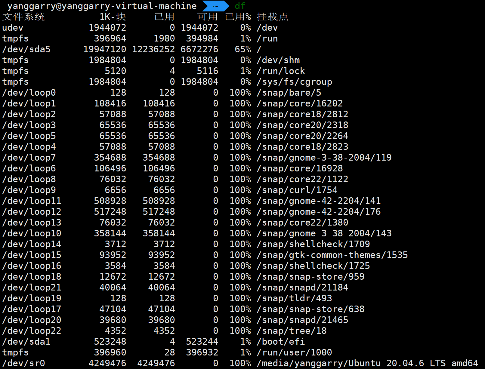
3. 主è¦åŒºåˆ«
	- ==粒度==：==`du`æ供了更细粒度的信æ¯==，å¯ä»¥é’ˆå¯¹å•ä¸ªæ–‡ä»¶å’Œç›®å½•ï¼›è€Œ==`df`æ供了文件系统级别==çš„å®è§‚视图。
	- ==目的==：`du`主è¦ç”¨äºŽåˆ†æž==特定文件和目录==的空间å ç”¨æƒ…况；`df`用于查看==整个文件系统==的空间使用情况。
	- ==使用场景==：如果你想知é“==æŸä¸ªç›®å½•æ ‘中哪些文件或å­ç›®å½•å ç”¨äº†å¤§é‡ç©ºé—´ï¼Œä½¿ç”¨`du`==；如果你想检查==系统上有哪些文件系统ã€å®ƒä»¬å„自的容é‡å’Œä½¿ç”¨æƒ…况，使用`df`==。

---


### 5.误æ“作，执行了rm -rf \* ，会有哪些情况å‘生？请举例？

1. ==例å­==
	- ==个人数æ®ä¸¢å¤±==：如果你在`~/Documents`执行了`rm -rf *`，将会删除你所有的文档。
	- ==系统破å==：以root用户在`/`执行该命令，å¯èƒ½å¯¼è‡´==系统立å³å´©æºƒï¼Œé‡å¯åŽæ— æ³•å†æ¬¡å¯åŠ¨==，因为==关键的å¯åŠ¨æ–‡ä»¶å’Œé…置已被删除==。
	- ==æœåŠ¡å¤±è´¥==：在`/var/log`执行这个命令会==删除所有日志文件，å¯èƒ½å¯¼è‡´æ— æ³•è·Ÿè¸ªç³»ç»Ÿé—®é¢˜æˆ–æœåŠ¡çŠ¶æ€==。
2. ==预防措施==
	- ==谨慎使用rootæƒé™==：é¿å…以root用户执行命令，除éžç»å¯¹å¿…è¦ã€‚
	- ==使用ç»å¯¹è·¯å¾„==：在使用`rm`命令时尽é‡ä½¿ç”¨å®Œæ•´çš„ç»å¯¹è·¯å¾„，并仔细检查路径是å¦æ­£ç¡®ã€‚
	- ==备份==：==定期备份é‡è¦æ•°æ®å’Œé…置文件==。
	- ==使用安全措施==：在删除大é‡æ–‡ä»¶ä¹‹å‰ï¼Œå¯ä»¥å…ˆä½¿ç”¨`ls`或其他命令确认文件列表，或者先移动到临时目录而ä¸æ˜¯ç›´æŽ¥åˆ é™¤ã€‚

----


### 6.如何查看 http 的并å‘请求数与其 TCP 连接状æ€ï¼Ÿ

1. ==使用`netstat`命令==

	`netstat`是一个éžå¸¸æœ‰ç”¨çš„命令，å¯ä»¥æ˜¾ç¤ºç½‘络连接ã€è·¯ç”±è¡¨ã€æŽ¥å£ç»Ÿè®¡ç­‰ä¿¡æ¯ã€‚è¦æŸ¥çœ‹TCP连接的状æ€ï¼ŒåŒ…括与HTTPæœåŠ¡å™¨ç›¸å…³çš„连接，你å¯ä»¥ä½¿ç”¨ï¼š

	```bash
	netstat -an | grep ':80'
	```

	- `-a`选项表示显示==所有连接和监å¬ç«¯å£==。
	- `-n`选项表示==以数字形å¼æ˜¾ç¤ºåœ°å€å’Œç«¯å£å·==，ä¸è¿›è¡Œå称解æžï¼ˆæ›´å¿«ï¼‰ã€‚
	- `grep`用于过滤出特定端å£çš„连接（HTTP默认是80端å£ï¼ŒHTTPS是443端å£ï¼‰ã€‚

2. ==使用`ss`命令==

	`ss`是å¦ä¸€ä¸ªå®žç”¨å·¥å…·ï¼Œç”¨äºŽæŸ¥çœ‹å¥—接字统计信æ¯ã€‚它被认为是`netstat`的现代替代å“，æ供了更多的信æ¯å’Œæ›´å¿«çš„执行速度。类似地，è¦æŸ¥çœ‹HTTP或HTTPS连接，å¯ä»¥ä½¿ç”¨ï¼š

	```bash
	ss -tan | grep ':80'
	```

	- `-t`表示显示==TCP套接字==。
	- `-a`表示显示==所有套接字==。
	- `-n`表示ä¸è§£æžæœåŠ¡å称。

---


## 3.Linux 日志

### 1.如何动æ€ç›‘å¬ Linux 日志 ？

1. ==使用 `tail` 命令==

	`tail` 命令å¯ä»¥ç”¨æ¥æŸ¥çœ‹æ–‡ä»¶çš„最åŽå‡ è¡Œå†…容。当==与 `-f` å‚数一起使用时，`tail -f` 会æŒç»­ç›‘视指定的文件，当文件增长时，新添加的内容会实时显示出æ¥==。这是最常è§å’Œç®€å•çš„动æ€ç›‘å¬æ—¥å¿—文件的方法。

	例如，动æ€ç›‘å¬ç³»ç»Ÿæ¶ˆæ¯æ—¥å¿—：

	```bash
	tail -f /var/log/messages
	```

2. ==使用 `less` 命令==

	`less` 命令也å¯ä»¥ç”¨äºŽåŠ¨æ€ç›‘å¬æ—¥å¿—。首先使用 `less` 打开一个日志文件，然åŽæŒ‰ä¸‹ `Shift+F`，`less` 会进入类似 `tail -f` 的监视模å¼ï¼Œå®žæ—¶æ˜¾ç¤ºæ—¥å¿—文件的新内容。

	例如，使用 `less` 监å¬å®‰å…¨æ—¥å¿—：

	```bash
	less +F /var/log/auth.log
	```

3. ==使用 `multitail` 命令==

	`multitail` 是一个强大的工具，它ä¸ä»…å¯ä»¥==动æ€ç›‘å¬å¤šä¸ªæ—¥å¿—文件==，还å¯ä»¥åœ¨ä¸€ä¸ªçª—å£ä¸­ä»¥åˆ†å±çš„å½¢å¼æ˜¾ç¤ºï¼Œè¿˜æ”¯æŒæ—¥å¿—文件的彩色显示，使得日志的阅读更加直观。

	安装 `multitail`（如果系统中没有预装的è¯ï¼‰ï¼š

	```bash
	sudo apt-get install multitail  # Debian/Ubuntu
	sudo yum install multitail      # CentOS/RedHat
	```

	动æ€ç›‘å¬å¤šä¸ªæ—¥å¿—文件：

	```bash
	multitail /var/log/apache2/access.log /var/log/apache2/error.log
	```

4. ==使用 `journalctl` 命令==

	对于使用 systemd 的系统，`journalctl` 是查看和监控==系统日志==的强大工具。使用 `-f` å‚数，å¯ä»¥åŠ¨æ€ç›‘å¬ç³»ç»Ÿçš„日志。

	例如，动æ€ç›‘å¬ç³»ç»Ÿæ—¥å¿—：

	```bash
	journalctl -f
	```

----


### 2.如何带关键è¯æŸ¥è¯¢ Linux 日志文件 ？

1.  ==使用 `grep` 命令==

	`grep` 是最基本也是最强大的文本æœç´¢å·¥å…·ä¹‹ä¸€ï¼Œå®ƒå¯ä»¥æœç´¢åŒ…å«æŒ‡å®šæ¨¡å¼ï¼ˆå¯ä»¥æ˜¯å­—符串或正则表达å¼ï¼‰çš„行。

	例如，æœç´¢ `/var/log/syslog` 文件中包å«å…³é”®è¯ “error†的行：

	```bash
	grep "error" /var/log/syslog
	```

	如果你想åŒæ—¶æŸ¥çœ‹åŒ¹é…行的上下文（例如，显示==æ¯ä¸ªåŒ¹é…è¡Œå‰åŽå„2è¡Œ==），å¯ä»¥==使用 `-C`（上下文==）选项：

	```bash
	grep -C 2 "error" /var/log/syslog
	```

2. ==使用 `awk` 命令==

	```bash
	awk '/failed/' /var/log/auth.log
	```

3. ==使用 `sed` 命令==

	```bash
	sed -n '/usb/p' /var/log/dmesg
	```

4. ==结åˆä½¿ç”¨ `zgrep` 命令æœç´¢åŽ‹ç¼©çš„日志文件==

	许多 Linux 系统会==压缩旧的日志文件以节çœç©ºé—´ï¼Œè¿™äº›æ–‡ä»¶é€šå¸¸ä»¥ `.gz` 结尾==。`zgrep` 命令å¯ä»¥åœ¨è¿™äº›åŽ‹ç¼©æ–‡ä»¶ä¸­æœç´¢æ–‡æœ¬ï¼Œ==无需先解压==。

	例如，æœç´¢æ‰€æœ‰åŽ‹ç¼©çš„ `.log.gz` æ–‡ä»¶ä¸­åŒ…å« â€œwarning†的行：

	```bash
	sudo zgrep "warning" /var/log/*.gz
	```

---


### 3.Linux 下日志文件过大，如何实现分割，转储 ？

1. ==使用 `logrotate`==

	- ==é…ç½® `logrotate`==：你å¯ä»¥é€šè¿‡==编辑 `/etc/logrotate.conf` 文件或在 `/etc/logrotate.d/` 目录下创建新的é…置文件æ¥å®šåˆ¶ `logrotate` 的行为==。é…置文件å…许你设置轮转周期ã€åŽ‹ç¼©é€‰é¡¹ã€è½®è½¬å‰åŽæ‰§è¡Œçš„脚本等。

2. ==手动分割日志文件==

	如果你需è¦ç«‹å³åˆ†å‰²ä¸€ä¸ªè¿‡å¤§çš„日志文件，而ä¸ç­‰å¾… `logrotate` 的自动执行，å¯ä»¥æ‰‹åŠ¨è¿›è¡Œã€‚一ç§æ–¹æ³•æ˜¯ä½¿ç”¨ `split` 命令分割文件，å¦ä¸€ç§æ–¹æ³•æ˜¯ç›´æŽ¥ç§»åŠ¨å½“å‰æ—¥å¿—文件然åŽé€šçŸ¥ç›¸å…³æœåŠ¡åˆ›å»ºä¸€ä¸ªæ–°çš„日志文件。

	- ==移动日志文件==：

	```bash
	mv /var/log/large.log /var/log/large.log.old
	```

	- ==通知相关æœåŠ¡==：对于大多数æœåŠ¡ï¼Œç‰¹åˆ«æ˜¯é‚£äº›é€šè¿‡ `systemd` 管ç†çš„，å¯ä»¥ä½¿ç”¨ `systemctl` é‡æ–°åŠ è½½æˆ–é‡å¯æœåŠ¡æ¥ä½¿å…¶å¼€å§‹å†™å…¥æ–°çš„日志文件。

	```bash
	systemctl restart myservice
	```

	或者，如果æœåŠ¡æ”¯æŒä¸é‡å¯å³å¯é‡æ–°æ‰“开日志文件的信å·ï¼ˆä¾‹å¦‚，==许多守护进程会在接收到 `SIGHUP` ä¿¡å·æ—¶é‡æ–°æ‰“开日志文件==），你å¯ä»¥å‘é€ `SIGHUP`：

	```bash
	pkill -HUP myservice
	```

---


## 4.Linux 概念基础

### 1.Linux系统中符å·é“¾æŽ¥ä¸Žç¡¬é“¾æŽ¥çš„区别？

1. ==符å·é“¾æŽ¥ï¼ˆè½¯é“¾æŽ¥ï¼‰==

	> - 符å·é“¾æŽ¥ï¼Œä¹Ÿç§°ä¸ºè½¯é“¾æŽ¥ï¼Œæ˜¯ä¸€ç§ç‰¹æ®Šç±»åž‹çš„文件，它==包å«çš„是å¦ä¸€ä¸ªæ–‡ä»¶æˆ–目录的路径==。它==仅仅是指å‘å¦ä¸€ä¸ªæ–‡ä»¶çš„指针==。
	>
	> - ```bash
	> 	ln -s file1.txt link1.txt
	> 	```
	>
	> 	如果`file1.txt`被删除，`link1.txt`ä»ç„¶å­˜åœ¨ï¼Œä½†æ˜¯å®ƒ==ä¸å†æŒ‡å‘一个有效文件==。
	>
	> - 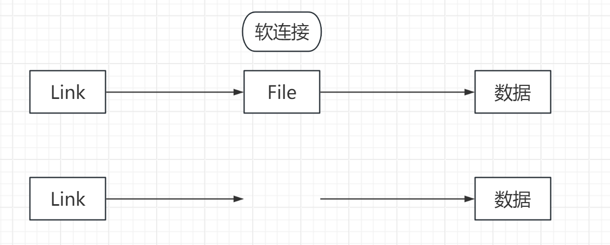
	>
	> - ==特点==：
	>
	> 	- å¯ä»¥è·¨æ–‡ä»¶ç³»ç»Ÿé“¾æŽ¥ã€‚
	> 	- å¯ä»¥é“¾æŽ¥åˆ°ç›®å½•ã€‚
	> 	- 如果==删除了原文件，符å·é“¾æŽ¥å°†å¤±æ•ˆï¼Œæ˜¾ç¤ºä¸ºæ‚¬ç©ºé“¾æŽ¥==。
	> 	- ==符å·é“¾æŽ¥æ–‡ä»¶æœ¬èº«æœ‰ç‹¬ç«‹çš„inode==（文件系统中的索引节点）。

2. ==硬链接==

	> - 硬链接是å¦ä¸€ä¸ªæ–‡ä»¶çš„å¦ä¸€ä¸ªå称，它指å‘相åŒçš„文件内容和inode。在==文件系统中，所有的文件å实际上都是硬链接，指å‘存储数æ®çš„inode==。
	>
	> - ```bash
	> 	ln file2.txt link2.txt
	> 	```
	>
	> 	如果`file2.txt`被删除，通过`link2.txt`ä¾ç„¶å¯ä»¥è®¿é—®åˆ°æ–‡ä»¶çš„内容，因为==`link2.txt`å’Œ`file2.txt`实际上指å‘åŒä¸€ä¸ªinode和数æ®å—==。
	>
	> - 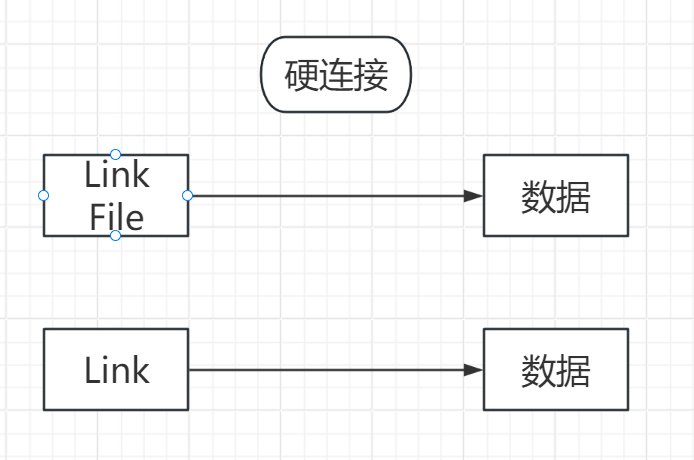
	>
	> - ==特点==：
	>
	> 	- ä¸èƒ½è·¨æ–‡ä»¶ç³»ç»Ÿé“¾æŽ¥ã€‚
	> 	- ä¸èƒ½é“¾æŽ¥åˆ°ç›®å½•ï¼ˆä¸ºäº†é˜²æ­¢äº§ç”Ÿå¾ªçŽ¯ï¼‰ã€‚
	> 	- 如果==删除了原文件，任何硬链接都ä»ç„¶å¯ä»¥è®¿é—®æ–‡ä»¶çš„内容==。
	> 	- 硬链接和其原始文件==共享相åŒçš„inode==。

3. 总结

	> - ==符å·é“¾æŽ¥ç±»ä¼¼äºŽWindowsçš„å¿«æ·æ–¹å¼==，是一个==指å‘å¦ä¸€ä¸ªæ–‡ä»¶è·¯å¾„的特殊文件==。
	> - ==硬链接是文件的å¦ä¸€ä¸ªå称，它和原始文件共享相åŒçš„æ•°æ®==。
	> - 符å·é“¾æŽ¥å¯ä»¥æŒ‡å‘ä¸å­˜åœ¨çš„文件，而硬链接ä¿è¯äº†å³ä½¿åŽŸå§‹æ–‡ä»¶å被删除，文件内容ä»ç„¶å­˜åœ¨ã€‚
	> - 符å·é“¾æŽ¥å’Œç¡¬é“¾æŽ¥åœ¨æ–‡ä»¶å¤‡ä»½ã€å¿«é€Ÿè®¿é—®ç­‰åœºæ™¯ä¸‹éžå¸¸æœ‰ç”¨ã€‚

---


### 2.常è§çš„Linux目录结构？

#### `/`（根目录）

- 所有文件和目录在Linux中都从根目录开始。

#### `/bin`（用户二进制文件）

- 包å«==用户级别的程åºå’Œå‘½ä»¤==，如`ls`ã€`cp`等。这些命令对所有用户都å¯ç”¨ã€‚

#### `/sbin`（系统二进制文件）

- 存放系统管==ç†å‘˜ä½¿ç”¨çš„系统管ç†å‘½ä»¤==，如`fdisk`ã€`sysctl`等。

#### `/etc`（é…置文件）

- 包å«==系统的é…置文件==。这些文件通常是文本文件，å¯ä»¥è¢«ç¼–辑æ¥æ”¹å˜ç³»ç»Ÿçš„设置。

#### `/dev`（设备文件）

- 包å«æ‰€æœ‰è®¾å¤‡å’Œç‰¹æ®Šæ–‡ä»¶çš„ä½ç½®ã€‚在Linux中，==设备被视为文件，å¯ä»¥åƒæ“作文件一样æ“作这些设备==。

#### `/proc`（进程信æ¯ï¼‰

- 一个虚拟的文件系统，==包å«è¿è¡Œä¸­çš„系统进程和内核信æ¯==。它ä¸å ç”¨ç£ç›˜ç©ºé—´ï¼Œä¸»è¦ç”¨äºŽç³»ç»Ÿç›‘控目的。

#### `/var`（å¯å˜æ–‡ä»¶ï¼‰

- 存放==ç»å¸¸å˜åŒ–的文件==，如==日志文件==（`/var/log`）ã€åŒ…和数æ®åº“文件。

#### `/tmp`（临时文件）

- 用于存放临时文件，系统é‡å¯æ—¶ï¼Œè¿™ä¸ªç›®å½•ä¸‹çš„文件å¯èƒ½ä¼šè¢«åˆ é™¤ã€‚

#### `/usr`（用户程åºï¼‰

- 包å«ç”¨æˆ·åº”用程åºå’Œæ–‡ä»¶ã€‚它通常包å«å¤šä¸ªå­ç›®å½•ï¼Œå¦‚`/usr/bin`ã€`/usr/sbin`ã€`/usr/local`等，用于==ä¸åŒç±»åž‹çš„用户级程åºå’Œæ•°æ®==。

#### `/home`（用户主目录）

- 存放==普通用户的个人数æ®å’Œé…置文件==。æ¯ä¸ªç”¨æˆ·éƒ½æœ‰ä¸€ä¸ªä»¥å…¶ç”¨æˆ·å命å的目录。

#### `/root`（root用户的主目录）

- `root`用户的个人主目录，而ä¸æ˜¯`/home/root`。

#### `/boot`（å¯åŠ¨åŠ è½½å™¨æ–‡ä»¶ï¼‰

- 包å«å¯åŠ¨Linux系统时使用的文件，如内核映åƒå’Œå¼•å¯¼åŠ è½½ç¨‹åºï¼ˆGRUB或LILO）的é…置文件。

#### `/lib`（系统库）

- 存放==系统和应用程åºä½¿ç”¨çš„共享库文件==，以åŠ==内核模å—==。

---


### 3.æè¿°Linuxè¿è¡Œçº§åˆ«0-6çš„å„自å«ä¹‰ï¼Ÿ

#### è¿è¡Œçº§åˆ«0

- ==关机==（Halt）：此è¿è¡Œçº§åˆ«ä¼šå…³é—­ç³»ç»Ÿã€‚

#### è¿è¡Œçº§åˆ«1

- ==å•ç”¨æˆ·æ¨¡å¼==（Single-User Mode）：这是一ç§ç»´æŠ¤æˆ–紧急修å¤æ¨¡å¼ï¼Œæ­¤æ—¶==åªæœ‰æ ¹ç”¨æˆ·å¯ä»¥ç™»å½•ï¼Œä¸å¯åŠ¨ç½‘络æœåŠ¡==，一般用于==系统维护==。

#### è¿è¡Œçº§åˆ«2

- ==多用户模å¼ï¼Œä¸å¸¦NFS==（Multi-User Mode without NFS）：这个级别å…许多用户登录但ä¸å¯åŠ¨ç½‘络文件系统（NFS），在ä¸åŒçš„Linuxå‘行版中这个模å¼çš„具体å«ä¹‰å¯èƒ½æœ‰æ‰€ä¸åŒã€‚

#### è¿è¡Œçº§åˆ«3

- ==完全的多用户模å¼==（Full Multi-User Mode）：这是标准的多用户模å¼ï¼Œæ”¯æŒå¤šç”¨æˆ·ç™»å½•å¹¶å¯åŠ¨ç½‘络æœåŠ¡ï¼Œä½†ä¸å¯åŠ¨å›¾å½¢ç”¨æˆ·ç•Œé¢ï¼ˆGUI）。

#### è¿è¡Œçº§åˆ«4

- ==未定义==：ä¿ç•™æœªä½¿ç”¨ï¼Œå¯ä»¥è¢«ä¸ªåˆ«==Linuxå‘行版特定地定义用途==。

#### è¿è¡Œçº§åˆ«5

- ==图形模å¼==（X11）：与è¿è¡Œçº§åˆ«3相似，但在此基础上å¯åŠ¨==图形用户界é¢==（GUI），是==大多数桌é¢Linuxå‘行版的默认è¿è¡Œçº§åˆ«==。

#### è¿è¡Œçº§åˆ«6

- ==é‡å¯==（Reboot）：此è¿è¡Œçº§åˆ«ä¼šé‡å¯ç³»ç»Ÿã€‚

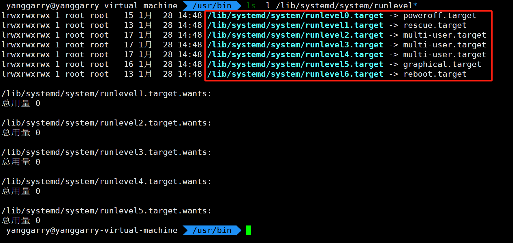

è¦æŸ¥çœ‹æˆ–更改当å‰è¿è¡Œçº§åˆ«ï¼Œä¼ ç»Ÿçš„方法是使用==`runlevel`命令查看==å’Œ==`init`命令æ¥æ›´æ”¹è¿è¡Œçº§åˆ«==。在使用systemd的系统中，å¯ä»¥ä½¿ç”¨`systemctl`命令æ¥å®žçŽ°ç›¸ä¼¼çš„功能，例如==`systemctl get-default`查看默认目标（è¿è¡Œçº§åˆ«==），==`systemctl set-default`æ¥è®¾ç½®é»˜è®¤ç›®æ ‡==。

----


### 4.给出正确的关机和é‡å¯æœåŠ¡å™¨çš„命令？

1. ==使用 Systemd 的系统（大多数 Linux å‘行版）==

	> - ```bash
	> 	# 关机
	> 	sudo systemctl poweroff 
	> 	sudo shutdown -h now # -h 表示 halt，å³åœæ­¢æ‰€æœ‰ CPU 功能
	> 																																				
	> 	# é‡å¯
	> 	sudo systemctl reboot
	> 	sudo shutdown -r now
	> 	```

2. ==使用 System V init 的系统==

	> - ```bash
	> 	sudo shutdown -h now
	> 	sudo shutdown -r now
	> 	```

3. ==其它命令==

	> - ```bash
	> 	sudo poweroff
	> 	sudo halt
	> 	sudo reboot
	> 	```

4. ==`systemctl`命令是推èçš„æ–¹å¼ï¼Œå› ä¸ºå®ƒä¸Žsystemd系统管ç†å™¨ç›´æŽ¥äº¤äº’，æ供了一致的接å£æ¥ç®¡ç†å¯åŠ¨è¿‡ç¨‹å’ŒæœåŠ¡==。ä¸è¿‡ï¼Œ`shutdown`ã€`poweroff`ã€`halt`ã€å’Œ`reboot`命令在大多数情况下ä»ç„¶æœ‰æ•ˆï¼Œå› ä¸ºå®ƒä»¬é€šå¸¸è¢«é“¾æŽ¥åˆ°systemdæ供的相应命令，以ä¿æŒå‘åŽå…¼å®¹æ€§ã€‚

----


### 5.Linux 中的用户模å¼å’Œå†…核模å¼æ˜¯ä»€ä¹ˆå«æ„？

1. 用户模å¼ï¼ˆUser Mode）和内核模å¼ï¼ˆKernel Mode）是指CPU的两ç§ä¸åŒçš„è¿è¡Œçº§åˆ«æˆ–状æ€ï¼Œè¿™ä¸¤ç§æ¨¡å¼ä¸»è¦æ˜¯ä¸ºäº†æä¾›==系统的安全性和稳定性==。

2. ==内核模å¼ï¼ˆKernel Mode）==

	> - 在内核模å¼ä¸‹ï¼Œ==CPUå¯ä»¥æ‰§è¡Œä»»ä½•æŒ‡ä»¤==，访问系统的==所有内存地å€å’Œç¡¬ä»¶èµ„æº==。æ“作系统的核心部分（内核）在这个模å¼ä¸‹è¿è¡Œï¼Œè´Ÿè´£==管ç†ç¡¬ä»¶è®¾å¤‡ã€ç®¡ç†å†…å­˜ã€å¤„ç†ç³»ç»Ÿè°ƒç”¨==等低级任务。
	> - 任何在内核模å¼ä¸‹è¿è¡Œçš„错误代ç éƒ½å¯èƒ½å¯¼è‡´ç³»ç»Ÿå´©æºƒæˆ–==安全æ¼æ´ž==。因此，==åªæœ‰å—信任的æ“作系统代ç ==应在内核模å¼ä¸‹æ‰§è¡Œã€‚

3. ==用户模å¼ï¼ˆUser Mode）==

	> - 用户模å¼æ˜¯ä¸€ä¸ªå—é™åˆ¶çš„执行模å¼ï¼Œç”¨äºŽè¿è¡Œ==用户程åºå’Œåº”用软件==。在用户模å¼ä¸‹ï¼Œç¨‹åº==ä¸èƒ½ç›´æŽ¥æ‰§è¡Œ==æŸäº›ä¿æŠ¤ç³»ç»Ÿå®‰å…¨å’Œç¨³å®šæ€§çš„æ“作（==如直接访问硬件资æº==）。
	> - 用户模å¼é€šè¿‡==é™åˆ¶ç¨‹åºçš„能力æ¥å¢žåŠ ç³»ç»Ÿçš„安全性和稳定性==。å³ä½¿ç”¨æˆ·ç¨‹åºå´©æºƒï¼Œä¹Ÿ==ä¸ä¼šç›´æŽ¥å½±å“到系统的核心部分==。

4. ==用户模å¼å’Œå†…核模å¼çš„切æ¢==

	> - ==系统调用==：当用户程åºéœ€è¦æ‰§è¡Œ==文件æ“作ã€ç½‘络通信或其他需è¦å†…核介入的æ“作时==，它会执行系统调用。这会导致CPU==从用户模å¼åˆ‡æ¢åˆ°å†…核模å¼==，并执行相应的内核函数。==完æˆåŽï¼ŒCPU切æ¢å›žç”¨æˆ·æ¨¡å¼==，继续执行用户程åºã€‚
	> - ==中断和异常==：当å‘生==硬件中断或异常==时，CPU也会从用户模å¼==切æ¢åˆ°å†…核模å¼ï¼Œä»¥ä¾¿å†…核处ç†è¿™äº›äº‹ä»¶==。

---


### 6.Linux 软中断和工作队列的作用是什么？

1. ==软中断（Softirqs）==

	> - ==作用==：软中断是一ç§ä½Žå¼€é”€çš„中断机制，用于处ç†å¯å»¶è¿Ÿçš„任务，如网络数æ®åŒ…的接收和å‘é€ã€å®šæ—¶å™¨å¤„ç†ç­‰ã€‚它们是在中断上下文中执行的，æ„味ç€å®ƒä»¬ä¸èƒ½è¢«æ™®é€šçš„进程抢å ï¼Œä½†å¯ä»¥è¢«ç¡¬ä»¶ä¸­æ–­ï¼ˆHardirqs）抢å ã€‚
	> - ==设计目的==：软中断的主è¦è®¾è®¡ç›®çš„是å‡å°‘硬件中断处ç†ç¨‹åºï¼ˆHardirqs）的执行时间。通过将部分工作延迟到软中断中，硬件中断处ç†ç¨‹åºå¯ä»¥å¿«é€Ÿè¿”回，从而å‡å°‘系统对硬件中断的å“应时间。
	> - 特点：
	> 	- 软中断å¯ä»¥å¹¶å‘è¿è¡Œåœ¨å¤šä¸ªCPU上。
	> 	- 软中断的执行ä¸èƒ½è¢«å…¶ä»–软中断或任务抢å ï¼Œä½†å¯ä»¥è¢«ç¡¬ä»¶ä¸­æ–­æŠ¢å ã€‚
	> 	- 适用于处ç†==需è¦å¿«é€Ÿå“应但ä¸éœ€è¦ç«‹å³å®Œæˆ==的任务。

2. ==工作队列（Workqueues）==

	> - ==作用==：工作队列æ供了一ç§æœºåˆ¶ï¼Œå…许内核将需è¦åœ¨è¿›ç¨‹ä¸Šä¸‹æ–‡ä¸­æ‰§è¡Œçš„==长时间è¿è¡Œçš„任务排队==。这些任务å¯èƒ½åŒ…括设备驱动程åºçš„底层任务，如==ç£ç›˜I/Oæ“作ã€æ–‡ä»¶ç³»ç»Ÿçš„延迟写入==等。
	> - ==设计目的==：工作队列å…许任务在进程上下文中==异步执行==，这æ„味ç€å®ƒä»¬å¯ä»¥ç¡çœ ï¼ˆç­‰å¾…资æºã€ç¡çœ é”等），这在中断上下文中是ä¸å…许的。
	> - 特点：
	> 	- 工作队列任务在特定的内核线程中执行，这些线程å¯ä»¥è¢«æ™®é€šè¿›ç¨‹å’Œè½¯ä¸­æ–­æŠ¢å ã€‚
	> 	- 适用于==ä¸éœ€è¦ç«‹å³å¤„ç†çš„任务==，特别是那些å¯èƒ½éœ€è¦ç¡çœ çš„任务。
	> 	- æ供了更大的çµæ´»æ€§ï¼Œå¯ä»¥å¤„ç†å¤æ‚的任务，但相比软中断和硬件中断处ç†ç¨‹åºï¼Œå…¶å¼€é”€è¾ƒå¤§ã€‚

3. ==总结==

	> - ==软中断==主è¦ç”¨äºŽå¤„ç†==需è¦è¾ƒå¿«å¤„ç†ä½†å¯ä»¥ç¨å¾®å»¶è¿Ÿçš„中断驱动任务==，例如在接收到大é‡ç½‘络数æ®åŒ…时快速处ç†å®ƒä»¬ã€‚
	> - ==工作队列==用于处ç†é‚£äº›==å¯èƒ½éœ€è¦è¾ƒé•¿æ—¶é—´ã€å¯èƒ½éœ€è¦ç¡çœ çš„任务==，它们在进程上下文中执行，æ供了执行å¤æ‚æ“作的能力。

---


### 7.Linux 中进程有哪几ç§çŠ¶æ€ï¼Ÿåœ¨ ps 显示出æ¥çš„ä¿¡æ¯ä¸­ï¼Œåˆ†åˆ«ç”¨ä»€ä¹ˆç¬¦å·è¡¨ç¤ºçš„？

#### 1. è¿è¡Œï¼ˆRunning）

- ==符å·==：`R`
- ==å«ä¹‰==：进程正在è¿è¡Œæˆ–在è¿è¡Œé˜Ÿåˆ—中等待。

#### 2. ç¡çœ ï¼ˆSleeping）

- ==符å·==：`S`
- ==å«ä¹‰==：进程处于ç¡çœ çŠ¶æ€ï¼Œç­‰å¾…æŸä¸ªäº‹ä»¶æˆ–资æºã€‚
- 特定类型的ç¡çœ çŠ¶æ€ï¼š
	- ==å¯ä¸­æ–­ç¡çœ ==：`S`，进程等待事件完æˆï¼Œå¯ä»¥è¢«ä¿¡å·å”¤é†’。
	- ==ä¸å¯ä¸­æ–­ç¡çœ ==：`D`，进程在等待I/Oæ“作，如ç£ç›˜I/O，ä¸èƒ½è¢«ä¿¡å·å”¤é†’。

#### 3. åœæ­¢ï¼ˆStopped/Terminal）

- ==符å·==：`T`
- ==å«ä¹‰==：进程已åœæ­¢æ‰§è¡Œï¼Œé€šå¸¸æ˜¯å› ä¸ºæ”¶åˆ°äº†ä¸€ä¸ª==åœæ­¢ä¿¡å·==（如由`Ctrl+Z`生æˆçš„SIGSTOP）。

#### 4. 僵尸（Zombie）

- ==符å·==：`Z`
- ==å«ä¹‰==：==进程已完æˆæ‰§è¡Œ==，但其==父进程尚未==通过`wait()`系统调用æ¥==读å–其退出状æ€ï¼Œé‡Šæ”¾èµ„æº==。

#### 5. 跟踪或被调试（Traced or Debugged）

- ==符å·==：通常用`T`表示，但这å¯èƒ½ä¾èµ–于具体的`ps`实现。
- ==å«ä¹‰==：进程被å¦ä¸€ä¸ªè¿›ç¨‹ç›‘视或控制，如调试器。

#### 6. 分页（Paging）

- ==符å·==：ä¸å¸¸è§ï¼ŒæŸäº›ç³»ç»Ÿå¯èƒ½ä½¿ç”¨`W`表示，但这在现代Linux版本中ä¸å¸¸ç”¨ã€‚
- ==å«ä¹‰==：进程正在等待页é¢è°ƒå…¥ï¼ˆè¾ƒæ—§çš„系统å¯èƒ½æ˜¾ç¤ºæ­¤çŠ¶æ€ï¼‰ã€‚

#### 7. æ­»é”（Deadlocked）

- ==符å·==：Linux通常ä¸ç›´æŽ¥æ˜¾ç¤ºæ­»é”状æ€ï¼Œä½†æ­»é”情况å¯ä»¥é€šè¿‡ç³»ç»Ÿç›‘控和调试工具识别。

---


### 8.如何检查LinuxæŸé¡¹æœåŠ¡æ˜¯å¦åœ¨è¿è¡Œï¼Ÿ

1. ==使用`systemctl`命令==：

	> - ```bash
	> 	systemctl status <æœåŠ¡å>
	> 	systemctl status nginx
	> 	systemctl is-active <æœåŠ¡å>
	> 	```

2. ==使用`service`命令==：

	> - ```bash
	> 	service <æœåŠ¡å> status
	> 	service httpd status
	> 	/etc/init.d/<æœåŠ¡å> status
	> 	```

3. ==使用`ps`命令==：

	> - ```bash
	> 	ps aux | grep <æœåŠ¡å>
	> 	```

4. ==使用`pgrep`命令==：

	> - ```bash
	> 	pgrep <æœåŠ¡å>
	> 	```

----


### 9.å—设备和字符设备有什么区别？

1. ==å—设备==

	> - ==æ•°æ®å¤„ç†æ–¹å¼==：å—设备以==固定大å°çš„å—==（通常为512字节或更大）为å•ä½è¯»å†™æ•°æ®ã€‚è¿™æ„味ç€å³ä½¿è¦==读写的数æ®é‡å°äºŽä¸€ä¸ªå—的大å°ï¼Œæ“作系统也会处ç†ä¸€ä¸ªå®Œæ•´çš„å—==。
	> - ==例å­==：==硬盘驱动器ã€å›ºæ€ç¡¬ç›˜ã€USB==闪存驱动器等。
	> - 特点：
	> 	- 支æŒ==éšæœºè®¿é—®==：å¯ä»¥ç›´æŽ¥è¯»å†™å­˜å‚¨åœ¨ä»»ä½•ä½ç½®çš„æ•°æ®å—。
	> 	- 通常用于存储文件系统。
	> 	- æ•°æ®==å¯ä»¥è¢«ç¼“å­˜==：出于性能考虑，æ“作系统å¯ä»¥ç¼“å­˜å—设备的数æ®ï¼Œå»¶è¿Ÿå†™å…¥æ“作。

2. ==字符设备==

	> - ==æ•°æ®å¤„ç†æ–¹å¼==：字符设备以字节为å•ä½é¡ºåºå¤„ç†æ•°æ®ï¼Œé€šå¸¸==ä¸æ”¯æŒéšæœºè®¿é—®==。==æ•°æ®æŒ‰ç…§é¡ºåºä¸€ä¸ªæŽ¥ä¸€ä¸ªåœ°ä¼ è¾“，没有缓冲==。
	> - ==例å­==：==键盘ã€é¼ æ ‡ã€ä¸²å£ã€æ‰“å°æœº==等。
	> - 特点：
	> 	- æ•°æ®ç›´æŽ¥ä»Žè®¾å¤‡è¯»å–或直接写入设备，ä¸ç»è¿‡ç¼“冲区。
	> 	- 主è¦ç”¨äºŽ==输入/输出设备==，支æŒ==æµå¼æ•°æ®ä¼ è¾“==。

3. ==主è¦åŒºåˆ«==

	- ==访问模å¼==：==å—设备支æŒéšæœºè®¿é—®==，å…许访问任æ„ä½ç½®çš„æ•°æ®å—ï¼›==字符设备处ç†æµå¼æ•°æ®==，通常以==顺åº==æ–¹å¼è®¿é—®ã€‚
	- ==æ•°æ®å•ä½==：å—设备==以å—（一组字节）为å•ä½==处ç†æ•°æ®ï¼›å­—符设备==以å•ä¸ªå­—符（字节）为å•ä½==处ç†æ•°æ®ã€‚
	- ==缓存==：==å—设备的数æ®å¯ä»¥è¢«ç¼“å­˜==，æ高数æ®è®¿é—®æ•ˆçŽ‡ï¼›==字符设备的数æ®é€šå¸¸ä¸è¢«ç¼“存，直接传输==。

---


### 10.Linux系统里，您知é“bufferå’Œcache如何区分å—？

1. 区分点

	> - ==目标对象==：`buffer`针对的是==å—设备的原始数æ®å—==；而`cache`针对的是文件系统层é¢çš„==文件数æ®==。
	> - ==优化策略==：`buffer`通过==优化å—设备的读写æ“作==æ¥æ高效率；`cache`通过==å‡å°‘对实际ç£ç›˜çš„访问==æ¥åŠ é€Ÿæ–‡ä»¶çš„读写æ“作。
	> - ==æ•°æ®å¤„ç†==：虽然两者都是用æ¥ç¼“存数æ®çš„，但==`buffer`更多关注于ç£ç›˜I/Oæ“作的缓冲==，而==`cache`关注于文件内容的缓存==。

2. éšç€Linux内核的å‘展，特别是从2.4版本开始，内核引入了统一的缓冲区管ç†æœºåˆ¶ï¼Œå°†`buffer`å’Œ`cache`更紧密地集æˆåœ¨ä¸€èµ·ã€‚==在现代Linux系统中，`buffer cache`å·²ç»è¢«é¡µç¼“存机制所å–代，对文件和å—设备的缓存都通过页缓存æ¥å¤„ç†==。

---


# 8.消æ¯é˜Ÿåˆ—

### 1.体验一下é¢è¯•å®˜å¯¹äºŽæ¶ˆæ¯é˜Ÿåˆ—çš„7个连环炮

1. 从一个点开始谈，然åŽç”±æµ…入深，步步深挖。

---


### 2.如何进行消æ¯é˜Ÿåˆ—的技术选型？

1. ==为什么使用消æ¯é˜Ÿåˆ—==？

	> - é¢è¯•å®˜å¿ƒç†ï¼šçœ‹çœ‹ä½ æ˜¯ä¸æ˜¯çœŸçš„知é“这个技术的è¿ç”¨åœºæ™¯ï¼Œé˜²æ­¢ä½ è¿›å…¥å›¢é˜ŸåŽä¹±ç”¨ä¸æ‡‚的技术，给团队挖å‘。
	>
	> - ==解耦==：
	>
	> 	- ==ä¸ç”¨æ¶ˆæ¯é˜Ÿåˆ—产生严é‡è€¦åˆçš„场景==：
	>
	> 		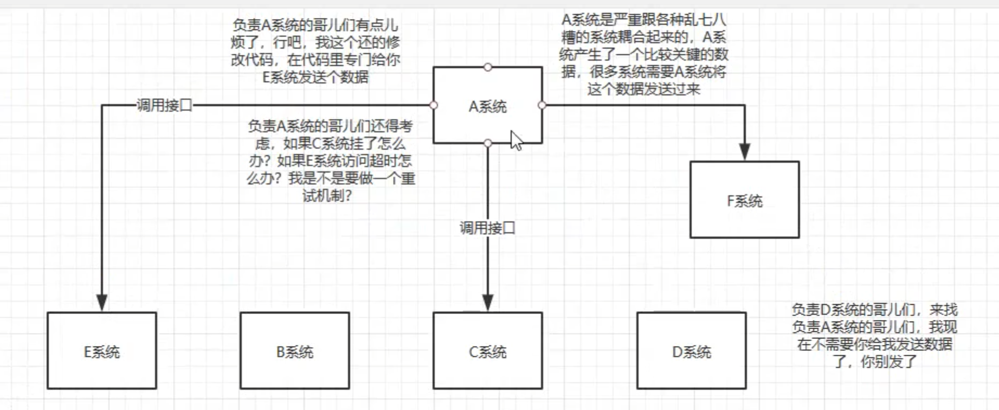
	>
	> 		A 系统有一个é‡è¦æ•°æ®ï¼Œéœ€è¦å‘给其它系统，但是一会儿åˆæ¥ä¸€ä¸ªæ–°çš„系统è¦æ±‚ A 系统把数æ®ç»™å®ƒä¹Ÿå‘一份，这时候 A 系统就ä¸å¾—ä¸ä¿®æ”¹ä»£ç ï¼Œè°ƒç”¨ E 系统的接å£ã€‚åˆå¯èƒ½è¿‡ä¸€ä¼šå„¿ D 系统åˆä¸éœ€è¦ A 系统的数æ®äº†ï¼ŒA 系统åˆè¦åˆ é™¤å¯¹ D 系统接å£çš„调用。这就是因为 ==A 系统和其它乱七八糟系统严é‡è€¦åˆï¼Œå¯¼è‡´ä»£ç å†™æ­»äº†ï¼Œéš¾ä»¥ç»´æŠ¤å’Œæ‰©å±•==。
	>
	> 	- ==使用消æ¯é˜Ÿåˆ—解耦==：
	>
	> 		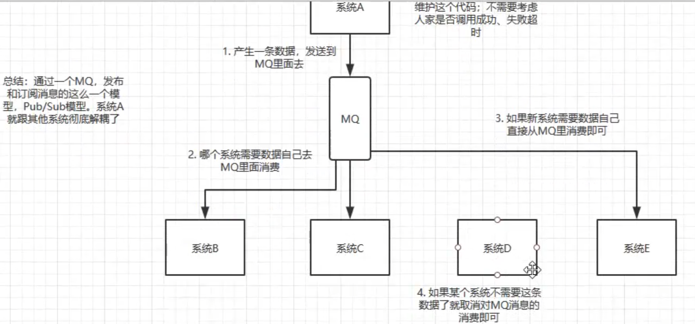
	>
	> 		A 系统åªéœ€è¦æŠŠè¿™ä¸ªé‡è¦æ•°æ®æ”¾åˆ°æ¶ˆæ¯é˜Ÿåˆ—中，这样其它系统需è¦è¿™ä¸ªæ•°æ®ï¼Œå°±ä¸è¦æ‰¾ A 系统了，而是自己去消æ¯é˜Ÿåˆ—é‡Œæ‰¾ã€‚è¿™æ ·ä¸€æ¥ ==A 系统åªç”¨è°ƒç”¨æ¶ˆæ¯é˜Ÿåˆ—çš„ api，而无需关注其它系统获å–é‡è¦æ•°æ®çš„业务逻辑，实现了 A 系统和其它乱七八糟的系统的解耦==。
	>
	> 		实际上，这里的消æ¯é˜Ÿåˆ—å¯ä»¥ç†è§£ä¸ºä¸€ä¸ª==å‘布/订阅模å¼==，其它系统订阅拥有é‡è¦æ•°æ®çš„消æ¯é˜Ÿåˆ—，从中获å–æ•°æ®å³å¯ã€‚
	>
	> - ==异步==：
	>
	> 	- ==ä¸ç”¨æ¶ˆæ¯é˜Ÿåˆ—导致åŒæ­¥æƒ…况下的高延迟请求==：
	>
	> 		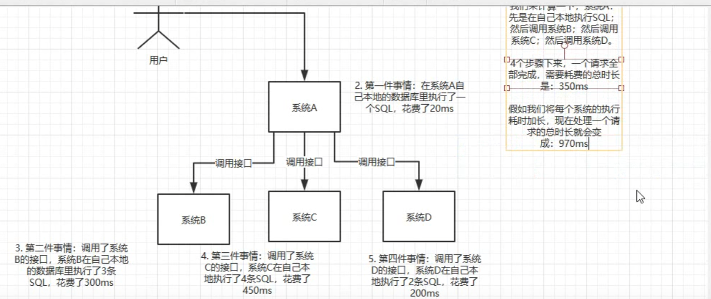
	>
	> 		比如有一个用户，å‘起了一个请求，==这个请求需è¦è°ƒç”¨å…¶å®ƒç³»ç»Ÿçš„接å£ã€‚å‡å¦‚è¦è°ƒç”¨çš„其它系统比较多，而且æ¯ä¸ªæŽ¥å£è°ƒç”¨çš„时间比较长==，这样最åŽ==整个请求的完æˆæ—¶é—´å¯èƒ½ä¼šå¾ˆé•¿==，比如超过了1秒，这就==严é‡å½±å“了用户的体验==。
	>
	> 	- ==异步化之åŽå¤§å¹…æå‡è°ƒç”¨é«˜å»¶è¿ŸæŽ¥å£çš„用户体验==：
	>
	> 		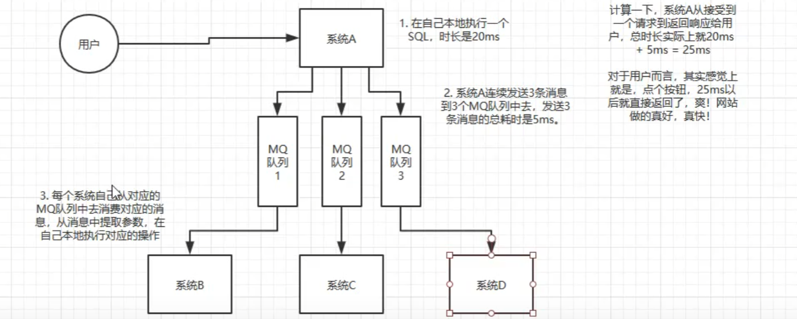
	>
	> 		系统 A åªéœ€è¦æŠŠå…¶å®ƒä¹±ä¸ƒå…«ç³Ÿçš„系统需è¦çš„æ•°æ®==丢到消æ¯é˜Ÿåˆ—里，然åŽå°±ä¸ç®¡äº†ï¼Œç›´æŽ¥è¿”回==，这样å“应用户的速度很快，用户的体验很好。而那些乱七八糟的系统å‘现消æ¯é˜Ÿåˆ—里有消æ¯ä¹‹åŽå–出æ¥ï¼Œè°ƒç”¨æŒ‡å®šçš„接å£å®Œæˆè¿™äº›ä¸šåŠ¡ï¼Œè¿™æ ·å¼‚æ­¥åŽ==用户几乎感觉ä¸åˆ°è°ƒç”¨é«˜å»¶è¿ŸæŽ¥å£çš„延迟==。
	>
	> - ==消峰==：
	>
	> 	- ==ä¸ç”¨æ¶ˆæ¯é˜Ÿåˆ—高峰期大é‡è¯·æ±‚涌入 Mysql 挂了==
	>
	> 	- ==使用消æ¯é˜Ÿåˆ—进行消峰==：
	>
	> 		比如高峰期一秒5000个请求，但是 Mysql æ¯ç§’能处ç†çš„请求æžé™ä¸º2000个，那么这个时候，就å¯ä»¥åœ¨è¯·æ±‚é€åˆ° Mysql 之å‰==先全部放进消æ¯é˜Ÿåˆ—，然åŽè§„定æ¯ç§’最多从消æ¯é˜Ÿåˆ—中读å–2000æ¡è¯·æ±‚，这样就å¯ä»¥ä¿è¯ Mysql 肯定ä¸ä¼šæŒ‚掉==。然åŽç­‰åˆ°ä½Žå³°æœŸå†æŠŠç§¯åŽ‹çš„消æ¯å¤„ç†äº†ã€‚

2. ==消æ¯é˜Ÿåˆ—的优点和缺点==？

      > - é¢è¯•å®˜å¿ƒç†ï¼šé˜²æ­¢ä½ ä¸çŸ¥é“æŸä¸ªæŠ€æœ¯å¯èƒ½å¸¦æ¥çš„风险就乱用，给团队挖å‘。
      > - ==系统å¯ç”¨æ€§é™ä½Ž==：
      > 	- 本æ¥ç›´æŽ¥è°ƒç”¨æŽ¥å£æ²¡é—®é¢˜ï¼Œç»“果多加了一个 MQ è¿›æ¥ï¼Œå¯¼è‡´ä¸‹é¢çš„问题：
      > 		1. ==MQ 挂掉==：A 系统无法把é‡è¦çš„æ•°æ®æ”¾åˆ°æ¶ˆæ¯é˜Ÿåˆ—，åŒæ—¶ä¸‹é¢é‚£äº›==乱七八糟的系统全部都没办法从 MQ 中获å–æ•°æ®ï¼ŒæœåŠ¡å…¨å´©æºƒ==了。
      > 		2. ==消费者挂了==：A 系统放到 MQ 中的消æ¯==迟迟没人消费，导致 MQ 满了，å ç”¨å¤§é‡ç£ç›˜ç©ºé—´==。
      > 		3. ==A 系统和 MQ çš„è”调出了问题==：比如 A 系统åªæƒ³æ”¾ä¸€æ¡æ¶ˆæ¯ï¼Œç»“果最终放的时候放了两æ¡ï¼Œé‚£ä¹ˆä¸‹é¢çš„系统就消费两æ¡æ•°æ®ï¼Œå¤„ç†äº†ä¸¤æ¬¡ä¸šåŠ¡ã€‚
      > - ==系统å¤æ‚性上å‡==：
      > 	- é‡å¤æ¶ˆè´¹ï¼Œæ¶ˆæ¯ä¸¢å¤±ï¼Œé¡ºåºæ€§é—®é¢˜ã€‚
      > - ==一致性问题==：
      > 	- 比如本æ¥æ˜¯æ‰€æœ‰ç³»ç»Ÿéƒ½æ‰§è¡ŒæˆåŠŸï¼Œæ‰ç»™ç”¨æˆ·è¿”回。但==结果其中一个消费者执行失败==了，但是==此时 A 系统早就已ç»ç»™ç”¨æˆ·è¿”回执行æˆåŠŸäº†ï¼Œè¿™å°±å¯¼è‡´ç”¨æˆ·æ”¶åˆ°çš„ä¿¡æ¯å’ŒåŽå°å®žé™…情况ä¸ä¸€è‡´==。

---


### 3.引入消æ¯é˜Ÿåˆ—之åŽè¯¥å¦‚何ä¿è¯å…¶é«˜å¯ç”¨æ€§

1. ==RabbitMQ 的高å¯ç”¨ï¼ˆéžåˆ†å¸ƒå¼ï¼‰==：

	> - ==é•œåƒé›†ç¾¤æ¨¡å¼å®žçŽ°é«˜å¯ç”¨æ€§==：
	>
	> 	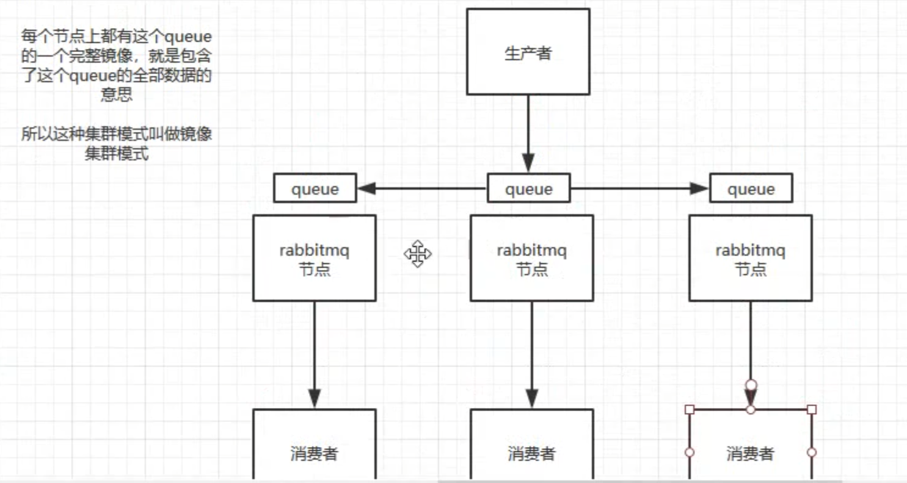
	>
	> - 任何一个节点挂了，==其它节点上还有这个 queue 的完整数æ®==，这样ä¿è¯çš„å¯ç”¨æ€§ã€‚
	>
	> - ==缺点：任然ä¸æ˜¯åˆ†å¸ƒå¼çš„系统==。

2. ==Kafka 的高å¯ç”¨æ€§ï¼ˆåˆ†å¸ƒå¼ï¼‰==：

	> - 
	> - 把==一个 topic 里的数æ®åˆ†æ•£åˆ°å¤šä¸ª partition 中==，防止出现一å°æœºå™¨å­˜å‚¨ä¸äº†å¤§é‡çš„æ•°æ®ã€‚
	> - 但是如果åªæ˜¯åˆ†æ•£åˆ°å¤šä¸ª partition 中，并ä¸èƒ½å®žçŽ°é«˜å¯ç”¨ï¼Œå› ä¸º==一旦æŸä¸€ä¸ª partition 挂了，那么我们就会æŸå¤±ä¸€éƒ¨åˆ† MQ çš„æ•°æ®==，这是我们无法接收的。
	> - 那么我们å¯ä»¥==对æ¯ä¸€ä¸ª partition 分别实现主从集群==，å³==生产者写数æ®åªå¾€æ¯ä¸€ä¸ª partition 的主节点中写数æ®ï¼Œç„¶åŽå†åŒæ­¥åˆ°ä»ŽèŠ‚点==。如果==主节点挂了，就会选举新的从节点==。

---


### 4.我为什么在消æ¯é˜Ÿåˆ—里消费到了é‡å¤çš„æ•°æ®

1. Kafka ç»™==æ¯ä¸€ä¸ªæ¶ˆæ¯ä¸€ä¸ª offer，表示åºå·==。消费者在==完æˆæ¶ˆè´¹åŽï¼Œå°†è‡ªå·±æ‰€æœŸå¾…的下一个消æ¯çš„ç¼–å·å‘ç»™ zookeeper，由 zookeeper 告诉 Kafka 消费者期待的下一æ¡æ¶ˆæ¯çš„åºå·==。
2. 当然，如果出现消费者==准备æ交下一个编å·ï¼Œä½†æ˜¯é‡å¯äº†ï¼Œæ交失败==的情况，那么如果这时 ==Kafka æ°å¥½å‡ºçŽ°äº†é‡ä¼ ï¼Œé‚£ä¹ˆè¿˜æ˜¯ä¼šæŠŠé‡å¤çš„消æ¯ä¼ ç»™æ¶ˆè´¹è€…==。
3. 因此一ç§å¯è¡Œçš„æ–¹å¼æ˜¯åœ¨==消费者消费一æ¡æ•°æ®åŽï¼Œåœ¨å†…存或 Redis 中采用 set 记录自己消费过的消æ¯çš„åºå·==，在消费一æ¡æ–°çš„消æ¯æ—¶==先去 set 中查找判断是å¦é‡å¤æ¶ˆè´¹==。
4. å¦ä¸€ç§å¯è¡Œæ–¹æ³•æ˜¯==利用数æ®åº“的唯一键æ¥é™åˆ¶ä¸èƒ½æ’入多次==。比如==消费者出现æ„外任然åƒæ•°æ®åº“æ’入两æ¡æ•°æ®ï¼Œè¿™æ—¶ç”±äºŽæœ‰å”¯ä¸€é”®çº¦æŸï¼Œå°±ä¸ä¼šæ’å…¥æˆåŠŸ==。

---


### 5.啥？我å‘到消æ¯é˜Ÿåˆ—里é¢çš„æ•°æ®æ€Žä¹ˆä¸è§äº†ï¼Ÿ

1. ==rabbitMQ 弄丢消æ¯æœ‰ä¸‰ç§æƒ…况==：生产者å‘é€çš„消æ¯ç”±äºŽç½‘络阻塞或丢包没能到达 MQï¼›MQ 将消æ¯å­˜åœ¨å†…存中，é‡å¯æ—¶ä¸¢å¤±è¿™éƒ¨åˆ†æ•°æ®ï¼›æ¶ˆè´¹è€…将消æ¯å­˜åœ¨å†…存中，é‡å¯æ—¶ä¸¢å¤±è¿™éƒ¨åˆ†æ•°æ®ã€‚

2. ==rabbitMQ 的生产者没能å‘é€åˆ° MQ==：

	> 1. 采用==事务机制==。在事务中å‘é€æ¶ˆæ¯åˆ° MQ，如果 MQ 没收到或内部出了一些问题，就能在==事务中æ•èŽ·åˆ°å¼‚常，并采å–回滚é‡å‘的方法==。
	>
	> 	这样åšæœ€å¤§çš„缺点是采å–==åŒæ­¥ç­‰å¾…==çš„æ–¹å¼ï¼Œç­‰å¾… MQ çš„ acknowledge 消æ¯ï¼Œ==é™ä½Žåžåé‡==。
	>
	> 2. é‡‡å– ==comfirm 机制==。==å°† MQ çš„æŸä¸€ä¸ª channel 设置为 comfirm==。å‘é€æ¶ˆæ¯åŽï¼Œå¦‚æžœ MQ 收到，则==回调生产者的一个方法告诉其收到==，åŒç†æ²¡æ”¶åˆ°ä¹Ÿä¼š==回调并è¦æ±‚生产者é‡å‘==。
	>
	> 	这样åšæœ€å¤§çš„好处是==异步确认==。生产者åªéœ€å°†æ¶ˆæ¯å¡žåˆ° MQ 中å³å¯ç»§ç»­å‘é€ä¸‹ä¸€æ¡æ¶ˆæ¯ï¼Œä¸ä¼šè¢«é˜»å¡žåœ¨æ­¤ï¼Œå› æ­¤è¿™ä¹Ÿæ˜¯å¸¸ç”¨çš„方法。

3. ==rabbitMQ 自己弄丢数æ®==：

	> - 首先==创建 queue 时将 queue 设置为æŒä¹…化==，这样å¯ä»¥==æŒä¹…化 queue 的元数æ®==。
	> - 然åŽå°†å‘é€çš„==消æ¯çš„ deliveryMode 设置为2==，这样 MQ 收到消æ¯åŽä¼š==将消æ¯æŒä¹…化到ç£ç›˜ä¸Š==。
	> - 这样就算是é‡å¯ï¼ŒMQ å¯ä»¥==从ç£ç›˜ä¸Šçš„æŒä¹…åŒ–æ–‡ä»¶ä¸­èŽ·å– queue 的元数æ®åŠå…¶å­˜å‚¨çš„æ•°æ®==，å¯ä»¥ä¿è¯é‡å¯æ—¶æ•°æ®ä¸ä¸¢å¤±ã€‚
	> - 然而==这样也ä¸æ˜¯ä¸‡æ— ä¸€å¤±çš„==，如果æŸä¸ª MQ 上的==æ•°æ®åœ¨æŒä¹…化到ç£ç›˜ä¸Šä¹‹å‰ï¼ŒMQ 挂了==，那么这部分数æ®å°±çœŸçš„丢了。

4. ==rabbitMQ 消费者把数æ®ä¸¢äº†==：

  > - 消费者弄丢数æ®==åªæœ‰ä¸€ç§æƒ…况，就是消费者开å¯äº† autoACK 机制==。autoACK 机制指的是：==åªè¦æ¶ˆè´¹è€…收到了 MQ 的消æ¯ï¼Œå°±é©¬ä¸Šé€šçŸ¥å…¶è‡ªå·± ACK 了，å³æ—¶æ­¤æ—¶è¿˜æ²¡æœ‰æ¶ˆè´¹å®Œè¿™æ¡æ•°æ®==。这时宕机了è¯ï¼ŒMQ 误以为消费者消费完了这æ¡æ•°æ®ï¼Œå°±ç›´æŽ¥å‘é€ä¸‹ä¸€æ¡æ•°æ®äº†ã€‚
  > - 解决方å¼å°±æ˜¯==关闭消费者的 autoACK 机制==，这样你å¯ä»¥åœ¨ä¸šåŠ¡ä»£ç ä¸­==自定义什么时候告诉 MQ 消费者消æ¯æ¶ˆè´¹å®Œæˆ==。如果出现宕机时消费者没有消费完的情况，==MQ å‘现自己没有收到 ACK，就会把这æ¡æ¶ˆæ¯å†å‘给其它消费者进行消费==。

7. ==Kafka 的生产者弄丢数æ®==：

	> - 生产者必须ä¿è¯==一æ¡æ•°æ®æˆåŠŸå†™å…¥ patition çš„ leader åŠå…¶æ‰€æœ‰ follower 之åŽï¼Œè¿™æ¡æ¶ˆæ¯æ‰ç®—å‘é€æˆåŠŸ==，å¦åˆ™å°±ä¼š==æ— é™æ¬¡åœ°é‡å¤å‘é€æ¶ˆæ¯ï¼Œç›´åˆ°å…¨éƒ¨ replica（副本） 收到消æ¯==。
	
6. ==Kafka 自己弄丢数æ®==：

  > - 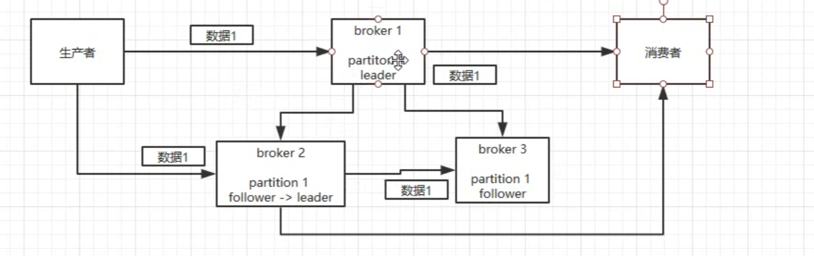
  > - 设置==æ¯ä¸ª patition 至少有两个 follower==，并且è¦æ±‚ ==leader 能感知到至少有一个 follower 还能正常åŒæ­¥æ•°æ®==，这样æ‰èƒ½ä¿è¯ leader 挂了之åŽè‡³å°‘还有一个副本存储了数æ®ï¼Œæ•°æ®ä¸ä¸¢ã€‚

7. ==Kafka 的消费者丢失数æ®==：

  > - 类似于 rabbitMQ 的消费者弄丢数æ®çš„情况，就是 ==auto æ交 offset ç»™ Kafka，让 Kafka 误以为你已ç»å®Œæˆæ交了==。也是关闭自动æ交 offset 的机制，让消费者消费完数æ®ä¹‹åŽå†æ交 offset 到 Kafka 中。

---


### 6.我该怎么ä¿è¯ä»Žæ¶ˆæ¯é˜Ÿåˆ—里拿到的数æ®æŒ‰é¡ºåºæ‰§è¡Œï¼Ÿ

1. ==RabbitMQ ä¿è¯é¡ºåºæ€§==：

	> - 
	> - ç»™æ¯ä¸€ä¸ªæ¶ˆè´¹è€…å•ç‹¬å¼€ä¸€ä¸ª queue，把需è¦ä¿è¯é¡ºåºçš„æ•°æ®å…¨éƒ¨æ”¾åœ¨åŒä¸€ä¸ª queue 中，这样一个消费者会顺åºè¯»å–这些数æ®ï¼Œè¿™æ ·å°±ä¿è¯äº†æ•°æ®çš„顺åºæ€§ã€‚

2. ==Kafka ä¿è¯é¡ºåºæ€§==：

	> - 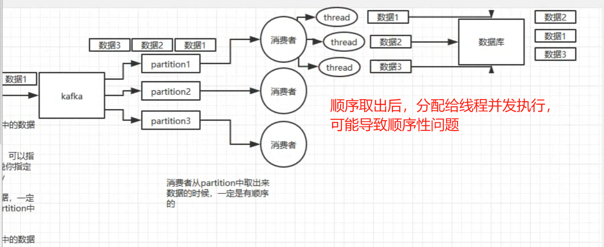
	>
	> - 解决方法，==一个线程顺åºåœ°ä»Žä¸€ä¸ªå†…存队列中å–æ•°æ®æ¥è¯»==，因此åªéœ€==将需è¦ä¿è¯é¡ºåºçš„æ•°æ®æ ¹æ®å®ƒä»¬ç›¸åŒçš„ key 值全部分å‘到åŒä¸€ä¸ªå†…存队列==中，被==åŒä¸€ä¸ªçº¿ç¨‹é¡ºåºæ‰§è¡Œ==。
	>
	> 	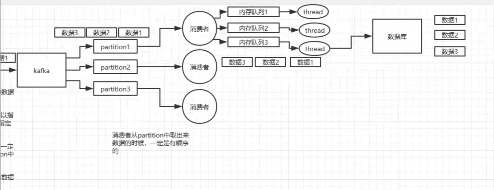

---


### 7.生产事故ï¼å‡ ç™¾ä¸‡æ¶ˆæ¯åœ¨æ¶ˆæ¯é˜Ÿåˆ—里积压了几个å°æ—¶ï¼

1. ==问题解释==：消费者挂了，导致积压大é‡æ•°æ®ï¼Œéœ€è¦æ¶ˆè´¹è€…æ¢å¤åŽå¿«é€Ÿå¤„ç†å®Œæˆã€‚
2. ==方法==：å‡å¦‚原æ¥åªæœ‰ä¸‰ä¸ªæ¶ˆè´¹è€…，它们把积压的数æ®å†™å…¥æ•°æ®è¦1个å°æ—¶ï¼Œå¤ªæ…¢äº†ã€‚我们å¯ä»¥è®©è¿™ä¸‰ä¸ªæ¶ˆè´¹è€…读å–到数æ®ä¹‹åŽä¸å†™å…¥æ•°æ®åº“，而是é‡æ–°å¼€ä¸€ä¸ª topic，它的下é¢æœ‰ 30 个 patition，==让原æ¥çš„三个消费者将数æ®å†™åˆ°è¿™æ–°å¼€çš„ 30 个 patition 中==，然åŽ==é‡æ–°éƒ¨ç½²ä¸€å°æœºå™¨==，让它==èµ· 30 个线程消费这 30 个patition 中的数æ®ï¼ˆå³å†™å…¥æ•°æ®åº“）==ï¼Œè¿™æ ·å°±èƒ½ä»¥åŽŸæ¥ ==10 å€çš„速度==消费积压数æ®ã€‚
3. ==ç£ç›˜éƒ½ç§¯åŽ‹æ»¡äº†æ€Žä¹ˆåŠž==？为了é¿å…ç£ç›˜æ»¡å¯¼è‡´æœºå™¨æŒ‚掉，让==原æ¥çš„消费者读å–到数æ®åŽç›´æŽ¥æ‰”掉，快速清ç†æŽ‰æ•°æ®==。==之åŽå•ç‹¬å†™ç¨‹åºæŸ¥å‡ºè¢«æ‰”掉的数æ®ï¼Œå†æ‰‹åŠ¨å†™åˆ° MQ 中处ç†==。

---


### 8.如果让你æ¥å¼€å‘一个消æ¯é˜Ÿåˆ—中间件，你会怎么设计架构？

1. > 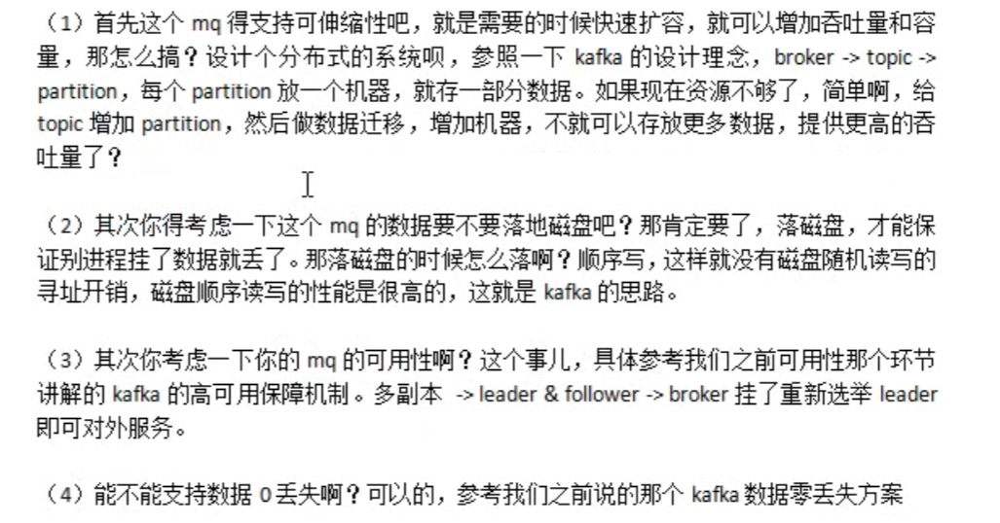

---


