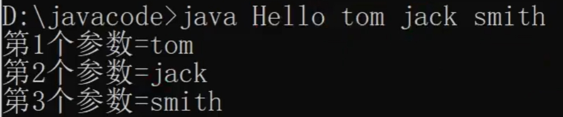

# Chapter10 面向对象编程(高级部分)

## 1.类变量与类方法详解

### 类变量

***类变量*** 也叫***静态变量/静态属性***，*可以类比C++的静态成员变量*

***定义语法***：`访问修饰符 static 数据类型 变量名:`

```java
public static int cnt = 0;
```

---

***类变量的内存布局***

1. 不同的jdk版本下类变量的位置不同
2. jdk8以前的版本存在*方法区中静态域*
3. jdk8以后的版本，***在类加载时会在堆区创建一个 Class实例***，***专门存放 static类变量***


---

***细节：***

1. static 变量是***同一个类所有对象共享***
2. static类变量，***在类加载的时候就生成了***，***就算没有生成对象也可以调用类属性***

### 类方法

***定义语法：***`访问修饰符 static 数据返回类型 方法名(){`

```java
public static void show() {}
```

*不需要创建对象也能调用类的方法，提高开发效率，如 Math,  Arrays, Collections类*

---

***细节：***

1. *类方法和普通方法都是* ***随着类的加载而加载***，将结构信息***存储在方法区***
2. ***类方法中不允许使用和对象有关的关键字，比如 this和 super***
3. 类方法可以通过类名调用，也可以通过对象名调用
4. ***类方法***(***静态方法***)中***只能访问 静态变量 或 静态方法***，***静态方法只能访问静态成员***


## 2.main方法

1. ***main方法是 JVM调用***

2. ***JVM需要调用类的 main()方法***，所以该方法的访问权限必须是public

3. ***JVM在执行 main()方法时不必创建对象***，所以该方法必须是static

4. 该方法接收String类型的数组参数，该数组中保存执行java命令时***传递给所运行的类的参数***

5. ***java执行的程序 参数 1 参数 2 参数 3***

	

6. *main方法是静态方法，**只能调用本类的静态成员***

---

***在 IDEA中给 main方法传参：***

> 
>
> 


## 3.代码块

***代码块：***又称为***初始化块*，*属于类中的成员***

***没有方法名，没有返回，没有参数，只有方法体***

不用通过对象或类显式调用，而是***加载类时，或创建对象时隐式调用***

---

***定义语法：***`[修饰符] { 代码 }`

```java
static {
    ...
};
```

1. 修饰符 ***可选***，要写的话，也***只能写 static***
2. 代码块分为两类，*使用  static 修饰的叫静态代码块*；*没有 static修饰的，叫普通代码块/非静态代码块*
3. `;号`***可以写上，也可以省略***

---

***使用情况***

1. ***普通代码块***相当于*另外一种形式的构造器 (对构造器的补充机制 )，可以做初始化的操作*

2. *如果多个构造器中都有重复的语句，可以抽取到初始化块中，提高代码的重用性*
3. ***代码块调用的顺序优先于构造器***

```java
class Movie {
    private String name;
    private double price;
    private String director;
    
    //代码块调用的顺序优先于构造器..
    {
        System.out.println("电影屏幕打开...");
        System.out.println("广告开始...");
        System.out.println("电影正是开始...");
    };

    public Movie(String name) {
        this.name = name;
    }

    public Movie(String name, double price) {
        this.name = name;
        this.price = price;
    }

    public Movie(String name, double price, String director) {
        this.name = name;
        this.price = price;
        this.director = director;
    }
}
```

***细节：***

1. ***static代码块，*** *作用是对类进行初始化*

	***在类加载时执行，只会执行一次*** （*因为一个类只会加载一次*）

	> 类加载的时机
	>
	> 1. ***创建对象实例*** 时(***new***)
	> 2. ***创建子类对象实例***，父类也会被加载
	> 3. ***使用类的静态成员时*** (***静态属性，静态方法***)

2. ***普通代码块，在创建对象时执行***，每创建一个，就执行一次

	- 普通代码块在*调用类的静态成员时，不会执行* 

3. ***创建一个对象时，在一个类 调用顺序是：*** ***（重点）***

	> 1. 调用***静态代码块*** 和***静态属性的初始化***（优先级一样，按定义的顺序调用）
	> 2. 调用***普通代码块***和***普通属性的初始化***（优先级一样，按定义的顺序调用）
	> 3. ***调用构造方法***

4. ***构造器的最前面*** 其实***隐含了 super() 和 调用普通代码块***

	- **super() 的调用在普通代码块之前**

5. 创建一个子类对象时(继承关系)，他们的静态代码块，静态属性初始化，

	普通代码块，普通属性初始化，构造方法的调用顺序如下：

	> - 类加载
	>
	> 1. 父类的静态代码块和静态属性(优先级一样，按定义顺序执行)
	> 2. 子类的静态代码块和静态属性(优先级一样，按定义顺序执行)
	>
	> ---
	>
	> - 对象创建
	>
	> 1. 父类的普通代码块和普通属性初始化(优先级一样，按定义顺序执行)
	> 2. 父类的构造方法
	> 3. 子类的普通代码块和普通属性初始化(优先级一样，按定义顺序执行)
	> 4. 子类的构造方法 // 面试题

6. ***静态代码块*** 只能直接***调用静态成员*** (静态属性和静态方法)


## 4.单例模式 与 final

### 单例模式

***单例模式：***对某个类***只能存在一个对象实例***，并且该类***只提供一个取得其对象实例的方法***

---

***【单例模式—饿汉式】***

1. ***构造器私有化 :*** 防止外部new新的对象

	```java
	private ClassName(...) {
		this.xxx = xxx;
	}
	```

2. ***类的内部创建对象：*** 私有属性，外部不能直接改；static属性，类加载时就创建完毕

	```java
	private static ClassName obj = new ClassName(...);
	```

3. ***向外暴露一个静态的公共方法：*** static属性，不用在类外new对象即可调用

	```java
	public static ClassName getInstance {
		return obj;
	}
	```

***为什么叫饿汉式***：因为可能***还没使用对象实例，就已经把对象创建好了***

比如***外部使用 `ClassName.n`***，*此时**没有使用对象实例**，但是**会进行类加载从而创建静态属性对象***

可能造成***资源浪费***

---

***【单例模式—懒汉式】***

1. ***仍然构造器私有化***

	```java
	private ClassName(...) {
		this.xxx = xxx;
	}
	```

2. ***声明一个静态属性对象：***只声明，不new，留在`getInstance`里new

	```java
	private static ClassName obj;
	```

3. 提供一个public static的方法：***如果对象没创建，就 new***；创建了就直接返回对象

	```java
	public static ClassName getInstance() {
		if(obj == null) {//如果对象没创建，就new
			obj = new ClassName(...);
	    }
	    return obj;//创建了就直接返回对象
	}
	```

---

***饿汉式 vs 懒汉式***

1. ***创建对象的时机不同：***

	> - ***饿汉式：*** ***类加载就创建了对象实例***
	>
	> - ***懒汉式：*** ***使用时才创建***

2. ***线程安全不同：***

	> - ***饿汉式：不存在线程安全问题***
	>
	> - ***懒汉式：存在线程安全问题***
	>
	> 	可能第一个线程调用`getInstance方法`还没创建完对象，第二个线程又进来了

3. ***空间浪费风险不同：***

	> - ***饿汉式*** 存在浪费资源的可能。如果***一个对象实例都没有使用***，那么饿汉式***创建的对象就浪费了***
	>
	> - ***懒汉式*** 是***使用时才创建***，就不存在这个问题。

### final

1. ***不希望类被继承*** 时，可以用final修饰

	```java
	//如果我们要求A类不能被其他类继承
	//可以使用final修饰 A类
	final class A { }
	
	//class B extends A {}
	```

2. 当***不希望父类的某个方法被子类覆盖/重写*** (override)时，可以用final关键字修饰

	```java
	class C {
	    //如果我们要求hi不能被子类重写
	    //可以使用final修饰 hi方法
	    public final void hi() {}
	}
	class D extends C {
	//    public void hi() { System.out.println("重写了C类的hi方法.."); }
	}
	```

3. 当***不希望类的的某个属性的值被修改***，可以用final修饰

	```java
	public final double TAX_RATE = 0.08;
	```

4. ***不希望某个局部变量被修改***，可以使用final修饰

	```java
	class F {
	    public void cry() {
	        //这时，NUM 也称为 局部常量
	        final double NUM = 0.01;
	        //NUM = 0.9;
	    }
	}
	```

---

***细节：*** 可以类比C++的const关键字

1. final修饰的属性又叫***常量***，一般 用 `XX_XX_XX `来命名

2. final修饰的属性在定义时，***必须赋初值***，并且***以后不能再修改***，赋值可以在如下位置之一

	> 1. 定义时
	> 2. 构造器中
	> 3. 代码块中

3. 如果 ***final修饰的属性是静态的***，则初始化的位置只能是：

	> 1. 定义时
	>
	> 2. 静态代码块 

	- ***不能在构造器中赋值***，静态属性在类加载时加载，而构造器必须创建对象实例才会调用

4. final类 ***不能继承***，但是***可以实例化对象***

5. 如果***类不是 final类***，但是含有***final方法***，则该方法虽然***不能重写***，但是***可以被继承***

6. final不能修饰构造器，***构造器不能被 static, final, abstract修饰***

7. ***final 和 static 往往搭配使用***，效率更高，***不会导致类加载***，底层编译器做了优化处理

	```java
	BBB.num;//此时不会导致类加载，静态代码块不会执行
	class BBB {
	    public final static int num = 10000;
	    static {
	        System.out.println("BBB 静态代码块被执行");
	    }
	}
	```

8. 包装类(Integer，Double，Float，Boolean等都是final)，String也是final类


## 5.抽象类

1. 用abstract 关键字来修饰一个类时,这个类就叫抽象类

	```java
	abstract public ClassName {}
	```

2. 用abstract 关键字来修饰一个方法时,这个方法就是抽象方法

	```java
	abstract public ClassName {
		public abstract void func();
	}
	```

3. 抽象类的价值更多作用是在于设计，是设计者设计好后，***让子类继承并实现抽象类***

---

***细节：***

1. 抽象类不能被实例化（***不能 new***）
2. 一旦***类包含了abstract方法***，则这个***类必须声明为 abstract***
3. ***abstract 只能修饰类和方法***，不能修饰属性和其它的
4. ***抽象类可以有任意成员***【 ***抽象类本质还是类*** 】，比如：非抽象方法、构造器、静态属性等等
5. 抽象方法***不能使用 private、final 和 static来修饰***，因为这些关键字都是和重写相违背的。

---

***抽象模板模式：***

1. 当功能内部***一部分实现是确定，一部分实现是不确定的***

	这时可以***把不确定的部分暴露出去***（即声明为抽象方法），让子类去实现

2. 编写一个抽象父类，父类提供了***多个子类的通用方法***

	***并把一个或多个方法留给其子类实现***，就是一种模板模式

```java
abstract public class Template { //抽象类-模板设计模式

    public abstract void job();//抽象方法

    public void calculateTime() {//实现方法，调用job方法
        //得到开始的时间
        long start = System.currentTimeMillis();
        job(); //动态绑定机制
        //得的结束的时间
        long end = System.currentTimeMillis();
        System.out.println("任务执行时间 " + (end - start));
    }
}
```


## 6.接口详解

***接口：***给出一些***没有实现的方法，封装到一起***。

​			到*某个类要使用的时候*，在***根据具体情况把这些方法写出来***

***定义语法：***

```java
//接口类
interface MyInterface {
	//属性
	//抽象方法
}

//连接接口的类
public class MyClass implements MyInterface {
	//类自己的属性
	//类自己的方法
	//必须实现的接口的方法
}
```

---

1. ***抽象类里的方法可以有方法体***，而***接口是更加抽象的类***
2. jdk7.0中：接口里的所有方法都没有方法体，即***所有方法必须是抽象方法***
3. Jdk8.0中：***接口类可以有静态方法(static)，默认方法(default)***，***不能有静态代码块***

---

***细节：***

1. 接口***不能被实例化***
2. 接口中***所有的方法必须是 public方法***，接口中抽象方法，***可以不用 abstract 修饰***

```java
interface MyInterface {
	void func1();//默认public，abstract，可写可不写	
}
```

3. 一个普通类实现接口，就必须将该接口的所有方法都实现，

	可以使用`alt + Enter`快捷键创建所有要实现的方法

4. 抽象类实现接口，可以不用实现接口的方法

5. ***一个类同时可以实现多个接口***

6. ***接口中的属性，只能是 final的***，而且是 `public static final` 修饰符。

	```java
	比如:int a = 1; //实际上是 public static final int a = 1;
	```

7. 接口***不能继承其它的类***，但是***可以继承多个别的接口***

8. ***接口的修饰符只能是 public 和默认***，这点和类的修饰符是一样的

> 当子类继承了父类，就自动的拥有父类的功能
> 如果子类需要扩展功能，***可以通过实现接口的方式扩展***
> 可以理解 ***实现接口是对 java 单继承机制的一种补充***

---

### 接口 vs 抽象类

1. 抽象类中可以有构造器，代码块，实例方法；***接口只有抽象方法，***`static方法`和`default方法`
2. 抽象类的方法的访问修饰符无限制；***接口的方法只能是*** `public abstract`
3. 抽象类的属性的访问修饰符无限制；***接口的属性只能是*** `public static final`
4. 接口的***static方法只能通过接口调用***，且***没有 static代码块***

---

### 接口多态特性

1. 继承多态的向上转型和向下转型与之一致

2. 多态数组的处理也一致

3. 同样有继承中“爷爷类”的概念

	


## 7.四种内部类详解

***类的五大成员：属性，方法，构造器，代码块，内部类***

***内部类分为四种：***

> 1. 定义在***外部类局部位置***上：
> 	1. ***局部内部类***(有类名)
> 	2. ***匿名内部类***(没有类名，***重点 !!!!!!!!!!!!!!!!!!!!!!!!***)
> 2. 定义在***外部类的成员位置***上：
> 	3. ***成员内部类***(没用static修饰)
> 	4. ***静态内部类***(使用static修饰)

---

### 局部内部类

1. 可以直接访问外部类的所有成员，包含私有的

2. ***不能添加访问修饰符***，因为它的地位就是一个局部变量，***局部变量是不能使用修饰符的***

	但是***可以使用 final 修饰***，因为***局部变量也可以使用 final***

	```java
	public Class Outer {
		final Class Inner1 {}
		//Class Inner2 extends Inner1 {}//final修饰
	}
	```

3. 仅仅在定义它的方法***或代码块*** 中

4. 如果***外部类和局部内部类的成员重名*** 时，默认遵循***就近原则***

5. 如果想访问外部类的成员，则可以使用(***外部类名.this.成员*** )去访问

	```java
	System.out.println(Outer.this.n + this.n);
	```

---

### 匿名内部类 （重要）

定义语法：new 类或接口 (参数列表) {类体}

1. ***参数列表传给构造器***，如果是接口就必须为空
2. 编译类型：接口类型IA
3. ***运行类型：匿名内部类***（OuterClassName$1）
4. jdk底层创建匿名内部类时，***立刻在堆区构建其实例，并把堆区的地址返回给对象***
5. 匿名内部类***只调用一次，就不能再使用***
6. 拥有***局部内部类的所有特征***

```java
//1. tiger的编译类型 ? IA
//2. tiger的运行类型 ? 就是匿名内部类  Outer04$1
/*
	我们看底层 会分配 类名 Outer04$1
*/
class Outer04$1 implements IA {
    @Override
    public void cry() {
        System.out.println("老虎叫唤...");
    }
}
//3. jdk底层在创建匿名内部类 Outer04$1，立即马上就创建了 Outer04$1实例，并且把地址返回给 tiger
//4. 匿名内部类使用一次，就不能再使用
IA tiger = new IA() {
    @Override
    public void cry() {
        System.out.println("老虎叫唤...");
    }
};
System.out.println("tiger的运行类型=" + tiger.getClass());
--------------------------------------------------------------------------------------
interface IA {//接口
    public void cry();
}
```

---

### 成员内部类

1. 成员内部类***没有被 static修饰***

2. 可以直接访问外部类的所有成员，包含私有的

3. 外部类成员访问成员内部类：先创建对象，再调用

4. 外部其它类访问成员内部类：

	1. ```java
		Outer08 outer08 = new Outer08();
		Outer08.Inner08 inner08 = outer08.new Inner08();
		```

	2. ```java
		Outer08.Inner08 inner08 = new Outer08().new Inner08();
		```

	3. 外部类创建一个返回新的成员内部类的*实例方法*

5. 重名就近原则，外部类类名.this.重名成员

6. ***成员内部类不能有静态成员***，***因为外部类加载的时候成员方法类还没有加载***

---

### 静态内部类

1. 静态内部类***被 static修饰***

2. ***不能访问外部类的非静态成员***

3. 可以添加任意访问修饰符

4. 外部类访问静态内部类，创建对象

5. 外部其他类访问静态内部类

	```java
	 Outer10.Inner10 inner10 = new Outer10.Inner10();
	```

	```java
	 Outer10.Inner10 inner10 = Outer10.getInner10Instance();
	 
	 public static Inner10 getInner10Instance() {
	 	return new Inner10();
	 }
	```


# Chapter11 枚举和注解

## 8.枚举 Enum

### 自定义枚举类

1. 构造器私有化，防止外部new

	```java
	private Season(String name, String desc) {
	    this.name = name;
	    this.desc = desc;
	}
	```

2. 本类内部创建一组对象[四个 春夏秋冬]

	```java
	public static final Season SPRING = new Season("春天", "温暖");
	public static final Season WINTER = new Season("冬天", "寒冷");
	public static final Season AUTUMN = new Season("秋天", "凉爽");
	public static final Season SUMMER = new Season("夏天", "炎热");
	```

3. 对外暴露对象(通过为对象添加 public final static 修饰符)，***防止外部调用时类加载***

4. 可以提供 get 方法，但是不要提供 set

### enum枚举类

```java
enum Season2 {
    //如果使用了enum 来实现枚举类
    //1. 使用关键字 enum 替代 class
    //2. public static final Season SPRING = new Season("春天", "温暖") 直接使用
    //   SPRING("春天", "温暖") 解读 常量名(实参列表)
    //3. 如果有多个常量(对象)， 使用 ,号间隔即可
    //4. 如果使用enum 来实现枚举，要求将定义常量对象，写在最前面
    //5. 如果我们使用的是无参构造器，创建常量对象，则可以省略 ()
    SPRING("春天", "温暖"), WINTER("冬天", "寒冷"), AUTUMN("秋天", "凉爽"),
    SUMMER("夏天", "炎热")/*, What()*/;
```

1. 使用关键字 enum 替代 class

2. 直接使用` 常量名(实参列表)` 的方式创建`public final static`对象
3. 如果有多个常量(对象)， 使用 `,`号间隔，***不能使用 `;`间隔***
4. 定义常量对象，***写在类的最前面***
5. 无参构造器，创建常量对象，则可以省略 ()
6. 当我们使用 enum 关键字开发一个枚举类时,默认***会继承 Enum类***，因而***不能再继承其他类***，***可以接口***


---

### Enum类中的方法


1. ***name()方法：***输出***枚举对象的名字***

2. ***ordinal()方法：***输出的是该***枚举对象的次序/编号***，***从0开始编号***

3. ***values()方法：***返回定义的***所有枚举对象的数组***

4. ***valueOf()方法：***将字符串转换成枚举对象，要求***字符串必须为已有的常量名***，否则报异常

	比如`Season seasonObj = Season.valuesOf("Autumn");`

5. ***compareTo()方法：*** ***比较两个枚举常量，比较的就是编号***

6. ***toString()方法：***返回枚举对象的名称（Enum类中重写的）


## 9.注解

***注解 (Annotation)也被称为元数据 (Metadata)***

在 JavaSE 中，注解的使用目的比较简单，例如***标记过时的功能，忽略警告***等。

***在 JavaEE 中注解占据了更重要的角色***，例如用来配置应用程序的任何切面，代替 java EE 旧版中所遗留的繁冗代码和 XML 配置等。

---

### Override注解

```java
public @interface Override {
}
```

1. ***@interface不是接口，是注解类***
2. `@Override` 表示指定***重写父类的方法*** (从编译层面验证)，如果没有重写则会报错
3. `@Override` ***只能修饰方法***，不能修饰其它类，包，属性等等
4. 查看`@Override`注解源码为 `@Target(ElementType.METHOD)`，说明只能修饰方法
5. ***@Target 是修饰注解的注解***，称为***元注解***

---

### Deprecated注解

`@Deprecated`：用于***表示某个程序元素 (类, 方法等 )已过时***

1. 可以修饰方法，类，字段，包，参数 等等

2. ```java
	@Target(value={CONSTRUCTOR, FIELD, LOCAL VARIABLE, METHODPACKAGE,PARAMETER,TYPE})
	```

3. .@Deprecated 的作用可以做到***新旧版本的兼容和过渡***

---

### SuppressWarnings注解

`@SuppressWarnings`：***抑制编译器警告***

```java
@SuppressWarnings({...})//里面写想要抑制的警告
```

***作用范围：***放在类，方法或语句上

```java
@Target({TYPE, FIELD, METHOD, PARAMETER, CONSTRUCTOR, LOCAL_VARIABLE})
```

---

### 元注解

```java
1) Retention //指定注解的作用范围，三种 SOURCE,CLASS,RUNTIME
    
    public enum RetentionPolicy {
        SOURCE,            /* Annotation信息仅存在于编译器处理期间，编译器处理完之后就没有该								  Annotation信息了  */

        CLASS,             /* 编译器将Annotation存储于类对应的.class文件中。默认行为  */

        RUNTIME            /* 编译器将Annotation存储于class文件中，并且可由JVM读入 */
    }

2) Target // 指定注解可以在哪些地方使用
    
    public enum ElementType {
    TYPE,               /* 类、接口（包括注释类型）或枚举声明  */

    FIELD,              /* 字段声明（包括枚举常量）  */

    METHOD,             /* 方法声明  */

    PARAMETER,          /* 参数声明  */

    CONSTRUCTOR,        /* 构造方法声明  */

    LOCAL_VARIABLE,     /* 局部变量声明  */

    ANNOTATION_TYPE,    /* 注释类型声明  */

    PACKAGE             /* 包声明  */
	}

3) Documented //指定该注解是否会在 javadoc 体现

4) Inherited //子类会继承父类的注解
```

---


# Chapter12 异常-Exception

## 11.异常

程序***遇到未经处理的异常会直接终止***，而***对异常进行捕获，即可保证程序继续运行***

### 异常事件

1. ***Error(错误 )：Java虚拟机无法解决的严重问题***

	> 如：JVM系统内部错误、、资源耗尽等严重情况
	>
	> 比如：StackOverflowError[栈溢出] 和 OOM(out ofmemory)
	>
	> ***Error 是严重错误，程序会崩溃***

2. ***Exception：***其它因***编程错误或偶然的外在因素*** 导致的一般性问题，可以使用针对性的代码进行处理。

	> 例如空指针访问，试图读取不存在的文件，网络连接中断等等

	> 1. ***运行时异常：***[程序运行时，发生的异常]
	> 2. ***编译时异常：***[编程时，编译器检查出的异常]

---

### 异常体系图


1. ***所有异常的父类：***`Throwable类`，`Throwable类`实现了`Serializable接口`
2. `Error类`和`Exception类`直接继承`Throwable类`
3. `Exception类`的子类又有***运行时异常和编译时异常***

---

### 常见异常

| 异常类名                         | 翻译             | 简短说明                                                   |
| -------------------------------- | :--------------- | ---------------------------------------------------------- |
| `NullPointerException`           | 空指针异常       | 当应用试图在需要对象的地方使用`null`时抛出                 |
| `ArrayIndexOutOfBoundsException` | 数组索引越界异常 | 尝试访问数组以外的索引时抛出                               |
| `ClassCastException`             | 类型转换异常     | 尝试将对象强制转换为不是实例的子类时抛出                   |
| `NumberFormatException`          | 数字格式异常     | 尝试将字符串转换为数字格式，但字符串不具有适当的格式时抛出 |
| `IllegalArgumentException`       | 非法参数异常     | 向方法传递了一个不合法或不适当的参数时抛出                 |
| `ArithmeticException`            | 算术条件异常     | 发生异常的运算条件，如除以零时抛出                         |
| `FileNotFoundException`          | 文件未找到异常   | 尝试打开不存在的文件时抛出                                 |
| `IOException`                    | 输入输出异常     | 处理输入、输出操作失败或中断时抛出                         |

---

### 异常处理

1. ***try-catch-finally***：快捷键`Ctrl + Alt + t`

	> 1. ```java
	> 	try {
	> 	    //可能出现异常的代码块
	> 	}
	> 	```
	>
	> 2. ```java
	> 	catch(Exception e) {
	> 		//自己处理异常
	> 	    //没有抓到异常就不进入该代码块
	> 	}
	> 	```
	>
	> 3. ```java
	> 	finally {
	> 	    //无论是否抓取到异常，都会执行该代码块
	> 	    //所以，通常将是否资源的代码放到finally
	> 	}
	> 	```

2. ***throws***

	如果程序员没有显式处理异常，默认`throws Exception`

	

---


## 12.try | catch | throws

### try | catch

1. 如果异常发生了，则***异常发生后面的代码不会执行***，直接进入到catch块

2. 如果异常没有发生，则顺序执行try的代码块，不会进入到catch

3. 不管是否发生异常，都执行finally代码块，***即使 catch中有 return，也会执行 finally***

4. 可以有***多个 catch语句，捕获不同的异常*** (进行不同的业务处理)

	要求***父类异常在后，子类异常在前***，比如(Exception 在后，NulPointerException 在前)

	如果发生异常，***只会匹配一个 catch***

5. ***try | catch | throws 的执行顺序：*** ***（重点）***

	1. 先try，***有异常则后面的代码都不执行***
	2. ***catch中如果有 return***，会***先把 return的值存到一个 temp里，然后执行 finally代码块***
	3. 如果***finally代码块有 return，就按 finally代码块中的返回***，***否则返回temp***
	4. 注意：***返回的 temp不受 finally代码块的影响***，值不会改变

---

### throws

1. 如果一个方法(中的语句执行时)可能生成某种异常，但是并***不能确定如何处理这种异常***，则此方法应显示地声明抛出异常，表明该方法将***不对这些异常进行处理，而由该方法的调用者负责处理***

2. 在方法声明中用throws语句可以***声明抛出异常的列表***，throws后面的异常类型***可以是方法中产生的异常类型，也可以是方法的父类***

3. ```java
	public void f2() throws FileNotFoundException, NullPointerException, ArithmeticException {
	    //1. 这里的异常是一个FileNotFoundException 编译异常
	    //2. 使用前面讲过的 try-catch-finally
	    //3. 使用throws ,抛出异常, 让调用f2方法的调用者(方法)处理
	    //4. throws后面的异常类型可以是方法中产生的异常类型，也可以是它的父类
	    //5. throws 关键字后也可以是 异常列表, 即可以抛出多个异常
	    FileInputStream fis = new FileInputStream("d://aa.txt");
	
	}
	```

***细节：***

1. 对于***编译异常，程序中必须处理***，比如 try-catch 或者 throws

2. 对于***运行时异常***，程序中如果没有处理，***默认就是 throws***的方式处理

3. ***子类重写的方法***，所抛出的异常类型***要么和父类抛出的异常一致***，要么***为父类抛出的异常的类型的子类型***

	```java
	class Father { //父类
	    public void method() throws RuntimeException {
	    }
	}
	
	class Son extends Father {//子类
	    // 子类重写父类的方法时，对抛出异常的规定:子类重写的方法
	    // 所抛出的异常类型要么和父类抛出的异常一致，要么为父类抛出的异常类型的子类型
	    @Override
	    public void method() throws ArithmeticException {
	    }//ArithmeticException为RuntimeException的子类
	}
	```

4. 如果有方法 try-catch，就可以不必 throws

5. 如果方法调用了另一个 *throws了**编译异常**的方法*，程序员***必须显式处理这个异常（ try-catch，throws）***

	```java
	public static void f1() {
	    //1. 因为f3() 方法抛出的是一个编译异常
	    //2. 所以f1() 必须处理这个编译异常
	    //3. 在f1() 中，要么 try-catch-finally ,或者继续throws 这个编译异常
	    try {
	        f3();
	    } catch (FileNotFoundException e) {
	        e.printStackTrace();
	    }
	}
	public static void f3() throws FileNotFoundException {
	    FileInputStream fis = new FileInputStream("d://aa.txt");
	}
	```

6. 如果方法调用了另一个 *throws了**运行异常**的方法*，编译会通过，***无需显式处理，有默认处理机制***

	```java
	public static void f4() {
	    //1. 在f4()中调用方法f5() 是OK
	    //2. 原因是f5() 抛出的是运行异常
	    //3. 而java中，并不要求程序员显示处理,因为有默认处理机制
	    f5();//不会报错，编译通过
	}
	public static void f5() throws ArithmeticException {
	
	}
	```

---

### 自定义异常

1. 自定义类：自定义异常类名(程序员自己写)***继承 Exception或 RuntimeException***

2. 如果***继承 Exception***，属于***编译异常*** (比较麻烦，一般不推荐，还要throws，try-catch…)

3. 如果***继承 RuntimeException***，属于***运行异常*** (可以***直接使用默认处理机制*** )

	```java
	public class CustomException {
	    public static void main(String[] args) {
	
	        int age = 180;
	        //要求范围在 18 – 120 之间，否则抛出一个自定义异常
	        if (!(age >= 18 && age <= 120)) {
	            //这里我们可以通过构造器，设置信息
	            throw new AgeException("年龄需要在 18~120之间");
	        }
	        System.out.println("你的年龄范围正确.");
	    }
	}
	
	class AgeException extends RuntimeException {
	    public AgeException(String message) {//构造器
	        super(message);
	    }
	}
	```

---

### throws 和 throw 的区别


```java
//throws：一种异常处理方式，方法声明处，后跟异常类型
public void function() throws RuntimeException {}

//throw：在方法体中，后跟异常对象
public static void function {
	throw new AgeException("年龄不对哦~");
}
```

---


# Chapter13 常用类

## 14.八大常用类


***Character和 Boolean没有继承 Number：***


***其它六个类均继承自 Number：***


## 15.Integer类：拆箱与装箱

### 装箱

***装箱：int => Interger，基本数据类型转为对象***

***手动装箱：***（jdk5以前只能手动装箱）

```java
int n1 = 100;
Integer integer = new Integer(n1);
Integer integer1 = Integer.valueOf(n1);
```

***自动装箱：***（jdk5以后可以自动装箱）

```java
int n2 =200;
Integer integer2 = n2; //底层使用的是 Integer.valueOf(n2)
```

### 拆箱

***拆箱：Interger => int，对象转为基本数据类型***

***手动拆箱：***（jdk5以前只能手动拆箱）

```java
int i = integer.intValue();
```

***自动拆箱：***（jdk5以后可以自动拆箱）

```java
int n3 = integer2; //底层仍然使用的是 intValue()方法
```

> 1. 自动装箱的底层是valueOf()方法；自动拆箱的底层是inValue()方法
> 2. 其它包装类的装箱拆箱也一样

***经典面试题：***

```java
Object object = (true) ? new Integer(1) : new Double(2.0);
//三元运算符是一个整体，会直接转成容量最大的double型
System.out.println(object);//1.0
```

### 包装类

***包装类与 String的相互转化：***

1. ***包装类转 String***

	> 1. ```java
	> 	Integer i = 100;//自动装箱
	> 	//方式1
	> 	String str1 = i + "";
	> 	```
	>
	> 2. ```java
	> 	//方式2
	> 	String str2 = i.toString();
	> 	```
	>
	> 3. ```java
	> 	//方式3
	> 	String str3 = String.valueOf(i);
	> 	```
	>
	> 	> String.valueOf(Object) 方法的底层：
	> 	>
	> 	> ```java
	> 	> public static String valueOf(Object obj) {
	> 	> 	return (obj == null) ? "null" : obj.toString();
	> 	> }
	> 	> ```

2. ***String 转包装类***

	> 1. ```java
	> 	String str4 = "12345";
	> 	Integer i2 = Integer.parseInt(str4);//使用到自动装箱，调了Integer.valueOf()
	> 	```
	>
	> 2. ```java
	> 	Integer i3 = new Integer(str4);//构造器
	> 	```
	>
	> 	> ```java
	> 	> public Integer(String s) throws NumberFormatException {//接收String的构造器
	> 	>     this.value = parseInt(s, 10);
	> 	> }
	> 	> ```

***常用方法：***

```java
System.out.println(Integer.MIN_VALUE); //返回最小值
System.out.println(Integer.MAX_VALUE);//返回最大值

System.out.println(Character.isDigit('a'));//判断是不是数字
System.out.println(Character.isLetter('a'));//判断是不是字母
System.out.println(Character.isUpperCase('a'));//判断是不是大写
System.out.println(Character.isLowerCase('a'));//判断是不是小写
System.out.println(Character.isWhitespace('a'));//判断是不是空格

System.out.println(Character.toUpperCase('a'));//转成大写
System.out.println(Character.toLowerCase('A'));//转成小写
```

### 缓存池 cache

`IntegerCache`是`Integer`的一个***静态内部类***

***缓存池 `cache`*** 是`IntegerCache`的一个***静态属性***，是一个***`Integer`型数组***

***Integer.IntegerCache源码：***

```java
private static class IntegerCache {
    static final int low = -128;
    static final int high;
    static final Integer cache[];//缓存池，Integer型数组

    static {//静态代码块
        // high value may be configured by property
        int h = 127;
        String integerCacheHighPropValue =
            sun.misc.VM.getSavedProperty("java.lang.Integer.IntegerCache.high");
        if (integerCacheHighPropValue != null) {
            try {
                int i = parseInt(integerCacheHighPropValue);
                i = Math.max(i, 127);
                // Maximum array size is Integer.MAX_VALUE
                h = Math.min(i, Integer.MAX_VALUE - (-low) -1);
            } catch( NumberFormatException nfe) {
                // If the property cannot be parsed into an int, ignore it.
            }
        }
        high = h;

        cache = new Integer[(high - low) + 1];//声明数组大小
        int j = low;
        for(int k = 0; k < cache.length; k++)//初始化缓存池cache
            cache[k] = new Integer(j++);

        // range [-128, 127] must be interned (JLS7 5.1.7)
        assets IntegerCache.high >= 127;
    }

    private IntegerCache() {}
}
```

***Integer.valueOf(int) 源码：***

```java
public static Integer valueOf(int i) {
    //如果在缓存池-128~127的范围内，则直接返回缓存池元素的地址
    if (i >= IntegerCache.low && i <= IntegerCache.high)
        return IntegerCache.cache[i + (-IntegerCache.low)];
    return new Integer(i);//否则创建新的对象
}
```

***经典面试题：***

```java
Integer i = new Integer(1);
Integer j = new Integer(1);
System.out.println(i == j);//False

/*
//1. 如果i在 IntegerCache.low(-128)~IntegerCache.high(127)，就直接从数组返回
//2. 如果不在 -128~127，就直接 new Integer(i)

public static Integer valueOf(int i) {
	if (i >= IntegerCache.low && i <= IntegerCache.high)
		return IntegerCache.cache[i + (-IntegerCache.low)];
	return new Integer(i);
}
*/

Integer m = 1; //底层 Integer.valueOf(1);
Integer n = 1;//底层 Integer.valueOf(1);
System.out.println(m == n);//True
//所以，这里主要是看范围 -128 ~ 127 就是直接返回
//否则，就new Integer(xx);
Integer x = 128;//底层Integer.valueOf(128);
Integer y = 128;//底层Integer.valueOf(128);
System.out.println(x == y);//False
```

***比较时只要有基本数据类型，对象就会调用相应的 xxxValue() 方法进行数值比较***

```java
Integer i1 = 127;
int i2 = 127;
//只要有有基本数据类型，判断的就是值是否相同，调用Integer.intValue()
System.out.println(i1 == i2);//T
Integer i3 = 128;
int i4 = 128;
System.out.println(i3 == i4);//T
```


## 16.String 详解


> 串行化：可以在网络传输

1. String的字符***采用 Unicode编码方式***，即***所有字符均占两个字节***

2. String***重载了大量的构造器***

3. String实现了***Serializable接口，可以串行化，即可以在网络传输***

	实现了Comparable接口，可以比大小

4. ***String是 final类***，不能被继承

5. ***String的本质是` char 数组`***

	```java
	/** The value is used for character storage. */
	private final char value[];
	```

6. 注意：***value数组是一个 final类型***，***地址不能修改（不能指向新的地址），指向的内容可以修改***

---

### 创建String对象

1. ***直接赋字符串常量：***

  方式一：*先从常量池查看是否有"hsp"数据空间，如果有，直接指向；如果没有则重新创建，然后指向*

  ***str1 最终指向的是常量池的空间地址***

  ```java
  String str1 = "hsp";
  ```

2. ***调用构造器：***

	方式二：***先在堆中创建空间，里面维护了 value属性***，***指向常量池的 hsp空间***

	*如果常量池没有"hsp"，重新创建，如果有，直接通过value指向*
	
	***str2 最终指向的是堆中的空间地址***
	
	> str2.intern() 方法可以返回常量池的地址
	
	```java
	String str2 = new String("hsp");
	```


---

### String 对象特性

***String对象：分为字符串常量对象和字符串变量对象***

1. ***字符串常量对象：存在常量池***，一旦创建就无法更改

	```java
	String s = "hsp";//s为字符串变量对象，其指向字符串变量"hsp"，本行只创建了1个对象
	```

2. ***字符串变量对象：存在堆区***，其***char[] value属性指向常量池中的字符串常量对象***

	*堆区中的地址不可变，但是value指向的常量池中的字符串常量对象可变*

	```java
	String s = new String();//s为字符串变量对象，指向堆区中实例化对象，本行也只创建了1个对象
	```

***面试题：***

1. ```java
	String a = "Hello" + "String";
	//编译器自动优化为String a = "HelloString"
	//因此只创建了1个对象
	```

2. ```java
	String a = "hello";//创建 a对象
	String b = "abc";//创建 b对象
	//老韩解读
	//1. 先 创建一个 StringBuilder sb = StringBuilder()
	//2. 执行 sb.append("hello");
	//3. 再执行 sb.append("abc");
	//4. String c = sb.toString();//StringBuilder => String，toString底层堆区new了
	//最后其实是 c 指向堆中的对象；value[] -> 池中 "helloabc"
	String c = a + b;
	//一个创建3个对象，a,b,c
	```

3. ```java
	String str = new String("aaa");
	//创建了2个对象，一个是在堆区new出来的实例对象，另一个是在常量池中的"aaa"对象
	```

---

### String的常用方法

1. `equals` // 区分大小写，判断内容是否相等

2. `equalsIgnoreCase` //忽略大小写的判断内容是否相等

3. `length` // 获取字符的个数，字符串的长度

4. `indexOf` //获取字符在字符串中第1次出现的索引，索引从0开始，如果找不到，返回-1

5. `lastIndexOf` //获取字符在字符串中最后1次出现的索引，索引从0开始，如找不到，返回-1

6. `substring` //截取指定范围的子串，***左闭右开：[ )***

7. `trim` //去前后空格

8. `charAt`：获取某索引处的字符，***注意不能使用 Str[index] 这种方式***，***不能把 String对象当作数组***

9. `toUpperCase`，转大写

10. `toLowerCase`，转小写

11. `concat`，字符串拼接，***注意返回一个新的对象，原来的对象无影响***

12. `replace` 替换字符串中的字符，***注意返回一个新的对象，原来的对象无影响***

13. `split` 分割字符串,对于某些分割字符，***返回 String数组***，***原对象不受影响***，***分隔符没了***

14. `compareTo` //比较两个字符串的大小

	长度不同：***返回 str1.length - str2.length***

	长度相同但不一样：***返回第一个不一样字符，前一个减后一个的 Unicode码值***

15. `toCharArray` //转换成字符数组

16. `format` //格式字符串， 占位符：%s 字符串 %c 字符 %d 整型 %.2f 浮点型，`String.format("…",…);`

	```java
	String formatStr = "我的姓名是%s 年龄是%d，成绩是%.2f 性别是%c.希望大家喜欢我！";
	
	String info2 = String.format(formatStr, name, age, score, gender);
	
	System.out.println("info2=" + info2);
	```

---


## 17.StringBuffer 与 StringBuilder

### StringBuffer

1. `StringBuffer` 的直接父类是 `AbstractStringBuilder`

2. `StringBuffer` 实现了 `Serializable`，即`StringBuffer`的对象可以串行化

3. 在父类中  `AbstractStringBuilder` ***有属性 `char[] value`，不是 final***

	***该 value 数组存放 字符串内容，存放在堆中***

4. `StringBuffer` 是一个 final类，不能被继承

5. 因为 `StringBuffer` 字符内容是存在 `char[] value`
	所以修饰时***不用每次都更换地址 (即不是每次创建新对象 )***， 所以效率高于 String

---

### StringBuffer vs String

1. ***String保存的是字符串常量***，*里面的值不能更改*

	***每次 String类的更新实际上就是更改地址***，效率较低

	//private final char value[];

2. ***StringBuffer保存的是字符串变量***，*里面的值可以更改*

	*每次 StringBuffer的更新实际上可以更新内容，**不用每次更新地址***，效率较高

	//char[] value; ***StringBuffer的 value指向堆里的一块字符型数组***

---

***StringBuffer的构造器：***

1. 无参构造器：***默认创建一个大小为 16的 char[]***，用于存放字符内容

	```java
	StringBuffer stringBuffer = new StringBuffer();
	```

2. StringBuffer(int capacity); 指定value大小的构造器

	```java
	StringBuffer stringBuffer1 = new StringBuffer(100);
	```

3. 通过 给一个String 创建 StringBuffer, ***char[] 大小就是 `str.length() + 16`***

	```java
	StringBuffer hello = new StringBuffer("hello");
	```

---

### StringBuffer 和 String 的转换

1. ***String => StringBuffer：***

	> 1. ***使用构造器，返回的才是 StringBuffer，对 str 没有影响***
	>
	> 	```java
	> 	StringBuffer stringbuffer = new StringBuffer(str);
	> 	```
	>
	> 2. ***使用 append方法***
	>
	> 	```java
	> 	StringBuffer stringBuffer = new StringBuffer();
	> 	stringbuffer = stringbuffer.append(str);
	> 	```

2. ***StringBuffer => String：***

	> 1. ***使用 toString 方法***
	>
	> 	```java
	> 	StringBuffer stringBuffer3 = new StringBuffer("韩顺平教育");
	> 	String s = stringBuffer3.toString();
	> 	```
	>
	> 2. ***使用构造器***
	>
	> 	```java
	> 	String s1 = new String(stringBuffer3);
	> 	```

---

### StringBuffer 方法

1. ***增加：***`append`，***直接修改属性 char[] value***

	> append有众多重载方法，比如append(int)，直接append(1)即可在末尾加上"1"

2. ***删除：***`delete`，***赋开始结束的 index，左闭右开***

3. ***替换：***`replace`，***同样*** 赋开始结束的 index，左闭右开

4. ***插入：***`insert`，在***指定 index处插入字符串***

	> 注意***String中没有此方法***，因为String为***不可变字符串序列***

---

### StringBuffer 习题

```java
public class StringBufferExercise01 {
    public static void main(String[] args) {
        String str = null;// ok
        StringBuffer sb = new StringBuffer(); //ok
        
        sb.append(str);
        //需要看源码 , 底层调用的是 AbstractStringBuilder 的 appendNull
        //appendNUll将AbstractStringBuilder的value属性变为{'n','u','l','l'},长度为4
        
        System.out.println(sb.length());//4
        System.out.println(sb);//null
        
------------------------------------------------------------------------------------
        //下面的构造器，会抛出NullpointerException
        StringBuffer sb1 = new StringBuffer(str);//源码super(str.length() + 16);报错
        System.out.println(sb1);

    }
}
```

---

### StringBuilder

1. 此类提供一个***与 StringBuffer 兼容的 API***，但不保证同步(***StringBuilder 不是线程安全*** )
2. 该类被设计*用作 StringBuffer 的一个**简易替换***，用在字符串缓冲区***被单个线程使用*** 的时候
3. 如果可能，建议优先采用该类因为在大多数实现中，***它比 StringBuffer 要快***
4. 在 StringBuilder 上的主要操作是 append 和 insert 方法，***可重载这些方法以接受任意类型的数据***

---

### String vs StringBuffer vs StringBuilder

1. ***StringBuilder 和 StringBuffer*** 非常类似，***都在堆中开辟字符串缓冲区***，而且***方法也一样***

2. ***String：*** ***不可变字符序列***，效率低，但是***复用性最高，善于被多个对象引用***

	> 如果我们对String 做大量修改,不要使用String

3. ***StringBuffer：*** ***可变字符序列***、效率较高(增删)、***线程安全***（大部分方法被Synchronized修饰）

	> StringBuffer 中并不是所有方法都使用了 ***Synchronized*** 修饰来实现同步：
	>
	> ```java
	> @Overridepublic StringBuffer insert(int dstOffset, CharSequence s) {  
	>     // Note, synchronization achieved via invocations of other StringBuffer methods  
	>     // after narrowing of s to specific type  
	>     // Ditto for toStringCache clearing  
	>     super.insert(dstOffset, s);  
	>     return this;
	> }
	> ```

4. ***StringBuilder：*** ***可变字符序列***、效率最高、***线程不安全***

5. 效率：***StringBuilder > StringBuffer > String***

	> ```java
	> StringBuilder的执行时间：2
	> StringBuffer的执行时间：8
	> String的执行时间：4347
	> ```

---


## 18.其它

### Math类

```java
//1.abs 绝对值
int abs = Math.abs(-9);
System.out.println(abs);//9
//2.pow 求幂
double pow = Math.pow(2, 4);//2的4次方
System.out.println(pow);//16
//3.ceil 向上取整,返回>=该参数的最小整数(转成double);
double ceil = Math.ceil(3.9);
System.out.println(ceil);//4.0
//4.floor 向下取整，返回<=该参数的最大整数(转成double)
double floor = Math.floor(4.001);
System.out.println(floor);//4.0
//5.round 四舍五入  Math.floor(该参数+0.5)
long round = Math.round(5.51);
System.out.println(round);//6
//6.sqrt 求开方
double sqrt = Math.sqrt(9.0);
System.out.println(sqrt);//3.0

//7.random 求随机数
//  random 返回的是 0 <= x < 1 之间的一个随机小数
// 思考：请写出获取 a-b之间的一个随机整数,a,b均为整数 ，比如 a = 2, b=7
//  即返回一个数 x  2 <= x <= 7
// 老韩解读 Math.random() * (b-a) 返回的就是 0  <= 数 <= b-a
// (1) (int)(a) <= x <= (int)(a + Math.random() * (b-a +1) )
// (2) 使用具体的数给小伙伴介绍 a = 2  b = 7
//  (int)(a + Math.random() * (b-a +1) ) = (int)( 2 + Math.random()*6)
//  Math.random()*6 返回的是 0 <= x < 6 小数
//  2 + Math.random()*6 返回的就是 2<= x < 8 小数
//  (int)(2 + Math.random()*6) = 2 <= x <= 7
// (3) 公式就是  (int)(a + Math.random() * (b-a +1) )
for(int i = 0; i < 100; i++) {
    System.out.println((int)(2 +  Math.random() * (7 - 2 + 1)));
}
```

### Arrays类

1. ***sort方法：***（底层：二分插入排序）

	```java
	Arrays.sort(arr, new Comparator() {//匿名内部类
	    @Override
	    public int compare(Object o1, Object o2) {
	        Integer i1 = (Integer) o1;
	        Integer i2 = (Integer) o2;
	        return i2 - i1;//从大到小排
	    }
	});
	```

2. ***binarySearch***，二分查找

3. copyOf，复制arr中长为int length的元素，返回一个数组

4. fill，填充整个数组

5. equals，判断两个数组的元素是否全部一致

6. ***asList，数组转为 List集合***

	```java
	List asList = Arrays.asList(2,3,4,5,6,1);
	```

	***asList的编译类型*** 是***Arrays中的一个内部类：ArraysList***（不是List中的ArrayList！）

---

### System类

1. exit 退出当前程序，***exit(0)表示正常退出***

2. ***arraycopy：***复制数组元素，比较适合底层调用，一般使用Arrays.copyOf()完成复制数组

	```java
	System.arraycopy(src, 0, dest, 0, src.length);
	```

3. currentTimeMillens：返回当前时间距离1970-1-1 的毫秒数

4. gc：运行垃圾回收机制 System.gc();

---

### 大数据处理方式

#### BigInteger类

`BigInteger`适合保存比较大的整型

1. 构造器中***传过大的数要传其字符串型***

	```java
	BigInteger bigInteger = new BigInteger("23788888899999999999999999999");
	BigInteger bigInteger2 = new BigInteger("10099999999999999999999999999999999999999999999999999999999999999999999999999999999");
	```

2. 不能直接使用+，-，*，/，而是要调用相应的方法

	```java
	//1. 在对 BigInteger 进行加减乘除的时候，需要使用对应的方法，不能直接进行 + - * /
	//2. 可以创建一个 要操作的 BigInteger 然后进行相应操作
	BigInteger add = bigInteger.add(bigInteger2);
	System.out.println(add);//加
	BigInteger subtract = bigInteger.subtract(bigInteger2);
	System.out.println(subtract);//减
	BigInteger multiply = bigInteger.multiply(bigInteger2);
	System.out.println(multiply);//乘
	BigInteger divide = bigInteger.divide(bigInteger2);
	System.out.println(divide);//除
	```

#### BigDecimal类

`BigDecimal`适合保存精度较大的浮点型

使用方法类似于`BigInteger`，但是要注意除法如果***结果是无限循环小数会抛 `ArithmeticalException`异常***

解决方案：在`divide方法`后***指定精度即可***，通常用`BigDecimal.ROUND_CEILING`，***保存到分子的精度***

```java
//System.out.println(bigDecimal.divide(bigDecimal2));//可能抛出异常ArithmeticException
//在调用divide 方法时，指定精度即可. BigDecimal.ROUND_CEILING
//如果有无限循环小数，就会保留 分子 的精度
System.out.println(bigDecimal.divide(bigDecimal2, BigDecimal.ROUND_CEILING));
```

---

### 日期类

#### Date类

> `Diagrams`中的`properties`是指：在类中使用`setXxxx`或`getXxxx`方法后，后面的Xxxx元素（即使类中无此属性也会显示在properties中）

1. ***构造器：***

	> 1. ***无参构造器：***直接获取当前时间
	>
	> 2. ***有参构造器：***获取从1970.1.1经过long time毫秒后的时间
	>
	> 	```java
	> 	//1. 获取当前系统时间
	> 	//2. 这里的Date 类是在java.util包
	> 	//3. 默认输出的日期格式是国外的方式, 因此通常需要对格式进行转换
	> 	Date d1 = new Date(); //获取当前系统时间
	> 	System.out.println("当前日期=" + d1);
	> 	Date d2 = new Date(9234567); //通过指定毫秒数得到时间
	> 	System.out.println("d2=" + d2); //获取某个时间对应的毫秒数
	> 	```

2. 创建`SimpleDateFormat`对象，可以***指定相应的格式***

	***Date =通过 SimpleDateFormat.format(Date)=> String***

	> 
	>
	> ```java
	> //1. 创建 SimpleDateFormat对象，可以指定相应的格式
	> //2. 这里的格式使用的字母是规定好，不能乱写，看手册
	> SimpleDateFormat sdf = new SimpleDateFormat("yyyy年MM月dd日 hh:mm:ss E");
	> String format = sdf.format(d1); // format:将日期转换成指定格式的字符串
	> System.out.println("当前日期=" + format);
	> ```

3. 把一个***格式化的 String 转成对应的 Date***

	***String =通过 SimpleDateFormat.parse(String)=> Date***

	***使用的 sdf格式需要和你给的 String的格式一样，否则会抛出转换异常***

	```java
	//1. 可以把一个格式化的String 转成对应的 Date
	//2. 得到Date 仍然在输出时，还是按照国外的形式，如果希望指定格式输出，需要转换
	//3. 在把String -> Date ， 使用的sdf格式需要和你给的String的格式一样，否则会抛出转换异常
	String s = "1996年01月01日 10:20:30 星期一";
	Date parse = sdf.parse(s);
	System.out.println("parse=" + sdf.format(parse));
	```

---

#### Canlendar类

1. ***Calendar是一个抽象类***， 并且***构造器是 private***，***不能自己创建实例***

2. 可以通过*** getInstance() 来获取实例***

2. 使用*** c.set(int year, int month, int dat) 方法设置年月日***

3. 提供***大量的方法和字段***

4. Calendar没有提供对应的格式化的类，因此需要程序员***自己组合来输出(灵活 )***

5. ***使用 get(int field)函数获取需要的字段***

	```java
	System.out.println("月：" + (c.get(Calendar.MONTH) + 1));//月份从0开始，要+1
	System.out.println("日：" + c.get(Calendar.DAY_OF_MONTH));
	```

6. 如果我们需要按照 ***24小时进制来获取时间***， ***Calendar.HOUR ==改成=> Calendar.HOUR_OF_DAY***

	```java
	c.get(Calendar.HOUR_OF_DAY)
	```

---

#### LocalDateTime类

1. 使用 ***now() 返回表示当前日期时间的对象***

	```java
	//1. 使用now() 返回表示当前日期时间的 对象
	LocalDateTime ldt = LocalDateTime.now(); //LocalDate.now();//LocalTime.now()
	System.out.println(ldt);
	```

2. 使用 ***DateTimeFormatter 对象来进行格式化***

	```java
	//2. 使用DateTimeFormatter 对象来进行格式化
	// 创建 DateTimeFormatter对象
	DateTimeFormatter dateTimeFormatter = DateTimeFormatter.ofPattern("yyyy-MM-dd HH:mm:ss");
	String format = dateTimeFormatter.format(ldt);
	System.out.println("格式化的日期=" + format);
	```

3. 使用 `getXxx()`获取年月日时分秒，`LocalDate` 和 `LocalTime` 分别获取年月日和时分秒

	```java
	//3. 使用getXxx()获取年月日时分秒
	System.out.println("年=" + ldt.getYear());
	System.out.println("月=" + ldt.getMonth());
	System.out.println("月=" + ldt.getMonthValue());
	System.out.println("日=" + ldt.getDayOfMonth());
	System.out.println("时=" + ldt.getHour());
	System.out.println("分=" + ldt.getMinute());
	System.out.println("秒=" + ldt.getSecond());
	
	LocalDate now = LocalDate.now(); //可以获取年月日
	LocalTime now2 = LocalTime.now();//获取到时分秒
	```

4. 提供 `plus` 和 `minus`方法可以对当前时间进行加或者减

	```java
	//4. 提供 plus 和 minus方法可以对当前时间进行加或者减
	//看看890天后，是什么时候 把 年月日-时分秒
	LocalDateTime localDateTime = ldt.plusDays(890);
	System.out.println("890天后=" + dateTimeFormatter.format(localDateTime));
	
	//看看在 3456分钟前是什么时候，把 年月日-时分秒输出
	LocalDateTime localDateTime2 = ldt.minusMinutes(3456);
	System.out.println("3456分钟前 日期=" + dateTimeFormatter.format(localDateTime2));
	```

5. 时间戳`Instant`和`Date`之间的转换

	1. 通过 `静态方法 now()` 获取表示当前时间戳的对象

		```java
		//1.通过 静态方法 now() 获取表示当前时间戳的对象
		Instant now = Instant.now();
		System.out.println(now);
		```

	2. 通过 `from` 可以把 Instant 转成 Date

		```java
		//2. 通过 from 可以把 Instant转成 Date
		Date date = Date.from(now);
		```

	3. 通过 date 的 `toInstant()` 可以把 date 转成 Instant 对象

		```java
		//3. 通过 date的toInstant() 可以把 date 转成Instant对象
		Instant instant = date.toInstant();
		```

---


# Chapter14 集合

## 20.集合入门

### 集合框架图

***Collectoin接口下的框架：***（单列集合）


> 实现`Iterable`接口，可以使用迭代器遍历

***Map接口下的框架：***（双列集合）


---

### Collection接口的方法

1. `add`，尾插

2. `remove`，`remove(Object)`指定删除某一个元素；`remove(index)`删除某个下标处的元素

3. `contains`，查找元素是否存在

4. `size`

5. `isEmpty`

6. `clear`

7. `addAll`，添加多个元素

	```java
	ArrayList list2 = new ArrayList();
	list2.add("红楼梦");
	list2.add("三国演义");
	list.addAll(list2);//以ArrayList的形式添加多个元素
	```

8. `containsAll`，使用同`addAll`

9. `removeAll`，使用同`addAll`

---

### 迭代器遍历

1. `Iterator对象`称为迭代器，主要用于***遍历 Collection 集合中的元素***

2. 所有实现了Collection接口的集合类的对象***都有一个 iterator()方法***，用以***返回一个实现了 Iterator接口的对象***，即可以返回一个选代器

3. `Iterator` 仅用于遍历集合，`Iterator` 本身并不存放对象，***遍历要使用`Iterator.hasNext()`***

	```java
	Iterator iter = list.iterator();
	while (iter.hasNext()) {
	    System.out.println(iter.next());
	}
	```
	
	***快捷键：*** `itit`，***查找所有快捷键的快捷键：*** `Ctrl + j`

---

### 增强for循环

```java
for(Object obj : arr) {
	...
}
```

1. ***底层任然是创建一个迭代器进行遍历***
2. 可以***在 Collection集合中使用***，也可在***数组中使用***
3. 快捷键：`I`

---


## 21.List | ArrayList | Vector

### List接口

1. List 中的元素***有序且可重复***
2. List 中可以***通过索引取出元素***，即***通过 `list.get(int index) `***
3. ***不能使用 ` [ ] `取出元素！***


---

### List接口常用方法

1. `get`，获取index处的元素
2. `add`，***void add(int index, Object obj)，在index处插入元素***
3. `addAll`，index处添加一个List对象
4. `indexOf`
5. `lastIndexOf`
6. `remove`，删除index处的元素
7. `set`，将index处的数据设置为element
8. `subList`，***从fromList到 toList的子集合，左闭右开***
8. `size`

---

### List的遍历方式

1. 迭代器：

	```java
	Iterator iter = list.iterator();
	while(iter.hasNext()){
		.....iter.next();
	}
	```

2. 增强for循环：

	```java
	for(Object obj : list){
		.....obj;
	}
	```

3. for循环：

	```java
	for(int i = 0; i < list.size(); i++){
		.......list.get(i);
	}
	```

---

### ArrayList

1. ***null 可以放进 ArrayList，甚至多个null***
2. ArrayList ***底层使用数组储存数据***
3. ***线程不安全***，源码中没有 `synchronized` 修饰，执行效率高，多线程不建议使用 ArrayList


---

### ArrayList底层源码

1. 底层***维护一个 `transient Object[] elementData` 数组***

	> transient修饰符：***表示该属性不会被序列化***

	```java
	transient Object[] elementData; // non-private to simplify nested class access
	```

2. ***扩容方式：***

	1. 使用无参构造器：***初始 elementData的容量为 0，第一次添加元素后扩容为 10***

	2. 使用有参构造器，传入初始化的容量大小

	3. 之后每次***扩容到 1.5倍***

		***底层源码：***

		> 0. 初始容量为0
		>
		> ```java
		> public ArrayList() {
		>     this.elementData = DEFAULTCAPACITY_EMPTY_ELEMENTDATA;
		> }
		> ------------------------------------------------------------------------------
		> //初始容量为 0
		> private static final Object[] DEFAULTCAPACITY_EMPTY_ELEMENTDATA = {};//空数组
		> ```
		>
		> 1. add方法：
		>
		> 	```java
		> 	public boolean add(E e) {
		> 	    ensureCapacityInternal(size + 1);//先检查是否会溢出
		> 	    elementData[size++] = e;
		> 	    return true;
		> 	}
		> 	```
		>
		> 2. ensureCapacityInternal方法：
		>
		> 	如果当前为默认（即第一次扩容），则最小需求容量为10与minCapacity中较大值
		>
		> 	
		>
		> 3. ensureExplicitCapacity方法：
		>
		> 	```java
		> 	private void ensureExplicitCapacity(int minCapacity) {
		> 	    modCount++;
		> 	
		> 	    // overflow-conscious code
		> 	    if (minCapacity - elementData.length > 0)//溢出
		> 	        grow(minCapacity);//则调用grow方法扩容
		> 	}
		> 	```
		>
		> 4. grow方法：
		>
		> 	```java
		> 	private void grow(int minCapacity) {
		> 	    // overflow-conscious code
		> 	    int oldCapacity = elementData.length;
		> 	    int newCapacity = oldCapacity + (oldCapacity >> 1);//扩容到1.5倍
		> 	    if (newCapacity - minCapacity < 0)
		> 	        newCapacity = minCapacity;
		> 	    if (newCapacity - MAX_ARRAY_SIZE > 0)
		> 	        newCapacity = hugeCapacity(minCapacity);
		> 	    // minCapacity is usually close to size, so this is a win:
		> 	    elementData = Arrays.copyOf(elementData, newCapacity);//调用copyOf方法
		> 	}
		> 	```

---

### Vector

1. Vector ***底层使用 Object 数组储存数据***

2. ***线程安全！***，源码被 `synchronized` 修饰，执行效率相较于`ArrayList`较低

3. ***无参构造默认数组的大小为 10***

	```java
	public Vector() {
		this(10);
	}
	```


---

### Vector vs ArrayList


---

### LinkedList

1. ***底层维护了一个双向链表***

2. 示意图：

	> 

3. 可以***原地删除和添加***

4. ***线程不安全***，源码中没有 `synchronized` 修饰


---

### LinkedList方法

1. `add`

	```java
	public boolean add(E e) {
	    linkLast(e);
	    return true;
	}
	------------------------------------------------------------------------------------
	void linkLast(E e) {//尾插法
	    final Node<E> l = last;
	    final Node<E> newNode = new Node<>(l, e, null);
	    last = newNode;
	    if (l == null)
	        first = newNode;
	    else
	        l.next = newNode;
	    size++;
	    modCount++;
	}
	```

2. `remove`

	

3. `set`，修改

4. `get`，查找

---

### LinkedList vs ArrayList


> 一般来说，***在程序中，80%-90%都是查询***，因此***大部分情况下会选择 ArrayList***

---


## 22.HashSet 与 LinkedHashSet

### Set接口

1. ***Set无序，没有索引***
2. ***不允许重复元素，最多一个 null***
3. ***取出的顺序与添加的顺序不同***，但是是**固定的**


---

### Set遍历方式

1. ***迭代器***（实现Collection接口，而Collection接口实现Iterable接口）
2. ***增强for循环***（本质是创建迭代器）
3. ***不能使用索引（get等）***

---

### HashSet

1. HashSet的***底层是 HashMap***，***HashMap的底层是数组 + 链表 + 红黑树***

	```java
	public HashSet() {
	    map = new HashMap<>();
	}
	```

2. 可以存放null，但是又能有一个null，即***不能有重复的元素*** （在add之后会返回一个bool值）

3. ***不保证存放数据的顺序和取出顺序一致***


***超经典面试题：***

```java
set.add(new String("hsp"));//ok
set.add(new String("hsp"));//加入不了.
System.out.println("set=" + set);

//解释，两个String对象的hashCode一样，得到的索引值一样，调用equals方法后相同，故不能加入
```

---

### HashSet底层源码

1. HashSet ***底层是 HashMap***，***HashMap的底层是数组 + 链表 + 红黑树***

	> ```java
	> public HashSet() {
	>     map = new HashMap<>();
	> }
	> ```

2. ***添加一个元素*** (add) 时，***先得到 hash值-会转成-> 索引值***

	> HashSet.add方法：
	>
	> ```java
	> public boolean add(E e) {//e为存储的元素
	>     return map.put(e, PRESENT)==null;
	> }
	> --------------------------------------------------------------------------------
	> private static final Object PRESENT = new Object();//用于占位的静态PRESENT对象
	> ```
	>
	> HashMap.put方法：
	>
	> ```java
	> public V put(K key, V value) {//key 为存储的元素，value 为PRESENT
	>     return putVal(hash(key), key, value, false, true);
	> }
	> ```
	>
	> HashMap.hash方法：（ ***hash值不是 hashCode值！***）
	>
	> ```java
	> static final int hash(Object key) {
	>     int h;
	>     return (key == null) ? 0 : (h = key.hashCode()) ^ (h >>> 16);//这才是hash值
	> }
	> ```
	>
	> ***HashMap.putVal方法：（最重要！）***
	>
	> ```java
	> final V putVal(int hash, K key, V value, boolean onlyIfAbsent, boolean evict) {
	> 
	>     Node<K,V>[] tab; Node<K,V> p; int n, i; //定义了辅助变量
	>     //tab为临时table，p为临时Node，n为tab长度，i为索引值
	> 
	>     //table 就是 HashMap 的一个数组，类型是 Node[]
	>     //if 语句表示如果当前 table 是null, 或者 大小=0
	>     //就是第一次扩容，到16个空间.
	>     if ((tab = table) == null || (n = tab.length) == 0)
	>         n = (tab = resize()).length;
	> 
	>    //需要加入的索引位置为空，则直接new
	>    //(1)根据key，得到hash 去计算该key应该存放到table表的哪个索引位置
	>    //	并把这个位置的对象，赋给 p
	>    //(2)判断p 是否为null
	>    //	如果p 为null, 表示还没有存放元素, 就创建一个Node (key="java",value=PRESENT)
	>    //	并在该位置 tab[i] = newNode(hash, key, value, null)
	>    //(3) (n - 1) & hash 可以保证i的大小在0~tab.length-1之间
	>     if ((p = tab[i = (n - 1) & hash]) == null)
	>         tab[i] = newNode(hash, key, value, null);
	> 
	>     //需要加入的索引的位置不为空
	>     else {
	>         //一个开发技巧提示： 在需要局部变量(辅助变量)时候，在创建
	>         Node<K,V> e; K k;
	> 
	>         //如果当前索引位置对应的链表的第一个元素和准备添加的key的hash值一样
	>         //并且满足 下面两个条件之一:
	>         //(1) 准备加入的key 和 p 指向的Node 结点的 key 是同一个对象
	>         //(2)  p 指向的Node 结点的 key 的equals() 和准备加入的key比较后相同
	>         //就不能加入
	>         if (p.hash == hash &&
	>             ((k = p.key) == key || (key != null && key.equals(k))))
	>             e = p;
	>         
	>         //再判断 p 是不是一颗红黑树,
	>         //如果是一颗红黑树，就调用 putTreeVal , 来进行添加
	>         else if (p instanceof TreeNode)
	>             e = ((TreeNode<K,V>)p).putTreeVal(this, tab, hash, key, value);
	>         
	>         //如果table对应索引位置，已经是一个链表, 就使用for循环比较
	>         else {
	>          //(1) 依次和该链表的每一个元素比较后，都不相同, 则加入到该链表的最后
	>          //    注意在把元素添加到链表后，立即判断 该链表(不包括table中的结点)是否已经达到8个		   //	 结点, 就调用 treeifyBin() 对当前这个链表进行树化(转成红黑树)
	>          //    注意，在转成红黑树时，要进行判断, 判断条件:
	>          //    if (tab == null || (n = tab.length) < MIN_TREEIFY_CAPACITY(64))
	>          //            resize();
	>          //    如果上面条件成立，先table扩容.
	>          //    只有上面条件不成立时，才进行转成红黑树
	>          //(2) 依次和该链表的每一个元素比较过程中，如果有相同情况,就直接break
	> 
	>             for (int binCount = 0; ; ++binCount) {
	>                 if ((e = p.next) == null) {
	>                     p.next = newNode(hash, key, value, null);
	>                     if (binCount >= TREEIFY_THRESHOLD(8) - 1) // -1 for 1st
	>                         treeifyBin(tab, hash);
	>                     break;
	>                 }
	>                 if (e.hash == hash &&
	>                     ((k = e.key) == key || (key != null && key.equals(k))))
	>                     break;
	>                 p = e;
	>             }
	>         }
	>         if (e != null) { // existing mapping for key
	>             V oldValue = e.value;
	>             if (!onlyIfAbsent || oldValue == null)
	>                 e.value = value;
	>             afterNodeAccess(e);
	>             return oldValue;
	>         }
	>     }
	>     ++modCount;
	>     //size++的就是我们每加入的一个结点Node（不管是加在数组还是链表里）
	>     if (++size > threshold)//加入后大于临界大小(0.75*table.length)
	>         resize();//扩容
	>     afterNodeInsertion(evict);//HashMap中该方法为空，作用是给子类重写
	>     return null;
	> }
	> ```

3. 找到存储数据表 table，***看这个索引位置是否已经存放的有元素***

	> 1. 如果没有，直接加入
	>
	> 	```java
	> 	if ((p = tab[i = (n - 1) & hash]) == null)
	> 	        tab[i] = newNode(hash, key, value, null);
	> 	```
	>
	> 2. 如果有 ， ***调用 equals 比较***（不是 == ），***如果相同，就放弃添加***；如果不相同，则添加到最后
	>
	> 	```java
	> 	for (int binCount = 0; ; ++binCount) {
	> 	    if ((e = p.next) == null) {//在最后加入
	> 	        p.next = newNode(hash, key, value, null);
	> 	        if (binCount >= TREEIFY_THRESHOLD(8) - 1) // -1 for 1st
	> 	            treeifyBin(tab, hash);//创建红黑树
	> 	        break;
	> 	    }
	> 	    if (e.hash == hash &&
	> 	        ((k = e.key) == key || (key != null && key.equals(k))))//调用equals比较
	> 	        break;
	> 	    p = e;
	> 	}
	> 	```

4. ***链表转换为红黑树的条件：***

	> 1. 如果***一条链表的元素个数到达 TREEIFY THRESHOLD (默认是 8)***
	>
	> 	```java
	> 	if ((e = p.next) == null) {
	> 	    p.next = newNode(hash, key, value, null);
	> 	    if (binCount >= TREEIFY_THRESHOLD(8) - 1) // -1 for 1st
	> 	        treeifyBin(tab, hash);//链表长度达到8，创建红黑树
	> 	    break;
	> 	}
	> 	```
	>
	> 2. ***并且 table的大小 >=MIN TREEIFY CAPACITY(默认64)***
	>
	> 	***没达到64就会二倍扩容，然后退出treeifyBin方法***
	>
	> 	treeifyBin(tab, hash)：
	>
	> 	```java
	> 	if (tab == null || (n = tab.length) < MIN_TREEIFY_CAPACITY)//table长小于64，扩容
	> 	    resize();
	> 	```
	>
	> 	***如果链表到达8，但是table的大小没有64，就会2倍扩容，直到到达64***

5. ***HashMap 底层扩容机制详解：***

	> 1. HashSet底层是HashMap，***第一次添加时，table 数组扩容到 16***，
	>
	> 	***临界值 (threshold) =  16 $\times$ (加载因子 loadFactor)0.75 = 12***
	>
	> 	resize方法：
	>
	> 	```java
	> 	else {// zero initial threshold signifies using defaults
	> 	    newCap = DEFAULT_INITIAL_CAPACITY(16);
	> 	    newThr = (int)(DEFAULT_LOAD_FACTOR(0.75) * DEFAULT_INITIAL_CAPACITY(16));
	> 	}
	> 	```
	>
	> 2. 如果table 数组使用到了临界值 12，就会扩容到 16\*2=32，新的临界值就是12*2=24
	>
	> 	putVal方法：
	>
	> 	```java
	> 	if (++size > threshold)//之所以++，是因为新增了一个Node结点
	> 	    resize();
	> 	```
	>
	> 	resize方法：***（注意 resize扩容后会重新分配 table中元素的索引值）***
	>
	> 	```java
	> 	if (oldCap > 0) {
	> 	    if (oldCap >= MAXIMUM_CAPACITY) {
	> 	        threshold = Integer.MAX_VALUE;
	> 	        return oldTab;
	> 	    }
	> 	    else if ((newCap = oldCap << 1) < MAXIMUM_CAPACITY &&
	> 	             oldCap >= DEFAULT_INITIAL_CAPACITY)//二倍扩容newCap和newThr
	> 	        newThr = oldThr << 1; // double threshold
	> 	}
	> 	```

---

### LinkedHashSet

1. LinkedHashSet 是 HashSet 的子类
2. LinkedHashSet 底层是一个 LinkedHashMap，***底层维护了一个 数组+ 双向链表***
3. LinkedHashSet 根据元素的 hashCode 值来决定元素的存储位置，同时使用链表维护元素的次序，***这使得元素看起来是以插入顺序保存的***
4. LinkedHashSet 不允许添重复元素


---

### LinkedHashSet底层源码

1. ***加入元素和取出元素顺序一致***

2. ***LinkedHashSet 底层是一个 LinkedHashMap***（HastSet的子类）

3. ***LinkedHashMap的结构：数组 +双向链表***

4. 添加第一次时，***直接将 数组 table 扩容到 16***，***存放的结点类型是 `LinkedHashMap$Entry`***

5. ***table数组是 HashMap\$Node[]类型*** 

	***存放的元素/数据是 LinkedHashMap\$Entry类型***

	***因此 LinkedHashMap.Entry应该继承了 HashMap.Node***

	```java
	//继承关系是在内部类完成.
	static class Entry<K,V> extends HashMap.Node<K,V> {//extends HashMap.Node
	    Entry<K,V> before, after;//before和after
	    Entry(int hash, K key, V value, Node<K,V> next) {
	        super(hash, key, value, next);
	    }
	}
	```

6. ***LinkedHashSet的 add方法直接使用父类 HashSet的 add方法***


## 23.HashMap 与 Hashtable

### Map接口

1. Map与Collection并列存在。用于保存***具有映射关系的数据***  `Key-Value`

2. Map 中的 key 不允许重复

3. Map 中的 value 可以重复

4. key 和 value 之间存在***单向*** 一对一关系

5. ***当有相同的 Key时，就等价于替换之前的 Value***

	```java
	map.put("no1", "韩顺平");
	map.put("no1", "张三丰");//当有相同的k , 就等价于替换
	System.out.println("map=" + map);//map={no1=张三丰}
	```
	
6. HashMap没有实现同步，因此***是线程不安全的***，没有被`synchronized`修饰


---

### Map底层存储结构

1. k-v 最后是 HashMap$Node node = newNode(hash, key, value, null)，即***创建的对象是 Node类型***

	同时*** table 的类型为 HashMap$Node[]***

2. 但是k-v 为了***方便程序员的遍历***，还会***创建 entrySet集合***

  ***entrySet 的类型是 HashMap$EntrySet***

  该***集合存放的元素的类型 Entry***，而一个Entry对象就有 `k,v` 	`entrySet<Map.Entry<K,V>>`

  ```java
  transient Set<Map.Entry<K,V>> entrySet;//entrySet为HashMap的field
  ```

3. entrySet 中，*** 定义的类型是 Map.Entry***，但是实际上***存放的还是 HashMap$Node***

	因为：***Node类实现了 Map.Entry接口，因此可以实现接口多态***

	```java
	static class Node<K,V> implements Map.Entry<K,V> {//实现了Map.Entry接口
	```

4. 当把 HashMap$Node 对象 存放到 entrySet 就***方便我们的遍历***，因为 Map.Entry ***提供了重要方法***

	```java
	Map map = new HashMap();
	Set set = map.entrySet();
	System.out.println(set.getClass());// HashMap$EntrySet
	for (Object obj : set) {
		//System.out.println(obj.getClass()); //HashMap$Node
	    
	    //为了从 HashMap$Node 取出k-v
	    //先做一个向下转型
	    Map.Entry entry = (Map.Entry) obj;
	    System.out.println(entry.getKey() + "-" + entry.getValue() );//方便遍历
	    //当然，因为Node实现了Map.Entry接口，因此也重写了getKey(),getValue方法
	}
	```

---

### Map接口常用方法

1. `put(key value)`
2. `remove(Object key)`
3. `get(Object key)`
4. `size()`
5. `isEmpty()`
6. `clear()`
7. `boolean containsKey(int key)`

---

### Map遍历方式

1. ***先通过 `HashMap$keySet`方法，取出所有 Key，然后取出所有 Value***

	```java
	Set keySet = map.keySet();
	```

	> 1. ***增强 for循环：***
	>
	> 	```java
	> 	for (Object key : keyset) {
	> 	    System.out.println(key + "-" + map.get(key));
	> 	}
	> 	```
	>
	> 2. ***迭代器：***
	>
	> 	```java
	> 	Iterator iterator = keyset.iterator();
	> 	while (iterator.hasNext()) {
	> 	    Object key =  iterator.next();
	> 	    System.out.println(key + "-" + map.get(key));
	> 	}
	> 	```

2. ***通过 `HashMap$values()`方法，取出所有 value***

	```java
	Collection values = map.values();
	```

	> 1. ***增强 for循环：***
	> 2. ***迭代器：***

3. 通过 HashMap\$entrySet()方法，获取HashMap\$entrySet属性

	其中`Set<Entry<K,V>> entrySet`

	```java
	Set entrySet = map.entrySet();
	```

	> 1. ***增强 for循环：***
	>
	> 	```java
	> 	for (Object obj : entrySet) {
	> 	    //将entry 转成 Map.Entry
	> 	    Map.Entry m = (Map.Entry) obj;//不能转为Node,因为此时obj的运行类型是Map.Entry
	> 	    System.out.println(m.getKey() + "-" + m.getValue());
	> 	}
	> 	```
	>
	> 2. ***迭代器：***
	>
	> 	```java
	> 	Iterator iterator3 = entrySet.iterator();
	> 	while (iterator3.hasNext()) {
	> 	    Object obj = iterator3.next();
	> 	    //System.out.println(obj.getClass());//HashMap$Node -实现-> Map.Entry 		(getKey,getValue)
	> 	    //向下转型 Map.Entry
	> 	    Map.Entry m = (Map.Entry) obj;
	> 	    System.out.println(m.getKey() + "-" + m.getValue());
	> 	}
	> 	```

---

### HashMap


---

### HashMap底层源码

1. 跟`HashSet`里大同小异，***无参构造会将加载因子设定为默认值 0.75***

	```java
	public HashMap() {
	    this.loadFactor = DEFAULT_LOAD_FACTOR; // all other fields defaulted
	}
	```

2. 关于`put`方法，就是`HashSet`中的`add`方法有了具体的`value`值
3. 链表***红黑树化之后存在剪枝机制***，即***如果数据量减少到一定量时，会将红黑树转换回链表***

---

### Hashtable

1. ***键值都不能为空***，否则会抛出`NullPointerException`异常
2. ***`Hashtable` 线程安全，而 `HashMap` 线程不安全***
3. 用法基本和 `HashMap` 一致


---

### Hashtable底层原理

1. 底层有数组 `Hashtable$Entry[]` ***初始化大小为 11***

	> 1. `HashMap`中`table`的***存储的是 Node***，而`Hashtable`中`table`***存储的是 Entry***
	> 2. `HashMap`中`table`***默认大小为 0***，而`Hashtable`中`table`的***默认大小为 11***

2. 临界值 `threshold 8 = 11 * 0.75`

3. put方法内部：执行 方法 `addEntry(hash, key, value, index);` 添加K-V 封装到Entry

4. ***当 `if (count >= threshold)` 满足时，就进行扩容***

	> 而HashMap中是`if (++size > threshold)`

	***按照 `int newCapacity = (oldCapacity << 1) + 1;` 的大小扩容***

	> 而HashMap中是 二倍扩容

---

### Hashtable vs HashMap


---


## 24.Proporties

1. Properties类***继承自 Hashtable类并且实现了 Map接口***
2. 使用特点和Hashtable类似
3. Properties 还***可以用于 从 xxx.properties 文件中，加载数据到 Properties类对象并进行读取和修改***
4. 说明: 工作后 ***xxx.properties 文件通常作为配置文件***


---


## 25.集合选型规则


---


## 26.TreeSet 与 TreeMap

### TreeSet

1. 当我们使用***无参构造器***，创建 `TreeSet` 时，***仍然是无序的***

2. 使用 `TreeSet` 提供的一个构造器，可以***传入一个比较器 (匿名内部类 )***，并指定排序规则

	```java
	TreeSet treeSet = new TreeSet(new Comparator() {
	    @Override
	    public int compare(Object o1, Object o2) {
	        //下面调用 String 的 compareTo方法 进行字符串大小比较
	        return ((String) o2).compareTo((String) o1);
	    }
	});
	```

3. ***底层维护一个 TreeMap***

4. ***线程不安全***


---

### TreeSet底层源码

1. 构造器把***传入的比较器对象***，***赋给了 `TreeSet` 的底层的 `TreeMap` 的属性 `this.comparator`***

	```java
	public TreeMap(Comparator<? super K> comparator) {
	    this.comparator = comparator;
	}
	```

2. 调用 `treeSet.add("tom")`，会执行：

	```java
	if (cpr != null) {//cpr 就是我们的匿名内部类(对象)
	    do {
	        parent = t;
	        //动态绑定到我们的匿名内部类(对象)compare
	        cmp = cpr.compare(key, t.key);
	        if (cmp < 0)
	            t = t.left;
	        else if (cmp > 0)
	            t = t.right;
	        else //如果相等，即返回0,这个Key就没有加入
	            return t.setValue(value);
	    } while (t != null);
	}
	```

3. 在上述的 do-while 循环中，会使用类似于二叉排序树的方法查找应该插入的位置

	如果出现相等的情况，则replace原有key的value，同时插入失败

***经典面试题：***

```java
//下面的代码会不会抛出异常？
TreeSet treeSet = new TreeSet();
treeSet.add(new Person());
//解答：
//1. 创建TreeSet对象时没有传入匿名构造类
//2. 添加元素时在TreeMap$put方法中，程序会尝试将key强行转为Comparator
//3. 而此处的Person类没有实现Comparator接口
//4. 因此向上转型失败，报错ClassCastException
```

---

### TreeMap

1. ***底层数据结构：桶 + 红黑树***

	> TreeMap的底层结构就是一个数组，数组中每一个元素又是一个红黑树
	>
	> 当添加一个元素(key-value)的时候，根据key的hash值来确定插入到哪一个桶中
	>
	> 当桶中有多个元素时，使用红黑树进行保存

2. ***线程不安全***


---

### TreeMap底层源码

1. 构造器可以传入一个实现 `Comparator `接口的匿名内部类，作为比较的标准

2. 调用`put`方法

	> 1. 第一次put时，把 k-v 封装到`Entry`对象，放入root
	>
	> 	```java
	> 	if (t == null) {//原root为null
	> 	    compare(key, key); // type (and possibly null) check
	> 	
	> 	    root = new Entry<>(key, value, null);//new一个新的Entry对象
	> 	    size = 1;
	> 	    modCount++;
	> 	    return null;
	> 	}
	> 	```
	>
	> 2. 以后添加：
	>
	> 	1. ***遍历所有的 `key` , 给当前 key找到适当位置***
	> 	2. 动态绑定到我们的匿名内部类的compare
	> 	3. 如果遍历过程中，发现准备添加的 Key 和当前已有的 Key 相等，则不添加
	>
	> 	```java
	> 	int cmp;
	> 	Entry<K,V> parent;
	> 	// split comparator and comparable paths
	> 	Comparator<? super K> cpr = comparator;//使用匿名内部类对象comparator
	> 	if (cpr != null) {
	> 	    do { //遍历所有的key , 给当前key找到适当位置
	> 	        parent = t;
	> 	        cmp = cpr.compare(key, t.key);//动态绑定到我们的匿名内部类的compare
	> 	        if (cmp < 0)
	> 	            t = t.left;
	> 	        else if (cmp > 0)
	> 	            t = t.right;
	> 	        else  //如果遍历过程中，发现准备添加Key 和当前已有的Key 相等，就不添加
	> 	            return t.setValue(value);
	> 	    } while (t != null);
	> 	}
	> 	```
	>
	> 3. 如果***没有传一个匿名内部类***，则上述的 cpr 会等于 null
	>
	> 	那么程序会尝试***将传入的 key 强制转为 Comparable<? super K> 对象***
	>
	> 	***如果 key没有实现 Comparable接口，则会报错*** `ClassCastException`
	>
	> 	```java
	> 	else {
	> 	    if (key == null)
	> 	        throw new NullPointerException();
	> 	    @SuppressWarnings("unchecked")
	> 	        Comparable<? super K> k = (Comparable<? super K>) key;//强制转换类型
	> 	        ...
	> 	}
	> 	```

---


## 27.Collections 工具集

1. `reverse(List);`反转 List 中元素的顺序

2. `shuffle(List);`对 List 集合元素进行随机排序

3. `sort(List);`根据元素的自然顺序对指定 List 集合元素按升序排序

4. `sort(List，Comparator);`根据***指定的 Comparator*** 产生的顺序对 List 集合元素进行排序

	```java
	Collections.sort(list, new Comparator() {
	    @Override
	    public int compare(Object o1, Object o2) {
	        //可以加入校验代码.
	        return ((String) o2).length() - ((String) o1).length();
	    }
	});
	
	//安全校验
	Collections.sort(list, new Comparator() {
	    @Override
	    public int compare(Object o1, Object o2) {
	        String str1 = null;
	        String str2 = null;
	        try {
	            str1 = (String) o1;
	            str2 = (String) o2;
	        } catch (Exception e) {
	            e.printStackTrace();
	        }
	        return str1.compareTo(str2);
	    }
	});
	```

5. `swap(List，int，int);`将指定 list 集合中的i处元素和j处元素进行交换

6. `Object max(Collection);`根据元素的自然顺序，返回给定集合中的最大元素

7. `Obiect max(CollectionComparator);`根据 Comparator 指定的顺序,返回给定集合中的最大元素

8. `Obiect min(Collection)`

9. `Obiect min(collection,Comparator)`

10. `int frequency(Collection，Object);`返回指定集合中指定元素的出现次数

11. `void copy(List dest,List src);`将src中的内容复制到dest中

12. `boolean replaceAll(List list, Object oldVal, Object newVal);`

	使用新值替换 List 对象的所有旧值

---


# Chapter15 泛型

## 29.泛型详解

### 泛型

***定义语法：***interface 接口\<T>{} 和 class 类<K,V>{}

```java
public interface List<E> extends Collection<E>
public class ArrayList<E> extends AbstractList<E>
        implements List<E>, RandomAccess, Cloneable, java.io.Serializable {}
```

***特别注意：***E具体的数据类型***在定义对象时就指定***，即***在编译期间，就确定 E是什么类型***

> 可以解释之前Collection接口的实现类都使用了泛型，声明时不指明就会默认为Object
>
> 因此在增强for循环和迭代器的遍历中不得不使用Object接收对象，并向下转型调用相关方法
>
> 如果Collection的实现类在声明时指明了类型，即可在遍历时直接接收到该类型

---

***细节：***

1. T，E只能是引用类型，***不能是基本数据类型***

2. 在给泛型指定具体类型后，***可以传入该类型或者其子类类型***

3. ***泛型的简化写法：***（推荐使用）

	```java
	ArrayList<Integer> list3 = new ArrayList<>();
	List<Integer> list4 = new ArrayList<>();
	```

4. 如果不指明，***泛型默认是 Object***

	```java
	ArrayList arrayList = new ArrayList();
	//等价于：
	ArrayList<Object> arrayList = new ArrayList<Object>();
	```

---

### 自定义泛型

***自定义泛型类：***

```java
class ClassName<T,R...> {}
```

1. 普通成员可以使用泛型(属性、方法)

2. ***使用泛型的数组，不能初始化***

	> new的时候***不知道开多大的空间***

3. ***静态属性和方法中不能使用类的泛型***

	> 静态是和类相关的，类加载时对象还没有创建，而***泛型是在对象创建时指明的***
	>
	> 因此 JVM 无法完成初始化

4. ***泛型类的类型***，是***在创建对象时确定的*** (因为创建对象时，需要指定确定类型)

5. 在创建对象时，没有指定类型，***默认为 Obiect***

---

***自定义泛型接口：***

```java
interface IA<T,R...> {}
```

1. ***静态成员也不能使用泛型***
2. 泛型接口的类型，***在继承接口或者实现接口时确定***
3. 没有指定类型，***默认为 Object***

---

***自定义泛型方法：***

```java
public <T,R...> void func(T t, R r...) {}
```

1. 泛型方法，可以定义在普通类中，也可以定义在泛型类中

2. 当调用方法时，***传入参数，编译器就会确定类型***

	```java
	car.fly("宝马", 100);//当调用方法时，传入参数，编译器，就会确定类型
	
	class Car {
	    public <T, R> void fly(T t, R r) {//泛型方法
	        System.out.println(t.getClass());//String
	        System.out.println(r.getClass());//Integer
	    }
	}
	```

3. `public void eat(E e){}`，修饰符后没有`<T,R..>`，eat方法***不是泛型方法，而是使用了泛型***

---

### 泛型的继承和通配符

1. ***泛型不具备继承性***

	```java
	List<Object> list = new ArrayList<String>();//报错，泛型没有继承性
	//正确方式：
	List<Object> list = new ArrayList<>();
	```

2. `<?>`：支持***任意泛型类型***

3. `<? extends A>`：支持***A类以及A类的子类***，规定了泛型的上限

4. `<? super A>`：支持***A类以及A类的父类***，不限于直接父类，规定了泛型的下限

	> 通配符在***方法接收使用泛型的对象时***，可以***指定能接收 使用了何种泛型的对象***
	>
	> ```java
	> //说明: List<?> 表示 任意的泛型类型都可以接受
	> public static void printCollection1(List<?> c) {
	>     for (Object object : c) { // 通配符，取出时，就是Object
	>         System.out.println(object);
	>     }
	> }
	> 
	> // ? extends AA 表示 上限，可以接受 AA或者AA子类
	> public static void printCollection2(List<? extends AA> c) {
	>     for (Object object : c) {
	>         System.out.println(object);
	>     }
	> }
	> 
	> // ? super 子类类名AA:支持AA类以及AA类的父类，不限于直接父类，
	> //规定了泛型的下限
	> public static void printCollection3(List<? super AA> c) {
	>     for (Object object : c) {
	>         System.out.println(object);
	>     }
	> }
	> 
	> class AA {}
	> 
	> class BB extends AA {}
	> 
	> class CC extends BB {}
	> ```

---

### JUnit

1. JUnit是一个Java语言的单元测试框架

2. 可以***直接运行一个方法***，测试多个功能代码测试，并且可以给出相关信息

	> ```java
	> import org.junit.jupiter.api.Test;
	> 
	> public class JUnit_ {
	>     public static void main(String[] args) {
	>         //传统方式
	>         //new JUnit_().m1();
	>         //new JUnit_().m2();
	>     }
	> 
	>     @Test
	>     public void m1() {//直接右键，点击run m1()，即可测试该方法
	>         System.out.println("m1方法被调用");
	>     }
	> 
	>     @Test
	>     public void m2() {
	>         System.out.println("m2方法被调用");
	>     }
	> 
	>     @Test
	>     public void m3() {
	>         System.out.println("m3方法被调用");
	>     }
	> }
	> ```
	>
	> 

---


# Chapter17 多线程基础

## 31.多线程详解

### 线程相关概念

***程序进程线程：***

1. 程序：为完成特定任务、用某种语言编写的一组指令的集合

2. ***进程：***

	> 1. 进程是指***运行中的程序***，比如我们使用QQ，就启动了一个进程，***操作系统就会为该进程分配内存空间***。当我们使用迅雷，又启动了一个进程，***操作系统将为迅雷分配新的内存空间***
	> 2. ***进程是程序的一次执行过程***，或是***正在运行的一个程序***，是***动态过程***：有它自身的产生、存在和消亡的过程
	> 3. ***程序  =运行=> 进程，进程会占用内存空间***

3. ***线程：***

	> 1. ***线程是由进程创建的***（比如一个下载器同时下载多个文件，就是创建了多个线程）
	> 2. ***一个进程可以拥有多个线程***

4. 单线程：同一个时刻，只能进行一个线程

5. 多线程：同一个时刻，可以进行多个线程（如qq进程打开多个聊天窗口）

---

***并发并行：***

1. ***并发：***同一个时刻，***多个任务交替执行***

	简单的说，***单核 cpu实现的多任务就是并发***，因为***cpu切换任务的速度太快了***，造成一种***“貌似同时”的错觉***

2. ***并行：***同一个时刻，***多个任务同时执行***，***多核 CPU可以实现并行***

---

### Thread类

***创建线程的两种方式：***继承`Thread`类，实现`Runnable`接口

1. 当一个类***继承了 `Thread`类，就可以当作线程使用***

2. ***重写 `run()` 方法，实现自己的业务***

3. `Thread` 类的 `run` 方法是***实现了 `Runnable` 接口中的 `run` 方法***

3. ***在控制台输入 `jconsole` 可以监视当前的线程***

4. ***主线程结束并不会导致进程结束***，所有线程都结束后，退出进程

	> 主线程结束，子线程继续跑，进程没有结束
	>
	> 

5. ***为什么调的时 start 方法而不是 run 方法？***

	> run 方法就是一个普通的方法，直接调用并不会启动新的线程，当前的线程依然是 main
	>
	> 即必须走完 run 方法才会执行后续的程序，产生阻塞现象
	
7. ***start 方法源码：***

  > 1. start 方法
  >
  > 	```java
  > 	public synchronized void start() {
  > 	    start0();
  > 	}
  > 	```
  >
  > 2. start0 方法
  >
  > 	```java
  > 	//start0() 是本地方法，是JVM调用, 底层是c/c++实现
  > 	//真正实现多线程的效果， 是start0(), 而不是 run
  > 	private native void start0();
  > 	```

8. ***JVM 调用的 start0 方法，才是真正实现多线程的方法***

  > 

---

### Runnable接口

1. java是单继承的，在某些情况下一个类可能***已经继承了某个父类***，***就无法再继承 Thread 类了***

2. java设计者们提供了另外一个方式创建线程，就是通过实现 Runnable 接口来创建线程

3. ***操作流程：***

	> 1. 需要实现多线程的***类实现 Runnable 接口***
	> 2. ***将该类作为参数创建 Thread 对象*** `public Thread(Runnable target)`
	> 3. 通过***创建的 Thread 对象调用 start 方法***

---

### 代理模式

```java
//线程代理类 , 模拟了一个极简的Thread类
class ThreadProxy implements Runnable {//你可以把Proxy类当做 ThreadProxy

    private Runnable target = null;//属性，类型是 Runnable

    @Override
    public void run() {
        if (target != null) {
            target.run();//动态绑定（运行类型Tiger）
        }
    }

    public ThreadProxy(Runnable target) {
        this.target = target;
    }

    public void start() {
        start0();//这个方法时真正实现多线程方法
    }

    public void start0() {
        run();
    }
}
```

---

### Thread类 vs Runnable接口

1. Thread类本身就实现了Runnable接口

2. 实现Runnable接口方式更加***适合多个线程共享一个资源的情况***

	并且***避免了单继承的限制***，建议使用Runnable

---

抛出一个问题：多线程售票员买票，票数出界问题

### 线程常见方法

1. `setName`：设置线程名称，使之与参数 name 相同

2. `getName`：返回该线程的名称

3. `start`：使该线程开始执行;Java 虚拟机底层调用该线程的 start0 方法

4. `run`：调用线程对象 run 方法

5. `setPriority`：更改线程的优先级

6. `getPriority`：获取线程的优先级

	> ***线程的优先级：***
	>
	> ```java
	> public final static int MIN_PRIORITY = 1;
	> public final static int NORM_PRIORITY = 5;
	> public final static int MAX_PRIORITY = 10;
	> ```

7. `sleep`：在指定的毫秒数内让当前正在执行的线程休眠(暂停执行)

8. `interrupt`：中断线程

	> ***中断线程，但并没有真正的结束线程***。所以***一般用于中断正在休眠线程***

9. `yield`：线程礼让，礼让的线程让出自己的CPU，让其它线程执行

	> ***礼让可能失败***，因为***CPU可能觉得空间足够，可以在多个线程间快速切换，就不必礼让***

10. `join`：线程插队，插队必定先执行完插队的线程，才会去执行其它的线程

	> ***插队必定成功***

---

### 守护线程

1. ***用户线程：***也叫工作线程，当线程的任务执行完或通知方式结束

2. ***守护线程：***一般是***为工作线程服务*** 的，当***所有的用户线程结束，守护线程自动结束***

	> 常见的守护线程：***垃圾回收机制***

***方式：需要设置为守护线程的对象调用 `Thread$setDaemon` 方法***

```java
MyDaemonThread myDaemonThread = new MyDaemonThread();
//如果我们希望当main线程结束后，子线程自动结束
//只需将子线程设为守护线程即可
myDaemonThread.setDaemon(true);
myDaemonThread.start();
```

---

### 线程的状态

1. ***初始状态 - NEW***

	> 实现 Runnable 接口和继承 Thread 可以得到一个线程类，***new 一个实例出来***，就进入了初始状态

2. ***RUNNABLE***

	> 1. ***READY***
	>
	> 	1. 就绪状态只是说你资格运行，调度程序没有挑选到你，你就永远是就绪状态
	>
	> 	2. 调用***线程的 start() 方法，此线程进入就绪状态***
	>
	> 	3. 当前线程*** sleep() 方法结束，其他线程 join() 结束，等待用户输入完毕，某个线程拿到对象锁***，这些线程也将进入就绪状态
	>
	> 	4. ***当前线程时间片用完了，调用当前线程的 yield() 方法***，当前线程进入就绪状态
	>
	> 	5. 锁池里的线程拿到对象锁后，进入就绪状态
	>
	> 2. ***RUNNING***
	>
	> 	线程调度程序从可运行池中选择一个线程作为当前线程时线程所处的状态。这也是线程进入运行状态的唯一一种方式

3. ***阻塞状态 - BLOCKED***

	> 阻塞状态是线程阻塞在进入synchronized关键字修饰的方法或代码块(获取锁)时的状态

4. ***等待 - WAITING***

	> 处于这种状态的线程不会被分配 CPU 执行时间，它们要等待被显式地唤醒，否则会处于无限期等待的状态

5. ***超时等待 - TIMED_WAITING***

	> 处于这种状态的线程不会被分配 CPU 执行时间，不过无须无限期等待被其他线程显示地唤醒，在***达到一定时间后它们会自动唤醒***

6. ***终止状态 - TERMINATED***

	> 当线程的 run() 方法完成时，或者***主线程的 main() 方法完成时，我们就认为它终止了***。***这个线程对象也许是活的***，但是，它已经不是一个单独执行的线程。线程一旦终止了，就不能复生
	>
	> 在一个终止的线程上调用 start() 方法，会抛出 java.lang.IllegalThreadStateException 异常


---

### 线程同步 Synchronized

1. ***线程同步：在任何时刻，保证数据只能被一个线程访问***（售票员买票问题）

	> 线程同步，即当***有一个线程在对内存进行操作时，其他线程都不可以对这个内存地址进行操作***，直到该线程完成操作，其他线程才能对该内存地址进行操作

2. ***Synchronized：***

	> 1. 同步代码块：
	>
	> 	```java
	> 	synchronized (加锁的对象) {//得到对象的锁，才能操作同步代码
	> 		...
	> 	}
	> 	```
	>
	> 2. 同步方法：
	>
	> 	```java
	> 	public synchronized void func() {}
	> 	```

---

### 互斥锁

1. ***互斥锁是对象的一个“标记”***

2. 互斥锁保证在任意时刻，***只能有一个线程访问该对象***

3. 关键字 synchronized 与互斥锁相联系，***当对象被 synchronized 修饰，同时刻只能有一个线程访问该对象***

4. 同步会降低程序的执行效率（高速公路收费站堵车）

5. ***同步方法 (非静态的 ) 的锁可以是 this, 也可以是其他对象 (必须是多个线程共享的一个对象 )***

	> 1. 加到 this 上：
	>
	> 	```java
	> 	synchronized (this) {
	> 	    ...
	> 	}
	> 	```
	>
	> 2. 加在其它对象上：
	>
	> 	```java
	> 	class SellTicket implements Runnable {
	> 	    private int ticketNum = 100;
	> 	    														
	> 	    Object obj = new Object();
	> 	    														
	> 	    public /*synchronized*/ void sell() 
	> 															
	> 	        synchronized (/*this*/ object) {//锁加在该对象的obj对象上
	> 	            ...
	> 	        }
	> 	    }
	> 	}
	> 	```

6. ***同步方法 (静态的 ) 的锁为当前类本身***

	> ```java
	> public synchronized static void m1() {//锁加在类上
	> 
	> }
	> public static  void m2() {
	>     synchronized (SellTicket.class) {
	>         System.out.println("m2");
	>     }
	> }
	> ```

7. ***同步锁没有用 static修饰，默认锁对象为：this***

8. ***被 static修饰，默认锁对象为：当前对象 .class***

***经典【锁不住】的案例：***

```java
new SellTicket01().start()
new SellTicket01().start();

class SellTicket01 extends Thread {
    
    public void m1() {//锁的是当前对象
        synchronized (this) {
            System.out.println("hello");
        }
    }
}
//由于两个线程的对象都是new出来的，对象不一样，因此锁不住
//应该改为：
synchronized (SellTicket01.class)//锁操作的类
```

---

### 死锁

死锁：多个线程占用对方的锁，且不肯相让，就造成了死锁

```java
DeadLockDemo A = new DeadLockDemo(true);
DeadLockDemo B = new DeadLockDemo(false);
class DeadLockDemo extends Thread {
    static Object o1 = new Object();// 保证多线程，共享一个对象，这里使用static
    static Object o2 = new Object();
    boolean flag;

    public DeadLockDemo(boolean flag) {//构造器
        this.flag = flag;
    }

    @Override
    public void run() {

        //下面业务逻辑的分析
        //1. 如果flag 为 T, 线程A 就会先得到/持有 o1 对象锁, 然后尝试去获取 o2 对象锁
        //2. 如果线程A 得不到 o2 对象锁，就会Blocked
        //3. 如果flag 为 F, 线程B 就会先得到/持有 o2 对象锁, 然后尝试去获取 o1 对象锁
        //4. 如果线程B 得不到 o1 对象锁，就会Blocked
        if (flag) {
            synchronized (o1) {//对象互斥锁, 下面就是同步代码
                System.out.println(Thread.currentThread().getName() + " 进入1");
                synchronized (o2) { // 这里获得li对象的监视权
                    System.out.println(Thread.currentThread().getName() + " 进入2");
                }
                
            }
        } else {
            synchronized (o2) {
                System.out.println(Thread.currentThread().getName() + " 进入3");
                synchronized (o1) { // 这里获得li对象的监视权
                    System.out.println(Thread.currentThread().getName() + " 进入4");
                }
            }
        }
    }
}
```

---

### 释放锁

***释放锁的情况：***

> 1. 当前线程的同步方法、同步代码块***执行结束***
> 2. 当前线程在同步代码块、同步方法中***遇到 break、return***
> 3. 当前线程在同步代码块、同步方法中出现了***未处理的 Error或 Exception***，导致异常结束
> 4. 当前线程在同步代码块、同步方法中***执行了线程对象的 wait()方法***，当前***线程暂停，并释放锁***

***不会释放锁的情况：***

> 1. 线程执行同步代码块或同步方法时，程序***调用 Thread.sleep()、Thread.yield()方法*** 
>
> 	***暂时停止*** 当前线程的执行，不会释放锁
>
> 2. 线程执行同步代码块时，***其他线程调用了该线程的 suspend()方法*** 将该线程挂起该线程不会释放锁
>
> 	suspend 和 resume方法已过时，不建议再使用


# Chapter19 IO流


## 33.文件基本操作

### File类


---

### 创建文件

1. `new File(String pathname)`

	```java
	public void create01() {
	        String filePath = 
			"D:\\杨宸楷\\学习\\java-learning\\JavaAdvance\\Codes\\Chapter19\\news1.txt";
	        File file = new File(filePath);
	
	        try {
	            file.createNewFile();
	            System.out.println("文件创建成功");
	        } catch (IOException e) {
	            e.printStackTrace();
	        }
	    }
	```

2. `new File(File parent,String child)` //根据***父目录文件 +子路径构建***

	```java
	public  void create02() {
	    File parentFile = new File(
	    	"D:\\杨宸楷\\学习\\java-learning\\JavaAdvance\\Codes\\Chapter19");
	    String child = "news2.txt";
	
	    File file = new File(parentFile, child);
	    try {
	        file.createNewFile();
	        System.out.println("文件创建成功");
	    } catch (IOException e) {
	        e.printStackTrace();
	    }
	}
	```

3. `new File(String parent,String child)` //根据***父目录 +子路径构建***

	```java
	public void create03() {
	    String parentPath = 
	        "D:\\杨宸楷\\学习\\java-learning\\JavaAdvance\\Codes\\Chapter19";
	    String fileName = "news3.txt";
	    File file = new File(parentPath, fileName);
	
	    try {
	        file.createNewFile();
	        System.out.println("文件创建成功");
	    } catch (IOException e) {
	        e.printStackTrace();
	    }
	}
	```

---

### 获取文件信息

```java
//先创建文件对象
File file = new File(
    "D:\\杨宸楷\\学习\\java-learning\\JavaAdvance\\Codes\\Chapter19\\news1.txt");

//调用相应的方法，得到对应信息
System.out.println("文件名字=" + file.getName());
//getName、getAbsolutePath、getParent、length、exists、isFile、isDirectory
System.out.println("文件绝对路径=" + file.getAbsolutePath());
System.out.println("文件父级目录=" + file.getParent());
System.out.println("文件大小(字节)=" + file.length());
System.out.println("文件是否存在=" + file.exists());//T
System.out.println("是不是一个文件=" + file.isFile());//T
System.out.println("是不是一个目录=" + file.isDirectory());//F
```

---

### 目录操作

1. `mkdir`
2. `mkdirs`
3. `exist`
4. `delete`

---


## 34.文件流

***Java中，输入输出以流的方式进行***

> 1. 按***操作数据单位*** 不同分为：字节流(8 bit)二进制文件，字符流(按字符)文本文件
> 2. 按***数据流的流向*** 不同分为：输入流，输出流
> 3. 按***流的角色*** 的不同分为：节点流，处理流/包装流


> 1. Java的IO流共涉及40多个类，实际上非常规则，***都是从如上 4个抽象基类派生的***
> 2. 由这四个类派生出来的子类名称都是***以其父类名作为子类名后缀***

---

### FileInputStream

1. 构造器：

	> 1. `FileInputStream(String filePath)`
	> 2. `FileInputStream(File file)`

2. `read()` 方法：读取一个字节 (8bits) 的数据，读到末尾返回`-1`

3. `read(byte[] buf)` 方法：读取`buf.length`个字节，***返回读取到的字节数***

4. `close()` 方法：关闭文件字节输入流，***释放资源***


---

### FileOutputStream

1. 构造器：

	> 1. `FileOutputStream(String filePath, Boolean)`
	>
	> 	> 为`false` (默认)时：***该构造器当写入时会覆盖原来的内容***
	> 	>
	> 	> 为`true`时：会***写到文件的末尾，不会覆盖***
	>
	> 2. `FileOutputStream(File file)`

2. `write()` 方法：输出一个字节 (8bits) 的数据

3. `write(byte[] buf, int startIndex, int wirteLen)` 方法：

	```java
	String str = "hsp,world!";
	fileOutputStream.write(str.getBytes(), 0, 3);
	```

	> ***`String.getBytes()` 方法，可以返回字符串的 `byte[]` 形式***

4. `close()` 方法：关闭文件字节输出流，***释放资源***


---

### FileReader

1. `new FileReader(File/String)`

2. `read:`***每次读取单个字符*，返回该字符，如果到文件未尾返回-1**

3. `read(char[]):`批量读取***多个字符到数组***，返回读取到的字符数，如果到文件未尾返回-1

	> 不能接收到`btye[]`，因为是按字符读取，而不是按二进制字节数读取

4. 相关API:

	> 1. `new String(char[]):`将char[]转换成String
	> 2. `new String(char],off,len):`将char[]的指定部分转换成String


---

### FileWriter

1. `new FileWriter(File/String):`覆盖模式，相当于流的指针在首端

2. `new FileWriter(File/String,true):`追加模式，相当于流的指针在尾端

3. `write(int):`写入单个字符

4. `write(char[],off,len):`写入指定数组的指定部分

5. `write(string):`写入整个字符串

6. `write(string,off,len):`写入字符串的指定部分

7. 相关APl:

	> String类：`toCharArray:`将String转换成char[]

***FileWriter使用后，必须要关闭 (close)或刷新 (flush)，否则相关的字符数据只在内存中，写不到指定的文件 !***

> ***因为 close和 flush方法底层会调用 writeBytes方法，而 writeBytes方法才将输出流写入文件***


---

## 35.buffered流

### 包装流/处理流

***BufferedReader是包装流，可以封装其它继承 Reader的流对象，提高效率***

> 
>
> ***同理 BuffedWriter***

1. ***节点流*** 是底层流/低级流，***直接跟数据源相接***
2. ***处理流 (包装流 )包装节点流***，既可以***消除不同节点流的实现差异***

---

### BufferedReader

1. 构造器 `BufferedReader(Reader)`
2. readLine，读取一整行，返回String，读完返回null


---

### BufferedWriter

1. 构造器接收 Reader
2. newLine，换行

> ***BufferedReader和BufferWriter 是按字符操作文件，***
>
> ***不要去用它操作二进制文件 (视频，声音，doc，pdf等)，会损坏文件***


---

### BufferedInputStream


---

### BufferedOutputStream


---


## 36.对象处理流

### 序列化

1. ***序列化*** 就是在***保存数据时***，***保存数据的值和数据类型***

2. ***反序列化*** 就是在***恢复数据时***，***恢复数据的值和数据类型***

3. 需要让某个对象支持序列化机制，则必须让其类是可序列化的

	***为了让某个类是可序列化的，该类必须实现如下两个接口之一：***

	> 1. Serializable // 这是一个标记接口,没有方法
	> 2. Externalizable //***该接口有方法需要实现，因此我们一般实现上面的 Serializable接口***

---

### ObjectInputStream

***序列化后，保存的文件格式，不是存文本，而是按照他的格式来保存***

```java
//序列化后，保存的文件格式，不是存文本，而是按照他的格式来保存
String filePath = "e:\\data.dat";

ObjectOutputStream oos = new ObjectOutputStream(new FileOutputStream(filePath));

//序列化数据到 e:\data.dat
oos.writeInt(100);// int -> Integer (实现了 Serializable)
oos.writeBoolean(true);// boolean -> Boolean (实现了 Serializable)
oos.writeChar('a');// char -> Character (实现了 Serializable)
oos.writeDouble(9.5);// double -> Double (实现了 Serializable)
oos.writeUTF("韩顺平教育");//String (实现了 Serializable)
//保存一个dog对象
oos.writeObject(new Dog("旺财", 10, "日本", "白色"));//Dog (实现了 Serializable)
oos.close();
System.out.println("数据保存完毕(序列化形式)");
```


---

### ObjectOutputStream

***读取(反序列化 )的顺序需要和你保存数据(序列化)的顺序一致，否则会出现异常***

```java
//指定反序列化的文件
String filePath = "e:\\data.dat";

ObjectInputStream ois = new ObjectInputStream(new FileInputStream(filePath));


//1. 读取(反序列化)的顺序需要和你保存数据(序列化)的顺序一致
//2. 否则会出现异常

System.out.println(ois.readInt());
System.out.println(ois.readBoolean());
System.out.println(ois.readChar());
System.out.println(ois.readDouble());
System.out.println(ois.readUTF());
```


---

### 细节

1. ***读写顺序要一致***

2. 要求序列化或反序列化对象，需要 ***实现 Serializable***

3. 序列化的类中建议添加`serialVersionUID`，为了***提高版本的兼容性***

	```java
	private static final long serialVersionUID = 1L;//直接加到类的属性里
	```

4. 序列化对象时，***默认将里面所有属性都进行序列化，但除了 static或 transient修饰的成员***

	> ***在反序列化时，得不到类中的 static 或 transient 修饰的成员***

5. 序列化对象时，要求***里面属性的类型也需要实现序列化接口***

6. ***序列化具备可继承性***，也就是如果某类已经实现了序列化，则它的***所有子类也已经默认实现了序列化***

---


## 37.标准输入输出流和打印流

### 标准输入输出流

***System.in：***`public static InputStream in = null`

> 1. 编译类型：InputStream
> 2. 运行类型：BufferedInputStream

***System.out：***`public static PrintStream out =null`

> 1. 编译类型：PrintStream
> 2. 运行类型：PrintStream

---

### InputStreamReader

1. ***将字节流包装/转换为字符流***
2. 转换为字符流提高效率，***并通过指定编码方式解决乱码问题***

```java
//1. 把 FileInputStream 转成 InputStreamReader
//2. 指定编码 gbk
//InputStreamReader isr = new InputStreamReader(new FileInputStream(filePath), "gbk");
//3. 把 InputStreamReader 传入 BufferedReader
//BufferedReader br = new BufferedReader(isr);

//将2 和 3 合在一起
BufferedReader br = new BufferedReader(
        new InputStreamReader(new FileInputStream(filePath), "gbk"));

//4. 读取
String s = br.readLine();
System.out.println("读取内容=" + s);
//5. 关闭外层流
br.close();
```


----

### OutputStreamWriter

```java
String filePath = "e:\\hsp.txt";
String charSet = "utf-8";
OutputStreamWriter osw = new OutputStreamWriter(
    new FileOutputStream(filePath), charSet);
osw.write("hi, 韩顺平教育");
osw.close();
System.out.println("按照 " + charSet + " 保存文件成功~");
```


---

### PrintStream

1. `print` 方法，底层是 `write` 方法

	```java
	public void print(String s) {
	    if (s == null) {
	        s = "null";
	    }
	    write(s);
	}
	```

2. `write` 方法只能以字节形式打印

	```java
	out.write("Hello world".getByte());
	```

3. `System.setOut(String)` 方法，***重新设置输出的位置，默认是控制台***


---

### PrintWriter


---


## 38.Properties

### 读文件

> ***配置文件格式：***
>
> ***xxx=xxx，中间不要有空格***

***底层是 Hashtable***

1. `load:`加载配置文件的键值对到Properties对象
2. `List:`将数据显示到指定设备
3. `getProperty(key):`根据键获取值
4. `setProperty(key,value):`设置键值对到Properties对象

---

### 写文件

`store:`将Properties中的键值对存储到配置文件在 idea 中，保存信息到配置文件

> ***如果含有中文，会存储为 unicode码***

```java
Properties properties = new Properties();
properties.setProperty("charset", "utf8");
properties.setProperty("user", "汤姆");//注意保存时，是中文的 unicode码值
properties.setProperty("pwd", "888888");

//将k-v 存储文件中即可
properties.store(new FileOutputStream("src\\mysql2.properties"), null);
System.out.println("保存配置文件成功~");
```

---


# Chapter21 网络编程

## 43.网络编程入门

### 网络相关概念

1. ***网络通信：***两台设备之间通过网络进行数据传输

	> ***java.net包下提供了一系列的类或接口，供程序员使用，完成网络通信***

2. ***网络：***两台或多台设备通过一定物理设备连接起来构成了网络

	***根据网络覆盖范围的不同，对网络进行分类：***

	> 1. ***局域网：覆盖范围最小，仅仅覆盖个教室或一个机房***
	> 2. ***城域网：***覆盖范围较大，可以覆盖一个城市
	> 3. ***广域网：***覆盖范围最大，可以覆盖全国，甚至全球，***万维网是广域网的代表***

3. ***ip 地址：***用于唯一标识网络中的每台计算机/主机

	> 1. 查看ip地址：ipconfig
	>
	> 2. ip地址的表示形式：***点分十进制xxxx.xx.xx，每一个十进制数的范围:0~255***
	>
	> 3. ***ip地址的组成 =网络地址 +主机地址***，比如:192.168.16.69
	>
	> 4. ilPv6是互联网工程任务组设计的用于替代IPv4的下一代IP协议
	>
	> 	xxxx : xxxx : xxxx : xxxx : xxxx : xxxx : xxxx : xxxx，x为一个16进制数，***共 16字节 128个比特位***
	>
	> 5. ***IPv4的地址分类***
	>
	> 

4. ***域名：*** ***将 ip地址映射成域名***

	> 1. $www.baidu.com$
	> 2. 将 ip 地址映射成域名的方式：HTTP协议

5. ***端口号：***用于***标记计算机上某个特定的网络程序***

  > 1. ***注意端口是设备上的，表示在该设备上运行的服务***
  >
  > 1. 表示形式：以整数形式，端口范围 0\~65535（0\~$2^{16}-1$）
  >
  > 2. ***0~1024已经被占用***，比如 ssh 22，ftp 21，smtp 25，http 80
  >
  > 3. 常见的网络程序端口号：
  >
  > 	> 1. tomcat :8080
  > 	> 2. mysql:3306
  > 	> 3. oracle:1521
  > 	> 4. sqlserver:1433

6. ***网络通信协议：***

	> ***最常用的协议：TCP/IP协议，由网络层的 IP协议和传输层的 TCP协议组成***
	>
	> 

7. **TCP 和 UDP 协议：**

	> ***TCP协议: 传输控制协议***
	>
	> > 1. 使用TCP协议前，须***先建立 TCP连接，形成传输数据通道***
	> > 2. ***传输前，采用"三次握手"方式，是可靠的***（类似于打电话开始时的喂喂喂）
	> > 3. TCP协议进行通信的***两个应用进程：客户端、服务端***
	> > 4. 在连接中可进行***大数据量的传输***
	> > 5. ***传输完毕，需释放已建立的连接，效率低***（类似与打电话，前一个人不挂断，后面人打不通）
	>
	> ***UDP协议:用户数据协议***
	>
	> 1. 将数据、源、目的***封装成数据包，不需要建立连接***
	> 2. 每个数据报的大小限制在64K内，***不适合传输大量数据***
	> 3. 因无需连接，故是***不可靠的***（像发短信）
	> 4. 发送数据结束时***无需释放资源(因为不是面向连接的)，速度快***

---

### InetAdress类

1. getLocalHost 方法：获取本机的 InetAdress 对象

	```java
	InetAddress localHost = InetAddress.getLocalHost();
	```

2. getByName 方法：

	1. 根据主机名获取对象：

		```java
		InetAddress host1 = InetAddress.getByName("LAPTOP-G8D9LAVU");
		```

	2. 根据域名获取对象：

		```java
		InetAddress host2 = InetAddress.getByName("www.baidu.com");
		```

3. getHostAddress() 方法：获取ip地址

4. getHostName() 方法：获取主机名或域名

***可以获取本机的 ip和主机名，也可获得远程服务器的 ip和域名***

---

### Socket

1. ***通信的两端都要有 Socket***，是两台机器间通信的端点

2. ***网络通信其实就是 Socket间的通信***

3. ***Socket允许程序把网络连接当成一个流，数据在两个 Socket间通过 IO传输：***

	> Socket$getInputStream
	>
	> Socket$getOutputStream

4. 一般***主动发起通信的应用程序属客户端***，**等待通信请求的为服务端**


---

### TCP字节字符流

1. 基于客户端(Client)一服务端(Server)的网络通信

2. 底层使用的是TCP/IP协议

3. ***基于 Socket的 TCP编程***

4. ***Socket必须及时关闭，否则服务器数据连接过多，其它客户端连不上了***

5. 传输完成之后必须***使用相应的 shutdownOutpu方法进行结束标记***

6. 使用***BufferedWriter字符流***的方式接收数据时，***结束标记为 BufferedWriter$newLine()***

	并且要使用 ***flush方法手动刷新***，并且***对方也要采取 readLine才能读到换行符***

---

### TCP上传文件

```java
public class TCPuploadServer {
    public static void main(String[] args) throws Exception {
        //设置端口，服务器开始监听
        ServerSocket serverSocket = new ServerSocket(8888);
        System.out.println("8888端口正在监听。。。");
        Socket socket = serverSocket.accept();
        //接收传来的数据，文件字节流传到指定位置
        InputStream inputStream = socket.getInputStream();
        String desPath = "src\\copyPicture.png";
        byte[] buf = StreamUtils.streamToByteArray(inputStream);
        FileOutputStream fileOutputStream = new FileOutputStream(desPath);
        fileOutputStream.write(buf);
        //BufferedWriter输出汉字
        OutputStream outputStream = socket.getOutputStream();
        BufferedWriter bufferedWriter = new BufferedWriter(new OutputStreamWriter(outputStream, "utf-8"));
        bufferedWriter.write("收到文件，已复制到: " + desPath);
        bufferedWriter.newLine();//结束标志
        bufferedWriter.flush();//刷新
        //关闭
        inputStream.close();
        bufferedWriter.close();
        fileOutputStream.close();
        socket.close();
        serverSocket.close();
    }
}
--------------------------------------------------------------------------------------
public class TCPuploadCilent {
    public static void main(String[] args) throws Exception {
        //连接服务器
        Socket socket = new Socket(InetAddress.getLocalHost(), 8888);
        //获取文件，将其转为byte数组
        String srcPath = "D:\\杨宸楷\\学习\\java-learning\\JavaAdvance\\Notes\\advance-learning.assets\\微信截图_20240218133511.png";
        FileInputStream fileInputStream = new FileInputStream(srcPath);
        byte[] buf = StreamUtils.streamToByteArray(fileInputStream);//将InputStream转为byte[]
        //传给服务器
        OutputStream outputStream = socket.getOutputStream();
        outputStream.write(buf);
        socket.shutdownOutput();//结束标志
        //BufferedReader接收传来的汉字
        InputStream inputStream = socket.getInputStream();
        BufferedReader bufferedReader = new BufferedReader(new InputStreamReader(inputStream, "utf-8"));
        System.out.println(bufferedReader.readLine());//必须用readLine才能读到结束符
        //关闭
        fileInputStream.close();
        outputStream.close();
        bufferedReader.close();
        socket.close();
    }
}
```

---

### netstat指令

`netstat -an` 可以查看当前主机网络情况，包括***端口监听情况和网络连接情况***

`netstat -an lmore` 可以分页显示

> ***Listening 表示某个端口在监听***
>
> 如果有一个***外部程序(客户端 )***连接到该端口，就会显示一条连接信息
>
> 

---

***当客户端连接到服务端后，实际上客户端也是通过一个端口和服务端进行通讯的***

***这个端口是 TCP/IP 来分配的，是不确定的，是随机的***

> 比如在文件还没传输完成时，TCP/IP 会随机给客户端分配一个端口，用于和服务端连接
>
> 文件传输结束后，该分配的端口得到释放

---

### UDP网络编程

1. ***类 DatagramSocket 和 DatagramPacket[数据包 /数据报 ]*** 实现了基于 UDP协议网络程序

2. UDP数据报***通过数据报套接字 DatagramSocket 发送和接收***

	系统***不保证 UDP数据报一定能够安全送到目的地***，也不能确定什么时候可以抵达

3. ***DatagramPacket 对象封装了 UDP数据报***

	在***数据报中*** 包含了***发送端的 IP地址和端口号*** 以及***接收端的 IP地址和端口号***

4. UDP协议中每个数据报都给出了完整的地址信息，因此***无须建立发送方和接收方的连接***

5. ***UDP中没有明确的客户端和服务端***，演变为数据的发送端和接收端

6. ***接收和发送数据由 DatagramSocket 完成***

7. ***数据会封装到 DatagramSocket 对象中（装包 ）***

8. ***接收 DatagramSocket中的数据时需要 拆包，取出数据***

9. **DatagramSocket 可以指定在某个端口接收数据**

---

### TCP文件下载

```java
public class TCPdownloadServer {
    public static void main(String[] args) throws Exception {
        //1. 初始化服务器
        ServerSocket serverSocket = new ServerSocket(9999);
        System.out.println("服务器在9999端口监听。。。");
        Socket socket = serverSocket.accept();

        //2. 获取请求下载的名字
        InputStream inputStream = socket.getInputStream();
        byte[] buf = new byte[1024];
        String downloadFileName = "";//请求下载文件的名字
        int readLen = 0;
        while ((readLen = inputStream.read(buf)) != -1) {
            downloadFileName += new String(buf, 0, readLen, "utf-8");
        }
        System.out.println("客户端希望下载的文件名为: " + downloadFileName);

        //3. 要么是高山流水，否则是无名
        String filePath = "src\\无名.mp3";
        if (downloadFileName.equals("高山流水.mp3") || downloadFileName.equals("高山流水")) {
            filePath = "src\\高山流水.mp3";
        }

        //4. 输出
        byte[] bytes = StreamUtils.streamToByteArray(new FileInputStream(filePath));
        BufferedOutputStream bufferedOutputStream = new BufferedOutputStream(socket.getOutputStream());
        bufferedOutputStream.write(bytes);
        socket.shutdownOutput();//结束标志
        System.out.println("已发送相应文件");

        //5. 关闭
        inputStream.close();
        bufferedOutputStream.close();
        socket.close();
        serverSocket.close();
    }
}
--------------------------------------------------------------------------------------
public class TCPdownloadClient {
    public static void main(String[] args) throws Exception {
        //1. 连接服务器，获取文件名
        Socket socket = new Socket(InetAddress.getLocalHost(), 9999);
        System.out.print("请输入需要下载的文件：");
        Scanner scanner = new Scanner(System.in);
        String fileName = scanner.nextLine();

        //2. 传给服务器
        OutputStream outputStream = socket.getOutputStream();
        outputStream.write(fileName.getBytes("utf-8"));
        socket.shutdownOutput();

        //3. 接收文件
        InputStream inputStream = socket.getInputStream();
        byte[] bytes = StreamUtils.streamToByteArray(inputStream);//将输入流转为字节数组
        String desPath = "D:\\杨宸楷\\学习\\java-learning\\JavaAdvance\\Codes\\downloadFile.mp3";
        BufferedOutputStream bufferedOutputStream = new BufferedOutputStream(new FileOutputStream(desPath));
        bufferedOutputStream.write(bytes);
        System.out.println("文件下载成功！");

        //4. 关闭
        outputStream.close();
        inputStream.close();
        bufferedOutputStream.close();
        socket.close();
    }
}
```


# Chapter22 多用户即时通讯系统

## 44.网络编程实战

### 项目开发流程

1. ***需求分析：***

	> 1. 需求分析师
	> 2. 出一个需求分析报告（白皮书）该项目功能，客户具体要求

2. ***设计阶段：***

	> 1. 架构师 / 项目经理
	> 2. 设计工作（UML类图，流程图，模块设计，数据库，架构）
	> 3. 原型开发
	> 4. 组件团队

3. ***实现阶段：***

	> 1. 程序员 / 码农
	> 2. 完成架构师的模块功能
	> 3. 测试自己的模块

4. ***测试阶段：***

	> 1. 测试工程师
	> 2. 单源测试，测试用例，白盒测试，黑盒测试，集成测试

5. ***实施阶段：***

	> 1. 实施工程师
	> 2. 项目正确地部署到客户的平台，并保证运行正常

6. ***维护阶段：***

	> 1. 发现 bug 解决 / 项目升级

---

### 需求分析

1. 用户登录
2. 拉取在线用户列表
3. 无异常退出 (客户端、服务端)
4. 私聊
5. 群聊
6. 发文件
7. 服务器推送新闻

---

### 用户登录

***项目概念图：***

> 

> 创建线程的意义：一个客户可能会同时进行多个服务，创建多个socket，因此创建线程可以方便管理socket
>
> 将线程放到集合的意义：方便客户端的扩展，提高管理效率

***登录页面：***

```java
QQView$mainView
```

***检验用户是否合理：***

```java
UserClientServie$checkUser
```

> 注意：通过socket的通道传输数据后一定不能socket.shutdownOutput，否则对方循环接收时，一旦收到你的结束标志就不会再接收了，直接报错！

***用户合理，创建线程用于管理当前客户端用于连接服务器的 socket，并用 HashMap管理：***

```java
ClientConnectServerThread clientConnectServerThread = new ClientConnectServerThread(socket);
ManageClientConnectServerThread.addClientConnectServerThread(
userId, clientConnectServerThread);
```

***创建服务器：***

```java
QQServer()
```

> 注意：通过socket的通道传输数据后一定不能socket.shutdownOutput，否则对方循环接收时，一旦收到你的结束标志就不会再接收了，直接报错！

***创建线程用于管理连接对应客户端的 socket，并用 HashMap管理：***

```java
ServerConnectClientThread
```

> 允许并行启动Client的方法：
>
> 
>
> ---
>
> 

---

### 拉取在线用户

```java
UserClientService$onlineFriendList
```

---

### 无异常退出

```
UserClientService$logout
```

---

### 私聊

***注意Message中属性fileBuf的get方法必须深拷贝***

---

### 群聊

----

### 文件传输

将输入流转换为字节数组，`ManageClientRecievedFiles`中管理用户收到的文件，在Message对象中加入`private byte[] fileBuf;//发送的文件`

***Message中的 getFileBuf必须深拷贝***

---

### 注册

在User中新增属性userType，建立socket给服务器发送请求，

注***意注册完后服务器和客户端都必须退出socket***，因为注册是临时行为，不需要服务器一直与之保持联系

```java
public interface UserType {
    String USER_LOGIN = "1";//登录
    String USER_REGISTER = "2";//注册
}
```

---

### 服务器推送消息

***在服务器启动一条线程用于推送消息***

***在服务器部署到9999端口后启动该线程***

---

### 离线消息、离线文件接收

在服务端创建ManageOfflineMessage用于管理离线信息

一旦用户登录，就调用sendOfflineMessage发送离线信息

```java
public static void sendOfflineMessage(String receiver) {
    Vector<Message> messages = hm.get(receiver);
    if (messages == null || messages.isEmpty()) return;//没有离线消息
    //获取连接接收人客户端的线程
    ServerConnectClientThread manageClientThread = ManageClientThread.getManageClientThread(receiver);
    if (manageClientThread == null) return;//线程不存在
    try {
        //将所有消息都传过去
        for (Message message : messages) {
            //一个流对象一次只能传一个对象，因为客户端一次只解包一个对象
            //同一个流对象传多个对象会导致客户端接收过量数据，而无法将其解包成一个Message对象
            //因此每写一个对象，就要创建一次流对象
            ObjectOutputStream oos = new ObjectOutputStream(manageClientThread.getSocket().getOutputStream());
            String content = message.getContent();
            content += " (离线状态下接收)";
            message.setContent(content);
            oos.writeObject(message);
        }
        hm.remove(receiver);
    } catch (IOException e) {
        e.printStackTrace();
    }
}
```

***警钟敲烂：***

> ***一个流对象一次只能传一个对象，因为客户端一次只解包一个对象***
> ***同一个流对象传多个对象会导致客户端接收过量数据，而无法将其解包成一个Message对象***
> ***因此每写一个对象，就要创建一次流对象***


### 总结

***做项目过程中遇到的问题和自己的猜测：***

1. 不能传完一个数据就socket.shutdownOutput，因为服务器和客户端需要持续保持通讯，一旦shutdown，另一端接收到终止信息就不会再接收数据了！
2. 文件传输时将文件流转为字节数组时传输正常，转成String会有损坏，猜测是编码问题，文件默认gbk，但是编译器是utf-8，或许设置一下编码就可了，没去试
3. 离线接收中，当用户登录时将所有其未接收的消息和文件传给客户端时，如果使用同一个对象输出流传2个及以上Message对象时客户端会报错。最后改为每传一个对象就创建一个新的对象输出流就可以解决问题。怀疑是因为客户端一次只解包一个对象，而服务器同一个流对象传多个对象会导致客户端接收过量数据，而无法将其解包成一个Message对象。
4. 其他就没什么了，还有就是同一个功能写成方法，而不要不停复制粘贴


# Chapter23 反射

## 45.反射

***反射是框架的灵魂：***通过***外部配置文件***，在***不修改源码的前提下实现不同的功能***。符合设计模式的开闭原则

> 开闭原则：不修改源码，扩展功能

***引入案例：***

1. ***配置文件：***

	```properties
	classfullpath=com.hspedu.Cat
	method=cry
	```

2. ***源码：***

	```java
	//1. 使用Properties 类, 可以读写配置文件
	Properties properties = new Properties();
	properties.load(new FileInputStream("src\\re.properties"));
	String classfullpath = properties.get("classfullpath").toString();//"com.hspedu.Cat"
	String methodName = properties.get("method").toString();//"hi"
	
	//2. 创建对象，传统的方法，行不通 -> 反射机制
	//new classfullpath();
	
	//3. 使用反射机制解决
	//(1) 加载类, 返回Class类型的对象cls
	Class cls = Class.forName(classfullpath);
	//(2) 通过 cls 得到你加载的类 com.hspedu.Cat 的对象实例
	Object o = cls.newInstance();
	System.out.println("o的运行类型=" + o.getClass()); //运行类型为 com.hspedu.Cat
	//(3) 通过 cls 得到你加载的类 com.hspedu.Cat 的 methodName"hi" 的方法对象
	//    即：在反射中，可以把方法视为对象（万物皆对象）
	Method method = cls.getMethod(methodName);
	//(4) 通过method 调用方法: 即通过方法对象来实现调用方法
	System.out.println("=============================");
	method.invoke(o); //传统方法 对象.方法() , 反射机制 方法.invoke(对象)
	```

	> 可以通过把配置文件里的 cry 改成其它方法，就能在不修改源码的前提下调用其它方法

---

### 反射原理图

1. ***加载完类之后，在堆中就产生了一个 Class类型的对象(一个类只有一个 Class对象)***
2. 这个对象包含了类的完整结构信息，***通过这个对象得到类的结构***
3. 这个Class对象就像一面镜子，透过这个镜子看到类的结构，所以，形象的称之为：反射


---

### 反射的相关类

1. `java.lang.Class:` 代表一个类，***Class对象表示某个类加载后在堆中的对象***
2. `java.lang.reflect.Method:` 代表类的方法,Method对象表示某个类的方法
3. `java.lang.reflect.Field:` 代表类的成员变量, Field对象表示某个类的成员变量
4. `java,lang.reflect.Constructor:` 代表类的构造方法,Constructor对象表示构造器

---

### 反射的优缺点

1. 优点：***动态的创建和使用对象 (也是框架底层核心 )***，使用灵活，没有反射机制，框架技术就失去底层支撑

2. 缺点：使用反射基本是解释执行，***对执行速度有影响***

	> 可以调用` Method$setAccessible(true)`，取消访问检查以提升速率，但是不多

---

### Class类

1. Class也是类，因此也继承Object类

2. Class类对象不是new出来的，而是***系统创建的***

	> 创建时机：字节码.class文件通过类加载器ClassLoader，在类加载时由系统在堆区创建对应Class对象

3. 对于某个类的Class类对象，在***内存中只有一份，因为类只加载一次***

4. 每个类的实例都会记得自己是由哪个 Class 实例所生成

	> 每个类的`getClass()`方法

5. 通过Class对象可以完整地得到一个类的完整结构,通过一系列API

6. ***Class对象是存放在堆的***

7. ***类的字节码二进制数据，是放在方法区的***

	有的地方称为类的元数据(包括 方法代码变量名，方法名，访问权限等等)


---

### Class类常用方法


```java
String classAllPath = "com.hspedu.Car";
//1. 获取到Car类 对应的 Class对象
//<?> 表示不确定的Java类型
Class<?> cls = Class.forName(classAllPath);
//2. 输出cls
System.out.println(cls); //显示cls对象, 是哪个类的Class对象 com.hspedu.Car
System.out.println(cls.getClass());//输出cls运行类型 java.lang.Class
//3. 得到包名
System.out.println(cls.getPackage().getName());//包名
//4. 得到全类名
System.out.println(cls.getName());
//5. 通过cls创建对象实例
Car car = (Car) cls.newInstance();
System.out.println(car);//car.toString()
//6. 通过反射获取属性 brand
Field brand = cls.getField("brand");
System.out.println(brand.get(car));//宝马
//7. 通过反射给属性赋值
brand.set(car, "奔驰");
System.out.println(brand.get(car));//奔驰
//8 我希望大家可以得到所有的属性(字段)
System.out.println("=======所有的字段属性=======");
Field[] fields = cls.getFields();
for (Field f : fields) {
    System.out.println(f.getName());//名称
}
```

---

### 获取Class对象的6种方法

1. ***Class.forName (对应类的全类名)***

	> 多用于读取配置文件，Class cls = Class.forName(String path)

2. ***类 .class***

	> 多用于参数传递，Constructor construcor = cls.getConstructor(***String.class***)

3. ***对象 .getClass()***

	> 我们常用 obj,getClass() 获取一个对象的运行类型，现在明白所谓运行类型就是其在堆区加载出的Class对象所对应的类型

4. ***通过类加载器获取 Class对象***

	```java
	//4. 通过类加载器【4种】来获取到类的Class对象
	//(1)先得到类加载器
	ClassLoader classLoader = car.getClass().getClassLoader();
	//(2)通过类加载器得到Class对象
	Class cls4 = classLoader.loadClass(classAllPath);//类的全路径
	System.out.println(cls4);
	```

5. ***基本数据类型 .class***

	```java
	Class<Integer> integerClass = int.class
	```

6. ***基本数据类型的包装类 .TYPE***

	```java
	Class<Integer> integerClass = Integer.TYPE
	```

	> ***注意，基本数据类型和其包装类的 Class对象是同一个，因为会进行自动装箱和拆箱***

7. ***其它拥有Class类的对象：***

	```java
	Class<String> cls1 = String.class;//外部类
	Class<Serializable> cls2 = Serializable.class;//接口
	Class<Integer[]> cls3 = Integer[].class;//数组
	Class<float[][]> cls4 = float[][].class;//二维数组
	Class<Deprecated> cls5 = Deprecated.class;//注解
	//枚举
	Class<Thread.State> cls6 = Thread.State.class;
	Class<Long> cls7 = long.class;//基本数据类型
	Class<Void> cls8 = void.class;//void数据类型
	Class<Class> cls9 = Class.class;//
	```

---

### 静态加载 vs 动态加载

***静态加载：***编译时就加载相关的类，***如果没有就报错，尽管该类不一定会被用到***，依赖性太高

***动态加载：***运行时加载需要的类，***如果运行时不用该类，则不加载***，降低依赖性，执行到这里是才会报错

---

### 类加载的阶段


1. ***加载阶段***

	> JVM 在该阶段的主要目的是***将字节码*** 从不同的数据源(可能是 class 文件、也可能是jar 包，甚至网络)***转化为二进制字节流加载到内存中***，并***生成一个代表该类的 java.lang.Class对象（堆区）***

2. ***验证阶段***

	> 为了确保 Class 文件的字节流中包含的信息符合当前虚拟机的要求，并且不会危害虚拟机自身的安全
	>
	> 包括：***文件格式验证(是否以魔数 oxcafebabe开头)***、元数据验证、字节码验证和符号引用验证
	>
	> 可以考虑使用 `-Xverify:none` 参数来***关闭大部分的类验证措施***，缩短虚拟机类加载的时间

3. ***准备阶段***

	> JVM 会在该阶段***对静态变量，分配内存并默认初始化***
	>
	> ***这些变量所使用的内存都将在方法区中进行分配***

4. ***解析阶段：将符号引用替换为直接引用的阶段***

5. ***初始化阶段***

	> 1. 此阶段是执行<clinit>()方法的过程
	> 2. <clinit>()方法 是由编译器按语句在源文件中出现的顺序，***依次*** 自动收集类中的***所有静态变量的赋值动作和静态代码块*** 中的语句，并***进行合并***
	> 3. 虚拟机会保证一个类的<clinit>()方法***在多线程环境中被正确地加锁、同步***，如果多个线程同时去初始化一个类，那么***只会有一个线程去执行这个类的<clinit>()方法***，***其他线程都需要阻塞等待***直到活动线程执行<clinit>()方法完毕（synchronized锁了类名）
	> 4. ***该过程不会调用构造器***

---

### 获取类结构信息的方法

```java
//1. 得到Class对象
Class<?> personCls = Class.forName("com.hspedu.reflection.Person");
//2. getName:获取全类名
System.out.println(personCls.getName());//com.hspedu.reflection.Person
//3. getSimpleName:获取简单类名
System.out.println(personCls.getSimpleName());//Person
//4. getFields:获取所有public修饰的属性，包含本类以及父类的
Field[] fields = personCls.getFields();
for (Field field : fields) {//增强for
    System.out.println("本类以及父类的属性=" + field.getName());
}
//5. getDeclaredFields:获取本类中所有属性
Field[] declaredFields = personCls.getDeclaredFields();
for (Field declaredField : declaredFields) {
    System.out.println("本类中所有属性=" + declaredField.getName());
}
//6. getMethods:获取所有public修饰的方法，包含本类以及父类的
Method[] methods = personCls.getMethods();
for (Method method : methods) {
    System.out.println("本类以及父类的方法=" + method.getName());
}
//7. getDeclaredMethods:获取本类中所有方法
Method[] declaredMethods = personCls.getDeclaredMethods();
for (Method declaredMethod : declaredMethods) {
    System.out.println("本类中所有方法=" + declaredMethod.getName());
}
//8. getConstructors: 获取所有public修饰的构造器，只有本类，没有父类
Constructor<?>[] constructors = personCls.getConstructors();
for (Constructor<?> constructor : constructors) {
    System.out.println("本类的构造器=" + constructor.getName());
}
//9. getDeclaredConstructors:获取本类中所有构造器
Constructor<?>[] declaredConstructors = personCls.getDeclaredConstructors();
for (Constructor<?> declaredConstructor : declaredConstructors) {
    System.out.println("本类中所有构造器=" + declaredConstructor.getName());//这里老师只是输出名
}
//10. getPackage:以Package形式返回 包信息
System.out.println(personCls.getPackage());//com.hspedu.reflection
//11. getSuperClass:以Class形式返回父类信息
Class<?> superclass = personCls.getSuperclass();
System.out.println("父类的class对象=" + superclass);//
//12. getInterfaces:以Class[]形式返回接口信息
Class<?>[] interfaces = personCls.getInterfaces();
for (Class<?> anInterface : interfaces) {
    System.out.println("接口信息=" + anInterface);
}
//13. getAnnotations:以Annotation[] 形式返回注解信息
Annotation[] annotations = personCls.getAnnotations();
for (Annotation annotation : annotations) {
    System.out.println("注解信息=" + annotation);//注解
}
------------------------------------------------------------------------------------
//getDeclaredFields:获取本类中所有属性
//规定 说明: 默认修饰符 是0 ， public  是1 ，private 是 2 ，protected 是 4 , static 是 8 ，final 是 16
Field[] declaredFields = personCls.getDeclaredFields();
for (Field declaredField : declaredFields) {
    System.out.println("本类中所有属性=" + declaredField.getName()
                       + " 该属性的修饰符值=" + declaredField.getModifiers()
                       + " 该属性的类型=" + declaredField.getType());
}

//getDeclaredMethods:获取本类中所有方法
Method[] declaredMethods = personCls.getDeclaredMethods();
for (Method declaredMethod : declaredMethods) {
    System.out.println("本类中所有方法=" + declaredMethod.getName()
                       + " 该方法的访问修饰符值=" + declaredMethod.getModifiers()
                       + " 该方法返回类型" + declaredMethod.getReturnType());

    //输出当前这个方法的形参数组情况
    Class<?>[] parameterTypes = declaredMethod.getParameterTypes();
    for (Class<?> parameterType : parameterTypes) {
        System.out.println("该方法的形参类型=" + parameterType);
    }
}

//getDeclaredConstructors:获取本类中所有构造器
Constructor<?>[] declaredConstructors = personCls.getDeclaredConstructors();
for (Constructor<?> declaredConstructor : declaredConstructors) {
    System.out.println("====================");
    System.out.println("本类中所有构造器=" + declaredConstructor.getName());//这里老师只是输出名

    Class<?>[] parameterTypes = declaredConstructor.getParameterTypes();
    for (Class<?> parameterType : parameterTypes) {
        System.out.println("该构造器的形参类型=" + parameterType);
    }
}
```

---

### 使用Class对象创建实例

```java
//1. 先获取到User类的Class对象
Class<?> userClass = Class.forName("com.hspedu.reflection.User");
//2. 通过public的无参构造器创建实例
Object o = userClass.newInstance();
System.out.println(o);
//3. 通过public的有参构造器创建实例
/*
    constructor 对象就是
    public User(String name) {//public的有参构造器
        this.name = name;
    }
 */
//3.1 先得到对应构造器
Constructor<?> constructor = userClass.getConstructor(String.class);
//3.2 创建实例，并传入实参
Object hsp = constructor.newInstance("hsp");
System.out.println("hsp=" + hsp);
//4. 通过非public的有参构造器创建实例
//4.1 得到private的构造器对象
Constructor<?> constructor1 = userClass.getDeclaredConstructor(int.class, String.class);
//4.2 创建实例
//暴破【暴力破解】 , 使用反射可以访问private构造器/方法/属性, 反射面前，都是纸老虎
constructor1.setAccessible(true);//直接设置为Class可以访问private
Object user2 = constructor1.newInstance(100, "张三丰");
System.out.println("user2=" + user2);
```

---

### 使用Class对象操作属性

```java
//1. 得到Student类对应的 Class对象
Class<?> stuClass = Class.forName("com.hspedu.reflection.Student");
//2. 创建对象
Object o = stuClass.newInstance();//o 的运行类型就是Student
System.out.println(o.getClass());//Student
//3. 使用反射得到age 属性对象
Field age = stuClass.getField("age");
age.set(o, 88);//通过反射来操作属性
System.out.println(o);//
System.out.println(age.get(o));//返回age属性的值

//4. 使用反射操作name 属性
Field name = stuClass.getDeclaredField("name");
//对name 进行暴破, 可以操作private 属性
name.setAccessible(true);
//name.set(o, "老韩");
name.set(null, "老韩~");//因为name是static属性，因此 o 也可以写出null
System.out.println(o);
System.out.println(name.get(o)); //获取属性值
System.out.println(name.get(null));//获取属性值, 要求name是static
```

---

### 使用Class对象操作方法

```java
//1. 得到Boss类对应的Class对象
Class<?> bossCls = Class.forName("com.hspedu.reflection.Boss");
//2. 创建对象
Object o = bossCls.newInstance();
//3. 调用public的hi方法
//Method hi = bossCls.getMethod("hi", String.class);//OK
//3.1 得到hi方法对象
Method hi = bossCls.getDeclaredMethod("hi", String.class);//OK
//3.2 调用
hi.invoke(o, "韩顺平教育~");

//4. 调用private static 方法
//4.1 得到 say 方法对象
Method say = bossCls.getDeclaredMethod("say", int.class, String.class, char.class);
//4.2 因为say方法是private, 所以需要暴破，原理和前面讲的构造器和属性一样
say.setAccessible(true);
System.out.println(say.invoke(o, 100, "张三", '男'));
//4.3 因为say方法是static的，还可以这样调用 ，可以传入null
System.out.println(say.invoke(null, 200, "李四", '女'));

//5. 在反射中，如果方法有返回值，统一返回Object , 但是他运行类型和方法定义的返回类型一致
Object reVal = say.invoke(null, 300, "王五", '男');
System.out.println("reVal 的运行类型=" + reVal.getClass());//String

//在演示一个返回的案例
Method m1 = bossCls.getDeclaredMethod("m1");
Object reVal2 = m1.invoke(o);
System.out.println("reVal2的运行类型=" + reVal2.getClass());//Monster
```

 

---

# JavaAdvancedNotes完结，请移步至JavaWebNotes
