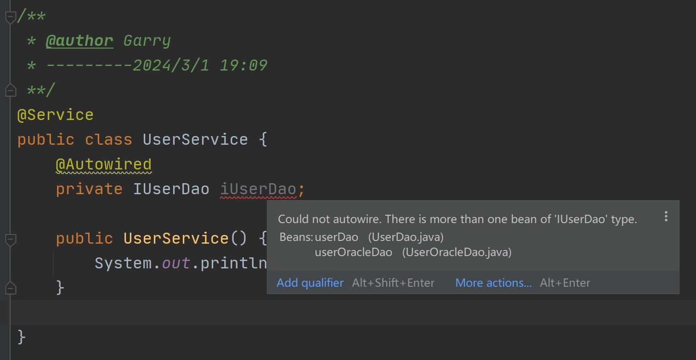

# Chapter1 IOC与Spring

## 1.IOC

==IOC=控制反转==

1. 是一种==设计理念==：将对象的创建权力由消费者转交给代理人

2. ==由代理人来创建和管理对象==，消费者通过代理人获取对象，类似于中介

3. 将对象加入IOC容器统一管理

---

==DI依赖注入==：

1. ==在运行时完成对象的创建和绑定工作==

2. ==DI在Java中的底层实现是反射==

---


## 2.Spring

==Spring 的核心是IOC容器和AOP面向切面编程==

原来的问题：代码写死，可扩展性和重复性太差

---


## 3.xml配置

==pom.xml引入：==

```xml
<dependency>
    <groupId>org.springframework</groupId>
    <artifactId>spring-context</artifactId>
    <version>5.2.6.RELEASE</version>
</dependency>
```

==applicationContext.xml：==

```xml
<?xml version="1.0" encoding="UTF-8"?>
<beans xmlns="http://www.springframework.org/schema/beans"
       xmlns:xsi="http://www.w3.org/2001/XMLSchema-instance"
       xsi:schemaLocation="http://www.springframework.org/schema/beans
		https://www.springframework.org/schema/beans/spring-beans.xsd">
</beans>
```

---


## 4.实例化对象

==初始化IOC容器：==（使用Springframwork 5.）

```java
ClassPathXmlApplicationContext context =
               new ClassPathXmlApplicationContext("classpath:applicationContext.xml");
```

==setter方法==实例化对象：

```xml
<bean id="sourApple" class="garry.pojo.Apple">
    <property name="title" value="青苹果"/>
    <property name="location" value="中亚"/>
    <property name="color" value="绿色"/>
</bean>
```

==有参构造器==实例化对象：

```xml
<bean id="sweetApple" class="garry.pojo.Apple">
    <constructor-arg name="title" value="红富士"/>
    <constructor-arg name="location" value="欧洲"/>
    <constructor-arg name="color" value="红色"/>
</bean>
```

==静态工厂==实例化对象：

```xml
<bean id="softApple" class="garry.factory.AppleStaticFactory"
          factory-method="createSoftApple"/>
```

==工厂实例==实例化对象：

```xml
<bean id="factoryInstance" class="garry.factory.AppleFactoryInstance"/>
<bean id="sourApple" factory-bean="factoryInstance"
      factory-method="createSourApple"/>
```

==name vs id==

1. 在==同一配置文件中都是唯一标识==

2. ==name在不同配置文件可以存在多个==，而id只能有一个

3. ==context可以同时加载多个configLocation==，如果多个配置文件中==存在相同name，则以后加载的为准==

4. 同时，==一个实例化对象可以设置多个name==，而id只能有一个

	```xml
	<bean name="lily,Lily" ...></bean>
	```

---


## 5.路径表达式

```java
ClassPathXmlApplicationContext context =
               new ClassPathXmlApplicationContext("classpath:applicationContext.xml");
```

中的==`classpath:applicationContext.xml`指的是target/classes目录下的`applicationContext.xml`==，而不是源文件resourses目录下的`applicationContext.xml`

==加载多个配置文件：==

```java
String[] configLocations = new String[]{"classpath:applicationContext.xml","classpath:applicationContext-1.xml"};
ApplicationContext context = newClassPathXmlApplicationContext(configLocations);
```


---


## 6.依赖注入

==依赖注入==是指运行时将容器内对象利用==反射==赋给其他对象的操作

比如UserService中需要用到UserDao，那么在ioc容器中实例化userService的过程中将ioc容器中的另一实例对象userDao用来初始化userServicw的过程就是依赖注入

```xml
<bean id="userService" class="garry.spring.ioc.service.UserService">
	<property name="userDao" ref="userDao"/>
</bean>
```

---


## 7.注入集合对象

==注入list集合的实现类是ArrayList==

```xml
<bean id="company" class="garry.spring.ioc.pojo.Company">
    <property name="rooms">
        <list>
            <value>301-项目经理办公室</value>
            <value>302-开发部门</value>
            <value>303-测试部门</value>
        </list>
    </property>
</bean>
```

==注入set集合的实现类是LinkedHashSet，保证插入顺序与取出顺序一致==

```xml
<bean id="company" class="garry.spring.ioc.pojo.Company">
    <property name="rooms">
        <set>
            <value>301-项目经理办公室</value>
            <value>302-开发部门</value>
            <value>303-测试部门</value>
        </set>
    </property>
</bean>
```

==注入map集合使用entry关键字，后跟key，value==

```xml
<property name="computers">
    <map>
        <entry key="项目经理" value-ref="computer"/>
        <entry key="开发部">
            <bean class="garry.spring.ioc.pojo.Computer">
                <constructor-arg name="brand" value="联想"/>
                <constructor-arg name="type" value="台式机"/>
                <constructor-arg name="order" value="888"/>
                <constructor-arg name="price" value="3000"/>
            </bean>
        </entry>
        <entry key="测试部">
            <bean class="garry.spring.ioc.pojo.Computer">
                <constructor-arg name="brand" value="联想"/>
                <constructor-arg name="type" value="台式机"/>
                <constructor-arg name="order" value="666"/>
                <constructor-arg name="price" value="3000"/>
            </bean>
        </entry>
    </map>
</property>
```

==注入properties集合使用props和prop，内容直接写中间==

```xml
<property name="info">
    <props>
        <prop key="phone">010-12345678</prop>
        <prop key="address">北京市xx区xxx大学</prop>
        <prop key="website">www.xxxedu.cn</prop>
    </props>
</property>
```

----


## 8.查看容器内对象

```java
String[] beanNames = context.getBeanDefinitionNames();
```

如果没有设置id的话，会打印出类的完整类路径名称，并在后面加上#0

---


## 9.bean scope


singleton：ioc容器初始化时创建（单例中有多例时，初始化时会创建一个多例的实例）

prototype：getBean时才创建

==singleton vs prototype==


---


## 10.对象生命周期

init_method（在属性赋值之后）

destroy_method

```java
context.registerShutdownHook();//销毁ioc容器中的实例对象，会在销毁前调用destroy_method
```

---


## 11.实现极简ioc容器

==创建一个ApplicationContext接口：==

```java
public interface ApplicationContext {
    public Object getBean(Bean beanId);
}
```

引入`dom4j `jar包 ：java的xml解释组件

引入 `jaxen `jar包：Xpath表达式解释器

```xml
<!--
		注意此处不要引入spring-context了，
        因为本工程就是模拟ioc(类名还专门取的和Spring ioc的一样)，
        你直接引入，编译器就会误认为用的是Spring的ClassPathXmlApplicationContext类
-->

<dependency>
    <groupId>org.dom4j</groupId>
    <artifactId>dom4j</artifactId>
    <version>2.1.1</version>
</dependency>

<dependency>
    <groupId>jaxen</groupId>
    <artifactId>jaxen</artifactId>
    <version>1.1.6</version>
</dependency>
```

创建`ClassPathXmlApplicationContext`类实现`ApplicationContext`接口

==ClassPathXmlApplicationContext类源码：==

```java
//创建ClassPathXmlApplicationContext实现ApplicationContext
public class ClassPathXmlApplicationContext implements ApplicationContext {
    //通过HashMap创建iocContainer
    private Map iocContainer = new HashMap();

    public ClassPathXmlApplicationContext() {
        try {
            //通过classes相对路径获得xml配置文件的绝对路径
            String filePath = this.getClass().getResource("/applicationContext.xml").getPath();
            //采用utf-8解码，避免文件绝对路径存在中文的情况
            filePath = URLDecoder.decode(filePath, "utf-8");
            //xml文件阅读器，org.dom4j.io.SAXReader
            SAXReader reader = new SAXReader();
            //通过绝对路径创建File，让SAXReader阅读他，获得一个Document文档对象
            Document document = reader.read(new File(filePath));
            //document.getRootElement()获取根节点，筛选bean标签，获得bean标签的Node集合
            List<Node> beans = document.getRootElement().selectNodes("bean");
            //遍历beans集合
            for (Node node : beans) {
                //Node --强转为--> Element，获得当前的bean标签
                Element bean = (Element) node;
                //Element.attributeValue("xxx")获取bean标签下的id和class属性
                String id = bean.attributeValue("id");
                String className = bean.attributeValue("class");//类名绝对路径
                //使用反射获取对象
                Class<?> cls = Class.forName(className);
                Object obj = cls.newInstance();
                //获取当前的bean内部的property标签集合
                List<Node> properties = bean.selectNodes("property");
                //遍历properties集合
                for (Node nodeProperty : properties) {
                    //Node --强转为--> Element，获得当前的property标签
                    Element property = (Element) nodeProperty;
                    //Element.attributeValue("xxx")获取property标签下的name和value属性
                    String name = property.attributeValue("name");
                    String value = property.attributeValue("value");
                    //将name的首字母改为大写
                    StringBuffer buffer = new StringBuffer(name);
                    buffer.setCharAt(0, (char) (buffer.charAt(0) + ('A' - 'a')));
                    name = new String(buffer);
                    //使用反射获取set(String)方法
                    Method setMethod = cls.getMethod("set" + name, String.class);
                    //Method.invoke(obj)调用set(String)方法
                    setMethod.invoke(obj, value);
                }
                //将创建的对象加入iocContainer
                iocContainer.put(id, obj);
            }
        } catch (Exception e) {
            e.printStackTrace();
        }
    }

    public Object getBean(String beanId) {
        return iocContainer.get(beanId);
    }
}
```

==在Application类中测试：==

```java
public class Application {
    public static void main(String[] args) throws NoSuchMethodException, InvocationTargetException, IllegalAccessException, IOException {
        //采用自己创建的ClassPathXmlApplicationContext加载xml配置文件
        ApplicationContext context = new ClassPathXmlApplicationContext();
        //读取properties文件
        Properties properties = new Properties();
        properties.load(new FileInputStream("D:\\杨宸楷\\学习\\java-learning\\4.ssm\\Spring\\Codes\\4.tinyioc\\src\\main\\java\\garry\\ioc\\ids.properties"));
        //通过Properties获取beanId和method
        String beanId = properties.getProperty("beanId");//sweetApple
        String methodName = properties.getProperty("method");//show
        //通过id获得sweetApple对象
        Object obj = context.getBean(beanId);
        //获取运行类型
        Class<?> cls = obj.getClass();
        //获取Method对象
        Method method = cls.getMethod(methodName);
        //Method.invoke调用相关方法
        method.invoke(obj);
    }
}
```

---


## 12.注解

### 四种注解组件


==applicationContext中需要重新配置：==

```xml
<?xml version="1.0" encoding="UTF-8"?>
<beans xmlns="http://www.springframework.org/schema/beans"
       xmlns:xsi="http://www.w3.org/2001/XMLSchema-instance"
       xmlns:context="http://www.springframework.org/schema/context"
       xsi:schemaLocation="http://www.springframework.org/schema/beans
      https://www.springframework.org/schema/beans/spring-beans.xsd
      http://www.springframework.org/schema/context
      https://www.springframework.org/schema/context/spring-context.xsd">
    
    <!--扫描garry包下的所有注解-->
    <context:component-scan base-package="garry"/>

</beans>
```

==默认id为类名首字母小写==，==都是单例的，在ioc容器初始化时进行创建==


### 对象注入注解


==@Autowired==

> ==在属性上加@Autowired，没有执行set方法==
>
> ==在set方法上加@Autowired，执行set方法==

原因分析：

> 如果在属性上加@Autowired，==Spring Ioc容器会自动通过反射技术将属性private修饰符自动改为public,直接进行赋值==
>
> 如果装配注解放在set方法上，则自动按类型/名称对set方法参数进行注入

Autowired缺陷：

> 
>
> Autowired按类型装配，当基于接口多态进行注入时，==如果有多个允许注入的类实现了IUserDao，那么编译器不知道应该注入哪一个==，因此会报错（解决对象创建主要实现对象@Primamry）
>
> ==不推荐使用按类型装配==

==@Resource==

@Resource设置name属性,则按name在IoC容器中将bean注入

@Resource未设置name属性

1. 以属性名作为bean name在IoC容器中匹配bean,如有匹配则注入
2. 按属性名未匹配,则按类型进行匹配,同@utowired,需加入@Primary解决类型冲突

==设置name属性：==

```java
@Resource(name = "userDao")
private IUserDao iUserDao;
```

==以属性名作为bean name：==

```java
@Resource
private IUserDao UserOracleDao;
```

小细节：==@Resource放在属性上，ioc容器在运行时会将private改为public直接对属性赋值==

​				@Resource放在set方法上，则会调用set方法

### 元数据注解


==@Scope：设置单例/多例==

```java
@Scope("prototype")
public class UserService {
```

==@PostConstruct==

```java
@PostConstruct
public void init() {
    System.out.println("UserService类初始化...");
}
```

==@Value==

```java
@Value("${metaData}")
private String metaData;

------------------------config.properties-----------------------
metaData=garry
```

其中，==需要在applicationContext.xml中增加：==

```xml
<!--加载配置文件-->
<context:property-placeholder location="config.properties"/>
```

---


## 13.Java Config

Java Config：使用Java类替代原始的xml文件


==使用Config类代替xml文件==

```java
@Configuration//当前类是一个配置类,用于替代applicationcontext.xml
public class Config {
    @Bean//Java config利用方法创建对象,将方法返回对象放入容器,beanId=方法名
    public UserDao userDao() {
        UserDao userDao = new UserDao();
        return userDao;
    }

    @Bean//Java config利用方法创建对象,将方法返回对象放入容器,beanId=方法名
    public UserService userService() {
        UserService userService = new UserService();
        return userService;
    }

    @Bean//Java config利用方法创建对象,将方法返回对象放入容器,beanId=方法名
    public UserController userController() {
        UserController userController = new UserController();
        return userController;
    }
}
```

==初始化ioc的方法：==

```java
ApplicationContext context = new AnnotationConfigApplicationContext(Config.class);
```

==对象依赖注入：==

```java
@Bean
public UserService userService(UserDao userDao) {//注入方式，参数中加上userDao
    //程序会检测到需要注入的就是上面创建的userDao
    UserService userService = new UserService();
    userService.setUserDao(userDao);
    return userService;
}

@Bean
public UserController userController(UserService userService) {
    UserController userController = new UserController();
    userController.setUserService(userService);
    return userController;
}
```

==好处：在编译阶段就可以发现问题！==

---


## 14.Spring和Junit4

再pom.xml中引入：

```xml
<dependency>
    <groupId>org.springframework</groupId>
    <artifactId>spring-context</artifactId>
    <version>5.2.6.RELEASE</version>
</dependency>

<dependency>
    <groupId>junit</groupId>
    <artifactId>junit</artifactId>
    <version>4.13</version>
    <scope>test</scope>
</dependency>
    
<!--主要是下面这个包！-->
<dependency>
    <groupId>org.springframework</groupId>
    <artifactId>spring-test</artifactId>
    <version>5.2.6.RELEASE</version>
</dependency>
```

==在测试用例类中加入@RunWith和@ContextConfiguration两个注解：==

```java
//将Junit4的执行权交由Spring Test,在测试用例执行前自动初始化IoC容器
@RunWith(SpringJUnit4ClassRunner.class)
//ioc初始化过程中，通知ioc要加载哪个配置文件
@ContextConfiguration(locations = {"classpath:applicationContext.xml"})
public class SpringTest {
    @Resource
    private UserService userService;

    @Test
    public void testUserService() {
        userService.createUser();
    }
}
```

---


# Chapter2 AOP面向切面编程

## 16.AOP

切面(Aspect)：类似于插件，在原有的业务模块中插入一些功能，不需要时又可以关闭它们

Spring AOP：Aspect Oriented Programming，面向切面编程

AOP的做法是==将通用、与业务无关的功能抽象封装为切面类==

切面可配置在目标方法的执行前、后运行，真正做到==即插即用==

==pom引入aspectjweaver依赖：==

```xml
<dependency>
    <groupId>org.aspectj</groupId>
    <artifactId>aspectjweaver</artifactId>
    <version>1.9.5</version>
</dependency>
```

==applicationContext.xml配置文件有所更改：==（增加带aop的URL）

```xml
<?xml version="1.0" encoding="UTF-8" ?>
<beans xmlns="http://www.springframework.org/schema/beans"
       xmlns:xsi="http://www.w3.org/2001/XMLSchema-instance"
       xmlns:p="http://www.springframework.org/schema/p"
       xmlns:aop="http://www.springframework.org/schema/aop"
       xsi:schemaLocation="http://www.springframework.org/schema/beans
         http://www.springframework.org/schema/beans/spring-beans-3.0.xsd
         http://www.springframework.org/schema/aop
  http://www.springframework.org/schema/aop/spring-aop.xsd ">

</beans>
<!--更全面的-->
<?xml version="1.0" encoding="UTF-8"?>
<beans xmlns:xsi="http://www.w3.org/2001/XMLSchema-instance"
       xmlns:context="http://www.springframework.org/schema/context"
       xmlns:aop="http://www.springframework.org/schema/aop"
       xmlns="http://www.springframework.org/schema/beans"
       xsi:schemaLocation="http://www.springframework.org/schema/beans
        http://www.springframework.org/schema/beans/spring-beans.xsd
        http://www.springframework.org/schema/context
        http://www.springframework.org/schema/context/spring-context.xsd
        http://www.springframework.org/schema/aop
        http://www.springframework.org/schema/aop/spring-aop.xsd">
```

==创建切面类：==

```java
/**
 * 切面类
 */
@SuppressWarnings({"all"})
public class MethodAspect {
    /**
     * 切面方法，打印执行时间
     * 切面方法必须要有JoinPoint连接点，获取目标类，目标方法的相关信息
     *
     * @param joinPoint
     */
    public void printExecutionTime(JoinPoint joinPoint) {
        SimpleDateFormat dateFormat = new SimpleDateFormat("yyyy-MM-dd:HH-mm-ss SSS");
        String now = dateFormat.format(new Date());

        //joinPoint获取执行的对象，对象的类，类的名称
        String className = joinPoint.getTarget().getClass().getName();
        //joinPoint获取对象的方法，方法的名称
        String methodName = joinPoint.getSignature().getName();
        System.out.println("----->" + now + ":" + className + "." + methodName);
    }
}
```

==applicationContext.xml中配置该切面类：==

```xml
<!--AOP配置-->
<bean id="methodAspect" class="garry.spring.aop.aspect.MethodAspect"/>
<aop:config>
    <!--pointcut切点，表示切面类的作用范围-->
    <!--此处表示public类型，任意返回类型，garry包下所有类所有方法任意参数的方法-->
    <aop:pointcut id="pointcut" expression="execution(public * garry..*.*(..))"/>
    <!--定义切面类-->
    <aop:aspect ref="methodAspect">
        <!--before通知，在目标方法运行前执行methodAspect.printExecutionTime-->
        <aop:before method="printExecutionTime" pointcut-ref="pointcut"/>
    </aop:aspect>
</aop:config>
```

---


## 17.对象与切点

==JoinPoint对象核心方法：==


==PointCut切点表达式：==

> 

将所有的xxxService类的所有方法作为切点

```xml
expression="execution(public * garry..*Service.*(..))"
```

---


## 18.五种通知类型


### 四种一般通知

==后置通知：==

```xml
<!--after通知，在目标方法运行后调用-->
<aop:after method="doAfter" pointcut-ref="pointcut"/>
```

==返回后通知：==

```java
/**
 * 返回后通知
 *
 * @param joinPoint
 * @param obj
 */
public void doAfterReturn(JoinPoint joinPoint, Object ret) {
    System.out.println("<-----返回后通知:" + ret);
}
```

==xml配置：==

```xml
<!--after-returning通知，在目标方法运行后调用，且将返回结果注入到returning="ret"中-->
<aop:after-returning method="doAfterReturn" pointcut-ref="pointcut" returning="ret"/>
```

小细节：==后置通知和返回后通知的执行顺序是由在xml文件配置的先后顺序决定的==

==异常通知：==

```java
/**
 * 异常通知
 *
 * @param joinPoint
 * @param th
 */
private void doAfterException(JoinPoint joinPoint, Throwable th) {
    System.out.println("<-----异常通知:" + th.getMessage());
}
```

==xml配置：==

```xml
<!--after-throwing通知，异常后调用，且将异常结果注入到throwing="th"中-->
<aop:after-throwing method="doAfterException" pointcut-ref="pointcut" throwing="th"/>
```

### 环绕通知

==四合一，全都能干，并且实现通知的"数据共享"==

```java
/**
 * ProceedingJoinPoint在保留JoinPoint原有功能的前提下，还能控制方法是否执行
 * 找出执行时间超过一秒的方法
 *
 * @param proceedingJoinPoint
 * @return
 */
public Object check(ProceedingJoinPoint proceedingJoinPoint) throws Throwable {
    try {
        long startTime = new Date().getTime();//前置通知
        //控制目标方法是否执行，不写这句话，目标方法不会执行！
        Object ret = proceedingJoinPoint.proceed();
        long endTime = new Date().getTime();//后置通知
        long duration = endTime - startTime;
        //调用时间超过1秒
        if (duration > 1000) {
            SimpleDateFormat dateFormat = new SimpleDateFormat("[yyyy-MM-dd HH:mm:ss.SSS]");
            String now = dateFormat.format(new Date());

            String className = proceedingJoinPoint.getTarget().getClass().getName();
            String methodName = proceedingJoinPoint.getSignature().getName();
            System.out.println("<-----" + now + ":" + className + "." + methodName + "(" + duration + ")");
        }
        return ret;//返回后通知
    } catch (Throwable throwable) {//异常通知
        System.out.println("<-----Exception Message:" + throwable.getMessage());
        throw throwable;
    }
}
```

==xml配置：==

```xml
<!--环绕通知配置-->
<!--ioc中加入MethodChecker实例-->
<bean id="methodChecker" class="garry.spring.aop.aspect.MethodChecker"/>
<aop:config>
    <!--切点集-->
    <aop:pointcut id="pointcut" expression="execution(public * garry..*.*(..))"/>
    <!--切面-->
    <aop:aspect ref="methodChecker">
        <aop:around method="check" pointcut-ref="pointcut"/>
    </aop:aspect>
</aop:config>
```

---


## 19.注解开发Spring AOP

==xml配置：==

```xml
<!--扫描garry包下所有注解-->
<context:component-scan base-package="garry"/>

<!--启用Spring AOP的注解模式-->
<aop:aspectj-autoproxy/>
```

==切面类和环绕通知方法的注解配置：==

```java
@Component//标记当前类为组件
@Aspect//这是一个切面类
public class MethodChecker {
    //环绕通知，参数为切点表达式
    @Around("execution(public * garry..*.*(..))")
    public Object check(ProceedingJoinPoint proceedingJoinPoint) throws Throwable {
        //details...
    }
}
```

测试方法和Spring Junit4中一致

---


## 20.AOP底层原理

==Spring AOP基于代理模式实现功能动态扩展==,包含两种形式：

1. ==目标类拥有接口,通过 JDK动态代理实现功能扩展==
2. ==目标类没有接口,通过CGLib组件实现功能扩展==

### 代理模式与静态代理

> 

代理类：

```java
public class UserServiceProxy implements UserService {
    //持有委托类的对象
    private UserService userService;

    public UserServiceProxy(UserService userService) {
        this.userService = userService;
    }

    public void createUser() {
        //在委托类的基础上，对代理类进行扩展
        System.out.println("=========" + new SimpleDateFormat("[yyyy-MM-dd HH:mm:ss.SSS]").format(new Date()) + "=========");

        //持有委托类对象，可以调用委托类的方法
        userService.createUser();
    }
}
```

代理模式优点：==易于业务扩展，B代理类可以代理A代理类，在A代理类的基础上再扩展额外的功能==

```java
UserService userServiceProxy = 
    new UserServiceProxyAfter(new UserServiceProxy(new UserServiceImpl()));
userServiceProxy.createUser();

output:
=========[2024-03-02 17:45:34.608]=========
创建用户...
=============后置扩展=============
```

静态代理的==缺点：每个业务类至少要一个代理类，代码臃肿==

### JDK动态代理

创建一个==动态代理类ProxyInvocationHandler，实现InvocationHandler接口==

==重写InvocationHandler接口的invoke方法，拓展其功能==

```java
/**
 * InvocationHandler是JDK提供的反射类,用于在IDK动态代理中对目标力法进行增强
 * InvocationHandler实现类与切面类的环绕通知类似
 */
@SuppressWarnings({"all"})
public class ProxyInvocationHandler implements InvocationHandler {
    private Object target;//目标对象

    public ProxyInvocationHandler(Object target) {
        this.target = target;
    }

    /**
     * 在invoke()方法对目标方法进行增强
     *
     * @param proxy  代理类对象
     * @param method 目标方法对象
     * @param args   目标方法对象的参数
     * @return 目标方法运行后返回值
     * @throws Throwable 目标方法抛出的异常
     */
    public Object invoke(Object proxy, Method method, Object[] args) throws Throwable {
        //加上打印方法调用时间的功能
        System.out.println("=========" + 
			new SimpleDateFormat("[yyyy-MM-dd HH:mm:ss.SSS]").format(new Date())
				+ "=========");
        //ProceedingJoinPoint.proceeding的本质
        Object ret = method.invoke(target, args);
        return ret;
    }
}
```

==动态代理局限性：代理的类必须实现接口==才可以，没有实现接口的类必然会报错

```java
public static void main(String[] args) {
    UserService userService = new UserServiceImpl();
    ProxyInvocationHandler invocationHandler =
            new ProxyInvocationHandler(userService);

    //动态创建Proxy代理类
    UserService proxyUserServiceInstance = (UserService) Proxy.newProxyInstance
            (userService.getClass().getClassLoader(),//类加载器
                    userService.getClass().getInterfaces(),//实现的接口
                    invocationHandler);//反射类
    proxyUserServiceInstance.createUser();

    //同理代理EmploeeService的EmploeeServiceImpl实现类
    EmployeeService employeeService = new EmployeeServiceImpl();//创建实例对象
EmployeeService proxyEmployeeServiceInstance = (EmployeeService)Proxy.newProxyInstance
            (employeeService.getClass().getClassLoader(),
                    employeeService.getClass().getInterfaces(),
                    new ProxyInvocationHandler(employeeService));
    proxyEmployeeServiceInstance.createEmployee();
}
```

==Proxy.newProxyInstance的执行过程：==

> 1. 在本地硬盘上创建一个字节码文件
>
> 	
>
> 2. 调用==ProxyGenerator.generateProxyClass==，伪代码如下
>
> 	==里面的targetObject就是传入的ProxyInvocationHandler中的targey对象==
>
> 	
>
> 3. 通过==传入的类加载器，将创建的Proxy0类（代理类）加载到 JVM的堆中==

### CGLib组件

==Spring解决动态代理对象必须实现接口的局限的方法：CGLib组件==

如果==类没有实现接口，就会创建一个目标类的子类，增强目标类对应的方法==


==上面红框中的就是Spring AOP基于CGLib组件，为没有实现接口的userService类创建的子类**`UserSerivice$$EnhancerBySpringCGLIB`**==；而如果实现子类的话，其类型就是Proxy$(num)

---


# Chapter3 JDBC与事务

## 21.Spring JDBC

### 配置

==pom.xml引入：==

```xml
<dependency>
    <groupId>org.springframework</groupId>
    <artifactId>spring-jdbc</artifactId>
    <version>5.2.6.RELEASE</version>
</dependency>
```

==applicationContext.xml中配置：==

```xml
<!--数据源设置-->
<bean id="dataSource" class="org.springframework.jdbc.datasource.DriverManagerDataSource">
    <property name="driverClassName" value="com.mysql.jdbc.Driver"/>
    <property name="url" 
              value="jdbc:mysql:///garry?useSSL=false&amp;useUnicode=true&amp;characterEncoding=UTF-8&amp;serverTimezone=Asia/Shanghai&amp;allowPublicKeyRetrieval=true"/>
    <property name="username" value="root"/>
    <property name="password" value="1234"/>
</bean>

<!--jdbcTemplate提供数据CRUD的api-->
<bean id="jdbcTemplate" class="org.springframework.jdbc.core.JdbcTemplate">
    <property name="dataSource" ref="dataSource"/>
</bean>
```

==Dao中使用sql语句：==

```java
public class EmployeeDao {
    private JdbcTemplate jdbcTemplate;

    public Employee findById(Integer eno) {
        String sql = "select * from employee where eno = ?";
        Employee employee = jdbcTemplate.queryForObject(sql, new Object[]{eno},
                new BeanPropertyRowMapper<Employee>(Employee.class));
        //BeanPropertyRowMapper通过驼峰命名法将数据库记录转化为Employee实体记录
        //类似于Mybatis中的returnType
        return employee;
    }

    public JdbcTemplate getJdbcTemplate() {
        return jdbcTemplate;
    }

    public void setJdbcTemplate(JdbcTemplate jdbcTemplate) {
        this.jdbcTemplate = jdbcTemplate;
    }
}
```

==Dao在applicationContext.xml中的配置：==

```xml
<!--Dao的配置-->
<bean id="employeeDao" class="garry.spring.jdbc.dao.EmployeeDao">
    <!--为Dao注入jdbcTemplate对象，这里的jdbcTemplate就是上面配置的jdbcTemplate-->
    <property name="jdbcTemplate" ref="jdbcTemplate"/>
</bean>
```

### JdbcTemplate数据查询方法

```java
public Employee findById(Integer eno) {
    String sql = "select * from employee where eno = ?";
    //queryForObject查询单条数据
    //(sql语句，参数数组，负责字段属性转换的BeanPropertyRowMapper对象)
    Employee employee = jdbcTemplate.queryForObject(sql, new Object[]{eno},
            new BeanPropertyRowMapper<Employee>(Employee.class));
    return employee;
}

public List<Employee> findByDame(String dname) {
    String sql = "select * from employee where dname = ?";
    //query查询复合数据
    List<Employee> list = jdbcTemplate.query(sql, new Object[]{dname},
            new BeanPropertyRowMapper<Employee>(Employee.class));
    return list;
}

public List findMapByDame(String dname) {
    String sql = "select eno as 员工编号, ename as 员工姓名,  salary as 员工工资 from employee where dname = ?";
    //区别，queryForList没有第三个参数，直接以别名->对象形式储存到Map中
    List<Map<String, Object>> maps = 
        jdbcTemplate.queryForList(sql, new Object[]{dname});
    return maps;
}
/*
[{员工编号=3308, 员工姓名=张三, 员工工资=6000.00}, {员工编号=3420, 员工姓名=李四, 员工工资=8700.00}]
*/
```

### JdbcTemplate数据写入方法

```java
    /**
     * 插入
     *
     * @param employee
     */
    public void insert(Employee employee) {
        String sql = "insert into employee(eno,ename,salary,dname,hiredate) values(?,?,?,?,?)";

        jdbcTemplate.update(sql, new Object[]{
                employee.getEno(),
                employee.getEname(),
                employee.getSalary(),
                employee.getDname(),
                employee.getHiredate()
        });
        //不用手动提交事务
    }

    /**
     * 更新
     *
     * @param employee
     * @return
     */
    public int update(Employee employee) {
        String sql = "update employee set ename = ?,salary = ?,dname = ?,hiredate = ? where eno = ?";

        int count = jdbcTemplate.update(sql, new Object[]{
                employee.getEname(),
                employee.getSalary(),
                employee.getDname(),
                employee.getHiredate(),
                employee.getEno(),
        });
        //不用手动提交事务
        return count;
    }

    /**
     * 删除
     *
     * @param eno
     * @return
     */
    public int delete(int eno) {
        String sql = "delete from employee where eno = ?";
        int count = jdbcTemplate.update(sql, new Object[]{eno});
        return count;
    }
```

---


## 22.编程式事务

编程式事务：是指通过==代码手动提交回滚事务==的事务控制方法

SpringJDBC通过==TransactionManager事务管理器==实现事务控制

事务管理器提供==commit/rolback==方法进行事务提交与回滚

==applicationContext.xml配置：==

```xml
<!--事务管理器-->
<bean id="transactionManager" class="org.springframework.jdbc.datasource.DataSourceTransactionManager">
    <property name="dataSource" ref="dataSource"/>
</bean>
```

==将DataSourceTransactionManager注入到需要进行事务管理的类==

```xml
<!--Service的配置-->
<bean id="employeeService" class="garry.spring.jdbc.service.EmployeeService">
    <property name="employeeDao" ref="employeeDao"/>
    <property name="transactionManager" ref="transactionManager"/>
</bean>
```

==编程式事务的操作步骤：==

```java
public class EmployeeService {
    private EmployeeDao employeeDao;
    private DataSourceTransactionManager transactionManager;

    public void batchImport() {
        //定义了事务默认的标准配置
        TransactionDefinition definition = new DefaultTransactionDefinition();
        //开始一个事务，返回事务状态，说明当前事务的执行阶段
        TransactionStatus status = transactionManager.getTransaction(definition);

        try {
            for (int i = 0; i < 10; i++) {
                if (i == 3) throw new RuntimeException("意料之外的错误...");
                Employee employee = new Employee();
                employee.setEno(8000 + i);
                employee.setEname("员工" + i);
                employee.setSalary(5000);
                employee.setDname("市场部");
                employee.setHiredate(new Date());
                employeeDao.insert(employee);
            }

            //提交事务
            transactionManager.commit(status);
        } catch (Exception e) {
            //回滚事务
            transactionManager.rollback(status);
            try {
                throw e;
            } catch (Exception exception) {
                exception.printStackTrace();
            }
        }
    }

    public EmployeeDao getEmployeeDao() {
        return employeeDao;
    }

    public void setEmployeeDao(EmployeeDao employeeDao) {
        this.employeeDao = employeeDao;
    }

    public DataSourceTransactionManager getTransactionManager() {
        return transactionManager;
    }

    public void setTransactionManager(DataSourceTransactionManager transactionManager) {
        this.transactionManager = transactionManager;
    }
}
```

---


## 23.声明式事务

声明式事务：指在不修改源码情况下通过配置形式自动实现事务控制

==声明式事务本质就是AOP环绕通知==

当目标方法执行成功时,自动提交事务

当==目标方法抛出运行时异常时,自动事务回滚==

==applicationContext.xml中配置：==

==beans中加入三行：==

> `xmlns:tx="http://www.springframework.org/schema/tx"`
>
> `http://www.springframework.org/schema/tx`
>
> `https://www.springframework.org/schema/tx/spring-tx.xsd`

```xml
<?xml version="1.0" encoding="UTF-8"?>
<beans xmlns:xsi="http://www.w3.org/2001/XMLSchema-instance"
       xmlns="http://www.springframework.org/schema/beans"
       xmlns:context="http://www.springframework.org/schema/context"
       xmlns:aop="http://www.springframework.org/schema/aop"
       xmlns:tx="http://www.springframework.org/schema/tx"
       xsi:schemaLocation="http://www.springframework.org/schema/beans
        https://www.springframework.org/schema/beans/spring-beans.xsd
        http://www.springframework.org/schema/context
        https://www.springframework.org/schema/context/spring-context.xsd
        http://www.springframework.org/schema/aop
        https://www.springframework.org/schema/aop/spring-aop.xsd
        http://www.springframework.org/schema/tx
        https://www.springframework.org/schema/tx/spring-tx.xsd">
```

==事务通知配置：==

```xml
<!--事务管理器-->
<bean id="transactionManager" class="org.springframework.jdbc.datasource.DataSourceTransactionManager">
    <property name="dataSource" ref="dataSource"/>
</bean>

<!--事务通知配置，哪些方法使用事务，哪些不使用-->
<tx:advice id="txAdvice" transaction-manager="transactionManager">
    <tx:attributes>
        <!--当目标方法名为batchImport，启用声明式事务-->
        <tx:method name="batchImport" propagation="REQUIRED"/>
        <!--可以使用通配符-->
        <tx:method name="batch*" propagation="REQUIRED"/>
        <!--设置所有find开头的方法不使用事务-->
        <tx:method name="find*" propagation="NOT_SUPPORTED" read-only="true"/>
    </tx:attributes>
</tx:advice>

<!--定义声明式事务的作用范围-->
<aop:config>
    <aop:pointcut id="pointcut" expression="execution(* garry..service..*.*(..))"/>
    <aop:advisor advice-ref="txAdvice" pointcut-ref="pointcut"/>
</aop:config>
```

REQUIRED的小细节：

==如果一个REQUIRED方法的外层已经存在事务，则不会创建新的事务，而是把该方法加入到外层的事务中==

==让内部方法单独开一个事务==：使用==propagation="REQUIRED_NEW"==修饰该方法

> 
>
> 补充了解一下事务传播的其中类型：
>
> 

---


## 24.注解形式声明式事务

==applicationContext.xml配置：==

```xml
<!--扫描garry包-->
<context:component-scan base-package="garry"/>

<!--数据源-->
<bean id="dateSource" class="org.springframework.jdbc.datasource.DriverManagerDataSource">
    <property name="driverClassName" value="com.mysql.jdbc.Driver"/>
    <property name="url"
              value="jdbc:mysql:///garry?useSSL=false&amp;useUnicode=true&amp;characterEncoding=UTF-8&amp;serverTimezone=Asia/Shanghai&amp;allowPublicKeyRetrieval=true"/>
    <property name="username" value="root"/>
    <property name="password" value="1234"/>
</bean>

<!--jdbcTemplate提供数据CRUD的api-->
<bean id="jdbcTemplate" class="org.springframework.jdbc.core.JdbcTemplate">
    <property name="dataSource" ref="dateSource"/>
</bean>

<!--事务管理器-->
<bean id="transactionManager" class="org.springframework.jdbc.datasource.DataSourceTransactionManager">
    <property name="dataSource" ref="dateSource"/>
</bean>

<!--启用注解形式声明式事务-->
<tx:annotation-driven transaction-manager="transactionManager"/>
```

==EmployeeService类上只需加上@Transactional==

就将==声明式事务配置应用于当前类所有方法,默认事务传播为 REQUIRED==

也可以==手动设置类里面的方法的事务传播类型==：

如**`@Transactional(propagation = Propagation.NOT_SUPPORTED, readOnly = true)
    public Employee findById(int eno) {...}`**

```java
@Service
/**
 * 声明式事务核心注解
 * 放在类上,将声明式事务配置应用于当前类所有方法,默认事务传播为 REQUIRED
 */
@Transactional(propagation = Propagation.REQUIRED)
public class EmployeeService {
    @Resource
    private EmployeeDao employeeDao;

    @Transactional(propagation = Propagation.NOT_SUPPORTED, readOnly = true)
    public Employee findById(int eno) {
        Employee employee = employeeDao.findById(eno);
        return employee;
    }

    public void batchImport() {
        for (int i = 0; i < 10; i++) {
            if (i == 3) throw new RuntimeException("意料之外的异常...");
            Employee employee = new Employee();
            employee.setEno(8000 + i);
            employee.setEname("员工" + i);
            employee.setSalary(5000);
            employee.setDname("市场部");
            employee.setHiredate(new Date());
            employeeDao.insert(employee);
        }
    }

    public EmployeeDao getEmployeeDao() {
        return employeeDao;
    }

    public void setEmployeeDao(EmployeeDao employeeDao) {
        this.employeeDao = employeeDao;
    }
}
```

---


# Spring完结，移步至SpringMVC
