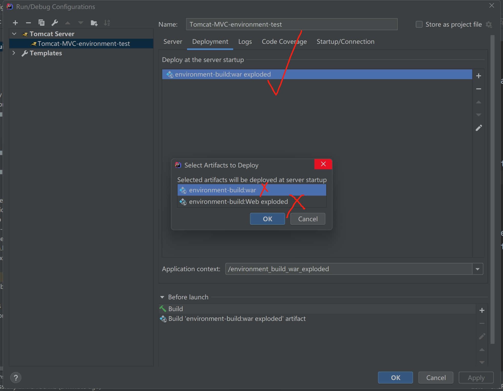

# Chapter1 SpringMVC介绍

## 1.MVC

==View: 视图==

==Model: 模型==，实现诸多业务逻辑的模型

==Controller: 控制器==，接收视图传来的数据（处理请求），调用模型中的方法实现业务功能（产生响应）

SpringMVC可以==简化JavaEE中的servlet==

---


## 2.Maven中web项目配置

> 
>
> ==热部署：==
>
> 
>
> ==***注意一定要选择打勾的，否则重新运行 tomcat所有改动都不生效！！！！！！！！***==
>
> 

## 3.MVC配置

### ==pom.xml依赖spring-webmvc==

```xml
<dependency>
    <groupId>org.springframework</groupId>
    <artifactId>spring-webmvc</artifactId>
    <version>5.1.9.RELEASE</version>
</dependency>
```

### ==web.xml配置DispatcherServlet==

```xml
<!--DispatchServlet-->
<servlet>
    <servlet-name>springmvc</servlet-name>
    <!--
            DispatcherServlet是Spring Mc最核心的对象
            DispatcherServlet用于拦截Http请求，
            并根据请求的UR调用与之对应的controller方法,来完成Http请求的处理
        -->
    <servlet-class>org.springframework.web.servlet.DispatcherServlet</servlet-class>
    <!--applicationContext.xml-->
    <init-param>
        <param-name>contextConfigLocation</param-name>
        <param-value>classpath:applicationContext.xml</param-value>
    </init-param>
    <!--
            在web应用启动时自动创建spring ioc容器，
            并初始化DispatcherServlet
            没有这句话也行，只不过是在第一次访问URL式创建ioc
        -->
    <load-on-startup>0</load-on-startup>
</servlet>

<servlet-mapping>
    <servlet-name>springmvc</servlet-name>
    <!--/，默认拦截所有请求-->
    <url-pattern>/</url-pattern>
</servlet-mapping>
```

### ==applicationContext.xml配置mvc标记==

```xml
<?xml version="1.0" encoding="UTF-8"?>
<beans xmlns="http://www.springframework.org/schema/beans"
       xmlns:mvc="http://www.springframework.org/schema/mvc"
       xmlns:context="http://www.springframework.org/schema/context"
       xmlns:xsi="http://www.w3.org/2001/XMLSchema-instance" xmlns:mv="http://www.springframework.org/schema/mvc"
       xsi:schemaLocation="http://www.springframework.org/schema/beans
            http://www.springframework.org/schema/beans/spring-beans.xsd
            http://www.springframework.org/schema/context
            http://www.springframework.org/schema/context/spring-context.xsd
            http://www.springframework.org/schema/mvc
            http://www.springframework.org/schema/mvc/spring-mvc.xsd">

    <!--扫描garry.springmvc包下的所有注解-->
    <context:component-scan base-package="garry.springmvc"/>
    <!--启用mvc的注解开发模式-->
    <mvc:annotation-driven/>
    <!--将图片/jsp/js等静态资源排除在外-->
    <mvc:default-servlet-handler/>
</beans>
```

### ==注解开发Controller控制器==

```java
@Controller
public class TestController {
    @GetMapping("/test")//类似于@Servlet("/xxxServlet")
    @ResponseBody//直接向响应输出字符串数据，不跳转页面
    public String test() {
        return "SUCCESS";
    }
}
```

==tomcat中配置==


==热部署：==


==原理图：==


---


## 4.URL Mapping注解

1. ==@RequestMapping-通用绑定==，写在类上面，作为全局设置
2. ==@GetMapping==-绑定Get请求
3. ==@PostMapping==-绑定Post请求

```java
@Controller
@RequestMapping("/um")//写在类上面，作为全局设置
public class URLMappingController {
    @GetMapping("/g")
    @ResponseBody//直接向响应输出字符串数据，不跳转页面
    public String getMapping() {
        return "get";
    }

    @PostMapping("/p")
    @ResponseBody//直接向响应输出字符串数据，不跳转页面
    public String postMapping() {
        return "post";
    }
}
```

---


## 5.请求接收参数

### 方法参数接收请求参数

==注意和表单中的name一样==，因为是键值对映射

```java
@PostMapping("/p")
@ResponseBody
//和表单中的name一样
public String postMapping(String username, String password) {
    return username + "\t" + password;
}
```

==传来参数和接收参数格式不一样，则使用@RequestParam注解==进行==动态注入==

```java
@GetMapping("/g")
@ResponseBody
//传来的是user_name，将接收的数据动态注入到参数userName中
public String getMapping(@RequestParam("user_name") String userName) {
    return userName;
}
```

### 实体对象接收参数

类似于Mybatis中的returnType

注意表单名字和实体属性名要一样

```java
@PostMapping("/pm")
@ResponseBody
public String postMapping1(User user) {
    return user.toString();
}
```

---


## 6.接收表单复合数据

```java
@Controller
public class FormController {
    @RequestMapping(value = "/apply")
    @ResponseBody
    public String apply(@RequestParam(value = "userName", defaultValue = "defaultValue")String name, String course, @RequestParam List<Integer> purpose) {
        System.out.println(name);//表单中不存在userName，因此参数name为默认值defaultValue
        System.out.println(course);
        for (Integer value : purpose) {//复合参数用数组或集合的方式接收
            System.out.println(value);
        }
        return "SUCCEED";
    }
}
```

1. ==可以使用@RequestParam注解为参数设置默认值==

2. ==注意：使用集合接收时必须在参数前面加上@RequestParam注解==，否则无法识别List集合

==可以通过实体来接收==

```java
@RequestMapping(value = "/apply")
@ResponseBody
public String apply(Form form) {
    System.out.println(form);
    return "SUCCEED";
}

Form{name='zhangsan', course='java', purpose=[1, 2]}
```

==细节：如果使用Map做参数，那么接收复合数据时只会接收第一个，后面的都会丢失==

---


## 7.关联对象赋值

==涉及关联对象赋值时，需要将关联对象的对象名放入表单作为前缀==


---


## 8.日期类型转换

1. ==参数列表==中用==(@DateTimeFormat(pattern = "yyyy-MM-dd") Date createTime)==

2. ==实体对象==中用==@DateTimeFormat(pattern = "yyyy-MM-dd")==

	```java
	@DateTimeFormat(pattern = "yyyy-MM-dd")
	private Date createTime;
	```

3. ==定义全局转换类==

	```java
	public class MyDateConverter implements Converter<String, Date> {
	    public Date convert(String s) {
	        try {
	            return new SimpleDateFormat("yyyy-MM-dd").parse(s);
	        } catch (ParseException e) {
	            System.out.println("===========日期转换失败===========");
	            throw new RuntimeException("日期转换失败");
	        }
	
	    }
	}
	```

	然后还要==在applicationContext.xml中配置：==

	```xml
	<bean id="conversionService" class="org.springframework.format.support.FormattingConversionServiceFactoryBean">
	    <property name="converters">
	        <set>
	            <bean class="garry.springmvc.converter.MyDateConverter"/>
	        </set>
	    </property>
	</bean>
	
	<!--还必须在annotation-driven注解开发中添加conversion-service的信息-->
	<mvc:annotation-driven conversion-service="conversionService"/>
	```

总结：==@DateTimeFormat和全局转换器类都有，那么优先使用全局转换器==

---


## 9.中文乱码问题

### Get请求乱码

==server.xml增加URIEncoding属性==


### Post请求乱码

==web.xml配置CharacterEncodingFilter==

```xml
<!--过滤器，写死了-->
<filter>
    <filter-name>characterFilter</filter-name>
    <filter-class>org.springframework.web.filter.CharacterEncodingFilter</filter-class>
    <init-param>
        <param-name>encoding</param-name>
        <param-value>UTF-8</param-value>
    </init-param>
</filter>

<!--/*代表过滤所有请求-->
<filter-mapping>
    <filter-name>characterFilter</filter-name>
    <url-pattern>/*</url-pattern>
</filter-mapping>
```

### Response请求乱码

==applicationContext.xml配置StringHttpMessageConverter==

```xml
<mvc:annotation-driven conversion-service="conversionService">
    <mvc:message-converters>
        <bean class="org.springframework.http.converter.StringHttpMessageConverter">
            <property name="supportedMediaTypes">
                <list>
           <!--就是Servlet中的response.setContentType("text/html;charset=utf-8");-->
                    <value>text/html;charset=utf-8</value>
                </list>
            </property>
        </bean>
    </mvc:message-converters>
</mvc:annotation-driven>
```

---


## 10.响应输出结果

==ModelAndView类，类似/于Servlet中的Request，可以以键值对的形式将对象存入mav对象==，以便前端使用

```java
@GetMapping("/view")
public ModelAndView showView(Integer userId) {//必须返回ModelAndView对象
    ModelAndView mav = new ModelAndView("/view.jsp");//与视图进行绑定
    User user = new User();
    if (1 == userId) {
        user.setUsername("zhangsan");
    } else if (2 == userId) {
        user.setUsername("lisi");
    }
    //类似于request.setAttribute("user", user)，jsp页面用EL表达式接收user对象
    mav.addObject("user", user);//以键值对的形式将对象存入mav对象
    return mav;
}

http://localhost:8080/environment-build/um/view?userId=1  //Get方法
```

---


## 11.ModelAndView对象核心用法

1. `mav.addObject()`方法设置的属性==默认存放在当前请求中==

2. ==默认==ModelAndView==使用请求转发(forward)至页面==

	> 正是因为默认请求转发，前后端共有一个请求，==因此才能将数据存入请求==，让前端页面接收

3. ==使用redirect进行重定向==，`new ModelAndView("redirect:/index.jsp")`

4. ==前面没有写/，就是相对路径==

	> ==使用相对路径需要在webapp中创建RequestMapping value相同的文件夹，里面放你相对路径的文件==

```java
@GetMapping("/view")
public ModelAndView showView(Integer userId) {
    ModelAndView mav = new ModelAndView("redirect:/view.jsp");
    mav.setViewName("view.jsp");//相对路径，当前RequestMapping中为/um
    //因此如果需要使用相对路径，需要在webapp中创建一个um目录，里面有一个view.jsp
    User user = new User();
    if (1 == userId) {
        user.setUsername("zhangsan");
    } else if (2 == userId) {
        user.setUsername("lisi");
    }
    mav.addObject("user", user);
    return mav;
}
```

==ModelMap和view取代ModelAndView对象的方法：==

1. 方法被@ResponseBody描述，SpringMVC直接响应string字符串本身
2. 方法==不存在@ResponseBody==，则SpringMVC==处理string指代的视图(页面)==

```java
public String showView1(Integer userId, ModelMap modelMap) {
    String view = "/um/view.jsp";//view里放访问路径
    User user = new User();
    if (1 == userId) {
        user.setUsername("zhangsan");
    } else if (2 == userId) {
        user.setUsername("lisi");
    }
    modelMap.addAttribute("user", user);//ModelMap中加入键值对
    return view;
}
```

---


## 12.SpringMVC和FreeMarker的整合

前面JavaWeb没学FreeMarker，过

电商项目支付页面已经用到了

---


# Chapter2 RESTful应用

## 13.环境配置

==pom.xml==

```xml
<?xml version="1.0" encoding="UTF-8"?>
<project xmlns="http://maven.apache.org/POM/4.0.0"
         xmlns:xsi="http://www.w3.org/2001/XMLSchema-instance"
         xsi:schemaLocation="http://maven.apache.org/POM/4.0.0 http://maven.apache.org/xsd/maven-4.0.0.xsd">
    <modelVersion>4.0.0</modelVersion>

    <groupId>org.example</groupId>
    <artifactId>RESTful</artifactId>
    <version>1.0-SNAPSHOT</version>

    <packaging>war</packaging>

    <dependencies>
        <dependency>
            <groupId>org.springframework</groupId>
            <artifactId>spring-webmvc</artifactId>
            <version>5.1.9.RELEASE</version>
        </dependency>
    </dependencies>

    <build>
        <plugins>
            <plugin>
                <groupId>org.apache.tomcat.maven</groupId>
                <artifactId>tomcat7-maven-plugin</artifactId>
                <version>2.2</version>
            </plugin>
        </plugins>
    </build>

</project>
```

==web.xml==

```xml
<?xml version="1.0" encoding="UTF-8"?>
<web-app xmlns="http://xmlns.jcp.org/xml/ns/javaee"
         xmlns:xsi="http://www.w3.org/2001/XMLSchema-instance"
         xsi:schemaLocation="http://xmlns.jcp.org/xml/ns/javaee http://xmlns.jcp.org/xml/ns/javaee/web-app_4_0.xsd"
         version="4.0">

    <!--DispatchServlet-->
    <servlet>
        <servlet-name>springmvc</servlet-name>
        <!--
                DispatcherServlet是Spring Mc最核心的对象
                DispatcherServlet用于拦截Http请求，
                并根据请求的UR调用与之对应的controller方法,来完成Http请求的处理
            -->
        <servlet-class>org.springframework.web.servlet.DispatcherServlet</servlet-class>
        <!--applicationContext.xml-->
        <init-param>
            <param-name>contextConfigLocation</param-name>
            <param-value>classpath:applicationContext.xml</param-value>
        </init-param>
        <!--
                在web应用启动时自动创建spring ioc容器，
                并初始化DispatcherServlet
                没有这句话也行，只不过是在第一次访问URL式创建ioc
            -->
        <load-on-startup>0</load-on-startup>
    </servlet>

    <servlet-mapping>
        <servlet-name>springmvc</servlet-name>
        <!--/，默认拦截所有请求-->
        <url-pattern>/</url-pattern>
    </servlet-mapping>

    <!--过滤器，写死了-->
    <filter>
        <filter-name>characterFilter</filter-name>
        <filter-class>org.springframework.web.filter.CharacterEncodingFilter</filter-class>
        <init-param>
            <param-name>encoding</param-name>
            <param-value>UTF-8</param-value>
        </init-param>
    </filter>

    <!--/*代表过滤所有请求-->
    <filter-mapping>
        <filter-name>characterFilter</filter-name>
        <url-pattern>/*</url-pattern>
    </filter-mapping>
</web-app>
```

==applicationContext.xml==

```xml
<?xml version="1.0" encoding="UTF-8"?>
<beans xmlns="http://www.springframework.org/schema/beans"
       xmlns:mvc="http://www.springframework.org/schema/mvc"
       xmlns:context="http://www.springframework.org/schema/context"
       xmlns:xsi="http://www.w3.org/2001/XMLSchema-instance" xmlns:mv="http://www.springframework.org/schema/mvc"
       xsi:schemaLocation="http://www.springframework.org/schema/beans
            http://www.springframework.org/schema/beans/spring-beans.xsd
            http://www.springframework.org/schema/context
            http://www.springframework.org/schema/context/spring-context.xsd
            http://www.springframework.org/schema/mvc
            http://www.springframework.org/schema/mvc/spring-mvc.xsd">

    <!--扫描garry包下的所有注解-->
    <context:component-scan base-package="garry"/>
    <!--启用mvc的注解开发模式-->
    <mvc:annotation-driven>
        <!--通过消息转换器，解决Response中文乱码问题-->
        <mvc:message-converters>
            <bean class="org.springframework.http.converter.StringHttpMessageConverter">
                <property name="supportedMediaTypes">
                    <list>
                        <!--就是Servlet中的response.setContentType("text/html;charset=utf-8");-->
                        <value>text/html;charset=utf-8</value>
                    </list>
                </property>
            </bean>
        </mvc:message-converters>
    </mvc:annotation-driven>
    <!--将图片/jsp/js等静态资源排除在外-->
    <mvc:default-servlet-handler/>
</beans>
```

---


## 14.RESTful编码风格

==Restful是一种编码方式（风格）==

下面就是一个Restful风格的开发

说实话，Restful风格是什么

```java
@Controller
@RequestMapping("/restful")
public class RestfulController {
    @GetMapping("/request")
    @ResponseBody
    public String doGetRequest() {
        return "{\"message\":\"返回查询结果\"}";
    }
}
```

---


> 

---


# SpringMVC第一章MVC介绍结束，二三章涉及JavaWeb之前的AJAX，Json之类的，跳过，直接去Springboot
