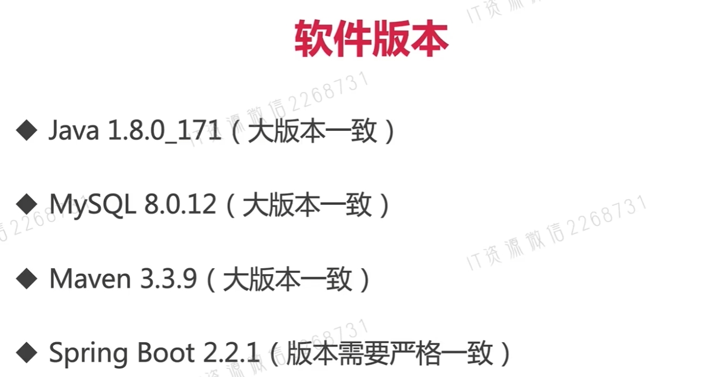
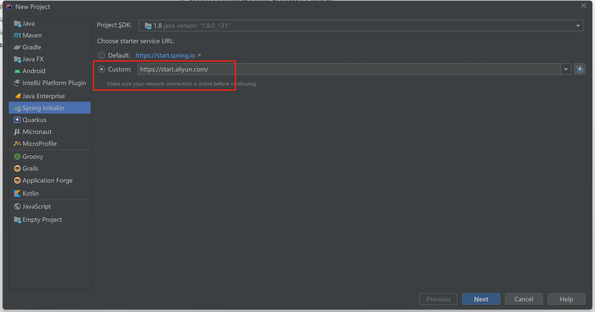
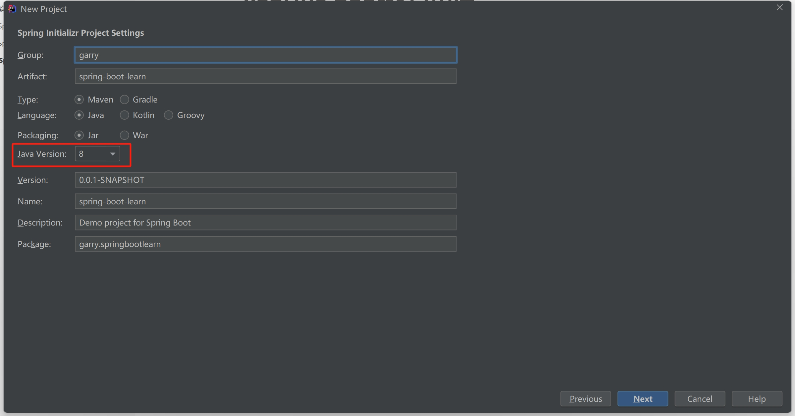
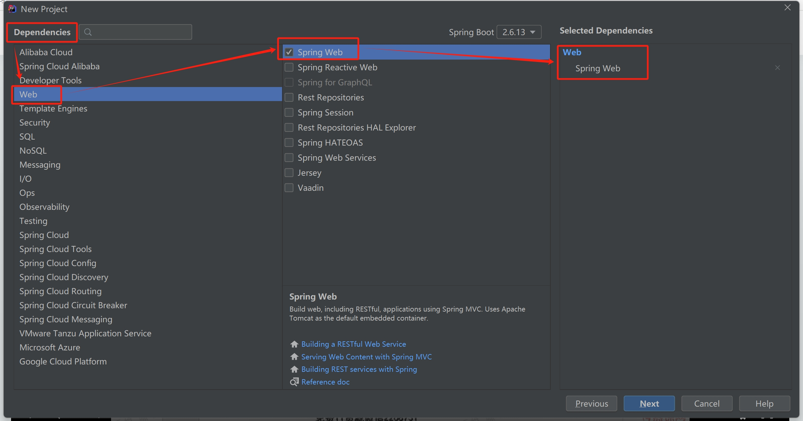
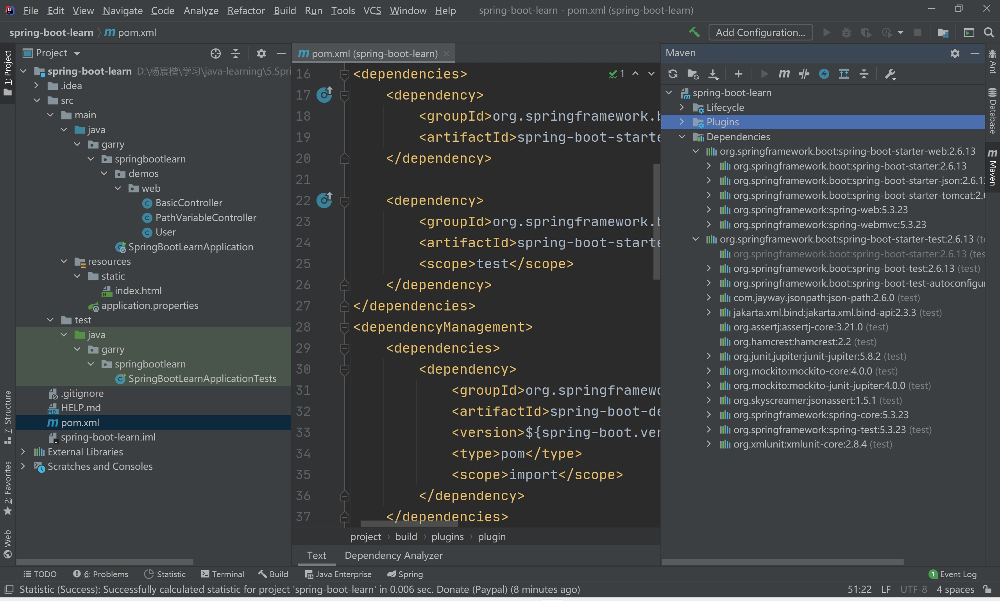

# 1.软件版本



---


# 2.Spring Boot概述

==Spring家族的来龙去脉==

1. Spring 最初利用 IOC 和 AOP 解耦
2. 按照这种模式搞了 MVC 框架
3. ==写很多样板代码很麻烦，就有了Spring Boot==
4. Spring Cloud 是在 Spring Boot基础上诞生的

==Spring Boot优点：大大简化配置==，避免编写大量重复配置信息

---


# 3.Spring Boot版本

CURRENT：最新GA版本

GA：发布版本，面向大众的可用稳定版本

SNAPSHOT：会被修改，可能今天能用，明天就用不了了

---


# 4.Spring Boot项目创建

1. 通过start.spring.io在线创建，打包成jar包后在IDEA中引入(import)，不推荐，可选版本太少，全是3.1以上的版本，JDK的版本还至少要JDK17

2. ==使用IDEA集成的Spring Initializr==

	> 解决Spring官方抛弃Java8的方法：
	>
	> Spring Initializr中不要选择Default，而是==选择Custom==
	>
	> 并在后面==填上阿里云提供的镜像https://start.aliyun.com/。==
	>
	> 

3. ==选择Java8==

	> 

4. ==选择Web依赖==

	> 

5. ==点击Finish，自动创建一个Spring Boot项目==

	> 

---


# 5.完成第一个接口开发

```java
@RestController//在普通Controller的基础上有Restful的能力
public class ParamController {
    /**
     * 第一个Spring Boot接口
     *
     * @return
     */
    @GetMapping({"/firstrequest"})
    public String firstRequest() {
        return "第一个Spring Boot接口";
    }
}
```

---


# 6.多种配置URL的方法

```java
/**
 * 演示传参形式
 */
@SuppressWarnings({"all"})
@RestController//在普通Controller的基础上有Restful的能力
@RequestMapping("/prefix")//统一前缀
public class ParamController {

    /**
     * 第一个Spring Boot接口
     *
     * @return
     */
    @GetMapping({"/firstrequest"})
    public String firstRequest() {
        return "第一个Spring Boot接口";
    }

    /**
     * 接收参数的Spring Boot接口
     *
     * @param num
     * @return
     */
    @GetMapping({"/requestparam"})
    public String requestParam(@RequestParam Integer num) {
        return "param from request:" + num;
    }

    /**
     * 从URL中寻找所对应的参数进行绑定
     *
     * @param num
     * @return
     */
    @GetMapping({"/param/{num}"})//在path中获取参数
    public String pathParam(@PathVariable Integer num) {
        return "param from path:" + num;
    }

    /**
     * 支持多URL访问该方法
     *
     * @param num
     * @return
     */
    @GetMapping({"/multiurl1", "/multiurl2"})//当作是数组
    public String multiUrl(Integer num) {
        return "param from mutiPaths:" + num;
    }

    /**
     * 设置默认值，增强程序健壮性
     *
     * @param num
     * @return
     */
    @GetMapping({"/required"})
    public String required(@RequestParam(required = false/*不是必传*/, defaultValue = "0") Integer num) {
        return "the default value is:" + num;
    }
}
```

---


# 7.配置文件的两种写法

==所谓配置文件：application.properties==，取代了Spring复杂的applicationContext.xml

1. 以点作为分割：

	> environments.dev.url=http://garry
	>
	> envorinments.dev.name=Developer 
	>
	> server.port=8080

2. yml：分层级，冒号后需要空格

	> environments:
	>
	> ​	dev: 
	>
	> ​		url: http://imooc.com
	>
	> ​		name: Developer

properties和yml在线转换网站：https://toyaml.com/

---


# 8.配置自定义属性

application.properties

```properties
school.grade=6
school.classNum=1
```

==@Value方式==

```java
/**
 * 演示读取配置的Controller
 */
@RestController
public class PropertiesController {
    @Value("${school.grade}")//绑定
    Integer grade;
    @Value("${school.classNum}")
    Integer classNum;

    @GetMapping({"/gradeClass"})
    public String gradeClass() {
        return grade + ":" + classNum;
    }
}
```

==缺点：没有提示，容易写错==

解决方法，==设置配置类@ConfigurationProperties==，注意必须有set和get方法

```java
@Component
@ConfigurationProperties("school")//前缀为school
public class SchoolConfig {
    private Integer grade;
    private Integer classNum;

    public Integer getGrade() {
        return grade;
    }

    public void setGrade(Integer grade) {
        this.grade = grade;
    }

    public Integer getClassNum() {
        return classNum;
    }

    public void setClassNum(Integer classNum) {
        this.classNum = classNum;
    }
}
```

==读取配置类，使用注解==

```java
/**
 * 读取配置类
 */
@RestController
@RequestMapping("/config")
public class ConfigController {
    @Resource
    private SchoolConfig schoolConfig;

    @GetMapping({"/gradeClass"})
    public String gradeClass() {
        return schoolConfig.getGrade() + ":" + schoolConfig.getClassNum();
    }
}
```

---


# 9.Service和Dao层的编写

==pom.xml额外引入==mybatis的SpringBoot启动器和mysql的连接池

```xml
<dependency>
    <groupId>org.mybatis.spring.boot</groupId>
    <artifactId>mybatis-spring-boot-starter</artifactId>
    <version>2.2.1</version>
</dependency>
<dependency>
    <groupId>mysql</groupId>
    <artifactId>mysql-connector-java</artifactId>
</dependency>
```

==application.properties配置==

```properties
spring.datasource.driver-class-name=com.mysql.jdbc.Driver
spring.datasource.url=jdbc:mysql://localhost:3306/garry?useUnicode=true&characterEncoding=UTF-8&serverTimezone=UTC
spring.datasource.username=root
spring.datasource.password=1234
```

然后就按MVC三层架构编写就可…

---


# ssm+Spring Boot基础学习完结，快去做项目吧
