# 12306

## 第一章：课程介绍

### 1.2 课程导学

1. 12306秒杀的核心是如何处理高并发，常见的==高并发的问题==有：

	> 1. ==秒杀还没开始，浏览器页面就崩了==；页面静态化，CDN 进行分流
	> 2. ==秒杀刚开始，服务器就崩了==；限流
	> 3. ==秒杀结束后，库存超卖了==；分布式锁
	> 4. ==秒杀过程没问题，但是服务器响应很慢==；异步削峰+排队机制

2. ==前后端分离==：后端 ==SpringCloud Alibaba==(Springboot 同步升级到3)；前端 ==Vue3==；JDK17。

3. 千万级别大型分布式系统架构。

4. ==高并发==，==高性能==，==高可用==。

5. 本次课程的==核心技术==：

	> 1. ==限流+令牌==，减少很多无用请求；
	> 2. ==异步+排队==，实现削峰，收到请求返回正在处理，后端在队列中异步执行减票操作，相当于把此刻的大量请求分散到后面的时间去了，实现削峰；
	> 3. ==分布式锁==，保证不超卖；
	> 4. 总结：缓存、分布式锁、限流(令牌)、削峰(异步排队、验证码)、排队等；

---


### 1.3 为什么选择 Springboot3 和 JDK17

1. Springboot3 必须要 JDK17 及以上的版本。
2. 相应的，使用 SpringCloud 2022.0.0.0，以支持 Springboot3。
3. ==Springboot3 的重要新特性==：==AOT==，它是一个面向==云延申==的技术。

---


## 第二章：系统架构

### 2.1 为什么选择 12306

1. 12306 的业务比淘宝等类似的秒杀更复杂：

	> 1. ==动态库存==：淘宝是静态库存，在秒杀之前，就已经确定了库存，但是 12306 的库存不是固定的，比如北京-南京-上海，如果选择直达的话，那么这个座位就只有一张票，但是如果==考虑在南京中转的话，同一个座位就可以卖出两张票==。
	> 2. ==选座==功能；
	> 3. ==线上线下并行==：淘宝就是完全线上；但是 12306 既可以线上，也可以线下；
	> 4. 不停==刷票==：淘宝一件商品没了，就不买了；但是 12306 没抢到就会不停地刷票；
	> 5. ==绝不能超卖==：淘宝就算超卖了，也可以补充库存；但是 12306 一个座位有且仅有一个人能坐；

### 2.2 12306 流量规模

1. 平均 QPS：300万/秒。

2. 售票能力：2000万张/天。

3. 高峰期 TPS：1秒卖出1300张票。

4. 如何解决忙碌问题：

	> 1. ==主动提高 QPS 和 TPS==：`增加服务器` `使用分布式内存数据库 Gemfire` `优化算法`
	> 2. ==削峰==：`验证码(每个人提交验证码的速度不一样，可以把用户分散开)` `给出多个放票时段，避免堆积` `排队`，技术上有 `限流(比如1000个人抢10张票，那么只处理前10个请求，其它请求不予处理)` `异步(前端先显示正在等待，后端在异步的队列里面慢慢处理)`

---


### 2.3 不超卖，不少买，高并发

1. 余票查询：记录每两个站之间的余票，比如 A~E 有 5 个站，一共 10 种站站记录。

	> 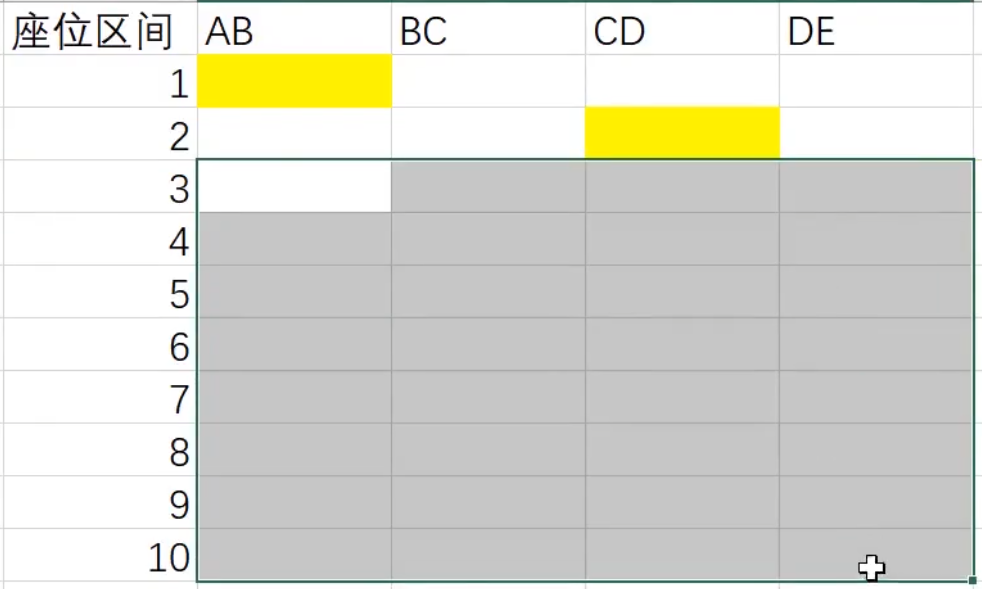
	>
	> 主要还是可以采取画表格的方法，来判断是否可以购买票。比如在上图中，A~E 就只有 8 张票还可以买了。
	>
	> 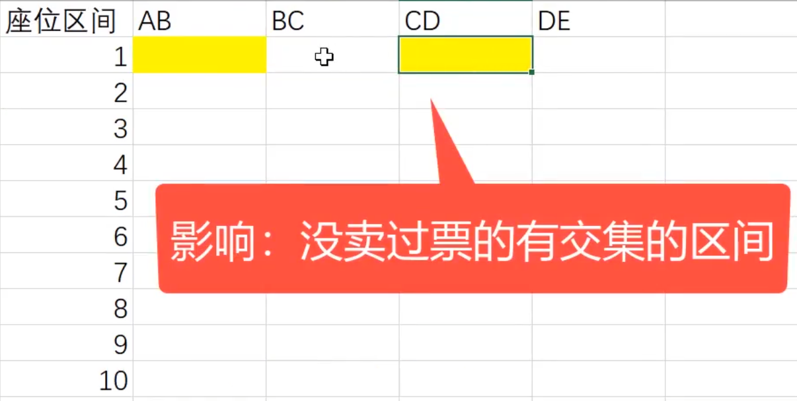
	>
	> 但是如果 CD 区间的票，是座位 1 的，那么就不会再减少 A~D 的票数，在上图中通过画矩形我们可以看出此时 A~D 的票数依然是 9 张，而不是 8 张。这是因为==由于之前座位 1 的 A~B 的票已经卖了，因此座位 1 上 A~D 的票数已经减 1 了，此时购买座位 1 的 C~D 的票，就不能再把座位 1 A~D 的票数减 1 了==。
	>
	> 即影响的范围必须包含改变的区间，且必须没有被买过(因为其它子区间的被购买，而减少票数)，否则外层的票就卖了两次。
	
2. 座位购买，记录每个座位有哪些区域卖出去了，还可以卖出哪些区域。0111，代表只有 A~B 还可以卖。

	> 具体方法：在表的后面加一个销售详情字段，每卖出去一张票，就把后面对应的 0 改成 1。比如 0000->1000

---


### 2.4 核心功能

> 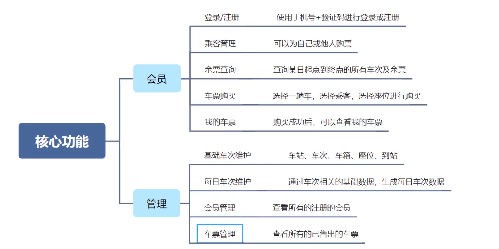

---


### 2.5 模块划分

> 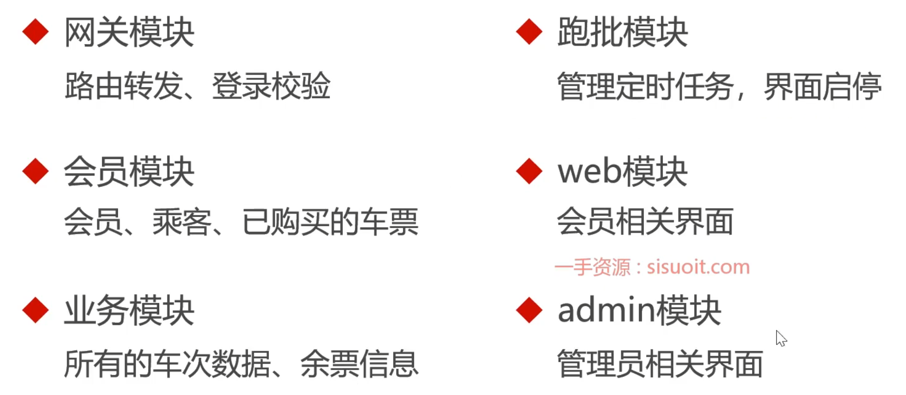
>
> 划分模块的好处：便于我们==灵活的分配资源==，比如==业务模块比较重要，可以分配 100、200 个节点==，而其它模块可能就十几个或者几十个节点。

---


### 2.6 整架构设计

> 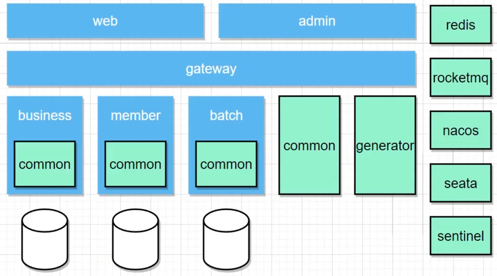
>
> 1. web 和 admin 是前端的模块，它们请求后端时必须经过 gateway 网关，由网关将请求转发到后端对应模块。
> 2. ==每个模块有自己的数据库==，不方便进行跨数据库的多表联查，可以==将会员模块的一些信息冗余到 business 模块==，就能在一个库中完成查询了。
> 3. common 用来放一些公共的方法；generator 代码生成器，mybatis-generator 和我们自己的代码生成器
> 4. 第三方应用：==redis 做缓存==；==rocketmq 做异步+削峰==；==nacos 做注册中心==，是 SpringCloud 的核心组件；==seata 做分布式的事务==，比如 business 和 common 的表存储在不同的数据库中，假如我要 insert 或者 update 一个数据，但这会影响在 business 和 common 这两个不同数据库中的表，这时我使用分布式的事务，就能保证不同数据库的表的一致性；==sentinel 做限流==。

---


### 2.7 数据库表

1. 会员部分：

	1. 会员表：

		```sql
		drop table if exists `member`;
		create table `member` (
		    `id` bigint not null comment 'id',
		    `mobile` varchar(11) comment '手机号',
		    primary key (`id`),
		    unique key `mobile_unique` (`mobile`)
		) engine=innodb default charset=utf8mb4 comment='会员';
		```

		> 验证码登录，因此存手机号；
		>
		> 可以通过手机号查找会员，因此在 mobile 上创建索引。

	2. 乘客表：

		```sql
		drop table if exists `passenger`;
		create table `passenger` (
		    `id` bigint not null comment 'id',
		    `member_id` bigint not null comment '会员id',
		    `name` varchar(20) not null comment '姓名',
		    `id_card` varchar(18) not null comment '身份证',
		    `type` char(1) not null comment '旅客类型|枚举[PassengerTypeEnum]', # 票价不同
		    `create_time` datetime(3) comment '创建时间',
		    `update_time` datetime(3) comment '修改时间',
		    primary key (`id`),
		    index `member_id_index` (`member_id`)
		) engine=innodb default charset=utf8mb4 comment='乘车人';
		```

		> JOIN 会员表，因此 member_id 上有索引。

	3. 车票表：

		```sql
		drop table if exists `ticket`;
		create table `ticket` (
		    `id` bigint not null comment 'id',
		    `member_id` bigint not null comment '会员id',
		    `passenger_id` bigint not null comment '乘客id',
		    `passenger_name` varchar(20) comment '乘客姓名',
		    `train_date` date not null comment '日期',
		    `train_code` varchar(20) not null comment '车次编号',
		    `carriage_index` int not null comment '箱序',
		    `seat_row` char(2) not null comment '排号|01, 02',
		    `seat_col` char(1) not null comment '列号|枚举[SeatColEnum]',
		    `start_station` varchar(20) not null comment '出发站',
		    `start_time` time not null comment '出发时间',
		    `end_station` varchar(20) not null comment '到达站',
		    `end_time` time not null comment '到站时间',
		    `seat_type` char(1) not null comment '座位类型|枚举[SeatTypeEnum]',
		    `create_time` datetime(3) comment '新增时间',
		    `update_time` datetime(3) comment '修改时间',
		    primary key (`id`),
		    index `member_id_index` (`member_id`)
		) engine=innodb default charset=utf8mb4 comment='车票';
		```

		> JOIN 会员表，因此 member_id 上有索引。

2. 业务部分：

	1. 车站表：

		```sql
		drop table if exists `station`;
		create table `station` (
		    `id` bigint not null comment 'id',
		    `name` varchar(20) not null comment '站名',
		    `name_pinyin` varchar(50) not null comment '站名拼音',
		    `name_py` varchar(50) not null comment '站名拼音首字母',
		    `create_time` datetime(3) comment '新增时间',
		    `update_time` datetime(3) comment '修改时间',
		    primary key (`id`),
		    unique key `name_unique` (`name`)
		) engine=innodb default charset=utf8mb4 comment='车站';
		```

		> 这张表是为了方便后面做车站的下拉框，记录拼音是为了通过英文搜索也能找到车站。

	2. 车次表：

		```sql
		drop table if exists `train`;
		create table `train` (
		    `id` bigint not null comment 'id',
		    `code` varchar(20) not null comment '车次编号',
		    `type` char(1) not null comment '车次类型|枚举[TrainTypeEnum]',
		    `start` varchar(20) not null comment '始发站',
		    `start_pinyin` varchar(50) not null comment '始发站拼音',
		    `start_time` time not null comment '出发时间',
		    `end` varchar(20) not null comment '终点站',
		    `end_pinyin` varchar(50) not null comment '终点站拼音',
		    `end_time` time not null comment '到站时间',
		    `create_time` datetime(3) comment '新增时间',
		    `update_time` datetime(3) comment '修改时间',
		    primary key (`id`),
		    unique key `code_unique` (`code`) 
		) engine=innodb default charset=utf8mb4 comment='车次';
		```

		> 需要和其它业务表JOIN，因此 code 必须有索引。

	3. 到站表：

		```sql
		drop table if exists `train_station`;
		create table `train_station` (
		    `id` bigint not null comment 'id',
		    `train_code` varchar(20) not null comment '车次编号',
		    `index` int not null comment '站序',
		    `name` varchar(20) not null comment '站名',
		    `name_pinyin` varchar(50) not null comment '站名拼音',
		    `in_time` time comment '进站时间',
		    `out_time` time comment '出站时间',
		    `stop_time` time comment '停站时长',
		    `km` decimal(8, 2) not null comment '里程（公里）|从上一站到本站的距离',
		    `create_time` datetime(3) comment '新增时间',
		    `update_time` datetime(3) comment '修改时间',
		    primary key (`id`),
		    unique key `train_code_index_unique` (`train_code`, `index`),
		    unique key `train_code_name_unique` (`train_code`, `name`)
		) engine=innodb default charset=utf8mb4 comment='火车车站';
		```

		> 记录所有的车次经过了哪些站，可以通过车次 id 查出对应车次经过了哪些站；
		>
		> 联合索引首先可以作为 train_code 的索引；
		>
		> (`train_code`, `name`) 查询指定车次到达指定站的详情，(`train_code`, `index`) 查看指定车次所经过的第 index 站的详情。

	4. 车厢表：

		```sql
		drop table if exists `train_carriage`;
		create table `train_carriage` (
		    `id` bigint not null comment 'id',
		    `train_code` varchar(20) not null comment '车次编号',
		    `index` int not null comment '厢号',
		    `seat_type` char(1) not null comment '座位类型|枚举[SeatTypeEnum]', # 一等座等
		    `seat_count` int not null comment '座位数',
		    `row_count` int not null comment '排数',
		    `col_count` int not null comment '列数',
		    `create_time` datetime(3) comment '新增时间',
		    `update_time` datetime(3) comment '修改时间',
		    unique key `train_code_index_unique` (`train_code`, `index`),
		    primary key (`id`)
		) engine=innodb default charset=utf8mb4 comment='火车车厢';
		```

		> (`train_code`, `index`) 通过车次和箱号查询指定列车指定车厢的详情。

	5. 座位表：

		```sql
		drop table if exists `train_seat`;
		create table `train_seat` (
		    `id` bigint not null comment 'id',
		    `train_code` varchar(20) not null comment '车次编号',
		    `carriage_index` int not null comment '厢序',
		    `row` char(2) not null comment '排号|01, 02',
		    `col` char(1) not null comment '列号|枚举[SeatColEnum]',
		    `seat_type` char(1) not null comment '座位类型|枚举[SeatTypeEnum]',
		    `carriage_seat_index` int not null comment '同车厢座序',
		    `create_time` datetime(3) comment '新增时间',
		    `update_time` datetime(3) comment '修改时间',
		    primary key (`id`)
		) engine=innodb default charset=utf8mb4 comment='座位';
		```

	6. Daily 相关表：

		> 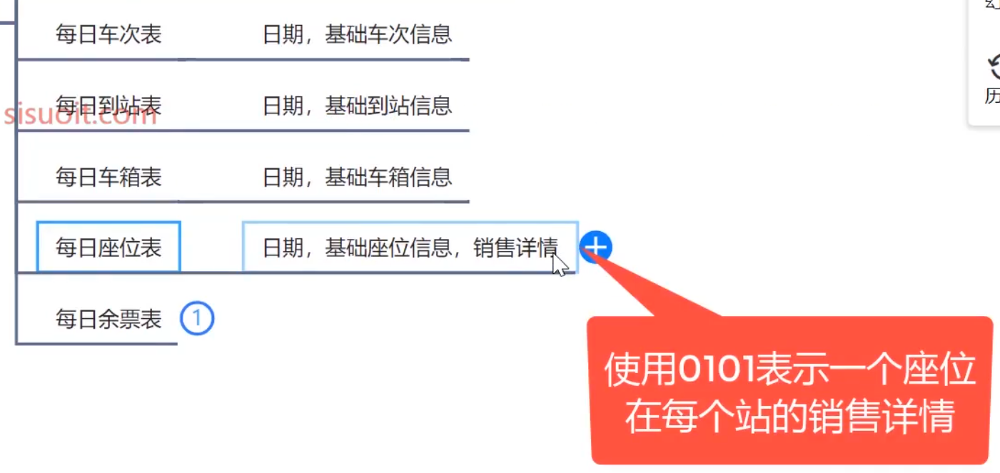

		```sql
		drop table if exists `daily_train`;
		create table `daily_train` (
		    `id` bigint not null comment 'id',
		    `date` date not null comment '日期',
		    `code` varchar(20) not null comment '车次编号',
		    `type` char(1) not null comment '车次类型|枚举[TrainTypeEnum]',
		    `start` varchar(20) not null comment '始发站',
		    `start_pinyin` varchar(50) not null comment '始发站拼音',
		    `start_time` time not null comment '出发时间',
		    `end` varchar(20) not null comment '终点站',
		    `end_pinyin` varchar(50) not null comment '终点站拼音',
		    `end_time` time not null comment '到站时间',
		    `create_time` datetime(3) comment '新增时间',
		    `update_time` datetime(3) comment '修改时间',
		    primary key (`id`),
		    unique key `date_code_unique` (`date`, `code`)
		) engine=innodb default charset=utf8mb4 comment='每日车次';
		
		drop table if exists `daily_train_station`;
		create table `daily_train_station` (
		    `id` bigint not null comment 'id',
		    `date` date not null comment '日期',
		    `train_code` varchar(20) not null comment '车次编号',
		    `index` int not null comment '站序|第一站是0',
		    `name` varchar(20) not null comment '站名',
		    `name_pinyin` varchar(50) not null comment '站名拼音',
		    `in_time` time comment '进站时间',
		    `out_time` time comment '出站时间',
		    `stop_time` time comment '停站时长',
		    `km` decimal(8, 2) not null comment '里程（公里）|从上一站到本站的距离',
		    `create_time` datetime(3) comment '新增时间',
		    `update_time` datetime(3) comment '修改时间',
		    primary key (`id`),
		    unique key `date_train_code_index_unique` (`date`, `train_code`, `index`),
		    unique key `date_train_code_name_unique` (`date`, `train_code`, `name`)
		) engine=innodb default charset=utf8mb4 comment='每日车站';
		
		drop table if exists `daily_train_carriage`;
		create table `daily_train_carriage` (
		    `id` bigint not null comment 'id',
		    `date` date not null comment '日期',
		    `train_code` varchar(20) not null comment '车次编号',
		    `index` int not null comment '箱序',
		    `seat_type` char(1) not null comment '座位类型|枚举[SeatTypeEnum]',
		    `seat_count` int not null comment '座位数',
		    `row_count` int not null comment '排数',
		    `col_count` int not null comment '列数',
		    `create_time` datetime(3) comment '新增时间',
		    `update_time` datetime(3) comment '修改时间',
		    primary key (`id`),
		    unique key `date_train_code_index_unique` (`date`, `train_code`, `index`)
		) engine=innodb default charset=utf8mb4 comment='每日车厢';
		
		drop table if exists `daily_train_seat`;
		create table `daily_train_seat` (
		    `id` bigint not null comment 'id',
		    `date` date not null comment '日期',
		    `train_code` varchar(20) not null comment '车次编号',
		    `carriage_index` int not null comment '箱序',
		    `row` char(2) not null comment '排号|01, 02',
		    `col` char(1) not null comment '列号|枚举[SeatColEnum]',
		    `seat_type` char(1) not null comment '座位类型|枚举[SeatTypeEnum]',
		    `carriage_seat_index` int not null comment '同车箱座序',
		    `sell` varchar(50) not null comment '售卖情况|将经过的车站用01拼接，0表示可卖，1表示已卖',
		    `create_time` datetime(3) comment '新增时间',
		    `update_time` datetime(3) comment '修改时间',
		    primary key (`id`)
		) engine=innodb default charset=utf8mb4 comment='每日座位';
		```

		余票表：

		```sql
		drop table if exists `daily_train_ticket`;
		create table `daily_train_ticket` (
		    `id` bigint not null comment 'id',
		    `date` date not null comment '日期',
		    `train_code` varchar(20) not null comment '车次编号',
		    `start` varchar(20) not null comment '出发站',
		    `start_pinyin` varchar(50) not null comment '出发站拼音',
		    `start_time` time not null comment '出发时间',
		    `start_index` int not null comment '出发站序|本站是整个车次的第几站',
		    `end` varchar(20) not null comment '到达站',
		    `end_pinyin` varchar(50) not null comment '到达站拼音',
		    `end_time` time not null comment '到站时间',
		    `end_index` int not null comment '到站站序|本站是整个车次的第几站',
		    `ydz` int not null comment '一等座余票',
		    `ydz_price` decimal(8, 2) not null comment '一等座票价',
		    `edz` int not null comment '二等座余票',
		    `edz_price` decimal(8, 2) not null comment '二等座票价',
		    `rw` int not null comment '软卧余票',
		    `rw_price` decimal(8, 2) not null comment '软卧票价',
		    `yw` int not null comment '硬卧余票',
		    `yw_price` decimal(8, 2) not null comment '硬卧票价',
		    `create_time` datetime(3) comment '新增时间',
		    `update_time` datetime(3) comment '修改时间',
		    primary key (`id`),
		    unique key `date_train_code_start_end_unique` (`date`, `train_code`, `start`, `end`)
		) engine=innodb default charset=utf8mb4 comment='余票信息';
		```

		> 余票表和车次表做了冗余，不然还要额外关联车次表；
		>
		> (`date`, `train_code`, `start`, `end`) 查询指定日期、指定车次、指定起点和目的地的余票。

	7. 订单表：

		```sql
		drop table if exists `confirm_order`;
		create table `confirm_order` (
		    `id` bigint not null comment 'id',
		    `member_id` bigint not null comment '会员id',
		    `date` date not null comment '日期',
		    `train_code` varchar(20) not null comment '车次编号',
		    `start` varchar(20) not null comment '出发站',
		    `end` varchar(20) not null comment '到达站',
		    `daily_train_ticket_id` bigint not null comment '余票ID',
		    `tickets` json not null comment '车票',
		    `status` char(1) not null comment '订单状态|枚举[ConfirmOrderStatusEnum]',
		    `create_time` datetime(3) comment '新增时间',
		    `update_time` datetime(3) comment '修改时间',
		    primary key (`id`),
		    index `date_train_code_index` (`date`, `train_code`)
		) engine=innodb default charset=utf8mb4 comment='确认订单';
		```

	8. 秒杀令牌表：

		```sql
		drop table if exists `sk_token`;
		create table `sk_token` (
		    `id` bigint not null comment 'id',
		    `date` date not null comment '日期',
		    `train_code` varchar(20) not null comment '车次编号',
		    `count` int not null comment '令牌余量',
		    `create_time` datetime(3) comment '新增时间',
		    `update_time` datetime(3) comment '修改时间',
		    primary key (`id`),
		    unique key `date_train_code_unique` (`date`, `train_code`)
		) engine=innodb default charset=utf8mb4 comment='秒杀令牌';
		```

3. 其它表(官方提供)：

	1. quartz 相关表(自动跑批)；
	2. seata 相关表(分布式事务)；

---


### 2.8 百万人抢一万张票，系统如何保障稳定

> 场景题：==如何设计一个秒杀系统==，==有哪些实现高并发的方案==，就可以用本节的内容进行回答。

1. 前端：

	> 1. ==针对静态资源做 CDN==：CDN = Content Delivery Networks，即内容分发网络，原理是将前端的资源放到 CDN 服务器上，==比如北京上海都有一个节点，就近获取资源==；一般==前端需要引入第三方组件时，都会先去查看其是否有 CDN 资源==，因为通过 CDN 引入第三方组件速度会更快。
	> 2. ==页面静态化==：尽管我们现在很多网站都是动态网站，但是如果我们把==秒杀页面做成静态页面，再将其部署到 CDN 服务器==，就可提高访问速度。
	> 3. ==倒计时&Loading==：给用户看到倒计时，他们就不会在快要到点的时候反复刷新页面；用户提交后显示一个 Loading，告诉用户正在提交，防止用户反复点提交。
	> 4. ==验证码削峰==：不同用户回答验证码速度不同，这样可以把请求分散开。

2. 后端：

	> 1. ==微服务-服务拆分==：如何划分微服务？一般是==按照功能来划分==，比如本项目中就将会员模块和业务模块分开，而对于==热点接口==也会单独划分一个模块，比如本项目中的余票模块。
	> 2. ==负载均衡==，部署多个节点；
	> 3. ==限流降级==：限流是让流量不要太大，而削峰是把多出去的流量填到后面去，不会减少流量；==降级就是当某一个服务不可用后，有一个后备的方案==。
	> 4. ==缓存==：分为本地缓存和分布式缓存，要注意缓存雪崩、单点击穿、穿透。
	> 5. ==令牌==：拿到令牌的请求，才是有效的请求，可以减少很多无效的请求、和机器人刷票。
	> 6. ==异步==：用户请求到达时，立刻返回正在处理，然后后端 mq 中异步执行减少余票等操作。

3. 数据库：

	> 1. ==分库==：将不同的业务的表，放到不同的数据库中隔离；==读写分离，将数据库的读操作和写操作分别分配到不同的数据库服务器上==，这样流量高峰时，读写请求就不会全集中到一个数据库服务器上，导致服务器崩溃。
	> 2. ==分表==：横向分表，按照时间和地点来分，比如一月一张表；纵向分表，按照字段进行划分，比如表一有标题、时间、作者字段，表二有内容字段。
	> 3. ==冗余设计==，反范式，用空间换时间，在一张表里冗余另一张表的字段，这样只需查一张表即可完成查询。
	> 4. ==分布式数据库==，一般很大型的项目才会用到。

4. 其它：

	> 1. ==分时段秒杀==：比如一天有 21 放票的时间点。
	> 2. ==弹性扩容==：监视服务器的性能，超过某个阈值时，就加机器；但是==弹性扩容的反应比较慢，因此在秒杀之前，我们还是要手动扩容==。
	> 3. ==候补+排队==：没抢到票提交候补订单，就不要一致刷票了；排队指的是候补订单先到先得。

----


## 第三章：Springboot3 和 JDK17 的新特性

### 3.1 JDK9_jshell

> 1. 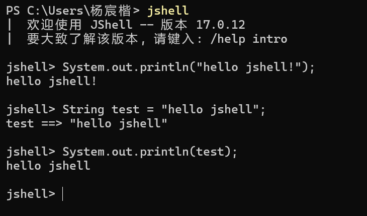
> 2. 有点类似于 Python 和 Lua 的命令行客户端。
> 3. 可以 `Tab` 键提示。

---


### 3.2 JDK9_模块化开发(较为有用)

1. 模块是比包还要大的一种结构，可以通过模块管理包。

	> 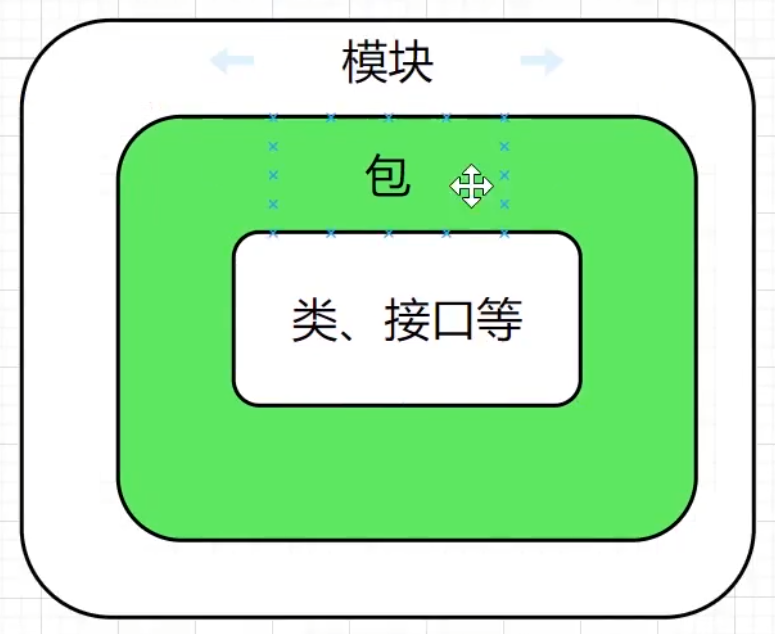

2. 不同的模块之间默认无法调用对方模块的包。

3. 如果想调用，可以 `Alt+Enter` 引入。

4. 如果想要让一个模块开发部分包，不开发另一部分包，则可创建 `module-info.java`：

	> 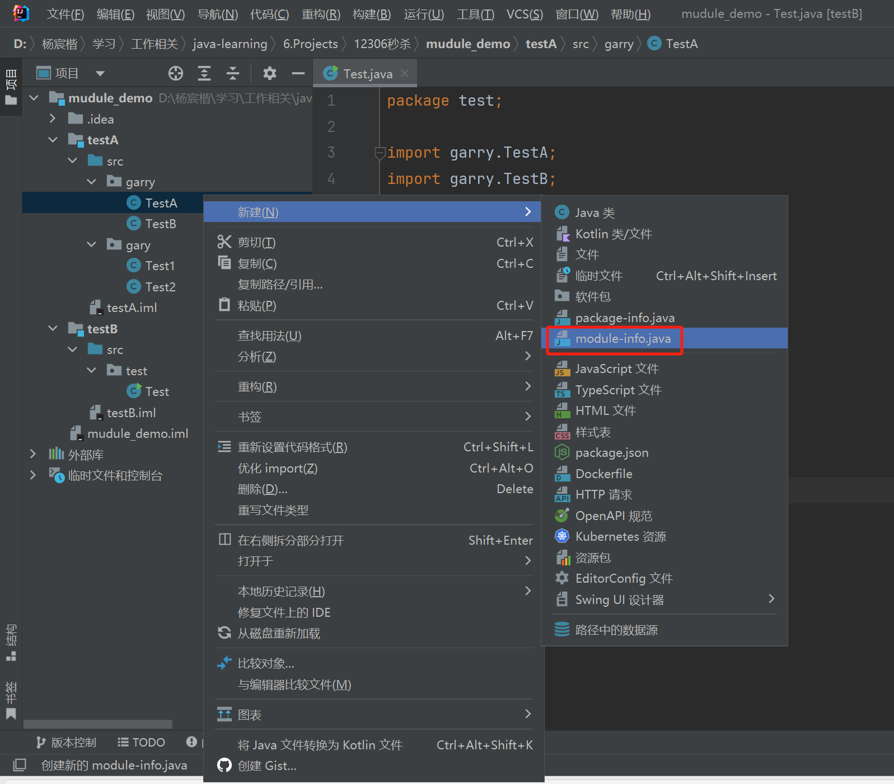
	>
	> ---
	>
	>  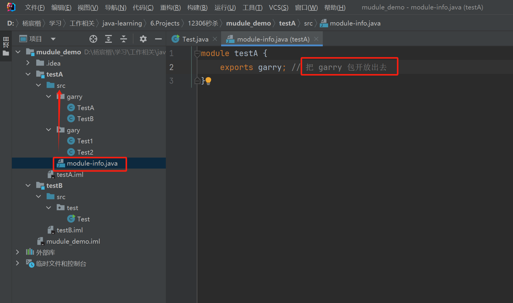
	>
	> `module-info.java` 会自动被创建到 src 目录下，对应地，由于 testB 想要引用 testA 下面的 garry 包，因此它也应该有一个 `module-info.java`：
	>
	> 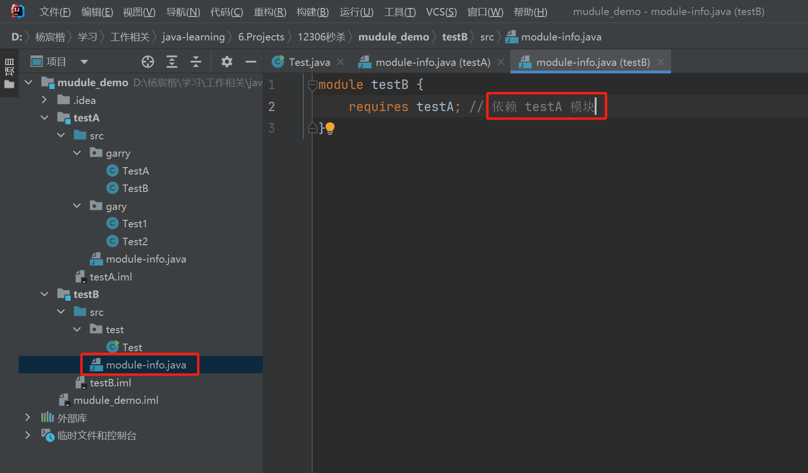

5. 主要是==依赖和被依赖的模块，都要创建 `module-info.java`==。

---


### 3.3 JDK10_var 局部变量推导

1. 使用前提条件：

	> 1. 必须能推导出实际类型；
	> 2. 只能用于==局部变量==。

2. var 必须一边声明，一边初始化；不能只声明，不初始化。

3. 评价：有点意义不明，感觉不如写清楚。

---


### 3.4 JDK11_单文件程序

1. 一般来说，执行一个 java 程序先要 javac，然后 java。但是在 JDK11 的单文件程序中，可以直接使用 java 执行单个文件。

	```bash
	$ java Test.java  # 注意要加上“.java”
	```

2. 不过要注意，这种方式不能调用其它模块的类。

3. 这样可以让 java 像 python 一样只运行某一个文件。

---


### 3.5 JDK11_shebang 脚本

1. ==#! 叫做 shebang==，通常出现在 Linux 脚本中。

2. ```java
	#!JAVA_HOME\bin\java --s
	
	public class Test {
	    public static void main(String[] args) {
	        System.out.println("Hello shebang");
	    }
	}
	```

3. 注意，该文件不能以 “.java” 为后缀，而是 “.sh”。

4. 使用类 Unix 操作系统，如 git-bash，赋予该文件 x 权限后，直接执行，可以打印 `Hello shebang`。

---


### 3.6 JDK14_文本块(较为有用)

1. 有点类似于 python，就是打三个双引号，中间的所有部分全部都是字符串。

	```java
	String json = """
	    {
	        name: "Garry"
	    }
	    """
	```

---


### 3.7 JDK14_instanceof 增强

1. 增强之前，需要手动向下转型：

	```java
	Object a = "Hello";
	if(a instanceof String) {
	    String b = (String) a;
	    sout(b);
	}
	```

2. 增强之后，可以直接在 instaceof 的时候就直接进行向下转型：

	```java
	Object a = "Hello";
	if(a instanceof String b) { // 在这里直接将 a 进行向下转型
	    sout(b);
	}
	```

---


### 3.8 JDK14_空指针提示(较为有用)

1. 之前，如果出现空指针异常，比如：

	```java
	List list = null;
	list.size();
	```

	只会提示你 `NullPointerException`，而不会告诉你具体哪个对象触发了空指针异常。

2. 而在 JDK14 及更高的版本中，会明确地提示你，是 `list` 对象触发了空指针异常。

---


### 3.9 JDK16_Record 类(较为有用)

1. > 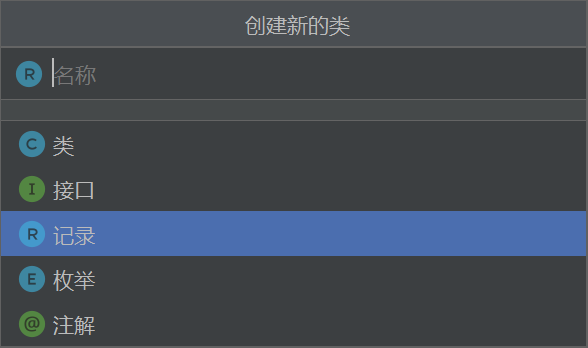

2. 在选择的时候，可以直接选择创建 Record 类。

	```java
	public record TestRecord(String name, String password) {}
	```

	> 实际上，==相当于所有属性都被 final 修饰，即可读不可写==。
	>
	> ```java
	> public record TestRecord {
	>     public final String name;
	>     public final String password;
	> }
	> ```

3. Record 类的作用是创建数据类，类似于我们之前使用的 Lombok 插件。

4. Record 类和普通数据类的区别：只能 get，不能 set。

5. 有点像 `@Getter`，而不是 `@Data`。

---


### 3.10 JDK17_sealed 类(较为有用)

1. 可以使用 sealed 类==显式管理类的继承==。

2. 父类如果是 sealed 类，则必须至少有一个子类。

3. sealed 的子类，必须是 final、sealed、non-sealed 之一。

4. ```java
	public sealed class Test1 permtis Test2 {}
	```

	> Test1 只允许被 Test2 继承。

5. ```java
	public final class Test2 {}  // 到此，Test2 不能再被继承
	```

6. sealed 类的好处是，可以一眼看出类的继承关系，比如可以一眼看出 Test2 继承了 Test1。

---


### 3.11 JDK17_switch 增强

1. 这时 JDK17 预览版才有的功能。

2. 和 instaceof 结合到一起，可以 switch 判断 a 的类型：

	```java
	Object a = "hello";
	switch (a) {
		case Integer b -> sout(b);
	    case Long b -> sout(b);
	    case String b -> sout(b);
	    default -> sout("default");
	}
	```

3. 特别说明，上面的 `->` 使用之后，就不用再加 `break` 了，这时 JDK14 的新特性。

---


### 3.12 Springboot3_AOT & JIT

1. ==JIT==(Just-in-time)，==实时编译==，只能在运行的时候编译，==Java 跨平台的基础==；

2. ==AOT==(Ahead-of-time)，==预编译==，使用之后==无法跨平台==。

3. AOT 的==优点==：

	> 1. 启动和运行==速度快==：
	>
	> 	e.g.之前的 Springboot2 启动一个空项目的时间大概是 2 秒，使用 AOT 后为 100 毫秒。
	>
	> 	快的==原因==：==没有中间的 JVM==（言外之意：JVM 只支持实时编译，不支持预编译），==直接和操作系统打交道==。
	>
	> 2. ==打包体积小==：之前启动需要安装 JDK，而现在不需要 JDK 了，就和 C++ 类似直接双击就行了。
	>
	> 	==应用场景==：比如机器不够了，可以==快速在多台机器上启动 Java 应用==。

4. AOT 的==缺点==：

	> 1. 编译后的程序==不支持跨平台==，比如 C++ 在 Windows 下编译后生成 .exe，但在 Linux 下无法运行。
	> 2. ==不支持动态功能，如 AOP==。

---


### 3.13 JIT 在高并发环境下的问题

1. 问题：在启动初期，热点机器出现性能极低的现象，持续 1~2 分钟。

2. 热点类，即程序运行过程中被多次访问的类，会触发 Java 的 JIT 实时编译机制，直接编译为机器码。

3. 热点类才会触发 JIT，因为会损耗 CPU。

4. 高并发情况下，很多类都触发 JIT 编译，导致 CPU 占用率飙升，性能降低。

5. 解决方法：

	> 1. 预热：初始让程序运行热点代码几百次，提前完成 JIT 编译。
	> 2. 流量控制：刚开始时限流，运行几分钟后恢复到正常流量。

---


### 3.14 Springboot3_使用 GraalVM 代替 JDK 实现 AOT

1. GraalVM 是一个跨语言的通用虚拟机，不仅支持 JVM 系的语言，还支持 C++ 等依赖于 LLVM 的语言，以及 Python、JavaScript 等。
2. 要自己下载，配置 GraalVM，简单的来说就是替换掉原来的 JDK，直接在环境变量里面替换 JAVA_HOME 就可以了。

---


## 第四章：Spring Cloud Alibaba 2020.0.0 与 Springbooot 3 搭建后端架构

### 4.2 项目初始化配置

1. 修改编码类型：

	> 控制台编码类型：
	>
	> 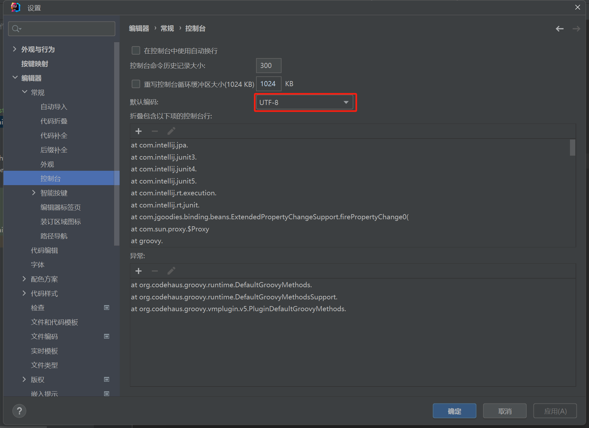
	>
	> ---
	>
	> 文件编码类型：
	>
	> 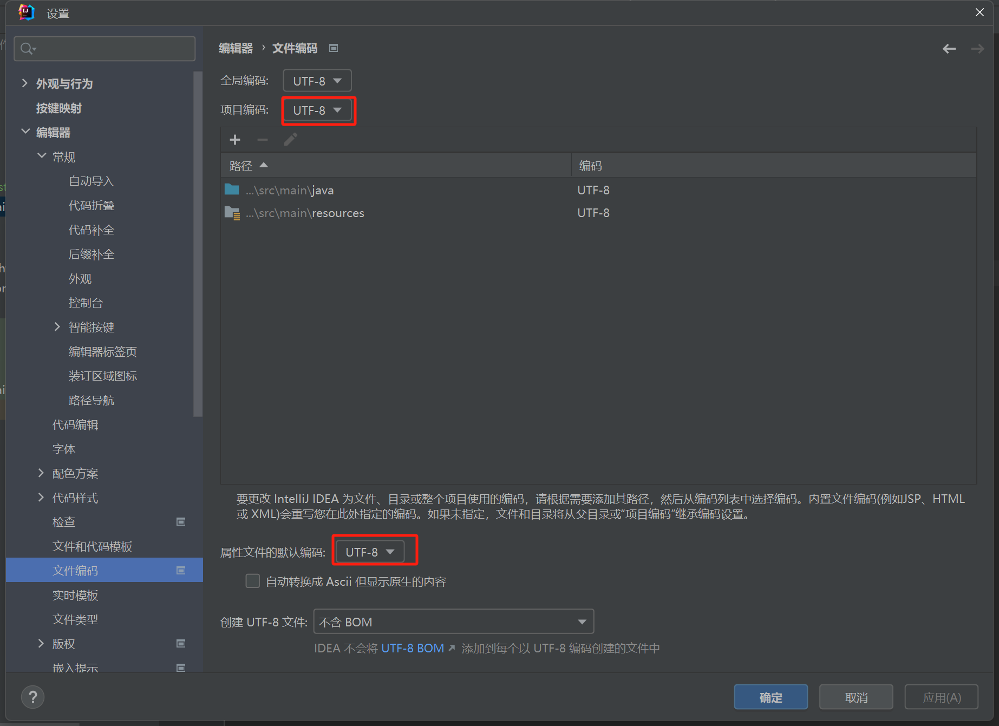

2. 热部署：

	> 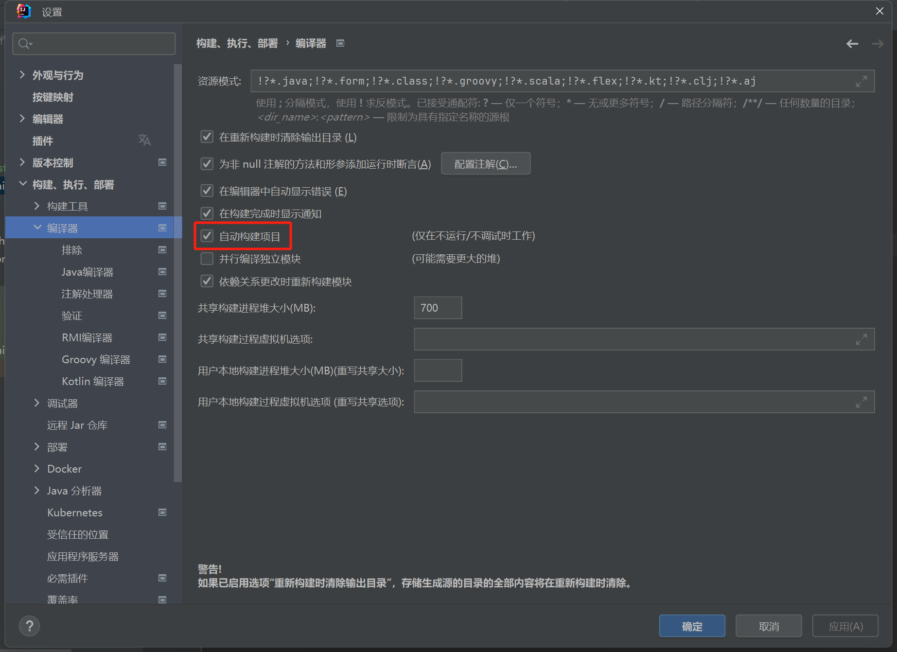
	>
	> 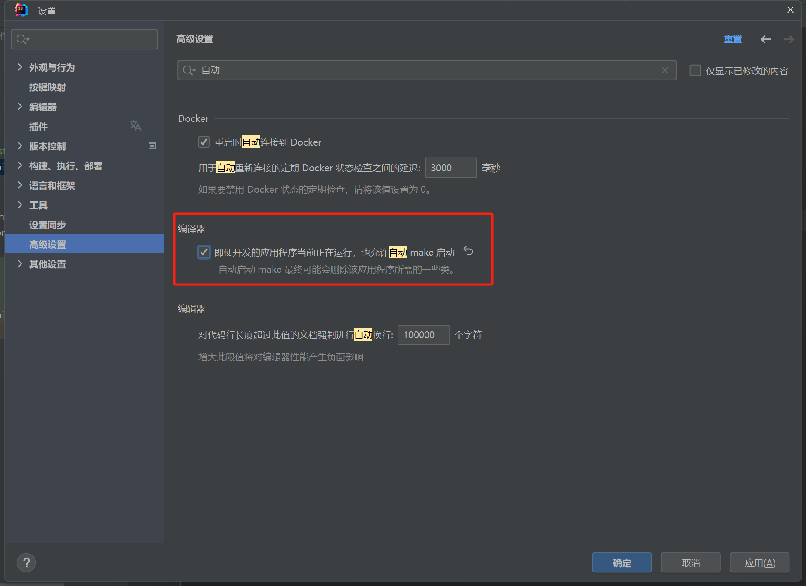
	>
	> ---
	>
	> ==自动热部署==：==离开 IDE（比如去浏览器），或 `Ctrl + s`后离开鼠标离开文件==，项目自动重新启动，因此==也需要一定耗时，并不能做到立刻修改==，但通常这个时间很短，比手动重启项目快。
	>
	> ==手动热部署==：
	>
	> 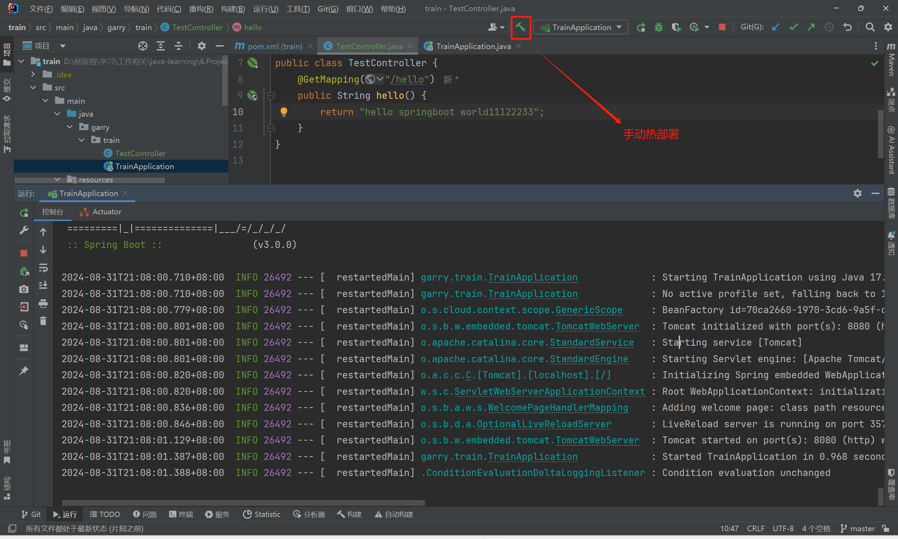

3. 自动导入：

	> 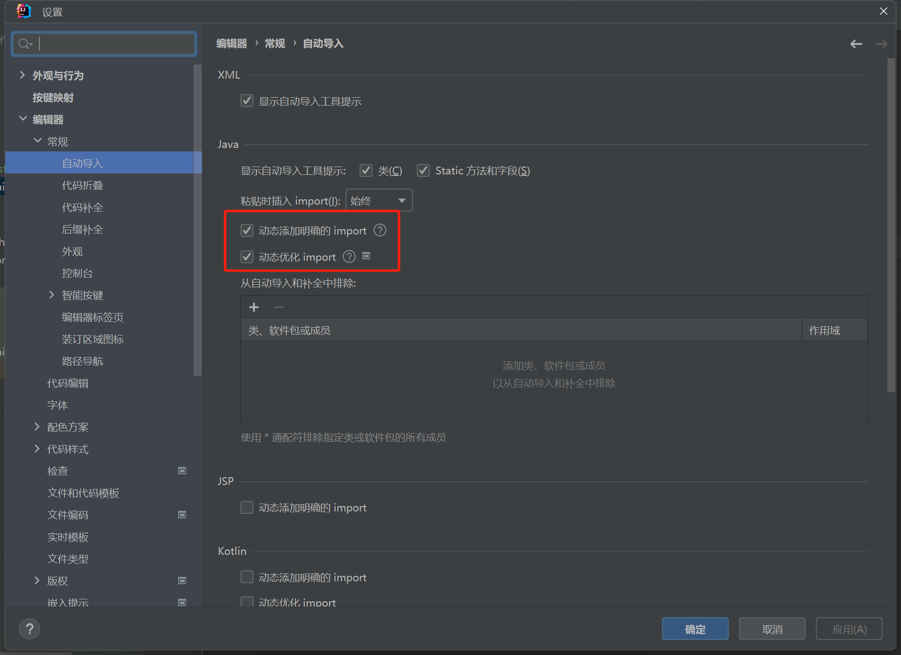

---


### 4.4 新增 member 会员模块

1. 在 train 项目下创建新的 Java-Maven 模块 member：

	> 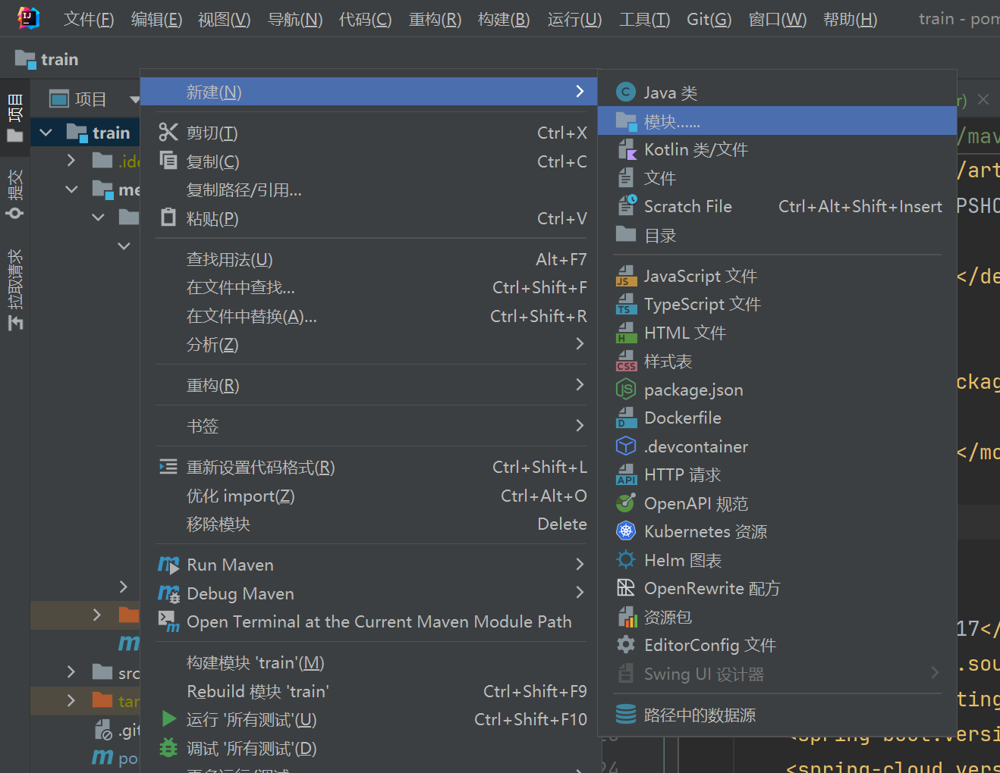
	>
	> ---
	>
	> 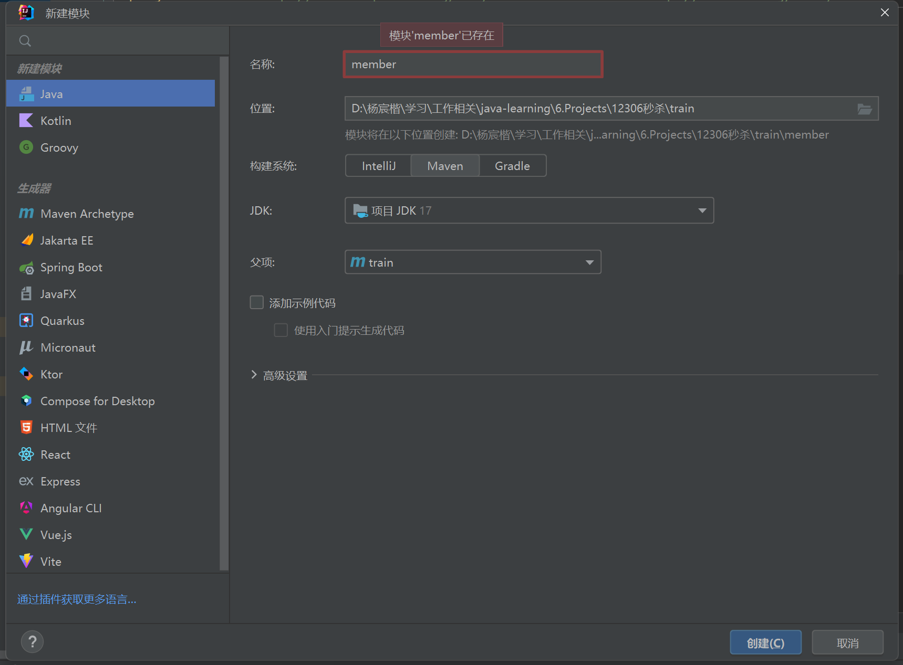

2. 发现在父 pom.xml 中多出一下部分，用于标识子模块：

	```xml
	<!--子模块-->
	<packaging>pom</packaging>
	<modules>
	    <module>member</module>
	</modules>
	```

3. 然后我们的项目就在子模块，即 member 中启动了。因此我们的==父 pom.xml 中就不需要 dependencies 了，把它全部 copy 到 member 的 pom.xml 中==：

	> 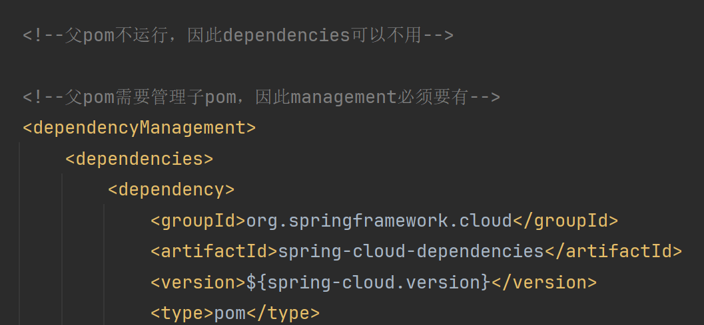
	>
	> ---
	>
	> 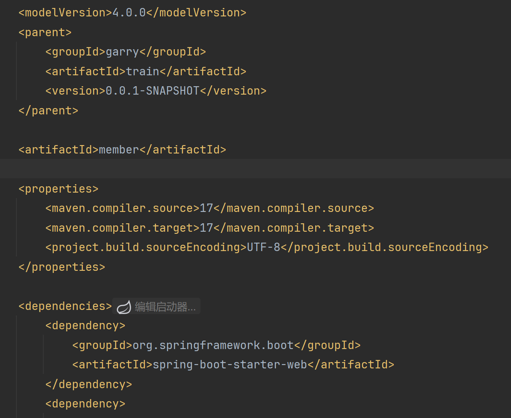

4. 但是==父 pom.xml 中必须有 dependencyManagement，因为这是用来管理子 pom.xml 的==。

5. 还有 ==父 pom.xml 的 build 也不需要了，copy 到子模块中==。

6. 然后==把父项目原来的源码全部移动到 member 中==，毕竟我们是在 member 中启动项目：

	> 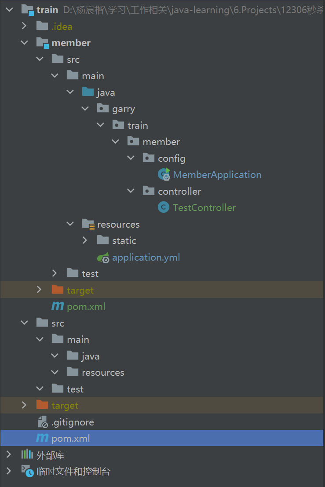

7. 将 TrainApplication 改名为 MemberApplication，并且加上：

	```java
	@ComponentScan("garry") // 由于Application类放到了config包下，它只能扫描和自己同包的类，因此需要新增ComponentScan注解让其扫描整个garry包下的类
	```

---


### 4.5 实现日志 (logback) 的相关配置

1. 首先在==启动类中加上启动日志==：

	```java
	@Slf4j
	@SpringBootApplication
	@ComponentScan("garry") // 由于Application类放到了config包下，它只能扫描和自己同包的类，因此需要新增ComponentScan注解让其扫描整个garry包下的类
	public class MemberApplication {
	    public static void main(String[] args)   {
	        // 打印启动日志
	        SpringApplication app = new SpringApplication(MemberApplication.class);
	        Environment env = app.run(args).getEnvironment(); // 注意，这一句已经app.run了，因此不能再额外run了
	        log.info("启动成功！");
	        log.info("地址\thttp://127.0.0.1:{}", env.getProperty("server.port"));
	        // 包括项目的一些说明文档，测试文档，都可以打印在这里
	    }
	}
	```

	> 注意，`Environment env = app.run(args).getEnvironment()` 已经 app.run 了，不能再额外 run 了。

2. 配置 ==logback-spring.xml==：

	> 日志文件的生成位置：
	>
	> 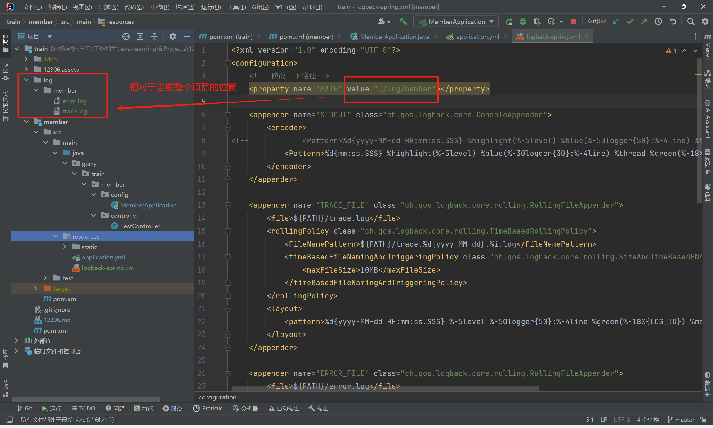
	>
	> ---
	>
	> ```xml
	> <?xml version="1.0" encoding="UTF-8"?>
	> <!--suppress ALL -->
	> <configuration>
	>     <!--该模块日志文件的生成位置，其相对于整个项目的路径-->
	>     <!--本质上是创建一个PATH变量，不同的模块只有这里需要修改-->
	>     <property name="PATH" value="./log/member"></property>
	> 
	>     <!--控制台打印日志的配置-->
	>     <appender name="STDOUT" class="ch.qos.logback.core.ConsoleAppender">
	>         <encoder>
	>             <!--[%-18X{LOG_ID}]是为了打印线程的流水号-->
	>             <Pattern>%d{yyyy-MM-dd HH:mm:ss.SSS} [%thread] %highlight(%-5level) %yellow([%-50.50class] [%-18X{LOG_ID}]) >>> %cyan(%msg) %n</Pattern>
	>         </encoder>
	>     </appender>
	> 
	>     <appender name="TRACE_FILE" class="ch.qos.logback.core.rolling.RollingFileAppender">
	>         <file>${PATH}/trace.log</file>
	>         <rollingPolicy class="ch.qos.logback.core.rolling.TimeBasedRollingPolicy">
	>             <FileNamePattern>${PATH}/trace.%d{yyyy-MM-dd}.%i.log</FileNamePattern>
	>             <timeBasedFileNamingAndTriggeringPolicy class="ch.qos.logback.core.rolling.SizeAndTimeBasedFNATP">
	>                 <maxFileSize>10MB</maxFileSize>
	>             </timeBasedFileNamingAndTriggeringPolicy>
	>         </rollingPolicy>
	>         <layout>
	>             <pattern>%d{yyyy-MM-dd HH:mm:ss.SSS} [%thread] %-5level [%-50.50class] [%-18X{LOG_ID}] >>> %msg %n</pattern>
	>         </layout>
	>     </appender>
	> 
	>     <appender name="ERROR_FILE" class="ch.qos.logback.core.rolling.RollingFileAppender">
	>         <file>${PATH}/error.log</file>
	>         <rollingPolicy class="ch.qos.logback.core.rolling.TimeBasedRollingPolicy">
	>             <FileNamePattern>${PATH}/error.%d{yyyy-MM-dd}.%i.log</FileNamePattern>
	>             <timeBasedFileNamingAndTriggeringPolicy class="ch.qos.logback.core.rolling.SizeAndTimeBasedFNATP">
	>                 <maxFileSize>10MB</maxFileSize>
	>             </timeBasedFileNamingAndTriggeringPolicy>
	>         </rollingPolicy>
	>         <layout>
	>             <pattern>%d{yyyy-MM-dd HH:mm:ss.SSS} [%thread] %-5level [%-50.50class] [%-18X{LOG_ID}] >>> %msg %n</pattern>
	>         </layout>
	>         <filter class="ch.qos.logback.classic.filter.LevelFilter">
	>             <level>ERROR</level>
	>             <onMatch>ACCEPT</onMatch>
	>             <onMismatch>DENY</onMismatch>
	>         </filter>
	>     </appender>
	> 
	>     <!--ERROR级别的日志放到ERROR_FILE-->
	>     <root level="ERROR">
	>         <appender-ref ref="ERROR_FILE" />
	>     </root>
	> 
	>     <!--TRACE级别的日志放到TRACE_FILE-->
	>     <root level="TRACE">
	>         <appender-ref ref="TRACE_FILE" />
	>     </root>
	> 
	>     <!--INFO级别的日志打印到控制台STDOUT-->
	>     <root level="INFO">
	>         <appender-ref ref="STDOUT" />
	>     </root>
	> </configuration>
	> ```

3. 在 ==.gitignore== 中忽略 ==.log== 文件：

	```
	### log ###
	log/
	```

---


### 4.6 使用 HTTP Client 测试接口

1. 问题：每次测试都手动到浏览器，不方便。

2. ==HTTPClient 是 IDEA 自带的用于测试网络接口的工具==。

3. > 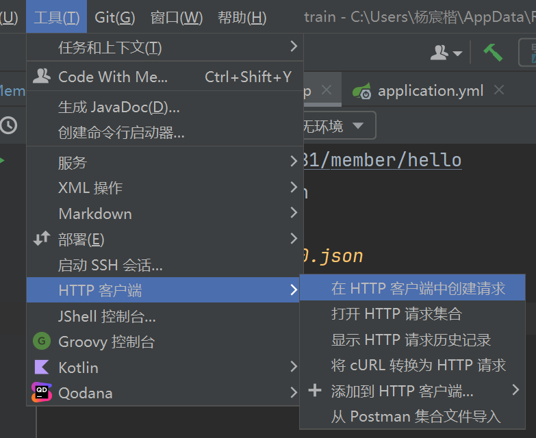

4. 效果：

	> 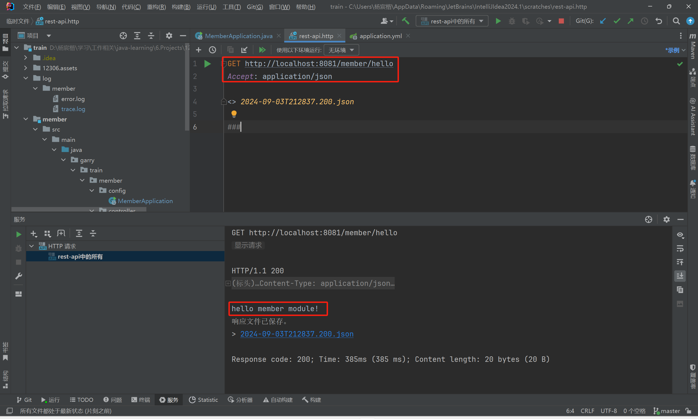

5. 可以在==主工程目录下创建一个 http 文件夹==，把所有的 .http 文件都放到这里：

	> 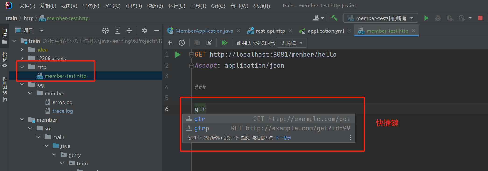

---


### 4.7 增加 AOP 打印请求参数和返回结果

1. 首先需要引入两个依赖，在 train/pom.xml 中引入：

	```xml
	<!--gson-->
	<dependency>
	    <groupId>com.google.code.gson</groupId>
	    <artifactId>gson</artifactId>
	    <version>2.8.6</version>
	</dependency>
	<!--hutool-->
	<dependency>
	    <groupId>cn.hutool</groupId>
	    <artifactId>hutool-all</artifactId>
	    <version>5.6.3</version>
	</dependency>
	```

2. 引入==第三方的依赖时，父子 pom.xml 里面都要声明==，但是==只需在父 pom 中声明版本==，子 pom 中不用写版本。

3. member 中引入 aop 依赖：

	```xml
	<!--spring-boot-starter-test-->
	<dependency>
	    <groupId>org.springframework.boot</groupId>
	    <artifactId>spring-boot-starter-aop</artifactId>
	</dependency>
	```

4. 定义切点：

	```java
	    /**
	     * 定义一个切点
	     * *: 所有的返回值
	     * garry: garry下的所有子包
	     * ..*Controller: 结尾为Controller的所有类
	     * .*: 这些类下的任何方法
	     * (..): 任何返回值
	     */
	    @Pointcut("execution(public * garry..*Controller.*(..))")
	    public void controllerPointcut() {
	    }
	```

5. 前置通知：

	```java
	@Before("controllerPointcut()")
	public void doBefore(JoinPoint joinPoint) {
	
	    // MDC 是 Slf4j 自带的，用于存放我们自定义的键值对，比如在logback-spring.xml中的LOG_ID
	    MDC.put("LOG_ID", CommonUtil.generateUUID(18));
	
	    // 开始打印请求日志
	    ServletRequestAttributes attributes = (ServletRequestAttributes) RequestContextHolder.getRequestAttributes();
	    HttpServletRequest request = attributes.getRequest();
	    Signature signature = joinPoint.getSignature();
	    String name = signature.getName();
	
	    // 打印请求信息
	    log.info("------------- 开始 -------------");
	    log.info("请求地址: {} {}", request.getRequestURL().toString(), request.getMethod());
	    log.info("类名方法: {}.{}", signature.getDeclaringTypeName(), name);
	    log.info("远程地址: {}", request.getRemoteAddr());
	
	    // 打印请求参数
	    Object[] args = joinPoint.getArgs();
	
	    // 排除特殊类型的参数，如文件类型
	    Object[] arguments = new Object[args.length];
	    for (int i = 0; i < args.length; i++) {
	        if (args[i] instanceof ServletRequest
	            || args[i] instanceof ServletResponse
	            || args[i] instanceof MultipartFile) {
	            continue;
	        }
	        arguments[i] = args[i];
	    }
	    // 排除字段，敏感字段或太长的字段不显示：身份证、手机号、邮箱、密码等
	    String[] excludeProperties = {};
	    PropertyPreFilters filters = new PropertyPreFilters();
	    PropertyPreFilters.MySimplePropertyPreFilter excludeFilter = filters.addFilter();
	    excludeFilter.addExcludes(excludeProperties);
	    log.info("请求参数: {}", JSONObject.toJSONString(arguments, excludeFilter));
	}
	```

6. 环绕通知：

	```java
	@Around("controllerPointcut()")
	public Object doAround(ProceedingJoinPoint proceedingJoinPoint) throws Throwable {
	    long startTime = System.currentTimeMillis();
	    Object result = proceedingJoinPoint.proceed();
	    // 排除字段，敏感字段或太长的字段不显示：身份证、手机号、邮箱、密码等
	    String[] excludeProperties = {};
	    PropertyPreFilters filters = new PropertyPreFilters();
	    PropertyPreFilters.MySimplePropertyPreFilter excludeFilter = filters.addFilter();
	    excludeFilter.addExcludes(excludeProperties);
	    log.info("返回结果: {}", JSONObject.toJSONString(result, excludeFilter));
	    log.info("------------- 结束 耗时：{} ms -------------", System.currentTimeMillis() - startTime);
	    return result;
	}
	```

---


### 4.8 增加 Common 公共模块

1. 将所有在子 pom 中引入的依赖，都在父 pom 中注册，把版本写在父 pom 中，以便管理版本。

2. 将 member 中的 aspect 包移过去：

	> 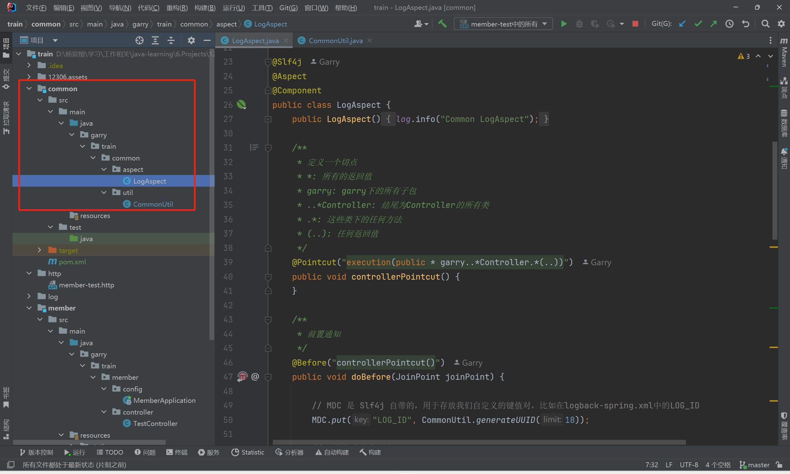

3. 在 ==member/pom.xml 中 dependencies 引入 common 模块==，统一管理：

	> 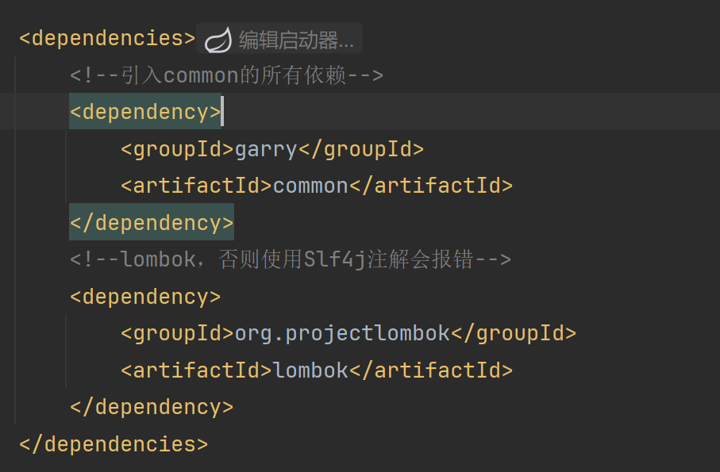

4. 增加common配置文件，放到 common/../resources/config/application.yml：

	> 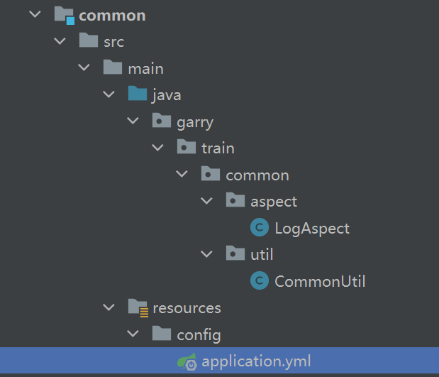

---


### 4.9 增加 Gateway 网关模块

1. gateway/pom.xml 只需引入：

	```xml
	<dependency>
	    <groupId>org.springframework.cloud</groupId>
	    <artifactId>spring-cloud-starter-gateway</artifactId>
	</dependency>
	```

	因为 gateway 是基于 netty 的，不需要其它的依赖。

2. 将 member 中的启动类和配置文件 copy 过来。

3. 在 gateway 的 application.yml 中进行配置：

	```yml
	server:
	  port: 8080
	
	spring:
	  cloud:
	    gateway:
	      # 网关配置
	      routes:
	        - id: member  # “-”表示routes是列表
	          uri: http://127.0.0.1:8081
	          # 将所有以 member为前缀的请求(e.g. http://localhost:8080/member/hello)都转发到 http://127.0.0.1:8081
	          predicates:
	            - Path=/member/**
	```

4. gateway 的作用：比如收到 `http://localhost:8080/member/hello` 请求，==发现以 member 作为前缀，因此将其转发到 `uri: http://127.0.0.1:8081`==，可以理解为是在内网中转发请求。

5. gateway 的好处：==只需将 gateway 配置外网 IP，其它模块只能内网访问，更加安全==。

6. 增加 gateway 日志，点击 GatewayApplication->Edit Configuration->Modify Options->Add VM Options，在 VM Options 中增加：

	```
	-Dreactor.netty.http.server.accessLogEnabled=true
	```

	> 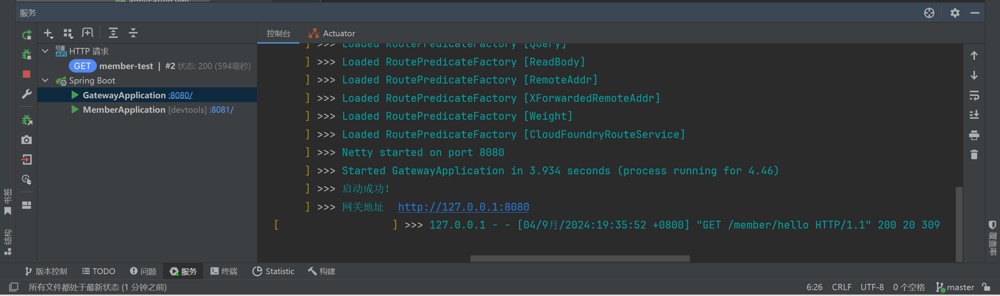

---


### 4.10 数据库的准备工作

1. 重点：==专库专用，切忌使用 root 用户==。
2. 使用 root 用户创建一个新的用户 `garry_train`，其只能访问 train 这个库。

---


### 4.13 集成 Mybatis 持久层框架

1. 在 common 模块中引入 mybatis 和 mysql 的依赖，因为后面很多模块都要用到数据库连接。

	```xml
	<!--mybatis依赖，必须要3.0.0才能支持Springboot3-->
	<dependency>
	    <groupId>org.mybatis.spring.boot</groupId>
	    <artifactId>mybatis-spring-boot-starter</artifactId>
	    <version>3.0.0</version>
	</dependency>
	<!--mysql驱动，5.1开头的版本支持mysql5.7-->
	<dependency>
	    <groupId>mysql</groupId>
	    <artifactId>mysql-connector-java</artifactId>
	    <version>5.1.46</version>
	</dependency>
	```

2. 在 member 模块的 application.yml 做出数据库连接配置：

	```yaml
	spring:
	  # Mybatis 数据库连接配置
	  datasource:
	    # 5.7版本为 com.mysql.jdbc.Driver；8.0版本为 com.mysql.cj.jdbc.Driver
	    driver-class-name: com.mysql.jdbc.Driver
	    username: root
	    password: 1234
	    url: jdbc:mysql://localhost:3306/train_member?characterEncoding=UTF-8&autoReconnect=true&useSSL=false&serverTimezone=Asia/Shanghai
	    type: com.zaxxer.hikari.HikariDataSource
	
	mybatis:
	  # 指定对应的 xml文件的位置为：target/classes/mapper下的所有文件夹的所有.xml文件
	  mapper-locations: classpath:/mapper/**/*.xml
	```

	> ==问什么不在公共的 common 模块里作数据库配置呢==？
	>
	> 因为==不同模块使用的数据库不同==。

3. 注意 mybatis-spring-boot-starter 的版本必须为 3.0.0，但是实际操作中，即使把 train/pom.xml 改为 3.0.0，但是 member 模块依然无法启动，原因是存在缓存，需要手动将 common 中引入的 mybatis-spring-boot-starter:3.0.0 复制到 member/pom.xml 中，即可启动，之后删除即可。

	> 否则会出现 sqlSession，sqlSessionFactory之类的报错。

4. 让日志中打印出 sql：

	```yml
	logging:
	  level:
	    garry:
	      train:
	        member:
	          # garry.train.member.mapper下的日志等级设置为 trace，可以打印出 sql
	          mapper: trace
	```

---


### 4.14 集成 Mybatis Generator

1. 创建 generator 模块，引入：

	```xml
	<build>
	    <plugins>
	        <!-- mybatis generator 自动生成代码插件 -->
	        <plugin>
	            <groupId>org.mybatis.generator</groupId>
	            <artifactId>mybatis-generator-maven-plugin</artifactId>
	            <version>1.4.0</version>
	            <configuration>
	                <configurationFile>src/main/resources/generator-config-member.xml</configurationFile>
	                <!--                    <configurationFile>src/main/resources/generator-config-business.xml</configurationFile>-->
	                <!--                    <configurationFile>src/main/resources/generator-config-batch.xml</configurationFile>-->
	                <overwrite>true</overwrite>
	                <verbose>true</verbose>
	            </configuration>
	            <dependencies>
	                <dependency>
	                    <groupId>mysql</groupId>
	                    <artifactId>mysql-connector-java</artifactId>
	                    <version>5.1.46</version>
	                </dependency>
	            </dependencies>
	        </plugin>
	    </plugins>
	</build>
	```

2. 根据配置，我们在 generator/src/main/resources 下创建 `generator-config-member.xml`：

	```xml
	<?xml version="1.0" encoding="UTF-8"?>
	<!DOCTYPE generatorConfiguration
	        PUBLIC "-//mybatis.org//DTD MyBatis Generator Configuration 1.0//EN"
	        "http://mybatis.org/dtd/mybatis-generator-config_1_0.dtd">
	
	<generatorConfiguration>
	    <context id="Mysql" targetRuntime="MyBatis3" defaultModelType="flat">
	
	        <!-- 自动检查关键字，为关键字增加反引号(比如如果一张表的名字是select，则会自动将其变为`select`) -->
	        <property name="autoDelimitKeywords" value="true"/>
	        <property name="beginningDelimiter" value="`"/>
	        <property name="endingDelimiter" value="`"/>
	
	        <!--覆盖生成XML文件-->
	        <plugin type="org.mybatis.generator.plugins.UnmergeableXmlMappersPlugin" />
	        <!-- 生成的实体类添加toString()方法 -->
	        <plugin type="org.mybatis.generator.plugins.ToStringPlugin"/>
	
	        <!-- 不生成注释 -->
	        <commentGenerator>
	            <property name="suppressAllComments" value="true"/>
	        </commentGenerator>
	
	        <!-- 配置数据源，需要根据自己的项目修改 -->
	        <jdbcConnection driverClass="com.mysql.jdbc.Driver"
	                        connectionURL="jdbc:mysql://localhost:3306/train_member?characterEncoding=UTF-8&amp;autoReconnect=true&amp;useSSL=false&amp;serverTimezone=Asia/Shanghai"
	                        userId="root"
	                        password="1234">
	        </jdbcConnection>
	
	        <!-- domain类的位置 targetProject是相对pom.xml的路径-->
	        <javaModelGenerator targetProject="../member/src/main/java"
	                            targetPackage="garry.train.member.pojo"/>
	
	        <!-- mapper xml的位置 targetProject是相对pom.xml的路径 -->
	        <sqlMapGenerator targetProject="../member/src/main/resources"
	                         targetPackage="mapper"/>
	
	        <!-- mapper类的位置 targetProject是相对pom.xml的路径 -->
	        <javaClientGenerator targetProject="../member/src/main/java"
	                             targetPackage="garry.train.member.mapper"
	                             type="XMLMAPPER"/>
	
	        <table tableName="member" domainObjectName="Member"/>
	        <table tableName="passenger" domainObjectName="Passenger"/>
	        <table tableName="ticket" domainObjectName="Ticket"/>
	    </context>
	</generatorConfiguration>
	```

3. 并且借助 pojoExample 类，得以在 mapper 类中使用 selectByExample 等方法：

	> 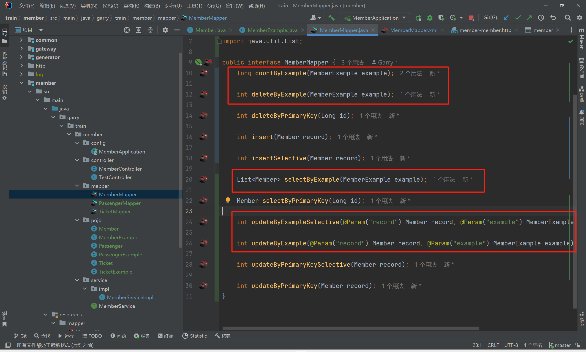
	>
	> ---
	>
	> 好处是：不用再写 where xx = xxx 之类的东西了。

---


### 4.15 member 注册接口

1. ```java
	@Override
	public long register(String mobile) {
	    // 检验mobile是否重复
	    MemberExample memberExample = new MemberExample();
	    memberExample.createCriteria() // 创建条件
	        .andMobileEqualTo(mobile); // and意为“且”。即: 并且mobile="mobile"
	    List<Member> members = memberMapper.selectByExample(memberExample);
	
	    if (CollUtil.isNotEmpty(members)) { // CollUtil为hutool依赖的工具类
	        throw new RuntimeException("手机号已注册"); // 抛出运行时异常，可以正常通过编译，RuntimeException并不是必须处理的
	    }
	
	    Member member = new Member();
	    member.setId(System.currentTimeMillis()); // id暂时比较简略，仅为时间戳
	    member.setMobile(mobile);
	
	    memberMapper.insert(member);
	    return member.getId();
	}
	```

---


### 4.16 封装请求参数 Form 和返回结果 Vo

1. ```java
	@Data
	public class MemberRegisterForm {
	    public String mobile;
	}
	```

2. 在 common 模块创建 ResponseVo，之所以可以在 member 模块使用 ResponseVo，是因为在 member/pom.xml 中引入了 common 模块：

	```java
	@Data
	public class ResponseVo<T> {
	    private boolean success = true;
	
	    private Integer code;
	
	    private String msg;
	
	    private T data;
	
	    private ResponseVo(Integer code, String msg, T data) {
	        this.code = code;
	        this.msg = msg;
	        this.data = data;
	    }
	
	    private ResponseVo(Integer code, String msg) {
	        this(code, msg, null);
	    }
	
	    private ResponseVo(Integer code, String msg, boolean success) {
	        this.code = code;
	        this.msg = msg;
	        this.success = success;
	    }
	
	    public static ResponseVo success() {
	        return new ResponseVo(ResponseEnum.SUCCESS.getCode(), ResponseEnum.SUCCESS.getMsg());
	    }
	
	    public static <T> ResponseVo<T> success(T data) {
	        return new ResponseVo<>(ResponseEnum.SUCCESS.getCode(), ResponseEnum.SUCCESS.getMsg(), data);
	    }
	
	    public static ResponseVo error(ResponseEnum responseEnum) {
	        return new ResponseVo(responseEnum.getCode(), responseEnum.getMsg(), false);
	    }
	}
	```

3. 在 Controller 中的使用方法：

	```java
	@RequestMapping(value = "/register", method = RequestMethod.POST)
	@ResponseBody
	public ResponseVo register(MemberRegisterForm form) {
	    long registerId = 0;
	    try {
	        registerId = memberService.register(form);
	    } catch (RuntimeException e) {
	        return ResponseVo.error(e.getMessage());
	    }
	    return ResponseVo.success(registerId);
	}
	```

---


### 4.17 统一异常处理

1. ```java
	@Slf4j
	@ControllerAdvice
	public class ControllerExceptionHandler {
	
	    @ExceptionHandler({RuntimeException.class})
	    @ResponseBody // 这里必须要加ResponseBody，否则返回的不是JSON字符串！
	    public ResponseVo exceptionHandler(RuntimeException e) {
	        return ResponseVo.error(e.getMessage());
	    }
	}
	```

---


### 4.18 使用自定义异常处理异常业务

1. 没有自定义异常的问题：

	> 假如发生的异常不是我们主动抛出的：
	>
	> ```java
	> if (CollUtil.isNotEmpty(members)) {
	>     throw new RuntimeException("手机号已注册");
	> }
	> ```
	>
	> 那么前端收到的回复就会是这样的：
	>
	> ```json
	> {
	>   "success": false,
	>   "code": -1,
	>   "msg": "\r\n### Error updating database.  Cause: com.mysql.jdbc.MysqlDataTruncation: Data truncation: Data too long for column 'mobile' at row 1\r\n### The error may exist in file [D:\\杨宸楷\\学习\\工作相关\\java-learning\\6.Projects\\12306秒杀\\train\\member\\target\\classes\\mapper\\MemberMapper.xml]\r\n### The error may involve garry.train.member.mapper.MemberMapper.insert-Inline\r\n### The error occurred while setting parameters\r\n### SQL: insert into member (id, mobile)         values (?, ?)\r\n### Cause: com.mysql.jdbc.MysqlDataTruncation: Data truncation: Data too long for column 'mobile' at row 1\n; Data truncation: Data too long for column 'mobile' at row 1",
	>   "data": null
	> }
	> ```
	>
	> 这显然不适合交给前端。

2. 自定义业务异常 BusinessException：

	```java
	public class BusinessException extends RuntimeException {
	    private final ResponseEnum responseEnum;
	
	    public BusinessException(ResponseEnum responseEnum) {
	        this.responseEnum = responseEnum;
	    }
	
	    public ResponseEnum getResponseEnum() {
	        return responseEnum;
	    }
	}
	```

3. 对应的处理方法：

	```java
	@ExceptionHandler({BusinessException.class})
	@ResponseBody
	public ResponseVo businessExceptionHandler(BusinessException e) {
	    log.error("业务自行抛出的异常: {}", e.getResponseEnum().getMsg());
	    return ResponseVo.error(e.getResponseEnum());
	}
	```

---


### 4.19 参数校验框架

1. 在 common 模块引入校验框架：

	```xml
	<!--spring-boot-starter-validation-->
	<dependency>
	    <groupId>org.springframework.boot</groupId>
	    <artifactId>spring-boot-starter-validation</artifactId>
	</dependency>
	```

2. 用法：

	```java
	@Data
	public class MemberRegisterForm {
	    @NotBlank(message = "【手机号】不能为空")
	    public String mobile;
	}
	```

3. Controller 这里还要 `@Valid`：

	```java
	@RequestMapping(value = "/register", method = RequestMethod.POST)
	public ResponseVo register(@Valid MemberRegisterForm form) {
	    long registerId = memberService.register(form);
	    return ResponseVo.success(registerId);
	}
	```

4. 统一异常处理：

	```java
	@ExceptionHandler({BindException.class})
	@ResponseBody
	public ResponseVo bindExceptionHandler(BindException e) {
	    log.error("校验异常: " + e);
	    return ResponseVo.error(ResponseEnum.PARAMETER_INPUT_ERROR, e.getBindingResult().getAllErrors().get(0).getDefaultMessage());
	}
	```

---


### 4.20 雪花算法计算 member.id

1. 雪花算法目的：在==高并发的情况下也能保证 id 不会重复==。

2. 为什么其它方法不行：

	> 1. ==时间戳 + 随机数==：高并发的场景下，1ms内可能有多个注册请求，加上随机数也不能保证不重复。
	> 2. ==(数据库)自增 id==：不适用于分布式数据库，一旦分库分表，自增 id 就可能重复。
	> 3. ==UUID==：UUID 是不连续的，作为主键索引，在插入的时候会引发底层 B+ 树大量的结点分裂和重组。

3. 雪花算法好处：==自增 + 不会重复==。

4. 使用方法：hutool 的工具类 IdUtil：

	```java
	IdUtil.getSnowflake(1/*workId*/, 1/*datacenterId*/).nextId()
	```

5. 如何填写 workId 和 datacenterId：

	> workerId 和 datacenterId 可以存储在 redis 或者数据库中，每台机器一启动，就去取一个没用过的 Id。

6. 机器回拨问题：

	> 比如北京时间是两点，但是机器时间是三点，那么将机器时间拨回两点时，所有在两点至三点生成的 Id 都必须全部重新生成。

---


## 第五章：Vue 3 + VueCLI 5 + AntDesignVue 3 搭建前端架构

### 5.1 总体概览

1. VueCLI 5 = Vue 3 + 一堆第三方组件。
2. Vue 3 : 用于页面开发。
3. AntDesignVue 3 : 基于 Vue 3 的 UI 组件。
4. UI 框架主要觉得页面长什么样，常见的 UI 框架还有 Bootstrap，其基于 CSS，适用所有前端框架。

---


### 5.2 本地环境准备

1. 要使用 VueCLI 5，需要 npm 版本 >=8。

2. npm 称为前端的脚手架，可以理解为 Maven。

3. 下载 Nodejs，版本 >= 18，完成后使用 `node -v` 和 `npm -v`。

4. 配置 npm 国内镜像：

	```bash
	npm config set registry https://registry.npm.taobao.org
	
	npm config get registry
	```

5. > 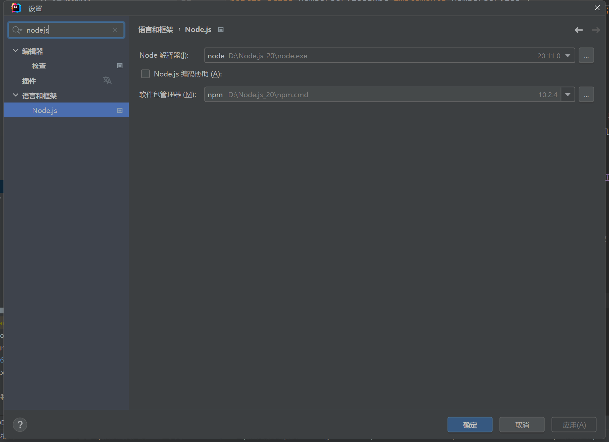

---


### 5.3 创建基于 Vue CLI 的 web 模块

1. 安装淘宝定制的 `cnpm`：

	```bash
	npm install -g cnpm --registry=https://registry.npmmirror.com
	```

2. 使用 cnpm 安装 vue@cli：

	```bash
	cnpm install -g @vue/cli
	```

3. 创建 web 模块：

	```bash
	vue create web
	```

4. Router：实现多页面应用，页面的跳转。

5. Vuex：全局保存变量。

6. Linter / fommater：代码检查规范。

7. history mode for router：使用历史模式，即 url 中没有 “#”，全是 “/” 的风格。

8. 启动命令：

	```bash
	npm run serve
	```

9. 上述命令的 `serve` 是什么意思呢？

	> package.json 相当于 Maven 的 pom.xml，其中的 scripts.serve：
	>
	> 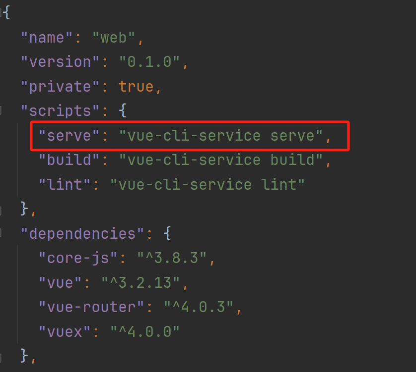

10. 手动修改端口为 9000：

	> 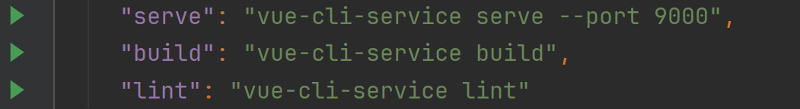

11. vue 帮我们自动下载的文件夹 `node_modules library root`，相当于 maven 下载的依赖，只不过 maven 是下载到本地 maven 仓库，而 vue 是直接下载到项目的 node_modules library root 文件夹。

12. public/index/html 是项目的入口。

13. /src/router/index.js 用于路由。

14. /src/store/index.js 用于创建全局变量，在页面间传递变量。

15. 先读到 main.js：

	```javascript
	import { createApp } from 'vue'
	import App from './App.vue'
	import router from './router'
	import store from './store'
	
	createApp(App).use(store).use(router).mount('#app')
	```

	将 App.vue 中的文件，连同 store 和 router 放到 index.html 中 id=app 的 div 下。

16. App.vue：

	```vue
	<template>
	  <nav>
	    <router-link to="/">Home</router-link> |
	    <router-link to="/about">About</router-link>
	  </nav>
	  <router-view/>
	</template>
	```

	> <router-view/> 是根据每个路由，显示不同的东西，如上面有两个 router-link，跳转到不同的页面。

	因此每个页面都有的东西，可以写到 App.vue 中。

17. 而每个页面独有的部分，则放到 /src/views 下。

18. 同时，view 下的每个 “view”，又可以引入 /scr/component 下的组件。

19. 在侧边栏中显示“npm”：

	> 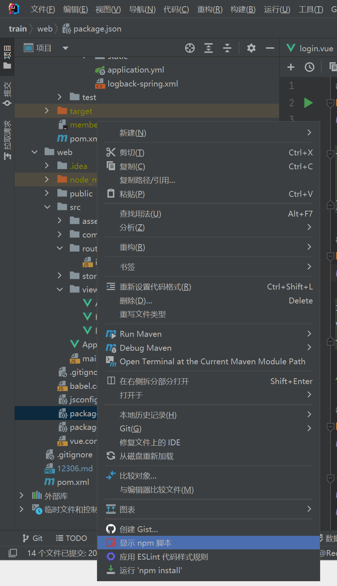

---


### 5.4 web 模块集成 AntDesignVue

1. 下载：

	```bash
	cnpm i --save ant-design-vue@3.2.15
	```

2. 用法：

	```javascript
	import Antd from 'ant-design-vue' // 全局引入 ant-design-vue 的所有组件
	import 'ant-design-vue/dist/antd.css' // 全局引入 ant-design-vue 的 css
	
	createApp(App)
	    .use(store)
	    .use(router)
	    .use(Antd)
	    .mount('#app')
	```

	```html
	<a-button>测试</a-button>
	```

3. 引入图标库：Icons

	```bash
	cnpm install --save @ant-design/icons-vue@6.1.0
	```

	> 注意：版本必须是 6.1.0，跟视频一致，否则按照视频的方式引入会报错！

	```javascript
	Object.keys(Icons).forEach((key) => {
	    app.component(key, Icons[key]);
	});
	
	app.mount('#app');
	```
	
	```html
	<PlusCircleOutlined/>
	```

---


### 5.6 注册登录二合一界面开发

1. Vue3 的基础语法：

	> 1. ":" 负责绑定属性；
	> 2. "@" 负责绑定事件。

2. Vue3 的核心是定义组件。一个页面既可以是页面，也可以是组件。

3. > 
	>
	> ---
	>
	> package.json 中的 eslintConfig 中，在
	>
	> 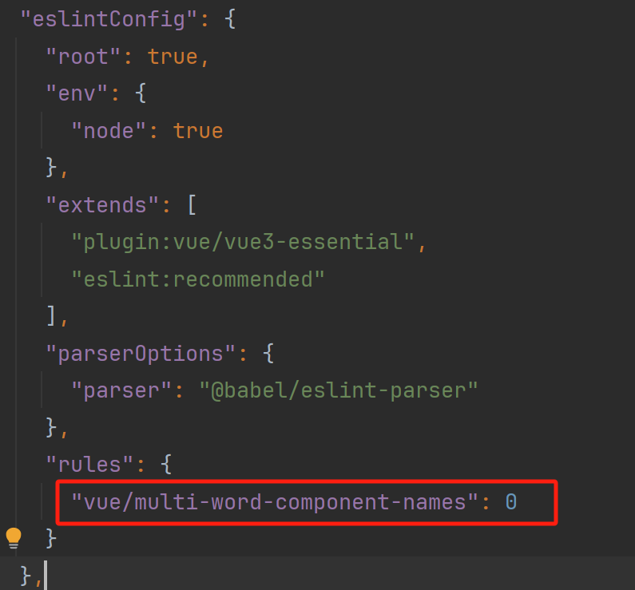

4. 使用 Grid 栅格布局，可以理解为页面的宽为 24，然后以此定义登录框的长度，比如定为 8。

5. ```vue
	<template>
	  <a-row class="login">
	    <a-col :span="8" :offset="8" class="login-main"> <!--登录框长度为8，offset即前面有8个格子-->
	      <h1 style="text-align: center">
	        <rocket-two-tone/>
	        登录
	      </h1>
	      <a-form
	          :model="loginForm"
	          name="basic"
	          autocomplete="off"
	          @finish="onFinish"
	          @finishFailed="onFinishFailed"
	      >
	        <a-form-item
	            label=""
	            name="mobile"
	            :rules="[{ required: true, message: '请输入手机号！' }]"
	        >
	          <a-input v-model:value="loginForm.mobile"/>
	        </a-form-item> <!--label是输入框前面的说明文字，这里不需要-->
	
	        <a-form-item
	            label=""
	            name="code"
	            :rules="[{ required: true, message: '请输入验证码！' }]"
	        >
	          <a-input v-model:value="loginForm.code">
	            <template #addonAfter>
	              <a @click="sendCode">获取验证码</a>
	            </template>
	          </a-input>
	        </a-form-item>
	
	        <a-form-item>
	          <a-button type="primary" block @click="login">登录</a-button>
	        </a-form-item>
	      </a-form>
	    </a-col>
	  </a-row>
	</template>
	
	<script setup>
	import {reactive} from 'vue';
	
	const loginForm = reactive({
	  mobile: '',
	  code: '',
	});
	const onFinish = values => {
	  console.log('Success:', values);
	};
	const onFinishFailed = errorInfo => {
	  console.log('Failed:', errorInfo);
	};
	const sendCode = {}
	const login = {}
	</script>
	
	<style>
	.login-main h1 {
	  font-size: 25px;
	  font-weight: bold;
	}
	
	.login-main {
	  margin-top: 100px;
	  padding: 30px 30px 20px;
	  border: 2px solid grey;
	  border-radius: 10px;
	  background-color: #fcfcfc;
	}
	</style>
	```

---


### 5.7 发送短信验证码接口开发

1. 主要是将验证码存到 redis 的时候，把 Springboot3 整合 redis 的坑踩了。

2. train/pom.xml：

	```xml
	<!-- Spring集成Redis组件 -->
	<dependency>
	    <groupId>org.springframework.integration</groupId>
	    <artifactId>spring-integration-redis</artifactId>
	    <version>6.3.0</version>
	</dependency>
	```

3. common/pom.xml：

	```xml
	<!--redis依赖-->
	<dependency>
	    <groupId>org.springframework.boot</groupId>
	    <artifactId>spring-boot-starter-data-redis</artifactId>
	</dependency>
	<!--Spring集成Redis组件-->
	<dependency>
	    <groupId>org.springframework.integration</groupId>
	    <artifactId>spring-integration-redis</artifactId>
	</dependency>
	```

4. RedisConfig：

	```java
	package garry.train.common.config;
	
	import org.springframework.context.annotation.Bean;
	import org.springframework.context.annotation.Configuration;
	import org.springframework.data.redis.connection.RedisConnectionFactory;
	import org.springframework.data.redis.core.RedisTemplate;
	import org.springframework.data.redis.core.StringRedisTemplate;
	import org.springframework.data.redis.serializer.StringRedisSerializer;
	
	/**
	 * @author Garry
	 * ---------2024/9/9 15:45
	 **/
	
	@Configuration
	public class RedisConfig {
	
	    /**
	     * RedisTemplate模板
	     */
	    @Bean("redisTemplate")
	    public RedisTemplate<String, Object> redisTemplate(RedisConnectionFactory factory) {
	        RedisTemplate<String, Object> redisTemplate = new RedisTemplate<>();
	        redisTemplate.setConnectionFactory(factory);
	
	        // 使用字符串序列化value，防止默认使用JDK序列化机制，导致value变为形如“\xac\xed\x00\x05t\x00\x04kr1m”的乱码
	        redisTemplate.setKeySerializer(new StringRedisSerializer());
	        redisTemplate.setValueSerializer(new StringRedisSerializer());
	        redisTemplate.setHashKeySerializer(new StringRedisSerializer());
	        redisTemplate.setHashValueSerializer(new StringRedisSerializer());
	
	        redisTemplate.afterPropertiesSet();
	        return redisTemplate;
	    }
	
	    /**
	     * StringRedisTemplate模板
	     */
	    @Bean
	    public StringRedisTemplate stringRedisTemplate(RedisConnectionFactory factory) {
	        StringRedisTemplate stringRedisTemplate = new StringRedisTemplate();
	        stringRedisTemplate.setConnectionFactory(factory);
	        stringRedisTemplate.setKeySerializer(new StringRedisSerializer());
	        return stringRedisTemplate;
	    }
	}
	```
	
5. 阿里云短信依赖：

  ```xml
  <!--阿里云短信服务提供商的API，核心包-->
          <dependency>
              <groupId>com.aliyun</groupId>
              <artifactId>aliyun-java-sdk-core</artifactId>
          </dependency>
          <!--阿里云短信服务提供商的API，dysmsapi包-->
          <dependency>
              <groupId>com.aliyun</groupId>
              <artifactId>aliyun-java-sdk-dysmsapi</artifactId>
          </dependency>
  ```

6. 阿里云短信服务接口：

  ```java
  @Slf4j
  @Service
  public class SmsServiceImpl implements SmsService {
      @Value("${aliyun.sms.accessKeyId}")
      private String accessKeyId;
  
      @Value("${aliyun.sms.accessKeySecret}")
      private String accessKeySecret;
  
      @Value("${aliyun.sms.signName}")
      private String signName;
  
      @Value("${aliyun.sms.templateCode}")
      private String templateCode;
  
      //短信API产品名称（短信产品名固定，无需修改）
      private final String product = "Dysmsapi";
  
      //短信API产品域名（接口地址固定，无需修改）
      private final String domain = "dysmsapi.aliyuncs.com";
  
      @Override
      public void sendSms(String phoneNumber, String templateParam) {
          try {
              // 创建DefaultAcsClient实例并初始化
              DefaultProfile profile = DefaultProfile.getProfile("cn-hangzhou", accessKeyId, accessKeySecret);
              DefaultProfile.addEndpoint("cn-hangzhou", "cn-hangzhou", product, domain);
              IAcsClient client = new DefaultAcsClient(profile);
  
              // 创建SendSmsRequest实例，并设置相应的参数
              SendSmsRequest request = new SendSmsRequest();
              request.setMethod(MethodType.POST);
              request.setPhoneNumbers(phoneNumber);
              request.setSignName(signName);
              request.setTemplateCode(templateCode);
              request.setTemplateParam(templateParam);
  
              // 发起请求并处理响应
              SendSmsResponse response = client.getAcsResponse(request);
              if (!StringUtils.equals("OK", response.getCode())){
                  log.info("[短信服务] 发送短信失败，手机号码：{}，原因：{}，response = {}", phoneNumber, response.getMessage(), JSONObject.toJSON(response));
                  throw new BusinessException(ResponseEnum.MESSAGE_CODE_SEND_FAILED);
              } else {
                  log.info("[短信服务] 发送短信成功，response = {}", JSONObject.toJSON(response));
              }
  
          } catch (ClientException e) {
              log.error("[短信服务] 发送短信异常，手机号码：{}，错误码：{}，错误信息：{}", phoneNumber, e.getErrCode(), e.getErrMsg());
              throw new BusinessException(ResponseEnum.MESSAGE_CODE_SEND_FAILED);
          } catch (Exception e) {
              log.error("[短信服务] 发送短信异常，手机号码：{}", phoneNumber, e);
              throw new BusinessException(ResponseEnum.MESSAGE_CODE_SEND_FAILED);
          }
      }
  }
  ```

  > 注意：
  >
  > 1. templateCode 必须是 JSON 字符串。
  > 2. 测试 signName 和测试 templateCode 必须配套使用。
  > 3. 测试环境下，发送的手机号，必须在短信控制台先注册，才能发送。

---


### 5.8 短信验证码登录接口开发

1. service：

	```java
	@Override
	public MemberLoginVo login(MemberLoginForm form) {
	    String mobile = form.getMobile();
	    String code = form.getCode();
	    List<Member> members = selectMembersByMobile(mobile);
	
	    if (CollUtil.isEmpty(members)) {
	        log.info("手机号 {} 不存在", mobile);
	        throw new BusinessException(ResponseEnum.MOBILE_NOT_EXIST);
	    }
	
	    String rightCode = (String) redisTemplate.opsForValue().get(RedisUtil.getRedisKey4Code(mobile));
	    if (StrUtil.isBlank(rightCode)) {
	        log.info("手机号 {} 未获取验证码或验证码已过期", mobile);
	        throw new BusinessException(ResponseEnum.CODE_NOT_EXIST);
	    }
	
	    if (!rightCode.equals(code)) {
	        log.info("手机号 {} 的验证码 {} 与正确验证码 {} 不匹配", mobile, code, rightCode);
	        throw new BusinessException(ResponseEnum.WRONG_CODE);
	    }
	
	    log.info("手机号 {} 的用户身份验证成功", mobile);
	    Member member = members.get(0);
	    MemberLoginVo vo = BeanUtil.copyProperties(member, MemberLoginVo.class);
	    return vo;
	}
	```

2. controller：

	```java
	@RequestMapping(value = "/login", method = RequestMethod.POST)
	public ResponseVo login(@Valid @RequestBody MemberLoginForm form) {
	    MemberLoginVo vo = memberService.login(form);
	    return ResponseVo.success(vo);
	}
	```

3. 注意：必须使用 @RequestBody 修饰 Form 参数，才能接收(application/json)格式的请求。

	> 对所有的 Form 参数使用 @RequestBody 修饰，使得控制器将收到的 JSON 字符串转化为 Form 对象，但是缺点是只能接收 application/json 格式的请求，对于默认的 application/x-www-form-urlencoded 的请求无法正确地生成 Form 对象了，即不能接收 application/x-www-form-urlencoded 类型的请求。

---


### 5.9 集成 axios 完成登录功能

1. 下载 axios 依赖：

	```bash
	cnpm install axios@1.3.2
	```

2. import：

	```javascript
	import axios from 'axios';
	```

3. sendCode：

	```javascript
	const sendCode = () => { // 注意，此处必须是 = () => {} 的 lambda 表达式的写法，而不能是 = {}，后者不是函数！
	    console.log("sendCode");
	    axios.post("http://localhost:8080/member/member/send-code", {
	        mobile: loginForm.mobile
	    }).then(response => { // 这里也是 lambda 表达式，response 作参数
	        console.log("sendCode");
	        alert(JSON.stringify(response));
	    });
	}
	```

	> 注意，必须是：
	>
	> ```javascript
	> const sendCode = () => {}
	> ```
	>
	> 因为 `() => {}` 是一个 lambda 表达式。
	>
	> 而不能是：
	>
	> ```javascript
	> const sendCode = {}
	> ```
	>
	> 这不是一个函数的声明格式，会报错：sendCode 不是一个函数！

4. 跨域报错：

	> Access to XMLHttpRequest at 'http://localhost:8080/member/member/send-code' from origin 'http://localhost:9000' has been blocked by CORS policy: Response to preflight request doesn't pass access control check: No 'Access-Control-Allow-Origin' header is present on the requested resource.

	跨域：前端和后端不在同一个域(domain)；IP 一样，端口不同也算跨域；127.0.0.1 和 localhost 也算跨域，因为 localhost 是一个配置，其默认值是 127.0.0.1，但也可以改。

5. gateway/application.yml，允许跨域请求后端接口：

	```yaml
	spring:
	  cloud:
	    gateway:
	      globalcors: # 允许跨域
	        cors-configurations:
	          '[/**]':
	            allowed-origin-patterns: # 允许所有来源
	              - "*"
	            allowed-headers: # 允许携带的头信息
	              - "*"
	            allowed-methods: # 允许的请求方式
	              - "*"
	            allow-credentials: true  # 是否允许携带 cookie
	            max-age: 3600  # 跨域检测的有效期，前端会发起一个 OPTION 请求看接口是否可用，可用才会真正发起你的 POST | GET 请求
	```

6. 前端发到后端的请求，默认是 application/json 的格式。

7. axios 使用：

	```javascript
	const sendCode = () => { // 注意，此处必须是 = () => {} 的 lambda 表达式的写法，而不能是 = {}，后者不是函数！
	    axios.post("http://localhost:8080/member/member/send-code", {
	        mobile: loginForm.mobile
	    }).then(response => { // 这里也是 lambda 表达式，response 作参数
	        let responseVo = response.data;
	        if (responseVo.success) {
	            notification.success({description: '验证码发送成功，请在5分钟内完成登录'});
	        } else {
	            notification.error({description: responseVo.msg});
	        }
	    });
	}
	
	const login = () => {
	    axios.post("http://localhost:8080/member/member/login", {
	        mobile: loginForm.mobile,
	        code: loginForm.code
	    }).then(response =>{
	        let responseVo = response.data;
	        if (responseVo.success) {
	            notification.success({description: '登录成功'});
	            // 跳转到用户主页
	
	        } else {
	            notification.error({description: responseVo.msg});
	        }
	    })
	}
	```
	
8. 验证码倒计时：

	```javascript
	const setupTimer = () => {
	  // 设置倒计时参数
	  sendCodeLabel.value = `${countdown.value}秒`;
	  counting.value = true;
	
	  // 修改字体颜色
	  sendCodeRef.value.style.color = '#808080';
	
	  // 倒计时函数
	  const intervalId = setInterval(() => {
	    countdown.value--;
	    sendCodeLabel.value = `${countdown.value}秒`;
	
	    if (countdown.value === 0) {
	      clearInterval(intervalId); // 清除定时器
	      sendCodeLabel.value = '获取验证码'; // 重置按钮文本
	      counting.value = false; // 标记倒计时结束
	      sendCodeRef.value.style.color = '#1890ff'; // 字体恢复颜色
	    }
	  }, 1000);
	};
	
	const sendCode = () => {
	  if (counting.value) { // 倒计时中直接return
	    notification.error({description: '请勿频繁获取验证码'});
	    return;
	  }
	
	  axios.post("http://localhost:8080/member/member/send-code", {
	    mobile: loginForm.mobile
	  }).then(response => {
	    let responseVo = response.data;
	    if (responseVo.success) {
	      notification.success({description: '验证码发送成功，请在5分钟内完成登录'});
	      countdown.value = 60;
	      setupTimer(); // 短信发送成功，启动60秒计时器
	    } else {
	      notification.error({description: responseVo.msg});
	      // 服务器异常开启60秒倒计时，防止在服务器不正常的时候接收大量请求
	      if (responseVo.code === 3) {
	        countdown.value = 60;
	      } else { // 参数输入异常，3秒倒计时
	        countdown.value = 3;
	      }
	      setupTimer();
	    }
	  });
	}
	```

---


### 5.10 增加 axios 拦截器配置

1. 在 main.js 中增加 axios 拦截器：

	```javascript
	/**
	 * axios 拦截器
	 */
	axios.interceptors.request.use(function (config) {
	    console.log('请求参数: ', config);
	    return config;
	}, error => {
	    return Promise.reject(error);
	});
	
	axios.interceptors.response.use(function (response) {
	    console.log('返回结果: ', response);
	    return response;
	}, error => {
	    console.log('返回错误: ', error);
	    return Promise.reject(error);
	});
	```

	> 注意：`console.log('请求参数: ', config);` 中是“,” 而不是“+”

---


### 5.11 VueCLI 多环境配置

1. 在 web 目录下创建 .env.dev，前面的 `.env` 必须固定。

	```properties
	NODE_ENV=development
	VUE_APP_SERVER=http://localhost:8080
	```

2. 在 main.js 中打印启动日志：

	```javascript
	/**
	 * 打印启动环境日志
	 */
	console.log('环境: ', process.env.NODE_ENV);
	console.log('服务端: ', process.env.VUE_APP_SERVER);
	```

3. 发现前端没有读我们的配置文件 `.env.dev`：

	> 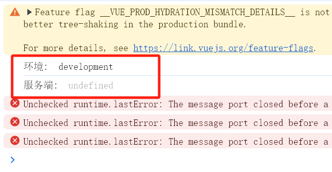

4. 需要在 package.json 中配置：

	```json
	"serve": "vue-cli-service serve --mode dev --port 9000",
	```

	这样就会找到 `.env.dev` 文件读取配置。

5. 在 main.js 中为 axios 配置默认的访问域名：

	```javascript
	axios.defaults.baseURL = process.env.VUE_APP_SERVER;
	```

6. 然后所有的前端请求，都可以省略前面的 http://localhost:8080 了。

---


### 5.12 增加 web 控台主页

1. 代码直接去 ant-design-vue 官网 copy 一个喜欢的模板。

2. ```javascript
	const router = useRouter();
	// 跳转到控台主页
	router.push('/');
	```

---


### 5.13 制作 Vue3 公共组件

1. 提取公共头部组件 `the-header`：

	```vue
	<template>
	  <a-layout-header class="header">
	    <div class="logo"/>
	    <a-menu
	        v-model:selectedKeys="selectedKeys1"
	        theme="dark"
	        mode="horizontal"
	        :style="{ lineHeight: '64px' }"
	    >
	      <a-menu-item key="1">nav 1</a-menu-item>
	      <a-menu-item key="2">nav 2</a-menu-item>
	      <a-menu-item key="3">nav 3</a-menu-item>
	    </a-menu>
	  </a-layout-header>
	</template>
	
	<script>
	import {defineComponent, ref} from 'vue';
	
	export default defineComponent({
	  name: 'the-header-view',
	  setup() {
	    const selectedKeys1 = ref(['2']);
	
	    return {
	      selectedKeys1,
	    };
	  },
	});
	</script>
	
	<style scoped> /*scoped修饰的css只在本页面生效*/
	.logo {
	  float: left;
	  width: 120px;
	  height: 31px;
	  margin: 16px 24px 16px 0;
	  background: rgba(255, 255, 255, 0.3);
	}
	</style>
	```

2. 提取公共侧边栏组件 `the-sider-view`：

	```vue
	<template>
	  <a-layout-sider width="200" style="background: #fff">
	    <a-menu
	        v-model:selectedKeys="selectedKeys2"
	        v-model:openKeys="openKeys"
	        mode="inline"
	        :style="{ height: '100%', borderRight: 0 }"
	    >
	      <a-sub-menu key="sub1">
	        <template #title>
	              <span>
	                <user-outlined/>
	                subnav 1
	              </span>
	        </template>
	        <a-menu-item key="1">option1</a-menu-item>
	        <a-menu-item key="2">option2</a-menu-item>
	        <a-menu-item key="3">option3</a-menu-item>
	        <a-menu-item key="4">option4</a-menu-item>
	      </a-sub-menu>
	      <a-sub-menu key="sub2">
	        <template #title>
	              <span>
	                <laptop-outlined/>
	                subnav 2
	              </span>
	        </template>
	        <a-menu-item key="5">option5</a-menu-item>
	        <a-menu-item key="6">option6</a-menu-item>
	        <a-menu-item key="7">option7</a-menu-item>
	        <a-menu-item key="8">option8</a-menu-item>
	      </a-sub-menu>
	      <a-sub-menu key="sub3">
	        <template #title>
	              <span>
	                <notification-outlined/>
	                subnav 3
	              </span>
	        </template>
	        <a-menu-item key="9">option9</a-menu-item>
	        <a-menu-item key="10">option10</a-menu-item>
	        <a-menu-item key="11">option11</a-menu-item>
	        <a-menu-item key="12">option12</a-menu-item>
	      </a-sub-menu>
	    </a-menu>
	  </a-layout-sider>
	</template>
	
	<script>
	import {defineComponent, ref} from 'vue';
	
	export default defineComponent({
	  name: 'the-sider-view',
	  setup() {
	    const selectedKeys2 = ref(['1']);
	    const openKeys = ref(['sub1']);
	
	    return {
	      selectedKeys2,
	      openKeys,
	    };
	  },
	});
	
	</script>
	
	<style scoped>
	
	</style>
	```

3. 在 main.vue 中的处理：

	```vue
	<template>
	  <a-layout>
	    <the-header-view/><!--公共头部组件-->
	    <a-layout>
	      <the-sider-view/><!--公共侧边栏组件-->
	      <a-layout style="padding: 0 24px 24px; text-align: left">
	        <a-breadcrumb style="margin: 16px 0">
	          <a-breadcrumb-item>Home</a-breadcrumb-item>
	          <a-breadcrumb-item>List</a-breadcrumb-item>
	          <a-breadcrumb-item>App</a-breadcrumb-item>
	        </a-breadcrumb>
	        <a-layout-content
	            :style="{ background: '#fff', padding: '24px', margin: 0, minHeight: '280px' }"
	        >
	          Content
	        </a-layout-content>
	      </a-layout>
	    </a-layout>
	  </a-layout>
	</template>
	<script>
	import {defineComponent, ref} from 'vue';
	import TheHeaderView from "@/components/the-header.vue";
	import TheSiderView from "@/components/the-sider.vue";
	
	export default defineComponent({
	  name: 'main-view',
	  components: {
	    TheSiderView,
	    TheHeaderView,
	  },
	  setup() {
	
	  },
	});
	</script>
	<style scoped>
	
	</style>
	```

---


## 第六章：JWT 单点登录

### 6.1 单点登录介绍

1. 为什么要单点登录：实现一套产品中登录一个，其它的产品就随之完成登录。
2. 单点登录的实现方案：redis + token(token 做 key，用户信息的 JSON 做 value)；JWT。

---


### 6.3 JWT 单点登录原理与存在的问题及解决方案

1. JWT 的格式：Header + Payload + Signature。

2. Header：存放 JWT 前面算法。

3. Payload：存放我们自己的信息（用户登录信息）。

4. Signature：签名，用于校验数据。

5. ==获取 JWT 的方法（key 是密钥，相当于盐值）==：

	```java
	// 密钥，相当于盐值
	byte[] key = "1234567890".getBytes();
	
	String token = JWT.create()
	    .setPayload("sub", "1234567890")
	    .setPayload("name", "looly")
	    .setPayload("admin", true)
	    .setKey(key)
	    .sign();
	```

6. 解密 JWT 的方法：

	```java
	String rightToken = "eyJ0eXAiOiJKV1QiLCJhbGciOiJIUzI1NiJ9." +
	    "eyJzdWIiOiIxMjM0NTY3ODkwIiwiYWRtaW4iOnRydWUsIm5hbWUiOiJsb29seSJ9." +
	    "536690902d931d857d2f47d337ec81048ee09a8e71866bcc8404edbbcbf4cc40";
	
	// 密钥
	byte[] key = "1234567890".getBytes();
	
	JWT jwt = JWT.of(rightToken).setKey(key);
	
	// JWT
	jwt.getHeader(JWTHeader.TYPE);
	// HS256
	jwt.getHeader(JWTHeader.ALGORITHM);
	
	// 1234567890
	jwt.getPayload("sub");
	// looly
	jwt.getPayload("name");
	// true
	jwt.getPayload("admin");
	```

	

7. ==JWT 的问题（重中之重）==：

	> 1. token 被解密，如果别人知道你是用 hutool 生成的 JWT，那么直接用 hutool 的解密工具就破解了。
	>
	> 	解决方法：增加盐值(salt)，每个项目的盐值不能一样，防止一个被破解，全部被破解。
	>
	> 2. token 被拿到第三方使用，就比如你包装了一个页面，对外宣称这是你研发的 chatgpt，结果是调用 chatgpt 的接口，给所有你的用户的 token 都是真 chatgpt 发给你的 token。
	>
	> 	解决方法：对请求量高的 token 限流，降低包装者的用户体验。

---


### 6.4 生成 JWT 单点登录

1. common 中创建工具类 JWTUtil：

	```java
	@Slf4j
	public class JWTUtil {
	
	    private static final String key = "theBravestGarry20240201";
	
	    /**
	     * 生成 JWT
	     */
	    public static String createToken(Long id, String mobile) {
	        HashMap<String, Object> payload = new HashMap<>();
	        payload.put("id", id);
	        payload.put("mobile", mobile);
	
	        DateTime now = DateTime.now();
	        DateTime expireTime = now.offsetNew(DateField.HOUR, CommonConst.JWT_EXPIRE_HOUR);
	        payload.put(JWTPayload.ISSUED_AT, now); // 签发时间
	        payload.put(JWTPayload.EXPIRES_AT, expireTime); // 过期时间
	        payload.put(JWTPayload.NOT_BEFORE, now); // 生效时间
	
	        String token = cn.hutool.jwt.JWTUtil.createToken(payload, key.getBytes());
	        log.info("已为手机号 {} 的用户生成 JWT: {}", mobile, token);
	        return token;
	    }
	
	    /**
	     * 校验 token 是否有效，无效则抛出业务异常，供统一异常处理
	     */
	    public static boolean validate(String token) {
	        JWT jwt = JWT.of(token).setKey(key.getBytes());
	        boolean validate = jwt.validate(0);
	        if (validate) {
	            return true;
	        } else {
	            throw new BusinessException(ResponseEnum.WRONG_TOKEN);
	        }
	    }
	
	    /**
	     * 获取 JWT 中的原始内容
	     */
	    public static JSONObject getJSONObject(String token) {
	        validate(token);
	        JWT jwt = JWT.of(token).setKey(key.getBytes());
	        JSONObject payloads = jwt.getPayloads();
	        payloads.remove(JWTPayload.ISSUED_AT);
	        payloads.remove(JWTPayload.EXPIRES_AT);
	        payloads.remove(JWTPayload.NOT_BEFORE);
	        log.info("根据token获取的原始内容: {}", payloads);
	        return payloads;
	    }
	}
	```

2. 在 login 中使用：

	```java
	Member member = members.get(0);
	MemberLoginVo vo = BeanUtil.copyProperties(member, MemberLoginVo.class);
	vo.setToken(JWTUtil.createToken(member.getId(), member.getMobile()));
	return vo;
	```

---


### 6.5 使用 vuex 保存登录信息

1. 找到 @/store/index.js，修改：

	```javascript
	import { createStore } from 'vuex'
	
	export default createStore({
	  state: { // 定义全局变量
	    member: {}
	  },
	  getters: { // 定义全局变量的get方法
	
	  },
	  mutations: { // 定义全局变量的set方法
	    setMember (state, member) {
	      state.member = member;
	    }
	  },
	  actions: { // 定义异步方法
	
	  },
	  modules: { // 定义模块，一个模块里可以有 state, getters, mutations, actions 等参数
	
	  }
	})
	```

2. 将 token 存储到前端：

	```javascript
	store.commit("setMember", responseVo.data);
	```

3. the-head-view 中获取 store 中声明的 member：

	```javascript
	let member = store.state.member;
	```

4. 这种方式的==缺点==：一旦刷新页面，member 就没了。（可以把 store 理解为前端页面的缓存）

---


### 6.6 vuex 配合 h5 的 session 解决浏览器刷新问题

1. session-storage.js：

	```javascript
	SessionStorage = {
	    get: function (key) {
	        var v = sessionStorage.getItem(key);
	        if (v && typeof(v) !== "undefined" && v !== "undefined") {
	            return JSON.parse(v);
	        }
	    },
	    set: function (key, data) {
	        sessionStorage.setItem(key, JSON.stringify(data));
	    },
	    remove: function (key) {
	        sessionStorage.removeItem(key);
	    },
	    clearAll: function () {
	        sessionStorage.clear();
	    }
	};
	```

2. index.html 中引入 session-storage.js：

	```html
	<script src="<%= BASE_URL %>js/session-storage.js"></script>
	```

3. 在 index.js 中修改 setMember，并让全局变量 member 等于 StorageSession 中的 member：

	```javascript
	state: { // 定义全局变量
	    member: window.SessionStorage.get(MEMBER) || {}
	},
	
	mutations: { // 定义全局变量的set方法
	    setMember (state, member) {
	        state.member = member;
	        window.SessionStorage.set(MEMBER, member);
	    }
	},
	```

---


### 6.7 gateway 创建拦截器的 demo

```java
@Component
public class CustomGlobalFilter implements GlobalFilter, Ordered {

    @Override
    public Mono<Void> filter(ServerWebExchange exchange, GatewayFilterChain chain) {
        // 在请求处理之前执行的逻辑
        System.out.println("Pre-processing logic");

        // 继续执行过滤器链
        return chain.filter(exchange).then(Mono.fromRunnable(() -> {
            // 在请求处理之后执行的逻辑
            System.out.println("Post-processing logic");
        }));
    }

    @Override
    public int getOrder() {
        // 设置过滤器的优先级，数字越小优先级越高
        return -1;
    }

}
```

---


### 6.8 gateway 增加登录校验拦截器

1. gateway 中增加：

	```java
	@Slf4j
	@Component
	public class MemberLoginFilter implements GlobalFilter, Ordered {
	    @Override
	    public Mono<Void> filter(ServerWebExchange exchange, GatewayFilterChain chain) {
	        String path = exchange.getRequest().getURI().getPath();
	        log.info("------------- 开始 " + path + " -------------");
	
	        // 排除不需要过滤的接口
	        if (path.contains("/admin")
	                || path.contains("/hello")
	                || path.contains("/member/member/login")
	                || path.contains("/member/member/send-code")) {
	            log.info("{} 不需要登录", path);
	        } else {
	            String token = exchange.getRequest().getHeaders().getFirst("token");
	            log.info("会员登录验证开始，token = {}", token);
	            if(StrUtil.isBlank(token) || !JWTUtil.validate(token)) {
	                log.info("token为空、无效或已过期");
	                exchange.getResponse().setStatusCode(HttpStatus.UNAUTHORIZED);
	                log.info("------------- 结束 " + path + " -------------\n");
	                return exchange.getResponse().setComplete();
	            }
	        }
	
	        return chain.filter(exchange).then(Mono.fromRunnable(() -> {
	            // 在请求处理之后执行的逻辑
	            log.info("------------- 结束 -------------\n");
	        }));
	    }
	
	    @Override
	    public int getOrder() {
	        return -1; // 设置过滤器的优先级，数字越小优先级越高
	    }
	}
	```

---


### 6.9 为 axios 请求增加统一拦截器

1. main.js 中统一拦截器：

	```javascript
	axios.interceptors.request.use(function (config) {
	    console.log('请求参数: ', config);
	    // 给所有的请求加上token
	    const token = store.state.member.token;
	    if (token) {
	        config.headers.token = token;
	        console.log('请求headers增加token: ' + token);
	    }
	    return config;
	}, error => {
	    return Promise.reject(error);
	});
	```

2. 效果：

	> 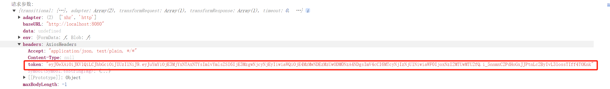

3. 特殊处理 401，权限不足，跳转到 /login：

	```javascript
	axios.interceptors.request.use(function (config) {
	    // 给所有的请求加上token
	    console.log('请求参数: ', config);
	    const token = store.state.member.token;
	    if (token) {
	        config.headers.token = token; /*必须写死token，因为网关就写死从headers里面获取"token"*/
	        console.log('请求headers增加token: ' + token);
	    }
	    return config;
	}, error => {
	    let response = error.response;
	    const status = response.status;
	    if (status === 401) {
	        // 特殊处理 401，权限不足，跳转到 /login
	        console.log('未登录或登录超时，跳转到登录页面');
	        store.commit('setMember', {});
	        notification.error({description: '未登录或登录超时'});
	        router.push('/login');
	    }
	    return Promise.reject(error);
	});
	```

4. 解决浏览器页面弹出红色报错遮罩层：

	vue.config.js：

	```javascript
	const {defineConfig} = require('@vue/cli-service')
	module.exports = defineConfig({
	    transpileDependencies: true,
	
	    devServer: {
	        // 解决页面弹出红色报错遮罩层
	        client: {
	            overlay: false
	        }
	    }
	})
	```

---


### 6.10 router 路由跳转增加登录拦截

1. 问题：我们现在是要通过在前端访问后端接口，才能发现是否登录，如果某些页面没有访问后端接口的请求，那么通过 axios 的统一拦截器是不能阻止未登录的用户访问的。

2. 在 router/index.js 中进行统一路由拦截校验：

	```javascript
	router.beforeEach((to, from, next) => {
	    // 要不要对meta.loginRequire属性做监控拦截
	    if (to.matched.some(function (item) {
	        console.log("\"" + item.path + "\"是否需要登录校验：", item.meta.loginRequire || false);
	        return item.meta.loginRequire;
	    })) {
	        const member = store.state.member;
	        console.log("member = ", member);
	        if (!member || !member.token) {
	            console.log("用户未登录或登录超时！");
	            notification.error({ description: "未登录或登录超时" });
	            next('/login');
	        } else {
	            next();
	        }
	    } else {
	        next();
	    }
	});
	```

---


## 第七章：Member 基础功能实现

### 7.3 passenger 新增接口开发

1. PassengerTypeEnum：

	```java
	public enum PassengerTypeEnum {
	
	    ADULT("1", "成人"),
	
	    CHILD("2", "儿童"),
	
	    STUDENT("3", "学生"),
	    ;
	
	    private final String code;
	
	    private final String desc;
	
	    PassengerTypeEnum(String code, String desc) {
	        this.code = code;
	        this.desc = desc;
	    }
	
	    public static List<HashMap<String, String>> getEnumList() {
	        List<HashMap<String, String>> list = new ArrayList<>();
	        for (PassengerTypeEnum anEnum : EnumSet.allOf(PassengerTypeEnum.class)) {
	            HashMap<String, String> map = new HashMap<>();
	            map.put("code", anEnum.code);
	            map.put("desc", anEnum.desc);
	            list.add(map);
	        }
	        return list;
	    }
	}
	```

2. Service：

	```java
	public void save(PassengerSaveForm form) {
	    Passenger passenger = BeanUtil.copyProperties(form, Passenger.class);
	    // 对Id、createTime、updateTime 重新赋值
	    passenger.setId(CommonUtil.getSnowflakeNextId());
	    DateTime now = DateTime.now();
	    passenger.setCreateTime(now);
	    passenger.setUpdateTime(now);
	    passengerMapper.insert(passenger);
	}
	```

3. Controller：

	```java
	@RequestMapping(value = "/save", method = RequestMethod.POST)
	public ResponseVo save(@Valid @RequestBody PassengerSaveForm form) {
	    passengerService.save(form);
	    return ResponseVo.success();
	}
	```

---


### 7.4 使用 HttpClient 保存登录信息

1. 使用 HTTPClient 自带的脚本功能，将登录请求成功后的 token 存到全局 token 中：

	```http
	POST http://localhost:8080/member/member/login
	Content-Type: application/json
	
	{
	  "mobile": "17380672612",
	  "code": "gary"
	}
	
	> 
	
	###
	```

2. 其它需要登录的接口中，引入全局变量 token：

	```http
	POST http://localhost:8080/member/passenger/save
	Content-Type: application/json
	token: {{token}}
	
	{
	  "memberId": 1833041335083470848,
	  "name": "Garry",
	  "idCard": "000000200401270000",
	  "type": "3"
	}
	
	###
	```

---


### 7.5 使用 ThreadLocal 存储会员信息

1. common.util.HostHolder：

	```java
	@Slf4j
	@Component
	public class HostHolder {
	    private final ThreadLocal<MemberLoginVo> members = new ThreadLocal<>();
	
	    public void setMember(MemberLoginVo vo) {
	        members.set(vo);
	    }
	
	    public MemberLoginVo getMember() {
	        return members.get();
	    }
	
	    public void remove() {
	        members.remove();
	    }
	
	    public Long getMemberId() {
	        try {
	            return members.get().getId();
	        } catch (Exception e) {
	            log.error(ResponseEnum.THREAD_LOCAL_ERROR.getMsg());
	            throw new BusinessException(ResponseEnum.THREAD_LOCAL_ERROR);
	        }
	    }
	}
	```

2. common 中的 MemberInterceptor：

	```java
	@Slf4j
	@Component
	public class MemberInterceptor implements HandlerInterceptor {
	    @Resource
	    private HostHolder hostHolder;
	
	    /**
	     * 获取 request header 中的 token，由此获取 token 中的原始信息，保存到 hostHolder 中
	     */
	    @Override
	    public boolean preHandle(HttpServletRequest request, HttpServletResponse response, Object handler) {
	        log.info("------------- MemberInterceptor 开始 -------------");
	        String path = request.getContextPath() + request.getServletPath();
	        log.info("MemberInterceptor 拦截路径 = {}", path);
	        String token = request.getHeader("token");
	        if (StrUtil.isNotBlank(token)) {
	            log.info("获取会员登录 token = {}", token);
	            JSONObject loginMember = JWTUtil.getJSONObject(token);
	            MemberLoginVo memberLoginVo = JSONUtil.toBean(loginMember, MemberLoginVo.class);
	            memberLoginVo.setToken(token);
	            log.info("当前登录会员：{}", memberLoginVo);
	            hostHolder.setMember(memberLoginVo);
	        } else {
	            log.info("{} 的 token 不存在或已过期", path);
	        }
	
	        return true;
	    }
	
	    @Override
	    public void postHandle(HttpServletRequest request, HttpServletResponse response, Object handler, ModelAndView modelAndView) {
	    }
	
	    @Override
	    public void afterCompletion(HttpServletRequest request, HttpServletResponse response, Object handler, Exception ex) {
	        hostHolder.remove();
	    }
	}
	```

3. Member 中的对拦截器的配置类 InterceptorConfig：

	```java
	@Configuration
	public class InterceptorConfig implements WebMvcConfigurer {
	    @Resource
	    MemberInterceptor memberInterceptor;
	
	    @Override
	    public void addInterceptors(InterceptorRegistry registry) {
	        // 路径不要包含context-path(即 application.yml 中配置的，最前面的：/member)
	        registry.addInterceptor(memberInterceptor)
	                .addPathPatterns("/**")
	                .excludePathPatterns(
	                        "/hello",
	                        "/member/send-code",
	                        "/member/login"
	                );
	    }
	}
	```
	
4. 再创建 LoginInterceptor，解决 LogAspect 执行在 MemberInterceptor 之后，导致 MemberInterceptor 的日志中没有流水号的问题：

  ```java
  @Component
  public class LoginInterceptor implements HandlerInterceptor {
      @Override
      public boolean preHandle(HttpServletRequest request, HttpServletResponse response, Object handler) {
          log.info("------------- LoginInterceptor 开始 -------------");
          // MDC 是 Slf4j 自带的，用于存放我们自定义的键值对，比如在logback-spring.xml中的LOG_ID
          String logId = CommonUtil.generateUUID(CommonConst.LOG_ID_LENGTH);
          MDC.put("LOG_ID", logId);
          log.info("LOG_ID = {}", logId);
          return true;
      }
  
      @Override
      public void postHandle(HttpServletRequest request, HttpServletResponse response, Object handler, ModelAndView modelAndView) {
      }
  
      @Override
      public void afterCompletion(HttpServletRequest request, HttpServletResponse response, Object handler, Exception ex) {
      }
  }
  ```

  > ```java
  > @Configuration
  > public class InterceptorConfig implements WebMvcConfigurer {
  >     @Resource
  >     private MemberInterceptor memberInterceptor;
  > 
  >     @Resource
  >     private LoginInterceptor loginInterceptor;
  > 
  >     @Override
  >     public void addInterceptors(InterceptorRegistry registry) {
  >         registry.addInterceptor(loginInterceptor)
  >                 .addPathPatterns("/**")
  >                 .excludePathPatterns(
  >                 );
  > 
  >         // 路径不要包含context-path(即 application.yml 中配置的，最前面的：/member)
  >         registry.addInterceptor(memberInterceptor)
  >                 .addPathPatterns("/**")
  >                 .excludePathPatterns(
  >                         "/hello",
  >                         "/member/send-code",
  >                         "/member/login"
  >                 );
  >     }
  > }
  > ```
  >
  > `loginInterceptor` 的 `addInterceptor` 要放到 `memberInterceptor` 前面，这样才能在其前面执行。

---


### 7.6 前端二级路由页面开发

1. main.vue：

	```vue
	<template>
	  <a-layout>
	    <the-header-view/> <!--导航页-->
	    <a-layout>
	      <the-sider-view/> <!--左侧边栏-->
	      <a-layout style="padding: 0 24px 24px; text-align: left"> <!--右边，路由导航-->
	        <a-layout-content
	            :style="{ background: '#fff', padding: '24px', margin: 0, minHeight: '280px' }"
	        >
	          <router-view/>
	        </a-layout-content>
	      </a-layout>
	    </a-layout>
	  </a-layout>
	</template>
	```

2. '/' 的二级路由：

	```javascript
	const routes = [
	    {
	        path: '/login',
	        component: () => import('../views/login.vue'),
	    },
	    {
	        path: '/',
	        component: () => import('../views/main.vue'),
	        meta: {
	            loginRequire: true // 自定义的meta和loginRequired
	        },
	        children: [{
	            path: 'welcome',
	            component: () => import('../views/main/welcome.vue'),
	        },
	        ]
	    },
	    {
	      path: '', // 访问根路径，跳转到 /welcome
	      redirect: '/welcome',
	    },
	]
	```

3. 访问根路径，重定向到 /welcome：

	```json
	{
	    path: '', // 访问根路径，重定向到 /welcome
	    redirect: '/welcome',
	},
	```

4. the-sider：

	```vue
	<template>
	  <a-layout-sider width="15%" style="background: #fff; height: 100vh">
	    <a-menu
	        v-model:selectedKeys="selectedKeys"
	        v-model:openKeys="openKeys"
	        mode="inline"
	        :style="{ height: '100%', borderRight: 0 }"
	    >
	      <a-menu-item key="/welcome">
	        <router-link to="/welcome">
	          <coffee-outlined/> &nbsp; 欢迎
	        </router-link>
	      </a-menu-item>
	      <a-menu-item key="/passenger">
	        <router-link to="/passenger">
	          <user-outlined/> &nbsp; 乘车
	        </router-link>
	      </a-menu-item>
	    </a-menu>
	  </a-layout-sider>
	</template>
	
	<script>
	import {defineComponent, ref, watch} from 'vue';
	import router from "@/router";
	
	export default defineComponent({
	  name: 'the-sider-view',
	  setup() {
	    const selectedKeys = ref(['/welcome']);
	
	    /**
	     * 动态监视 router.currentRoute.value.path 的变化，变化时触发后面的函数
	     */
	    watch(() => router.currentRoute.value.path, (newValue) => {
	      selectedKeys.value = [];
	      selectedKeys.value.push(newValue);
	    }, {immediate: true});
	
	    return {
	      selectedKeys,
	    };
	  },
	});
	
	</script>
	
	<style scoped>
	
	</style>
	```

5. the-header：

	```vue
	<template>
	  <a-layout-header class="header">
	    <div class="logo"/>
	    <div style="float: right; color: white;">
	      您好：{{member.mobile}} &nbsp;&nbsp;
	      <router-link to="/login" style="color: white;">
	        退出登录
	      </router-link>
	    </div>
	    <a-menu
	        v-model:selectedKeys="selectedKeys"
	        theme="dark"
	        mode="horizontal"
	        :style="{ lineHeight: '64px' }"
	    >
	      <a-menu-item key="/welcome">
	        <router-link to="/welcome">
	          <coffee-outlined/> &nbsp; 欢迎
	        </router-link>
	      </a-menu-item>
	      <a-menu-item key="/passenger">
	        <router-link to="/passenger">
	          <user-outlined/> &nbsp; 乘车
	        </router-link>
	      </a-menu-item>
	    </a-menu>
	  </a-layout-header>
	</template>
	
	<script>
	import {defineComponent, ref, watch} from 'vue';
	import store from "@/store";
	import router from "@/router";
	
	export default defineComponent({
	  name: 'the-header-view',
	  setup() {
	    let member = store.state.member;
	
	    const selectedKeys = ref(['/welcome']);
	
	    /**
	     * 动态监视 router.currentRoute.value.path 的变化，变化时触发后面的函数
	     */
	    watch(() => router.currentRoute.value.path, (newValue) => {
	      selectedKeys.value = [];
	      selectedKeys.value.push(newValue);
	    }, {immediate: true});
	
	    return {
	      selectedKeys,
	      member,
	    };
	  },
	});
	</script>
	
	<style scoped> /*scoped修饰的css只在本页面生效*/
	.logo {
	  float: left;
	  width: 5%;
	  height: 32px;
	  margin: 16px 24px 16px -2%;
	  background: rgba(255, 255, 255, 0.3);
	}
	</style>
	```

6. 让导航栏和侧边栏的显示绑定在一起：

	```javascript
	/**
	 * 动态监视 router.currentRoute.value.path 的变化，变化时触发后面的函数
	 */
	watch(() => router.currentRoute.value.path, (newValue) => {
	    selectedKeys.value = [];
	    selectedKeys.value.push(newValue);
	}, {immediate: true});
	```

---


### 7.7 乘车人新增界面开发

1. 通过弹出模态框，完成乘客新增的操作：

	```vue
	<template>
	  <div>
	    <a-button type="primary" @click="showModal">新增</a-button>
	    <a-modal v-model:visible="visible" title="乘车人" @ok="handleOk"
	             ok-text="确认" cancel-text="取消">
	      <a-form :label-col="{span: 4}" :wrapper-col="{span: 14}">
	        <a-form-item label="姓名">
	          <a-input v-model:value="passenger.name"/>
	        </a-form-item>
	        <a-form-item label="身份证号">
	          <a-input v-model:value="passenger.idCard"/>
	        </a-form-item>
	        <a-form-item label="乘客类型">
	          <a-select v-model:value="passenger.type">
	            <a-select-option value="1">成人</a-select-option>
	            <a-select-option value="2">儿童</a-select-option>
	            <a-select-option value="3">学生</a-select-option>
	          </a-select>
	        </a-form-item>
	      </a-form>
	    </a-modal>
	  </div>
	</template>
	
	<script>
	import {defineComponent, reactive, ref} from 'vue';
	import axios from "axios";
	import {notification} from "ant-design-vue";
	
	export default defineComponent({
	  setup() {
	    const visible = ref(false);
	
	    const passenger = reactive({
	      id: undefined,
	      memberId: undefined,
	      name: undefined,
	      idCard: undefined,
	      type: undefined,
	      createTime: undefined,
	      updateTime: undefined,
	    })
	
	    const showModal = () => {
	      visible.value = true;
	    };
	
	    const handleOk = e => {
	      axios.post('member/passenger/save', passenger).then(response => {
	        let responseVo = response.data;
	        if (responseVo.success) {
	          notification.success({description: '保存成功'});
	          visible.value = false;
	        } else {
	          notification.error({description: responseVo.msg});
	        }
	      })
	    };
	
	    return {
	      visible,
	      passenger,
	      showModal,
	      handleOk,
	    };
	  },
	});
	</script>
	
	<style scoped>
	
	</style>
	```

---


### 7.8 乘车人列表查询接口开发

1. service：

	```java
	@Override
	public List<PassengerQueryVo> queryList(PassengerQueryForm form) {
	    List<Passenger> passengers = selectByMemberId(form.getMemberId());
	    return BeanUtil.copyToList(passengers, PassengerQueryVo.class);
	}
	
	/**
	     * memberId 为空，则返回全部
	     */
	private List<Passenger> selectByMemberId(Long memberId) {
	    PassengerExample passengerExample = new PassengerExample();
	    PassengerExample.Criteria criteria = passengerExample.createCriteria();
	    if (ObjectUtil.isNotNull(memberId)) { // 用户
	        criteria.andMemberIdEqualTo(memberId);
	    }
	    return passengerMapper.selectByExample(passengerExample);
	}
	```

2. service 层是管理员和用户通用的接口，只有用户才需要取 memberId，因此取 memberId 的操作在 Controller 层实现：

	```java
	@RequestMapping(value = "/query-list", method = RequestMethod.GET)
	public ResponseVo<List<PassengerQueryVo>> queryList(@Valid @RequestBody PassengerQueryForm form) {
	    form.setMemberId(hostHolder.getMemberId()); // service 层是管理员和用户通用的接口，只有用户才需要取 memberId，因此取 memberId 的操作在 Controller 层实现。
	    List<PassengerQueryVo> voList = passengerService.queryList(form);
	    return ResponseVo.success(voList);
	}
	```

3. 使用 PassengerQueryVo 作为返回，而不是使用 Passenger 是因为，Passenger 是 pojo，我们是不能对其修改的，而 PassengerQueryVo 可以修改其属性，方便我们扩展。

---


### 7.9 集成 PageHelper 实现后端分页

1. 创建 PageForm 作为所有需要分页的 form 请求的父类，统一提供 pageNum 和 pageSize：

	```java
	/**
	 * 作为所有需要分页的 form 请求的父类，统一提供 pageNum 和 pageSize
	 */
	@Data
	public class PageForm {
	    /**
	     * 查询页码
	     */
	    @NotNull(message = "【查询页码】不能为空")
	    private Integer pageNum; // 不能使用 int，int 有默认值 0，而 Integer 的默认值是 null，int 会“蒙混过关”
	
	    /**
	     * 每页条数
	     */
	    @NotNull(message = "【每页条数】不能为空")
	    @Max(value = 50, message = "【每页条数】不能超过上限50")
	    private Integer pageSize;
	}
	```

2. 创建 PageVo 作为所有分页请求的统一响应，继承自 PageInfo，可以额外扩展属性：

	```java
	@EqualsAndHashCode(callSuper = true)
	@Data
	public class PageVo<T> extends PageInfo<T> {
	    /**
	     * 后端额外携带的分页信息
	     */
	    private String msg;
	}
	```

3. 利用 PageForm 和 PageVo 进行切面编程，打印分页参数，和分页完成的部分信息：

	```java
	/**
	 * 拦截 service 层所有涉及到分类的方法
	 */
	@Slf4j
	@Aspect
	@Component
	public class PageAspect {
	
	    /**
	     * 在包 garry 及其子包中，
	     * 类名包含 Service 的所有类中的所有公共方法，
	     * 这些方法的返回值必须是 garry.train.common.vo.PageVo 类型，
	     * 无论它们的方法名和参数是什么。
	     */
	    @Pointcut("execution(public garry.train.common.vo.PageVo garry..*Service*.*(..))")
	    public void pageServicePointcut() {
	    }
	
	    @Around("pageServicePointcut()")
	    public Object doAround(ProceedingJoinPoint proceedingJoinPoint) throws Throwable {
	        Object[] args = proceedingJoinPoint.getArgs();
	        PageForm form = null;
	        for (Object arg : args) {
	            if (arg instanceof PageForm) {
	                form = (PageForm) arg;
	                break;
	            }
	        }
	        if (ObjectUtil.isNotNull(form)) {
	            log.info("查询页码: {}", form.getPageNum());
	            log.info("每页条数: {}", form.getPageSize());
	        }
	
	        Object result = proceedingJoinPoint.proceed();
	
	        if (result instanceof PageVo) {
	            PageVo vo = (PageVo) result;
	            log.info("总行数: {}", vo.getSize());
	            log.info("总页数: {}", vo.getPages());
	        }
	
	        return result;
	    }
	}
	```

4. 使用方法：

	```java
	// 启动分页
	PageHelper.startPage(form.getPageNum(), form.getPageSize());
	
	// 获取 passengers
	List<Passenger> passengers = passengerMapper.selectByExample(passengerExample);
	
	// 获得 pageInfo 对象，并将其 List 的模板类型改为 PassengerQueryVo
	// 注意这里必须先获取 pageInfo，再尝试获取 List<PassengerQueryVo>，否则无法正确获取 pageNum，pages 等重要属性
	PageInfo<Passenger> pageInfo = new PageInfo<>(passengers);
	List<PassengerQueryVo> voList = BeanUtil.copyToList(pageInfo.getList(), PassengerQueryVo.class);
	
	// 获取 PageVo 对象
	PageVo<PassengerQueryVo> vo = BeanUtil.copyProperties(pageInfo, PageVo.class);
	vo.setList(voList);
	vo.setMsg("queryList success");
	return vo;
	```

---


### 7.11 乘车人列表查询界面开发

1. ```vue
	<a-table :dataSource="passengers"
	         :columns="columns"
	         :pagination="pagination"
	         @change="handleTableChange"
	         :loading="loading">
	</a-table>
	```

2. pagination 的属性名是要写死的，不能自己设置！

	```javascript
	const pagination = ref({
	    total: 0, /*所有的总数，list.total*/
	    current: 1, /*list.pageNum*/
	    pageSize: 10,
	});
	```

3. 处理查询请求：

	```javascript
	const handleQuery = (param) => {
	    let byRefresh = false;
	    if (!param) {
	        param = {
	            pageNum: 1,
	            pageSize: pagination.value.pageSize,
	        };
	        byRefresh = true;
	    }
	    loading.value = true;
	    axios.get('member/passenger/query-list', {
	        params: {
	            pageNum: param.pageNum,
	            pageSize: param.pageSize,
	        }
	    }).then(response => {
	        loading.value = false;
	        let responseVo = response.data;
	        if (responseVo.success) {
	            passengers.value = responseVo.data.list;
	            pagination.value.total = responseVo.data.total;
	            // 设置当前的页码，如果不设置的话，就只会设置第二页的内容，但是页码依然是第一页
	            pagination.value.current = responseVo.data.pageNum;
	            if (byRefresh)
	                notification.success({description: '刷新成功'});
	        } else {
	            notification.error({description: responseVo.msg});
	        }
	    })
	};
	```

4. 表格发生改变的回调函数，点击页码也算改变，handleTableChange 自带一个 pagination 参数，含有 total，current，pageSize 三个属性：

	```javascript
	const handleTableChange = (pagination) => {
	    handleQuery({
	        pageNum: pagination.current,
	        pageSize: pagination.pageSize,
	    });
	};
	```

---


### 7.13 解决 Long 类型精度丢失的问题

1. 问题：由于前端的 Long 只有 16 位，因此后端更长的 Long 如 id 和 memberId 传来时，会导致精度丢失。

2. 解决方法：使用 `@JsonSerialize(using = ToStringSerializer.class)` 注解 Long 类型属性：

	```java
	@Data
	public class PassengerQueryVo {
	    @JsonSerialize(using = ToStringSerializer.class)
	    private Long id;
	
	    @JsonSerialize(using = ToStringSerializer.class)
	    private Long memberId;
	
	    private String name;
	
	    private String idCard;
	
	    private String type;
	
	    private Date createTime;
	
	    private Date updateTime;
	}
	```

---


### 7.14 乘车人编辑开发

1. 后端接口，将 save 同时作为编辑接口，需判断 id 是否为空：

	```java
	public void save(PassengerSaveForm form) {
	    Passenger passenger = BeanUtil.copyProperties(form, Passenger.class);
	    DateTime now = DateTime.now();
	
	    if (ObjectUtil.isNull(passenger.getId())) { // 新增
	        // 对Id、memberId、createTime、updateTime 重新赋值
	        passenger.setId(CommonUtil.getSnowflakeNextId());
	        passenger.setMemberId(form.getMemberId()); // 用户直接hostHolder获取memberId，管理员则是输入用户memberId
	        passenger.setCreateTime(now);
	        passenger.setUpdateTime(now);
	        passengerMapper.insert(passenger);
	        log.info("新增乘客：{}", passenger);
	    } else { // 更新
	        passenger.setUpdateTime(now);
	        passengerMapper.updateByPrimaryKeySelective(passenger);
	        log.info("修改乘客：{}", passenger);
	    }
	}
	```

2. js：

	```javascript
	const onAdd = () => {
	    passenger.id = undefined; // 新增时必须手动设置 id = null，否则会被后端认为是修改请求
	    passenger.name = undefined; // 并且输入的三个值要清空，不然打开新增表单时，还有遗留的数据
	    passenger.idCard = undefined;
	    passenger.type = undefined;
	    visible.value = true;
	};
	
	const onEdit = (record) => {
	    passenger.id = record.id;
	    passenger.name = record.name;
	    passenger.idCard = record.idCard;
	    passenger.type = record.type;
	    visible.value = true;
	}
	```

3. 前端使用 `<template #bodyCell="{ column, record }"> (自带 column, record 两个参数)` 的方法获取列属性和每行的 passenger 属性，并在 handleOk 中统一请求 save 接口，让后端根据 id 自行判断请求类型：

	```vue
	<template #bodyCell="{ column, record }">
	<template v-if="column.dataIndex === 'operation'">
	    <a-space>
	        <a-popconfirm
	                      title="删除后不可恢复，确认删除?"
	                      @confirm="onDelete(record)"
	                      ok-text="确认" cancel-text="取消"
	                      >
	            <a style="color: red">删除</a>
	    </a-popconfirm>
	        <a @click="onEdit(record)">编辑</a>
	    </a-space>
	</template>
	<template v-else-if="column.dataIndex === 'type'">
	<span v-for="item in PASSENGER_TYPE_ARRAY" :key="item.code">
	    <span v-if="item.code === record.type">
	        {{ item.desc }}
	    </span>
	    </span>
	</template>
	</template>
	```

---


### 7.16 乘车人删除开发

1. 增加一个确认框：

	```vue
	<a-popconfirm
	              title="删除后不可恢复，确认删除?"
	              @confirm="onDelete(record)"
	              ok-text="确认" cancel-text="取消"
	              >
	    <a style="color: red">删除</a>
	</a-popconfirm>
	```

2. 美中不足的是，每一个表都应该有一个 idDelete 字段，而不是真的删除数据。

---


### 7.18 前端枚举展示乘客类型

1. vue：

	```vue
	<a-form-item label="乘客类型">
	    <a-select v-model:value="passenger.type">
	        <a-select-option v-for="item in PASSENGER_TYPE_ARRAY" :key="item.code" :value="item.desc"/>
	    </a-select>
	</a-form-item>
	
	<template v-else-if="column.dataIndex === 'type'">
	<span v-for="item in PASSENGER_TYPE_ARRAY" :key="item.code">
	    <span v-if="item.code === record.type">
	        {{ item.desc }}
	    </span>
	</span>
	</template>
	```

2. 把 PASSENGER_TYPE_ARRAY 放到文件中：

	> 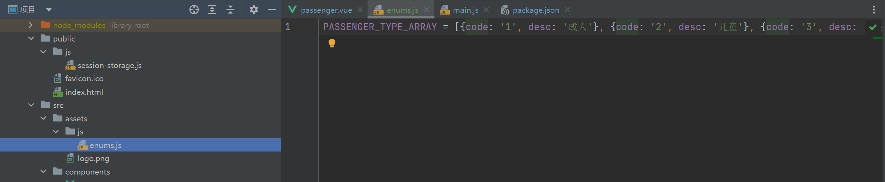

	```javascript
	PASSENGER_TYPE_ARRAY = [{code: '1', desc: '成人'}, {code: '2', desc: '儿童'}, {code: '3', desc: '学生'}]
	```

3. 在 main.js 中加入文件：

	```javascript
	import './assets/js/enums'
	```

4. 在 passenger.vue 中声明：

	```javascript
	const PASSENGER_TYPE_ARRAY = window.PASSENGER_TYPE_ARRAY;
	```

5. 由于 window.PASSENGER_TYPE_ARRAY 是未经声明变量，因此需要在 package.json 取消对于未经声明的变量的检查：

	```json
	"rules": {
	    "vue/multi-word-component-names": 0,
	    "no-unused-vars": 0,
	    "no-undef": 0
	}
	```

---


