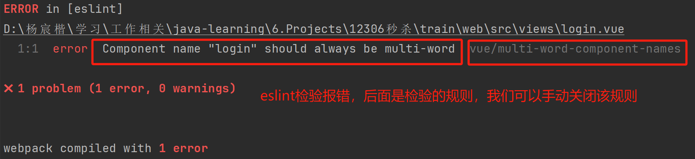

# 12306

## 第一章：课程介绍

### 1.2 课程导学

1. 12306秒杀的核心是如何处理高并发，常见的==高并发的问题==有：

	> 1. ==秒杀还没开始，浏览器页面就崩了==；页面静态化，CDN 进行分流
	> 2. ==秒杀刚开始，服务器就崩了==；限流
	> 3. ==秒杀结束后，库存超卖了==；分布式锁
	> 4. ==秒杀过程没问题，但是服务器响应很慢==；异步削峰+排队机制

2. ==前后端分离==：后端 ==SpringCloud Alibaba==(Springboot 同步升级到3)；前端 ==Vue3==；JDK17。

3. 千万级别大型分布式系统架构。

4. ==高并发==，==高性能==，==高可用==。

5. 本次课程的==核心技术==：

	> 1. ==限流+令牌==，减少很多无用请求；
	> 2. ==异步+排队==，实现削峰，收到请求返回正在处理，后端在队列中异步执行减票操作，相当于把此刻的大量请求分散到后面的时间去了，实现削峰；
	> 3. ==分布式锁==，保证不超卖；
	> 4. 总结：缓存、分布式锁、限流(令牌)、削峰(异步排队、验证码)、排队等；

---


### 1.3 为什么选择 Springboot3 和 JDK17

1. Springboot3 必须要 JDK17 及以上的版本。
2. 相应的，使用 SpringCloud 2022.0.0.0，以支持 Springboot3。
3. ==Springboot3 的重要新特性==：==AOT==，它是一个面向==云延申==的技术。

---


## 第二章：系统架构

### 2.1 为什么选择 12306

1. 12306 的业务比淘宝等类似的秒杀更复杂：

	> 1. ==动态库存==：淘宝是静态库存，在秒杀之前，就已经确定了库存，但是 12306 的库存不是固定的，比如北京-南京-上海，如果选择直达的话，那么这个座位就只有一张票，但是如果==考虑在南京中转的话，同一个座位就可以卖出两张票==。
	> 2. ==选座==功能；
	> 3. ==线上线下并行==：淘宝就是完全线上；但是 12306 既可以线上，也可以线下；
	> 4. 不停==刷票==：淘宝一件商品没了，就不买了；但是 12306 没抢到就会不停地刷票；
	> 5. ==绝不能超卖==：淘宝就算超卖了，也可以补充库存；但是 12306 一个座位有且仅有一个人能坐；

### 2.2 12306 流量规模

1. 平均 QPS：300万/秒。

2. 售票能力：2000万张/天。

3. 高峰期 TPS：1秒卖出1300张票。

4. 如何解决忙碌问题：

	> 1. ==主动提高 QPS 和 TPS==：`增加服务器` `使用分布式内存数据库 Gemfire` `优化算法`
	> 2. ==削峰==：`验证码(每个人提交验证码的速度不一样，可以把用户分散开)` `给出多个放票时段，避免堆积` `排队`，技术上有 `限流(比如1000个人抢10张票，那么只处理前10个请求，其它请求不予处理)` `异步(前端先显示正在等待，后端在异步的队列里面慢慢处理)`

---


### 2.3 不超卖，不少买，高并发

1. 余票查询：记录每两个站之间的余票，比如 A~E 有 5 个站，一共 10 种站站记录。

	> 
	>
	> 主要还是可以采取画表格的方法，来判断是否可以购买票。比如在上图中，A~E 就只有 8 张票还可以买了。
	>
	> 
	>
	> 但是如果 CD 区间的票，是座位 1 的，那么就不会再减少 A~D 的票数，在上图中通过画矩形我们可以看出此时 A~D 的票数依然是 9 张，而不是 8 张。这是因为==由于之前座位 1 的 A~B 的票已经卖了，因此座位 1 上 A~D 的票数已经减 1 了，此时购买座位 1 的 C~D 的票，就不能再把座位 1 A~D 的票数减 1 了==。
	>
	> 即影响的范围必须包含改变的区间，且必须没有被买过(因为其它子区间的被购买，而减少票数)，否则外层的票就卖了两次。
	
2. 座位购买，记录每个座位有哪些区域卖出去了，还可以卖出哪些区域。0111，代表只有 A~B 还可以卖。

	> 具体方法：在表的后面加一个销售详情字段，每卖出去一张票，就把后面对应的 0 改成 1。比如 0000->1000

---


### 2.4 核心功能

> 

---


### 2.5 模块划分

> 
>
> 划分模块的好处：便于我们==灵活的分配资源==，比如==业务模块比较重要，可以分配 100、200 个节点==，而其它模块可能就十几个或者几十个节点。

---


### 2.6 整架构设计

> 
>
> 1. web 和 admin 是前端的模块，它们请求后端时必须经过 gateway 网关，由网关将请求转发到后端对应模块。
> 2. ==每个模块有自己的数据库==，不方便进行跨数据库的多表联查，可以==将会员模块的一些信息冗余到 business 模块==，就能在一个库中完成查询了。
> 3. common 用来放一些公共的方法；generator 代码生成器，mybatis-generator 和我们自己的代码生成器
> 4. 第三方应用：==redis 做缓存==；==rocketmq 做异步+削峰==；==nacos 做注册中心==，是 SpringCloud 的核心组件；==seata 做分布式的事务==，比如 business 和 common 的表存储在不同的数据库中，假如我要 insert 或者 update 一个数据，但这会影响在 business 和 common 这两个不同数据库中的表，这时我使用分布式的事务，就能保证不同数据库的表的一致性；==sentinel 做限流==。

---


### 2.7 数据库表

1. 会员部分：

	1. 会员表：

		```sql
		drop table if exists `member`;
		create table `member` (
		    `id` bigint not null comment 'id',
		    `mobile` varchar(11) comment '手机号',
		    primary key (`id`),
		    unique key `mobile_unique` (`mobile`)
		) engine=innodb default charset=utf8mb4 comment='会员';
		```

		> 验证码登录，因此存手机号；
		>
		> 可以通过手机号查找会员，因此在 mobile 上创建索引。

	2. 乘客表：

		```sql
		drop table if exists `passenger`;
		create table `passenger` (
		    `id` bigint not null comment 'id',
		    `member_id` bigint not null comment '会员id',
		    `name` varchar(20) not null comment '姓名',
		    `id_card` varchar(18) not null comment '身份证',
		    `type` char(1) not null comment '旅客类型|枚举[PassengerTypeEnum]', # 票价不同
		    `create_time` datetime(3) comment '创建时间',
		    `update_time` datetime(3) comment '修改时间',
		    primary key (`id`),
		    index `member_id_index` (`member_id`)
		) engine=innodb default charset=utf8mb4 comment='乘车人';
		```

		> JOIN 会员表，因此 member_id 上有索引。

	3. 车票表：

		```sql
		drop table if exists `ticket`;
		create table `ticket` (
		    `id` bigint not null comment 'id',
		    `member_id` bigint not null comment '会员id',
		    `passenger_id` bigint not null comment '乘客id',
		    `passenger_name` varchar(20) comment '乘客姓名',
		    `train_date` date not null comment '日期',
		    `train_code` varchar(20) not null comment '车次编号',
		    `carriage_index` int not null comment '箱序',
		    `seat_row` char(2) not null comment '排号|01, 02',
		    `seat_col` char(1) not null comment '列号|枚举[SeatColEnum]',
		    `start_station` varchar(20) not null comment '出发站',
		    `start_time` time not null comment '出发时间',
		    `end_station` varchar(20) not null comment '到达站',
		    `end_time` time not null comment '到站时间',
		    `seat_type` char(1) not null comment '座位类型|枚举[SeatTypeEnum]',
		    `create_time` datetime(3) comment '新增时间',
		    `update_time` datetime(3) comment '修改时间',
		    primary key (`id`),
		    index `member_id_index` (`member_id`)
		) engine=innodb default charset=utf8mb4 comment='车票';
		```

		> JOIN 会员表，因此 member_id 上有索引。

2. 业务部分：

	1. 车站表：

		```sql
		drop table if exists `station`;
		create table `station` (
		    `id` bigint not null comment 'id',
		    `name` varchar(20) not null comment '站名',
		    `name_pinyin` varchar(50) not null comment '站名拼音',
		    `name_py` varchar(50) not null comment '站名拼音首字母',
		    `create_time` datetime(3) comment '新增时间',
		    `update_time` datetime(3) comment '修改时间',
		    primary key (`id`),
		    unique key `name_unique` (`name`)
		) engine=innodb default charset=utf8mb4 comment='车站';
		```

		> 这张表是为了方便后面做车站的下拉框，记录拼音是为了通过英文搜索也能找到车站。

	2. 车次表：

		```sql
		drop table if exists `train`;
		create table `train` (
		    `id` bigint not null comment 'id',
		    `code` varchar(20) not null comment '车次编号',
		    `type` char(1) not null comment '车次类型|枚举[TrainTypeEnum]',
		    `start` varchar(20) not null comment '始发站',
		    `start_pinyin` varchar(50) not null comment '始发站拼音',
		    `start_time` time not null comment '出发时间',
		    `end` varchar(20) not null comment '终点站',
		    `end_pinyin` varchar(50) not null comment '终点站拼音',
		    `end_time` time not null comment '到站时间',
		    `create_time` datetime(3) comment '新增时间',
		    `update_time` datetime(3) comment '修改时间',
		    primary key (`id`),
		    unique key `code_unique` (`code`) 
		) engine=innodb default charset=utf8mb4 comment='车次';
		```

		> 需要和其它业务表JOIN，因此 code 必须有索引。

	3. 到站表：

		```sql
		drop table if exists `train_station`;
		create table `train_station` (
		    `id` bigint not null comment 'id',
		    `train_code` varchar(20) not null comment '车次编号',
		    `index` int not null comment '站序',
		    `name` varchar(20) not null comment '站名',
		    `name_pinyin` varchar(50) not null comment '站名拼音',
		    `in_time` time comment '进站时间',
		    `out_time` time comment '出站时间',
		    `stop_time` time comment '停站时长',
		    `km` decimal(8, 2) not null comment '里程（公里）|从上一站到本站的距离',
		    `create_time` datetime(3) comment '新增时间',
		    `update_time` datetime(3) comment '修改时间',
		    primary key (`id`),
		    unique key `train_code_index_unique` (`train_code`, `index`),
		    unique key `train_code_name_unique` (`train_code`, `name`)
		) engine=innodb default charset=utf8mb4 comment='火车车站';
		```

		> 记录所有的车次经过了哪些站，可以通过车次 id 查出对应车次经过了哪些站；
		>
		> 联合索引首先可以作为 train_code 的索引；
		>
		> (`train_code`, `name`) 查询指定车次到达指定站的详情，(`train_code`, `index`) 查看指定车次所经过的第 index 站的详情。

	4. 车厢表：

		```sql
		drop table if exists `train_carriage`;
		create table `train_carriage` (
		    `id` bigint not null comment 'id',
		    `train_code` varchar(20) not null comment '车次编号',
		    `index` int not null comment '厢号',
		    `seat_type` char(1) not null comment '座位类型|枚举[SeatTypeEnum]', # 一等座等
		    `seat_count` int not null comment '座位数',
		    `row_count` int not null comment '排数',
		    `col_count` int not null comment '列数',
		    `create_time` datetime(3) comment '新增时间',
		    `update_time` datetime(3) comment '修改时间',
		    unique key `train_code_index_unique` (`train_code`, `index`),
		    primary key (`id`)
		) engine=innodb default charset=utf8mb4 comment='火车车厢';
		```

		> (`train_code`, `index`) 通过车次和箱号查询指定列车指定车厢的详情。

	5. 座位表：

		```sql
		drop table if exists `train_seat`;
		create table `train_seat` (
		    `id` bigint not null comment 'id',
		    `train_code` varchar(20) not null comment '车次编号',
		    `carriage_index` int not null comment '厢序',
		    `row` char(2) not null comment '排号|01, 02',
		    `col` char(1) not null comment '列号|枚举[SeatColEnum]',
		    `seat_type` char(1) not null comment '座位类型|枚举[SeatTypeEnum]',
		    `carriage_seat_index` int not null comment '同车厢座序',
		    `create_time` datetime(3) comment '新增时间',
		    `update_time` datetime(3) comment '修改时间',
		    primary key (`id`)
		) engine=innodb default charset=utf8mb4 comment='座位';
		```

	6. Daily 相关表：

		> 

		```sql
		drop table if exists `daily_train`;
		create table `daily_train` (
		    `id` bigint not null comment 'id',
		    `date` date not null comment '日期',
		    `code` varchar(20) not null comment '车次编号',
		    `type` char(1) not null comment '车次类型|枚举[TrainTypeEnum]',
		    `start` varchar(20) not null comment '始发站',
		    `start_pinyin` varchar(50) not null comment '始发站拼音',
		    `start_time` time not null comment '出发时间',
		    `end` varchar(20) not null comment '终点站',
		    `end_pinyin` varchar(50) not null comment '终点站拼音',
		    `end_time` time not null comment '到站时间',
		    `create_time` datetime(3) comment '新增时间',
		    `update_time` datetime(3) comment '修改时间',
		    primary key (`id`),
		    unique key `date_code_unique` (`date`, `code`)
		) engine=innodb default charset=utf8mb4 comment='每日车次';
		
		drop table if exists `daily_train_station`;
		create table `daily_train_station` (
		    `id` bigint not null comment 'id',
		    `date` date not null comment '日期',
		    `train_code` varchar(20) not null comment '车次编号',
		    `index` int not null comment '站序|第一站是0',
		    `name` varchar(20) not null comment '站名',
		    `name_pinyin` varchar(50) not null comment '站名拼音',
		    `in_time` time comment '进站时间',
		    `out_time` time comment '出站时间',
		    `stop_time` time comment '停站时长',
		    `km` decimal(8, 2) not null comment '里程（公里）|从上一站到本站的距离',
		    `create_time` datetime(3) comment '新增时间',
		    `update_time` datetime(3) comment '修改时间',
		    primary key (`id`),
		    unique key `date_train_code_index_unique` (`date`, `train_code`, `index`),
		    unique key `date_train_code_name_unique` (`date`, `train_code`, `name`)
		) engine=innodb default charset=utf8mb4 comment='每日车站';
		
		drop table if exists `daily_train_carriage`;
		create table `daily_train_carriage` (
		    `id` bigint not null comment 'id',
		    `date` date not null comment '日期',
		    `train_code` varchar(20) not null comment '车次编号',
		    `index` int not null comment '箱序',
		    `seat_type` char(1) not null comment '座位类型|枚举[SeatTypeEnum]',
		    `seat_count` int not null comment '座位数',
		    `row_count` int not null comment '排数',
		    `col_count` int not null comment '列数',
		    `create_time` datetime(3) comment '新增时间',
		    `update_time` datetime(3) comment '修改时间',
		    primary key (`id`),
		    unique key `date_train_code_index_unique` (`date`, `train_code`, `index`)
		) engine=innodb default charset=utf8mb4 comment='每日车厢';
		
		drop table if exists `daily_train_seat`;
		create table `daily_train_seat` (
		    `id` bigint not null comment 'id',
		    `date` date not null comment '日期',
		    `train_code` varchar(20) not null comment '车次编号',
		    `carriage_index` int not null comment '箱序',
		    `row` char(2) not null comment '排号|01, 02',
		    `col` char(1) not null comment '列号|枚举[SeatColEnum]',
		    `seat_type` char(1) not null comment '座位类型|枚举[SeatTypeEnum]',
		    `carriage_seat_index` int not null comment '同车箱座序',
		    `sell` varchar(50) not null comment '售卖情况|将经过的车站用01拼接，0表示可卖，1表示已卖',
		    `create_time` datetime(3) comment '新增时间',
		    `update_time` datetime(3) comment '修改时间',
		    primary key (`id`)
		) engine=innodb default charset=utf8mb4 comment='每日座位';
		```

		余票表：

		```sql
		drop table if exists `daily_train_ticket`;
		create table `daily_train_ticket` (
		    `id` bigint not null comment 'id',
		    `date` date not null comment '日期',
		    `train_code` varchar(20) not null comment '车次编号',
		    `start` varchar(20) not null comment '出发站',
		    `start_pinyin` varchar(50) not null comment '出发站拼音',
		    `start_time` time not null comment '出发时间',
		    `start_index` int not null comment '出发站序|本站是整个车次的第几站',
		    `end` varchar(20) not null comment '到达站',
		    `end_pinyin` varchar(50) not null comment '到达站拼音',
		    `end_time` time not null comment '到站时间',
		    `end_index` int not null comment '到站站序|本站是整个车次的第几站',
		    `ydz` int not null comment '一等座余票',
		    `ydz_price` decimal(8, 2) not null comment '一等座票价',
		    `edz` int not null comment '二等座余票',
		    `edz_price` decimal(8, 2) not null comment '二等座票价',
		    `rw` int not null comment '软卧余票',
		    `rw_price` decimal(8, 2) not null comment '软卧票价',
		    `yw` int not null comment '硬卧余票',
		    `yw_price` decimal(8, 2) not null comment '硬卧票价',
		    `create_time` datetime(3) comment '新增时间',
		    `update_time` datetime(3) comment '修改时间',
		    primary key (`id`),
		    unique key `date_train_code_start_end_unique` (`date`, `train_code`, `start`, `end`)
		) engine=innodb default charset=utf8mb4 comment='余票信息';
		```

		> 余票表和车次表做了冗余，不然还要额外关联车次表；
		>
		> (`date`, `train_code`, `start`, `end`) 查询指定日期、指定车次、指定起点和目的地的余票。

	7. 订单表：

		```sql
		drop table if exists `confirm_order`;
		create table `confirm_order` (
		    `id` bigint not null comment 'id',
		    `member_id` bigint not null comment '会员id',
		    `date` date not null comment '日期',
		    `train_code` varchar(20) not null comment '车次编号',
		    `start` varchar(20) not null comment '出发站',
		    `end` varchar(20) not null comment '到达站',
		    `daily_train_ticket_id` bigint not null comment '余票ID',
		    `tickets` json not null comment '车票',
		    `status` char(1) not null comment '订单状态|枚举[ConfirmOrderStatusEnum]',
		    `create_time` datetime(3) comment '新增时间',
		    `update_time` datetime(3) comment '修改时间',
		    primary key (`id`),
		    index `date_train_code_index` (`date`, `train_code`)
		) engine=innodb default charset=utf8mb4 comment='确认订单';
		```

	8. 秒杀令牌表：

		```sql
		drop table if exists `sk_token`;
		create table `sk_token` (
		    `id` bigint not null comment 'id',
		    `date` date not null comment '日期',
		    `train_code` varchar(20) not null comment '车次编号',
		    `count` int not null comment '令牌余量',
		    `create_time` datetime(3) comment '新增时间',
		    `update_time` datetime(3) comment '修改时间',
		    primary key (`id`),
		    unique key `date_train_code_unique` (`date`, `train_code`)
		) engine=innodb default charset=utf8mb4 comment='秒杀令牌';
		```

3. 其它表(官方提供)：

	1. quartz 相关表(自动跑批)；
	2. seata 相关表(分布式事务)；

---


### 2.8 百万人抢一万张票，系统如何保障稳定

> 场景题：==如何设计一个秒杀系统==，==有哪些实现高并发的方案==，就可以用本节的内容进行回答。

1. 前端：

	> 1. ==针对静态资源做 CDN==：CDN = Content Delivery Networks，即内容分发网络，原理是将前端的资源放到 CDN 服务器上，==比如北京上海都有一个节点，就近获取资源==；一般==前端需要引入第三方组件时，都会先去查看其是否有 CDN 资源==，因为通过 CDN 引入第三方组件速度会更快。
	> 2. ==页面静态化==：尽管我们现在很多网站都是动态网站，但是如果我们把==秒杀页面做成静态页面，再将其部署到 CDN 服务器==，就可提高访问速度。
	> 3. ==倒计时&Loading==：给用户看到倒计时，他们就不会在快要到点的时候反复刷新页面；用户提交后显示一个 Loading，告诉用户正在提交，防止用户反复点提交。
	> 4. ==验证码削峰==：不同用户回答验证码速度不同，这样可以把请求分散开。

2. 后端：

	> 1. ==微服务-服务拆分==：如何划分微服务？一般是==按照功能来划分==，比如本项目中就将会员模块和业务模块分开，而对于==热点接口==也会单独划分一个模块，比如本项目中的余票模块。
	> 2. ==负载均衡==，部署多个节点；
	> 3. ==限流降级==：限流是让流量不要太大，而削峰是把多出去的流量填到后面去，不会减少流量；==降级就是当某一个服务不可用后，有一个后备的方案==。
	> 4. ==缓存==：分为本地缓存和分布式缓存，要注意缓存雪崩、单点击穿、穿透。
	> 5. ==令牌==：拿到令牌的请求，才是有效的请求，可以减少很多无效的请求、和机器人刷票。
	> 6. ==异步==：用户请求到达时，立刻返回正在处理，然后后端 mq 中异步执行减少余票等操作。

3. 数据库：

	> 1. ==分库==：将不同的业务的表，放到不同的数据库中隔离；==读写分离，将数据库的读操作和写操作分别分配到不同的数据库服务器上==，这样流量高峰时，读写请求就不会全集中到一个数据库服务器上，导致服务器崩溃。
	> 2. ==分表==：横向分表，按照时间和地点来分，比如一月一张表；纵向分表，按照字段进行划分，比如表一有标题、时间、作者字段，表二有内容字段。
	> 3. ==冗余设计==，反范式，用空间换时间，在一张表里冗余另一张表的字段，这样只需查一张表即可完成查询。
	> 4. ==分布式数据库==，一般很大型的项目才会用到。

4. 其它：

	> 1. ==分时段秒杀==：比如一天有 21 放票的时间点。
	> 2. ==弹性扩容==：监视服务器的性能，超过某个阈值时，就加机器；但是==弹性扩容的反应比较慢，因此在秒杀之前，我们还是要手动扩容==。
	> 3. ==候补+排队==：没抢到票提交候补订单，就不要一致刷票了；排队指的是候补订单先到先得。

----


## 第三章：Springboot3 和 JDK17 的新特性

### 3.1 JDK9_jshell

> 1. 
> 2. 有点类似于 Python 和 Lua 的命令行客户端。
> 3. 可以 `Tab` 键提示。

---


### 3.2 JDK9_模块化开发(较为有用)

1. 模块是比包还要大的一种结构，可以通过模块管理包。

	> 

2. 不同的模块之间默认无法调用对方模块的包。

3. 如果想调用，可以 `Alt+Enter` 引入。

4. 如果想要让一个模块开发部分包，不开发另一部分包，则可创建 `module-info.java`：

	> 
	>
	> ---
	>
	>  
	>
	> `module-info.java` 会自动被创建到 src 目录下，对应地，由于 testB 想要引用 testA 下面的 garry 包，因此它也应该有一个 `module-info.java`：
	>
	> 

5. 主要是==依赖和被依赖的模块，都要创建 `module-info.java`==。

---


### 3.3 JDK10_var 局部变量推导

1. 使用前提条件：

	> 1. 必须能推导出实际类型；
	> 2. 只能用于==局部变量==。

2. var 必须一边声明，一边初始化；不能只声明，不初始化。

3. 评价：有点意义不明，感觉不如写清楚。

---


### 3.4 JDK11_单文件程序

1. 一般来说，执行一个 java 程序先要 javac，然后 java。但是在 JDK11 的单文件程序中，可以直接使用 java 执行单个文件。

	```bash
	$ java Test.java  # 注意要加上“.java”
	```

2. 不过要注意，这种方式不能调用其它模块的类。

3. 这样可以让 java 像 python 一样只运行某一个文件。

---


### 3.5 JDK11_shebang 脚本

1. ==#! 叫做 shebang==，通常出现在 Linux 脚本中。

2. ```java
	#!JAVA_HOME\bin\java --s
	
	public class Test {
	    public static void main(String[] args) {
	        System.out.println("Hello shebang");
	    }
	}
	```

3. 注意，该文件不能以 “.java” 为后缀，而是 “.sh”。

4. 使用类 Unix 操作系统，如 git-bash，赋予该文件 x 权限后，直接执行，可以打印 `Hello shebang`。

---


### 3.6 JDK14_文本块(较为有用)

1. 有点类似于 python，就是打三个双引号，中间的所有部分全部都是字符串。

	```java
	String json = """
	    {
	        name: "Garry"
	    }
	    """
	```

---


### 3.7 JDK14_instanceof 增强

1. 增强之前，需要手动向下转型：

	```java
	Object a = "Hello";
	if(a instanceof String) {
	    String b = (String) a;
	    sout(b);
	}
	```

2. 增强之后，可以直接在 instaceof 的时候就直接进行向下转型：

	```java
	Object a = "Hello";
	if(a instanceof String b) { // 在这里直接将 a 进行向下转型
	    sout(b);
	}
	```

---


### 3.8 JDK14_空指针提示(较为有用)

1. 之前，如果出现空指针异常，比如：

	```java
	List list = null;
	list.size();
	```

	只会提示你 `NullPointerException`，而不会告诉你具体哪个对象触发了空指针异常。

2. 而在 JDK14 及更高的版本中，会明确地提示你，是 `list` 对象触发了空指针异常。

---


### 3.9 JDK16_Record 类(较为有用)

1. > 

2. 在选择的时候，可以直接选择创建 Record 类。

	```java
	public record TestRecord(String name, String password) {}
	```

	> 实际上，==相当于所有属性都被 final 修饰，即可读不可写==。
	>
	> ```java
	> public record TestRecord {
	>     public final String name;
	>     public final String password;
	> }
	> ```

3. Record 类的作用是创建数据类，类似于我们之前使用的 Lombok 插件。

4. Record 类和普通数据类的区别：只能 get，不能 set。

5. 有点像 `@Getter`，而不是 `@Data`。

---


### 3.10 JDK17_sealed 类(较为有用)

1. 可以使用 sealed 类==显式管理类的继承==。

2. 父类如果是 sealed 类，则必须至少有一个子类。

3. sealed 的子类，必须是 final、sealed、non-sealed 之一。

4. ```java
	public sealed class Test1 permtis Test2 {}
	```

	> Test1 只允许被 Test2 继承。

5. ```java
	public final class Test2 {}  // 到此，Test2 不能再被继承
	```

6. sealed 类的好处是，可以一眼看出类的继承关系，比如可以一眼看出 Test2 继承了 Test1。

---


### 3.11 JDK17_switch 增强

1. 这时 JDK17 预览版才有的功能。

2. 和 instaceof 结合到一起，可以 switch 判断 a 的类型：

	```java
	Object a = "hello";
	switch (a) {
		case Integer b -> sout(b);
	    case Long b -> sout(b);
	    case String b -> sout(b);
	    default -> sout("default");
	}
	```

3. 特别说明，上面的 `->` 使用之后，就不用再加 `break` 了，这时 JDK14 的新特性。

---


### 3.12 Springboot3_AOT & JIT

1. ==JIT==(Just-in-time)，==实时编译==，只能在运行的时候编译，==Java 跨平台的基础==；

2. ==AOT==(Ahead-of-time)，==预编译==，使用之后==无法跨平台==。

3. AOT 的==优点==：

	> 1. 启动和运行==速度快==：
	>
	> 	e.g.之前的 Springboot2 启动一个空项目的时间大概是 2 秒，使用 AOT 后为 100 毫秒。
	>
	> 	快的==原因==：==没有中间的 JVM==（言外之意：JVM 只支持实时编译，不支持预编译），==直接和操作系统打交道==。
	>
	> 2. ==打包体积小==：之前启动需要安装 JDK，而现在不需要 JDK 了，就和 C++ 类似直接双击就行了。
	>
	> 	==应用场景==：比如机器不够了，可以==快速在多台机器上启动 Java 应用==。

4. AOT 的==缺点==：

	> 1. 编译后的程序==不支持跨平台==，比如 C++ 在 Windows 下编译后生成 .exe，但在 Linux 下无法运行。
	> 2. ==不支持动态功能，如 AOP==。

---


### 3.13 JIT 在高并发环境下的问题

1. 问题：在启动初期，热点机器出现性能极低的现象，持续 1~2 分钟。

2. 热点类，即程序运行过程中被多次访问的类，会触发 Java 的 JIT 实时编译机制，直接编译为机器码。

3. 热点类才会触发 JIT，因为会损耗 CPU。

4. 高并发情况下，很多类都触发 JIT 编译，导致 CPU 占用率飙升，性能降低。

5. 解决方法：

	> 1. 预热：初始让程序运行热点代码几百次，提前完成 JIT 编译。
	> 2. 流量控制：刚开始时限流，运行几分钟后恢复到正常流量。

---


### 3.14 Springboot3_使用 GraalVM 代替 JDK 实现 AOT

1. GraalVM 是一个跨语言的通用虚拟机，不仅支持 JVM 系的语言，还支持 C++ 等依赖于 LLVM 的语言，以及 Python、JavaScript 等。
2. 要自己下载，配置 GraalVM，简单的来说就是替换掉原来的 JDK，直接在环境变量里面替换 JAVA_HOME 就可以了。

---


## 第四章：Spring Cloud Alibaba 2020.0.0 与 Springbooot 3 搭建后端架构

### 4.2 项目初始化配置

1. 修改编码类型：

	> 控制台编码类型：
	>
	> 
	>
	> ---
	>
	> 文件编码类型：
	>
	> 

2. 热部署：

	> 
	>
	> 
	>
	> ---
	>
	> ==自动热部署==：==离开 IDE（比如去浏览器），或 `Ctrl + s`后离开鼠标离开文件==，项目自动重新启动，因此==也需要一定耗时，并不能做到立刻修改==，但通常这个时间很短，比手动重启项目快。
	>
	> ==手动热部署==：
	>
	> 

3. 自动导入：

	> 

---


### 4.4 新增 member 会员模块

1. 在 train 项目下创建新的 Java-Maven 模块 member：

	> 
	>
	> ---
	>
	> 

2. 发现在父 pom.xml 中多出一下部分，用于标识子模块：

	```xml
	<!--子模块-->
	<packaging>pom</packaging>
	<modules>
	    <module>member</module>
	</modules>
	```

3. 然后我们的项目就在子模块，即 member 中启动了。因此我们的==父 pom.xml 中就不需要 dependencies 了，把它全部 copy 到 member 的 pom.xml 中==：

	> 
	>
	> ---
	>
	> 

4. 但是==父 pom.xml 中必须有 dependencyManagement，因为这是用来管理子 pom.xml 的==。

5. 还有 ==父 pom.xml 的 build 也不需要了，copy 到子模块中==。

6. 然后==把父项目原来的源码全部移动到 member 中==，毕竟我们是在 member 中启动项目：

	> 

7. 将 TrainApplication 改名为 MemberApplication，并且加上：

	```java
	@ComponentScan("garry") // 由于Application类放到了config包下，它只能扫描和自己同包的类，因此需要新增ComponentScan注解让其扫描整个garry包下的类
	```

---


### 4.5 实现日志 (logback) 的相关配置

1. 首先在==启动类中加上启动日志==：

	```java
	@Slf4j
	@SpringBootApplication
	@ComponentScan("garry") // 由于Application类放到了config包下，它只能扫描和自己同包的类，因此需要新增ComponentScan注解让其扫描整个garry包下的类
	public class MemberApplication {
	    public static void main(String[] args)   {
	        // 打印启动日志
	        SpringApplication app = new SpringApplication(MemberApplication.class);
	        Environment env = app.run(args).getEnvironment(); // 注意，这一句已经app.run了，因此不能再额外run了
	        log.info("启动成功！");
	        log.info("地址\thttp://127.0.0.1:{}", env.getProperty("server.port"));
	        // 包括项目的一些说明文档，测试文档，都可以打印在这里
	    }
	}
	```

	> 注意，`Environment env = app.run(args).getEnvironment()` 已经 app.run 了，不能再额外 run 了。

2. 配置 ==logback-spring.xml==：

	> 日志文件的生成位置：
	>
	> 
	>
	> ---
	>
	> ```xml
	> <?xml version="1.0" encoding="UTF-8"?>
	> <!--suppress ALL -->
	> <configuration>
	>     <!--该模块日志文件的生成位置，其相对于整个项目的路径-->
	>     <!--本质上是创建一个PATH变量，不同的模块只有这里需要修改-->
	>     <property name="PATH" value="./log/member"></property>
	> 
	>     <!--控制台打印日志的配置-->
	>     <appender name="STDOUT" class="ch.qos.logback.core.ConsoleAppender">
	>         <encoder>
	>             <!--[%-18X{LOG_ID}]是为了打印线程的流水号-->
	>             <Pattern>%d{yyyy-MM-dd HH:mm:ss.SSS} [%thread] %highlight(%-5level) %yellow([%-50.50class] [%-18X{LOG_ID}]) >>> %cyan(%msg) %n</Pattern>
	>         </encoder>
	>     </appender>
	> 
	>     <appender name="TRACE_FILE" class="ch.qos.logback.core.rolling.RollingFileAppender">
	>         <file>${PATH}/trace.log</file>
	>         <rollingPolicy class="ch.qos.logback.core.rolling.TimeBasedRollingPolicy">
	>             <FileNamePattern>${PATH}/trace.%d{yyyy-MM-dd}.%i.log</FileNamePattern>
	>             <timeBasedFileNamingAndTriggeringPolicy class="ch.qos.logback.core.rolling.SizeAndTimeBasedFNATP">
	>                 <maxFileSize>10MB</maxFileSize>
	>             </timeBasedFileNamingAndTriggeringPolicy>
	>         </rollingPolicy>
	>         <layout>
	>             <pattern>%d{yyyy-MM-dd HH:mm:ss.SSS} [%thread] %-5level [%-50.50class] [%-18X{LOG_ID}] >>> %msg %n</pattern>
	>         </layout>
	>     </appender>
	> 
	>     <appender name="ERROR_FILE" class="ch.qos.logback.core.rolling.RollingFileAppender">
	>         <file>${PATH}/error.log</file>
	>         <rollingPolicy class="ch.qos.logback.core.rolling.TimeBasedRollingPolicy">
	>             <FileNamePattern>${PATH}/error.%d{yyyy-MM-dd}.%i.log</FileNamePattern>
	>             <timeBasedFileNamingAndTriggeringPolicy class="ch.qos.logback.core.rolling.SizeAndTimeBasedFNATP">
	>                 <maxFileSize>10MB</maxFileSize>
	>             </timeBasedFileNamingAndTriggeringPolicy>
	>         </rollingPolicy>
	>         <layout>
	>             <pattern>%d{yyyy-MM-dd HH:mm:ss.SSS} [%thread] %-5level [%-50.50class] [%-18X{LOG_ID}] >>> %msg %n</pattern>
	>         </layout>
	>         <filter class="ch.qos.logback.classic.filter.LevelFilter">
	>             <level>ERROR</level>
	>             <onMatch>ACCEPT</onMatch>
	>             <onMismatch>DENY</onMismatch>
	>         </filter>
	>     </appender>
	> 
	>     <!--ERROR级别的日志放到ERROR_FILE-->
	>     <root level="ERROR">
	>         <appender-ref ref="ERROR_FILE" />
	>     </root>
	> 
	>     <!--TRACE级别的日志放到TRACE_FILE-->
	>     <root level="TRACE">
	>         <appender-ref ref="TRACE_FILE" />
	>     </root>
	> 
	>     <!--INFO级别的日志打印到控制台STDOUT-->
	>     <root level="INFO">
	>         <appender-ref ref="STDOUT" />
	>     </root>
	> </configuration>
	> ```

3. 在 ==.gitignore== 中忽略 ==.log== 文件：

	```
	### log ###
	log/
	```

---


### 4.6 使用 HTTP Client 测试接口

1. 问题：每次测试都手动到浏览器，不方便。

2. ==HTTPClient 是 IDEA 自带的用于测试网络接口的工具==。

3. > 

4. 效果：

	> 

5. 可以在==主工程目录下创建一个 http 文件夹==，把所有的 .http 文件都放到这里：

	> 

---


### 4.7 增加 AOP 打印请求参数和返回结果

1. 首先需要引入两个依赖，在 train/pom.xml 中引入：

	```xml
	<!--gson-->
	<dependency>
	    <groupId>com.google.code.gson</groupId>
	    <artifactId>gson</artifactId>
	    <version>2.8.6</version>
	</dependency>
	<!--hutool-->
	<dependency>
	    <groupId>cn.hutool</groupId>
	    <artifactId>hutool-all</artifactId>
	    <version>5.6.3</version>
	</dependency>
	```

2. 引入==第三方的依赖时，父子 pom.xml 里面都要声明==，但是==只需在父 pom 中声明版本==，子 pom 中不用写版本。

3. member 中引入 aop 依赖：

	```xml
	<!--spring-boot-starter-test-->
	<dependency>
	    <groupId>org.springframework.boot</groupId>
	    <artifactId>spring-boot-starter-aop</artifactId>
	</dependency>
	```

4. 定义切点：

	```java
	    /**
	     * 定义一个切点
	     * *: 所有的返回值
	     * garry: garry下的所有子包
	     * ..*Controller: 结尾为Controller的所有类
	     * .*: 这些类下的任何方法
	     * (..): 任何返回值
	     */
	    @Pointcut("execution(public * garry..*Controller.*(..))")
	    public void controllerPointcut() {
	    }
	```

5. 前置通知：

	```java
	@Before("controllerPointcut()")
	public void doBefore(JoinPoint joinPoint) {
	
	    // MDC 是 Slf4j 自带的，用于存放我们自定义的键值对，比如在logback-spring.xml中的LOG_ID
	    MDC.put("LOG_ID", CommonUtil.generateUUID(18));
	
	    // 开始打印请求日志
	    ServletRequestAttributes attributes = (ServletRequestAttributes) RequestContextHolder.getRequestAttributes();
	    HttpServletRequest request = attributes.getRequest();
	    Signature signature = joinPoint.getSignature();
	    String name = signature.getName();
	
	    // 打印请求信息
	    log.info("------------- 开始 -------------");
	    log.info("请求地址: {} {}", request.getRequestURL().toString(), request.getMethod());
	    log.info("类名方法: {}.{}", signature.getDeclaringTypeName(), name);
	    log.info("远程地址: {}", request.getRemoteAddr());
	
	    // 打印请求参数
	    Object[] args = joinPoint.getArgs();
	
	    // 排除特殊类型的参数，如文件类型
	    Object[] arguments = new Object[args.length];
	    for (int i = 0; i < args.length; i++) {
	        if (args[i] instanceof ServletRequest
	            || args[i] instanceof ServletResponse
	            || args[i] instanceof MultipartFile) {
	            continue;
	        }
	        arguments[i] = args[i];
	    }
	    // 排除字段，敏感字段或太长的字段不显示：身份证、手机号、邮箱、密码等
	    String[] excludeProperties = {};
	    PropertyPreFilters filters = new PropertyPreFilters();
	    PropertyPreFilters.MySimplePropertyPreFilter excludeFilter = filters.addFilter();
	    excludeFilter.addExcludes(excludeProperties);
	    log.info("请求参数: {}", JSONObject.toJSONString(arguments, excludeFilter));
	}
	```

6. 环绕通知：

	```java
	@Around("controllerPointcut()")
	public Object doAround(ProceedingJoinPoint proceedingJoinPoint) throws Throwable {
	    long startTime = System.currentTimeMillis();
	    Object result = proceedingJoinPoint.proceed();
	    // 排除字段，敏感字段或太长的字段不显示：身份证、手机号、邮箱、密码等
	    String[] excludeProperties = {};
	    PropertyPreFilters filters = new PropertyPreFilters();
	    PropertyPreFilters.MySimplePropertyPreFilter excludeFilter = filters.addFilter();
	    excludeFilter.addExcludes(excludeProperties);
	    log.info("返回结果: {}", JSONObject.toJSONString(result, excludeFilter));
	    log.info("------------- 结束 耗时：{} ms -------------", System.currentTimeMillis() - startTime);
	    return result;
	}
	```

---


### 4.8 增加 Common 公共模块

1. 将所有在子 pom 中引入的依赖，都在父 pom 中注册，把版本写在父 pom 中，以便管理版本。

2. 将 member 中的 aspect 包移过去：

	> 

3. 在 ==member/pom.xml 中 dependencies 引入 common 模块==，统一管理：

	> 

4. 增加common配置文件，放到 common/../resources/config/application.yml：

	> 

---


### 4.9 增加 Gateway 网关模块

1. gateway/pom.xml 只需引入：

	```xml
	<dependency>
	    <groupId>org.springframework.cloud</groupId>
	    <artifactId>spring-cloud-starter-gateway</artifactId>
	</dependency>
	```

	因为 gateway 是基于 netty 的，不需要其它的依赖。

2. 将 member 中的启动类和配置文件 copy 过来。

3. 在 gateway 的 application.yml 中进行配置：

	```yml
	server:
	  port: 8080
	
	spring:
	  cloud:
	    gateway:
	      # 网关配置
	      routes:
	        - id: member  # “-”表示routes是列表
	          uri: http://127.0.0.1:8081
	          # 将所有以 member为前缀的请求(e.g. http://localhost:8080/member/hello)都转发到 http://127.0.0.1:8081
	          predicates:
	            - Path=/member/**
	```

4. gateway 的作用：比如收到 `http://localhost:8080/member/hello` 请求，==发现以 member 作为前缀，因此将其转发到 `uri: http://127.0.0.1:8081`==，可以理解为是在内网中转发请求。

5. gateway 的好处：==只需将 gateway 配置外网 IP，其它模块只能内网访问，更加安全==。

6. 增加 gateway 日志，点击 GatewayApplication->Edit Configuration->Modify Options->Add VM Options，在 VM Options 中增加：

	```
	-Dreactor.netty.http.server.accessLogEnabled=true
	```

	> 

---


### 4.10 数据库的准备工作

1. 重点：==专库专用，切忌使用 root 用户==。
2. 使用 root 用户创建一个新的用户 `garry_train`，其只能访问 train 这个库。

---


### 4.13 集成 Mybatis 持久层框架

1. 在 common 模块中引入 mybatis 和 mysql 的依赖，因为后面很多模块都要用到数据库连接。

	```xml
	<!--mybatis依赖，必须要3.0.0才能支持Springboot3-->
	<dependency>
	    <groupId>org.mybatis.spring.boot</groupId>
	    <artifactId>mybatis-spring-boot-starter</artifactId>
	    <version>3.0.0</version>
	</dependency>
	<!--mysql驱动，5.1开头的版本支持mysql5.7-->
	<dependency>
	    <groupId>mysql</groupId>
	    <artifactId>mysql-connector-java</artifactId>
	    <version>5.1.46</version>
	</dependency>
	```

2. 在 member 模块的 application.yml 做出数据库连接配置：

	```yaml
	spring:
	  # Mybatis 数据库连接配置
	  datasource:
	    # 5.7版本为 com.mysql.jdbc.Driver；8.0版本为 com.mysql.cj.jdbc.Driver
	    driver-class-name: com.mysql.jdbc.Driver
	    username: root
	    password: 1234
	    url: jdbc:mysql://localhost:3306/train_member?characterEncoding=UTF-8&autoReconnect=true&useSSL=false&serverTimezone=Asia/Shanghai
	    type: com.zaxxer.hikari.HikariDataSource
	
	mybatis:
	  # 指定对应的 xml文件的位置为：target/classes/mapper下的所有文件夹的所有.xml文件
	  mapper-locations: classpath:/mapper/**/*.xml
	```

	> ==问什么不在公共的 common 模块里作数据库配置呢==？
	>
	> 因为==不同模块使用的数据库不同==。

3. 注意 mybatis-spring-boot-starter 的版本必须为 3.0.0，但是实际操作中，即使把 train/pom.xml 改为 3.0.0，但是 member 模块依然无法启动，原因是存在缓存，需要手动将 common 中引入的 mybatis-spring-boot-starter:3.0.0 复制到 member/pom.xml 中，即可启动，之后删除即可。

	> 否则会出现 sqlSession，sqlSessionFactory之类的报错。

4. 让日志中打印出 sql：

	```yml
	logging:
	  level:
	    garry:
	      train:
	        member:
	          # garry.train.member.mapper下的日志等级设置为 trace，可以打印出 sql
	          mapper: trace
	```

---


### 4.14 集成 Mybatis Generator

1. 创建 generator 模块，引入：

	```xml
	<build>
	    <plugins>
	        <!-- mybatis generator 自动生成代码插件 -->
	        <plugin>
	            <groupId>org.mybatis.generator</groupId>
	            <artifactId>mybatis-generator-maven-plugin</artifactId>
	            <version>1.4.0</version>
	            <configuration>
	                <configurationFile>src/main/resources/generator-config-member.xml</configurationFile>
	                <!--                    <configurationFile>src/main/resources/generator-config-business.xml</configurationFile>-->
	                <!--                    <configurationFile>src/main/resources/generator-config-batch.xml</configurationFile>-->
	                <overwrite>true</overwrite>
	                <verbose>true</verbose>
	            </configuration>
	            <dependencies>
	                <dependency>
	                    <groupId>mysql</groupId>
	                    <artifactId>mysql-connector-java</artifactId>
	                    <version>5.1.46</version>
	                </dependency>
	            </dependencies>
	        </plugin>
	    </plugins>
	</build>
	```

2. 根据配置，我们在 generator/src/main/resources 下创建 `generator-config-member.xml`：

	```xml
	<?xml version="1.0" encoding="UTF-8"?>
	<!DOCTYPE generatorConfiguration
	        PUBLIC "-//mybatis.org//DTD MyBatis Generator Configuration 1.0//EN"
	        "http://mybatis.org/dtd/mybatis-generator-config_1_0.dtd">
	
	<generatorConfiguration>
	    <context id="Mysql" targetRuntime="MyBatis3" defaultModelType="flat">
	
	        <!-- 自动检查关键字，为关键字增加反引号(比如如果一张表的名字是select，则会自动将其变为`select`) -->
	        <property name="autoDelimitKeywords" value="true"/>
	        <property name="beginningDelimiter" value="`"/>
	        <property name="endingDelimiter" value="`"/>
	
	        <!--覆盖生成XML文件-->
	        <plugin type="org.mybatis.generator.plugins.UnmergeableXmlMappersPlugin" />
	        <!-- 生成的实体类添加toString()方法 -->
	        <plugin type="org.mybatis.generator.plugins.ToStringPlugin"/>
	
	        <!-- 不生成注释 -->
	        <commentGenerator>
	            <property name="suppressAllComments" value="true"/>
	        </commentGenerator>
	
	        <!-- 配置数据源，需要根据自己的项目修改 -->
	        <jdbcConnection driverClass="com.mysql.jdbc.Driver"
	                        connectionURL="jdbc:mysql://localhost:3306/train_member?characterEncoding=UTF-8&amp;autoReconnect=true&amp;useSSL=false&amp;serverTimezone=Asia/Shanghai"
	                        userId="root"
	                        password="1234">
	        </jdbcConnection>
	
	        <!-- domain类的位置 targetProject是相对pom.xml的路径-->
	        <javaModelGenerator targetProject="../member/src/main/java"
	                            targetPackage="garry.train.member.pojo"/>
	
	        <!-- mapper xml的位置 targetProject是相对pom.xml的路径 -->
	        <sqlMapGenerator targetProject="../member/src/main/resources"
	                         targetPackage="mapper"/>
	
	        <!-- mapper类的位置 targetProject是相对pom.xml的路径 -->
	        <javaClientGenerator targetProject="../member/src/main/java"
	                             targetPackage="garry.train.member.mapper"
	                             type="XMLMAPPER"/>
	
	        <table tableName="member" domainObjectName="Member"/>
	        <table tableName="passenger" domainObjectName="Passenger"/>
	        <table tableName="ticket" domainObjectName="Ticket"/>
	    </context>
	</generatorConfiguration>
	```

3. 并且借助 pojoExample 类，得以在 mapper 类中使用 selectByExample 等方法：

	> 
	>
	> ---
	>
	> 好处是：不用再写 where xx = xxx 之类的东西了。

---


### 4.15 member 注册接口

1. ```java
	@Override
	public long register(String mobile) {
	    // 检验mobile是否重复
	    MemberExample memberExample = new MemberExample();
	    memberExample.createCriteria() // 创建条件
	        .andMobileEqualTo(mobile); // and意为“且”。即: 并且mobile="mobile"
	    List<Member> members = memberMapper.selectByExample(memberExample);
	
	    if (CollUtil.isNotEmpty(members)) { // CollUtil为hutool依赖的工具类
	        throw new RuntimeException("手机号已注册"); // 抛出运行时异常，可以正常通过编译，RuntimeException并不是必须处理的
	    }
	
	    Member member = new Member();
	    member.setId(System.currentTimeMillis()); // id暂时比较简略，仅为时间戳
	    member.setMobile(mobile);
	
	    memberMapper.insert(member);
	    return member.getId();
	}
	```

---


### 4.16 封装请求参数 Form 和返回结果 Vo

1. ```java
	@Data
	public class MemberRegisterForm {
	    public String mobile;
	}
	```

2. 在 common 模块创建 ResponseVo，之所以可以在 member 模块使用 ResponseVo，是因为在 member/pom.xml 中引入了 common 模块：

	```java
	@Data
	public class ResponseVo<T> {
	    private boolean success = true;
	
	    private Integer code;
	
	    private String msg;
	
	    private T data;
	
	    private ResponseVo(Integer code, String msg, T data) {
	        this.code = code;
	        this.msg = msg;
	        this.data = data;
	    }
	
	    private ResponseVo(Integer code, String msg) {
	        this(code, msg, null);
	    }
	
	    private ResponseVo(Integer code, String msg, boolean success) {
	        this.code = code;
	        this.msg = msg;
	        this.success = success;
	    }
	
	    public static ResponseVo success() {
	        return new ResponseVo(ResponseEnum.SUCCESS.getCode(), ResponseEnum.SUCCESS.getMsg());
	    }
	
	    public static <T> ResponseVo<T> success(T data) {
	        return new ResponseVo<>(ResponseEnum.SUCCESS.getCode(), ResponseEnum.SUCCESS.getMsg(), data);
	    }
	
	    public static ResponseVo error(ResponseEnum responseEnum) {
	        return new ResponseVo(responseEnum.getCode(), responseEnum.getMsg(), false);
	    }
	}
	```

3. 在 Controller 中的使用方法：

	```java
	@RequestMapping(value = "/register", method = RequestMethod.POST)
	@ResponseBody
	public ResponseVo register(MemberRegisterForm form) {
	    long registerId = 0;
	    try {
	        registerId = memberService.register(form);
	    } catch (RuntimeException e) {
	        return ResponseVo.error(e.getMessage());
	    }
	    return ResponseVo.success(registerId);
	}
	```

---


### 4.17 统一异常处理

1. ```java
	@Slf4j
	@ControllerAdvice
	public class ControllerExceptionHandler {
	
	    @ExceptionHandler({RuntimeException.class})
	    @ResponseBody // 这里必须要加ResponseBody，否则返回的不是JSON字符串！
	    public ResponseVo exceptionHandler(RuntimeException e) {
	        return ResponseVo.error(e.getMessage());
	    }
	}
	```

---


### 4.18 使用自定义异常处理异常业务

1. 没有自定义异常的问题：

	> 假如发生的异常不是我们主动抛出的：
	>
	> ```java
	> if (CollUtil.isNotEmpty(members)) {
	>     throw new RuntimeException("手机号已注册");
	> }
	> ```
	>
	> 那么前端收到的回复就会是这样的：
	>
	> ```json
	> {
	>   "success": false,
	>   "code": -1,
	>   "msg": "\r\n### Error updating database.  Cause: com.mysql.jdbc.MysqlDataTruncation: Data truncation: Data too long for column 'mobile' at row 1\r\n### The error may exist in file [D:\\杨宸楷\\学习\\工作相关\\java-learning\\6.Projects\\12306秒杀\\train\\member\\target\\classes\\mapper\\MemberMapper.xml]\r\n### The error may involve garry.train.member.mapper.MemberMapper.insert-Inline\r\n### The error occurred while setting parameters\r\n### SQL: insert into member (id, mobile)         values (?, ?)\r\n### Cause: com.mysql.jdbc.MysqlDataTruncation: Data truncation: Data too long for column 'mobile' at row 1\n; Data truncation: Data too long for column 'mobile' at row 1",
	>   "data": null
	> }
	> ```
	>
	> 这显然不适合交给前端。

2. 自定义业务异常 BusinessException：

	```java
	public class BusinessException extends RuntimeException {
	    private final ResponseEnum responseEnum;
	
	    public BusinessException(ResponseEnum responseEnum) {
	        this.responseEnum = responseEnum;
	    }
	
	    public ResponseEnum getResponseEnum() {
	        return responseEnum;
	    }
	}
	```

3. 对应的处理方法：

	```java
	@ExceptionHandler({BusinessException.class})
	@ResponseBody
	public ResponseVo businessExceptionHandler(BusinessException e) {
	    log.error("业务自行抛出的异常: {}", e.getResponseEnum().getMsg());
	    return ResponseVo.error(e.getResponseEnum());
	}
	```

---


### 4.19 参数校验框架

1. 在 common 模块引入校验框架：

	```xml
	<!--spring-boot-starter-validation-->
	<dependency>
	    <groupId>org.springframework.boot</groupId>
	    <artifactId>spring-boot-starter-validation</artifactId>
	</dependency>
	```

2. 用法：

	```java
	@Data
	public class MemberRegisterForm {
	    @NotBlank(message = "【手机号】不能为空")
	    public String mobile;
	}
	```

3. Controller 这里还要 `@Valid`：

	```java
	@RequestMapping(value = "/register", method = RequestMethod.POST)
	public ResponseVo register(@Valid MemberRegisterForm form) {
	    long registerId = memberService.register(form);
	    return ResponseVo.success(registerId);
	}
	```

4. 统一异常处理：

	```java
	@ExceptionHandler({BindException.class})
	@ResponseBody
	public ResponseVo bindExceptionHandler(BindException e) {
	    log.error("校验异常: " + e);
	    return ResponseVo.error(ResponseEnum.PARAMETER_INPUT_ERROR, e.getBindingResult().getAllErrors().get(0).getDefaultMessage());
	}
	```

---


### 4.20 雪花算法计算 member.id

1. 雪花算法目的：在==高并发的情况下也能保证 id 不会重复==。

2. 为什么其它方法不行：

	> 1. ==时间戳 + 随机数==：高并发的场景下，1ms内可能有多个注册请求，加上随机数也不能保证不重复。
	> 2. ==(数据库)自增 id==：不适用于分布式数据库，一旦分库分表，自增 id 就可能重复。
	> 3. ==UUID==：UUID 是不连续的，作为主键索引，在插入的时候会引发底层 B+ 树大量的结点分裂和重组。

3. 雪花算法好处：==自增 + 不会重复==。

4. 使用方法：hutool 的工具类 IdUtil：

	```java
	IdUtil.getSnowflake(1/*workId*/, 1/*datacenterId*/).nextId()
	```

5. 如何填写 workId 和 datacenterId：

	> workerId 和 datacenterId 可以存储在 redis 或者数据库中，每台机器一启动，就去取一个没用过的 Id。

6. 机器回拨问题：

	> 比如北京时间是两点，但是机器时间是三点，那么将机器时间拨回两点时，所有在两点至三点生成的 Id 都必须全部重新生成。

---


## 第五章：Vue 3 + VueCLI 5 + AntDesignVue 3 搭建前端架构

### 5.1 总体概览

1. VueCLI 5 = Vue 3 + 一堆第三方组件。
2. Vue 3 : 用于页面开发。
3. AntDesignVue 3 : 基于 Vue 3 的 UI 组件。
4. UI 框架主要觉得页面长什么样，常见的 UI 框架还有 Bootstrap，其基于 CSS，适用所有前端框架。

---


### 5.2 本地环境准备

1. 要使用 VueCLI 5，需要 npm 版本 >=8。

2. npm 称为前端的脚手架，可以理解为 Maven。

3. 下载 Nodejs，版本 >= 18，完成后使用 `node -v` 和 `npm -v`。

4. 配置 npm 国内镜像：

	```bash
	npm config set registry https://registry.npm.taobao.org
	
	npm config get registry
	```

5. > 

---


### 5.3 创建基于 Vue CLI 的 web 模块

1. 安装淘宝定制的 `cnpm`：

	```bash
	npm install -g cnpm --registry=https://registry.npmmirror.com
	```

2. 使用 cnpm 安装 vue@cli：

	```bash
	cnpm install -g @vue/cli
	```

3. 创建 web 模块：

	```bash
	vue create web
	```

4. Router：实现多页面应用，页面的跳转。

5. Vuex：全局保存变量。

6. Linter / fommater：代码检查规范。

7. history mode for router：使用历史模式，即 url 中没有 “#”，全是 “/” 的风格。

8. 启动命令：

	```bash
	npm run serve
	```

9. 上述命令的 `serve` 是什么意思呢？

	> package.json 相当于 Maven 的 pom.xml，其中的 scripts.serve：
	>
	> 

10. 手动修改端口为 9000：

	> 

11. vue 帮我们自动下载的文件夹 `node_modules library root`，相当于 maven 下载的依赖，只不过 maven 是下载到本地 maven 仓库，而 vue 是直接下载到项目的 node_modules library root 文件夹。

12. public/index/html 是项目的入口。

13. /src/router/index.js 用于路由。

14. /src/store/index.js 用于创建全局变量，在页面间传递变量。

15. 先读到 main.js：

	```javascript
	import { createApp } from 'vue'
	import App from './App.vue'
	import router from './router'
	import store from './store'
	
	createApp(App).use(store).use(router).mount('#app')
	```

	将 App.vue 中的文件，连同 store 和 router 放到 index.html 中 id=app 的 div 下。

16. App.vue：

	```vue
	<template>
	  <nav>
	    <router-link to="/">Home</router-link> |
	    <router-link to="/about">About</router-link>
	  </nav>
	  <router-view/>
	</template>
	```

	> <router-view/> 是根据每个路由，显示不同的东西，如上面有两个 router-link，跳转到不同的页面。

	因此每个页面都有的东西，可以写到 App.vue 中。

17. 而每个页面独有的部分，则放到 /src/views 下。

18. 同时，view 下的每个 “view”，又可以引入 /scr/component 下的组件。

19. 在侧边栏中显示“npm”：

	> 

---


### 5.4 web 模块集成 AntDesignVue

1. 下载：

	```bash
	cnpm i --save ant-design-vue@3.2.15
	```

2. 用法：

	```javascript
	import Antd from 'ant-design-vue' // 全局引入 ant-design-vue 的所有组件
	import 'ant-design-vue/dist/antd.css' // 全局引入 ant-design-vue 的 css
	
	createApp(App)
	    .use(store)
	    .use(router)
	    .use(Antd)
	    .mount('#app')
	```

	```html
	<a-button>测试</a-button>
	```

3. 引入图标库：Icons

	```bash
	cnpm install --save @ant-design/icons-vue@6.1.0
	```

	> 注意：版本必须是 6.1.0，跟视频一致，否则按照视频的方式引入会报错！

	```javascript
	Object.keys(Icons).forEach((key) => {
	    app.component(key, Icons[key]);
	});
	
	app.mount('#app');
	```
	
	```html
	<PlusCircleOutlined/>
	```

---


### 5.6 注册登录二合一界面开发

1. Vue3 的基础语法：

	> 1. ":" 负责绑定属性；
	> 2. "@" 负责绑定事件。

2. Vue3 的核心是定义组件。一个页面既可以是页面，也可以是组件。

3. > 
	>
	> ---
	>
	> package.json 中的 eslintConfig 中，在
	>
	> 

4. 使用 Grid 栅格布局，可以理解为页面的宽为 24，然后以此定义登录框的长度，比如定为 8。

5. ```vue
	<template>
	  <a-row class="login">
	    <a-col :span="8" :offset="8" class="login-main"> <!--登录框长度为8，offset即前面有8个格子-->
	      <h1 style="text-align: center">
	        <rocket-two-tone/>
	        登录
	      </h1>
	      <a-form
	          :model="loginForm"
	          name="basic"
	          autocomplete="off"
	          @finish="onFinish"
	          @finishFailed="onFinishFailed"
	      >
	        <a-form-item
	            label=""
	            name="mobile"
	            :rules="[{ required: true, message: '请输入手机号！' }]"
	        >
	          <a-input v-model:value="loginForm.mobile"/>
	        </a-form-item> <!--label是输入框前面的说明文字，这里不需要-->
	
	        <a-form-item
	            label=""
	            name="code"
	            :rules="[{ required: true, message: '请输入验证码！' }]"
	        >
	          <a-input v-model:value="loginForm.code">
	            <template #addonAfter>
	              <a @click="sendCode">获取验证码</a>
	            </template>
	          </a-input>
	        </a-form-item>
	
	        <a-form-item>
	          <a-button type="primary" block @click="login">登录</a-button>
	        </a-form-item>
	      </a-form>
	    </a-col>
	  </a-row>
	</template>
	
	<script setup>
	import {reactive} from 'vue';
	
	const loginForm = reactive({
	  mobile: '',
	  code: '',
	});
	const onFinish = values => {
	  console.log('Success:', values);
	};
	const onFinishFailed = errorInfo => {
	  console.log('Failed:', errorInfo);
	};
	const sendCode = {}
	const login = {}
	</script>
	
	<style>
	.login-main h1 {
	  font-size: 25px;
	  font-weight: bold;
	}
	
	.login-main {
	  margin-top: 100px;
	  padding: 30px 30px 20px;
	  border: 2px solid grey;
	  border-radius: 10px;
	  background-color: #fcfcfc;
	}
	</style>
	```

---


### 5.7 发送短信验证码接口开发

1. 主要是将验证码存到 redis 的时候，把 Springboot3 整合 redis 的坑踩了。

2. train/pom.xml：

	```xml
	<!-- Spring集成Redis组件 -->
	<dependency>
	    <groupId>org.springframework.integration</groupId>
	    <artifactId>spring-integration-redis</artifactId>
	    <version>6.3.0</version>
	</dependency>
	```

3. common/pom.xml：

	```xml
	<!--redis依赖-->
	<dependency>
	    <groupId>org.springframework.boot</groupId>
	    <artifactId>spring-boot-starter-data-redis</artifactId>
	</dependency>
	<!--Spring集成Redis组件-->
	<dependency>
	    <groupId>org.springframework.integration</groupId>
	    <artifactId>spring-integration-redis</artifactId>
	</dependency>
	```

4. RedisConfig：

	```java
	package garry.train.common.config;
	
	import org.springframework.context.annotation.Bean;
	import org.springframework.context.annotation.Configuration;
	import org.springframework.data.redis.connection.RedisConnectionFactory;
	import org.springframework.data.redis.core.RedisTemplate;
	import org.springframework.data.redis.core.StringRedisTemplate;
	import org.springframework.data.redis.serializer.StringRedisSerializer;
	
	/**
	 * @author Garry
	 * ---------2024/9/9 15:45
	 **/
	
	@Configuration
	public class RedisConfig {
	
	    /**
	     * RedisTemplate模板
	     */
	    @Bean("redisTemplate")
	    public RedisTemplate<String, Object> redisTemplate(RedisConnectionFactory factory) {
	        RedisTemplate<String, Object> redisTemplate = new RedisTemplate<>();
	        redisTemplate.setConnectionFactory(factory);
	
	        // 使用字符串序列化value，防止默认使用JDK序列化机制，导致value变为形如“\xac\xed\x00\x05t\x00\x04kr1m”的乱码
	        redisTemplate.setKeySerializer(new StringRedisSerializer());
	        redisTemplate.setValueSerializer(new StringRedisSerializer());
	        redisTemplate.setHashKeySerializer(new StringRedisSerializer());
	        redisTemplate.setHashValueSerializer(new StringRedisSerializer());
	
	        redisTemplate.afterPropertiesSet();
	        return redisTemplate;
	    }
	
	    /**
	     * StringRedisTemplate模板
	     */
	    @Bean
	    public StringRedisTemplate stringRedisTemplate(RedisConnectionFactory factory) {
	        StringRedisTemplate stringRedisTemplate = new StringRedisTemplate();
	        stringRedisTemplate.setConnectionFactory(factory);
	        stringRedisTemplate.setKeySerializer(new StringRedisSerializer());
	        return stringRedisTemplate;
	    }
	}
	```
	
5. 阿里云短信依赖：

  ```xml
  <!--阿里云短信服务提供商的API，核心包-->
          <dependency>
              <groupId>com.aliyun</groupId>
              <artifactId>aliyun-java-sdk-core</artifactId>
          </dependency>
          <!--阿里云短信服务提供商的API，dysmsapi包-->
          <dependency>
              <groupId>com.aliyun</groupId>
              <artifactId>aliyun-java-sdk-dysmsapi</artifactId>
          </dependency>
  ```

6. 阿里云短信服务接口：

  ```java
  @Slf4j
  @Service
  public class SmsServiceImpl implements SmsService {
      @Value("${aliyun.sms.accessKeyId}")
      private String accessKeyId;
  
      @Value("${aliyun.sms.accessKeySecret}")
      private String accessKeySecret;
  
      @Value("${aliyun.sms.signName}")
      private String signName;
  
      @Value("${aliyun.sms.templateCode}")
      private String templateCode;
  
      //短信API产品名称（短信产品名固定，无需修改）
      private final String product = "Dysmsapi";
  
      //短信API产品域名（接口地址固定，无需修改）
      private final String domain = "dysmsapi.aliyuncs.com";
  
      @Override
      public void sendSms(String phoneNumber, String templateParam) {
          try {
              // 创建DefaultAcsClient实例并初始化
              DefaultProfile profile = DefaultProfile.getProfile("cn-hangzhou", accessKeyId, accessKeySecret);
              DefaultProfile.addEndpoint("cn-hangzhou", "cn-hangzhou", product, domain);
              IAcsClient client = new DefaultAcsClient(profile);
  
              // 创建SendSmsRequest实例，并设置相应的参数
              SendSmsRequest request = new SendSmsRequest();
              request.setMethod(MethodType.POST);
              request.setPhoneNumbers(phoneNumber);
              request.setSignName(signName);
              request.setTemplateCode(templateCode);
              request.setTemplateParam(templateParam);
  
              // 发起请求并处理响应
              SendSmsResponse response = client.getAcsResponse(request);
              if (!StringUtils.equals("OK", response.getCode())){
                  log.info("[短信服务] 发送短信失败，手机号码：{}，原因：{}，response = {}", phoneNumber, response.getMessage(), JSONObject.toJSON(response));
                  throw new BusinessException(ResponseEnum.MESSAGE_CODE_SEND_FAILED);
              } else {
                  log.info("[短信服务] 发送短信成功，response = {}", JSONObject.toJSON(response));
              }
  
          } catch (ClientException e) {
              log.error("[短信服务] 发送短信异常，手机号码：{}，错误码：{}，错误信息：{}", phoneNumber, e.getErrCode(), e.getErrMsg());
              throw new BusinessException(ResponseEnum.MESSAGE_CODE_SEND_FAILED);
          } catch (Exception e) {
              log.error("[短信服务] 发送短信异常，手机号码：{}", phoneNumber, e);
              throw new BusinessException(ResponseEnum.MESSAGE_CODE_SEND_FAILED);
          }
      }
  }
  ```

  > 注意：
  >
  > 1. templateCode 必须是 JSON 字符串。
  > 2. 测试 signName 和测试 templateCode 必须配套使用。
  > 3. 测试环境下，发送的手机号，必须在短信控制台先注册，才能发送。

---


### 5.8 短信验证码登录接口开发

1. service：

	```java
	@Override
	public MemberLoginVo login(MemberLoginForm form) {
	    String mobile = form.getMobile();
	    String code = form.getCode();
	    List<Member> members = selectMembersByMobile(mobile);
	
	    if (CollUtil.isEmpty(members)) {
	        log.info("手机号 {} 不存在", mobile);
	        throw new BusinessException(ResponseEnum.MOBILE_NOT_EXIST);
	    }
	
	    String rightCode = (String) redisTemplate.opsForValue().get(RedisUtil.getRedisKey4Code(mobile));
	    if (StrUtil.isBlank(rightCode)) {
	        log.info("手机号 {} 未获取验证码或验证码已过期", mobile);
	        throw new BusinessException(ResponseEnum.CODE_NOT_EXIST);
	    }
	
	    if (!rightCode.equals(code)) {
	        log.info("手机号 {} 的验证码 {} 与正确验证码 {} 不匹配", mobile, code, rightCode);
	        throw new BusinessException(ResponseEnum.WRONG_CODE);
	    }
	
	    log.info("手机号 {} 的用户身份验证成功", mobile);
	    Member member = members.get(0);
	    MemberLoginVo vo = BeanUtil.copyProperties(member, MemberLoginVo.class);
	    return vo;
	}
	```

2. controller：

	```java
	@RequestMapping(value = "/login", method = RequestMethod.POST)
	public ResponseVo login(@Valid @RequestBody MemberLoginForm form) {
	    MemberLoginVo vo = memberService.login(form);
	    return ResponseVo.success(vo);
	}
	```

3. 注意：必须使用 @RequestBody 修饰 Form 参数，才能接收(application/json)格式的请求。

	> 对所有的 Form 参数使用 @RequestBody 修饰，使得控制器将收到的 JSON 字符串转化为 Form 对象，但是缺点是只能接收 application/json 格式的请求，对于默认的 application/x-www-form-urlencoded 的请求无法正确地生成 Form 对象了，即不能接收 application/x-www-form-urlencoded 类型的请求。

---


### 5.9 集成 axios 完成登录功能

1. 下载 axios 依赖：

	```bash
	cnpm install axios@1.3.2
	```

2. import：

	```javascript
	import axios from 'axios';
	```

3. sendCode：

	```javascript
	const sendCode = () => { // 注意，此处必须是 = () => {} 的 lambda 表达式的写法，而不能是 = {}，后者不是函数！
	    console.log("sendCode");
	    axios.post("http://localhost:8080/member/member/send-code", {
	        mobile: loginForm.mobile
	    }).then(response => { // 这里也是 lambda 表达式，response 作参数
	        console.log("sendCode");
	        alert(JSON.stringify(response));
	    });
	}
	```

	> 注意，必须是：
	>
	> ```javascript
	> const sendCode = () => {}
	> ```
	>
	> 因为 `() => {}` 是一个 lambda 表达式。
	>
	> 而不能是：
	>
	> ```javascript
	> const sendCode = {}
	> ```
	>
	> 这不是一个函数的声明格式，会报错：sendCode 不是一个函数！

4. 跨域报错：

	> Access to XMLHttpRequest at 'http://localhost:8080/member/member/send-code' from origin 'http://localhost:9000' has been blocked by CORS policy: Response to preflight request doesn't pass access control check: No 'Access-Control-Allow-Origin' header is present on the requested resource.

	跨域：前端和后端不在同一个域(domain)；IP 一样，端口不同也算跨域；127.0.0.1 和 localhost 也算跨域，因为 localhost 是一个配置，其默认值是 127.0.0.1，但也可以改。

5. gateway/application.yml，允许跨域请求后端接口：

	```yaml
	spring:
	  cloud:
	    gateway:
	      globalcors: # 允许跨域
	        cors-configurations:
	          '[/**]':
	            allowed-origin-patterns: # 允许所有来源
	              - "*"
	            allowed-headers: # 允许携带的头信息
	              - "*"
	            allowed-methods: # 允许的请求方式
	              - "*"
	            allow-credentials: true  # 是否允许携带 cookie
	            max-age: 3600  # 跨域检测的有效期，前端会发起一个 OPTION 请求看接口是否可用，可用才会真正发起你的 POST | GET 请求
	```

6. 前端发到后端的请求，默认是 application/json 的格式。

7. axios 使用：

	```javascript
	const sendCode = () => { // 注意，此处必须是 = () => {} 的 lambda 表达式的写法，而不能是 = {}，后者不是函数！
	    axios.post("http://localhost:8080/member/member/send-code", {
	        mobile: loginForm.mobile
	    }).then(response => { // 这里也是 lambda 表达式，response 作参数
	        let responseVo = response.data;
	        if (responseVo.success) {
	            notification.success({description: '验证码发送成功，请在5分钟内完成登录'});
	        } else {
	            notification.error({description: responseVo.msg});
	        }
	    });
	}
	
	const login = () => {
	    axios.post("http://localhost:8080/member/member/login", {
	        mobile: loginForm.mobile,
	        code: loginForm.code
	    }).then(response =>{
	        let responseVo = response.data;
	        if (responseVo.success) {
	            notification.success({description: '登录成功'});
	            // 跳转到用户主页
	
	        } else {
	            notification.error({description: responseVo.msg});
	        }
	    })
	}
	```
	
8. 验证码倒计时：

	```javascript
	const setupTimer = () => {
	  // 设置倒计时参数
	  sendCodeLabel.value = `${countdown.value}秒`;
	  counting.value = true;
	
	  // 修改字体颜色
	  sendCodeRef.value.style.color = '#808080';
	
	  // 倒计时函数
	  const intervalId = setInterval(() => {
	    countdown.value--;
	    sendCodeLabel.value = `${countdown.value}秒`;
	
	    if (countdown.value === 0) {
	      clearInterval(intervalId); // 清除定时器
	      sendCodeLabel.value = '获取验证码'; // 重置按钮文本
	      counting.value = false; // 标记倒计时结束
	      sendCodeRef.value.style.color = '#1890ff'; // 字体恢复颜色
	    }
	  }, 1000);
	};
	
	const sendCode = () => {
	  if (counting.value) { // 倒计时中直接return
	    notification.error({description: '请勿频繁获取验证码'});
	    return;
	  }
	
	  axios.post("http://localhost:8080/member/member/send-code", {
	    mobile: loginForm.mobile
	  }).then(response => {
	    let responseVo = response.data;
	    if (responseVo.success) {
	      notification.success({description: '验证码发送成功，请在5分钟内完成登录'});
	      countdown.value = 60;
	      setupTimer(); // 短信发送成功，启动60秒计时器
	    } else {
	      notification.error({description: responseVo.msg});
	      // 服务器异常开启60秒倒计时，防止在服务器不正常的时候接收大量请求
	      if (responseVo.code === 3) {
	        countdown.value = 60;
	      } else { // 参数输入异常，3秒倒计时
	        countdown.value = 3;
	      }
	      setupTimer();
	    }
	  });
	}
	```

---


### 5.10 增加 axios 拦截器配置

1. 在 main.js 中增加 axios 拦截器：

	```javascript
	/**
	 * axios 拦截器
	 */
	axios.interceptors.request.use(function (config) {
	    console.log('请求参数: ', config);
	    return config;
	}, error => {
	    return Promise.reject(error);
	});
	
	axios.interceptors.response.use(function (response) {
	    console.log('返回结果: ', response);
	    return response;
	}, error => {
	    console.log('返回错误: ', error);
	    return Promise.reject(error);
	});
	```

	> 注意：`console.log('请求参数: ', config);` 中是“,” 而不是“+”

---


### 5.11 VueCLI 多环境配置

1. 在 web 目录下创建 .env.dev，前面的 `.env` 必须固定。

	```properties
	NODE_ENV=development
	VUE_APP_SERVER=http://localhost:8080
	```

2. 在 main.js 中打印启动日志：

	```javascript
	/**
	 * 打印启动环境日志
	 */
	console.log('环境: ', process.env.NODE_ENV);
	console.log('服务端: ', process.env.VUE_APP_SERVER);
	```

3. 发现前端没有读我们的配置文件 `.env.dev`：

	> 

4. 需要在 package.json 中配置：

	```json
	"serve": "vue-cli-service serve --mode dev --port 9000",
	```

	这样就会找到 `.env.dev` 文件读取配置。

5. 在 main.js 中为 axios 配置默认的访问域名：

	```javascript
	axios.defaults.baseURL = process.env.VUE_APP_SERVER;
	```

6. 然后所有的前端请求，都可以省略前面的 http://localhost:8080 了。

---


### 5.12 增加 web 控台主页

1. 代码直接去 ant-design-vue 官网 copy 一个喜欢的模板。

2. ```javascript
	const router = useRouter();
	// 跳转到控台主页
	router.push('/');
	```

---


### 5.13 制作 Vue3 公共组件

1. 提取公共头部组件 `the-header`：

	```vue
	<template>
	  <a-layout-header class="header">
	    <div class="logo"/>
	    <a-menu
	        v-model:selectedKeys="selectedKeys1"
	        theme="dark"
	        mode="horizontal"
	        :style="{ lineHeight: '64px' }"
	    >
	      <a-menu-item key="1">nav 1</a-menu-item>
	      <a-menu-item key="2">nav 2</a-menu-item>
	      <a-menu-item key="3">nav 3</a-menu-item>
	    </a-menu>
	  </a-layout-header>
	</template>
	
	<script>
	import {defineComponent, ref} from 'vue';
	
	export default defineComponent({
	  name: 'the-header-view',
	  setup() {
	    const selectedKeys1 = ref(['2']);
	
	    return {
	      selectedKeys1,
	    };
	  },
	});
	</script>
	
	<style scoped> /*scoped修饰的css只在本页面生效*/
	.logo {
	  float: left;
	  width: 120px;
	  height: 31px;
	  margin: 16px 24px 16px 0;
	  background: rgba(255, 255, 255, 0.3);
	}
	</style>
	```

2. 提取公共侧边栏组件 `the-sider-view`：

	```vue
	<template>
	  <a-layout-sider width="200" style="background: #fff">
	    <a-menu
	        v-model:selectedKeys="selectedKeys2"
	        v-model:openKeys="openKeys"
	        mode="inline"
	        :style="{ height: '100%', borderRight: 0 }"
	    >
	      <a-sub-menu key="sub1">
	        <template #title>
	              <span>
	                <user-outlined/>
	                subnav 1
	              </span>
	        </template>
	        <a-menu-item key="1">option1</a-menu-item>
	        <a-menu-item key="2">option2</a-menu-item>
	        <a-menu-item key="3">option3</a-menu-item>
	        <a-menu-item key="4">option4</a-menu-item>
	      </a-sub-menu>
	      <a-sub-menu key="sub2">
	        <template #title>
	              <span>
	                <laptop-outlined/>
	                subnav 2
	              </span>
	        </template>
	        <a-menu-item key="5">option5</a-menu-item>
	        <a-menu-item key="6">option6</a-menu-item>
	        <a-menu-item key="7">option7</a-menu-item>
	        <a-menu-item key="8">option8</a-menu-item>
	      </a-sub-menu>
	      <a-sub-menu key="sub3">
	        <template #title>
	              <span>
	                <notification-outlined/>
	                subnav 3
	              </span>
	        </template>
	        <a-menu-item key="9">option9</a-menu-item>
	        <a-menu-item key="10">option10</a-menu-item>
	        <a-menu-item key="11">option11</a-menu-item>
	        <a-menu-item key="12">option12</a-menu-item>
	      </a-sub-menu>
	    </a-menu>
	  </a-layout-sider>
	</template>
	
	<script>
	import {defineComponent, ref} from 'vue';
	
	export default defineComponent({
	  name: 'the-sider-view',
	  setup() {
	    const selectedKeys2 = ref(['1']);
	    const openKeys = ref(['sub1']);
	
	    return {
	      selectedKeys2,
	      openKeys,
	    };
	  },
	});
	
	</script>
	
	<style scoped>
	
	</style>
	```

3. 在 main.vue 中的处理：

	```vue
	<template>
	  <a-layout>
	    <the-header-view/><!--公共头部组件-->
	    <a-layout>
	      <the-sider-view/><!--公共侧边栏组件-->
	      <a-layout style="padding: 0 24px 24px; text-align: left">
	        <a-breadcrumb style="margin: 16px 0">
	          <a-breadcrumb-item>Home</a-breadcrumb-item>
	          <a-breadcrumb-item>List</a-breadcrumb-item>
	          <a-breadcrumb-item>App</a-breadcrumb-item>
	        </a-breadcrumb>
	        <a-layout-content
	            :style="{ background: '#fff', padding: '24px', margin: 0, minHeight: '280px' }"
	        >
	          Content
	        </a-layout-content>
	      </a-layout>
	    </a-layout>
	  </a-layout>
	</template>
	<script>
	import {defineComponent, ref} from 'vue';
	import TheHeaderView from "@/components/the-header.vue";
	import TheSiderView from "@/components/the-sider.vue";
	
	export default defineComponent({
	  name: 'main-view',
	  components: {
	    TheSiderView,
	    TheHeaderView,
	  },
	  setup() {
	
	  },
	});
	</script>
	<style scoped>
	
	</style>
	```

---


## 第六章：JWT 单点登录

### 6.1 单点登录介绍

1. 为什么要单点登录：实现一套产品中登录一个，其它的产品就随之完成登录。
2. 单点登录的实现方案：redis + token(token 做 key，用户信息的 JSON 做 value)；JWT。

---


### 6.3 JWT 单点登录原理与存在的问题及解决方案

1. JWT 的格式：Header + Payload + Signature。

2. Header：存放 JWT 前面算法。

3. Payload：存放我们自己的信息（用户登录信息）。

4. Signature：签名，用于校验数据。

5. ==获取 JWT 的方法（key 是密钥，相当于盐值）==：

	```java
	// 密钥，相当于盐值
	byte[] key = "1234567890".getBytes();
	
	String token = JWT.create()
	    .setPayload("sub", "1234567890")
	    .setPayload("name", "looly")
	    .setPayload("admin", true)
	    .setKey(key)
	    .sign();
	```

6. 解密 JWT 的方法：

	```java
	String rightToken = "eyJ0eXAiOiJKV1QiLCJhbGciOiJIUzI1NiJ9." +
	    "eyJzdWIiOiIxMjM0NTY3ODkwIiwiYWRtaW4iOnRydWUsIm5hbWUiOiJsb29seSJ9." +
	    "536690902d931d857d2f47d337ec81048ee09a8e71866bcc8404edbbcbf4cc40";
	
	// 密钥
	byte[] key = "1234567890".getBytes();
	
	JWT jwt = JWT.of(rightToken).setKey(key);
	
	// JWT
	jwt.getHeader(JWTHeader.TYPE);
	// HS256
	jwt.getHeader(JWTHeader.ALGORITHM);
	
	// 1234567890
	jwt.getPayload("sub");
	// looly
	jwt.getPayload("name");
	// true
	jwt.getPayload("admin");
	```

	

7. ==JWT 的问题（重中之重）==：

	> 1. token 被解密，如果别人知道你是用 hutool 生成的 JWT，那么直接用 hutool 的解密工具就破解了。
	>
	> 	解决方法：增加盐值(salt)，每个项目的盐值不能一样，防止一个被破解，全部被破解。
	>
	> 2. token 被拿到第三方使用，就比如你包装了一个页面，对外宣称这是你研发的 chatgpt，结果是调用 chatgpt 的接口，给所有你的用户的 token 都是真 chatgpt 发给你的 token。
	>
	> 	解决方法：对请求量高的 token 限流，降低包装者的用户体验。

---


### 6.4 生成 JWT 单点登录

1. common 中创建工具类 JWTUtil：

	```java
	@Slf4j
	public class JWTUtil {
	
	    private static final String key = "theBravestGarry20240201";
	
	    /**
	     * 生成 JWT
	     */
	    public static String createToken(Long id, String mobile) {
	        HashMap<String, Object> payload = new HashMap<>();
	        payload.put("id", id);
	        payload.put("mobile", mobile);
	
	        DateTime now = DateTime.now();
	        DateTime expireTime = now.offsetNew(DateField.HOUR, CommonConst.JWT_EXPIRE_HOUR);
	        payload.put(JWTPayload.ISSUED_AT, now); // 签发时间
	        payload.put(JWTPayload.EXPIRES_AT, expireTime); // 过期时间
	        payload.put(JWTPayload.NOT_BEFORE, now); // 生效时间
	
	        String token = cn.hutool.jwt.JWTUtil.createToken(payload, key.getBytes());
	        log.info("已为手机号 {} 的用户生成 JWT: {}", mobile, token);
	        return token;
	    }
	
	    /**
	     * 校验 token 是否有效，无效则抛出业务异常，供统一异常处理
	     */
	    public static boolean validate(String token) {
	        JWT jwt = JWT.of(token).setKey(key.getBytes());
	        boolean validate = jwt.validate(0);
	        if (validate) {
	            return true;
	        } else {
	            throw new BusinessException(ResponseEnum.WRONG_TOKEN);
	        }
	    }
	
	    /**
	     * 获取 JWT 中的原始内容
	     */
	    public static JSONObject getJSONObject(String token) {
	        validate(token);
	        JWT jwt = JWT.of(token).setKey(key.getBytes());
	        JSONObject payloads = jwt.getPayloads();
	        payloads.remove(JWTPayload.ISSUED_AT);
	        payloads.remove(JWTPayload.EXPIRES_AT);
	        payloads.remove(JWTPayload.NOT_BEFORE);
	        log.info("根据token获取的原始内容: {}", payloads);
	        return payloads;
	    }
	}
	```

2. 在 login 中使用：

	```java
	Member member = members.get(0);
	MemberLoginVo vo = BeanUtil.copyProperties(member, MemberLoginVo.class);
	vo.setToken(JWTUtil.createToken(member.getId(), member.getMobile()));
	return vo;
	```

---


### 6.5 使用 vuex 保存登录信息

1. 找到 @/store/index.js，修改：

	```javascript
	import { createStore } from 'vuex'
	
	export default createStore({
	  state: { // 定义全局变量
	    member: {}
	  },
	  getters: { // 定义全局变量的get方法
	
	  },
	  mutations: { // 定义全局变量的set方法
	    setMember (state, member) {
	      state.member = member;
	    }
	  },
	  actions: { // 定义异步方法
	
	  },
	  modules: { // 定义模块，一个模块里可以有 state, getters, mutations, actions 等参数
	
	  }
	})
	```

2. 将 token 存储到前端：

	```javascript
	store.commit("setMember", responseVo.data);
	```

3. the-head-view 中获取 store 中声明的 member：

	```javascript
	let member = store.state.member;
	```

4. 这种方式的==缺点==：一旦刷新页面，member 就没了。（可以把 store 理解为前端页面的缓存）

---


### 6.6 vuex 配合 h5 的 session 解决浏览器刷新问题

1. session-storage.js：

	```javascript
	SessionStorage = {
	    get: function (key) {
	        var v = sessionStorage.getItem(key);
	        if (v && typeof(v) !== "undefined" && v !== "undefined") {
	            return JSON.parse(v);
	        }
	    },
	    set: function (key, data) {
	        sessionStorage.setItem(key, JSON.stringify(data));
	    },
	    remove: function (key) {
	        sessionStorage.removeItem(key);
	    },
	    clearAll: function () {
	        sessionStorage.clear();
	    }
	};
	```

2. index.html 中引入 session-storage.js：

	```html
	<script src="<%= BASE_URL %>js/session-storage.js"></script>
	```

3. 在 index.js 中修改 setMember，并让全局变量 member 等于 StorageSession 中的 member：

	```javascript
	state: { // 定义全局变量
	    member: window.SessionStorage.get(MEMBER) || {}
	},
	
	mutations: { // 定义全局变量的set方法
	    setMember (state, member) {
	        state.member = member;
	        window.SessionStorage.set(MEMBER, member);
	    }
	},
	```

---


### 6.7 gateway 创建拦截器的 demo

```java
@Component
public class CustomGlobalFilter implements GlobalFilter, Ordered {

    @Override
    public Mono<Void> filter(ServerWebExchange exchange, GatewayFilterChain chain) {
        // 在请求处理之前执行的逻辑
        System.out.println("Pre-processing logic");

        // 继续执行过滤器链
        return chain.filter(exchange).then(Mono.fromRunnable(() -> {
            // 在请求处理之后执行的逻辑
            System.out.println("Post-processing logic");
        }));
    }

    @Override
    public int getOrder() {
        // 设置过滤器的优先级，数字越小优先级越高
        return -1;
    }

}
```

---


### 6.8 gateway 增加登录校验拦截器

1. gateway 中增加：

	```java
	@Slf4j
	@Component
	public class MemberLoginFilter implements GlobalFilter, Ordered {
	    @Override
	    public Mono<Void> filter(ServerWebExchange exchange, GatewayFilterChain chain) {
	        String path = exchange.getRequest().getURI().getPath();
	        log.info("------------- 开始 " + path + " -------------");
	
	        // 排除不需要过滤的接口
	        if (path.contains("/admin")
	                || path.contains("/hello")
	                || path.contains("/member/member/login")
	                || path.contains("/member/member/send-code")) {
	            log.info("{} 不需要登录", path);
	        } else {
	            String token = exchange.getRequest().getHeaders().getFirst("token");
	            log.info("会员登录验证开始，token = {}", token);
	            if(StrUtil.isBlank(token) || !JWTUtil.validate(token)) {
	                log.info("token为空、无效或已过期");
	                exchange.getResponse().setStatusCode(HttpStatus.UNAUTHORIZED);
	                log.info("------------- 结束 " + path + " -------------\n");
	                return exchange.getResponse().setComplete();
	            }
	        }
	
	        return chain.filter(exchange).then(Mono.fromRunnable(() -> {
	            // 在请求处理之后执行的逻辑
	            log.info("------------- 结束 -------------\n");
	        }));
	    }
	
	    @Override
	    public int getOrder() {
	        return -1; // 设置过滤器的优先级，数字越小优先级越高
	    }
	}
	```

---


### 6.9 为 axios 请求增加统一拦截器

1. main.js 中统一拦截器：

	```javascript
	axios.interceptors.request.use(function (config) {
	    console.log('请求参数: ', config);
	    // 给所有的请求加上token
	    const token = store.state.member.token;
	    if (token) {
	        config.headers.token = token;
	        console.log('请求headers增加token: ' + token);
	    }
	    return config;
	}, error => {
	    return Promise.reject(error);
	});
	```

2. 效果：

	> 

3. 特殊处理 401，权限不足，跳转到 /login：

	```javascript
	axios.interceptors.request.use(function (config) {
	    // 给所有的请求加上token
	    console.log('请求参数: ', config);
	    const token = store.state.member.token;
	    if (token) {
	        config.headers.token = token; /*必须写死token，因为网关就写死从headers里面获取"token"*/
	        console.log('请求headers增加token: ' + token);
	    }
	    return config;
	}, error => {
	    let response = error.response;
	    const status = response.status;
	    if (status === 401) {
	        // 特殊处理 401，权限不足，跳转到 /login
	        console.log('未登录或登录超时，跳转到登录页面');
	        store.commit('setMember', {});
	        notification.error({description: '未登录或登录超时'});
	        router.push('/login');
	    }
	    return Promise.reject(error);
	});
	```

4. 解决浏览器页面弹出红色报错遮罩层：

	vue.config.js：

	```javascript
	const {defineConfig} = require('@vue/cli-service')
	module.exports = defineConfig({
	    transpileDependencies: true,
	
	    devServer: {
	        // 解决页面弹出红色报错遮罩层
	        client: {
	            overlay: false
	        }
	    }
	})
	```

---


### 6.10 router 路由跳转增加登录拦截

1. 问题：我们现在是要通过在前端访问后端接口，才能发现是否登录，如果某些页面没有访问后端接口的请求，那么通过 axios 的统一拦截器是不能阻止未登录的用户访问的。

2. 在 router/index.js 中进行统一路由拦截校验：

	```javascript
	router.beforeEach((to, from, next) => {
	    // 要不要对meta.loginRequire属性做监控拦截
	    if (to.matched.some(function (item) {
	        console.log("\"" + item.path + "\"是否需要登录校验：", item.meta.loginRequire || false);
	        return item.meta.loginRequire;
	    })) {
	        const member = store.state.member;
	        console.log("member = ", member);
	        if (!member || !member.token) {
	            console.log("用户未登录或登录超时！");
	            notification.error({ description: "未登录或登录超时" });
	            next('/login');
	        } else {
	            next();
	        }
	    } else {
	        next();
	    }
	});
	```

---


## 第七章：Member 基础功能

### 7.3 passenger 新增接口开发

1. PassengerTypeEnum：

	```java
	public enum PassengerTypeEnum {
	
	    ADULT("1", "成人"),
	
	    CHILD("2", "儿童"),
	
	    STUDENT("3", "学生"),
	    ;
	
	    private final String code;
	
	    private final String desc;
	
	    PassengerTypeEnum(String code, String desc) {
	        this.code = code;
	        this.desc = desc;
	    }
	
	    public static List<HashMap<String, String>> getEnumList() {
	        List<HashMap<String, String>> list = new ArrayList<>();
	        for (PassengerTypeEnum anEnum : EnumSet.allOf(PassengerTypeEnum.class)) {
	            HashMap<String, String> map = new HashMap<>();
	            map.put("code", anEnum.code);
	            map.put("desc", anEnum.desc);
	            list.add(map);
	        }
	        return list;
	    }
	}
	```

2. Service：

	```java
	public void save(PassengerSaveForm form) {
	    Passenger passenger = BeanUtil.copyProperties(form, Passenger.class);
	    // 对Id、createTime、updateTime 重新赋值
	    passenger.setId(CommonUtil.getSnowflakeNextId());
	    DateTime now = DateTime.now();
	    passenger.setCreateTime(now);
	    passenger.setUpdateTime(now);
	    passengerMapper.insert(passenger);
	}
	```

3. Controller：

	```java
	@RequestMapping(value = "/save", method = RequestMethod.POST)
	public ResponseVo save(@Valid @RequestBody PassengerSaveForm form) {
	    passengerService.save(form);
	    return ResponseVo.success();
	}
	```

---


### 7.4 使用 HttpClient 保存登录信息

1. 使用 HTTPClient 自带的脚本功能，将登录请求成功后的 token 存到全局 token 中：

	```http
	POST http://localhost:8080/member/member/login
	Content-Type: application/json
	
	{
	  "mobile": "17380672612",
	  "code": "gary"
	}
	
	> 
	
	###
	```

2. 其它需要登录的接口中，引入全局变量 token：

	```http
	POST http://localhost:8080/member/passenger/save
	Content-Type: application/json
	token: {{token}}
	
	{
	  "memberId": 1833041335083470848,
	  "name": "Garry",
	  "idCard": "000000200401270000",
	  "type": "3"
	}
	
	###
	```

---


### 7.5 使用 ThreadLocal 存储会员信息

1. common.util.HostHolder：

	```java
	@Slf4j
	@Component
	public class HostHolder {
	    private final ThreadLocal<MemberLoginVo> members = new ThreadLocal<>();
	
	    public void setMember(MemberLoginVo vo) {
	        members.set(vo);
	    }
	
	    public MemberLoginVo getMember() {
	        return members.get();
	    }
	
	    public void remove() {
	        members.remove();
	    }
	
	    public Long getMemberId() {
	        try {
	            return members.get().getId();
	        } catch (Exception e) {
	            log.error(ResponseEnum.THREAD_LOCAL_ERROR.getMsg());
	            throw new BusinessException(ResponseEnum.THREAD_LOCAL_ERROR);
	        }
	    }
	}
	```

2. common 中的 MemberInterceptor：

	```java
	@Slf4j
	@Component
	public class MemberInterceptor implements HandlerInterceptor {
	    @Resource
	    private HostHolder hostHolder;
	
	    /**
	     * 获取 request header 中的 token，由此获取 token 中的原始信息，保存到 hostHolder 中
	     */
	    @Override
	    public boolean preHandle(HttpServletRequest request, HttpServletResponse response, Object handler) {
	        log.info("------------- MemberInterceptor 开始 -------------");
	        String path = request.getContextPath() + request.getServletPath();
	        log.info("MemberInterceptor 拦截路径 = {}", path);
	        String token = request.getHeader("token");
	        if (StrUtil.isNotBlank(token)) {
	            log.info("获取会员登录 token = {}", token);
	            JSONObject loginMember = JWTUtil.getJSONObject(token);
	            MemberLoginVo memberLoginVo = JSONUtil.toBean(loginMember, MemberLoginVo.class);
	            memberLoginVo.setToken(token);
	            log.info("当前登录会员：{}", memberLoginVo);
	            hostHolder.setMember(memberLoginVo);
	        } else {
	            log.info("{} 的 token 不存在或已过期", path);
	        }
	
	        return true;
	    }
	
	    @Override
	    public void postHandle(HttpServletRequest request, HttpServletResponse response, Object handler, ModelAndView modelAndView) {
	    }
	
	    @Override
	    public void afterCompletion(HttpServletRequest request, HttpServletResponse response, Object handler, Exception ex) {
	        hostHolder.remove();
	    }
	}
	```

3. Member 中的对拦截器的配置类 InterceptorConfig：

	```java
	@Configuration
	public class InterceptorConfig implements WebMvcConfigurer {
	    @Resource
	    MemberInterceptor memberInterceptor;
	
	    @Override
	    public void addInterceptors(InterceptorRegistry registry) {
	        // 路径不要包含context-path(即 application.yml 中配置的，最前面的：/member)
	        registry.addInterceptor(memberInterceptor)
	                .addPathPatterns("/**")
	                .excludePathPatterns(
	                        "/hello",
	                        "/member/send-code",
	                        "/member/login"
	                );
	    }
	}
	```
	
4. 再创建 LoginInterceptor，解决 LogAspect 执行在 MemberInterceptor 之后，导致 MemberInterceptor 的日志中没有流水号的问题：

  ```java
  @Component
  public class LoginInterceptor implements HandlerInterceptor {
      @Override
      public boolean preHandle(HttpServletRequest request, HttpServletResponse response, Object handler) {
          log.info("------------- LoginInterceptor 开始 -------------");
          // MDC 是 Slf4j 自带的，用于存放我们自定义的键值对，比如在logback-spring.xml中的LOG_ID
          String logId = CommonUtil.generateUUID(CommonConst.LOG_ID_LENGTH);
          MDC.put("LOG_ID", logId);
          log.info("LOG_ID = {}", logId);
          return true;
      }
  
      @Override
      public void postHandle(HttpServletRequest request, HttpServletResponse response, Object handler, ModelAndView modelAndView) {
      }
  
      @Override
      public void afterCompletion(HttpServletRequest request, HttpServletResponse response, Object handler, Exception ex) {
      }
  }
  ```

  > ```java
  > @Configuration
  > public class InterceptorConfig implements WebMvcConfigurer {
  >     @Resource
  >     private MemberInterceptor memberInterceptor;
  > 
  >     @Resource
  >     private LoginInterceptor loginInterceptor;
  > 
  >     @Override
  >     public void addInterceptors(InterceptorRegistry registry) {
  >         registry.addInterceptor(loginInterceptor)
  >                 .addPathPatterns("/**")
  >                 .excludePathPatterns(
  >                 );
  > 
  >         // 路径不要包含context-path(即 application.yml 中配置的，最前面的：/member)
  >         registry.addInterceptor(memberInterceptor)
  >                 .addPathPatterns("/**")
  >                 .excludePathPatterns(
  >                         "/hello",
  >                         "/member/send-code",
  >                         "/member/login"
  >                 );
  >     }
  > }
  > ```
  >
  > `loginInterceptor` 的 `addInterceptor` 要放到 `memberInterceptor` 前面，这样才能在其前面执行。

---


### 7.6 前端二级路由页面开发

1. main.vue：

	```vue
	<template>
	  <a-layout>
	    <the-header-view/> <!--导航页-->
	    <a-layout>
	      <the-sider-view/> <!--左侧边栏-->
	      <a-layout style="padding: 0 24px 24px; text-align: left"> <!--右边，路由导航-->
	        <a-layout-content
	            :style="{ background: '#fff', padding: '24px', margin: 0, minHeight: '280px' }"
	        >
	          <router-view/>
	        </a-layout-content>
	      </a-layout>
	    </a-layout>
	  </a-layout>
	</template>
	```

2. '/' 的二级路由：

	```javascript
	const routes = [
	    {
	        path: '/login',
	        component: () => import('../views/login.vue'),
	    },
	    {
	        path: '/',
	        component: () => import('../views/main.vue'),
	        meta: {
	            loginRequire: true // 自定义的meta和loginRequired
	        },
	        children: [{
	            path: 'welcome',
	            component: () => import('../views/main/welcome.vue'),
	        },
	        ]
	    },
	    {
	      path: '', // 访问根路径，跳转到 /welcome
	      redirect: '/welcome',
	    },
	]
	```

3. 访问根路径，重定向到 /welcome：

	```json
	{
	    path: '', // 访问根路径，重定向到 /welcome
	    redirect: '/welcome',
	},
	```

4. the-sider：

	```vue
	<template>
	  <a-layout-sider width="15%" style="background: #fff; height: 100vh">
	    <a-menu
	        v-model:selectedKeys="selectedKeys"
	        v-model:openKeys="openKeys"
	        mode="inline"
	        :style="{ height: '100%', borderRight: 0 }"
	    >
	      <a-menu-item key="/welcome">
	        <router-link to="/welcome">
	          <coffee-outlined/> &nbsp; 欢迎
	        </router-link>
	      </a-menu-item>
	      <a-menu-item key="/passenger">
	        <router-link to="/passenger">
	          <user-outlined/> &nbsp; 乘车
	        </router-link>
	      </a-menu-item>
	    </a-menu>
	  </a-layout-sider>
	</template>
	
	<script>
	import {defineComponent, ref, watch} from 'vue';
	import router from "@/router";
	
	export default defineComponent({
	  name: 'the-sider-view',
	  setup() {
	    const selectedKeys = ref(['/welcome']);
	
	    /**
	     * 动态监视 router.currentRoute.value.path 的变化，变化时触发后面的函数
	     */
	    watch(() => router.currentRoute.value.path, (newValue) => {
	      selectedKeys.value = [];
	      selectedKeys.value.push(newValue);
	    }, {immediate: true});
	
	    return {
	      selectedKeys,
	    };
	  },
	});
	
	</script>
	
	<style scoped>
	
	</style>
	```

5. the-header：

	```vue
	<template>
	  <a-layout-header class="header">
	    <div class="logo"/>
	    <div style="float: right; color: white;">
	      您好：{{member.mobile}} &nbsp;&nbsp;
	      <router-link to="/login" style="color: white;">
	        退出登录
	      </router-link>
	    </div>
	    <a-menu
	        v-model:selectedKeys="selectedKeys"
	        theme="dark"
	        mode="horizontal"
	        :style="{ lineHeight: '64px' }"
	    >
	      <a-menu-item key="/welcome">
	        <router-link to="/welcome">
	          <coffee-outlined/> &nbsp; 欢迎
	        </router-link>
	      </a-menu-item>
	      <a-menu-item key="/passenger">
	        <router-link to="/passenger">
	          <user-outlined/> &nbsp; 乘车
	        </router-link>
	      </a-menu-item>
	    </a-menu>
	  </a-layout-header>
	</template>
	
	<script>
	import {defineComponent, ref, watch} from 'vue';
	import store from "@/store";
	import router from "@/router";
	
	export default defineComponent({
	  name: 'the-header-view',
	  setup() {
	    let member = store.state.member;
	
	    const selectedKeys = ref(['/welcome']);
	
	    /**
	     * 动态监视 router.currentRoute.value.path 的变化，变化时触发后面的函数
	     */
	    watch(() => router.currentRoute.value.path, (newValue) => {
	      selectedKeys.value = [];
	      selectedKeys.value.push(newValue);
	    }, {immediate: true});
	
	    return {
	      selectedKeys,
	      member,
	    };
	  },
	});
	</script>
	
	<style scoped> /*scoped修饰的css只在本页面生效*/
	.logo {
	  float: left;
	  width: 5%;
	  height: 32px;
	  margin: 16px 24px 16px -2%;
	  background: rgba(255, 255, 255, 0.3);
	}
	</style>
	```

6. 让导航栏和侧边栏的显示绑定在一起：

	```javascript
	/**
	 * 动态监视 router.currentRoute.value.path 的变化，变化时触发后面的函数
	 */
	watch(() => router.currentRoute.value.path, (newValue) => {
	    selectedKeys.value = [];
	    selectedKeys.value.push(newValue);
	}, {immediate: true});
	```

---


### 7.7 乘车人新增界面开发

1. 通过弹出模态框，完成乘客新增的操作：

	```vue
	<template>
	  <div>
	    <a-button type="primary" @click="showModal">新增</a-button>
	    <a-modal v-model:visible="visible" title="乘车人" @ok="handleOk"
	             ok-text="确认" cancel-text="取消">
	      <a-form :label-col="{span: 4}" :wrapper-col="{span: 14}">
	        <a-form-item label="姓名">
	          <a-input v-model:value="passenger.name"/>
	        </a-form-item>
	        <a-form-item label="身份证号">
	          <a-input v-model:value="passenger.idCard"/>
	        </a-form-item>
	        <a-form-item label="乘客类型">
	          <a-select v-model:value="passenger.type">
	            <a-select-option value="1">成人</a-select-option>
	            <a-select-option value="2">儿童</a-select-option>
	            <a-select-option value="3">学生</a-select-option>
	          </a-select>
	        </a-form-item>
	      </a-form>
	    </a-modal>
	  </div>
	</template>
	
	<script>
	import {defineComponent, reactive, ref} from 'vue';
	import axios from "axios";
	import {notification} from "ant-design-vue";
	
	export default defineComponent({
	  setup() {
	    const visible = ref(false);
	
	    const passenger = reactive({
	      id: undefined,
	      memberId: undefined,
	      name: undefined,
	      idCard: undefined,
	      type: undefined,
	      createTime: undefined,
	      updateTime: undefined,
	    })
	
	    const showModal = () => {
	      visible.value = true;
	    };
	
	    const handleOk = e => {
	      axios.post('member/passenger/save', passenger).then(response => {
	        let responseVo = response.data;
	        if (responseVo.success) {
	          notification.success({description: '保存成功'});
	          visible.value = false;
	        } else {
	          notification.error({description: responseVo.msg});
	        }
	      })
	    };
	
	    return {
	      visible,
	      passenger,
	      showModal,
	      handleOk,
	    };
	  },
	});
	</script>
	
	<style scoped>
	
	</style>
	```

---


### 7.8 乘车人列表查询接口开发

1. service：

	```java
	@Override
	public List<PassengerQueryVo> queryList(PassengerQueryForm form) {
	    List<Passenger> passengers = selectByMemberId(form.getMemberId());
	    return BeanUtil.copyToList(passengers, PassengerQueryVo.class);
	}
	
	/**
	     * memberId 为空，则返回全部
	     */
	private List<Passenger> selectByMemberId(Long memberId) {
	    PassengerExample passengerExample = new PassengerExample();
	    PassengerExample.Criteria criteria = passengerExample.createCriteria();
	    if (ObjectUtil.isNotNull(memberId)) { // 用户
	        criteria.andMemberIdEqualTo(memberId);
	    }
	    return passengerMapper.selectByExample(passengerExample);
	}
	```

2. service 层是管理员和用户通用的接口，只有用户才需要取 memberId，因此取 memberId 的操作在 Controller 层实现：

	```java
	@RequestMapping(value = "/query-list", method = RequestMethod.GET)
	public ResponseVo<List<PassengerQueryVo>> queryList(@Valid @RequestBody PassengerQueryForm form) {
	    form.setMemberId(hostHolder.getMemberId()); // service 层是管理员和用户通用的接口，只有用户才需要取 memberId，因此取 memberId 的操作在 Controller 层实现。
	    List<PassengerQueryVo> voList = passengerService.queryList(form);
	    return ResponseVo.success(voList);
	}
	```

3. 使用 PassengerQueryVo 作为返回，而不是使用 Passenger 是因为，Passenger 是 pojo，我们是不能对其修改的，而 PassengerQueryVo 可以修改其属性，方便我们扩展。

---


### 7.9 集成 PageHelper 实现后端分页

1. 创建 PageForm 作为所有需要分页的 form 请求的父类，统一提供 pageNum 和 pageSize：

	```java
	/**
	 * 作为所有需要分页的 form 请求的父类，统一提供 pageNum 和 pageSize
	 */
	@Data
	public class PageForm {
	    /**
	     * 查询页码
	     */
	    @NotNull(message = "【查询页码】不能为空")
	    private Integer pageNum; // 不能使用 int，int 有默认值 0，而 Integer 的默认值是 null，int 会“蒙混过关”
	
	    /**
	     * 每页条数
	     */
	    @NotNull(message = "【每页条数】不能为空")
	    @Max(value = 50, message = "【每页条数】不能超过上限50")
	    private Integer pageSize;
	}
	```

2. 创建 PageVo 作为所有分页请求的统一响应，继承自 PageInfo，可以额外扩展属性：

	```java
	@EqualsAndHashCode(callSuper = true)
	@Data
	public class PageVo<T> extends PageInfo<T> {
	    /**
	     * 后端额外携带的分页信息
	     */
	    private String msg;
	}
	```

3. 利用 PageForm 和 PageVo 进行切面编程，打印分页参数，和分页完成的部分信息：

	```java
	/**
	 * 拦截 service 层所有涉及到分类的方法
	 */
	@Slf4j
	@Aspect
	@Component
	public class PageAspect {
	
	    /**
	     * 在包 garry 及其子包中，
	     * 类名包含 Service 的所有类中的所有公共方法，
	     * 这些方法的返回值必须是 garry.train.common.vo.PageVo 类型，
	     * 无论它们的方法名和参数是什么。
	     */
	    @Pointcut("execution(public garry.train.common.vo.PageVo garry..*Service*.*(..))")
	    public void pageServicePointcut() {
	    }
	
	    @Around("pageServicePointcut()")
	    public Object doAround(ProceedingJoinPoint proceedingJoinPoint) throws Throwable {
	        Object[] args = proceedingJoinPoint.getArgs();
	        PageForm form = null;
	        for (Object arg : args) {
	            if (arg instanceof PageForm) {
	                form = (PageForm) arg;
	                break;
	            }
	        }
	        if (ObjectUtil.isNotNull(form)) {
	            log.info("查询页码: {}", form.getPageNum());
	            log.info("每页条数: {}", form.getPageSize());
	        }
	
	        Object result = proceedingJoinPoint.proceed();
	
	        if (result instanceof PageVo) {
	            PageVo vo = (PageVo) result;
	            log.info("总行数: {}", vo.getSize());
	            log.info("总页数: {}", vo.getPages());
	        }
	
	        return result;
	    }
	}
	```

4. 使用方法：

	```java
	// 启动分页
	PageHelper.startPage(form.getPageNum(), form.getPageSize());
	
	// 获取 passengers
	List<Passenger> passengers = passengerMapper.selectByExample(passengerExample);
	
	// 获得 pageInfo 对象，并将其 List 的模板类型改为 PassengerQueryVo
	// 注意这里必须先获取 pageInfo，再尝试获取 List<PassengerQueryVo>，否则无法正确获取 pageNum，pages 等重要属性
	PageInfo<Passenger> pageInfo = new PageInfo<>(passengers);
	List<PassengerQueryVo> voList = BeanUtil.copyToList(pageInfo.getList(), PassengerQueryVo.class);
	
	// 获取 PageVo 对象
	PageVo<PassengerQueryVo> vo = BeanUtil.copyProperties(pageInfo, PageVo.class);
	vo.setList(voList);
	vo.setMsg("queryList success");
	return vo;
	```

---


### 7.11 乘车人列表查询界面开发

1. ```vue
	<a-table :dataSource="passengers"
	         :columns="columns"
	         :pagination="pagination"
	         @change="handleTableChange"
	         :loading="loading">
	</a-table>
	```

2. pagination 的属性名是要写死的，不能自己设置！

	```javascript
	const pagination = ref({
	    total: 0, /*所有的总数，list.total*/
	    current: 1, /*list.pageNum*/
	    pageSize: 10,
	});
	```

3. 处理查询请求：

	```javascript
	const handleQuery = (param) => {
	    let byRefresh = false;
	    if (!param) {
	        param = {
	            pageNum: 1,
	            pageSize: pagination.value.pageSize,
	        };
	        byRefresh = true;
	    }
	    loading.value = true;
	    axios.get('member/passenger/query-list', {
	        params: {
	            pageNum: param.pageNum,
	            pageSize: param.pageSize,
	        }
	    }).then(response => {
	        loading.value = false;
	        let responseVo = response.data;
	        if (responseVo.success) {
	            passengers.value = responseVo.data.list;
	            pagination.value.total = responseVo.data.total;
	            // 设置当前的页码，如果不设置的话，就只会设置第二页的内容，但是页码依然是第一页
	            pagination.value.current = responseVo.data.pageNum;
	            if (byRefresh)
	                notification.success({description: '刷新成功'});
	        } else {
	            notification.error({description: responseVo.msg});
	        }
	    })
	};
	```

4. 表格发生改变的回调函数，点击页码也算改变，handleTableChange 自带一个 pagination 参数，含有 total，current，pageSize 三个属性：

	```javascript
	const handleTableChange = (pagination) => {
	    handleQuery({
	        pageNum: pagination.current,
	        pageSize: pagination.pageSize,
	    });
	};
	```

---


### 7.13 解决 Long 类型精度丢失的问题

1. 问题：由于前端的 Long 只有 16 位，因此后端更长的 Long 如 id 和 memberId 传来时，会导致精度丢失。

2. 解决方法：使用 `@JsonSerialize(using = ToStringSerializer.class)` 注解 Long 类型属性：

	```java
	@Data
	public class PassengerQueryVo {
	    @JsonSerialize(using = ToStringSerializer.class)
	    private Long id;
	
	    @JsonSerialize(using = ToStringSerializer.class)
	    private Long memberId;
	
	    private String name;
	
	    private String idCard;
	
	    private String type;
	
	    private Date createTime;
	
	    private Date updateTime;
	}
	```

---


### 7.14 乘车人编辑开发

1. 后端接口，将 save 同时作为编辑接口，需判断 id 是否为空：

	```java
	public void save(PassengerSaveForm form) {
	    Passenger passenger = BeanUtil.copyProperties(form, Passenger.class);
	    DateTime now = DateTime.now();
	
	    if (ObjectUtil.isNull(passenger.getId())) { // 新增
	        // 对Id、memberId、createTime、updateTime 重新赋值
	        passenger.setId(CommonUtil.getSnowflakeNextId());
	        passenger.setMemberId(form.getMemberId()); // 用户直接hostHolder获取memberId，管理员则是输入用户memberId
	        passenger.setCreateTime(now);
	        passenger.setUpdateTime(now);
	        passengerMapper.insert(passenger);
	        log.info("新增乘客：{}", passenger);
	    } else { // 更新
	        passenger.setUpdateTime(now);
	        passengerMapper.updateByPrimaryKeySelective(passenger);
	        log.info("修改乘客：{}", passenger);
	    }
	}
	```

2. js：

	```javascript
	const onAdd = () => {
	    passenger.id = undefined; // 新增时必须手动设置 id = null，否则会被后端认为是修改请求
	    passenger.name = undefined; // 并且输入的三个值要清空，不然打开新增表单时，还有遗留的数据
	    passenger.idCard = undefined;
	    passenger.type = undefined;
	    visible.value = true;
	};
	
	const onEdit = (record) => {
	    passenger.id = record.id;
	    passenger.name = record.name;
	    passenger.idCard = record.idCard;
	    passenger.type = record.type;
	    visible.value = true;
	}
	```

3. 前端使用 `<template #bodyCell="{ column, record }"> (自带 column, record 两个参数)` 的方法获取列属性和每行的 passenger 属性，并在 handleOk 中统一请求 save 接口，让后端根据 id 自行判断请求类型：

	```vue
	<template #bodyCell="{ column, record }">
	<template v-if="column.dataIndex === 'operation'">
	    <a-space>
	        <a-popconfirm
	                      title="删除后不可恢复，确认删除?"
	                      @confirm="onDelete(record)"
	                      ok-text="确认" cancel-text="取消"
	                      >
	            <a style="color: red">删除</a>
	    </a-popconfirm>
	        <a @click="onEdit(record)">编辑</a>
	    </a-space>
	</template>
	<template v-else-if="column.dataIndex === 'type'">
	<span v-for="item in PASSENGER_TYPE_ARRAY" :key="item.code">
	    <span v-if="item.code === record.type">
	        {{ item.desc }}
	    </span>
	    </span>
	</template>
	</template>
	```

---


### 7.16 乘车人删除开发

1. 增加一个确认框：

	```vue
	<a-popconfirm
	              title="删除后不可恢复，确认删除?"
	              @confirm="onDelete(record)"
	              ok-text="确认" cancel-text="取消"
	              >
	    <a style="color: red">删除</a>
	</a-popconfirm>
	```

2. 美中不足的是，每一个表都应该有一个 idDelete 字段，而不是真的删除数据。

---


### 7.18 前端枚举展示乘客类型

1. vue：

	```vue
	<a-form-item label="乘客类型">
	    <a-select v-model:value="passenger.type">
	        <a-select-option v-for="item in PASSENGER_TYPE_ARRAY" :key="item.code" :value="item.desc"/>
	    </a-select>
	</a-form-item>
	
	<template v-else-if="column.dataIndex === 'type'">
	<span v-for="item in PASSENGER_TYPE_ARRAY" :key="item.code">
	    <span v-if="item.code === record.type">
	        {{ item.desc }}
	    </span>
	</span>
	</template>
	```

2. 把 PASSENGER_TYPE_ARRAY 放到文件中：

	> 

	```javascript
	PASSENGER_TYPE_ARRAY = [{code: '1', desc: '成人'}, {code: '2', desc: '儿童'}, {code: '3', desc: '学生'}]
	```

3. 在 main.js 中加入文件：

	```javascript
	import './assets/js/enums'
	```

4. 在 passenger.vue 中声明：

	```javascript
	const PASSENGER_TYPE_ARRAY = window.PASSENGER_TYPE_ARRAY;
	```

5. 由于 window.PASSENGER_TYPE_ARRAY 是未经声明变量，因此需要在 package.json 取消对于未经声明的变量的检查：

	```json
	"rules": {
	    "vue/multi-word-component-names": 0,
	    "no-unused-vars": 0,
	    "no-undef": 0
	}
	```

---


## 第八章：基于 freemarker 引擎的代码生成器

### 8.1 代码生成器

1. 原理：自定义模板，然后使用模板引擎 freemarker 生成代码。
2. 模板引擎还有 thymeleaf，这也是 Springboot 官方推荐的模板引擎。
3. freemarker 不仅可以做生成器，还可以导出复杂的 Excel，页面静态化等。

---


### 8.3 代码生成器的底层原理

1. generator 中引入依赖：

	```xml
	<!--模板引擎 freemarker-->
	<dependency>
	    <groupId>org.freemarker</groupId>
	    <artifactId>freemarker</artifactId>
	    <version>2.3.31</version>
	</dependency>
	```

2. 工具类：

	```java
	public class FreemarkerUtil {
	
	    static String ftlPath = "generator/src/main/java/garry/train/generator/ftl/";
	
	    static Template temp;
	
	    /**
	     * 读模板
	     */
	    public static void initConfig(String ftlName) throws IOException {
	        // 这里的版本与你实际使用的 freemarker 的版本一致
	        Configuration cfg = new Configuration(Configuration.VERSION_2_3_31);
	        cfg.setDirectoryForTemplateLoading(new File(ftlPath));
	        cfg.setObjectWrapper(new DefaultObjectWrapper(Configuration.VERSION_2_3_31));
	        temp = cfg.getTemplate(ftlName);
	    }
	
	    /**
	     * 根据模板，生成文件
	     */
	    public static void generator(String fileName, Map<String, Object> map) throws IOException, TemplateException {
	        FileWriter fw = new FileWriter(fileName);
	        BufferedWriter bw = new BufferedWriter(fw);
	        temp.process(map, bw);
	        bw.flush();
	        fw.close();
	    }
	}
	```

3. ftl 模板：

	```js
	public class ${domain} {
	    public String str;
	}
	```

4. 使用：

	```java
	public class ServerGenerator {
	    private static String toPath = "generator/src/main/java/garry/train/generator/test/";
	
	    public static void main(String[] args) throws Exception {
	        FreemarkerUtil.initConfig("test.ftl");
	        HashMap<String, Object> map = new HashMap<>();
	        map.put("domain", "Test");
	        FreemarkerUtil.generator(toPath + "Test.java", map);
	    }
	}
	```

----


### 8.4 集成 DOM4j 读取

1. 首先引入两个依赖：

	```xml
	<!--dom4j，读取 xml 文件-->
	<dependency>
	    <groupId>org.dom4j</groupId>
	    <artifactId>dom4j</artifactId>
	    <version>2.1.3</version>
	</dependency>
	<!--jaxen，同样用于读取 xml 文件-->
	<dependency>
	    <groupId>jaxen</groupId>
	    <artifactId>jaxen</artifactId>
	    <version>1.2.0</version>
	</dependency>
	```

2. 在 generator/pom.xml 中寻找 \<configurationFile> 标签下的内容：

	```java
	public class ServerGenerator {
	    private static String pomPath = "generator/pom.xml/";
	
	    public static void main(String[] args) throws Exception {
	        SAXReader saxReader = new SAXReader();
	        HashMap<String, String> map = new HashMap<>();
	        map.put("pom", "http://maven.apache.org/POM/4.0.0");
	        saxReader.getDocumentFactory().setXPathNamespaceURIs(map);
	        Document document = saxReader.read(pomPath);
	        /*
	          使用 XPATH 在 xml 文件中找寻所需的标签
	          解释 "//pom:configurationFile"：
	          // : 从根目录下寻找
	          pom : xml 的命名空间
	          configurationFile : 节点名
	          若要找 configurationFile 下的某属性，就用:
	          Node.selectSingleNode("@propertyName")
	         */
	        Node node = document.selectSingleNode("//pom:configurationFile");
	        System.out.println(node.getText());
	    }
	}
	```

3. 读取 Mybatis-generator 配置文件，获取表名和对应的实体类名：

	```java
	/**
	 * 读取 Mybatis-generator 配置文件，获取表名和对应的实体类名
	 */
	private static GeneratorResult getGeneratorResult(String generatorPath) throws DocumentException {
	    Document document = new SAXReader().read("generator/" + generatorPath);
	    Node table = document.selectSingleNode("//table");
	    System.out.println("table = " + table);
	    Node tableName = table.selectSingleNode("@tableName");
	    Node domainObjectName = table.selectSingleNode("@domainObjectName");
	    System.out.println(tableName.getText() + "/" + domainObjectName.getText());
	    return new GeneratorResult(tableName.getText(), domainObjectName.getText());
	}
	```

---


### 8.5 Service 生成器

1. 代码生成器：

	```java
	// 获取 mybatis-generator 配置文件的路径
	String generatorPath = getGeneratorPath();
	
	// 获取 module，替换 xxxPath 中的 [module]
	String module = generatorPath.replace("src/main/resources/generator-config-", "").replace(".xml", "");
	System.out.println("module = " + module);
	servicePath = servicePath.replace("[module]", module);
	serviceImplPath = servicePath + "impl/";
	
	// 获取 tableName 和 domainObjectName
	Document document = new SAXReader().read("generator/" + generatorPath);
	Node table = document.selectSingleNode("//table");
	System.out.println("table = " + table);
	Node tableName = table.selectSingleNode("@tableName");
	Node domainObjectName = table.selectSingleNode("@domainObjectName");
	System.out.println("表名: " + tableName.getText() + " / " + "对象名: " +  domainObjectName.getText());
	
	// 表名 garry_test
	// GarryTest，类名
	String Domain = domainObjectName.getText();
	// garryTest，属性变量名
	String domain = Domain.substring(0, 1).toLowerCase() + Domain.substring(1);
	// garry-test，url 名
	String do_main = tableName.getText().replace("_", "-");
	
	// 组装参数
	HashMap<String, Object> param = new HashMap<>();
	param.put("Domain", Domain);
	param.put("domain", domain);
	param.put("do_main", do_main);
	param.put("DateTime", LocalDateTime.now().format(DateTimeFormatter.ofPattern("yyyy-MM-dd HH:mm")));
	System.out.println("组装参数: " + param);
	
	// 生成 service 层代码
	FreemarkerUtil.initConfig("service.ftl");
	FreemarkerUtil.generator(servicePath + Domain + "Service.java", param);
	FreemarkerUtil.initConfig("service-impl.ftl");
	FreemarkerUtil.generator(serviceImplPath + Domain + "ServiceImpl.java", param);
	```

---


### 8.6 Controller 生成器

1. 和 Service 层没什么区别。

2. 新的代码：

	```java
	public class ServerGenerator {
	
	    private static String pomPath = "generator/pom.xml/";
	
	    private static String serverPath = "[module]/src/main/java/garry/train/[module]/";
	
	    public static void main(String[] args) throws Exception {
	        // 获取 mybatis-generator 配置文件的路径
	        String generatorPath = getGeneratorPath();
	
	        // 获取 module，替换 serverPath 中的 [module]
	        String module = generatorPath.replace("src/main/resources/generator-config-", "").replace(".xml", "");
	        System.out.println("module = " + module);
	        serverPath = serverPath.replace("[module]", module);
	
	        // 获取 tableName 和 domainObjectName
	        Document document = new SAXReader().read("generator/" + generatorPath);
	        Node table = document.selectSingleNode("//table");
	        System.out.println("table = " + table);
	        Node tableName = table.selectSingleNode("@tableName");
	        Node domainObjectName = table.selectSingleNode("@domainObjectName");
	        System.out.println("表名: " + tableName.getText() + " / " + "对象名: " + domainObjectName.getText());
	
	        // 示例：表名 garry_test
	        // GarryTest，类名
	        String Domain = domainObjectName.getText();
	        // garryTest，属性变量名
	        String domain = Domain.substring(0, 1).toLowerCase() + Domain.substring(1);
	        // garry-test，url 名
	        String do_main = tableName.getText().replace("_", "-");
	
	        // 组装参数
	        HashMap<String, Object> param = new HashMap<>();
	        param.put("Domain", Domain);
	        param.put("domain", domain);
	        param.put("do_main", do_main);
	        param.put("DateTime", LocalDateTime.now().format(DateTimeFormatter.ofPattern("yyyy-MM-dd HH:mm")));
	        System.out.println("组装参数: " + param);
	
	        // 生成代码
	        generate(Domain, param, "service");
	        generate(Domain, param, "service-impl");
	        generate(Domain, param, "controller");
	    }
	
	    /**
	     * 执行代码生成
	     *
	     * @param Domain pojo 类名，e.g Passenger
	     * @param param  参数哈希表
	     * @param target ftl模板名，e.g service-impl 或 service
	     */
	    private static void generate(String Domain, HashMap<String, Object> param, String target) throws IOException, TemplateException {
	        FreemarkerUtil.initConfig(target + ".ftl");
	        String[] strings = target.split("-");
	        StringBuilder suffixClass = new StringBuilder(); // 类名的后缀，如 Service, ServiceImpl
	        StringBuilder suffixPath = new StringBuilder(); // 路径的后缀，如 service/, service/impl/
	        for (String str : strings) {
	            suffixPath.append(str).append("/");
	            suffixClass.append(str.substring(0, 1).toUpperCase()).append(str.substring(1));
	        }
	        String toPath = serverPath + suffixPath;
	        System.out.println("toPath = " + toPath);
	        new File(toPath).mkdirs(); // 生成 toPath 路径，避免生成时还没有这个路径
	        String fullClassName = Domain + suffixClass + ".java";
	        System.out.println("fullClassName = " + fullClassName);
	        String fullPath = toPath + fullClassName;
	        System.out.println("fullPath = " + fullPath);
	        FreemarkerUtil.generator(fullPath, param);
	    }
	
	    /**
	     * 从 generator/pom.xml/ 中获取 Mybatis-generator 配置文件的路径
	     */
	    private static String getGeneratorPath() throws DocumentException {
	        SAXReader saxReader = new SAXReader();
	        HashMap<String, String> map = new HashMap<>();
	        map.put("pom", "http://maven.apache.org/POM/4.0.0");
	        saxReader.getDocumentFactory().setXPathNamespaceURIs(map);
	        Document document = saxReader.read(pomPath);
	        /*
	          使用 XPATH 在 xml 文件中找寻所需的标签
	          解释 "//pom:configurationFile"：
	          // : 从根目录下寻找
	          pom : xml 的命名空间
	          configurationFile : 节点名
	          若要找 configurationFile 下的某属性，就用:
	          Node.selectSingleNode("@propertyName")
	         */
	        Node node = document.selectSingleNode("//pom:configurationFile");
	        System.out.println("generatorPath = " + node.getText());
	        return node.getText();
	    }
	}
	```

---


### 8.7 DBUtil 读取表字段信息

1. Field，读取数据库时，每一个字段都要读出来这些属性：

	```java
	/**
	 * 读取数据库时，每一个字段都要读出来这些属性
	 */
	@Data
	public class Field {
	    /**
	     * 字段名：course_id
	     */
	    private String name;
	
	    /**
	     * 字段名小驼峰：courseId
	     */
	    private String nameHump;
	
	    /**
	     * 字段名大驼峰：CourseId
	     */
	    private String nameBigHump;
	
	    /**
	     * 中文名：课程
	     */
	    private String nameCn;
	
	    /**
	     * 字段类型：char(8)
	     */
	    private String type;
	
	    /**
	     * java类型：String
	     */
	    private String javaType;
	
	    /**
	     * 注释：课程|ID
	     */
	    private String comment;
	
	    /**
	     * 是否可为空
	     */
	    private Boolean nullAble;
	
	    /**
	     * 字符串长度
	     */
	    private Integer length;
	
	    /**
	     * 是否是枚举
	     */
	    private Boolean enums;
	
	    /**
	     * 枚举常量 COURSE_LEVEL，用于生成前端的 js 静态文件
	     */
	    private String enumsConst;
	}
	```

2. DBUtil，比较固定的工具类：

	```java
	public class DBUtil {
	
	    public static String url = "";
	
	    public static String user = "";
	
	    public static String password = "";
	
	    private static final String MYSQL_JDBC_DRIVER_VERSION_5_7 = "com.mysql.jdbc.Driver";
	
	    private static final String MYSQL_JDBC_DRIVER_VERSION_8_0 = "com.mysql.cj.jdbc.Driver";
	
	    public static Connection getConnection() {
	        Connection conn = null;
	        try {
	            Class.forName(MYSQL_JDBC_DRIVER_VERSION_5_7);
	            String url = DBUtil.url;
	            String user = DBUtil.user;
	            String password = DBUtil.password;
	            conn = DriverManager.getConnection(url, user, password);
	        } catch (ClassNotFoundException e) {
	            System.out.println("【看你是不是忘了在 pom.xml 中引入对应版本的 Mysql 驱动】");
	            e.printStackTrace();
	        } catch (SQLException e) {
	            System.out.println("【看你是不是忘了在使用 DBUtil 之前先对 url, user, password 赋值】");
	            e.printStackTrace();
	        }
	        return conn;
	    }
	
	    /**
	     * 获得表注释
	     */
	    public static String getTableComment(String tableName) throws Exception {
	        Connection conn = getConnection();
	        Statement stmt = conn.createStatement();
	        ResultSet rs = stmt.executeQuery("select table_comment from information_schema.tables Where table_name = '" + tableName + "'");
	        String tableNameCH = "";
	        if (rs != null) {
	            while (rs.next()) {
	                tableNameCH = rs.getString("table_comment");
	                break;
	            }
	        }
	        rs.close();
	        stmt.close();
	        conn.close();
	        System.out.println("表名：" + tableNameCH);
	        return tableNameCH;
	    }
	
	    /**
	     * 获得所有列信息
	     */
	    public static List<Field> getColumnByTableName(String tableName) throws Exception {
	        List<Field> fieldList = new ArrayList<>();
	        Connection conn = getConnection();
	        Statement stmt = conn.createStatement();
	        ResultSet rs = stmt.executeQuery("show full columns from `" + tableName + "`");
	        if (rs != null) {
	            while (rs.next()) {
	                String columnName = rs.getString("Field");
	                String type = rs.getString("Type");
	                String comment = rs.getString("Comment");
	                String nullAble = rs.getString("Null"); //YES NO
	                Field field = new Field();
	                field.setName(columnName);
	                field.setNameHump(lineToHump(columnName));
	                field.setNameBigHump(lineToBigHump(columnName));
	                field.setType(type);
	                field.setJavaType(DBUtil.sqlTypeToJavaType(type));
	                field.setComment(comment);
	                if (comment.contains("|")) {
	                    field.setNameCn(comment.substring(0, comment.indexOf("|")));
	                } else {
	                    field.setNameCn(comment);
	                }
	                field.setNullAble("YES".equals(nullAble));
	                if (type.toUpperCase().contains("varchar".toUpperCase())) {
	                    String lengthStr = type.substring(type.indexOf("(") + 1, type.length() - 1);
	                    field.setLength(Integer.valueOf(lengthStr));
	                } else {
	                    field.setLength(0);
	                }
	                if (comment.contains("枚举")) {
	                    field.setEnums(true);
	
	                    // 以课程等级为例：从注释中的“枚举[CourseLevelEnum]”，得到enumsConst = COURSE_LEVEL
	                    int start = comment.indexOf("[");
	                    int end = comment.indexOf("]");
	                    String enumsName = comment.substring(start + 1, end); // CourseLevelEnum
	                    String enumsConst = StrUtil.toUnderlineCase(enumsName)
	                            .toUpperCase().replace("_ENUM", "");
	                    field.setEnumsConst(enumsConst);
	                } else {
	                    field.setEnums(false);
	                }
	                fieldList.add(field);
	            }
	        }
	        rs.close();
	        stmt.close();
	        conn.close();
	        System.out.println("列信息：" + JSONUtil.toJsonPrettyStr(fieldList));
	        return fieldList;
	    }
	
	    /**
	     * 下划线转小驼峰：member_id 转成 memberId
	     */
	    public static String lineToHump(String str) {
	        Pattern linePattern = Pattern.compile("_(\\w)");
	        str = str.toLowerCase();
	        Matcher matcher = linePattern.matcher(str);
	        StringBuffer sb = new StringBuffer();
	        while (matcher.find()) {
	            matcher.appendReplacement(sb, matcher.group(1).toUpperCase());
	        }
	        matcher.appendTail(sb);
	        return sb.toString();
	    }
	
	    /**
	     * 下划线转大驼峰：member_id 转成 MemberId
	     */
	    public static String lineToBigHump(String str) {
	        String s = lineToHump(str);
	        return s.substring(0, 1).toUpperCase() + s.substring(1);
	    }
	
	    /**
	     * 数据库类型转为Java类型
	     */
	    public static String sqlTypeToJavaType(String sqlType) {
	        if (sqlType.toUpperCase().contains("varchar".toUpperCase())
	                || sqlType.toUpperCase().contains("char".toUpperCase())
	                || sqlType.toUpperCase().contains("text".toUpperCase())) {
	            return "String";
	        } else if (sqlType.toUpperCase().contains("datetime".toUpperCase())) {
	            return "Date";
	        } else if (sqlType.toUpperCase().contains("time".toUpperCase())) {
	            return "Date";
	        } else if (sqlType.toUpperCase().contains("date".toUpperCase())) {
	            return "Date";
	        } else if (sqlType.toUpperCase().contains("bigint".toUpperCase())) {
	            return "Long";
	        } else if (sqlType.toUpperCase().contains("int".toUpperCase())) {
	            return "Integer";
	        } else if (sqlType.toUpperCase().contains("long".toUpperCase())) {
	            return "Long";
	        } else if (sqlType.toUpperCase().contains("decimal".toUpperCase())) {
	            return "BigDecimal";
	        } else if (sqlType.toUpperCase().contains("boolean".toUpperCase())) {
	            return "Boolean";
	        } else {
	            return "String";
	        }
	    }
	}
	```

3. 不要忘记在 generator/pom.xml 中引入 Mysql 对应版本的驱动！

---


### 8.8 实体类生成器

1. generate 方法现在额外接收 packageName 参数，方便我们创建路径：

	```java
	/**
	 * 执行代码生成
	 *
	 * @param Domain      pojo 类名，Passenger
	 * @param param       额外携带的参数
	 * @param packageName 包名，service/impl/，vo/，form/
	 * @param target      freemarker 模板名，service-impl，save-vo，save-form
	 */
	private static void generate(String Domain, HashMap<String, Object> param, String packageName, String target) throws IOException, TemplateException {
	    FreemarkerUtil.initConfig(target + ".ftl"); // service-impl.ftl
	    String[] strings = target.split("-"); // ["service", "impl"]
	    StringBuilder suffixClass = new StringBuilder(); // 类名的后缀，ServiceImpl
	    for (String str : strings) {
	        suffixClass.append(str.substring(0, 1).toUpperCase()).append(str.substring(1));
	    }
	    String toPath = serverPath + packageName; // [module]/src/main/java/garry/train/[module]/service/impl/
	    System.out.println("toPath = " + toPath);
	    new File(toPath).mkdirs(); // 生成 toPath 路径，避免生成时还没有这个路径
	    String fullClassName = Domain + suffixClass + ".java"; // PassengerServiceImpl.java
	    System.out.println("fullClassName = " + fullClassName);
	    String fullPath = toPath + fullClassName; // [module]/src/main/java/garry/train/[module]/service/impl/PassengerServiceImpl.java
	    System.out.println("fullPath = " + fullPath);
	    FreemarkerUtil.generator(fullPath, param);
	}
	```

2. 额外传入几个创建实体类必要的参数：

	```java
	String tableNameCn = DBUtil.getTableComment(tableName.getText());
	List<Field> fieldList = DBUtil.getColumnByTableName(tableName.getText());
	Set<String> typeSet = getJavaTypes(fieldList);
	
	// 组装参数
	HashMap<String, Object> param = new HashMap<>();
	param.put("module", module);
	param.put("Domain", Domain);
	param.put("domain", domain);
	param.put("do_main", do_main);
	param.put("DateTime", LocalDateTime.now().format(DateTimeFormatter.ofPattern("yyyy-MM-dd HH:mm")));
	param.put("tableNameCn", tableNameCn);
	param.put("fieldList", fieldList);
	param.put("typeSet", typeSet);
	System.out.println("组装参数: " + JSONUtil.toJsonPrettyStr(param));
	```

3. 完成 save-form，query-form，query-vo 三个实体类模板。

5. 将所有模板的 member 改为 ${module}。

----


### 8.10 vue 界面生成器

1. 模板 vue.ftl：

	```vue
	<template>
	  <p>
	    <a-space>
	      <a-button type="primary" @click="handleQuery()">刷新</a-button>
	      <#if !readOnly><a-button type="primary" @click="onAdd">新增</a-button></#if>
	    </a-space>
	  </p>
	  <a-table :dataSource="${domain}s"
	           :columns="columns"
	           :pagination="pagination"
	           @change="handleTableChange"
	           :loading="loading">
	    <template #bodyCell="{ column, record }">
	      <template v-if="column.dataIndex === 'operation'">
	        <#if !readOnly>
	        <a-space>
	          <a-popconfirm
	              title="删除后不可恢复，确认删除?"
	              @confirm="onDelete(record)"
	              ok-text="确认" cancel-text="取消">
	            <a style="color: red">删除</a>
	          </a-popconfirm>
	          <a @click="onEdit(record)">编辑</a>
	        </a-space>
	        </#if>
	      </template>
	      <#list fieldList as field>
	        <#if field.enums>
	      <template v-else-if="column.dataIndex === '${field.nameHump}'">
	        <span v-for="item in ${field.enumsConst}_ARRAY" :key="item.code">
	          <span v-if="item.code === record.${field.nameHump}">
	            {{item.desc}}
	          </span>
	        </span>
	      </template>
	        </#if>
	      </#list>
	    </template>
	  </a-table>
	  <#if !readOnly>
	  <a-modal v-model:visible="visible" title="${tableNameCn}" @ok="handleOk"
	           ok-text="确认" cancel-text="取消">
	    <a-form :model="${domain}" :label-col="{span: 4}" :wrapper-col="{span: 18}">
	      <#list fieldList as field>
	        <#if field.name!="id" && field.nameHump!="createTime" && field.nameHump!="updateTime">
	      <a-form-item label="${field.nameCn}">
	        <#if field.enums>
	        <a-select v-model:value="${domain}.${field.nameHump}">
	          <a-select-option v-for="item in ${field.enumsConst}_ARRAY" :key="item.code" :value="item.code">
	            {{item.desc}}
	          </a-select-option>
	        </a-select>
	        <#elseif field.javaType=='Date'>
	          <#if field.type=='time'>
	        <a-time-picker v-model:value="${domain}.${field.nameHump}" valueFormat="HH:mm:ss" placeholder="请选择时间" />
	          <#elseif field.type=='date'>
	        <a-date-picker v-model:value="${domain}.${field.nameHump}" valueFormat="YYYY-MM-DD" placeholder="请选择日期" />
	          <#else>
	        <a-date-picker v-model:value="${domain}.${field.nameHump}" valueFormat="YYYY-MM-DD HH:mm:ss" show-time placeholder="请选择日期" />
	          </#if>
	        <#else>
	        <a-input v-model:value="${domain}.${field.nameHump}" />
	        </#if>
	      </a-form-item>
	        </#if>
	      </#list>
	    </a-form>
	  </a-modal>
	  </#if>
	</template>
	
	<script>
	import {defineComponent, onMounted, reactive, ref} from 'vue';
	import axios from "axios";
	import {notification} from "ant-design-vue";
	
	export default defineComponent({
	  name: "${do_main}-view",
	  setup() {
	    <#list fieldList as field>
	    <#if field.enums>
	    const ${field.enumsConst}_ARRAY = window.${field.enumsConst}_ARRAY;
	    </#if>
	    </#list>
	    const visible = ref(false);
	    const ${domain} = reactive({
	      <#list fieldList as field>
	      ${field.nameHump}: undefined,
	      </#list>
	    });
	    const ${domain}s = ref([]);
	    const pagination = ref({
	      total: 0,
	      current: 1,
	      pageSize: 10,
	    });
	    let loading = ref(false);
	    const columns = ref([
	    <#list fieldList as field>
	      <#if field.name!="id" && field.nameHump!="createTime" && field.nameHump!="updateTime">
	    {
	      title: '${field.nameCn}',
	      dataIndex: '${field.nameHump}',
	      key: '${field.nameHump}',
	    },
	      </#if>
	    </#list>
	    <#if !readOnly>
	    {
	      title: '操作',
	      dataIndex: 'operation'
	    }
	    </#if>
	    ]);
	
	    <#if !readOnly>
	    const onAdd = () => {
	      <#list fieldList as field>
	      ${domain}.${field.nameHump} = undefined;
	      </#list>
	      visible.value = true;
	    };
	
	    const onEdit = (record) => {
	      <#list fieldList as field>
	      ${domain}.${field.nameHump} = record.${field.nameHump};
	      </#list>
	      visible.value = true;
	    };
	
	    const onDelete = (record) => {
	      axios.delete("/${module}/${do_main}/delete/" + record.id).then((response) => {
	        let responseVo = response.data;
	        if (responseVo.success) {
	          handleQuery({
	            pageNum: 1,
	            pageSize: pagination.value.pageSize,
	          });
	          notification.success({description: '删除成功'});
	        } else {
	          notification.error({description: responseVo.msg});
	        }
	      })
	    };
	
	    const handleOk = () => {
	      axios.post("/${module}/${do_main}/save", ${domain}).then((response) => {
	        let responseVo = response.data;
	        if (responseVo.success) {
	          handleQuery({
	            pageNum: 1,
	            pageSize: pagination.value.pageSize,
	          });
	          if (passenger.id === undefined)
	            notification.success({description: '新增成功'});
	          else
	            notification.success({description: '修改成功'});
	          visible.value = false;
	        } else {
	          let msgs = responseVo.msg.split('\n');
	          for (const msg of msgs) {
	            notification.error({description: msg});
	          }
	        }
	      })
	    };
	    </#if>
	
	    const handleQuery = (param) => {
	      let byRefresh = false;
	      if (!param) {
	        param = {
	          pageNum: 1,
	          pageSize: pagination.value.pageSize,
	        };
	        byRefresh = true;
	      }
	      loading.value = true;
	      axios.get("/${module}/${do_main}/query-list", {
	        params: {
	          pageNum: param.pageNum,
	          pageSize: param.pageSize,
	        }
	      }).then((response) => {
	        loading.value = false;
	        let responseVo = response.data;
	        if (responseVo.success) {
	          ${domain}s.value = responseVo.data.list;
	          pagination.value.total = responseVo.data.total;
	          pagination.value.current = responseVo.data.pageNum;
	          if (byRefresh)
	            notification.success({description: '刷新成功'});
	        } else {
	          let msgs = responseVo.msg.split('\n');
	          for (const msg of msgs) {
	            notification.error({description: msg});
	          }
	        }
	      })
	    };
	
	    const handleTableChange = (pagination) => {
	      // handleTableChange 自带一个 pagination 参数，含有 total，current，pageSize 三个属性
	      handleQuery({
	        pageNum: pagination.current,
	        pageSize: pagination.pageSize,
	      });
	    };
	
	    onMounted(() => {
	      handleQuery({
	        pageNum: 1,
	        pageSize: pagination.value.pageSize,
	      })
	    });
	
	    return {
	      <#list fieldList as field>
	      <#if field.enums>
	      ${field.enumsConst}_ARRAY,
	      </#if>
	      </#list>
	      visible,
	      ${domain},
	      ${domain}s,
	      pagination,
	      columns,
	      loading,
	      <#if !readOnly>
	      onAdd,
	      onEdit,
	      onDelete,
	      handleOk,
	      </#if>
	      handleQuery,
	      handleTableChange,
	    };
	  },
	});
	</script>
	
	<style scoped>
	
	</style>
	```

---


### 8.11 前端枚举代码生成器

1. ```java
	public class EnumGenerator {
	    private static String path = "web/src/assets/js/enums.js";
	
	    public static void main(String[] args) {
	        StringBuffer bufferObject = new StringBuffer();
	        StringBuffer bufferArray = new StringBuffer();
	        long begin = System.currentTimeMillis();
	        try {
	            toJson(PassengerTypeEnum.class, bufferObject, bufferArray);
	
	            StringBuffer buffer = bufferObject.append("\r\n").append(bufferArray);
	            writeJs(buffer);
	        } catch (Exception e) {
	            e.printStackTrace();
	        }
	        long end = System.currentTimeMillis();
	        System.out.println("执行耗时:" + (end - begin) + " 毫秒");
	    }
	
	    private static void toJson(Class clazz, StringBuffer bufferObject, StringBuffer bufferArray) throws Exception {
	        String enumConst = StrUtil.toUnderlineCase(clazz.getSimpleName())
	                .toUpperCase().replace("_ENUM", "");
	        Object[] objects = clazz.getEnumConstants(); // enumConst：将 YesNoEnum 变成 YES_NO
	        Method name = clazz.getMethod("name");
	
	        // 排除枚举属性和$VALUES，只获取code desc等
	        List<Field> targetFields = new ArrayList<>();
	        Field[] fields = clazz.getDeclaredFields();
	        for (Field field : fields) {
	            if (!Modifier.isPrivate(field.getModifiers()) || "$VALUES".equals(field.getName())) {
	                continue;
	            }
	            targetFields.add(field);
	        }
	
	        // 生成对象
	        bufferObject.append(enumConst).append("={");
	        for (int i = 0; i < objects.length; i++) {
	            Object obj = objects[i];
	            bufferObject.append(name.invoke(obj)).append(":");
	
	            // 将一个枚举值转成JSON对象字符串
	            formatJsonObj(bufferObject, targetFields, clazz, obj);
	
	            if (i < objects.length - 1) {
	                bufferObject.append(",");
	            }
	        }
	        bufferObject.append("};\r\n");
	
	        // 生成数组
	        bufferArray.append(enumConst).append("_ARRAY=[");
	        for (int i = 0; i < objects.length; i++) {
	            Object obj = objects[i];
	
	            // 将一个枚举值转成JSON对象字符串
	            formatJsonObj(bufferArray, targetFields, clazz, obj);
	
	            if (i < objects.length - 1) {
	                bufferArray.append(",");
	            }
	        }
	        bufferArray.append("];\r\n");
	    }
	
	    /**
	     * 将一个枚举值转成JSON对象字符串
	     * 比如：SeatColEnum.YDZ_A("A", "A", "1")
	     * 转成：{code:"A",desc:"A",type:"1"}
	     */
	    private static void formatJsonObj(StringBuffer bufferObject, List<Field> targetFields, Class clazz, Object obj) throws IllegalAccessException, InvocationTargetException, NoSuchMethodException {
	        bufferObject.append("{");
	        for (int j = 0; j < targetFields.size(); j++) {
	            Field field = targetFields.get(j);
	            String fieldName = field.getName();
	            // 获取 targetFields 字段对应的 get 方法
	            String getMethod = "get" + fieldName.substring(0, 1).toUpperCase() + fieldName.substring(1);
	            bufferObject.append(fieldName).append(":\"").append(clazz.getMethod(getMethod).invoke(obj)).append("\"");
	            if (j < targetFields.size() - 1) {
	                bufferObject.append(",");
	            }
	        }
	        bufferObject.append("}");
	    }
	
	    /**
	     * 写文件
	     * @param stringBuffer
	     */
	    public static void writeJs(StringBuffer stringBuffer) {
	        FileOutputStream out = null;
	        try {
	            out = new FileOutputStream(path);
	            OutputStreamWriter osw = new OutputStreamWriter(out, "UTF-8");
	            System.out.println(path);
	            osw.write(stringBuffer.toString());
	            osw.close();
	        } catch (Exception e) {
	            e.printStackTrace();
	        }
	        finally {
	            try {
	                out.close();
	            } catch (Exception e) {
	                e.printStackTrace();
	            }
	        }
	    }
	}
	```

---


## 第九章：火车基础数据功能

### 9.1 使用代码生成器快速在 admin 模式下生成基础代码

首先，使用代码生成器生成后端和前端的代码。

==station== 表，主要用于用户可以通过名字、拼音、拼音首字母搜索车站：

> 

```sql
create table station
(
    id          bigint      not null comment 'id'
        primary key,
    name        varchar(20) not null comment '站名',
    name_pinyin varchar(50) not null comment '站名拼音',
    name_py     varchar(50) not null comment '站名拼音首字母',
    create_time datetime(3) null comment '新增时间',
    update_time datetime(3) null comment '修改时间',
    constraint name_unique
        unique (name)
)
    comment '车站';
```

==train== 表，总体记录一趟列车的始发站和终点站，用于搜索结果的展示：

> 

```sql
create table train
(
    id           bigint      not null comment 'id'
        primary key,
    code         varchar(20) not null comment '车次编号',
    type         char        not null comment '车次类型|枚举[TrainTypeEnum]',
    start        varchar(20) not null comment '始发站',
    start_pinyin varchar(50) not null comment '始发站拼音',
    start_time   time        not null comment '出发时间',
    end          varchar(20) not null comment '终点站',
    end_pinyin   varchar(50) not null comment '终点站拼音',
    end_time     time        not null comment '到站时间',
    create_time  datetime(3) null comment '新增时间',
    update_time  datetime(3) null comment '修改时间',
    constraint code_unique
        unique (code)
)
    comment '车次';
```

==train_station== 是 train 的从表，记录了 train 这趟车次中经过的站台：

> train_code_index_unique 为 train_code, index 的联合唯一索引，使得每一趟车次中，经过的站台的站序必须唯一。

```sql
create table train_station
(
    id          bigint        not null comment 'id'
        primary key,
    train_code  varchar(20)   not null comment '车次编号', # 用来关联 train b
    `index`     int           not null comment '站序',
    name        varchar(20)   not null comment '站名',
    name_pinyin varchar(50)   not null comment '站名拼音',
    in_time     time          null comment '进站时间',
    out_time    time          null comment '出站时间',
    stop_time   time          null comment '停站时长',
    km          decimal(8, 2) not null comment '里程（公里）|从上一站到本站的距离',
    create_time datetime(3)   null comment '新增时间',
    update_time datetime(3)   null comment '修改时间',
    constraint train_code_index_unique
        unique (train_code, `index`), # 
    constraint train_code_name_unique
        unique (train_code, name)
)
    comment '火车车站';
```

==train_carriage== 代表车厢数据，显示每一节车厢的座位类型和排数列数：

> train_code_index_unique，联合索引，每辆列车每一段车厢的箱号不能重复。

```sql
create table train_carriage
(
    id          bigint      not null comment 'id'
        primary key,
    train_code  varchar(20) not null comment '车次编号',
    `index`     int         not null comment '厢号',
    seat_type   char        not null comment '座位类型|枚举[SeatTypeEnum]',
    seat_count  int         not null comment '座位数',
    row_count   int         not null comment '排数',
    col_count   int         not null comment '列数',
    create_time datetime(3) null comment '新增时间',
    update_time datetime(3) null comment '修改时间',
    constraint train_code_index_unique
        unique (train_code, `index`)
)
    comment '火车车厢';
```

==train_seat== 座位表，用于选择指定座位时，查看座位的所有数据：

> 通过车厢的序号，关联 train_carriage 表。
>
> 这里使用 `col` 而不是 `column` 的原因是：`column` 是 mysql 的关键字，尽管在 mybatis 里会自动将关键字加上反引号，但是在后续用到的 seata 中则会报错。因此微服务项目要避免用关键字命名。

```sql
create table train_seat
(
    id                  bigint      not null comment 'id'
        primary key,
    train_code          varchar(20) not null comment '车次编号',
    carriage_index      int         not null comment '厢序',
    row                 char(2)     not null comment '排号|01, 02',
    col                 char        not null comment '列号|枚举[SeatColEnum]',
    seat_type           char        not null comment '座位类型|枚举[SeatTypeEnum]',
    carriage_seat_index int         not null comment '同车厢座序',
    create_time         datetime(3) null comment '新增时间',
    update_time         datetime(3) null comment '修改时间'
)
    comment '座位';
```

---


### 9.11 前端使用 pinyin-pro 将汉字转成拼音

1. 安装 pinyin-pro 插件：

	```bash
	npm install pinyin-pro@3.13.0
	```

2. station.vue 页面使用：

	> 一定要判断 station.name !== undefined，否则 undefined 的 name 一调用 pinyin 函数就立马报错！

	```js
	/**
	 * 只要输入的 name 变化，则调用 pinyin-pro 插件，生成拼音和简写拼音
	 */
	watch(() => station.name, () => {
	    if (station.name !== null && station.name !== undefined) { // 一定要判断 station.name !== undefined，否则 undefined 的 name 一调用 pinyin 函数就立马报错！
	        station.namePinyin = 
	            pinyin(station.name, {toneType: 'none'})
	            .replaceAll(" ", "");
	        station.namePy = 
	            pinyin(station.name, {pattern: 'first', toneType: 'none'})
	            .replaceAll(" ", "");
	    } else {
	        station.namePinyin = undefined;
	        station.namePy = undefined;
	    }
	});
	```

---


### 9.12 车次表单增加车站下拉选择

1. 使用 ant-design-vue 的 Selector 控件：

	```vue
	      <a-form-item label="车次编号">
	        <a-select
	            v-model:value="trainStation.trainCode"
	            show-search
	            :filter-option="filterTrainCodeOption">
	          <a-select-option v-for="item in trains" :key="item.code" :value="item.code"
	                           :label="item.code + item.start + item.end + item.type">
	            {{ item.code }} | {{ item.start }} ~ {{ item.end }} | {{ item.type }}
	          </a-select-option>
	        </a-select>
	      </a-form-item>
	```

2. js 需要提供 trains 和 filterTrainCodeOption：

	```js
	const trains = ref([]);
	
	/**
	 * 获取车次编号下拉框筛选所需参数
	 */
	const queryTrainCode = () => {
	    axios.get("/business/admin/train/query-all").then((response) => {
	        let responseVo = response.data;
	        if (responseVo.success) {
	            trains.value = responseVo.data;
	        } else {
	            notification.error({description: responseVo.msg});
	        }
	    })
	};
	
	/**
	 * 车次编号下拉框筛选
	 * input 和 option 位内置参数
	 * option 中的 label 为我们自定义的 :label="item.code + item.start + item.end + item.type"
	 *
	 * option.label.toLowerCase().indexOf(input.toLowerCase()) >= 0 意为:
	 * input 为我们输入要查找的文字，如果 option.label 中有这个字符串，则保留；否则被过滤掉
	 */
	const filterTrainCodeOption = (input, option) => {
	    return option.label.toLowerCase().indexOf(input.toLowerCase()) >= 0;
	}
	```

3. 在页面加载时，调用 queryTrainCode：

	```js
	onMounted(() => {
	    document.title = '火车车站';
	    handleQuery({
	        pageNum: 1,
	        pageSize: pagination.value.pageSize,
	    });
	    queryTrainCode();
	    queryStation();
	});
	```

---


### 9.13 制作车次下拉框组件

1. 将 9.12 的 vue 和 js 封装为组件：

	```vue
	<!--suppress JSCheckFunctionSignatures -->
	<template>
	  <a-select v-model:value="trainCode"
	            show-search
	            allowClear
	            :filterOption="filterTrainCodeOption"
	            @change="onChange"
	            placeholder="请选择车次"
	            :style="'width: ' + localWidth">
	    <a-select-option v-for="item in trains" :key="item.code" :value="item.code"
	                     :label="item.code + item.start + item.end + item.type">
	      {{ item.code }} &nbsp; | &nbsp; {{ item.start }} ~ {{ item.end }} &nbsp; | &nbsp; {{ item.type }}
	    </a-select-option>
	  </a-select>
	</template>
	
	<script>
	
	import {defineComponent, onMounted, ref, watch} from 'vue';
	import axios from "axios";
	import {notification} from "ant-design-vue";
	import store from "@/store";
	
	export default defineComponent({
	  name: "train-select-view",
	  props: ["modelValue", "width"], // modelValue 是自带的参数，用于传递父组件的 v-model:value
	  emits: ['update:modelValue', 'change'], // update:modelValue 是自带的事件，触发条件是 modelValue 变化
	  setup(props, {emit}) {
	    const trainCode = ref();
	    const trains = ref([]);
	    const localWidth = ref(props.width);
	    if (Tool.isNotEmpty(props.width)) {
	      localWidth.value = "100%";
	    }
	
	    /**
	     * 利用 watch，动态获取父组件的值，如果放在 onMounted 或其它方法里，则只有第一次有效
	     * 父组件的 v-model:value，会传到 props.modelValue 中来，被子组件接收到，传给自己的 trainCode
	     */
	    watch(() => props.modelValue, () => {
	      console.log("props.modelValue", props.modelValue);
	      trainCode.value = props.modelValue;
	    }, {immediate: true});
	
	    /**
	     * 将当前组件的值响应给父组件
	     */
	    const onChange = (value) => {
	      console.log('onChange.value', value);
	      emit('update:modelValue', value); // 将子组件选择的值 value，通过事件传给父组件
	      // noinspection JSUnresolvedReference
	      let train = trains.value.filter(item => item.code === value)[0];
	      if (Tool.isEmpty(train)) {
	        train = {};
	      }
	      // 自定义事件 change，可以把整个获取的 trains 列表传给父组件
	      // 父组件的使用方法: @change(train)，可以看到，@ 后面跟的，就是我们主动暴露出去的事件，ant-design-vue 的组件中也有很多类似的事件
	      emit('change', train);
	    };
	
	    /**
	     * 查询所有的车次，用于车次下拉框
	     */
	    const queryAllTrain = () => {
	      // WARNING: Session 缓存的缺陷，可能和真实的数据存在差异
	      // 出现差异时记得刷新页面，清除 Session 缓存
	      let list = store.state.SESSION_ALL_TRAIN;
	      if (Tool.isNotEmpty(list)) {
	        console.log("queryAllTrain 读取缓存", list);
	        trains.value = list;
	      } else {
	        axios.get("/business/admin/train/query-all").then((response) => {
	          let responseVo = response.data;
	          if (responseVo.success) {
	            trains.value = responseVo.data;
	            console.log("queryAllTrain 保存缓存", trains);
	            store.commit("setSessionAllTrain", trains);
	          } else {
	            notification.error({description: responseVo.message});
	          }
	        });
	      }
	    };
	
	    /**
	     * 车次下拉框筛选
	     */
	    const filterTrainCodeOption = (input, option) => {
	      return option.label.toLowerCase().indexOf(input.toLowerCase()) >= 0;
	    };
	
	    onMounted(() => {
	      queryAllTrain();
	    });
	
	    return {
	      trainCode,
	      trains,
	      filterTrainCodeOption,
	      onChange,
	      localWidth
	    };
	  },
	});
	</script>
	```

2. 父组件的调用方法：

	```vue
	<a-form-item label="车次编号">
	    <train-select-view v-model:value="trainStation.trainCode"/>
	</a-form-item>
	```

---


### 9.15 制作车站下拉框组件

1. ```vue
	<!--suppress JSCheckFunctionSignatures -->
	<template>
	  <a-select v-model:value="station"
	            show-search
	            allowClear
	            :filterOption="filterStationOption"
	            @change="onChange"
	            placeholder="请选择车站"
	            :style="'width: ' + localWidth">
	    <a-select-option v-for="item in stations" :key="item.name" :value="item.name" :label="item.name + item.namePinyin + item.namePy">
	      {{ item.name }}
	    </a-select-option>
	  </a-select>
	</template>
	
	<script>
	
	import {defineComponent, onMounted, ref, watch} from 'vue';
	import axios from "axios";
	import {notification} from "ant-design-vue";
	import store from "@/store";
	
	export default defineComponent({
	  name: "station-select-view",
	  props: ["modelValue", "width"],
	  emits: ['update:modelValue', 'change'],
	  setup(props, {emit}) {
	    const station = ref();
	    const stations = ref([]);
	    const localWidth = ref(props.width);
	    if (Tool.isNotEmpty(props.width)) {
	      localWidth.value = "100%";
	    }
	
	    /**
	     * 利用 watch，动态获取父组件的值，如果放在 onMounted 或其它方法里，则只有第一次有效
	     * 父组件的 v-model:value，会传到 props.modelValue 中来，被子组件接收到，传给自己的 trainCode
	     */
	    watch(() => props.modelValue, () => {
	      console.log("props.modelValue", props.modelValue);
	      station.value = props.modelValue;
	    }, {immediate: true});
	
	    /**
	     * 将当前组件的值响应给父组件
	     */
	    const onChange = (value) => {
	      console.log('onChange.value', value);
	      emit('update:modelValue', value);
	      // noinspection JSUnresolvedReference
	      let _station = stations.value.filter(item => item.name === value)[0];
	      if (Tool.isEmpty(_station)) {
	        _station = {};
	      }
	      emit('change', _station);
	    };
	
	    /**
	     * 查询所有的车站，用于车次下拉框
	     */
	    const queryAllStation = () => {
	      // WARNING: Session 缓存的缺陷，可能和真实的数据存在差异
	      // 出现差异时记得刷新页面，清除 Session 缓存
	      let list = store.state.SESSION_ALL_STATION;
	      if (Tool.isNotEmpty(list)) {
	        console.log("queryAllStation 读取缓存", list);
	        stations.value = list;
	      } else {
	        axios.get("/business/admin/station/query-all").then((response) => {
	          let responseVo = response.data;
	          if (responseVo.success) {
	            stations.value = responseVo.data;
	            console.log("queryAllStation 保存缓存", stations);
	            store.commit("setSessionAllStation", stations);
	          } else {
	            notification.error({description: responseVo.message});
	          }
	        });
	      }
	    };
	
	    /**
	     * 车次下拉框筛选
	     */
	    const filterStationOption = (input, option) => {
	      return option.label.toLowerCase().indexOf(input.toLowerCase()) >= 0;
	    };
	
	    onMounted(() => {
	      queryAllStation();
	    });
	
	    return {
	      station,
	      stations,
	      localWidth,
	      filterStationOption,
	      onChange,
	    };
	  },
	});
	</script>
	```

---


### 9.16 为基础数据增加车次查询条件

1. 使用组件 train-select-view：

	```vue
	<train-select-view v-model:value="params.code" style="width: 300px"/>
	```

2. js 部分：

	```js
	let params = ref({
	    code: null,
	});
	
	watch(() => params.value.code, () => {
	    handleQuery({
	        pageNum: 1,
	        pageSize: pagination.value.pageSize,
	    });
	});
	
	axios.get("/business/admin/train/query-list", {
	    params: {
	        pageNum: param.pageNum,
	        pageSize: param.pageSize,
	        code: params.value.code,
	    }
	})
	```

3. Form 增加一个字段：

	```java
	@Data
	public class TrainQueryForm extends PageForm {
	    /**
	     * 车次编号
	     */
	    private String code;
	}
	```

---


### 9.17 按车次生成车座功能

1. Service：

	```java
	@Override
	public void genTrainSeat(String trainCode) {
	    // 检查参数
	    if (StrUtil.isBlank(trainCode)
	        || trainService.selectByCode(trainCode).isEmpty()) {
	        throw new BusinessException(ResponseEnum.WRONG_TRAIN_CODE);
	    }
	
	    // 清空 trainCode 的所有已有座位
	    deleteByTrainCode(trainCode);
	
	    // 获取 trainCode 下的所有车厢
	    List<TrainCarriage> carriages = trainCarriageService.selectByTrainCode(trainCode);
	
	    // 遍历生成每一个车厢的座位
	    for (TrainCarriage carriage : carriages) {
	        Integer carriageIndex = carriage.getIndex();
	        String seatType = carriage.getSeatType();
	        for (int row = 1; row <= carriage.getRowCount(); row++) {
	            List<SeatColEnum> colEnums = SeatColEnum.getColsByType(seatType);
	            for (SeatColEnum colEnum : colEnums) {
	                String col = colEnum.getCode();
	                TrainSeatSaveForm form = genTrainSeatSaveForm(trainCode, colEnum, carriageIndex, row, col, seatType, colEnums);
	                save(form);
	            }
	        }
	    }
	}
	```

2. /admin/train/gen-train-seat 接口：

	```java
	@RequestMapping(value = "/gen-train-seat/{trainCode}", method = RequestMethod.POST)
	public ResponseVo genTrainSeat(@PathVariable String trainCode) {
	    trainSeatService.genTrainSeat(trainCode);
	    return ResponseVo.success();
	}
	```

---


### 9.19 完善车次车厢座位管理功能

1. 将重新生成 train-seat.vue，将其改为只读页面。

2. 修复火车座位页面列号重复问题，只需多判断一个 `item.type === record.seatType` 即可：

	```vue
	<span v-if="item.code === record.col && item.type === record.seatType">
	```

3. 车厢页面自动计算列数和座位总数：

	```java
	watch(() => trainCarriage.seatType, () => {
	    if (Tool.isNotEmpty(trainCarriage.seatType)) {
	        const list = SEAT_COL_ARRAY.filter(seat => seat.type === trainCarriage.seatType);
	        trainCarriage.colCount = list.length;
	    }
	});
	
	watch(() => trainCarriage.rowCount, () => {
	    if (Tool.isNotEmpty(trainCarriage.rowCount)
	        && Tool.isNotEmpty(trainCarriage.colCount)) {
	        trainCarriage.seatCount = trainCarriage.rowCount * trainCarriage.colCount;
	    } else {
	        trainCarriage.seatCount = 0;
	    }
	});
	```

---


### 9.20 save 方法增加唯一键校验

1. 在 save 方法中校验：

	```java
	// 校验唯一键 name_unique
	if (!queryByName(station.getName()).isEmpty()) {
	    throw new BusinessException(ResponseEnum.BUSINESS_DUPLICATE_STATION_NAME);
	}
	```

2. 其它的也类似。

---


### 9.21 删除时，删除所有对其依赖的数据

1. Station.delete：

	```java
	@Override
	public void delete(Long id) {
	    // 先得到需要被删除的 Station
	    Station station = stationMapper.selectByPrimaryKey(id);
	
	    // 查询作为始发站和终点站的对应 train
	    List<Train> trains = new ArrayList<>();
	    trains.addAll(trainService.queryByStart(station.getName()));
	    trains.addAll(trainService.queryByEnd(station.getName()));
	
	    // 删除这些 train
	    for (Train train : trains) {
	        trainService.delete(train.getId());
	    }
	
	    stationMapper.deleteByPrimaryKey(id);
	}
	```

2. Train.delete：

	```java
	@Override
	public void delete(Long id) {
	    // 查出该 Train
	    Train train = trainMapper.selectByPrimaryKey(id);
	
	    // 查出 trainCode 下的 trainStation 和 trainCarriage
	    List<TrainStation> trainStations = trainStationService.queryByTrainCode(train.getCode());
	    List<TrainCarriage> trainCarriages = trainCarriageService.queryByTrainCode(train.getCode());
	
	    // 删除它们
	    for (TrainStation trainStation : trainStations) {
	        trainStationService.delete(trainStation.getId());
	    }
	    for (TrainCarriage trainCarriage : trainCarriages) {
	        trainCarriageService.delete(trainCarriage.getId());
	    }
	
	    trainMapper.deleteByPrimaryKey(id);
	}
	```

3. TrainCarriage.delete：

	```java
	@Override
	public void delete(Long id) {
	    // 获取该车厢
	    TrainCarriage trainCarriage = trainCarriageMapper.selectByPrimaryKey(id);
	
	    // 获取所有座位
	    List<TrainSeat> trainSeats = trainSeatService.queryByTrainCodeAndCarriageIndex(trainCarriage.getTrainCode(), trainCarriage.getIndex());
	
	    // 删除这些座位
	    for (TrainSeat trainSeat : trainSeats) {
	        trainSeatService.delete(trainSeat.getId());
	    }
	
	    trainCarriageMapper.deleteByPrimaryKey(id);
	}
	```

4. 这样做会导致循环依赖，导致项目无法启动：

	```
	***************************
	APPLICATION FAILED TO START
	***************************
	
	Description:
	
	The dependencies of some of the beans in the application context form a cycle:
	
	   stationAdminController
	      ↓
	   stationServiceImpl
	┌─────┐
	|  trainServiceImpl
	↑     ↓
	|  trainCarriageServiceImpl
	↑     ↓
	|  trainSeatServiceImpl
	└─────┘
	
	
	Action:
	
	Relying upon circular references is discouraged and they are prohibited by default. Update your application to remove the dependency cycle between beans. As a last resort, it may be possible to break the cycle automatically by setting spring.main.allow-circular-references to true.
	```

5. 解决方法，在 yml 中配置允许循环依赖：

	```yml
	spring:
	  main:
	    # 允许循环依赖，为了可以在删除 Train 时，删除 Train 下所有的 Station, Carriage, Seat
	    # WARNING: 允许循环依赖可能会使应用的行为变得不可预测，因此应该将其作为最后的手段
	    allow-circular-references: true
	```

---


## 第十章：调度框架 quartz，增加定时调度功能

### 10.1 定时调度

1. 定时调度的使用场景：

	> 1. 统计报表 (多、但是不紧急)
	> 2. 功能补偿 (比如支付系统中，由于系统问题导致订单支付到一半挂掉了，就可以每隔一个小时，将这些未完成的业务进行补偿或取消)
	> 3. 不紧急的大批量任务

2. 12306 项目中的使用场景：每天都要生成 15 天后的车次数据 (比如 train -> daily_train)。

---


### 10.4 Springboot 自带的定时任务

1. SpringBootTestJob：

	```java
	/**
	 * 缺点，适合单体应用，不适合集群。
	 * 原因：我们生成每日报表的跑批任务，只需要跑一次，如果每个节点上都部署的话，就会重复执行。
	 * 针对该问题的一个解决方法是：借助 redis 使用分布式锁，其它拿不到锁就无法执行。
	 * 还有一个问题是：无法主动地暂停、继续执行。
	 */
	@Slf4j
	@Component
	@EnableScheduling
	public class SpringBootTestJob {
	
	    /**
	     * 定义一个定时任务，每 2 秒执行一次
	     */
	    @Scheduled(fixedRate = 2000)
	    public void reportCurrentTime() {
	        // 在此加分布式锁
	        log.info("当前时间: {}", System.currentTimeMillis() / 1000);
	    }
	
	    /**
	     * 使用 cron，秒、分、时、日、月、星期
	     * 每分钟的秒数除以 2，余数为 0 则执行
	     */
	    @Scheduled(cron = "0/2 * * * * *")
	    public void executeTaskWithCron() {
	        // 在此加分布式锁
	        log.info("执行任务: {}", System.currentTimeMillis() / 1000);
	    }
	}
	```

2. 缺点：适合单体应用，不适合集群。

3. 原因：我们生成每日报表的跑批任务，只需要跑一次，如果每个节点上都部署的话，就会重复执行。

4. 针对该问题的一个解决方法是：借助 redis 使用分布式锁，其它拿不到锁就无法执行。

5. 还有一个问题是：无法主动地暂停、继续执行，以及修改跑批时间。

---


### 10.5 batch 模块集成 quartz

1. 依赖：

	```xml
	<!--quartz的springboot依赖-->
	<dependency>
	    <groupId>org.springframework.boot</groupId>
	    <artifactId>spring-boot-starter-quartz</artifactId>
	</dependency>
	```

2. TestJob，必须实现 Job 接口：

	```java
	/**
	 * 使用 quartz 的测试 Job
	 */
	@Slf4j
	public class TestJob implements Job {
	
	    @Override
	    public void execute(JobExecutionContext context) throws JobExecutionException {
	        log.info("TestJob.execute TEST");
	    }
	}
	```

3. 在 QuartzConfig 中配置需要执行的任务，和任务何时执行的触发器：

	```java
	/**
	 * 该配置类只有在第一次被读取时，会将其配置内容存储到数据库中，
	 * 之后就直接读取数据库获取配置，而不再读取此配置类了。
	 * Quartz 发现数据库中有某个 Job 的 Detail 配置和触发器 Trigger 配置，就会自动的按配置执行该任务
	 */
	@Configuration
	public class QuartzConfig {
	
	    /**
	     * 声明一个任务
	     */
	    @Bean
	    public JobDetail jobDetail() {
	        return JobBuilder.newJob(TestJob.class)
	                .withIdentity("TestJob", "test")
	                .storeDurably()
	                .build();
	    }
	
	    /**
	     * 声明一个触发器，什么时候执行任务
	     */
	    @Bean
	    public Trigger trigger() {
	        return TriggerBuilder.newTrigger()
	                .forJob(jobDetail())
	                .withIdentity("TestJobTrigger", "trigger")
	                .startNow()
	                // 每2秒执行一次
	                .withSchedule(CronScheduleBuilder.cronSchedule("*/2 * * * * ?"))
	                .build();
	    }
	}
	```

---


### 10.6 调度任务的并发执行

1. 当前的问题，即使跑批的任务直到下一个周期开始也没执行完，它也会继续执行。

2. ```java
	@Override
	public void execute(JobExecutionContext context) throws JobExecutionException {
	    String logId = CommonUtil.generateUUID(CommonConst.LOG_ID_LENGTH);
	    MDC.put("LOG_ID", logId);
	    log.info("------------- execute 开始 -------------");
	    try {
	        Thread.sleep(3000);
	    } catch (InterruptedException e) {
	        throw new RuntimeException("被唤醒了");
	    }
	    log.info("------------- execute 结束 -------------");
	}
	```

3. > 
	>
	> 可以看到，第二次跑批已经开始后，第一次跑批居然还可以执行。

4. 解决方法，打上 `@DisallowConcurrentExecution`，禁止并发执行：

	```java
	@DisallowConcurrentExecution // 禁止任务并发执行
	public class TestJob implements Job
	```

	> 
	>
	> 现在上一个跑批执行完毕，下一次跑批才会开始。

---


### 10.7 使用数据库配置 quartz 调度任务

1. 目的：让 quartz 将任务和触发器存储到数据库，然后我们对外提供 http 接口，这样前端就可以通过访问这些接口，修改数据库中的数据，实现暂停跑批、修改跑批时间频率等操作。

2. MyJobFactory：

	```java
	@Component
	public class MyJobFactory extends SpringBeanJobFactory {
	
	    @Resource
	    private AutowireCapableBeanFactory beanFactory;
	
	    /**
	     * 这里覆盖了 super 的 createJobInstance 方法，对其创建出来的类再进行 autowire。
	     */
	    @Override
	    protected Object createJobInstance(TriggerFiredBundle bundle) throws Exception {
	        Object jobInstance = super.createJobInstance(bundle);
	        beanFactory.autowireBean(jobInstance);
	        return jobInstance;
	    }
	}
	```

3. SchedulerConfig，集成官方提供的 Mysql 数据源：

	```java
	@Configuration
	public class SchedulerConfig {
	
	    @Resource
	    private MyJobFactory myJobFactory;
	
	    /**
	     * 将 Quartz 的 SchedulerFactory 集成官方提供的 Mysql 数据源后的 Bean
	     * @param dataSource Quartz 官方提供的 Mysql 数据源
	     */
	    @Bean
	    public SchedulerFactoryBean schedulerFactoryBean(@Qualifier("dataSource") DataSource dataSource) throws IOException {
	        SchedulerFactoryBean factory = new SchedulerFactoryBean();
	        factory.setDataSource(dataSource);
	        factory.setJobFactory(myJobFactory);
	        factory.setStartupDelay(2); // 启动之后多少秒，开始执行 Quartz
	        return factory;
	    }
	}
	```

4. 对外提供的操作 Quartz Mysql 数据源的 http 接口：

	```java
	@Slf4j
	@RestController
	@RequestMapping(value = "/admin/job")
	public class JobController {
	    // 这里必须是 Autowired，不能是 Resource，
	    // 否则会报错: Bean named 'schedulerFactoryBean' is expected to be of type 'org.springframework.scheduling.quartz.SchedulerFactoryBean' but was actually of type 'org.quartz.impl.StdScheduler'
	    // 猜测原因是 MyFactory 中:
	    //    @Override
	    //    protected Object createJobInstance(TriggerFiredBundle bundle) throws Exception {
	    //        Object jobInstance = super.createJobInstance(bundle);
	    //        beanFactory.autowireBean(jobInstance);
	    //        return jobInstance;
	    //    }
	    // `beanFactory.autowireBean(jobInstance);` 中写到了 autowire
	    @Autowired
	    private SchedulerFactoryBean schedulerFactoryBean;
	
	    /**
	     * 手动立马执行一次任务
	     */
	    @RequestMapping(value = "/run", method = RequestMethod.POST)
	    public ResponseVo run(@Valid @RequestBody CronForm form) throws SchedulerException {
	        String jobClassName = form.getName();
	        String jobGroupName = form.getGroup();
	        log.info("手动执行任务开始: {}, {}", jobClassName, jobGroupName);
	
	        try {
	            schedulerFactoryBean.getScheduler().triggerJob(JobKey.jobKey(jobClassName, jobGroupName));
	
	        } catch (SchedulerException e) {
	            log.error("手动执行任务失败，调度异常: ", e);
	            return ResponseVo.error(ResponseEnum.BATCH_SCHEDULER_RUN_FAILED_DISPATCH_ERROR);
	        }
	        return ResponseVo.success();
	    }
	
	    /**
	     * 添加新任务，要传入全类名
	     */
	    @RequestMapping(value = "/add", method = RequestMethod.POST)
	    public ResponseVo add(@Valid @RequestBody CronForm form) {
	        String jobClassName = form.getName();
	        String jobGroupName = form.getGroup();
	        String cronExpression = form.getCronExpression();
	        String description = form.getDescription();
	        log.info("创建定时任务开始: {}，{}，{}，{}", jobClassName, jobGroupName, cronExpression, description);
	
	        try {
	            // 通过SchedulerFactory 获取一个调度器实例
	            Scheduler scheduler = schedulerFactoryBean.getScheduler();
	
	            // 启动调度器
	            scheduler.start();
	
	            // 构建 job 信息
	            JobDetail jobDetail = JobBuilder
	                    .newJob((Class<? extends Job>) Class.forName(jobClassName))
	                    .withIdentity(jobClassName, jobGroupName)
	                    .build();
	
	            // 表达式调度构建器(即任务执行的时间)
	            CronScheduleBuilder scheduleBuilder = CronScheduleBuilder.cronSchedule(cronExpression);
	
	            // 按新的 cronExpression 表达式构建一个新的 trigger
	            CronTrigger trigger = TriggerBuilder
	                    .newTrigger()
	                    .withIdentity(jobClassName, jobGroupName)
	                    .withDescription(description)
	                    .withSchedule(scheduleBuilder)
	                    .build();
	
	            scheduler.scheduleJob(jobDetail, trigger);
	        } catch (SchedulerException e) {
	            log.error("创建定时任务失败，调度异常: ", e);
	            return ResponseVo.error(ResponseEnum.BATCH_SCHEDULER_ADD_FAILED_DISPATCH_ERROR);
	        } catch (ClassNotFoundException e) {
	            log.error("创建定时任务失败，任务类不存在: ", e);
	            return ResponseVo.error(ResponseEnum.BATCH_SCHEDULER_ADD_FAILED_JOB_NOT_FOUND);
	        }
	
	        return ResponseVo.success();
	    }
	
	    /**
	     * 暂停指定任务
	     */
	    @RequestMapping(value = "/pause", method = RequestMethod.POST)
	    public ResponseVo pause(@Valid @RequestBody CronForm form) {
	        String jobClassName = form.getName();
	        String jobGroupName = form.getGroup();
	        log.info("暂停定时任务开始: {}，{}", jobClassName, jobGroupName);
	
	        try {
	            Scheduler scheduler = schedulerFactoryBean.getScheduler();
	            scheduler.pauseJob(JobKey.jobKey(jobClassName, jobGroupName));
	        } catch (SchedulerException e) {
	            log.error("暂停定时任务失败，调度异常: ", e);
	            return ResponseVo.error(ResponseEnum.BATCH_SCHEDULER_PAUSE_FAILED_DISPATCH_ERROR);
	        }
	
	        return ResponseVo.success();
	    }
	
	    /**
	     * 恢复指定任务
	     */
	    @RequestMapping(value = "/resume", method = RequestMethod.POST)
	    public ResponseVo resume(@Valid @RequestBody CronForm form) {
	        String jobClassName = form.getName();
	        String jobGroupName = form.getGroup();
	        log.info("重启定时任务开始: {}，{}", jobClassName, jobGroupName);
	
	        try {
	            Scheduler scheduler = schedulerFactoryBean.getScheduler();
	            scheduler.resumeJob(JobKey.jobKey(jobClassName, jobGroupName));
	        } catch (SchedulerException e) {
	            log.error("重启定时任务失败，调度异常: ", e);
	            return ResponseVo.error(ResponseEnum.BATCH_SCHEDULER_RESUME_FAILED_DISPATCH_ERROR);
	        }
	
	        return ResponseVo.success();
	    }
	
	    /**
	     * 重定义指定任务
	     */
	    @RequestMapping(value = "/reschedule", method = RequestMethod.POST)
	    public ResponseVo reschedule(@Valid @RequestBody CronForm form) {
	        String jobClassName = form.getName();
	        String jobGroupName = form.getGroup();
	        String cronExpression = form.getCronExpression();
	        String description = form.getDescription();
	        log.info("更新定时任务开始：{}，{}，{}，{}", jobClassName, jobGroupName, cronExpression, description);
	
	        try {
	            Scheduler scheduler = schedulerFactoryBean.getScheduler();
	            TriggerKey triggerKey = TriggerKey.triggerKey(jobClassName, jobGroupName);
	
	            // 表达式调度构建器
	            CronScheduleBuilder scheduleBuilder = CronScheduleBuilder.cronSchedule(cronExpression);
	            CronTriggerImpl _trigger = (CronTriggerImpl) scheduler.getTrigger(triggerKey);
	            _trigger.setStartTime(new Date()); // 重新设置开始时间
	            CronTrigger trigger = _trigger;
	
	            // 按新的 cronExpression 表达式重新构建 trigger
	            trigger = trigger.getTriggerBuilder()
	                    .withIdentity(triggerKey)
	                    .withDescription(description)
	                    .withSchedule(scheduleBuilder)
	                    .build();
	
	            // 按新的trigger重新设置job执行
	            scheduler.rescheduleJob(triggerKey, trigger);
	
	        } catch (Exception e) {
	            log.error("更新定时任务失败，调度异常: ", e);
	            return ResponseVo.error(ResponseEnum.BATCH_SCHEDULER_RESCHEDULE_FAILED_DISPATCH_ERROR);
	        }
	
	        return ResponseVo.success();
	    }
	
	    /**
	     * 删除指定任务
	     */
	    @RequestMapping(value = "/delete", method = RequestMethod.POST)
	    public ResponseVo delete(@Valid @RequestBody CronForm form) {
	        String jobClassName = form.getName();
	        String jobGroupName = form.getGroup();
	        log.info("删除定时任务开始: {}，{}", jobClassName, jobGroupName);
	
	        try {
	            Scheduler scheduler = schedulerFactoryBean.getScheduler();
	            scheduler.pauseTrigger(TriggerKey.triggerKey(jobClassName, jobGroupName));
	            scheduler.unscheduleJob(TriggerKey.triggerKey(jobClassName, jobGroupName));
	            scheduler.deleteJob(JobKey.jobKey(jobClassName, jobGroupName));
	
	        } catch (SchedulerException e) {
	            log.error("删除定时任务失败，调度异常:", e);
	            return ResponseVo.error(ResponseEnum.BATCH_SCHEDULER_DELETE_FAILED_DISPATCH_ERROR);
	        }
	
	        return ResponseVo.success();
	    }
	
	    /**
	     * 查看所有任务
	     */
	    @RequestMapping(value = "/query", method = RequestMethod.GET)
	    public ResponseVo query() {
	        log.info("查看所有定时任务开始");
	
	        List<CronVo> cronJobList = new ArrayList<>();
	        try {
	            Scheduler scheduler = schedulerFactoryBean.getScheduler();
	            for (String groupName : scheduler.getJobGroupNames()) {
	                for (JobKey jobKey : scheduler.getJobKeys(GroupMatcher.jobGroupEquals(groupName))) {
	                    CronVo vo = getCronVo(jobKey, scheduler);
	                    cronJobList.add(vo);
	                }
	            }
	
	        } catch (SchedulerException e) {
	            log.error("查看定时任务失败，调度异常:", e);
	            return ResponseVo.error(ResponseEnum.BATCH_SCHEDULER_QUERY_FAILED_DISPATCH_ERROR);
	        }
	
	        return ResponseVo.success(cronJobList);
	    }
	
	    private static CronVo getCronVo(JobKey jobKey, Scheduler scheduler) throws SchedulerException {
	        CronVo vo = new CronVo();
	        vo.setName(jobKey.getName());
	        vo.setGroup(jobKey.getGroup());
	
	        List<Trigger> triggers = (List<Trigger>) scheduler.getTriggersOfJob(jobKey);
	        CronTrigger cronTrigger = (CronTrigger) triggers.get(0);
	        vo.setDescription(cronTrigger.getDescription());
	        vo.setCronExpression(cronTrigger.getCronExpression());
	
	        Trigger.TriggerState triggerState = scheduler.getTriggerState(cronTrigger.getKey());
	        vo.setState(triggerState.name());
	        vo.setNextFireTime(cronTrigger.getNextFireTime());
	        vo.setPreFireTime(cronTrigger.getPreviousFireTime());
	        return vo;
	    }
	}
	```

---


### 10.8 通过控台界面操作定时任务

1. job.vue：

	```vue
	<!--suppress JSCheckFunctionSignatures -->
	<template>
	  <div class="job">
	    <p>
	      <a-button type="primary" @click="handleAdd()">
	        新增
	      </a-button>&nbsp;
	      <a-button type="primary" @click="handleQuery()">
	        刷新
	      </a-button>
	    </p>
	    <a-table :dataSource="jobs"
	             :columns="columns"
	             :loading="loading">
	      <template #bodyCell="{ column, record }">
	        <template v-if="column.dataIndex === 'operation'">
	          <a-space>
	            <a-popconfirm
	                title="手动执行会立即执行一次，确定执行？"
	                ok-text="是"
	                cancel-text="否"
	                @confirm="handleRun(record)"
	            >
	              <a-button type="primary" size="small">
	                手动执行
	              </a-button>
	            </a-popconfirm>
	            <a-popconfirm
	                title="确定重启？"
	                ok-text="是"
	                cancel-text="否"
	                @confirm="handleResume(record)"
	            >
	              <a-button v-show="record.state === 'PAUSED' || record.state === 'ERROR'" type="primary" size="small">
	                重启
	              </a-button>
	            </a-popconfirm>
	            <a-popconfirm
	                title="确定暂停？"
	                ok-text="是"
	                cancel-text="否"
	                @confirm="handlePause(record)"
	            >
	              <a-button v-show="record.state === 'NORMAL' || record.state === 'BLOCKED'" type="primary" size="small">
	                暂停
	              </a-button>
	            </a-popconfirm>
	            <a-button type="primary" @click="handleEdit(record)" size="small">
	              编辑
	            </a-button>
	            <a-popconfirm
	                title="删除后不可恢复，确认删除?"
	                ok-text="是"
	                cancel-text="否"
	                @confirm="handleDelete(record)"
	            >
	              <a-button type="danger" size="small">
	                删除
	              </a-button>
	            </a-popconfirm>
	          </a-space>
	        </template>
	      </template>
	    </a-table>
	
	    <a-modal
	        title="用户"
	        v-model:visible="modalVisible"
	        :confirm-loading="modalLoading"
	        @ok="handleModalOk"
	        ok-text="确认"
	        cancel-text="取消"
	    >
	      <a-form :model="job" :label-col="{ span: 6 }" :wrapper-col="{ span: 18 }">
	        <a-form-item label="类名">
	          <a-input v-model:value="job.name"/>
	        </a-form-item>
	        <a-form-item label="分组">
	          <a-input v-model:value="job.group" :disabled="!!job.state"/>
	        </a-form-item>
	        <a-form-item label="描述">
	          <a-input v-model:value="job.description"/>
	        </a-form-item>
	        <a-form-item label="表达式">
	          <a-input v-model:value="job.cronExpression"/>
	          <div class="ant-alert ant-alert-success">
	            每5秒执行一次：0/5 * * * * ?
	            <br>
	            每5分钟执行一次：* 0/5 * * * ?
	          </div>
	        </a-form-item>
	      </a-form>
	    </a-modal>
	  </div>
	</template>
	
	<script>
	import {defineComponent, onMounted, ref} from 'vue';
	import axios from 'axios';
	import {notification} from 'ant-design-vue';
	
	export default defineComponent({
	  name: 'batch-job-view',
	  setup() {
	    const jobs = ref([]);
	    const loading = ref(false);
	    const columns = [
	      {
	        title: '任务全类名',
	        dataIndex: 'name',
	      },
	      {
	        title: '组别',
	        dataIndex: 'group',
	      },
	      {
	        title: '描述',
	        dataIndex: 'description',
	      },
	      {
	        title: '表达式',
	        dataIndex: 'cronExpression',
	      },
	      {
	        title: '状态',
	        dataIndex: 'state',
	      },
	      {
	        title: '上次触发时间',
	        dataIndex: 'preFireTime',
	      },
	      {
	        title: '下次触发时间',
	        dataIndex: 'nextFireTime',
	      },
	      {
	        title: '操作',
	        dataIndex: 'operation'
	      }
	    ];
	
	    const handleQuery = () => {
	      loading.value = true;
	      jobs.value = [];
	      axios.get('/batch/admin/job/query').then((response) => {
	        loading.value = false;
	        let responseVo = response.data;
	        if (responseVo.success) {
	          jobs.value = responseVo.data;
	        } else {
	          notification.error({description: responseVo.message});
	        }
	      });
	    };
	
	    // -------- 表单 ---------
	    const job = ref({});
	    const modalVisible = ref(false);
	    const modalLoading = ref(false);
	
	    const handleModalOk = () => {
	      modalLoading.value = true;
	      let url = "add";
	      if (job.value.state) {
	        url = "reschedule";
	      }
	      axios.post('/batch/admin/job/' + url, job.value).then((response) => {
	        modalLoading.value = false;
	        let responseVo = response.data;
	        if (responseVo.success) {
	          modalVisible.value = false;
	          if (job.value.state)
	            notification.success({description: "修改成功"});
	          else
	            notification.success({description: "新增成功"});
	          handleQuery();
	        } else {
	          notification.error({description: responseVo.message});
	        }
	      });
	    };
	
	    /**
	     * 新增
	     */
	    const handleAdd = () => {
	      modalVisible.value = true;
	      job.value = {
	        group: 'default'
	      };
	    };
	
	    /**
	     * 编辑
	     */
	    const handleEdit = (record) => {
	      modalVisible.value = true;
	      job.value = Tool.copy(record);
	    };
	
	    /**
	     * 删除
	     */
	    const handleDelete = (record) => {
	      axios.post('/batch/admin/job/delete', {
	        name: record.name,
	        group: record.group,
	      }).then((response) => {
	        let responseVo = response.data;
	        if (responseVo.success) {
	          notification.success({description: "删除成功"});
	          handleQuery();
	        } else {
	          notification.error({description: responseVo.message});
	        }
	      });
	    };
	
	    /**
	     * 暂停
	     */
	    const handlePause = (record) => {
	      axios.post('/batch/admin/job/pause', {
	        name: record.name,
	        group: record.group
	      }).then((response) => {
	        let responseVo = response.data;
	        if (responseVo.success) {
	          notification.success({description: "暂停成功"});
	          handleQuery();
	        } else {
	          notification.error({description: responseVo.message});
	        }
	      });
	    };
	
	    /**
	     * 重启
	     */
	    const handleResume = (record) => {
	      axios.post('/batch/admin/job/reschedule', record).then((response) => {
	        let responseVo = response.data;
	        if (responseVo.success) {
	          notification.success({description: "重启成功"});
	          handleQuery();
	        } else {
	          notification.error({description: responseVo.message});
	        }
	      });
	    };
	
	    /**
	     * 手动执行
	     */
	    const handleRun = (record) => {
	      axios.post('/batch/admin/job/run', record).then((response) => {
	        let responseVo = response.data;
	        if (responseVo.success) {
	          notification.success({description: "手动执行成功"});
	        } else {
	          notification.error({description: responseVo.message});
	        }
	      });
	    };
	
	    const getEnumValue = (key, obj) => {
	      return Tool.getEnumValue(key, obj);
	    };
	
	    onMounted(() => {
	      handleQuery();
	    });
	
	    return {
	      jobs,
	      columns,
	      loading,
	      job,
	      modalVisible,
	      modalLoading,
	      handleQuery,
	      handleAdd,
	      handleEdit,
	      handleDelete,
	      handleResume,
	      handlePause,
	      handleModalOk,
	      getEnumValue,
	      handleRun
	    };
	  }
	})
	</script>
	
	<style scoped>
	
	</style>
	```

---


## 第十一章：生成每日火车数据

### 11.3 每日车次管理页面功能

1. 使用 @change 事件，使得 daily-train 在选择 code 后直接生成其它数据：

	```vue
	<train-select-view v-model:value="dailyTrain.code" @change="handleTrainSelectChange" :disabled="dailyTrain.id !== undefined"/>
	```

	```js
	const handleTrainSelectChange = (train) => {
	    dailyTrain.type = train.type;
	    dailyTrain.start = train.start;
	    dailyTrain.startPinyin = train.startPinyin;
	    dailyTrain.startTime = train.startTime;
	    dailyTrain.end = train.end;
	    dailyTrain.endPinyin = train.endPinyin;
	    dailyTrain.endTime = train.endTime;
	};
	```

2. 新增能修改 code，编辑不能修改 code：

	```js
	/**
	 * isDisabled 不能在 onMounted 函数中赋值，否则只会赋值一次，
	   比如我先打开 add，就只会将 isDisabled 赋值为 true，而之后再打开 edit，依然为 true
	 * 解决方法就是像 props.modelValue 一样用 watch，这样只要父组件的 disabled 发生变化，这里    的 isDisabled 就能马上修改
	 */
	watch(() => props.disabled, () => {
	    console.log("props.disabled", props.disabled);
	    idDisabled.value = props.disabled;
	}, {immediate: true});
	```

3. 按日期和车次搜索：

	```vue
	<a-date-picker v-model:value="params.date" valueFormat="YYYY-MM-DD" placeholder="请选择日期" />
	<train-select-view v-model:value="params.code" style="width: 300px"/>
	```

4. 注意，由于 query-list 是 GET 请求，因此 `DailyTrainQueryForm` 的 date 上的注解不能和 save 的 date 一样加 `@JsonFormat(pattern = "yyyy-MM-dd",timezone = "GMT+8")`，而是要加 `@DateTimeFormat(pattern = "yyyy-MM-dd")`：

	```java
	public class DailyTrainQueryForm extends PageForm {
	
	    /**
	     * 车次编号
	     */
	    private String code;
	
	    /**
	     * 日期
	     */
	    // POST 请求加: @JsonFormat(pattern = "yyyy-MM-dd",timezone = "GMT+8")
	    // GET 请求加: @DateTimeFormat(pattern = "yyyy-MM-dd")
	    @DateTimeFormat(pattern = "yyyy-MM-dd")
	    private Date date;
	}
	```

---


### 11.8 集成 OpenFeign 实现服务间调用

1. OpenFeign：用于模块之间的互相调用。

2. batch 模块调用 business 模块的 service 服务，因此在 batch/pom.xml：

	```xml
	<!--模块之间调用openfeign-->
	<dependency>
	    <groupId>org.springframework.cloud</groupId>
	    <artifactId>spring-cloud-starter-openfeign</artifactId>
	</dependency>
	<!--openfeign默认使用loadbalancer的负载均衡器-->
	<dependency>
	    <groupId>org.springframework.cloud</groupId>
	    <artifactId>spring-cloud-starter-loadbalancer</artifactId>
	</dependency>
	```

3. 在 Application 类中加上注解 `@EnableFeignClients("garry.train.batch.feign")`：

	```java
	@EnableFeignClients("garry.train.batch.feign")
	public class BatchApplication
	```

4. 给模块命名：

	```yml
	spring:
	  application:
	    name: business
	```

5. openFeign 调用其它模块的接口：

	> 给出模块名称，接口的 url。

	```java
	@FeignClient(name = "business", url = "http://127.0.0.1:8082/business/")
	public interface BusinessFeign {
	
	    @RequestMapping(value = "/hello", method = RequestMethod.GET)
	    ResponseVo<String> hello();
	}
	```

6. 将所有的 vo 转为 String 被接收，然后手动将 String 反序列化为 ResponseVo\<String>，解决 Jackson 找不到构造函数，无法反序列化的问题：

	```java
	/**
	 * 反序列化 ResponseVo
	 * 泛型 T 强制为 String，如果需要 T，可以使用 JSONUtil.parseObj 转化为 JSONObject，读取里面的数据
	 */
	    public static ResponseVo<String> getResponseVo(String responseVoStr) {
	        JSONObject obj = JSONUtil.parseObj(responseVoStr);
	        Boolean success = obj.get("success", boolean.class);
	        Integer code = obj.get("code", Integer.class);
	        String msg = obj.get("msg", String.class);
	        String data = obj.get("data", String.class); // 将 T 强转为 String
	        Object[] args = {success, code, msg, data};
	        try {
	            Constructor<ResponseVo> constructor = ResponseVo.class.getDeclaredConstructor(boolean.class, Integer.class, String.class, String.class);
	            constructor.setAccessible(true);
	            return (ResponseVo<String>) constructor.newInstance(args);
	        } catch (NoSuchMethodException | InstantiationException | IllegalAccessException |
	                 InvocationTargetException e) {
	            throw new RuntimeException(e);
	        }
	    }
	```

	```java
	@RequestMapping(value = "/admin/station/query-all", method = RequestMethod.GET)
	String queryAll();
	```

	```java
	@RequestMapping(value = "/hello", method = RequestMethod.GET)
	public ResponseVo<String> hello() {
	    String responseVoStr = businessFeign.queryAll();
	    System.out.println(responseVoStr);
	    ResponseVo<String> responseVo = CommonUtil.getResponseVo(responseVoStr);
	    System.out.println(JSONUtil.toJsonPrettyStr(responseVo));
	    return ResponseVo.success("responseVo = " + responseVo);
	}
	```

---


### 11.9 生成每日车次

1. > 必须写为：
	>
	> ```java
	> /**
	>  * 创建所有车次信息 (train-station...)
	>  */
	> @GetMapping("/admin/daily-train/gen-daily/{date}")
	> String genDaily(@PathVariable("date") @DateTimeFormat(pattern = "yyyy-MM-dd") Date date);
	> ```
	>
	> 不能写为：
	>
	> ```java
	> @RequestMapping(value = "/gen-daily/{date}", method = RequestMethod.GET)
	> String genDaily(@PathVariable @DateTimeFormat(pattern = "yyyy-MM-dd") Date date);
	> ```

	```java
	@FeignClient(name = "business", url = "http://127.0.0.1:8082/business/")
	public interface BusinessFeign {
	
	    /**
	     * 创建所有车次信息 (train-station...)
	     */
	    @GetMapping("/admin/daily-train/gen-daily/{date}")
	    String genDaily(@PathVariable("date") @DateTimeFormat(pattern = "yyyy-MM-dd") Date date);
	}
	```

2. service：

	```java
	@Override
	public void genDailyTrain(Date date, Train train) {
	    // 删除本天已有的车次，一个一个删除，降低耦合度
	    DailyTrainExample dailyTrainExample = new DailyTrainExample();
	    dailyTrainExample.createCriteria()
	        .andDateEqualTo(date)
	        .andCodeEqualTo(train.getCode());
	    dailyTrainMapper.deleteByExample(dailyTrainExample);
	
	    // 生成 dailyTrain
	    DailyTrain dailyTrain = BeanUtil.copyProperties(train, DailyTrain.class);
	    dailyTrain.setDate(date);
	    dailyTrain.setId(null); // 防止跑到修改去了
	    dailyTrain.setCreateTime(null);
	    dailyTrain.setUpdateTime(null);
	    save(BeanUtil.copyProperties(dailyTrain, DailyTrainSaveForm.class));
	
	    // 生成 dailyTrainStation
	    dailyTrainStationService.genDaily(date, train);
	
	    // 生成 dailyTrainCarriage
	    dailyTrainCarriageService.genDaily(date, train);
	
	    // 生成 dailyTrainSeat
	    dailyTrainSeatService.genDaily(date, train);
	
	    log.info("已生成 【{}】 车次 【{}】 的所有每日数据", DateUtil.format(date, "yyyy-MM-dd"), train.getCode());
	}
	```

3. 其中，`dailyTrainSeatService.genDaily` 要注意 `sell` 不能为空：

	```java
	@Override
	public void genDaily(Date date, Train train) {
	    // 删除 date 下 train 的所有 daily-train-seat
	    DailyTrainSeatExample dailyTrainSeatExample = new DailyTrainSeatExample();
	    dailyTrainSeatExample.createCriteria()
	        .andDateEqualTo(date)
	        .andTrainCodeEqualTo(train.getCode());
	    dailyTrainSeatMapper.deleteByExample(dailyTrainSeatExample);
	
	    // 查出 date 下 train 下所有的 train-seat
	    List<TrainSeat> trainSeats = trainSeatService.queryByTrainCode(train.getCode());
	    for (TrainSeat trainSeat : trainSeats) {
	        DailyTrainSeat dailyTrainSeat = BeanUtil.copyProperties(trainSeat, DailyTrainSeat.class);
	        dailyTrainSeat.setDate(date);
	        // sell 字段不能为空，赋值为一连串 0，个数等于 count(TrainStation + 1)
	        int len = trainStationService.queryByTrainCode(train.getCode()).size() - 1;
	        dailyTrainSeat.setSell(StrUtil.fillBefore("", '0', len));
	        dailyTrainSeat.setId(null); // 防止跑到修改去了
	        dailyTrainSeat.setCreateTime(null);
	        dailyTrainSeat.setUpdateTime(null);
	        save(BeanUtil.copyProperties(dailyTrainSeat, DailyTrainSeatSaveForm.class));
	    }
	    log.info("已生成 【{}】 车次 【{}】 的所有每日座位", DateUtil.format(date, "yyyy-MM-dd"), train.getCode());
	}
	```

---


### 11.13 手动生成某日车次数据功能

1. daily-train.vue：

	```vue
	<a-button type="danger" @click="genDaily()">重新生成所选日期的每日数据</a-button>
	```

	```js
	const genDaily = () => {
	    axios.get("/business/admin/daily-train/gen-daily/" + params.value.date).then((response) => {
	        let responseVo = response.data;
	        if (responseVo.success) {
	            handleQuery({
	                pageNum: 1,
	                pageSize: pagination.value.pageSize,
	            });
	            notification.success({description: '重新生成成功成功'});
	        } else {
	            if (responseVo.code === 28) // API_ARGUMENT_MISMATCH(28, "接口参数不匹配")
	                notification.error({description: '请先选择日期'});
	            else
	                notification.error({description: responseVo.msg});
	        }
	    })
	};
	```

2. 处理 MethodArgumentTypeMismatchException 异常，让前端提示用户先选择日期，再点击 "重新生成所选日期的每日数据"：

	```java
	@ExceptionHandler({MethodArgumentTypeMismatchException.class})
	@ResponseBody
	public ResponseVo methodArgumentTypeMismatchExceptionHandler(MethodArgumentTypeMismatchException e) {
	    String msg = e.getCause().getLocalizedMessage();
	    log.error("接口参数不匹配异常: {}", msg);
	    return ResponseVo.error(ResponseEnum.API_ARGUMENT_MISMATCH);
	}
	```

---


## 第十二章：车票预定功能

### 12.2 增加余票信息表以提高余票查询效率

1. 视图和存储过程在以前的项目中，经常用到。因为依靠数据库内部的算力，就可以帮我们做很多复杂的功能，但因为会占用较多的数据库资源，所以逐渐淘汰了。服务端资源不够可以加机器，数据库就不好加了，所以数据库资源很珍贵，这也是为什么会有数据缓存。

---


### 12.3 生成车次时初始化余票信息

1. 在 DailyTrainService.genDailyTrain 中生成车票信息：

	> 注意要加 `@Transactional`

	```java
	@Override
	@Transactional
	public void genDaily(Date date, Train train) {
	    String trainCode = train.getCode();
	    // 删除 date, trainCode 下已存在的所有 ticket
	    DailyTrainTicketExample dailyTrainTicketExample = new DailyTrainTicketExample();
	    dailyTrainTicketExample.createCriteria()
	        .andDateEqualTo(date)
	        .andTrainCodeEqualTo(trainCode);
	    dailyTrainTicketMapper.deleteByExample(dailyTrainTicketExample);
	
	    // 查询所有余票
	    List<TrainCarriage> trainCarriages = trainCarriageService.queryByTrainCode(trainCode);
	    int[] seats4SeatTypes = new int[4];
	    for (TrainCarriage trainCarriage : trainCarriages) {
	        int index = Integer.valueOf(trainCarriage.getSeatType()) - 1;
	        seats4SeatTypes[index] += trainCarriage.getSeatCount();
	    }
	
	    // 查询所有途经车站
	    List<TrainStation> trainStations = trainStationService.queryByTrainCode(trainCode);
	
	    for (int len = 2; len <= trainStations.size(); len++) {
	        int startIndex = 0, endIndex = startIndex + len - 1;
	        // 计算路程
	        BigDecimal distance = new BigDecimal("0");
	        for (int i = startIndex + 1; i <= endIndex; i++) {
	            distance = distance.add(trainStations.get(i).getKm());
	        }
	        for (startIndex = 0; (endIndex = startIndex + len - 1) < trainStations.size(); startIndex++) {
	            TrainStation startStation = trainStations.get(startIndex);
	            TrainStation endStation = trainStations.get(endIndex);
	
	            DailyTrainTicketSaveForm form = new DailyTrainTicketSaveForm();
	            form.setDate(date);
	            form.setTrainCode(trainCode);
	
	            form.setStart(startStation.getName());
	            form.setStartPinyin(startStation.getNamePinyin());
	            form.setStartTime(startStation.getOutTime());
	            form.setStartIndex(startStation.getIndex());
	
	            form.setEnd(endStation.getName());
	            form.setEndPinyin(endStation.getNamePinyin());
	            form.setEndTime(endStation.getInTime());
	            form.setEndIndex(endStation.getIndex());
	
	            form.setYdz(seats4SeatTypes[0]);
	            form.setEdz(seats4SeatTypes[1]);
	            form.setRw(seats4SeatTypes[2]);
	            form.setYw(seats4SeatTypes[3]);
	
	            form.setYdzPrice(distance.multiply(SeatTypeEnum.YDZ.getPrice()));
	            form.setEdzPrice(distance.multiply(SeatTypeEnum.EDZ.getPrice()));
	            form.setRwPrice(distance.multiply(SeatTypeEnum.RW.getPrice()));
	            form.setYwPrice(distance.multiply(SeatTypeEnum.YW.getPrice()));
	
	            save(form);
	
	            if(endIndex + 1 < trainStations.size()) {
	                distance = distance.subtract(trainStations.get(startIndex).getKm());
	                distance = distance.add(trainStations.get(endIndex + 1).getKm());
	            }
	        }
	    }
	    log.info("已生成 【{}】 车次 【{}】 的所有每日余票", DateUtil.format(date, "yyyy-MM-dd"), train.getCode());
	}
	```

2. daily-train-ticket.vue 中引入 dayjs 包计算日期的差值：

	```js
	/**
	 * 计算 endTime - startTime，如果 endTime < startTime，则会返回 24:00:00 - (startTime - endTime)
	 */
	const calDuration = (startTime, endTime) => {
	    let diff = dayjs(endTime, 'HH:mm:ss').diff(dayjs(startTime, 'HH:mm:ss'), 'seconds');
	    return dayjs('00:00:00', 'HH:mm:ss').second(diff).format('HH:mm:ss');
	};
	```

3. 增加 DailyTrainTicketServiceRedisImpl，即余票信息的 redis 实现类，将余票存储到 redis 中，查询的速度从 30ms 提升至 11ms，插入的速度从 7ms 提升至 6ms：

	```java
	@Slf4j
	@Service
	@Primary
	public class DailyTrainTicketServiceRedisImpl implements DailyTrainTicketService {
	    @Resource
	    private TrainStationService trainStationService;
	
	    @Resource
	    private TrainCarriageService trainCarriageService;
	
	    @Resource
	    private RedisTemplate redisTemplate;
	
	    @Override
	    public void save(DailyTrainTicketSaveForm form) {
	        DailyTrainTicket dailyTrainTicket = BeanUtil.copyProperties(form, DailyTrainTicket.class);
	        DateTime now = DateTime.now();
	
	        if (ObjectUtil.isNull(dailyTrainTicket.getId())) { // 插入
	            // 插入时要看数据库有没有唯一键约束，在此校验唯一键约束，防止出现 DuplicationKeyException
	            if (!queryByDateAndTrainCodeAndStartAndEnd(dailyTrainTicket.getDate(), dailyTrainTicket.getTrainCode(), dailyTrainTicket.getStart(), dailyTrainTicket.getEnd()).isEmpty()) {
	                throw new BusinessException(ResponseEnum.BUSINESS_DUPLICATE_DAILY_TRAIN_TICKET_DATE_TRAIN_CODE_START_END);
	            }
	            // 对Id、createTime、updateTime 重新赋值
	            // 可能还需要重新赋值其它的字段，比如 Passenger.memberId
	            dailyTrainTicket.setId(CommonUtil.getSnowflakeNextId());
	            dailyTrainTicket.setCreateTime(now);
	            dailyTrainTicket.setUpdateTime(now);
	
	            // 将 dailyTrainTicket 序列化为 String，存储到 Redis 中
	            redisTemplate.opsForValue().set(RedisUtil.getRedisKey4DailyTicket(
	                dailyTrainTicket.getDate(),
	                dailyTrainTicket.getTrainCode(),
	                dailyTrainTicket.getStart(),
	                dailyTrainTicket.getEnd()), JSONObject.toJSONString(dailyTrainTicket));
	            log.info("插入余票信息：{}", dailyTrainTicket);
	        } else { // 修改
	            dailyTrainTicket.setUpdateTime(now);
	            redisTemplate.opsForValue().set(RedisUtil.getRedisKey4DailyTicket(
	                dailyTrainTicket.getDate(),
	                dailyTrainTicket.getTrainCode(),
	                dailyTrainTicket.getStart(),
	                dailyTrainTicket.getEnd()), JSONObject.toJSONString(dailyTrainTicket));
	            log.info("修改余票信息：{}", dailyTrainTicket);
	        }
	    }
	
	    @Override
	    public PageVo<DailyTrainTicketQueryVo> queryList(DailyTrainTicketQueryForm form) {
	        DailyTrainTicketExample dailyTrainTicketExample = new DailyTrainTicketExample();
	        dailyTrainTicketExample.setOrderByClause("date desc, train_code, start_index, end_index");
	
	        // 获取所需的所有 RedisKeys
	        Set keys = redisTemplate.keys(RedisUtil.getRedisKey4DailyTicket(form.getDate(), form.getCode(), form.getStart(), form.getEnd()));
	
	        // 获取 dailyTrainTickets
	        List<DailyTrainTicket> dailyTrainTickets = new ArrayList<>();
	        for (Object key : keys) {
	            String redisKey = (String) key;
	            String dailyTrainTicketJSONString = (String) redisTemplate.opsForValue().get(redisKey);
	            DailyTrainTicket dailyTrainTicket = JSON.parseObject(dailyTrainTicketJSONString, DailyTrainTicket.class);
	            dailyTrainTickets.add(dailyTrainTicket);
	        }
	
	        // 按照 "date desc, train_code, start_index, end_index" 排序
	        Collections.sort(dailyTrainTickets, Comparator
	                         .comparing(DailyTrainTicket::getDate)
	                         .thenComparing(DailyTrainTicket::getTrainCode)
	                         .thenComparingInt(DailyTrainTicket::getStartIndex)
	                         .thenComparingInt(DailyTrainTicket::getEndIndex));
	
	        // 创建 PageInfo 对象
	        PageInfo<DailyTrainTicket> pageInfo = PageUtil.getPageInfo(dailyTrainTickets, form.getPageNum(), form.getPageSize());
	
	        // 创建 List<DailyTrainTicketQueryVo>
	        List<DailyTrainTicketQueryVo> voList = BeanUtil.copyToList(pageInfo.getList(), DailyTrainTicketQueryVo.class);
	
	        // 获取 PageVo 对象
	        PageVo<DailyTrainTicketQueryVo> vo = BeanUtil.copyProperties(pageInfo, PageVo.class);
	        vo.setList(voList);
	        vo.setMsg("查询余票信息列表成功");
	        return vo;
	    }
	
	    @Override
	    public void delete(Date date, String trainCode, String start, String end) {
	        redisTemplate.delete(RedisUtil.getRedisKey4DailyTicket(date, trainCode, start, end));
	    }
	
	    @Override
	    @Transactional
	    public void genDaily(Date date, Train train) {
	        long s = System.nanoTime();
	        String trainCode = train.getCode();
	        // 删除 date, trainCode 下已存在的所有 ticket
	        Set keys = redisTemplate.keys(RedisUtil.getRedisKey4DailyTicket(date, trainCode, null, null));
	        for (Object key : keys) {
	            String redisKey = (String) key;
	            redisTemplate.delete(redisKey);
	        }
	
	        // 查询所有座位类型的余票数量，int[4]
	        int[] seats4SeatTypes = getSeats4SeatTypes(trainCode);
	
	        // 查询所有途经车站
	        List<TrainStation> trainStations = trainStationService.queryByTrainCode(trainCode);
	
	        // 获取列车的类型及其价格系数
	        BigDecimal priceRate = BigDecimal.ZERO;
	        for (TrainTypeEnum trainTypeEnum : TrainTypeEnum.values()) {
	            if (trainTypeEnum.getCode().equals(train.getType())) {
	                priceRate = trainTypeEnum.getPriceRate();
	                break;
	            }
	        }
	
	        for (int len = 2; len <= trainStations.size(); len++) {
	            int startIndex = 0, endIndex = startIndex + len - 1;
	            // 计算路程
	            BigDecimal distance = new BigDecimal("0");
	            for (int i = startIndex + 1; i <= endIndex; i++) {
	                distance = distance.add(trainStations.get(i).getKm());
	            }
	            for (startIndex = 0; (endIndex = startIndex + len - 1) < trainStations.size(); startIndex++) {
	                TrainStation startStation = trainStations.get(startIndex);
	                TrainStation endStation = trainStations.get(endIndex);
	
	                DailyTrainTicketSaveForm form = new DailyTrainTicketSaveForm();
	                form.setDate(date);
	                form.setTrainCode(trainCode);
	
	                form.setStart(startStation.getName());
	                form.setStartPinyin(startStation.getNamePinyin());
	                form.setStartTime(startStation.getOutTime());
	                form.setStartIndex(startStation.getIndex());
	
	                form.setEnd(endStation.getName());
	                form.setEndPinyin(endStation.getNamePinyin());
	                form.setEndTime(endStation.getInTime());
	                form.setEndIndex(endStation.getIndex());
	
	                form.setYdz(seats4SeatTypes[0]);
	                form.setEdz(seats4SeatTypes[1]);
	                form.setRw(seats4SeatTypes[2]);
	                form.setYw(seats4SeatTypes[3]);
	
	                // 票价，和 车次类型，座位类型有关
	                form.setYdzPrice(distance.multiply(SeatTypeEnum.YDZ.getPrice()).multiply(priceRate));
	                form.setEdzPrice(distance.multiply(SeatTypeEnum.EDZ.getPrice()).multiply(priceRate));
	                form.setRwPrice(distance.multiply(SeatTypeEnum.RW.getPrice()).multiply(priceRate));
	                form.setYwPrice(distance.multiply(SeatTypeEnum.YW.getPrice()).multiply(priceRate));
	
	                save(form);
	
	                if (endIndex + 1 < trainStations.size()) {
	                    distance = distance.subtract(trainStations.get(startIndex + 1).getKm());
	                    distance = distance.add(trainStations.get(endIndex + 1).getKm());
	                }
	            }
	        }
	        log.info("已生成 【{}】 车次 【{}】 的所有每日余票", DateUtil.format(date, "yyyy-MM-dd"), train.getCode());
	        log.info("-------------------------- 用时 {} 纳秒 --------------------------", System.nanoTime() - s);
	    }
	
	    /**
	     * 查询所有座位类型的余票数量
	     * 没有的座位类型返回 -1，用于前端特殊展示为 “-”
	     */
	    private int[] getSeats4SeatTypes(String trainCode) {
	        List<TrainCarriage> trainCarriages = trainCarriageService.queryByTrainCode(trainCode);
	        int[] seats4SeatTypes = new int[4];
	        for (TrainCarriage trainCarriage : trainCarriages) {
	            int index = Integer.valueOf(trainCarriage.getSeatType()) - 1;
	            seats4SeatTypes[index] += trainCarriage.getSeatCount();
	        }
	        for (int i = 0; i < 4; i++) {
	            seats4SeatTypes[i] = seats4SeatTypes[i] <= 0 ? -1 : seats4SeatTypes[i];
	        }
	        return seats4SeatTypes;
	    }
	
	    @Override
	    public List<DailyTrainTicket> queryByDateAndTrainCodeAndStartAndEnd(Date date, String trainCode, String start, String end) {
	        DailyTrainTicket dailyTrainTicket = JSON.parseObject((String) redisTemplate.opsForValue().get(RedisUtil.getRedisKey4DailyTicket(date, trainCode, start, end)), DailyTrainTicket.class);
	        ArrayList<DailyTrainTicket> list = new ArrayList<>();
	        if (ObjectUtil.isNotNull(dailyTrainTicket)) // 要判空，否则会把 null 加进去，也算一个元素，导致抛出 Duplicate 的异常
	            list.add(dailyTrainTicket);
	        return list;
	    }
	}
	```
	
4. 使用 PageUtil.getPageInfo 将从 redis 搜索出来的 list 进行分页：

  ```java
  public class PageUtil {
  
      /**
       * 根据已有的 list，创建 pageInfo 对象
       *
       * @param list          已完成查找后的集合
       * @param pageNum       当前页
       * @param pageSize      每页的数量
       * @param navigatePages 导航页长度，假如为 4，则左右各 2 页
       */
      public static <T> PageInfo<T> getPageInfo(List<T> list, int pageNum, int pageSize, int navigatePages) {
          int total = list.size(); // 总记录数
          int flag = total - total / pageSize * pageSize; // 虚拟最后一页，即页数为 0~(pageSize-1)
          int lastPageSize = flag == 0 ? pageSize : flag; // 最后一页的条目数，页数为 1~pageSize
          int pages = total / pageSize + (flag == 0 ? 0 : 1); // 总页数
          int size = (pageNum == pages || pages == 0) ? lastPageSize : pageSize; // 当前页的记录数
          int startRow = (pageNum - 1) * pageSize; // 当前页的起始行
          int endRow = startRow + Math.min(size, pageSize) - 1; // 当前页的结束行
  
          PageInfo<T> pageInfo = new PageInfo<>(list);
          pageInfo.setPageNum(pageNum);
          pageInfo.setPageSize(pageSize);
          pageInfo.setTotal(total);
          pageInfo.setPages(pages);
          pageInfo.setSize(size);
          pageInfo.setStartRow(startRow);
          pageInfo.setEndRow(endRow);
  
          // 设置 navigatePages，navigatepageNums，navigateFirstPage，navigateLastPage，
          // prePage，nextPage，isFirstPage，isLastPage，hasPreviousPage，hasNextPage
          pageInfo.calcByNavigatePages(navigatePages);
  
          return pageInfo;
      }
  
      /**
       * 根据已有的 list，创建 pageInfo 对象
       * 默认 navigatePages 为 CommonConst.DEFAULT_NAVIGATE_PAGES
       *
       * @param list     已完成查找后的集合
       * @param pageNum  当前页
       * @param pageSize 每页的数量
       */
      public static <T> PageInfo<T> getPageInfo(List<T> list, int pageNum, int pageSize) {
          return getPageInfo(list, pageNum, pageSize, CommonConst.DEFAULT_NAVIGATE_PAGES);
      }
  }
  ```

---


### 12.6 会员端增余票查询功能

1. 将 admin.daily-train-ticket.vue 搬运到 web 下。
1. 复制 station train dailyTrainTicket controller 的非 admin 接口，用于被 web 的 ticket.vue 页面调用。
1. 修改 member.web 下的两个组件和 ticket.vue 中的 url 为非 admin 的 Controller 的地址。

---


### 12.7 增加订票页面并实现车次信息传递

1. 通过 SessionStorage 把 dailyTrainTicket 传到 /order 页面：

	```js
	const toOrder = (record) => {
	    SessionStorage.set('dailyTrainTicket', record);
	    router.push('/order');
	};
	```

2. query 完成后将 params 缓存到 session 中，进入 ticket.vue 页面后从 session 中获取 params：

	```js
	SessionStorage.set(SESSION_TICKET_PARAM, params.value);
	
	onMounted(() => {
	    document.title = '余票查询';
	    params.value = SessionStorage.get(SESSION_TICKET_PARAM) || {};
	    if (Tool.isNotEmpty(params.value.date)) {
	        handleQuery({
	            pageNum: 1,
	            pageSize: pagination.value.pageSize,
	        });
	    }
	});
	```

3. 美化 order.vue 页面，并只显示本车次存在的座位类型：

	```vue
	<template>
	  <div class="order-train">
	    <span class="order-train-main">{{ dailyTrainTicket.date }}</span>&nbsp;
	    <span class="order-train-main">{{ dailyTrainTicket.trainCode }}</span>次&nbsp;
	    <span class="order-train-main">{{ dailyTrainTicket.start }}</span>站
	    <span class="order-train-main">({{ dailyTrainTicket.startTime }})</span>&nbsp;
	    <span class="order-train-main">——</span>&nbsp;
	    <span class="order-train-main">{{ dailyTrainTicket.end }}</span>站
	    <span class="order-train-main">({{ dailyTrainTicket.endTime }})</span>&nbsp;
	
	    <div class="order-train-ticket">
	      <span v-for="item in seatTypes" :key="item.type">
	        <span>{{ item.desc }}</span>：
	        <span class="order-train-ticket-main">{{ item.price }}￥</span>&nbsp;
	        <span class="order-train-ticket-main">{{ item.count }}</span>&nbsp;张票&nbsp;&nbsp;&nbsp;&nbsp;&nbsp;&nbsp;&nbsp;&nbsp;&nbsp;&nbsp;&nbsp;&nbsp;
	      </span>
	    </div>
	  </div>
	</template>
	
	<script>
	import {defineComponent, onMounted, reactive, ref, watch} from 'vue';
	
	export default defineComponent({
	  name: 'order-view',
	  setup() {
	    const dailyTrainTicket = SessionStorage.get('dailyTrainTicket') || {};
	    console.log("下单的车次信息", dailyTrainTicket);
	
	    const SEAT_TYPE = window.SEAT_TYPE; // 带 YDZ, EDZ, RW, YW
	    console.log(SEAT_TYPE)
	    // 本车次提供的座位类型(count >= 0) seatTypes，含票价，余票等信息，例：
	    // {
	    //   type: "YDZ",
	    //   code: "1",
	    //   desc: "一等座",
	    //   count: "100",
	    //   price: "50",
	    // }
	    // 关于SEAT_TYPE[KEY]：当知道某个具体的属性xxx时，可以用obj.xxx，当属性名是个变量时，可以使用obj[xxx]
	    const seatTypes = [];
	    for (let KEY in SEAT_TYPE) {
	      let key = KEY.toLowerCase();
	      if (dailyTrainTicket[key] >= 0) {
	        seatTypes.push({
	          type: KEY,
	          code: SEAT_TYPE[KEY]["code"],
	          desc: SEAT_TYPE[KEY]["desc"],
	          count: dailyTrainTicket[key],
	          price: dailyTrainTicket[key + 'Price'],
	        })
	      }
	    }
	    console.log("本车次提供的座位：", seatTypes)
	
	    return {
	      dailyTrainTicket,
	      seatTypes,
	    };
	  },
	});
	</script>
	
	<style scoped>
	.order-train .order-train-main {
	  font-size: 18px;
	  font-weight: bold;
	}
	
	.order-train .order-train-ticket {
	  margin-top: 15px;
	}
	
	.order-train .order-train-ticket .order-train-ticket-main {
	  color: red;
	  font-size: 18px;
	}
	
	.order-tickets {
	  margin: 10px 0;
	}
	
	.order-tickets .ant-col {
	  padding: 5px 10px;
	}
	
	.order-tickets .order-tickets-header {
	  background-color: cornflowerblue;
	  border: solid 1px cornflowerblue;
	  color: white;
	  font-size: 16px;
	  padding: 5px 0;
	}
	
	.order-tickets .order-tickets-row {
	  border: solid 1px cornflowerblue;
	  border-top: none;
	  vertical-align: middle;
	  line-height: 30px;
	}
	
	.order-tickets .choose-seat-item {
	  margin: 5px 5px;
	}
	</style>
	```

---


### 12.8 订票页面勾选乘客并显示购票列表

1. 使用 a-checkbox-group 显示能购票的乘车人，passengerOptions 的值在 queryAll 中被赋值：

	```js
	<strong>选择要购票的乘客：</strong>&nbsp;
	<a-checkbox-group v-model:value="passengerChecks" :options="passengerOptions"/>
	```

	passengerOptions 的值在 queryAll 中被赋值：

	```js
	const handleQueryPassenger = () => {
	    axios.get('/member/passenger/query-all').then((response) => {
	        let responseVo = response.data;
	        if (responseVo.success) {
	            passengers.value = responseVo.data;
	            passengers.value.forEach((item) => {
	                passengerOptions.value.push({
	                    // label 和 value 是 <a-checkbox-group> 组件里规定的，不能改名
	                    label: item.name, // 看到的是 Garry
	                    value: item, // 实际的值为整个 passengerQueryVo，即 passengerChecks 存放的数据
	                });
	            })
	        } else {
	            notification.error({description: responseVo.msg});
	        }
	    })
	};
	```

2. 增加勾选的乘客进行选票的列表，并用 css 美化：

	> 勾选或去掉某个乘客时，在购票列表中加上或去掉一张表

	```js
	// 勾选或去掉某个乘客时，在购票列表中加上或去掉一张表
	watch(() => passengerChecks.value, (newVal, oldVal) => {
	    console.log("勾选乘客发生变化", oldVal, newVal);
	    // 每次有变化时，把购票列表清空，重新构造列表
	    tickets.value = [];
	    passengerChecks.value.forEach((item) => tickets.value.push({
	        passengerId: item.id,
	        passengerType: item.type,
	        seatTypeCode: seatTypes[0].code,
	        passengerName: item.name,
	        passengerIdCard: item.idCard,
	    }));
	}, {immediate: true});
	```

	列表：

	```vue
	<div class="order-tickets">
	    <a-row class="order-tickets-header" v-if="tickets.length > 0">
	        <a-col :span="2">乘客</a-col>
	        <a-col :span="6">身份证</a-col>
	        <a-col :span="4">票种</a-col>
	        <a-col :span="4">座位类型</a-col>
	    </a-row>
	    <a-row class="order-tickets-row" v-for="ticket in tickets" :key="ticket.passengerId">
	        <a-col :span="2">{{ticket.passengerName}}</a-col>
	        <a-col :span="6">{{ticket.passengerIdCard}}</a-col>
	        <a-col :span="4">
	            <a-select v-model:value="ticket.passengerType" style="width: 100%">
	                <a-select-option v-for="item in PASSENGER_TYPE_ARRAY" :key="item.code" :value="item.code">
	                    {{item.desc}}
	                </a-select-option>
	            </a-select>
	        </a-col>
	        <a-col :span="4">
	            <a-select v-model:value="ticket.seatTypeCode" style="width: 100%">
	                <a-select-option v-for="item in seatTypes" :key="item.code" :value="item.code">
	                    {{item.desc}}
	                </a-select-option>
	            </a-select>
	        </a-col>
	    </a-row>
	</div>
	<div v-if="tickets.length > 0">
	    <a-button type="primary" size="large" @click="finishCheckPassenger">提交订单</a-button>
	</div>
	```

	css：

	```css
	.order-tickets {
	  margin: 10px 0;
	}
	
	.order-tickets .ant-col {
	  padding: 5px 10px;
	}
	
	.order-tickets .order-tickets-header {
	  background-color: cornflowerblue;
	  border: solid 1px cornflowerblue;
	  color: white;
	  font-size: 16px;
	  padding: 5px 0;
	}
	
	.order-tickets .order-tickets-row {
	  border: solid 1px cornflowerblue;
	  border-top: none;
	  vertical-align: middle;
	  line-height: 30px;
	}
	
	.order-tickets .choose-seat-item {
	  margin: 5px 5px;
	}
	```

3. 增加勾选 "提交订单" 后生成的模态框，用于确认购票：

	```js
	const finishCheckPassenger = () => {
	    console.log("购票列表：", tickets.value);
	
	    if (tickets.value.length > 5) {
	        notification.error({description: '最多只能购买5张车票'});
	        return;
	    }
	
	    // 弹出确认界面
	    visible.value = true;
	};
	```

	> 模态框

	```vue
	<a-modal v-model:visible="visible" title="请核对以下信息"
	         style="top: 50px; width: 800px"
	         ok-text="确认" cancel-text="取消"
	         @ok="showFirstImageCodeModal">
	    <div class="order-tickets">
	        <a-row class="order-tickets-header" v-if="tickets.length > 0">
	            <a-col :span="3">乘客</a-col>
	            <a-col :span="15">身份证</a-col>
	            <a-col :span="3">票种</a-col>
	            <a-col :span="3">座位类型</a-col>
	        </a-row>
	        <a-row class="order-tickets-row" v-for="ticket in tickets" :key="ticket.passengerId">
	            <a-col :span="3">{{ticket.passengerName}}</a-col>
	            <a-col :span="15">{{ticket.passengerIdCard}}</a-col>
	            <a-col :span="3">
	                <span v-for="item in PASSENGER_TYPE_ARRAY" :key="item.code">
	                    <span v-if="item.code === ticket.passengerType">
	                        {{item.desc}}
	                    </span>
	                </span>
	            </a-col>
	            <a-col :span="3">
	                <span v-for="item in seatTypes" :key="item.code">
	                    <span v-if="item.code === ticket.seatTypeCode">
	                        {{item.desc}}
	                    </span>
	                </span>
	            </a-col>
	        </a-row>
	    </div>
	</a-modal>
	```

4. 增加 a-checkbox-group 的样式：

	```css
	/* ------------------------- ant-checkbox-group ------------------------- */
	/* 定制复选框样式 */
	:deep(.ant-checkbox-group) {
	  display: flex;
	  align-items: center; /* 垂直居中 */
	  flex-wrap: nowrap; /* 禁止换行 */
	}
	
	/* .ant-checkbox-wrapper: 后面的文字 */
	:deep(.ant-checkbox-wrapper) {
	  font-size: 16px;
	  color: #333;
	  margin-right: 10px; /* 相邻 label 之间的距离 */
	  white-space: nowrap; /* 防止标签内的换行 */
	  transition: transform 0.2s ease-in-out; /* 添加变换动画 */
	}
	
	/* 光标放到label上，文字的样式 */
	:deep(.ant-checkbox-wrapper:hover) {
	  color: #3498db;
	  transform: scale(1.05); /* 轻微放大效果 */
	}
	
	:deep(.ant-checkbox-wrapper) {
	  padding: 4px 8px;
	  border-radius: 4px;
	  transition: background-color 0.3s, color 0.3s;
	}
	
	:deep(.ant-checkbox-wrapper:hover) {
	  background-color: #ecf0f1;
	}
	
	/* 前面的正方形框 */
	:deep(.ant-checkbox-inner) {
	  border-radius: 4px;
	  border: 2px solid #3498db;
	  background-color: #fff;
	  width: 18px;
	  height: 18px;
	  transition: background-color 0.2s ease-in-out, border-color 0.2s ease-in-out; /* 添加平滑过渡 */
	}
	
	/* 选择后，前面正方形的样式 */
	:deep(.ant-checkbox-checked .ant-checkbox-inner) {
	  background-color: #3498db;
	  border-color: #3498db;
	}
	
	/* 正方形里面的勾的样式 */
	:deep(.ant-checkbox-inner::after) {
	  border: 2px solid #fff;
	  border-top: 0;
	  border-left: 0;
	  height: 10px;
	  width: 4px;
	  left: 5px;
	  top: 1px;
	  transform: rotate(45deg);
	  transition: border-color 0.2s ease-in-out; /* 添加平滑过渡 */
	}
	
	:deep(.ant-checkbox:hover .ant-checkbox-inner) {
	  border-color: #2980b9;
	}
	
	:deep(.ant-checkbox-checked:hover .ant-checkbox-inner) {
	  background-color: #2980b9;
	  border-color: #2980b9;
	}
	
	:deep(.ant-checkbox-checked::after) {
	  border-color: #fff;
	}
	
	:deep(.ant-checkbox-disabled .ant-checkbox-inner) {
	  background-color: #f5f5f5;
	  border-color: #d9d9d9;
	  opacity: 0.6; /* 禁用状态的透明度降低 */
	}
	
	:deep(.ant-checkbox-disabled .ant-checkbox-inner::after) {
	  border-color: #ccc;
	}
	```

---


### 12.10 订票页面增加选座效果

1. 选座的条件：

	> 1. 全部是一等座或者二等座；
	> 2. 票数不能小于 20 张；

2. 进行选座的相关参数：

	> chooseSeatType 变化时，通过 computed 会带动 SEAT_COL_ARRAY 变化；
	>
	> SEAT_COL_ARRAY 变化，通过 watch 使得 chooseSeatObj 变化。

	```js
	// 0: 不支持选座；1: 一等座；2: 二等座
	const chooseSeatType = ref(0);
	// 支持选座的列，类似于[{code:"A",desc:"A",type:"1"},{code:"C",desc:"C",type:"1"},{code:"D",desc:"D",type:"1"},{code:"F",desc:"F",type:"1"}]
	const SEAT_COL_ARRAY = computed(() => { // 使用 computed，只有上面的 chooseSeatType 变化，才会发生变化
	    return window.SEAT_COL_ARRAY.filter((item) => item.type === chooseSeatType.value);
	});
	// 选择的座位
	// {
	//   A1: false, C1: true，D1: false, F1: false
	//   A2: false, C2: false，D2: true, F2: false
	// }
	const chooseSeatObj = ref({});
	watch(() => SEAT_COL_ARRAY.value, () => {
	    chooseSeatObj.value = {};
	    for (let i = 1; i <= 2; i++) {
	        SEAT_COL_ARRAY.value.forEach((item) => {
	            chooseSeatObj.value[item.code + i] = false;
	        })
	    }
	    console.log("初始化两排座位，都是未选中：", chooseSeatObj.value);
	}, {immediate: true});
	```

3. 点击“提交订单”后，对票数，和是否能选座的校验函数：

	```js
	const finishCheckPassenger = () => {
	    console.log("购票列表：", tickets.value);
	
	    if (tickets.value.length > 5) {
	        notification.error({description: '最多只能购买5张车票'});
	        return;
	    }
	    console.log('买票上限校验通过');
	
	    let seatTypesTemp = Tool.copy(seatTypes);
	    for (let i = 0; i < tickets.value.length; i++) {
	        for (let j = 0; j < seatTypesTemp.length; j++) {
	            let seatType = seatTypesTemp[j];
	            if (tickets.value[i].seatTypeCode === seatType.code) { // 这里tickets是const，必须加上value，否则直接tickets[i]会报错
	                if (--seatType.count < 0) {
	                    notification.error({description: seatType.desc + '余票不足'});
	                    return;
	                }
	            }
	        }
	    }
	    console.log('余票校验通过');
	
	    // 判断是否支持选座，只有纯一等座和纯二等座支持选座
	    // 先筛选出购票列表中的所有座位类型，比如四张表：[1, 1, 2, 2]
	    let ticketSeatTypeCodes = [];
	    for (let i = 0; i < tickets.value.length; i++) {
	        let ticket = tickets.value[i];
	        ticketSeatTypeCodes.push(ticket.seatTypeCode);
	    }
	
	    // 为购票列表中的所有座位类型去重：[1, 2]
	    const ticketSeatTypeCodesSet = Array.from(new Set(ticketSeatTypeCodes));
	    console.log("选好的座位类型：", ticketSeatTypeCodesSet);
	
	    if (ticketSeatTypeCodesSet.length !== 1) {
	        console.log("选了多种座位，不支持选座");
	        chooseSeatType.value = 0;
	    } else {
	        // ticketSeatTypeCodesSet.length === 1，即只选择了一种座位（不是一个座位，是一种座位）
	        if (ticketSeatTypeCodesSet[0] === SEAT_TYPE.YDZ.code) {
	            console.log("一等座选座");
	            chooseSeatType.value = SEAT_TYPE.YDZ.code;
	        } else if (ticketSeatTypeCodesSet[0] === SEAT_TYPE.EDZ.code) {
	            console.log("二等座选座");
	            chooseSeatType.value = SEAT_TYPE.EDZ.code;
	        } else {
	            console.log("不是一等座或二等座，不支持选座");
	            chooseSeatType.value = 0;
	        }
	
	        // 余票小于20张时，不允许选座，否则选座成功率不高，影响出票
	        if (chooseSeatType.value !== 0) {
	            for (let i = 0; i < seatTypes.length; i++) {
	                let seatType = seatTypes[i];
	                // 找到同类型座位
	                if (chooseSeatType.value === seatType.code) {
	                    // 判断余票，小于20张就不支持选座
	                    if (seatType.count < 20) {
	                        console.log(seatType.desc + "余票小于20张，不支持选座")
	                        chooseSeatType.value = 0;
	                        break;
	                    }
	                }
	            }
	        }
	
	        // 解决上一次座位的选择，在新打开一个 modal 后仍然显示的问题
	        for (let key in chooseSeatObj.value) {
	            chooseSeatObj.value[key] = false;
	        }
	    }
	
	    // 弹出确认界面
	    visible.value = true;
	};
	```

4. 使用 a-swtich 组件实现选票的功能：

	```vue
	<div v-if="chooseSeatType === 0" style="color: red;">
	    您购买的车票不支持选座
	    <div>12306规则：只有全部是一等座或全部是二等座才支持选座</div>
	    <div>12306规则：余票小于一定数量时，不允许选座（本项目以20为例）</div>
	</div>
	<div v-else style="text-align: center">
	    <a-switch class="choose-seat-item" 
	              v-for="item in SEAT_COL_ARRAY" :key="item.code"
	              v-model:checked="chooseSeatObj[item.code + '1']" 
	              :checked-children="item.desc"
	              :un-checked-children="item.desc"/>
	    <div v-if="tickets.length > 1">
	        <a-switch class="choose-seat-item" 
	                  v-for="item in SEAT_COL_ARRAY" :key="item.code"
	                  v-model:checked="chooseSeatObj[item.code + '2']" 
	                  :checked-children="item.desc"
	                  :un-checked-children="item.desc"/>
	    </div>
	    <div style="color: #999999; margin-top: 10px">
	        提示：您可以选择{{ tickets.length }}个座位
	    </div>
	</div>
	```

5. modal 点击“确定”后的 handleOk 函数：

	```js
	const handleOk = () => {
	    console.log("选好的座位：", chooseSeatObj.value);
	
	    // 设置每张票的座位
	    // 先清空购票列表的座位，有可能之前选了并设置座位了，但选座数不对被拦截了，又重新选一遍
	    for (let i = 0; i < tickets.value.length; i++) {
	        tickets.value[i].seat = null;
	    }
	    let chooseSeatCount = 0; // 用户实际选择的座位数
	    for (let key in chooseSeatObj.value) {
	        if (chooseSeatObj.value[key]) { // { A1: false, C1: true... }
	            chooseSeatCount++;
	            if (chooseSeatCount > tickets.value.length) {
	                notification.error({description: '所选座位数大于购票数'});
	                return;
	            }
	            tickets.value[chooseSeatCount - 1].seat = key; // 为每一个选择的乘车人，赋予一个选择的座位
	        }
	    }
	    if (chooseSeatCount > 0 && chooseSeatCount < tickets.value.length) {
	        notification.error({description: '所选座位数小于购票数'});
	        return;
	    }
	
	    console.log("最终购票：", tickets.value);
	};
	```

---


### 12.12 后端增加确认下单购票接口

1. ConfirmOrderController：

	```java
	@RequestMapping(value = "/do", method = RequestMethod.POST)
	public ResponseVo doConfirm(@Valid @RequestBody ConfirmOrderDoForm form) {
	    form.setMemberId(hostHolder.getMemberId());
	    confirmOrderService.doConfirm(form);
	    return ResponseVo.success();
	}
	```

2. Service：

	```java
	@Override
	public void doConfirm(ConfirmOrderDoForm form) {
	    // 业务数据校验，车次是否存在，车票是否存在，是否有余票，车次时间是否合法，tickets 是否 > 0，同一乘客不能购买同一车次
	
	    // 创建对象，插入 confirm_order 表，状态为初始
	
	    // 扣减余票，判断余票是否足够 (伪减少库存，并没有真的写入)
	
	    // 选座 (当然，要先根据 tickets 判断用户是否要选座)
	
	    // 遍历每一个车厢，首先找到 SeatType 符合的车厢
	
	    // 按座位顺序 (index) 遍历车厢的座位，先找到第一个 SeatCol.code 正确的座位
	    // 然后判断其 start ~ end 是否被卖出 TODO 为了提高效率，把 sell 换为 int 类型，进行二进制数的位运算进行判断
	    // 没有卖出则判断是否选 > 1 个座位，如果是则寻找从当前座位开始的两排内，是否满足所有选座条件
	    // 不满足则返回第一个正确座位的 index，继续向后遍历，直到找到新的正确座位，或者遍历完该车厢
	
	    // 遍历完所有车厢也没有找到合适选座，或不选座，则自动分配座位 (同一车厢，顺序分配未卖出的座位)
	
	    // 选完所有座位后 trx (事务) 处理
	
	    // daily_train_seat 修改 sell 售卖情况
	    // daily_train_ticket 修改余票数
	    // (member)ticket 增加用户购票的记录
	    // confirm_order 修改状态为成功
	}
	```

---


### 12.13 doConfirm 接口实例化

1. 业务数据校验：

	```java
	/**
	 * 业务数据校验，车次是否存在，车票是否存在，车次时间是否合法，
	 * tickets 是否 > 0，是否有余票，同一乘客不能购买同一车次
	 */
	private boolean checkConfirmOrder(ConfirmOrderDoForm form) {
	    // 车次是否存在
	    List<DailyTrain> trains = dailyTrainService.queryByDateAndCode(form.getDate(), form.getTrainCode());
	    if (CollUtil.isEmpty(trains)) {
	        log.info("车次不存在");
	        return false;
	    }
	
	    // 车票是否存在
	    List<DailyTrainTicket> dailyTrainTickets = dailyTrainTicketService.queryByDateAndTrainCodeAndStartAndEnd(form.getDate(), form.getTrainCode(), form.getStart(), form.getEnd());
	    if (CollUtil.isEmpty(dailyTrainTickets)) {
	        log.info("车票不存在");
	        return false;
	    }
	
	    // 车次时间是否合法
	    if (System.currentTimeMillis() > form.getDate().getTime()) {
	        log.info("车次时间不合法");
	        return false;
	    }
	
	    // tickets 是否 > 0
	    if (CollUtil.isEmpty(form.getTickets())) {
	        log.info("tickets <= 0");
	        return false;
	    }
	
	    // 是否有余票
	    DailyTrainTicket dailyTrainTicket = dailyTrainTickets.get(0);
	    Map<String, Integer> seatCodeRemainNumMap = DailyTrainTicketService.getSeatCodeRemainNumMap(dailyTrainTicket);
	    for (ConfirmOrderTicketForm ticketForm : form.getTickets()) {
	        String seatTypeCode = ticketForm.getSeatTypeCode();
	        if (seatCodeRemainNumMap.get(seatTypeCode) <= 0) {
	            log.info("无余票，seatTypeCode = {}", seatTypeCode);
	            throw new BusinessException(ResponseEnum.BUSINESS_CONFIRM_ORDER_LACK_OF_TICKETS);
	        }
	    }
	
	    // 同一乘客不能购买同一车次
	    Set<Long> passengerIdSet = form.getTickets().stream()
	        .map(ConfirmOrderTicketForm::getPassengerId).collect(Collectors.toSet());
	    List<ConfirmOrder> confirmOrders = queryByMemberIdAndDateAndTrainCodeAndStartAndEnd(form.getMemberId(), form.getDate(), form.getTrainCode(), form.getStart(), form.getEnd());
	    for (ConfirmOrder confirmOrder : confirmOrders) {
	        // 使用 fastjson，将 JSON 字符串转化为 List<ConfirmOrderTicketForm> 对象
	        List<ConfirmOrderTicketForm> ticketList = JSON.parseObject(confirmOrder.getTickets(), new TypeReference<>() {});
	        for (ConfirmOrderTicketForm ticketForm : ticketList) {
	            if (passengerIdSet.contains(ticketForm.getPassengerId())) {
	                log.info("同一乘客不能购买同一车次");
	                throw new BusinessException(ResponseEnum.BUSINESS_CONFIRM_ORDER_DUPLICATE_PASSENGER);
	            }
	        }
	    }
	
	    log.info("订单校验成功");
	    return true;
	}
	```

2. 创建对象，插入 confirm_order 表，状态为初始 (INIT)：

  ```java
  // 创建对象，插入 confirm_order 表，状态为初始
  ConfirmOrder confirmOrder = save(form, ConfirmOrderStatusEnum.INIT);
  log.info("插入 INIT 订单：{}", confirmOrder);
  
  @Override
  public ConfirmOrder save(ConfirmOrderDoForm form, ConfirmOrderStatusEnum statusEnum) {
      ConfirmOrder confirmOrder = BeanUtil.copyProperties(form, ConfirmOrder.class);
      DateTime now = DateTime.now();
  
      // 设置初始 status 以及 json 类型的 tickets
      confirmOrder.setTickets(JSONObject.toJSONString(form.getTickets()));
      confirmOrder.setStatus(statusEnum.getCode());
      confirmOrder.setUpdateTime(now);
  
      // 判断是新增还是修改
      if (statusEnum.equals(ConfirmOrderStatusEnum.INIT)) {
          // 插入时要看数据库有没有唯一键约束，在此校验唯一键约束，防止出现 DuplicationKeyException
  
          // 为 id 和 createTime 赋值
          confirmOrder.setId(CommonUtil.getSnowflakeNextId());
          confirmOrder.setCreateTime(now);
          confirmOrderMapper.insert(confirmOrder);
      } else {
          confirmOrderMapper.updateByPrimaryKeySelective(confirmOrder);
      }
      return confirmOrder;
  }
  ```

3. 选座：

  ```java
  /**
   * 选座，全为一等座或二等座时会根据相对位置选座，选座必须在同一车厢
   * 如果不能选座或选座失败，则自动分配符合 seatType 的座位
   */
  private List<SeatChosen> chooseSeat(ConfirmOrderDoForm form) {
      ArrayList<SeatChosen> seatChosenList = new ArrayList<>();
      Integer startIndex = dailyTrainStationService.queryByDateAndTrainCodeAndName(form.getDate(), form.getTrainCode(), form.getStart()).get(0).getIndex();
      Integer endIndex = dailyTrainStationService.queryByDateAndTrainCodeAndName(form.getDate(), form.getTrainCode(), form.getEnd()).get(0).getIndex();
      List<DailyTrainCarriage> trainCarriages = dailyTrainCarriageService.queryByDateAndTrainCode(form.getDate(), form.getTrainCode());
      List<DailyTrainSeat> trainSeats = dailyTrainSeatService.queryByDateAndTrainCode(form.getDate(), form.getTrainCode());
      ConfirmOrderTicketForm firstTicketForm = form.getTickets().get(0);
  
      // 先根据 ticket.seat 判断用户是否要选座
      if (StrUtil.isNotBlank(firstTicketForm.getSeat())) {
          String firstSeat = firstTicketForm.getSeat(); // "A1"
          String firstSeatCol = firstSeat.substring(0, 1); // "A"
          int firstSeatRow = Integer.parseInt(firstSeat.substring(1)); // 1 相对排数
          String seatTypeCode = firstTicketForm.getSeatTypeCode(); // "1" 一等座
          log.info("用户要选座，seatTypeCode = {}", seatTypeCode);
  
          // 遍历每一个车厢，首先找到 SeatType 符合的车厢
          for (DailyTrainCarriage trainCarriage : trainCarriages) {
              if (!seatTypeCode.equals(trainCarriage.getSeatType())) {
                  continue;
              }
  
              List<String> colTypes = SeatColEnum.getColsByType(seatTypeCode).stream().map(SeatColEnum::getCode).toList(); // ["A", "C", "D", "F"]
              List<DailyTrainSeat> carriageSeats = trainSeats.stream()
                  .filter(trainSeat -> trainSeat.getCarriageIndex().equals(trainCarriage.getIndex()))
                  .sorted(Comparator.comparingInt(DailyTrainSeat::getCarriageSeatIndex)).toList();
  
              // 按座位顺序 (carriageSeatIndex) 遍历车厢的座位
              for (int carriageSeatIndex = 1; carriageSeatIndex <= carriageSeats.size(); carriageSeatIndex++) {
                  int row = (carriageSeatIndex - 1) / colTypes.size() + 1;
                  int col = carriageSeatIndex - (row - 1) * colTypes.size();
                  String colType = colTypes.get(col - 1); // 注意是 col - 1
                  int finalCarriageSeatIndex = carriageSeatIndex;
                  DailyTrainSeat seat = carriageSeats.stream()
                      .filter(carriageSeat -> carriageSeat.getCarriageSeatIndex().equals(finalCarriageSeatIndex))
                      .toList().get(0); // 第 carriageSeatIndex 位置的 dailySeat
  
                  // 先找到第一个 SeatCol.code 正确的座位，并判断其 start ~ end 是否被卖出
                  if (firstSeatCol.equals(colType)
                      && !SellUtil.isSold(seat.getSell(), startIndex, endIndex)) {
                      ArrayList<Integer> chosenSeatsIndex = new ArrayList<>();
                      chosenSeatsIndex.add(carriageSeatIndex);
                      int index = carriageSeatIndex; // 继续遍历的 index
  
                      // 遍历不属于第一个乘客的 ticket
                      for (int i = 1; i < form.getTickets().size(); i++) {
                          String passengerSeat = form.getTickets().get(i).getSeat(); // 非第一个乘客的 ticket.seat "C2"
                          String seatCol = passengerSeat.substring(0, 1); // "C"
                          int seatRow = Integer.parseInt(passengerSeat.substring(1)); // 2
                          int carriageSeatIndexLimit = Math.min((row + (seatRow - firstSeatRow)) * colTypes.size(), trainCarriage.getSeatCount()); // 该乘客可选座位的 carriageIndex 上限
  
                          // 遍历该乘客可选的座位
                          for (index = index + 1; index <= carriageSeatIndexLimit; index++) {
                              int _row = (index - 1) / colTypes.size() + 1;
                              int _col = index - (_row - 1) * colTypes.size();
                              String _colType = colTypes.get(_col - 1);  // 注意是 _col - 1
                              int finalIndex = index;
                              DailyTrainSeat _seat = carriageSeats.stream()
                                  .filter(carriageSeat -> carriageSeat.getCarriageSeatIndex().equals(finalIndex))
                                  .toList().get(0); // 第 index 位置的 dailySeat
  
                              // 判断其 seatCol，和 row 的相对位置，以及是否卖出
                              if (seatCol.equals(_colType)
                                  && ((_row - row) == (seatRow - firstSeatRow))
                                  && !SellUtil.isSold(_seat.getSell(), startIndex, endIndex)) {
                                  chosenSeatsIndex.add(index);
                                  break;
                              }
                          }
                      }
  
                      // 遍历完其它所有乘客，检查 chosenSeatsIndex 选中的个数是否与 form.getTickets().size() 相等，相等则成功
                      if (chosenSeatsIndex.size() == form.getTickets().size()) {
                          // 构造 SeatChosen，return
                          for (int i = 0; i < chosenSeatsIndex.size(); i++) {
                              Integer seatsIndex = chosenSeatsIndex.get(i);
                              DailyTrainSeat dailyTrainSeat = carriageSeats.stream()
                                  .filter(carriageSeat -> carriageSeat.getCarriageSeatIndex().equals(seatsIndex))
                                  .toList().get(0);
                              SeatChosen seatChosen = getSeatChosen(form, i, dailyTrainSeat);
                              seatChosenList.add(seatChosen);
                          }
  
                          log.info("用户选座成功，seatChosenList = {}", seatChosenList);
                          return seatChosenList;
                      }
                  }
              }
          }
      }
  
      // 遍历完所有车厢也没有找到合适选座，或不选座，则自动分配座位 (从第一个车厢开始，分配遍历到的第一个没卖出的座位)
      log.info("用户不选座，或选座失败");
      ArrayList<Integer> chosenSeatsIndex = new ArrayList<>();
      List<DailyTrainSeat> seatList = trainSeats.stream()
          .filter(trainSeat -> !SellUtil.isSold(trainSeat.getSell(), startIndex, endIndex))
          .sorted((o1, o2) -> {
              if (!Objects.equals(o1.getCarriageIndex(), o2.getCarriageIndex())) {
                  return o1.getCarriageIndex() - o2.getCarriageIndex();
              } else {
                  return o1.getCarriageSeatIndex() - o2.getCarriageSeatIndex();
              }
          }).toList(); // 没被卖出的座位
  
      // 遍历每一个座位
      for (int index = 0; index < seatList.size(); index++) {
          DailyTrainSeat seat = seatList.get(index);
  
          // 遍历每一个乘客
          for (int ticketIndex = 0; ticketIndex < form.getTickets().size(); ticketIndex++) {
              // 当前乘客已选座位，则 continue
              if (chosenSeatsIndex.size() > ticketIndex) {
                  continue;
              }
  
              String seatTypeCode = form.getTickets().get(ticketIndex).getSeatTypeCode();
              if (seatTypeCode.equals(seat.getSeatType())) {
                  chosenSeatsIndex.add(index);
                  break;
              }
          }
  
          // 如果已为每一个乘客选好座位，则直接 break
          if (chosenSeatsIndex.size() == form.getTickets().size()) {
              break;
          }
      }
  
      // 遍历完所有乘客，检查 chosenSeatsIndex 选中的个数是否与 form.getTickets().size() 相等，相等则成功
      if (chosenSeatsIndex.size() == form.getTickets().size()) {
          // 构造 SeatChosen，return
          for (int i = 0; i < chosenSeatsIndex.size(); i++) {
              Integer index = chosenSeatsIndex.get(i);
              DailyTrainSeat dailyTrainSeat = seatList.get(index);
              SeatChosen seatChosen = getSeatChosen(form, i, dailyTrainSeat);
              seatChosenList.add(seatChosen);
          }
  
      } else {
          throw new BusinessException(ResponseEnum.BUSINESS_CONFIRM_ORDER_CHOOSE_SEAT_FAILED);
      }
  
      log.info("系统自动分配的座位 seatChosenList = {}", seatChosenList);
      return seatChosenList;
  }
  ```

4. 为实现服务器异步主动给浏览器发送消息，需要额外写一个新的 websocket 服务器，让服务器和浏览器都和它建立连接。服务器发送消息给 websocket 服务器，服务器转发给浏览器：

	> 1. websocket 服务器：
	>
	> 	- 配置文件：
	>
	> 		```java
	> 		@Configuration
	> 		@EnableWebSocket
	> 		public class WebSocketConfig {
	> 		
	> 		    @Bean
	> 		    public ServerEndpointExporter serverEndpointExporter() {
	> 		        return new ServerEndpointExporter();
	> 		    }
	> 		}
	> 		```
	>
	> 	- 服务器：
	>
	> 		```java
	> 		@Slf4j
	> 		@Component
	> 		@ServerEndpoint("/ws/message/{memberId}")
	> 		public class WebSocketServer {
	> 		    /**
	> 		     * 当前在线连接数
	> 		     */
	> 		    private static AtomicInteger onlineCount = new AtomicInteger(0);
	> 		
	> 		    /**
	> 		     * 用来存放每个客户端对应的 WebSocketServer 对象
	> 		     */
	> 		    private static ConcurrentHashMap<String, WebSocketServer> webSocketMap = new ConcurrentHashMap<>();
	> 		
	> 		    /**
	> 		     * 与某个客户端的连接会话，需要通过它来给客户端发送数据
	> 		     */
	> 		    private Session session;
	> 		
	> 		    /**
	> 		     * 接收 memberId
	> 		     */
	> 		    private String memberId = "";
	> 		
	> 		    /**
	> 		     * 连接建立成功调用的方法
	> 		     */
	> 		    @OnOpen
	> 		    public void onOpen(Session session, @PathParam("memberId") String memberId) {
	> 		        this.session = session;
	> 		        this.memberId = memberId;
	> 		        if (webSocketMap.containsKey(memberId)) {
	> 		            webSocketMap.remove(memberId);
	> 		            webSocketMap.put(memberId, this);
	> 		        } else {
	> 		            webSocketMap.put(memberId, this);
	> 		            addOnlineCount();
	> 		        }
	> 		        log.info("用户连接: {}，当前在线人数为: {}", memberId, getOnlineCount());
	> 		    }
	> 		
	> 		    /**
	> 		     * 连接关闭调用的方法
	> 		     */
	> 		    @OnClose
	> 		    public void onClose() {
	> 		        if (webSocketMap.containsKey(memberId)) {
	> 		            webSocketMap.remove(memberId);
	> 		            subOnlineCount();
	> 		        }
	> 		        log.info("用户退出: {}，当前在线人数为: {}", memberId, getOnlineCount());
	> 		    }
	> 		
	> 		    /**
	> 		     * 收到客户端消息后调用的方法
	> 		     *
	> 		     * @param message 客户端发送过来的消息
	> 		     */
	> 		    @OnMessage
	> 		    public void onMessage(String message, Session session) {
	> 		        log.info("用户消息: {}，报文: {}", memberId, message);
	> 		        if (StrUtil.isNotBlank(message)) {
	> 		            try {
	> 		                JSONObject jsonObject = JSON.parseObject(message);
	> 		                jsonObject.put("fromId", this.memberId);
	> 		                String toId = String.valueOf(jsonObject.getObject("toId", Long.class));
	> 		                if (ObjUtil.isNotNull(toId) && webSocketMap.containsKey(toId)) {
	> 		                    webSocketMap.get(toId).sendMessage(jsonObject.toJSONString());
	> 		                } else {
	> 		                    log.error("请求的 memberId: {} 不在该服务器上", toId);
	> 		                }
	> 		            } catch (Exception e) {
	> 		                log.error("message {} 参数解析错误", message);
	> 		            }
	> 		        }
	> 		    }
	> 		
	> 		    /**
	> 		     * 发生错误时调用
	> 		     */
	> 		    @OnError
	> 		    public void onError(Session session, Throwable error) {
	> 		        log.error("用户错误: {}，原因: {}", this.memberId, error.getMessage());
	> 		    }
	> 		
	> 		    /**
	> 		     * 实现服务器主动推送
	> 		     */
	> 		    private void sendMessage(String message) throws IOException {
	> 		        this.session.getBasicRemote().sendText(message);
	> 		    }
	> 		
	> 		    private static synchronized AtomicInteger getOnlineCount() {
	> 		        return onlineCount;
	> 		    }
	> 		
	> 		    private static synchronized void addOnlineCount() {
	> 		        WebSocketServer.onlineCount.getAndIncrement();
	> 		    }
	> 		
	> 		    private static synchronized void subOnlineCount() {
	> 		        WebSocketServer.onlineCount.getAndDecrement();
	> 		    }
	> 		}
	> 		```
	>
	> 2. 整合 spring-boot-starter-websocket 依赖连接 websocket 服务器：
	>
	> 	1. 引入依赖：
	>
	> 		```xml
	> 		<!--websocket-->
	> 		<dependency>
	> 		    <groupId>org.springframework.boot</groupId>
	> 		    <artifactId>spring-boot-starter-websocket</artifactId>
	> 		</dependency>
	> 		```
	>
	> 	2. Java 的 websocket 客户端：
	>
	> 		```java
	> 		@Slf4j
	> 		@Component
	> 		@ClientEndpoint
	> 		public class WebSocketClient {
	> 		
	> 		    @Value("${websocket.message.server.uri}")
	> 		    private String uri;
	> 		
	> 		    private final String systemId = String.valueOf(CommonConst.SystemId);
	> 		
	> 		    private Session session;
	> 		
	> 		    @OnOpen
	> 		    public void onOpen(Session session) {
	> 		        this.session = session;
	> 		        log.info("连接 websocket 服务器 {} 成功", uri + systemId);
	> 		    }
	> 		
	> 		    @OnMessage
	> 		    public void onMessage(String message) {
	> 		        log.info("收到 websocket 消息: {}", message);
	> 		    }
	> 		
	> 		    @OnClose
	> 		    public void onClose(CloseReason closeReason) {
	> 		        log.info("断开 websocket {} 的连接: {}", uri + systemId, closeReason.getReasonPhrase());
	> 		    }
	> 		
	> 		    @OnError
	> 		    public void onError(Session session, Throwable throwable) {
	> 		        log.info("websocket 报错: {}", throwable.getMessage());
	> 		    }
	> 		
	> 		    private void connect() {
	> 		        WebSocketContainer container = ContainerProvider.getWebSocketContainer();
	> 		        try {
	> 		            container.connectToServer(this, new URI(uri + systemId));
	> 		        } catch (Exception e) {
	> 		            throw new BusinessException(ResponseEnum.BUSINESS_WEBSOCKET_CONNECT_FAILED);
	> 		        }
	> 		    }
	> 		
	> 		    // 主动断开连接
	> 		    private void disconnect() {
	> 		        try {
	> 		            if (session != null && session.isOpen()) {
	> 		                session.close(new CloseReason(CloseReason.CloseCodes.NORMAL_CLOSURE, "客户端主动断开连接"));
	> 		            }
	> 		        } catch (IOException e) {
	> 		            throw new BusinessException(ResponseEnum.BUSINESS_WEBSOCKET_DISCONNECT_FAILED);
	> 		        }
	> 		    }
	> 		
	> 		    public void sendMessage(MessageSendVo sendVo) throws Exception {
	> 		        connect();
	> 		        try {
	> 		            if (session != null && session.isOpen()) { session.getBasicRemote().sendText(JSONObject.toJSONString(sendVo));
	> 		            } else {
	> 		                throw new BusinessException(ResponseEnum.BUSINESS_WEBSOCKET_MESSAGE_SEND_FAILED);
	> 		            }
	> 		        } finally {
	> 		            disconnect();
	> 		        }
	> 		    }
	> 		}
	> 		```
	>
	> 3. 原生 js 连接 websocket 服务器：
	>
	> 	```js
	> 	const url = 'ws://localhost:9999/ws/message/' + member.id;
	> 	const socket = ref(null);
	> 	
	> 	// 连接 websocket 服务器
	> 	socket.value = new WebSocket(url);
	> 	socket.value.onopen = () => {
	> 	    console.log('WebSocket连接成功', url);
	> 	};
	> 	socket.value.onmessage = (event) => {
	> 	    console.log('收到来自WebSocket服务器的消息', event);
	> 	    store.state.unreadNum = JSON.parse(event.data).unreadNum;
	> 	};
	> 	socket.value.onclose = () => {
	> 	    console.log('WebSocket断开连接', url);
	> 	};
	> 	socket.value.onerror = (error) => {
	> 	    console.error('WebSocket连接出错:', error);
	> 	};
	> 	```

5. 使用 feign 在 business 模块调用 /member/feign/ticket/save 接口，存储 Ticket 对象：

	> 1. 依赖：
	>
	> 	```xml
	> 	<!--模块之间调用openfeign-->
	> 	<dependency>
	> 	    <groupId>org.springframework.cloud</groupId>
	> 	    <artifactId>spring-cloud-starter-openfeign</artifactId>
	> 	</dependency>
	> 	<!--openfeign默认使用loadbalancer的负载均衡器-->
	> 	<dependency>
	> 	    <groupId>org.springframework.cloud</groupId>
	> 	    <artifactId>spring-cloud-starter-loadbalancer</artifactId>
	> 	</dependency>
	> 	```
	>
	> 2. 配置：
	>
	> 	```java
	> 	@EnableFeignClients("garry.train.business.feign")
	> 	public class BusinessApplication
	> 	```
	>
	> 3. MemberFeign：
	>
	> 	```java
	> 	@FeignClient(name = "member", url = "http://127.0.0.1:8081/member/")
	> 	public interface MemberFeign {
	> 	
	> 	    /**
	> 	     * 存储 Ticket
	> 	     */
	> 	    @PostMapping("/feign/ticket/save")
	> 	    String save(@Valid @RequestBody TicketSaveForm form);
	> 	}
	> 	```

6. 创建 AfterConfirmOrderService，在选座成功后，进行相关座位售卖情况、余票数、购票信息、订单状态的修改，创建并通过 websocket 发送 message，事务处理：

	> 1. 修改余票时，同时减少所有 start ~ end 范围内的票的余量。
	>
	> 2. confirm_order 状态修改中，通过 tickets 筛选 confirmOrder 时，不能用字符串比较，而是将其转化为 List\<ConfirmOrderTicketForm> 后再比较。
	>
	> 3. 创建 AfterConfirmOrderService，用于对选座之后的数据修改和 message 发送进行事务处理；同时在 ConfirmOrderService 中做出相应的修改。(将 @Transactional 作用于另一个类的方法中，防止在同一个对象中，一个方法调用另一个 @Transactional 方法，导致事务无法实现和执行)
	>
	> 4. 在 AfterConfirmOrderServiceImpl 中依赖 ConfirmOrderService 会导致循环依赖，影响 Bean 的正常生成，因此需要使用 @Lazy 注解来延迟 Bean 的创建：
	>
	> 	```java
	> 	/**
	> 	 * 这会产生循环依赖，可能导致 Bean 的状态不一致，从而引发各种问题。
	> 	 * by AI: 检查 @Async 注解的使用：
	> 	 * 如果你在使用 @Async 注解时遇到了循环依赖问题，
	> 	 * 这可能是因为 @Async 会导致代理对象的创建，这可能会与循环依赖检测相互作用。
	> 	 * 在这种情况下，你可能需要重新设计你的异步方法，或者使用 @Lazy 注解来延迟 Bean 的创建。
	> 	 */
	> 	@Resource
	> 	@Lazy
	> 	private ConfirmOrderService confirmOrderService;
	> 	```

	AfterConfirmOrderServiceImpl：

	```java
	@Slf4j
	@Service
	public class AfterConfirmOrderServiceImpl implements AfterConfirmOrderService {
	
	    @Resource
	    private DailyTrainStationService dailyTrainStationService;
	
	    @Resource
	    private DailyTrainSeatService dailyTrainSeatService;
	
	    @Resource
	    private DailyTrainTicketService dailyTrainTicketService;
	
	    /**
	     * 这会产生循环依赖，可能导致 Bean 的状态不一致，从而引发各种问题。
	     * by AI: 检查 @Async 注解的使用：
	     * 如果你在使用 @Async 注解时遇到了循环依赖问题，
	     * 这可能是因为 @Async 会导致代理对象的创建，这可能会与循环依赖检测相互作用。
	     * 在这种情况下，你可能需要重新设计你的异步方法，或者使用 @Lazy 注解来延迟 Bean 的创建。
	     */
	    @Resource
	    @Lazy
	    private ConfirmOrderService confirmOrderService;
	
	    @Resource
	    private MessageService messageService;
	
	    @Resource
	    private MemberFeign memberFeign;
	
	    @Override
	    @Transactional(propagation = Propagation.REQUIRES_NEW, isolation = Isolation.REPEATABLE_READ, rollbackFor = RuntimeException.class)
	    public boolean afterDoConfirm(List<ConfirmOrderService.SeatChosen> seatChosenList, ConfirmOrderDoForm form) {
	        Integer startIndex = dailyTrainStationService.queryByDateAndTrainCodeAndName(form.getDate(), form.getTrainCode(), form.getStart()).get(0).getIndex();
	        Integer endIndex = dailyTrainStationService.queryByDateAndTrainCodeAndName(form.getDate(), form.getTrainCode(), form.getEnd()).get(0).getIndex();
	        List<DailyTrainSeat> dailyTrainSeats = dailyTrainSeatService.queryByDateAndTrainCode(form.getDate(), form.getTrainCode());
	        List<DailyTrainTicket> dailyTrainTickets = dailyTrainTicketService.queryByDateAndTrainCode(form.getDate(), form.getTrainCode());
	
	        for (ConfirmOrderService.SeatChosen seatChosen : seatChosenList) {
	            // daily_train_seat 修改 sell 售卖情况
	            DailyTrainSeat dailyTrainSeat = dailyTrainSeats.stream()
	                    .filter(trainSeat -> seatChosen.getCarriageIndex().equals(trainSeat.getCarriageIndex())
	                            && seatChosen.getCarriageSeatIndex().equals(trainSeat.getCarriageSeatIndex()))
	                    .toList().get(0);
	            DailyTrainSeatSaveForm seatSaveForm = BeanUtil.copyProperties(dailyTrainSeat, DailyTrainSeatSaveForm.class);
	            seatSaveForm.setSell(SellUtil.sell(seatSaveForm.getSell(), startIndex, endIndex));
	            dailyTrainSeatService.save(seatSaveForm);
	            log.info("乘客 {} 的 daily_train_seat 修改 sell 售卖情况完成", seatChosen.getTicket().getPassengerName());
	
	            // daily_train_ticket 修改余票数
	            List<DailyTrainTicket> tickets = dailyTrainTickets.stream()
	                    .filter(dailyTrainTicket -> dailyTrainTicket.getStartIndex() >= startIndex
	                            && dailyTrainTicket.getEndIndex() <= endIndex).toList(); // startIndex, endIndex 之间的所有车站的票都要减少
	            for (DailyTrainTicket dailyTrainTicket : tickets) {
	                switch (seatChosen.getSeatType()) {
	                    case "1":
	                        dailyTrainTicket.setYdz(dailyTrainTicket.getYdz() - 1);
	                        break;
	                    case "2":
	                        dailyTrainTicket.setEdz(dailyTrainTicket.getEdz() - 1);
	                        break;
	                    case "3":
	                        dailyTrainTicket.setRw(dailyTrainTicket.getRw() - 1);
	                        break;
	                    case "4":
	                        dailyTrainTicket.setYw(dailyTrainTicket.getYw() - 1);
	                        break;
	                    default:
	                        break;
	                }
	                DailyTrainTicketSaveForm ticketSaveForm = BeanUtil.copyProperties(dailyTrainTicket, DailyTrainTicketSaveForm.class);
	                dailyTrainTicketService.save(ticketSaveForm);
	            }
	            log.info("乘客 {} 的 daily_train_ticket 修改余票数完成", seatChosen.getTicket().getPassengerName());
	
	            // (member)ticket 增加用户购票的记录，还没有创建 ticket 表
	            DailyTrainTicket dailyTrainTicket = dailyTrainTickets.stream()
	                    .filter(ticket -> ticket.getDate().equals(seatChosen.getDate())
	                            && ticket.getTrainCode().equals(seatChosen.getTrainCode())
	                            && ticket.getStart().equals(seatChosen.getStart())
	                            && ticket.getEnd().equals(seatChosen.getEnd())).toList().get(0);
	            TicketSaveForm ticketSaveForm = getTicketSaveForm(seatChosen, dailyTrainTicket);
	            memberFeign.save(ticketSaveForm);
	            log.info("乘客 {} 的 (member)ticket 增加用户购票的记录完成", seatChosen.getTicket().getPassengerName());
	        }
	
	        // confirm_order 修改状态为成功 (不要放到循环里面，confirm_order 的状态只需要修改一次就可以了)
	        List<ConfirmOrder> confirmOrders = confirmOrderService.queryByMemberIdAndDateAndTrainCodeAndStartAndEnd(form.getMemberId(), form.getDate(), form.getTrainCode(), form.getStart(), form.getEnd());
	        for (ConfirmOrder confirmOrder : confirmOrders) {
	            // 根据 tickets 判断该 confirmOrder 是否是我们要找的 confirmOrder
	            List<ConfirmOrderTicketForm> ticketForms = JSON.parseObject(confirmOrder.getTickets(), new TypeReference<>() {
	            });
	            if (form.getTickets().equals(ticketForms)) {
	                // 修改对应订单的状态为 SUCCESS
	                form.setId(confirmOrder.getId());
	                confirmOrderService.save(form, ConfirmOrderStatusEnum.SUCCESS);
	                log.info("将订单状态修改为 SUCCESS：{}", confirmOrder);
	                break;
	            }
	        }
	        log.info("confirm_order 修改状态为 SUCCESS 完成");
	
	        // 创建 message 入库，并通过 websocket 发送给前端浏览器
	        for (ConfirmOrderService.SeatChosen seatChosen : seatChosenList) {
	            String content = "您成功为乘客【%s】买到【%s】从【%s】开往【%s】的【%s】车次的车票：【%s号车厢，%s行%s列】。"
	                    .formatted(seatChosen.getTicket().getPassengerName(), DateUtil.format(seatChosen.getDate(), "yyyy-MM-dd"),
	                            seatChosen.getStart(), seatChosen.getEnd(),
	                            seatChosen.getTrainCode(), seatChosen.getCarriageIndex(),
	                            seatChosen.getRow(), seatChosen.getCol());
	            messageService.sendSystemMessage(form.getMemberId(), content);
	            log.info("发送消息：{}", content);
	        }
	        log.info("成功创建 message 入库，并通过 websocket 发送给前端浏览器");
	
	        return true;
	    }
	
	    private static TicketSaveForm getTicketSaveForm(ConfirmOrderService.SeatChosen seatChosen, DailyTrainTicket dailyTrainTicket) {
	        TicketSaveForm ticketSaveForm = new TicketSaveForm();
	        ticketSaveForm.setMemberId(seatChosen.getMemberId());
	        ticketSaveForm.setPassengerId(seatChosen.getTicket().getPassengerId());
	        ticketSaveForm.setPassengerName(seatChosen.getTicket().getPassengerName());
	        ticketSaveForm.setTrainDate(seatChosen.getDate());
	        ticketSaveForm.setTrainCode(seatChosen.getTrainCode());
	        ticketSaveForm.setCarriageIndex(seatChosen.getCarriageIndex());
	        ticketSaveForm.setSeatRow(seatChosen.getRow());
	        ticketSaveForm.setSeatCol(seatChosen.getCol());
	        ticketSaveForm.setStartStation(seatChosen.getStart());
	        ticketSaveForm.setStartTime(dailyTrainTicket.getStartTime());
	        ticketSaveForm.setEndStation(seatChosen.getEnd());
	        ticketSaveForm.setEndTime(dailyTrainTicket.getEndTime());
	        ticketSaveForm.setSeatType(seatChosen.getSeatType());
	        return ticketSaveForm;
	    }
	}
	```

7. 将 doConfirm 设置为异步方法，这样在执行完毕后，会给前端发送消息，前端无需同步等待：

	```java
	@Override
	@Async
	public void doConfirm(ConfirmOrderDoForm form) {
	    // 业务数据校验
	    if (!checkConfirmOrder(form)) {
	        throw new BusinessException(ResponseEnum.BUSINESS_CONFIRM_ORDER_CHECK_FAILED);
	    }
	
	    // 创建对象，插入 confirm_order 表，状态为初始
	    ConfirmOrder confirmOrder = save(form, ConfirmOrderStatusEnum.INIT);
	    log.info("插入 INIT 订单：{}", confirmOrder);
	
	    // 选座
	    List<SeatChosen> seatChosenList = chooseSeat(form);
	
	    // 模拟选座用时很久，毕竟还要排队什么的
	    try {
	        Thread.sleep(5000);
	    } catch (InterruptedException e) {
	        throw new RuntimeException(e);
	    }
	
	    // 选座成功后，进行相关座位售卖情况、余票数、购票信息、订单状态的修改，创建并通过 websocket 发送 message，事务处理
	    if (!afterConfirmOrderService.afterDoConfirm(seatChosenList, form)) {
	        throw new BusinessException(ResponseEnum.BUSINESS_CONFIRM_ORDER_HANDLE_SEAT_CHOSEN_FAILED);
	    }
	}
	```

---


