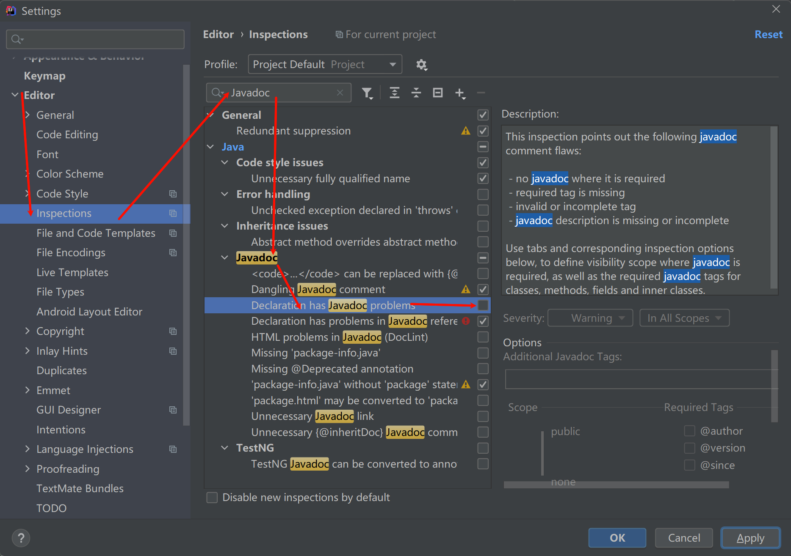
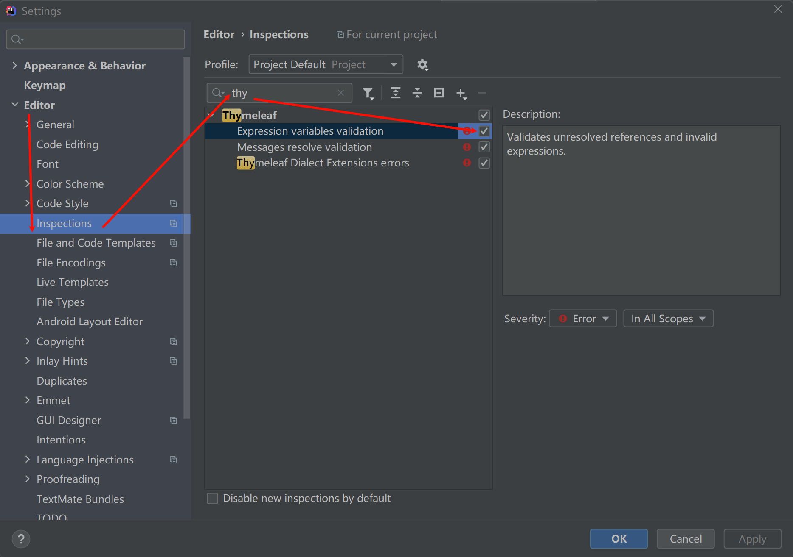
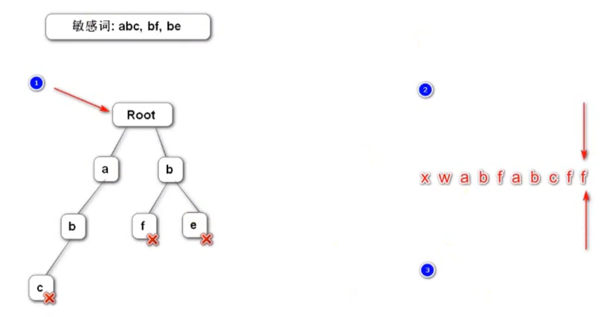
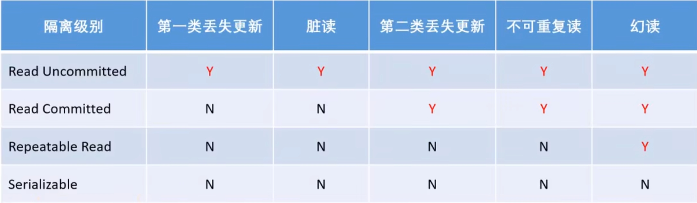
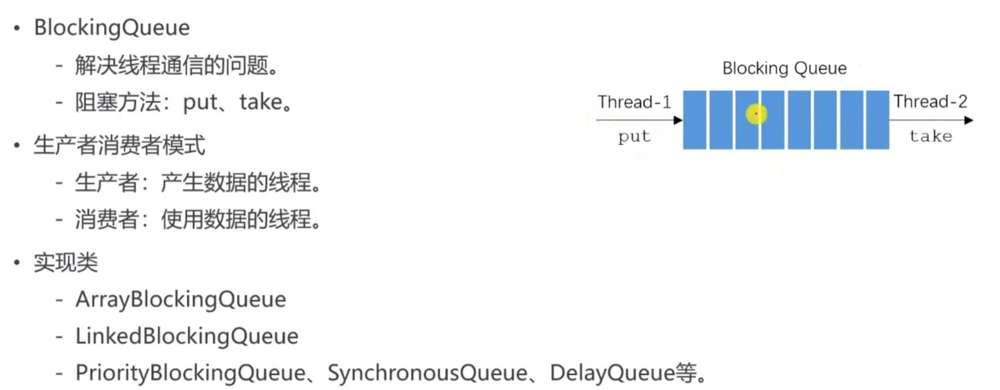
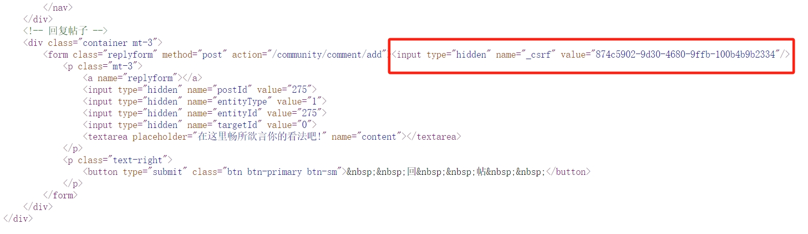
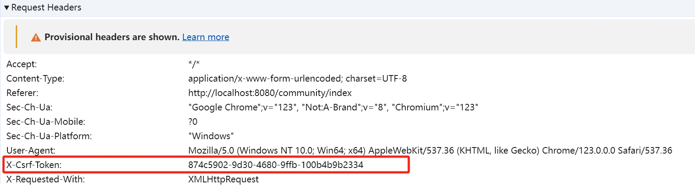
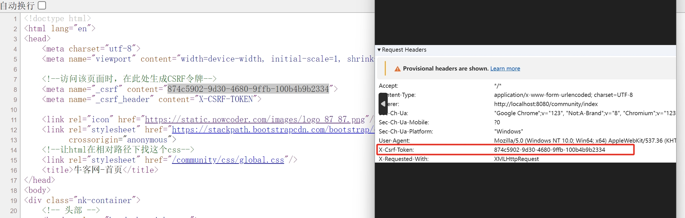
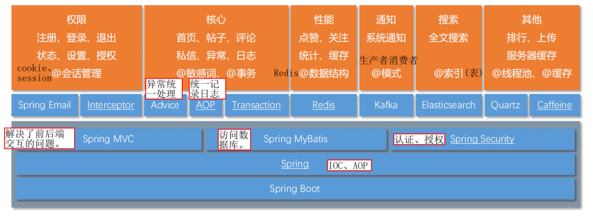
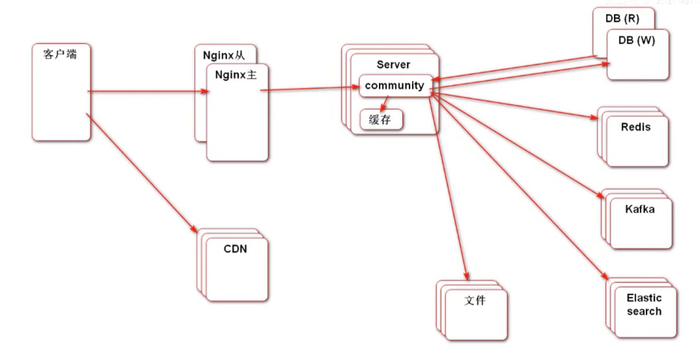

# 0.相关工具快速入门

## Maven

1. 配置阿里云中央仓库镜像
2. 配置%MAVEN_HOME%环境变量
3. 可以手动敲命令行，但是不推荐，因为可以用IDEA集成Maven，通过GUI使用Maven
4. generate
5. compile
6. clean，清除target
7. test，test前会先编译
8. https://mvnrepository.com/，搜索包
9. Spring Boot中将包做了整合，比如选择web项目，就会默认引入那两个包

## Spring

和前面的Spring差不多，只不过是我们这里手动把applicationContext.xml设为了启动类xxxApplication

然后ioc容器的用法也是相同的，还有注解开发，JavaConfig等等，总之==降低了对象间的耦合度==

## Spring MVC

https://developer.mozilla.org/zh-CN/，网络相关文档

model + view + controll，和dao, sreivice, controller==不是==一一对应的

## Thymeleaf

生成动态HTML

Model + View ==模板引擎=> HTML

==优点：可以直接渲染.html文件==

关闭缓存，防止我们对代码进行修改后，前端页面依旧显示缓存的页面的问题

```yml
spring:
  thymeleaf:
    # 关闭缓存
    cache: false
```

## Mybatis

```yml
server:
  # 应用服务 WEB 访问端口
  port: 8080
  servlet:
    # 上下文地址，默认为 /，就是在访问所有页面之前要加上:/community
    context-path: /community

spring:
  # Mybatis 数据库连接配置
  datasource:
    driver-class-name: com.mysql.cj.jdbc.Driver
    username: root
    password: 1234
    url: jdbc:mysql://localhost:3306/community?characterEncoding=UTF-8&useSSL=false&serverTimezone=UTC
    type: com.zaxxer.hikari.HikariDataSource
    hikari:
      maximum-pool-size: 15
      minimum-idle: 5
      idle-timeout: 30000
  # json中的null属性不会显示
  jackson:
    default-property-inclusion: non_null
  thymeleaf:
    # 关闭缓存
    cache: false

mybatis:
  configuration:
    # 自动将下划线命名法转换为驼峰命名法
    map-underscore-to-camel-case: true
    # 控制台输出sql语句
    log-impl: org.apache.ibatis.logging.stdout.StdOutImpl
    # 将新的主键与插入的结果一起返回
    use-generated-keys: true
  # 解决*Mapper.xml文件找不到的问题，classpath本质是编译后的target/classes目录
  mapper-locations: classpath:mapper/*.xml
  # 起别名，得告诉mybatis需要的对象在哪个包
  type-aliases-package: garry.community.pojo
```

# 1.社区首页

## 问题和杂技

1. 报错：`Failed to load property source from location 'classpath:/application.yml`

	> 问题原因：==properties转化为yml的过程中，忘记该格式了==
	>
	> 解决方法：yml改格式

2. ==关闭注释中参数没写注释的警告==

	> 

3. 关于==主页渲染失败的问题==

	> 问题原因：==需要使用的css和js被墙了==
	>
	> 解决方法：科学上网
	
4. ==排序之后管理员的那条置顶信息没有搜到==

	> 问题原因：使用limit，==只处理了前十条，管理员那条在后面，因此压根没有搜到它！==
	>
	> 解决方法：pageHelper

5. 集成thymeleaf时，==`"${xxx}"`下面总是报`“Cannot resolve ‘xxx’”`的错误==，但并不影响正常运行

	> 问题原因：IDEA会对表达式进行校验，发现该html页面不支持EL表达式
	>
	> 解决方法：取消勾选
	>
	> 

6. ==pageHelper的使用注意事项==

	> 1. 只有==紧跟着PageHelper.startPage(pageNum,pageSize)的sql语句才被pagehelper起作用==
	>
	> 2. ==创建PageInfo对象时，必须把搜查出来的List传进构造方法==
	>
    > 	 ```java
    > 	//启动分页
    > 	PageHelper.startPage(pageNum, pageSize);
    > 	 																							
    > 	//查询该用户的所有非拉黑帖子
    > 	List<DiscussPost> discussPostList = discussPostMapper.selectDiscussPosts(userId);
    > 	 																						
    > 	//将查询结果加入pageInfo
    > 	PageInfo<DiscussPost> pageInfo = new PageInfo<>(discussPostList/*传进去*/);
    > 	pageInfo.setList(discussPostList);
    > 	return pageInfo;
    > 	```

7. ==html页面中使用th:if后，后续的页面全没了，且控制台中报错说if语句parse失败==

	> 问题原因：th:if语法错误，==整个判断语句必须全部放在\${}中，不能出现多个\${}==
	>
	> 解决方法：==修改为`th:if="${i >= 1 && i <= pageInfo.pages}"`==
	
8. ==#dates.format()，日期格式化==

  ```html
  <b th:text="${#dates.format(map.post.createTime,'yyyy-MM-dd HH:mm:ss')}">
  ```

9. ==#numbers.sequence(begin ,end)，创建一个值从being到end的数组（两边都闭）==

  ```html
  <li class="page-item active"
      th:each="i:${#numbers.sequence(pageInfo.pageNum - 2, pageInfo.pageNum + 2)}"
      th:if="${i >= 1 && i <= pageInfo.pages}">
      <a class="page-link" th:href="@{/index(pageNum = ${i})}" th:text="${i}"></a>
  </li>
  ```

10. ==th:class，表示class的值是动态的，里面用|  |围住动态的内容==

	```html
	<li th:class="|page-item ${pageInfo.pageNum == 1 ? 'disabled' : ''}|">
	```

## 表结构分析

### user表

```sql
CREATE TABLE `user` (
  `id` int(11) NOT NULL AUTO_INCREMENT,
  `username` varchar(50) DEFAULT NULL,
  `password` varchar(50) DEFAULT NULL,
  `salt` varchar(50) DEFAULT NULL,
  `email` varchar(100) DEFAULT NULL,
  `type` int(11) DEFAULT NULL COMMENT '0-普通用户; 1-超级管理员; 2-版主;',
  `status` int(11) DEFAULT NULL COMMENT '0-未激活; 1-已激活;',
  `activation_code` varchar(100) DEFAULT NULL,
  `header_url` varchar(200) DEFAULT NULL,
  `create_time` timestamp NULL DEFAULT NULL,
  PRIMARY KEY (`id`),
  KEY `index_username` (`username`(20)),
  KEY `index_email` (`email`(20))
) ENGINE=InnoDB AUTO_INCREMENT=150 DEFAULT CHARSET=utf8;
```

==salt字段：为了防止用户的密码过于简单，会在用户密码后面拼接一个字符串"salt"，以提高其安全性==

activation_code字段：激活码

### discuss_post表

帖子表

```sql
CREATE TABLE `discuss_post` (
  `id` int(11) NOT NULL AUTO_INCREMENT,
  `user_id` varchar(45) DEFAULT NULL,
  `title` varchar(100) DEFAULT NULL,
  `content` text,
  `type` int(11) DEFAULT NULL COMMENT '0-普通; 1-置顶;',
  `status` int(11) DEFAULT NULL COMMENT '0-正常; 1-精华; 2-拉黑;',
  `create_time` timestamp NULL DEFAULT NULL,
  `comment_count` int(11) DEFAULT NULL,
  `score` double DEFAULT NULL,
  PRIMARY KEY (`id`),
  KEY `index_user_id` (`user_id`)
) ENGINE=InnoDB AUTO_INCREMENT=281 DEFAULT CHARSET=utf8;
```

==comment_count评论数量，可以在comment表中查，但是评论数量常用，因此单独拿出来==

==score计算帖子的热度==

## 社区首页

### HomeController

```java
@Controller
public class HomeController {

    @Resource
    private DiscussPostServiceImpl discussPostService;

    @Resource
    private UserServiceImpl userService;

    @RequestMapping(value = "/index", method = RequestMethod.GET)
    public String getIndexPage(Model model,/*渲染模型*/
                               @RequestParam(value = "userId", required = false,
                                             defaultValue = "0") Integer userId,
                               @RequestParam(value = "pageNum", required = false,
                                             defaultValue = "1") Integer pageNum,
                               @RequestParam(value = "pageSize", required = false,
                                             defaultValue = "10") Integer pageSize) {

        //查询userId用户的所有帖子，并借助Mybatis-pageHelper进行分页，得到分页详情
        PageInfo<DiscussPost> pageInfo = discussPostService.findDiscussPosts(userId,
                pageNum < 1 ? 1 : pageNum/* 防止传来pageNum=0 */, pageSize);
        //得到查到的discussPostList
        List<DiscussPost> discussPostList = pageInfo.getList();
        //stream+lambda，List<DiscussPost> =>  List<HashMap<String, Object>>
        //以便前端可以直接获取帖子的user(用户详情)和post(帖子详情)
        List<HashMap<String, Object>> discussPosts = discussPostList.stream()
                .map(discussPost -> {
                    HashMap<String, Object> map = new HashMap<>();
                    User user = userService.findByUserId(discussPost.getUserId());
                    map.put("user", user);
                    map.put("post", discussPost);
                    return map;
                }).collect(Collectors.toList());

        //向模板中写入discussPosts，用于遍历显示帖子
        model.addAttribute("discussPosts", discussPosts);
        //向模板中写入pageInfo，用于控制分页
        model.addAttribute("pageInfo", pageInfo);
        //传入userId，以便前端分页跳转时，可以跳到正确的user的页面
        model.addAttribute("userId", userId);
        //传入分页导航栏每一边的长度
        model.addAttribute("navigatePageWidth", CommunityConst.NAVIGATE_PAGE_WIDTH);
        return "/index";//不用写.html
    }
}
```

### thymeleaf

==引入声明==：

```html
<html lang="en" xmlns:th="http://www.thymeleaf.org">
```

==让html在相对路径下找文件==：

```html
<!--让html在相对路径下找这个css-->
<link rel="stylesheet" th:href="@{/css/global.css}"/>
```

> 意为使用templates/css/global.css

同理，最后的js也可以这样：

```html
<script th:src="@{/js/global.js}"></script>
<script th:src="@{/js/index.js}"></script>
```

==thymeleaf的好处是：我们可以直接渲染html页面，而不需要jsp，freemarker等其它文件==

### 帖子列表

1. 复用这个模板，在里面写入动态数据

	==th:each，遍历传入的集合，并将元素取名为map==

	```html
	<li class="media pb-3 pt-3 mb-3 border-bottom" th:each="map:${discussPosts}">
	```

2. ==使用map.user，thymeleaf会自动调用map.get("user")==

	```html
	
	```

3. ==utext会将text中的转义字符显示为转义，而text则会直接显示原字符==

	```html
	<a href="#" th:utext="${map.post.title}"></a>
	```

4. ==th:if，做判断==

	```html
	<span class="badge badge-secondary bg-primary" th:if="${map.post.type==1}">置顶</span>
	```

5. ==#dates.format()，日期格式化==

	```html
	<b th:text="${#dates.format(map.post.createTime,'yyyy-MM-dd HH:mm:ss')}">
	```

==代码全貌==：

```html
<!-- 帖子列表 -->
<ul class="list-unstyled">
    <!--循环产生帖子-->
    <li class="media pb-3 pt-3 mb-3 border-bottom"
        th:each="map:${discussPosts}">
        <!--TODO 用户头像链接未完成-->
        <a href="#">
            
        </a>
        <div class="media-body">
            <h6 class="mt-0 mb-3">
                <!--TODO 帖子内容详情链接未完成-->
                <a href="#" th:utext="${map.post.title}"></a>
                <span class="badge badge-secondary bg-primary"
                      th:if="${map.post.type == 1}">置顶</span>
                <span class="badge badge-secondary bg-danger"
                      th:if="${map.post.status == 1}">精华</span>
            </h6>
            <div class="text-muted font-size-12">
                <u class="mr-3" 
                   th:utext="${map.user.username}"></u> 发布于 
                <b th:text="${#dates.format(map.post.createTime,
                    'yyyy-MM-dd HH:mm:ss')}"></b>
                <ul class="d-inline float-right">
                    <!--TODO 点赞数功能未实现-->
                    <li class="d-inline ml-2">赞 11</li>
                    <li class="d-inline ml-2">|</li>
                    <!--TODO 回帖数功能暂时实现？-->
                    <li class="d-inline ml-2">回帖 
                        <a th:text="${map.post.commentCount}"></a></li>
                </ul>
            </div>
        </div>
    </li>
</ul>
```

### 分页功能

1. ==th:href==，用于动态编辑跳转地

	```html
	<a class="page-link" th:href="@{/index(pageNum = 1)}">首页</a>
	```

2. ==#numbers.sequence(begin ,end)，创建一个值从being到end的数组（两边都闭）==

	```html
	<li class="page-item active"
	    th:each="i:${#numbers.sequence(pageInfo.pageNum - 2, pageInfo.pageNum + 2)}"
	    th:if="${i >= 1 && i <= pageInfo.pages}">
	    <a class="page-link" th:href="@{/index(pageNum = ${i})}" th:text="${i}"></a>
	</li>
	```

3. ==th:class，表示class的值是动态的，里面用|  |围住动态的内容==

	```html
	<li th:class="|page-item ${pageInfo.pageNum == 1 ? 'disabled' : ''}|">
	```

==代码全貌==：

```html
<!-- 分页 -->
<nav class="mt-5" th:if="${pageInfo.pages > 0}"><!--页数>0才会显示-->
    <ul class="pagination justify-content-center">
        <!--跳转首页-->
        <li class="page-item">
            <a class="page-link"
               th:href="@{/index(userId = ${userId}, pageNum = 1)}">首页</a>
        </li>

        <!--必须不是第一页，才有上一页-->
        <li th:class="|page-item ${pageInfo.pageNum == 1 ? 'disabled' : ''}|">
            <a class="page-link"
               th:href="@{/index(userId = ${userId}, 
                        pageNum = ${pageInfo.prePage})}">上一页</a>
        </li>

        <!--当前页高亮，创建数组遍历，判断页数范围-->
        <li th:class="|page-item ${i == pageInfo.pageNum ? 'active' : ''}|"
            th:each="i:${#numbers.sequence(pageInfo.pageNum - navigatePageWidth,
                     pageInfo.pageNum + navigatePageWidth)}"
            th:if="${i >= 1 && i <= pageInfo.pages}">
            <a class="page-link"
               th:href="@{/index(userId = ${userId}, pageNum = ${i})}" th:text="${i}"></a>
        </li>

        <!--必须不是最后一页，才有下一页-->
        <li th:class="|page-item ${pageInfo.pageNum == pageInfo.pages ?
                      'disabled' : ''}|">
            <a class="page-link"
               th:href="@{/index(userId = ${userId}, 
                        pageNum = ${pageInfo.nextPage})}">下一页</a>
        </li>

        <!--跳转至末页-->
        <li class="page-item">
            <a class="page-link"
               th:href="@{/index(userId = ${userId}, 
                        pageNum = ${pageInfo.pages})}">末页</a>
        </li>
    </ul>
</nav>
```

## 调试工具和方法

### 状态码

官方文档：https://developer.mozilla.org/zh-CN/docs/Web/HTTP/Status

### 服务端断点调试

在IDEA中debug

### 客户端断点调试

谷歌浏览器F12，Sources中选中调试文件，打断点，F10下一行，F8运行到下一个断点

### logback日志

```yml
logging:
  pattern:
    # 修改日志的格式
    console: "[%thread] %magenta(%-5level) %green([%-50.50class]) >>> %cyan(%msg) %n"
  level:
    # 设置日志最低级别
    garry.community: debug
```

### 版本控制

Missing Semester


# 2.登录模块

## 问题和杂技

1. ==报错：`'Cannot find method 'value'`==

	> 问题原因：==引错包了，引成了lombok.Value，我们要的是springframework的Value==，后者才能读取yml中的配置数据
	>
	> 解决方法：
	>
	> ```java
	> import org.springframework.beans.factory.annotation.Value;
	> ```

2. ==TemplateEngine将动态html页面转化为字符串==

	> ==Context必须是org.thymeleaf.context.Context==

3. ==从url上访问资源，只能访问到静态（static）资源，不能访问动态（templates）资源==

4. ==html代码复用==：==th:fragment标记模板，th:replace进行复用==

	```html
	<header class="bg-dark sticky-top" th:fragment="header">
	<header class="bg-dark sticky-top" th:replace="index::header">
	```

5. userServiceImpl中发送邮件，==捕获MailClientUtil抛出的异常时，捕获失败==

	> 问题原因：没搞明白，难道是捕获异常的范围不够吗？
	>
	> 解决方法：==将异常范围从MailException扩大到Exception==，即可捕获到异常

6. userServiceImpl中获取插入的用户自增的id时，==获取的id为null，且yml中已经use-generated-keys: true==

	> 问题原因：不明
	>
	> 解决方法：按照老方法在xml中useGeneratedKeys=true，Keyproperties="id"

7. `public String register(Model model, UserRegisterForm userRegisterForm)`中，==SpringMVC会自动将传入值赋给UserRegisterForm中属性名一致的属性==

8. ==发生的异常被try-catch后，手动回滚事务==

	> ```java
	> //尝试发送邮件，若邮箱地址有误，则会在responseMap中添加WRONG_EMAIL
	> //用户邮箱有误，则必须在try-catch中手动回滚事务
	> try {
	>     mailClientUtil.sendMail(user.getEmail(), "牛客网-激活账号", content);
	> } catch (Exception e) {
	>     log.error("【用户邮箱地址有误】user = {}", gson.toJson(user));
	>     ResponseUtil.addResponse(responseMap, ResponseEnum.WRONG_EMAIL);
	>     /*try-catch异常时，手动回滚事务*/
	>     TransactionAspectSupport.currentTransactionStatus().setRollbackOnly();
	> }
	> ```
	>
	> ```java
	> /*try-catch异常时，手动回滚事务*/
	> TransactionAspectSupport.currentTransactionStatus().setRollbackOnly();
	> ```

9. 前端的表单==input中的name==必须和user中的属性名一致

10. ==激活账号时，点击链接发现405，Method not allowed，需要使用Get请求==

	> ==activation方法需要改为GET请求==
	
11. ==HTTP是无状态的，有会话的==

	> 1. ==服务器无法记住浏览器的状态，同一个用户使用同一个浏览器向服务器器发送两次请求，这两次请求之间是没有关系的，服务器无法将它们识别为同一个用户发送的请求==
	> 2. ==可以使用Cookies，创建一个会话共享上下文信息，达成相同的状态==

12. Cookies是由服务器生成，发送给浏览器并==保存在用户本地的一小块数据==，它会==在浏览器下一次向服务器发送请求时被携带并发送到浏览器上==

13. 使用@CookieValue注解，直接获取某一个特定的cookie值，而不用取遍历cookies数组

	> ```java
	> (@CookieValue(value = "key") String value/*key键对应的value值*/) {...}
	> ```

14. 服务器创建session，==为了识别session属于哪个浏览器，会向浏览器发送一个带有sessionId的cookie==，当同一浏览器再次向服务器发送请求时，会自动携带cookie，因此服务器就能根据收到的cookie识别该浏览器对应于哪一个session

15. session是由服务器(SpringMVC)自动帮助我们创建的

16. ==session键值对的值可以是Object，而cookie键值对的值只能是String==，因为cookie需要在浏览器和服务器之间反复传，因此携==带的数据量不能太大==，且==浏览器只能识别String，传其它的类型也没有意义==。

17. 更换验证码失败

	> 问题原因：IDE发现之前图片的src="@{/kaptha}"，而javascript中也是设置图片的src=CONTEXT_PATH+"kaptha"，==两个路径一样，它就直接偷懒不去执行了==
	>
	> 解决方法：==让javascript中的路径和"@{/kaptha}"不一样，在最后加上"?"+时间戳==
	>
	> ```javascript
	> document.getElementById("kaptcha").src = CONTEXT_PATH + "/kaptcha" +
	>     "?" + new Date().getMilliseconds();
	> ```

18. 设置Cookie时报错：`An invalid character [34] was present in the Cookie value`

	> 问题分析：==Cookie中出现了引号，引号在Cookie中不能存在==
	>
	> 解决方法：==对 Cookie 的值进行进行编码==：　　　
	>
	> ```java
	> String encodeCookie = URLEncoder.encode(Cookie的值 "utf-8");
	> ```
	>
	> 　　　　==要取它里面的值的时候，再对其进行解码==：　　　
	>
	> ```java
	> URLDecoder.decode(encodeCookie , "utf-8")
	> ```
	>
	> ```java
	> LoginTicket loginTicket = 
	>     (LoginTicket) responseMap.get(MessageEnum.LOGIN_TICKET_MSG.getMsg());
	> String encode = "";
	> try {
	>     encode = URLEncoder.encode(gson.toJson(loginTicket), "utf-8");
	>     String decode = URLDecoder.decode(encode, "utf-8");
	>     log.debug("【编码前】" + gson.toJson(loginTicket));
	>     log.debug("【编码后】" + encode);
	>     log.debug("【解码后】" + decode);
	>     log.debug("【还原成LoginTicket】" + gson.fromJson(decode, LoginTicket.class));
	> } catch (UnsupportedEncodingException e) {
	>     log.error("【loginTicket编码失败】loginTicket = {}", gson.toJson(loginTicket));
	>     e.printStackTrace();
	> }
	> ```

19. ==报错：`An error happened during template parsing (template: "class path resource [templates//index.html]")] with root cause `==

	> 问题原因：==重定向到getIndexPages方法，而不是跳转到index.html==
	>
	> 解决方法：
	>
	> ```java
	> return "redirect:/index";
	> ```

20. ==页面显示时间和数据库存储时间对不上的问题==

	> 问题原因：数据库设置的时间是UTC，也就是国际标准时间，而我们所处的东八区时间比UTC快8个小时，因此是时区不匹配的问题
	>
	> 解决方法：==在yml中将UTC改为`serverTimezone=Asia/Shanghai`==
	
21. ==设置cookie的maxAge为-1后，重新打卡浏览器cookie没有被消除==的问题

	> 问题原因：==谷歌浏览器设置了"启动时自动浏览上次的页面"==，因此看似关闭了浏览器，实则并没有关闭，浏览器上次浏览的数据依旧保留！
	>
	> 解决方法：==设置为"启动时打开新的标签页"==

22. ==上传文件==

	> 1. ==必须是POST请求==
	> 2. ==表单增加设置：enctype = "multipart/form-data"==

23. ==上传文件时，SpringMVC为我们封装好了一个类MultipartFile，专门用于接收页面上传的文件==

	> ```java
	> @RequestMapping(value = "/upload", method = RequestMethod.POST)
	> public String updateHeader(MultipartFile headerImage)
	> ```
	>
	> 如果有多个文件，则用MultipartFile[]接收
	
24. ==使用自定义注解，在需要被拦截的方法上加注解，然后在拦截器中通过反射获取方法上的注解，实现业务逻辑==。==好处是不需要再配置中写需要拦截哪些请求了，直接拦截所有请求，然后筛选出带有自定义注解的方法，实现自己的业务逻辑==。

## 发送邮件

### Spring-mail下的SMTP服务

==SMTP服务==：客户端发送邮件的服务

==Spring Email==：Spring 集成的Email功能

==Maven引入spring-mail==：

```xml
<!--Spring邮件服务-->
<dependency>
    <groupId>org.springframework.boot</groupId>
    <artifactId>spring-boot-starter-mail</artifactId>
    <version>2.1.5.RELEASE</version>
</dependency>
```

==yml配置==：

```yml
spring:
  # spring-mail配置
  mail:
    host: smtp.sina.com
    port: 465
    username: 17380672612@sina.cn
    password: d7ef9d8a493293e4 #新浪给你启动SMTP服务的16位密码
    protocol: smtps
    properties:
      mail:
        smtl:
          auth: true
        smtp:
          ssl:
            enable: true
```

### MailClientUtils

```java
@Slf4j
@Component
public class MailClientUtils {
    @Resource
    private JavaMailSender mailSender;//java邮件的核心Bean

    @Value("${spring.mail.username}")
    private String sender;//发送者，就是新浪邮箱的网址

    public void sendMail(String receiver, String subject, String content) {
        MimeMessage mimeMessage = mailSender.createMimeMessage();
        MimeMessageHelper helper = new MimeMessageHelper(mimeMessage);
        try {
            helper.setFrom(sender);
            helper.setTo(receiver);
            helper.setSubject(subject);
            helper.setText(content, true/*使用html格式传输*/);
            helper.setSentDate(new Date());
            mailSender.send(mimeMessage);
        } catch (MessagingException e) {
            log.error("【邮件发送失败】 MessagingException = {}",
                      e.getLocalizedMessage());
            e.printStackTrace();
        }
    }
}
```

### TemplateEngine html模板引擎

==TemplateEngine：html模板引擎，用于将动态html页面转化为String字符串，由于邮件发送==

```java
public class MailClientUtilsTest extends CommunityApplicationTests {
    @Resource
    private MailClientUtils mailClientUtils;

    @Resource
    private TemplateEngine templateEngine;//html邮件模板引擎

    private final String receiver = "17380672612m@sina.cn";

    private final String subject = "TEST";

    @Test
    public void sendMail() {
        Context context = new Context/*必须是org.thymeleaf.context.Context*/();
        context.setVariable("username", "Garry");//类似于键值对

        String htmlContent =
                templateEngine.process("/mail/demo", context);

        mailClientUtils.sendMail(receiver, subject, htmlContent);
    }
}
```

## 注册功能

### 打开注册页面

1. ==html代码复用==：==th:fragment标记模板，th:replace进行复用==

	```html
	<header class="bg-dark sticky-top" th:fragment="header">
	<header class="bg-dark sticky-top" th:replace="index::header">
	```

```html
<a class="nav-link" th:href="@{/register}">注册</a>
```

### 提交注册表单

==验证表单是否为null的依赖：Apache commons lang==

==Maven引入==：

```xml
<dependency>
    <groupId>org.apache.commons</groupId>
    <artifactId>commons-lang3</artifactId>
    <version>3.12.0</version>
</dependency>
```

==yml配置==：

```yml
community:
  path:
    domain: http://localhost:8080
```

==UserServiceImpl.register==：

```java
@Override
@Transactional(rollbackFor = Exception.class)
public Map<String, Object> register(User user) {
    /*
            1.参数为空
         */
    if (user == null) {
        log.error("【用户参数不能为空】");
        throw new IllegalArgumentException("【用户参数不能为空】");
    }

    //创建responseMap
    Map<String, Object> responseMap = new HashMap<>();

    /*
            2.账号，密码，邮箱不能为空
         */
    if (StringUtils.isBlank(user.getUsername())) {
        ResponseUtil.addResponse(responseMap, ResponseEnum.USERNAME_BLANK);
    }
    if (StringUtils.isBlank(user.getPassword())) {
        ResponseUtil.addResponse(responseMap, ResponseEnum.PASSWORD_BLANK);
    }
    if (StringUtils.isBlank(user.getEmail())) {
        ResponseUtil.addResponse(responseMap, ResponseEnum.EMAIL_BLANK);
    }
    if (!responseMap.isEmpty()) return responseMap;

    /*
            3.账号，邮箱不能重复 TODO 密码长度不能低于8位
         */
    User byUsername = userMapper.selectByUsername(user.getUsername());
    if (byUsername != null) {
        ResponseUtil.addResponse(responseMap, ResponseEnum.USERNAME_EXIST);
    }
    User byEmail = userMapper.selectByEmail(user.getEmail());
    if (byEmail != null) {
        ResponseUtil.addResponse(responseMap, ResponseEnum.EMAIL_EXIST);
    }
    if (!responseMap.isEmpty()) return responseMap;

    /*
            4.注册
         */
    user.setSalt(CommunityUtil.generateUUID()
                 .substring(0, CommunityConst.SALT_LENGTH));//设置盐值
    user.setPassword(CommunityUtil.md5Encryption(//设置加密密码
        user.getPassword() + user.getSalt()));//原密码+盐值

    user.setType(UserTypeEnum.NORMAL_USER.getCode());//普通用户
    user.setStatus(UserStatusEnum.UNACTIVATED.getCode());//未激活

    user.setActivationCode(CommunityUtil.generateUUID()//激活密码
                           .substring(0, CommunityConst.ACTIVATION_CODE_LENGTH));//密码长度

    int headerNum = new Random().nextInt(CommunityConst.USER_HEADER_URL_BOUND + 1);
    String headerUrl = String.format(CommunityConst.USER_HEADER_URL_TEMPLATE, headerNum);
    user.setHeaderUrl(headerUrl);//设置用户头像的绝对地址
    user.setCreateTime(new Date());//设置时间

    int insertRows = userMapper.insert(user);
    if (insertRows <= 0) {
        log.error("【用户插入失败】 user = {}", gson.toJson(user));
        throw new RuntimeException("【用户插入失败】");
    }

    /*
            5.发送验证邮件
         */
    //传入用户邮箱地址
    Context context = new Context();
    Map<String, Object> variables = new HashMap<>();
    variables.put("email", user.getEmail());

    //获取激活码的URL，使用字符拼接，Controller获取参数方式为路径参数
    String url = domain + contextPath + "/activation/" +
        user.getId() + "/" + user.getActivationCode();
    variables.put("url", url);

    //模板引擎获取渲染后的html内容
    context.setVariables(variables);
    String content = templateEngine.process("/mail/activation", context);

    //尝试发送邮件，若邮箱地址有误，则会在responseMap中添加WRONG_EMAIL
    //用户邮箱有误，则必须在try-catch中手动回滚事务
    try {
        mailClientUtil.sendMail(user.getEmail(), "牛客网-激活账号", content);
    } catch (Exception e) {
        log.error("【用户邮箱地址有误】user = {}", gson.toJson(user));
        ResponseUtil.addResponse(responseMap, ResponseEnum.WRONG_EMAIL);
        /*try-catch异常时，手动回滚事务*/
        TransactionAspectSupport.currentTransactionStatus().setRollbackOnly();
    }

    return responseMap;
}
```

==LoginController.register==：

```java
@RequestMapping(value = "/register", method = RequestMethod.POST)
public String register(Model model, UserRegisterForm userRegisterForm) {
    User user = new User();
    BeanUtils.copyProperties(userRegisterForm, user);
    Map<String, Object> responseMap = userService.register(user);
    //注册成功，用户需要激活
    if (responseMap == null || responseMap.isEmpty()) {
        model.addAttribute("msg", "注册成功，我们已向您发送激活邮件，请尽快激活");
        model.addAttribute("redirectionTime", CommunityConst.AUTO_REDIRECTION_TIME);
        model.addAttribute("target", "/index");
        return "/site/operate-result";
    }

    //注册失败，全发给前端(重新注册)，不是null才会处理
    model.addAttribute(MessageEnum.USERNAME_MSG.getMsg(),
                       responseMap.get(MessageEnum.USERNAME_MSG.getMsg()));
    model.addAttribute(MessageEnum.PASSWORD_MSG.getMsg(),
                       responseMap.get(MessageEnum.PASSWORD_MSG.getMsg()));
    model.addAttribute(MessageEnum.EMAIL_MSG.getMsg(),
                       responseMap.get(MessageEnum.EMAIL_MSG.getMsg()));
    return "/site/register";
}
```

==register.html==：

```html
<!--账号-->
<input type="text"
       th:class="|form-control ${usernameMsg != null ? 'is-invalid' : ''}|"
       th:value="${userRegisterForm != null ? userRegisterForm.username : ''}"
       id="username" name="username" placeholder="请输入您的账号!" required>
<div class="invalid-feedback" th:text="${usernameMsg}"></div>
```

### 激活注册账号

==UserServiceImpl.activation==：

```java
@Override
public ActivationEnum activation(Integer userId, String activationCode) {
    User user = userMapper.selectByPrimaryKey(userId);
    //用户为空，或激活码不正确，激活失败
    if (user == null || !user.getActivationCode().equals(activationCode)) {
        return ActivationEnum.ACTIVATION_FAIL;
    }

    //用户已激活，重复激活
    if (user.getStatus().equals(UserStatusEnum.ACTIVATED.getCode())) {
        return ActivationEnum.ACTIVATION_REPEAT;
    }

    //激活成功
    user.setStatus(UserStatusEnum.ACTIVATED.getCode());
    int updateRows = userMapper.updateByPrimaryKeySelective(user);
    if (updateRows <= 0) {
        log.error("【用户更新失败】 user = {}", gson.toJson(user));
        throw new RuntimeException("【用户更新失败】");
    }
    
    return ActivationEnum.ACTIVATION_SUCCESS;
}
```

==LoginController.activation==：

```java
@RequestMapping(value = "/activation/{userId}/{activationCode}", method = RequestMethod.GET)
public String activation(Model model,
                         @PathVariable(value = "userId") Integer userId,
                         @PathVariable(value = "activationCode") String activationCode) {
    ActivationEnum activation = userService.activation(userId, activationCode);
    if (activation.getCode().equals(ActivationEnum.ACTIVATION_SUCCESS.getCode())) {
        model.addAttribute("msg", "激活成功，您的账号已经可以正常使用了");
        model.addAttribute("target", "/login");
    } else if (activation.getCode().equals(ActivationEnum.ACTIVATION_REPEAT.getCode())) {
        model.addAttribute("msg", "该账号已激活，请勿重复激活");
        model.addAttribute("target", "/index");
    } else if (activation.getCode().equals(ActivationEnum.ACTIVATION_FAIL.getCode())) {
        model.addAttribute("msg", "激活失败，请检查您的激活码");
        model.addAttribute("target", "/index");
    }
    model.addAttribute("redirectionTime", CommunityConst.AUTO_REDIRECTION_TIME);
    return "/site/operate-result";
}
```

## 会话管理

1. ==HTTP是无状态的，有会话的==

	> 1. ==服务器无法记住浏览器的状态，同一个用户使用同一个浏览器向服务器器发送两次请求，这两次请求之间是没有关系的，服务器无法将它们识别为同一个用户发送的请求==
	> 2. ==可以使用Cookies，创建一个会话共享上下文信息，达成相同的状态==

2. Cookies是由服务器生成，发送给浏览器并==保存在用户本地的一小块数据==，它会==在浏览器下一次向服务器发送请求时被携带并发送到浏览器上==

3. 使用@CookieValue注解，直接获取某一个特定的cookie值，而不用取遍历cookies数组

	> ```java
	> (@CookieValue(value = "key") String value/*key键对应的value值*/) {...}
	> ```

4. 服务器创建session，==为了识别session属于哪个浏览器，会向浏览器发送一个带有sessionId的cookie==，当同一浏览器再次向服务器发送请求时，会自动携带cookie，因此服务器就能根据收到的cookie识别该浏览器对应于哪一个session

5. session是由服务器(SpringMVC)自动帮助我们创建的

6. ==session键值对的值可以是Object，而cookie键值对的值只能是String==，因为cookie需要在浏览器和服务器之间反复传，因此携==带的数据量不能太大==，且==浏览器只能识别String，传其它的类型也没有意义==。

## 生成验证码

### 验证码图片api：Kaptcha

==Kaptcha：生成随机验证码图片的api==

==Maven引入==：

```xml
<!--kaptcha，生成随机验证图片-->
<dependency>
    <groupId>com.github.penggle</groupId>
    <artifactId>kaptcha</artifactId>
    <version>2.3.2</version>
</dependency>
```

### KaptchaConfig

```java
@Slf4j
@Configuration//采用Java Config
public class KaptchaConfig {

    @Bean
    public Producer kaptchaProducer/*Bean的名字*/() {
        //DefaultKaptcha实现了Producer接口，Producer接口中有createImage方法
        DefaultKaptcha kaptcha = new DefaultKaptcha();

        //自定义Properties类
        Properties properties = new Properties();
        properties.setProperty("kaptcha.image.width", "100");//宽度
        properties.setProperty("kaptcha.image.height", "40");//高度
        properties.setProperty("kaptcha.textproducer.font.size", "32");//字体大小
        properties.setProperty("kaptcha.textproducer.font.color", "0,0,0");//颜色，RGB
        properties.setProperty("kaptcha.textproducer.char.string",
                               "0123456789ABCDEFGHJKMNPQRTUVWXYZ");//验证码的字符集
        properties.setProperty("kaptcha.textproducer.char.length", "4");//验证码长度
        properties.setProperty("kaptcha.noise.impl",
                               "com.google.code.kaptcha.impl.NoNoise");//干扰方式，这里选择没有额外干扰
        try {
            properties.store(new FileOutputStream("src/main/resources/kaptcha.properties"), null);
        } catch (IOException e) {
            log.error("【kaptcha配置文件存储失败】");
            e.printStackTrace();
        }

        //Config类，接收Properties自定义的配置
        Config config = new Config(properties);
        kaptcha.setConfig(config);
        return kaptcha;
    }
}
```

### 生成验证码

```java
/**
 * 将验证码图片返回给浏览器，并将答案存入session
 *
 * @param session
 * @param response
 */
@RequestMapping(value = "/kaptcha", method = RequestMethod.GET)
public void getKaptcha(HttpSession session,
                       HttpServletResponse response) {
    //生成验证码
    String text = kaptchaProducer.createText();//验证码的内容
    BufferedImage image = kaptchaProducer.createImage(text);//根据内容生成图片

    //将验证码存入session
    session.setAttribute("kaptcha", text);

    //将图片输出给浏览器
    response.setContentType("image/png");
    try {
        //获取传给浏览器的输出流
        ServletOutputStream os = response.getOutputStream();
        //图片传输api
        ImageIO.write(image, "png", os);
    } catch (IOException e) {
        log.error("【向浏览器输出验证码图片失败】");
        e.printStackTrace();
    }
}
```

### 获取验证码

注意最后要加上时间戳，防止IDE发现更新验证码的路径和之前的路径一样，就不执行了

```javascript
<script>
    document.getElementById("kaptcha").onclick = function () {
        refresh_kaptcha();
    }

    function refresh_kaptcha() {
        document.getElementById("kaptcha").src = CONTEXT_PATH + "/kaptcha" +
            "?" + new Date().getMilliseconds();
    }
</script>
```

## 登录和退出

### 登录

==UserServiceImpl.login==：

```java
@Override
public Map<String, Object> login(String username, String password, Long expiredSeconds) {
    Map<String, Object> responseMap = new HashMap<>();

    /*
        1.username，password不能为空
     */
    if (StringUtils.isBlank(username)) {
        ResponseUtil.addResponse(responseMap, ResponseEnum.USERNAME_BLANK);
    }
    if (StringUtils.isBlank(password)) {
        ResponseUtil.addResponse(responseMap, ResponseEnum.PASSWORD_BLANK);
    }
    if (!responseMap.isEmpty()) return responseMap;

    /*
        2.用户不存在
     */
    User user = userMapper.selectByUsername(username);
    if (user == null) {
        ResponseUtil.addResponse(responseMap, ResponseEnum.WRONG_USERNAME);
        return responseMap;
    }

    /*
        3.账号未激活
     */
    if (user.getStatus().equals(UserStatusEnum.UNACTIVATED.getCode())) {
        ResponseUtil.addResponse(responseMap, ResponseEnum.USER_UNACTIVATED);
        return responseMap;
    }

    /*
        4.密码错误
     */
    if (!user.getPassword().equals(
            CommunityUtil.md5Encryption(password + user.getSalt()))) {
        ResponseUtil.addResponse(responseMap, ResponseEnum.WRONG_PASSWORD);
    }

    /*
        5.登录成功，生成登录凭证
     */
    LoginTicket loginTicket = new LoginTicket();
    loginTicket.setUserId(user.getId());//userId
    loginTicket.setTicket(CommunityUtil.generateUUID()
            .substring(0, CommunityConst.LOGIN_TICKET_LENGTH));//ticket
    loginTicket.setStatus(LoginTicketStatusEnum.EFFECTIVE.getCode());//状态
    loginTicket.setExpired(new Date(System.currentTimeMillis()
            + expiredSeconds * 1000));//持续时间
    int rows = loginTicketMapper.insert(loginTicket);
    if (rows <= 0) {
        log.error("【登录凭证生成失败】 user = {}", gson.toJson(user));
        throw new RuntimeException("【登录凭证生成失败】");
    }
    //responseMap中传入loginTicket，便于服务器发送cookie
    responseMap.put(MessageEnum.LOGIN_TICKET_MSG.getMsg(), loginTicket);
    return responseMap;
}
```

==LoginController.login(Post)==：

```java
/**
 * 接收登录表单的信息，并做出业务判断
 *
 * @param userLoginForm
 * @param model
 * @param session
 * @return
 */
@RequestMapping(value = "/login", method = RequestMethod.POST)
public String login(UserLoginForm userLoginForm,
                    Model model,
                    HttpSession session,
                    HttpServletResponse response) {
    /*
        1.检验验证码
     */
    //获取session中的验证码
    String verifyCode = (String) session.getAttribute("kaptcha");
    //验证码错误，返回登陆页面
    if (!verifyCode.equals(userLoginForm.getVerifyCode())) {
        model.addAttribute(MessageEnum.VERIFY_CODE_MSG.getMsg(),
                           ResponseEnum.WRONG_VERIFY_CODE.getDesc());
        return "/site/login";
    }

    /*
        2.验证username和password
     */
    Long expiredSeconds = userLoginForm.getRemember() ? CommunityConst.REMEMBER_EXPIRED_SECONDS : CommunityConst.DEFAULT_EXPIRED_SECONDS;
    Map<String, Object> responseMap = userService.login(userLoginForm.getUsername(), userLoginForm.getPassword(), expiredSeconds);
    if (responseMap == null) {
        log.error("【登录responseMap创建失败】");
        throw new RuntimeException("【登录responseMap创建失败】");
    }

    /*
        3.登录成功，给浏览器发送Cookie
     */
    if (responseMap.containsKey(MessageEnum.LOGIN_TICKET_MSG.getMsg())) {
        LoginTicket loginTicket = 
            (LoginTicket) responseMap.get(MessageEnum.LOGIN_TICKET_MSG.getMsg());
        String encode = "";
        try {
            encode = URLEncoder.encode(gson.toJson(loginTicket), "utf-8");
            String decode = URLDecoder.decode(encode, "utf-8");
            log.debug("【编码前】" + gson.toJson(loginTicket));
            log.debug("【编码后】" + encode);
            log.debug("【解码后】" + decode);
            log.debug("【还原成LoginTicket】" + gson.fromJson(decode,
                                                         LoginTicket.class));
        } catch (UnsupportedEncodingException e) {
            log.error("【loginTicket编码失败】loginTicket = {}",
                      gson.toJson(loginTicket));
            e.printStackTrace();
        }
        Cookie cookie = new Cookie("ticket", encode);//传入loginTicket
        cookie.setPath(contextPath);
        cookie.setMaxAge(expiredSeconds.intValue());
        response.addCookie(cookie);
        return "redirect:/index";//必须重定向，直接"/index"会报错
    }

    /*
        4.登录失败，全发给前端(重新登录)，不是null才会处理
     */
    model.addAttribute(MessageEnum.USERNAME_MSG.getMsg(),
                       responseMap.get(MessageEnum.USERNAME_MSG.getMsg()));
    model.addAttribute(MessageEnum.PASSWORD_MSG.getMsg(),
                       responseMap.get(MessageEnum.PASSWORD_MSG.getMsg()));
    return "/site/login";
}
```

### 登出

==UserServiceImpl.logout==：

```java
@Override
public void logout(LoginTicket loginTicket) {
    if (loginTicket == null || loginTicket.getTicket() == null) {
        log.error("【登录凭证不存在，无法登出】");
        throw new RuntimeException("【登录凭证不存在，无法登出】");
    }

    //设置为无效
    loginTicket.setStatus(LoginTicketStatusEnum.INEFFECTIVE.getCode());
    //写入数据库
    int rows = loginTicketMapper.updateByPrimaryKeySelective(loginTicket);
    if (rows <= 0) {
        log.error("【登录更新失败】 loginTicket = {}", gson.toJson(loginTicket));
        throw new RuntimeException("【登录更新失败】");
    }
}
```

==LoginController.logout==：

```java
/**
 * 获取名为ticket的cookie，然后修改对应登录凭证为无效
 *
 * @param encode
 * @return
 */
@RequestMapping(value = "/logout", method = RequestMethod.GET)
public String logout(@CookieValue(value = "ticket") String encode) {
    LoginTicket loginTicket = new LoginTicket();
    try {
        String decode = URLDecoder.decode(encode, "utf-8");
        loginTicket = gson.fromJson(decode, LoginTicket.class);
    } catch (UnsupportedEncodingException e) {
        log.error("【从Cookie中解码失败】");
        e.printStackTrace();
    }
    userService.logout(loginTicket);
    return "redirect:/login";//重定向到/login
}
```

## 显示登录信息

### ThreadLocal对象

由于服务器并发处理不同用户的请求，==为每一个浏览器建立一个线程用于保持通讯，那么怎么区分不同线程所存储的不同数据呢==？ThreadLocal对象可以解决这个问题，它==以调用其的线程的名称为Key，为每一个线程创建一个ThreadLocalMap==，用于存储不同线程所需要存储的数据，实现了线程间的隔离。

==set方法==：

```java
public void set(T value) {
    Thread t = Thread.currentThread();
    ThreadLocalMap map = getMap(t);//根据线程名获取对应的ThreadLocalMap
    if (map != null)
        map.set(this, value);
    else
        createMap(t, value);
}
```

==get方法==：

```java
public T get() {
    Thread t = Thread.currentThread();
    ThreadLocalMap map = getMap(t);//根据线程名获取对应的ThreadLocalMap
    if (map != null) {
        ThreadLocalMap.Entry e = map.getEntry(this);
        if (e != null) {
            @SuppressWarnings("unchecked")
            T result = (T)e.value;
            return result;
        }
    }
    return setInitialValue();
}
```

==remove方法==：

```java
public void remove() {
    ThreadLocalMap m = getMap(Thread.currentThread());//根据线程名获取对应的ThreadLocalMap
    if (m != null)
        m.remove(this);
}
```

==基于ThreadLocal创建其包装类HostHolder，用于存储不同线程的指定数据类型==：

```java
@Component
public class HostHolder {
    private final ThreadLocal<User> users = new ThreadLocal<>();

    public void setUser(User user) {
        users.set(user);
    }

    public User getUser() {
        return users.get();
    }

    public void remove() {
        users.remove();
    }
}
```

### 登录凭证拦截器

==拦截器==：拦截浏览器发出的指定请求，==在Controller执行前，Controller执行结束，整个请求结束(templates渲染结束并返回给浏览器)后执行相关的业务逻辑==，体现了Spring框架的aop思想

==LoginTicketInterceptor==：

```java
/**
 * 该拦截器用于查询请求中是否携带有效的登录凭证，
 * 如果有凭证，则获取对应的User存入当前线程的ThreadLocalMap中，
 * 并在postHandle中将改User存入Controller被拦截的方法的modelAndView中，
 * 便于在templates的头部中显示
 */
@Slf4j
@Component
public class LoginTicketInterceptor implements HandlerInterceptor {
    @Resource
    private LoginTicketServiceImpl loginTicketService;

    @Resource
    private UserServiceImpl userService;

    @Resource
    private HostHolder hostHolder;

    /**
     * 查询登录凭证，判断凭证是否有效，从数据库中获取User。
     * <p>
     * 注意：从数据库中获取的User不是在该方法中使用，
     * 而是要在templates或Controller在处理业务时使用
     * 因此需要将User存到内存中以便被调用。
     * <p>
     * 但是服务器是并发处理多个用户的请求，对于每一个用户，
     * 服务器都会开辟一个独立的线程用于和该用户保持连接，
     * 因此必须分辨不同线程存储的User，实现线程间的隔离
     * <p>
     * 方法：使用ThreadLocal对象，
     * 该对象可以给调用它的每一个不同的线程，
     * 单独分配一个ThreadLocalMap用于set User。
     *
     * @param request
     * @param response
     * @param handler
     * @return
     * @throws Exception
     */
    @Override
    public boolean preHandle(HttpServletRequest request, HttpServletResponse response,
                             Object handler) throws Exception {
        log.info("【进入登录凭证拦截器preHandle】");

        String ticket = CookieUtil.getCookieValue(request, CommunityConst.LOGIN_TICKET_COOKIE_NAME);
        if (ticket != null) {
            LoginTicket loginTicket = loginTicketService.findByTicket(ticket);
            //判断凭证是否有效
            if (loginTicket != null
                    && loginTicket.getStatus().equals(LoginTicketStatusEnum.EFFECTIVE.getCode())
                    && loginTicket.getExpired().after(new Date())) {
                //凭证有效，获取user
                User user = userService.findByUserId(loginTicket.getUserId());
                //将该线程中，查询到的user存入ThreadLocal，实现线程间的隔离
                hostHolder.setUser(user);
            }
        }
        return true;
    }

    /**
     * 从hostHolder中获取该线程对应的User，存入modelAndView中
     * 注意：此处的moderAndView就是Controller被拦截的方法中的modelAndView(引用传递)
     * <p>
     * 不同的线程get存储在ThreadLocal中的User时，
     * ThreadLocal会先根据当前线程的名称，找出它们对应的ThreadLocalMap，
     * 然后从该ThreadLocalMap中查出正确的User对象
     *
     * @param request
     * @param response
     * @param handler
     * @param modelAndView
     * @throws Exception
     */
    @Override
    public void postHandle(HttpServletRequest request, HttpServletResponse response, Object handler, ModelAndView modelAndView) throws Exception {
        log.info("【进入登录凭证拦截器postHandle】");

        User user = hostHolder.getUser();
        if (user != null && modelAndView != null) {
            modelAndView.addObject("loginUser", user);
        }
    }

    /**
     * 在整个请求结束后，清理hostHolder中的User
     *
     * @param request
     * @param response
     * @param handler
     * @param ex
     * @throws Exception
     */
    @Override
    public void afterCompletion(HttpServletRequest request, HttpServletResponse response, Object handler, Exception ex) throws Exception {
        log.info("【进入登录凭证拦截器afterCompletion】");

        hostHolder.remove();
    }
}
```

### 拦截器配置

```java
@Configuration
public class InterceptorConfig implements WebMvcConfigurer {
    @Resource
    private LoginTicketInterceptor loginTicketInterceptor;

    @Override
    public void addInterceptors(InterceptorRegistry registry) {
        registry.addInterceptor(loginTicketInterceptor)
                //除了静态资源外，所有页面都要进行用户登录凭证的拦截
                .addPathPatterns("/**")
                .excludePathPatterns(
                        "/**/*.css",
                        "/**/*.js",
                        "/**/*.png",
                        "/**/*.jpg",
                        "/**/*.jpeg"
                );
    }
}
```

==然后根据用户的登录凭证状态，显示对应的登录与非登录页面(通过th:if控制)==

## 账号设置

### 上传头像

```java
/**
 * 接收用户上传的图像文件，以随机文件名存到服务器本地，并修改用户的headerUrl
 *
 * @param headerImage
 * @param model
 * @return
 */
@RequestMapping(value = "/upload", method = RequestMethod.POST)
public String updateHeader(MultipartFile headerImage, Model model) {
    /*
        1.headerImage判空
     */
    if (headerImage == null) {
        model.addAttribute(MessageEnum.FILE_MSG.getMsg(), ResponseEnum.FILE_IS_NULL.getDesc());
        return "/site/setting";
    }

    /*
        2.获取文件后缀，后缀不能为空
     */
    String filename = headerImage.getOriginalFilename();
    assert filename != null;
    //后缀
    String suffix = filename.substring(filename.lastIndexOf("."));
    if (StringUtils.isBlank(suffix)) {
        model.addAttribute(MessageEnum.FILE_MSG.getMsg(), ResponseEnum.WRONG_FILE_PATTERN.getDesc());
        return "/site/setting";
    }

    /*
        3.生成随机文件名，避免不同用户文件名重复
     */
    filename = CommunityUtil.generateUUID()
            .substring(0, CommunityConst.RANDOM_FILE_NAME_LENGTH)
            + suffix;
    //该文件是存在服务器上的，用户访问需要通过web访问服务器，然后服务器查找该文件用于返回
    File dest = new File(uploadPath + "/" + filename);

    /*
        4.将图片内容写入dest，完成文件的存储
     */
    try {
        headerImage.transferTo(dest);
    } catch (IOException e) {
        log.error("【文件上传失败 " + e.getMessage() + "】headerImage = {}", gson.toJson(headerImage));
        e.printStackTrace();
        throw new RuntimeException("文件上传失败", e);
    }

    /*
        5.更新用户的headerUrl
        http://localhost:8080/community/user/header/xxx.png
     */
    String headerUrl = domain + contextPath + "/user/header/" + filename;
    User user = hostHolder.getUser();
    int rows = userService.updateHeader(user.getId(), headerUrl);
    if (rows <= 0) {
        log.error("【用户更新失败】 user = {}", gson.toJson(user));
        throw new RuntimeException("【用户更新失败】");
    }

    return "redirect:/index";
}
```

### 获取新头像

```java
/**
 * 页面头部通过user.headUrl发出请求，根据路径上的filename找到文件(头像图片)，传输给浏览器头部
 *
 * @param filename
 * @param response
 */
@RequestMapping(value = "/header/{filename}", method = RequestMethod.GET)
public void getHeader(@PathVariable(value = "filename") String filename,
                      HttpServletResponse response) {
    //服务器上的文件路径
    filename = uploadPath + "/" + filename;
    //后缀名
    String suffix = filename.substring(filename.lastIndexOf("."));

    response.setContentType("image/" + suffix);
    try (//jdk7新语法：自动关闭(close)
         //获取传给浏览器的输出流
         ServletOutputStream os = response.getOutputStream();
         //指定文件的输入流
         FileInputStream fis = new FileInputStream(new File(filename));
    ) {
        byte[] buf = new byte[1024];
        int readLen = 0;
        while ((readLen = fis.read(buf)) != -1) {
            os.write(buf, 0, readLen);
        }
    } catch (IOException e) {
        log.error("【向浏览器传输头像图片失败】");
        e.printStackTrace();
    }
}
```

### 修改密码

```java
/**
 * 修改密码
 *
 * @param model
 * @param updatePasswordForm
 * @return
 */
@RequestMapping(value = "/update/password", method = RequestMethod.POST)
public String updatePassword(Model model, UpdatePasswordForm updatePasswordForm) {
    if (updatePasswordForm == null) {
        throw new IllegalArgumentException("【updatePasswordForm不能为空】");
    }

    //新旧密码存在空值
    if (StringUtils.isBlank(updatePasswordForm.getOldPassword()) || StringUtils.isBlank(updatePasswordForm.getOldPassword())) {
        if (StringUtils.isBlank(updatePasswordForm.getOldPassword())) {
            model.addAttribute(MessageEnum.PASSWORD_MSG.getMsg(), ResponseEnum.PASSWORD_BLANK.getDesc());
        }
        if (StringUtils.isBlank(updatePasswordForm.getOldPassword())) {
            model.addAttribute(MessageEnum.NEW_PASSWORD_MSG.getMsg(), ResponseEnum.NEW_PASSWORD_BLANK.getDesc());
        }
        return "/site/setting";
    }

    //新密码长度不足
    if (updatePasswordForm.getNewPassword().length() < CommunityConst.MIN_PASSWORD_LENGTH) {
        model.addAttribute(MessageEnum.NEW_PASSWORD_MSG.getMsg(), ResponseEnum.NEW_PASSWORD_TOO_SHORT.getDesc());
        return "/site/setting";
    }

    //旧密码错误
    User user = hostHolder.getUser();
    String inputOldPassword = CommunityUtil.md5Encryption(updatePasswordForm.getOldPassword() + user.getSalt());
    if (inputOldPassword == null || !inputOldPassword.equals(user.getPassword())) {
        model.addAttribute(MessageEnum.PASSWORD_MSG.getMsg(), ResponseEnum.WRONG_PASSWORD.getDesc());
        return "/site/setting";
    }

    String newPassword = CommunityUtil.md5Encryption(updatePasswordForm.getNewPassword() + user.getSalt());
    user.setPassword(newPassword);
    int rows = userService.updatePassword(user.getId(), newPassword);
    if (rows <= 0) {
        log.error("【用户更新失败】 user = {}", gson.toJson(user));
        throw new RuntimeException("【用户更新失败】");
    }

    model.addAttribute("msg", "密码修改成功，请记住您的新密码");
    model.addAttribute("redirectionTime", CommunityConst.AUTO_REDIRECTION_TIME);
    model.addAttribute("target", "/index");
    return "/site/operate-result";
}
```

## 忘记密码

### 获取验证码js脚本

```javascript
function get_verifyCode() {
    var email = document.getElementById("your-email").value;
    location.href = CONTEXT_PATH + "/verifyCode/" + email;
}
```

### 获取验证码

```java
/**
 * 根据路径上的email向指定邮箱发送验证码，并将验证码写入session
 *
 * @param model
 * @param session
 * @param email
 * @return
 */
@RequestMapping(value = "/verifyCode/{email}", method = RequestMethod.GET)
public String getVerifyCode(Model model, HttpSession session,
                            @PathVariable(value = "email") String email) {
    User user = userService.findByEmail(email);
    //邮箱错误
    if (user == null) {
        model.addAttribute(MessageEnum.EMAIL_MSG.getMsg(), ResponseEnum.WRONG_EMAIL.getDesc());
        model.addAttribute("email", email);
        return "/site/forget";
    }

    //用户先激活，再发验证码
    if (!user.getStatus().equals(UserStatusEnum.ACTIVATED.getCode())) {
        model.addAttribute(MessageEnum.EMAIL_MSG.getMsg(), "用户还未激活，请先激活用户");
        model.addAttribute("email", email);
        return "/site/forget";
    }

    //用户已激活，说明用户存在，邮箱正常可以发邮件
    String verifyCode = userService.sendVerifyCode(email);

    //将验证码写入session，便于forget方法中验证，并记录当前的时间
    session.setAttribute("verifyCode", verifyCode);
    session.setAttribute("verifyCodeCreatedTime", System.currentTimeMillis());

    model.addAttribute("email", email);
    return "/site/forget";
}
```

### 发送验证码邮件

```java
@Override
public String sendVerifyCode(String email) {
    //生成验证码
    String verifyCode = CommunityUtil.generateUUID().substring(0, CommunityConst.VERIFY_CODE_LENGTH);

    Context context = new Context();
    Map<String, Object> variables = new HashMap<>();
    variables.put("email", email);
    variables.put("verifyCode", verifyCode);
    variables.put("effectiveMin", CommunityConst.VERIFY_CODE_EFFECTIVE_TIME);
    //模板引擎获取渲染后的html内容
    context.setVariables(variables);
    String content = templateEngine.process("/mail/forget", context);

    try {
        mailClientUtil.sendMail(email, "牛客网-忘记密码", content);
    } catch (Exception e) {
        log.error("【用户邮箱地址有误】email = {}", gson.toJson(email));
        e.printStackTrace();
    }

    //返回验证码
    return verifyCode;
}
```

### 检验表单信息，修改密码

```java
/**
 * 验证表单信息，从session中获取当前的验证码和验证码创建时间，
 * 验证成功后将密码更新，并返回登录页面
 *
 * @param model
 * @param session
 * @param forgetPasswordForm
 * @return
 */
@RequestMapping(value = "/forget", method = RequestMethod.POST)
public String forget(Model model, HttpSession session,
                     ForgetPasswordForm forgetPasswordForm) {
    /*
        1.判空
     */
    if (forgetPasswordForm == null) {
        throw new IllegalArgumentException("【forgetPasswordForm为空】");
    }

    if (StringUtils.isBlank(forgetPasswordForm.getEmail())
            || StringUtils.isBlank(forgetPasswordForm.getVerifyCode())
            || StringUtils.isBlank(forgetPasswordForm.getPassword())) {
        if (StringUtils.isBlank(forgetPasswordForm.getEmail())) {
            model.addAttribute(MessageEnum.EMAIL_MSG.getMsg(), ResponseEnum.EMAIL_BLANK.getDesc());
        }
        if (StringUtils.isBlank(forgetPasswordForm.getVerifyCode())) {
            model.addAttribute(MessageEnum.VERIFY_CODE_MSG.getMsg(), ResponseEnum.VERIFY_CODE_BLANK.getDesc());
        }
        if (StringUtils.isBlank(forgetPasswordForm.getPassword())) {
            model.addAttribute(MessageEnum.PASSWORD_MSG.getMsg(), ResponseEnum.PASSWORD_BLANK.getDesc());
        }
        return "/site/forget";
    }

    /*
        2.检查输入是否正确
     */
    //检查邮箱
    User user = userService.findByEmail(forgetPasswordForm.getEmail());
    if (user == null) {
        model.addAttribute(MessageEnum.EMAIL_MSG.getMsg(), ResponseEnum.WRONG_EMAIL.getDesc());
        return "/site/forget";
    }

    //检查验证码
    String verifyCode = (String) session.getAttribute("verifyCode");
    Long verifyCodeCreatedTime = (Long) session.getAttribute("verifyCodeCreatedTime");
    //验证码过期
    if (verifyCodeCreatedTime + CommunityConst.VERIFY_CODE_EFFECTIVE_TIME * 60 * 1000 < new Date().getTime()) {
        model.addAttribute(MessageEnum.VERIFY_CODE_MSG.getMsg(), ResponseEnum.VERIFY_CODE_EXPIRED.getDesc());
        return "/site/forget";
    }
    //验证码错误
    if (!verifyCode.equals(forgetPasswordForm.getVerifyCode())) {
        model.addAttribute(MessageEnum.VERIFY_CODE_MSG.getMsg(), ResponseEnum.WRONG_VERIFY_CODE.getDesc());
        return "/site/forget";
    }

    //检验新密码长度
    if (forgetPasswordForm.getPassword().length() < CommunityConst.MIN_PASSWORD_LENGTH) {
        model.addAttribute(MessageEnum.PASSWORD_MSG.getMsg(), ResponseEnum.PASSWORD_TOO_SHORT.getDesc());
        return "/site/forget";
    }

    /*
        3.通过检验，修改密码
     */
    String newPassword = CommunityUtil.md5Encryption(forgetPasswordForm.getPassword() + user.getSalt());
    int rows = userService.updatePassword(user.getId(), newPassword);
    if (rows <= 0) {
        log.error("【用户更新失败】 user = {}", gson.toJson(user));
        throw new RuntimeException("【用户更新失败】");
    }

    model.addAttribute("msg", "密码修改成功，请记住您的新密码");
    model.addAttribute("redirectionTime", CommunityConst.AUTO_REDIRECTION_TIME);
    model.addAttribute("target", "/login");
    return "/site/operate-result";
}
```

## 检查登录状态

检查登录状态的==原因==：用户如果知道登录之后的功能的路径，那么==即使不登录，也可以通过修改url访问那些登录后才能访问的页面和功能==，这是系统的安全隐患

### 自定义注解

==使用自定义注解，在需要被拦截的方法上加注解，然后在拦截器中通过反射获取方法上的注解，实现业务逻辑==。==好处是不需要再配置中写需要拦截哪些请求了，直接拦截所有请求，然后筛选出带有自定义注解的方法，实现自己的业务逻辑==。

```java
/**
 * 在需要登录状态下才能访问的方法上使用该注解
 * 非登录状态下的用户无法访问有该注解的方法
 */
@Target({ElementType.METHOD})
@Retention(RetentionPolicy.RUNTIME)
public @interface LoginRequired {
}
```

### 登录限制拦截器

```java
/**
 * 在方法执行前，检验是否LoginRequired且用户未登录，
 * 如果是，则重定向到登录页面
 *
 * @param request
 * @param response
 * @param handler
 * @return
 * @throws Exception
 */
@Override
public boolean preHandle(HttpServletRequest request, HttpServletResponse response,
                         Object handler) throws Exception {
    log.info("【登录限制拦截器 请求路径 = {}】", request.getContextPath() +
             request.getServletPath());

    //拦截到的是方法
    if (handler instanceof HandlerMethod) {
        //向下转型
        HandlerMethod handlerMethod = (HandlerMethod) handler;
        //获取Method对象
        Method method = handlerMethod.getMethod();
        //检查其是否含有LoginRequired注解
        LoginRequired loginRequired = method.getAnnotation(LoginRequired.class);
        //该非登录状态尝试访问LoginRequired的方法
        if (loginRequired != null && hostHolder.getUser() == null) {
            log.warn("【检测到非登录用户尝试访问登录限制网页 请求路径 = {}】",
                     request.getContextPath() + request.getServletPath());

            //重定向到登录页面
            response.sendRedirect(request.getContextPath() + "/login");
            //终止访问
            return false;
        }
    }
    //不需要登录即可访问的方法 或 处于登录状态
    return true;
}
```

# 3.社区核心功能

## 问题和杂技

1. 报错：`Could not parse as expression: "赞 11" "回帖 ${post.commentCount}" (template: "/site/discuss-detail" - line 46, col 66)`

	> 问题原因：thymeleaf无法将"赞 11"，"回帖 ${post.commentCount}"转化为表达式
	>
	> 解决方法：==将"赞 11"写在标签外，将`"回帖 ${post.commentCount}"`改为`"回帖 ${post.commentCount}"`==

2. ==thymeleaf为我们提供一个隐含的状态对象xxxStat，比如我们遍历的时候用map，那么``mapStat.count``就是当前map是第几个遍历的数目==

3. subComment一旦有target，前端页面后面的内容就全都没有了

	> 问题原因：后端没有把targetUser传给前端页面，==targetUser可以为空，但是不能不传==
	>
	> 解决方法：
	>
	> ```java
	> //查看subComment的target，如果target!=0，则是回复给帖子的评论的评论的，否则是回复给帖子的评论的
	> if (subComment.getTargetId() != 0) {
	>     //帖子的评论的评论回复的对象(根据targetId获取)
	>     User targetUser = userService.findByUserId(subComment.getTargetId());
	>     //将targetUser放入subCommentMap中
	>     subCommentMap.put("targetUser", targetUser);
	> } else {
	>     //此处必须输入targetUser=null，否则前端thymeleaf会因为找不到targetUser而报错！
	>     //即可以等于null，但是不能没有！
	>     subCommentMap.put("targetUser", null);
	> }
	> ```

4. ==targetId是回复的User对象的id==

5. 统一异常管理，==报错重定向次数过多，控制台也打印一大堆东西==

	> 问题原因：拦截器没有排除"/error"，导致页面重定向次数过多
	>
	> 解决方法：拦截器排除"/error"

6. 统一异常管理处理XML类型请求时，无法写入到writer中

	> 问题原因：使用`response.setContentType("application/json;charset=utf-8");`
	>
	> 解决方法：换成plain就可以了
	>
	> ```java
	> response.setContentType("application/plain;charset=utf-8");
	> ```

7. ==环绕通知必须要有返回值！==

	> ```java
	> @Around("pointcut()")//环绕注解必须要有返回值！
	>     public Object aroundLog(ProceedingJoinPoint proceedingJoinPoint) throws Throwable {
	>         ServletRequestAttributes attributes = (ServletRequestAttributes) RequestContextHolder.getRequestAttributes();
	>         assert attributes != null;
	>         HttpServletRequest request = attributes.getRequest();
	>         String host = request.getRemoteHost();
	>         String date = new SimpleDateFormat("yyyy-MM-dd HH:mm:ss").format(new Date());
	>         //类名
	>         String declaringTypeName = proceedingJoinPoint.getSignature().getDeclaringTypeName();
	>         //方法名
	>         String name = proceedingJoinPoint.getSignature().getName();
	>         log.info("[{}]: 用户 [{}] 的访问调用 [{}]", date, host, declaringTypeName + "." + name);
	> 
	>         return proceedingJoinPoint.proceed();
	>     }
	> ```

8. 删除私信和系统通知的时候，总是删除第一个

	> 问题原因：复制时复制的id也是完全一样的，导致js直接获取了第一个div里面的数据，所以总是删除第一个私信或消息
	>
	> 解决方法：

## 过滤敏感词

### 前缀树

> 

### 读取敏感词

```java
/**
 * 从sensitive-words.txt中读取敏感词，并将其添加到本Bean的前缀树中
 */
@PostConstruct//在实例化之后自动调用该方法
private void init() {
    try (
            InputStream inputStream = this.getClass()//获取Class类
                    .getClassLoader()//获取类加载器
                    //在classes目录下获取"sensitive-words.txt"的字节输入流
                    .getResourceAsStream("sensitive-words.txt");
            //使用字符包装流
            BufferedReader reader = new BufferedReader(
                    new InputStreamReader(inputStream, StandardCharsets.UTF_8))
    ) {
        //读取敏感词，一个词占一行
        String keyword;
        while ((keyword = reader.readLine()) != null) {
            //添加到前缀树
            this.addKeyword(keyword);
        }
        log.info("前缀树所有敏感词 = {}", new GsonBuilder().setPrettyPrinting().create()
                .toJson(this.showKeywords()));
    } catch (IOException e) {
        log.error("【加载敏感词文件失败】" + e.getMessage());
        e.printStackTrace();
    }
}
```

### 添加到前缀树

```java
/**
 * 将敏感词添加到前缀树
 *
 * @param keyword
 */
private void addKeyword(String keyword) {
    //当前结点的位置
    TrieNode nowNode = this.root;
    for (int i = 0; i < keyword.length(); i++) {
        char c = keyword.charAt(i);
        TrieNode subNode = nowNode.getSubNode(c);
        //当前结点的子结点Map没有此字符，则添加该字符到Map中
        if (subNode == null) {
            //新节点
            subNode = new TrieNode();
            //如果是最后一个字符，则isKeywordEnd设置为true
            if (i == keyword.length() - 1) {
                subNode.setKeywordEnd(true);
            }
            nowNode.addSubNode(c, subNode);
        }
        nowNode = subNode;
    }
}
```

### 替换敏感词

```java
/**
 * 过滤敏感词，将敏感词替换为SENSITIVE_WORDS_REPLACEMENT
 *
 * @param message 需要过滤敏感词的信息
 * @return 完成敏感词过滤的信息(如果信息为空则返回null)
 */
public String filter(String message) {
    if (StringUtils.isBlank(message)) {
        return null;
    }
    StringBuffer buffer = new StringBuffer();

    //左指针不会回退，右指针会在左指针的基础上右移并回退
    for (int left = 0; left < message.length(); left++) {
        //left为特殊字符，肯定不是敏感词
        if (isSymbol(message.charAt(left))) {
            buffer.append(message.charAt(left));
            continue;
        }

        //右节点初始化为left
        int right = left;
        //替换的结束位置，用于left=end-1
        //避免重复发现敏感字(如中国政治中，中国政治和政治会算两次敏感字)
        int end = left;
        //以left开头的字符串是否存在敏感词
        boolean hasSensitiveWord = false;
        //用于前缀树结点的遍历
        TrieNode nowNode = this.root;
        //右节点从左节点开始向右遍历
        while (right < message.length()) {
            //右结点当前的字符
            char c = message.charAt(right);

            //c为特殊符号，前缀树不做出改变
            if (isSymbol(c)) {
                right++;
                continue;
            }

            //没有特殊符号了，都是有效字符
            TrieNode subNode = nowNode.getSubNode(c);
            //没有搜到敏感字
            if (subNode == null) {
                //必须以left开头的字符没有敏感词，
                //才将message.charAt(left)加入buffer
                if (!hasSensitiveWord)
                    buffer.append(message.charAt(left));
                //退出循环
                break;
            } else {//以left开头的字符串可能还存在敏感词
                //left~right是敏感词
                if (subNode.isKeywordEnd()) {
                    hasSensitiveWord = true;
                    //更新当前以left开头的字符串中的最长敏感词
                    end = right + 1;
                }
                right++;
                nowNode = subNode;
            }
        }//while
        if (hasSensitiveWord) {
            //将以left开头的字符串中的最长敏感词替换为SENSITIVE_WORDS_REPLACEMENT
            buffer.append(CommunityConst.SENSITIVE_WORDS_REPLACEMENT);
            //避免重复计算子敏感词，如(中国政治存在子敏感词政治，但只算一个敏感词)
            left = end - 1;
        }
    }

    return new String(buffer);
}
```

## 发布帖子

### AJAX

AJAX：==异步的 JavaScript和XML==，不是新技术，只是使用老技术的新术语，但是现在一般返回 JSON

> 所谓异步请求就是，不离开当前页面而向其它页面发送请求，并接收其返回结果

jQuery：AJAX的框架

### 添加到数据库

转义html标签，并过滤敏感词

```java
@Override
public int addDiscussPost(DiscussPost post) {
    if (post == null) {
        throw new IllegalArgumentException("【post为空】");
    }

    //转义HTML标签，防止恶意注入
    post.setTitle(HtmlUtils.htmlEscape(post.getTitle()));
    post.setContent(HtmlUtils.htmlEscape(post.getContent()));

    //过滤敏感词
    post.setTitle(sensitiveFilter.filter(post.getTitle()));
    post.setContent(sensitiveFilter.filter(post.getContent()));

    int rows = discussPostMapper.insertSelective(post);
    if (rows <= 0) {
        log.error("【帖子添加失败】 post = {}", gson.toJson(post));
        throw new RuntimeException("【帖子添加失败】");
    }

    return rows;
}
```

### 接收异步请求

```java
/**
 * 接收用户点击发布帖子后，浏览器AJAX发来的异步请求
 *
 * @param addDiscussPostForm
 * @return
 */
@LoginRequired
@RequestMapping(value = "/add", method = RequestMethod.POST)//浏览器需要提交很多数据，因此用POST
@ResponseBody//返回json字符串，而不是网页，实现异步
public String addPost(AddDiscussPostForm addDiscussPostForm) {
    User user = hostHolder.getUser();
    DiscussPost discussPost = makeDiscussPost(addDiscussPostForm, user);

    int rows = discussPostService.addDiscussPost(discussPost);
    if (rows <= 0) {
        log.error("【帖子添加失败】 post = {}", gson.toJson(discussPost));
        throw new RuntimeException("【帖子添加失败】");
    }

    return gson.toJson(ResponseVo.success());
}
```

### 发送异步请求

```javascript
$(function () {
    $("#publishBtn").click(publish);
});

function publish() {
    $("#publishModal").modal("hide");

    //获取标题和内容
    var title = $("#recipient-name").val();
    var content = $("#message-text").val();

    //AJAX发送异步请求
    $.post(
        CONTEXT_PATH + "/post/add",
        {
            "title": title,
            "content": content
        },
        function (data) {
            data = $.parseJSON(data);
            //在提示框中显示返回消息
            $("#hintBody").text(data.msg);

            //显示提示框，2秒后自动关闭
            $("#hintModal").modal("show");
            setTimeout(function () {
                $("#hintModal").modal("hide");
                //成功后，刷新页面
                if(data.code === 0){
                    window.location.reload();
                }
            }, 2000);
        }
    );
}
```

## 帖子详情页

```java
/**
 * 显示帖子详情页面
 *
 * @param model
 * @param postId
 * @return
 */
@LoginRequired
@RequestMapping(value = "/detail", method = RequestMethod.GET)
public String getDetailPage(Model model, Integer postId) {
    DiscussPost post = discussPostService.findPostById(postId);
    if (post == null) {
        log.error("【帖子不存在】 postId = {}", postId);
        throw new RuntimeException("【帖子不存在】");
    }
    User user = userService.findByUserId(post.getUserId());
    if (user == null) {
        log.error("【用户不存在】 userId = {}", post.getUserId());
        throw new RuntimeException("【用户不存在】");
    }
    model.addAttribute("post", post);
    model.addAttribute("postUser", user);
    return "/site/discuss-detail";
}
```

## 事务管理

### 事务隔离级别

> 
>
> ```java
> @Transactional(isolation = Isolation.READ_COMMITTED)
> ```

### 实现机制

> 悲观锁（数据库自带）
>
> 1. 共享锁
> 2. 排他锁
>
> 乐观锁（自定义实现）

声明式事务：通过XML配置和注解生说明哪些类需要事务处理

编程式事务：==TransactionTemplate这个类管理数据==

### 传播机制

>  REQUIRED：支持当前事务，如果当前没有事务，就新建一个事务。这是最常见的选择。 
>
>  SUPPORTS：支持当前事务，如果当前没有事务，就以非事务方式执行。 
>
>  MANDATORY：支持当前事务，如果当前没有事务，就抛出异常。 
>
>  REQUIRES_NEW：新建事务，如果当前存在事务，把当前事务挂起。 
>
>  NOT_SUPPORTED：以非事务方式执行操作，如果当前存在事务，就把当前事务挂起。 
>
>  NEVER：以非事务方式执行，如果当前存在事务，则抛出异常。 
>
>  NESTED：支持当前事务，如果当前事务存在，则执行一个嵌套事务，如果当前没有事务，就新建。
>
> ```java
> @Transactional(propagation = Propagation.REQUIRED)
> ```

## 显示评论

```java
/**
 * 显示帖子详情页面
 *
 * @param model
 * @param postId
 * @return
 */
@LoginRequired
@RequestMapping(value = "/detail", method = RequestMethod.GET)
public String getDetailPage(Model model, Integer postId,
                            @RequestParam(value = "pageNum", required = false, defaultValue = "1") Integer pageNum,
                            @RequestParam(value = "pageSize", required = false, defaultValue = "10") Integer pageSize) {
    //查询post
    DiscussPost post = discussPostService.findPostById(postId);
    if (post == null) {
        log.error("【帖子不存在】 postId = {}", postId);
        throw new RuntimeException("【帖子不存在】");
    }

    //查询user
    User user = userService.findByUserId(post.getUserId());
    if (user == null) {
        log.error("【用户不存在】 userId = {}", post.getUserId());
        throw new RuntimeException("【用户不存在】");
    }

    //查询该帖子的所有评论
    PageInfo<Comment> pageInfo = commentService.findComments(CommentEntityTypeEnum.TO_DISCUSS_POST, postId, pageNum, pageSize);
    List<Comment> commentList = pageInfo.getList();

    //获取以存有评论用户和评论实体的map为元素的List
    List<HashMap<String, Object>> comments = commentList.stream()
            .map(comment -> {
                HashMap<String, Object> map = new HashMap<>();
                //该帖子评论的user
                User commentUser = userService.findByUserId(comment.getUserId());
                //该评论下的所有评论
                List<Comment> subCommentList = commentService
                        .findComments(CommentEntityTypeEnum.TO_COMMENT, comment.getId(), 1, 99999)
                        .getList();

                //将该评论下的所有评论，以List<HashMap<String, Object>>形式保存
                List<HashMap<String, Object>> subComments = subCommentList.stream()
                        .map(subComment -> {
                            HashMap<String, Object> subCommentMap = new HashMap<>();
                            User subCommentUser = userService.findByUserId(subComment.getUserId());
                            //查看subComment的target，如果target!=0，则是回复给帖子的评论的评论的，否则是回复给帖子的评论的
                            if (subComment.getTargetId() != 0) {
                                //帖子的评论的评论回复的对象(根据targetId获取)
                                User targetUser = userService.findByUserId(subComment.getTargetId());
                                //将targetUser放入subCommentMap中
                                subCommentMap.put("targetUser", targetUser);
                            } else {
                                //此处必须输入targetUser=null，否则前端thymeleaf会因为找不到targetUser而报错！
                                //即可以等于null，但是不能没有！
                                subCommentMap.put("targetUser", null);
                            }
                            subCommentMap.put("user", subCommentUser);
                            subCommentMap.put("comment", subComment);
                            return subCommentMap;
                        }).collect(Collectors.toList());

                //存入map
                map.put("user", commentUser);
                map.put("comment", comment);
                map.put("subComments", subComments);
                return map;
            }).collect(Collectors.toList());

    //传入帖子和帖子user
    model.addAttribute("post", post);
    model.addAttribute("postUser", user);
    //传入帖子下所有评论的List
    model.addAttribute("comments", comments);
    //写入pageInfo，用于控制分页
    model.addAttribute("pageInfo", pageInfo);
    //写入分页的页面，便于分页模板的复用
    model.addAttribute("pagePath", "/post/detail");
    //传入分页导航栏每一边的长度
    model.addAttribute("navigatePageWidth", CommunityConst.NAVIGATE_PAGE_WIDTH);
    return "/site/discuss-detail";
}
```

## 添加评论

用到了事务管理

```java
@LoginRequired
@RequestMapping(value = "/add", method = RequestMethod.POST)
public String addPost(AddPostForm addPostForm) {
    if (addPostForm == null) {
        throw new IllegalArgumentException("【参数为null】");
    }

    //创建comment
    Comment comment = new Comment();
    BeanUtils.copyProperties(addPostForm, comment);
    comment.setUserId(hostHolder.getUser().getId());
    comment.setStatus(CommentStatusEnum.NORMAL.getCode());
    comment.setCreateTime(new Date());

    //添加comment以及post的回帖数
    int rows = commentService.addComment(comment);
    if (rows <= 0) {
        log.error("【更新失败】");
        throw new RuntimeException("【更新失败】");
    }

    return "redirect:/post/detail" + "?postId=" + addPostForm.getPostId();
}
```

## 私信列表

### dao层(较为复杂)

==mapper==

```java
/**
 * 获取当前用户的会话列表(不包含系统消息)，针对每一个会话只返回最新的一条消息，
 * 并使用pageHelper进行分页处理，并按时间倒序
 *
 * @param userId
 * @return
 */
List<Message> selectConversations(@Param(value = "userId") Integer userId);

/**
 * 获取当前用户的会话总数(不包含系统消息)
 *
 * @param userId
 * @return
 */
int selectConversationRows(@Param(value = "userId") Integer userId);

/**
 * 获取某一个会话下的所有私信，并进行分页
 *
 * @param conversationId
 * @return
 */
List<Message> selectLetters(@Param(value = "conversationId") String conversationId);

/**
 * 获取某一个会话的私信总数
 *
 * @param conversationId
 * @return
 */
int selectLetterRows(@Param(value = "conversationId") String conversationId);

/**
 * 查询用户某一会话中未读私信总数(不包含系统消息)
 * 如果conversationId=null，则查询所有会话未读私信总数
 *
 * @param userId
 * @param conversationId
 * @return
 */
int selectUnreadLettersCount(@Param(value = "userId") Integer userId,
                             @Param(value = "conversationId") String conversationId);

/**
 * 查询用户某一会话中私信总数(不包含系统消息)
 * 如果conversationId=null，则查询所有会话私信总数
 *
 * @param userId
 * @param conversationId
 * @return
 */
int selectLettersCount(@Param(value = "userId") Integer userId,
                             @Param(value = "conversationId") String conversationId);
```

==xml==

```xml
<select id="selectConversations" resultMap="BaseResultMap">
    select
    <include refid="Base_Column_List"/>
    from message
    where id in (
    select max(id)
    from message
    where status != 2/*非删除私信*/
    and from_id != 1/*1代表是系统发送的私信*/
    and (from_id = #{userId} or to_id = #{userId})
    group by conversation_id
    )
    order by create_time desc /*按时间倒序*/
</select>

<select id="selectConversationRows" resultType="java.lang.Integer">
    select count(id)
    from message
    where id in (
        select max(id)
        from message
        where status != 2/*非删除私信*/
          and from_id != 1/*1代表是系统发送的私信*/
          and (from_id = #{userId} or to_id = #{userId})
        group by conversation_id
    )
</select>

<select id="selectLetters" resultMap="BaseResultMap">
    select
    <include refid="Base_Column_List"/>
    from message
    where status != 2
    and conversation_id = #{conversationId}
    order by create_time desc /*按时间倒序*/
</select>

<select id="selectLetterRows" resultType="java.lang.Integer">
    select count(id)
    from message
    where status != 2
      and conversation_id = #{conversationId}
</select>

<select id="selectUnreadLettersCount" resultType="java.lang.Integer">
    select count(id)
    from message
    where status = 0
    and from_id != 1/*1代表是系统发送的私信*/
    and (from_id = #{userId} or to_id = #{userId})
    <if test="conversationId != null">
        and conversation_id = #{conversationId}
    </if>
</select>

<select id="selectLettersCount" resultType="java.lang.Integer">
    select count(id)
    from message
    where status != 2
    and from_id != 1/*1代表是系统发送的私信*/
    and (from_id = #{userId} or to_id = #{userId})
    <if test="conversationId != null">
        and conversation_id = #{conversationId}
    </if>
</select>
```

### letter-list

```java
/**
 * 获取朋友私信页面
 *
 * @param model
 * @param pageNum
 * @param pageSize
 * @return
 */
@LoginRequired
@RequestMapping(value = "/letter/list", method = RequestMethod.GET)
public String getLetterPage(Model model,
                            @RequestParam(value = "pageNum", required = false, defaultValue = "1") Integer pageNum,
                            @RequestParam(value = "pageSize", required = false, defaultValue = "10") Integer pageSize) {
    User user = hostHolder.getUser();

    //查询会话，每一个会话只显示最新的私信
    PageInfo<Message> pageInfo = messageService.findConversations(user.getId(), pageNum, pageSize);
    List<Message> conversationList = pageInfo.getList();

    //丰富conversation所需信息
    List<Map<String, Object>> conversations = conversationList.stream()
            .map(conversation -> {
                Map<String, Object> map = new HashMap<>();
                //写入该会话未读私信数
                int unreadLettersCount = messageService.findUnreadLettersCount(user.getId(), conversation.getConversationId());
                map.put("unreadLettersCount", unreadLettersCount);
                //写入该会话总私信数
                int lettersCount = messageService.findLettersCount(user.getId(), conversation.getConversationId());
                map.put("lettersCount", lettersCount);
                //写入该会话对方的user信息
                User friend = new User();
                if (user.getId().equals(conversation.getFromId())) {
                    friend = userService.findByUserId(conversation.getToId());
                } else if (user.getId().equals(conversation.getToId())) {
                    friend = userService.findByUserId(conversation.getFromId());
                }
                map.put("friend", friend);
                //写入当前会话第一条消息的详情
                map.put("firstMessage", conversation);
                return map;
            }).sorted((conversation1, conversation2) -> //将conversations按未读私信总数排序
                    (Integer) conversation2.get("unreadLettersCount") -
                            (Integer) conversation1.get("unreadLettersCount")).collect(Collectors.toList());

    //查询用户未读私信总数
    int unreadLettersCount = messageService.findUnreadLettersCount(user.getId(), null);

    //向模板中写入conversations，用于遍历显示
    model.addAttribute("conversations", conversations);
    //传入用户未读私信总数
    model.addAttribute("unreadLettersCount", unreadLettersCount);
    //向模板中写入pageInfo，用于控制分页
    model.addAttribute("pageInfo", pageInfo);
    //写入分页的页面，便于分页模板的复用
    model.addAttribute("pagePath", "/message/letter/list");
    //传入分页导航栏每一边的长度
    model.addAttribute("navigatePageWidth", CommunityConst.NAVIGATE_PAGE_WIDTH);
    return "/site/letter";
}
```

### letter-detail

```java
/**
     * 获取会话详情页面
     *
     * @param model
     * @param pageNum
     * @param pageSize
     * @return
     */
@LoginRequired
@RequestMapping(value = "/letter/detail", method = RequestMethod.GET)
public String getLetterDetailPage(Model model,
                                  Integer friendId,
                                  String conversationId,
                                  Integer fromPageNum,
                                  @RequestParam(value = "pageNum", required = false, defaultValue = "1") Integer pageNum,
                                  @RequestParam(value = "pageSize", required = false, defaultValue = "10") Integer pageSize) {
    User friend = userService.findByUserId(friendId);

    PageInfo<Message> pageInfo = messageService.findLetters(conversationId, pageNum, pageSize);
    List<Message> messageList = pageInfo.getList();

    List<Map<String, Object>> messages = messageList.stream()
        .map(message -> {
            Map<String, Object> map = new HashMap<>();
            User fromUser = userService.findByUserId(message.getFromId());
            //进入之前的状态(要么是0，要么是1，2不会查出来)
            Integer preStatus = message.getStatus();
            //user是message的接收人
            if (message.getToId().equals(hostHolder.getUser().getId())) {
                //状态改为已读
                message.setStatus(MessageStatusEnum.READ.getCode());
                //写入数据库
                messageService.update(message);
            } else {//user是message的发起人，则不要在letter-detail中显示未读
                preStatus = 1;
            }
            map.put("user", fromUser);
            map.put("preStatus", preStatus);
            map.put("message", message);
            return map;
        }).collect(Collectors.toList());

    //向模板中写入messages，用于遍历显示
    model.addAttribute("messages", messages);
    //写入friend，用于显示
    model.addAttribute("friend", friend);
    //传入fromPageNum，用于详情页返回对应list的那一页
    model.addAttribute("fromPageNum", fromPageNum);
    //向模板中写入pageInfo，用于控制分页
    model.addAttribute("pageInfo", pageInfo);
    //写入分页的页面，便于分页模板的复用
    model.addAttribute("pagePath", "/message/letter/detail");
    //传入分页导航栏每一边的长度
    model.addAttribute("navigatePageWidth", CommunityConst.NAVIGATE_PAGE_WIDTH);

    return "/site/letter-detail";
}
```

## 发送列表

```java
/**
 * 发送私信
 *
 * @param addMessageLetterForm
 * @return
 */
@LoginRequired
@RequestMapping(value = "/letter/send", method = RequestMethod.POST)
@ResponseBody
public String addMessageLetter(AddMessageLetterForm addMessageLetterForm) {
    if (addMessageLetterForm == null) {
        throw new IllegalArgumentException("【参数为null】");
    }

    Message message = makeMessageLetter(addMessageLetterForm);
    if (message == null) {
        return gson.toJson(ResponseVo.error(ResponseEnum.TO_USER_NOT_EXIST));
    }

    //添加message
    int rows = messageService.addMessageLetter(message);
    if (rows <= 0) {
        log.error("【更新失败】message = {}", gson.toJson(message));
        return gson.toJson(ResponseVo.error(ResponseEnum.ERROR));
    }

    return gson.toJson(ResponseVo.success());
}

	/**
	* 根据addMessageLetterForm创建MessageLetter
     *
     * @param addMessageLetterForm
     * @return
     */
private Message makeMessageLetter(AddMessageLetterForm addMessageLetterForm) {
    Message message = new Message();
    Integer fromId = hostHolder.getUser().getId();
    Integer toId;
    try {
        toId = userService.findByUsername(addMessageLetterForm.getToUsername()).getId();
    } catch (Exception e) {
        log.error("【toUsername错误，没有找到对应user】toUsername = {}", addMessageLetterForm.getToUsername());
        e.printStackTrace();
        return null;
    }
    String conversationId = Math.min(fromId, toId) + "_" + Math.max(fromId, toId);
    message.setFromId(fromId);
    message.setToId(toId);
    message.setConversationId(conversationId);
    message.setContent(addMessageLetterForm.getContent());
    message.setStatus(MessageStatusEnum.UNREAD.getCode());
    message.setCreateTime(new Date());
    return message;
}
```

## 删除私信

### Controller层

```java
/**
 * 删除私信或系统消息(状态改为)
 *
 * @param messageId
 * @return
 */
@LoginRequired
@RequestMapping(value = "/delete", method = RequestMethod.POST)
@ResponseBody
public String deleteMessage(Integer messageId) {
    if (messageId == null) {
        throw new IllegalArgumentException("【参数为null】");
    }

    Message message = messageService.findById(messageId);
    message.setStatus(MessageStatusEnum.DELETE.getCode());
    int rows = messageService.update(message);
    if (rows <= 0) {
        throw new RuntimeException("【更新失败】message = " + gson.toJson(message));
    }

    return gson.toJson(ResponseVo.success());
}
```

### js脚本

```javascript
function delete_msg(messageId) {
    // AJAX发送请求，将message状态改为DELETE
    $.post(
        CONTEXT_PATH + "/message/delete",
        {
            "messageId": messageId
        },
        function (responseVo) {
            try {
                responseVo = $.parseJSON(responseVo);
            } catch (e) {
                location.href = CONTEXT_PATH + "/login";
                return;
            }

            if (responseVo.code === 0) {
                window.location.reload();
            } else {//统一异常管理器返回该消息
                alert(responseVo.msg);
            }
        }
    )
    $(this).parents(".media").remove();
}
```

## 统一异常处理

==低层的异常会抛给高层处理，因此我们只要统一处理Controller层所有异常，就相当于处理项目的所有异常==

```java
/**
 * 统一异常处理，体现aop思想
 */
@Slf4j
@ControllerAdvice(annotations = Controller.class)//只会扫描带有Controller注解的Bean
public class ExceptionAdvice {

    private final Gson gson = new GsonBuilder().setPrettyPrinting().create();

    @ExceptionHandler(value = {Exception.class})
    public void handleException(Exception e, HttpServletRequest request, HttpServletResponse response) throws IOException {
        log.error("服务器发生异常：{}", gson.toJson(e));
        e.printStackTrace();

        //判断是普通请求还是异步请求，因为异步请求返回的是json，重定向到"/error"没有意义
        //判断方法：通过request判断
        String xRequestedWith = request.getHeader("x-requested-with");
        if ("XMLHttpRequest".equals(xRequestedWith)) {//异步请求
            //输出格式为json，编码为utf-8
            response.setContentType("application/plain;charset=utf-8");
            //获取response的字节输出流
            PrintWriter writer = response.getWriter();
            //输出ResponseVo
            writer.write(gson.toJson(ResponseVo.error(ResponseEnum.ERROR)));
            writer.close();
        } else {//普通请求
            //重定向到"/error"
            response.sendRedirect(request.getContextPath() + "/error");
        }
    }
}
```

## 统一记录日志

==环绕注解必须要有返回值！==

```java
@Around("pointcut()")//环绕注解必须要有返回值！
public Object aroundLog(ProceedingJoinPoint proceedingJoinPoint) throws Throwable {
    ServletRequestAttributes attributes = (ServletRequestAttributes) RequestContextHolder.getRequestAttributes();
    assert attributes != null;
    HttpServletRequest request = attributes.getRequest();
    String host = request.getRemoteHost();
    String date = new SimpleDateFormat("yyyy-MM-dd HH:mm:ss").format(new Date());
    //类名
    String declaringTypeName = proceedingJoinPoint.getSignature().getDeclaringTypeName();
    //方法名
    String name = proceedingJoinPoint.getSignature().getName();
    log.info("[{}]: 用户 [{}] 的访问调用 [{}]", date, host, declaringTypeName + "." + name);

    return proceedingJoinPoint.proceed();
}
```

---


# 4.Redis 一站式高性能储存方案

## 问题和杂技

1. ==Redis的事务是把命令放到一个队列里，提交时统一执行==。因此==如果要查询的话，不要在事务里面查，要在事务外面才能及时查到==，这一点和MySQL不一样
2. 非登录用户也可以访问帖子详情时，点赞或回帖会被拦截。其中回帖是同步请求，会直接跳转；但是==点赞是异步请求，所以在AJAX内部会接收到拦截器返回的login的html网页而非JSON字符串，尝试转型失败，则手动跳转！==
3. ==get请求中，前端页面无法获取参数中的值==

## Redis入门

Redis是一款==基于键值对==的==NoSQL==数据库，它的值支持多种数据结构:

字符串(strings)、哈希(hashes)、列表(lists)、集合(sets)、有序集合(sorted sets)等。

## 点赞

### service层

```java
@Service
public class LikeServiceImpl implements LikeService {
    @Resource
    private RedisTemplate redisTemplate;

    @Override
    public void like(Integer userId, Integer entityType, Integer entityId) {
        String entityLikeKey = RedisKeyUtil.getEntityLikeKey(entityType, entityId);
        SetOperations opsForSet = redisTemplate.opsForSet();
        Boolean isMember = opsForSet.isMember(entityLikeKey, userId);
        //已点赞，删除掉
        if (isMember) {
            opsForSet.remove(entityLikeKey, userId);
        } else {//否则加入集合
            opsForSet.add(entityLikeKey, userId);
        }
    }

    @Override
    public long findEntityLikeCount(Integer entityType, Integer entityId) {
        String entityLikeKey = RedisKeyUtil.getEntityLikeKey(entityType, entityId);
        SetOperations opsForSet = redisTemplate.opsForSet();
        return opsForSet.size(entityLikeKey);
    }

    @Override
    public int findEntityLikeStatus(Integer userId, Integer entityType, Integer entityId) {
        String entityLikeKey = RedisKeyUtil.getEntityLikeKey(entityType, entityId);
        SetOperations opsForSet = redisTemplate.opsForSet();
        return opsForSet.isMember(entityLikeKey, userId) ? 1 : 0;
    }


}
```

### Controller层

```java
@Controller
public class LikeController {
    @Resource
    private LikeServiceImpl likeService;

    @Resource
    private HostHolder hostHolder;

    private final Gson gson = new Gson();

    @LoginRequired
    @RequestMapping(value = "/like", method = RequestMethod.POST)
    @ResponseBody
    public String like(Integer entityType, Integer entityId) {
        User user = hostHolder.getUser();
        likeService.like(user.getId(), entityType, entityId);

        long likeCount = likeService.findEntityLikeCount(entityType, entityId);
        int likeStatus = likeService.findEntityLikeStatus(user.getId(), entityType, entityId);

        LikeVo likeVo = new LikeVo();
        likeVo.setLikeCount(likeCount);
        likeVo.setLikeStatus(likeStatus);

        return gson.toJson(ResponseVo.success(likeVo));
    }
}
```

### AJAX异步请求脚本

```javascript
function like(btn, entityType, entityId) {
    $.post(
        CONTEXT_PATH + "/like",
        {
            "entityType": entityType,
            "entityId": entityId
        },
        function (responseVo) {
            try {
                responseVo = $.parseJSON(responseVo);
            } catch (e) {
                //如果用户非登录状态，则登录限制拦截器会返回login的html页面
                //该页面不能转换为JSON格式，于是跳转至login页面，并return，防止执行下面的alert
                location.href = CONTEXT_PATH + "/login";
                return;
            }

            if (responseVo.code === 0) {
                $(btn).children("i").text(responseVo.data.likeCount);
                $(btn).children("b")
                    .text(responseVo.data.likeStatus === 1 ? '已赞' : '赞');
            } else {//统一异常管理器返回该消息
                alert(responseVo.msg);
            }
        }
    )
}
```

## 收到的赞

### service层

==采用事务管理重构==

```java
@Override
public void like(Integer userId, Integer entityType, Integer entityId, Integer receiverId) {
    //采用事务管理
    redisTemplate.execute(new SessionCallback() {
        @Override
        public Object execute(RedisOperations redisOperations) 
            throws DataAccessException {
            String entityLikeKey = 
                RedisKeyUtil.getEntityLikeKey(entityType, entityId);
            String userLikeKey = RedisKeyUtil.getUserLikeKey(receiverId);
            SetOperations opsForSet = redisOperations.opsForSet();

            //在事务外查询，避免事务内部查不到
            Boolean isMember = opsForSet.isMember(entityLikeKey, userId);

            //开启事务
            redisOperations.multi();

            //存入实体set
            if (isMember) {
                opsForSet.remove(entityLikeKey, userId);
            } else {//否则加入集合
                opsForSet.add(entityLikeKey, userId);
            }

            //存入用户set
            if (isMember) {
                opsForSet.remove(userLikeKey, userId);
            } else {//否则加入集合
                opsForSet.add(userLikeKey, userId);
            }

            return redisOperations.exec();
        }
    });
}
```

### Controller层

```java
/**
 * 显示用户个人主页
 *
 * @param model
 * @return
 */
@RequestMapping(value = "/profile", method = RequestMethod.GET)
public String getProfilePage(Model model, Integer userId) {
    User user = userService.findByUserId(userId);
    if (user == null) {
        throw new RuntimeException("【user不存在】");
    }
    model.addAttribute("user", user);
    model.addAttribute("likeCount", likeService.findUserLikeCount(userId));
    return "/site/profile";
}
```

## 关注

### Service层

```java
@Override
public void follow(Integer userId, Integer entityType, Integer entityId) {
    redisTemplate.execute(new SessionCallback() {
        @Override
        public Object execute(RedisOperations redisOperations) throws DataAccessException {
            String followeeKey = RedisKeyUtil.getFolloweeKey(userId, entityType);
            String followerKey = RedisKeyUtil.getFollowerKey(entityType, entityId);
            ZSetOperations opsForZSet = redisOperations.opsForZSet();

            //开启事务
            redisOperations.multi();

            opsForZSet.add(followeeKey, entityId, System.currentTimeMillis());
            opsForZSet.add(followerKey, userId, System.currentTimeMillis());

            return redisOperations.exec();
        }
    });
}

@Override
public void unfollow(Integer userId, Integer entityType, Integer entityId) {
    redisTemplate.execute(new SessionCallback() {
        @Override
        public Object execute(RedisOperations redisOperations) throws DataAccessException {
            String followeeKey = RedisKeyUtil.getFolloweeKey(userId, entityType);
            String followerKey = RedisKeyUtil.getFollowerKey(entityType, entityId);
            ZSetOperations opsForZSet = redisOperations.opsForZSet();

            //开启事务
            redisOperations.multi();

            opsForZSet.remove(followeeKey, entityId);
            opsForZSet.remove(followerKey, userId);

            return redisOperations.exec();
        }
    });
}
```

### Controller层

```java
@Controller
public class FollowController {
    @Resource
    private FollowServiceImpl followService;

    @Resource
    private HostHolder hostHolder;

    /**
     * 传入关注实体和id，关注TA
     *
     * @param entityType
     * @param entityId
     * @return
     */
    @LoginRequired
    @RequestMapping(value = "/follow", method = RequestMethod.POST)
    @ResponseBody
    public String follow(Integer entityType, Integer entityId) {
        User user = hostHolder.getUser();
        followService.follow(user.getId(), entityType, entityId);

        long followerCount = followService.findFollowerCount(entityType, entityId);

        Map<String, Long> map = new HashMap<>();
        map.put("followerCount", followerCount);

        return new Gson().toJson(ResponseVo.success(map));
    }

    /**
     * 传入关注实体和id，取消关注
     *
     * @param entityType
     * @param entityId
     * @return
     */
    @LoginRequired
    @RequestMapping(value = "/unfollow", method = RequestMethod.POST)
    @ResponseBody
    public String unfollow(Integer entityType, Integer entityId) {
        User user = hostHolder.getUser();
        followService.unfollow(user.getId(), entityType, entityId);

        long followerCount = followService.findFollowerCount(entityType, entityId);

        Map<String, Long> map = new HashMap<>();
        map.put("followerCount", followerCount);

        return new Gson().toJson(ResponseVo.success(map));
    }
}
```

### 关注按钮

```html
<!--关注TA-->
<button type="button" th:onclick="|follow(this, ${user.id})|"
        th:if="${loginUser != null && loginUser.id != user.id}"
        th:class="|btn 
                  ${followStatus == 1 ? 'btn-secondary' : 'btn-info'}
                  btn-sm float-right mr-5 follow-btn|"
        th:utext="${followStatus == 1 ? '已关注' : '关注TA'}">
</button>
```

### AJAX异步请求脚本

```javascript
function follow(btn, entityId) {
    if ($(btn).hasClass("btn-info")) {
        // 关注TA
        $(btn).text("已关注").removeClass("btn-info").addClass("btn-secondary");
        $.post(
            CONTEXT_PATH + "/follow",
            {
                "entityType": 3,
                "entityId": entityId
            },
            function (responseVo) {
                try {
                    responseVo = $.parseJSON(responseVo);
                } catch (e) {
                    location.href = CONTEXT_PATH + "/login";
                    return;
                }

                if (responseVo.code === 0) {
                    $("#follower").text(responseVo.data.followerCount);
                } else {//统一异常管理器返回该消息
                    alert(responseVo.msg);
                }
            }
        )
    } else {
        // 取消关注
        $(btn).text("关注TA").removeClass("btn-secondary").addClass("btn-info");
        $.post(
            CONTEXT_PATH + "/unfollow",
            {
                "entityType": 3,
                "entityId": entityId
            },
            function (responseVo) {
                try {
                    responseVo = $.parseJSON(responseVo);
                } catch (e) {
                    location.href = CONTEXT_PATH + "/login";
                    return;
                }

                if (responseVo.code === 0) {
                    $("#follower").text(responseVo.data.followerCount);
                } else {//统一异常管理器返回该消息
                    alert(responseVo.msg);
                }
            }
        )
    }
}
```

## 关注、粉丝列表

### Service层分页

按关注时间==从早到晚==的顺序排列

```java
@Override
public Set<Integer> findFollowerSet(Integer entityType, Integer entityId, Integer pageNum, Integer pageSize) {
    String followerKey = RedisKeyUtil.getFollowerKey(entityType, entityId);
    ZSetOperations opsForZSet = redisTemplate.opsForZSet();
    return 
        opsForZSet.range(followerKey, (pageNum - 1) * pageSize, pageNum * pageSize);
}

@Override
public Set<Integer> findFolloweeSet(Integer userId, Integer entityType, Integer pageNum, Integer pageSize) {
    String followeeKey = RedisKeyUtil.getFolloweeKey(userId, entityType);
    ZSetOperations opsForZSet = redisTemplate.opsForZSet();
    return 
        opsForZSet.range(followeeKey, (pageNum - 1) * pageSize, pageNum * pageSize);
}
```

### Controller层跳转

```java
@RequestMapping(value = "/follower", method = RequestMethod.GET)
public String getFollowerPage(Integer userId, Model model,
                              @RequestParam(value = "pageNum", required = false, defaultValue = "1") Integer pageNum,
                              @RequestParam(value = "pageSize", required = false, defaultValue = "10") Integer pageSize) {
    Set<Integer> followerSet = followService.findFollowerSet(EntityTypeEnum.USER.getCode(), userId, pageNum, pageSize);
    List<Map<String, Object>> followers = followerSet.stream()
        .map(followerId -> {
            Map<String, Object> map = new HashMap<>();
            User user = userService.findByUserId(followerId);
            //注意：这里显示的是正在进行操作的用户对于followerId的关注状态
            int followStatus = followService.findFollowStatus(
                hostHolder.getUser() == null ? 0 : hostHolder.getUser().getId(),
                EntityTypeEnum.USER.getCode(), followerId);
            //注意：这里显示的是粉丝什么时候关注该user的(而不是什么时候关注正在进行操作的用户的！)
            long followDateTime = followService.findFollowDateTime(
                followerId, EntityTypeEnum.USER.getCode(), userId);
            map.put("user", user);
            map.put("followStatus", followStatus);
            map.put("followDateTime", new Date(followDateTime));
            return map;
        })
        .collect(Collectors.toList());

    Page page = new Page();
    page.setPageNum(pageNum);
    page.setPrePage(pageNum - 1);
    page.setNextPage(pageNum + 1);
    long followerCount = followService.findFollowerCount(EntityTypeEnum.USER.getCode(), userId);
    page.setPages(followerCount == 0 ? 0 : (int) (followerCount / pageSize + 1));

    User user = userService.findByUserId(userId);

    //写入followers
    model.addAttribute("followers", followers);
    //向模板中写入page，用于控制分页
    model.addAttribute("pageInfo", page);
    //写入分页的页面，便于分页模板的复用
    model.addAttribute("pagePath", "/user/follower");
    //传入user
    model.addAttribute("user", user);
    //传入分页导航栏每一边的长度
    model.addAttribute("navigatePageWidth", CommunityConst.NAVIGATE_PAGE_WIDTH);

    return "/site/follower";
}

@RequestMapping(value = "/followee", method = RequestMethod.GET)
public String getFolloweePage(Integer userId, Model model,
                              @RequestParam(value = "pageNum", required = false, defaultValue = "1") Integer pageNum,
                              @RequestParam(value = "pageSize", required = false, defaultValue = "10") Integer pageSize) {
    Set<Integer> followeeSet = followService.findFolloweeSet(userId, EntityTypeEnum.USER.getCode(), pageNum, pageSize);
    List<Map<String, Object>> followees = followeeSet.stream()
        .map(followeeId -> {
            Map<String, Object> map = new HashMap<>();
            User user = userService.findByUserId(followeeId);
            //注意：这里显示的是正在进行操作的用户对于followeeId的关注状态
            int followStatus = followService.findFollowStatus(
                hostHolder.getUser() == null ? 0 : hostHolder.getUser().getId(),
                EntityTypeEnum.USER.getCode(), followeeId);
            //注意：这里显示的是user什么时候关注这些followeeId的(而不是用户什么时候关注这些followeeId的！)
            long followDateTime = followService.findFollowDateTime(
                userId, EntityTypeEnum.USER.getCode(), followeeId);
            map.put("user", user);
            map.put("followStatus", followStatus);
            map.put("followDateTime", new Date(followDateTime));
            return map;
        })
        .collect(Collectors.toList());

    Page page = new Page();
    page.setPageNum(pageNum);
    page.setPrePage(pageNum - 1);
    page.setNextPage(pageNum + 1);
    long followeeCount = followService.findFolloweeCount(userId, EntityTypeEnum.USER.getCode());
    page.setPages(followeeCount == 0 ? 0 : (int) (followeeCount / pageSize + 1));

    User user = userService.findByUserId(userId);

    //写入followees
    model.addAttribute("followees", followees);
    //向模板中写入page，用于控制分页
    model.addAttribute("pageInfo", page);
    //写入分页的页面，便于分页模板的复用
    model.addAttribute("pagePath", "/user/followee");
    //传入user
    model.addAttribute("user", user);
    //传入分页导航栏每一边的长度
    model.addAttribute("navigatePageWidth", CommunityConst.NAVIGATE_PAGE_WIDTH);

    return "/site/followee";
}
```

## 个人信息

```java
/**
 * 显示用户个人主页
 *
 * @param model
 * @return
 */
@RequestMapping(value = "/profile", method = RequestMethod.GET)
public String getProfilePage(Model model, Integer userId) {
    User user = userService.findByUserId(userId);
    if (user == null) {
        throw new RuntimeException("【user不存在】");
    }
    model.addAttribute("user", user);
    model.addAttribute("likeCount", likeService.findUserLikeCount(userId));
    model.addAttribute("followerCount", followService.findFollowerCount(EntityTypeEnum.USER.getCode(), userId));
    model.addAttribute("followeeCount", followService.findFolloweeCount(userId, EntityTypeEnum.USER.getCode()));
    int followStatus = followService.findFollowStatus(
            hostHolder.getUser() == null ? 0 : hostHolder.getUser().getId(), EntityTypeEnum.USER.getCode(), userId);
    model.addAttribute("followStatus", followStatus);
    return "/site/profile";
}
```

## 我的帖子

```java
/**
 * 显示登录用户的帖子的列表
 *
 * @param model
 * @param pageNum
 * @param pageSize
 * @return
 */
@LoginRequired
@RequestMapping(value = "/post", method = RequestMethod.GET)
public String getMyPostPage(Model model,
                            @RequestParam(value = "pageNum", required = false, defaultValue = "1") Integer pageNum,
                            @RequestParam(value = "pageSize", required = false, defaultValue = "10") Integer pageSize) {
    User user = hostHolder.getUser();

    PageInfo<DiscussPost> pageInfo = discussPostService.findDiscussPosts(user.getId(), pageNum, pageSize, false);
    List<DiscussPost> discussPostList = pageInfo.getList();
    List<Map<String, Object>> discussPosts = discussPostList.stream()
            .map(discussPost -> {
                Map<String, Object> map = new HashMap<>();
                //获取帖子的点赞数
                long postLikeCount = likeService.findEntityLikeCount(EntityTypeEnum.DISCUSS_POST.getCode(), discussPost.getId());
                map.put("post", discussPost);
                map.put("likeCount", postLikeCount);
                return map;
            }).collect(Collectors.toList());

    //向模板中写入discussPosts，用于遍历显示帖子
    model.addAttribute("discussPosts", discussPosts);
    //传入用户帖子总数
    model.addAttribute("postCount", discussPostService.findDiscussPostRows(user.getId()));
    //向模板中写入pageInfo，用于控制分页
    model.addAttribute("pageInfo", pageInfo);
    //写入分页的页面，便于分页模板的复用
    model.addAttribute("pagePath", "/user/post");
    //传入user，以便前端分页跳转时，可以跳到正确的user的页面
    model.addAttribute("user", user);
    //传入分页导航栏每一边的长度
    model.addAttribute("navigatePageWidth", CommunityConst.NAVIGATE_PAGE_WIDTH);
    return "/site/my-post";
}
```

## 我的回复

```java
/**
 * 显示登录用户的回复列表
 *
 * @param model
 * @param pageNum
 * @param pageSize
 * @return
 */
@LoginRequired
@RequestMapping(value = "/reply", method = RequestMethod.GET)
public String getMyReplyPage(Model model,
                             @RequestParam(value = "pageNum", required = false, defaultValue = "1") Integer pageNum,
                             @RequestParam(value = "pageSize", required = false, defaultValue = "10") Integer pageSize) {
    User user = hostHolder.getUser();

    PageInfo<Comment> pageInfo = commentService.findCommentsByUserId(user.getId(), pageNum, pageSize);
    List<Comment> commentList = pageInfo.getList();
    List<Map<String, Object>> comments = commentList.stream()
            .map(comment -> {
                Map<String, Object> map = new HashMap<>();

                //分类讨论，获取postId
                Integer postId = null;
                Integer entityType = comment.getEntityType();
                //评论的是帖子
                if (entityType.equals(EntityTypeEnum.DISCUSS_POST.getCode())) {
                    postId = comment.getEntityId();
                    //评论的是其它评论
                } else if (entityType.equals(EntityTypeEnum.COMMENT.getCode())) {
                    //获取你所评论的评论
                    Comment preComment = commentService.findCommentById(comment.getEntityId());
                    //获取preComment的评论实体，只有两种情况(帖子的评论，评论的评论)
                    entityType = preComment.getEntityType();
                    //preComment的评论实体为帖子
                    if (entityType.equals(EntityTypeEnum.DISCUSS_POST.getCode())) {
                        postId = preComment.getEntityId();
                    } else {
                        //preComment的评论实体依然是评论，那么prePreComment的实体一定是贴子
                        Comment prePreComment = commentService.findCommentById(preComment.getEntityId());
                        postId = prePreComment.getEntityId();
                    }
                }
                //WARN 可能出现空指针异常
                DiscussPost post = discussPostService.findPostById(postId);
                map.put("post", post);
                map.put("comment", comment);
                return map;
            }).collect(Collectors.toList());


    //向模板中写入discussPosts，用于遍历显示帖子
    model.addAttribute("comments", comments);
    //传入用户评论总数
    model.addAttribute("commentCount", commentService.findCommentCountByUserId(user.getId()));
    //向模板中写入pageInfo，用于控制分页
    model.addAttribute("pageInfo", pageInfo);
    //写入分页的页面，便于分页模板的复用
    model.addAttribute("pagePath", "/user/reply");
    //传入user，以便前端分页跳转时，可以跳到正确的user的页面
    model.addAttribute("user", user);
    //传入分页导航栏每一边的长度
    model.addAttribute("navigatePageWidth", CommunityConst.NAVIGATE_PAGE_WIDTH);
    return "/site/my-reply";
}
```

## 优化登录模块

### 将kaptcha存入Redis

原因：==用户可能多次点击更换验证码==，因此存入redis可以比存入session性能更高

```java
//生成验证码凭证owner，存入cookie
String owner = CommunityUtil.generateUUID().substring(0, CommunityConst.OWNER_LENGTH);
Cookie cookie = new Cookie(CommunityConst.KAPTCHA_OWNER_COOKIE_NAME, owner);
cookie.setMaxAge(CommunityConst.KAPTCHA_EFFECTIVE_TIME);
cookie.setPath(contextPath);
response.addCookie(cookie);

//将验证码存入redis，并设置有效时间为60秒
String kaptchaKey = RedisKeyUtil.getKaptchaKey(owner);
ValueOperations opsForValue = redisTemplate.opsForValue();
opsForValue.set(kaptchaKey, text, CommunityConst.KAPTCHA_EFFECTIVE_TIME, TimeUnit.SECONDS);

//获取redis中的验证码
String kaptchaKey = RedisKeyUtil.getKaptchaKey(owner);
ValueOperations opsForValue = redisTemplate.opsForValue();
String verifyCode = (String) opsForValue.get(kaptchaKey);
//验证码过期
if (verifyCode == null) {
    model.addAttribute(MsgEnum.VERIFY_CODE_MSG.getMsg(),
                       MistakeEnum.VERIFY_CODE_EXPIRED.getDesc());
    return "/site/login";
}
```

### 将loginTicket存入Redis

```java
//验证码过期
if (StringUtils.isBlank(owner)) {
    model.addAttribute(MsgEnum.VERIFY_CODE_MSG.getMsg(), MistakeEnum.VERIFY_CODE_EXPIRED.getDesc());
    return "/site/login";
}
//获取redis中的验证码
String kaptchaKey = RedisKeyUtil.getKaptchaKey(owner);
ValueOperations opsForValue = redisTemplate.opsForValue();
String verifyCode = (String) opsForValue.get(kaptchaKey);
```

```java
@Override
public void logout(String ticket) {
    String loginTicketKey = RedisKeyUtil.getLoginTicketKey(ticket);
    ValueOperations opsForValue = redisTemplate.opsForValue();
    String loginTicketJson = (String) opsForValue.get(loginTicketKey);
    LoginTicket loginTicket = gson.fromJson(loginTicketJson, LoginTicket.class);
    loginTicket.setStatus(LoginTicketStatusEnum.INEFFECTIVE.getCode());
    opsForValue.set(loginTicketKey, gson.toJson(loginTicket));
}
```

### 将用户信息缓存到Redis

```java
/**
 * 尝试从缓存中获取user
 *
 * @param userId
 * @return
 */
private User getCache(int userId) {
    String cacheKey = RedisKeyUtil.getCacheKey(userId);
    ValueOperations opsForValue = redisTemplate.opsForValue();
    String userJson = (String) opsForValue.get(cacheKey);
    return gson.fromJson(userJson, User.class);
}

/**
 * 从数据库中查询user，并重新初始化缓存
 *
 * @param userId
 * @return
 */
private User initCache(int userId) {
    User user = userMapper.selectByPrimaryKey(userId);
    String cacheKey = RedisKeyUtil.getCacheKey(userId);
    ValueOperations opsForValue = redisTemplate.opsForValue();
    opsForValue.set(cacheKey, gson.toJson(user), CommunityConst.CACHE_EXPIRED_SECONDS, TimeUnit.SECONDS);
    return user;
}

/**
 * 清除缓存
 *
 * @param userId
 */
private void clearCache(Integer userId) {
    String cacheKey = RedisKeyUtil.getCacheKey(userId);
    redisTemplate.delete(cacheKey);
}
```

---


# 5.Kafka 构建TB级异步消息队列

## 问题和杂技

1. Kafka的window客户端不稳定，==如果出现闪退，就去把log文件夹删了！==

2. ==启动Kafka的时候报错：`Caused by: java.lang.NullPointerException: null`==

	> 问题原因：对所有Service方法进行==环绕通知的时候，尝试获取此时的ip地址==，但是我们在EventProducer方法中也注入了Service，调用了Service层的方法，而==EventProducer不是Controller层的类，无法获取ip地址==，因此在：
	>
	> ```java
	> ServletRequestAttributes attributes = 
	> (ServletRequestAttributes) RequestContextHolder.getRequestAttributes();
	> HttpServletRequest request = attributes.getRequest();//空指针异常
	> ```
	>
	> 解决方法：
	>
	> try-catch

3. ==将系统message的content转回`Map<String, Object>`后，再尝试get时得到的数据的类型都是Double，不知道原理，只能自行转换类型了…==

4. 

## 阻塞队列

> 

可以存在多个消费者和多个生产者共用一个阻塞队列，支持多线程

## Kafka入门

1. Broker：Kafka的服务器
2. ZooKeeper：独立于Kafka的一个软件，用于管理集群，而Kafka需要使用集群
3. Topic：Kafka采用发布订阅模式(而非阻塞队列的点对点模式)，主题是存放消息的位置
4. Pattition：分区（将Topic分区），每一个分区追加写入数据
5. Offset：分区内存放的索引
6. Replication：副本，对数据做备份

```shell
cd kafka_2.12-2.30\bin\windows
```

==启动zookeeper(使用zookeeper.properties的配置)==

```shell
bin\windows\zookeeper-server-start.bat config\zookeeper.properties
```

==启动kafka服务器==

```shell
bin\windows\kafka-server-start.bat config\server.properties
```

==新建主题（即消息队列）==

```shell
kafka-topics.bat --create --bootstrap-server localhost:9092 --replication-factor 1 --partitions 1 --topic test
```

> 在9092端口创建，1个副本，1个分区，主题名为test

==查看当前所有的主题==

```shell
kafka-topics.bat --list --bootstrap-server localhost:9092
```

==调用生产者命名发送消息==

```shell
kafka-console-producer.bat --broker-list localhost:9092 --topic test
```

==调用消费者获取消息==

```shell
kafka-console-consumer.bat --bootstrap-server localhost:9092 --topic test --from-beginning
```

## Spring整合Kafka

### Maven引入依赖

```xml
<!--kafka依赖-->
<dependency>
    <groupId>org.springframework.kafka</groupId>
    <artifactId>spring-kafka</artifactId>
</dependency>
```

### yml配置

```yml
spring:
  # kafka配置
  kafka:
    bootstrap-servers: localhost:9092
    consumer:
      group-id: community-consumer-group
      enable-auto-commit: true
      auto-commit-interval: 3000
```

## 发送系统通知

### 消息生产者

```java
@SuppressWarnings({"rawtypes", "unchecked"})
@Component
public class EventProducer {
    @Resource
    private KafkaTemplate kafkaTemplate;

    private final Gson gson = new Gson();

    /**
     * 处理事件
     *
     * @param event
     */
    public void fireEvent(Event event) {
        kafkaTemplate.send(event.getTopic(), gson.toJson(event));
    }
}
```

### 消息消费者

```java
@SuppressWarnings("rawtypes")
@Slf4j
@Component
public class EventConsumer {
    @Resource
    private MessageService messageService;

    private final Gson gson = new Gson();

    /**
     * 项目启动后，自动监听评论，点赞，关注消息队列；
     * 从收到的record中获取value并转回Event对象；
     * 将event转为message并添加到数据库
     *
     * @param record
     */
    @KafkaListener(topics = {CommunityConst.TOPIC_COMMENT, CommunityConst.TOPIC_LIKE, CommunityConst.TOPIC_FOLLOW})
    public void handleMessage(ConsumerRecord record) {
        if (record == null || record.value() == null) {
            log.error("【消息的内容为空】");
            throw new RuntimeException("【消息的内容为空】");
        }
        Event event = gson.fromJson((String) record.value(), Event.class);
        if (event == null) {
            log.error("【从消息中获取event失败】");
            throw new RuntimeException("【从消息中获取event失败】");
        }
        Message message = eventToMessage(event);
        messageService.addMessage(message);
    }

    /**
     * 获取message
     *
     * @param event
     * @return
     */
    private Message eventToMessage(Event event) {
        Message message = new Message();
        message.setFromId(CommunityConst.SYSTEM_MESSAGE_FROM_ID);
        message.setToId(event.getEntityUserId());
        message.setConversationId(event.getTopic());
        message.setContent(gson.toJson(makeContentByEvent(event)));
        message.setStatus(MessageStatusEnum.UNREAD.getCode());
        message.setCreateTime(new Date());
        return message;
    }

    /**
     * 获取message的content
     *
     * @param event
     * @return
     */
    private Map<String, Object> makeContentByEvent(Event event) {
        Map<String, Object> content = new HashMap<>();
        content.put("entityType", event.getEntityType());
        content.put("entityId", event.getEntityId());
        content.put("userId", event.getUserId());
        //传入data中的所有键值对
        Set<Map.Entry<String, Object>> entrySet = event.getData().entrySet();
        for (Map.Entry<String, Object> entry : entrySet) {
            content.put(entry.getKey(), ((Double) entry.getValue()).intValue());
        }
        return content;
    }
}
```

### 评论、点赞、关注时发送系统通知

```java
//添加系统通知
Event event = addCommentFormToEvent(addCommentForm);
eventProducer.fireEvent(event);

/**
* 获取Event
*
* @param addCommentForm
* @return
*/
private Event addCommentFormToEvent(AddCommentForm addCommentForm) {
    Event event = new Event();
    event.setTopic(CommunityConst.TOPIC_COMMENT);
    event.setUserId(hostHolder.getUser().getId());
    event.setEntityType(addCommentForm.getEntityType());
    event.setEntityId(addCommentForm.getEntityId());

    //分类讨论评论的实体类型，设置entityUserId
    Integer entityType = addCommentForm.getEntityType();
    //评论对象是帖子
    if (entityType.equals(EntityTypeEnum.DISCUSS_POST.getCode())) {
        DiscussPost post = discussPostService.findPostById(addCommentForm.getEntityId());
        event.setEntityUserId(post.getUserId());
        //评价的对象是评论
    } else if (entityType.equals(EntityTypeEnum.COMMENT.getCode())) {
        //评论的是帖子的评论
        if (addCommentForm.getTargetId().equals(0)) {
            Comment comment = commentService.findCommentById(addCommentForm.getEntityId());
            event.setEntityUserId(comment.getUserId());
        } else {//评论的是评论的评论
            event.setEntityUserId(addCommentForm.getTargetId());
        }
    } else {
        throw new RuntimeException("【评论的实体不存在，无法转换为Event】");
    }

    event.setData("postId", addCommentForm.getPostId());

    return event;
}
```

其它两个大同小异

## 显示系统通知

### dao层

```java
/**
 * 查询某用户当前未读系统消息总数；
 * userId为null，则返回所有未读消息总数
 *
 * @param userId
 * @return
 */
int selectUnreadNoticeCount(@Param(value = "userId") Integer userId);

/**
 * 查询某用户某一特定系统消息的未读总数；
 * userId为null，则返回某一特定系统消息所有的未读总数
 *
 * @param userId
 * @param noticeTopic
 * @return
 */
int selectUnreadSpecificNoticeCount(@Param(value = "userId") Integer userId, @Param(value = "conversationId") String noticeTopic);

/**
 * 查询某用户某一特定系统消息的最近消息；
 * 如果没有该类系统消息，则返回null；
 * 如果noticeTopic为null，则会返回所有系统消息中最近的消息；
 * userId为null，则返回某一特定系统消息的最近消息
 *
 * @param userId
 * @param noticeTopic
 * @return
 */
Message selectRecentMessageOfSpecificNotice(@Param(value = "userId") Integer userId, @Param(value = "conversationId") String noticeTopic);

/**
 * 查询某用户某一特定系统消息下的所有消息(优先未读消息，然后按照时间倒序排序)；
 * 如果noticeTopic为null，则会返回所有系统消息；
 * userId为null，则返回某一特定系统消息下的所有消息
 *
 * @param userId
 * @param noticeTopic
 * @return
 */
List<Message> selectSpecificNotice(@Param(value = "userId") Integer userId, @Param(value = "conversationId") String noticeTopic);
```

### service层

```java
/**
 * 查询某用户当前未读系统消息总数；
 * userId为null，则返回所有未读消息总数
 *
 * @param userId
 * @return
 */
int findUnreadNoticeCount(Integer userId);

/**
 * 查询某用户某一特定系统消息的未读总数；
 * userId为null，则返回某一特定系统消息所有的未读总数
 *
 * @param userId
 * @param noticeTopic
 * @return
 */
int findUnreadSpecificNoticeCount(Integer userId, String noticeTopic);

/**
 * 查询某用户某一特定系统消息的最近消息；
 * 如果没有该类系统消息，则返回null；
 * 如果noticeTopic为null，则会返回所有系统消息中最近的消息；
 * userId为null，则返回某一特定系统消息的最近消息
 *
 * @param userId
 * @param noticeTopic
 * @return
 */
Message findRecentMessageOfSpecificNotice(Integer userId, String noticeTopic);

/**
 * 查询某用户某一特定系统消息下的所有消息(优先未读消息，然后按照时间倒序排序)；
 * 如果noticeTopic为null，则会返回所有系统消息；
 * userId为null，则返回某一特定系统消息下的所有消息；
 * 支持分页功能
 *
 * @param userId
 * @param noticeTopic
 * @param pageNum
 * @param pageSize
 * @return
 */
PageInfo<Message> findSpecificNotice(Integer userId, String noticeTopic, Integer pageNum, Integer pageSize);
```

```java
@Override
public int findUnreadNoticeCount(Integer userId) {
    return messageMapper.selectUnreadNoticeCount(userId);
}

@Override
public int findUnreadSpecificNoticeCount(Integer userId, String noticeTopic) {
    return messageMapper.selectUnreadSpecificNoticeCount(userId, noticeTopic);
}

@Override
public Message findRecentMessageOfSpecificNotice(Integer userId, String noticeTopic) {
    return messageMapper.selectRecentMessageOfSpecificNotice(userId, noticeTopic);
}

@Override
public PageInfo<Message> findSpecificNotice(Integer userId, String noticeTopic, Integer pageNum, Integer pageSize) {
    //启动分页
    PageHelper.startPage(pageNum, pageSize);

    //查询该用户的某一特定系统通知下的所有通知
    List<Message> messageList = messageMapper.selectSpecificNotice(userId, noticeTopic);

    //将查询结果加入pageInfo
    PageInfo<Message> pageInfo = new PageInfo<>(messageList);
    pageInfo.setList(messageList);
    return pageInfo;
}
```

### Controller层

```java
@LoginRequired
@RequestMapping(value = "/notice/list", method = RequestMethod.GET)
public String getNoticePage(Model model) {
    User user = hostHolder.getUser();

    //传入未读私信和未读系统消息总数
    int unreadLettersCount = messageService.findUnreadLettersCount(user.getId(), null);
    model.addAttribute("unreadLettersCount", unreadLettersCount);
    int unreadNoticeCount = messageService.findUnreadNoticeCount(user.getId());
    model.addAttribute("unreadNoticeCount", unreadNoticeCount);

    //传入评论、点赞、关注未读消息数
    int unreadCommentCount = messageService.findUnreadSpecificNoticeCount(user.getId(), CommunityConst.TOPIC_COMMENT);
    model.addAttribute("unreadCommentCount", unreadCommentCount);
    int unreadLikeCount = messageService.findUnreadSpecificNoticeCount(user.getId(), CommunityConst.TOPIC_LIKE);
    model.addAttribute("unreadLikeCount", unreadLikeCount);
    int unreadFollowCount = messageService.findUnreadSpecificNoticeCount(user.getId(), CommunityConst.TOPIC_FOLLOW);
    model.addAttribute("unreadFollowCount", unreadFollowCount);

    //传入每种类型的最近消息
    Message firstComment = messageService.findRecentMessageOfSpecificNotice(user.getId(), CommunityConst.TOPIC_COMMENT);
    model.addAttribute("firstComment", firstComment);
    Double userId = (Double) messageService.getMapFromContent(firstComment.getContent()).get("userId");
    Double entityType = (Double) messageService.getMapFromContent(firstComment.getContent()).get("entityType");
    model.addAttribute("commentUser", userService.findByUserId(userId.intValue()));
    model.addAttribute("commentEntityType", entityType.intValue());
    Message firstLike = messageService.findRecentMessageOfSpecificNotice(user.getId(), CommunityConst.TOPIC_LIKE);
    model.addAttribute("firstLike", firstLike);
    userId = (Double) messageService.getMapFromContent(firstLike.getContent()).get("userId");
    entityType = (Double) messageService.getMapFromContent(firstLike.getContent()).get("entityType");
    model.addAttribute("likeUser", userService.findByUserId(userId.intValue()));
    model.addAttribute("likeEntityType", entityType.intValue());
    Message firstFollow = messageService.findRecentMessageOfSpecificNotice(user.getId(), CommunityConst.TOPIC_FOLLOW);
    model.addAttribute("firstFollow", firstFollow);
    userId = (Double) messageService.getMapFromContent(firstFollow.getContent()).get("userId");
    entityType = (Double) messageService.getMapFromContent(firstFollow.getContent()).get("entityType");
    model.addAttribute("followUser", userService.findByUserId(userId.intValue()));
    model.addAttribute("followEntityType", entityType.intValue());

    //传入每种类型的消息总数
    int commentCount = messageService.findSpecificNoticeCount(user.getId(), CommunityConst.TOPIC_COMMENT);
    model.addAttribute("commentCount", commentCount);
    int likeCount = messageService.findSpecificNoticeCount(user.getId(), CommunityConst.TOPIC_LIKE);
    model.addAttribute("likeCount", likeCount);
    int followCount = messageService.findSpecificNoticeCount(user.getId(), CommunityConst.TOPIC_FOLLOW);
    model.addAttribute("followCount", followCount);

    return "/site/notice";
}

@LoginRequired
@RequestMapping(value = "/notice/detail", method = RequestMethod.GET)
public String getNoticeDetailPage(Model model,
                                  String noticeTopic,
                                  @RequestParam(value = "pageNum", required = false, defaultValue = "1") Integer pageNum,
                                  @RequestParam(value = "pageSize", required = false, defaultValue = "10") Integer pageSize) {
    User user = hostHolder.getUser();

    PageInfo<Message> pageInfo = messageService.findSpecificNotice(user.getId(), noticeTopic, pageNum, pageSize);
    List<Message> messageList = pageInfo.getList();
    List<Map<String, Object>> messages = messageList.stream()
            .map(message -> {
                Map<String, Object> map = new HashMap<>();
                Map<String, Object> mapFromContent = messageService.getMapFromContent(message.getContent());
                Double userId = (Double) mapFromContent.get("userId");
                User messageUser = userService.findByUserId(userId.intValue());
                map.put("message", message);
                map.put("user", messageUser);
                //传入用户阅读消息将其修改为已读之前的消息状态
                map.put("preStatus", message.getStatus());
                //状态改为已读
                message.setStatus(MessageStatusEnum.READ.getCode());
                //写入数据库
                messageService.update(message);
                //传入实体类型，用于前端动态显示不同实体
                Double entityType = (Double) mapFromContent.get("entityType");
                map.put("entityType", entityType.intValue());
                //如果找得到postId，则传入postId
                Double postId = (Double) mapFromContent.get("postId");
                if (postId != null) {
                    map.put("postId", postId.intValue());
                } else {
                    map.put("postId", null);
                }
                return map;
            }).collect(Collectors.toList());

    //向模板中写入messages，用于遍历显示系统消息
    model.addAttribute("messages", messages);
    //向模板中写入pageInfo，用于控制分页
    model.addAttribute("pageInfo", pageInfo);
    //写入分页的页面，便于分页模板的复用
    model.addAttribute("pagePath", "/message/notice/detail");
    //传入noticeTopic，以便前端分页跳转时，可以跳到正确的noticeTopic的页面
    model.addAttribute("noticeTopic", noticeTopic);
    //传入分页导航栏每一边的长度
    model.addAttribute("navigatePageWidth", CommunityConst.NAVIGATE_PAGE_WIDTH);

    return "/site/notice-detail";
}
```

---


# 6.Elasticsearch 分布式搜索引擎

## 问题和杂技

1. 索引的名字必须是小写

	```java
	@Document(indexName = "discuss_post", type = "_doc", shards = 6, replicas = 3)
	```

2. 

## 下载Elasticsearch

Elasticsearch：一个==分布式==的、==Restful风格==的搜索引擎。效率极高，可以做到==实时搜索==。扩展性强，每秒可以处理==PB级海量数据==

==Elasticsearch术语==：

1. 索引：对应mysql(关系型数据库)中的数据库
2. 类型：对应mysql中的表（ES7.0之后废弃此概念，索引对应表的概念）
3. 文档：对应mysql表中的一行
4. 字段：对应一列
5. 集群：一台或多态ES服务器组合在一起就是一个集群
6. 节点：集群中的每一台服务器
7. 分片：索引的进一步划分，一个索引在存的时候可以拆分成多个分片进行存储
8. 副本：对分片的备份，一个分片备份多个副本

==版本必须选用6.4.3==，否则可能与SpringBoot 2.1.5 不兼容

==下载中文分词插件==，github上搜elasticsearch-ik，下载6.4.3版本

## Spring整合Elasticsearch

### 引入Elasticsearch

==Maven引入依赖==：

```xml
<!--springboot整合elasticsearch-->
<dependency>
    <groupId>org.springframework.boot</groupId>
    <artifactId>spring-boot-starter-data-elasticsearch</artifactId>
</dependency>
```

==yml配置==：

```yml
spring:
  # elasticsearch配置
  data:
    elasticsearch:
      cluster-name: garry-community
      # elasticsearch tcp服务的端口
      cluster-nodes: localhost:9300
```

==解决ES和Redis底层调用netty启动时冲突问题==：

```java
@SpringBootApplication
@MapperScan(basePackages = "garry.community.dao")
public class CommunityApplication {//Spring核心配置类

    @PostConstruct
    public void init() {
        //解决netty启动冲突问题
        //该配置在 Netty4Utils.setAvailableProcessors 中得到
        System.setProperty("es.set.netty.runtime.available.processors", "false");
    }

    public static void main(String[] args) {
        SpringApplication.run(CommunityApplication.class, args);
    }

}
```

### 配置搜索的实体类DiscussPost

```java
//在ES搜索的实体上进行配置
@Document(indexName = "discussPost", type = "_doc", shards = 6, replicas = 3)
@Data
public class DiscussPost {
    @Id
    private Integer id;

    @Field(type = FieldType.Integer)
    private Integer userId;

    //存储时的分词器analyzer，使用ik_max_word分词器，拆分成最多的词；
    //搜索时的分词器searchAnalyzer，使用ik_smart分词器，能揣测你的意图分词
    @Field(type = FieldType.Text, analyzer = "ik_max_word",
           searchAnalyzer = "ik_smart")
    private String title;

    @Field(type = FieldType.Text, analyzer = "ik_max_word",
           searchAnalyzer = "ik_smart")
    private String content;

    @Field(type = FieldType.Integer)
    private Integer type;

    @Field(type = FieldType.Integer)
    private Integer status;

    @Field(type = FieldType.Date)
    private Date createTime;

    @Field(type = FieldType.Integer)
    private Integer commentCount;

    @Field(type = FieldType.Double)
    private Double score;
}
```

### dao层创建DiscussPostRepository

```java
/*这里使用Repository，Mapper是Mybatis独有的注解*/
@Repository
public interface DiscussPostRepository
        extends ElasticsearchRepository<DiscussPost/*搜索的类型*/, Integer/*主键的类型*/> {
            /*不需要写任何方法，继承的父类中已经有增删改查所需的方法*/
}
```

### 单元测试

```java
@Slf4j
public class DiscussPostRepositoryTest extends CommunityApplicationTests {
    @Resource
    private DiscussPostMapper discussPostMapper;

    @Resource
    private DiscussPostRepository discussPostRepository;

    @Resource
    private ElasticsearchTemplate elasticsearchTemplate;

    /**
     * 添加一个数据
     */
    @Test
    public void testInsert() {
        discussPostRepository.save(discussPostMapper.selectByPrimaryKey(275));
        discussPostRepository.save(discussPostMapper.selectByPrimaryKey(274));
    }

    /**
     * 添加多个数据
     */
    @Test
    public void testInsertList() {
        discussPostRepository.saveAll(discussPostMapper.selectDiscussPosts(101, false));
        discussPostRepository.saveAll(discussPostMapper.selectDiscussPosts(102, false));
        discussPostRepository.saveAll(discussPostMapper.selectDiscussPosts(103, false));
        discussPostRepository.saveAll(discussPostMapper.selectDiscussPosts(111, false));
        discussPostRepository.saveAll(discussPostMapper.selectDiscussPosts(112, false));
        discussPostRepository.saveAll(discussPostMapper.selectDiscussPosts(131, false));
        discussPostRepository.saveAll(discussPostMapper.selectDiscussPosts(132, false));
        discussPostRepository.saveAll(discussPostMapper.selectDiscussPosts(133, false));
        discussPostRepository.saveAll(discussPostMapper.selectDiscussPosts(134, false));
        discussPostRepository.saveAll(discussPostMapper.selectDiscussPosts(11, false));
        discussPostRepository.saveAll(discussPostMapper.selectDiscussPosts(176, false));
    }

    /**
     * 删除
     */
    @Test
    public void testDelete() {
        discussPostRepository.deleteById(231);
        discussPostRepository.deleteAll();
    }

    /**
     * 查询
     */
    @Test
    public void testSearch() {
        /*
            使用discussPostRepository(继承ElasticsearchRepository)的方法无法获取高亮的文本，底层的设计缺陷
         */
        SearchQuery searchQuery = new NativeSearchQueryBuilder()
                .withQuery(QueryBuilders.multiMatchQuery("互联网寒冬", "title", "content"))
                .withSort(SortBuilders.fieldSort("type").order(SortOrder.DESC))
                .withSort(SortBuilders.fieldSort("score").order(SortOrder.DESC))
                .withSort(SortBuilders.fieldSort("createTime").order(SortOrder.DESC))
                .withPageable(PageRequest.of(0, 10))
                .withHighlightFields(
                        new HighlightBuilder.Field("title").preTags("<em>").postTags("</em>"),
                        new HighlightBuilder.Field("content").preTags("<em>").postTags("</em>")
                ).build();
        Page<DiscussPost> page = discussPostRepository.search(searchQuery);
        System.out.println(page.getTotalPages());
        System.out.println(page.getTotalElements());
        System.out.println(page.getNumber());
        System.out.println(page.getSize());
        for (DiscussPost discussPost : page) {
            log.info("post = {}", new GsonBuilder().setPrettyPrinting().create().toJson(discussPost));
        }
    }

    /**
     * 使用elasticsearchTemplate查询，解决查询结果没有高亮显示的问题
     */
    @Test
    public void testSearchByTemplate() {
        SearchQuery searchQuery = new NativeSearchQueryBuilder()
                .withQuery(QueryBuilders.multiMatchQuery("互联网寒冬", "title", "content"))
                .withSort(SortBuilders.fieldSort("type").order(SortOrder.DESC))
                .withSort(SortBuilders.fieldSort("score").order(SortOrder.DESC))
                .withSort(SortBuilders.fieldSort("createTime").order(SortOrder.DESC))
                .withPageable(PageRequest.of(0, 10))
                .withHighlightFields(
                        new HighlightBuilder.Field("title").preTags("<em>").postTags("</em>"),
                        new HighlightBuilder.Field("content").preTags("<em>").postTags("</em>")
                ).build();

        AggregatedPage<DiscussPost> page = elasticsearchTemplate.queryForPage(searchQuery, DiscussPost.class, new SearchResultMapper() {
            @Override
            public <T> AggregatedPage<T> mapResults(SearchResponse response, Class<T> aClass, Pageable pageable) {
                SearchHits hits = response.getHits();
                if (hits.getTotalHits() <= 0) {
                    return null;
                }

                List<DiscussPost> list = new ArrayList<>();
                //遍历命中结果
                for (SearchHit hit : hits) {
                    DiscussPost post = new DiscussPost();

                    String id = hit.getSourceAsMap().get("id").toString();
                    post.setId(Integer.valueOf(id));

                    String userId = hit.getSourceAsMap().get("userId").toString();
                    post.setUserId(Integer.valueOf(userId));

                    String title = hit.getSourceAsMap().get("title").toString();
                    post.setTitle(title);

                    String content = hit.getSourceAsMap().get("content").toString();
                    post.setTitle(content);

                    String type = hit.getSourceAsMap().get("type").toString();
                    post.setType(Integer.valueOf(type));

                    String status = hit.getSourceAsMap().get("status").toString();
                    post.setStatus(Integer.valueOf(status));

                    String createTime = hit.getSourceAsMap().get("createTime").toString();
                    post.setCreateTime(new Date(Long.valueOf(createTime)));

                    String commentCount = hit.getSourceAsMap().get("commentCount").toString();
                    post.setCommentCount(Integer.valueOf(commentCount));

                    String score = hit.getSourceAsMap().get("score").toString();
                    post.setScore(Double.valueOf(score));

                    HighlightField titleField = hit.getHighlightFields().get("title");
                    if (titleField != null) {
                        Text[] fragments = titleField.getFragments();
                        post.setTitle(titleField.getFragments()[0].toString());
                    }
                    HighlightField contentField = hit.getHighlightFields().get("content");
                    if (contentField != null) {
                        Text[] fragments = contentField.getFragments();
                        post.setContent(contentField.getFragments()[0].toString());
                    }

                    list.add(post);
                }

                return new AggregatedPageImpl(list, pageable,
                        hits.getTotalHits(), response.getAggregations(),
                        response.getScrollId(), hits.getMaxScore());
            }
        });

        System.out.println(page.getTotalPages());
        System.out.println(page.getTotalElements());
        System.out.println(page.getNumber());//页码
        System.out.println(page.getSize());
        for (DiscussPost discussPost : page) {
            log.info("post = {}", new GsonBuilder().setPrettyPrinting().create().toJson(discussPost));
        }
    }
}
```

## 社区搜索功能

### service层

```java
@Service
public class SearchServiceImpl implements SearchService {
    @Resource
    private DiscussPostMapper discussPostMapper;

    @Resource
    private DiscussPostRepository discussPostRepository;

    @Resource
    private ElasticsearchTemplate elasticsearchTemplate;

    @PostConstruct
    private void init() {
        discussPostRepository.saveAll(discussPostMapper.selectAllPosts());
    }

    @Override
    public AggregatedPage<DiscussPost> searchPost(String searchWord, Integer pageNum, Integer pageSize) {
        SearchQuery searchQuery = new NativeSearchQueryBuilder()
                .withQuery(QueryBuilders.multiMatchQuery(searchWord, "title", "content"))
                .withSort(SortBuilders.fieldSort("type").order(SortOrder.DESC))
                .withSort(SortBuilders.fieldSort("score").order(SortOrder.DESC))
                .withSort(SortBuilders.fieldSort("createTime").order(SortOrder.DESC))
                .withPageable(PageRequest.of(pageNum - 1, pageSize))
                .withHighlightFields(
                        new HighlightBuilder.Field("title").preTags("<em>").postTags("</em>"),
                        new HighlightBuilder.Field("content").preTags("<em>").postTags("</em>")
                ).build();

        AggregatedPage<DiscussPost> page = elasticsearchTemplate.queryForPage(searchQuery, DiscussPost.class, new SearchResultMapper() {
            @Override
            public <T> AggregatedPage<T> mapResults(SearchResponse response, Class<T> aClass, Pageable pageable) {
                SearchHits hits = response.getHits();
                if (hits.getTotalHits() <= 0) {
                    return null;
                }

                List<DiscussPost> list = new ArrayList<>();
                //遍历命中结果
                for (SearchHit hit : hits) {
                    DiscussPost post = new DiscussPost();

                    String id = hit.getSourceAsMap().get("id").toString();
                    post.setId(Integer.valueOf(id));

                    String userId = hit.getSourceAsMap().get("userId").toString();
                    post.setUserId(Integer.valueOf(userId));

                    String title = hit.getSourceAsMap().get("title").toString();
                    post.setTitle(title);

                    String content = hit.getSourceAsMap().get("content").toString();
                    post.setContent(content);

                    String type = hit.getSourceAsMap().get("type").toString();
                    post.setType(Integer.valueOf(type));

                    String status = hit.getSourceAsMap().get("status").toString();
                    post.setStatus(Integer.valueOf(status));

                    String createTime = hit.getSourceAsMap().get("createTime").toString();
                    post.setCreateTime(new Date(Long.valueOf(createTime)));

                    String commentCount = hit.getSourceAsMap().get("commentCount").toString();
                    post.setCommentCount(Integer.valueOf(commentCount));

                    String score = hit.getSourceAsMap().get("score").toString();
                    post.setScore(Double.valueOf(score));

                    HighlightField titleField = hit.getHighlightFields().get("title");
                    if (titleField != null) {
                        //titleField.getFragments()的结果是一个数组，
                        //数组的每一个元素代表拥有关键词的一个句子，
                        //我们显示的时候只用显示一个帖子中第一个拥有关键词的句子就可以了，
                        //没必要把所有句子都显示出来，
                        //因此这里直接titleField.getFragments()[0]
                        post.setTitle(titleField.getFragments()[0].toString());
                    }
                    HighlightField contentField = hit.getHighlightFields().get("content");
                    if (contentField != null) {
                        post.setContent(contentField.getFragments()[0].toString());
                    }

                    list.add(post);
                }

                return new AggregatedPageImpl(list, pageable,
                        hits.getTotalHits(), response.getAggregations(),
                        response.getScrollId(), hits.getMaxScore());
            }
        });

        return page;
    }

    @Override
    public void addPost(DiscussPost discussPost) {
        discussPostRepository.save(discussPost);
    }
}
```

### controller层

```java
/**
 * 跳转到搜索结果页面
 *
 * @param model
 * @param searchWord
 * @param pageNum
 * @param pageSize
 * @return
 */
@RequestMapping(value = "/search", method = RequestMethod.GET)
public String getSearchPage(Model model, String searchWord,
                            @RequestParam(value = "pageNum", required = false, defaultValue = "1") Integer pageNum,
                            @RequestParam(value = "pageSize", required = false, defaultValue = "10") Integer pageSize) {
    if (StringUtils.isBlank(searchWord)) {
        model.addAttribute("msg", "请检查您的输入是否为空");
        model.addAttribute("target", "/index");
        model.addAttribute("redirectionTime", CommunityConst.AUTO_REDIRECTION_TIME);
        return "/site/operate-result";
    }

    AggregatedPage<DiscussPost> page = searchService.searchPost(searchWord, pageNum, pageSize);

    Page pageInfo = new Page();
    List<HashMap<String, Object>> discussPosts = new ArrayList<>();
    //没有搜到任何内容，page==null
    if (page == null) {
        pageInfo.setPages(0);
    } else {
        pageInfo.setPages(page.getTotalPages());
        pageInfo.setPageNum(pageNum);
        pageInfo.setPrePage(pageNum - 1);
        pageInfo.setNextPage(pageNum + 1);

        List<DiscussPost> discussPostList = page.getContent();
        discussPosts = discussPostList.stream()
                .map(discussPost -> {
                    HashMap<String, Object> map = new HashMap<>();
                    User user = userService.findByUserId(discussPost.getUserId());
                    //获取每一个帖子的点赞总数
                    long likeCount = likeService
                            .findEntityLikeCount(EntityTypeEnum.DISCUSS_POST.getCode(), discussPost.getId());

                    map.put("user", user);
                    map.put("post", discussPost);
                    map.put("likeCount", likeCount);
                    return map;
                }).collect(Collectors.toList());
    }

    //向模板中写入discussPosts，用于遍历显示帖子
    model.addAttribute("discussPosts", discussPosts);
    //向模板中写入pageInfo，用于控制分页
    model.addAttribute("pageInfo", pageInfo);
    //写入分页的页面，便于分页模板的复用
    model.addAttribute("pagePath", "/search");
    //传入searchWord，以便前端分页跳转时，可以跳到正确的searchWord的页面
    model.addAttribute("searchWord", searchWord);
    //传入分页导航栏每一边的长度
    model.addAttribute("navigatePageWidth", CommunityConst.NAVIGATE_PAGE_WIDTH);

    return "/site/search";
}
```

---


# 7.构建安全高效的企业服务

## 问题和杂技

1. ==警钟敲烂！异步请求必须手动设置csrf令牌，否则会被SpringSecurity当作是不法分子伪装的请求！==

	==只要你莫名其妙的看到自己的异步请求被服务器以“没有权限”拦截了，==

	==那你必须考虑到是不是csrf令牌没设置==

2. 

## Spring Security权限控制

### 登录检查

==SpringSecurity导包==：

```xml
<!--spring-security依赖-->
<dependency>
    <groupId>org.springframework.boot</groupId>
    <artifactId>spring-boot-starter-security</artifactId>
</dependency>
```

==采用SpringSecurity替代LoginRequiredInterceptor==

### 授权配置

```java
@Configuration
public class SecurityConfig extends WebSecurityConfigurerAdapter {

    /**
     * 忽略对静态资源的拦截
     *
     * @param web
     * @throws Exception
     */
    @Override
    public void configure(WebSecurity web) throws Exception {
        web.ignoring().antMatchers("/resources/**");
    }

    /**
     * 为需要权限的页面授权，并处理未登录和权限不足的逻辑
     *
     * @param http
     * @throws Exception
     */
    @Override
    protected void configure(HttpSecurity http) throws Exception {
        //授权
        http.authorizeRequests()
                .antMatchers(
                        "/user/setting",
                        "/user/post",
                        "/user/reply",
                        "/user/upload",
                        "/user/update/password",
                        "/message/letter/**",
                        "/message/notice/**",
                        "/message/delete",
                        "/like",
                        "/follow",
                        "/unfollow",
                        "/post/add",
                        "/comment/add"
                )
                .hasAnyAuthority(
                        UserTypeEnum.USER.getDesc(),
                        UserTypeEnum.ADMIN.getDesc(),
                        UserTypeEnum.MODERATOR.getDesc()
                )
                .anyRequest().permitAll()
                .and().csrf().disable();//最后加上禁用csrf检查

        //权限不够时的处理
        http.exceptionHandling()
                .authenticationEntryPoint(new AuthenticationEntryPoint() {
                    //没有登录时的处理
                    @Override
                    public void commence(HttpServletRequest request, HttpServletResponse response, AuthenticationException e) throws IOException, ServletException {
                        //判断是同步请求还是异步请求
                        String xRequestedWith = request.getHeader("x-requested-with");
                        //如果是异步请求
                        if ("XMLHttpRequest".equals(xRequestedWith)) {
                            response.setContentType("application/plain;charset=utf-8");
                            PrintWriter writer = response.getWriter();
                            writer.write(new Gson().toJson(ResponseVo.error(ResponseEnum.NOT_LOGGED_IN)));
                        } else {
                            response.sendRedirect(request.getContextPath() + "/login");
                        }
                    }
                })
                .accessDeniedHandler(new AccessDeniedHandler() {
                    //权限不足时的处理
                    @Override
                    public void handle(HttpServletRequest request, HttpServletResponse response, AccessDeniedException e) throws IOException, ServletException {
                        //判断是同步请求还是异步请求
                        String xRequestedWith = request.getHeader("x-requested-with");
                        //如果是异步请求
                        if ("XMLHttpRequest".equals(xRequestedWith)) {
                            response.setContentType("application/plain;charset=utf-8");
                            PrintWriter writer = response.getWriter();
                            writer.write(new Gson().toJson(ResponseVo.error(ResponseEnum.NOT_FOUND)));
                        } else {
                            response.sendRedirect(request.getContextPath() + "/denied");
                        }
                    }
                });

        //Security底层存在会自动拦截/logout的filter，并执行它的退出处理，发生在DispatcherServlet获取到请求之前，
        //而我们自己实现的logout逻辑就不会被执行，因此我们必须覆盖它默认的逻辑。
        //让Security底层默认拦截的路径从/logout变成根本不存在的/wrong/url，从而可以执行我们的业务逻辑
        http.logout().logoutUrl("/wrong/url");
    }
}
```

### 认证方案

==userService==：获取用户权限的string

```java
@Override
public Collection<? extends GrantedAuthority> getAuthorities(Integer userId) {
    User user = this.findByUserId(userId);

    List<GrantedAuthority> list = new ArrayList<>();
    list.add(new GrantedAuthority() {
        @Override
        public String getAuthority() {
            switch (user.getType()) {
                case 1:
                    return UserTypeEnum.ADMIN.getDesc();
                case 2:
                    return UserTypeEnum.MODERATOR.getDesc();
                default:
                    return UserTypeEnum.USER.getDesc();
            }
        }
    });

    return list;
}
```

==loginTicketInterceptor内部新增==：

**为了让SpringSecurity可以获取当前用户的权限类型，以便进行权限控制**

```java
//构建用户认证的结果，并存入SecurityContext,以便于Security进行授权
Authentication authentication = new UsernamePasswordAuthenticationToken(
        user, user.getPassword(), userService.getAuthorities(user.getId()));
//将认证结果存入SecurityContextHolder
SecurityContextHolder.setContext(new SecurityContextImpl(authentication));
```

### CSRF配置

在我们进行post请求时，为防止cookie被截获，不法分子冒充我们向服务器发送请求，SpringSecurity可以自动帮助我们在同步POST请求(就是填写表单，非AJAX的请求)的==表单中额外添加一项csrf令牌以代表是我们本人操作==

> 

然而，当请求是异步请求的时候，由于没有表单，因此==这个时候就只能由我们自己，在AJAX中将CSRF令牌手动添加到请求头中==

==先在index.html的head中声明我们需要的csrf令牌的key和value==

```html
<!--访问该页面时，在此处生成CSRF令牌-->
<meta name="_csrf" th:content="${_csrf.token}"><!--value-->
<meta name="_csrf_header" th:content="${_csrf.headerName}"><!--key-->
```

然后在index.js的==ajax中进行声明==

```java
function publish() {
    $("#publishModal").modal("hide");
    
    
    
    /*
    	在请求头中声明csrf令牌
    */

    //发送AJAX请求之前，将CSRF令牌设置到请求头中
    var token = $("meta[name = '_csrf']").attr("content");
    var header = $("meta[name = '_csrf_header']").attr("content");
    $(document).ajaxSend(function (e, xhr, options) {
        xhr.setRequestHeader(header, token);
    })

        
        
        
    //获取标题和内容
    var title = $("#recipient-name").val();
    var content = $("#message-text").val();

    //AJAX发送异步请求
    $.post(
        CONTEXT_PATH + "/post/add",
        {
            "title": title,
            "content": content
        },
        function (data) {
            data = $.parseJSON(data);
            //在提示框中显示返回消息
            $("#hintBody").text(data.msg);

            //显示提示框，2秒后自动关闭
            $("#hintModal").modal("show");
            setTimeout(function () {
                $("#hintModal").modal("hide");
                //成功后，刷新页面
                if (data.code === 0) {
                    window.location.reload();
                }
            }, 2000);
        }
    );
}
```

成功在请求头中得到csrf的key-value(随机字符串)

> 

与index页面源代码中的csrf令牌一致！

> 

==禁用csrf检查==

```java
//授权
http.authorizeRequests()
        .antMatchers(
                "/user/setting",
                "/user/post",
                "/user/reply",
                "/user/upload",
                "/user/update/password",
                "/message/letter/**",
                "/message/notice/**",
                "/message/delete",
                "/like",
                "/follow",
                "/unfollow",
                "/post/add",
                "/comment/add"
        )
        .hasAnyAuthority(
                UserTypeEnum.USER.getDesc(),
                UserTypeEnum.ADMIN.getDesc(),
                UserTypeEnum.MODERATOR.getDesc()
        )
        .anyRequest().permitAll()
        .and().csrf().disable();//最后加上禁用csrf检查
```

## 置顶、加精、删除

```xml
<!--thymeleaf整合SpringSecurity的依赖-->
<dependency>
    <groupId>org.thymeleaf.extras</groupId>
    <artifactId>thymeleaf-extras-springsecurity5</artifactId>
</dependency>
```

### SecurityConfig配置

```java
http.authorizeRequests()
        .antMatchers(
                "/user/setting",
                "/user/post",
                "/user/reply",
                "/user/upload",
                "/user/update/password",
                "/message/letter/**",
                "/message/notice/**",
                "/message/delete",
                "/like",
                "/follow",
                "/unfollow",
                "/post/add",
                "/comment/add"
        )
        .hasAnyAuthority(
                UserTypeEnum.USER.getDesc(),
                UserTypeEnum.ADMIN.getDesc(),
                UserTypeEnum.MODERATOR.getDesc()
        )
        .antMatchers(
                "/post/top",
                "/post/wonderful"
        ).hasAnyAuthority(
                UserTypeEnum.ADMIN.getDesc(),
                UserTypeEnum.MODERATOR.getDesc()
        )
        .antMatchers(
                "/post/blacklist"
        ).hasAnyAuthority(
                UserTypeEnum.ADMIN.getDesc()
        )
        .anyRequest().permitAll()
        .and().csrf().disable();//最后加上禁用csrf检查 TODO 可以自行给所有涉及异步请求的页面手动加上csrf令牌
```

### Controller层

```java
/**
 * 置顶
 *
 * @param postId
 * @return
 */
@LoginRequired
@RequestMapping(value = "/top", method = RequestMethod.POST)
@ResponseBody
public String setTop(Integer postId) {
    DiscussPost post = discussPostService.findPostById(postId);
    post.setType(DiscussPostTypeEnum.TOP.getCode());
    discussPostService.update(post);

    //将最新的数据同步到ES中(视频中借助了消息队列，但是我这里图方便就直接同步请求处理了)
    elasticsearchService.addPost(post);

    return gson.toJson(ResponseVo.success());
}

/**
 * 加精
 *
 * @param postId
 * @return
 */
@LoginRequired
@RequestMapping(value = "/wonderful", method = RequestMethod.POST)
@ResponseBody
public String setWonderful(Integer postId) {
    DiscussPost post = discussPostService.findPostById(postId);
    post.setStatus(DiscussPostStatusEnum.WONDERFUL.getCode());
    discussPostService.update(post);

    //将最新的数据同步到ES中(视频中借助了消息队列，但是我这里图方便就直接同步请求处理了)
    elasticsearchService.addPost(post);

    return gson.toJson(ResponseVo.success());
}

/**
 * 拉黑
 *
 * @param postId
 * @return
 */
@LoginRequired
@RequestMapping(value = "/blacklist", method = RequestMethod.POST)
@ResponseBody
public String setBlacklist(Integer postId) {
    DiscussPost post = discussPostService.findPostById(postId);
    post.setStatus(DiscussPostStatusEnum.BLACKLIST.getCode());
    discussPostService.update(post);

    //TODO 帖子被拉黑后，它下面的所有评论(comment)都应该被改为无效

    //将最新的数据同步到ES中(视频中借助了消息队列，但是我这里图方便就直接同步请求处理了)
    elasticsearchService.deletePost(post.getId());

    return gson.toJson(ResponseVo.success());
}
```

### 前端

```html
<!--TODO 对帖子的操作-->
<div class="float-right">
    <div hidden id="postId" th:utext="${post.id}"></div>
    <button type="button" class="btn btn-danger btn-sm" id="topBtn"
            th:disabled="${post.type == 1}" 
            sec:authorize="hasAnyAuthority('admin', 'moderator')">置顶</button>
    <button type="button" class="btn btn-danger btn-sm" id="wonderfulBtn"
            th:disabled="${post.status == 1}" 
            sec:authorize="hasAnyAuthority('admin', 'moderator')">加精</button>
    <button type="button" class="btn btn-danger btn-sm" id="blacklistBtn"
            th:disabled="${post.status == 2}" 
            sec:authorize="hasAnyAuthority('admin')">拉黑</button>
</div>
```

==ajax==

```javascript
$(function () {
    $("#topBtn").click(setTop);
    $("#wonderfulBtn").click(setWonderful);
    $("#blacklistBtn").click(setBlacklist);
})

function setTop() {
    var postId = $("#postId").text();
    $.post(
        CONTEXT_PATH + "/post/top",
        {
            "postId": postId
        },
        function (responseVo) {
            try {
                responseVo = $.parseJSON(responseVo);
            } catch (e) {
                //如果用户非登录状态，则登录限制拦截器会返回login的html页面
                //该页面不能转换为JSON格式，于是跳转至login页面，并return，防止执行下面的alert
                location.href = CONTEXT_PATH + "/login";
                return;
            }

            if (responseVo.code === 0) {
                $("#topBtn").attr("disabled", "disabled");
            } else {//统一异常管理器返回该消息
                alert(responseVo.msg);
            }
        }
    )
}

function setWonderful() {
    var postId = $("#postId").text();
    $.post(
        CONTEXT_PATH + "/post/wonderful",
        {
            "postId": postId
        },
        function (responseVo) {
            try {
                responseVo = $.parseJSON(responseVo);
            } catch (e) {
                //如果用户非登录状态，则登录限制拦截器会返回login的html页面
                //该页面不能转换为JSON格式，于是跳转至login页面，并return，防止执行下面的alert
                location.href = CONTEXT_PATH + "/login";
                return;
            }

            if (responseVo.code === 0) {
                $("#wonderfulBtn").attr("disabled", "disabled");
            } else {//统一异常管理器返回该消息
                alert(responseVo.msg);
            }
        }
    )
}

function setBlacklist() {
    var postId = $("#postId").text();
    $.post(
        CONTEXT_PATH + "/post/blacklist",
        {
            "postId": postId
        },
        function (responseVo) {
            try {
                responseVo = $.parseJSON(responseVo);
            } catch (e) {
                //如果用户非登录状态，则登录限制拦截器会返回login的html页面
                //该页面不能转换为JSON格式，于是跳转至login页面，并return，防止执行下面的alert
                location.href = CONTEXT_PATH + "/login";
                return;
            }

            if (responseVo.code === 0) {
                location.href = CONTEXT_PATH + "/index";
            } else {//统一异常管理器返回该消息
                alert(responseVo.msg);
            }
        }
    )
}
```

## Redis高级数据类型

HyperLogLog

1. 采用一种基数算法，用于完成独立总数（即==重复的数据不算，可以进行数据的去重==）的统计
2. 占据空间小，无论统计多少个数据，只占12K的内存空间
3. 不精确的统计算法，标准误差为 0.81%

Bitmap

1. 不是一种独立的数据结构，实际上就是字符串
2. 支持按位存取数据，可以将其看成是byte数组
3. 适合存储索大量的连续的数据的布尔值。

```java
@Slf4j
public class RedisTest extends CommunityApplicationTests {
    @Resource
    private RedisTemplate redisTemplate;

    @Test
    public void testHyperLogLog() {
        String redisKeyTemplate = "test:hyperloglog:%S";
        for (int i = 0; i < 100; i++) {
            redisTemplate.opsForHyperLogLog().add(String.format(redisKeyTemplate, 1), i);
        }
        for (int i = 51; i < 150; i++) {
            redisTemplate.opsForHyperLogLog().add(String.format(redisKeyTemplate, 2), i);
        }
        for (int i = 101; i < 200; i++) {
            redisTemplate.opsForHyperLogLog().add(String.format(redisKeyTemplate, 3), i);
        }
        for (int i = 0; i < 200; i++) {
            redisTemplate.opsForHyperLogLog().add(String.format(redisKeyTemplate, 4), i);
        }

        for (int i = 1; i <= 4; i++) {
            Long size = redisTemplate.opsForHyperLogLog().size(String.format(redisKeyTemplate, i));
            log.info("the size of no.{} is {}", i, size);
        }

        redisTemplate.opsForHyperLogLog().union(String.format(redisKeyTemplate, "union"),
                String.format(redisKeyTemplate, 1),
                String.format(redisKeyTemplate, 2),
                String.format(redisKeyTemplate, 3),
                String.format(redisKeyTemplate, 4));
        Long size = redisTemplate.opsForHyperLogLog().size(String.format(redisKeyTemplate, "union"));
        log.info("the size of union is {}", size);
    }

    @Test
    public void testBitMap() {
        String redisKey = "test:bitmap:1";
        redisTemplate.opsForValue().setBit(redisKey, 1, true);
        redisTemplate.opsForValue().setBit(redisKey, 2, false);
        redisTemplate.opsForValue().setBit(redisKey, 3, true);

        Object execute = redisTemplate.execute(new RedisCallback() {
            @Override
            public Object doInRedis(RedisConnection connection) throws DataAccessException {
                return connection.bitCount(redisKey.getBytes());//获取true的个数
            }
        });

        log.info("execute = {}", execute);
    }

    @Test
    public void testBitMapOR() {
        String redisKey1 = "test:bitmap:1";
        redisTemplate.opsForValue().setBit(redisKey1, 1, true);
        redisTemplate.opsForValue().setBit(redisKey1, 2, true);
        redisTemplate.opsForValue().setBit(redisKey1, 3, true);

        String redisKey2 = "test:bitmap:2";
        redisTemplate.opsForValue().setBit(redisKey2, 3, true);
        redisTemplate.opsForValue().setBit(redisKey2, 4, true);
        redisTemplate.opsForValue().setBit(redisKey2, 5, true);

        String redisKey3 = "test:bitmap:3";
        redisTemplate.opsForValue().setBit(redisKey3, 5, true);
        redisTemplate.opsForValue().setBit(redisKey3, 6, true);
        redisTemplate.opsForValue().setBit(redisKey3, 7, true);

        String redisKey = "test:bitmap:OR";
        Object count = redisTemplate.execute(new RedisCallback() {
            @Override
            public Object doInRedis(RedisConnection connection) throws DataAccessException {
                connection.bitOp(RedisStringCommands.BitOperation.OR, redisKey.getBytes(),
                        redisKey1.getBytes(), redisKey2.getBytes(), redisKey3.getBytes());
                return connection.bitCount(redisKey.getBytes());
            }
        });

        log.info("count = {}", count);
    }
}
```

## 网址数据统计

UV和DAU的区别：UV统计的是ip，所以即使是游客也会统计；而DAU只统计当日访问的用户

### DataService

```java
@Service
public class DataServiceImpl implements DataService {
    @Resource
    private RedisTemplate redisTemplate;

    private final SimpleDateFormat format = new SimpleDateFormat("yyyy/MM/dd");

    @Override
    public void recordUV(String ip) {
        String redisKey = RedisKeyUtil.getUVKey(format.format(new Date()));
        redisTemplate.opsForHyperLogLog().add(redisKey, ip);
    }

    @Override
    public long calculateUV(Date fromDate, Date toDate) {
        if (fromDate == null || toDate == null) {
            throw new RuntimeException("【参数不能为空】");
        }

        /*
            整理区间内的日期
         */
        //整理中间日期的key
        List<String> keyList = new ArrayList<>();
        Calendar calendar = Calendar.getInstance();
        calendar.setTime(fromDate);
        while (!calendar.getTime().after(toDate)) {
            String redisKey = RedisKeyUtil.getUVKey(format.format(calendar.getTime()));
            keyList.add(redisKey);
            calendar.add(Calendar.DATE, 1);
        }

        //合并这些数据
        String redisKey = RedisKeyUtil.getUVKey(format.format(fromDate), format.format(toDate));
        redisTemplate.opsForHyperLogLog().union(redisKey, keyList.toArray());

        return redisTemplate.opsForHyperLogLog().size(redisKey);
    }

    @Override
    public void recordDAU(Integer userId) {
        String redisKey = RedisKeyUtil.getDAUKey(format.format(new Date()));
        /*
            以每一天为key，存入当日活跃用户
         */
        redisTemplate.opsForValue().setBit(redisKey, userId, true);
    }

    @Override
    @SuppressWarnings("ConstantConditions")
    public long calculateDAU(Date fromDate, Date toDate) {
        if (fromDate == null || toDate == null) {
            throw new RuntimeException("【参数不能为空】");
        }

        /*
            整理区间内的日期
         */
        //整理中间日期的key
        List<byte[]> keyList = new ArrayList<>();
        Calendar calendar = Calendar.getInstance();
        calendar.setTime(fromDate);
        while (!calendar.getTime().after(toDate)) {
            String redisKey = RedisKeyUtil.getDAUKey(format.format(calendar.getTime()));
            keyList.add(redisKey.getBytes());
            calendar.add(Calendar.DATE, 1);
        }

        //合并这些数据
        return (long) redisTemplate.execute(new RedisCallback() {
            @Override
            public Object doInRedis(RedisConnection connection) throws DataAccessException {
                String redisKey = RedisKeyUtil.getDAUKey(format.format(fromDate), format.format(toDate));
                connection.bitOp(RedisStringCommands.BitOperation.OR, redisKey.getBytes(),
                        keyList.toArray(new byte[keyList.size()][]/*指定转换的泛型类型*/));
                return connection.bitCount(redisKey.getBytes());
            }
        });
    }
}
```

### DataInterceptor

```java
@Component
public class DataInterceptor implements HandlerInterceptor {
    @Resource
    private DataService dataService;

    @Resource
    private HostHolder hostHolder;

    @Override
    public boolean preHandle(HttpServletRequest request, HttpServletResponse response, Object handler) throws Exception {
        //统计UV
        String ip = request.getRemoteHost();
        dataService.recordUV(ip);

        //统计DAU
        User user = hostHolder.getUser();
        if (user != null) {
            dataService.recordDAU(user.getId());
        }

        return true;
    }
}
```

### DataController

```java
@Controller
public class DateController {
    @Resource
    private DataService dataService;

    /**
     * 显示数据统计页面，并支持接收转发
     *
     * @return
     */
    @LoginRequired
    @RequestMapping(value = "/data", method = {RequestMethod.GET, RequestMethod.POST/*接收的转发请求是POST*/})
    public String getDatePage() {
        return "/site/admin/data";
    }

    /**
     * 统计uv，转发给/data
     *
     * @param model
     * @param fromDate
     * @param toDate
     * @return
     */
    @LoginRequired
    @RequestMapping(value = "/data/uv", method = RequestMethod.POST)
    public String getUV(Model model,
                        @DateTimeFormat(pattern = "yyyy-MM-dd") Date fromDate,
                        @DateTimeFormat(pattern = "yyyy-MM-dd") Date toDate) {
        long uv = dataService.calculateUV(fromDate, toDate);
        model.addAttribute("uv", uv);
        model.addAttribute("uvFromDate", fromDate);
        model.addAttribute("uvToDate", toDate);
        return "forward:/data";//转发给/data
    }

    /**
     * 统计uv，转发给/data
     *
     * @param model
     * @param fromDate
     * @param toDate
     * @return
     */
    @LoginRequired
    @RequestMapping(value = "/data/dau", method = RequestMethod.POST)
    public String getDAU(Model model,
                         @DateTimeFormat(pattern = "yyyy-MM-dd") Date fromDate,
                         @DateTimeFormat(pattern = "yyyy-MM-dd") Date toDate) {
        long dau = dataService.calculateDAU(fromDate, toDate);
        model.addAttribute("dau", dau);
        model.addAttribute("dauFromDate", fromDate);
        model.addAttribute("dauToDate", toDate);
        return "forward:/data";//转发给/data
    }
}
```

## 任务执行和调度

需求：创建特定线程，每隔一段时间执行某一特定的任务

使用线程池，实现线程复用，避免不断开辟新的线程浪费内存空间

分布式部署的环境下，如果把特定线程(Schedule)直接部署到每一个节点(服务器)上，那么每台服务器上的Schedule就重复相同工作了，甚至可能会产生冲突！

为了解决分布式部署的问题，我们需要使用Quartz代替JDK或Spring提供的Schedule

使用Quartz，我们需要三个配置：Job, JobDetail, Trigger

### Job

实现Job接口，编写任务的执行逻辑

```java
@Slf4j
public class testJob implements Job {
    @Override
    public void execute(JobExecutionContext jobExecutionContext) throws JobExecutionException {
        log.info("【thread {} is executing】", Thread.currentThread().getName());
    }
}
```

### JobDetail

在配置类中完成

```java
/**
 * FactoryBean 的解释:
 * FactoryBean 可简化 Bean 的实例化过程
 * 1.FactoryBean 封装 Bean 的实例化过程
 * 2.将 FactoryBean 装配到 ioc 容器
 * 3.将 FactoryBean 注入到其它 Bean
 * 4.其它 Bean 得到的是 FactoryBean 所管理的 Bean 对象实例
 * <p>
 * 配置 JobDetail
 *
 * @return
 */
@Bean
public JobDetailFactoryBean testJobDetail() {
    JobDetailFactoryBean factoryBean = new JobDetailFactoryBean();
    factoryBean.setJobClass(testJob.class);
    factoryBean.setName("testJob");
    factoryBean.setGroup("testJobGroup");
    factoryBean.setDurability(true);//任务是否持久保存
    factoryBean.setRequestsRecovery(true);//任务是否可被恢复
    return factoryBean;
}
```

### Trigger

触发器，在配置类中完成

```java
/**
 * 配置 Trigger
 * <p>
 * 可以直接获取 FactoryBean 中封装的 Bean 对象实例 (for example: xxxJobDetail)
 *
 * @param testJobDetail
 * @return
 */
@Bean
public SimpleTriggerFactoryBean testTrigger(JobDetail testJobDetail) {
    SimpleTriggerFactoryBean factoryBean = new SimpleTriggerFactoryBean();
    factoryBean.setJobDetail(testJobDetail);
    factoryBean.setName("testTrigger");
    factoryBean.setGroup("testTriggerGroup");
    factoryBean.setRepeatInterval(3000);//执行频率
    factoryBean.setJobDataMap(new JobDataMap());//用什么对象存储job的状态
    return factoryBean;
}
```

### 完整配置

```java
/**
 * 该配置类只有在第一次被读取时，会将其配置内容存储到数据库中，
 * 之后就直接读取数据库获取配置，而不再读取此配置类了。
 * <p>
 * Quartz 发现数据库中有某个 Job 的 Detail 配置和触发器 Trigger 配置，
 * 就会自动的按配置执行该任务
 */
@Configuration
public class QuartzConfig {

    /**
     * FactoryBean 的解释:
     * FactoryBean 可简化 Bean 的实例化过程
     * 1.FactoryBean 封装 Bean 的实例化过程
     * 2.将 FactoryBean 装配到 ioc 容器
     * 3.将 FactoryBean 注入到其它 Bean
     * 4.其它 Bean 得到的是 FactoryBean 所管理的 Bean 对象实例
     * <p>
     * 配置 JobDetail
     *
     * @return
     */
    @Bean
    public JobDetailFactoryBean testJobDetail() {
        JobDetailFactoryBean factoryBean = new JobDetailFactoryBean();
        factoryBean.setJobClass(testJob.class);
        factoryBean.setName("testJob");
        factoryBean.setGroup("testJobGroup");
        factoryBean.setDurability(true);//任务是否持久保存
        factoryBean.setRequestsRecovery(true);//任务是否可被恢复
        return factoryBean;
    }

    /**
     * 配置 Trigger
     * <p>
     * 可以直接获取 FactoryBean 中封装的 Bean 对象实例 (for example: xxxJobDetail)
     *
     * @param testJobDetail
     * @return
     */
    @Bean
    public SimpleTriggerFactoryBean testTrigger(JobDetail testJobDetail) {
        SimpleTriggerFactoryBean factoryBean = new SimpleTriggerFactoryBean();
        factoryBean.setJobDetail(testJobDetail);
        factoryBean.setName("testTrigger");
        factoryBean.setGroup("testTriggerGroup");
        factoryBean.setRepeatInterval(3000);//执行频率
        factoryBean.setJobDataMap(new JobDataMap());//用什么对象存储job的状态
        return factoryBean;
    }
}
```

### 自定义配置Quartz

==不配置的话，会默认在内存中读取你的Job配置，即你写的Job配置不会存储到数据库中==

```yml
spring:
  # quartz配置
  quartz:
    # 存储方式
    job-store-type: jdbc
    # 调度器的名字
    scheduler-name: communityScheduler
    # 核心配置
    properties:
      org:
        quartz:
          scheduler:
            # scheduler的id自动生成
            instanceId: AUTO
          # job存储到数据库的配置
          jobStore:
            # 使用该类存储到数据库
            class: org.quartz.impl.jdbcjobstore.JobStoreTX
            # 使用的jdbc的驱动
            driverDelegateClass: org.quartz.impl.jdbcjobstore.StdJDBCDelegate
            # 是否采用集群的方式
            isClustered: true
          # 线程池的配置
          threadPool:
            class: org.quartz.simpl.SimpleThreadPool
            threadCount: 5
```

## 热帖排行

将分数改变的帖子存到缓存redis中，每五分钟将缓存中存储的帖子的分数进行重新计算

> 只有ioc容器中实例化的那个对象才能使用注入的对象，你手动实例化的对象无法获得注入的对象

### Job

```java
@Slf4j
public class PostScoreRefreshJob implements Job {
    @Resource
    private RedisTemplate redisTemplate;

    @Resource
    private DiscussPostService discussPostService;

    @Resource
    private LikeService likeService;

    @Resource//分数变了，搜索引擎的数据也要改变
    private ElasticsearchService elasticsearchService;

    private static final Date birthDay;

    static {
        try {
            birthDay = new SimpleDateFormat("yyyy-MM-dd HH:mm:ss").parse("2004-01-27 23:30:17");
        } catch (ParseException e) {
            throw new RuntimeException("【初始化时间失败】", e);
        }
    }

    @Override
    public void execute(JobExecutionContext jobExecutionContext) throws JobExecutionException {
        String redisKey = RedisKeyUtil.getPostKey();
        BoundSetOperations operations = redisTemplate.boundSetOps(redisKey);

        if (operations.size() <= 0) {
            log.info("【没有需要刷新的帖子】");
            return;
        }

        long begin = System.currentTimeMillis();

        Long size = operations.size();
        while (operations.size() > 0) {
            this.refresh((Integer) operations.pop());
        }

        long end = System.currentTimeMillis();

        log.info("【帖子刷新用时:{}, 刷新数目:{}】", end - begin, size);
    }

    public void refresh(Integer postId) {
        DiscussPost post = discussPostService.findPostById(postId);
        if (post == null) {
            log.error("【该帖子不存在，id = {}】", postId);
            return;
        }

        //是否精华
        boolean isWonderful = post.getStatus().equals(DiscussPostStatusEnum.WONDERFUL.getCode());
        //评论数目
        Integer commentCount = post.getCommentCount();
        //点赞数目
        long likeCount = likeService.findEntityLikeCount(EntityTypeEnum.DISCUSS_POST.getCode(), postId);

        //计算权重
        double w = (isWonderful ? 500 : 0) + commentCount * 10 + likeCount * 3;

        //计算分数
        double score = (Math.log(Math.max(1, w))) / (Math.log(2))
                + (post.getCreateTime().getTime() - birthDay.getTime()) / (1000 * 3600 * 24);
        post.setScore(score);
        //更新数据库
        int rows = discussPostService.update(post);
        if (rows <= 0) {
            throw new RuntimeException("【分数更新失败】");
        }

        //同步搜索数据
        elasticsearchService.addPost(post);
    }
}
```

### Config

```java
@Bean
public JobDetailFactoryBean postScoreRefreshJobDetail() {
    JobDetailFactoryBean factoryBean = new JobDetailFactoryBean();
    factoryBean.setJobClass(PostScoreRefreshJob.class);
    factoryBean.setName("postScoreRefreshJob");
    factoryBean.setGroup("communityJobGroup");
    factoryBean.setDurability(true);//任务是否持久保存
    factoryBean.setRequestsRecovery(true);//任务是否可被恢复
    return factoryBean;
}

@Bean
public SimpleTriggerFactoryBean PostScoreRefreshTrigger(JobDetail postScoreRefreshJobDetail) {
    SimpleTriggerFactoryBean factoryBean = new SimpleTriggerFactoryBean();
    factoryBean.setJobDetail(postScoreRefreshJobDetail);
    factoryBean.setName("postScoreRefreshTrigger");
    factoryBean.setGroup("communityTriggerGroup");
    factoryBean.setRepeatInterval(CommunityConst.POST_REFRESH_INTERVAL);//执行频率
    factoryBean.setJobDataMap(new JobDataMap());//用什么对象存储job的状态
    return factoryBean;
}
```

## 文件上传到云服务器

==警钟敲烂！异步请求必须手动设置csrf令牌，否则会被SpringSecurity当作是不法分子伪装的请求！==

==只要你莫名其妙的看到自己的异步请求被服务器以“没有权限”拦截了，那你必须考虑到是不是csrf令牌没设置==

### Controller

```java
/**
 * 显示账号设置页面，并生成云服务器的上传凭证
 *
 * @return
 */
@LoginRequired
@RequestMapping(value = "/setting", method = RequestMethod.GET)
public String getSettingPage(Model model) {
    /*
        表单直接提交给七牛云，他会检查你是否有登录凭证。
        所以在进入setting页面之前(不管用户会不会更新头像)，
        我们先生成随机文件名，并获取上传凭证，将其传给前端，以便表单提交。
     */
    //上传文件名称
    String fileName = CommunityUtil.generateUUID();
    //设置响应信息
    StringMap policy = new StringMap();
    policy.put("returnBody", gson.toJson(ResponseVo.success()));
    //生成上传凭证
    Auth auth = Auth.create(accessKey, secretKey);//通过AK和SK生成权限认证
    String uploadToken = auth.uploadToken(headerBucketName, fileName, 3600, policy);//上传凭证

    model.addAttribute("fileName", fileName);
    model.addAttribute("uploadToken", uploadToken);

    return "/site/setting";
}

/**
 * 收到云服务器上传成功的回复后，将对应user的headerUrl修改为headerBucketUrl + "/" + fileName
 *
 * @param fileName
 * @return
 */
@LoginRequired
@RequestMapping(value = "/update/header", method = RequestMethod.POST)
@ResponseBody
public String updateHeaderUrl(String fileName) {
    if (StringUtils.isBlank(fileName)) {
        return gson.toJson(ResponseVo.error(ResponseEnum.FILENAME_NULL));
    }

    String newHeaderUrl = headerBucketUrl + "/" + fileName;
    int rows = userService.updateHeader(hostHolder.getUser().getId(), newHeaderUrl);
    if (rows <= 0) {
        throw new RuntimeException("【用户头像链接更新失败】user = " + gson.toJson(hostHolder.getUser()));
    }

    return gson.toJson(ResponseVo.success());
}
```

### js异步请求

```javascript
$(function () {
    $("#uploadForm").submit(upload);
});

function upload() {
    var fileName = $("#fileName").val();
    console.log(fileName);
    $.ajax({
        url: "http://upload-z1.qiniup.com",
        method: "post",
        processData: false,
        contentType: false,
        data: new FormData($("#uploadForm")[0]),
        success: function (data) {
            if (data && data.code === 0) {
                // 更新头像访问路径
                updateHeader(fileName);
            } else {
                alert("上传失败!");
            }
        }
    });
    return false;//该表单已经异步提交了，return false让该表单不再自己提交！
}

function updateHeader(fileName) {
    console.log("进入updateHeader");
    console.log(fileName);

    //发送AJAX请求之前，将CSRF令牌设置到请求头中
    var token = $("meta[name = '_csrf']").attr("content");
    var header = $("meta[name = '_csrf_header']").attr("content");
    $(document).ajaxSend(function (e, xhr, options) {
        xhr.setRequestHeader(header, token);
    })

    $.post(
        CONTEXT_PATH + "/user/update/header",
        {
            "fileName": fileName
        },
        function (data) {
            console.log("收到回复");
            data = $.parseJSON(data);
            if (data.code === 0) {
                window.location.reload();
            } else {
                alert(data.msg);
            }
        }
    );
}
```

## 优化网站的性能

一级缓存（本地缓存：Caffeine）-> 二级缓存（Redis缓存）-> DB（Mysql）

### service方法中进行优化

```java
//帖子缓存列表(每一页一个String，最多缓存maxSize页数据)
private LoadingCache<String, PageInfo<DiscussPost>> postListCache;

/**
 * 初始化帖子列表缓存
 */
@PostConstruct
private void init() {
    postListCache = Caffeine.newBuilder()
            .maximumSize(maxSize)
            .expireAfterWrite(expireSeconds, TimeUnit.SECONDS)
            .build(new CacheLoader<String, PageInfo<DiscussPost>>() {
                /**
                 * 如果Caffeine发现你的key在本地缓存(一级缓存)中没有对应的value，
                 * 那么它就会调用此方法，通过key获取PageInfo<DiscussPost>，并放入本地缓存
                 * @param key
                 * @return
                 * @throws Exception
                 */
                @Override
                public PageInfo<DiscussPost> load(String key) throws Exception {
                    if (StringUtils.isBlank(key)) {
                        throw new RuntimeException("【key为空，无法从本地缓存中进行查找】");
                    }

                    String[] params = key.split(":");
                    if (params == null || params.length != 2) {
                        throw new RuntimeException("【key的格式不正确，
                                                   无法从本地缓存中进行查找】");
                    }

                    /*
                        在这里可以加上二级缓存，优先去访问redis，最后去访问数据库
                     */

                    int pageNum = Integer.parseInt(params[0]);
                    int pageSize = Integer.parseInt(params[1]);

                    log.info("【从数据库中查找热门帖子，pageNum = {}，pageSize = {}】",
                             pageNum, pageSize);

                    //启动分页
                    PageHelper.startPage(pageNum, pageSize);

                    //查询首页热门帖子(需要置顶)
                    List<DiscussPost> discussPostList =
                        discussPostMapper.selectHotDiscussPosts(0, true);

                    //将查询结果加入pageInfo
                    PageInfo<DiscussPost> pageInfo = new PageInfo<>(discussPostList);
                    pageInfo.setList(discussPostList);

                    return pageInfo;
                }
            });
}
```

```java
/**
 * 查找热门帖子，使用Caffeine进行本地缓存
 *
 * @param userId
 * @param pageNum
 * @param pageSize
 * @param onTop
 * @return
 */
@Override
public PageInfo<DiscussPost> findHotDiscussPosts(Integer userId, Integer pageNum, Integer pageSize, Boolean onTop) {
    //userId == 0时，优先从缓存中获取
    if (userId == 0) {
        log.info("【从本地缓存中获取热门帖子，key = {}】", pageNum + ":" + pageSize);
        return postListCache.get(/*key:用分页数据约束*/pageNum + ":" + pageSize);
    }

    log.info("【从数据库中查找热门帖子，userId = {}，pageNum = {}，pageSize = {}】", userId, pageNum, pageSize);

    //启动分页
    PageHelper.startPage(pageNum, pageSize);

    //查询该用户的所有非拉黑帖子
    List<DiscussPost> discussPostList = discussPostMapper.selectHotDiscussPosts(userId, onTop);

    //将查询结果加入pageInfo
    PageInfo<DiscussPost> pageInfo = new PageInfo<>(discussPostList);
    pageInfo.setList(discussPostList);
    return pageInfo;
}
```

### 压力测试

```java
@Slf4j
public class CaffeineTest extends CommunityApplicationTests {
    @Resource
    private DiscussPostService discussPostService;

    @Resource
    private DiscussPostMapper discussPostMapper;

    @Test
    public void initForTest() {
        for (int i = 0; i < 100000; i++) {
            DiscussPost post = new DiscussPost();
            post.setUserId(100000);
            post.setTitle("压力测试帖子(" + i + ")");
            post.setContent("我是用于压力测试的帖子");
            post.setType(DiscussPostTypeEnum.NORMAL.getCode());
            post.setStatus(DiscussPostStatusEnum.NORMAL.getCode());
            post.setCreateTime(new Date(System.currentTimeMillis() - 1000L * 3600L * 24L * 365L * 6L));
            post.setCommentCount(0);
            post.setScore(0.0);
            discussPostService.addDiscussPost(post);
        }
    }

    @Test
    public void deleteTestPosts() {
        discussPostMapper.deleteByUserId(100000);
    }

    @Test
    public void testCache() {
        /*
            总用时：223ms
         */
        discussPostService.findHotDiscussPosts(0, 1, 10, true);//第一次从数据库中初始化用时104ms
        discussPostService.findHotDiscussPosts(0, 1, 10, true);//后面从本地缓存中获取数据用时0ms
        discussPostService.findHotDiscussPosts(0, 1, 10, true);//0ms
        discussPostService.findHotDiscussPosts(0, 1, 10, true);//0ms
    }

    @Test
    public void testMapper() {
        /*
            总用时：339ms
         */
        discussPostService.findHotDiscussPosts(0, 1, 10, true);//93ms
        discussPostService.findHotDiscussPosts(0, 1, 10, true);//37ms
        discussPostService.findHotDiscussPosts(0, 1, 10, true);//38ms
        discussPostService.findHotDiscussPosts(0, 1, 10, true);//39ms
    }

    /*
        尝试扩大增加查询的次数，100000条数据，我们查找10000次不过分吧
     */
    @Test
    public void testCache10000Times() {
        /*
            总用时：1245ms(1s 245ms)
         */
        for (int i = 0; i < 10000; i++) {
            discussPostService.findHotDiscussPosts(0, 1, 10, true);
        }
    }

    @Test
    public void testMapper10000Times() {
        /*
            总用时：361903ms(6m 1s 903ms)
            本地缓存后的效率相比缓存前提升290倍
         */
        for (int i = 0; i < 10000; i++) {
            discussPostService.findHotDiscussPosts(0, 1, 10, true);
        }
    }

    /*
        使用专业测试工具jmeter进行压力测试
     */

    /*
        使用jmeter进行压力测试(50线程，访问热门帖子，访问间隔0~2000ms之间随机数，总访问时间60s)
        测试结果：
        1)使用本地缓存：吞吐量: 42.6/sec
        2)不使用本地缓存：吞吐量: 40.1/sec
     */

    /*
        使用jmeter进行压力测试(80线程，访问热门帖子，访问间隔0~1500ms之间随机数，总访问时间60s)
        测试结果：
        1)使用本地缓存：吞吐量: 85.8/sec
        2)不使用本地缓存：吞吐量: 81.0/sec
     */

    /*
        使用jmeter进行压力测试(100线程，访问热门帖子，访问间隔0~1000ms之间随机数，总访问时间60s)
        测试结果：
        1)使用本地缓存：吞吐量: 147.8/sec(CPU 40%)
        2)不使用本地缓存：吞吐量: 129.6/sec(CPU 100%, 瓶颈)
     */

    /*
        使用jmeter进行压力测试(120线程，访问热门帖子，访问间隔0~800ms之间随机数，总访问时间30s)
        测试结果：
        1)使用本地缓存：吞吐量: 204.5/sec(CPU 55~60%)
        2)不使用本地缓存：吞吐量: 142.3/sec(CPU 100%, 瓶颈)
     */

    /*
        使用jmeter进行压力测试(150线程，访问热门帖子，访问间隔0~750ms之间随机数，总访问时间15s)
        测试结果：
        1)使用本地缓存：吞吐量: 260.3/sec(CPU 70%)
        2)不使用本地缓存：吞吐量: 137.2/sec(CPU 100%, 瓶颈)
     */

    /*
        使用jmeter进行压力测试(175线程，访问热门帖子，访问间隔0~600ms之间随机数，总访问时间12s)
        测试结果：
        1)使用本地缓存：吞吐量: 338.0/sec(CPU 85%)
        2)不使用本地缓存：吞吐量: 136.4/sec(CPU 100%, 瓶颈)
     */

    /*
        使用jmeter进行压力测试(200线程，访问热门帖子，访问间隔0~500ms之间随机数，总访问时间10s)
        测试结果：
        1)使用本地缓存：吞吐量: 428.3/sec(CPU 100%, 瓶颈)
        2)不使用本地缓存：吞吐量: 134.5/sec(CPU 100%, 瓶颈)
     */
}
```

==在CPU性能达到瓶颈时，使用缓存的效率为不使用缓存的效率的3.18倍==

---


# 8.项目发布与总结

## 单元测试

1. @BeforeClass: 在对象实例化的时候执行
2. @AfterClass: 在对象销毁前执行
3. @Before: 在任何一个方法执行前调用
4. @After: 在任何一个方法执行结束后调用
5. Assert.assertNotNull(Object)
6. Assert.assertEquals(Object, Object)

## 项目监控

### Spring-boot-Actuator

```xml
<!--Springboot-actuator，通过内置端点监控整个项目-->
<dependency>
    <groupId>org.springframework.boot</groupId>
    <artifactId>spring-boot-starter-actuator</artifactId>
</dependency>
```

```yml
# spring-boot Actuator的配置
management:
  endpoints:
    web:
      exposure:
        # 打开所有的监控点
        include: "*"
      # 自定义监控路径 monitor
      # 默认值：http://localhost:8016/actuator/*
      # 配置后：http://localhost:8016/monitor/*
#      base-path: /monitor
  endpoint:
    health:
      show-details: always
    shutdown:
      # 通过指定接口关闭 SpringBoot
      enabled: false
```

### 自定义断点

```java
/**
 * 自定义断点，检查是否能连接数据库
 */
@Slf4j
@Configuration
@Endpoint(id = "database")//注意此处不能是"/database，否则报错：Value must only contain valid chars
public class DatabaseEndpoint {
    @Resource
    private DataSource dataSource;

    private static final Gson gson = new Gson();

    @ReadOperation/*这个接口只能通过GET请求访问，当然还有WriteOption，只能被PUT访问*/
    public String checkConnection() {
        try (Connection connection = dataSource.getConnection()) {
            return gson.toJson(ResponseVo.success());
        } catch (SQLException e) {
            log.error("【获取数据库连接失败】");
            return gson.toJson(ResponseVo.error(ResponseEnum.CONNECTION_FAILURE));
        }
    }
}
```

## 项目部署

linux和nginx学会后来看

## 项目总结

> 

==企业级生产环境中的项目部署概念图==

> 

## 常见面试题

说白了就是项目中涉及的技术的八股文

