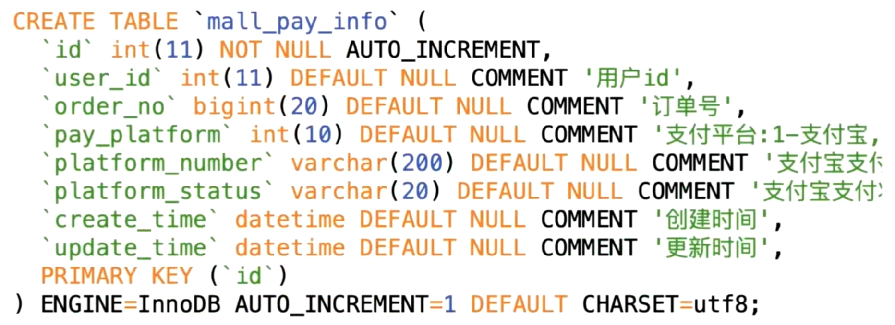

# 1.数据库设计

## 表关系ER图

> 

## 用户表


```sql
CREATE TABLE `mall_user` (
  `id` int(11) NOT NULL AUTO_INCREMENT COMMENT '用户表id',
  `username` varchar(50) NOT NULL COMMENT '用户名',
  `password` varchar(50) NOT NULL COMMENT '用户密码，MD5加密',
  `email` varchar(50) DEFAULT NULL,
  `phone` varchar(20) DEFAULT NULL,
  `question` varchar(100) DEFAULT NULL COMMENT '找回密码问题',
  `answer` varchar(100) DEFAULT NULL COMMENT '找回密码答案',
  `role` int(4) NOT NULL COMMENT '角色0-管理员,1-普通用户',
  `create_time` datetime NOT NULL DEFAULT CURRENT_TIMESTAMP COMMENT '创建时间',
  `update_time` datetime NOT NULL DEFAULT CURRENT_TIMESTAMP ON UPDATE CURRENT_TIMESTAMP COMMENT '最后一次更新时间',
  PRIMARY KEY (`id`),
  UNIQUE KEY `user_name_unique` (`username`) USING BTREE
) ENGINE=InnoDB AUTO_INCREMENT=11 DEFAULT CHARSET=utf8;
```

1. ==用户可能忘记密码==，因此设置找回密码的问题和答案 
2. 用户有==管理员和普通用户两种身份==
3. ==主键为id==
4. ==设置唯一索引为username==，整张表中username不能重复，不能写入相同的用户名

## 分类表


```sql
CREATE TABLE `mall_category` (
  `id` int(11) NOT NULL AUTO_INCREMENT COMMENT '类别Id',
  `parent_id` int(11) DEFAULT NULL COMMENT '父类别id当id=0时说明是根节点,一级类别',
  `name` varchar(50) DEFAULT NULL COMMENT '类别名称',
  `status` tinyint(1) DEFAULT '1' COMMENT '类别状态1-正常,2-已废弃',
  `sort_order` int(4) NOT NULL DEFAULT '1' COMMENT '排序编号,同类展示顺序,数值相等则自然排序',
  `create_time` datetime DEFAULT NULL COMMENT '创建时间',
  `update_time` datetime DEFAULT NULL COMMENT '更新时间',
  PRIMARY KEY (`id`)
) ENGINE=InnoDB AUTO_INCREMENT=100041 DEFAULT CHARSET=utf8;
```

1. 注意==设置了父类id，分类结构为凹型树状图==
2. ==主键为id==

## 产品表


```sql
CREATE TABLE `mall_product` (
  `id` int(11) NOT NULL AUTO_INCREMENT COMMENT '商品id',
  `category_id` int(11) NOT NULL COMMENT '分类id,对应mall_category表的主键',
  `name` varchar(100) NOT NULL COMMENT '商品名称',
  `subtitle` varchar(200) DEFAULT NULL COMMENT '商品副标题',
  `main_image` varchar(500) DEFAULT NULL COMMENT '产品主图,url相对地址',
  `sub_images` text COMMENT '图片地址,json格式,扩展用',
  `detail` text COMMENT '商品详情',
  `price` decimal(20,2) NOT NULL COMMENT '价格,单位-元保留两位小数',
  `stock` int(11) NOT NULL COMMENT '库存数量',
  `status` int(6) DEFAULT '1' COMMENT '商品状态.1-在售 2-下架 3-删除',
  `create_time` datetime DEFAULT NULL COMMENT '创建时间',
  `update_time` datetime DEFAULT NULL COMMENT '更新时间',
  PRIMARY KEY (`id`)
) ENGINE=InnoDB AUTO_INCREMENT=30 DEFAULT CHARSET=utf8;
```

1. ==注意price使用decimal类型==，类似于double
2. ==主键为id==

## 支付信息表



```sql
CREATE TABLE `mall_pay_info` (
  `id` int(11) NOT NULL AUTO_INCREMENT,
  `user_id` int(11) DEFAULT NULL COMMENT '用户id',
  `order_no` bigint(20) NOT NULL COMMENT '订单号',
  `pay_platform` int(10) DEFAULT NULL COMMENT '支付平台:1-支付宝,2-微信',
  `platform_number` varchar(200) DEFAULT NULL COMMENT '支付流水号',
  `platform_status` varchar(20) DEFAULT NULL COMMENT '支付状态',
  `pay_amount` decimal(20,2) NOT NULL COMMENT '支付金额',
  `create_time` datetime DEFAULT CURRENT_TIMESTAMP COMMENT '创建时间',
  `update_time` datetime DEFAULT CURRENT_TIMESTAMP ON UPDATE CURRENT_TIMESTAMP COMMENT '更新时间',
  PRIMARY KEY (`id`),
  UNIQUE KEY `uqe_order_no` (`order_no`),
  UNIQUE KEY `uqe_platform_number` (`platform_number`)
) ENGINE=InnoDB AUTO_INCREMENT=30 DEFAULT CHARSET=utf8;
```

1. ==支付平台可以选择微信或支付宝==
2. ==我们自己有一个订单号，支付平台会返回给我们一个订单号==
3. ==主键为id==

## 订单表


```sql
CREATE TABLE `mall_order` (
  `id` int(11) NOT NULL AUTO_INCREMENT COMMENT '订单id',
  `order_no` bigint(20) DEFAULT NULL COMMENT '订单号',
  `user_id` int(11) DEFAULT NULL COMMENT '用户id',
  `shipping_id` int(11) DEFAULT NULL,
  `payment` decimal(20,2) DEFAULT NULL COMMENT '实际付款金额,单位是元,保留两位小数',
  `payment_type` int(4) DEFAULT NULL COMMENT '支付类型,1-在线支付',
  `postage` int(10) DEFAULT NULL COMMENT '运费,单位是元',
  `status` int(10) DEFAULT NULL COMMENT '订单状态:0-已取消-10-未付款，20-已付款，40-已发货，50-交易成功，60-交易关闭',
  `payment_time` datetime DEFAULT NULL COMMENT '支付时间',
  `send_time` datetime DEFAULT NULL COMMENT '发货时间',
  `end_time` datetime DEFAULT NULL COMMENT '交易完成时间',
  `close_time` datetime DEFAULT NULL COMMENT '交易关闭时间',
  `create_time` datetime DEFAULT NULL COMMENT '创建时间',
  `update_time` datetime DEFAULT NULL COMMENT '更新时间',
  PRIMARY KEY (`id`),
  UNIQUE KEY `order_no_index` (`order_no`) USING BTREE
) ENGINE=InnoDB DEFAULT CHARSET=utf8;
```

1. ==设置了很多时间的原因：==

	> 1. 前端页面需要展示
	> 2. 方便排查问题，如接到用户投诉说很久没收货，可以来查看哪一步出了问题
	> 3. 便于数据分析，查看平均时间

2. 订单的状态决定的：用户会下单，有创建时间；会支付，有支付时间；可能不支付，有交易关闭时间

3. ==主键为id==

4. ==订单号设置为唯一索引==，订单号必须唯一

## ==订单明细表==


```sql
CREATE TABLE `mall_order_item` (
  `id` int(11) NOT NULL AUTO_INCREMENT COMMENT '订单子表id',
  `user_id` int(11) DEFAULT NULL,
  `order_no` bigint(20) DEFAULT NULL,
  `product_id` int(11) DEFAULT NULL COMMENT '商品id',
  `product_name` varchar(100) DEFAULT NULL COMMENT '商品名称',
  `product_image` varchar(500) DEFAULT NULL COMMENT '商品图片地址',
  `current_unit_price` decimal(20,2) DEFAULT NULL COMMENT '生成订单时的商品单价，单位是元,保留两位小数',
  `quantity` int(10) DEFAULT NULL COMMENT '商品数量',
  `total_price` decimal(20,2) DEFAULT NULL COMMENT '商品总价,单位是元,保留两位小数',
  `create_time` datetime DEFAULT NULL,
  `update_time` datetime DEFAULT NULL,
  PRIMARY KEY (`id`),
  KEY `order_no_index` (`order_no`) USING BTREE,
  KEY `order_no_user_id_index` (`user_id`,`order_no`) USING BTREE
) ENGINE=InnoDB DEFAULT CHARSET=utf8;
```

1. 关键问题：==明明可以通过商品id查看详情，为什么还要在订单明细表中把商品信息写出来？==

	> ==商品的信息是会变的==，==用户交易时商品的详情==和==之后商品的详情==可能==不一样==，因此有必要记录用户交易时商品的详情

2. ==关联表结构时，一定要考虑数据会不会变化，如果会变化，就一定要给它做一个存档==

3. ==对订单号做了单索引==

	> 通过`where order_no=#{orderNo}`来查该表，加单索引提升效率

4. ==对用户id和订单号做了组合索引==

	> 通过`where user_id=#{userId} and order_no=#{orderNo}`来查该表，加组合索引提升效率

## 收货地址表


```sql
CREATE TABLE `mall_shipping` (
  `id` int(11) NOT NULL AUTO_INCREMENT,
  `user_id` int(11) DEFAULT NULL COMMENT '用户id',
  `receiver_name` varchar(20) DEFAULT NULL COMMENT '收货姓名',
  `receiver_phone` varchar(20) DEFAULT NULL COMMENT '收货固定电话',
  `receiver_mobile` varchar(20) DEFAULT NULL COMMENT '收货移动电话',
  `receiver_province` varchar(20) DEFAULT NULL COMMENT '省份',
  `receiver_city` varchar(20) DEFAULT NULL COMMENT '城市',
  `receiver_district` varchar(20) DEFAULT NULL COMMENT '区/县',
  `receiver_address` varchar(200) DEFAULT NULL COMMENT '详细地址',
  `receiver_zip` varchar(6) DEFAULT NULL COMMENT '邮编',
  `create_time` datetime DEFAULT NULL,
  `update_time` datetime DEFAULT NULL,
  PRIMARY KEY (`id`)
) ENGINE=InnoDB AUTO_INCREMENT=5 DEFAULT CHARSET=utf8;
```

## 索引

1. ==索引的作用：加快数据查询速度==

2. ==如何确定哪些字段需要加索引？==

	> 索引的作用时加快数据查询速度，==因此该表一般通过什么字段来查，即where后一般是什么字段==，那么就要在对应字段上加上索引
	>
	> 如订单明细表中，我们==可能通过订单号去查找对应订单的订单详情==，也==可能通过用户id和订单号一起去查找==，因此==给它们加上单索引和组合索引==

3. ==唯一索引：保证数据的唯一性==，重复就报错，比如用户表的username，订单表的order_id

## 时间戳

==create_time，update_time==，这两个字段是==为今后排查业务问题==时准备的，==每张表都有这两个字段==

---


# 2.创建数据库

## 数据库配置

名称设置为：`mall`

==字符集选择==：`utf8mb4`

==排序规则选择==：`utf8mb4_general_ci`

## 执行sql语句

==建表sql语句==：`mall.sql`

```sql
#分类表
DROP TABLE IF EXISTS `mall_category`;
CREATE TABLE `mall_category` (
  `id` int(11) NOT NULL AUTO_INCREMENT COMMENT '类别Id',
  `parent_id` int(11) DEFAULT NULL COMMENT '父类别id当id=0时说明是根节点,一级类别',
  `name` varchar(50) DEFAULT NULL COMMENT '类别名称',
  `status` tinyint(1) DEFAULT '1' COMMENT '类别状态1-正常,2-已废弃',
  `sort_order` int(4) DEFAULT NULL COMMENT '排序编号,同类展示顺序,数值相等则自然排序',
  `create_time` datetime DEFAULT CURRENT_TIMESTAMP COMMENT '创建时间',
  `update_time` datetime DEFAULT CURRENT_TIMESTAMP ON UPDATE CURRENT_TIMESTAMP COMMENT '更新时间',
  PRIMARY KEY (`id`)
) ENGINE=InnoDB DEFAULT CHARSET=utf8;

INSERT INTO `mall_category` (`id`, `parent_id`, `name`, `status`, `sort_order`, `create_time`, `update_time`)
VALUES
	(100001,0,'家用电器',1,NULL,'2000-03-25 16:46:00','2000-03-25 16:46:00'),
	(100002,0,'数码3C',1,NULL,'2000-03-25 16:46:21','2000-03-25 16:46:21'),
	(100003,0,'服装箱包',1,NULL,'2000-03-25 16:49:53','2000-03-25 16:49:53'),
	(100004,0,'食品生鲜',1,NULL,'2000-03-25 16:50:19','2000-03-25 16:50:19'),
	(100005,0,'酒水饮料',1,NULL,'2000-03-25 16:50:29','2000-03-25 16:50:29'),
	(100006,100001,'冰箱',1,NULL,'2000-03-25 16:52:15','2000-03-25 16:52:15'),
	(100007,100001,'电视',1,NULL,'2000-03-25 16:52:26','2000-03-25 16:52:26'),
	(100008,100001,'洗衣机',1,NULL,'2000-03-25 16:52:39','2000-03-25 16:52:39'),
	(100009,100001,'空调',1,NULL,'2000-03-25 16:52:45','2000-03-25 16:52:45'),
	(100010,100001,'电热水器',1,NULL,'2000-03-25 16:52:54','2000-03-25 16:52:54'),
	(100011,100002,'电脑',1,NULL,'2000-03-25 16:53:18','2000-03-25 16:53:18'),
	(100012,100002,'手机',1,NULL,'2000-03-25 16:53:27','2000-03-25 16:53:27'),
	(100013,100002,'平板电脑',1,NULL,'2000-03-25 16:53:35','2000-03-25 16:53:35'),
	(100014,100002,'数码相机',1,NULL,'2000-03-25 16:53:56','2000-03-25 16:53:56'),
	(100015,100002,'3C配件',1,NULL,'2000-03-25 16:54:07','2000-03-25 16:54:07'),
	(100016,100003,'女装',1,NULL,'2000-03-25 16:54:44','2000-03-25 16:54:44'),
	(100017,100003,'帽子',1,NULL,'2000-03-25 16:54:51','2000-03-25 16:54:51'),
	(100018,100003,'旅行箱',1,NULL,'2000-03-25 16:55:02','2000-03-25 16:55:02'),
	(100019,100003,'手提包',1,NULL,'2000-03-25 16:55:09','2000-03-25 16:55:09'),
	(100020,100003,'保暖内衣',1,NULL,'2000-03-25 16:55:18','2000-03-25 16:55:18'),
	(100021,100004,'零食',1,NULL,'2000-03-25 16:55:30','2000-03-25 16:55:30'),
	(100022,100004,'生鲜',1,NULL,'2000-03-25 16:55:37','2000-03-25 16:55:37'),
	(100023,100004,'半成品菜',1,NULL,'2000-03-25 16:55:47','2000-03-25 16:55:47'),
	(100024,100004,'速冻食品',1,NULL,'2000-03-25 16:55:56','2000-03-25 16:55:56'),
	(100025,100004,'进口食品',1,NULL,'2000-03-25 16:56:06','2000-03-25 16:56:06'),
	(100026,100005,'白酒',1,NULL,'2000-03-25 16:56:22','2000-03-25 16:56:22'),
	(100027,100005,'红酒',1,NULL,'2000-03-25 16:56:30','2000-03-25 16:56:30'),
	(100028,100005,'饮料',1,NULL,'2000-03-25 16:56:37','2000-03-25 16:56:37'),
	(100029,100005,'调制鸡尾酒',1,NULL,'2000-03-25 16:56:45','2000-03-25 16:56:45'),
	(100030,100005,'进口洋酒',1,NULL,'2000-03-25 16:57:05','2000-03-25 16:57:05');

#订单表
DROP TABLE IF EXISTS `mall_order`;
CREATE TABLE `mall_order` (
  `id` int(11) NOT NULL AUTO_INCREMENT COMMENT '订单id',
  `order_no` bigint(20) DEFAULT NULL COMMENT '订单号',
  `user_id` int(11) DEFAULT NULL COMMENT '用户id',
  `shipping_id` int(11) DEFAULT NULL,
  `payment` decimal(20,2) DEFAULT NULL COMMENT '实际付款金额,单位是元,保留两位小数',
  `payment_type` int(4) DEFAULT NULL COMMENT '支付类型,1-在线支付',
  `postage` int(10) DEFAULT NULL COMMENT '运费,单位是元',
  `status` int(10) DEFAULT NULL COMMENT '订单状态:0-已取消-10-未付款，20-已付款，40-已发货，50-交易成功，60-交易关闭',
  `payment_time` datetime DEFAULT NULL COMMENT '支付时间',
  `send_time` datetime DEFAULT NULL COMMENT '发货时间',
  `end_time` datetime DEFAULT NULL COMMENT '交易完成时间',
  `close_time` datetime DEFAULT NULL COMMENT '交易关闭时间',
  `create_time` datetime DEFAULT CURRENT_TIMESTAMP COMMENT '创建时间',
  `update_time` datetime DEFAULT CURRENT_TIMESTAMP ON UPDATE CURRENT_TIMESTAMP COMMENT '更新时间',
  PRIMARY KEY (`id`),
  UNIQUE KEY `order_no_index` (`order_no`) USING BTREE
) ENGINE=InnoDB DEFAULT CHARSET=utf8;

#订单明细表
CREATE TABLE `mall_order_item` (
  `id` int(11) NOT NULL AUTO_INCREMENT COMMENT '订单子表id',
  `user_id` int(11) DEFAULT NULL,
  `order_no` bigint(20) DEFAULT NULL,
  `product_id` int(11) DEFAULT NULL COMMENT '商品id',
  `product_name` varchar(100) DEFAULT NULL COMMENT '商品名称',
  `product_image` varchar(500) DEFAULT NULL COMMENT '商品图片地址',
  `current_unit_price` decimal(20,2) DEFAULT NULL COMMENT '生成订单时的商品单价，单位是元,保留两位小数',
  `quantity` int(10) DEFAULT NULL COMMENT '商品数量',
  `total_price` decimal(20,2) DEFAULT NULL COMMENT '商品总价,单位是元,保留两位小数',
  `create_time` datetime DEFAULT CURRENT_TIMESTAMP COMMENT '创建时间',
  `update_time` datetime DEFAULT CURRENT_TIMESTAMP ON UPDATE CURRENT_TIMESTAMP COMMENT '更新时间',
  PRIMARY KEY (`id`),
  KEY `order_no_index` (`order_no`) USING BTREE,
  KEY `order_no_user_id_index` (`user_id`,`order_no`) USING BTREE
) ENGINE=InnoDB DEFAULT CHARSET=utf8;

#支付信息表
DROP TABLE IF EXISTS `mall_pay_info`;
CREATE TABLE `mall_pay_info` (
  `id` int(11) NOT NULL AUTO_INCREMENT,
  `user_id` int(11) DEFAULT NULL COMMENT '用户id',
  `order_no` bigint(20) DEFAULT NULL COMMENT '订单号',
  `pay_platform` int(10) DEFAULT NULL COMMENT '支付平台:1-支付宝,2-微信',
  `platform_number` varchar(200) DEFAULT NULL COMMENT '支付宝支付流水号',
  `platform_status` varchar(20) DEFAULT NULL COMMENT '支付宝支付状态',
  `create_time` datetime DEFAULT CURRENT_TIMESTAMP COMMENT '创建时间',
  `update_time` datetime DEFAULT CURRENT_TIMESTAMP ON UPDATE CURRENT_TIMESTAMP COMMENT '更新时间',
  PRIMARY KEY (`id`)
) ENGINE=InnoDB DEFAULT CHARSET=utf8;

#产品表
DROP TABLE IF EXISTS `mall_product`;
CREATE TABLE `mall_product` (
  `id` int(11) NOT NULL AUTO_INCREMENT COMMENT '商品id',
  `category_id` int(11) NOT NULL COMMENT '分类id,对应mall_category表的主键',
  `name` varchar(100) NOT NULL COMMENT '商品名称',
  `subtitle` varchar(200) DEFAULT NULL COMMENT '商品副标题',
  `main_image` varchar(500) DEFAULT NULL COMMENT '产品主图,url相对地址',
  `sub_images` text COMMENT '图片地址,json格式,扩展用',
  `detail` text COMMENT '商品详情',
  `price` decimal(20,2) NOT NULL COMMENT '价格,单位-元保留两位小数',
  `stock` int(11) NOT NULL COMMENT '库存数量',
  `status` int(6) DEFAULT '1' COMMENT '商品状态.1-在售 2-下架 3-删除',
  `create_time` datetime DEFAULT CURRENT_TIMESTAMP COMMENT '创建时间',
  `update_time` datetime DEFAULT CURRENT_TIMESTAMP ON UPDATE CURRENT_TIMESTAMP COMMENT '更新时间',
  PRIMARY KEY (`id`)
) ENGINE=InnoDB DEFAULT CHARSET=utf8;

INSERT INTO `mall_product` (`id`, `category_id`, `name`, `subtitle`, `main_image`, `sub_images`, `detail`, `price`, `stock`, `status`, `create_time`, `update_time`)
VALUES
	(26,100002,'Apple iPhone 7 Plus (A1661) 128G 玫瑰金色 移动联通电信4G手机','iPhone 7，现更以红色呈现。','http://img.springboot.cn/241997c4-9e62-4824-b7f0-7425c3c28917.jpeg','241997c4-9e62-4824-b7f0-7425c3c28917.jpeg,b6c56eb0-1748-49a9-98dc-bcc4b9788a54.jpeg,92f17532-1527-4563-aa1d-ed01baa0f7b2.jpeg,3adbe4f7-e374-4533-aa79-cc4a98c529bf.jpeg','<p><br></p><p><br></p><p><br></p><p><br></p><p><br></p><p><br></p><p><br></p><p><br></p><p><br></p><p><br></p><p><br></p>',6999.00,96,1,NULL,'2000-04-13 21:45:41'),
	(27,100006,'Midea/美的 BCD-535WKZM(E)冰箱双开门对开门风冷无霜智能电家用','送品牌烤箱，五一大促','http://img.springboot.cn/ac3e571d-13ce-4fad-89e8-c92c2eccf536.jpeg','ac3e571d-13ce-4fad-89e8-c92c2eccf536.jpeg,4bb02f1c-62d5-48cc-b358-97b05af5740d.jpeg,36bdb49c-72ae-4185-9297-78829b54b566.jpeg','<p><br></p><p><br></p>',3299.00,99,1,'2000-04-13 18:51:54','2000-04-13 21:45:41'),
	(28,100012,'4+64G送手环/Huawei/华为 nova 手机P9/P10plus青春','NOVA青春版1999元','http://img.springboot.cn/0093f5d3-bdb4-4fb0-bec5-5465dfd26363.jpeg','0093f5d3-bdb4-4fb0-bec5-5465dfd26363.jpeg,13da2172-4445-4eb5-a13f-c5d4ede8458c.jpeg,58d5d4b7-58d4-4948-81b6-2bae4f79bf02.jpeg','<p><br></p>',1999.00,100,1,'2000-04-13 18:57:18','2000-04-13 21:45:41'),
	(29,100008,'Haier/海尔HJ100-1HU1 10公斤滚筒洗衣机全自动带烘干家用大容量 洗烘一体','门店机型 德邦送货','http://img.springboot.cn/173335a4-5dce-4afd-9f18-a10623724c4e.jpeg','173335a4-5dce-4afd-9f18-a10623724c4e.jpeg,42b1b8bc-27c7-4ee1-80ab-753d216a1d49.jpeg,2f1b3de1-1eb1-4c18-8ca2-518934931bec.jpeg','<p><br></p>',4299.00,100,1,'2000-04-13 19:07:47','2000-04-13 21:45:41');

#收货地址表
DROP TABLE IF EXISTS `mall_shipping`;
CREATE TABLE `mall_shipping` (
  `id` int(11) NOT NULL AUTO_INCREMENT,
  `user_id` int(11) DEFAULT NULL COMMENT '用户id',
  `receiver_name` varchar(20) DEFAULT NULL COMMENT '收货姓名',
  `receiver_phone` varchar(20) DEFAULT NULL COMMENT '收货固定电话',
  `receiver_mobile` varchar(20) DEFAULT NULL COMMENT '收货移动电话',
  `receiver_province` varchar(20) DEFAULT NULL COMMENT '省份',
  `receiver_city` varchar(20) DEFAULT NULL COMMENT '城市',
  `receiver_district` varchar(20) DEFAULT NULL COMMENT '区/县',
  `receiver_address` varchar(200) DEFAULT NULL COMMENT '详细地址',
  `receiver_zip` varchar(6) DEFAULT NULL COMMENT '邮编',
  `create_time` datetime DEFAULT CURRENT_TIMESTAMP COMMENT '创建时间',
  `update_time` datetime DEFAULT CURRENT_TIMESTAMP ON UPDATE CURRENT_TIMESTAMP COMMENT '更新时间',
  PRIMARY KEY (`id`)
) ENGINE=InnoDB DEFAULT CHARSET=utf8;

INSERT INTO `mall_shipping` (`id`, `user_id`, `receiver_name`, `receiver_phone`, `receiver_mobile`, `receiver_province`, `receiver_city`, `receiver_district`, `receiver_address`, `receiver_zip`, `create_time`, `update_time`)
VALUES
	(4,1,'廖师兄','010','18688888888','北京','北京市','海淀区','中关村慕课网大楼','100000','2000-01-22 14:26:25','2000-01-22 14:26:25');

#用户表
DROP TABLE IF EXISTS `mall_user`;
CREATE TABLE `mall_user` (
  `id` int(11) NOT NULL AUTO_INCREMENT COMMENT '用户表id',
  `username` varchar(50) NOT NULL COMMENT '用户名',
  `password` varchar(50) NOT NULL COMMENT '用户密码，MD5加密',
  `email` varchar(50) DEFAULT NULL,
  `phone` varchar(20) DEFAULT NULL,
  `question` varchar(100) DEFAULT NULL COMMENT '找回密码问题',
  `answer` varchar(100) DEFAULT NULL COMMENT '找回密码答案',
  `role` int(4) NOT NULL COMMENT '角色0-管理员,1-普通用户',
  `create_time` datetime DEFAULT CURRENT_TIMESTAMP COMMENT '创建时间',
  `update_time` datetime DEFAULT CURRENT_TIMESTAMP ON UPDATE CURRENT_TIMESTAMP COMMENT '更新时间',
  PRIMARY KEY (`id`),
  UNIQUE KEY `user_name_unique` (`username`) USING BTREE
) ENGINE=InnoDB DEFAULT CHARSET=utf8;

INSERT INTO `mall_user` (`id`, `username`, `password`, `email`, `phone`, `question`, `answer`, `role`, `create_time`, `update_time`)
VALUES
	(1,'admin','21232F297A57A5A743894A0E4A801FC3','admin@qq.com',NULL,NULL,NULL,0,'2000-08-06 15:12:00','2000-08-06 15:12:00');

-- 新增“支付金额”字段 xxxx年xx月xx日
alter table mall_pay_info add pay_amount decimal(20,2) NOT NULL COMMENT '支付金额' after platform_status;

-- 视频7-13修改mall_pay_info，修改后如下
DROP TABLE IF EXISTS `mall_pay_info`;
CREATE TABLE `mall_pay_info` (
  `id` int(11) NOT NULL AUTO_INCREMENT,
  `user_id` int(11) DEFAULT NULL COMMENT '用户id',
  `order_no` bigint(20) NOT NULL COMMENT '订单号',
  `pay_platform` int(10) DEFAULT NULL COMMENT '支付平台:1-支付宝,2-微信',
  `platform_number` varchar(200) DEFAULT NULL COMMENT '支付流水号',
  `platform_status` varchar(20) DEFAULT NULL COMMENT '支付状态',
  `pay_amount` decimal(20,2) NOT NULL COMMENT '支付金额',
  `create_time` datetime DEFAULT CURRENT_TIMESTAMP COMMENT '创建时间',
  `update_time` datetime DEFAULT CURRENT_TIMESTAMP ON UPDATE CURRENT_TIMESTAMP COMMENT '更新时间',
  PRIMARY KEY (`id`),
  UNIQUE KEY `uqe_order_no` (`order_no`),
  UNIQUE KEY `uqe_platform_number` (`platform_number`)
) ENGINE=InnoDB AUTO_INCREMENT=1 DEFAULT CHARSET=utf8;

-- 视频8-3修改mall_user表字段结构
alter table mall_user modify create_time datetime NOT NULL DEFAULT CURRENT_TIMESTAMP COMMENT '创建时间';
alter table mall_user modify update_time datetime NOT NULL DEFAULT CURRENT_TIMESTAMP ON UPDATE CURRENT_TIMESTAMP COMMENT '最后一次更新时间';

```

---


# 3.项目初始化


## pom.xml配置

==先用2.6.13创建一个项目，然后修改pom.xml文件与视频中一致==

可以看到spring-boot-starter-web等依赖不需要写版本了，这是==SpringBoot带来的一大好处，自动维护版本==

```xml
<?xml version="1.0" encoding="UTF-8"?>
<project xmlns="http://maven.apache.org/POM/4.0.0" xmlns:xsi="http://www.w3.org/2001/XMLSchema-instance"
         xsi:schemaLocation="http://maven.apache.org/POM/4.0.0 https://maven.apache.org/xsd/maven-4.0.0.xsd">
    <modelVersion>4.0.0</modelVersion>

    <parent>
        <groupId>org.springframework.boot</groupId>
        <artifactId>spring-boot-starter-parent</artifactId>
        <version>2.1.7.RELEASE</version>
        <relativePath/>
    </parent>

    <groupId>garry</groupId>
    <artifactId>mall</artifactId>
    <version>0.0.1-SNAPSHOT</version>
    <name>mall</name>
    <description>Demo project for mall</description>

    <properties>
        <java.version>1.8</java.version>
        <project.build.sourceEncoding>UTF-8</project.build.sourceEncoding>
        <project.reporting.outputEncoding>UTF-8</project.reporting.outputEncoding>
    </properties>

    <dependencies>
        <dependency>
            <groupId>org.springframework.boot</groupId>
            <artifactId>spring-boot-starter-web</artifactId>
        </dependency>
        <dependency>
            <groupId>org.springframework.boot</groupId>
            <artifactId>spring-boot-starter-test</artifactId>
            <scope>test</scope>
        </dependency>
    </dependencies>

    <build>
        <plugins>
            <plugin>
                <groupId>org.springframework.boot</groupId>
                <artifactId>spring-boot-maven-plugin</artifactId>
            </plugin>
        </plugins>
    </build>

</project>
```

==.gitignore，将你不想要提交的文件写在里面==

## 测试类配置

==注意：`MallApplicatoinTests`必须和`MallApplication`处在同一个包下==

==如`MallApplication`的包名`package garry.mall;`，那么`MallApplicationTests`的包名也必须是`package garry.mall;`==

> 

---


# 4.Mybatis三剑客

## Mybatis配置

==Mybatis vs Jpa==：Jpa开发轻量级的项目很快，但国内的主流是Mybatis


==本项目的Mybatis-spring-boot-starter采用2.1版本==

```xml
<dependency>
    <groupId>org.mybatis.spring.boot</groupId>
    <artifactId>mybatis-spring-boot-starter</artifactId>
    <version>2.1.0</version>
</dependency>
<dependency>
    <groupId>mysql</groupId>
    <artifactId>mysql-connector-java</artifactId>
</dependency>
```

==配置文件后缀由.properties改.yml==

```yml
# 应用服务 WEB 访问端口
server:
  port: 8080

# Mybatis 数据库连接配置
spring:
  datasource:
    driver-class-name: com.mysql.cj.jdbc.Driver
    username: root
    password: 1234
    url: jdbc:mysql://localhost:3306/mall?characterEncoding=UTF-8&useSSL=false&serverTimezone=UTC
```

## 问题和杂技

1. ==po和pojo的区别==：

	> po(persistenet object)：表中映射过来的对象
	>
	> pojo(plain ordinart Java object)：只有属性和get，set方法的对象

2. ==报错信息==`The server time zone value '�й���׼ʱ��' is unrecognized or represents more than one time zone. You must configure either the server or JDBC driver (via the serverTimezone configuration property) to use a more specifc time zone value if you want to utilize time zone support.`

	> 问题原因：新版驱动名字为 driverClass=“com.mysql.cj.jdbc.Driver”
	>
	> 解决方法：在配置文件的url后加上`serverTimezone=UTC`

3. ==parentId查出来是null，时间查出来也是null==

	> 问题原因：数据库中命名为pareant_id，属性是parentId，==名字不同==
	>
	> 解决方法：在application.yml中新增配置：
	>
	> ```yml
	> mybatis:
	>   configuration:
	>     map-underscore-to-camel-case: true
	> ```
	>
	> 即==允许将下划线命名法自动改为驼峰命名法==

4. ==不需要在`CategoryMapper`上加`@Mapper`注解的方法==：

	> ==在`MallApplication`类上加上`@MapperScan(basePackage="garry.mall.dao")`==
	>
	> 类似于之前在mybatis-config中加上<mapper><package name="xxx.xxx"/></mapper>
	>
	> ```java
	> @SpringBootApplication
	> @MapperScan(basePackages = "garry.mall.dao")
	> public class MallApplication {
	>     public static void main(String[] args) {
	>         SpringApplication.run(MallApplication.class, args);
	>     }
	> }
	> ```

5. ==自动导包和删包：settings-Editor–General-Auto import，勾选Add和Optimize开头的选项==

6. ==Lombok插件，实现自动增加和修改set,get方法==

	> ```xml
	> <!--lombok插件-->
	> <dependency>
	>     <groupId>org.projectlombok</groupId>
	>     <artifactId>lombok</artifactId>
	> </dependency>
	> ```
	>
	> plugins中下载lombok插件，重启IDEA
	>
	> 然后==在pojo的对象中加上@Data注解==，可以自动加上set,get,toString方法

7. ==修改日志的格式==

	> ```yml
	> # 修改日志的格式
	> logging:
	>   pattern:
	>     console: "[%thread] %-5level %logger{36} - %msg%n"
	> ```

8. 关于==找不到mapper对应的xml文件的报错==

	> 产生原因：==.java和.xml在编译后不在一个包下==
	>
	> 解决方法：
	>
	> 1. 在resource目录下创建garry/mall/dao目录，把xml文件放里面
	>
	> 2. 在application.yml中配置：
	>
	> 	```yml
	> 	mybatis:
	> 	  configuration:
	> 	    map-underscore-to-camel-case: true
	> 	  # 解决*Mapper.xml文件找不到的问题，classpath本质是编译后的target/classes目录
	> 	  mapper-locations: classpath:mapper/*.xml
	> 	```

9. xml中==用sql标签保存categoey属性==时，==id下面报错`<statement> or DELIMITER expected, got 'id'`==

	> 解决方法：settings-Editors-Languages Injections
	>
	> 

10. 更规范的测试类，==为每一个mapper类定制一个测试类==

	> 方法如下：
	>
	> 
	>
	> 
	>
	> ==新的测试方法还是要加RunWith和SpringBootTest注解==，不然编译器不知道你这是一个SpringBoot测试类，根本拿不到ioc容器
	>
	> 但是所有的测试类都要额外加注解太麻烦了，可以只给MallApplicationTest加注解，然后其它单源测试类继承MallApplicationTest，也可以实现注解的功能
	>
	> ```java
	> //@RunWith(SpringRunner.class)
	> //@SpringBootTest//通过继承MallApplicationTest，不用再额外加注解了
	> public class CategoryMapperTest extends MallApplicationTest {
	>     @Resource
	>     private CategoryMapper categoryMapper;
	> 
	>     @Test
	>     public void findById() {
	>         Category category = categoryMapper.findById(100001);
	>         System.out.println(category);
	>     }
	> 
	>     @Test
	>     public void queryById() {
	>         Category category = categoryMapper.queryById(100001);
	>         System.out.println(category);
	>     }
	> }
	> ```

## 三剑客简介

1. Mybatis-generator：生成.xml
2. Mybatis-plugins：.java和.xml快速跳转
3. Mybatis-PageHelper：自动实现翻页功能

## Mybatis-generator

假如你要开发一个生成器，它需要实现什么功能呢？

> 1. 连接数据库
> 2. 获取表结构，Create Table{…}
> 3. 生成pojo，mapper，xml三个文件

Mybatis-generator==本质是一个jar包==

==pom.xml配置==

```xml
<!--mybatis-generator，并开启如果重名就覆盖-->
<plugin>
    <groupId>org.mybatis.generator</groupId>
    <artifactId>mybatis-generator-maven-plugin</artifactId>
    <version>1.3.7</version>
    <configuration>
        <overwrite>true</overwrite>
    </configuration>
</plugin>
```

==resource目录下创建generatorConfig.xml==

配置的详解：https://www.imooc.com/article/21444

```xml
<?xml version="1.0" encoding="UTF-8"?>
<!DOCTYPE generatorConfiguration
        PUBLIC "-//mybatis.org//DTD MyBatis Generator Configuration 1.0//EN"
        "http://mybatis.org/dtd/mybatis-generator-config_1_0.dtd">

<generatorConfiguration>
    <!--下载的mysql-connector-java-5.1.6.jar的绝对路径-->
    <classPathEntry location="D:\apache-maven-3.6.1\mvn_resp\org\mybatis\generator\mysql-connector-java-5.1.6.jar"/>

    <context id="DB2Tables" targetRuntime="MyBatis3">

        <!--不再追加xml的插件，注意位置必须在commentGenerator之前-->
        <plugin type="org.mybatis.generator.plugins.UnmergeableXmlMappersPlugin"/>

        <!--消除所有注释，位置有要求，需要放在数据库连接前面-->
        <commentGenerator>
            <property name="suppressAllComments" value="true"/>
        </commentGenerator>

        <!--数据库连接-->
        <jdbcConnection driverClass="com.mysql.jdbc.Driver"
                        connectionURL="jdbc:mysql://localhost:3306/mall?characterEncoding=UTF-8&amp;useSSL=false&amp;serverTimezone=UTC"
                        userId="root"
                        password="1234">
        </jdbcConnection>

        <!--关闭将所有数值强转为BigDecimals，即程序根据数据大小调整转换的格式-->
        <javaTypeResolver>
            <property name="forceBigDecimals" value="false"/>
        </javaTypeResolver>

        <!--表属性映射的Java对象，包名garry.mall.pojo，目录名为src/main/java-->
        <javaModelGenerator targetPackage="garry.mall.pojo" targetProject="src/main/java">
            <property name="enableSubPackages" value="true"/>
            <property name="trimStrings" value="true"/>
        </javaModelGenerator>

        <!--xml文件，包名garry.mall.dao，目录名src/main/resources-->
        <sqlMapGenerator targetPackage="garry.mall.dao" targetProject="src/main/resources">
            <property name="enableSubPackages" value="true"/>
        </sqlMapGenerator>

        <!--Mapper类，包名garry.mall.pojo，目录名为src/main/java-->
        <javaClientGenerator type="XMLMAPPER" targetPackage="garry.mall.dao" targetProject="src/main/java">
            <property name="enableSubPackages" value="true"/>
        </javaClientGenerator>

        <!--table表映射，名字不要前面的mall，把与example有关的全部去掉-->
        <table tableName="mall_category" domainObjectName="Category" enableCountByExample="false"
               enableDeleteByExample="false" enableSelectByExample="false" enableUpdateByExample="false"/>

        <table tableName="mall_order" domainObjectName="Order" enableCountByExample="false"
               enableDeleteByExample="false" enableSelectByExample="false" enableUpdateByExample="false"/>

        <table tableName="mall_order_item" domainObjectName="OrderItem" enableCountByExample="false"
               enableDeleteByExample="false" enableSelectByExample="false" enableUpdateByExample="false"/>
        
        <table tableName="mall_pay_info" domainObjectName="PayInfo" enableCountByExample="false"
               enableDeleteByExample="false" enableSelectByExample="false" enableUpdateByExample="false"/>

        <table tableName="mall_product" domainObjectName="Product" enableCountByExample="false"
               enableDeleteByExample="false" enableSelectByExample="false" enableUpdateByExample="false"/>

        <table tableName="mall_shipping" domainObjectName="Shipping" enableCountByExample="false"
               enableDeleteByExample="false" enableSelectByExample="false" enableUpdateByExample="false"/>

        <table tableName="mall_user" domainObjectName="User" enableCountByExample="false"
               enableDeleteByExample="false" enableSelectByExample="false" enableUpdateByExample="false"/>

    </context>
</generatorConfiguration>
```

### 遇到的问题

1. ==消除所有的注释==

	```xml
	<!--消除所有注释，位置有要求，需要放在前面-->
	<commentGenerator>
	    <property name="suppressAllComments" value="true"/>
	</commentGenerator>
	```

2. ==消除所有含example的方法==

	```xml
	<!--映射mall_order，名字只要Order，不要前面的mall，把与example有关的全部去掉-->
	<table tableName="mall_order" domainObjectName="Order" enableCountByExample="false"
	       enableDeleteByExample="false" enableSelectByExample="false" enableUpdateByExample="false"/>
	```

3. 解决==再次创建时会把内容直接加到.xml文件后面==，造成方法重名报错的问题

	> 追加一个插件：org.mybatis.generator.plugins.UnmergeableXmlMappersPlugin
	>
	> ```xml
	> <!--不再追加xml的插件，注意位置必须在commentGenerator之前-->
	> <plugin type="org.mybatis.generator.plugins.UnmergeableXmlMappersPlugin"/>
	> ```

## Mybatis-plugin

收费了不说，不如MybatisX的小红鸟和小蓝鸟

> 

## Mybatis-PageHelper

完全开源

https://github.com/pagehelper/Mybatis-PageHelper

## 截至Mybatis的所有配置

### pom.xml

```xml
<?xml version="1.0" encoding="UTF-8"?>
<project xmlns="http://maven.apache.org/POM/4.0.0" xmlns:xsi="http://www.w3.org/2001/XMLSchema-instance"
         xsi:schemaLocation="http://maven.apache.org/POM/4.0.0 https://maven.apache.org/xsd/maven-4.0.0.xsd">
    <modelVersion>4.0.0</modelVersion>

    <parent>
        <groupId>org.springframework.boot</groupId>
        <artifactId>spring-boot-starter-parent</artifactId>
        <version>2.1.7.RELEASE</version>
        <relativePath/>
    </parent>

    <groupId>garry</groupId>
    <artifactId>mall</artifactId>
    <version>0.0.1-SNAPSHOT</version>
    <name>mall</name>
    <description>Demo project for mall</description>

    <properties>
        <java.version>1.8</java.version>
        <project.build.sourceEncoding>UTF-8</project.build.sourceEncoding>
        <project.reporting.outputEncoding>UTF-8</project.reporting.outputEncoding>
    </properties>

    <dependencies>
        <!--启动的支持，版本随SpringBoot-->
        <dependency>
            <groupId>org.springframework.boot</groupId>
            <artifactId>spring-boot-starter-web</artifactId>
        </dependency>
        <!--测试的支持，版本随SpringBoot-->
        <dependency>
            <groupId>org.springframework.boot</groupId>
            <artifactId>spring-boot-starter-test</artifactId>
            <scope>test</scope>
        </dependency>
        <!--注意版本必须2.1.0，高版本不支持SpringBoot2.1.7-->
        <dependency>
            <groupId>org.mybatis.spring.boot</groupId>
            <artifactId>mybatis-spring-boot-starter</artifactId>
            <version>2.1.0</version>
        </dependency>
        <!--mysql驱动-->
        <dependency>
            <groupId>mysql</groupId>
            <artifactId>mysql-connector-java</artifactId>
        </dependency>
        <!--lombok插件-->
        <dependency>
            <groupId>org.projectlombok</groupId>
            <artifactId>lombok</artifactId>
        </dependency>
    </dependencies>

    <build>
        <plugins>
            <!--SpringBoot的Maven插件-->
            <plugin>
                <groupId>org.springframework.boot</groupId>
                <artifactId>spring-boot-maven-plugin</artifactId>
            </plugin>
            <!--mybatis-generator，并开启如果重名就覆盖-->
            <plugin>
                <groupId>org.mybatis.generator</groupId>
                <artifactId>mybatis-generator-maven-plugin</artifactId>
                <version>1.3.7</version>
                <configuration>
                    <overwrite>true</overwrite>
                </configuration>
            </plugin>
        </plugins>
    </build>

</project>
```

### application.yml

```yml
# 应用服务 WEB 访问端口
server:
  port: 8080

# Mybatis 数据库连接配置
spring:
  datasource:
    driver-class-name: com.mysql.cj.jdbc.Driver
    username: root
    password: 1234
    url: jdbc:mysql://localhost:3306/mall?characterEncoding=UTF-8&useSSL=false&serverTimezone=UTC

# 自动将下划线命名法转换为驼峰命名法
mybatis:
  configuration:
    map-underscore-to-camel-case: true
  # 解决*Mapper.xml文件找不到的问题，classpath本质是编译后的target/classes目录
#  mapper-locations: classpath:mapper/*.xml

# 修改日志的格式
logging:
  pattern:
    console: "[%thread] %-5level %logger{36} - %msg%n"
```

### generatorConfig.xml

```xml
<?xml version="1.0" encoding="UTF-8"?>
<!DOCTYPE generatorConfiguration
        PUBLIC "-//mybatis.org//DTD MyBatis Generator Configuration 1.0//EN"
        "http://mybatis.org/dtd/mybatis-generator-config_1_0.dtd">

<generatorConfiguration>
    <!--下载的mysql-connector-java-5.1.6.jar的绝对路径-->
    <classPathEntry location="D:\apache-maven-3.6.1\mvn_resp\org\mybatis\generator\mysql-connector-java-5.1.6.jar"/>

    <context id="DB2Tables" targetRuntime="MyBatis3">

        <!--不再追加xml的插件，注意位置必须在commentGenerator之前-->
        <plugin type="org.mybatis.generator.plugins.UnmergeableXmlMappersPlugin"/>

        <!--消除所有注释，位置有要求，需要放在数据库连接前面-->
        <commentGenerator>
            <property name="suppressAllComments" value="true"/>
        </commentGenerator>

        <!--数据库连接-->
        <jdbcConnection driverClass="com.mysql.jdbc.Driver"
                        connectionURL="jdbc:mysql://localhost:3306/mall?characterEncoding=UTF-8&amp;useSSL=false&amp;serverTimezone=UTC"
                        userId="root"
                        password="1234">
        </jdbcConnection>

        <!--关闭将所有数值强转为BigDecimals，即程序根据数据大小调整转换的格式-->
        <javaTypeResolver>
            <property name="forceBigDecimals" value="false"/>
        </javaTypeResolver>

        <!--表属性映射的Java对象，包名garry.mall.pojo，目录名为src/main/java-->
        <javaModelGenerator targetPackage="garry.mall.pojo" targetProject="src/main/java">
            <property name="enableSubPackages" value="true"/>
            <property name="trimStrings" value="true"/>
        </javaModelGenerator>

        <!--xml文件，包名garry.mall.dao，目录名src/main/resources-->
        <sqlMapGenerator targetPackage="garry.mall.dao" targetProject="src/main/resources">
            <property name="enableSubPackages" value="true"/>
        </sqlMapGenerator>

        <!--Mapper类，包名garry.mall.pojo，目录名为src/main/java-->
        <javaClientGenerator type="XMLMAPPER" targetPackage="garry.mall.dao" targetProject="src/main/java">
            <property name="enableSubPackages" value="true"/>
        </javaClientGenerator>

        <!--table表映射，名字不要前面的mall，把与example有关的全部去掉-->
        <table tableName="mall_category" domainObjectName="Category" enableCountByExample="false"
               enableDeleteByExample="false" enableSelectByExample="false" enableUpdateByExample="false"/>

        <table tableName="mall_order" domainObjectName="Order" enableCountByExample="false"
               enableDeleteByExample="false" enableSelectByExample="false" enableUpdateByExample="false"/>

        <table tableName="mall_order_item" domainObjectName="OrderItem" enableCountByExample="false"
               enableDeleteByExample="false" enableSelectByExample="false" enableUpdateByExample="false"/>
        
        <table tableName="mall_pay_info" domainObjectName="PayInfo" enableCountByExample="false"
               enableDeleteByExample="false" enableSelectByExample="false" enableUpdateByExample="false"/>

        <table tableName="mall_product" domainObjectName="Product" enableCountByExample="false"
               enableDeleteByExample="false" enableSelectByExample="false" enableUpdateByExample="false"/>

        <table tableName="mall_shipping" domainObjectName="Shipping" enableCountByExample="false"
               enableDeleteByExample="false" enableSelectByExample="false" enableUpdateByExample="false"/>

        <table tableName="mall_user" domainObjectName="User" enableCountByExample="false"
               enableDeleteByExample="false" enableSelectByExample="false" enableUpdateByExample="false"/>

    </context>
</generatorConfiguration>
```

---


# 5.支付功能 $\neq$ 支付系统

==微信支付文档==：https://pay.weixin.qq.com/wiki/doc/apiv3/apis/chapter3_4_4.shtml

1. ==appId属于某一商户(mch)，并需要与该商户绑定==
2. 商户有==mch_id==，并需要==密钥mch_key==
3. 在Native支付中，只有当==appId存在且与该商户绑定==，mch_id，mch_key==全部正确，才能通过SDK生成有效的唯一签名==
4. 服务器通过唯一签名==返回一串文本==，我们==将该文本转换为二维码==，即可实现Native支付

---


# 6.通用型支付系统

==二维码是由某文本生成的==，扫描二维码等于访问该文本

## best-pay-sdk

==Maven引入best-pay-sdk依赖==https://github.com/Pay-Group/best-pay-sdk

```xml
<!--beat-pay-sdk-->
<dependency>
    <groupId>cn.springboot</groupId>
    <artifactId>best-pay-sdk</artifactId>
    <version>1.3.0</version>
</dependency>
```

==使用方法：==

```java
@Slf4j//日志
@Service
public class PayService implements IPayService {

    @Override
    public PayResponse create(String orderId, BigDecimal amount) {
        //创建微信支付配置对象
        WxPayConfig wxPayConfig = new WxPayConfig();

        //配置支付商户资料
        wxPayConfig.setAppId("wx3e6b9f1c5a7ff034");//公众号appId
        wxPayConfig.setMchId("1614433647");//商户号
        wxPayConfig.setMchKey("Aa111111111122222222223333333333");//商户密钥
        wxPayConfig.setNotifyUrl("http://127.0.0.1");//接收支付平台异步通知的地址

        //创建支付类
        BestPayServiceImpl bestPayService = new BestPayServiceImpl();
        bestPayService.setWxPayConfig(wxPayConfig);

        //设置PayRequest对象
        PayRequest payRequest = new PayRequest();
        payRequest.setOrderName("微信支付订单~");
        payRequest.setOrderId(orderId);
        payRequest.setOrderAmount(amount.doubleValue());
        payRequest.setPayTypeEnum(BestPayTypeEnum.WXPAY_NATIVE);

        //发起支付，接收返回
        PayResponse response = bestPayService.pay(payRequest);

        log.info("response={}", response);

        return response;
    }
}
```

> appdi：wx3e6b9f1c5a7ff034
> 商户id：1614433647
> 商户Key：Aa111111111122222222223333333333

## 问题和杂技

1. 报错`BeanCreationException: No qualifying bean of type 'garry.pay.service.impl.PayService' available: expected at least 1 bean which qualifies as autowire candidate.`

	> 问题原因：==ioc容器中找不到对应bean，忘记加@Service注解了==
	>
	> 解决方法：加上@Service注解

2. 报错`ElementException: notifyUrl is null in class com.lly835.bestpay.model.wxpay.request.WxPayUnifiedorderRequest`

	> 问题原因：==wxPayConfig中继承的notifyUrl(支付完成后的异步通知地址)不能为空==
	>
	> 解决方法：`wxPayConfig.setNotifyUrl("http://127.0.0.1");//接收支付平台异步通知的地址`

3. 报错`java.lang.RuntimeException: 【微信统一支付】发起支付, resultCode != SUCCESS, err_code = INVALID_REQUEST err_code_des=201 商户订单号重复`

	> 问题原因：==你设置的OrderId已经被使用了==(即重复)，需要==换一个复杂点的OrderId==
	>
	> 解决方法：`payService.create("15654561231654", new BigDecimal("0.01"));`

4. 前端和后端(服务器)上都可以实现支付文本转二维码，但为什么选择在前端实现呢？

	> 后端运行在服务器上，前端运行在浏览器上，可以==缓解服务器的压力==

5. ==使用jquery组件时不需要下载，通过https://www.bootcdn.cn/ 可以直接使用链接==

6. ==`.ftl`文件必须放在resources/templates目录下==

	如果是==SpringBoot 2.2.1以上的版本需要将`.ftl`修改为`.ftlh`==

7. ==使用`jquery.qrcode`组件时没有生成二维码==

	> 问题原因：(1)标签id写错了(2)==要用`jQuery`而不是`jquery`!==
	>
	> 解决方法：
	>
	> ```html
	> <script>
	>     jQuery/*此处不能写jquery!*/('#myQrcode').qrcode({
	>         text   : "weixin://wxpay/bizpayurl?pr=Ww5yPQMzz"
	>     });
	> </script>
	> ```

8. 一些开发的技巧：==先把代码写死，能跑通之后再把它改活==

9. ==`@Bean`，Spring管理，在项目启动时自动执行，只执行一次==

	==取名有硬性规定==：

	```java
	@Bean//注入的是返回的BestPayService对象，默认名为bestPayService
	public BestPayService bestPayService(){}
	```

10. 获取微信发回的异步通知，==使用PostMan再给接收支付平台异步通知的地址发送，接收到404状态码==

	> 问题原因：==PayController使用@Controller注解==，create方法使用freemarker模板渲染因此没有返回404，asyncNotify方法则不行
	>
	> 解决方法：==asyncNotify方法上加注解@ResponseBody==

11. 微信异步通知==回复的签名是由整个返回信息体生成的==，在返回信息中==进行任何修改都会导致日志出现【微信签名验证失败】==

12. ==CURRENT_TIMESTAMP没有生效==

	> 问题原因：==默认时间只有在插入时不插入该字段时才能生效==
	>
	> ​					Mybatis-Generator的insert方法会将你没有指定的值默认插入null
	>
	> ​					因此我使用insert方法插入时，实际上程序手动帮我将time赋值为null，因此没生效
	>
	> 解决方法：==将insert方法改为insertSelective==

13. 访问时==找不到网页看看是不是natapp没有启动==

14. ==可以添加一次订单，但改一个订单号之后就不能再添加了==，==报错uqe_platform_number==

	> 问题原因：==表中的platform_number字段是唯一索引==，你赋值一次，==之后其它用户又来创建支付时会因为platform_number的值重复而无法添加数据库==
	>
	> 解决方法：==Service.create方法中创建PayInfo对象的构造方法中不要有platformNumber属性==

15. 支付完成，接收到异步通知并修改支付状态为SUCCESS之后，==数据库没有自动更新UpdateTime==

	> 问题原因：`payInfoMapper.updateByPrimaryKeySelective(payInfo);`中的payInfo是从数据库里查出来的，==它的updateTime已经赋值==，==再更新时会优先将updateTime设置为你传入的值==，而不会调用Mysql自带的时间更新功能
	>
	> 解决方法：==手动设置`payInfo.setUpdateTime(null);`，或在xml中删除给UpdateTime赋值的语句==

16. 404报错可能的原因：==类被Controller注解，而不是RestController，那么如果要返回对象则必须在方法上加上@ResponseBody注解==

17. ==@Controller vs @RestController==

	> 1. ==@Controller==类中的方法可以==直接通过返回String跳转到jsp、ftl、html等模版页面==
	>
	> 	在方法上==加@ResponseBody注解，也可以返回实体对象==
	>
	> 	```java
	> 	@Controller("/xxx")
	> 	@ResponseBody
	> 	```
	>
	> 2. ==@RestController==类中的==所有方法只能返回String、Object、Json等实体对象，不能跳转到模版页面==

18. 谷歌浏览器F12，开启网页检查ajax，console，source。。。

19. 页面跳转时，==原来的index.html修改后还是跳到原来页面==

	> 原理不明。。。
	>
	> 解决方法：returnUrl改为`http://garry-mall.natapp1.cc/index.html`

20. 在BestPayConfig注入wxAccountConfig时，==初始化`public WxPayConfig wxPayConfig()`中报错`wxAccountConfig`为null==

	> 问题原因：我在BestPayConfig类中用@Bean注入wxPayConfig，但是又在这个类里面@Resource wxPayConfig，并且==@Resource wxPayConfig 放在注入wxAccountConfig之前==，导致BestPayConfig类中==最先加载@Resource的wxPayConfig ，而此时wxAccountConfig还没有加载==，导致wxPayConfig 注入时需要用到的wxAccountConfig还是null
	>
	> 解决方法：(1)将`private WxAccountConfig wxAccountConfig;`的注入放到前面(不推荐)
	>
	> (2)移除BestPayConfig类中的wxPayConfig注入，==直接在public BestPayService bestPayService()中传入参数public BestPayService bestPayService(WxPayConfig wxPayConfig)==
	>
	> ```java
	> @Bean//Spring管理，在项目启动时自动执行，只执行一次，注意命名又要求
	> public BestPayService bestPayService(WxPayConfig wxPayConfig) {
	>     BestPayServiceImpl bestPayService = new BestPayServiceImpl();
	>     bestPayService.setWxPayConfig(wxPayConfig);
	>     return bestPayService;
	> }
	> ```

21. ==使用TODO标记待完成的工作==，并且可以在左下角查看所有TODO

	```java
	//TODO pay发送MQ消息，mall接收MQ消息
	```

## Post发送的请求

`POST https://api.mch.weixin.qq.com/pay/unifiedorder http/1.1`

```xml
<xml>
   <appid>wx3e6b9f1c5a7ff034</appid><!--公众号appId-->
   <mch_id>1614433647</mch_id><!--商户号id-->
   <nonce_str>POSETvPAKZQ9aPZP</nonce_str><!--随机字符串-->
   <sign>06C880A721AF652B1C433321C69FAE13</sign><!--SDK帮我们自动计算的签名-->
   <body>微信支付订单~</body><!--OrderName-->
   <notify_url>http://127.0.0.1</notify_url><!--接收支付平台异步通知的地址-->
   <out_trade_no>15654561231654</out_trade_no><!--订单号-->
   <spbill_create_ip>8.8.8.8</spbill_create_ip>
   <total_fee>1</total_fee>
   <trade_type>NATIVE</trade_type><!--支付方式为Native支付-->
</xml>
```

## Post请求得到的回复

```xml
<xml>
    <return_code><![CDATA[SUCCESS]]></return_code>
    <return_msg><![CDATA[OK]]></return_msg>
    <result_code><![CDATA[SUCCESS]]></result_code>
    <mch_id><![CDATA[1614433647]]></mch_id>
    <appid><![CDATA[wx3e6b9f1c5a7ff034]]></appid>
    <nonce_str><![CDATA[OREfoQ0v2aEI1Z2J]]></nonce_str><!--微信返回的随机字符串-->
    <sign><![CDATA[FF414413BC74DCFFE4B3181296D39E4B]]></sign>
    <prepay_id><![CDATA[wx06110349008881bbf244f64cd3ccdc0000]]></prepay_id>
    <trade_type><![CDATA[NATIVE]]></trade_type>
    <code_url><![CDATA[weixin://wxpay/bizpayurl?pr=A4LZh9Nzz]]></code_url>
</xml>
```

==我们需要的是`weixin://wxpay/bizpayurl?pr=A4LZh9Nzz`，可以将该文本转换为二维码==

> 可以在https://cli.im/在线将文本转换为二维码(Native两小时之内有效)，微信扫码真的可以支付
>
> 

## 支付文本转二维码

### jquery.qrcode.js组件

==使用前端组件`jquery.qrcode.js`：==https://jeromeetienne.github.io/jquery-qrcode/

> 使用方法：
>
> 1. ==引入脚本==
>
> 	```javascript
> 	<script type="text/javascript" src="jquery.qrcode.min.js"></script>
> 	```
>
> 2. ==输入需要转换的文本==
>
> 	```javascript
> 	jQuery('#qrcode').qrcode({});
> 	```

==Maven引入渲染网页所需的freemarker依赖：==

```xml
<!--网页渲染，freemarker-->
<dependency>
    <groupId>org.springframework.boot</groupId>
    <artifactId>spring-boot-starter-freemarker</artifactId>
</dependency>
```

==前端使用jquery组件时不需要下载，通过https://www.bootcdn.cn/ 可以直接使用链接==

这里==使用`jquery1.5.1`版本==

```html
<script src="https://cdn.bootcdn.net/ajax/libs/jquery/1.5.1/jquery.min.js"></script>
```

==还要`jquery.qrcode1.0`版本==

```html
<script src="https://cdn.bootcdn.net/ajax/libs/jquery.qrcode/1.0/jquery.qrcode.min.js"></script>
```

### create.ftl

```html
<!DOCTYPE html>
<html>
<head>
    <meta charset="UTF-8">
    <title>支付</title>
</head>
<body>

<div id="myQrcode"></div>
<!--bootcdn上查的链接-->
<script src="https://cdn.bootcdn.net/ajax/libs/jquery/1.5.1/jquery.min.js"></script>
<script src="https://cdn.bootcdn.net/ajax/libs/jquery.qrcode/1.0/jquery.qrcode.min.js"></script>
<script>
    jQuery/*此处不能写jquery!*/('#myQrcode').qrcode({
        text: "${codeUrl}"
    });
</script>
</body>
</html>
```

### PayController

```java
@Controller//不要用RestController，我们要渲染网页的
@RequestMapping("/pay")
public class PayController {
    @Resource
    private PayService payService;

    @GetMapping({"/create"})
    public ModelAndView create(@RequestParam(value = "orderId") String orderId, @RequestParam(value = "amount") String amount) {
        //payService创建订单，返回服务器的response，response.getCodeUrl()
        PayResponse response = payService.create(orderId, new BigDecimal(amount));

        Map<String, Object> map = new HashMap<>();
        map.put("codeUrl", response.getCodeUrl());
        return new ModelAndView("create", map);//转发给create.ftl
    }
}
```

## 异步通知


==异步通知，即学习notifyUrl这个参数==

==回调URL：==该链接是通过基础下单接口中的请求参数“notify_url”来设置的，要求必须为https地址。请确保回调URL是外部可正常访问的，且不能携带后缀参数

### natapp

natapp作用：==内网穿透，让链接内网的设备可以被外网访问==

> ==在本项目中的作用==：商户将支付二维码显示给用户后，用户不可能立刻支付并反馈(即同步通知)。那么商户怎么得到用户支付成功的通知呢？那就需要支付平台向商户指定的notify_url发送异步通知，用于告诉商户用户的支付情况。因此商户指定的notify_url必须可被外网访问，而natapp就可以将我们的本机127.0.0.1穿透，使其可被外网访问，满足微信异步通知的要求。
>
> ==cmd中输入：==
>
> ```shell
> natapp -authtoken=xxxxx
> ```
>
> ==内网穿透后测试成功，接收到微信的异步通知==！
>
> ```xml
> <xml>
>    <appid>wx3e6b9f1c5a7ff034</appid>
>    <mch_id>1614433647</mch_id>
>    <nonce_str>BOkrXC2NKJoIJ1qm</nonce_str>
>    <sign>D8C938BD5096F2112437D7E53BB9FE05</sign>
>    <body>微信支付订单~</body>
>    <notify_url>http://garry-mall.natapp1.cc/pay/notify</notify_url>
>    <out_trade_no>123456789612</out_trade_no>
>    <spbill_create_ip>8.8.8.8</spbill_create_ip>
>    <total_fee>1</total_fee>
>    <trade_type>NATIVE</trade_type>
> </xml>
> ```
>
> ```shell
> [http-nio-8080-exec-2] INFO  g.pay.service.impl.PayServiceImpl - 发起支付通知response=PayResponse(prePayParams=null, payUri=null, appId=wx3e6b9f1c5a7ff034, timeStamp=1709790236, nonceStr=Hgg4ROXt6ryHUn9V, packAge=prepay_id=wx07134356571141cf28e0bc239e7a7b0000, signType=MD5, paySign=678EC0E89D3D5E0FB751C434C56AAD0D, orderAmount=null, orderId=null, outTradeNo=null, mwebUrl=null, body=null, codeUrl=weixin://wxpay/bizpayurl?pr=Sg7eGotzz, attach=null, payPlatformEnum=null)
> [http-nio-8080-exec-3] INFO  g.pay.service.impl.PayServiceImpl - 异步通知payResponse=PayResponse(prePayParams=null, payUri=null, appId=null, timeStamp=null, nonceStr=null, packAge=null, signType=null, paySign=null, orderAmount=0.01, orderId=123456789612, outTradeNo=4200002189202403078091604118, mwebUrl=null, body=null, codeUrl=null, attach=null, payPlatformEnum=WX)
> ```
>
> 

### BestPayConfig

==创建BestPayConfig类，解决PayService中代码重复的问题==

BestPayService对象==只会在项目启动时被加载一次==

```java
@Component
public class BestPayConfig {

    @Bean//Spring管理，在项目启动时自动执行，只执行一次，注意命名又要求
    public BestPayService bestPayService() {
        //创建微信支付配置对象
        WxPayConfig wxPayConfig = new WxPayConfig();

        //配置支付商户资料
        wxPayConfig.setAppId("wx3e6b9f1c5a7ff034");//公众号appId
        wxPayConfig.setMchId("1614433647");//商户号
        wxPayConfig.setMchKey("Aa111111111122222222223333333333");//商户密钥
        //接收支付平台异步通知的地址
        //127.0.0.1为内网地址，无法被外网访问
        //可以通过natapp穿透内网，用其提供的域名代替此处的127.0.0.1即可接收支付平台的异步通知
        //刚花了10块钱租了个隧道把本机127.0.0.1打通了
        //注意测试的时候要保证natapp处于启动状态
        wxPayConfig.setNotifyUrl("http://garry-mall.natapp1.cc/pay/notify");

        //创建支付类
        BestPayServiceImpl bestPayService = new BestPayServiceImpl();
        bestPayService.setWxPayConfig(wxPayConfig);

        return bestPayService;
    }
```

### PayService

可以看到==create方法和asyncNotify方法还没有连接数据库==，之后会进行实现

```java
@Slf4j//日志
@Service
public class PayServiceImpl implements IPayService {
    @Resource
    private BestPayService bestPayService;

    /**
     * 根据传来的订单号和支付金额创建订单，并返回微信支付服务端返回的response
     * 将支付订单信息写入数据库
     *
     * @param orderId 订单号
     * @param amount  支付金额
     * @return 微信支付服务端返回的response
     */
    @Override
    public PayResponse create(String orderId, BigDecimal amount) {
        //写入数据库
        
        //设置PayRequest对象
        PayRequest payRequest = new PayRequest();
        payRequest.setOrderName("微信支付订单~");
        payRequest.setOrderId(orderId);
        payRequest.setOrderAmount(amount.doubleValue());
        payRequest.setPayTypeEnum(BestPayTypeEnum.WXPAY_NATIVE);

        //发起支付，接收返回
        PayResponse response = bestPayService.pay(payRequest);

        log.info("response={}", response);

        return response;
    }

    /**
     * 签名检验
     * 金额检验
     * 修改支付状态
     * 告诉微信不要再通知了
     *
     * @param notifyData 通知信息
     */
    @Override
    public String asyncNotify(String notifyData) {
        //获取异步通知信息
        PayResponse payResponse = bestPayService.asyncNotify(notifyData);
        log.info("payResponse={}", payResponse);

        //从数据库中查询，检验交易金额

        //修改支付状态

        //告诉微信不要再通知了
        return "<xml>\n" +
                "   <return_code><![CDATA[SUCCESS]]></return_code>\n" +
                "   <return_msg><![CDATA[OK]]></return_msg>\n" +
                "</xml>";
    }
}
```

### PayController

```java
@Controller//不要用RestController，我们要渲染网页的
@RequestMapping("/pay")
public class PayController {
    @Resource
    private PayServiceImpl payServiceImpl;

    /**
     * 生成支付二维码
     *
     * @param orderId 订单号
     * @param amount  交易金额
     * @return 将codeUrl转发至create.ftl
     */
    @GetMapping({"/create"})
    public ModelAndView create(@RequestParam(value = "orderId") String orderId, @RequestParam(value = "amount") String amount) {
        //payService创建订单，返回服务器的response，response.getCodeUrl()
        PayResponse response = payServiceImpl.create(orderId, new BigDecimal(amount));

        Map<String, Object> map = new HashMap<>();
        map.put("codeUrl", response.getCodeUrl());
        return new ModelAndView("create", map);
    }

    /**
     * 检验异步通知，用户支付成功后微信才会进行异步通知
     *
     * @param notifyData 异步通知信息
     * @return 告诉微信不要再通知了
     */
    @PostMapping({"/notify"})
    @ResponseBody
    public String asyncNotify(@RequestBody/*接收前端传递给后端的请求体中的数据*/ String notifyData) {
        //检验异步通知
        return payServiceImpl.asyncNotify(notifyData);
    }
}
```

## 连接数据库

### create方法中写入数据库

注意：==不能用insert，它会默认把你没赋值的time赋值为null==，==要用insertSelective==

还有：==Service.create方法中创建PayInfo对象的构造方法中不要有platformNumber属性==，因为==表中的platform_number字段是唯一索引==，你赋值一次，==之后其它用户又来创建支付时会因为platform_number的值重复而无法添加数据库==

```java
    /**
     * 根据传来的订单号和支付金额创建订单，并返回微信支付服务端返回的response
     * 将支付订单信息写入数据库
     *
     * @param orderId 订单号
     * @param amount  支付金额
     * @return 微信支付服务端返回的response
     */
    @Override
    public PayResponse create(String orderId, BigDecimal amount) {
        //1.写入数据库
        PayInfo payInfo = new PayInfo(Long.parseLong(orderId),
                PayPlatformEnum.WX.getCode(),
                OrderStatusEnum.NOTPAY.getDesc(),
                amount);
        //不能用insert，它会默认把你没赋值的time赋值为null
        payInfoMapper.insertSelective(payInfo);

        //2.设置PayRequest对象
        PayRequest payRequest = new PayRequest();
        payRequest.setOrderName("微信支付订单~");
        payRequest.setOrderId(orderId);
        payRequest.setOrderAmount(amount.doubleValue());
        payRequest.setPayTypeEnum(BestPayTypeEnum.WXPAY_NATIVE);

        //3.发起支付，接收返回
        PayResponse response = bestPayService.pay(payRequest);

        log.info("发起支付通知response={}", response);

        return response;
    }
```

### asyncNotify方法中查询修改数据库

```java
    /**
     * 签名检验
     * 金额检验
     * 修改支付状态
     * 告诉微信不要再通知了
     *
     * @param notifyData 通知信息
     */
    @Override
    public String asyncNotify(String notifyData) {
        //1.获取String型异步通知中的信息payResponse
        PayResponse payResponse = bestPayService.asyncNotify(notifyData);
        log.info("异步通知payResponse={}", payResponse);

        //2.金额检验，通过orderNo从数据库中查询，检验交易金额
        PayInfo payInfo = payInfoMapper.selectByOrderNo(Long.valueOf(payResponse.getOrderId()));
        if (payInfo == null) {
            throw new RuntimeException("通过order_no=" + payResponse.getOrderId() + "查询到的结果是null");
        }
        //查询到的状态不是已支付
        if (!payInfo.getPlatformStatus().equals(OrderStatusEnum.SUCCESS.getDesc())) {
            //比较金额，如果不相同
            if (payInfo.getPayAmount().compareTo(BigDecimal.valueOf(payResponse.getOrderAmount())) != 0) {
                throw new RuntimeException("异步通知金额和数据库金额不一致，orderNo=" + payResponse.getOrderId());
            }
            //3.修改订单支付状态，使用updateSelective
            payInfo.setPlatformStatus(OrderStatusEnum.SUCCESS.getDesc());
            payInfoMapper.updateByPrimaryKeySelective(payInfo);
        }

        //4.告诉微信不要再通知了
        return "<xml>\n" +
                "   <return_code><![CDATA[SUCCESS]]></return_code>\n" +
                "   <return_msg><![CDATA[OK]]></return_msg>\n" +
                "</xml>";
    }
}
```

## 支付完成后页面跳转

### create.ftl

==使用ajax不断向`/pay/queryByOrderId`发送请求，通过create页面二维码的orderId获取数据库中该订单的状态，如果为"支付成功"，则跳转到returnUrl==，其中==returnUrl需要在WXPayConfig中配置==

```html
<!DOCTYPE html>
<html>
<head>
    <meta charset="UTF-8">
    <title>支付</title>
</head>
<body>

<div id="myQrcode"></div>
<div id="orderId" hidden>${orderId}</div>
<div id="returnUrl" hidden>${returnUrl}</div>

<script src="https://cdn.bootcdn.net/ajax/libs/jquery/1.5.1/jquery.min.js"></script>
<script src="https://cdn.bootcdn.net/ajax/libs/jquery.qrcode/1.0/jquery.qrcode.min.js"></script>
<script>
    jQuery/*此处不能写jquery!*/('#myQrcode').qrcode({
        text: "${codeUrl}"
    });
    $(function () {
        console.log("开始查询支付状态")
        setInterval(function () {
            $.ajax({
                url: '/pay/queryByOrderId',//向这里发送get请求
                data: {
                    'orderId': $('#orderId').text()//当前页面二维码的orderId
                },
                success: function (result) {
                    console.log(result)
                    if (result.platformStatus != null
                        && result.platformStatus === '支付成功') {
                        location.href = $('#returnUrl').text()//跳转
                    }
                },
                error: function (result) {
                    alert(result)
                }
            })
        }, 2000)
    })
</script>
</body>
</html>
```

### controller

多传了`orderId`，`returnUrl`两个参数

```java
@GetMapping({"/create"})
public ModelAndView create(@RequestParam(value = "orderId") String orderId, @RequestParam(value = "amount") String amount) {
    //payService创建订单，返回服务器的response，response.getCodeUrl()
    PayResponse response = payServiceImpl.create(orderId, new BigDecimal(amount));

    Map<String, Object> map = new HashMap<>();
    map.put("orderId", orderId);
    map.put("codeUrl", response.getCodeUrl());
    map.put("returnUrl", wxPayConfig.getReturnUrl());
    return new ModelAndView("create", map);
}
```

## 规范配置

### application.yml

```yml
wx:
  appId: wx3e6b9f1c5a7ff034
  mchId: 1614433647
  mchKey: Aa111111111122222222223333333333
  notifyUrl: http://garry-mall.natapp1.cc/pay/notify
  returnUrl: http://garry-mall.natapp1.cc/index.html
```

### WxAccountConfig

```java
@Component
@ConfigurationProperties(prefix = "wx")
@Data
public class WxAccountConfig {

    private String appId;

    private String mchId;

    private String mchKey;

    private String notifyUrl;

    private String returnUrl;
}
```

### BestPayConfig

注意==不要在这里面再写@Resource WxPayConfig wxPayConfig了==，可以直接用ioc容器中的wxPayConfig

```java
@Component
public class BestPayConfig {
    @Resource
    private WxAccountConfig wxAccountConfig;

    @Bean//Spring管理，在项目启动时自动执行，只执行一次，注意命名又要求
    public BestPayService bestPayService(WxPayConfig wxPayConfig) {
        BestPayServiceImpl bestPayService = new BestPayServiceImpl();
        bestPayService.setWxPayConfig(wxPayConfig);
        return bestPayService;
    }

    @Bean
    public WxPayConfig wxPayConfig() {
        WxPayConfig wxPayConfig = new WxPayConfig();
        //配置支付商户资料
        wxPayConfig.setAppId(wxAccountConfig.getAppId());//公众号appId
        wxPayConfig.setMchId(wxAccountConfig.getMchId());//商户号
        wxPayConfig.setMchKey(wxAccountConfig.getMchKey());//商户密钥
        //接收支付平台异步通知的地址
        //127.0.0.1为内网地址，无法被外网访问
        //可以通过natapp穿透内网，用其提供的域名代替此处的127.0.0.1即可接收支付平台的异步通知
        //刚花了10块钱租了个隧道把本机127.0.0.1打通了
        //注意测试的时候要保证natapp处于启动状态
        wxPayConfig.setNotifyUrl(wxAccountConfig.getNotifyUrl());
        wxPayConfig.setReturnUrl(wxAccountConfig.getReturnUrl());
        return wxPayConfig;
    }
}
```

## TODO pay发送MQ消息，mall接收MQ消息

---


# 7.用户模块

## 问题和杂技

1. ==countByUsername中username的n不能大写，因为数据库里没有用_分开==

	```xml
	<select id="countByUsername" parameterType="java.lang.String" resultType="java.lang.Integer">
	  select
	  count(1)
	  from mall_user
	  where username = #{username,jdbcType=VARCHAR}
	</select>
	```

2. 最好==加一个IUserService接口==，方面后续拓展业务

3. ==MD5加密密码方法为Spring自带==

4. ==控制台打印sql==

	==yml中配置：==

	```yml
	mybatis:
	  configuration:
	    # 控制台输出sql语句
	    log-impl: org.apache.ibatis.logging.stdout.StdOutImpl
	```

5. Controller类中sout会打印到页面

	> 解决方法：==在Controller类上加上@Slf4j注解==，==使用log.info("xxxx{}", String)方法打印日志==

6. ==UserController.register方法中拿不到 json格式的数据==

	> 解决方法：==在参数前加 @RequestBody==

7. 可以==创建vo包下的ResponseVo类==，用于RestController==以json格式回复前端==

8. ==删除Vo中值为null的属性==，==使用@JsonInclude注解==

	```java
	@JsonInclude(value = JsonInclude.Include.NON_NULL)//删除Vo中值为null的属性
	```

9. ==硬编码的方式不好==，比如错误状态码可以==创建enum类保存==

10. 可以==创建form包下的UserForm类==，用于==Controller以json格式接收参数==

	> ==UserForm中使用注解：==
	>
	> 1. @NotNull，不能是null，检验基础数据类型
	> 2. @NotBlank，不能是空格，检验String
	> 3. @NotEmpty，不能为空，检验集合
	>
	> ```java
	> @NotBlank(message = "用户名不能为空")//默认message为"不能为空"
	> private String username;
	> ```

11. 如果要==验证表单传来的form对象中的属性是否符合注解的要求==，需要在==参数列表最前面加上注解@Valid==

	```java
	public ResponseVo register(@Valid/*表单验证*/ @RequestBody UserForm userForm,
	                           BindingResult bindingResult)
	```

12. ==Bean中自带一个对象间相同属性拷贝的方法：BeanUtils.copyProperties(source, des)==

	```java
	User user = new User();
	BeanUtils.copyProperties(userForm, user);//对象间拷贝，自带方法类
	```

13. 关于==json格式==：==获取json格式对象要加@RequestBody；返回则要加@ResponseBody==

14. 创建==exception包==，包里创建RuntimeExceptionHandler类用于捕获RuntimeException（进行==统一的RuntimeException异常处理==），并==返回前端要求的ResponseVo==

	> ```java
	> @ControllerAdvice
	> @ResponseStatus(HttpStatus.FORBIDDEN/*403*/)
	> public class RuntimeExceptionHandler {
	>     @ExceptionHandler(RuntimeException.class)
	>     @ResponseBody
	>     public ResponseVo handle(RuntimeException e) {
	>         return ResponseVo.error(ResponseEnum.ERROR, e.getMessage());
	>     }
	> }
	> ```

15. ==使用@ResponseStatus注解自定义返回的HTTP状态码，比如报错的时候你想返回403==而不是200

	> ```java
	> @ResponseStatus(HttpStatus.FORBIDDEN/*403*/)
	> ```
	
16. ==cookie跨域==

	> 如果想要访问/user时获取到/login时的cookie，那么==必须保证ip地址或域名完全一致==，==就算是localhost和127.0.0.1也是不行==，假如你在localhost登录，那么换成127.0.0.1的user就得不到cookie

17. ==session用到了cookie，session的id一定会放在cookie里==

18. ==session失效情况==：

	> 1. cookie里的==sessionId被修改了==
	>
	> 2. 服务器关闭
	>
	> 3. ==session过期==(默认30分钟，可以在yml里改)，但有最低限制60秒
	>
	> 	```yml
	> 	server:
	> 	  # 设置session过期时间
	> 	  servlet:
	> 	    session:
	> 	      timeout: 120
	> 	```

19. ==删除返回的json中的null属性==

	> 1. yml中配置（推荐）
	>
	> 	```yml
	> 	spring:
	> 	  # json中的null属性不会显示
	> 	  jackson:
	> 	    default-property-inclusion: non_null
	> 	```
	>
	> 2. Controller类上加注解：`@JsonInclude(value = JsonInclude.Include.NON_NULL)`(反正我用注解的时候失效了，不知道为啥，yml正常)

20. ==使用断言进行单元测试==

	> ==Assert.assertEquals(Object expected, Object  actual)==，如果actual和expected不符，就会抛异常
	>
	> ```java
	> @Test
	> public void login() {
	>     register();//先注册
	>     ResponseVo<User> responseVo = userService.login(USERNAME, PASSWORD);
	>     //断言
	>     Assert.assertEquals(ResponseEnum.SUCCESS.getStatus(), responseVo.getStatus());
	> }
	> ```

21. ==单测中使用@Before规定该方法在其它所有方法执行前都执行一次==

	> 比如我希望注册方法最先执行
	>
	> ```java
	> @Before
	> public void register() {
	>     User user = new User(USERNAME, PASSWORD, "jack@qq.com",
	>                          RoleEnum.CUSTOMER.getCode());
	>     userService.register(user);
	> }
	> ```

## 注册

### dao

==用户名和邮箱不能重复==，UserMapper中新增方法countByUsername和countByEmail

> ==注意此处username的n不能大写，因为数据库里没有用_分开==

```xml
<select id="countByUsername" parameterType="java.lang.String" resultType="java.lang.Integer">
  select
  count(1)
  from mall_user
  where username = #{username,jdbcType=VARCHAR}
</select>
```

### service

==UserServiceImpl类==中实现register方法，==MD5加密密码方法为Spring自带==

```java
package garry.mall.service.impl;

import garry.mall.dao.UserMapper;
import garry.mall.enums.ResponseEnum;
import garry.mall.enums.RoleEnum;
import garry.mall.pojo.User;
import garry.mall.service.IUserService;
import garry.mall.vo.ResponseVo;
import org.springframework.stereotype.Service;
import org.springframework.util.DigestUtils;

import javax.annotation.Resource;
import java.nio.charset.StandardCharsets;

/**
 * @author Garry
 * ---------2024/3/6 19:24
 **/
@Service
public class UserServiceImpl implements IUserService {
    @Resource
    private UserMapper userMapper;

    @Override
    public ResponseVo register(User user) {
        //用户名不能重复
        int countByUsername = userMapper.countByUsername(user.getUsername());
        if (countByUsername > 0) return ResponseVo.error(ResponseEnum.USERNAME_EXIST);

        //邮箱不能重复
        int countByEmail = userMapper.countByEmail(user.getEmail());
        if (countByEmail > 0) return ResponseVo.error(ResponseEnum.EMAIL_EXIST);

        user.setRole(RoleEnum.CUSTOMER.getCode());//设置role
        //密码用MD5摘要算法(Spring自带)
        user.setPassword(DigestUtils.md5DigestAsHex(user.getPassword().
                getBytes(StandardCharsets.UTF_8)));

        //写入数据库
        int count = userMapper.insertSelective(user);
        //服务端错误
        if (count == 0) return ResponseVo.error(ResponseEnum.ERROR);

        return ResponseVo.success("注册成功");
    }
}
```

### controller

注意事项都写到问题和杂技里了

```java
@SuppressWarnings({"all"})
@Slf4j
@RestController
@RequestMapping("/user")
@JsonInclude(value = JsonInclude.Include.NON_NULL)//删除Vo中值为null的属性
public class UserController {
    @Resource
    private UserServiceImpl userService;

    @PostMapping("/register")
    public ResponseVo register(@Valid/*表单验证*/ @RequestBody UserForm userForm,//json可以以对象形式获取和返回数据，前提是加上@RequestBody注解
                               BindingResult bindingResult) {
        //参数输入有误（存在空值）
        if (bindingResult.hasErrors()) {
            log.error("注册提交的参数有误，{} {}",
                    bindingResult.getFieldError().getField(),
                    bindingResult.getFieldError().getDefaultMessage());
            return ResponseVo.error(ResponseEnum.PARAM_ERROR, bindingResult);
        }

        User user = new User();
        BeanUtils.copyProperties(userForm, user);//对象间拷贝，自带方法类
        return userService.register(user);
    }
}
```

### 统一异常管理器

创建==exception包==，包里创建RuntimeExceptionHandler类用于捕获RuntimeException（进行==统一的RuntimeException异常处理==），并==返回前端要求的ResponseVo==

> ```java
> @ControllerAdvice
> @ResponseStatus(HttpStatus.FORBIDDEN/*403*/)
> public class RuntimeExceptionHandler {
>      @ExceptionHandler(RuntimeException.class)
>      @ResponseBody
>      public ResponseVo handle(RuntimeException e) {
>            return ResponseVo.error(ResponseEnum.ERROR, e.getMessage());
>      }
> }
> ```

==使用@ResponseStatus注解自定义返回的HTTP状态码，比如报错的时候你想返回403==而不是200

> ```java
> @ResponseStatus(HttpStatus.FORBIDDEN/*403*/)
> ```

==也可以创建自定义异常，继承RunTime异常，同样可以被异常管理器捕获并统一管理==

## 登录

### service

```java
@Override
public ResponseVo<User> login(String username, String password) {
    User user = userMapper.selectByUsername(username);
    if (user == null) return ResponseVo.error(ResponseEnum.USER_NOT_FOUND);

    String md5Password = DigestUtils.md5DigestAsHex(password.getBytes(StandardCharsets.UTF_8));
    if (!user.getPassword().equals(md5Password)) return ResponseVo.error(ResponseEnum.PASSWORD_ERROR);

    user.setPassword(null);
    return ResponseVo.success(user);
}
```

### controller

```java
@PostMapping("/login")
public ResponseVo<User> login(@Valid @RequestBody UserLoginForm userLoginForm,
                              BindingResult bindingResult, HttpSession session) {
    //参数输入有误（存在空值）
    if (bindingResult.hasErrors()) {
        log.error("登录提交的参数有误，{} {}",
                bindingResult.getFieldError().getField(),
                bindingResult.getFieldError().getDefaultMessage());
        return ResponseVo.error(ResponseEnum.PARAM_ERROR, bindingResult);
    }

    ResponseVo<User> userResponseVo = userService.login(userLoginForm.getUsername(), userLoginForm.getPassword());

    //Data写入session
    session.setAttribute(MallConst.CURRENT_USER, userResponseVo.getData());

    return userResponseVo;
}
```

### session和cookie

1. session保存在内存里，服务器重启就会丢失
2. cookie跨域，如果想要访问/user时获取到/login时的cookie，那么==必须保证ip地址或域名完全一致==，==就算是localhost和127.0.0.1也是不行==，假如你在localhost登录，那么换成127.0.0.1的user就得不到cookie
3. ==session用到了cookie，session的id一定会放在cookie里==

## 登出

```java
/**
 * 登出
 *
 * @param session
 * @return
 */
@PostMapping("/logout")
public ResponseVo<User> logout(HttpSession session) {
    //TODO 判断登录状态，拦截器

    log.info("/logout sessionId={}", session.getId());//sessionId相同

    User user = (User) session.getAttribute(MallConst.CURRENT_USER);
    if (user == null) return ResponseVo.error(ResponseEnum.NEED_LOGIN);

    session.removeAttribute(MallConst.CURRENT_USER);//移除session
    return ResponseVo.success();
}
```

### session失效情况

1. cookie里的sessionId被修改了

2. 服务器关闭

3. session过期(默认30分钟，可以在yml里改)，但有最低限制60秒

	```yml
	server:
	  # 设置session过期时间
	  servlet:
	    session:
	      timeout: 120
	```

### 拦截器interceptor

==需要实现HandlerInterceptor接口==，其中的preHandler表示在业务开始前进行拦截

```java
/**
 * 用户登录请求拦截器（Interceptor只能拦截基于HTTP协议的请求）
 */
@Slf4j
public class UserLoginInterceptor implements HandlerInterceptor {
    /**
     * true表示继续业务流程，false表示中断
     *
     * @param request
     * @param response
     * @param handler
     * @return
     * @throws Exception
     */
    public boolean preHandle(HttpServletRequest request, HttpServletResponse response, Object handler) throws Exception {
        log.info("进入preHandle...");

        HttpSession session = request.getSession();
        User user = (User) session.getAttribute(MallConst.CURRENT_USER);
        if (user == null) {
            log.info("user=null");
            throw new UserLoginException("用户未登录异常");//被统一异常管理器捕获
        }
        return true;
    }
}
```

表示==拦截器的作用范围==，==拦截除register和login外的所有请求==

```java
@Configuration
public class InterceptorConfig implements WebMvcConfigurer {
    @Override
    public void addInterceptors(InterceptorRegistry registry) {
        registry.addInterceptor(new UserLoginInterceptor())
                .addPathPatterns("/**")
                .excludePathPatterns("/user/register", "/user/login");
    }
}
```

---


# 8.分类模块

## 问题和杂技

1. ==耗时排名：http请求(外网) > mysql(内网+磁盘) > java(内存)==

  > 因此多级目录查询时应该==一次将数据库信息查出，然后据此做进一步处理==，避免递归调用sql

## 多级目录查询

==耗时排名：http请求(外网) > mysql(内网+磁盘) > java(内存)==

老方法：==递归调用sql查询，速度很慢！==

```java
@Deprecated
/*之前的做法，查询数据库的次数过多，分类数并不多，可以全部查出来再处理*/
public ResponseVo<List<CategoryVo>> selectAllOld() {
    List<Category> parentCategories = categoryMapper.selectByParentId(MallConst.ROOT_PARENT_ID);
    ResponseVo<List<CategoryVo>> responseVo = new ResponseVo<>();
    responseVo.setStatus(ResponseEnum.SUCCESS.getStatus());
    List<CategoryVo> categoryVos = new ArrayList<>();

    for (Category parentCategory : parentCategories) {
        categoryVos.add(makeCategoryVo(parentCategory));
    }

    categoryVos.sort(new Comparator<CategoryVo>() {
        @Override
        public int compare(CategoryVo o1, CategoryVo o2) {
            return o2.getSortOrder() - o1.getSortOrder();
        }
    });
    responseVo.setData(categoryVos);
    return responseVo;
}

@Deprecated
/*之前的做法，查询数据库的次数过多，分类数并不多，可以全部查出来再处理*/
private CategoryVo makeCategoryVo(Category category) {
    CategoryVo categoryVo = new CategoryVo();

    categoryVo.setId(category.getId());
    categoryVo.setParentId(category.getParentId());
    categoryVo.setName(category.getName());
    categoryVo.setSortOrder(category.getSortOrder());
    List<CategoryVo> subCategoryVos = new ArrayList<>();
    categoryVo.setSubCategories(subCategoryVos);

    List<Category> subCategories = categoryMapper.selectByParentId(category.getId());
    if (subCategories == null) return categoryVo;

    for (Category subCategory : subCategories) {
        CategoryVo subCategoryVo = makeCategoryVo(subCategory);
        subCategoryVos.add(subCategoryVo);
    }

    categoryVo.getSubCategories().sort(new Comparator<CategoryVo>() {
        @Override
        public int compare(CategoryVo o1, CategoryVo o2) {
            return o2.getSortOrder() - o1.getSortOrder();
        }
    });
    return categoryVo;
}
```

新方法：==一次将数据库信息查出，然后据此做进一步处理==

```java
@Override
public ResponseVo<List<CategoryVo>> selectAll() {
    List<Category> categories = categoryMapper.selectAll();

    //for循环找parentId=0的
    //        List<CategoryVo> categoryVos = new ArrayList<>();
    //        for (Category category : categories) {
    //            if (category.getParentId().equals(MallConst.ROOT_PARENT_ID)) {
    //                CategoryVo categoryVo = new CategoryVo();
    //                BeanUtils.copyProperties(category, categoryVo);
    //                categoryVos.add(categoryVo);
    //            }
    //        }

    /*使用Lambda表达式(参数 -> 方法体，方法体的return可以省略) + stream*/
    List<CategoryVo> categoryVoList = categories.stream()
        .filter(e -> e.getParentId().equals(MallConst.ROOT_PARENT_ID))
        .map(this::categoryToCategoryVo)
        .sorted(new Comparator<CategoryVo>() {
            @Override
            public int compare(CategoryVo o1, CategoryVo o2) {
                return o2.getSortOrder() - o1.getSortOrder();
            }
        })
        .collect(Collectors.toList());
    //为一级目录设置子目录
    findSubCategory(categoryVoList, categories);

    return ResponseVo.success(categoryVoList);
}

private CategoryVo categoryToCategoryVo(Category category) {
    CategoryVo categoryVo = new CategoryVo();
    BeanUtils.copyProperties(category, categoryVo);
    return categoryVo;
}

//为指定categoryVoList set子目录
private void findSubCategory(List<CategoryVo> categoryVoList/*需要set子目录的集合*/,
                             List<Category> categories/*数据源*/) {
    for (CategoryVo categoryVo : categoryVoList) {
        //根据当前categoryVo的id从categories(数据源)中查找子目录
        List<CategoryVo> collect = categories.stream()
            .filter(e -> e.getParentId().equals(categoryVo.getId()))
            .map(this::categoryToCategoryVo)
            .sorted(new Comparator<CategoryVo>() {
                @Override
                public int compare(CategoryVo o1, CategoryVo o2) {
                    return o2.getSortOrder() - o1.getSortOrder();
                }
            })
            .collect(Collectors.toList());
        //查找出来的子目录也需要设置子目录
        findSubCategory(collect, categories);
        categoryVo.setSubCategories(collect);
    }
}
```

---


# 9.商品模块

## 问题和杂技

1. mybatis-generator会==自动把数据库中储存类型为text的字段单独拿出来创建一个xxxWithPLOBS类==。如果不希望它这么做，那么==可以在Config.xml中配置columnOverride标签==

	> 其中==detail为数据库中带下划线的字段名==
	>
	> ```xml
	> <table tableName="mall_product" domainObjectName="Product" enableCountByExample="false"
	>        enableDeleteByExample="false" enableSelectByExample="false" enableUpdateByExample="false">
	>     <!--不单独拿出xxxWithPLOBS的方法-->
	>     <columnOverride column="detail" jdbcType="VARCHAR"/>
	>     <columnOverride column="sub_images" jdbcType="VARCHAR"/>
	> </table>
	> ```

2. 报错：`nested exception is org.apache.ibatis.binding.BindingException: Parameter 'categoryIdSet' not found. Available parameters are [collection]`

	> 问题原因：Mybatis中传入的参数不是基础数据类型，导致Mybatis无法识别参数
	>
	> 解决方法：==mapper中增加注解@Param("categoryIdSet")，并将对应.xml中的collection="collection"改为collection="categoryIdSet"==
	>
	> ```java
	> List<Product> selectByCategoryIdSet(@Param("categoryIdSet") Set<Integer> categoryIdSet);
	> ```
	>
	> ```xml
	> <foreach collection="categoryIdSet" item="item" index="index" open="(" separator="," close=")">
	>     #{item}
	> </foreach>
	> ```

3. 获取商品列表时，==category=null获取的商品列表为空==

	> 问题原因：在selectByCategoryIdSet中，即使set集合里面没有元素，但由于其不为null，所以仍会进入条件判断语句<if test="categoryIdSet != null">，然后里面foreach啥都没有，自然查不到任何数据
	>
	> 解决方法：将其==改为<if test="categoryIdSet.size() > 0">==

4. ==设置默认值==的方法：

	> ```java
	> @RequestParam(required = false, defaultValue = "1")
	> ```

5. 从URL中获取参数的方法：

	> 1. @GetMapping("/products/{productId}")，后面用大括号括起需要获取的参数
	> 2. @PathVariable注解参数
	>
	> ```java
	> @GetMapping("/products/{productId}")
	> public ResponseVo<ProductDetailVo> detail(@PathVariable(value = "productId") Integer productId) {
	>     return productService.detail(productId);
	> }
	> ```

## 商品列表

### CategoryService

首先调用category.findSubCategoryId，==将用户传入的categoryId的所有子目录id获取并放入set中==

```java
/**
 * 根据id查询其所有子类的id，在ProductService中会使用
 *
 * @param id
 * @param resultSet
 */
@Override
public void findSubCategoryId(Integer id, Set<Integer> resultSet) {
    List<Category> categories = categoryMapper.selectAll();//注意sql语句不要递归
    findSubCategoryId(id, resultSet, categories);
}

public void findSubCategoryId(Integer id, Set<Integer> resultSet, List<Category> categories) {
    for (Category category : categories) {
        if (category.getParentId().equals(id)) {
            resultSet.add(category.getId());
            findSubCategoryId(category.getId(), resultSet, categories);
        }
    }
}
```

### ProductService

然后根据查询到的子目录id集合，==将mall_product中所有目录在该集合中的商品查出来==，然后使用stream+lambda的方式转换为productVoList返回

```java
@Override
public ResponseVo<List<ProductVo>> list(Integer categoryId, Integer pageNum, Integer pageSize) {
    Set<Integer> categoryIdSet = new HashSet<>();
    if (categoryId != null) {
        categoryService.findSubCategoryId(categoryId, categoryIdSet);//获取子目录id
        categoryIdSet.add(categoryId);//将自身id添加
    }//categoryId == null，则categoryIdSet.size() == 0，

    List<Product> products = productMapper.selectByCategoryIdSet(categoryIdSet);//获取在这些目录里下的商品，categoryIdSet.size() == 0则会查出所有商品
    List<ProductVo> productVos = products.stream().map(product -> {
        ProductVo productVo = new ProductVo();
        BeanUtils.copyProperties(product, productVo);
        return productVo;
    }).collect(Collectors.toList());

    return ResponseVo.success(productVos);
}
```

### 分页功能

使用pageHelper插件，==Maven引入==，注意版本1.2.13和视频保持一致

```java
<!--pageHelper-->
<dependency>
    <groupId>com.github.pagehelper</groupId>
    <artifactId>pagehelper-spring-boot-starter</artifactId>
    <version>1.2.13</version>
</dependency>
```

==启动方式==：传入页码，和每页容量

```java
PageHelper.startPage(pageNum, pageSize);//是的，就只用一行代码...
```

PageInfo属性，==获取分页信息==

```java
PageInfo pageInfo = new PageInfo(productList);
pageInfo.setList(productVoList);
return ResponseVo.success(pageInfo);
```

==完整Service：==

```java
@Service
public class ProductServiceImpl implements IProductService {
    @Resource
    private CategoryServiceImpl categoryService;

    @Resource
    private ProductMapper productMapper;

    @Override
    public ResponseVo<PageInfo> list(Integer categoryId, Integer pageNum, Integer pageSize) {
        Set<Integer> categoryIdSet = new HashSet<>();
        if (categoryId != null) {
            categoryService.findSubCategoryId(categoryId, categoryIdSet);//获取子目录id
            categoryIdSet.add(categoryId);//将自身id添加
        }//categoryId == null，则categoryIdSet.size() == 0，

        PageHelper.startPage(pageNum, pageSize);//是的，就只用一行代码...

        List<Product> productList = productMapper.selectByCategoryIdSet(categoryIdSet);//获取在这些目录里下的商品
        List<ProductVo> productVoList = productList.stream().map(product -> {
            ProductVo productVo = new ProductVo();
            BeanUtils.copyProperties(product, productVo);
            return productVo;
        }).collect(Collectors.toList());

        //获取分页详情
        PageInfo pageInfo = new PageInfo(productList);
        pageInfo.setList(productVoList);
        return ResponseVo.success(pageInfo);
    }
}
```

### ProductController

```java
@RestController
public class ProductController {
    @Resource
    private ProductServiceImpl productService;

    @GetMapping("/products")
    //注意这里参数获取的方式不是json，而是Get请求直接获取基本数据类型参数
    public ResponseVo<PageInfo> list(@RequestParam(required = false) Integer categoryId,
                                     @RequestParam(required = false, defaultValue = "1") Integer pageNum,
                                     @RequestParam(required = false, defaultValue = "10") Integer pageSize) {
        return productService.list(categoryId, pageNum, pageSize);
    }
}
```

## 商品详情

### service

```java
@Override
public ResponseVo<ProductDetailVo> detail(Integer productId) {
    Product product = productMapper.selectByPrimaryKey(productId);

    //只对针对性条件判断
    if (product == null || product.getStatus().equals(ProductStatusEnum.OFF_SALE.getStatus()) || product.getStatus().equals(ProductStatusEnum.DELETE.getStatus())) {
        return ResponseVo.error(ResponseEnum.PRODUCT_OFF_SALE_OR_DELETE);
    }

    //敏感数据处理
    product.setStock(product.getStock() > 100 ? 100 : product.getStock());
    ProductDetailVo productDetailVo = new ProductDetailVo();
    BeanUtils.copyProperties(product, productDetailVo);
    return ResponseVo.success(productDetailVo);
}
```

### controller

```java
@GetMapping("/products/{productId}")
public ResponseVo<ProductDetailVo> detail(@PathVariable(value = "productId") Integer productId) {
    return productService.detail(productId);
}
```

---


# 10.购物车模块

## 问题和杂技

1. ==Redis简介==：

	> ==Redis是内存型数据库==
	>
	> Redis(==高性能==)，适用场景为==用户频繁操作==，对==性能要求高==的场景
	>
	> MongDB(海量数据)，比如发朋友圈，每个人都会发很多的情况
	
2. 使用redis可视化工具时，==必须保证启动redis.server.exe==

3. 表单统一异常处理，==只需在统一异常处理类RuntimeExceptionHandler中对MethodArgumentNotValidException异常捕获并处理即可==

4. ==redis中只需要存productId，数量和是否选中即可==，因为==商品详情可能会变，把它们存入数据库可能会导致用户看到的与实际信息不符==，因此只存入Id，然后通过Id查找更可靠

5. 以键值对形式传入Cart时，==报错Value应该传String==，因此==需要将Cart类转为json==，再写入Value

6. 报错：`Bean named 'redisTemplate' is expected to be of type 'org.springframework.data.redis.core.StringRedisTemplate' but was actually of type 'org.springframework.data.redis.core.RedisTemplate'`

	> 问题原因：==使用@Resource按名称注入，所以这里不能用redisTemplate，只能用stringRedisTemplate==
	>
	> 解决方法：
	>
	> ```java
	> @Resource
	> private StringRedisTemplate stringRedisTemplate;
	> ```

7. 报错：`Unable to connect to Redis`，==没有启动redis服务==

8. opsForValue只能存储一个键值对，也就是说：如果你后来又往购物车里加入一件商品，前面加入的商品会被覆盖掉。==因此可以使用opsForHash，以HashMap的形式存入==

	```java
	HashOperations<String, Object, Object> opsForHash = stringRedisTemplate.opsForHash();
	```

	> ==第一个String是redis中该哈希map的名字==，即cart_1
	>
	> ==后面两个Object==则是哈希表中的==键值对==

9. 报错：`Failed to load ApplicationContext`，`Error creating bean with name 'cartServiceImpl' defined in file [D:\杨宸楷\学习\java-learning\6.Projects\电商支付\mall\target\classes\garry\mall\service\impl\CartServiceImpl.class]: Instantiation of bean failed; nested exception is org.springframework.beans.BeanInstantiationException: Failed to instantiate [garry.mall.service.impl.CartServiceImpl]: Constructor threw exception; nested exception is java.lang.NullPointerException`

	> 问题原因：==在CartServiceImpl中将opsForHash设置为类的属性==，就像这样：
	>
	> ```java
	> @Resource
	> private ProductMapper productMapper;
	> 
	> @Resource
	> private StringRedisTemplate stringRedisTemplate;//Spring给我们封装好的类
	> 
	> //拿到redisHash模板
	> private final HashOperations<String, String, String>/*(redisKey,productId,json)*/
	>      opsForHash = stringRedisTemplate.opsForHash();
	> ```
	>
	> 具体错误的原理不明…
	>
	> 解决方法：和视频一样，==把opsForHash定义在方法内部==
	
10. 报错：空指针异常

  > 问题原因：==CartVo对象中属性cartTotalPrice和cartTotalQuantity不是基础数据类型，因此它们的默认初始化值为null而不是0！==
  >
  > 解决方法：为其设置显示初始化的值
  >
  > ```java
  > //非基本数据类型默认初始化为null，此处需要显示初始化为0
  > private BigDecimal cartTotalPrice = BigDecimal.valueOf(0);
  > 
  > //非基本数据类型默认初始化为null，此处需要显示初始化为0
  > private Integer cartTotalQuantity = 0;
  > ```

11. 测试时，==将log.info中的Object以json的格式输出在控制台上==

   > ```java
   > //测试时，将log.info中的Object以json的格式输出在控制台上
   > private final Gson gson = new GsonBuilder().setPrettyPrinting().create();
   > 
   > log.info("responseVo = {}", gson.toJson(responseVo))
   > ```

12. 从redis中取出map之后，==可以获取map的entrySet进行遍历==

   > ```java
   > //获取购物车的entrySet，用于遍历，entry<String/*productId*/,String/*json*/>
   > //entry就是Map中的键值对的pair形式
   > //entrySet相当于将Map中的键值对以集合的形式展示，遍历时可以直接取出一整个键值对遍历
   > Set<Map.Entry<String/*productId*/, String/*json*/>> entrySet = entries.entrySet();
   > ```

13. ==如果将一个购物车所有商品都删除，那么在redis中cart_1这个redisKey就自动删除了==

14. 单元测试中==@Before和@After注解==

   > ```java
   > @Before//每个测试在执行前都会先执行该测试
   > public void add() {
   >     log.info("【新增购物车...】");
   > 
   >     CartAddForm cartAddForm = new CartAddForm();//默认selected为true
   > 
   >     cartAddForm.setProductId(PRODUCT_ID);
   >     cartAddForm.setSelected(true);
   >     ResponseVo<CartVo> responseVo = cartService.add(UID, cartAddForm);
   >     log.info("responseVo = {}", gson.toJson(responseVo));
   > 
   >     cartAddForm.setProductId(WRONG_PRODUCT_ID);
   >     cartAddForm.setSelected(true);
   >     responseVo = cartService.add(UID, cartAddForm);
   >     log.info("responseVo = {}", gson.toJson(responseVo));
   > }
   > ```
   >
   > ```java
   > @After//每个测试在结束后都会执行此测试
   > public void delete() {
   >     log.info("【删除购物车...】");
   > 
   >     ResponseVo<CartVo> responseVo = cartService.delete(UID, PRODUCT_ID);
   >     log.info("responseVo = {}", gson.toJson(responseVo));
   > 
   >     responseVo = cartService.delete(UID, WRONG_PRODUCT_ID);
   >     log.info("responseVo = {}", gson.toJson(responseVo));
   > }
   > ```

## Redis

1. ==使用Redis存储用户的购物车==
2. ==版本：5.0.x==
3. ==Redis也是一个服务，默认端口号为6379==
4. 启动方式：打开编译完成的`redis-5.0.5-bin`，==打开`redis.server.exe`==
5. ==客户端为redis.cl.exe==，可以写入数据
6. ==可视化工具==：another redis desktop manager

## 表单统一异常处理

表单提交时我们可以给出限制，但是每次都手动去处理太麻烦了，因此可以进行表单统一异常处理

当用户传入的参数形式有误时，编译器会抛出MethodArgumentNotValidException异常，我们==只需在统一异常处理类RuntimeExceptionHandler中对该异常捕获并处理即可==，不会执行到Controller方法内部

```java
/**
 * 处理参数不符合要求异常
 *
 * @param e
 * @return
 */
@ExceptionHandler(MethodArgumentNotValidException.class)
@ResponseBody
public ResponseVo handle(MethodArgumentNotValidException e) {
    return ResponseVo.error(ResponseEnum.PARAM_ERROR, e.getBindingResult());
}
```

此时之前写的所有：

```java
//参数输入有误（存在空值）
if (bindingResult.hasErrors()) {
    log.error("注册提交的参数有误，{} {}",
              bindingResult.getFieldError().getField(),
              bindingResult.getFieldError().getDefaultMessage());
    return ResponseVo.error(ResponseEnum.PARAM_ERROR, bindingResult);
}
```

都可以删除了，因为会进行表单统一异常处理

## 购物车添加商品

### Maven引入redis和gson

==Maven引入依赖：==

```xml
<!--redis依赖，不用加版本，可能导致版本错乱-->
<dependency>
    <groupId>org.springframework.boot</groupId>
    <artifactId>spring-boot-starter-data-redis</artifactId>
</dependency>
```

==yml配置：==

```yml
spring:
  # redis配置
  redis:
    host: 127.0.0.1
    port: 6379
```

==以单个键值对形式存入redis：==

```java
//以键值对形式写入到redis，使用gson组件将对象转化为json字符串形式，写入value
redisTemplate.opsForValue().set(
        String.format(CART_REDIS_KEY_TEMPLATE, uid.toString()),
        new Gson().toJson(new Cart(cartAddForm.getProductId(), quantity, cartAddForm.isSelected())));
```

> ==Maven引入gson：==
>
> ```xml
> <!--对象转json-->
> <dependency>
>     <groupId>com.google.code.gson</groupId>
>     <artifactId>gson</artifactId>
> </dependency>
> ```

但是上面的opsForValue只能存储一个键值对，也就是说：如果你后来又往购物车里加入一件商品，前面加入的商品会被覆盖掉。==因此可以使用opsForHash，以HashMap的形式存入==

```java
HashOperations<String, Object, Object> opsForHash = stringRedisTemplate.opsForHash();
```

> ==第一个String是redis中该哈希map的名字==，即cart_1
>
> ==后面两个Object==则是哈希表中的==键值对==

### ==业务逻辑==

1. 首先==根据传入的uid得到对应的购物车id(redisKey)==，即cart_%s，以便确定是redis中哪个map购物车

	> ```java
	> String redisKey = String.format(CART_REDIS_KEY_TEMPLATE, String.valueOf(uid));
	> ```

2. 然后==根据redisKey和productId(key)在redis中查找json格式的value==

	> ```java
	> //拿到redisHash模板
	> HashOperations<String, String, String> opsForHash = stringRedisTemplate.opsForHash();
	> 
	> //通过redisKey和key获取value
	> String value = opsForHash.get(redisKey, 						 String.valueOf(cartAddForm.getProductId()));
	> ```

3. ==判断value是否为空==

4. value为空，则在购物车中==加入一个新的商品==

	> ```java
	> cart = new Cart(cartAddForm.getProductId(), quantity, cartAddForm.isSelected());
	> ```

5. value不为空，==则将value转回Cart形式，并增加其数量==

	> ```java
	> cart = gson.fromJson(value, Cart.class);
	> cart.setQuantity(cart.getQuantity() + quantity);
	> cart.setProductSelected(cartAddForm.isSelected());
	> ```

6. 将新的cart写入redis

	> ```java
	> opsForHash.put(
	>     redisKey,//购物车名
	>     String.valueOf(cartAddForm.getProductId()),//商品id(key)
	>     gson.toJson(cart));//json字符串(value)
	> ```

### 完整service代码

```java
@Service
public class CartServiceImpl implements ICartService {
    private static final String CART_REDIS_KEY_TEMPLATE = "cart_%s";

    private final Gson gson = new Gson();

    @Resource
    private ProductMapper productMapper;

    @Resource
    private StringRedisTemplate stringRedisTemplate;//Spring给我们封装好的类

    @Override
    public ResponseVo<CartVo> add(Integer uid, CartAddForm cartAddForm) {
        //获取购物车id(redisKey)
        String redisKey = String.format(CART_REDIS_KEY_TEMPLATE, String.valueOf(uid));
        Integer quantity = 1;

        Product product = productMapper.selectByPrimaryKey(cartAddForm.getProductId());

        //商品是否存在，且在售
        if (product == null || product.getStatus().equals(ProductStatusEnum.OFF_SALE.getStatus()) || product.getStatus().equals(ProductStatusEnum.DELETE.getStatus())) {
            return ResponseVo.error(ResponseEnum.PRODUCT_OFF_SALE_OR_DELETE);
        }

        //库存是否充足
        if (product.getStock() <= 0) {
            return ResponseVo.error(ResponseEnum.LACK_OF_PRODUCT);
        }

        //拿到redisHash模板
        HashOperations<String, String, String> opsForHash = stringRedisTemplate.opsForHash();

        //通过redisKey和key获取value
        String value = opsForHash.get(redisKey, String.valueOf(cartAddForm.getProductId()));

        Cart cart;
        if (StringUtils.isNullOrEmpty(value)) {
            //购物车没有该商品，新增
            cart = new Cart(cartAddForm.getProductId(), quantity, cartAddForm.isSelected());

        } else {//购物车有该商品，数量+quantity(1)
            cart = gson.fromJson(value, Cart.class);
            cart.setQuantity(cart.getQuantity() + quantity);
            cart.setProductSelected(cartAddForm.isSelected());
        }

        opsForHash.put(
                redisKey,//购物车名
                String.valueOf(cartAddForm.getProductId()),//商品id(key)
                gson.toJson(cart));//json字符串(value)

        //将购物车列表返回
        return list(uid);
    }
}
```

## 购物车列表

```java
@Override
public ResponseVo<CartVo> list(Integer uid) {
    //根据uid获取redisKey
    String redisKey = String.format(MallConst.CART_REDIS_KEY_TEMPLATE, String.valueOf(uid));

    //拿到redisHash模板
    HashOperations<String, String, String>/*(redisKey,productId,json)*/
            opsForHash = stringRedisTemplate.opsForHash();

    //根据redisKey获取redis中对应的购物车(HashMap)
    Map<String, String> entries = opsForHash.entries(redisKey);

    //获取购物车的entrySet，用于遍历，entry<String/*productId*/,String/*json*/>
    //entry就是Map中的键值对的pair形式
    //entrySet相当于将Map中的键值对以集合的形式展示，遍历时可以直接取出一整个键值对遍历
    Set<Map.Entry<String/*productId*/, String/*json*/>> entrySet = entries.entrySet();

    //通过购物车中商品id的集合获取商品集合，sql不要在循环里，会严重影响性能
    List<Product> productList = productMapper.selectByIdSet(
            entries.keySet().stream()
                    .map(Integer::parseInt)//String -> Integer
                    .collect(Collectors.toSet()));

    CartVo cartVo = new CartVo();//返回信息
    List<CartProductVo> cartProductVoList = new ArrayList<>();//CartVo的属性

    for (Map.Entry<String, String> entry : entrySet) {
        Integer productId = Integer.parseInt(entry.getKey());
        Cart cart = gson.fromJson(entry.getValue(), Cart.class);
        Product product = null;
        for (Product pro : productList) {//查找对应商品
            if (pro.getId().equals(productId)) {
                product = pro;
            }
        }
        if (product != null) {
            //获取CartProductVo
            CartProductVo cartProductVo = makeCartProductVo(product, cart);
            //增加到cartProductVoList
            cartProductVoList.add(cartProductVo);
            //只增加选中的商品的总数和总价
            if (cartProductVo.isProductSelected()) {
                //增加购物车总数
                cartVo.setCartTotalQuantity(cartVo.getCartTotalQuantity() + cartProductVo.getQuantity());
                //增加购物车总价
                cartVo.setCartTotalPrice(cartVo.getCartTotalPrice().add(cartProductVo.getProductTotalPrice()));
            }
            //设置是否全选(最开始默认全选)
            cartVo.setSelectAll(cartVo.isSelectAll() && cartProductVo.isProductSelected());
        }
    }

    cartVo.setCartProductVoList(cartProductVoList);
    return ResponseVo.success(cartVo);
}
```

## 购物车更新和删除

```java
@Override
public ResponseVo<CartVo> update(Integer uid, Integer productId, CartUpdateForm cartUpdateForm) {
    //根据uid获取redisKey
    String redisKey = String.format(MallConst.CART_REDIS_KEY_TEMPLATE, String.valueOf(uid));

    //拿到redisHash模板
    HashOperations<String, String, String>/*(redisKey,productId,json)*/
            opsForHash = stringRedisTemplate.opsForHash();

    //通过redisKey和key获取value
    String value = opsForHash.get(redisKey, String.valueOf(productId));

    Cart cart;
    if (StringUtils.isNullOrEmpty(value)) {
        //购物车没有该商品，报错
        return ResponseVo.error(ResponseEnum.PRODUCT_NOT_EXIST);

    } else {
        //购物车有该商品，更新
        cart = gson.fromJson(value, Cart.class);
        if (cartUpdateForm.getQuantity() != null && cartUpdateForm.getQuantity() >= 0)
            cart.setQuantity(cartUpdateForm.getQuantity());
        if (cartUpdateForm.getSelected() != null)
            cart.setProductSelected(cartUpdateForm.getSelected());
    }

    //更新数据库的内容
    opsForHash.put(
            redisKey,//购物车名
            String.valueOf(productId),//商品id(key)
            gson.toJson(cart));//json字符串(value)

    return list(uid);
}

@Override
public ResponseVo<CartVo> delete(Integer uid, Integer productId) {
    //根据uid获取redisKey
    String redisKey = String.format(MallConst.CART_REDIS_KEY_TEMPLATE, String.valueOf(uid));

    //拿到redisHash模板
    HashOperations<String, String, String>/*(redisKey,productId,json)*/
            opsForHash = stringRedisTemplate.opsForHash();

    //通过redisKey和key获取value
    String value = opsForHash.get(redisKey, String.valueOf(productId));

    //购物车没有该商品
    if (StringUtils.isNullOrEmpty(value)) {
        return ResponseVo.error(ResponseEnum.PRODUCT_NOT_EXIST);
    }

    //删除数据库中的指定元素
    opsForHash.delete(redisKey, String.valueOf(productId));

    return list(uid);
}
```

## 全选、全不选，商品总数

```java
@Override
public ResponseVo<CartVo> selectAll(Integer uid) {
    String redisKey = String.format(MallConst.CART_REDIS_KEY_TEMPLATE, String.valueOf(uid));
    HashOperations<String, String, String>/*(redisKey,productId,json)*/
            opsForHash = stringRedisTemplate.opsForHash();

    //购物车的所有Cart集合
    List<Cart> cartList = listForCart(uid);

    for (Cart cart : cartList) {
        cart.setProductSelected(true);
        opsForHash.put(redisKey, String.valueOf(cart.getProductId()),
                gson.toJson(cart));
    }

    return list(uid);
}

@Override
public ResponseVo<CartVo> unSelectAll(Integer uid) {
    String redisKey = String.format(MallConst.CART_REDIS_KEY_TEMPLATE, String.valueOf(uid));
    HashOperations<String, String, String>/*(redisKey,productId,json)*/
            opsForHash = stringRedisTemplate.opsForHash();

    //购物车的所有Cart集合
    List<Cart> cartList = listForCart(uid);

    for (Cart cart : cartList) {
        cart.setProductSelected(false);
        opsForHash.put(redisKey, String.valueOf(cart.getProductId()),
                gson.toJson(cart));
    }

    return list(uid);
}

@Override
public ResponseVo<Integer> sum(Integer uid) {
    String redisKey = String.format(MallConst.CART_REDIS_KEY_TEMPLATE, String.valueOf(uid));
    HashOperations<String, String, String>/*(redisKey,productId,json)*/
            opsForHash = stringRedisTemplate.opsForHash();

    //购物车的所有Cart集合
    List<Cart> cartList = listForCart(uid);

    /*int sum = 0;
    for (Cart cart : cartList) {
        sum += cart.getQuantity();
    }*/

    //使用stream+lambda表达式
    Integer sum = cartList.stream()
            .map(cart -> cart.getQuantity())
            .reduce(0, Integer::sum);//sum初始为0

    return ResponseVo.success(sum);
}
```

## 单元测试

```java
@Slf4j
public class CartServiceImplTest extends MallApplicationTest {
    @Resource
    private CartServiceImpl cartService;

    //测试时，将log.info中的Object以json的格式输出在控制台上
    private final Gson gson = new GsonBuilder().setPrettyPrinting().create();

    private final Integer UID = 1;

    private final Integer PRODUCT_ID = 26;

    private final Integer WRONG_PRODUCT_ID = 666;

    @Before//每个测试在执行前都会先执行该测试
    public void add() {
        log.info("【新增购物车...】");

        CartAddForm cartAddForm = new CartAddForm();//默认selected为true

        cartAddForm.setProductId(PRODUCT_ID);
        cartAddForm.setSelected(true);
        ResponseVo<CartVo> responseVo = cartService.add(UID, cartAddForm);
        log.info("responseVo = {}", gson.toJson(responseVo));

        cartAddForm.setProductId(WRONG_PRODUCT_ID);
        cartAddForm.setSelected(true);
        responseVo = cartService.add(UID, cartAddForm);
        log.info("responseVo = {}", gson.toJson(responseVo));
    }

    @Test
    public void list() {
        log.info("【查看购物车...】");

        ResponseVo<CartVo> responseVo = cartService.list(UID);
        log.info("responseVo = {}", gson.toJson(responseVo));
    }

    @Test
    public void update() {
        log.info("【更新购物车...】");

        CartUpdateForm cartUpdateForm = new CartUpdateForm();

        cartUpdateForm.setQuantity(5);
        cartUpdateForm.setSelected(true);
        ResponseVo<CartVo> responseVo = cartService.update(UID, PRODUCT_ID, cartUpdateForm);
        log.info("responseVo = {}", gson.toJson(responseVo));

        cartUpdateForm.setQuantity(null);
        cartUpdateForm.setSelected(null);
        responseVo = cartService.update(UID, PRODUCT_ID, cartUpdateForm);
        log.info("responseVo = {}", gson.toJson(responseVo));

        cartUpdateForm.setQuantity(5);
        cartUpdateForm.setSelected(true);
        responseVo = cartService.update(UID, WRONG_PRODUCT_ID, cartUpdateForm);
        log.info("responseVo = {}", gson.toJson(responseVo));
    }

    @After//每个测试在结束后都会执行此测试
    public void delete() {
        log.info("【删除购物车...】");

        ResponseVo<CartVo> responseVo = cartService.delete(UID, PRODUCT_ID);
        log.info("responseVo = {}", gson.toJson(responseVo));

        responseVo = cartService.delete(UID, WRONG_PRODUCT_ID);
        log.info("responseVo = {}", gson.toJson(responseVo));
    }

    @Test
    public void selectAll() {
        log.info("【全选购物车...】");

        ResponseVo<CartVo> responseVo = cartService.selectAll(UID);
        log.info("responseVo = {}", gson.toJson(responseVo));
    }

    @Test
    public void unSelectAll() {
        log.info("【全不选购物车...】");

        ResponseVo<CartVo> responseVo = cartService.unSelectAll(UID);
        log.info("responseVo = {}", gson.toJson(responseVo));
    }

    @Test
    public void sum() {
        log.info("【购物车商品总数...】");

        ResponseVo<Integer> responseVo = cartService.sum(UID);
        log.info("responseVo = {}", gson.toJson(responseVo));
    }
}
```

## Controller

按照文档来写

```java
@RestController
public class CartController {
    @Resource
    private CartServiceImpl cartService;

    /**
     * 获取购物车列表（需要登录）
     *
     * @param session
     * @return
     */
    @GetMapping("/carts")
    public ResponseVo<CartVo> list(HttpSession session) {
        User user = (User) session.getAttribute(MallConst.CURRENT_USER);
        return cartService.list(user.getId());
    }

    /**
     * 为购物车添加商品（需要登录）
     *
     * @param cartAddForm
     * @return
     */
    @PostMapping("/carts")
    public ResponseVo<CartVo> add(@Valid @RequestBody CartAddForm cartAddForm,
                                  HttpSession session) {
        User user = (User) session.getAttribute(MallConst.CURRENT_USER);
        return cartService.add(user.getId(), cartAddForm);
    }

    /**
     * 更新购物车指定商品（需要登录）
     *
     * @param cartUpdateForm
     * @param productId
     * @param session
     * @return
     */
    @PutMapping("/carts/{productId}")
    public ResponseVo<CartVo> update(@Valid @RequestBody CartUpdateForm cartUpdateForm,
                                     @PathVariable(value = "productId") Integer productId,
                                     HttpSession session) {
        User user = (User) session.getAttribute(MallConst.CURRENT_USER);
        return cartService.update(user.getId(), productId, cartUpdateForm);
    }

    /**
     * 删除购物车的指定商品（需要登录）
     *
     * @param productId
     * @param session
     * @return
     */
    @DeleteMapping("/carts/{productId}")
    public ResponseVo<CartVo> delete(@PathVariable(value = "productId") Integer productId,
                                     HttpSession session) {
        User user = (User) session.getAttribute(MallConst.CURRENT_USER);
        return cartService.delete(user.getId(), productId);
    }

    /**
     * 购物车商品全选（需要登录）
     *
     * @param session
     * @return
     */
    @PutMapping("/carts/selectAll")
    public ResponseVo<CartVo> selectAll(HttpSession session) {
        User user = (User) session.getAttribute(MallConst.CURRENT_USER);
        return cartService.selectAll(user.getId());
    }

    /**
     * 购物车商品全不选（需要登录）
     *
     * @param session
     * @return
     */
    @PutMapping("/carts/unSelectAll")
    public ResponseVo<CartVo> unSelectAll(HttpSession session) {
        User user = (User) session.getAttribute(MallConst.CURRENT_USER);
        return cartService.unSelectAll(user.getId());
    }

    /**
     * 购物车商品总数（需要登录）
     *
     * @param session
     * @return
     */
    @GetMapping("/carts/products/sum")
    public ResponseVo<Integer> sum(HttpSession session) {
        User user = (User) session.getAttribute(MallConst.CURRENT_USER);
        return cartService.sum(user.getId());
    }
}
```

---


# 11.收货地址模块

## 问题和杂技

1. 怎么==获取新增收货地址自增的shippingId==呢？

	> 在ShippingMapper.xml中修改对应的insert方法：
	>
	> 加入userGenerateKeys="true"和keyProperty="id"
	>
	> ```xml
	> <insert id="insertSelective" parameterType="garry.mall.pojo.Shipping" useGeneratedKeys="true" keyProperty="id">
	> ```

2. ==@Param vs @ReqestParam==

	> 1. ==@ReqestParam处于Controller层==，value，required，defaultValue
	> 2. ==@Param处于dao层==

## service

```java
@Service
public class ShippingServiceImpl implements IShippingService {
    @Resource
    private ShippingMapper shippingMapper;

    @Override
    public ResponseVo<Map<String, Integer>> add(Integer uid, ShippingForm shippingForm) {
        Shipping shipping = new Shipping();
        BeanUtils.copyProperties(shippingForm, shipping);
        shipping.setUserId(uid);

        int count/*影响行数*/ = shippingMapper.insertSelective(shipping);

        if (count == 0) {
            return ResponseVo.error(ResponseEnum.ERROR, "新建地址失败");
        }

        HashMap<String, Integer> map = new HashMap<>();
        map.put("shippingId", shipping.getId());
        return ResponseVo.success(map);
    }

    @Override
    public ResponseVo delete(Integer uid, Integer shippingId) {
        int count = shippingMapper.deleteByIdAndUserId(shippingId, uid);

        if (count == 0) {
            return ResponseVo.error(ResponseEnum.ERROR, "删除地址失败");
        }

        return ResponseVo.success();
    }

    @Override
    public ResponseVo update(Integer uid, Integer shippingId, ShippingForm shippingForm) {
        Shipping shipping = new Shipping();
        BeanUtils.copyProperties(shippingForm, shipping);
        shipping.setUserId(uid);
        shipping.setId(shippingId);

        int count = shippingMapper.updateByPrimaryKeySelective(shipping);

        if (count == 0) {
            return ResponseVo.error(ResponseEnum.ERROR, "更新地址失败");
        }

        return ResponseVo.success();
    }

    @Override
    public ResponseVo<PageInfo> list(Integer uid, Integer pageNum, Integer pageSize) {
        List<Shipping> shippingList = shippingMapper.selectByUserId(uid);

        PageHelper.startPage(pageNum, pageSize);

        List<ShippingVo> shippingVoList = shippingList.stream()
                .map(shipping -> {
                    ShippingVo shippingVo = new ShippingVo();
                    BeanUtils.copyProperties(shipping, shippingVo);
                    return shippingVo;
                }).collect(Collectors.toList());

        PageInfo pageInfo = new PageInfo(shippingList);
        pageInfo.setList(shippingVoList);
        return ResponseVo.success(pageInfo);
    }
}
```

## controller

```java
@RestController
public class ShippingController {
    @Resource
    private ShippingServiceImpl shippingService;

    /**
     * 添加收货地址（需要登录）
     *
     * @param shippingForm
     * @param session
     * @return
     */
    @PostMapping("/shippings")
    public ResponseVo<Map<String, Integer>> add(@Valid @RequestBody ShippingForm shippingForm,
                                                HttpSession session) {
        User user = (User) session.getAttribute(MallConst.CURRENT_USER);
        return shippingService.add(user.getId(), shippingForm);
    }

    /**
     * 删除收货地址（需要登录）
     *
     * @param shippingId
     * @param session
     * @return
     */
    @DeleteMapping("/shippings/{shippingId}")
    public ResponseVo delete(@PathVariable(value = "shippingId") Integer shippingId,
                             HttpSession session) {
        User user = (User) session.getAttribute(MallConst.CURRENT_USER);
        return shippingService.delete(user.getId(), shippingId);
    }

    /**
     * 更新收获地址（需要登录）
     *
     * @param shippingId
     * @param shippingForm
     * @param session
     * @return
     */
    @PutMapping("/shippings/{shippingId}")
    public ResponseVo update(@PathVariable(value = "shippingId") Integer shippingId,
                             @Valid @RequestBody ShippingForm shippingForm,
                             HttpSession session) {
        User user = (User) session.getAttribute(MallConst.CURRENT_USER);
        return shippingService.update(user.getId(), shippingId, shippingForm);
    }

    /**
     * 查询用户所有收货地址，可分页（需要登录）
     *
     * @param session
     * @param pageNum
     * @param pageSize
     * @return
     */
    @GetMapping("/shippings")
    public ResponseVo<PageInfo> list(HttpSession session,
                                     @RequestParam(required = false, defaultValue = "1") Integer pageNum,
                                     @RequestParam(required = false, defaultValue = "10") Integer pageSize) {
        User user = (User) session.getAttribute(MallConst.CURRENT_USER);
        return shippingService.list(user.getId(), pageNum, pageSize);
    }
}
```

---


# 12.订单模块

## 问题和杂技

1. 报错：`IllegalStateException: Type handler was null on parameter mapping for property '__frch_item_0'. It was either not specified and/or could not be found for the javaType (garry.mall.pojo.OrderItem) : jdbcType (null) combination.`

	> 问题原因：OrderItemMapper.xml中batchInsert方法在遍历时不能以：
	>
	> ```xml
	> <foreach collection="orderItemList" index="index" item="item" separator=",">
	>     (#{item})
	> </foreach>
	> ```
	>
	> 的方式遍历，而==是要在insert时把item里面的属性全部写出来==
	>
	> 解决方法（==下面的示例写错了，会导致报错2==）：
	>
	> ```xml
	> <foreach collection="orderItemList" index="index" item="item" separator=",">
	>     (#{item.userId}),
	>     (#{item.orderNo}),
	>     (#{item.productId}),
	>     (#{item.productName}),
	>     (#{item.productImage}),
	>     (#{item.currentUnitPrice}),
	>     (#{item.quantity}),
	>     (#{item.totalPrice})
	> </foreach>
	> ```

2. 报错：`Column count doesn't match value count at row 1`

	> 问题原因：==上面的解决方法写错了==，==所有属性要在同一个括号里==，否则==编译器读到第一个括号，发现里面只有一个属性#{item.userId}，就直接说你传的属性数量错误==
	>
	> 解决方法：
	>
	> ```xml
	> <foreach collection="orderItemList" index="index" item="item" separator=",">
	>     /*注意这里所有属性要包在一个括号里！*/
	>     (#{item.userId},
	>     #{item.orderNo},
	>     #{item.productId},
	>     #{item.productName},
	>     #{item.productImage},
	>     #{item.currentUnitPrice},
	>     #{item.quantity},
	>     #{item.totalPrice})
	> </foreach>
	> ```

3. SpringBoot==事务管理==：使用==注解@Transactional==（开启事务，==本方法中所有DML处在同一个事务下==）

	> 注意：==该注解是数据库支持的功能==
	>
	> 我们Mysql使用的引擎是InnoDB，==有些引擎是不支持事务的==
	>
	> ==总之：事务是数据库的功能，而不是Java代码的！==
	>
	> ```java
	> @Transactional//开启事务，本方法中所有DML处在同一个事务下
	> public ResponseVo<OrderVo> create(Integer uid, Integer shippingId) {}
	> ```
	
4. ==只要出现RunTimeException，事务就会回滚，而不只是数据库DML失败才回滚==

5. redis中也有事务这一概念，但是==redis中的事务的本质是把多条命令打包一起执行==，且==redis的事务没有回滚的功能==

6. ==获取枚举类中枚举元素集合==的方法：

	```java
	xxxEnum.class.getEnumConstants().var
	```

7. ==JSON格式的数据只能在请求体中==，故==只能用POST请求方式传递JSON格式的数据==

	> ==Json只能用POST，但POST并不是只能接收 Json==（还有PathVariable）

8. ==POST请求不能使用@RequsetParam接收参数==

	> 如果==想用@RequestBody完成@RequestParam的工作==，那么可以这样写：
	>
	> ```java
	> @PostMapping("/orders")
	> public ResponseVo<OrderVo> create(@RequestBody Map<String, Integer> map,
	>                                   HttpSession session) {
	>     User user = (User) session.getAttribute(MallConst.CURRENT_USER);
	>     return orderService.create(user.getId(), map.get("shippingId"));
	> }
	> ```
	>
	> 即：==使用@RequestBody，后面的实体类为Map，键为"shippingId"，值为Interger shippingId==

9. ==@RequestParam VS @RequestBody==

	> 1. ==`@RequestParam` 用于通过 `/url?start=foo` 等URL参数映射数据==，因此POST请求自然无法接收
	>
	> 2. ==`@RequestBody` 可接受的参数 String，Map，JSONObject，或者对应的JavaBean==

10. ==使用Collections.groupingBy==将orderItemList中orderNo相同的元素打包变为Map<Integer,List>

	> ```java
	> //可以使用Collections.groupingBy将orderItemList中orderNo相同的元素打包变为Map
	> Map<Long, List<OrderItem>> orderItemGroupMap =
	>     orderItemList.stream()
	>     .collect(Collectors.groupingBy(OrderItem::getOrderNo));
	> ```

11. 

## 创建订单

1. 收货地址校验（总之要查出来的）
2. 获取购物车，校验（是否有商品、库存）
3. 计算总价，只计算选中的商品
4. 生成订单，入库：order和order_item，==事务==
5. 减库存
6. 更新购物车（选中商品）
7. 构造OrderVo

### 收货地址校验

```java
/*
    1.收货地址校验（总之要查出来的）
 */
Shipping shipping = shippingMapper.selectByIdAndUserId(shippingId, uid);

//收货地址不存在
if (shipping == null) {
    return ResponseVo.error(ResponseEnum.SHIPPING_NOT_EXIST);
}
ShippingVo shippingVo = new ShippingVo();
BeanUtils.copyProperties(shipping, shippingVo);
```

### 获取购物车并校验

```java
/*
    2.获取购物车，校验（是否有商品、库存）
 */

//使用list方法获取当前redis中uid用户的购物车的相关信息
//list方法内部根据当前redis中Cart的productId查找了数据库，
//因此其返回的product相关的数据都是最新的
//此外，list中会由于此刻购物车中商品已下架或商品库存不足返回error的ResponseVo，
//因此要优先判断
ResponseVo<CartVo> responseVoByList = cartService.list(uid);

//判断ResponseVo的种类，如果不是成功，直接将其错误信息返回（校验是否有商品、库存）
if (!responseVoByList.getStatus().equals(ResponseEnum.SUCCESS.getStatus())) {
    return new ResponseVo<>(responseVoByList.getStatus(), responseVoByList.getMsg());
}

//获取成功的responseVoByList的data
CartVo cartVo = responseVoByList.getData();

//购物车没有选中的商品
if (cartVo.getCartTotalQuantity() == 0) {
    return ResponseVo.error(ResponseEnum.CART_EMPTY);
}

//从CartVo中获取购物车中每件商品的详情
List<CartProductVo> cartProductVoList = cartVo.getCartProductVoList();

//OrderItem集合，先不要急着添加数据库，要和Order一起以事务的方式加入数据库
List<OrderItem> orderItemList = new ArrayList<>();

//OrderVo的OrderVo的orderItemVoList字段
List<OrderItemVo> orderItemVoList = new ArrayList<>();

//遍历购物车中的每件商品
for (CartProductVo cartProductVo : cartProductVoList) {
    //必须是选中的商品，才会加入订单
    if (cartProductVo.isProductSelected()) {
        //创建orderItem，userId和orderNo没有拷贝过来
        OrderItem orderItem = cartProductVoToOrderItem(cartProductVo);
        orderItem.setUserId(uid);
        orderItem.setOrderNo(orderNo);

        //创建orderItemVo，createTime还是空，需要自己设置
        OrderItemVo orderItemVo = new OrderItemVo();
        BeanUtils.copyProperties(orderItem, orderItemVo);
        orderItemVo.setCreateTime(new Date());

        //加入orderItemList和orderItemVoList
        orderItemList.add(orderItem);
        orderItemVoList.add(orderItemVo);
    }
}
```

### 生成订单并入库

注意==Order和OrderItem会以事务的形式入库==

SpringBoot==事务管理==：使用==注解@Transactional==（开启事务，==本方法中所有DML处在同一个事务下==）

> 注意：==该注解是数据库支持的功能==
>
> 我们Mysql使用的引擎是InnoDB，==有些引擎是不支持事务的==
>
> ==总之：事务是数据库的功能，而不是Java代码的！==
>
> ```java
> @Transactional//开启事务，本方法中所有DML处在同一个事务下
> public ResponseVo<OrderVo> create(Integer uid, Integer shippingId) {}
> ```

```java
/*
    3.生成订单，入库：order和order_item，事务
 */
Order order = buildOrder(orderNo, uid, shippingId, cartVo, postage);

//order写入数据库
int rowOrder = orderMapper.insertSelective(order);
if (rowOrder <= 0) {
    return ResponseVo.error(ResponseEnum.ERROR, "订单创建失败 " + ResponseEnum.ERROR.getMsg());
}

//orderItemList写入数据库
int rowOrderItem = orderItemMapper.batchInsert(orderItemList);
if (rowOrderItem <= 0) {
    return ResponseVo.error(ResponseEnum.ERROR, "订单详情创建失败 " + ResponseEnum.ERROR.getMsg());
}
```

### 减库存

```java
/*
    4.减库存
 */
//获取购物车中被选中的商品的idSet
Set<Integer> productIdSet = cartProductVoList.stream()
        .filter(cartProductVo -> cartProductVo.isProductSelected())
        .map(cartProductVo -> cartProductVo.getProductId())
        .collect(Collectors.toSet());

//通过idSet获取productList，这里又查了一次数据库，效率降低了，可以优化
List<Product> productList = productMapper.selectByIdSet(productIdSet);

//将productList转为productMap，提升查询效率
Map<Integer, Product> productMap = productList.stream()
        .collect(Collectors.toMap(product -> product.getId(), product -> product));

//遍历购物车中每一件商品的详情
for (CartProductVo cartProductVo : cartProductVoList) {
    //必须选中
    if (cartProductVo.isProductSelected()) {
        //之前已经判断过商品是否下架或库存不够了，因此此处不再判断
        Product product = productMap.get(cartProductVo.getProductId());

        //减少选中商品的库存
        product.setStock(product.getStock() - cartProductVo.getQuantity());

        //写入数据库
        productMapper.updateByPrimaryKeySelective(product);
    }
}
```

### 更新购物车（选中商品）

```java
/*
    5.更新购物车
 */
//根据uid获取redisKey
String redisKey = String.format(MallConst.CART_REDIS_KEY_TEMPLATE, String.valueOf(uid));

//拿到redisHash模板
HashOperations<String, String, String>/*(redisKey,productId,json)*/
        opsForHash = stringRedisTemplate.opsForHash();

for (CartProductVo cartProductVo : cartProductVoList) {
    //只删除选中的商品
    if (cartProductVo.isProductSelected()) {
        opsForHash.delete(redisKey, String.valueOf(cartProductVo.getProductId()));
    }
}
```

### 构造OrderVo

```java
/*
    6.构造OrderVo
 */
OrderVo orderVo = buildOrderVo(order, orderItemVoList, shippingVo);

return ResponseVo.success(orderVo);
```

## 订单list

注意：==需要通过orderList一次将所有的Shipping和OrderItem查出来，不要在for循环内部sql==

### ==xml中的sql语句==

```xml
<select id="selectByOrderNoSet" resultMap="BaseResultMap">
    select
    <include refid="Base_Column_List"/>
    from mall_order_item
    <where>
        <if test="orderNoSet.size() > 0">
            order_no in
            <foreach collection="orderNoSet" 
                     index="index" item="item" separator="," open="(" close=")">
                #{item}
            </foreach>
        </if>
    </where>
</select>
```

### service

```java
@Override
public ResponseVo<PageInfo> list(Integer uid, Integer pageNum, Integer pageSize) {
    //根据uid获取该用户所有订单
    List<Order> orderList = orderMapper.selectByUserId(uid);

    //获取uid的所有shippingId，并一次查出所有Shipping，放在Map中
    Set<Integer> shippingIdSet = orderList.stream()
            .map(Order::getShippingId)
            .collect(Collectors.toSet());
    List<Shipping> shippingList = shippingMapper.selectByIdSet(shippingIdSet);
    Map<Integer, Shipping> shippingMap = shippingList.stream()
            .collect(Collectors.toMap(Shipping::getId, shipping -> shipping));

    //同理，根据OrderNo一次查出所有OrderItem
    Set<Long> orderNoSet = orderList.stream()
            .map(Order::getOrderNo)
            .collect(Collectors.toSet());
    List<OrderItem> orderItemList = orderItemMapper.selectByOrderNoSet(orderNoSet);

    //可以使用Collections.groupingBy将orderItemList中orderNo相同的元素打包变为Map
    Map<Long, List<OrderItem>> orderItemGroupMap =
            orderItemList.stream()
                    .collect(Collectors.groupingBy(OrderItem::getOrderNo));

    //需要返回的orderVoList
    List<OrderVo> orderVoList = new ArrayList<>();
    //遍历该用户所有订单
    for (Order order : orderList) {
        //获取order的shippingVo
        Shipping shipping = shippingMap.get(order.getShippingId());
        ShippingVo shippingVo = new ShippingVo();
        BeanUtils.copyProperties(shipping, shippingVo);

        //通过orderItemGroupMap获取List<OrderItem>，并转化为orderItemVoList
        List<OrderItemVo> orderItemVoList = orderItemGroupMap.get(order.getOrderNo()).stream()
                .map(orderItem -> {
                    OrderItemVo orderItemVo = new OrderItemVo();
                    BeanUtils.copyProperties(orderItem, orderItemVo);
                    return orderItemVo;
                }).collect(Collectors.toList());

        OrderVo orderVo = buildOrderVo(order, orderItemVoList, shippingVo);
        orderVoList.add(orderVo);
    }

    //启动分页
    PageHelper.startPage(pageNum, pageSize);

    //返回分页详情
    PageInfo pageInfo = new PageInfo(orderVoList);
    pageInfo.setList(orderVoList);
    return ResponseVo.success(pageInfo);
}
```

## 订单详情

```java
@Override
public ResponseVo<OrderVo> detail(Integer uid, Long orderNo) {
    Order order = orderMapper.selectByUserIdAndOrderNo(uid, orderNo);

    //没有找到订单
    if (order == null) {
        return ResponseVo.error(ResponseEnum.ORDER_NOT_FOUND);
    }

    //获取order的shippingVo
    Shipping shipping = shippingMapper.selectByIdAndUserId(order.getShippingId(), uid);
    ShippingVo shippingVo = new ShippingVo();
    BeanUtils.copyProperties(shipping, shippingVo);

    //根据uid和orderNo获取orderItemList，stream+lambda得到orderItemVoList
    List<OrderItemVo> orderItemVoList = orderItemMapper.selectByUserIdAndOrderNo(uid, orderNo).stream()
            .map(orderItem -> {
                OrderItemVo orderItemVo = new OrderItemVo();
                BeanUtils.copyProperties(orderItem, orderItemVo);
                return orderItemVo;
            }).collect(Collectors.toList());
    
    //获取orderVo
    OrderVo orderVo = buildOrderVo(order, orderItemVoList, shippingVo);

    //反射获取枚举类的Enum数组
    List<PaymentTypeEnum> paymentTypeEnums =
            Arrays.stream(PaymentTypeEnum.class.getEnumConstants())
                    .collect(Collectors.toList());

    //找到Enum数组中type和orderVo的paymentType一致的枚举
    List<PaymentTypeEnum> paymentType = paymentTypeEnums.stream()
            .filter(paymentTypeEnum -> paymentTypeEnum.getType().equals(orderVo.getPaymentType()))
            .collect(Collectors.toList());
    orderVo.setPaymentTypeDesc(paymentType.get(0).getDesc());

    //同理得到orderStatus
    List<OrderStatusEnum> orderStatus = Arrays.stream(OrderStatusEnum.class.getEnumConstants())
            .collect(Collectors.toList()).stream()
            .filter(e -> e.getStatus().equals(orderVo.getStatus()))
            .collect(Collectors.toList());
    orderVo.setStatusDesc(orderStatus.get(0).getDesc());

    return ResponseVo.success(orderVo);
}
```

## 取消订单

### 将order的状态改为已取消

```java
/*
    1.将order的状态改为已取消，orderItem不变
 */
order.setStatus(OrderStatusEnum.CANCELED.getStatus());
int updateOrder = orderMapper.updateByPrimaryKeySelective(order);
if (updateOrder <= 0) {
    return ResponseVo.error(ResponseEnum.ORDER_CANCEL_FAIL);
}
```

### 还原商品库存

```java
/*
    2.还原商品库存
 */
//获取orderItemList，根据orderItemList获取订单中商品的idSet
List<OrderItem> orderItemList = orderItemMapper.selectByUserIdAndOrderNo(uid, orderNo);

Set<Integer> idSet = orderItemList.stream()
        .map(OrderItem::getProductId)
        .collect(Collectors.toSet());

//通过idSet获取productList，并转成productMap提高查询效率
List<Product> productList = productMapper.selectByIdSet(idSet);
Map<Integer, Product> productMap = productList.stream()
        .collect(Collectors.toMap(Product::getId, product -> product));

//遍历orderItemList
for (OrderItem orderItem : orderItemList) {
    Product product = productMap.get(orderItem.getProductId());

    //还原库存
    product.setStock(product.getStock() + orderItem.getQuantity());

    //更新数据库
    int count = productMapper.updateByPrimaryKeySelective(product);
    if (count <= 0) {
        return ResponseVo.error(ResponseEnum.ORDER_CANCEL_FAIL);
    }
}
```

### 还原购物车

```java
/*
    3.还原购物车
 */
//根据uid获取redisKey
String redisKey = String.format(MallConst.CART_REDIS_KEY_TEMPLATE, String.valueOf(uid));

//拿到redisHash模板
HashOperations<String, String, String>/*(redisKey,productId,json)*/
        opsForHash = stringRedisTemplate.opsForHash();

//遍历orderItemList，还原购物车，默认全部不选中
for (OrderItem orderItem : orderItemList) {
    Cart cart = orderItemToCart(orderItem);

    opsForHash.put(redisKey,
            String.valueOf(orderItem.getProductId()),
            gson.toJson(cart));
}
```

## Controller

```java
@RestController
public class OrderController {
    @Resource
    private OrderServiceImpl orderService;

    /**
     * 通过uid和shippingId创建订单（需要登录）
     *
     * @param orderCreateForm
     * @param session
     * @return
     */
    @PostMapping("/orders")
    public ResponseVo<OrderVo> create(@Valid @RequestBody OrderCreateForm orderCreateForm,
                                      HttpSession session) {
        User user = (User) session.getAttribute(MallConst.CURRENT_USER);
        return orderService.create(user.getId(), orderCreateForm.getShippingId());
    }

    /**
     * 通过uid获取订单列表（需要登录）
     *
     * @param pageNum
     * @param pageSize
     * @param session
     * @return
     */
    @GetMapping("/orders")
    public ResponseVo<PageInfo> list(@RequestParam(required = false, defaultValue = "1") Integer pageNum,
                                     @RequestParam(required = false, defaultValue = "10") Integer pageSize,
                                     HttpSession session) {
        User user = (User) session.getAttribute(MallConst.CURRENT_USER);
        return orderService.list(user.getId(), pageNum, pageSize);
    }

    /**
     * 获取uid用户的orderNo的订单详情（需要登录）
     *
     * @param orderNo
     * @param session
     * @return
     */
    @GetMapping("/orders/{orderNo}")
    public ResponseVo<OrderVo> detail(@PathVariable(value = "orderNo") Long orderNo,
                                      HttpSession session) {
        User user = (User) session.getAttribute(MallConst.CURRENT_USER);
        return orderService.detail(user.getId(), orderNo);
    }

    /**
     * 取消订单（需要登录）
     *
     * @param orderNo
     * @param session
     * @return
     */
    @PutMapping("/orders/{orderNo}")
    public ResponseVo cancel(@PathVariable(value = "orderNo") Long orderNo,
                             HttpSession session) {
        User user = (User) session.getAttribute(MallConst.CURRENT_USER);
        return orderService.cancel(user.getId(), orderNo);
    }
}
```

# 13.支付和电商对接

## 问题和杂技

1. 为什么叫AmqpTemplate，而不是rabbitMQTemplate呢

	> ==amqp是一个协议，很多MQ的软件都实现了该协议==；就像是Mysql，Oracle，db2都实现了jdbc

2. ==一旦启动mall这个项目，就会立刻从消息队列中获取消息，随后rabbitMQ的payNotify队列的消息被清除==

	> ==只要mall保持启动状态，那么只要pay向其发送消息，mall都会立刻收到消息==

3. ==mall中获取PayInfo的正确姿势==：==pay项目提供一个jar包，里面包含了PayInfo==

4. pay和mall的tomcat都部署到8080端口，会出现端口占用报错

	> 解决方法：修改其中一个的端口
	>
	> ```yml
	> server:
	>   # 应用服务 WEB 访问端口
	>   port: 8081
	> ```

5. ==mall没连上payNotify==

	> 问题原因：==重新启动rabbitMQ服务时需要重新添加payNotify队列==

## RabbitMQ安装

参见`../../../7.middleware/docker/dockerDownloadForWin11Family.md`和`../../../7.middleware/rabbitMQ/rabbitMQDownload`的攻略安装即可

成功后的效果：

> 
>
> 

## mq消息的发送和接收

==rabbitMQ是一个发送和接收消息的中间件==

==Maven引入依赖==

```xml
<!--Spring下的MQ依赖-->
<dependency>
    <groupId>org.springframework.boot</groupId>
    <artifactId>spring-boot-starter-amqp</artifactId>
</dependency>
```

==yml中配置rabbitMQ==

```yml
spring:
  rabbitmq:
    addresses: 127.0.0.1
    # 端口不要配置成15672了，那是GUI的端口
    port: 5672
    password: guest
    username: guest
```

==使用方法==

```java
@Resource
private AmqpTemplate/*和JdbcTemplate类似*/ amqpTemplate;
```

==在GUI中添加payNotify队列==

> 

==pay向payNotify发送hello rabbitMQ==

```java
@Test
public void sendMQMsg() {
    amqpTemplate.convertAndSend("payNotify"/*队列名*/,
            "hello rabbitMQ!"/*消息名*/);

}
```

> 
>
> 

==mall从消息队列中接收消息==

```java
@Slf4j
@Component
@RabbitListener(queues = {"payNotify"})//监听的消息队列
public class PayMsgListener {

    @RabbitHandler//接收消息的方法
    public void process(String msg) {
        log.info("【从消息队列获取的消息】：{}", msg);
    }
}
```

==一旦启动mall这个项目，就会立刻从消息队列中获取消息，随后rabbitMQ的payNotify队列的消息被清除==

其实也==不能说是立刻获取信息==，我们==之所以选择消息队列，就是为了将mall和pay进行解耦==，所以==它们之间消息的传递时异步的==

## mall和pay的对接

==pay发送payInfo==：

```java
amqpTemplate.convertAndSend(QUEUE_PAY_NOTIFY, gson.toJson(payInfo));
```

==mall创建一个listener类接收消息==：

```java
@Slf4j
@Component
@RabbitListener(queues = {"payNotify"})//监听的消息队列
public class PayMsgListener {

    private final Gson gson = new Gson();

    @Resource
    private OrderServiceImpl orderService;

    @RabbitHandler//接收payInfo消息的方法
    public void process(String msg) {
        log.info("【从消息队列获取的消息】：{}", msg);

        PayInfo payInfo = gson.fromJson(msg, PayInfo.class);

        if (payInfo.getPlatformStatus().equals("支付成功")) {
            orderService.paid(payInfo.getOrderNo());
        }
    }
}
```

==其中的orderService.paid方法==：

```java
@Override
public void paid(Long orderNo) {
    Order order = orderMapper.selectByOrderNo(orderNo);

    if (order == null) {
        throw new RuntimeException(ResponseEnum.ORDER_NOT_FOUND.getMsg() + " " + orderNo.toString());
    }

    if (!order.getStatus().equals(OrderStatusEnum.NOT_PAY.getStatus())) {
        throw new RuntimeException(ResponseEnum.ORDER_STATUS_ERROR.getMsg() + " " + orderNo.toString());
    }

    order.setStatus(OrderStatusEnum.PAYED.getStatus());
    order.setPaymentTime(new Date());//支付时间
    int count = orderMapper.updateByPrimaryKeySelective(order);
    if (count <= 0) {
        throw new RuntimeException(ResponseEnum.ORDER_PAID_FAIL.getMsg() + " " + orderNo.toString());
    }
}
```

