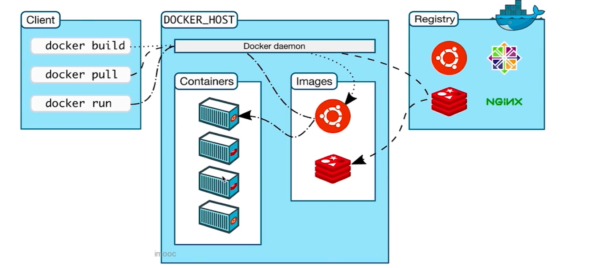
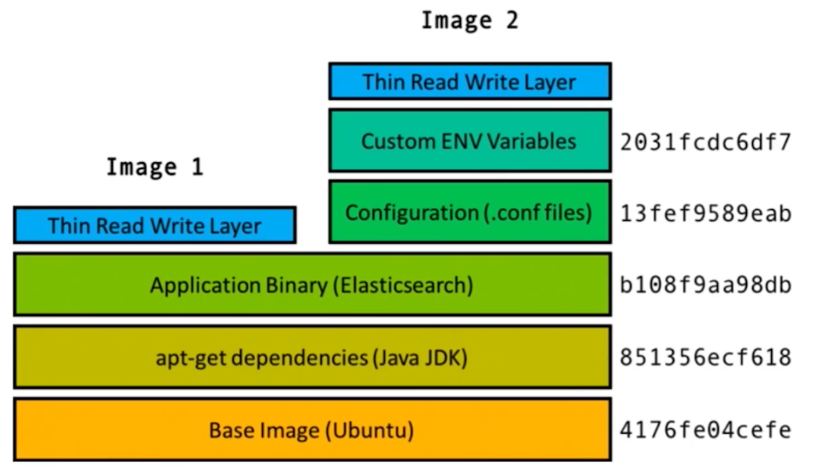
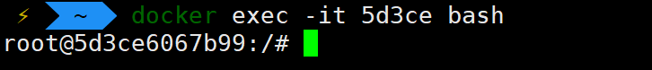
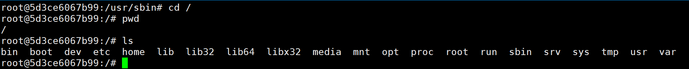
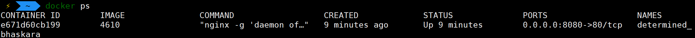
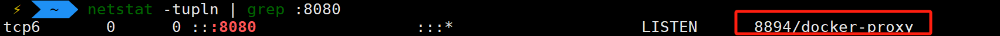
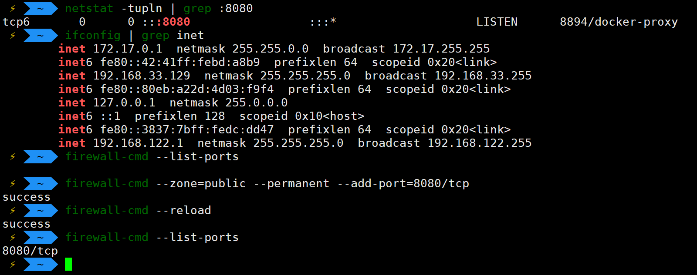
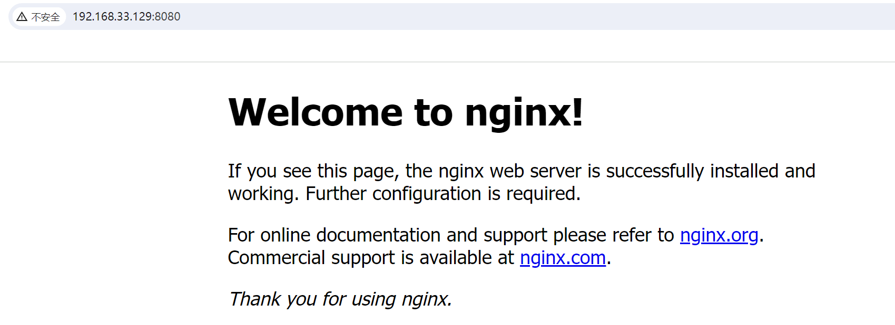
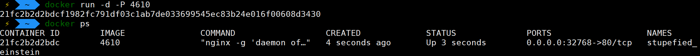
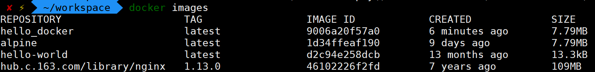

### 为什么需要 Docker？

Docker 是为了==解决环境配置问题==而生的，比如一个程序，在你的机器上能正常运行，但是到我的机器上就运行不了了，这并不是程序本身的问题，而是环境的问题，比如 jdk 版本不同啊，路径映射地址不同啊，配置文件不同啊，甚至底层操作系统就不一样等等。

虽然==虚拟机==也可以解决环境的问题，但是相比 Docker ==消耗了过多额外的内存和磁盘的资源==，并且由于虚拟机往往配置低下，其操作系统==启动花费的时间较长==，这通常也是我们不能接收的。

那么 ==Linux 容器==怎么样呢？相比于虚拟机，Linux 容器只是启动了一个进程，可以将其理解为==目标程序的一个"外壳"，其内部运行的程序拥有独立于本机的环境==，这样其==占用资源和效率都比虚拟机好上不少==。

---


### 什么是 Docker？

==Docker 是一个用于封装程序和其环境的容器==，是对 Linux 容器的一种封装。比如我们把我们的项目，不仅是代码，还把 jdk 放进去，配置文件放进去，中间件如 tomcat，mysql 都放进去，全部打包，放到"小蓝鲸"上，让它帮忙传输。

因此，==Docker 可以提供一个统一的环境，解决了环境不一致所带来的种种问题==。比如我打包好的环境，发给你，你只需要 Docker 的几条简单的命名就可以跑起来了。

并且我们还能由此==轻易扩展业务规模==。比如一个电商项目在比较火爆的几天，我们可以多来几台服务器，通过 Docker 轻易把我们的程序部署到新机器上，然后过了这几天在轻易地下线。

同时，Docker 还有另一个重要作用，就是可以只给 Docker 上部署的服务划分特定的、有限的资源。这样假如这些程序出了问题，比如我写个无限递归，如果没有 Docker 就会很快占用机器的所有 CPU 资源，导致该机器的其它服务崩溃，但是有了 Docker 就不一样了，崩溃的程序只会影响它那部分资源，对同机器上的其它服务不会产生影响，这也体现了==同一机器上，不同程序间的隔离性==，提高了程序的安全性。

---


### 什么是镜像（images）？

Docker 的==架构图==：

> 

Docker 服务端的三个重要概念：==容器（Containers）、镜像（Images）、仓库（Repository）==

==镜像就是一系列的文件==，包括我们的应用程序的文件啊，==运行环境的文件==啊等等。Docker 的镜像就是采用一种叫做联合文件系统（UnionFS）的存储方式保存下来。

怎么理解 UnionFS 的存储方式呢？其实 ==UnionFS 是一种层次堆叠的存储方式==：

> 

可以看到 Image1 和 Image2 的底层是相同的，都是 Ubuntu、jdk、ES，而上层依赖的环境有所不同，UnionFS 的堆叠方式就==只需将不同的依赖堆叠到相同部分上面就可以了==，便于管理和扩展。

---


### 什么是容器（container）？

==镜像类似于类，容器类似于实例对象==。

==同一个镜像可以生成多个容器==，这几个容器之间互不干扰。

---


### 什么是仓库（repository）？

镜像传到仓库上，其他人把你的镜像 pull 下来。

[官方docker仓库](hub.docker.com)

私有仓库，公司一般使用私有仓库，比如自己搭建一个私有的仓库，将镜像上传上去，限制内网访问。

客户端请求运行某个容器，docker 服务器先看本地有没有对应的镜像，没有就从配置文件指定的仓库中下载该镜像，然后再启动镜像的实例，即容器。

---


### Docker 常用命令

```bash
docker images # 显示当前的镜像

docker pull IMAGE_NAME # 从镜像仓库拉取镜像

docker run IMAGE_NAME # 根据镜像创建容器，并启动容器

docker ps # 显示当前运行的容器

# 后台运行
docker run IMAGE_NAME &
# OR
docker run -d IMAGE_NAEM # -d 代表detached，即分离
```

==docker exec==

```bash
docker exec [OPTIONS] CONTAINER COMMAND [ARG...] # 进入容器内部(因为容器存在于一个独立于我们的操作系统的环境下)
docker exec -it CONTAINER_ID bash # 在当前的terminal中进入容器
```

> 

进入容器内部就是进入一个新的环境，就像进入了一台新的电脑。

> 

----


### Docker 的网络模式

Docker 的网络模式分为 Bridge, Host, Node。

==Bridge==：容器和我们的主机使用不同的网络，但是能通过 Bridge 连接起来。

==Host==：容器不会虚拟出自己的 ip 或网卡，而是直接使用宿主机的网络环境。

一般来说都是使用 Bridge 模式，那么这样就有一个问题，那就是假如外部宿主机的80端口被占用，但是容器也需要启动一个占用80端口的服务，那么就需要将容器的80端口映射到宿主的其它端口上。

==使用 Bridge 模式的示例==：

> ```bash
> docker run -d -p 8080:80 IMAGE_NAME # 宿主机的8080端口映射到容器的80端口
> ```
>
> 
>
> 然后再宿主机上使用`netstat`查看8080端口的使用情况：
>
> 
>
> 开放8080端口的防火墙，我们登录浏览器尝试访问：
>
> 
>
> 

另一种方便的方法是使用`-P`参数，这样 docker 会自动将我们容器中所有服务的端口全部随机映射到宿主机的空闲端口。

```bash
docker run -d -P IMAGE_NAME
```

> 

---


### 制作自己的镜像

使用 Dockerfile，相当于自己的镜像的配置文件。

方式：

1. 在任意路径下创建一个名为 Dockerfile 的文件

	```bash
	touch Dockerfile
	```

2. 然后编辑该文件

	```bash
	FROM alpine:latest # alpine 是我们继承的一个镜像，它比较小，适合我们继承
	MAINTAINER Garry # 维护者名字
	CMD echo 'hello my Dockerfile!' # 给出脚本
	```

3. 上传到 library：

	```bash
	docker build -t hello_docker .
	# -t 表示镜像的名字
	# . 表示在当前目录下寻找名为 Dockerfile 的文件
	
	Sending build context to Docker daemon  752.8MB
	Step 1/3 : FROM alpine:latest
	latest: Pulling from library/alpine
	d25f557d7f31: Pull complete 
	Digest: sha256:77726ef6b57ddf65bb551896826ec38bc3e53f75cdde31354fbffb4f25238ebd
	Status: Downloaded newer image for alpine:latest
	 ---> 1d34ffeaf190
	Step 2/3 : MAINTAINER Garry
	 ---> Running in 4d5e6109f103
	Removing intermediate container 4d5e6109f103
	 ---> e77fbc60ebb0
	Step 3/3 : CMD echo 'hello my Dockerfile!'
	 ---> Running in eea5c1d022d9
	Removing intermediate container eea5c1d022d9
	 ---> 9006a20f57a0
	Successfully built 9006a20f57a0
	Successfully tagged hello_docker:latest
	```

4. 再查看当前的镜像，发现多出了继承镜像 `alpine`和我们制作的镜像`hello_docker`。

	

	