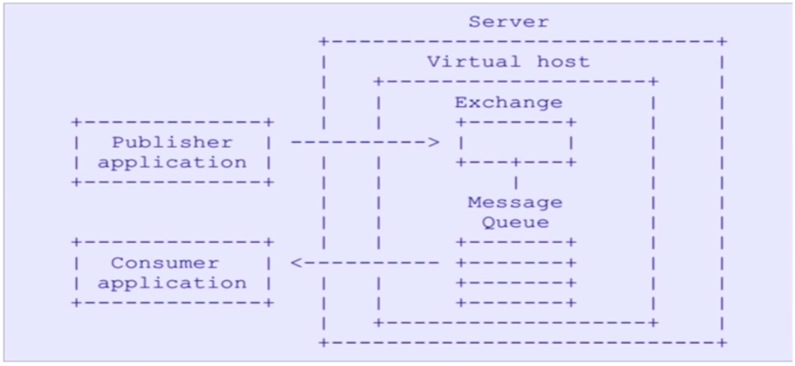
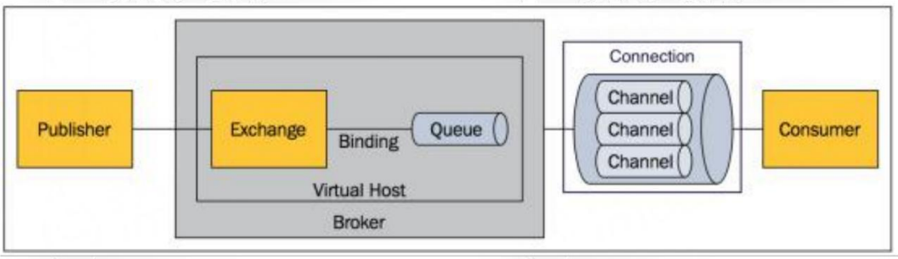

> 好处：清晰好用的 GUI 界面，对开发者很友好。

### 消息队列的好处

1. **解耦**：比如有一个系统 A 提供一个优惠交易的数据，它需要把数据传给优惠券系统，还要传给订单系统。但是随着业务的扩展，系统 A 的数据可能还需传给日志系统，其它乱七八糟的系统。这样一来，如果系统 A 直接在业务代码中调用这些接收者系统的接口，那么就会使系统 A 的代码变得难以维护，因为每当我们要新增或删除这些接收的系统时，都必须要修改系统 A 的业务源代码。

	而使用消息队列就可以实现生产者和消费者系统间的解耦。生产者系统只需将消息传到消息队列中，它只需要调用一个消息队列的接口即可。而消费者只需根据需求调用消息队列的接口，新增的消费者调用消息队列的接口，删除消费者就只需不再调用消息队列的接口。这样消息队列相当于是生产者系统和消费者系统间的一个中间件，把生产者系统和消费者系统间的代码隔离开，实现它们间的解耦，提供可扩展性。

2. **异步**：首先说一下同步和异步间的区别。比如系统 A 直接调用系统 B 和系统 C 的接口，那么系统 A 就要等待系统 B 和系统 C 执行完毕才能返回，这是同步调用。而异步调用下，系统 A 只需将信息放到消息队列中就可以直接返回了，而系统 B 和系统 C 从消息队列中读取数据，而不是直接由系统 A 传给它们数据。同步调用下，用户要等待那些乱七八糟的系统执行完毕，然而并没有必要，我们只需告诉这些系统需要执行某某业务，然后让它们自己在后台执行就可以了，这就是异步，返回速度快得多。

3. **消峰**：比如遇到高峰期，大量请求涌入业务系统，如果业务系统需要调用持久层的接口的话，那么很可能持久性数据库就会因为大量请求而崩溃，造成业务停摆，这是我们绝对不能接收的。如果消息的生产者把数据放到消息队列中，就能有效进行消峰。我们给消息队列设置一个每秒最多消费消息的上限，这样消息队列就能以数据库能接受的速度把消息传给乱七八糟的业务系统，提高项目的可靠性。

---

### AMQP 协议

1. Advanced Message Queuing Protocol，可以将其理解为消息队列的一套规范，所有的消息队列系统都必须遵循这套规范，就像所有数据库系统的 Java 驱动都必须遵循 jdbc 规范一样。

2. 

	可以看到生产者将消息直接放到交换机（Exchange）中即可，无需在意会被交换到哪个消息队列中；而消费者只需监听指定的消息队列即可，无需在意消息是从哪里传来的。由此实现了解耦。

---

### rabbitMQ 概念

1. rabbitMQ 的执行流程图：

	> 

	生产者的消息首先传给交换机，交换机将消息转发给队列，队列再把数据转发到信道（channel）上，而消费者是从信道上获取数据的。

2. 核心概念：

	> - Server：服务。
	> - connection：与Server建立连接。
	> - channel：信道，**几乎所有的操作都在信道上进行**，客户端可以建立多个信道。
	> - message：消息，**由 properties 和 body 组成**。
	> - virtual host：虚拟主机，顶层隔离。**同一个虚拟主机下，不能有重复的交换机和queue**。
	> - Exchange：交换机，接收生产者的消息，然后**根据指定的路由器去把消息转发到所绑定的队列**上。
	> - binding：绑定交换机和队列。
	> - routing key：路由键，路由规则，虚拟机可以用它来确定这个消息如何进行一个路由。
	> - queue：队列，消费者只需要监听队列来消费消息，不需要关注消息来自于哪个Exchange。

---

