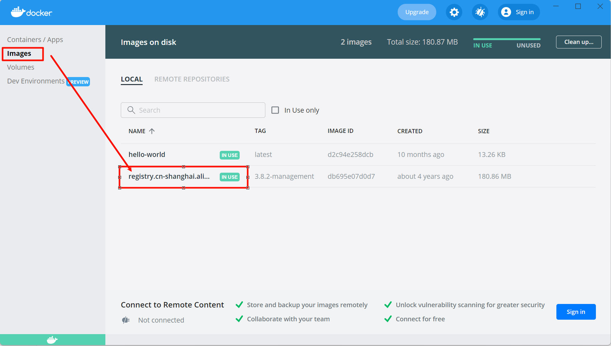

# rabbitMQ基于电商支付项目的下载攻略

1. 首先下载docker desktop，下载方式见：`../docker/dockerDownloadForWin11Family.md`

2. 管理员身份启动==WindowsPowershell，输入==：

	> ```shell
	> docker run -d -p 5672:5672 -p 15672:15672 registry.cn-shanghai.aliyuncs.com/springcloud-imooc/rabbitmq:3.8.2-management
	> ```
	>
	> 如果显示无法识别docker，那就去第一步找原因
	>
	> 成功后可以看到：
	>
	> 

3. 注意，`docker run -d -p 5672:5672 -p 15672:15672 registry.cn-shanghai.aliyuncs.com/springcloud-imooc/rabbitmq:3.8.2-management`是==启动命令==，输入后相当于在==本机的5672端口启用rabbitMQ服务，并在15672端口进行GUI操作==

4. 此时rabbitMQ服务在本机启用，就像tomcat一样==在浏览器输入`127.0.0.1:15672/`，访问rabbitMQ的GUI界面==，账户和密码都是`guest`