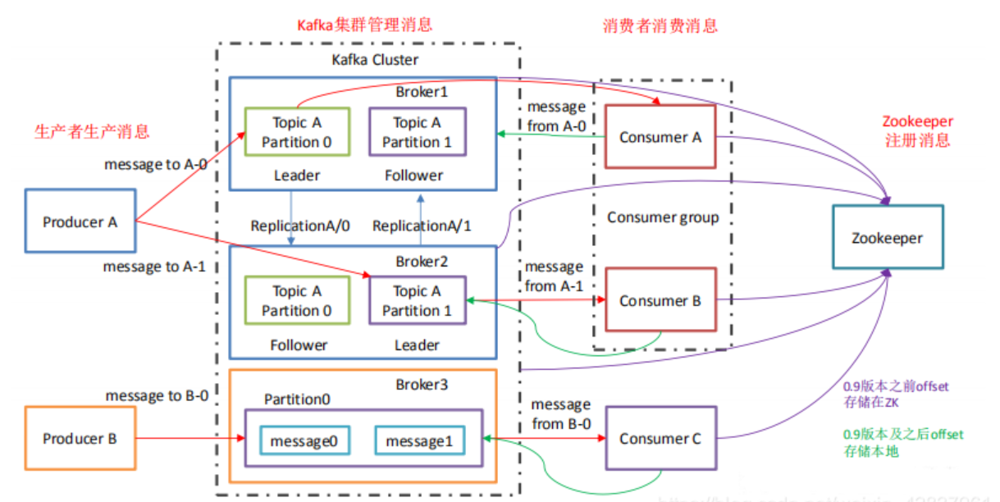
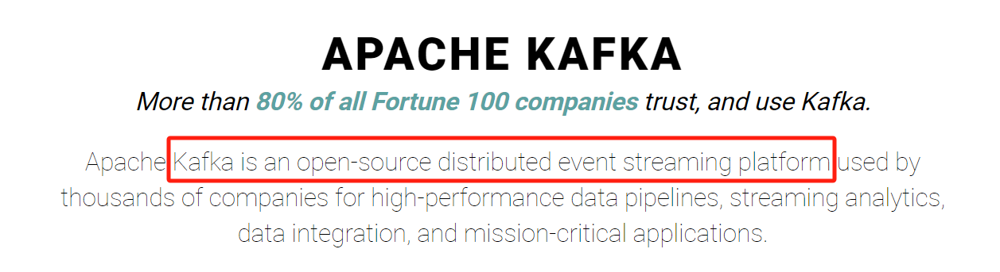

## Kafka 概念和架构

1. **Broker**：

	**一台 Kafka 服务器就是一个 broker**。**一个集群由多个 broker 组成**。**一个 broker 可以容纳多个 topic**。

2. **Topic**：

	可以理解为一个**队列**，生产者和消费者面向的都是一个 topic。

3. **Partiton**：

	为了实现拓展性，一个非常大的 topic 可以分布到多个 broker（即服务器）上，**一个 topic 可以分为多个 Partition，每个 partition 都是一个有序的队列**。

4. **Replication**：

	**副本**，为保证集群中某个节点发生故障时，该节点上的 partition 数据不丢失，且 Kafka 仍然可以继续工作，Kafka 提供了副本机制，一个 topic 的每个分区都有若干个副本，**一个 leader 和若干个 follower**。

5. 

---


## Kafka 常用命令

BEFORE：Kafka 本身其实并不是一个消息队列系统，而是一个**分布式流平台**。



Kafka 是**基于 zookeeper 的分布式消息系统**。

### 1.启动命令

```bash
bin/kafka-server-start.sh config/server.properties &
```

### 2.停止命令

```bash
bin.kafka-server-stop.sh
```

### 3.创建 topic

```bash
bin/kafka-topics.sh --create --zookeeper zookeepr部署的ip地址:2181 --replication-factor 1 --partitions 1 --topic garry-topic
# 使用 zookeeper，zookeeper 部署在本机的 2181 端口
# topic 的名字为 garry-topic
# 这里的"zookeepr部署的ip地址"指的是你在配置文件 server.properties 中配置的 ip 地址
```

1. **topic：一个虚拟的概念，由1到多个 patitions 组成**。
2. patition：**实际存储消息**的单位。

### 4.查看当前 topic

```bash
bin/kafka-topics.sh --list --zookeeper zookeepr部署的ip地址:2181
# Kafka 本身是基于 zookeeper 的，要先查 zookeeper 然后再获取 zookeeper 的信息
```

### 5.发送消息

```bash
bin/kafka-console-producer.sh --broker-list kafka部署的ip地址:9092 --topic garry-topic
# 这里的"kafka部署的ip地址"指的是你在配置文件 server.properties 中配置的 ip 地址
```

### 6.接收消息

```bash
bin/kafka-console-consumer.sh --bootstrap-server kafka部署的ip地址:9092 --topic garry-topic --from-beginning
```

---


