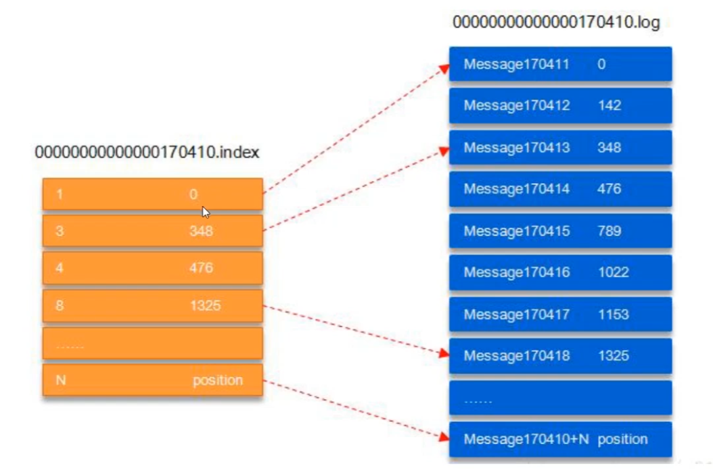
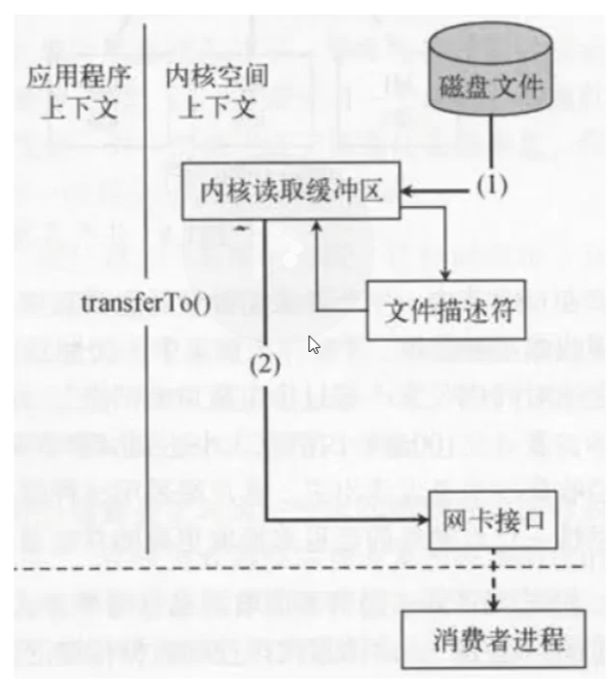
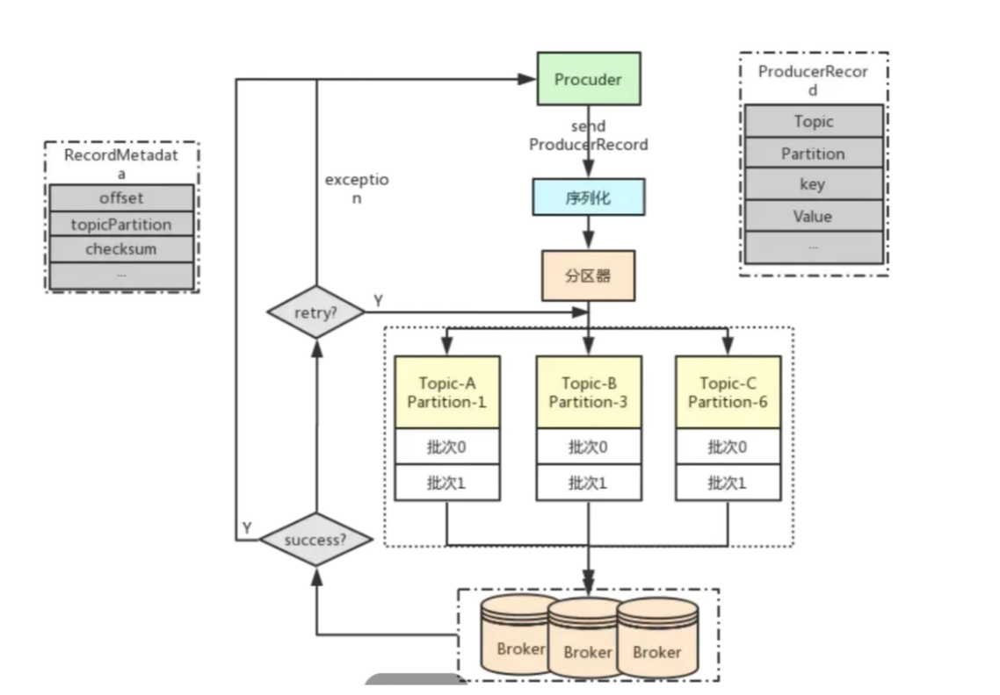

## Kafka 概念和架构

1. ==Broker==：

	==一台 Kafka 服务器就是一个 broker==。==一个集群由多个 broker 组成==。==一个 broker 可以容纳多个 topic==。

2. ==Topic==：

	可以理解为一个==队列==，生产者和消费者面向的都是一个 topic。

3. ==Partiton==：

	为了实现拓展性，一个非常大的 topic 可以分布到多个 broker（即服务器）上，==一个 topic 可以分为多个 Partition，每个 partition 都是一个有序的队列==。

4. ==Replication==：

	==副本==，为保证集群中某个节点发生故障时，该节点上的 partition 数据不丢失，且 Kafka 仍然可以继续工作，Kafka 提供了副本机制，一个 topic 的每个分区都有若干个副本，==一个 leader 和若干个 follower==。

5. 

---


## Kafka 常用命令

BEFORE：Kafka 本身其实并不是一个消息队列系统，而是一个==分布式流平台==。


Kafka 是==基于 zookeeper 的分布式消息系统==。

### 1.启动命令

```bash
bin/kafka-server-start.sh config/server.properties &
```

### 2.停止命令

```bash
bin.kafka-server-stop.sh
```

### 3.创建 topic

```bash
bin/kafka-topics.sh --create --zookeeper zookeepr部署的ip地址:2181 --replication-factor 1 --partitions 1 --topic garry-topic
# 使用 zookeeper，zookeeper 部署在本机的 2181 端口
# topic 的名字为 garry-topic
# 这里的"zookeepr部署的ip地址"指的是你在配置文件 server.properties 中配置的 ip 地址
```

1. ==topic：一个虚拟的概念，由1到多个 patitions 组成==。
2. patition：==实际存储消息==的单位。

### 4.查看当前 topic

```bash
bin/kafka-topics.sh --list --bootstrap-server localhost:9092
```

### 5.发送消息

```bash
bin/kafka-console-producer.sh --broker-list kafka部署的ip地址:9092 --topic garry-topic
# 这里的"kafka部署的ip地址"指的是你在配置文件 server.properties 中配置的 ip 地址
```

### 6.接收消息

```bash
bin/kafka-console-consumer.sh --bootstrap-server kafka部署的ip地址:9092 --topic garry-topic --from-beginning
```

---


## Kafka 面试题

### 1.Kafka 概念和优劣势

1. Kafka 本身只是一个==分布式的流处理平台（概念）==，只是==因为 Kafka 支持发布订阅模式，并提供 Topic 支持，因此我们可以将其当作消息队列来用==。

2. Kafka ==吞吐量高（优点一）==，但是==不能保证消息有序（缺点）==，实际上 Kafka ==只能保证某个 patition 的消息有序，而不能保证整体全部消息的消息有序==。

3. Kafka 的另一个优点是可以==消费历史数据（优点二）==。一条消息在其它的消息队列中被消费完之后就会被清除，但是在 Kafka 中不会被清除。事实上，在 ==Kafka 读取到一条消息时，它会将这条消息通过日志系统持久化到磁盘上，然后 Consumer 从磁盘中读取消息==，也使得我们可以进行==数据恢复==。

4. ==Kafka 的应用场景==：

	> - 日志收集和流式系统：当我们每产生一条日志，就把这条日志放到 Kafka 里，通过实时分析（Kafka 是一个分布式流处理平台，因此支持大数据分析），展示日志的情况，不如有没有报错。
	> - ==消息系统==：Kafka 作为消息系统==不保证消息的有序性==（只保证单个 patition 内部的消息有序性）。而发送==消息通知就是一个对消息有序性要求不高==的业务。比如在我们的==社区项目中，就使用 Kafka 来异步发送点赞、关注、评论的消息通知==。
	> - 用户活动跟踪，比如电商平台中将用户浏览的商品传到 Kafka 上作数据分析。

---


### 2.Kafka 吞吐量大的根本原因

1. ==日志顺序读写和快速检索==，具体详情看下面的小节。
1. ==Patitoin 机制==，使得同一个 topic 下可以==并发处理多条消息==。
1. ==批量发送和数据压缩机制==，压缩批量的数据后==减少网络传输时间==。
1. 通过 ==sendfile 实现零拷贝原则==，具体详情看下面的小节。

---


### 3.Kafka 日志检索底层原理

1. Kafka 的==日志以 patition 为单位==存储。

2. 日志目录的格式为 topic 名称 + 数字。

3. 日志的格式示意图：==头部 + 内容==：

	> 

4. 真实的线上项目中，日志的量可能非常大，比如几个G甚至几个T都是有可能的，因此为了不让日志太大变得难以查找，==每个 Patition 的日志会被分为多个大小相同的 segment==。

5. 每个 segment 的消息数量不一定相等。

6. 每个 ==Patition 只支持顺序读写==（==吞吐量大的原因==，磁盘的顺序读写速度可能比内存更快）其表现为：

	> 1. Patition 会将==消息追加到最后一个 segment 上==。
	> 2. ==segment 追加消息时在内存中==，只有==达到一定的大小才会 flush 到磁盘上==。（注意，必须要 flush 上之后，消息才能被 Consumer 读到，因为 ==Consumer 只能从磁盘中读取数据==）

7. ==读取日志的过程==：

	> - 首先找出 segment 文件。
	>
	> - 通过全局 offset 计算出 segment 的 offset。
	>
	> - 通过 index 中的 offset 查找得到具体的内容。
	>
	> 	

---


### 4.Kafka 零拷贝原理

1. ==零拷贝是 Kafka 速度快的根本原因，最核心的原因==。

2. ==不使用零拷贝==的消息读取流程（JVM 建议的流程）：

	> - 
	> - 首先由内核态从磁盘文件中读取数据，然后交给用户态，由用户态将数据传到 socker 缓冲区，最后由客户端的消费者进程通过网卡接口从 socker 缓冲区中获取数据。
	> - 可以看到其实用户缓冲区在这个过程中意义不大，那为什么不略过它呢？

3. 通过 sendfile 实现==零拷贝==的流程：

	> - 
	> - ==主要省去了内核态和用户态中切换的大量时间==。

---


### 5.消费者组和消费者

1. Kafka 的==消费者组是 Kafka 消费的单位==（也就是消息是由一个组消费的，而不局限于一个消费者）。
2. ==单个 Patition 只能由消费者组中的一个消费者消费==。
3. 消费者组中的消费者可以消费多个 Patition 中的数据。

---


### 6.Producer 客户端

1. > 
	>
	> - Producer 的核心线程有两个：
	> 	1. 守护线程。
	> 	2. 发送消息的起一个线程，在守护线程中追加队列，由守护线程把这个消息做回调。
	> - 

---


### 7.Kafka 有序性的保证

1. ==Kafka 全局无序，但是单个 Patition 的消息可以保证有序==。因此如果==一个 topic 下只设置一个 Patition，那么显然可以保证有序==。但是==由于一个 Patition 只能有一个消费者，所以单 Patition 的效率反而不如 rabbitMQ 等其它消息队列==。
2. ==使用 Kafka Keys + Offset 保证业务有序==。比如==以订单号为 Keys，然后根据 offset 的先后顺序区区分出消息的顺序==。

---


### 8.Kafka 安全地 topic

1. > 

---


