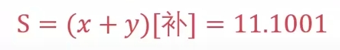

## 慕课网

### 第一章：概述篇

#### 1.计算机的发展历史

##### 四个阶段

> 
>

---

1. ==电子管计算机：==

	> 1. 集成度小，空间占用大
	> 2. 功耗高，运行速度慢
	> 3. 操作复杂，更换程序需要接线

2. ==晶体管计算机：==

	> 1. 集成度相对较高，空间占用相对小
	> 2. 功耗相对较低，运行速度较快
	> 3. 操作相对简单，==交互更加方便== ==（显示屏）==

3. ==集成电路计算机：==

	> 1. 计算机变得更小
	> 2. 功耗变得更低
	> 3. 计算速度变得更快
	> 4. ==IBM推出兼容的产品System/360，是操作系统的雏形==

4. ==超大规模集成计算机：==

	> 1. ==一个芯片集成了上百万的晶体管==
	> 2. 速度更快，体积更小，价格更低，更能被大众接受
	> 3. 用途丰富:文本处理、表格处理、高交互的游戏与应用

---

##### 微型计算机

==单核 CPU:==

> 

==摩尔定律：集成电路的性能，每18-24个月就会提升一倍==

---

==多核 CPU：==

> 

---

#### 2.计算机的分类

1. ==超级计算机：==

	```
	1TFLOP/s = 每秒一万亿次浮点运算
	```

	> 

2. ==大型计算机==

3. ==迷你计算机（服务器，小型机）==

4. ==工作站（比普通电脑强一些）==

5. ==微型计算机（个人计算机）==

---

#### 3.计算机的体系和结构

##### 冯诺依曼体系

> 

> ==现代计算机都是冯诺依曼机==

> 
>

> ==CPU = 运算器 + 控制器==
>
> 把CPU和存储器分开的缺陷：冯诺依曼瓶颈
>
> 即：==CPU和存储器速率之间的问题无法调和==（CPU >> 存储器）
>
> 

##### 现代计算机的结构

> 

> ==现代计算机的 CPU = 运算器 + 控制器 + 存储器==
>
> ==现代计算机的结构以存储器为核心==

---

#### 4.计算机的层次与编程语言

##### 程序翻译与程序解释

==程序翻译：==

> 
>

> ==编译器将高级语言转化为计算机可以理解的机器语言==

==程序解释：==

> 
>

> 使用==机器语言实现另一个程序（解释器）==，==把高级语言作为输入==进行执行

==语言：==

1. 翻译型语言：C++/C，Golang
2. 解释型语言：python，Php
3. 翻译+解释语言：Java，C#

> `Java`先翻译为`.class`字节码文件，然后通过`JVM`解释`.class`字节码文件实现执行

---

##### 计算机层次

> 

---

#### 5.计算单位

##### 容量单位

1. 比特位 bit(0/1)
2. 字节byte，1byte = 8bits
3. 1024 = 2^10
4. 硬盘商采用1000代表1024，所以1TB的硬盘实际只有945GB

---

##### 速度单位

==网络速度：==

1. 100M = 100M/s = 100Mbps = 100Mbit/s
2. 100Mbit/s = (100/8)MB/s = 12.5MB/s
3. 因此100M的宽带每秒传输12.5兆字节

==CPU速度：==

1. CPU速度指CPU的时钟频率

2. 单位赫兹

3. ==我的 CPU的速度：3.11GHz，每秒计算 31.1亿次==

	> 

---

#### 6.字符与编码集

1. ACSll码：所有字符1字节，表示128个字符
2. Extended ACSll码：用剩下的128个位置，表示一些数学字符和欧洲字符
3. GBK：本地编码
4. Unicode：所有字符2字节，万国码
5. UTF-8：对Unicode改进，英文1字节，中文3字节

> Windows系统默认使用 GBK 编码
>
> 编译器默认使用 UTF-8 编码

---


### ==第二章：组成篇==

> 

---

#### 1.总线

USB：Universal Serial Bus，通用串行总线

> 1. ==提供对外连接的接口==
> 2. ==不同设备可以通过总线接口连接==
> 3. ==促成外部设备的统一==

---

##### 片内总线

==芯片内的总线==


---

##### 系统总线

==连接计算机外围设备的总线==

> 1. 数据总线
> 2. 地址总线
> 3. 控制总线

---

##### 总线仲裁

==解决总线使用权的冲突问题==

> 1. 链式查询
>
> 	
>
> 2. 计时器定时查询
>
> 3. 独立请求

---


==觉得不重要的地方就不记，觉得有价值的地方就好好记==


#### 2.输入输出(IO)设备

##### 常见IO设备

。。。

##### IO接口的通用设计

啥啥啥线。。。

##### CPU与IO设备的通信

本质：==CPU和IO设备的速度不一致==

##### 程序中断

==CPU高速运转的同时兼顾低速设备的响应==

就是==低速设备打断CPU的正常工作==，==CPU解决低速设备后又回到之前的工作==

> 

频繁打断CPU不太好，解决方法：==DMA（直接储存器访问）==

---


#### 3.存储器概述

##### 存储器的分类

没啥好记的

##### 存储器的层次结构

缓存：CPU的寄存器，高速缓存

主存：内存

辅存：磁盘，U盘等

==速度：缓存>主存>辅存==，价格也是这样滴，==容量相反==

> 

> 

==CPU可以和主存之间直接通信，怎么解决CPU和主存间速度不匹配的问题？==

> 解决方法：==在CPU和主存间加一层速度快，容量小的高速缓存(Cache)==
>
> 具体实现：==将内存中CPU经常访问的一片区域置换为缓存==，这样CPU就不要到速度比较慢的内存中去获取数据了
>
> 

从上面的图中还可以发现：主存和辅存之间也有连线，==主存-辅存的结构是什么呢？==

> 比如你有一个20G的游戏，但是你的内存只有16G，你不可能把整个游戏读取到你的内存里，因此==可以将游戏当前正在使用的数据加载到内存，而没用到的数据就放到辅存中==，==这就是辅存解决主存容量不足办法==

---


#### 4.主存和辅存

> 问题一：为什么计算机断电时，==内存的数据会丢失==？
>
> 问题二：为什么计算机断电时，==磁盘的数据不会丢失==？

##### 主存

==主存是一种RAM==（==随机存取存储器：随机存取，存取时间和数据的位置无关==）

问题一解答：==RAM每隔一段时间必须通过电容刷新，如果不刷新，则会丢失所有数据==

==主存的大小和操作系统的位数有关==：

> 

##### 辅存

==磁盘有一个磁头，有很多磁道，有很多扇区==

> 

还有几种磁盘磁头读取磁道的顺序的算法，这里就不写了

---


#### ==5.高速缓存==

##### ==工作原理==

1. ==字==：字是一个二进制的代码组合，==它可以是一个数据，一个指令，一个字符串==。==字是内存中最小存储单元==
2. ==字块：连续的一组字==

> 

核心概念：==缓存的容量远小于主存，缓存中的数据是主存中的数据的复制==

我们肯定希望CPU可以在高速缓存中取数据，而不是从主存中取。因此就衍生出一个概念：==缓存命中率==

> 

##### ==替换策略==

==目的：让缓存命中率足够高==

1. 随机算法

2. 先进先出算法（FIFO）

3. 最不经常使用算法（LEU）

4. ==最近最少使用算法（LRU）==

	> 优先淘汰一段时间内没有使用的字块
	>
	> 实现方式：一般是双向链表
	>
	> ==一旦访问，就将访问的字块放到队头，然后清除队尾==

---


#### 6.指令系统

##### 机器指令形式

==机器指令：操作码（操作的种类）+地址码（操作的数据的地址）==

==操作码==：比如加法，自增等操作对应的二进制指令

==地址吗==：分为==零地址指令（没有参数）==，一、二、三地址指令（对应数量的参数）

##### 机器指令的操作类型

过

##### 机器指令的寻址方式

也过

---


#### 7.控制器

过

---


#### 8.运算器

过

---


### 第三章：计算篇

#### 1.进制运算

> 

---


#### 2.有符号数和无符号数

过

---


#### 3.补码表示法

==引进补码的目的：消除原码的减法，因为原码的减法运算复杂==

过，后面和反码一起看

---


#### 4.反码表示法

==负数的反码=原码除符号位取反==

==正数的补码=原码==

==补码=反码+1==

---


#### 5.小数的补码

> 

---


#### 6.定点数和浮点数

> 

float：32位表示

double：64位表示

> 

---


#### ==7.定点数的加减法==

==先转成补码相加，结果再转回原码==

##### 溢出

> 

==溢出解决方法：双符号位表示==

> 0 => 00, 1 => 11

> 

##### 减法

==A[补] - B[补] = A[补] + (-B)[补]==

==-B[补]等于B[补]连同符号位按位取反，末位加一==

> 

---


#### ==8.定点数的加减法==

##### 对阶

将它们的阶数化为更大的那个，==多余的位舍去==

> 
>
> ==0.0011(01)舍去了(01)==

对阶完毕后，将尾数相加

##### 尾数规格化（左移）

如果上述==两数补码的和的结果==不满足：==最高位和符号位不一致==，那么就需要进行位数规格化

所谓位数规格化，就是==将结果尾数左移直到最高位和符号位一致==，然后==阶数位减少对应左移的位数==

> 如：上述例题补码之和为 ，那么需要尾数左移一位，11.0010，然后阶数-1

> 
>
> 结果：
>
> 

##### 尾数规格化（右移）

结果的==双符号位不一致，右移，阶码+1==

注意：右移如果==舍去的那一位是1，则结果最后还要+1==；当然，+1后又不规范了就继续左移或右移

> 
>
> 
>
> 
>
> 

> 

---


#### ==9.定点数的加减法==

> 
>
> 当然，==最后的结果也要进行尾数规格化左右移==

---


