## 慕课网

### Chapter1 进程篇

#### 1.进程实体

==没有OS之前，所有的资源都属于当前运行的程序，资源利用率极低==

进程伴随着OS而出现，可以==隔离资源、运行环境，提高资源利用率==

1. 进程是==系统进行资源分配和调度的基本单位==
2. 进程作为程序独立运行的载体保障程序正常执行
3. 进程的存在使得操作系统==资源的利用率大幅提升==

##### 进程的实体

1. 标识符：唯一标记一个进程（id）
2. 状态：eg运行状态，阻塞状态。。。
3. 优先级
4. 程序计数器：执行进程即将执行的下一条地址
5. 内存指针：程序代码、内存数据相关指针
6. 上下文数据：==进程执行时处理器储存的数据==
7. IO状态信息
8. 记账信息

> 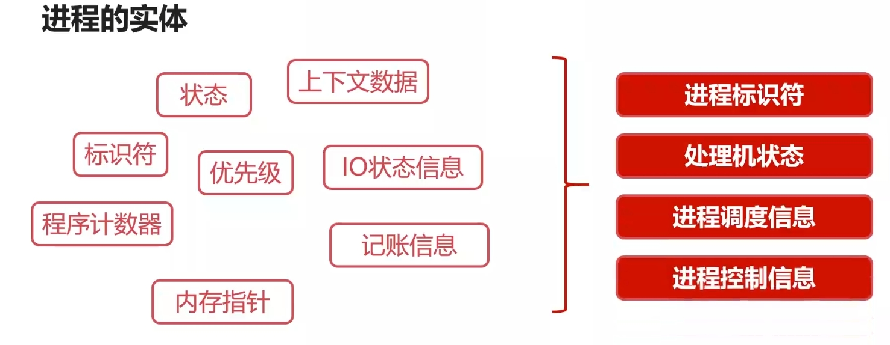

##### 进程控制块（PCB）

1. ==记录进程当前状态的全部信息==
2. ==PCB经常被内存调用，因此它是常驻内存的==

##### 线程

1. 包含在进程之中，是==进程中实际运行工作的单位==
2. ==一个进程可以并发多个线程==，每个线程执行不同的任务

##### 进程 vs 线程

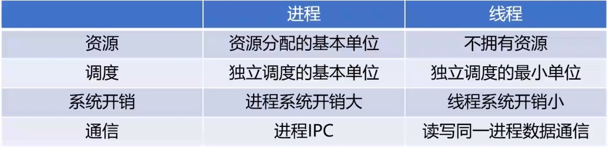

---


#### 2.进程五大状态

1. ==就绪状态==

	> 1. 当进程被分配到除CPU以外所有必要的资源后
	> 2. 只要再获得CPU的使用权，就可以立即运行
	> 3. ==其他资源都准备好、只差CPU资源的状态为就绪状态==
	> 4. 如果一个系统中有多个就绪状态，那么它们往往会排成一个队列，称作==就绪队列==

2. 执行状态

	> 就绪状态的进程拿到CPU的资源

3. ==阻塞状态==

> 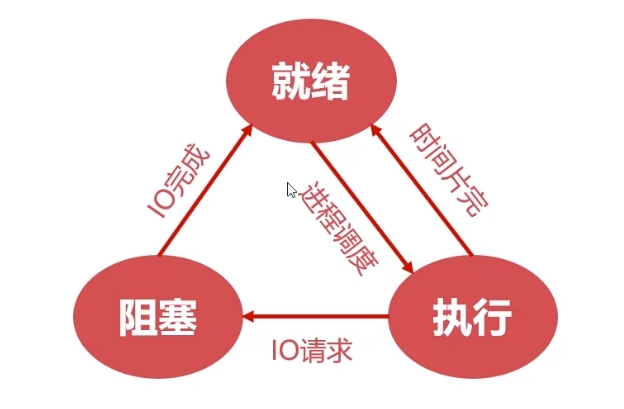

4. 创建状态

	> 创建进程时，==拥有PCB，但是其它资源尚未就绪的状态==

5. 终止状态

	> ==系统清理，规划PCB==

> 

---


#### 3.进程同步

##### 生产者-消费者问题

> 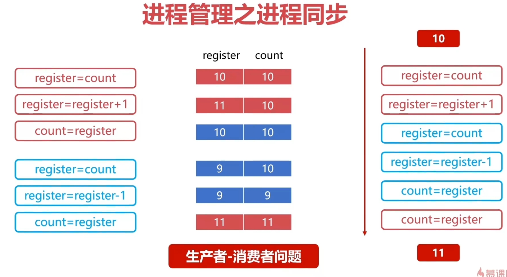
>
> 执行逻辑：
>
> 1. 寄存器读取缓冲区数据
> 2. 寄存器修改数据
> 3. 将修改的数据写回缓冲区
>
> 生产者和消费者并发执行，可能出现上图右侧所示的不同步现象，导致最后结果异常

##### 哲学家进餐问题

> 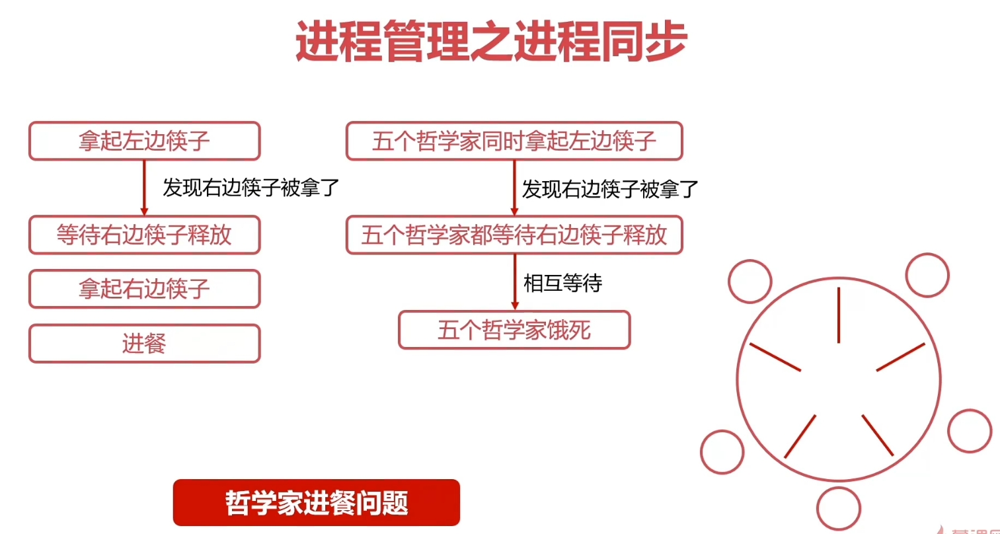

==以上两个问题的根源：进程之间没有彼此通信==

##### 进程同步的原则

==临界资源==：被多个进程共享的资源，其它进程必须等待占用临界资源的进程释放，才能重新竞争共享资源

1. 空闲让进:资源无占用，允许使用
2. 忙则等待:资源有占用，请求进程等待
3. 有限等待:保证有限等待时间能够使用资源
4. 让权等待:等待时，进程需要让出CPU

==进程同步的方法==：

1. 消息队列
2. 共享储存
3. 信号量

##### 线程同步

同理，线程间也需要同步

==进程同步方法==：

1. 互斥量
2. 读写锁
3. 自选锁
4. 条件变量

---


#### 4.Linux的进程管理

##### Linux进程的概念

1. ==前台进程==：具有终端，可以和用户交互的进程

	> ==运行时会占用用户的终端shell==

2. ==后台进程==：基本不和用户交互，优先级低于前台进程

	> 就是在前台进程后面加上 &，后台进程的输出不会影响用户的shell使用

3. 守护进程：一般以 d 结尾的进程就是守护进程

##### Linux进程管理

1. 进程的id是进程的唯一标记，==top命令查看当前所有进程==

2. Linux操作系统可以==使用fork函数创建进程==

3. ==pstree命令==查看==当前所有父子进程关系==

4. ==特殊进程==：

	> 1. ==ID为0的进程为idle进程==，是系统创建的第一个进程
	> 2. ==ID为1的进程为init进程==，是0号进程的子进程，完成==系统初始化==
	> 3. ==Init进程是所有用户进程的祖先进程==

5. ==进程的标记==：

	> 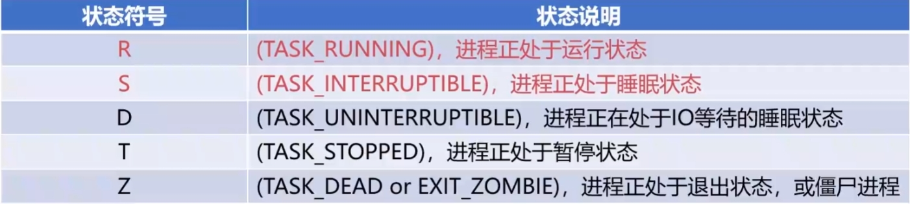

##### Linux进程命令

###### ps命令

==列出当前进程==

```shell
ps
```

==结合 -aux 参数，打印进程的详细信息==

```shell
ps -aux
```

==查看指定用户的进程==

```shell
ps -u root #查看root用户的所有进程
```

==结合管道和grep命令，查看指定的进程==

```shell
ps -aux | grep 'python3'
```

==-\-forest参数查看进程树==

```shell
ps -ef --forest
```

==-\-sort对查询结果进行排序==

```shell
ps -aux --sort=-pcup #根据CPU的使用频率进行排序

ps -aux --sort=-pmem #根据内存的占用量进行排序
```

###### top命令

查看当前进程的所有状态

###### kill命令

==给特定的进程发送指定的信号==

```shell
kill -9 -[%thread]	#-9代表进程无条件停止
```

==使用`kill -l`查看支持的信号==

---


#### 5.进程调度

==进程调度==是指计算机通过决策==决定哪个就绪进程可以获得CPU使用权==

==非抢占式调度 vs 抢占式调度==

> 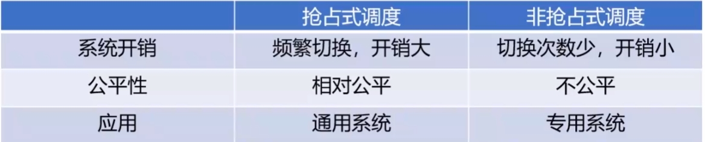

==进程调度算法==

1. FIFO
2. 短进程优先（谁最短谁先）
3. 权重优先（如前台进程优先级 > 后台进程）
4. 时间片轮转调度：先按照FIFO排序，然后每个进程只提供相同长度的时间片，用完就终止并放回队列

---


#### 6.死锁

##### 死锁的产生

1. 竞争资源
2. 进程调度顺序不当

##### 死锁的处理

1. 破坏请求保持条件

	> 让进程一次性申请完所有所需资源才能运行

2. 破坏不可剥夺条件

	> 当一个进程请求资源时，占用者必须释放

3. 破坏环路等待条件

	> 修改申请顺序，环形改为线性申请

==银行家算法==：

> 

---


### Chapter2 储存篇

#### 1.储存管理：内存分配与回收

##### 分配过程

单一xxx

固定xxx

==动态分区分配==

首次适应算法：每次都从头找第一个合适空闲区

最佳适应算法：遍历整个链表，找最合适的空闲区

快速适应算法：多个链表，每个链表里存储某一大小的空闲区

##### 回收过程

合并回收区和其旁边的空闲区，若旁边没有空闲区就额外创建一个

---


#### 2.存储管理：段页式存储管理

##### 页式存储管理

> 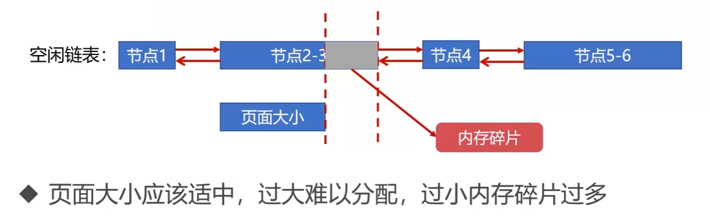
>
> 每一页：512B~8K

##### 段式存储管理

> 

##### 段页式存储管理

> 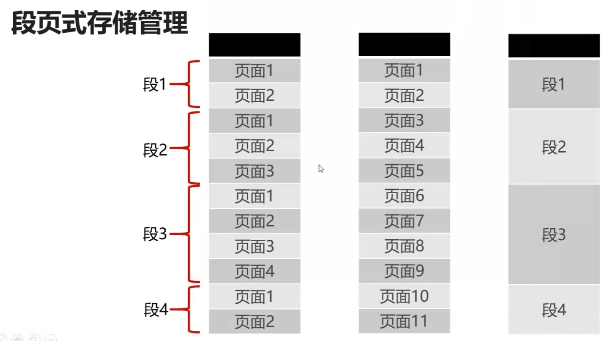

----


#### 3.储存管理：虚拟内存

##### 虚拟内存

划分内存，将暂时不需要的内存放到辅存(存在于磁盘)

> 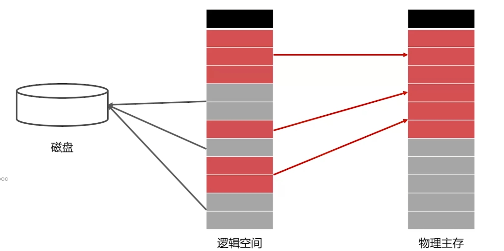

##### 局部性原理

> 

##### 主存辅存置换

> 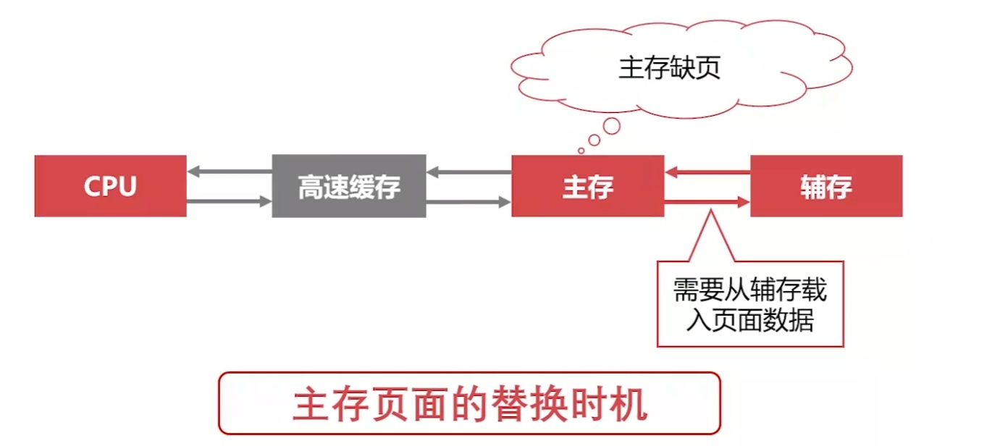

---


#### 4.Linux的存储管理

##### Buddy内存管理算法

> 

> 

> 

> 

> 本质：将内存外碎片转化为内存内碎片

##### Linux交换空间

交换空间Swap在Linux初始时配置，位置在磁盘，会将内存不常用的数据放入交换空间

> 

---


#### 5.操作系统的文件管理

##### 文件的逻辑结构

**有结构文件**

> 

**无结构文件**

> 

##### 辅存的存储空间分配

> 现在主要使用索引分配
>
> 

##### 目录管理

就是我们常用的文件目录

---


#### 6.Linux文件的基本操作

1. **Linux一切皆是文件（比如进程，设备等都是文件）**

2. > 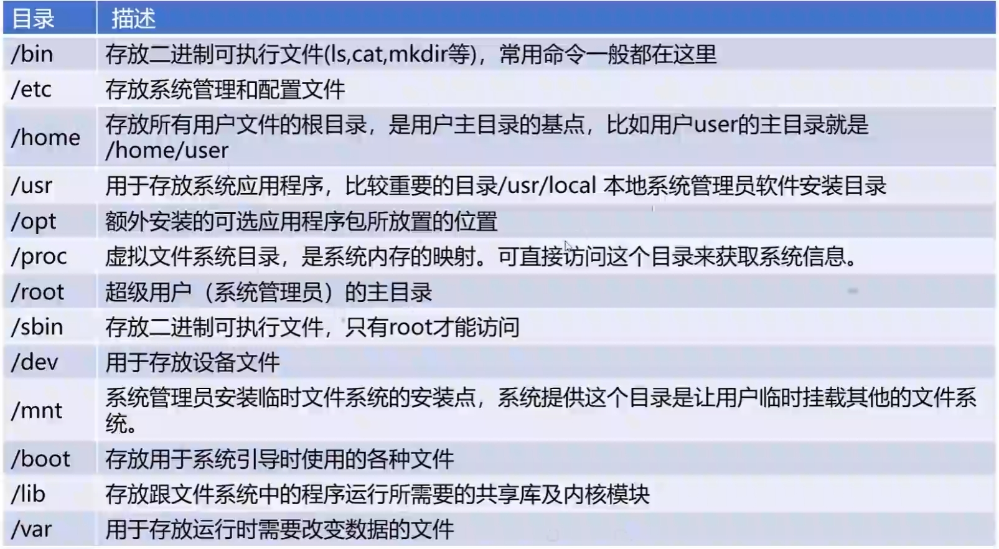

3. > 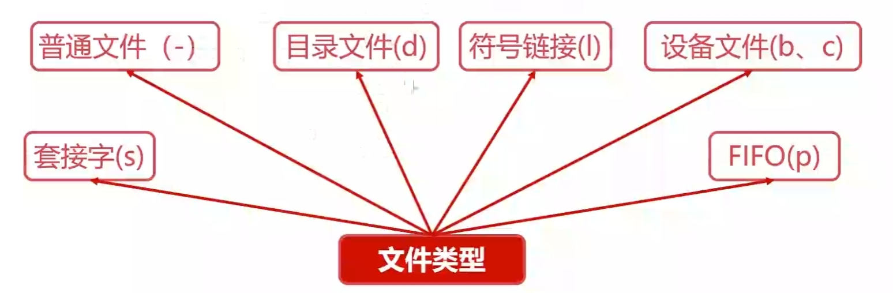
	>
	> **`ls -al`中的第一个字符表示该文件的类型**

---


#### 7.Linux的文件系统

> 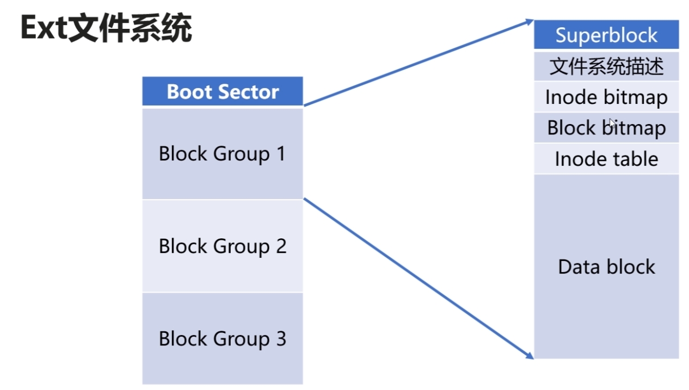
>
> Inode是一个文件的唯一标识

---


#### 8.操作系统的设备管理

没什么好记的，可能缓存池还比较能记

---


### Chapter3 线程和进程同步篇

#### 1.线程同步之互斥量

最简单的线程同步方法

---


#### 2.线程同步之自旋锁

> 

不适合在单核CPU中使用

---


#### 3.线程同步之读写锁

读写锁对于多读少写操作的性能的提升很大

----


#### 4.线程同步之条件变量

条件变量满足时，唤醒线程

---


#### 5.线程同步方法总结

> 

---


#### 6.使用fork创建进程

> 

----


#### 7.进程同步之共享内存

共享内存：不相关的进程共享同一块物理内存

> 

---


#### 8.进程同步之Unix域套接字

就是socket，但是只在单机上使用，不跨机器使用

---


