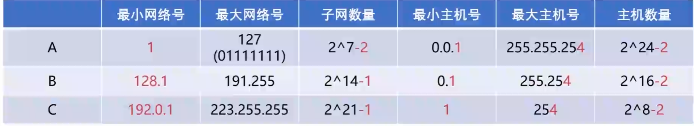
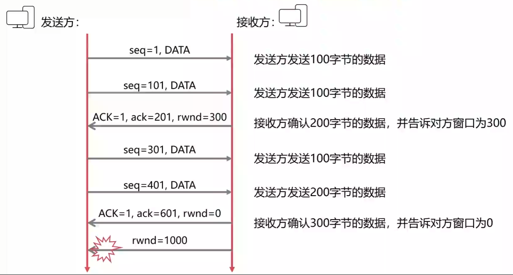
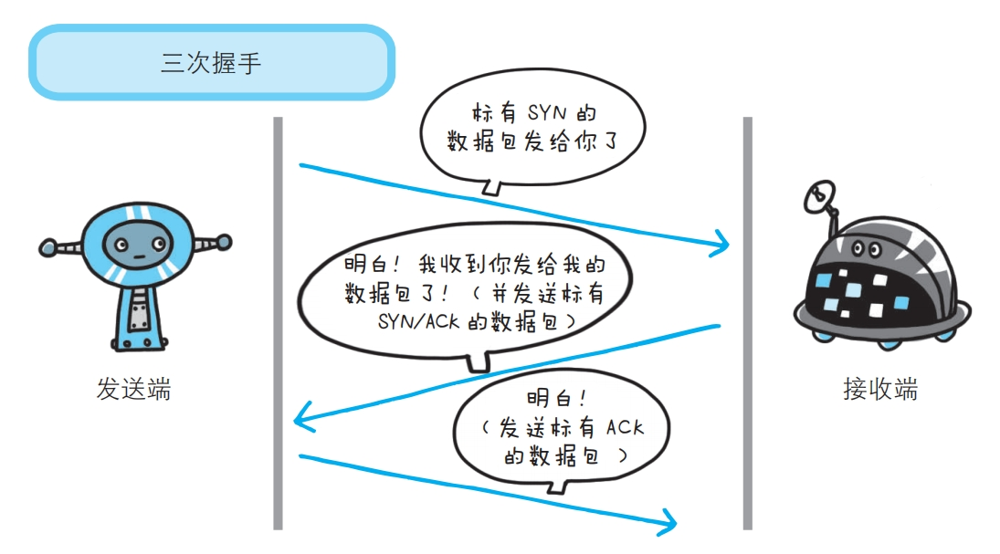
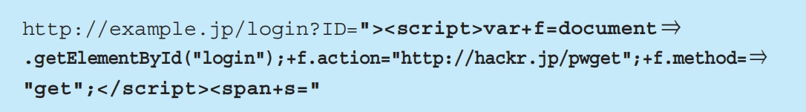

## 文章

### 1.计算机网络五层入门

> 

#### 1. 物理层

1. 第一件要做的事是什么？当然是要==把这台计算机与另外的其他计算机连起来==
2. 可以==通过光纤啊，电缆啊，双绞线啊等介质把他们连接起来==，然后才能进行通信。
3. 物理层负责把两台计算机连起来，然后在计算机之间==通过高低电平来传送0,1这样的电信号==。

#### 2.数据链路层

1. 如果这些0，1组合的传送毫无规则的话，计算机是解读不了的。==我们需要制定一套规则来进行0，1的传送==。于是，有了以太网协议。

2. 以太网协议规定，一组电信号构成一个数据包，我们把==这个数据包称之为帧==。==每一个桢由标头(Head)和数据(Data)两部分组成==。

	> 

3. ==标头部分的字节是固定的（否则计算机无法解析标头携带的信息）==，并且固定为18个字节。

4. 把一台计算的的数据通过物理层和链路层发送给另一台计算机，==究竟是谁发给谁的，计算机与计算机之间如何区分==，你总得给他们一个==唯一的标识==吧？于是，MAC 地址出现了。

5. 连入网络的==每一个计算机都会有网卡接口，每一个网卡都会有一个唯一的地址（MAC地址）==，这个地址就叫做 MAC 地址。MAC地址 由 ==48 个二进制位==所构成，在==网卡生产时就被唯一标识了==。

6. 计算机 A 不仅连着计算机 B，而且==计算机 A 也还连着其他的计算机==。 虽然计算机 A 知道计算机 B 的 MAC 地址，可是==计算机 A 却不知道知道计算机 B 是分布在哪边路线上==，为了解决这个问题，于是，有了==广播==的出现。

7. 在同一个==子网==中，计算机 A 要向计算机 B 发送一个数据包，这个==数据包会包含接收者的 MAC 地址==。当发送时，计算机 A 是通过==广播==的方式发送的，这时==同一个子网中的计算机 C, D 也会收到这个数据包的==，然后收到这个数据包的计算机，会把数据包的 MAC 地址取出来，与自身的 MAC 地址对比，如果==两者相同，则接受这个数据包，否则就丢弃这个数据包==。

	> 

#### 3. 网络层

1. ==广播的时候==，也==只有同一个子网里面的计算机能够收到==。

2. IP地址被分为两部分，前面一部分代表==网络部分==，后面一部分代表==主机部分==。并且网络部分和主机部分所占用的二进制位数是==不固定的==。

3. 我们只需要把 ==IP 地址与它的子网掩码做与(and)运算==，然后把各自的结果进行比较就行了，如果比较的结果相同，则代表是同一个子网，否则不是同一个子网。

	> 例如，192.168.43.1和192.168.43.2的子码掩码都为255.255.255.0，把IP与子码掩码相与，可以得到他们都为192.168.43.0，进而他们处于同一个子网中。

4. ==ARP协议==也是通过==广播==的形式给同一个==子网中的每台电脑发送一个数据包==(当然，这个数据包会包含接收方的IP地址)。对方收到这个数据包之后，会取出IP地址与自身的对比，==如果相同，则把自己的MAC地址回复给对方==，否则就丢弃这个数据包。这样，==计算机A就能知道计算机B的MAC地址了（获取帧中标头）==。

	> 

5. 例如访问百度是输入 $www.baidu.com$ 这个域名。其实当我们输入这个域名时，会有一个叫做==DNS服务器的家伙来帮我们解析这个域名，然后返回这个域名对应的IP给我们的==。

#### 4.传输层

1. 我们在从计算机A传数据给计算机B的时候，还得==指定一个端口，以供特定的应用程序来接受处理==。
2. 传输层最常见的两大协议是 ==TCP 协议和 UDP 协议==，其中 TCP 协议与 UDP 最大的不同就是 ==TCP 提供可靠的传输，而 UDP 提供的是不可靠传输==。

#### 5. 应用层

1. 虽然我们收到了传输层传来的数据，可是这些传过来的数据五花八门，有html格式的，有mp4格式的，各种各样。你确定你能看的懂？

	因此==我们需要指定这些数据的格式规则，收到后才好解读渲染==。例如我们最常见的 Http 数据包中，就会指定该数据包是 什么格式的文件了。

---


### 2.如果让你来设计网络

#### 1.电脑视角

- 首先我要知道我的 IP 以及对方的 IP
- 通过子网掩码==判断我们是否在同一个子网==
- ==在同一个子网==就通过 ==arp 获取对方 mac 地址直接扔出去==
- ==不在同一个子网==就通过 ==arp 获取默认网关的 mac 地址直接扔出去==

#### 2.交换机视角

- 我收到的数据包必须有==目标 MAC 地址==
- 通过 ==MAC 地址表查 MAC 地址和端口的映射关系==
- 查到了就按照映射关系从我的指定端口发出去
- 查不到就所有端口都发出去

#### 3.路由器视角

- 我收到的数据包必须有目标 IP 地址
- 通过路由表查映射关系
- 查到了就按照映射关系从我的指定端口发出去（不在任何一个子网内，走其路由器的默认网关也查到了）
- 查不到则返回一个路由不可达的数据包

总结：==网络层（IP协议）本身没有传输包的功能==，包的实际传输是==委托给数据链路层（以太网中的交换机==）来实现的。

#### 4.涉及到的三张表

- ==交换机（只有交换机有）==中有 ==MAC 地址表==用于映射 MAC 地址和它的端口

	> |     MAC 地址      | 端口 |
	> | :---------------: | :--: |
	> | bb-bb-bb-bb-bb-bb |  1   |
	> | cc-cc-cc-cc-cc-cc |  3   |
	> | aa-aa-aa-aa-aa-aa |  4   |
	> | dd-dd-dd-dd-dd-dd |  5   |
	> | ee-ee-ee-ee-ee-ee |  6   |
	> | ff-ff-ff-ff-ff-ff |  6   |
	> | gg-gg-gg-gg-gg-gg |  6   |
	> | hh-hh-hh-hh-hh-hh |  6   |

- ==路由器（路由表计算机和路由器都有）==中有==路由表==用于映射 IP 地址(段)和它的端口

	> |   目的地址    |    子网掩码     | 下一跳 | 端口 |
	> | :-----------: | :-------------: | :----: | :--: |
	> |  192.168.0.0  |  255.255.255.0  |        |  0   |
	> | 192.168.0.254 | 255.255.255.255 |        |  0   |
	> |  192.168.1.0  |  255.255.255.0  |        |  1   |
	> | 192.168.1.254 | 255.255.255.255 |        |  1   |

- ==电脑和路由器中都有（注意电脑和路由器都有）== ==ARP 缓存表==用于缓存 IP 和 MAC 地址的映射关系

	> |   IP 地址   | MAC 地址 |
	> | :---------: | :------: |
	> | 192.168.0.2 |   BBBB   |

#### 5.这三张表是怎么来的

- ==MAC 地址表==是通过以太网内各节点之间==不断通过交换机通信，不断完善起来的==。
- ==路由表==是各种==路由算法 + 人工配置==逐步完善起来的。
- ==ARP 缓存表==是不断通过 ==ARP 协议的请求==逐步完善起来的。

#### 6.下一跳

> 
>
> ==这时路由器 1 连接了路由器 2，所以其路由表有了下一条地址这一个概念==，如果匹配到了有下一跳地址的一项，则需要再次匹配，找到其端口，并找到下一跳 IP 的 MAC 地址。
>
> |     目的地址     |    下一跳     | 端口 |
> | :--------------: | :-----------: | :--: |
> |  192.168.0.0/24  |               |  0   |
> | 192.168.0.254/32 |               |  0   |
> |  192.168.1.0/24  |               |  1   |
> | 192.168.1.254/32 |               |  1   |
> |  192.168.2.0/24  | 192.168.100.5 |      |
> | 192.168.100.0/24 |               |  2   |
> | 192.168.100.4/32 |               |  2   |

#### 7.实例

> 
>
> ==1.== 首先 A（192.168.0.1）通过子网掩码（255.255.255.0）计算出自己与 F（192.168.2.2）并==不在同一个子网内，于是决定发送给默认网关==（192.168.0.254）
>
> ==2.== A ==通过 ARP 找到 默认网关 192.168.0.254 的 MAC 地址==。
>
> ==3.== A 将源 MAC 地址（AAAA）与网关 MAC 地址（ABAB）封装在数据链路层头部，又将源 IP 地址（192.168.0.1）和目的 IP 地址（192.168.2.2）（注意这里千万不要以为填写的是默认网关的 IP 地址，从始至终这个数据包的两个 IP 地址都是不变的，只有 MAC 地址在不断变化）封装在网络层头部，然后发包
>
> 
>
> ==4.== ==交换机 1 收到数据包后，发现目标 MAC 地址是 ABAB（不在子网下），转发给路由器1==
>
> ==5.== 数据包来到了==路由器 1==，发现其目标 IP 地址是 192.168.2.2，查看其路由表，==发现了下一跳的地址是 192.168.100.5==
>
> ==6.== 所以此时路由器 1 需要做两件事，第一件是再次匹配路由表，发现匹配到了端口为 2，于是将其封装到数据链路层，最后把包从 2 号口发出去。
>
> ==7.== 此时==路由器 2== 收到了数据包，看到其目的地址是 192.168.2.2，查询其路由表，==匹配到端口号为 1==，准备从 1 号口把数据包送出去。
>
> ==8.== 但此时路由器 2 ==需要知道 192.168.2.2 的 MAC 地址==了，于是查看其 arp 缓存，找到其 MAC 地址为 FFFF，将其封装在数据链路层头部，并从 1 号端口把包发出去。
>
> ==9.== ==交换机 3 收到了数据包==，发现目的 MAC 地址为 FFFF，查询其 MAC 地址表，发现应该从其 6 号端口出去，于是从 6 号端口把数据包发出去。
>
> ==10.== ==F 最终收到了数据包！==并且发现目的 MAC 地址就是自己，于是收下了这个包

---


### 3.从输入网址到最后浏览器呈现页面内容，中间发生了什么？

#### 1.准备

1. 当你在浏览器中输入网址（例如www.coder.com）并且敲了回车以后， ==浏览器首先要做的事情就是获得coder.com的IP地址==，具体的做法就是==发送一个UDP的包给DNS服务器==

	> 这时候==浏览器通常会把IP地址给缓存起来==，这样下次访问就会加快。

2. 有了服务器的IP， 浏览器就要可以发起HTTP请求了，但是==HTTP Request/Response必须在TCP这个“虚拟的连接”（不太清楚什么是虚拟的连接）上来发送和接收==。

#### 2.Web服务器

1. Web服务器采用==复用I/O的方式==，很多Web服务器都采用了复用结构

	> 例如==通过epoll的方式监视所有的连接==，==当连接的状态发生变化（如有数据可读）， 才用一个进程/线程对那个连接进行处理，处理完以后继续监视==，等待下次状态变化。 用这种方式可以用少量的进程/线程应对成千上万的连接请求。

2. Nginx利用epoll的方式给读取了出来， ==Nginx接下来要判断，这是个静态的请求还是个动态的请求==啊？

3. 如果是==静态的请求（HTML文件，JavaScript文件，CSS文件，图片==等），也许自己就能搞定了（当然依赖于Nginx配置，可能转发到别的缓存服务器去），==读取本机硬盘上的相关文件==，直接返回。

4. 如果是==动态的请求，需要后端服务器（如Tomcat）处理以后才能返回==，那就需要向Tomcat转发，==如果后端的Tomcat还不止一个，那就需要按照某种策略选取一个==。

	> 
	>
	> ---
	>
	> 由此可见，==Nginx在这种场景下，是一个代理人的角色==。
	>
	> 
	>
	> 

#### 3.应用服务器

1. Http Request终于来到了Tomcat，这是一个==由Java写的、可以处理Servlet/JSP的容器，我们的代码就运行在这个容器之中==。

2. Tomcat也可能为每个请求分配一个线程去处理，即通常所说的BIO模式（Blocking I/O 模式）。

	也可能使用I/O多路复用技术，仅仅使用若干线程来处理所有请求，即NIO模式。

3. ==Http Request 都会被交给某个Servlet处理，这个Servlet又会把Http Request做转换，变成框架所使用的参数格式，然后分发给某个Controller==。

#### 4.浏览器再次工作

1. ==HTML页面中可能引用了大量其他资源==，例如js文件，CSS文件，图片等，这些资源也位于服务器端，并且可能位于另外一个域名下面。
2. 当服务器给浏览器发送JS,CSS这些文件时，==会告诉浏览器这些文件什么时候过期==。

---


### 4.通信双方如何保证消息不丢失？

#### 1.分组

==数据在传输的时候是分割成一小块一小块传输的==，我们把==这一小块的数据称之为一个分组==。

#### 2.分组出差错

1. ==问题描述==：这个分组在传输的过程中，由于在==信道传输过程中，收到干扰==，导致这个分组到达目的地之后出现了差错，例如分组里面的==二进制位1变成了0，0变成了1==。
2. ==法一==：在==发送时加上差错校验码==，==接收方可根据校验码判断是否出错==。如果==没有差错==的话，接收方就给发送方==发送一个ACK分组==，告诉对方，数据正确无误。如果==出现差错==的话，就给对方发送一个==NAK分组==，告诉对方分组数据出现了差错，==需全部重新发送==。
	- ==缺陷==：如果==ACK和NAK分组也出错==了，就无法正常通讯了。
3. ==法二==：==加长校验码==，使得==校验码不仅能检查校验是否出错，还可以纠正差错==。
	- ==缺陷==：如果分组出现大量差错，会让==校验码变的很难设计==的，而且==校验码属于与正文内容无关的数据==，占了太多比特位的话，会==降低传输效率==。
4. ==法三==：如果==发送方==收到的接收方的==ACK或NAK分组有误==，那么==发送方就重新发送==。
	- ==接收方==怎么判断==数据包是新包还是重发的旧包==呢？
	- ==给每一个数据包编号==，如果接收方==正常接收数据包==后，==又收到一个编号相同的数据包==，那就说明==接收到的包是重发的旧包==，接收方==丢弃该数据包==即可。

#### 3.分组丢失

1. ==问题描述==：==分组==还没传输到目的地，就==丢失==了，我们也把这种情况称之为==丢包==。
2. ==法一==：如果A==迟迟没有收到B的反馈==，A就可以认为这个分组丢失了，==重新发送==。
	- ==缺陷==：A发送一个分组，==收到B的反馈之后，再发送下一个分组==，==浪费信道的资源（等待的过程中信道大部分也闲着）==。

> 如果==同时发送多个分组==时，最需要处理的问题就是==接受方收到分组时，并非按照顺序收到分组的==，有==可能序号小的分组先达到==，这时就会出现了==乱序==。

#### 4.回退N步协议(GBN)

1. > 

2. 我们常把N称之为==窗口长度==，由于窗口在序号范围内移动，也被GBN协议称之为==滑动窗口协议==。

3. ==发送方==需要响应以下两个事件：

  > 1. ==收到一个ACK==：在GBN协议中，对序号为n的分组的确认采取==累计确认==的方式。也就是说，==当A收到序号为n的分组时==，表明==分组n以及n之前的分组已经被B正确接受==了。
  > 2. ==超时事件==： 当久久没有收到ACK时，A就认为它发送的分组已经丢失了，==这时A会重传所有已发送但还未被确认的分组==。
  > 2. 需要注意的是，并不是为每个分组设置一个定时器，而是==在序号[base,nextseqnum-1]中，设置一个定时器==，当==base发送的那一刻，就开始计时==，当==收到一个ACK时，则刷新重新开始计时==。

4. ==接收方==则需要处理以下事件：

	> 1. 如果一个==序号为n的分组被正确收到==，并且按序(所谓按序就是指==n-1的分组也已经收到了==)，则B为分组n发送一个ACK，==否则，丢弃该分组，并且为最近按序接收的分组重新发送ACK==。

5. 接收方的这种处理方式，意味着==如果n被正确交付，则意味着比n小的所有分组也被正确交付了==。

#### 5.选择重传(SR)

1. 选择重传和回退N步是很相似的，只是在==选择重传==中，接收方收到==失序的分组时，会把它缓存起来==，==直到拼凑到按序的分组==，才把分组传输给上一层。而发送方会为==每个分组设置一个定时器==，这样，只需要==重传那些没有被接收方正确接收的分组==就可以了。

2. > 

3. > 

4. > 

5. > 

---


### 5.集线器、交换机与路由器有什么区别？

#### 1.集线器

集线器起到了一个将网线集结起来的作用，实现最初级的网络互通。集线器是通过网线直接传送数据的，我们说他工作在==物理层==。

> 

#### 2.交换机

交换机是==根据网口(MAC)传送信息==，比网线直接传送多了一个步骤，我们也说交换机工作在==数据链路层==。

> 
>
> ---
>
> 

#### 3.路由器

不同村落通信时，==信息经协议加工成统一形式==，再经由一个特殊的设备传送出去。这个设备就叫做==路由器==。路由器通过IP地址寻址，我们说它工作在计算机的==网络层==。

> 	

---


### 6.什么是 TCP 拥塞控制？

==拥塞控制==与==网络的拥堵情况==相关联，而==流量控制==与==接收方的缓存状态==相关联。

#### 1.为何要进行拥塞控制？

1. 有可能太多主机正在使用信道资源，导致==网络拥塞==了，而 A 发送的==数据包被堵在了半路==，迟迟==没有到达 B==。这个时候 A 就会误认为是发生了丢包情况，进而==重新传输这个数据包==。
2. 结果就是不仅==浪费了信道资源==，还会==使网络更加拥塞==。因此，我们需要进行==拥塞控制==。

#### 2.如何知道网络的拥塞情况？

1. 建立连接之后，发送端 A ==不知道一次性连续发送多少个数据包比较合适==，我们也把 A 一次性连续发送多少个数据包称之为==拥塞窗口==，用 ==N 代表此时拥塞窗口的大小==。

2. 因此，A 可以==先发一个数据包试探一下==，之后每次发送的数据包==逐渐增多==，直到出现网络拥塞。

3. 拥塞窗口 N 的增加方式：==前期指数增长，到达阈值之后，就以一个一个线性的速度来增长==。

	> 

#### 3.到了瓶颈值之后怎么办？

1. 回到==最初的状态==，也就是说从1，2，4，8…..开始,不过这个时候我们还会==把ssthresh调小==，调为MAX值的一半，即==ssthresh = MAX / 2==。

2. 拥塞控制使得==每次传输可以发送尽可能多的数据包==，而==不至于很快就因网络拥塞而没能传到接收端==。

	> 

#### 4.超时事件就一定是网络拥塞？

1. 有可能是因为==某个数据包出现了丢失==或者==损害==了，导致了这个数据包超时事件发生了。

2. 通过==冗余 ACK==来处理这种情况。如果B收到了M1, M2, M4….却始终==没有收到M3==，这个时候就会==重复确认M2==，意在==告诉A M3 还没收到==，可能是丢失。

	> 

3. 当A连续==收到了三个确认M2的ACK==，且==M3超时事件还没发生==。A就知道M3可能丢失了，这个时候A就==不必等待M3设置的计时器到期==了，而是==快速重传M3==。并且==把ssthresh设置为MAX的一半==，即ssthresh = MAX/2，但是这个时候==并非把控制窗口N设置为1==，而是==让N = ssthresh，N再一个一个增长==。

	> 

4. 这种情况称之为==快速恢复==。而这种具有快速恢复的TCP版本称之为==TCP Reno==。

5. 还有另外一种TCP版本，==无论是收到三个相同的ACK还是发生超时事件==，都把==拥塞窗口的大小设为1==，从最初状态开始，这种版本的TCP我们称之为==TCP Tahoe==。

---


### 7.什么是 TCP 流量控制？

==拥塞控制==与==网络的拥堵情况==相关联，而==流量控制==与==接收方的缓存状态==相关联。

#### 1.为什么需要流量控制?

1. 双方在通信的时候，发送方的速率与接收方的速率是不一定相等，如果==发送方的发送速率太快，会导致接收方处理不过来==，这时候接收方只能==把处理不过来的数据包存在缓存区==里（==失序的数据包也会被存放在缓存区里==）。

2. 缓存区满了发送方还在发送数据，==接收方只能把收到的数据包丢掉==，大量的丢包会极大着==浪费网络资源==。

	> 

#### 2.如何控制?

1. 接收方每次在发送==确定报文==的时候，同时==发送自己的缓存区还剩余多少是空闲==的，我们也把缓存区的剩余大小称之为==接收窗口大小==，用变量 ==win== 来表示接收窗口的大小。
2. 发送方收到之后，便会调整自己的发送速率，也就是==调整自己发送窗口的大小==，当发送方收到==接收窗口的大小为0==时，发送方就会==停止发送数据==，防止出现大量丢包情况的发生。

#### 3.发送方何时再继续发送数据?

1. 当发送方收到接受窗口 win = 0 时，这时==发送方==停止发送报文，并且同时==开启一个定时器==，==每隔一段时间就发个测试报文去询问接收方==，==打听是否可以继续发送数据==了。

2. > 

---


### 8.TCP三次握手

#### 1.三次握手

首先不要像以下这样干巴巴地回答：

1. 第一次握手：客户端给服务器发送一个 SYN 报文。
2. 第二次握手：服务器收到 SYN 报文之后，会应答一个 SYN+ACK 报文。
3. 第三次握手：客户端收到 SYN+ACK 报文之后，会回应一个 ACK 报文。
4. 服务器收到 ACK 报文之后，三次握手建立完成。

#### 2.为什么需要三次握手？两次不行？

1. 第一次握手：客户端发送网络包，服务端收到了。这样==服务端就能得出结论：客户端的发送能力、服务端的接收能力是正常的==。
2. 第二次握手：服务端发包，客户端收到了。这样==客户端就能得出结论：服务端的接收、发送能力，客户端的接收、发送能力是正常的==。不过此时==服务器并不能确认客户端的接收能力是否正常==。
3. 第三次握手：客户端发包，服务端收到了。这样==服务端就能得出结论：客户端的接收、发送能力正常，服务器自己的发送、接收能力也正常==。

> ==三次握手==的==目的之一==就是==让客户端和服务端都知道自己和对方的接收和发送能力是否正常==。
>
> ==只有收到报文的一方才有能力做出判断==。因此==第二次握手时客户端收到报文，客户端知道==自己和对方的接收和发送能力都正常，但是==服务端不知道==，==服务端只能根据第一次握手的结果知道==客户端的发送能力、服务端的接收能力是正常的，而不知道客户端的接受能力是否正常。

#### 3.更加详细的解答

1. 第一次握手：客户端给服务端发一个 SYN 报文，并指明客户端的==初始化序列号== ==ISN(c)==。此时客户端处于 ==SYN_SENT== 状态。

2. 第二次握手：服务器收到客户端的 SYN 报文之后，会==以自己的 SYN 报文作为应答==，并且==（在 SYN 报文中）也是指定了自己的初始化序列号 ISN(s)==，同时会把==客户端的 ISN(c) + 1 作为 ACK 的值==，表示自己已经收到了客户端的 SYN，此时服务器处于 ==SYN_RCVD== 的状态。

3. 第三次握手：客户端收到 SYN 报文之后，会发送一个 ACK 报文，当然，也是一样==把服务器的 ISN(s) + 1 作为 ACK 的值==，表示已经收到了服务端的 SYN 报文，此时客户端处于 ==establised== 状态。

4. 服务器收到 ACK 报文之后，也处于 ==establised 状态==，此时，双方以建立起了链接。

	> 

#### 4.三次握手的作用

1. ==确认双方的接受能力、发送能力是否正常==。
2. ==指定自己的初始化序列号==（ ==INS(c) 和 INS(s)== ），为==后面的可靠传送做准备==。

#### 5.ISN是固定的吗

如果ISN是固定的，==攻击者很容易猜出后续的确认号（ISN + 1）==，因此 ==ISN 是动态生成的==。

#### 6.什么是半连接队列

1. ==服务器第一次收到客户端的 SYN== 之后，就会处于 SYN_RCVD 状态，此时双方还没有完全建立其连接，服务器会==把此种状态下请求连接放在一个队列里==，我们把这种队列称之为==半连接队列==。
2. 当然还有一个==全连接队列==，就是已经==完成三次握手，建立起连接的就会放在全连接队列==中。如果==队列满了就有可能会出现丢包现象==。

#### 7.SYN-ACK 重传次数

服务器发送完SYN－ACK包，如果==未收到客户确认包，服务器进行首次重传==，等待一段时间仍未收到客户确认包，进行==第二次重传==，如果重传次数==超过系统规定的最大重传次数==，系统==将该连接信息从半连接队列中删除==。注意，每次重传等待的时间不一定相同，一般会是指数增长，例如间隔时间为 1s, 2s, 4s, 8s。

#### 8.三次握手过程中可以携带数据吗

1. ==第一次、第二次握手不可以携带数据==，而==第三次握手是可以携带数据==的。
2. 因为==进行第一、二次握手前==，==客户端并不知道服务器的发送和接受能力是否正常==。如果攻击者在这个时候==伪造发送大量携带数据的 SYN 报文给服务器==，如果此时服务器接收能力不正常就会被搞崩。
3. 而进行==第三次握手前==，由于此时==客户端已经建立起连接了==，并且也==已经知道服务器的接收、发送能力是正常的==了，所以能携带数据页没啥毛病。

#### 9.TCP报文中的标志位、序列号、确认号在三次握手中的变化

TCP首部占32位字节，其中有序列号seq，确认号ack以及标志位SYN，ACK，FIN等。
当标志位ACK = 1时，确认号ack的值才有效。
三次握手标志位与序列号、确认号的变化是：
SYN = 1, seq = ISN(c)
SYN = 1, ACK = 1, seq = ISN(s), ack = ISN(c) + 1
ACK = 1, seq = ISN(c) + 1, ack = ISN(s) + 1

---


### 9.TCP 四次挥手

#### 1.四次挥手

> 四次回收用于关闭客户端和服务器的连接

刚开始==双方都处于 establised 状态==，假如是==客户端先发起关闭请求==，则：

1. 第一次挥手：==客户端==发送一个 ==FIN 报文==，报文中会指定一个==序列号==。此时客户端处于==FIN_WAIT1==状态。
2. 第二次挥手：服务端收到 FIN 之后，会==发送 ACK 报文==，且把客户端的==序列号值 + 1 作为 ACK 报文的序列号值==，表明==已经收到客户端的报文了==，此时服务端处于 ==CLOSE_WAIT==状态。而==客户端在收到 ACK 报文后会处于 FIN_WAIT2== 状态。
3. 第三次挥手：如果==服务端也想断开连接了==，和客户端的第一次挥手一样，发给 ==FIN 报文==，且指定一个==序列号==。此时服务端处于 ==LAST_ACK== 的状态。
4. 第四次挥手：==客户端==收到 FIN 之后，一样==发送一个 ACK 报文作为应答==，且把==服务端的序列号值 + 1== 作为自己 ACK 报文的序列号值，此时客户端处于 ==TIME_WAIT== 状态。==需要过一阵子以确保服务端收到自己的 ACK 报文之后才会进入 CLOSED 状态==。
5. ==服务端收到 ACK 报文之后==，就处于关闭连接了，处于 ==CLOSED 状态==。

> 

#### 2.为什么客户端发送 ACK 之后不直接关闭，而是要等一阵子才关闭

1. 要==确保服务器是否已经收到了我们的 ACK 报文==，如果==没有收到的话，服务器会重新发 FIN 报文==给客户端，客户端再次收到 FIN 报文之后，就知道==之前的 ACK 报文丢失==了，然后==再次发送 ACK 报文==。
2. 至于 ==TIME_WAIT 持续的时间至少是一个报文的来回时间 (2MSL)==，一般会设置一个计时。

#### 3.每个状态的意义

```java
LISTEN – 侦听来自远方TCP端口的连接请求；

SYN-SENT -在发送连接请求后等待匹配的连接请求；

SYN-RECEIVED – 在收到和发送一个连接请求后等待对连接请求的确认；

ESTABLISHED- 代表一个打开的连接，数据可以传送给用户；

FIN-WAIT-1 – 等待远程TCP的连接中断请求，或先前的连接中断请求的确认；

FIN-WAIT-2 – 从远程TCP等待连接中断请求；

CLOSE-WAIT – 等待从本地用户发来的连接中断请求；

CLOSING -等待远程TCP对连接中断的确认；

LAST-ACK – 等待原来发向远程TCP的连接中断请求的确认；

TIME-WAIT -等待足够的时间以确保远程TCP接收到连接中断请求的确认；

CLOSED – 没有任何连接状态；
```

#### 4.三次握手和四次挥手

> 

---


### 10.什么是 HTTP？

#### 1.Content-Type 字段

1. ```shell
	text/plain
	text/html
	text/css
	image/jpeg
	image/png
	image/svg+xml
	audio/mp4
	video/mp4
	application/javascript
	application/pdf
	application/zip
	application/atom+xml
	```

	这些数据类型==总称为MIME type==，每个值包括一级类型和二级类型，之间用斜杠分隔。

2. MIME type还可以在==尾部使用分号==，==添加参数==。

	```shell
	Content-Type: text/html; charset=utf-8
	```

#### 2.HTTP/1.0的缺点

1. ==每个TCP连接只能发送一个请求==。发送数据完毕，连接就关闭，如果==还要请求其他资源，就必须再新建一个连接==。

2. ==TCP连接的新建成本很高==，因为需要==客户端和服务器三次握手==，且==开始时发送速率较慢（slow start）==。所以，HTTP 1.0版本的性能比较差。随着网页加载的外部资源越来越多，这个问题就愈发突出了。

3. 为了解决这个问题，有些浏览器在请求时，用了一个非标准的Connection字段。

	```shell
	Connection: keep-alive
	```

	这个字段==要求服务器不要关闭TCP连接==，以便其他请求复用。服务器同样回应这个字段。

#### 3.HTTP/1.1

1. 1.1 版的最大变化，就是引入了==持久连接==（persistent connection），即==TCP连接默认不关闭==，可以被多个请求复用，==不用声明Connection: keep-alive==。

2. 1.1 版还引入了==管道机制==（pipelining），即在==同一个TCP连接里面，客户端可以同时发送多个请求==。

3. ==一个TCP连接==现在可以==传送多个回应==，势必就要有一种机制，==区分数据包是属于哪一个回应==的。这就是==Content-length字段的作用，声明本次回应的数据长度==。

	```shell
	Content-Length: 3495
	```

	上面代码告诉浏览器，==本次回应的长度是3495个字节==，==后面的字节就属于下一个回应了==。

4. 1.1版规定==可以不使用Content-Length字段，而使用”分块传输编码==”（chunked transfer encoding）。==只要请求或回应的头信息有Transfer-Encoding字段==，就表明==回应将由数量未定的数据块==组成。

	```shell
	Transfer-Encoding: chunked
	```

5. 每个非空的数据块之前，会有一个==16进制的数值，表示这个块的长度==。最后是一个大小为0的块，就表示本次回应的数据发送完了。

	```bash
	HTTP/1.1 200 OK
	Content-Type: text/plain
	Transfer-Encoding: chunked
	
	25
	This is the data in the first chunk
	
	1C
	and this is the second one
	
	3
	con
	
	8
	sequence
	
	0
	```

#### 4.HTTP/2

1. ==HTTP/1.1== 版的头信息肯定是文本（ASCII编码），==数据体可以是文本，也可以是二进制==。==HTTP/2 则是一个彻底的二进制协议，头信息和数据体都是二进制，并且统称为”帧”（frame）：头信息帧和数据帧==。
2. HTTP/2 复用TCP连接，在一个连接里，==客户端和浏览器都可以同时发送多个请求或回应==，而且==不用按照顺序一一对应==，这样就避免了”队头堵塞”。
3. ==头信息压缩机制==（header compression）。一方面，==头信息使用gzip或compress压缩后再发送==；另一方面，==客户端和服务器同时维护一张头信息表，所有字段都会存入这个表，生成一个索引号，以后就不发送同样字段了，只发送索引号==，这样就提高速度了。
4. 允许服务器未经请求，==主动向客户端发送资源（比如主动推送网页中包含的静态资源，这样客户端就无需再专门向服务器请求这些静态资源了）==，这叫做服务器推送（server push）。

---


### 11.什么是 HTTPS？

#### 1.对称加密

1. 假如==密钥被中间人给劫持==了，那么在之后服务器和客户端的加密传输过程中，中间人也可以用他捕获的密钥进行解密。这样的话，加密的数据在中间人看来和明文没啥两样。

#### 2.非对称加密

1. ==用公钥加密的数据，只有对应的私钥才能解密；用私钥加密的数据，只有对应的公钥才能解密==。

2. 服务器用明文的方式==给客户端发送自己的公钥==，==客户端收到公钥之后，会生成一把密钥(对称加密用的==)，然后用服务器的==公钥对这把密钥进行加密==，之后再把密钥传输给服务器，==服务器收到之后进行解密，最后服务器就可以安全着得到这把密钥==了，而==客户端也有一把相同的密钥==，他们就可以进行==对称加密==了。

	> 

#### 3.非对称加密的危险

1. 服务器以明文的方式给客户端传输公钥的时候，==中间人截取了这把属于服务器的公钥==，并且==把中间人自己的公钥冒充服务器的公钥传输给了客户端==。

2. 之后客户端就会==用中间人的公钥来加密自己生成的密钥==。然后把被加密的密钥传输给服务器，这个时候==中间人又把密钥给截取了==，中间人==用自己的私钥对这把被加密的密钥进行解密==，解密后==中间人就可以获得这把密钥==了。

3. 最后中间人==再对这把密钥用刚才服务器的公钥进行加密，再发给服务器==。

	> 

#### 4.数字证书

1. ==之所以非对称加密会不安全，是因为客户端不知道这把公钥是否是服务器的==，因此，我们需要找到一种策略来==证明这把公钥就是服务器==的，而不是别人冒充的。

2. 我们需要找到一个拥有公信力、大家都认可的==认证中心(CA)==。

3. 服务器在给客户端传输公钥的过程中，会==把公钥以及服务器的个人信息==通过==Hash算法==生成==信息摘要==。

	> 

4. 为了防止信息摘要被人调换，服务器还会==用CA提供的私钥==对==信息摘要进行加密==来形成==数字签名==。

	> 

5. 并且，最后还会把原来==没Hash算法之前的个人信息以及公钥== 和 ==数字签名==合并在一起，形成==数字证书==。

	> 

6. 当客户端拿到这份数字证书之后，就会用==CA提供的公钥==来对数字证书里面的数字签名进行解密来==得到信息摘要==，然后对数字证书里服务器的==公钥以及个人信息进行Hash==得到==另外一份信息摘要==。最后把==两份信息摘要进行对比==，如果==一样，则证明这个人是服务器==，否则就不是。

6. 黑客只能用 Hash 将自己服务器的信息和伪造的公钥转化为信息摘要，但是==得不到 CA 的私钥，没办法将其加密为数字签名==，因此不能伪造数字签名。

---


### 12.什么是 SSL/TLS 协议？

==HTTPS 就是 HTTP 协议再套上一层 SSL（Secure Sockets Layer） 加密==。

#### 1.SSL 协议的目的

所有信息明文传播，带来了==三大风险==。

（1） ==窃听风险==（eavesdropping）：第三方可以获知通信内容。

（2） ==篡改风险==（tampering）：第三方可以修改通信内容。

（3） ==冒充风险==（pretending）：第三方可以冒充他人身份参与通信。

==SSL/TLS协议是为了解决这三大风险而设计==的，希望达到：

（1） 所有信息都是==加密传播==，第三方无法窃听。

（2） 具有==校验机制==，一旦被篡改，通信双方会立刻发现。

（3） 配备==身份证书==，防止身份被冒充。

#### 2.如何保证公钥不被篡改？

解决方法：将==公钥放在数字证书（只有验证公钥来自服务端，才会使用该公钥，因此篡改后的公钥不会被客户端所使用）==中。只要证书是可信的，公钥就是可信的。

#### 3.公钥加密计算量太大，如何减少耗用的时间？

SSL/TLS协议的基本过程是这样的：

（1） ==客户端==向服务器端==索要并验证公钥==。

（2） 双方协商生成”==对话密钥==”。

（3） 双方==采用”对话密钥”进行对称加密通信==。

上面过程的==前两步，又称为”握手阶段”==（handshake）。

#### 4.握手阶段

1. ==客户端发出请求（ClientHello）==

	> （1） 支持的协议版本，比如TLS 1.0版。
	>
	> （2） ==一个客户端生成的随机数==，稍后用于生成”对话密钥”。
	>
	> （3） 支持的加密方法，比如RSA公钥加密。
	>
	> （4） 支持的压缩方法。

2. ==服务器回应（SeverHello）==

	> （1） 确认使用的加密通信协议版本，比如TLS 1.0版本。如果浏览器与服务器支持的版本不一致，服		   务器关闭加密通信。
	>
	> （2） ==一个服务器生成的随机数==，稍后用于生成”对话密钥”。
	>
	> （3） 确认使用的加密方法，比如RSA公钥加密。
	>
	> （4） ==服务器证书==。

3. ==客户端回应==

	> （1） ==一个随机数。该随机数用服务器公钥加密==，防止被窃听。
	>
	> （2） 编码改变通知，表示随后的信息都将用双方商定的加密方法和密钥发送。
	>
	> （3） 客户端握手结束通知，表示客户端的握手阶段已经结束。这一项同时也是前面发送的所有内容的                            		   hash值，用来供服务器校验。
	>
	> 客户端和服务器就同时有了三个随机数，它们==用这三个随机数生成同一把”会话密钥”==。

4. ==服务器的最后回应==

	> （1）编码改变通知，表示随后的信息都将用双方商定的加密方法和密钥发送。
	>
	> （2）服务器握手结束通知，表示服务器的握手阶段已经结束。这一项同时也是前面发送的所有内容的		  hash值，用来供客户端校验。
	>
	> 接下来，客户端与服务器进入加密通信，==使用普通的HTTP协议，只不过用”会话密钥”加密内容==。

---


### 13.什么是 DNS？

#### 1.DNS 是什么

1. DNS（==Domain Name System== 的缩写）的作用非常简单，就是==根据域名查出IP地址==。

#### 2.DNS服务器

1. 本机==一定要知道DNS服务器的IP地址==，否则上不了网。==DNS服务器的IP地址，有可能是动态的，每次上网时由网关分配==，这叫做==DHCP==机制；也有可能是事先指定的固定地址。

#### 3.域名的层级

1. ```
	主机名.次级域名.顶级域名.根域名
	www.iamshuaidi.com.root
	```

2. 每一级域名都有自己的NS记录，==NS记录指向该级的域名服务器==。这些==服务器知道下一级域名的各种记录==。

3. 所谓”分级查询”，就是==从根域名开始，依次查询每一级域名的NS记录，直到查到最终的IP地址==。

4. ==流程如下==：

	> 1、从”根域名服务器”查到”顶级域名服务器”的NS记录和A记录（IP地址）
	>
	> 2、从”顶级域名服务器”查到”次级域名服务器”的NS记录和A记录（IP地址）
	>
	> 3、从”次级域名服务器”查出”主机名”的IP地址

#### 4.DNS的记录类型

==域名与IP之间的对应关系==，称为”==记录==”（record）。

> （1） A：地址记录（Address），==返回域名指向的IP地址==。
>
> （2） NS：域名服务器记录（Name Server），返回保存==下一级域名信息的服务器地址==。该记录==只能设置为域名，不能设置为IP地址==。
>
> （3）MX：邮件记录（Mail Exchange），返回接收==电子邮件的服务器地址==。
>
> （4）CNAME：规范名称记录（Canonical Name），==返回另一个域名，即当前查询的域名是另一个域名的跳转==。如facebook.github.io的CNAME记录指向github.map.fastly.net。也就是说，用户查询facebook.github.io的时候，实际上返回的是github.map.fastly.net的IP地址。
>
> （5）PTR：逆向查询记录（Pointer Record），只用于==从IP地址查询域名==。

#### 5.Linux 的 dnsutils 工具

1. Ubuntu 环境下==安装==：

	```bash
	sudo apt-get install dnsutils
	```

2. ==查看某一域名的 ip 地址==：

	```bash
	$ dig www.iamshuaidi.com
	
	; <<>> DiG 9.16.48-Ubuntu <<>> www.iamshuaidi.com
	;; global options: +cmd
	;; Got answer:
	;; ->>HEADER<<- opcode: QUERY, status: NOERROR, id: 17775
	;; flags: qr rd ra; QUERY: 1, ANSWER: 1, AUTHORITY: 0, ADDITIONAL: 1
	
	;; OPT PSEUDOSECTION:
	; EDNS: version: 0, flags:; udp: 65494
	;; QUESTION SECTION:
	;www.iamshuaidi.com.		IN	A
	
	;; ANSWER SECTION:
	www.iamshuaidi.com.	5	IN	A	114.132.151.64
	
	;; Query time: 8 msec
	;; SERVER: 127.0.0.53#53(127.0.0.53) # 使用的默认 dns 服务器是 127.0.0.53
	;; WHEN: Mon May 13 21:02:31 CST 2024
	;; MSG SIZE  rcvd: 63
	```

3. ==默认 dns 服务器==：

	```bash
	cat /etc/resolv.conf
	
	# This file is managed by man:systemd-resolved(8). Do not edit.
	#
	# This is a dynamic resolv.conf file for connecting local clients to the
	# internal DNS stub resolver of systemd-resolved. This file lists all
	# configured search domains.
	#
	# Run "resolvectl status" to see details about the uplink DNS servers
	# currently in use.
	#
	# Third party programs must not access this file directly, but only through the
	# symlink at /etc/resolv.conf. To manage man:resolv.conf(5) in a different way,
	# replace this symlink by a static file or a different symlink.
	#
	# See man:systemd-resolved.service(8) for details about the supported modes of
	# operation for /etc/resolv.conf.
	
	nameserver 127.0.0.53
	options edns0 trust-ad
	search localdomain
	```

4. 加上 ==short 参数==：

	```bash
	$ dig +short www.iamshuaidi.com
	
	114.132.151.64
	```

5. ==@x.x.x.x 指定 dns 服务器==：

	```bash
	$ dig @8.8.8.8 www.iamshuaidi.com
	
	; <<>> DiG 9.16.48-Ubuntu <<>> @8.8.8.8 www.iamshuaidi.com
	; (1 server found)
	;; global options: +cmd
	;; Got answer:
	;; ->>HEADER<<- opcode: QUERY, status: NOERROR, id: 54888
	;; flags: qr rd ra; QUERY: 1, ANSWER: 1, AUTHORITY: 0, ADDITIONAL: 1
	
	;; OPT PSEUDOSECTION:
	; EDNS: version: 0, flags:; udp: 512
	;; QUESTION SECTION:
	;www.iamshuaidi.com.		IN	A
	
	;; ANSWER SECTION:
	www.iamshuaidi.com.	600	IN	A	114.132.151.64
	
	;; Query time: 112 msec
	;; SERVER: 8.8.8.8#53(8.8.8.8) # 使用的 dns 服务器改为 Google 的 8.8.8.8
	;; WHEN: Mon May 13 21:05:51 CST 2024
	;; MSG SIZE  rcvd: 63
	```

6. ==ns 参数显示下一级域名的服务器域名==：

	```bash
	$ dig ns iamshuaidi.com
	
	; <<>> DiG 9.16.48-Ubuntu <<>> ns iamshuaidi.com
	;; global options: +cmd
	;; Got answer:
	;; ->>HEADER<<- opcode: QUERY, status: NOERROR, id: 50182
	;; flags: qr rd ra; QUERY: 1, ANSWER: 2, AUTHORITY: 0, ADDITIONAL: 1
	
	;; OPT PSEUDOSECTION:
	; EDNS: version: 0, flags:; udp: 65494
	;; QUESTION SECTION:
	;iamshuaidi.com.			IN	NS
	
	;; ANSWER SECTION:
	iamshuaidi.com.		5	IN	NS	screen.dnspod.net. # 下一级域名的服务器域名
	iamshuaidi.com.		5	IN	NS	twinkie.dnspod.net. # 下一级域名的服务器域名
	
	;; Query time: 7 msec
	;; SERVER: 127.0.0.53#53(127.0.0.53)
	;; WHEN: Mon May 13 21:15:13 CST 2024
	;; MSG SIZE  rcvd: 96
	```

#### 6.其它 DNS 工具

1. ==host 命令==：

	```bash
	host www.baidu.com
	
	www.baidu.com is an alias for www.a.shifen.com.
	www.a.shifen.com has address 110.242.68.4
	www.a.shifen.com has address 110.242.68.3
	www.a.shifen.com has IPv6 address 2408:871a:2100:2:0:ff:b09f:237
	www.a.shifen.com has IPv6 address 2408:871a:2100:3:0:ff:b025:348d
	```

2. ==nslookup 命令==：

	```bash
	nslookup www.baidu.com
	
	Server:		127.0.0.53
	Address:	127.0.0.53#53
	
	Non-authoritative answer:
	www.baidu.com	canonical name = www.a.shifen.com.
	Name:	www.a.shifen.com
	Address: 110.242.68.3
	Name:	www.a.shifen.com
	Address: 110.242.68.4
	Name:	www.a.shifen.com
	Address: 2408:871a:2100:3:0:ff:b025:348d
	Name:	www.a.shifen.com
	Address: 2408:871a:2100:2:0:ff:b09f:237
	```

3. whois 命令：

	```bash
	whois baidu.com
	```

---


### 14.什么是 DHCP ？

#### 1.客户端请求 ip

1. 通过 ==DHCP (Dynamic Host Configuration Protocol) 服务器来获取 ip==，实现本机电脑 ip的==自动获取==。
2. ==客户端会发送一个广播==，我们知道，广播报文是会发送给==局域网内的所有其他主机==的，广播的目的 ==ip 是 255.255.255.255，目的端口是 68==，为了==让别人知道它是来请求一个 ip 的==，我们的客户端会把 ==0.0.0.0 作为自己的源 ip，源端口是 67==。我们把这个请求 ip 的报文称之为 ==discover 报文==。
3. ==注意==：这里==发送的报文（如 discover 报文）都是采用 UDP 报文，而不是 TCP 报文==。

#### 2.DHCP响应

1. 当 DHCP ==服务器收到这个 discover 报文==之后，一看源地址是 0.0.0.0，就知道生意来了，知道这是一个请求 ip 的 discover 报文，DHCP 服务器就会给它提供一个 ip，包括 ==ip 地址，子网掩码，网关，ip 的有效期等信息==。

#### 3.客户端挑选 ip 地址

1. 有可能==不止一台 DHCP 服务器==收到了 discover 请求报文，也就是说，我们的==主机可能会收到多个 offer 报文==，一般是选择最先收到的 offer 报文，选择好之后，会给对应的 DHCP 服务器次发送一个 ==request 报文==，意在告诉它，我看中了你的报文。
2. ==DHCP== 收到 request 报文之后，会给它==回复一个 ACK 报文==，并且==把分配出去的 ip 进行登记==（例如把这个 ip 标记为已使用状态）。
3. ==注意==：如果 ==DHCP 服务器没有在我们所在的局域网==里怎么办？这个时候，这个 ==discover 报文 就会通过网关==来进行传递，并且会==把源 ip 替换成网络的 ip==，源端口是 68，这里==涉及到 NAT 地址到转换==。

#### 4.租期

1. 在DHCP客户端的==租约时间（ip 的有效期，可以理解为我们上网的 ip 是从 DHCP 服务器那儿租来的）到达 1/2 时==，客户端会==向为它分配 IP 地址的DHCP服务器==发送 request 单播报文，以==进行 IP 租约的更新==。如果服务器判断客户端可以继续使用这个 IP 地址，就回复 ==ACK 报文==，通知客户端更新租约成功。如果此IP地址不能再分配给客户端，则回复 ==NAK 报文==，通知客户端续约失败。
2. 如果客户端在租约 1/2 时续约==失败==，客户端会在==租约到 7/8 时间时，广播发送 request 报文进行续约==。

#### 5.DHCP 报文类型

1. ==DHCP Discover==：DHCP客户端请求地址时，并==不知道DHCP服务器的位置==，因此DHCP客户端会==在本地网络内以广播方式发送请求报文==，这个报文成为==Discover报文==，目的是==发现网络中的DHCP服务器==，==所有收到Discover报文的DHCP服务器都会发送回应报文==，DHCP客户端==据此可以知道==网络中存在的==DHCP服务器的位置==。
2. ==DHCP Offer==：DHCP服务器==收到Discover报文==后，就会在所配置的==地址池中查找一个合适的IP地址==，加上相应的==租约期限==和其他配置信息（如==网关、DNS服务器==等），构造一个==Offer报文==，发送给用户。
3. ==DHCP Request==：DHCP客户端可能会收到==很多Offer==，所以必须在这些回应中选择一个。通常选择第一个回应Offer报文的服务器作为自己的目标服务器，并==回应一个广播Request报文，通告被选择的服务器==。
4. ==DHCP ACK==：DHCP服务器收到Request报文后，==根据Request报文中携带的用户MAC==来查找==有没有相应的租约记录==，如果==有则发送ACK报文作为回应==，通知用户可以使用分配的IP地址。
5. ==DHCP NAK==： 如果DHCP服务器收到Request报文后，==没有发现有相应的租约记录==或者由于某些原因==无法正常分配IP地址==，则发送==NAK报文作为回应==，通知用户无法分配合适的IP地址。
6. ==DHCP Release==：当==用户不再需要使用分配IP地址时==，就会主动向DHCP服务器发送Release报文，告知服务器用户不再需要分配IP地址，==DHCP服务器会释放被绑定的租约==。
7. ==DHCP Decline==： DHCP客户端收到DHCP服务器回应的ACK报文后，通过地址冲突检测发现服务器分配的地址冲突或者由于其他原因导致不能使用，则发送Decline报文，==通知服务器所分配的IP地址不可用==。
8. ==DHCP Inform==：DHCP客户端如果需要从DHCP服务器端获取==更为详细的配置信息==，则发送Inform报文向服务器进行请求，服务器收到该报文后，将根据租约进行查找，找到相应的配置信息后，发送ACK报文回应DHCP客户端。

---


### 15.什么是广播路由算法？

#### 1.广播风暴

1. R3会给R4发送广播分组文，而R4接收到R3的广播分组之后，R4会给R2发送广播分组，R2收到R4的广播分组之后 ，也会给R3再次发送广播分组…..

	> 

2. 如果==节点中形成了一个圈==，那么就会像上面那样，==节点之间不停着发送广播分组==，这时网络上充斥着大量重复的广播分组，这将会==严重影响资源的利用==。

3. 我们也把这种情况称之为==广播风暴==。

#### 2.控制广播风暴

1. 就是增加 `visit[]`

#### 3.生成树广播

1. 我们==不希望出现大量丢弃报文的现象==，最理想的情况如下

	> 

2. 我们最理想的情况就是==让广播报文在最小生成树的路径中传送==，于是 ，我们现在的问题就是==找出这些节点组成的网络中的最小生成树==。

3. Prim 算法：找一个顶点，找一个离他最近的点加入当前的生成树，并更新与当前生成树相邻的顶点集，重复上述操作，直到所有顶点加入。

4. Dijkstra 算法：把边按权重排序，从小到大遍历边，每一条边加入前判断是否会成环，不成环才加入

---


### 16.什么是 SQL 注入攻击？

```shell
用户名： ' or 1 = 1 #
密 码：
```

```sql
SELECT * FROM user_table WHERE username = '' or 1 = 1 # and password=’’
```

==应对方法==：

1. ==参数绑定==：

  使用==预编译手段==，绑定参数是最好的防SQL注入的方法。目前许多的ORM框架及JDBC等都实现了==SQL预编译和参数绑定功能==，==攻击者的恶意SQL会被当做SQL的参数而不是SQL命令被执行==。在mybatis的mapper文件中，对于传递的参数我们一般是使用 `#` 和`$`来获取参数值。

  > 我所理解的预编译：==使用 ? 将需要传入的参数进行占位==，这样就能==保证 sql 语句的语义不会变化==，之后==只把传入的数据当作参数填到预编译后的 sql 语句中==，而不是进行 sql 拼接。

  ==当使用`#`时，变量是占位符==，就是一般我们使用javajdbc的PrepareStatement时的占位符，所以==可以防止sql注入==；当==使用 `$`时，变量就是直接追加在sql中，一般会有sql注入问题==。

2. 使用==正则表达式过滤传入的参数==，例如把出现 `--` 的过滤掉等等。

---


### 17.什么是 XSS 攻击？

1. XSS是指恶意攻击者利用==网站没有对用户提交数据进行转义处理或者过滤不足==的缺点，进而==添加一些脚本代码嵌入到web页面中==去，使别的用户访问都会执行相应的嵌入代码，从而盗取用户资料、利用用户身份进行某种动作或者对访问者进行病毒侵害的一种攻击方式。

2. ```html
	http://www.test.com/message.php?send=Hello,World！
	```

	```html
	http://www.test.com/message.php?send=<script>alert(‘foolish!’)</script>！
	```

3. 攻击者在value填写:

	```html
	<script>alert(‘foolish!’);</script> <!--一段攻击型代码-->
	```

	并将数据提交、==存储到数据库中==；当==其他用户取出数据显示的时候，将会执行这些攻击性代码（前端渲染引擎会把这些数据拼接到前端代码中，导致浏览器解析后直接执行这些恶意脚本）==。

4. ==应对措施==：

	> 1. 将重要的==cookie标记为http only==, 这样的话==Javascript 中的document.cookie语句就不能获取到cookie了==（如果在cookie中设置了HttpOnly属性，那么通过js脚本将无法读取到cookie信息，这样能有效的防止XSS攻击）；
	>
	> 2. 对数据进行Html Encode 处理。
	>
	> 	==过滤或移除特殊的Html标签==，例如: < script >, < iframe > , < for <, > for>, &quot for
	>
	> 	==过滤JavaScript 事件的标签==，例如 “οnclick=”, “onfocus” 等等。

---


### 18.什么是 NAT 网络地址转换协议？

1. NAT (Network Address Translation)，意为"网络地址转换"。

1. 我们不一定需要去申请3个IP，在我们这个内网里，我们可以指定自己的规则分配 ip。

	> 

2. ==电脑A的IP是我们虚构的==，如果用电脑A的IP去访问百度，那肯定行不通。

	我们也知道，由于==百度和电脑A不在一个局域网==内，所以A要访问百度，那么==必须得经过网关==。而==网关的这个IP地址，是真实存在的，是可以访问百度的==。

	为了让 A 可以访问百度，那么我们可以采取这样的方法：==让网关去帮助 A 访问，然后百度把结果传递给网关，而网关再把结果传递给 A==。

	> 

4. 百度把结果返回给网关的80端口之后，==网关再通过映射表==，就可以==把结果返回给 A 的60端口==了。

  > 
  >
  > - 虚构的 ip 地址映射到网关的某一个端口上，然后网关接收到结果后通过端口找到对应的虚拟 ip，将结果正确返还给对应的设备。

4. 这种方法地址的映射转换，我们也称之为==网络地址转换== （Network Address Translation) ，简称==NAT==。

	像==A, B, C这样的虚拟 IP 地址==我们也称之为==内网IP==，即==私有IP==；

	而像网关，百度这样的IP我们称之为==外网IP==，即==全球IP==。

5. 对于全球IP，显然每个IP都是唯一的，而对于==私有IP，同一个局域网内，也得是唯一的==，但在==两个不同的局域网中，是可以有相同的私有IP的==。

6. ==局域网内主机之间的通信，是不需要进行地址转换==的，而如果需要==访问外网，才需要进行地址转换==。

7. 我们也可以把==这种地址转换==称之为一种==代理==。==网关就相当于一个代理==，==把局域网内的主机的一些信息都给隐藏==了起来。==百度并不知道是主机A访问它，他只知道是网关访问了它==。

---


### 19.如何区分LAN，WAN，WLAN ，VLAN 和VPN？

#### 1.局域网 LAN

1. ==几座办公楼用网线、或光纤连在一起就是局域网 LAN==。

2. 如果距离比较远，比如10KM以上的连接，还是局域网吗？

	==通常这种长距离连接，称之为广域网WAN==。

3. ==这些名词的定义本身就不是那么严格==，仅仅用来描述相对的==短距离（LAN==）与相对的==长距离(WAN==)。

#### 2.无线局域网 WLAN

1. 通常这种无线信号的覆盖范围在100米以内，为了区别于网线连接的局域网LAN，称这种==无线局域网技术为WLAN==（Wireless Local Area Network）。

2. ==局域网包含两个部分==：

	==有线局域网== Wired Local Area Network

	==无线局域网== Wireless Local Area Network

#### 3.虚拟局域网 VLAN

1. ==所有连接在同一台交换机的主机工作在一个广播域==。但是往往==这些主机并不在一个网段==，而==不同网段的主机不需要广播通信==。
2. ==在交换机上将相同的网段的主机放在一个VLAN==，==一个VLAN对应一个广播域==。
3. ==主机们只会接收属于自己VLAN的广播消息==，而==不会再接收别的VLAN（网段）的广播消息==。

> 

#### 4.虚拟私有网络 VPN

1. 尽管互联网是开放的、共享的，但是可以==借助加密/解密技术==，==让互联网成为公司的虚拟私有网络 VPN==，。也可以理解为一种私有专线，但相比物理专线，价格要便宜一个数量级。

---


## 视频课

### 第一章：物理层和数据链路层

#### 1.TCP/IP 四层模型

1. ==图解==：

	> 

---


#### 2.现代互联网的网络拓扑

1. ==家庭层面的网络拓扑==：

	> 

2. ==网络拓扑树状图==：

	> 

3. 一般通过 ==客户/服务器（Client/Server==）模式 或 ==P2P（对等连接==）模式进行网络使用的。

---


#### 3.计算机网络的性能指标

1. ==速率==

	> 

2. ==时延==

	> 

3. ==往返时间==

	> 

---


#### 4.物理层概述

1. ==用于连接的物理设备==

	> - 双绞线，我们的网线就是双绞线
	> - 同轴电缆
	> - 光纤，我们家庭宽带中用的比较多
	> - 其它的一些无线传播介质，如激光，红外线等

2. ==比特流==

	> - 以==高低电平==进行传播

3. ==信道==

	> - 
	>
	> - 信道的 ==分用–复用技术==：
	>
	> 	
	>
	> 	==提高信道利用率，但是可能造成信道拥塞==。

---


#### 5.数据链路层概述

1. ==封装成帧==

	> - 
	> - 

2. ==透明传输==

	> - 

---


#### 6.数据链路层的差错检测

1. ==奇偶校验码==

	> - 

2. ==循环冗余校验码 CRC==

	> - 不是重点，真要学的话可以看视频里的例题

---


#### 7.最大传输单源 MTU

1. MTU 就是数据链路层能传输的==数据帧的最大值==。

---


#### 8.以太网协议详解

1. 以太网协议（Ehternet）规定的==数据帧格式==：

	> 
	>
	> - 源地址和目的地址是设备的 MAC 地址，MAC 地址由12个16进制数组成：
	>
	> 	

2. ==MAC 地址表==

	> - 交换机拿出数据帧的前6个字节，得到目的 MAC 地址，然后到自己的 MAC 地址表中查找，没有找到则广播，让对应的设备把 MAC 地址：端口传给交换机，交换机记录到 MAC 地址表中。

---


### 第二章：网络层

> 

---


#### 1.IP 协议详解

1. ==IP 地址是可变的==；而 MAC 地址不可变。

2. ==IP 数据报首部的格式==：

	> 

----


#### 2.IP 协议的转发流程

1. ==路由表==

	> - 

2. ==IP 协议的转发流程==

	> - 

---


#### 3.ARP 协议和 RARP 协议

1. 由于 ip 地址是变化的，因此 ==ARP 缓存表并不是永久不变的==，而是==按期限进行变化的==。

2. ```shell
	arp -a
	```

3. ==RARP 就是通过 MAC 地址查 ip 地址，跟 ARP 协议反过来==。

---


#### 4.IP 地址的子网划分

1. ==IP 地址分类==：

	> - 

2. ==特殊的主机号==

	> - 主机号==全为0表示当前网络段==，不可分配为特定主机
	> - 主机号==全为1表示广播地址==，向当前网络段所有主机发消息

3. ==特殊的网络号==

	> - A类地址网络段全0(00000000)表示特殊网络
	> - A类地址网络段后7位全1(01111111:127)表示回环地址
	> - B类地址网络段(10000000.00000000:128.0)是不可使用的
	> - C类地址网络段(192.0.0)是不可使用的

4. ==三类 IP 地址比较==

	> - 

5. ==本机回环地址==

	> - ==127.0.0.1==，通常被称为本地回环地址(Loopback Address)，==不属于任何一个有类别地址类==。
	> - ==只要本机启动了，那么本地回环地址永远都是通的==。

6. ==划分子网==

	> - 好处：==减少 IP 地址的浪费==，比如一个100人的公司申请一个 C 类地址，主机号一共有254个，这样就会造成大量 IP 地址的浪费。但是如果在此基础上继续划分子网，则能大大减少浪费。
	> - 

7. ==子网掩码==

	> - 

8. ==无分类编址 CIDR==

	> - 
	>
	> - ==CIDR 的应用==
	>
	> 	
	> 	
	> - 本机即使用 CIDR
	>
	>   

---


#### 5.网络地址转换 NAT 技术

1. ==演示图==：

	> - 

2. NAT 技术用于==多个主机通过一个公有IP访问互联网==的私有网络中。

3. NAT ==减缓了 IP 地址的消耗==，但是增加了网络通信的复杂度。

---


#### 6.ICMP 协议详解

1. ==ICMP (Internet Controll Message Protocol)，网际控制报文协议==。

2. ICMP 协议==辅助 IP 协议以更好地传输数据==。

3. ==ICMP 报文首部==：

	> - 

4. ==ICMP 协议封装在 IP 报文中==：

	> - 

5. ==ICMP 协议报文种类==

	> - 
	> - 

6. ==图解==：

	> - 
	> - ==ICMP 报文是封装在 IP 报文里面的==。
	> - 通过 IP 报文进行传输。
	> - ==主要进行网络中传输的错误和异常的报告==。

---


#### 7.ICMP 协议的应用

1. ==Traceruote==：

	> - 

---


#### 8.网络层的路由概述

1. ==自治系统（Autonomous System）==：

	> - 一个自治系统(AS)是==处于一个管理机构（ISP）下的网络设备群==。
	> - ==AS内部网络自行管理==，AS对外提供一个或者多个出(入)口。
	> - 
	> - ==公司，校园，家庭等可以理解为一个小的 AS==。

---


### 第三章：传输层

> 
>
> - ==网络通信的本质是浏览器进程和网址后台进程间的通信，即进程和进程间的通信==。
> - ==端口使用16个比特位表示(0~65535==)。
>
> 

#### 1.UDP 协议详解

1. ==UDP 协议的位置==：

	> - 

2. ==UDP 数据报首部==：

	> - 

3. UDP 协议是==无连接协议==。

4. UDP ==不保证可靠的数据交付，即 UDP 协议不能保证数据在网络中是否会丢失==。

5. UDP 是==面向报文传输==的，即==不会对应用层传来的数据做处理，而是直接塞到 UDP 协议的数据中==。

6. UDP ==没有拥塞控制==。

7. UDP 的==首部开销很小（总共8个字节）==。

---


#### 2.TCP 协议详解

1. ==TCP 协议的位置==：

	> - 

2. TCP 是==面向连接==的协议。

3. TCP 的一个连接有两端(==点对点通信==)。

4. TCP 提供==可靠的传输服务==。

5. TCP 是==面向字节流==的协议，即可以取出一部分字节流传输，然后再传输剩余部分。

6. ==TCP 协议首部==：

	> - 

7. ==序号==

	> - ==数据的首字节序号==。
	> - 

8. ==确认号==

	> - 我==希望收到的下一个数据的首字节序号==。
	> - 

9. ==数据偏移==

	> - 由于==不确定 TCP 可选项的长度而导致的数据偏移==，占4个比特位，表示0~15个偏移位，每个偏移位的长度为32个比特位(4字节)。
	> - 因为首部的长度最小为20个字节(固定的)，最大为$15 \times 4 = 60$个字节。

10. ==TCP 标记==

	> - 

11. ==窗口==

	> - ==一次可以接收的最大数据量==。

12. ==紧急指针==

	> - ==指定紧急数据在报文中的位置（必须 URG = 1 才会有紧急数据==）

---


#### 3.可靠传输的基本原理

1. ==停止等待协议==

	> - ==超时定时器==：==每发送一个消息，都需要设置一个定时器==。
	> - 缺点：对==信道的利用率不高（毕竟传一个数据包就要等，一直占着信道不干活）==。

2. ==连续 ARQ 协议==

	> - 
	> - TCP 的==滑动窗口是以字节为单位==的。

---


#### 4.TCP 协议的可靠传输

1. ==TCP 协议的可靠传输基于连续的 ARQ 协议==。

2. ==回退 N 步==

	> 

3. ==选择重传==

	> - 把==需要重传的边界序号==存储在 TCP 选项中。

---


#### 5.TCP 协议的流量控制

1. ==防止发送方发送数据速度过快，超过了接收方的窗口大小==，接受方没办法将其存储，只能丢弃。

2. ==图解==：

	> - 

3. ==坚持定时器==：

	> - 发送方==每隔一段时间==就发送一个==窗口探测报文（防止接收方 rwnd=1000 丢失，造成死锁等待）==。

---


#### 6.TCP 协议的拥塞等待

1. 有可能太多主机正在使用信道资源，导致==网络拥塞==了，而 A 发送的==数据包被堵在了半路==，迟迟==没有到达 B==。这个时候 A 就会误认为是发生了丢包情况，进而==重新传输这个数据包==。
2. 结果就是不仅==浪费了信道资源==，还会==使网络更加拥塞==。因此，我们需要进行==拥塞控制==。
3. ==判断方法：发送的报文超时==。
4. 拥塞控制算法见上面的文章。

---


#### 7.TCP 连接的三次握手

1. ==图解==：

	> - 

2. ==三次握手而两次不行的原因==：

	> - ==避免以及失效的连接请求报文传送到对方，引起错误（和文章讲的有点不一样==）。
	> - 

---


#### 8.TCP 连接的四次挥手

1. ==图解==：

	> - 

2. ==客户端等待计时器==：

	> - ==等待时间：2MSL（Max Segment Lifetime 最长报文段寿命==）

3. ==为什么需要等待（TIME_WAIT==）

	> - 由于最后一次挥手服务端不会回复，因此为了==确保第四次挥手的报文能成功送达服务器，客户端等待 2MSL==，如果==服务端没有收到第四次挥手的报文，则会重发第三次挥手的报文==，这时客户端收到之后就会重发 ACK 报文。

---


#### 9.套接字和套接字编程

1. ==TCP 连接有两个套接字组成==

	> - 

---


### 第四章：应用层

> - 应用层是==直接面向用户的层==。
> - 而==传输层及其以下的层则是提供完整的通信服务==。

#### 1.DNS 详解

1. 根域名(root)=》顶级域名(com)=》次级域名(baidu)=》主机名(www)

2. > 

3. > 

4. ==查询流程==：

	> - ==首先查询本地域名服务器，如果有则直接返回==；
	> - ==没有则访问根域名服务器==，然后一层层向下查。

---


#### 2.DHCP 协议详解

1. DHCP 是一个==局域网协议==。

2. DHCP 是一个==应用 UDP 协议的应用层协议==。

3. ==流程==：

	> - 

---


#### 3.HTTP 协议详解

1. ==流程==：

	> - 

---


#### 4.HTTP 工作的结构

1. ==Web 缓存==
2. ==Web 代理：比如防火墙，屏蔽服务器部署的结构==。正向代理代理客户端，反向代理则是服务端。
3. ==CDN：把一些大型的多媒体应用备份到某些地区，这样该地区用户访问这些多媒体的速度会加快==。
4. ==爬虫==：爬取互联网的资源。

---


#### 5.HTTPS 协议详解

1. ==非对称加密==（防止窃听）。

2. ==数字证书==（防止伪装）。

3. ==SSL==

	> - 

4. ==HTTPS 流程==

	> - 

5. ==SSL 安全参数握手的步骤==：

	> - 
	> - 

---


## 图解HTTP

### 第一章：了解Web及网络基础

#### 1.使用 HTTP 协议访问 Web

1. 通过==发送请求获取服务器资源的 Web 浏览器==等，都可称为==客户端（client）==
2. ==HTTP (HyperText Transfer Protocol) 超文本传输协议==

#### 2.HTTP 的诞生

1. 最初设想的基本理念是：==借助多文档之间相互关联形成的超文本（HyperText）==，连成可相互参阅的 ==WWW（World Wide Web，万维网==）。

2. 三项 WWW（==万维网）构建技术==：

	> 1. 把 SGML（Standard Generalized Markup Language，标准通用标记语言）作为页面的==文本标记语言的 HTML==（==HyperText Markup Language，超文本标记语言==）
	> 2. 作为==文档传递协议==的 ==HTTP==
	> 3. ==指定文档所在地址==的 ==URL==（==Uniform Resource Locator，统一资源定位符==）。

3. ==当年 HTTP 协议的出现主要是为了解决文本传输的难题==。由于协议本身非常简单，于是在此基础上设想了很多应用方法并投入了实际使用。==现在 HTTP 协议已经超出 Web 这个框架的局限，被运用到各种场景里==。

#### 3.网络基础 TCP/IP

1. ==通常使用的网络（包括互联网）是在 TCP/IP 协议族的基础上运作的==。而 HTTP 属于它内部的一个子集（==HTTP协议是TCP\IP协议的一个子集==）

2. 把==与互联网相关联的协议集合起来总称为 TCP/IP==

3. ==应用层==

	> - 应用层决定了向用户提供应用服务时通信的活动
	>
	> - ==HTTP 协议也处于该层==

4. ==传输层==

	> - 在==传输层==有两个性质不同的协议：==TCP==（==Transmission Control Protocol==，传输控制协议）和 ==UDP==（==User Data Protocol==，用户数据报协议）。

5. ==网络层==

	> - ==数据包是网络传输的最小数据单位==
	>
	> - ==网络层==规定了==通过怎样的路径（所谓的传输路线）到达对方计算机==

6. ==数据链路层==

	> - 用来==处理连接网络的硬件部分==

7. > 

8. 在==传输层（TCP 协议）把从应用层处收到的数据（HTTP 请求报文）进行分割==，并在各个报文上==打上标记序号及端口号==后转发给网络层

9. 在==网络层（IP 协议），增加作为通信目的地的 MAC 地址==后转发给链路层

10. 发送端在层与层之间传输数据时，==每经过一层时必定会被打上一个该层所属的首部信息==。反之，接收端在层与层传输数据时，每经过一层时会把对应的首部消去。

#### 4.与 HTTP 关系密切的协议：IP、TCP 和 DNS

1. ==负责传输的 IP（Internet Protocol） 协议==

	> - IP 协议的作用是==把各种数据包传送给对方==
	> - 两个重要的条件是 IP 地址和 MAC地址（Media Access Control Address）
	> - IP 地址指明了节点被分配到的地址，MAC 地址是指==网卡所属的固定地址==
	> - IP 地址可变换，==但 MAC地址基本上不会更改==
	> - ==ARP== 是一种用以解析地址的协议，根据通信方的 ==IP 地址就可以反查出对应的 MAC 地址==

2. ==确保可靠性的 TCP 协议==

	> - ==字节流服务==（Byte Stream Service）是指：为了方便传输，==将大块数据分割成以报文段（segment）为单位的数据包==进行管理
	>
	> - 为了准确无误地将数据送达目标处，TCP 协议采用了三次握手（three-way handshaking）策略
	>
	> 	

3. ==负责域名解析的 DNS（Domain Name System） 服务==

	> - DNS和HTTP协议一样==位于应用层==
	> - ==用户通常使用主机名或域名来访问对方的计算机==，而不是直接通过IP 地址访问
	> - DNS 协议提供==通过域名查找 IP 地址==，或逆向从 IP 地址反查域名的服务

#### 5.各种协议与 HTTP 协议的关系

> 

#### 7.URI（统一资源标识符） 和 URL

1. ==URI== （Uniform Resource Identifier） ==用字符串标识某一互联网资源==，而 ==URL 表示资源的地点==（互联网上所处的位置）。可见 ==URL 是 URI 的子集==

2. ==URI 的格式==

	> 

3. 使用绝对 URI ==必须==指定待访问的==服务器地址==

4. ==片段标识符==通常可标记出==已获取资源中的子资源==

5. 有 一 些 用 来 ==制 定 HTTP 协 议 技 术 标 准 的 文 档， 它 们 被 称 为 RFC==（Request for Comments，征求修正意见书）。可以说，==RFC 是互联网的设计文档，要是不按照 RFC 标准执行，就有可能导致无法通信的状况==。所以基本上客户端和服务器端都会以 RFC 为标准来实现 HTTP 协议。

---


### 第二章：简单的HTTP协议

#### 1.通过请求和响应的交换达成通信

1. 

	> 1. 起 始 行 开 头 的 ==GET 表 示 请 求 访 问 服 务 器 的 类 型==， 称 为 ==方 法==（method）
	> 2. 字符串 ==/index.htm 指明了请求访问的资源对象==，也叫做 ==请求 URI==（request-URI）
	> 3. ==HTTP/1.1，即 HTTP 的版本号==，用来提示客户端使用的 HTTP 协议功能

2. ==请求报文==

	> 

3. ==响应报文==

	> 

#### 2.HTTP 是不保存状态的协议

1. ==HTTP 是一种不保存状态，即无状态（stateless）协议==。

	> - HTTP 协议自身==不对请求和响应之间的通信状态进行保存==。
	>
	> - 也就是说在 HTTP 这个级别，协议==对于发送过的请求或响应都不做持久化处理==。

2. ==HTTP 无状态的原因==：

	> ==为了更快地处理大量事务==，确保协议的可伸缩性，而==特意把 HTTP 协议设计成如此简单的==

3. HTTP 无状态带来的问题：

	> 用户登录到一家==购物网站==，即使他跳转到该站的==其他页面==后，也需要能==继续保持登录状态==

#### 3.请求 URI 定位资源

1. ==HTTP 协议使用 URI 定位互联网上的资源==。因为 URI 的特定功能，==在互联网上任意位置的资源都能访问到==

2. > 

3. 如果不是访问特定资源而是==对服务器本身发起请求，可以用一个 * 来代替请求 URI==。

	> 下面这个例子是==查询 HTTP 服务器端支持的 HTTP 方法种类==
	>
	> 

#### 4.告知服务器意图的 HTTP 方法

1. ==GET：获取资源==

	> 

2. ==POST：传输实体主体==

	> ==虽然用 GET 方法也可以传输实体的主体==，但一般==不用 GET 方法进行传输，而是用 POST 方法==
	>
	> 

3. ==PUT：传输文件==

	> 鉴于 HTTP/1.1 的 PUT 方法自身不带验证机制，任何人都可以上传文件 , 存在==安全性问题==，因此==一般的Web 网站不使用该方法==。
	>
	> 

4. ==HEAD：获得报文首部==

	> ==HEAD 方法和 GET 方法一样，只是不返回报文主体部分（只返回响应的首部）==。（用于确认URI 的有效性及资源更新的日期时间等）

5. ==DELETE：删除文件==

	> DELETE 方法用来删除文件，是==与 PUT 相反的方法==。

6. ==OPTIONS：询问支持的方法==

	> 

7. ==TRACE：追踪路径==

	> 发送请求时，==在 Max-Forwards 首部字段中填入数值，每经过一个服务器端就将该数字减 1==，当==数值刚好减到 0 时，就停止继续传输==，最后接收到请求的服务器端则返回状态码 200 OK 的响应。
	>
	> 客户端通过 TRACE 方法可以==查询发送出去的请求是怎样被加工修改 / 篡改的==。这是因为，==请求想要连接到源目标服务器可能会通过代理中转==，TRACE 方法就是用来确认连接过程中发生的一系列操作。
	>
	> 

8. ==CONNECT：要求用隧道协议连接代理==

	> CONNECT 方法要求==在与代理服务器通信时建立隧道，实现用隧道协议进行 TCP 通信==。主要使用 SSL（Secure Sockets Layer，安全套接层）和 TLS（Transport Layer Security，传输层安全）协议==把通信内容加密后经网络隧道传输==。

#### 5.持久连接节省通信量

1. 浏览器浏览一个包含多张图片的 HTML 页面时，发送请求访问 HTML 页面资源的同时，==也会请求该 HTML 页面里包含的其他资源==。因此，==每次的请求都会造成无谓的 TCP 连接建立和断开，增加通信量的开销==。

	> 

2. ==持久连接（Websocket技术）==

	> 1. 持久连接的特点是，只要==任意一端没有明确提出断开连接，则保持 TCP 连接状态==。
	>
	> 2. 持久连接的好处在于==减少了 TCP 连接的重复建立和断开所造成的额外开销==，减轻服务器端的负载。
	>
	
3. ==管线化==

	> 管线化技术出现后，不用等待响应亦可直接发送下一个请求（异步请求）。

#### 6.使用方法下达命令

1. ==方法列表==：

	> 

#### 7.使用 Cookie 的状态管理

1. Cookie 根据服务器端发送的响应报文内一个叫做 ==Set-Cookie的首部字段信息==，通知客户端保存 Cookie。当==下次客户端再往该服务器发送请求时==，客户端会==自动在请求报文中加入 Cookie== 值后发送出去。

2. > 

---


### 第三章：HTTP报文内的 HTTP信息

#### 1.请求报文及响应报文的结构

1. 请求报文和响应报文的==首部内容由以下数据组成==：

	> 1. 请求行：包含用于==请求的方法，请求 URI 和 HTTP 版本==。
	>
	> 2. 状态行：包含表明响应结果的==状态码，原因短语和 HTTP 版本==。
	>
	> 3. 首部字段：包含表示请求和响应的各种条件和属性的各类首部。
	>
	> 	一般有 ==4 种首部==，分别是：==通用首部、请求首部、响应首部和实体首部==。
	>
	> 4. 其它还可能有==Cookie==等

#### 2.编码提升传输速率

1. 可以==在传输过程中通过编码提升传输速率==。

2. ==通常，报文主体等于实体主体==。只有当==传输中进行编码操作时，实体主体的内容发生变化，才导致它和报文主体产生差异==。

3. ==内容编码指明应用在实体内容上的编码格式，并保持实体信息原样压缩==。==内容编码后的实体由客户端接收并负责解码==。

	> 

4. ==问题==：请求的==编码实体资源尚未全部传输完成==之前，==浏览器无法显示请求页面（要等很久才有显示）==。

	==解决方式==：在==传输大容量数据==时，通过==把数据分割成多块==，能够让==浏览器逐步显示页面（逐步显示）==。

	这种把实体主体分块的功能称为==分块传输编码==

5. ==使用分块传输编码的实体主体==会==由接收的客户端负责解码==，恢复到编码前的实体主体。

#### 3.发送多种数据的多部分对象集合

1. 在 MIME 扩展中会使用一种称为==多部分对象集合==（Multipart）的方法，来==容纳多份不同类型的数据==。

	相应地，==HTTP 协议中也采纳了多部分对象集合，发送的一份报文主体内可含有多类型实体==。

2. 在 ==HTTP 报文中使用多部分对象集合时==，需要==在首部字段里加上Content-type==。

#### 4.获取部分内容的范围请求

1. ==指定范围发送的请求叫做范围请求==（Range Request）。

	> 对一份 10 000 字节大小的资源，如果使用范围请求，==可以只请求5001~10 000 字节内的资源==
	>
	> 

2. 针对==范围请求==，响应会==返回状态码为 206 Partial Content== 的响应报文。另外，对于==多重范围的范围请求==，响应会在首部字段 ==Content-Type标明 multipart/byteranges== 后返回响应报文。

3. 如果服务器端==无法响应范围请求==，则会返回状态码 ==200 OK 和完整的实体内容==。

#### 5.内容协商返回最合适的内容

1. 当浏览器的默认语言为==英语或中文==，访问==相同 URI 的 Web 页面==时，则会==显示对应的英语版或中文版==的 Web 页面。这样的机制称为==内容协商==（Content Negotiation）。
2. ==内容协商==会以响应资源的==语言、字符集、编码方式==等作为==判断的基准==。
3. ==包含在请求报文中的某些首部字段（如下）就是判断的基准==。

---


### 第四章：返回结果的 HTTP状态码

#### 1.状态码告知从服务器端返回的请求结果

1. > 

2. 只要遵守状态码类别的定义，即使==改变 RFC2616 中定义的状态码==，或==服务器端自行创建状态码都没问题==。

#### 2.2XX 成功

1. ==200 OK==

	> - 从客户端发来的请求在服务器端被==正常处理==了。

2. ==204 No Content==

	> - 该状态码代表服务器接收的==请求已成功处理==，但在==返回的响应报文中不含实体的主体部分==。
	> - 一般在==只需要从客户端往服务器发送信息==，而对客户端不需要发送新信息内容的情况下使用。

3. ==206 Partial Content==

	> - 该状态码表示客户端进行了==范围请求==，而服务器成功执行了这部分的 GET 请求。
	> - ==响应报文中包含由 Content-Range 指定范围的实体内容==。

#### 3.3XX 重定向

1. ==301 Moved Permanently==

	> - ==永久性重定向==。该状态码表示==请求的资源已被分配了新的 URI==，==以后应使用资源新的 URI==。

2. ==302 Found==

	> - ==临时性重定向==。该状态码表示请求的资源==已分配新的 URI==，希望用户==本次==能使用新的 URI 访问。
	> - 比如，==用户把 URI 保存成书签，但不会像301 状态码出现时那样去更新书签==，而是==仍旧保留返回 302 状态码的页面对应的 URI==。

3. ==303 See Other==

	> - 该状态码表示由于==请求对应的资源存在着另一个 URI==，==应使用 GET方法==定向获取请求的资源。
	> - ==303 状态码明确表示客户端应当采用 GET 方法获取资源==，这点与 302 状态码有区别。

4. ==304 Not Modified==

	> - 该状态码表示客户端==发送附带条件的请求时==，服务器端允许请求访问资源，但==未满足条件==的情况。
	> - 

5. ==307 Temporary Redirect==

	> - ==临时重定向。该状态码与 302 Found 有着相同的含义==。
	> - 307 会遵照浏览器标准，==不会从 POST 变成 GET==。

#### 4.4XX 客户端错误

1. ==400 Bad Request==

	> - 该状态码表示请求报文中==存在语法错误==。

2. ==401 Unauthorized==

	> - 该状态码表示发送的==请求需要有通过 HTTP 认证==（BASIC 认证、DIGEST 认证）的认证信息。另外若==之前已进行过 1 次请求，则表示用户认证失败==。

3. ==403 Forbidden==

	> - 该状态码表明对请求资源的访问==被服务器拒绝了==。

4. ==404 Not Found==

	> - 该状态码表明服务器上无法找到请求的资源。
	> - 除此之外，==也可以在服务器端拒绝请求且不想说明理由时使用（比如社区项目中，用户越权限请求某些资源就直接返回404）==。

#### 5.5XX 服务器错误

1. ==500 Internal Server Error==

	> - 服务器出bug了

2. ==503 Service Unavailable==

	> - 该状态码表明==服务器暂时处于超负载或正在进行停机维护，现在无法处理请求==。

---


### 第五章：与 HTTP协作的Web服务器

#### 1.用单台虚拟主机实现多个域名

1. 即使物理层面只有一台服务器，但只要使用==虚拟主机==的功能，则==可以假想已具有多台服务器==。
2. 若$www.tricorder.jp$和$www.hackr.jp$==同时部署在同一个服务器上==（相同的IP地址），使用 DNS服务解析域名后，==两者的访问IP地址会相同==。
3. 在==相同的 IP 地址下==，由于==虚拟主机可以寄存多个不同主机名和域名的 Web 网站==，因此在发送 HTTP 请求时，==必须在 Host 首部内完整指定主机名或域名的 URI==。

#### 2.通信数据转发程序：代理、网关、隧道

1. ==代理==

	> - 代理不改变请求 URI，会直接发送给前方持有资源的目标服务器
	> - 

2. ==缓存代理==

	> - 代理转发响应时，缓存代理会==预先将资源的副本（缓存）保存在代理服务器上==。
	> - 当代理再次接收到对==相同资源的请求时==，就可以不从源服务器那里获取资源，而是==将之前缓存的资源作为响应返回==。

3. ==网关==

	> - 
	> - 利用网关能==提高通信的安全性==，可以在==客户端与网关之间的通信线路上加密以确保连接的安全==。

4. ==隧道==

	> - 隧道可按要求建立起一条==与其他服务器的通信线路==，届时==使用 SSL等加密手段进行通信==。隧道的目的是确保客户端能与服务器==进行安全的通信==。
	> - ==隧道本身不会去解析 HTTP 请求==。

#### 3.保存资源的缓存

1. > 

2. ==客户端缓存==：

	> - 缓存不仅可以存在于缓存服务器内，==还可以存在客户端浏览器中==
	> - 浏览器缓存如果有效，就不必再向服务器请求相同的资源了，可以==直接从本地磁盘内读取==。
	> - 

---


### 第六章：HTTP首部

#### 1.HTTP 报文首部

1. ==请求报文的首部==：

	> 

2. ==响应报文的首部==：

	> 

#### 2.通用首部字段

1. ==Cache-Control==：通过指定首部字段 Cache-Control 的指令，就能==操作缓存的工作机制==。

	> - 参数太多了，大多根据名字就可以想到用途，这里就不多赘述了，用到时查就行，没必要记

2. ==Connection==：具备如下两个作用。

	> - 控制不再转发给代理的首部字段
	>
	> 	
	>
	> - 管理持久连接
	>
	> 	- HTTP/1.1 版本的==默认连接都是持久连接（Keep-Alive）==。为此，客户端会在持久连 接 上 连 续 发 送 请 求。 当 ==服 务 器 端 想 明 确 断 开 连 接 时， 则 指 定Connection 首部字段的值为 Close==。

3. ==Date==

4. ==Pragma==

	> ==客户端==会要求所有的==中间服务器不返回缓存的资源==

5. ==Trailer==

	> 事先说明在==报文体==中记录了哪些==字段==。

6. ==Transfer-Encoding==

	> 传输报文主体时采用的==编码方式==。

7. ==Upgrade==

	> 检测 HTTP 协议及其他协议是否可使用更高的版本进行通信

8. ==Via==

	> - Via 是为了==追踪客户端与服务器之间的请求和响应报文的传输路径==
	> - 报文经过==代理或网关==时，会==先在首部字段 Via 中附加该服务器的信息==，然后再进行转发
	> - 

9. ==Warning==

	> 警告内容查就行了，不用记

#### 3.请求首部字段

1. ==Accept==

	> - Accept 首部字段可通知服务器，用户代理==能够处理的媒体类型==及媒体类型的==相对优先级==。
	> - 
	> - 若想要给显示的媒体类型==增加优先级==，则使用 ==q= 来额外表示权重值 A== ，用==分号（;）进行分隔==

2. ==Accept-Charset==

	> - Accept-Charset 首部字段可用来通知==服务器用户代理支持的字符集==及字符集的==相对优先顺序==

3. ==Accept-Encoding==

	> - Accept-Encoding 首部字段用来告知服务器用户代理支持的==内容编码==及内容编码的==优先级顺序==。

4. ==Accept-Language==

5. ==Authorization==

	> - 告知服务器用户代理的认证信息

6. ==Expect==

	> 客户端==期望出现的某种特定行为==。因服务器无法理解客户端的期望作出回应而发生错误时，会返回状态码 ==417 Expectation Failed==。

7. ==From==

	> 用户的电子邮件地址

8. ==Host==

	> - 请求的资源所处的互联网==主机名和端口号==。
	> - Host 首部字段在 HTTP/1.1 规范内是唯一一个==必须被包含在请求内==的首部字段。

9. ==If-Match==

	> 告知服务器==匹配资源所用的实体标记==（ETag）值。服务器接收到附带条件的请求后，只有判断指定条件为真时，才会执行请求。

10. ==If-Modified-Since==

	> 如果在 If-Modified-Since 字段==指定的日期时间后，资源发生了更新==，服务器会接受请求

11. ==If-None-Match==

	> 只有在 If-None-Match 的字段值与 ==ETag 值不一致时==，可处理该请求。

12. 。。。（太多了，感觉意义不大，不写了）

#### 4.响应首部字段

。。。（太多了，感觉意义不大，不写了）

#### 5.实体首部字段

。。。（太多了，感觉意义不大，不写了）

#### 6.为 Cookie 服务的首部字段

1. ==Set-Cookie==：

	> - ==响应首部字段==，以下为其属性：
	> - ==expires 属性==：
	> 	- 当==省略 expires 属性==时，其==有效期仅限于维持浏览器会话（Session==）时间段内。这通常限于浏览器应用程序被关闭之前
	> 	- 可通过==覆盖已过期的 Cookie==，实现==对客户端 Cookie 的实质性删除操作==。
	> - ==path 属性==：
	> 	- ==限制指定 Cookie 的发送范围的文件目录==
	> - ==domain 属性==：
	> 	- 通过 Cookie 的 domain 属性指定的域名可做到与==结尾匹配一致==。
	> - ==secure 属性==：
	> 	- 限制 Web 页面==仅在 HTTPS 安全连接时，才可以发送 Cookie==
	> - ==HttpOnly 属性==：
	> 	- 它使 ==JavaScript 脚本无法获得 Cookie==。
	> 	- 其主要目的为防止跨站脚本攻击（Cross-site scripting，XSS）对 Cookie 的信息窃取

#### 7.其他首部字段

1. 在 HTTP 等多种协议中，==通过给非标准参数加上前缀 X-，来区别于标准参数==

----


### 第七章：确保Web安全的 HTTPS

#### 1.HTTP 的缺点

1. 通信使用明文（==不加密==），内容可能会被==窃听==
2. ==不验证==通信方的==身份==，因此有可能遭遇==伪装==
3. 无法证明==报文的完整性==，所以有可能已遭==篡改==
4. 只是说如果通信经过加密，就有可能让人无法破解报文信息的含义，但加==密处理后的报文信息本身还是会被看到的==。
5. 窃听相同段上的通信并非难事。只需要==收集在互联网上流动的数据包==（帧）就行了。
6. ==通信的加密：与 SSL 组合使用的 HTTP 被称为 HTTPS（该定义可能已过时）==（HTTP Secure，超文本传输安全协议）或 HTTP over SSL。
7. 还可以对报文内容进行加密，但仍然有被窃取的风险
8. 虽然使用 ==HTTP 协议无法确定通信方，但如果使用 SSL 则可以==。SSL 不仅提供加密处理，而且还使用了一种被称为==证书==的手段，可用于确定方。
9. ==证书由值得信任的第三方机构颁发==，用以==证明服务器和客户端是实际存在==的。另外，==伪造证书从技术角度来说是异常困难的一件事==。
10. 虽然有使用 HTTP 协议确定==报文完整性==的方法，但==事实上并不便捷、可靠==。其中常用的是 ==MD5 和 SHA-1 等散列值校验==的方法，以及用来确认文件的==数字签名==方法。

#### 2.HTTP+ 加密 + 认证 + 完整性保护 =HTTPS

1. > 

2. ==HTTPS 并非是应用层的一种新协议==。只是 ==HTTP 通信接口部分==用==SSL==（Secure Socket Layer）和 ==TLS==（Transport Layer Security）协议代替而已。

3. 简言之，所谓 ==HTTPS，其实就是身披 SSL 协议这层外壳的 HTTP（可能已过时）==。

4. ==公开密钥加密==

	> - 公开密钥加密使用==一对非对称的密钥==。一把叫做私有密钥，另一把叫做公开密钥。顾名思义，==私有密钥不能让其他任何人知道==，而==公开密钥则可以随意发布==，任何人都可以获得。
	> - ==发送密文的一方==使用==对方的公开密钥进行加密处理==，==对方==收到被加密的信息后，再==使用自己的私有密钥==进行解密。
	> - 

5. 接到证书的==客户端==可使用==数字证书认证机构的公开密钥==，==对那张证书上的数字签名进行验证==，一旦验证通过，客户端便可明确两件事：

	> - 一，认证服务器的公开密钥的是==真实有效的数字证书认证机构==。
	> - 二，服务器的==公开密钥是值得信赖的==。

6. > 

7. ==SSL 的慢分两种==。一种是指通信慢。另一种是指由于大量消耗 CPU及内存等资源，导致处理速度变慢。

8. ==为什么不一直使用 HTTPS==

	> - 因为与纯文本通信相比，加密通信会==消耗更多的CPU 及内存资源==。

---


### 第八章：确认访问用户身份的认证

#### 1.何为认证

1. > 

#### 2.BASIC 认证

1. BASIC 认证使用上不够便捷灵活，且达不到多数 Web 网站期望的安全性等级，因此==它并不常用==。

#### 3.DIGEST 认证

1. > 

#### 4.SSL 客户端认证

1. ==SSL 客户端认证==不会仅依靠证书完成认证，一般会==和表单认证组合形成一种双因素认证==。
2. 第一个认证因素的 ==SSL 客户端证书==用来==认证客户端计算机==，另一个认证因素的==密码==则用来确定这是==用户本人的行为==。

#### 5.基于表单认证

1. 不具备共同标准规范的==表单认证，在每个 Web 网站上都会有各不相同的实现方式==。

---


### 第九章：基于 HTTP的功能追加协议

#### 1.HTTP 的瓶颈

1. > 

2. ==SPDY 的目标==：陆续出现的 Ajax 和 Comet 等提高易用性的技术，一定程度上使HTTP 得到了改善，但 ==HTTP 协议本身的限制也令人有些束手无策==。为了进行==根本性的改善==，需要有一些==协议层面上的改动==。

#### 2.SPDY 的设计与功能

1. SPDY 没有完全改写 HTTP 协议，而是==在 TCP/IP 的应用层与运输层之间通过新加会话层的形式运作==。同时，考虑到安全性问题，SPDY规定通信中使用 SSL。

	> 

2. 使用 SPDY 后，HTTP 协议==额外获得以下功能==：

	> - ==多路复用流==：（同一ip下）所有请求的处理都在一条 TCP 连接上完成。
	> - ==赋予请求优先级==
	> - ==压缩 HTTP 首部==
	> - ==推送功能==：支持==服务器主动向客户端推送数据的功能==。这样，==服务器可直接发送数据，而不必等待客户端的请求==。
	> - ==服务器提示功能==：服务器可以主动提示客户端请求所需的资源，因此==在资源已缓存等情况下，可以避免发送不必要的请求==。

3. SPDY 基本上只是==将单个域名（IP 地址）的通信多路复用==，所以当==一个 Web 网站上使用多个域名下的资源，改善效果就会受到限制==。

#### 3.使用浏览器进行全双工通信的 WebSocket

1. WebSocket 协议的主要==特点==：

	> - ==推送功能==：服务器可直接发送数据，而不必等待客户端的请求。
	> - ==减少通信量==：只要建立起 WebSocket 连接，就希望==一直保持连接状态==。

2. ==握手将 HTTP 协议切换为 WebSocket 协议==

	> 

#### 4.Web 服务器管理文件的 WebDAV

1. ==WebDAV==（Web-based Distributed Authoring and Versioning，基于万维网的分布式创作和版本控制）是一个==可对 Web 服务器上的内容直接进行文件复制、编辑等操作的分布式文件系统==。

2. > 

----


### 第十章：构建Web内容的技术

#### 1.HTML

1. HTML（==HyperText Markup Language，超文本标记语言==）是为了发送 Web 上的超文本（Hypertext）而开发的标记语言。

#### 2.CSS

1. CSS（==Cascading Style Sheets，层叠样式表==）指如何展现HTML 内的各种元素，属于样式表标准之一。

#### 3.与 Web 服务器及程序协作的 CGI

1. CGI（==Common Gateway Interface，通用网关接口==）是指 Web 服务器在==接收到客户端发送过来的请求==后==转发给程序的一组机制==。

2. > 

#### 4.Servlet

1. ==Servlet 运行在与 Web 服务器相同的进程中==，因此受到的负载较小 A 。==Servlet 的运行环境叫做 Web 容器==或 Servlet 容器。

2. > 

#### 5.可扩展标记语言 XML

1. ==从 XML 文档中读取数据比起 HTML 更为简单==。
2. XML 的作用主要是传输数据，但是==现在一般使用 Json 进行数据传输==，但 Json 在协议中依然使用 XML表示

#### 6.JavaScript 衍生的轻量级易用 JSON

1. JSON（==JavaScript Object Notation==）是一种以 JavaScript（ECMAScript）的对象表示法为基础的轻量级==数据标记==语言。
2. JSON 让数据更轻更纯粹，并且 ==JSON 的字符串形式可被 JavaScript轻易地读入==。==当初配合 XML 使用的 Ajax 技术也让 JSON 的应用变得更为广泛==。

---


### 第十一章：Web的攻击技术

#### 1.XSS

1. XSS 是攻击者利用预先设置的陷阱触发的被动攻击

	> - 
	> - 当用户在表单内输入 ID 和密码之后，就会==直接发送到攻击者的网站（也就是 hackr.jp==），导致个人登录信息被窃取。
	> - 

#### 2.SQL注入

#### 3.OS 命令注入攻击

#### 4.HTTP 首部注入攻击

#### 5.强制浏览

1. 即使没有对这篇日记的访问权限，==只要知道这图片的 URL，通过直接指定 URL 的方式就能显示该图片==。日记的功能和文本具有访问对象的控制，但不具备对图片访问对象的控制，从而产生了安全漏洞。

#### 6.不正确的错误消息处理

1. 反馈给浏览器页面的错误信息太准确了，应该模糊一点，防止给予攻击者太多有用信息。

#### 7.会话劫持

1. 会话劫持（Session Hijack）是指攻击者通过某种手段==拿到了用户的会话 ID，并非法使用此会话 ID 伪装成用户==，达到攻击的目的。

#### 8.DoS 攻击

1. DoS 攻击（==Denial of Service attack==）是一种让运行中的服务呈停止状态的攻击。

2. > 

3. 多台计算机发起的 DoS 攻击称为 DDoS 攻击（==Distributed Denial of Service attack==）。==DDoS 攻击通常利用那些感染病毒的计算机作为攻击者的攻击跳板==。

---


## 计算机网络：自顶向下方法

### 第一章：计算机网络和因特网

#### 1.什么是因特网

1. ==网络==：==节点和边==构成，比如蜘蛛网也是一种网络，神经元也是一种网络。

2. ==计算机网络==：本质也是网络，因此有节点和边缘。

	==节点分为主机节点和数据交换节点==。主机节点比如一个 web 服务器；数据交换节点比如路由器、交换机，它既不是源，也不是目标，而是起到转发数据的作用。

	==边则为通信链路，分为接入网链路和主干链路==。接入网链路是主机连接到互联网的链路，而主干链路则是路由器之间的链路。

3. ==互联网==：由 ==tcp/ip 协议为主的一簇协议构成的网络==。互联网是由==一堆网络，通过网络互联设备（如路由器）连接在一起==的，而网络里面也会包含小网络，这些小网络之间也可以进行连接。

4. ==协议==：协议定义了在==两个或多个通信实体之间交换的报文格式和次序（每一层的 PDU 不一样）==，以及在报文传输和接收或其他事件方面所采取的动作。（可以理解为一种同一层次不同实体之间交流的规范）

5. 互联网从==构成的角度==来看，可以分为==网络边缘、网络核心、接入系统==。

	==网络边缘（Edge）==：方格部分，比如==主机==，以及上面的==应用进程==，它们处于网络边缘的位置。

	==网络核心（Core）==：圆形部分，比如==路由器，交换机==，处于网络中间，也就是核心的位置。

	==接入介质（Access）==：方格、圆形等部分之间的连线，比如==物理媒介==。

---

#### 2.网络边缘

1. ==端系统==：设备上能进行通讯的==网络操作系统==，还有在==操作系统上面驻留的应用程序（进程，比如游戏，邮件，其它服务系统等）==。

2. ==客户端/服务端模式==（Client/Server）。缺点：==可扩展性不强==，因为如果要增加服务器部署的数量的话，那么必然会==增加部署大量的物理连接链路==，并且当客户端请求数超过阈值的时候，性能断崖式下降。

3. ==P2P模式==：一个客户端可以向多个服务端请求资源，这样就避免了 CS 模式下服务器扩容速度跟不上用户请求增加速度的问题。

4. ==面向连接的通信==：两个端系统（应用进程）之间先建立连接，比如握手、交换资源后，再进行通信。

5. ==TCP 是可靠的协议==，其可靠性表现再传输的数据不错、不丢、不重复、不乱序。具体的措施有三次握手、四次挥手、拥塞控制、流量控制。

	> 虽然 TCP 是可靠的，但是它的下层的协议不是可靠的，可能会出现上述的问题。

6. ==无连接服务==，比如使用 UDP 协议的服务。

---

#### 3.网络核心

1. ==电路交换==：端到端之间分配==独享的线路==，==不会出现资源（比如带宽）共享的问题==。

	==优点：性能保障==，两个端系统间通过电路交换建立的线路是由这两个端系统独享的。比如==电话通信==常用电路交换。

	==缺点==：如果双方都不使用这条线路，就会造成资源的浪费。

	==方式==：==时分复用，将带宽分割为多段，每个线路独享一段==。

2. ==分组交换==：把==传输的数据分为一个个组（packet==）。

	==优点==：==共享性==，你不使用这个线路时，可以由其它线路使用。

	==缺点==：增加了每一段线路存储数据分组的==存储时间==，和排队等待其它分组的==排队时间==；==丢失风险==，如果路由器用于排队的缓存用完了，就会丢弃分组。

	==方式==：数据报网络（无连接），虚电路网络（有连接）。

3. 网络核心的功能：==转发和路由==。

---

#### 4.接入网和物理媒介

1. 住宅接入网络。

2. 单位接入网络（企业，学校）。

3. 无线接入网络。

4. **物理媒体**：

	导引型媒体：双绞线，同轴电缆，光纤。

	非导引型媒体：地波，无线局域网，卫星。

---

#### 5.Internet 结构和 ISP

1. 把一些**关系比较密切的网络**称为一个 **ISP** 网络。ISP 里面还有小 ISP。
2. 端系统通过接入 ISP 接入互联网。
3. **POP**: **高层** ISP 面向**客户网络**的接入点，涉及费用结算。比如一个低层 ISP 接入多个高层 ISP，多宿。
4. **对等接入**：2个 ISP 对等互接，不涉及费用结算。
5. **IXP**：**多个对等 ISP** 互联互通之处，通常不涉及费用结算。
6. **ICP**：**自己部署专用网络**，同时和各级 ISP 连接。

---

