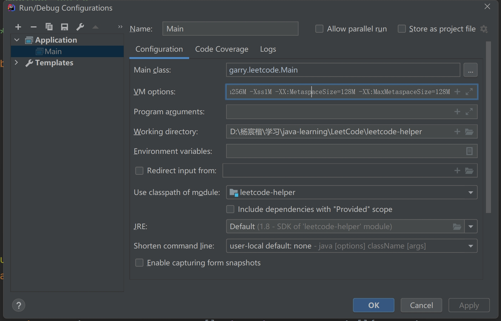

# JVM

## 图解JVM

> Tips: 所有的内容均为专栏的copy，遇到看不懂的直接到对应页面ctrl+F即可

### 2.一探究竟：我们写的Java代码到底是如何运行起来的？

1. ==编译==，这个“.class”后缀的字节码文件，他才是可以被运行起来的！
2. 一旦你采用“java”命令，实际上此时就会启动一个JVM进程。
3. 平时我们写好的某个系统在一台机器上部署的时候，你一旦启动这个系统，其实就是启动了一个JVM，由它来负责运行这台机器上运行的这个系统。
4. 类加载器把编译好的那些“.class”字节码文件给加载到JVM中，然后供后续代码运行来使用。
5. 最后一步，JVM就会基于自己的==字节码执行引擎==，来执行加载到内存里的我们写好的那些类了。
6. 他(JVM)需要哪个类的时候，就会使用类加载器来加载对应的类，反正对应的类就在“.class”文件中。

---


### 3.面试官对于 JVM 类加载机制的猛烈炮火，你能顶住吗？

1. ==加载 -> 验证 -> 准备 -> 解析 -> 初始化 -> 使用 -> 卸载==

2. ==验证阶段==，校验你加载进来的“.class”文件中的内容，是否符合指定的Java虚拟机规范。

3. ==准备阶段==，给加载进来的类分配好了内存空间，类变量也分配好了内存空间，并且给了默认的初始值。

4. ==解析阶段==，把==符号引用替换为直接引用==的过程(暂时不往深了讲)

5. ==初始化==，执行类的初始化代码，比如上面的 `Configuration.getInt(“replica.flush.interval”)` 代码就会在这里执行，完成一个配置项的读取，然后赋值给这个类变量“flushInterval”。

	static静态代码块，也会在这个阶段来执行。

6. 如果初始化一个类的时候，发现他的父类还没初始化，那么必须先初始化他的父类

7. ==启动类加载器==，==Bootstrap ClassLoader==，加载你的JDK安装目录下的“lib”目录中的核心类库

8. ==扩展类加载器==，==Extension ClassLoader==，加载这个“lib\ext”目录中的类

9. ==应用程序类加载器==，==Application ClassLoader==，加载你写好的那些类到内存里

10. 启动类加载器是最上层的，扩展类加载器在第二层，第三层是应用程序类加载器，最后一层是自定义类加载器。

	> 

11. ==双亲委派的机制==，先找父亲去加载(一直传到最高层)，不行的话再由儿子来加载。

	> 

---


### 4.大厂面试题：JVM中有哪些内存区域，分别都是用来干嘛的？

1. 当JVM加载类信息到内存之后，实际就会使用自己的==字节码执行引擎==，去执行我们写的代码编译出来的代码指令

2. “程序计数器”，用来记录当前执行的字节码指令的位置的，也就是记录目前执行到了哪一条字节码指令。

3. 每个线程都会有自己的一个程序计数器，专门记录当前这个线程目前执行到了哪一条字节码指令了

4. 每个线程都有自己的Java虚拟机栈，比如这里的main线程就会有自己的一个Java虚拟机栈，用来存放自己执行的那些方法的局部变量。

5. 如果线程执行了一个方法，就会对这个方法调用创建对应的一个栈帧

6. 同时在main()方法的栈帧里，会存放对应的“replicaManager”局部变量

	> 

7. “Java虚拟机栈”这个组件的作用：(每一个线程)调用执行任何方法时，都会给方法创建栈帧然后入栈(该线程自己的Java虚拟机栈)。在栈帧里存放了这个方法对应的局部变量之类的数据，包括这个方法执行的其他相关的信息，方法执行完毕之后就出栈。

	> 
	>
	> ---
	>
	> 

8. Java堆内存，这里就是存放我们在代码中创建的各种对象的(==所有线程共享一个堆空间==)

	> 

---


### 5.JVM的垃圾回收机制是用来干嘛的？为什么要垃圾回收？

1. 你只要启动一个JVM进程，他就会自带这么一个垃圾回收的后台线程。

2. 如果某个实例对象没有任何一个方法的局部变量指向他，也没有任何一个类的静态变量，包括常量等地方在指向他，即JVM中的“==垃圾==”，就会定期的被后台垃圾回收线程清理掉，不断释放内存资源

3. ==方法区内会不会进行垃圾回收==？

	- 首先该类的所有实例对象都已经从Java堆内存里被回收
	- 其次加载这个类的ClassLoader已经被回收
	- 最后，对该类的Class对象没有任何引用

	满足上面三个条件就可以回收该类了。

---


### 7.第1周答疑：本周问题统一答疑

1. ==问题七==

	Object Header（4字节） + Class Pointer（4字节）+ Fields（看存放类型），但是jvm内存占用是8的倍数，所以结果要向上取整到8的倍数

	==答：==很好，就是这样

2. ==问题十==

	为什么必须要一级一级类加载器的往上找，直接从顶层类加载器开始找不就行了吗？

	==答：==其实关于这个问题，不用过于纠结，每一层类加载器对某个类的加载，上推给父类加载器，到顶层类加载器，如果发现自己加载不到，再下推回子类加载器来加载，这样可以保证绝对不会重复加载某个类。

	至于为什么不直接从顶层类加载器开始找，那是因为类加载器本身就是做的父子关系模型

	你想一下Java代码实现，==他最底下的子类加载器，只能通过自己引用的父类加载器去找==。如果直接找顶层类加载器，不合适的，那么顶层类加载器不就必须硬编码(顶层类加载器不知道子类加载器路径)规定了吗？

	这就是一个代码设计思想，保证代码的可扩展性。

3. ==问题十二==

	还是没有明白 jvm和平时运行在机器上的系统之间是什么关系呢

	==答：==其实很简单，==你运行在机器上的系统，其实就是一个JVM进程，JVM进程会执行你系统里写好的代码==

4. ==问题二十一==

	1. 为什么类的初始化需要执行静态代码块，给静态成员变量赋值，是因为这些数据是在方法区吗？
	2. 启动类、扩展类和自定义加载器都已经指定了加载路径，所以不应该会有重复加载类的问题吧，所以双亲委派是不是没有必要

	==答：==

	1. 没错，类在方法区，他在内存里，所以你必须给他初始化，赋值
	2. 还是有必要，比如启动类加载器，可以通过一些方式指定加载其他目录的类，那么你必须得走双亲委派，如果对那些特殊区域的类加载，走双亲委派，才能上推到启动类加载器去执行，不会重复加载

5. ==问题二十二==

	老师好请问类加载双亲委派机制 为什么要先找父加载 而不是自己找？这种设计的好处是？

	==答：==好处就在于，每个层级的类加载器各司其职，而且不会重复加载一个类。

	==比如你代码里用两个不同层级的类加载器，都去尝试加载了某个类，如果有双亲委派机制，那么都会先找父类加载器去加载，如果加载到了，那么以后就只会是他(父类加载器)去加载这个类。==

	否则如果没有双亲委派机制，那么岂不是两个不同层级的类加载器可以加载同一个类，造成类的重复加载！

6. ==问题二十四==

	看到一个词:动态部署，那么是否也有对应的静态部署?如何解释呢？ (谢老师回答)

	==答：==假设一个背景在Tomcat部署系统的话，那么动态部署，也成为热部署

	==就是直接系统放入Tomcat对应目录，他自动就重新加载你最新的代码给你热部署了，不需要对Tomcat进行停机再重启==；

	反之，则是先停止Tomcat，然后部署最新代码到Tomcat对应目录里，然后重启Tomcat

7. ==问题二十五==

	-XX:+TraceClassLoading 可以看加载了哪些类，动手实验了一下，jre\lib\rt.jar下的类全部加载了，其他都是用到时候加载。

	==答：==没错，明天更新的第三篇文章里，会讲解类加载机制，==rt.jar这属于核心类库，属于支撑我们Java系统运行的底层类库，所以他一定会被加载==

	我们自己写的代码，一般是你代码运行使用到了哪个类，就会去加载哪个类

---


### 8.聊聊JVM分代模型：年轻代、老年代、永久代

1. 其中年轻代，就是把第一种代码示例中的那种，创建和使用完之后立马就要回收的对象放在里面

	然后老年代呢，就是把第二种代码示例中的那种，创建之后需要一直长期存在的对象放在里面

2. JVM里的永久代其实就是我们之前说的方法区，你可以认为永久代就是放一些存放类信息、常量池。

---


### 9.大厂面试题：你的对象在JVM内存中如何分配？如何流转的？

1. ==大部分正常对象都优先在新生代分配内存==

2. 如果==新生代我们预先分配的内存空间，几乎都被全部对象给占满了==！这个时候，就会触发一次新生代内存空间的垃圾回收，新生代内存空间的垃圾回收，也称之为“Minor GC”，有的时候我们也叫“Young GC”，他==会尝试把新生代里那些没有人引用的垃圾对象，都给回收掉==。

3. ==每垃圾回收一次，如果一个对象没被回收掉，他的年龄就会增加1==。“ReplicaFetcher”对象在新生代中成功躲过10多次垃圾回收，==成为一个“老年人”，他会被转移到Java堆内存的老年代中去==。

4. JVM里垃圾回收针对的是新生代，老年代，还有方法区（永久代），==不会针对方法的栈帧==。

	方法一旦执行完毕，==栈帧出栈，里面的局部变量直接就从内存里清理掉了==。

---


### 10.动手实验：亲自感受一下线上系统部署时如何设置JVM内存大小？

1. JVM内存配置中的核心参数：

	> 1. ==-Xms==：Java堆内存的大小
	> 2. ==-Xmx==：Java堆内存的最大大小
	> 3. ==-Xmn==：Java堆内存中的新生代大小，扣除新生代剩下的就是老年代的内存大小了
	> 4. ==-XX:PermSize== (==-XX:MaxMetaspaceSize== since JDK 1.8)：永久代大小
	> 5. ==-XX:MaxPermSize ==(==-XX:MaxMetaspaceSize== since JDK 1.8)：永久代最大大小
	> 6. ==-Xss==：每个线程的栈内存大小

2. IDE中设置JVM参数：

	> 
	>
	> 那么如果是在线上部署系统应该如何设置JVM参数呢？
	>
	> 其实都很简单，比如说采用“java -jar”的方式启动一个jar包里的系统，那么就可以采用下面的格式：
	>
	> ```shell
	> java -Xms512M -Xmx512M -Xmn256M -Xss1M -XX:MetaspaceSize=128M -XX:MaxMetaspaceSize=128M -jar App.jar
	> ```
	>
	> 如果是现在非常流行的那种启动Spring Boot开发的系统呢？
	>
	> Spring Boot其实就是启动的时候可以加上JVM参数，
	>
	> Tomcat就是在bin目录下的catalina.sh中可以加入JVM参数

---


### 11.案例实战：每日百万交易的支付系统，如何设置JVM堆内存大小？

1. 支付系统的压力来源：

	在JVM层面，我们的支付系统最大的压力，就是每天JVM内存里会频繁的创建和销毁100万个支付订单：

	- 我们的支付系统需要部署多少台机器？
	- 每台机器需要多大的内存空间？
	- 每台机器上启动的JVM需要分配多大的堆内存空间？
	- 给JVM多大的内存空间才能支撑这么多的支付订单在内存里的创建，而不会导致内存不够直接崩溃？

2. > 1. 这个系统在日百万交易的压力下，部署3台机器的场景下，每秒钟每台机器需要处理多少笔订单，每笔订单要耗时多久处理，每秒钟会对JVM占据多大内存空间，根据这个横向扩展预估整个系统每秒需要占据多大内存空间。
	> 2. 接着根据上述数据模型推算出，在不同的机器配置之下，你的新生代大致会有多大的内存空间，然后在不同的新生代大小之下，多久会触发一次Minor GC
	> 3. 为了避免频繁的GC，那么应该选用什么样的机器配置，部署多少台机器，给JVM堆内存多大的内存空间，新生代多大的内存空间。

---


### 12.案例实战：每日百万交易的支付系统，JVM栈内存与永久代大小又该如何设置？

1. ==大促期间，瞬时访问量增加十倍==

2. ==少数请求需要几十秒处理，导致老年代内存占用变大==

3. 可能回收掉大量的对象之后，那少数几十MB的对象还在，因为少数请求特别的慢。然后很快新生代继续被填满，再次触发Minor GC，==然后少数几十MB的对象还在，此时多次之后后，就会被转移到老年代去==

	> 
	>
	> ---
	>
	> 

4. ==老年代对象越来越多导致(老年代)频繁垃圾回收==，老年代的垃圾回收速度是很慢的，会极大影响系统的性能

5. 永久代，一般你设置个几百MB，大体上都是够用的

6. 栈内存大小设置，一般默认就是比如512KB到1MB，就差不多够了。

---


### 14.第2周答疑：本周问题答疑，上周作业点评

1. ==问题十二==

	请问老师：

	1、“实例对象都已经从Java堆内存里被回收”和“Class对象没有任何引用”是一个概念么？

	2、 “ClassLoader已经被回收”，什么时候会回收？

	==答：==

	1、不是，Class对象代表类，如果你有变量引用了类的Class对象，那么就是有引用 2、比如你自定义的ClassLoader，本身就是个对象，一旦他没人再使用了，就会被垃圾回收

2. ==问题十五==

	今日思考题：项目中被ioc容器管理的对象，带@Configuration的配置对象，都是长期存在老年代。自己定义那些pojo对象(不被容器管理的对象)，如果不被定义为类对象就是朝生夕灭的，所以分配在年轻代里面。

	==答：==

	非常好，同学

3. ==问题三十九==

	老师, 可以说下, 为什么并发上来了, 压力就会剧增嘛? 哪些方面的压力.

	==答==

	并发上来之后，内存、网络带宽、磁盘IO、数据库，都是系统的瓶颈，比如网络带宽打满，你的请求就会排队卡住，磁盘IO变满，数据库性能下降，都会导致请求处理慢几十倍

---


### 15.大厂面试题：什么情况下JVM内存中的一个对象会被垃圾回收？

1. ==被哪些变量引用的对象是不能回收的？==

	> 1. JVM对每个对象，都分析一下有谁在引用他，然后一层一层往上去判断，看是否有一个GC Roots。
	> 2. ==只要你的对象被方法的局部变量、类的静态变量给引用了，就不会回收他们==。

2. 强引用就是代表绝对不能回收的对象，软引用就是说有的对象可有可无，如果内存实在不够，可以回收。

3. ==finalize()方法的作用==：

	> 假设有一个ReplicaManager对象要被垃圾回收了，如果这个对象重写了Object类中的finialize()方法
	>
	> 此时会==先尝试调用一下他的finalize()方法，看是否把自己这个实例对象给了某个GC Roots变量==

---


### 16.大厂面试题：JVM中有哪些垃圾回收算法，每个算法各自的优劣？

1. 直接对内存区域中的垃圾对象进行标记，造成了大量的内存碎片。==这些内存都是碎片式分散的，所以导致没有一块完整的足够的内存空间来分配新的对象==。

2. ==复制算法==：

	> - 把新生代内存划分为两块内存区域，然后只使用其中一块内存
	>
	> - 待那块内存快满的时候，就把里面的存活对象一次性转移到另外一块内存区域，保证没有内存碎片
	>
	> 	
	>
	> - 接着一次性回收原来那块内存区域的垃圾对象，再次空出来一块内存区域。
	>
	> 	
	>
	> - ==两块内存区域就这么重复着循环使用。==

3. ==复制算法的优化：Eden区和Survivor区==

	> - 
	>
	> - 如果下次再次Eden区满，那么再次触发Minor GC，就会==把Eden区和放着上一次Minor GC后存活对象的Survivor区内的存活对象==，==转移到另外一块Survivor区去==。
	>
	> 	

---


### 17.大厂面试题：年轻代和老年代分别适合什么样的垃圾回收算法？

1. ==躲过15次（默认，可配置）GC之后进入老年代==

2. ==动态对象年龄判断==：

	> 年龄1+年龄2+年龄n的多个年龄对象总和超过了Survivor区域的50%，此时就会把年龄n以上的对象都放入老年代。

3. ==大对象直接进入老年代==

4. ==Minor GC后的对象太多无法放入Survivor区，就必须得把这些对象直接转移到老年代去==

	> 

5. ==老年代空间分配担保规则==

	> 1. Minor GC之前，发现老年代的可用内存已经小于了新生代的全部对象大小，如果配置`“-XX:-HandlePromotionFailure”`参数，就是看看老年代的内存大小，是否大于之前每一次Minor GC后进入老年代的对象的平均大小。
	> 2. 判断失败了，就会直接触发一次“Full GC”，对老年代进行垃圾回收
	> 3. 判断成功了，就可以冒点风险尝试一下Minor GC：
	> 4. 如果Minor GC过后，剩余的存活对象的大小，大于了Survivor区域的大小，也大于了老年代可用内存的大小。此时老年代都放不下这些存活对象了，就会发生“Handle Promotion Failure”的情况，这个时候就会触发一次“Full GC”。
	> 5. 如果要是Full GC过后，老年代还是没有足够的空间存放Minor GC过后的剩余存活对象，那么此时就会导致所谓的“OOM”内存溢出了！

6. ==老年代垃圾回收算法==：==标记整理算法==

	> 让这些存活对象在内存里进行移动，把存活对象尽量都挪动到一边去，让存活对象紧凑的靠在一起，避免垃圾回收过后出现过多的内存碎片，然后再一次性把垃圾对象都回收掉
	>
	> 

---


### 18.大厂面试题：JVM中都有哪些常见的垃圾回收器，各自的特点是什么？

1. ==Serial和Serial Old垃圾回收器：==分别用来回收新生代和老年代的垃圾对象。工作原理就是单线程运行，垃圾回收的时候会停止我们自己写的系统的其他工作线程，让我们系统直接卡死不动，然后让他们垃圾回收，这个现在一般写后台Java系统几乎不用。
2. ==ParNew和CMS垃圾回收器：==ParNew现在一般都是用在新生代的垃圾回收器，CMS是用在老年代的垃圾回收器，他们都是多线程并发的机制，性能更好，现在一般是线上生产系统的标配组合。下周会着重分析这两个垃圾回收器。
3. ==G1垃圾回收器：==统一收集新生代 和老年代，采用了更加优秀的算法和设计机制，是下下周的重点，一周都会来分析G1垃圾回收器的工作原理和优缺点。

---


### 19.“Stop the World”问题分析：JVM最让人无奈的痛点！

1. 因为你的Web系统的JVM正在执行Minor GC，暂停了所有的工作线程，导致你的请求过来到响应返回，这次需要等待几百毫秒。

---


### 21.第3周答疑：本周问题答疑，上周作业点评

1. ==问题==
	问个问题，==为什么老年代不采用复制算法==，像新生代那样一个E两个S呢，或者说为什么新生代不采用标记整理算法呢？还有就是标记清除算法会产生内存碎片，那jvm中是在哪里用到了
	==答==：老年代存活对象太多了，如果采用复制算法，每次都挪动可能90%的存活对象，这就不合适了。所以采用先把存活对象挪动到一起紧凑一些，然后回收垃圾对象的方式。
2. ==问题==
	假设1分钟100个计算任务，每个计算任务是10秒钟，在60秒到来的那一刻，只有50-60秒开始执行的计算任务是没有执行完毕的，占比1/6,100 / 6 = 16.66 。 所以可以大致估算还有20个计算任务还在计算中。
	==答==：是的，线上生产系统大致就是这个比例
3. ==问题==
	关于空间分配担保有一点疑问 当老年代的可用内存空间小于新生代所有对象的总大小时, 无论有没有空间分配担保, 最坏的情况都是一次minor GC + Full Gc
	那为什么还需要这个分配担保?? 直接minor GC, 之后再进行那三种可能的判断不就行了, ==HandlePromotionFail的意义何在==?
	==答==：不是的，如果说没有开启一个检查，此时可能提前Full GC，那么这样就太频繁了；但是如果经过文章里说的检查机制，发现不需要Full GC那么就直接Minor GC；差别在于不需要频繁Full GC

---


### 22.一步一图：深入揭秘JVM的年轻代垃圾回收器ParNew是如何工作的！

1. ==ParNew垃圾回收器默认情况下的线程数量==：默认给自己设置的垃圾回收线程的数量就是==跟CPU的核数是一样的==。因为跟CPU核数一样的线程数量，是可以充分进行并行处理的。
2. ==服务器模式==通常运行我们的网站系统、电商系统、业务系统、APP后台系统之类的==大型系统，一般都是多核CPU==。所以此时如果要垃圾回收，那么肯定是用ParNew更好，因为多线程并行垃圾回收，充分利用多核CPU资源，可以提升性能。
3. Windows个人操作系统上很多都是单核CPU，要是还是用ParNew来进行垃圾回收，就会导致一个CPU运行多个线程，反而加重了性能开销，可能效率还不如单线程好。

---


### 23.一步一图：那JVM老年代垃圾回收器CMS工作时，内部又干了些啥？

1. ==CMS如何实现系统一边工作的同时进行垃圾回收？==：

	> 1. 初始标记
	>
	> 2. 并发标记：对老年代所有对象进行GC Roots追踪
	>
	> 	
	>
	> 3. 重新标记：重新标记下在第二阶段里新创建的对象，还有已有对象可能失去引用变成垃圾的情况
	>
	> 	
	>
	> 4. 并发清理

2. 方法的==局部变量和类的静态变量是GC Roots==。但是====类的实例变量不是GC Roots====。

3. ==最耗时的==，其实就是对老年代全部对相关进行==GC Roots追踪，标记出来到底哪些可以回收，然后就是对各种垃圾对象从内存里清理掉==。

4. 但是他的==第二阶段和第四阶段，都是和系统程序并发执行的==，所以这两个最耗时的阶段对性能影响不大。

5. 只有 第一个阶段和第三个阶段是需要“Stop the World”的，但是这两个阶段都是简单的标记而已，速度非常的快。

---


### 24.动手实验：线上部署系统时，如何设置垃圾回收相关参数？

1. CMS这个并发垃圾回收的机制，第一个问题就是会消耗CPU资源。

2. ==Concurrent Mode Failure问题==

	> 1. 并发清理阶段，CMS只是回收之前标记好的垃圾对象。但是这个阶段系统一直在运行，==可能会随着系统运行让一些对象进入老年代，同时还变成垃圾对象==，这种垃圾对象是“==浮动垃圾==”。
	>
	> 2. CMS只能回收之前标记出来的垃圾对象，不会回收他们，==需要等到下一次GC的时候才会回收他们==。为了保证在CMS垃圾回收期间，==一般会预留一定的内存空间让一些对象可以进入老年代==。
	>
	> 3. 如果CMS垃圾回收期间，==系统程序要放入老年代的对象大于了可用内存空间，会发生Concurrent Mode Failure==。
	>
	> 	> ==此时就会自动用“Serial Old”垃圾回收器替代CMS==，就是直接强行把系统程序“Stop the World”（即在标记完成前，不允许系统再创建新的对象了）

3. ==太多的内存碎片实际上会导致更加频繁的Full GC==，在Full GC之后要再次进行“Stop the World”，进行碎片整理，把存活对象挪到一起。

4. ==为啥老年代的Full GC要比新生代的Minor GC慢很多倍，一般在10倍以上？==

	> 1. 新生代执行速度其实很快，因为==直接从GC Roots出发就追踪哪些对象是活的就行了（Full GC反过来，从所有对象出发，向上找GC Roots，因此检查的对象就多得多了）==，新生代存活对象是很少的，这个速度是极快的，不需要追踪多少对象。
	> 2. CMS的Full GC：
	> 	- 在并发标记阶段，他==需要去追踪所有存活对象==，老年代存活对象很多，这个过程就会很慢；
	> 	- 其次并发清理阶段，他不是一次性回收一大片内存，而是找==到零零散散在各个地方的垃圾对象==，速度也很慢；
	> 	- 最后完事儿了，还得执行一次内存碎片整理，==把大量的存活对象给挪在一起==，空出来连续内存空间，==这个过程还得“Stop the World”==，那就更慢了。
	> 	- 万一并发清理期间，剩余内存空间不足以存放要进入老年代的对象了，引发了==“Concurrent Mode Failure”问题==，那更是麻烦，还得立马==用“Serial Old”垃圾回收器，“Stop the World”之后慢慢重新来一遍回收的过程==，这更是耗时了。

5. ==触发老年代GC的时机==：

	> 1. ==第一==是老年代可用内存小于新生代全部对象的大小，如果没开启空间担保参数，会直接触发Full GC，所以一般空间担保参数都会打开；
	> 2. ==第二==是老年代可用内存小于历次新生代GC后进入老年代的平均对象大小，此时会提前Full GC
	> 3. ==第三==是新生代Minor GC后的存活对象大于Survivor，那么就会进入老年代，此时老年代内存不足。
	> 4. ==第四==是如果老年代可用内存大于平均大小，==但是老年代已经使用的内存空间超过了`"-XX:CMSInitiatingOccupancyFaction”`指定的比例(默认92%)==，也会自动触发Full GC。

---


### 25.案例实战：每日上亿请求量的电商系统，年轻代垃圾回收参数如何优化？

1. 

	> 

---


### 26.案例实战：每日请求上亿的电商系统，老年代的垃圾回收参数又该如何优化呢？

1. ```shell
	-Xms3072M -Xmx3072M -Xmn2048M -Xss1M -XX:PermSize=256M -XX:MaxPermSize=256M -XX:SurvivorRatio=8 -XX:MaxTenuringThreshold=5 -XX:PretenureSizeThreshold=1M -XX:+UseParNewGC -XX:+UseConcMarkSweepGC -XX:CMSInitiatingOccupancyFaction=92 -XX:+UseCMSCompactAtFullCollection -XX:CMSFullGCsBeforeCompaction=0
	```

2. Full GC优化的前提是==Minor GC的优化==，Minor GC的优化的前提是==合理分配内存空间==，合理分配内存空间的前提是==对系统运行期间的内存使用模型进行预估==。

3. ==尽量让Minor GC之后的存活对象留在Survivor里不要去老年代==，然后其余的GC参数不做太多优化，系统性能基本上就不会太差。

---


### 28.第4周答疑：本周问题统一答疑

1. ==问题==

	如果我在tomcat部署多个服务，JVM启动个数是根据服务来算的，还是根据tomcat来算的？我好像只能调试tomcat的堆栈分配情况。麻烦前辈解答下。

	==答：==一个Tomcat启动多个Web应用，那JVM只有一个，就是Tomccat自己，你的Web应用都是一堆代码，由Tomcat根据 配置文件来对指定的请求调用你的代码

2. ==问题==

	看了今天文章，感觉和自己认知有点冲突，我之前一直的认知：minor gc是新生代的gc，major gc是老年代的gc，fullgc是新生代老年代和永久代的gc

	marjor gc是包含在fullgc中的，然后stop the world会在full gc的时候发生,minor gc不会发生。这是我的认知。

	但是文中说minor gc也会stop the world。这就有点冲突了。请老师指正，到底什么时候发生STW

	==答：==看来你可能之前的认识是没有从本质认识垃圾回收和Stop the World

	不管是老年代回收还是新生代回收，都要Stop the World，因为必须让程序别创建新对象，才能回收垃圾对象。

	==Full GC和Major GC其实是一个概念==，都是指的老年代的GC，只不过一般会带着一次==Minor GC，也就是Young GC==，他们是==一个概念多种名词==

3. ==问题==

	之前提到minor gc是很快的，这么多文章看下来没有特别明确说为什么快

	我的理解是:新生代垃圾回收存活很少 且采用了复制算法，比标记整理效率高。 老师还有其他原因？

	==答：==其实就这个原因，存活对象少，迁移内存很快，然后一次性清理垃圾对象，这个速度就是快。

	老年代要先挪动对象压在一起，存活对象那么多，这里涉及到漫长的对象移动的过程，所以速度慢

4. ==问题==

	为什么新生代用的是复制算法?老年代用的是标记整理算法？既然复制算法比较快，为什么老年代不采用新生代的这种优化版的复制算法呢？

	==答：==因为老年代的存活对象太多了，采用复制算法来回挪动大量的对象，效率更差

5. ==问题==

	针对web服务，POJO类一般都是在新生代，而通过@service @controller @component 等注解创建的对象一般都是在老年代。

	针对一些纯java代码的后台跑批服务，基本都是新生代，除了一些通过静态变量或者常量引用的类，或者通过单例创建的类（本质也是通过静态变量引用）。

	==答：==是的，总结的很好

6. ==问题==

	初始标记从GC Roots开始查找直接引用的对象。 并发标记是从对象出发，查看对象是否直接或间接有GC Roots引用 由于并发标记会查看所有对象，且大多数对象都是存活的，所以过程会很耗时。 是这样吗？

	==答：== ====其实并发标记也是从GC Roots出发的====，通过每个对象的引用地址查看哪些对象是存活的，确实因为存活对象一般较多，所以很耗时

7. ==问题==

	老师，有个问题要问您，因为CMS在“初始标记阶段”只标记直接引用。那么在“并发标记阶段”是不是是在初始标记阶段的基础上进行的

	比如初始标记 标记了一个直接引用为A类，那么在并发标记阶段就不用再从A类的GC Roots开始了，直接从A类继续往下找就可以了。然后没有被遍历过的GC Roots接着被遍历就好了。

	==答：==对的，可以节约时间。

8. ==问题==

	请问在初始标记的时候是从GC Root出发找对象还是从老年代的每个对象开始看有没有被GC Root引用, 在并发标记的时候是从GC Root 出发还是第一次被标记过的对象开始, 在标记的过程中采用的是深度优先算法还是广度优先算法?

	==答：== ==初始标记从GC Roots出发，仅仅标记直接引用的对象，但是并发标记也是从GC Roots追踪，只不过要一直顺着引用链条追踪看哪些对象是存活的==

9. ==问题==

	Minor GC前，年轻代中对象的总大小与老年代中可用内存比较，其中，可用内存是指剩余内存空间还是连续可用内存空间

	==答==

	连续可用空间

---


### 29.大厂面试题：最新的G1垃圾回收器的工作原理，你能聊聊吗？

1. G1垃圾回收器是可以同时回收新生代和老年代的对象的，==他最大的一个特点，就是把Java堆内存拆分为多个大小相等的Region==

	> 

2. G1也会有新生代和老年代的概念，但是只不过是==逻辑上的概念==

	> 

3. G1最大的一个特点，就是可以让我们==设置一个垃圾回收的预期停顿时间==！

	> 比如我们可以指定：在1小时内由G1垃圾回收导致的“Stop the World”时间，也就是系统停顿的时间，不能超过1分钟。

4. G1的==核心设计思路==：

	> G1可以做到让你来设定垃圾回收对系统的影响，他自己通过==把内存拆分为大量小Region==，以及==追踪每个Region中可以回收的对象大小和预估时间==，最后在垃圾回收的时候，尽量把垃圾回收对系统造成的影响控制在你指定的时间范围内，同时==在有限的时间内尽量回收尽可能多的垃圾对象==。即选择==最少回收时间和最多回收对象的Region进行垃圾回收==
	>
	> 

5. 在G1对应的内存模型中，==Region随时会属于新生代也会属于老年代==，所以==没有所谓新生代给多少内存，老年代给多少内存这 一说==了

----


### 30.G1分代回收原理深度图解：为什么回收性能比传统GC更好？

1. G1的新生代里还是有Eden和Survivor的划分的

	> 比如新生代之前说刚开始初始的时候，有100个Region，那么可能80个Region就是Eden，两个Survivor各自占10个Region
	>
	> 

2. ==G1提供了专门的Region来存放大对象，而不是让大对象进入老年代的Region中==。

3. 而且==一个大对象如果太大，可能会横跨多个Region来存放==

	> 

---


### 31.动手实验：线上系统部署如果采用G1垃圾回收器，应该如何设置参数？

1. ==什么时候触发新生代+老年代的混合垃圾回收？==

	> `“-XX:InitiatingHeapOccupancyPercent”`，他的默认值是45%
	>
	> 如果==老年代占据了堆内存的45%的Region的时候==，此时就会尝试触发一个新生代+老年代一起回收的混合回收阶段

2. ==G1垃圾回收的过程==

	> 1. “==初始标记==”，需要进入“Stop the World”的，仅仅只是标记一下GC Roots直接能引用的对象，这个过程速度是很快的。
	>
	> 	
	>
	> 2. “==并发标记==”的阶段，这个阶段会允许系统程序的运行，同时进行GC Roots追踪，==从GC Roots开始追踪所有的存活对象==。
	>
	> 	
	>
	> 3. =="最终标记"==阶段，这个阶段会进入“Stop the World”，系统程序是禁止运行的，但是会根据并发标记 阶段记录的那些对象修改，最终标记一下有哪些存活对象，有哪些是垃圾对象
	>
	> 	
	>
	> 4. "==混合回收=="阶段，这个阶段会==计算==老年代中每个Region中的存活对象数量，存活对象的占比，还有执行垃圾回收的预期性能和效率。
	>
	> 	接着会==停止系统程序==，然后全力以赴尽快进行垃圾回收，此时会==选择部分Region进行回收==，因为必须让垃圾回收的停顿时间控制在我们指定的范围内。
	>
	> 	

3. 混合回收==不仅仅是回收老年代，还会回收新生代，还会回收大对象==。

	> ==到底是回收这些区域的哪些Region呢==？
	>
	> 他会==从新生代、老年代、大对象里各自挑选一些Region==，保证用指定的时间（比如200ms）回收尽可能多的垃圾，这就是所谓的混合回收

4. `-XX:G1MixedGCCountTarget`参数，就是在一次混合回收的过程中，==最后一个阶段执行几次混合回收==，默认值是8次

5. ==为什么要反复回收多次呢？==

	> 因为你停止系统一会儿，回收掉一些Region，再让系统运行一会儿，然后再次停止系统一会儿，再次回收掉一些Region，这样可以==尽可能让系统不要停顿时间过长==，可以在多次回收的间隙，也运行一下

6. 在混合回收的时候，==对Region回收都是基于复制算法进行的（无论新生代还是老年代）==，都是把要回收的Region里的存活对象放入其他Region，然后这个Region中的垃圾对象全部清理掉

	> 
	>
	> 这样的话在回收过程就会不断空出来新的Region，==一旦空闲出来的Region数量达到了堆内存的5%==（`“-XX:G1HeapWastePercent”`，默认值是5%），此时就会==立即停止混合回收==，意味着本次混合回收就结束了。

7. `“-XX:G1MixedGCLiveThresholdPercent”`，他的默认值是85%，意思就是确定要回收的Region的时候，==必须是存活对象低于85%的Region才可以进行回收==。否则要是一个Region的存活对象多余85%，你还回收他干什么？这个时候要==把85%的对象都拷贝到别的Region，这个成本是很高的==。

8. ==回收失败时的Full GC==

	> - 万一出现拷贝的过程中==发现没有空闲Region可以承载自己的存活对象了==，就会触发 一次失败。
	>
	> - 一旦失败，立马就会切换为==停止系统程序==，然后==采用单线程进行标记、清理和压缩整理==，空闲出来一批Region，这个过程是==极慢极慢==的。

---


### 32.案例实战：百万级用户的在线教育平台，如何基于G1垃圾回收器优化性能（上）？

1. 所有大致估算一下，一次互动请求大致会连带创建几个对象，占据几KB的内存，比如我们就认为是5KB吧那么==一秒600请求会占用3MB左右的内存==。

---


### 33.案例实战：百万级用户的在线教育平台，如何基于G1垃圾回收器优化性能（下）？

1. G1它本身是这样的一个运行原理，==他会根据你预设的gc停顿时间，给新生代分配一些Region，然后到一定程度就触发gc（而不是必须等到默认60%的时候才GC）==，并且把gc时间控制在预设范围内，尽量避免一次性回收过多的Region导致gc停顿时间超出预期。

2. ==新生代GC的优化==：

	> - 合理设置“-XX:MaxGCPauseMills”参数。
	>
	> - 如果这个参数设置的小了，那么说明每次gc停顿时间可能特别短，此时G1一旦发现你对几十个Region占满了就立即触发新生代gc，然后gc频率特别频繁，虽然每次gc时间很短。
	>
	> - 设置大了，可能一次GC停顿时间就会达到几百毫秒，但是GC的频率很低。比如说30分钟才触发一次新生代GC，但是每次停顿500毫秒。

3. ==mixed gc如何优化？==

	> - 核心的点，还是“-XX:MaxGCPauseMills”这个参数。
	>
	> - 假设你==“-XX:MaxGCPauseMills”参数设置的值很大==，导致系统运行很久，==新生代可能都占用了堆内存的60%了==，此时才触发新生代gc。
	>
	> 	那么==存活下来的对象可能就会很多==，此时就会导致Survivor区域放不下那么多的对象，就会==进入老年代中==。

---


### 35.第5周答疑：本周问题答疑，上周作业点评

1. ==问题：==

	我司的广告系统，使用的就是G1垃圾回收器……因为是一个30G的大堆，传统回收器可能会造成很大的停顿，所以使用了G1

	==回答：==

	对的，==G1非常适合超大内存的机器，因为内存太大，如果不用G1，会导致新生代每次GC回收垃圾太多，停顿时间太长，用了G1可以指定每次GC停顿时间，他会每次回收一部分Region==

2. ==问题：==

	空闲的Region数量达到堆内存的就会停止回收，也就是说正常是8次混合回收，但是可能到了4次，发现空闲Region达到5%了，就不进行后续的混合回收

	==回答：==

	对的

3. ==学员思考题回答：==

	==1. 如果使用G1垃圾回收的时候，应该值得优化的是什么地方？==

	感觉jvm优化的主旋律就是，尽量让短命对象在新生代回收掉，长期存活对象早进入老年代，G1的优化思路亦是如此。

	首先是根据具体业务系统，合理分配老年代和新生代的大小、新生代Eden和Survivor区大小 其次是根据具体业务系统，合理设置G1的MaxGCPauseMills大小。

	太小容易造成回收频繁，影响系统的吞吐量。太大会增大系统的停顿时间，影响用户体验

	==2. 什么时候可能会导致G1频繁的触发Mixed混合垃圾回收？==

	1、InitiatingHeapOccupancyPercent设置的值太小

	2、新生代和老年代空间设置不合理，导致进入老年代对象太多，频繁达到MixedGC的条件 上面两个原因导致频繁的MixedGC

	==3. 如何尽量减少Mixed GC的频率？==

	首先看触发MixedGC的条件是什么，触发MixedGC条件是到老年代达InitiatingHeapOccupancyPercent设置的值，这就会回到如何让老年代尽量不达到这个值的问题。

	1、让垃圾对象尽量在新生代就被回收掉，尽量让短命对象不进老年代。这就要求根据具体应用系统来合理设置新生代Eden大小和Survivor的大小。

	2、将老年代设置为较小的值或者提高InitiatingHeapOccupancyPercent的值，这样就可以使达到触发MixedGC概率降低。但这样可能会存在一些问题：

	（1）设置老年代为较小的值存在的问题：如果有较多的需要长期存活的对象的情况下，容易FullFC或直接OOM了.

	（2）提高InitiatingHeapOccupancyPercent存在的问题：虽然降低了MixedGC的频率，但导致老年代存在过多的对象，增加了每次老年代回收时‘并发标记’阶段的计算负担和‘MixedGC’阶段计算和预估的负担。不适合CPU负载较高的计算型业务的系统

	==回答：非常好的分析解答==

4. ==学员思考题回答：==

	到底为止，大家已经基本学明白了G1的运行原理以及基本的优化思路，那么我想问大家两个问题：

	- G1这种垃圾回收器到底在什么场景下适用呢？
	- 有了G1以后，是不是还有一些场景采用“ParNew+CMS”垃圾回收器也可以呢？

	1、==G1压缩内存空间会比较有优势，适合会产生大量碎片的应用==；

	2、==G1能够可预期的GC停顿时间，对高并发应用更有优势==

	3、其他垃圾收集器对大内存回收耗时较长，G1对内存分成多块区域，能够根据预期停顿时间选择性的对垃圾多的区域进行回收，==适用多核、jvm内存占用大的应用==

	4、parNew+cms回收器比较适用内存小，对象能够在新生代中存活周期短的应用

	==回答：==分析很好

5. ==问题：==

	请问老师我的理解对么：使用系统的用户其实并不关心什么gc频率，但他们关心的是我使用的系统卡不卡，处理速度快不快。==系统卡不卡是受-XX:MaxGCPauseMills影响的。系统处理速度快不快是受gc的频率影响的==。

	“gc的频率高”翻译一下应该是“系统的吞吐量低”，gc频率高说明cpu用来处理垃圾回收的时间比例变多了，自然用来处理业务的cpu时间变少了。比如原先每秒可以取出1w条数据，现在只能取出2k条。

	==回答：==理解正确

---


### 36.糟糕！运行着的线上系统突然卡死无法访问，万恶的JVM GC！

1. 所谓的==复制算法==，说白了，就是对所有的GC Roots进行追踪，去标记出来所有被GC Roots==直接或者间接==引用的对象，他们就是存活对象

2. 新生代采用的==复制算法效率极高==，因为==新生代里存活的对象很少==，只要迅速标记出这少量存活对象，移动到Survivor区，然后回收掉其他全部垃圾对象即可，速度很快。

3. ==什么时候新生代gc对系统影响很大？==

	> ==大内存机器的新生代GC过慢==

4. ==如何解决大内存机器的新生代GC过慢的问题？==

	> ==用G1垃圾回收器==

5. 系统真正最大的问题，就是因为内存分配、参数设置不合理，导致你的对象频繁的进入老年代，然后频繁触发老年代gc，导致系统频繁的每隔几分钟就要卡死几秒钟。

---


### 37.大厂面试题：解释一下什么是Young GC和Full GC？

1. 所谓的==“Minor GC”，也可以称之为“Young GC”==
2. ==老年代gc，称之为“Old GC”更加合适一些==
3. ==Full GC指的是针对新生代、老年代、永久代的全体内存空间的垃圾回收==
4. ==Major GC==面试时可能指Old GC，也可能指Full GC，要问面试官到底指的是什么
5. ==Mixed GC==是G1中特有的概念，老年代占据堆内存的45%了，就要触发Mixed GC

---


### 38.大厂面试题：Young GC和Full GC分别在什么情况下会发生？

1. ==Old GC和Full GC的触发时机==

	> 1. 发生Young GC之前进行检查，如果“老年代可用的连续内存空间” < “新生代历次Young GC后升入老年代的对象总和的平均大小”，说明本次Young GC后可能升入老年代的对象大小，可能超过了老年代当前可用内存空间
	>
	> 2. 执行Young GC之后有一批对象需要放入老年代，此时老年代就是没有足够的内存空间存放这些对象了，此时必须立即触发一次Old GC
	>
	> 3. ==老年代内存使用率超过了92%==，也要直接触发Old GC，当然这个比例是可以通过参数调整的

2. 永久代中的垃圾一般是很少的，因为里面存放的都是一些==类，还有常量池==之类的东西，这些东西==通常来说是不需要回收的==。

3. 如果==永久代真的放满了==，回收之后发现没腾出来更多的地方，此时==只能抛出内存不够的异常==了。

---


### 39.案例实战：每秒10万并发的BI系统是如何频繁发生Young GC的？

1. BI的业务流程：

	> 

2. 数据量增大，采用大内存机器的情况：

	> 
	>
	> Young GC时间过长，可能导致前端超时报错

3. ==用G1来优化大内存机器的Young GC性能==

	> G1会自动控制好在每次Young GC的时候就回收一部分Region，确保GC停顿时间控制在100ms以内
	>
	> 这样的话，也许==Young GC的频率会更高一些，但是每次停顿时间很小==，这样对系统影响就不大了（至少不会出发前端请求过一两秒没有返回就超时报错的情况）。

----


### 40.案例实战：每日百亿数据量的实时分析引擎，为啥频繁发生Full GC ？

1. 针对大内存机器，需要用G1来减少每次Young GC的停顿时间吗？

	==答案是：不用==。因为这是一个==后台自动进行计算的系统，他不是直接面向用户的系统==，所以哪怕每隔2分钟一次Young GC，一次要停顿1秒钟，也对系统几乎没任何影响。

---


### 42.第6周答疑：本周问题答疑汇总！

1. ==学员总结：==

	g1和pn+cms调优原则都是尽可能ygc，不做老年代gc。 g1相对而言更加智能，也意味着jvm会用更多的资源去判断每个region的使用情况。

	而pn+cms也更加纯粹和直接，虽然g1在gc时不会产生碎片，但是由于每个region存在存活率85%不清理的机制，会导致内存没有充分释放问题。

	因此，对于cpu性能高的，内存容量大的，对应用响应度高的系统推荐使用g1。 而内存小，cpu性能比较低下的系统也可以使用pn+cms会更合适。

	==回答：==分析的很好

2. ==学员思考题回答：==

	系统创建的对象被分配到java堆内存中，要想计算创建的对象内所占的内存对象，就需要计算对象的每个部分所占的内存大小；

	java对象包括对象头、实例数据以及对象填充： 对象头包括对象的基本信息以及class的指针类等相关信息占用64bit（64位机器不压缩）；

	数据实例包括八种数据基本类型以及引用类型，将所用的全部算起来相加； 最后再加上对象头，计算8的最低倍数进行是否填充，最终则为所占用的内存空间bit

	==回答：==对的

3. ==学员总结：==

	看了大家的回复，都提到了spring 的bean。除此之外，我觉得还有以下几类长生命周期对象： 线程池的核心线程，coreSize那些，以及他们引用的对象，包括threadlocal引用的对象（除非手动清理） tomcat的各类组件，包括connector和container部分，比如filter，servlet，listener；

	同时，classloader， Class对象这些也是长生命周期； 各类池化技术，比如线程池，连接池等等。 暂时就知道这些吧

	==回答：==是的，很好

---


### 43.动手实验：自己动手模拟出频繁Young GC的场景体验一下！

1. ==如何打印出JVM GC日志？==

	1. `-XX:+PrintGCDetils`：打印详细的gc日志
	2. `-XX:+PrintGCTimeStamps`：这个参数可以打印出来每次GC发生的时间
	3. `-Xloggc:gc.log`：这个参数可以设置将gc日志写入一个磁盘文件

	加上这个参数之后，jvm参数如下所示：

	```shell
	-XX:NewSize=5242880 -XX:MaxNewSize=5242880 -XX:InitialHeapSize=10485760 -XX:MaxHeapSize=10485760 -XX:SurvivorRatio=8 -XX:PretenureSizeThreshold=10485760 -XX:+UseParNewGC -XX:+UseConcMarkSweepGC -XX:+PrintGCDetails -XX:+PrintGCTimeStamps -Xloggc:gc.log
	```

	> 上面“-XX:InitialHeapSize”和“-XX:MaxHeapSize”就是初始堆大小和最大堆大小，“-XX:NewSize”和“-XX:MaxNewSize”是初始新生代大小和最大新生代大小，“-XX:PretenureSizeThreshold=10485760”指定了大对象阈值是10MB。

---


### 44.高级工程师的硬核技能：JVM的Young GC日志应该怎么看？

1. ```shell
	Heap
	
	par new generation total 4608K, used 2601K [0x00000000ff600000, 0x00000000ffb00000, 0x00000000ffb00000) #新生代总内存4608K, 使用2601K
	
	eden space 4096K, 51% used [0x00000000ff600000, 0x00000000ff80a558, 0x00000000ffa00000) #eden区使用51%
	
	from space 512K, 100% used [0x00000000ffa80000, 0x00000000ffb00000, 0x00000000ffb00000) #survivor from区使用100%
	
	to space 512K, 0% used [0x00000000ffa00000, 0x00000000ffa00000, 0x00000000ffa80000) #survivor to区使用0%
	
	concurrent mark-sweep generation total 5120K, used 62K [0x00000000ffb00000, 0x0000000100000000, 0x0000000100000000) #老年代总内存5120K, 使用62k
	
	Metaspace used 2782K, capacity 4486K, committed 4864K, reserved 1056768K #元数据空间
	
	class space used 300K, capacity 386K, committed 512K, reserved 1048576K #方法空间
	```

---


## 深入理解Java虚拟机

### 第6章：类文件结构

1. 
