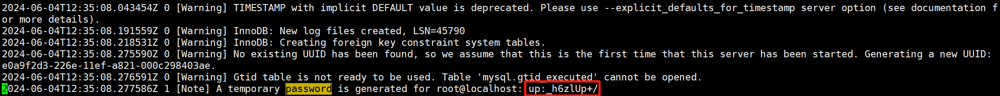

> 参考文献：
>
> 获取mysql5.7.26二进制源码包，以及该文章**"第一至第五步"**：https://cloud.tencent.com/developer/article/2095067
>
> 后续具体操作，即**从"6.8启动mysql服务"开始**：https://cloud.tencent.com/developer/article/2190175

---


### 检测是否已经安装

首先检测是否安装`mariadb`或`mysql`，有则先删除

```bash
rpm -qa | grep mysql

rpm -qa | grep mariadb
```

有则删除：

```bash
rpm -e mysql-libs-5.1.52-1.el6_0.1.x86_64　　# 普通删除模式

rpm -e --nodeps mysql-libs-5.1.52-1.el6_0.1.x86_64　　# 强力删除模式，如果使用上面命令删除时，提示有依赖的其它文件，则用该命令可以对其进行强力删除

rpm -e --nodeps mariadb-libs-5.5.56-2.el7.x86_64
```

> 

---


### 下载安装包并解压

```bash
cd ~/workspace

wget https://dev.mysql.com/get/Downloads/MySQL-5.7/mysql-5.7.26-linux-glibc2.12-x86_64.tar.gz

tar -zxvf mysql-5.7.26-linux-glibc2.12-x86_64.tar.gz -C ./installed
```

由于下载的是二进制源码包，已经编译好了，无需configure，make，make install 等步骤

因此只用将解压的文件复制到`/usr/local`即可

```bash
cd installed

mv mysql-5.7.26-linux-glibc2.12-x86_64 /usr/local

mv mysql-5.7.26-linux-glibc2.12-x86_64/ mysql-5.7.26 # 改名
```

---


### 创建用户，并给数据目录赋予权限

```bash
groupadd mysql

useradd -r -g mysql mysql
```

创建 mysql 数据目录：

```bash
cd /
mkdir -p data
cd data/
mkdir -p mysql
```

赋予权限：

```bash
chown mysql:mysql -R /data/mysql
```

---


### 配置参数

```bash
vim /etc/my.cnf
```

输入以下文件：

```bash
[mysqld]
bind-address=0.0.0.0
port=3306
user=mysql
basedir=/usr/local/mysql-5.7.26
datadir=/data/mysql
socket=/tmp/mysql.sock
log-error=/data/mysql/mysql.err
pid-file=/data/mysql/mysql.pid
#character config
character_set_server=utf8mb4
symbolic-links=0
explicit_defaults_for_timestamp=true
[client]
default-character-set=utf8
[mysql]
default-character-set=utf8
```

---


### 初始化 mysql

```bash
cd /usr/local/mysql-5.7.26/bin/ # 进入bin目录下
```

稍作配置：

```bash
./mysqld --defaults-file=/etc/my.cnf --basedir=/usr/local/mysql-5.7.26/ --datadir=/data/mysql/ --user=mysql --initialize
```

查看 mysql 初始密码：

```bash
cat /data/mysql/mysql.err | grep 'temporary password'
```



---


### 启动 mysql 服务

> 由于在 windows 中我们设置了 mysql 服务开机自启动，而 Linux 没有设置，因此要注意启动 mysql-server 服务之后才能继续使用其 `mysql -uroot -p`客户端。

先将`mysql.server`放置到`/etc/init.d/mysql`中（**重要，否则无法启动 mysql**）

```bash
cp /usr/local/mysql-5.7.26/support-files/mysql.server /etc/init.d/mysql
```

启动 mysql 服务：

```bash
service mysql start
```

> 

---


### 修改密码

登录，密码为`/data/mysql/mysql.err`中的初始密码：

```bash
./mysql -u root -p #bin目录下
```

依次执行：

```mysql
SET PASSWORD = PASSWORD('1234');
ALTER USER 'root'@'localhost' PASSWORD EXPIRE NEVER;
FLUSH PRIVILEGES;
```

---


### Windows 下使用 Navicat 远程连接

开放防火墙：

```bash
firewall-cmd --zone=public --permanent --add-port=3306/tcp

firewall-cmd --reload
```

由于root用户默认只能够本机本地访问，这里要给其它ip地址登录root的权限：

登录mysql执行：

```mysql
use mysql #访问mysql库
update user set host = '%' where user = 'root'; #使root能再任何host访问
FLUSH PRIVILEGES;
```

> 

---


### 配置软连接，让 msyql 命令可以随处使用

```bash
ln -s /usr/local/mysql-5.7.26/bin/mysql /usr/bin
```

---


