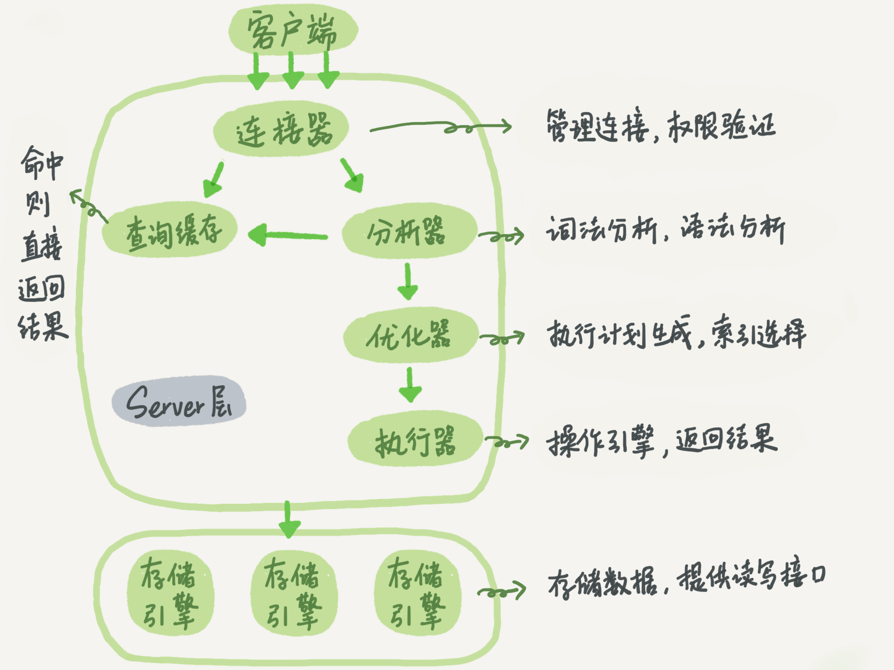
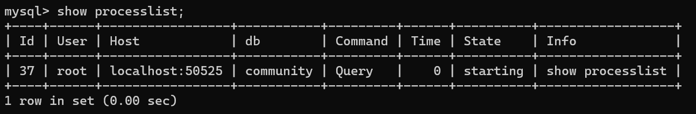
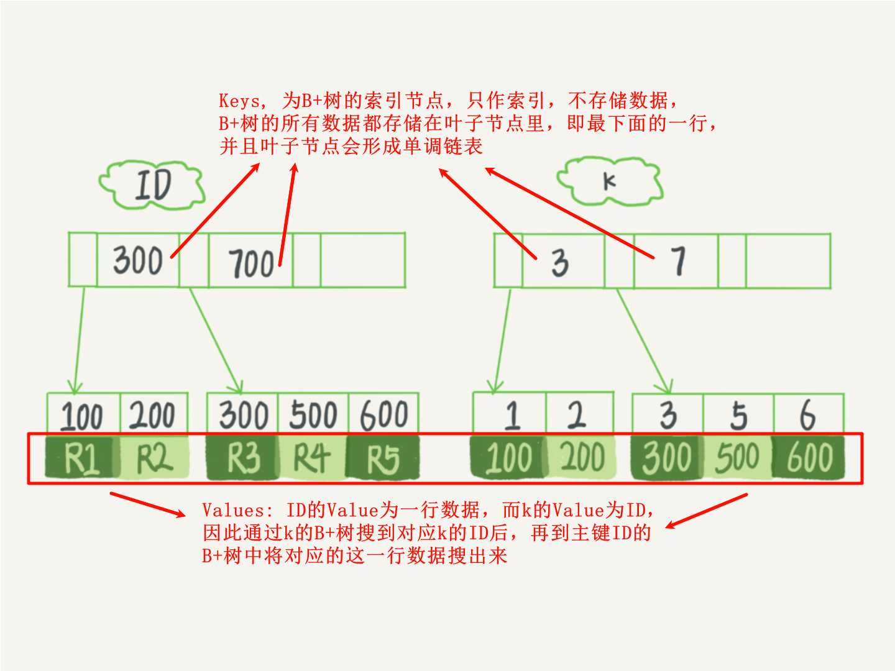
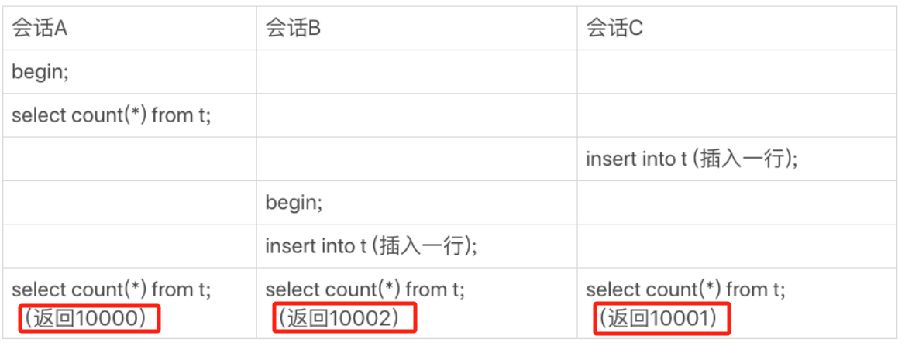
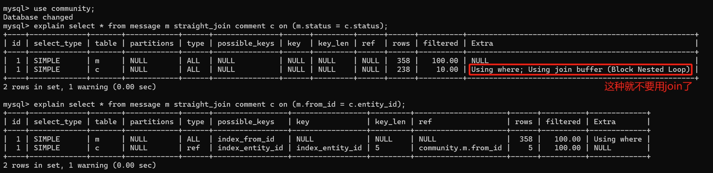

## Mysql45讲

### 1.一条SQL查询语句是如何执行的🌟🌟🌟🌟

> 

1. 可以==使用 `show processlist` 查看当前的客户端连接情况==：

	> 

2. 数据库里面，==长连接是指连接成功后，如果客户端持续有请求，则一直使用同一个连接==。==短连接则是指每次执行完很少的几次查询就断开连接，下次查询再重新建立一个==。==建立连接的过程通常是比较复杂的==，所以我建议你在使用中要尽量减少建立连接的动作，也就是==尽量使用长连接==。

1. MySQL 拿到一个查询请求后，==会先到查询缓存看看，之前是不是执行过这条语句==。之前执行过的语句及其结果可能会以 key-value 对的形式，被直接缓存在内存中。

4. ==但是大多数情况下我会建议你不要使用查询缓存，为什么呢？因为查询缓存往往弊大于利。==

	查询缓存的失效非常频繁，==只要有对一个表的更新，这个表上所有的查询缓存都会被清空==。对于更新压力大的数据库来说，查询缓存的命中率会非常低。==MySQL 8.0 版本直接将查询缓存的整块功能删掉了，也就是说 8.0 开始彻底没有这个功能了==。

5. 如果你的语句==语法不对==，就会收到 “==You have an error in your SQL syntax==” 的错误提醒。

3. 开始执行的时候，要先判断一下你对这个表 T 有没有执行查询的权限，如果没有，就会返回没有权限的错误 `ERROR 1142 (42000): SELECT command denied to user 'b'@'localhost' for table 'T'`

---


### 2.日志：一条SQL更新语句是如何执行的🌟🌟🌟🌟🌟

1. 当有一条记录需要更新的时候，==InnoDB 引擎就会先把记录写到 redo log（粉板）里面，并更新内存，这个时候更新就算完成了==。同时，==InnoDB 引擎会在适当的时候，将这个操作记录更新到磁盘里面==，而这个更新往往是在系统比较空闲的时候做

2. InnoDB 的 ==redo log 是固定大小的==，比如可以配置为一组 4 个文件，每个文件的大小是 1GB，那么这块“粉板”总共就可以记录 4GB 的操作。从头开始写，写到末尾就又回到开头循环写

	> 

3. 有了 ==redo log==，InnoDB 就可以保证即使==数据库发生异常重启，之前提交的记录都不会丢失（数据库原理：在最后一个检查点之后，提交的事务会被写入 redol og，crash 之后根据 redolog 可以恢复检查点之后已经提交的事务）==，这个能力称为 ==crash-safe==。

	> 只要赊账记录记在了粉板上或写在了账本上，之后即使掌柜忘记了，比如突然停业几天，恢复生意后依然可以通过账本和粉板上的数据明确赊账账目。

4. 上面我们聊到的粉板==redo log（重做日志，保证 crash-safe，即 crash 之后恢复检查点后已经提交的事务） 是 InnoDB 引擎特有的日志==，而 ==Server 层也有自己的日志，称为 binlog（归档日志，主要用于恢复数据库）==。

5. ==这两种日志有以下三点不同==。

      > 1. ==redo log 是 InnoDB 引擎特有的==；==binlog 是 MySQL 的 Server 层实现的==，所有引擎都可以用。
      > 2. ==redo log 是物理日志==，记录的是==数据==，“某个表空间中的某个数据页的某个偏移量出做了什么更新”；==binlog 是逻辑日志==，记录的是==语句==，比如“给 ID=2 这一行的 c 字段加 1 ”。
      > 3. ==redo log 是循环写的==，空间固定会用完；==binlog 是可以追加写入的==。“追加写”是指 binlog 文件写到一定大小后会切换到下一个，并不会覆盖以前的日志。

6. ==执行器和 InnoDB 引擎在执行这个简单的 update 语句时的内部流程==：

      > 1. 执行器先找引擎取 ID=2 这一行。ID 是主键，引擎直接用树搜索找到这一行。如果 ID=2 这一行所在的==数据页本来就在内存中，就直接返回给执行器==；否则，需要==先从磁盘读入内存，然后再返回==。
      > 2. 执行器拿到引擎给的行数据，把这个值加上 1，比如原来是 N，现在就是 N+1，得到新的一行数据，再调用引擎接口写入这行新数据。
      > 3. 引擎将这行新数据更新到内存中，同时将这个更新操作记录到 redo log 里面，此时 redo log 处于 ==prepare== 状态。然后告知执行器执行完成了，随时可以提交事务。
      > 4. 执行器生成这个操作的 binlog，并==把 binlog 写入磁盘==。执行器调用引擎的提交事务接口，引擎把刚刚写入的 ==redo log 改成提交（commit）状态==，更新完成。
      >
      > 
      >
      > 将 ==redo log 的写入拆成了两个步骤：prepare 和 commit，这就是“两阶段提交”==

7. 简单说，redo log 和 binlog 都可以用于表示事务的提交状态，而==两阶段提交就是让这两个状态保持逻辑上的一致==。

	> 比如，假设写 redo log 处于 prepare 阶段之后，写 binlog 之前发生了崩溃，由于此时 binlog 还没有写，==redo log 也没有提交，崩溃恢复时这个事务就会回滚==。
	>
	> ==再假设 binlog 写完了，但 redo log 还没 commit 就崩溃==了，这时在==崩溃恢复时系统会判断 binlog 是否是完整的，如果完整，则提交事务，不完整则回滚事务==。
	>
	> ---
	>
	> 如果不使用”两阶段提交”的后果：
	>
	> 1. ==先写 redo log 后写 binlog==：
	>
	> 	假设在 redo log 写完，binlog 还没有写完的时候，MySQL 进程异常重启。由于我们前面说过的，redo log 写完之后，系统即使崩溃，仍然能够把数据恢复回来，所以恢复后这一行 c 的值是 1。但是由于 binlog 没写完就 crash 了，这时候 binlog 里面就没有记录这个语句。因此，==之后备份日志的时候，存起来的 binlog 里面就没有这条语句（恢复数据库用的是 Server 层的 binlog）==。然后你会发现，如果需要用这个 binlog 来恢复临时库的话，由于这个语句的 binlog 丢失，这个==临时库就会少了这一次更新，恢复出来的这一行 c 的值就是 0==，与原库的值不同。
	>
	> 2. ==先写 binlog 后写 redo log==：
	>
	> 	如果在 binlog 写完之后 crash，由于 redo log 还没写，崩溃恢复（crash-safe）以后这个事务无效，所以这一行 c 的值是 0。但是 binlog 里面已经记录了“把 c 从 0 改成 1”这个日志。所以，==在之后用 binlog 来恢复的时候就多了一个事务出来，恢复出来的这一行 c 的值就是 1==，与原库不同。

---


### 3.事务隔离：为什么你改了我还看不见？🌟🌟🌟🌟🌟

1. MySQL 是一个支持多引擎的系统，==但并不是所有的引擎都支持事务==。比如 MySQL 原生的 MyISAM 引擎就不支持事务，这也是 MyISAM 被 InnoDB 取代的重要原因之一。

2. ==隔离级别：==

	> - ==读未提交== (read uncommitted)是指，==一个事务还没提交==时，它做的==变更就能被别的事务看到==。
	> - ==读提交== (read committed)是指，一个事务==提交之后==，它做的==变更会被其他事务看到==。
	> - ==可重复读== (repeatable read)是指，一个==事务执行过程中==看到的数据，总是跟这个事务==在启动时看到的数据是一致的==。当然在可重复读隔离级别下，==自己未提交变更对其他事务也是不可见的==。
	> - ==串行化== (serilizable)，顾名思义是对于同一行记录，“写”会加“写锁”，“读”会加“读锁”。当出现读写锁冲突的时候，后访问的事务必须等前一个事务执行完成，才能继续执行。
	>
	> ---
	>
	> 
	>
	> - 若隔离级别是“读未提交”， 则 V1 的值就是 2。这时候事务 B 虽然还没有提交，但是结果已经被 A 看到了。因此，V2、V3 也都是 2。
	> - 若隔离级别是“读提交”，则 V1 是 1，V2 的值是 2。事务 B 的更新在提交后才能被 A 看到。所以， V3 的值也是 2。
	> - ==若隔离级别是“可重复读”，则 V1、V2 是 1，V3 是 2。之所以 V2 还是 1，遵循的就是这个要求：事务在执行期间看到的数据前后必须是一致的==。
	> - 若隔离级别是“串行化”，则在事务 B 执行“将 1 改成 2”的时候，会被锁住。直到事务 A 提交后，事务 B 才可以继续执行。所以从 A 的角度看， V1、V2 值是 1，V3 的值是 2。

4. ==同一条记录在系统中可以存在多个版本==，就是数据库的==多版本并发控制（MVCC，多个事务编号==）

	> 就是指==同一行数据前面可以有多个事务编号==，表示当前行的数据是被哪一个事务修改后的结果。所谓的“多版本”，就是指==这一行数据被多个事务修改，每一个事务修改完的结果，对应着一个版本==。
	
4. ==事务隔离的实现==：

	> 1. 对于「读未提交」隔离级别的事务来说，因为可以读到未提交事务修改的数据，所以直接读取最新的数据就好了；
	> 2. 对于「串行化」隔离级别的事务来说，通过加读写锁的方式来避免并行访问；
	> 3. 对于「读提交」和「可重复读」隔离级别的事务来说，它们是通过 ==Read View（view: 视图）来实现的，它们的区别在于创建 Read View 的时机不同，大家可以把 Read View 理解成一个数据快照，就像相机拍照那样，定格某一时刻的风景==。
	> 4. ==「读提交」隔离级别是在「每个语句执行前」都会重新生成一个 Read View==。
	> 5. ==「可重复读」隔离级别是「启动事务时」生成一个 Read View，然后整个事务期间都在用这个 Read View==。
	>
	> ==小林 coding 讲得好，MVCC（多版本并发控制）可以看小林 coding：==https://www.xiaolincoding.com/mysql/transaction/mvcc.html#read-view-%E5%9C%A8-mvcc-%E9%87%8C%E5%A6%82%E4%BD%95%E5%B7%A5%E4%BD%9C%E7%9A%84
	
4. 在 MySQL 中，实际上==每条记录在更新的时候（更新的时候就是，修改本行的事务提交的时候）都会同时记录一条回滚操作==。记录上的最新值，通过回滚操作，都可以得到前一个状态的值。

5. ==回滚日志什么时候删除==？系统会判断当==没有事务需要用到这些回滚日志的时候，回滚日志会被删除==。

6. ==什么时候事务不需要该回滚日志==？当系统里==没有比这个回滚日志更早的 read-view== 的时候。

---


### 4.深入浅出索引（上）🌟🌟🌟🌟🌟

1. 在 MySQL 中，==索引是在存储引擎层实现的，不同存储引擎的索引的工作方式并不一样==。

2. ==为什么不用 hashtable==？

	> - 缺点是，因为不是有序的，所以==哈希索引做区间查询的速度是很慢的（没办法在找到第一个之后直接向后遍历得到区间内所有的结果）==。
	> - ==哈希表这种结构适用于只有等值查询的场景==，比如 Memcached 及其他一些 NoSQL 引擎。

3. ==为什么不用有序数组==？

	> - ==有序数组在等值查询和范围查询场景中的性能就都非常优秀==。
	> - ==更新数据的时候就麻烦==了，你==往中间插入一个记录就必须得挪动后面所有的记录，成本太高==。

4. ==为什么不用二叉搜索树==？

      > - 二叉树是搜索效率最高的，但是实际上大多数的数据库存储却并不使用二叉树。其原因是，==索引不止存在内存中，还要写到磁盘上==。为了让一个查询==尽量少地读磁盘（IO操作），就必须让查询过程访问尽量少的数据块（增大数据块的大小）==。
      > - ==不同的节点往往存在磁盘不同的数据页==中，我们将索引加载到内存的时候是==以数据页为单位加载的====（数据页大小16k）==。二叉搜索树高度高，遍历经过的节点数目多；而 ==B+ 树高度低，遍历的节点数目少==，因此 B+ 树完成搜索==需要加载的数据页少==，进行的==磁盘到内存 IO 次数少==。

5. InnoDB 使用了 B+ 树索引模型，所以数据都是存储在 B+ 树中的。每一个索引在 InnoDB 里面对应一棵 B+ 树。

      > 以 InnoDB 的一个整数字段索引为例，这个 N 差不多是 1200。这棵树高是 4 的时候，就可以存 1200 的 3 次方个值，这已经 17 亿了。考虑到树根的数据块总是在内存中的，一个 10 亿行的表上一个整数字段的索引，查找一个值最多只需要访问 3 次磁盘。

3. 根据叶子节点的内容，索引类型分为主键索引和非主键索引。

	> - ==主键索引的叶子节点存的是整行数据==。在 InnoDB 里，主键索引也被称为聚簇索引。
	>
	> - ==非主键索引的叶子节点内容是主键的值==。在 InnoDB 里，非主键索引也被称为二级索引。
	>
	> 
	>
	> - 如果语句是` select * from T where ID=500`，即主键查询方式，则只需要搜索 ID 这棵 B+ 树；
	> - 如果语句是` select * from T where k=5`，即普通索引查询方式，则需要==先搜索 k 索引树，得到 ID 的值为 500，再到 ID 索引树搜索一次。这个过程称为回表==。

4. 基于非主键索引的查询需要多扫描一棵索引树。因此，我们在应用中应该==尽量使用主键查询==。

8. ==自增主键的好处==：自增主键的插入数据模式，正符合了我们前面提到的递增插入的场景。==每次插入一条新记录，都是追加操作，都不涉及到挪动其他记录，也不会触发叶子节点的分裂==。

9. ==显然，主键长度越小，普通索引的叶子节点就越小，普通索引占用的空间也就越小==。所以，从==性能==和==存储空间==方面考量，==自增主键往往是更合理的选择==。

---


### 5.深入浅出索引（下）🌟🌟🌟🌟🌟

1. ==覆盖索引==：`select ID from T where k between 3 and 5`，这时只需要查 ID 的值，而 ID 的值已经在 k 索引树上了，因此可以直接提供查询结果，不需要回表

2. ==最左前缀原则==：索引项是按照==索引定义==里面==出现的字段==的==顺序排序的==。

	> 比如（name，age）这个索引，==它对应的B+树叶子节点构成的链表是先按照name排序，再按照age排序的==。因此如果我们要查询name，可以直接使用这个索引来查，==因为name是该索引最左边的字段，（name，age）链表的顺序和（name）链表的顺序一致==；但是我们不能用（name，age）索引查询age，因为其链表的顺序和（age）链表的顺序显然不一样！

3. ==索引下推==：

	> ```sql
	> select * from tuser where name like '张%' and age = 10 and ismale = 1;
	> ```
	>
	> MySQL 5.6 引入的索引下推优化（index condition pushdown)， 可以在索引遍历过程中，==对索引中包含的字段先做判断，直接过滤掉不满足条件的记录==，减少回表次数。
	>
	> 

---


### 6.全局锁和表锁🌟🌟🌟🌟

1. ==根据加锁的范围，MySQL 里面的锁大致可以分成全局锁、表级锁和行锁三类。==

2. ==全局锁==：

      > 1. ==全局锁的典型使用场景是，做全库逻辑备份==
      > 2. MySQL 提供了一个加==全局读锁==的方法，命令是 ==Flush tables with read lock (FTWRL)==。
      > 3. 官方自带的逻辑备份工具是 mysqldump。当 mysqldump 使用参数 single-transaction 的时候，导数据之前就会启动一个事务，来确保拿到一致性视图。而由于 MVCC 的支持，这个过程中数据是可以正常更新的。
      > 4. 但是 ==single-transaction 方法只适用于所有的表使用事务引擎的库==。如果有的表使用了不支持事务的引擎，那么备份就只能通过 FTWRL 方法。这往往是 DBA 要求业务开发人员使用 InnoDB 替代 MyISAM 的原因之一。
      > 5. 业务的更新不只是增删改数据（DML)，还有可能是加字段等修改表结构的操作（DDL）。不论是哪种方法，一个库被全局锁上以后，你要对里面任何一个表做==加字段操作==，都是会==被全局锁锁住的==。
      > 6. ==为什么不使用 set global readonly=true 的方式呢？==
      > 	- 一是，在有些系统中，readonly 的值会被用来做其他逻辑，修改 global 变量的方式影响面更大，我不建议你使用。
      > 	- 如果执行 ==FTWRL 命令之后由于客户端发生异常断开，那么 MySQL 会自动释放这个全局锁==，整个库回到可以正常更新的状态。而将整个库==设置为 readonly 之后，如果客户端发生异常，则数据库就会一直保持 readonly 状态==，这样会导致整个库长时间处于不可写状态，风险较高。

3. ==表级锁==：

	> 1. ==表锁==：
	>
	> 	- ==表锁的语法是 lock tables … read/write==。
	>
	> 	- 如果在某个线程 A 中执行 lock tables t1 read, t2 write; 这个语句，则==其他线程写 t1、读写 t2 的语句都会被阻塞==。同时，==线程 A 在执行 unlock tables 之前，也只能执行读 t1、读写 t2 的操作。连写 t1 都不允许，自然也不能访问其他表==。
	>
	> 2. ==元数据锁==（meta data lock，MDL)：
	>
	>   - ==MDL 不需要显式使用==，在访问一个表的时候会被==自动加上==。
	>
	>   - 当对一个表做==增删改查操作==的时候，加 ==MDL 读锁==；当要对表做==结构变更==（新增或删除字段，即改变表结构）操作的时候，加 ==MDL 写锁==。
	>   - ==读锁之间不互斥==，因此你可以有==多个线程同时对一张表增删改查==。
	>   - ==读写锁之间、写锁之间是互斥的==，用来保证变更表结构操作的安全性。因此，==如果有两个线程要同时给一个表加字段，其中一个要等另一个执行完才能开始执行==。
	>   - 事务中的 ==MDL 锁==，在语句执行时申请，但是==语句结束后并不会马上释放==，而会==等到整个事务提交后再释放==。
	>
	> 3. 关于 MDL 的一个坑：
	>
	> 	
	>
	> 	- 我们可以看到 session A 先启动，这时候会对表 t 加一个 MDL 读锁。由于 session B 需要的也是 MDL 读锁，因此可以正常执行。
	>
	> 	- ==之后 session C 会被 blocked，是因为 session A 的 MDL 读锁还没有释放，而 session C 需要 MDL 写锁==，因此只能被阻塞。
	> 	- 如果只有 session C 自己被阻塞还没什么关系，==但是之后所有要在表 t 上新申请 MDL 读锁的请求也会被 session C 阻塞==。前面我们说了，==所有对表的增删改查操作都需要先申请 MDL 读锁==，就都被锁住，等于==这个表现在完全不可读写了==。
	>
	> 4. ==如何安全地给小表加字段？==
	>
	> 	- 首先我们要==解决长事务，事务不提交，就会一直占着 MDL 锁==。
	>
	> 	- ==在 alter table 语句里面设定等待时间==，尝试在这个指定的等待时间里面能够拿到 MDL 写锁
	>
	> 		```sql
	> 		ALTER TABLE tbl_name NOWAIT add column ...
	> 		ALTER TABLE tbl_name WAIT N add column ... 
	> 		```
	
4. ==表锁一般是在数据库引擎不支持行锁的时候才会被用到的==。如果你发现你的应用程序里有 lock tables 这样的语句，你需要追查一下，比较可能的情况是：

      >   - 要么是你的系统现在还在==用 MyISAM 这类不支持事务的引擎==，那要安排升级换引擎；
      >
      >   - 要么是你的==引擎升级了，但是代码还没升级==。我见过这样的情况，最后业务开发就是把 lock tables 和 unlock tables 改成 begin 和 commit，问题就解决了。
      >

---


### 7.行锁功过：怎么减少行锁对性能的影响？🌟🌟🌟🌟

1. ==在 InnoDB 事务中，行锁是在需要的时候才加上的，但并不是不需要了就立刻释放，而是要等到事务结束时才释放。这个就是两阶段锁协议==。

	> ==行锁创建的时机是对一行数据进行 DML 操作时==；释放时机则是事务结束时

2. ==如果你的事务中需要锁多个行，要把最可能造成锁冲突、最可能影响并发度的锁尽量往后放==，这样可以减少事务之间的锁等待。因为==最容易造成锁冲突的语句放在后面，它被锁住的时间最短==。

3. ==死锁的解决方式==：

	> 1. 一种策略是，==直接进入等待，直到超时==。这个==超时时间可以通过参数 innodb_lock_wait_timeout== 来设置。
	>
	> 	- ==缺点==：==等待时间过长影响业务；等待时间过短可能把正常事务阻塞误认为是死锁==。
	>
	> 2. 一般采用的策略是，==发起死锁检测==，发现死锁后，==主动回滚死锁链条中的某一个事务==，==让其他事务得以继续执行==。将参数 ==innodb_deadlock_detect 设置为 on==，表示开启这个逻辑。
	>
	> 	- ==缺点==：==死锁检测==是一个时间复杂度是 ==O(n)== 的操作。假设有 ==1000 个并发线程要同时更新同一行==，那么死锁检测操作就是 ==100 万这个量级==的。要==消耗大量的 CPU 资源==。因此，你就会看到 ==CPU 利用率很高，但是每秒却执行不了几个事务==。
	> 	- 一种==缓解死锁检测高 CPU 消耗的方式==是==在数据库服务端控制汇总过来的并发度==。思路是：==对于相同行的更新，在进入引擎之前排队==。这样在==检测时就不用遍历大量线程==了。
	>
	> 3. 你可以考虑通过将一行改成逻辑上的多行来减少锁冲突。
	>
	> 	以影院账户为例，可以考虑放在多条记录上，比如 10 个记录，==影院的账户总额等于这 10 个记录的值的总和==。这样每次要==给影院账户加金额的时候，随机选其中一条记录来加（并发添加时竞争到同一个记录的行锁的概率减少）==。这样每次冲突概率变成原来的 1/10，可减少锁等待个数，也就减少了死锁检测的 CPU 消耗。
	>
	> 	这个方案看上去是无损的，但其实这类方案需要根据业务逻辑做详细设计。如果账户余额可能会减少，比如退票逻辑，那么这时候就需要考虑当一部分行记录变成 0 的时候，代码要有特殊处理。
	
3. 总之：==控制死锁的思路==就是==降低并发访问量==。

4. ==行锁锁的是索引，而不是一行的所有数据==。

      > ```sql
      > select id from table where k = 5 lock in share mode;/*上读锁，防止查询时值被修改*/
      > ```
      >
      > 这里会用到覆盖索引，不会进行回表，因此==主键id索引没有上读锁==。
      >
      > 所以==通过主键索引修改值是可行的==。
      >
      > ```sql
      > update table set k = 6 where id = 5;/*可行，不会被k上的读锁blocked*/
      > ```
      >
      > 上述示例也说明：==锁是加在索引上的==。

---


### 8.事务到底是隔离的还是不隔离的？🌟🌟🌟

1. ==语句更新会生成 undo log（回滚日志==）。那么，==undo log 在哪呢？==

	> 
	>
	> - ==三个虚线箭头，就是 undo log==。
	> - 而 ==V1、V2、V3 并不是物理上真实存在的==，而是每次==需要的时候根据当前版本和 undo log 计算出来的（重要）==。比如，==需要 V2 的时候，就是通过 V4 依次执行 U3、U2 算出来==。

1. 按照可重复读的定义，==一个事务启动的时候，能够看到所有已经提交的事务结果==。但是之后，==这个事务执行期间，其他事务的更新对它不可见==。

2. ==因此，一个事务只需要在启动的时候声明说，“以我启动的时刻为准，如果一个数据版本是在我启动之前生成的，就认；如果是我启动以后才生成的，我就不认，我必须要找到它的上一个版本”。==

2. 当然，==如果“上一个版本”也不可见，那就得继续往前找==。还有，如果==是这个事务自己更新的数据，它自己还是要认的==。

3. InnoDB ==为每个事务构造了一个数组==，用来保存这个事务启动瞬间，当前==正在“活跃”的所有事务 ID==。“==活跃==”指的就是，==启动了但还没提交==。

6. ==这个视图数组和高水位==，就组成了当前事务的==一致性视图（read-view==）。

  > 
  >
  > 1. 如果落在绿色部分，表示这个版本是已提交的事务或者是当前事务自己生成的，数据是可见的；
  > 2. 如果落在红色部分，表示这个版本是由将来启动的事务生成的，是肯定不可见的；
  > 3. 如果落在黄色部分，那就包括两种情况：
  > 	- a. ==若 row trx_id 在数组中，表示这个版本是由还没提交的事务生成的，不可见==；
  > 	- b. 若 row trx_id 不在数组中，表示这个版本是已经提交了的事务生成的，可见。

5. 一个数据版本，对于一个事务视图来说，除了自己的更新总是可见以外，有三种情况：

	> - 版本未提交，不可见；
	> - 版本==已提交==，但是是==在视图创建后提交的，不可见==；
	> - 版本已提交，而且是在==视图创建前提交的，可见==。

6. ==更新数据（update）都是先读后写的，而这个读，只能读当前的值，称为“当前读”（current read）==。

	> ==select 语句如果加锁，也是当前读；不加锁则为一致性读==。
	>
	> 下面这两个 select 语句，就是分别加了读锁（S 锁，共享锁）和写锁（X 锁，排他锁）。
	>
	> ```sql
	> mysql> select k from t where id=1 lock in share mode;
	> mysql> select k from t where id=1 for update;
	> ```

7. ==两阶段锁的情况==：

	> 
	>
	> (1,2) 这个版本上的写锁还没释放。而==事务 B 是当前读，必须要读最新版本==，而且必须加锁，因此就==被 C 锁住了==，必须等到事务 C 释放这个锁，才能继续它的当前读。
	>
	> 我的理解：事务C持有当前的行锁，导致事务B的更新被锁住产生阻塞。因此事务A的查询结果为1。在事务C提交后，事务B继续执行，先查出“当前读”，然后将其加一得到3，并将这一行的事务编号记为51，后面select的时候看到行的事务编号51和自己的编号一样，直接可见，于是查到3。
	
10. ==可重复读的核心就是一致性读==（consistent read）；而事务==更新数据的时候，只能用当前读==。如果当前的记录的==行锁被其他事务占用的话，就需要进入锁等待==。

11. 读提交的逻辑和可重复读的逻辑类似，它们最主要的区别是：

       > - 在==可重复读==隔离级别下，==只需要在事务开始的时候创建一致性视图==，之后事务里的其他查询都共用这个一致性视图；
       > - 在==读提交==隔离级别下，==每一个语句执行前都会重新算出一个新的视图==。

12. ==小结==：

       > - InnoDB 的==行数据有多个版本，每个数据版本有自己的 row trx_id==，==每个事务或者语句有自己的一致性视图==。==普通查询语句是一致性读==，一致性读会根据 row trx_id 和一致性视图确定数据版本的可见性。
       >
       > 	- 对于可重复读，查询只承认在事务启动前就已经提交完成的数据；
       > 	- 对于读提交，查询只承认在语句启动前就已经提交完成的数据；
       >
       > 	而==当前读（如 update 操作），总是读取已经提交完成的最新版本==。

---


### 9.普通索引和唯一索引，应该怎么选择？🌟🌟🌟🌟🌟

1. 普通索引 vs 唯一索引

	> 
	>
	> - 对于普通索引来说，查找到满足条件的第一个记录 (5,500) 后，需要查找下一个记录，直到碰到第一个不满足 k=5 条件的记录（因为==普通索引可能存在重复的 value！==）
	> - 对于唯一索引来说，由于==索引定义了唯一性==，查找到第一个满足条件的记录后，就不会继续检索。
	>
	> ==两者之间的性能差距是多少呢？==
	>
	> 因为==引擎是按页（InnoDB默认每一页16KB，足以保存上千个Key）读写的==，所以说，当找到 k=5 的记录的时候，它所在的数据页就都在内存里了（==按页将数据从磁盘读入内存==）。那么，对于普通索引来说，要多做的那一次“查找和判断下一条记录”的操作，就只需要一次指针寻找和一次计算。可以认为这个操作成本与磁盘 IO 相比可以忽略不计。

2. ==change buffer==：

	> - 当需要更新一个数据页时，如果数据页在内存中就直接更新，而如果这个数据页还没有在内存中的话，在不影响数据一致性的前提下，==InnoDB 会将这些更新操作缓存在 change buffer 中，这样就不需要从磁盘中读入这个数据页了==。
	> - 在==下次查询需要访问这个数据页的时候==，将数据页读入内存，然后==执行 change buffer 中与这个页有关的操作==。通过这种方式就能保证这个数据逻辑的正确性。
	> - ==将 change buffer 中的操作应用到原数据页，得到最新结果的过程称为 merge==。除了访问这个数据页会触发 merge 外，==系统有后台线程会定期 merge==。在==数据库正常关闭（shutdown）的过程中，也会执行 merge 操作==。

3. ==什么条件下可以使用 change buffer 呢？==

	> 1. 对于唯一索引来说，所有的更新操作都要先判断这个操作是否违反唯一性约束。比如，要插入 (4,400) 这个记录，就要==先判断现在表中是否已经存在 k=4 的记录==，而这==必须要将数据页读入内存才能判断（必须要判断成功才会执行，因此不把数据页读到内存就无法判断，但是既然读进来了，那么使用change buffer也就没有意义了）==。如果都已经读入到内存了，那直接更新内存会更快，就没必要使用 change buffer 了。
	> 2. ==唯一索引的更新就不能使用 change buffer==，实际上也只有普通索引可以使用。

4. ==这个记录要更新的目标页不在内存中==。这时，InnoDB 的处理流程如下

	> - 对于唯一索引来说，需要将数据页读入内存，判断到没有冲突，插入这个值，语句执行结束；
	> - ==对于普通索引来说，则是将更新记录在 change buffer，语句执行就结束了==。

5. 两类索引在查询能力上是几乎没差别的，主要考虑的是对更新性能的影响。我建议你==尽量选择普通索引==。

6. ==redo log 主要节省的是随机写磁盘的 IO 消耗（转成顺序写）（redo log有点忘了），而 change buffer 主要节省的则是随机读磁盘的 IO 消耗。==

---


### 10.MySQL为什么有时候会选错索引？🌟🌟🌟🌟

1. MySQL 中一张表其实是可以支持多个索引的。但是，你写 SQL 语句的时候，并没有主动指定使用哪个索引。也就是说，==使用哪个索引是由 MySQL 来确定的==。

2. 优化器选择索引的目的，是找到一个最优的执行方案，并用最小的代价去执行语句。

	> - 在数据库里面，扫描行数是影响执行代价的因素之一。扫描的行数越少，意味着访问磁盘数据的次数越少，消耗的 CPU 资源越少。
	>
	> - ==扫描行数并不是唯一的判断标准==，优化器还会结合==是否使用临时表、是否排序==等因素综合判断。

3. ==扫描行数是怎么判断的？==

	> - MySQL 在真正开始执行语句之前，并不能精确地知道满足这个条件的记录有多少条，而==只能根据统计信息来估算记录数==。这个统计信息就是==索引的“区分度”==。
	> - 一个==索引上不同的值越多==，这个索引的区分度就越好。而一个索引上不同的值的个数，我们称之为“基数”（cardinality）。也就是说，这个==基数越大，索引的区分度越好==。

4. ==MySQL 是怎样得到索引的基数的呢？==

	> - 为什么要采样统计呢？因为把整张表取出来一行行统计，虽然可以得到精确的结果，但是代价太高了，所以==只能选择“采样统计”==。
	> - 采样统计的时候，InnoDB 默认会选择 ==N 个数据页==，统计这些页面上的不同值，得到一个==平均值==，然后==乘以这个索引的页面数==，就得到了这个索引的基数。

5. 在实践中，如果你发现 explain 的结果预估的 rows 值跟实际情况差距比较大，可以==采用 analyze table t 命令，可以用来重新统计索引信息==。

6. ```sql
	explain select * from t where (a between 1 and 1000) and (b between 50000 and 100000) order by b limit 1;
	```

	返回结果中 key 字段显示，这次优化器==选择了索引 b==，而 rows 字段显示需要扫描的行数是 50198。==没有选择只扫描1000行的索引a==。

7. ==索引选择异常和处理==：

	> 1. ==采用 force index(index_key) 强行选择一个索引==
	>
	> 2. ==修改语句，引导 MySQL 使用我们期望的索引==
	>
	> 	```sql
	> 	explain select * from t where (a between 1 and 1000) and (b between 50000 and 100000) order by b, a limit 1;
	> 	```
	>
	> 	- 之前优化器选择使用索引 b，是因为它认为==使用索引 b 可以避免排序==（==b 本身是索引，已经是有序的了，如果选择索引 b 的话，不需要再做排序，只需要遍历==）
	>
	> 3. ==在有些场景下，我们可以新建一个更合适的索引，来提供给优化器做选择，或删掉误用的索引==（经过 DBA 索引优化过的库，再碰到这个 bug，找到一个更合适的索引一般比较难）

---


### 11.怎么给字符串字段加索引？🌟🌟🌟

1. ==MySQL 是支持前缀索引的==，也就是说，==你可以定义字符串的一部分作为索引==。默认地，如果你创建索引的语句不指定前缀长度，那么索引就会包含整个字符串。

2. ```sql
	alter table SUser add index index1(email);
	
	alter table SUser add index index2(email(6));
	```

	> - 第一个语句创建的 index1 索引里面，包含了每个记录的整个字符串；
	> - ==第二个语句创建的 index2 索引里面，对于每个记录都是只取前 6 个字节==（使用前缀索引后，==可能会导致查询语句读数据的次数变多==）

3. ==使用前缀索引，定义好长度，就可以做到既节省空间，又不用额外增加太多的查询成本==。

4. ==使用前缀索引就用不上覆盖索引对查询性能的优化了（因为索引里面没有记录完整的 email 值，只能通过id索引重新查出来）==。

5. 使用 ==count(distinct) 方法查询区分度==。

      ```sql
      select 
        count(distinct left(email,4)）as L4,
        count(distinct left(email,5)）as L5,
        count(distinct left(email,6)）as L6,
        count(distinct left(email,7)）as L7,
      from SUser;
      ```

6. 索引选取的越长，占用的磁盘空间就越大，==相同的数据页能放下的索引值就越少（数据页每一页的数量会受到索引长度的影响，也就是说 Mysql 是按照物理空间大小来划分数据页的，索引越省空间，一个数据页也就能装下越多的数据，查询效率就越高！）==，搜索的效率也就会越低。

7. 既可以占用更小的空间，也能达到相同的查询效率的方法：

	> 1. ==使用倒序存储==，如倒序储存身份证，前缀就是后六位了
	>
	> 2. ==使用 hash 字段==
	>
	>   ```sql
	>   mysql> alter table t add id_card_crc int unsigned, add index(id_card_crc);
	>   ```
	>
	>   ```sql
	>   mysql> select field_list from t where id_card_crc=crc32('input_id_card_string') and id_card='input_id_card_string'
	>   ```
	>
	>   两个不同的身份证号通过 crc32() 函数得到的结果可能是相同的，所以你的查询语句 where 部分要判断 id_card 的值是否精确相同。
	>
	> 3. ==它们的相同点是，都不支持范围查询==。

---


### 12.为什么我的MySQL会“抖”一下？🌟🌟🌟🌟

1. ==当内存数据页跟磁盘数据页内容不一致的时候，我们称这个内存页为“脏页”（脏页是一个内存页）。内存数据写入到磁盘后，内存和磁盘上的数据页的内容就一致了，称为“干净页”。==

2. 你不难想象，==平时执行很快的更新操作，其实就是在写内存和日志==，而 MySQL ==偶尔“抖”一下的那个瞬间，可能就是在刷脏页==（flush）。

3. 刷脏页的时机：

	> 1. ==InnoDB 的 redo log 写满了==。这时候系统会停止所有更新操作，把 checkpoint 往前推进，redo log 留出空间可以继续写。
	> 2. 对应的就是系统内存不足。当需要新的内存页（即从磁盘中读取数据页），而内存不够用的时候，就要淘汰一些数据页，空出内存给别的数据页使用。如果淘汰的是“脏页”，要先将脏页写到磁盘。
	> 3. MySQL 认为系统“空闲”的时候
	> 4. MySQL 正常关闭的情况，MySQL 会把内存的脏页都 flush 到磁盘上

4. ==InnoDB 用缓冲池（buffer pool）管理内存，缓冲池中的内存页有三种状态：==

	> - 第一种是，还没有使用的；
	> - 第二种是，使用了并且是干净页；
	> - 第三种是，使用了并且是脏页。

5. 出现以下这两种情况，都是会==明显影响性能==的：

	> - 一个查询要==淘汰的脏页个数太多==（第二种情况，==淘汰脏页时必须先将其写到磁盘上==），会导致查询的响应时间明显变长；
	> - 日志写满（第一种情况，==此时整个系统不能再进行任何更新==），==更新全部堵住，写性能跌为 0==，这种情况对敏感业务来说，是不能接受的。

6. 你要正确地告诉 InnoDB 所在主机的 IO 能力，`innodb_io_capacity` 这个参数会告诉 InnoDB 你的磁盘能力，==建议你设置成磁盘的 IOPS==。

7. > 

8. 无论是你的查询语句在需要内存的时候可能要求==淘汰一个脏页==，还是由于==刷脏页的逻辑会占用 IO 资源==并可能影响到了你的更新语句，都可能是造成你从业务端感知到 MySQL“抖”了一下的原因。

9. ==平时要多关注脏页比例，不要让它经常接近 75%==。

10. 而 MySQL 中的一个机制，可能让你的查询会更慢：在准备==刷一个脏页的时候，如果这个数据页旁边的数据页刚好是脏页，就会把这个“邻居”也带着一起刷掉==；而且这个把“邻居”拖下水的逻辑还可以继续蔓延。`innodb_flush_neighbors ` 参数就是用来控制这个行为的。在 MySQL 8.0 中，`innodb_flush_neighbors ` 参数的默认值已经是 0 了。

11. 利用 ==WAL== 技术（在使用 WAL 的系统中，所有的修改在提交之前都要先写入 log 文件中），数据库==将随机写转换成了顺序写，大大提升了数据库的性能==。

---


### 13.为什么表数据删掉一半，表文件大小不变？🌟🌟

1. ==将 innodb_file_per_table 设置为 ON==，每个 ==InnoDB 表数据存储在一个以 .ibd 为后缀的文件中==。一个表单独存储为一个文件更容易管理，而且在你不需要这个表的时候，通过 drop table 命令，系统就会直接删除这个文件。

2. 而如果是放在==共享表空间中，即使表删掉了，空间也是不会回收的==。

3. delete 命令只是把记录的位置，或者数据页==标记为了“可复用”==，但==磁盘文件的大小是不会变的==。

4. ==更新索引上的值==，可以理解为==删除一个旧的值，再插入一个新值==。显然，这也是会==造成空洞==的。

	> 如果能够==把这些空洞去掉==，就能达到==收缩表空间==的目的。==方法：重建表==

5. ==重建表==：

  > 1. 可以使用 `alter table A engine=InnoDB` 命令来重建表，MySQL 会==自动完成创建临时表、转存数据、交换表名、删除旧表==的操作。
  >
  > 2.  ==Online DDL（重建表的过程中允许数据的更新，写入临时文件，重建完后写回新表）== 
  >
  > 	

6. ==inplace==（没看懂）：根据表 A 重建出来的数据是放在“tmp_file”里的，这个临时文件是 InnoDB 在内部创建出来的。整个 DDL 过程都在 InnoDB 内部完成。对于 server 层来说，没有把数据挪动到临时表，是一个“原地”操作，这就是“inplace”名称的来源。

---


### 14.count(*)这么慢，我该怎么办?🌟🌟

1. ==为什么 InnoDB 不跟 MyISAM 一样，也把数字存在磁盘呢？==

	> 由于多版本并发控制（==MVCC）的原因==，InnoDB 表“应该==返回多少行”也是不确定的==。
	>
	> 

2. MySQL 优化器会找到最小的那棵树来遍历（==普通索引树的数据量比主键索引树小很多==）。==在保证逻辑正确的前提下，尽量减少扫描的数据量，是数据库系统设计的通用法则之一==。

3. MyISAM vs InnoDB vs ==`show table status`==

	> - ==MyISAM== 虽然 count(*) 很快，但是==不支持事务==；
	> - ==show table status== 命令虽然返回很快，但是==不准确(和索引统计一样采取估算的方法)==；
	> - ==InnoDB== 表直接 count(*) 会==遍历全表==，虽然结果准确，但会导致==性能问题==。

4. 优化反复查询行数的性能

	> 1. ==将计数保存在缓存系统中的方式，还不只是丢失更新的问题。即使 Redis 正常工作，这个值还是逻辑上不精确的（无法满足一致性，如获取的 count 是 100，但实际上数据有 101）==。
	>
	> 2. 在==数据库保存计数==，既然缓存无法满足一致性，那我==开事务来查就一致了==。
	>
	> 	
	>
	> 	会话B中查到的值为 100（==会话 A 未提交、不可见==），事务中实际行数 100。

5. count(\*)、count(主键 id) 和 count(1) 都表示返回满足条件的结果集的总行数；而 ==count(字段），则表示返回满足条件的数据行里面，参数“字段”不为 NULL 的总个数：count(字段)$\leqslant$count(*)==。

6. ==count(1) 执行得要比 count(主键 id) 快==。因为从引擎返回 id 会涉及到解析数据行、拷贝字段值的操作。

7. ==server 层要什么字段，InnoDB 就返回什么字段==。

	但是 ==count(\*) 是例外==，并==不会把全部字段取出来==，而是专门做了优化，不取值。

8. 效率排序的话，==count(字段) < count(主键 id) < count(1) ≈ count(*)==，==尽量使用 count(*)==

---


### 15.答疑文章（一）：日志和索引相关问题🌟🌟🌟🌟🌟

1. ==时刻 B，也就是 binlog 写完，redo log 还没 commit 前发生 crash==，那 MySQL 会怎么处理？

	> 
	>
	> 1. 如果 redo log 里面的事务是完整的，也就是已经有了 commit 标识，则直接提交；
	> 2. 如果 redo log 里面的事务只有完整的 prepare，则==判断对应的事务 binlog 是否存在并完整==：a. 如果是，则提交事务；b. 否则，回滚事务。

2. ==MySQL 怎么知道 binlog 是完整的==?

	> - statement 格式的 binlog，最后会有 COMMIT；
	> - row 格式的 binlog，最后会有一个 XID event。

3. ==redo log 和 binlog 是怎么关联起来的==?

	> 回答：它们有一个共同的数据字段，叫 XID。崩溃恢复的时候，会按顺序扫描 redo log：
	>
	> - 如果碰到既有 prepare、又有 commit 的 redo log，就直接提交；
	> - 如果碰到只有 parepare、而没有 commit 的 redo log，就拿着 XID 去 binlog 找对应的事务。

4. ==binlog 没有崩溃恢复的能力，binlog 没有能力恢复“数据页”==。

  > - ==InnoDB 引擎使用的是 WAL 技术==，执行事务的时候，写完内存和日志，事务就算完成了。如果之后崩溃，要依赖于日志来恢复数据页。
  > - 以下是只使用 binlog 的流程图：
  >
  > 
  >
  > - 也就是说在图中这个位置发生崩溃的话，==事务 1 也是可能丢失了的，而且是数据页级的丢失==。此时，binlog 里面并没有记录数据页的更新细节，是补不回来的。

5. ==那能不能反过来，只用 redo log，不要 binlog==？

	> - 一个是归档。==redo log 是循环写==，写到末尾是要回到开头继续写的。==这样历史日志没法保留==，==redo log 也就起不到归档的作用==。
	>
	> - 一个就是 MySQL 系统依赖于 binlog。binlog 作为 MySQL 一开始就有的功能，被用在了很多地方。其中，MySQL 系统高可用的基础，就是 binlog 复制。

6. ==正常运行中的实例，数据写入后的最终落盘，是从 redo log 更新过来的还是从 buffer pool 更新过来的呢==？

	> 实际上，==redo log 并没有记录数据页的完整数据==，所以==它并没有能力自己去更新磁盘数据页==，也就不存在“数据最终落盘，是由 redo log 更新过去”的情况。
	>
	> 1. 如果是正常运行的实例的话，数据页被修改以后，跟磁盘的数据页不一致，称为脏页。最终==数据落盘，就是把内存中的数据页写盘==。这个过程，甚至==与 redo log 毫无关系==。
	> 2. 在崩溃恢复场景中，InnoDB 如果判断到一个数据页可能在崩溃恢复的时候丢失了更新，就会将它读到内存，然后让 redo log 更新内存内容（==redo log 的功能是崩溃后将原内存中丢失的数据恢复到内存中，而写入磁盘则是恢复的内存页的任务==）。更新完成后，内存页变成脏页，就回到了第一种情况的状态。

7. ==redo log buffer 是什么？是先修改内存，还是先写 redo log 文件==？

	> 这个事务要往两个表中插入记录、插入数据的过程中，生成的日志都得先保存起来，但又==不能在还没 commit 的时候就直接写到 redo log 文件里==。
	>
	> 所以，==redo log buffer 就是一块内存，用来先存 redo 日志的==。也就是说，在执行第一个 insert 的时候，数据的内存被修改了，redo log buffer 也写入了日志。
	>
	> 但是，==真正把日志写到 redo log 文件，是在执行 commit 语句的时候==。

---


### 18.为什么这些SQL语句逻辑相同，性能却差异巨大？🌟🌟🌟🌟🌟

1. 使用==聚合函数==：
	
	```sql
	select count(*) from tradelog where month(t_modified)=7;
	```
	
	> 
	>
	> 传入 7 的时候，在树的第一层就不知道该怎么办了。
	>
	> ==对索引字段做函数操作，可能会破坏索引值的有序性，因此优化器就决定放弃走树搜索功能。（这就是为什么使用聚合函数会导致索引"失效"的原因）==
	
2. 可以使用索引的同义语句，避开使用聚合函数而使用索引：

	```sql
	select count(*) from tradelog where
	    (t_modified >= '2016-7-1' and t_modified<'2016-8-1') or
	    (t_modified >= '2017-7-1' and t_modified<'2017-8-1') or 
	    (t_modified >= '2018-7-1' and t_modified<'2018-8-1');
	```

3. 不过优化器在个问题上确实有“偷懒”行为，即使是==对于不改变有序性的函数，也不会考虑使用索引==。

	> 比如，对于 `select * from tradelog where id + 1 = 10000` 这个 SQL 语句，这个加 1 操作并不会改变有序性，但是 MySQL 优化器还是不能用 id 索引快速定位到 9999 这一行。所以，需要你在写 SQL 语句的时候，==手动改写成 where id = 10000 -1 才可以==。

4. ==隐式类型转换==：
	
	```sql
	select * from tradelog where tradeid(varchar 6) = 110717;
	```
	
	> 其中 tradeid 的类型为 varchar(6)，由于==字符串和数字做比较的话，是将字符串转换成数字==，tradeid 是字符串，因此会被隐式转换为数字，这个语句相当于：
	>
	> ```sql
	>select * from tradelog where cast(tradeid AS signed int) = 110717;
	> ```
	
5. id 的类型是 int，如果执行下面这个语句，是否会导致全表扫描呢？

	```sql
	select * from tradelog where id = "83126";
	```

	> 验证结果是：==不会全表扫描，可以正常使用索引==
	>
	> 因为 Mysql 涉及到字符串和数字的比较时，==会自动将字符串常量转为数字==，因此不会对 id 使用聚合函数

6. ==隐式字符类型转换==：
	
	```sql
	select * from trade_detail where tradeid=$L2.tradeid.value; 
	```
	
	> 其中，$L2.tradeid.value 的==字符集==是 utf8mb4，而trade_detail.tradeid的==字符集==是 utf8 。
	>
	> 参照前面的两个例子，你肯定就想到了，==字符集 utf8mb4 是 utf8 的超集==，所以当这两个类型的字符串在做比较的时候，MySQL 内部的操作是，==先把 utf8 字符串转成 utf8mb4 字符集，再做比较==
	>
	> ==等同于下面这个写法==：
	>
	> ```sql
	> select * from trade_detail where CONVERT(traideid USING utf8mb4)=$L2.tradeid.value; 
	> ```
	>
	> 字符集不同只是条件之一，==连接过程中要求在被驱动表的索引字段上加函数操作==，是直接导致对被驱动表做全表扫描的原因。
	
7. 将上述的语句改变后即可用索引：

	> ```sql
	> select l.operator from tradelog l ,trade_detail d where d.tradeid=l.tradeid and d.id=4;
	> ```
	>
	> 因为此时查的是 tradelog 中的 tradeid，而 tradelog 的字符集更大，因此==只需将那一行的 d.tradeid 向上转成 utf8mb4 即可，而不需要对 tradelog.tradeid 使用聚合函数==

8. 总结：==对索引字段做函数操作，可能会破坏索引值的有序性，因此优化器就决定放弃走树搜索功能==。

---


### 19.为什么我只查一行的语句，也执行这么慢？🌟🌟🌟🌟🌟

1. ==等 MDL 锁==，这个状态表示的是，现在有一个线程正在表 t 上请求或者持有 MDL 写锁（MDL 为表级锁，MDL 写锁会在表的字段被修改时自动加上），把 select 语句堵住了。

  > 通过查询 sys.schema_table_lock_waits 这张表，我们就可以直接找出造成阻塞的 process id，把这个连接用 kill 命令断开即可。
  >
  > ```sql
  > select blocking_pid from sys.schema_table_lock_waits;
  > ```
  >
  > 

2. ==等 flush==，MySQL 里面对表做 flush 操作的用法，一般有以下两个：

  ```sql
  flush tables t with read lock;
  flush tables with read lock;
  ```

  > - 但是正常==这两个语句执行起来都很快，除非它们也被别的线程堵住了==。
  >
  > - 所以，==出现 Waiting for table flush 状态的可能情况是：有一个 flush tables 命令被别的语句堵住了，然后它又堵住了我们的 select 语句==。
  > - ==找出造成阻塞的 process id，把这个连接用 kill 命令断开即可==。

3. ==等行锁==，问题是怎么查出是谁占着这个写锁。如果你用的是 MySQL 5.7 版本，可以通过`sys.innodb_lock_waits ` 表查到。

	> 查询方法是：
	>
	> ```sql
	> select * from sys.innodb_lock_waits where locked_table='`test`.`t`';
	> ```
	>
	> 
	>
	> 4 号线程是造成堵塞的罪魁祸首。而干掉这个罪魁祸首的方式，就是 KILL 4。

4. ==查询慢（一致性读 vs 当前读）==：

	> ```sql
	> select * from t where id=1;
	> ```
	>
	> 虽然扫描行数是 1，但执行时间却长达 800 毫秒。
	>
	> 
	>
	> ```sql
	> select * from t where id=1 lock in share mode;
	> ```
	>
	> 执行时扫描行数也是 1 行，执行时间是 0.2 毫秒。
	>
	> 
	>
	> 看上去是不是很奇怪？按理说 lock in share mode 还要加锁，时间应该更长才对啊。
	>
	> 这两个语句的执行输出结果。
	>
	> 
	>
	> 第一个语句的查询结果里 c=1，带 lock in share mode 的语句返回的是 c=1000001。
	>
	> 两个查询的实际情况图：
	>
	> 
	>
	> 
	>
	> ==session B 更新完 100 万次，生成了 100 万个回滚日志 (undo log)。==
	>
	> ==带 lock in share mode 的 SQL 语句，是当前读==，因此会直接读到 1000001 这个结果，所以速度很快；而 ==select * from t where id=1 这个语句，是一致性读（对他来说100万次数据的更新不可见，因此必须根据undo log，找到事务B发生前的状态，而执行100万次undo log花费了很多时间）==，因此需要从 1000001 开始，依次执行 undo log，执行了 100 万次以后，才将 1（事务B执行前该行的数据） 这个结果返回。
	>
	> 注意：==undo log 里记录的其实是“把 2 改成 1”，“把 3 改成 2”这样的操作逻辑==，画成减 1 的目的是方便你看图。

5. 小结：执行“==查一行==”，可能会出现的==被锁住==和==执行慢==的例子。其中涉及到了==表锁、行锁==和==一致性读==的概念。

---


### 20.幻读是什么，幻读有什么问题？🌟🌟🌟🌟🌟

1. ```sql
	CREATE TABLE `t` (
	  `id` int(11) NOT NULL,
	  `c` int(11) DEFAULT NULL,
	  `d` int(11) DEFAULT NULL,
	  PRIMARY KEY (`id`),
	  KEY `c` (`c`)
	) ENGINE=InnoDB;
	insert into t values(0,0,0),(5,5,5),
	(10,10,10),(15,15,15),(20,20,20),(25,25,25);
	```

1. 由于字段 d 上没有索引，因此这条查询语句会做==全表扫描==。那么，==其他被扫描到的，但是不满足条件的 5 行记录上，会不会被加锁呢==？

	> 先看下==不对其它查询到的行加锁的情况（注意RR会对查询到的所有行加锁）==：
	>
	> 
	>
	> Q2 和 Q3 两次查询结果不一致（特别地Q3的行数更多了），被称为“幻读”。也就是说，==幻读指的是一个事务在前后两次查询同一个范围的时候，后一次查询看到了前一次查询没有看到的行==。

2. ==幻读的说明==：

	> 1. 在==可重复读==隔离级别下，==普通的查询是快照读（select不加锁的情况）==，是==不会看到别的事务插入的数据的==。因此，==幻读在“当前读”（加读写锁、update前的'select'）下才会出现==。
	> 2. 上面 ==session B 的修改（update）结果，被 session A 之后的 select 语句用“当前读”看到，不能称为幻读==。==幻读仅专指“新插入的行”==。

4. ==幻读的问题==：

      > 1. ==语义上的问题==：
      >
      > 	- session A 在 T1 时刻就声明了，“==我要把所有 d=5 的行锁住，不准别的事务进行读写操作==”。
      >
      > 		
      >
      > 	- session B 的第二条语句 update t set c=5 where id=0，语义是“==我把 id=0、d=5 这一行的 c 值，改成了 5”（这与sessionA的行锁的声明相违背，sessionA还没有释放行锁，但是其它事务却可以修改理应被锁上的d=5的行）==。
      >
      > 2. ==数据一致性的问题==：这个一致性，不止是数据库内部数据状态在此刻的一致性，==还包含了数据和日志在逻辑上的一致性==。
      >
      > 	- 
      >
      > 	-  binlog 里面的内容，统一放到一起的话，就是这样的：
      >
      > 		```sql
      > 		update t set d=5 where id=0; /*(0,0,5)*/
      > 		update t set c=5 where id=0; /*(0,5,5)*/
      > 		insert into t values(1,1,5); /*(1,1,5)*/
      > 		update t set c=5 where id=1; /*(1,5,5)*/
      > 		update t set d=100 where d=5;/*所有d=5的行，d改成100(事务A在T6的时候才提交)*/
      > 		```
      >
      > 		这个语句序列，不论是拿到备库去执行，还是以后用 binlog 来克隆一个库，这三行的结果，都变成了 (0,5,100)、(1,5,100) 和 (5,5,100) /\*本来应该是(0,5,5)、(1,5,5)\*/。
      >
      > 3. ==那把扫描到的每一行都加上写锁呢==？
      >
      > 	- 
      >
      > 	  > 全局扫描导致所有行都被加写锁，因此 ==sessionB 是所有语句都被 blocked==，而 s==essionC 中因为是 insert，因此新加的行没有被上锁，可以正常修改==。
      > 	
      > 	  ```sql
      > 	  insert into t values(1,1,5); /*(1,1,5)*/
      > 	  update t set c=5 where id=1; /*(1,5,5)*/
      > 	  update t set d=100 where d=5;/*所有d=5的行，d改成100*/
      > 	  update t set d=5 where id=0; /*(0,0,5)*/
      > 	  update t set c=5 where id=0; /*(0,5,5)*/
      > 	  ```
      >
      > 	  id=1 这一行，在数据库里面的结果是 (1,5,5)，而根据 binlog 的执行结果是 (1,5,100)，也就是说==幻读的问题还是没有解决==。
      >
      > 	- 原因：在 T3 时刻，我们给所有行加锁的时候，==id=1 这一行还不存在，不存在也就加不上锁==。
      > 	
      > 		==也就是说，即使把所有的记录都加上锁，还是阻止不了新插入的记录。==

4. ==解决幻读的方法==：

	> 1. 因此，为了解决幻读问题，InnoDB 只好引入新的锁，也就是==间隙锁== (Gap Lock)。
	>
	> 	
	>
	> 2. 当你执行 `select * from t where d=5 for update` 的时候，就不止是给数据库中已有的 6 个记录加上了行锁，==还同时加了 7 个间隙锁==。这样就==确保了无法再插入新的记录==。
	>
	> 3. 间隙锁不一样，==跟间隙锁存在冲突关系的，是“往这个间隙中插入一个记录”这个操作==。 ==间隙锁之间都不存在冲突关系==。
	>
	> 4. ==间隙锁和行锁合称 next-key lock==，==每个 next-key lock 是前开后闭区间==。
	>
	> 5. 
	>
	> 	这里 session B 并不会被堵住。因为表 t 里并没有 c=7 这个记录，因此 ==session A 加的是间隙锁 (5,10)==。而 ==session B 也是在这个间隙加的间隙锁==。它们有共同的目标，即：保护这个间隙，不允许插入值。但，==它们之间是不冲突的==。

5. ==间隙锁造成死锁==的例子：

	> 1. 
	> 	1. session A 执行 select … for update 语句，由于 id=9 这一行并不存在，因此会加上间隙锁 (5,10);
	> 	2. session B 执行 select … for update 语句，同样会加上间隙锁 (5,10)，间隙锁之间不会冲突，因此这个语句可以执行成功；
	> 	3. session B 试图插入一行 (9,9,9)，==被 session A 的间隙锁挡住了==，只好进入等待；
	> 	4. session A 试图插入一行 (9,9,9)，==被 session B 的间隙锁挡住了==。
	> 2. ==间隙锁的引入，可能会导致同样的语句锁住更大的范围，这其实是影响了并发度的==。

6. ==间隙锁是在可重复读隔离级别下才会生效的==。所以，你==如果把隔离级别设置为读提交的话，就没有间隙锁了==。但同时，你要==解决可能出现的数据和日志不一致问题，需要把 binlog 格式设置为 row==。这，也是现在不少公司使用的配置组合。

---


### 21.为什么我只改一行的语句，锁这么多？🌟🌟🌟🌟

1. ==两个“原则”、两个“优化”和一个“bug”（默认在 RR 级别下）==：

	> 1. 原则 1：==加锁的基本单位是 next-key lock==。希望你还记得，next-key lock 是前开后闭区间。
	> 2. 原则 2：==查找过程中访问到的对象才会加锁==。
	> 3. 优化 1：索引上的==等值查询==，给==唯一索引==加锁的时候，next-key lock ==退化为行锁==。
	> 4. 优化 2：索引上的==等值查询==，==向右遍历==时且最后一个值==不满足等值条件的时候==，==next-key lock 退化为间隙锁==。
	> 5. 一个 bug：==唯一索引==上的==范围查询==会访问到==不满足条件的第一个值为止==。

2. ```sql
	CREATE TABLE `t` (
	  `id` int(11) NOT NULL,
	  `c` int(11) DEFAULT NULL,
	  `d` int(11) DEFAULT NULL,
	  PRIMARY KEY (`id`),
	  KEY `c` (`c`)
	) ENGINE=InnoDB;
	insert into t values(0,0,0),(5,5,5),
	(10,10,10),(15,15,15),(20,20,20),(25,25,25);
	```

3. ==案例一：等值查询间隙锁==

  > 
  >
  > - 根据原则 1，加锁单位是 next-key lock，session A 加锁范围就是 (5,10]；
  > - 同时根据优化 2，这是一个==等值查询 (id=7)，而 id=10 不满足查询条件，next-key lock 退化成间隙锁==，因此最终加锁的范围是 (5,10)。
  > - 所以，session B 要往这个间隙里面插入 id=8 的记录会被锁住，但是 session C 修改 id=10 可行。

4. ==案例二：非唯一索引等值锁==：

  > 
  >
  > - 根据原则 1，加锁单位是 next-key lock，因此会==给 (0,5]加上 next-key lock==。
  > - 要注意 c 是==普通索引（不是唯一索引，因此即使查到了也要向右遍历到第一个不满足的节点为止）==，因此仅访问 c=5 这一条记录是不能马上停下来的，需要向右遍历，查到 c=10 才放弃。根据原则 2，访问到的都要加锁，因此要给 (5,10]加 next-key lock。
  > - 但是同时这个符合优化 2：等值判断，向右遍历，最后一个值不满足 c=5 这个等值条件，因此退化成间隙锁 (5,10)。
  > - 根据原则 2 ，==只有访问到的对象才会加锁==，这个查询使用覆盖索引，并不需要访问主键索引，所以主键索引上没有加任何锁，这就是为什么 session B 的 update 语句可以执行完成。

5. ==案例三：主键索引范围锁==：

  > 
  >
  > - 开始执行的时候，要找到第一个 id=10 的行，因此本该是 next-key lock(5,10]。 根据优化 1， 主键 id 上的等值条件，退化成行锁，只加了 id=10 这一行的行锁。
  > - 范围查找就==往后继续找，找到 id=15 这一行停下来，因此需要加 next-key lock(10,15]==。
  >
  > ==首次 session A 定位查找 id=10 的行的时候，是当做等值查询来判断的==，而==向右扫描到 id=15 的时候，用的是范围查询判断==。

6. ==案例四：非唯一索引范围锁==：

  > 
  >
  > - 在第一次用 c=10 定位记录的时候，索引 c 上加了 (5,10]这个 next-key lock 后，由于==索引 c 是非唯一索引，没有优化规则==，也就是说==不会蜕变为行锁==，因此最终 sesion A 加的锁是，索引 c 上的==(5,10] 和 (10,15] 这两个 next-key lock==。
  > - 所以从结果上来看，sesson B 要插入（8,8,8) 的这个 insert 语句时就被堵住了。

7. ==案例五：唯一索引范围锁 bug==：

  > 
  >
  > ==InnoDB 会往前扫描到第一个不满足条件的行为止，也就是 id=20==。而且由于这是个范围扫描，因此索引 id 上的 (15,20]这个 next-key lock 也会被锁上。

8. ==案例六：非唯一索引上存在”等值”的例子==：

	> 
	> 
	> 虽然有两个 c=10，但是它们的主键值 id 是不同的（分别是 10 和 30），因此==这两个 c=10 的记录之间，也是有间隙的==。
	>
	> ```sql
	>delete from T where c = 10;
	> ```
	>
	> 
	>
	> 加锁部分就是下面蓝色的部分：等值查询，根据优化 2，15 处的 next-key lock 退化为间隙锁。
	>
	> 

9. ==案例七：limit 语句加锁==：

	> 
	>
	> delete 语句明确加了 limit 2 的限制，因此在遍历到 (c=10, id=30) 这一行之后，==满足条件的语句已经有两条，循环就结束了（就不会再向下遍历到id=15了）==。
	>
	> 
	>
	> ==在删除数据的时候尽量加 limit==。这样不仅可以控制删除数据的条数，让操作更安全，还可以减小加锁的范围

10. ==案例八：一个死锁的例子==：

	> 
	>
	> 1. session A 启动事务后执行查询语句加 lock in share mode，在索引 c 上加了 next-key lock(5,10] 和间隙锁 (10,15)；
	> 2. ==session B 的 update 语句也要在索引 c 上加 next-key lock(5,10]== ，进入锁等待；
	> 3. 然后 session A 要再插入 (8,8,8) 这一行，被 session B 的间隙锁锁住。由于出现了死锁，InnoDB 让 session B 回滚。
	>
	> 你可能会问，==session B 的 next-key lock 不是还没申请成功吗==？
	>
	> 其实是这样的，session B 的“加 next-key lock(5,10] ”操作，==实际上分成了两步==，==先是加 (5,10) 的间隙锁，加锁成功；然后加 c=10 的行锁失败，这时候才被锁住的==。

11. 在==读提交==隔离级别下还有一个优化，即：==语句执行过程中加上的行锁==，在==语句执行完成后==，就要==把“不满足条件的行”上的行锁直接释放了，不需要等到事务提交==。

	也就是说，==读提交隔离级别下，锁的范围更小，锁的时间更短==，这也是不少业务都默认使用读提交隔离级别的原因。

---


### 22.MySQL有哪些“饮鸩止渴”提高性能的方法？🌟🌟🌟

1. 需求：==需要短期内、临时性地提升一些性能（无损方案不在此讨论，主要讨论短期临时方案）==。

2. 正常的==短连接模式就是连接到数据库后，执行很少的 SQL 语句就断开==，下次需要的时候再重连。

	> ==MySQL 建立连接的过程，成本是很高的==。除了正常的网络连接三次握手外，还需要做登录权限判断和获得这个连接的数据读写权限。

3. 短连接模型存在一个风险，就是==一旦数据库处理得慢一些，连接数就会暴涨==。

	> - max_connections 参数，用来控制一个 MySQL 实例同时存在的连接数的上限，==超过这个值，系统就会拒绝接下来的连接请求==，并报错提示“Too many connections”。对于被拒绝连接的请求来说，==从业务角度看就是数据库不可用==。
	> - 在机器负载比较高的时候，处理现有==请求的时间变长，每个连接保持的时间也更长==。这时，==再有新建连接的话，就可能会超过 max_connections 的限制==。

4. 

  > 如果断开 session A 的连接，因为==这时候 session A 还没有提交，所以 MySQL 只能按照回滚事务来处理==；而断开 session B 的连接，就没什么大影响。所以，如果按照优先级来说，你应该==优先断开像 session B 这样的事务外空闲的连接==。
  >
  > ```sql
  > select * from information_schema.innodb_trx;  # 查询当前所有运行的事务
  > ```

5. ==从数据库端主动断开连接可能是有损的==，尤其是有的应用端收到这个错误后，==（有的）不重新连接，而是直接用这个已经不能用的句柄重试查询==。这会导致从应用端看上去，“MySQL 一直没恢复”。

6. 使用 force index 强行选择正确的索引（但实际上选错索引问题是可以避免的）

7. ==QPS(Query Per Second) 突增问题==

	> 1. 一种是由全新业务的 bug 导致的。假设你的 DB 运维是比较规范的，也就是说白名单是一个个加的。这种情况下，如果你能够确定业务方会下掉这个功能，只是时间上没那么快，那么就可以==从数据库端直接把白名单去掉==。
	> 2. 如果这个新功能使用的是单独的数据库用户，可以==用管理员账号把这个用户删掉，然后断开现有连接==。这样，这个新功能的连接不成功，由它引发的 QPS 就会变成 0。
	> 3. 如果这个新增的功能跟主体功能是部署在一起的，那么我们只能通过处理语句来限制。这时，我们可以使用上面提到的查询重写功能，==把压力最大的 SQL 语句直接重写成“select 1”返回==。
	>
	> 上述三种方法优先级依次降低，尤其是最后一种可能导致误伤

8. ==这篇文章中我提到的解决方法主要集中在 server 层==

----


### 34.到底可不可以使用join？🌟🌟🌟

1. ```sql
	CREATE TABLE `t2` (
	  `id` int(11) NOT NULL,
	  `a` int(11) DEFAULT NULL,
	  `b` int(11) DEFAULT NULL,
	  PRIMARY KEY (`id`),
	  KEY `a` (`a`)
	) ENGINE=InnoDB;
	drop procedure idata;
	delimiter ;
	create procedure idata()
	begin
	  declare i int;
	  set i=1;
	  while(i<=1000)do
	    insert into t2 values(i, i, i);
	    set i=i+1;
	  end while;
	end;;
	delimiter ;
	call idata();
	create table t1 like t2;
	insert into t1 (select * from t2 where id<=100);
	```

	```sql
	select * from t1 straight_join t2 on (t1.a=t2.a);
	```

	> straight_join 让 MySQL 使用固定的连接方式执行查询，避免 MySQL 优化器可能会选择表 t1 或 t2 作为驱动表，影响我们分析 SQL 语句的执行过程。

2. ==怎么选择驱动表==？

	> 在这个 join 语句执行过程中，==驱动表是走全表扫描，而被驱动表是走树搜索（被驱动表走索引，则采用Index Nested-Loop Join(NLJ) 算法）==。
	>
	> 假设==被驱动表的行数是 M==。每次在被驱动表查一行数据，要先搜索索引 a，再搜索主键索引。每次搜索一棵树近似复杂度是以 2 为底的 M 的对数，记为 log2M，所以在被驱动表上查一行的时间复杂度是 2*log2M。
	>
	> 假设==驱动表的行数是 N==，执行过程就要扫描驱动表 N 行，然后对于每一行，到被驱动表上匹配一次。
	>
	> 因此整个执行过程，==近似复杂度是 N + N*2*log2M==。
	>
	> 显然，N 对扫描行数的影响更大，因此==应该让小表来做驱动表==。

3. ==两个结论==：

	> 1. 使用 join 语句，性能比强行拆成多个单表执行 SQL 语句的性能要好；
	> 2. 如果使用 join 语句的话，需要让小表做驱动表。

4. 如果被驱动表的字段上==没有索引，Mysql 采用 Block Nested-Loop Join(BNL)==

	> 
	>
	> - 由于 join_buffer 是以无序数组的方式组织的，因此对表 t2 中的每一行，都要做 100 次判断，总共需要在==内存中做的判断次数是：100*1000=10 万次==。但是，Block Nested-Loop Join 算法的==这 10 万次判断是内存操作==，速度上会快很多，性能也更好。
	>
	> - ==如果内存中放不下表 t1 的所有数据话，策略很简单，就是分段放。==
	> - ==join_buffer 的大小是由参数 join_buffer_size 设定的==，==如果你的 join 语句很慢，就把 join_buffer_size 改大==。

5. ==能不能使用 join 语句==？

	> 1. 如果可以使用 Index Nested-Loop Join 算法，也就是说可以用上被驱动表上的索引，其实没问题
	>
	> 2. 如果使用 Block Nested-Loop Join 算法，扫描行数就会过多。尤其是在大表上的 join 操作，这样可能要扫描被驱动表很多次，会占用大量的系统资源。所以这种 join 尽量不要用
	>
	> 3. 就是看 explain 结果里面，Extra 字段里面有没有出现“Block Nested Loop”字样。
	>
	> 	

6. ```sql
	select t1.b, t2.* from  t1  straight_join t2 on (t1.b=t2.b) where t2.id<=100;
	select t1.b, t2.* from  t2  straight_join t1 on (t1.b=t2.b) where t2.id<=100;
	```

	> 这个例子里，表 t1 和 t2 都是只有 100 行参加 join。但是，这两条语句每次查询放入 join_buffer 中的数据是不一样的：
	>
	> - ==表 t1 只查字段 b==，因此如果把 t1 放到 join_buffer 中，==则 join_buffer 中只需要放入 b 的值==；
	> - 表 t2 需要查所有的字段，因此如果把表 t2 放到 join_buffer 中，需要放入三个字段 id、a、b

7. ==在决定哪个表做驱动表的时候，应该是两个表按照各自的条件过滤，过滤完成之后，计算参与 join 的各个字段的总数据量，数据量小的那个表，就是“小表”，应该作为驱动表。==

----


### 35.join语句怎么优化？🌟🌟

1. ==Multi-Range Read(MRR) 优化==：

	> 因为大多数的数据都是按照主键递增顺序插入得到的，所以我们可以认为，如果按照主键的递增顺序查询的话，对磁盘的读比较接近顺序读，能够提升读性能。

3. ==MRR的执行流程==：

	> 1. 根据索引 a，定位到满足条件的记录，将 id 值放入 read_rnd_buffer 中 ;
	> 2. 将 read_rnd_buffer 中的 id 进行递增排序；
	> 3. ==排序后的 id 数组（先一个一个查出来，放到 read_rnd_buffer 中，递增排序，然后按顺序到主键索引中进行查询）==，依次到主键 id 索引中查记录，并作为结果返回。
	>
	> 注意，read_rnd_buffer 的大小是由 read_rnd_buffer_size 参数控制的。如果步骤 1 中，==read_rnd_buffer 放满了==，就会先执行完步骤 2 和 3，然后==清空 read_rnd_buffer==。
	>
	> 

4. ==Batched Key Access(BKA) 算法执行流程==：

	> 我们==把表 t1 的数据取出来一部分，先放到一个临时内存==。这个临时内存不是别人，就是 join_buffer。
	>
	> 
	>
	> 如果要使用 BKA 优化算法的话，你需要在执行 SQL 语句之前，先设置
	>
	> ```sql
	> set optimizer_switch='mrr=on,mrr_cost_based=off,batched_key_access=on';
	> ```

5. ==BNL算法的优化==：

	> 我们可以考虑==使用临时表==。使用临时表的大致思路是：
	>
	> 1. ==把表 t2 中满足条件的数据放在临时表 tmp_t 中==；
	> 2. 为了让 join 使用 BKA 算法，==给临时表 tmp_t 的字段 b 加上索引==；
	> 3. ==让表 t1 和 tmp_t 做 join 操作==。
	>
	> ```sql
	> create temporary table temp_t(id int primary key, a int, b int, index(b))engine=innodb;
	> insert into temp_t select * from t2 where b>=1 and b<=2000;
	> select * from t1 join temp_t on (t1.b=temp_t.b);
	> ```

6. ==扩展 hash join==：

	> 看到这里你可能发现了，其实上面计算 10 亿次那个操作，看上去有点儿傻。如果 ==join_buffer 里面维护的不是一个无序数组，而是一个哈希表的话，那么就不是 10 亿次判断，而是 100 万次 hash 查找==。
	>
	> 这也正是 MySQL 的优化器和执行器一直被诟病的一个原因：==不支持哈希 join==。并且，MySQL 官方的 roadmap，也是迟迟没有把这个优化排上议程。

----


### 38.都说InnoDB好，那还要不要使用Memory引擎？🌟🌟🌟

1. ```sql
	create table t1(id int primary key, c int) engine=Memory;
	create table t2(id int primary key, c int) engine=innodb;
	insert into t1 values(1,1),(2,2),(3,3),(4,4),(5,5),(6,6),(7,7),(8,8),(9,9),(0,0);
	insert into t2 values(1,1),(2,2),(3,3),(4,4),(5,5),(6,6),(7,7),(8,8),(9,9),(0,0);
	```

2. > 
>
	> ==内存表 t1 的返回结果里面 0 在最后一行==，而 InnoDB 表 t2 的返回结果里 0 在第一行。

3. ==Memory 引擎的数据和索引是分开的==

	> 
	>
	> - 内存表的==数据部分以数组的方式单独存放==，而主键 id 索引里，存的是每个数据的位置。==主键 id 是 hash 索引，可以看到索引上的 key 并不是有序的==。
	> - 在==内存表 t1 中==，当我执行 select * 的时候，走的是==全表扫描==，也就是==顺序扫描这个数组。因此，0 就是最后一个被读到==，并放入结果集的数据。

4. ==数据存储：Memory vs InnoDB==

	> 1. InnoDB 表的数据总是有序存放的，而==内存表的数据就是按照写入顺序存放的==；
	> 2. 当数据文件有空洞的时候，InnoDB 表在插入新数据的时候，为了保证数据有序性，只能在固定的位置写入新值，而==内存表找到空位就可以插入新值==；
	> 3. ==数据位置发生变化的时候==，InnoDB 表只需要修改主键索引，而==内存表需要修改所有索引==；
	> 4. InnoDB 表用主键索引查询时需要走一次索引查找，用普通索引查询的时候，需要走两次索引查找。而==内存表没有这个区别，所有索引的“地位”都是相同的==。
	> 5. InnoDB 支持变长数据类型，不同记录的长度可能不同；==内存表不支持 Blob 和 Text 字段，并且即使定义了 varchar(N)，实际也当作 char(N)==，也就是固定长度字符串来存储，因此内存表的每行数据长度相同。

5. 表 t1 的这个主键索引是哈希索引，因此如果==执行范围查询，是用不上主键索引的==，需要走全表扫描。

6. ==内存表也是支持 B-Tree 索引的==：

	```sql
	alter table t1 add index a_btree_index using btree (id);
	```

	> 执行 `select * from t1 where id<5` 的时候，优化器会选择 B-Tree 索引，所以返回结果是 0 到 4。 使用 `force index(primary)` 强行使用主键 id 这个索引，id=0 这一行就在结果集的最末尾了。

7. ==内存表不支持行锁，只支持表锁==。即一张表只要有更新，就会堵住其他所有在这个表上的读写操作。

8. ==我建议你把普通内存表都用 InnoDB 表来代替==。但是，==有一个场景却是例外的==。

9. ==临时表中可以使用内存表==：

	> 可行原因：
	>
	> 1. 临时表不会被其他线程访问，没有并发性的问题；
	> 2. 临时表重启后也是需要删除的，清空数据这个问题不存在；
	> 3. 备库的临时表也不会影响主库的用户线程。
	>
	> ==相比于InnoDB的优势==：
	>
	> 1. 相比于 InnoDB 表，使用==内存表不需要写磁盘（insert更快）==，往表 temp_t 的写数据更快；
	> 2. 索引 b ==使用 hash 索引（O(1)）==，查找的速度比 B-Tree 索引快；
	> 3. 临时表==数据只有 2000 行==，==占用的内存有限==。
	>
	> 

---


### 39.自增主键为什么不是连续的？🌟🌟🌟

1. ==自增主键==可以让主键索引尽量地保持递增顺序插入，==避免了页分裂==，因此索引更紧凑。

2. ==自增值保存在哪儿==？

	> - 在 MySQL 5.7 及之前的版本，==自增值保存在内存里(InooDB)==，并没有持久化。每次重启后，第一次打开表的时候，都会去找自增值的最大值 max(id)，然后将 max(id)+1 作为当前的自增值。
	> - 在 ==MyISAM 引擎里面==，自增值是被写在==数据文件==上的。

3. ==自增值修改机制==：

	> 1. 如果插入数据时 id 字段指定为==0、null 或未指定值==，那么就把这个表当前的 AUTO_INCREMENT 值填到自增字段；
	> 2. 如果插入数据时 id 字段==指定了具体的值，就直接使用语句里指定的值==。

4. 不是连续的情况：==唯一键冲突==是导致自增主键 id 不连续的第一种原因。

	> 假设，表 t 里面已经有了 (1,1,1) 这条记录，这时我再执行一条插入数据命令：
	>
	> ```mysql
	> insert into t values(null, 1, 1); 
	> ```
	>
	> 
	>
	> 这个表的自增值改成 3，是在真正执行插入数据的操作之前。这个语句真正执行的时候，因为碰到唯一键 c 冲突，所以 id=2 这一行并==没有插入成功==，但==也没有将自增值再改回去==。

5. ==回滚==也会产生类似的现象，这就是第二种原因。

6. ==自增值为什么不能回退==？

	> 1. 假设事务 A 申请到了 id=2， 事务 B 申请到 id=3，那么这时候表 t 的自增值是 4，之后继续执行。
	> 2. 事务 B 正确提交了，但事务 A 出现了唯一键冲突。
	> 3. ==如果允许事务 A 把自增 id 回退，也就是把表 t 的当前自增值改回 2==，那么就会出现这样的情况：==表里面已经有 id=3 的行，而当前的自增 id 值是 2==。
	> 4. 接下来，其他事务就会申请到 id=2，然后再申请到 id=3。这时，就会出现插入语句报错“主键冲突”。

7. ==在生产上，尤其是有 insert … select 这种批量插入数据的场景时，从并发插入数据性能的角度考虑，我建议你这样设置：innodb_autoinc_lock_mode=2 ，并且 binlog_format=row==. 这样做，既能提升并发性，又不会出现数据一致性问题。

	> 需要注意的是，我这里说的==批量插入数据，包含的语句类型是 insert … select、replace … select 和 load data 语句。==

8. 对于==批量插入数据的语句==，==MySQL 有一个批量申请自增 id 的策略==：

	> 1. 语句执行过程中，第一次申请自增 id，会分配 1 个；
	> 2. 1 个用完以后，这个语句第二次申请自增 id，会分配 2 个；
	> 3. 2 个用完以后，还是这个语句，第三次申请自增 id，会分配 4 个；
	> 4. 依此类推，同一个语句去申请自增 id，==每次申请到的自增 id 个数都是上一次的两倍==。
	>
	> ==这是主键 id 出现自增 id 不连续的第三种原因。==

----


### 40.insert语句的锁为什么这么多？🌟🌟🌟

1. ==insert … select 语句==：

	> 为什么在可重复读隔离级别下，==binlog_format=statement== 时执行：
	>
	> ```mysql
	> insert into t2(c,d) select c,d from t;
	> ```
	>
	> 这个语句时，==需要对表 t 的所有行和间隙加锁呢==？
	>
	> 
	>
	> 如果没有锁的话，就可能出现 ==session B 的 insert 语句先执行，但是后写入 binlog 的情况==。

2. ==insert 循环写入==：（==没怎么看懂==）

3. > 
>
	> session A 执行的 insert 语句，发生唯一键冲突的时候，==并不只是简单地报错返回，还在冲突的索引上加了锁==。我们前面说过，一个 next-key lock 就是由它右边界的值定义的。这时候，session A 持有索引 c 上的 (5,10]共享 next-key lock（读锁）。

4. > 
>
	> 1. 在 T1 时刻，启动 session A，并执行 insert 语句，此时在索引 c 的 c=5 上加了记录锁。注意，这个索引是唯一索引，因此退化为记录锁（如果你的印象模糊了，可以回顾下第 21 篇文章介绍的加锁规则）。
	> 2. 在 T2 时刻，session B 要执行相同的 insert 语句，==发现了唯一键冲突，加上读锁==；同样地，session C 也在索引 c 上，==c=5 这一个记录上，加了读锁==。
	> 3. T3 时刻，session A 回滚。这时候，==session B 和 session C 都试图继续执行插入操作==，都要加上写锁。==两个 session 都要等待对方的行锁==，所以就出现了==死锁==。

5. ==insert into … on duplicate key update==：

	> ```sql
	> insert into t values(11,10,10) on duplicate key update d=100; 
	> ```
	>
	> 会给索引 c 上 (5,10] 加一个排他的 next-key lock（写锁）。
	>
	> ==insert into … on duplicate key update 这个语义的逻辑是，插入一行数据，如果碰到唯一键约束（即违反了唯一性约束），就执行后面的更新语句==。
	>
	> 注意，==如果有多个列违反了唯一性约束，就会按照索引的顺序，修改跟第一个索引冲突的行==。

---


### 45.自增id用完怎么办？🌟🌟🌟

1. 无符号整型 (unsigned int) 是 4 个字节，上限就是 $2^{32}-1$。

2. ==表定义的自增值(AUTO INCR)==达到上限后的逻辑是：再申请下一个 id 时，得到的值保持不变。

3. ==InnoDB 系统自增 row_id==：

	> - 如果你创建的 InnoDB 表没有指定主键，那么 InnoDB 会给你创建一个不可见的，长度为 6 个字节的 row_id
	> - 实际上，在代码实现时 row_id 是一个长度为 8 字节的无符号长整型 (bigint unsigned)。写到数据表中时只放了最后 6 个字节
	> - 当 dict_sys.row_id=$2^{48}$时，如果再有插入数据的行为要来申请 row_id，拿到以后再取最后 6 个字节的话就是 0。

4. ==Xid==：

	> - MySQL 内部维护了一个全局变量 global_query_id，==每次执行语句的时候将它赋值给 Query_id==，然后给这个变量加 1。如果当前语句是这个==事务执行的第一条语句==，那么 MySQL 还会==同时把 Query_id 赋值给这个事务的 Xid==。
	> - 而 ==global_query_id 是一个纯内存变量，重启之后就清零了==。所以你就知道了，在同一个数据库实例中，==不同事务的 Xid 也是有可能相同的==。
	> - 但是 MySQL ==重启之后会重新生成新的 binlog 文件==，这就保证了，==同一个 binlog 文件里，Xid 一定是惟一的==。

5. ==Innodb trx_id==：

	> - Xid 是由 server 层维护的。InnoDB 自己的 trx_id，是另外维护的。
	> - InnoDB 数据可见性(MVCC)的核心思想是：每一行数据都记录了更新它的 trx_id，当一个事务读到一行数据的时候，判断这个数据是否可见的方法，就是通过事务的一致性视图与这行数据的 trx_id 做对比（不可见就会找这一行数据之前的视图，直到可见）。
	> - 
	> - 在 T1 时刻，trx_id 的值其实就是 0。而==这个很大的数，只是显示用的==。一会儿我会再和你说说这个数据的生成逻辑。
	> - 直到 session A 在 ==T3 时刻执行 insert 语句的时候，InnoDB 才真正分配了 trx_id==。所以，T4 时刻，session B 查到的这个 trx_id 的值就是 1289。
	> - ==T2 时刻查到的这个很大的数字是怎么来的呢？==这个数字是每次查询的时候由系统临时计算出来的。它的算法是：把当前事务的 trx 变量的指针地址转成整数，再加上 $2^{48}$。
	> - ==加上 2的48次方==，目的是要保证只读事务显示的 trx_id 值比较大，==正常情况下就会区别于读写事务的 id==。

6. ==只读事务不分配 trx_id，有什么好处呢？==

	> 1. 一个好处是，这样做可以减小事务视图里面活跃事务数组的大小。
	> 2. 另一个好处是，可以减少 trx_id 的申请次数。

7. ==thread_id==：

	> ==你不会在 show processlist 里看到两个相同的 thread_id==。
	>
	> 这是因为 MySQL 设计了一个唯一数组的逻辑，给新线程分配 thread_id 的时候，逻辑代码是这样的：
	>
	> ```sql
	> do {
	>   new_id= thread_id_counter++;
	> } while (!thread_ids.insert_unique(new_id).second);
	> ```

---


