## Redis视频课

### 1.Redis配置

1. > 

2. ==daemonize 设置为 yes 后，启动的 redis 会在后台运行，不会因为关闭终端而关闭==。

3. requirepass 默认被注释掉，自行设置后需要在==客户端输入 `auth [password]` 以获取授权才能使用==。

	> 

---


### 2.Redis常用命令

1. 《Redis开发与运维》里都有讲过并演示过这些命令。

	> 

---


### 3.数据结构的命令

1. 详情可以看书，注意事项看专栏。

---


### 4.Java的Redis客户端：Jedis

1. ==远程访问==服务器上的redis需要==更改两个配置参数==。

	> ```bash
	> protected-mode no # 是否开启保护模式，默认为 yes，这里为了学习需要改为 no
	> # WARNING: 线上部署时一定不要这么干，可能会被黑客dos攻击，导致缓存穿透等问题
	> ```
	>
	> ```bash
	> bind 127.0.0.1 -> bind 0.0.0.0 # 所有地址的主机均可访问
	> ```

2. 然后==设置防火墙，放行6379端口==。

	> ```bash
	> sudo firewall-cmd --zone=public --permenant --add-port=6379/tcp
	> ```

3. 使用==maven获取==：

	> ```xml
	> <dependency>
	>     <groupId>redis.clients</groupId>
	>     <artifactId>jedis</artifactId>
	> </dependency>
	> ```

4. 其实感觉自己的项目中用的SpringBoot-redis-starter使用redisTemplate的方式也能实现。

----


## Redis开发与运维

### 第一章：初识redis

#### 1.redis特性

1. 速度快

	> 数据放在内存中，c语言编写，使用单线程架构，源码精打细磨

2. 基于键值对的数据结构服务器

	> 提供多种数据结构，还有HyperLogLog、biMap、GEO这三个有趣的“数据结构”

3. 功能丰富

	> 过期，发布订阅，Lua脚本，简单事务，流水线功能

4. 简单稳定

	> 代码量少，不依赖操作系统中的类库

5. 客户端语言多

6. 持久化

	> RDB和AOF两种策略，将内存中的数据存到硬盘中

7. 主从复制

8. 高可用和分布式

---

#### 2.Redis使用场景

1. 缓存
2. 排行榜
3. 计数器（播放量等）
4. 社交网络（点赞、关注）
5. 消息队列
6. redis不能做：大规模数据和冷数据，占用内存，影响CPU性能

---


### 第二章：API的理解和使用

#### 1.单线程架构

1. 因为Redis是单线程来处理命令的，所以==一条命令从客户端达到服务端不会立刻被执行，所有命令都会进入一个队列中，然后逐个被执行==。

2. 单线程为什么还这么快？

	> 1. 纯内存访问
	> 2. 非阻塞IO，Redis采用epoll作为自身IO多路复用技术的实现
	> 3. 单线程避免了线程切换和竞态产生的消耗

---

#### 2.字符串

1. key为字符串，value可以是JSON、XML、数字（整数或浮点数）、二进制，但大小最多为512MB

2. 设置：

	```shell
	set key value [ex seconds(过期时间)] [px milliseconds(过期时间的毫秒级)] [nx(key必须不存在，用于插入)|xx(key必须存在，用于更新)]
	```

3. ==mget：一次获取多个key的value，它比多次获取一个key的value效率高==

	> 因为==只会执行一次get请求，节约了网络时间==（对于开发人员而言，网络可能成为性能的瓶颈）

4. 字符串类型的内部编码：

	> 1. int，8个字节的长整型
	> 2. embstr，<=39字节的字符串
	> 3. raw，>39字节的字符串

5. 使用场景：

	> 1. 缓存，命名规则：业务名：对象名：id：[属性]
	> 2. 计数
	> 3. 共享session，分布式web服务实现session共享
	> 4. 限速，比如验证码一分钟不能超过5次

---

#### 3.哈希

1. 内部编码：

	> 1. ziplist，field个数<=512 && value的长度<=64*8(64byte)，优点是节省内存
	> 2. hashtable，如果不满足生成ziplist的要求，就会变成hashtable，开销较大内存

2. 主要用于将对象的每一个属性对应一个field进行存储，但是如果转换成hashtable后反而会占用更多的空间

---

#### 4.列表

1. 特点：双向push和pop（类似于deque），内部元素有序，可以通过index查询

2. 内部编码：

	> 1. ziplist(压缩列表)
	> 2. linkedlist
	> 3. quicklist(Redis 3.2)，是一个以ziplist为结点的链表

3. 使用场景：

	> 1. ==消息队列==：Redis的lpush+brpop命令组合即可实现阻塞队列，==生产者客户端使用1rpush从列表左侧插入元素，多个消费者客户端使用brpop命令阻塞式的“抢”列表尾部的元素==，多个客户端保证了消费的负载均衡和高可用性。
	>
	> 	
	>
	> 2. 文章列表

---

#### 5.集合

1. 集合和列表不同，集合不支持重复元素，并且无序，即不能通过index获取元素

2. 集合除了CRUD以外，还支持交集、并集、差集等集合运算

3. 内部编码

	> 1. intset：集合的元素均为整数，且数量小于512
	> 2. hashtable：不能满足intset的创建条件

4. 使用场景

	> 1. 给用户添加标签，给标签添加用户（和关注与被关注，点赞与被点赞逻辑一致）

---

#### 6.有序集合

1. 内部实现

	> 1. ziplist
	> 2. skiplist(跳表)，ziplist要求不满足时采用，效率有所下降

---

#### 7.键管理

1. 在使用重命名命令时，有两点需要注意:

	> 1. 由于重命名键期间会执行 de1命令删除旧的键，==如果键对应的值比较大，会存在阻塞Redis 的可能性，这点不要忽视==。
	> 2. 如果 rename 和 renamenx中的 key和 newkey 如果是相同的，返回OK

2. 对于字符串类型键，执行 set 命令会去掉过期时间

	> ```c
	> void setKey(redisDb *db,robj*key，robj*val){
	>     if(lookupKeyWrite(db,key)==ULL)(
	>     	dbAdd (db ,key,val);
	>     }else{
	>     	dbOverwrite(db,key,val);
	>     }
	>     incrRefCount(val);
	>     //去掉过期时间
	>     removeExpire(db,key);
	>     signalModifiedKey(db,key);
	> }
	> ```

3. Redis==不支持二级数据结构 (例如哈希、列表) 内部元素的过期==功能，例如不能对列表类型的一个元素做过期时间设置

4. ==dump+restore==在数据库间转移键

	> 1. 在源redis上执行dump，获得value的RDB格式
	>
	> 	```shell
	> 	redis-source>set hello worldOK
	> 	redis-source>dump hello"\x00\x05world\x06\x00\x8f<T\x04\xfCNO"
	> 	```
	>
	> 2. 把得到的RDB传给目标redis，然后将序列化的value进行复原
	>
	> 	```shell
	> 	redis-target>get hello
	> 	(nil)
	> 	redis-target>restore hello 0 "\x00\x05world\x06\x00\x8f<T\x04号\xfcNQ"OK
	> 	redis-target> get hello"world"
	> 	```
	>
	> 3. ==dump+restore不是原子性的，是分布完成的；迁移过程需要开启两个客户端，由它们分别执行dump和restore命令==

5. ==migrate命令：综合dump+restore+del==

	> 1. ```shell
	> 	migrate host port key!"" destination-db timeout [copy] [replace] [keys key [key ...]]
	> 	```
	>
	> 2. 具有原子性，只需要在源redis上执行即可

6. > 

7. keys命令遍历支持glob风格的通配符，但是如果得到的键太多容易造成redis阻塞

8. scan采用渐进式遍历的方式来解决keys命令可能带来的阻塞问题

	> 1. Redis存储键值对实际使用的是hashtable的数据结构。
	>
	> 2. ```shell
	> 	scan cursor [match patternlcount numberl
	> 	```
	>
	> 3. cursor是必需参数，==实际上cursor是一个游标==，第一次遍历从0开始，每次scan遍历完都会返回当前游标的值，直到游标值为0，表示遍历结束

9. 如果在 scan 的过程中如果有键的变化(增加、删除、修改)，那么遍历效果可能会碰到如下问题：新增的键可能没有遍历到，遍历出了重复的键等情况，也就是说==scan并不能保证完整的遍历出来所有的键==

10. redis有多个数据库，但是这个设计并不好，原因如下：

	> 1. Redis是单线程的。如果使用多个数据库，那么这些数据库仍然是使用一个CPU，彼此之间还是会受到影响的。比如出现一个慢查询，就会拖累其它所有库
	> 2. 部分 Redis 的客户端根本就不支持这种方式

	因此建议部署多个redis服务到不同的端口，因为CPU是多核的，这样可以提升资源利用率

---


### 第三章：小功能大用处

#### 1.慢查询

1. 慢查询功能可以==有效地帮助我们找到Redis可能存在的瓶颈（执行地比较慢的命令）==
2. 慢查询==只记录命令执行时间，并不包括命令排队和网络传输时间==。因此客户端执行命令的时间会大于命令实际执行时间。
3. ==因为命令执行排队机制，慢查询会导致其他命令级联阻塞==，因此当客户端出现请求超时，需要检查该时间点是否有对应的慢查询，从而分析出是否为慢查询导致的命令级联阻塞。

#### 2.Redis shell

没必要记，需要用到时查手册

#### 3.Pipeline

Pipeline能将一组Redis命令进行组装，通过一次RTT（往返时间）传输给Redis。

#### 4.事务与Lua

==将一组需要一起执行的命令放到multi和exec 两个命令之间==

Redis并不支持回滚的功能

> 

Lua没看

#### 5.BitMaps

1. 很多应用的用户id以一个指定数字(例如10000)开头，直接将用户id和Bitmaps的偏移量对应势必会造成一定的浪费，通常的做法是每次做setbit操作时将用户id减去这个指定数字。

2. 在第一次初始化 Bitmaps时，==假如偏移量非常大，那么整个初始化过程执行会比较慢，可能会造成 Redis的阻塞==。

3. > 

#### 6.HyperLogLog

1. 它并不是一种数据结构，而是一种基数算法，同于统计独立计数
2. 内存15k左右，但是误差率为0.81%

#### 7.发布订阅

1. > 

#### 8.GEO

1. GEO底层是zset，存储位置名，经度和纬度，提供诸如计算位置距离，获取某地理范围内的位置集合的api，并能通过geohash将二维经纬度转为一维字符串。

---


### 第五章：持久化

#### 1.RDB

1. RDB 持久化是把==当前进程数据生成快照保存到硬盘的过程==，分为手动触发和自动触发。

2. ==bgsave==命令:Redis进程执行fork操作创建==子进程==，RDB持久化过程由子进程负责，完成后自动结束。

3. bgsave命令是针对save阻塞问题做的优化。因此Redis内部所有的涉及RDB的操作==都采用bgsave的方式==，而save命令已经废弃。

4. 默认情况下执行shutdown命令时，如果==没有开启AOF持久化功能则自动执行bgsave==。

5. RDB的流程

	> 1. Redis父进程判断当前是否存在正在执行的子进程，如RDB/AOF 子进程，如果存在直接return
	> 2. 父进程==执行 fork 操作创建子进程==，==fork 操作过程中父进程会阻塞==，通过 info stats命令查看latest fork usec选项，可以获取最近一个 fork操作的耗时，单位为微秒。
	> 3. 父进程 fork完成后，bgsave命令返回“Background saving started”信息并不再阻塞父进程，可以继续响应其他命令。
	> 4. ==子进程创建RDB文件==，根据父进程内存生成==临时快照文件==，完成后对原有文件进行原子替换。执行lastsave命令可以获取最后一次生成RDB的时间，对应info统计的rdb last save time选项。
	> 5. 进程发送信号给父进程表示完成，父进程更新统计信息。
	>
	> 

6. > 

#### 2.AOF

1. 以独立日志的方式==记录每次写命令==，==重启时再重新执行AOF文件中的命令==达到恢复数据的目的。AOF的主要作用是==解决了数据持久化的实时性==，目前已经是 Redis持久化的主流方式。

2. ==持久化流程==：

	> 1. 所有的写人命令会==追加到aof_buf(缓冲区)中==。
	> 2. AOF缓冲区根据对应的策略==向硬盘做同步操作==
	> 3. 需要定期对AOF文件进行==重写达到压缩的目的==。
	> 4. 当==Redis服务器重启时，可以加载AOF文件进行数据恢复==
	>
	> 

3. AOF==为什么把命令追加到aof_buf中?==

	> Redis使用单线程响应命令，如果==每次写AOF文件命令都直接追加到硬盘，那么性能完全取决于当前硬盘负载==。先写入缓冲区aofbuf中，还有另一个好处，Redis可以提供多种缓冲区同步硬盘的策略，在性能和安全性方面做出平衡。

4. Redis 提供了多种 AOF 缓冲区同步文件策略，由参数appendfsync控制

	> 

6. ==重写机制==：AOF文件重写是把Redis进程内的数据转化为==写命令（移除删改）==同步到新AOF文件的过程。

7. ==重写流程==：

	> 1. ==主进程fork操作完成后，继续响应其他命令==。所有修改命令依然写人AOF缓冲区并根据 appendfsync 策略==同步到硬盘==，保证原有 AOF 机制==一致性==。
	> 2. ==子进程只能共享 fork操作时的内存数据==。由于父进程依然响应命令，==Redis使用“AOF重写缓冲区”保存这部分新数据==，防止新AOF文件生成期间丢失这部分数据
	>
	> 

8. 启动流程：

	> 

9. AOF文件可能存在结尾不完整的情况，比如==机器突然掉电导致AOF尾部文件命令写入不全==。

	Redis 为我们提供了 aof-load-truncated配置来兼容这种情况，默认开启。加载 AOF 时当遇到此问题时会忽略并继续启动

#### 3.问题定位和优化

1. 如何改善 fork 操作的耗时？

	> 1. 优先使用==物理机==或者==高效支持fork操作的虚拟化技术==，避免使用xen。
	> 2. 控制 Redis实例最大可用内存，==fork耗时跟内存量成正比==，线上建议每个Redis实例内存控制在 10GB 以内。
	> 3. ==合理配置Linux内存分配策略，避免物理内存不足导致fork失败==
	> 4. ==降低fork操作的频率==，如适度放宽AOF自动触发时机，避免不必要的全量复制等。

2. ==子进程非常消耗CPU==，会和父进程产生单核资源竞争。==不要和其他CPU密集型服务部署在一起==，造成CPU过度竞争。

3. ==内存消耗优化：==

	> 1. 同CPU优化一样，如果部署多个Redis实例，==尽量保证同一时刻只有一个子进程在工作==。
	> 2. 避免在大量写人时做子进程重写操作，这样将导致父进程维护大量页副本，造成内存消耗。

4. 硬盘开销优化：

	> 1. ==不要和其他高硬盘负载的服务部署在一起==。如:存储服务、消息队列服务等
	> 2. ==AOF 重写时会消耗大量硬盘IO==，可以开启配置 no-appendfsync-on-rewrite默认关闭。表示在 AOF 重写期间不做fsync 操作。
	> 3. 对于单机配置多个Redis实例的情况，可以配置==不同实例*分盘* 存储AOF 文件==，分摊硬盘写入压力。

5. ==AOF追加阻塞==

	> 

6. ==子进程执行期间使用`copy-on-write`机制与父进程共享内存，避免内存消耗翻倍==。AOF==重写期间还需要维护重写缓冲区==，保存新的写人命令避免数据丢失。

7. 单机部署多个实例时，为防止出现多个子进程执行重写操作，建议做==隔离控制避免 CPU和 IO 资源竞争==。

---


### 第七章：阻塞

#### 1.发现阻塞

1. 除了在应用方加人统计报警逻辑之外，还可以借助Redis监控系统发现阻塞问题，当监控系统检测到 Redis 运行期的一些关键指标出现不正常时会触发报警。
2. 监控系统所监控的关键指标有很多，如命令耗时、慢查询、持久化阻塞、连接拒绝CPU/内存/网络/磁盘使用过载等。

#### 2.内在原因

1. ==API或数据结构使用不合理==：

	> ==在大对象上使用复杂度O(n)的命令==
	>
	> 1. 如何发现==慢查询==
	>
	> 	`slowlog get {n}`，获取最近的n条慢查询（默认执行时间为10ms以上，建议手动改为1ms，以进行毫秒级的控制），然后把复杂度较高的命令改为复杂度较低的命令，如hgetall->hmget
	>
	> 2. ==如何发现大对象==
	>
	> 	```shell
	> 	redis-cli -h{ip} -p{port} --bigkeys;#中间的ip和端口可忽略，自动取默认端口
	> 	```
	
2. ==CPU饱和==：

	> ==单线程的 Redis 处理命令时只能使用一个CPU==。CPU饱和指 Redis 把单核CPU 使用率跑到接近100%。
	>
	> CPU饱和是非常危险的，将导致Redis无法处理更多的命令，严重影响吞吐量和应用方的稳定性。
	>
	> 注意：ziplist编码是redis使用时间换更下的空间的方法，不可过度使用，否则可能导致某些O(1)命令的执行时间反常地变长

3. ==持久化阻塞==：

	> 1. fork阻塞
	>
	> 2. AOF刷盘阻塞
	>
	> 	文件刷盘的方式一般采用每秒一次，==后台线程每秒对AOF文件做fsync操作==。当硬盘压力过大时，fsync操作需要等待，直到写入完成。如果主线程发现距离上一次的fsync成功==超过2秒==，为了数据安全性==它（主线程）会阻塞直到后台线程执行fsync操作完成==。这种阻塞行为==主要是硬盘压力引起==
	>
	> 3. HugePage写操作导致

#### 3.外在原因

1. ==CPU竞争==：

	> 1. 进程竞争：
	>
	> 	- Redis是典型的CPU密集型应用，==不建议和其他多核CPU密集型服务部署在一起==。当其他进程过度消耗CPU时，将严重影响Redis吞吐量
	>
	> 2. 绑定CPU：
	>
	> 	- 部署Redis时==为了充分利用多核CPU，通常一台机器部署多个实例==。常见的==一种优化是把Redis进程绑定到CPU上==，用于降低CPU频繁上下文切换的开销。
	>
	> 	- ==子进程重写时对单核CPU使用率通常在90%以上==，父进程与子进程将==产生激烈CPU竞争==，极大影响Redis稳定性。
	>
	> 		

2. ==内存交换==：

	> 内存交换(swap)对于Redis来说是非常致命的，Redis保证高性能的一个重要前提是所有的数据在内存中。==如果操作系统把Redis使用的部分内存换出到硬盘==，由于==内存与硬盘读写速度差几个数量级==，会导致发生交换后的Redis性能急剧下降

3. ==网络问题==：

	> 1. 网络闪断
	> 2. Redis连接拒绝：超过客户端最大连接数
	> 3. 连接溢出（没细看）
	> 4. 网络延迟
	> 5. 网卡软中断

----


### 第八章：理解内存

#### 1.内存消耗

1. 查询内存消耗方式：

	```shell
	info memory
	```

2. ==对象内存==：对象内存是Redis内存占用最大的一块，存储着用户所有的数据。

3. ==缓冲内存==：

	> 1. ==客户端缓冲==：一般可以忽略不计，但是如果存在大量慢连接的话就不行了。可以使用maxclients配置进行限制。
	> 2. ==从客户端缓冲==
	> 3. ==订阅客户端==
	> 4. ==AOF缓冲区==：保存最近写入的命令

4. ==内存碎片==

5. ==子进程消耗==：

	> 1. Redis产生的子进程（AOF\RDB重写时父进程fork得到）并不需要消耗1倍的父进程内存，实际消耗根据期间写人命令量决定，但是依然要预留出一些内存防止溢出。
	> 2. 排查当前系统是否支持并开启THP，如果开启建议关闭，防止copy-on-write期间内
	> 	存过度消耗。

#### 2.内存管理

1. 内存回收策略：

	> 1. 删除达到过期时间的对象
	>
	> 	- 惰性删除，当客户端读取带有过期属性的键时，如果超过了过期时间，则删除并返回空。缺点是可能存在过期对象的内存无法及时释放所带来的内存移除问题
	> 	- 定时任务删除，默认每秒10次定时任务
	>
	> 2. 内存溢出控制策略
	>
	> 	- Redis六种内存溢出控制策略：
	>
	> 		
	>
	> 	- 当Redis 一直工作在内存溢出(used emory>maxmemory)的状态下日设置非 noeviction策略时，会==频繁地触发回收内存的操作==，影响Redis服务器的性能。

#### 3.内存优化

1. ==redisObject对象==：

	> 

2. ==缩减键值对象==：

	> - 缩减key和value的长度
	> - 使用压缩算法压缩json和xml再存入redis，可以节省60%的空间

3. ==共享对象池==：

	> - 

4. ==字符串优化==：

	> - Redis没有才有C语言原生的字符串，而是自己实现了动态字符串，但是由于采用预分配机制，字符串缩减不会释放内存，因此要注意这部分内存的损耗

5. ==编码优化==：

	> 
	>
	> 编码类型转换==只能从小编码转换成大编码==

6. ==ziplist编码==：

	> 
	>
	> - 节省内存，但是增加耗时
	> - 读写操作设计复杂度指针移动，最大复杂度为O(n2)
	> - 适合存储小对象和长度有限的数据

7. ==intset编码==：

	> - intset空间和性能都比哈希表好，局限是只能存整数

8. Redis的键过多时，可以使用ziplist将这些键分组，==减小内存消耗（代价是写入耗时较大，且查找速度相比更慢==），但是要==注意每个ziplist的长度不宜超过1000且对象不能过大(1KB)，不然反而会加大CPU消耗==。

	> ziplist分组后不能在使用expire和LRU淘汰机制，需要手动维护删除

---


### 第十一章：缓存设计

#### 1.缓存的收益和成本

1. 

#### 2.缓存更新策略

1. 

#### 3.缓存粒度控制

1. 

#### 4.穿透优化

1. ==缓存穿透是指查询一个根本不存在的数据，缓存层和存储层都不会命中==

2. ==缓存空对象==：

	> 

3. 使用==缓存空值解决缓存穿透的缺点==：

	> 1. 在==内存使用更多的键保存空值==，浪费内存空间，可以采用==expired的方式缓解==
	> 2. 缓存和储存的数据会有一段时间不一致

4. ==布隆过滤器拦截==：

	> 
	>
	> 在访问缓存层之前做一次拦截，将不存在的key的请求的过滤掉

5. 缓存空对象 vs 布隆过滤器拦截：

	> 

#### 5.无底洞优化

1. 无底洞问题：相比于单机批量操作只涉及一次网络操作，==分布式批量操作涉及多次网络操作==，因此==添加过多节点反而会导致性能下降==

	> 

2. ==应对策略==：

	> 

#### 6.雪崩优化

1. ==雪崩问题==：缓存层崩溃，导致大量请求一下子全部涌入储存层，导致效率大幅下降，甚至大量线程阻塞而导致大量服务不可用

#### 7.热点Key重建优化

1. 在==缓存失效的瞬间，有大量线程来重建缓存（上一次重建没有完成，而其它大量的请求涌入导致执行大量重建缓存的操作）==，造成后端负载加大，甚至可能会让应用崩溃。
2. 

---


## Redis核心技术与实战

> 
>
> ----
>
> 
>
> ---
>
> 

---


### 2.基本架构：一个键值数据库包含什么？🌟🌟🌟🌟🌟

1. ==键值数据库的基本操作==：

	> 查询一个用户在一段时间内的访问记录。这种操作在键值数据库中属于 SCAN 操作，即==根据一段 key 的范围返回相应的 value 值。因此，PUT/GET/DELETE/SCAN 是一个键值数据库的基本操作集合。==

2. ==键值对保存在内存还是外存？==

	> - 保存在==内存的好处是读写很快==，毕竟内存的访问速度一般都在百 ns 级别。但是，==潜在的风险是一旦掉电，所有的数据都会丢失==。
	>
	> - 保存在==外存，虽然可以避免数据丢失==，但是受限于==磁盘的慢速读写==（通常在几 ms 级别），键值数据库的==整体性能会被拉低==。

3. ==采用什么访问模式==？

	> - 
	> - 访问模式通常有两种：一种是==通过函数库调用的方式供外部应用使用==，比如，上图中的 libsimplekv.so，就是以动态链接库的形式链接到我们自己的程序中，提供键值存储功能；
	>
	> - 另一种是==通过网络框架以 Socket 通信的形式对外提供键值对操作==，这种形式可以提供广泛的键值存储服务。在上图中，我们可以看到，网络框架中包括 Socket Server 和协议解析。

4. ==单线程 vs 多线程==

	> - 单线程：如果一个线程既要处理网络连接、解析请求，又要完成数据存取，==一旦某一步操作发生阻塞，整个线程就会阻塞住==，这就降低了系统响应速度
	> - 多线程：某个线程被阻塞时，其他线程还能正常运行。但是，==不同线程间如果需要访问共享资源，那又会产生线程竞争，也会影响系统效率==

5. ==如何定位键值对的位置==？

	> - ==索引的作用是让键值数据库根据 key 找到相应 value 的存储位置，进而执行操作==。
	> - 一般而言，==内存键值数据库==（例如 Redis）采用==哈希表作为索引==，很大一部分原因在于，其==键值数据基本都是保存在内存==中的，而==内存的高性能随机访问特性可以很好地与哈希表 O(1) 的操作复杂度相匹配==。
	> - 对于 Redis 而言，很有意思的一点是，它的 value 支持多种类型，当我们通过索引找到一个 key 所对应的 value 后，仍然需要从 value 的复杂结构（例如集合和列表）中进一步找到我们实际需要的数据，==这个操作的效率本身就依赖于它们的实现结构（如ziplist, intset等）==。

6. ==键值数据库的持久化策略==：

	> - 一种方式是，对于==每一个键值对，SimpleKV 都对其进行落盘保存==，这虽然让 SimpleKV 的数据更加可靠，但是，因为==每次都要写盘，SimpleKV 的性能会受到很大影响==。
	> - 另一种方式是，SimpleKV 只是==周期性地把内存中的键值数据保存到文件中==，这样可以==避免频繁写盘操作的性能影响==。但是，一个潜在的代价是 SimpleKV 的==数据仍然有丢失的风险==。

7. ==SimpleKV vs Redis==

	> 

---


### 3.数据结构：快速的Redis有哪些慢操作？🌟🌟🌟🌟🌟

1. > 

2. ==键和值（key为redisKey, value为数据类型）用什么结构组织==？

	> - ==Redis 使用了一个哈希表来保存所有键值对==。一个哈希表，其实就是一个数组，==数组的每个元素称为一个哈希桶==。每个==哈希桶中保存了键值对数据==。
	>
	> - ==哈希桶中的元素保存的==并不是值本身，而==是指向具体值的指针==。
	>
	> - ==全局哈希表==：
	>
	> 	

3. 当你往 Redis 中写入大量数据后，就可能发现操作有时候会突然变慢了。这其实是因为你忽略了一个潜在的风险点，那就是==哈希表的冲突问题和 rehash 可能带来的操作阻塞==。

4. ==为什么哈希表操作变慢了==？

	> - Redis 会对哈希表做 ==rehash 操作==。rehash 也就是==增加现有的哈希桶数量==，让逐渐==增多的 entry 元素能在更多的桶之间分散==保存，==减少单个桶中的元素数量，从而减少单个桶中的冲突==。
	> - ==rehash 的操作==（==Redis 默认使用了两个全局哈希表==：哈希表 1 和哈希表 2）：
	> 	- 给==哈希表 2 分配更大的空间==，例如是当前哈希表 1 大小的两倍；
	> 	- 把哈希表 1 中的数据重新映射并==拷贝到哈希表 2 中==；
	> 	- ==释放哈希表 1 的空间==。
	> - 如果==一次性把哈希表 1 中的数据都迁移完==，会造成 ==Redis 线程阻塞==，无法服务其他请求。此时，Redis 就无法快速访问数据了。
	> - 解决一次性迁移所有数据造成的线程阻塞问题的方法：==渐进式 rehash==
	> 	- ==每处理一个请求时==，从哈希表 1 中的==第一个索引位置开始（注意不是查到的位置，而是从初始位置开始向后遍历）==，==顺带着将这个索引位置上的所有 entries 拷贝到哈希表 2 中==；
	> 	- 等处理下一个请求时，==再顺带拷贝哈希表 1 中的下一个索引位置的 entries==。
	> 	- 

5. ==底层数据结构==：

	> - ==压缩链表（ziplist）==：
	>
	> 	- 压缩列表在表头有三个字段 zlbytes、zltail 和 zllen，分别表示==列表长度、列表尾的偏移量和列表中的 entry 个数==；压缩列表在表尾还有一个 ==zlend，表示列表结束==。
	> 	- 
	>
	> - ==跳表（skiplist）==：
	>
	> 	- ==跳表在链表的基础上，增加了多级索引==，通过索引位置的几个跳转，实现数据的快速定位
	> 	- 
	>
	> - ==各种数据结构的查询速度==：
	>
	> 	

6. ==不同操作的复杂度==：

	> - 操作复杂度“==口诀==”：
	> 	1. 单元素操作是基础；
	> 	2. ==范围操作非常耗时==；
	> 	3. ==统计操作通常高效==；
	> 	4. 例外情况只有几个。
	> - ==单元素操作，是指每一种集合类型对单个数据实现的增删改查操作==。
	> - ==范围操作，是指集合类型中的遍历操作，可以返回集合中的所有数据==。比如 Hash 类型的 HGETALL 和 Set 类型的 SMEMBERS，或者返回一个范围内的部分数据，比如 List 类型的 LRANGE 和 ZSet 类型的 ZRANGE。==这类操作的复杂度一般是 O(N)，比较耗时，我们应该尽量避免==。
	> - ==SCAN 系列操作（对范围操作的优化）==（包括 HSCAN，SSCAN 和 ZSCAN），这类操作实现了==渐进式遍历==，每次==只返回有限数量的数据==，==避免了一次性返回所有元素==而导致的 Redis 阻塞。
	> - ==统计操作==，是指==集合类型对集合中所有元素个数的记录（只返回元素个数）==。
	> - ==例外情况==，==压缩列表和双向链表都会记录表头和表尾的偏移量==。这样一来，对于 List 类型的 LPOP、RPOP、LPUSH、RPUSH 这四个操作来说它们的复杂度只有 O(1)。

7. ==整数数组和压缩列表在查找时间复杂度方面并没有很大的优势==，那为什么 Redis 还会把它们作为底层数据结构呢？

	> - 整数数组和压缩列表的设计，充分体现了 Redis“又快又省”特点中的“省”，也就是==节省内存空间==。
	> - 整数数组和压缩列表都是在内存中==分配一块地址连续的空间==，然后把集合中的元素一个接一个地放在这块空间内，==非常紧凑==。
	> - 因为元素是挨个连续放置的，我们==不用再通过额外的指针把元素串接起来==，这就==避免了额外指针带来的空间开销==。

---


### 4.高性能IO模型：为什么单线程Redis能那么快？🌟🌟🌟🌟🌟

1. Redis 是单线程，主要是指 ==Redis 的网络 IO 和键值对读写是由一个线程来完成的，这也是 Redis 对外提供键值存储服务的主要流程==。

	> 但 ==Redis 的其他功能==，比如持久化、异步删除、集群数据同步等，==其实是由额外的线程执行的==。

2. ==多线程性能的瓶颈==：

	> - 
	> - 比如一个共享的数据结构。当有多个线程要修改这个共享资源时，==为了保证共享资源的正确性，就需要有额外的机制进行保证==，而这个额外的机制，就会带来额外的开销
	> - ==采用多线程开发==一般会引入==同步原语==来==保护共享资源的并发访问==，这也会==降低系统代码的易调试性和可维护性==。为了避免这些问题，Redis 直接采用了单线程模式

3. ==单线程 Redis 为什么那么快==？

	> - 一方面，==Redis 的大部分操作在内存上完成==，再加上它采用了==高效的数据结构==，例如哈希表和跳表，这是它实现高性能的一个重要原因。
	> - 另一方面，就是 ==Redis 采用了 IO多路复用机制==，使其在==网络 IO 操作中能并发处理大量的客户端请求==，实现高吞吐率。

4. ==基本 IO 模型与阻塞点==

	> - 监听客户端请求（bind/listen），和==客户端建立连接（accept）==，==从 socket 中读取请求（recv）==，解析客户端发送请求（parse），根据请求类型读取键值数据（get），最后给客户端返回结果，即向 socket 中写回数据（send）。
	> - 
	> - ==潜在的阻塞点，分别是 accept() 和 recv()==。

5. ==非阻塞模式==

	> - 
	> - Redis 调用 recv() 后，如果已连接套接字上一直==没有数据到达==，Redis 线程同样可以==返回处理其他操作==。==我们也需要有机制继续监听该已连接套接字==，并在有数据达到时通知 Redis。

6. ==基于多路复用的高性能 I/O==

	> - 模型Linux 中的 ==IO 多路复用机制是指一个线程处理多个 IO 流==，就是我们经常听到的 ==select/epoll 机制==。允许==内核中，同时存在多个监听套接字和已连接套接字==。内核会==一直监听==这些套接字上的连接请求或数据请求。==一旦有请求到达==，就会交给 Redis 线程处理
	> - 
	> - 这些事件会被==放进一个事件队列==，Redis ==单线程对该事件队列不断进行处理==。这样一来，Redis ==无需一直轮询是否有请求实际发生==，这就可以避免造成 CPU 资源浪费。
	> - 连接请求和读数据请求分别对应 Accept 事件和 Read 事件（==请求和事件一一对应==），Redis 分别对这两个事件注册 accept 和 get 回调函数（==事件和回调函数一一对应==）。当 Linux 内核监听到有连接请求或读数据请求时，就会触发 Accept 事件和 Read 事件，此时，内核就会回调 Redis 相应的 accept 和 get 函数进行处理（==Linux内核将请求和事件对应起来，单线程就不要去做对应工作，而只需要调用回调函数即可，提高了单线程的处理效率==）。

7. ==小结==：Redis 单线程是指它==对网络 IO 和数据读写的操作采用了一个线程==，而采用单线程的一个核心原因是==避免多线程开发的并发控制问题==。单线程的 Redis 也能获得==高性能，跟多路复用的 IO 模型密切相关==，因为这==避免了 accept() 和 send()/recv() 潜在的网络 IO 操作阻塞点==。

---


### 5.AOF日志：宕机了，Redis如何避免数据丢失？🌟🌟🌟🌟🌟

1. ==AOF 日志是如何实现的==？

	> - AOF 日志是==写后日志==，“写后”的意思是 Redis 是==先执行命令，把数据写入内存，然后才记录日志==。
	> - 
	> - ==AOF 里记录的是 Redis 收到的每一条命令==，这些命令是以文本形式保存的。
	> - 
	> - ==`*3`表示当前命令有三个部分==，每部分都是由“`$+数字`”开头，后面紧跟着具体的命令、键或值。
	> - ==“`$3 set`”表示这部分有 3 个字节，也就是“`set`”命令==。
	> - 如果==先记日志==再执行命令的话，==日志中就有可能记录了错误的命令（Redis 在向 AOF 里面记录日志的时候，并不会先去对这些命令进行语法检查）==，Redis 在使用日志恢复数据时，就可能会出错。
	> - ==写后日志==这种方式，就是先让系统执行命令，==只有命令能执行成功，才会被记录到日志中==。

2. ==AOF 潜在的风险==：

	> - 如果刚执行完一个命令，==还没有来得及记日志就宕机了==，那么==这个命令和其数据就有丢失的风险==。
	> - AOF 日志也是在主线程中执行的，如果在把==日志文件写入磁盘时，磁盘写压力大，就会导致写盘很慢，进而导致后续的操作也无法执行了==。

3. ==三种写回策略==

	> - AOF 配置项 `appendfsync `的三个可选值：
	> 	1. Always，同步写回：每个写命令执行完，==立马同步地将日志写回磁盘（影响主线程性能）==；
	> 	2. Everysec，每秒写回：每个写命令执行完，只是==先把日志写到 AOF 文件的内存缓冲区，每隔一秒把缓冲区中的内容写入磁盘（可能宕机丢失一秒的数据）==；
	> 	3. No，操作系统控制的写回：每个写命令执行完，==只是先把日志写到 AOF 文件的内存缓冲区==，由操作系统决定何时将缓冲区内容写回磁盘。
	> - 

4. ==AOF 重写机制==：

	> - 重写机制具有==“多变一”功能==。当一个键值对被多条写命令==反复修改==时，在重写的时候，是根据这个键值对当前的==最新状态==，为它生成对应的写入命令。
	> - 
	> - 把==整个数据库的最新数据的操作日志都写回磁盘，仍然是一个非常耗时的过程==。这时，我们就要继续关注另一个问题了：==重写会不会阻塞主线程==？

5. ==AOF 重写会阻塞吗==?

	> - 和 AOF 日志由主线程写入不同，==重写过程是由后台子进程 bgrewriteaof 来完成的==，这也是为了避免阻塞主线程，导致数据库性能下降。
	> - 重写的过程总结为==“一个拷贝，两处日志”==。
	> - “==一个拷贝==”就是指，==每次执行重写时，主线程 fork 出后台的 bgrewriteaof 子进程==。==fork 会把主线程的内存拷贝一份给 bgrewriteaof 子进程==，这里面就==包含了数据库的最新数据==。
	> - “==两处日志==”又是什么呢？
	> 	1. ==主线程未阻塞，仍然可以处理新来的操作==。此时，==如果有写操作==，第一处日志就是指正在使用的 AOF 日志，Redis ==会把这个操作写到它的缓冲区==。
	> 	2. 第二处日志，就是指新的 AOF 重写日志。==这个操作也会被写到重写日志的缓冲区（主线程的缓冲区和重写日志的缓冲区不同）==。这样，重写日志也不会丢失最新的操作。
	> - 
	> - 每次 AOF ==重写时==，Redis 会==先执行一个内存拷贝==，用于重写；然后，使用==两个日志保证在重写过程中，新写入的数据不会丢失==。而且，因为 ==Redis 采用额外的线程进行数据重写==，所以，这个过程并==不会阻塞主线程==。

6. 使用 ==AOF 进行故障恢复时，我们仍然需要把所有的操作记录都运行一遍==。有没有既能==避免数据丢失，又能更快地恢复的方法呢==？当然有，那就是 ==RDB 快照==了。

---


### 6.内存快照：宕机后，Redis如何实现快速恢复？🌟🌟🌟🌟

1. ==RDB==

	> - 对 Redis 来说，它实现类似照片记录效果的方式，就是==把某一时刻的状态以文件的形式写到磁盘上==，也就是==快照==。这样一来，即使==宕机，快照文件也不会丢失，数据的可靠性也就得到了保证==。这个快照文件就称为 RDB 文件，其中，==RDB 就是 Redis DataBase 的缩写==。

2. ==给哪些内存数据做快照==？

	> - Redis 提供了两个命令来生成 RDB 文件，分别是 save 和 bgsave。
	> 	- save：在主线程中执行，会导致阻塞；
	> 	- ==bgsave：创建一个子进程，专门用于写入 RDB 文件，避免了主线程的阻塞==，这也是 Redis RDB 文件生成的默认配置。

3. ==快照时数据能修改吗==?

	> - Redis 就会借助操作系统提供的==写时复制技术==（Copy-On-Write, COW），==在执行快照的同时，正常处理写操作==。
	> - 如果主线程要==修改一块数据（例如图中的键值对 C==），那么，==这块数据就会被复制==一份，生成该数据的==副本（键值对 C’==）。然后，主线程==在这个数据副本上进行修改==。同时，bgsave ==子进程可以继续把原来的数据（键值对 C==）写入 RDB 文件。
	> - 
	> - Redis 会使用 bgsave 对当前内存中的==所有数据做快照==，这个操作是==子进程在后台完成的==，这就==允许主线程同时可以修改数据==。

4. ==多久做一次快照==？

	> - 丢失数据：
	>
	> 	
	>
	> - ==如果频繁地执行全量快照，也会带来两方面的开销==。
	>
	> 	1. 一方面，频繁将全量数据写入磁盘，会==给磁盘带来很大压力==，多个快照竞争有限的磁盘带宽，前一个快照还没有做完，后一个又开始做了，容易造成恶性循环。
	> 	2. 另一方面，==bgsave 子进程需要通过 fork 操作从主线程创建出来==。虽然，子进程在创建后不会再阻塞主线程，但是，==fork 这个创建过程本身会阻塞主线程==，而且主线程的内存越大，阻塞时间越长。如果==频繁 fork 出 bgsave 子进程，这就会频繁阻塞主线程了==。
	
4. ==混合使用 AOF 和 RDB==：

	> - Redis 4.0 中提出了一个==混合使用 AOF 日志和内存快照的方法==。简单来说，==内存快照以一定的频率执行==，在==两次快照之间，使用 AOF 日志记录这期间的所有命令操作==。
	>
	> 	
	>
	> - 这样一来，快照不用很频繁地执行，这就避免了频繁 fork 对主线程的影响。而且，==AOF 日志也只用记录两次快照间的操作==，也就是说，==不需要记录所有操作了，因此，就不会出现 AOF 文件过大的情况==了，也可以避免 AOF 的重写开销。
	>
	> - T1 和 T2 时刻的修改，用 AOF 日志记录，==等到第二次做全量快照时，就可以清空 AOF 日志==，因为==此时的修改都已经记录到 RDB 快照中了，恢复时就不再用日志了==。
	
5. ==小结==：只需要==把 RDB 文件直接读入内存==，这就避免了 AOF 需要顺序、逐一重新执行操作命令带来的低效性能问题（==Redis 加载 RDB 恢复数据远远比 加载 AOF 快==）。

6. 关于 ==AOF 和 RDB 的选择问题==，我想再给你提三点建议：

	- 数据==不能丢失==时，==内存快照和 AOF 的混合使用（如上使用AOF日志）==是一个很好的选择；
	- 如果允许==分钟级别==的数据丢失，可以==只使用 RDB==；
	- 如果==只用 AOF==，优先使用 ==everysec 的配置选项==，因为它在可靠性和性能之间取了一个平衡。

---


### 7.同步：主从库如何实现数据一致？🌟🌟🌟🌟

1. Redis 提供了==主从库模式==，以保证数据副本的一致，主从库之间采用的是==读写分离==的方式。

	> - ==读操作==：主库、从库==都可以接收==；
	> - ==写操作==：首==先到主库执行==，然后，==主库将写操作同步给从库==。
	>
	> 

2. ==主从库间如何进行第一次同步（全量复制）==？

  > - 在==实例 2 上执行以下这个命令后==，==实例 2 就变成了实例 1 的从库==，并从实例 1 上复制数据：
  >
  > 	```java
  > 	replicaof  172.16.19.3  6379 
  > 	```
  >
  > - 
  >
  > - 第一阶段是主从库间建立连接、协商同步的过程，主要是为全量复制做准备。在这一步，==从库和主库建立起连接，并告诉主库即将进行同步，主库确认回复后，主从库间就可以开始同步了==。
  >
  > 	- FULLRESYNC 响应表示==第一次复制采用的全量复制==，也就是说，主库会把当前==所有的数据==都复制给从库。
  >
  > - 在第二阶段，==主库将所有数据同步给从库。从库收到数据后，在本地完成数据加载==。这个过程==依赖于内存快照生成的 RDB 文件==。
  >
  >   - 从库接收到 RDB 文件后，会==先清空当前数据库（从库在同步主库之前，可能保存了其它数据，清空数据库以避免之前数据的影响）==，然后==加载 RDB 文件==。
  >   - ==为什么主从库间的复制不使用 AOF==？
  >   	1. ==RDB 文件是二进制文件==，无论是要把 RDB 写入磁盘，还是要通过网络传输 RDB，IO ==效率都比记录和传输 AOF 的高==。
  >   	2. 在==从库端进行恢复时==，用 ==RDB 的恢复效率要高于用 AOF==。
  >
  > - 在主库将数据同步给从库的过程中，==主库不会被阻塞，仍然可以正常接收请求==。
  >
  > 	- 为了==保证主从库的数据一致性==，主库会在内存中用专门的 ==replication buffer==，记录 ==RDB 文件生成后收到的所有写操作==。当主库完成 RDB 文件发送后，就会把此时 replication buffer 中的修改操作发给从库

3. ==主从级联模式分担全量复制时的主库压力（基于长连接的命令传播）==

	> - 可以==通过“主 – 从 – 从”模式将主库生成 RDB 和传输 RDB 的压力，以级联的方式分散到从库上==。
	> - 
	> - 通过“主-从-从”的方式，==主库不需要对所有从库==进行==RDB生成和RDB传输==这两个可能引起主库阻塞的操作，而是==只需要对“一级从库”进行这两个操作==，然后==由这些从库在向其它从库==进行相同的操作。这样==大大减少了主库压力==。
	> - ==主从联级的风险==：最常见的就是==网络断连或阻塞==。如果网络断连，主从库之间就无法进行命令传播了，==从库的数据自然也就没办法和主库保持一致了==，客户端就可能==从从库读到旧数据==。

4. ==主从库间网络断了怎么办（增量复制）==？

	> - ==增量复制==时，主从库之间具体是怎么保持同步的呢？这里的奥妙就在于 ==repl_backlog_buffer== 这个缓冲区。==repl_backlog_buffer 是一个环形缓冲区==，==主库会记录自己写到的位置，从库则会记录自己已经读到的位置==。
	>
	> 	
	>
	> - 主从库的==连接恢复之后==，==从库把自己当前的 slave_repl_offset 发给主库==，此时，主库只用把 ==master_repl_offset 和 slave_repl_offset 之间的命令操作==同步给从库。
	>
	> 	
	>
	> - ==如果从库的读取速度比较慢，就有可能导致从库还未读取的操作被主库新写的操作覆盖了，这会导致主从库间的数据不一致（不一致就会导致主从重新进行全量复制）==。
	>
	> 	- 调整 ==repl_backlog_size== 这个参数
	> 	- 可以考虑使用==切片集群来分担单个主库的请求压力==

5. ==小结==：

	> - 主从同步有三种模式：==全量复制、基于长连接的命令传播，以及增量复制==。
	> - ==主库故障了从库该怎么办==，数据还能保持一致吗，Redis 还能正常提供服务吗？

---


### 8.哨兵机制：主库挂了，如何不间断服务？🌟🌟🌟

1. ==哨兵==其实就是一个运行在特殊模式下的 ==Redis 进程==，==主从库实例运行的同时，它也在运==行。哨兵主要负责的就是三个任务：==监控、选择主库 和通知==。

2. 在 Redis 主从集群中，==哨兵机制是实现主从库自动切换的关键机制==。

3. ==哨兵机制的基本流程==

	> - 
	> - 在监控任务中，哨兵需要==判断主库是否处于下线状态==；
	> - 在选主任务中，哨兵也要决定==选择哪个从库实例作为主库==。

4. ==主观下线和客观下线==

	> - 哨兵进程会==使用 PING 命令检测它自己和主、从库的网络连接情况==，发现==主库或从库对 PING 命令的响应超时了==，那么，哨兵就会先把它标记为“==主观下线==”。
	> - ==误判==一般会发生在==集群网络压力较大==、==网络拥塞==，或者是==主库本身压力较大==的情况下。
	> - 哨兵机制==通常会采用多实例组成的集群模式进行部署，这也被称为哨兵集群==。
	> - 在判断主库是否下线时，不能由一个哨兵说了算，只有==大多数的哨兵实例，都判断主库已经“主观下线”了（少数服从多数）==，主库才会被标记为“==客观下线==”。
	> - 

5. ==如何选定新主库==？

	> - ==筛选 + 打分==
	>
	> 	
	>
	> - ==筛选==：
	>
	> 	- 要先保证所选的从库仍然==在线运行==。
	> 	- 还要判断它之前的==网络连接状态==。配置项 ==down-after-milliseconds * 10==。down-after-milliseconds 是我们认定==主从库断连的最大连接超时时间==，发生==断连的次数超过了 10 次==，就说明这个==从库的网络状况不好==。
	>
	> - ==打分==：
	>
	> 	1. ==优先级最高的从库得分高==。
	> 		- ==slave-priority== 配置项。
	> 	2. ==和旧主库同步程度最接近的从库得分高==。
	> 		- ==如何判断==从库和旧主库间的==同步进度==呢？==从库的 slave_repl_offset 最接近master_repl_offset==，那么它的得分就最高，可以作为新主库。
	> 		- 
	> 	3. ==ID 号小的从库得分高==。
	> 		- ==在优先级和复制进度都相同的情况下，ID 号最小的从库得分最高，会被选为新主库==
	>
	> - 哨兵会按照==在线状态==、==网络状态==，==筛选==过滤掉一部分==不符合要求的从库==，然后，依次按照==优先级==、==复制进度==、==ID 号大小==再对剩余的从库进行打分，只要有得分最高的从库出现，就把它选为新主库。

---


### 9.哨兵集群：哨兵挂了，主从库还能切换吗？🌟🌟🌟

1. ==基于 publish/subscribe 机制的哨兵集群组成==

	> - ==哨兵实例之间==可以==相互发现==，要归功于 Redis 提供的 pub/sub 机制，也就是==发布 / 订阅机制==。
	> - ==哨兵只要和主库建立起了连接，就可以在主库上发布消息了==，比如说==发布它自己的连接信息==（IP 和端口）。同时，它也可以从主库上==订阅消息，获得其他哨兵发布的连接信息==。当多个哨兵实例都在主库上做了发布和订阅操作后，==它们之间就能知道彼此的 IP 地址和端口==。
	> - 
	> - ==哨兵是如何知道从库的 IP 地址和端口的呢？==
	> 	- ==哨兵向主库发送 INFO 命令==来完成的。主库接受到这个命令后，就会==把从库列表返回给哨兵==。
	> 	- 哨兵就可以根据从库列表中的连接信息，==和每个从库建立连接==，进行监控和通知。
	> 	- 

2. ==基于 pub/sub 机制的客户端事件通知==

	> - 哨兵就是一个运行在特定模式下的 ==Redis 实例==，所以，==每个哨兵实例也提供 pub/sub 机制==，==客户端可以从哨兵订阅消息==。
	>
	> - 
	>
	> - 可以执行如下命令，来订阅“所有实例进入客观下线状态的事件”：
	>
	> 	```java
	> 	SUBSCRIBE +odown
	> 	```
	>
	> 	当然，你也可以执行如下命令，订阅所有的事件：
	>
	> 	```java
	> 	PSUBSCRIBE  *
	> 	```

3. ==由哪个哨兵执行主从切换==？

	> - 任何一个实例只要自身判断主库“主观下线”后，就会==给其他实例发送 is-master-down-by-addr 命令==。接着，其他实例会根据自己和主库的连接情况，做出 Y 或 N 的响应。
	> - 
	> - ==所需的赞成票数==是通过==哨兵配置文件中的 quorum 配置项==设定的。
	> - 这个哨兵就可以再==给其他哨兵发送命令，表明希望由自己来执行主从切换==，并让所有其他哨兵进行投票。
	> - 
	> - 如果 S3 没有拿到 2 票 Y，那么==这轮投票就不会产生 Leader==。哨兵集群会==等待一段时间（也就是哨兵故障转移超时时间的 2 倍），再重新选举==。这是因为，哨兵集群能够进行==成功投票，很大程度上依赖于选举命令的正常网络传播==。如果==网络压力较大或有短时堵塞，就可能导致没有一个哨兵能拿到半数以上的赞成票==。所以，等到==网络拥塞好转之后，再进行投票选举，成功的概率就会增加==。
	> - 如果==哨兵集群只有 2 个实例==，此时，一个哨兵要想成为 ==Leader，必须获得 2 票，而不是 1 票==。所以，如果（==2个之中）有个哨兵挂掉了==，那么，此时的集群是==无法进行主从库切换==的。因此，通常我们==至少会配置 3 个哨兵实例==。

---


### 10.切片集群：数据增多了，是该加内存还是加实例？🌟🌟🌟

1. 切片集群，也叫分片集群，就是指==启动多个 Redis 实例组成一个集群==，然后按照一定的规则，把收到的数据划分成多份，每一份用一个实例来保存。

	> 

2. ==纵向伸展 vs 横向伸展==

	> - 
	> - 当使用 RDB 对数据进行==持久化时==，如果==数据量增加，需要的内存也会增加==，主线程 ==fork 子进程时就可能会阻塞==。

3. ==数据切片和实例的对应分布关系==

	> - ==Redis Cluster 方案采用哈希槽==（Hash Slot，接下来我会直接称之为 ==Slot==），来处理==数据和实例==之间的映射关系。
	> - 在 Redis Cluster 方案中，==一个切片集群共有 16384 个哈希槽==，这些哈希槽类似于数据分区，每个键值对都会根据它的 key，被映射到一个哈希槽中。
	> - 如果==集群中有 N 个实例==，那么，==每个实例上的槽个数==为 ==16384/N== 个。
	> - 

4. ==客户端如何定位数据？==

	> - ==Redis 实例会把自己的哈希槽信息发给和它相连接的其它实例==，来完成==哈希槽分配信息的扩散==，于是，==每个实例就有所有哈希槽的映射关系==了。
	> - 客户端在访问==任何一个Redis实例==时，都可以得到==所有哈希槽的分配情况==。

5. ==实例和哈希槽的对应关系改变==后，通过 ==重定向==，==客户端访问持有资源的实例==

	> - 当客户端把一个键值对的操作==请求发给一个实例==时，如果这个实例上并==没有这个键值对映射的哈希槽==，那么，这个实例就会==给客户端返回下面的 MOVED 命令响应结果==，包含了新实例的访问地址。
	>
	> 	```java
	> 	GET hello:key
	> 	(error) MOVED 13320 172.16.19.5:6379
	> 	```
	>
	> 	

6. ==为什么 Redis 不直接用一个表，把键值对和实例的对应关系记录下来？==

	> - 一旦键值对和实例的对应关系发生了变化（例如实例有增减或者数据重新分布），就要==修改表==。如果是==单线程==操作表，那么所有操作都要==串行执行==，==性能慢==；如果是==多线程==操作表，就涉及到==加锁开销==。此外，如果==数据量非常大==，需要的==额外存储空间==也会增加。
	> - 基于哈希槽计算时，虽然也要记录哈希槽和实例的对应关系，但是==哈希槽的个数要比键值对的个数少很多==，无论是修改哈希槽和实例re的对应关系，还是使用额外空间存储哈希槽和实例的对应关系，都==比直接记录键值对和实例的关系的开销小得多==。

---


### 12.“万金油”的String，为什么不好用了？🌟🌟🌟🌟

1. String 类型并不是适用于所有场合的，它有一个明显的短板，就是==它保存数据时所消耗的内存空间较多==。

2. ==为什么 String 类型内存开销大==？

	> - 除了记录实际数据，==String 类型还需要额外的内存空间记录数据长度、空间使用等信息==，这些信息也叫作元数据。当实际保存的数据较小时，元数据的空间开销就显得比较大了。
	>
	> 	下图为==简单动态字符串==（Simple Dynamic String，==SDS==）结构体
	>
	> 	
	>
	> - Redis 的数据类型有很多，而且，==不同数据类型都有些相同的元数据要记录==（比如==最后一次访问的时间、被引用的次数==等），所以，==Redis 会用一个 RedisObject 结构体来统一记录这些元数据==，同时==指向实际数据==。
	>
	> 	
	>
	> - Redis 还对 ==Long 类型整数==和 ==SDS 的内存布局==的==优化==
	>
	> 	1. 当保存的是 Long 类型整数时，RedisObject 中的==指针就直接赋值为整数数据了（都是8字节）==，这样就不用额外的指针再指向整数了，节省了指针的空间开销。
	>
	> 	2. 当保存的是字符串数据，并且==字符串小于等于 44 字节==时，RedisObject 中的==元数据、指针和 SDS 是一块连续的内存区域==，这样就可以==避免内存碎片==。
	>
	> 		

3. ==为什么String 类型却用了 64 字节==？

	> - 10 位数的图片 ID 和图片存储对象 ID 是 ==Long 类型整数==，所以可以直接用 int 编码的 RedisObject 保存。每个 int 编码的 RedisObject ==元数据部分占 8 字节==，==指针部分被直接赋值为 8 字节的整数==。此时，每==个 ID 会使用 16 字节，加起来一共是 32 字节==。另外的 32 字节去哪儿了呢？
	>
	> - Redis 会使用一个==全局哈希表保存所有键值对==，==哈希表的每一项是一个 dictEntry 的结构体==，用来==指向一个键值对==。dictEntry 结构中有三个 8 字节的指针，分别指向 ==key、value 以及下一个 dictEntry，三个指针共 24 字节==。
	>
	> 	
	>
	> - 这三个指针只有 ==24 字节，为什么会占用了 32 字节==呢？
	>
	> 	- ==如果你申请 24 字节空间，jemalloc 则会分配 32 字节（找最接近的大于它的2的幂次）==。所以，在我们刚刚说的场景里，dictEntry 结构就占用了 32 字节。

4. ==用什么数据结构可以节省内存==？

	> - 压缩列表
	>
	> 	
	>
	> - 每个 entry 的元数据包括下面几部分。
	>
	> 	- prev_len，表示前一个 entry 的长度。==prev_len 有两种取值情况：1 字节或 5 字节==。==取值 1 字节时，表示上一个 entry 的长度小于 254 字节==，否则，就取值为 5 字节。
	> 	- len：表示自身长度，4 字节；
	> 	- encoding：表示编码方式，1 字节；
	> 	- content：保存实际数据。
	>
	> - 这样做的最大好处就是节省了 dictEntry 的开销。当你==用 String 类型时，一个键值对就有一个 dictEntry，要用 32 字节空间==。但采用集合类型时，一个 key 就对应一个集合的数据，==能保存的数据多了很多，但也只用了一个 dictEntry，这样就节省了内存==。

5. ==如何用集合类型保存单值的键值对==？

	> - 在保存单值的键值对时，可以采用基于 ==Hash 类型的二级编码方法==。
	> - 以图片 ID 1101000060 和图片存储对象 ID 3302000080 为例，我们可以把图片 ID 的==前 7 位（1101000）作为 Hash 类型的键==，把图片 ID 的==最后 3 位（060）和图片存储对象 ID 分别作为 Hash 类型值中的 key 和 value==。

6. ==压缩列表的使用限制==

	> - hash-max-ziplist-entries：表示用压缩列表保存时哈希集合中的最大元素个数。
	> - hash-max-ziplist-value：表示用压缩列表保存时哈希集合中单个元素的最大长度。
	>
	> Hash 集合中写入的==元素个数超过了 hash-max-ziplist-entries==，或者写入的==单个元素大小超过了 hash-max-ziplist-value==，Redis 就会自动把 Hash 类型的实现结构==由压缩列表转为哈希表==。

7. 小结：在保存的==键值对本身占用的内存空间不大==时（例如这节课里提到的的图片 ID 和图片存储对象 ID），String 类型的==元数据开销就占据主导==了，这里面==包括了 RedisObject 结构、SDS 结构、dictEntry 结构==的内存开销。

---


### 13.有一亿个keys要统计，应该用哪种集合？🌟🌟🌟🌟🌟

1. ==聚合统计==

	> - 我们可以用==一个集合（Set）记录所有登录过 App 的用户 ID==，同时，用==另一个集合记录每一天登录过 App 的用户 ID==。然后，再对这两个集合做==聚合运算（并、交、差集）==。

2. ==排序统计==

	> - 当需要进行==排序统计==时，==List 中的元素虽然有序，但是一旦有新元素插入，原来的元素在 List 中的位置就会移动==，那么，==按位置读取的排序结果可能就不准确==了。而 ==Sorted Set 本身是按照集合元素的权重排序==，可以==准确地按序获取结果==，所以建议你优先使用它。

3. ==二值状态统计==

	> - 在统计 1 亿个用户连续 10 天的签到情况时，你可以把每天的日期作为 key，==每个 key 对应一个 1 亿位的 Bitmap==，==每一个 bit 对应一个用户当天的签到情况==。

4. ==基数统计==

	> - ==HyperLogLog 是一种用于统计基数的数据集合类型==，它的最大优势就在于，当集合元素数量非常多时，==它计算基数所需的空间总是固定的，而且还很小==。
	> - 在 Redis 中，每个 HyperLogLog 只需要花费 ==12 KB 内存==，就可以计算接近 ==2^64 个元素的基数==。
	> - HyperLogLog 的统计规则是==基于概率完成的==，所以它给出的统计结果是有一定误差的，标准误算率是 ==0.81%==。

5. ==几种数据结构的对比图==

	> 

---


### 16.消息队列的考验：Redis有哪些解决方案？🌟🌟🌟🌟

1. ==消息队列的消息存取需求==

	> - ==消息队列必须要满足三个需求，分别是消息保序、处理重复的消息和保证消息可靠性==。
	> 	- ==消息保序==：一旦出现这种消息被乱序处理的情况，就可能会导致业务逻辑被错误执行，从而给业务方造成损失。
	> 	- ==处理重复的消息==：有时会因为==网络堵塞而出现消息重传==的情况。
	> 	- ==保证消息可靠性==：可能出现因为==故障或宕机导致消息没有处理完成==的情况。

2. ==基于 List 的消息队列解决方案==

	> - Redis 提供了 BRPOP 命令。==BRPOP 命令也称为阻塞式读取==，客户端在==没有读到队列数据时，自动阻塞==，直到有新的数据写入队列，再开始读取新数据。避免了==消费者程序自己不停地调用 RPOP 命令==，==节省 CPU 开销==。
	>
	> - ==解决重复消息的方法==：
	>
	> 	- 一方面，==消息队列要能给每一个消息提供全局唯一的 ID 号==；另一方面，==消费者程序要把已经处理过的消息的 ID 号记录下来==。当收到一条消息后，消费者程序就可以==对比收到的消息 ID 和记录的已处理过的消息 ID==，来判断当前收到的消息有没有经过处理。
	>
	> - ==List 本身是不会为每个消息生成 ID 号==的，所以，消息的全局唯一 ID 号就==需要生产者程序在发送消息前自行生成==。
	>
	> 	```java
	> 	LPUSH mq "101030001:stock:5"
	> 	(integer) 1
	> 	```
	>
	> - ==保证消息可靠性的方法==：
	>
	> 	- 为了留存消息，List 类型提供了 ==BRPOPLPUSH 命令==，这个命令的作用是让消费者程序从一个 List 中读取消息，==同时，Redis 会把这个消息再插入到另一个 List（可以叫作备份 List）留存==。这样一来，如果消费者程序读了消息但没能正常处理，等它==重启后，就可以从备份 List 中重新读取消息并进行处理==了。
	> 	- 
	>
	> - ==生产者消息发送很快，而消费者处理消息的速度比较慢，这就导致 List 中的消息越积越多，给 Redis 的内存带来很大压力==。

3. ==基于 Streams 的消息队列解决方案==

	> - Streams 同样能够满足消息队列的三大需求，它还支持==消费组（多个消费者）形式的消息读取==。
	>
	> - Streams 提供的==消息队列操作命令==：
	>
	> 	1. ==XADD==：插入消息，保证有序，可以==自动生成全局唯一 ID==；
	>
	> 		> - 消息队列名称后面的 *，表示让 Redis 为插入的数据自动生成一个全局唯一的 ID
	> 		>
	> 		> - ```shell
	> 		> 	XADD mqstream * repo 5
	> 		> 	"1599203861727-0"
	> 		> 	```
	>
	> 	2. ==XREAD==：用于读取消息，可以==按 ID 读取数据==；
	>
	> 		> - 我们可以执行下面的命令，==从 ID 号为 1599203861727-0 的消息开始，读取后续的所有消息==（示例中一共 3 条）。
	> 		>
	> 		> - ```shell
	> 		> 	XREAD BLOCK 10000 STREAMS  mqstream 1599203861727-0
	> 		> 	1) 1) "mqstream"
	> 		> 	   2) 1) 1) "1599274912765-0"
	> 		> 	         2) 1) "repo"
	> 		> 	            2) "3"
	> 		> 	      2) 1) "1599274925823-0"
	> 		> 	         2) 1) "repo"
	> 		> 	            2) "2"
	> 		> 	      3) 1) "1599274927910-0"
	> 		> 	         2) 1) "repo"
	> 		> 	            2) "1"
	> 		> 	```
	> 		>
	> 		> - 我们设置了 block 10000 的配置项，10000 的单位是毫秒，表明 ==XREAD 在读取最新消息时，如果没有消息到来，XREAD 将阻塞 10000 毫秒==（即 10 秒），然后再返回。
	>
	> 	3. ==XREADGROUP==：按==消费组形式读取消息==；
	>
	> 		> - 我们执行下面的命令，创建一个名为 group1 的消费组，这个消费组消费的消息队列是 mqstream。
	> 		>
	> 		> - ```shell
	> 		> 	XGROUP create mqstream group1 0
	> 		> 	OK
	> 		> 	```
	> 		>
	> 		> - 让 group1 消费组里的消费者 consumer1 从 mqstream 中读取所有消息，其中，命令最后的参数“>”，表示从第一条尚未被消费的消息开始读取。
	> 		>
	> 		> - 
	> 		>
	> 		> - ```shell
	> 		> 	XREADGROUP group group1 consumer1 streams mqstream >
	> 		> 	1) 1) "mqstream"
	> 		> 	   2) 1) 1) "1599203861727-0"
	> 		> 	         2) 1) "repo"
	> 		> 	            2) "5"
	> 		> 	      2) 1) "1599274912765-0"
	> 		> 	         2) 1) "repo"
	> 		> 	            2) "3"
	> 		> 	      3) 1) "1599274925823-0"
	> 		> 	         2) 1) "repo"
	> 		> 	            2) "2"
	> 		> 	      4) 1) "1599274927910-0"
	> 		> 	         2) 1) "repo"
	> 		> 	            2) "1"
	> 		> 	```
	>
	> 	4. ==XPENDING== 和 ==XACK==：==XPENDING 命令==可以用来查询每个消费组内所有消费者==已读取但尚未确认的消息==，而 XACK 命令用于==向消息队列确认消息处理已完成==。
	>
	> 		> - 为了保证消费者在==发生故障或宕机再次重启后，仍然可以读取未处理完的消息==，Streams 会自动使用==内部队列（也称为 PENDING List）留存消费组里每个消费者读取的消息==，==直到消费者使用 XACK 命令通知 Streams“消息已经处理完成”==。
	> 		> - 如果消费者没有成功处理消息，就不会给 Streams 发送 XACK 命令，消息仍然会留存。此时，消费者可在==重启后，用 XPENDING 命令查看已读取、但尚未确认处理完成的消息==。

4. ==小结==：

	> - 
	> - Redis 是一个非常==轻量级==的键值数据库，==部署一个 Redis 实例就是启动一个进程==，部署 Redis 集群，也就是部署多个 Redis 实例。而 ==Kafka、RabbitMQ 部署时，涉及额外的组件==，例==如 Kafka 的运行就需要再部署 ZooKeeper==。
	
5. Redis 基于字典和链表数据结构，实现了==发布和订阅功能==，实现了==一个消息被多个消费者消费使用==。

---


### 17.异步机制：如何避免单线程模型的阻塞？🌟🌟🌟🌟🌟

1. ==Redis 实例有哪些阻塞点==？

	> - ==客户端==：网络 IO，键值对增删改查操作，数据库操作；
	> - ==磁盘==：生成 RDB 快照，记录 AOF 日志，AOF 日志重写；
	> - ==主从节点==：主库生成、传输 RDB 文件，从库接收 RDB 文件、清空数据库、加载 RDB 文件；
	> - ==切片集群实例==：向其他实例传输哈希槽信息，数据迁移。
	> - 

2. ==和客户端交互时的阻塞点==

	> 1. Redis 使用了 ==IO 多路复用机制，避免了主线程一直处在等待网络连接或请求到来的状态==，所以，==网络 IO 不是导致 Redis 阻塞的因素==。
	> 2. ==复杂度高的增删改查操作==肯定会==阻塞 Redis==。标准就是看操作的==复杂度是否为 O(N)==。
	> 	- Redis 的==第一个阻塞点：集合全量查询和聚合操作（并、交、差集）==。
	>
	> 3. 集合自身的==删除操作==同样也有潜在的==阻塞风险==。
	>
	> 	- ==删除操作的本质==是要==释放键值对占用的内存空间==。在应用程序==释放内存时==，操作系统需要把==释放掉的内存块插入一个空闲内存块的链表==，以便后续进行管理和再分配。==这个过程本身需要一定时间==，而且==会阻塞当前释放内存的应用程序==。
	>
	> 	- ==bigkey 删除操作就是 Redis 的第二个阻塞点==。
	>
	> 	- 
	>
	> 4. 既然 bigkey 删除都是阻塞点，那么显然：==Redis 的第三个阻塞点：清空数据库==。

3. ==和磁盘交互时的阻塞点==

	> - 一个同步写磁盘的操作的耗时大约是 ==1～2ms==，如果有==大量的写操作需要记录在 AOF 日志中==，并==同步写回的话，就会阻塞主线程==了。这就得到了 ==Redis 的第四个阻塞点了：AOF 日志同步写（AOF 重写的时候使用子进程，但是写入磁盘的是否是主线程同步写的）==。

4. ==主从节点交互时的阻塞点==

	> - ==从库加载 RDB 文件就成为了 Redis 的第五个阻塞点==。

5. ==切片集群实例交互时的阻塞点==

	> - 如果你使用了 ==Redis Cluster 方案==，而且同时正好迁移的是 ==bigkey== 的话，就会==造成主线程的阻塞==，因为 ==Redis Cluster 使用了同步迁移==。
	> - 当==没有 bigkey== 时，==切片集群的各实例在进行交互时不会阻塞主线程==，就可以了。

6. ==五个阻塞点==

	> - 集合==全量查询==和==聚合操作==；
	> - ==bigkey 删除==；
	> - ==清空数据库==；
	> - ==AOF== 日志==同步写如磁盘==；
	> - ==从库加载 RDB== 文件。
	> - 为了避免阻塞式操作，Redis 提供了==异步线程机制==。Redis 会启动一些==子线程==，然后把一些任务交给这些子线程，让它们在==后台完成==，而不再由主线程来执行这些任务。

7. ==哪些阻塞点可以异步执行==？

	> - 如果一个操作能被异步执行，就意味着，==它并不是 Redis 主线程的关键路径上的操作==。
	> - 所谓==关键路径的操作==，就是==客户端等待服务端返回操作结果==的操作。
	> - 
	> - 分析：
	> 	- Redis 的第一个阻塞点“==集合全量查询和聚合操作”都涉及到了读操作==，所以，它们是==不能进行异步操作==了。
	> 	- ==第二个阻塞点“bigkey 删除”==，和==第三个阻塞点“清空数据库”==，都是对数据做删除，并==不在关键路径上==。因此，我们==可以使用后台子线程==来异步执行删除操作。
	> 	- ==第四个阻塞点“AOF 日志同步写”==，也可以==启动一个子线程来执行 AOF 日志的同步写==，而不用让主线程等待 AOF 日志的写完成。
	> 	- “==从库加载 RDB 文件==”这个阻塞点。从库要想==对客户端提供数据存取服务==，就==必须把 RDB 文件加载完成（如果使用子进程在后台读取 RDB 的话，可能还没读完就收到请求，无法返回正确结果了）==。所以，这个操作也属于关键路径上的操作，我们必须让从库的主线程来执行。

8. ==异步的子线程机制==

	> - 使用操作系统提供的 ==pthread_create 函数创建 3 个子线程==，分别由它们负责 AOF 日志写操作、键值对删除以及文件关闭的异步执行。
	>
	> - ==操作详情==：
	>
	> 	
	>
	> - ==异步的键值对删除和数据库清空操作是 Redis 4.0 后提供的功能==，Redis 也提供了新的命令来执行这两个操作。
	>
	> 	- ==键值对删除==：当你的集合类型中有大量元素（例如有百万级别或千万级别元素）需要删除时，我建议你使用 ==UNLINK== 命令。
	> 	- ==清空数据库==：可以在 ==FLUSHDB 和 FLUSHALL 命令后加上 ASYNC 选项==，这样就可以==让后台子线程异步地清空数据库==，如下所示：
	>
	> 	```java
	> 	FLUSHDB ASYNC
	> 	FLUSHALL AYSNC
	> 	```

9. ==Redis 的写操作（例如 SET、HSET、SADD 等）是在关键路径上吗？==

	> - Redis 记录的数据是存在内存中的，因此==在内存中进行的写操作在关键路径上==。

----


### 18.为什么CPU结构也会影响Redis的性能？🌟🌟🌟🌟

1. ==主流的 CPU 架构==

	> - 物理核的==私有缓存==是指==缓存空间只能被当前的这个物理核使用==，其他的物理核无法对这个核的缓存空间进行数据存取。
	>
	> - 
	>
	> - 当数据或指令==保存在 L1、L2 缓存==时，物理核访问它们的==延迟不超过 10 纳秒==。这些 L1 和 L2 缓存的大小受限于处理器的制造技术，一般==只有 KB 级别==，==存不下太多的数据==。
	>
	> - 不同的==物理核还会共享一个共同的三级缓存==（Level 3 cache，简称为 L3 cache）。L3 缓存能够使用的存储资源比较多，所以一般比较大，能达到==几 MB 到几十 MB==，这就能让应用程序缓存更多的数据。当 ==L1、L2 缓存中没有数据缓存时==，可以==访问 L3==，尽可能==避免访问内存==。
	>
	> - 现在主流的 CPU 处理器中，==每个物理核通常都会运行两个超线程==，也叫作==逻辑核==。同一个物理核的==逻辑核会共享使用 L1、L2 缓存==。
	>
	> - ==单 CPU 架构==：
	>
	> 	
	>
	> - ==多 CPU Socket NUMA 框架==：
	>
	> 	
	>
	> - ==在多 CPU 架构上，应用程序可以在不同的处理器上运行==。
	>
	> - 如果应用程序先在一个 Socket 上运行，并且==把数据保存到了内存==，然后被==调度到另一个 Socket 上运行==，此时，应用程序再进行内存访问时，就需要==访问之前 Socket 上连接的内存==，这种访问属于==远端内存访问。和访问 Socket 直接连接的内存相比，远端内存访问会增加应用程序的延迟==。

2. ==CPU 多核对 Redis 性能的影响==

	> - Redis 主线程的运行时信息需要被==重新加载到 CPU 的另一个物理核==上，而且此时，==CPU 的另一个物理核上的 L1、L2 缓存中，并没有 Redis 实例之前运行时频繁访问的指令和数据==，所以，这些指令和数据都需要==重新从 L3 缓存，甚至是内存中加载==。
	> - 
	> - 在 CPU 多核的环境下，通过==绑定 Redis 实例和 CPU 核，可以有效降低 Redis 的尾延迟==。

3. ==CPU 的 NUMA 架构对 Redis 性能的影响==

	> - ==网络中断程序==的数据交互：
	>
	> 	
	>
	> - ==如果网络中断处理程序和 Redis 实例各自所绑的 CPU 核不在同一个 CPU Socket 上，那么，Redis 实例读取网络数据时，就需要跨 CPU Socket 访问内存，这个过程会花费较多时间==。
	>
	> 	
	>
	> - 为了==避免 Redis 跨 CPU Socket 访问网络数据==，我们最好==把网络中断程序和 Redis 实例绑在同一个 CPU Socket 上==，这样一来，Redis 实例就可以==直接从本地内存读取网络数据==了。
	>
	> 	

4. ==绑核的风险和解决方案==

	> - ==风险==：把 Redis 实例绑到一个 CPU 逻辑核上时，就会导致==子进程、后台线程和 Redis 主线程竞争 CPU 资源==，一旦子进程或后台线程占用 CPU 时，==主线程就会被阻塞==，导致 Redis 请求延迟增加。
	> - ==缓解方法一==：==一个 Redis 实例对应绑一个物理核==
	> 	- 我们==不要把一个实例和一个逻辑核绑定==，而==要和一个物理核绑定==，也就是说，==把一个物理核的 2 个逻辑核都用上==。
	> - ==缓解方法二==：==优化 Redis 源码==
	> 	- ==修改 Redis 源码，把子进程和后台线程绑到不同的 CPU 核==上。

5. 在一台有两个 CPU Socket（每个 Socket 8 个物理核）的服务器上，我们部署了一个有着 ==8 个实例的 Redis 切片集群==（8 个实例都为主节点，没有主备关系），现在有两个方案：

	1. 在同一个 CPU Socket 上运行 8 个实例，并和 8 个 CPU 核绑定；
	2. 在两个 CPU Socket 上各运行 4 个实例，并和相应 Socket 上的核绑定。

	如果不考虑网络数据读取的影响，你会选择哪个方案呢？

	> - 使用==第二个方案==，主要有两方面的原因。
	>
	> 	1. 同一个 CPU Socket 上的进程，会共享 L3 缓存。如果把 8 个实例都部署在同一个 Socket 上，它们会==竞争 L3 缓存==，这就会==导致它们的 L3 缓存命中率降低==，影响访问性能。
	> 	2. 同一个 CPU Socket 上的进程，会使用同一个 Socket 上的内存空间。8 个实例==共享同一个 Socket 上的内存空间，肯定会竞争内存资源==。如果有实例保存的数据量大，其他实例能用到的内存空间可能就不够了，此时，==其他实例就会跨 Socket 申请内存，进而造成跨 Socket 访问内存，==造成实例的性能降低。
	>
	> 	另外，在==切片集群中==，==不同实例间通过网络==进行==消息通信和数据迁移==，并==不会使用共享内存空间进行跨实例的数据访问==。所以，即使==把不同的实例部署到不同的 Socket 上==，它们之间也==不会发生跨 Socket 内存的访问==，==不会受跨 Socket 内存访问的负面影响==。

----


### 21.删除数据后，为什么内存占用率还是很高？⭐️⭐️⭐️

1. 做了==数据删除==，数据量已经不大了，为什么使用 top 命令查看时，==还会发现 Redis 占用了很多内存==呢？

	> 当数据删除后，==Redis 释放的内存空间会由内存分配器管理==，并==不会立即返回给操作系统==。所以，操作系统==仍然会记录着给 Redis 分配了大量内存==。

2. ==内存碎片如何形成的？==

	> - ==内因：内存分配器的分配策略==
	> 	- 内存分配器==一般按固定大小来分配内存==，而==不完全按照应用程序申请的内存空间大小==分配。
	> 	- 例如，Redis 申请一个 20 字节的空间保存数据，jemalloc 就会分配 32 字节
	> - ==外因：键值对大小不一样和删改操作==

3. ==如何判断是否有内存碎片==？

	> - Redis 是内存数据库，==内存利用率的高低直接关系到 Redis 运行效率的高低==。
	>
	> - ```java
	> 	INFO memory
	> 	# Memory
	> 	used_memory:1073741736
	> 	used_memory_human:1024.00M
	> 	used_memory_rss:1997159792
	> 	used_memory_rss_human:1.86G
	> 	…
	> 	mem_fragmentation_ratio:1.86
	> 	```
	>
	> - ==内存碎片率==：例如，Redis 申请使用了 100 字节（used_memory），操作系统实际分配了 128 字节（used_memory_rss），此时，mem_fragmentation_ratio 就是 1.28。
	>
	> 	```shell
	> 	mem_fragmentation_ratio = used_memory_rss/ used_memory
	> 	```
	>
	> - ==mem_fragmentation_ratio 大于 1.5== 。这表明内存碎片率已经超过了 50%。一般情况下，这个时候，我们就需要采取一些措施来降低内存碎片率了。

4. ==如何清理内存碎片==？

	> - 
	>
	> - Redis 需要启用自动内存碎片清理，可以把 activedefrag 配置项设置为 yes
	>
	> 	```shell
	> 	config set activedefrag yes
	> 	```
	>
	> - ==内存碎片自动清理会影响 Redis 本身请求处理的性能==。
	>
	> - ==开始清理的必要条件==：
	>
	> 	- active-defrag-ignore-bytes 100mb：表示内存碎片的字节数达到 100MB 时，开始清理；
	> 	- active-defrag-threshold-lower 10：表示内存碎片空间占操作系统分配给 Redis 的总空间比例达到 10% 时，开始清理。
	>
	> - ==两个控制 CPU 资源的参数==：
	>
	> 	- active-defrag-cycle-min 25： 表示自动清理过程所用 CPU 时间的比例不低于 25%，保证清理能正常开展；
	> 	- active-defrag-cycle-max 75：表示自动清理过程所用 CPU 时间的比例不高于 75%，一旦超过，就停止清理，从而避免在清理时，大量的内存拷贝阻塞 Redis，导致响应延迟升高。

5. ==小结==：

	> - ==info memory== 命令是一个好工具，可以帮助你==查看碎片率的情况==；
	> - ==碎片率阈值==是一个好经验，可以帮忙你有效地==判断是否要进行碎片清理==了；
	> - ==内存碎片自动清理==是一个好方法，可以==避免因为碎片导致 Redis 的内存实际利用率降低==。

6. 如果 ==mem_fragmentation_ratio 小于 1==，就表明，操作系统分配给 Redis 的内存空间已经小于 Redis 所申请的空间大小了，此时，运行 Redis 实例的服务器上的==内存已经不够用了==，==可能已经发生 swap 了==。这样一来，因为 ==Redis 实例需要在磁盘上的 swap 分区中读写数据==，所以速度较慢。

----


### 23.第11～21讲课后思考题答案及常见问题答疑⭐️⭐️⭐️⭐️

1. ==问题 1：如何使用慢查询日志和 latency monitor 排查执行慢的操作？==

	> - 在使用==慢查询日志==前，我们需要==设置两个参数==。
	>
	> 	- ==slowlog-log-slower-than==：慢查询日志对执行时间大于多少微秒的命令进行记录。
	> 	- ==slowlog-max-len==：这个参数表示，慢查询日志最多能记录多少条命令记录。默认是 128。一般建议设置为 1000 左右，这样既可以多记录些慢查询命令，方便排查，也可以避免内存开销。
	>
	> - ```java
	> 	SLOWLOG GET 1
	> 	1) 1) (integer) 33           //每条日志的唯一ID编号
	> 	   2) (integer) 1600990583   //命令执行时的时间戳
	> 	   3) (integer) 20906        //命令执行的时长，单位是微秒
	> 	   4) 1) "keys"               //具体的执行命令和参数
	> 	      2) "abc*"
	> 	   5) "127.0.0.1:54793"      //客户端的IP和端口号
	> 	   6) ""                     //客户端的名称，此处为空
	> 	```
	>
	> - 如果我们想查看更多的慢日志，只要把 SLOWLOG GET 后面的数字参数改为想查看的日志条数。
	>
	> - 使用 ==latency monitor工具==：
	>
	> - 我们可以把 latency monitor 监控的命令执行时长阈值设为 1000 微秒，如下所示：
	>
	> 	```java
	> 	config set latency-monitor-threshold 1000
	> 	```
	>
	> 	```java
	> 	latency latest
	> 	1) 1) "command"
	> 	   2) (integer) 1600991500    //命令执行的时间戳
	> 	   3) (integer) 2500           //最近的超过阈值的延迟
	> 	   4) (integer) 10100          //最大的超过阈值的延迟
	> 	```

2. ==问题 2：如何排查 Redis 的 bigkey？==

	> - ```java
	> 	./redis-cli --bigkeys
	> 																			
	> 	-------- summary -------
	> 	Sampled 32 keys in the keyspace!
	> 	Total key length in bytes is 184 (avg len 5.75)
	> 																			
	> 	//统计每种数据类型中元素个数最多的bigkey
	> 	Biggest   list found 'product1' has 8 items
	> 	Biggest   hash found 'dtemp' has 5 fields
	> 	Biggest string found 'page2' has 28 bytes
	> 	Biggest stream found 'mqstream' has 4 entries
	> 	Biggest    set found 'userid' has 5 members
	> 	Biggest   zset found 'device:temperature' has 6 members
	> 																			
	> 	//统计每种数据类型的总键值个数，占所有键值个数的比例，以及平均大小
	> 	4 lists with 15 items (12.50% of keys, avg size 3.75)
	> 	5 hashs with 14 fields (15.62% of keys, avg size 2.80)
	> 	10 strings with 68 bytes (31.25% of keys, avg size 6.80)
	> 	1 streams with 4 entries (03.12% of keys, avg size 4.00)
	> 	7 sets with 19 members (21.88% of keys, avg size 2.71)
	> 	5 zsets with 17 members (15.62% of keys, avg size 3.40)
	> 	```
	>
	> - 这个工具是通过==扫描数据库来查找 bigkey 的==，所以，在执行的过程中，会对 Redis 实例的性能产生影响。如果你在使用主从集群，我==建议你在从节点上执行该命令==。
	>
	> - Redis 自带的-\-bigkeys 选项排查 bigkey，有==两个不足==的地方：
	>
	> 	1. 这个方法==只能返回每种类型中最大的那个 bigkey==，无法得到大小排在==前 N 位==的 bigkey；
	> 	2. 对于集合类型来说，这个方法==只统计集合元素个数的多少==，==而不是实际占用的内存量==。但是，==一个集合中的元素个数多，并不一定占用的内存就多==。因为，有可能每个元素占用的内存很小，这样的话，即使元素个数有很多，总内存开销也不大。

---


### 24.旁路缓存：Redis是如何工作的？⭐️⭐️⭐️⭐️

1.  如果 Redis 做缓存时出现了问题，比如说==缓存失效==，那么，==大量请求就会直接积压到数据库层==，必然会给数据库带来巨大的压力，很可能会导致数据库宕机或是故障。

2. ==Redis 缓存处理请求的两种情况==

	> - 

3. ==Redis 作为旁路缓存的使用操作==

	> - Redis 称为==旁路缓存==：==读取缓存、读取数据库和更新缓存==的操作==都需要在应用程序中来完成==。
	> - 我们在==构建计算机硬件系统时==，已经==把 LLC 和 page cache 放在了应用程序的数据访问路径==上，应用程序访问数据时==直接就能用上缓存==。
	> - 我们需要==在应用程序中增加三方面的代码==：
	> 	- 当应用程序==需要读取数据==时，我们需要在代码中==显式调用 Redis 的 GET 操作接口==，进行查询；
	> 	- 如果==缓存缺失==了，应用程序需要再==和数据库连接==，从数据库中读取数据；
	> 	- 当缓存中的==数据需要更新==时，我们也需要在应用程序中==显式地调用 SET 操作接口==，把更新的数据写入缓存。

4. ==缓存的类型==：只读缓存和读写缓存。

5. ==只读缓存==

	> - 所有的数据==写请求==，会==直接发往后端的数据库==，在数据库中增删改。对于删改的数据来说，如果 Redis 已经缓存了相应的数据，应用==需要把这些缓存的数据删除==，Redis 中就没有这些数据了。
	> - 
	> - 只读缓存直接在数据库中更新数据的==好处==是，所有==最新的数据都在数据库==中，而==数据库是提供数据可靠性保障==的，这些数据不会有丢失的风险。

6. ==读写缓存==

	> - ==所有的写请求也会发送到缓存==，在==缓存中直接对数据进行增删改操作==。
	> - 一旦出现==断电或宕机==，内存中的==最新数据可能会丢失==，给应用业务带来风险。
	> - 我们会有==同步直写==和==异步写回==两种策略。其中，==同步直写策略优先保证数据可靠性==，而==异步写回策略优先提供快速响应==。
	> - ==同步直写==是指，写请求发给缓存的同时，==也会发给后端数据库进行处理==，等到==缓存和数据库都写完数据==，==才给客户端返回==。这样，即使缓存宕机或发生故障，==最新的数据仍然保存在数据库中==，这就提供了数据可靠性保证。
	> - ==异步写回==策略，所有写请求都==先在缓存中处理==。等到这些增改的数据要==被从缓存中淘汰出来时==，缓存将它们==写回后端数据库==。这样一来，处理这些数据的操作是在缓存中进行的，很快就能完成。只不过，如果发生了掉电，而它们还没有被写回数据库，就会有==丢失的风险==了。
	> - 

7. ==缓存的两个特征==，分别是在分层系统中，数据暂存在快速子系统中有助于加速访问；缓存容量有限，缓存写满时，数据需要被淘汰。而 Redis 天然就具有==高性能访问==和==数据淘汰机制==，正好符合缓存的这两个特征的要求，所以非常适合用作缓存。

----


### 25.替换策略：缓存满了怎么办？⭐️⭐️⭐️⭐️⭐️

1. 举个栗子：在商品促销时，热门商品的信息可能只占到总商品数据信息量的 5%，而这些商品信息承载的可能是超过 90% 的访问请求。这时，我们只要缓存这 5% 的数据，就能获得很好的性能收益。

2. ==建议把缓存容量设置为总数据量的 15% 到 30%，兼顾访问性能和内存空间开销==。

3. ==设定缓存的大小==：

	```bash
	CONFIG SET maxmemory 4gb
	```

4. ==Redis 缓存有哪些淘汰策略==？

	> - 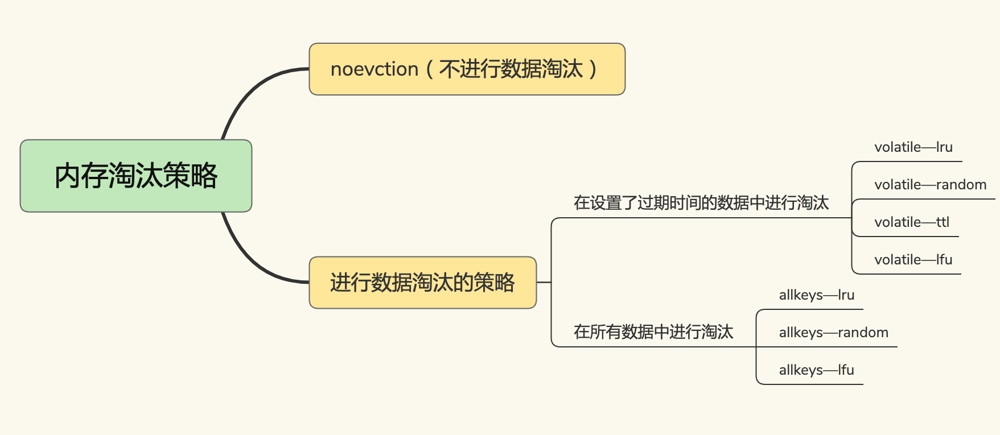
	> -  volatile-random、volatile-ttl、volatile-lru 和 volatile-lfu 这四种淘汰策略。它们筛选的候选数据范围，被限制在==已经设置了过期时间的键值对（只淘汰设置了EXPIRE的键值对）==上。也正因为此，==即使缓存没有写满，这些数据如果过期了，也会被删除==。
	> - volatile-ttl、volatile-random、volatile-lru、volatile-lfu 这四种策略淘汰的是设置了过期时间的数据，allkeys-lru、allkeys-random、allkeys-lfu 这三种淘汰策略的备选淘汰数据范围，就==扩大到了所有键值对==，==无论这些键值对是否设置了过期时间==。

5. ==Redis 中 LRU 算法的优化==

	> - 在 Redis 中，LRU 算法被做了简化，以==减轻数据淘汰对缓存性能的影响（减少使用的额外空间，减少内存消耗）==。具体来说，Redis 默认会==记录每个数据的最近一次访问的时间戳==（由==键值对数据结构 RedisObject 中的 lru 字段记录==）。然后，Redis 在决定淘汰的数据时，第一次会==随机选出 N 个数据，把它们作为一个候选集合==。接下来，Redis 会比较这 N 个数据的 lru 字段，==把 lru 字段值最小的数据从缓存中淘汰==出去。
	>
	> - 执行如下命令，可以让 Redis ==选出 100 个数据作为候选数据集==：
	>
	> 	```bash
	> 	CONFIG SET maxmemory-samples 100
	> 	```
	>
	> - 当需要==再次淘汰数据时==，Redis 需要挑选数据进入第一次淘汰时创建的候选集合。这儿的挑选标准是：能进入候选集合的数据的 lru 字段值必须小于候选集合中最小的 lru 值。
	
6. ==使用建议==

      > - ==优先使用 allkeys-lru 策略==。这样，可以充分利用 LRU 这一经典缓存算法的优势，把最近最常访问的数据留在缓存中，提升应用的访问性能。
      > - 如果你的业务数据中有明显的冷热数据区分，我建议你使用 allkeys-lru 策略。如果业务应用中的数据访问频率相差不大，没有明显的冷热数据区分，建议使用 allkeys-random 策略，随机选择淘汰的数据就行。
      > - ==如果你的业务中有置顶的需求==，比如置顶新闻、置顶视频，那么，可以使用 volatile-lru 策略，同时==不给这些置顶数据设置过期时间==。这样一来，这些==需要置顶的数据一直不会被删除，而其他数据会在过期时根据 LRU 规则进行筛选==。

7. ==如何处理被淘汰的数据==？

      > - 
      > - ==对于 Redis 来说，即使淘汰的数据是脏数据，Redis 也不会把它们写回数据库==。所以，我们在使用 Redis 缓存时，如果数据被修改了，需要在数据修改时就将它写回数据库。==否则，这个脏数据被淘汰时，会被 Redis 删除，而数据库里也没有最新的数据了==。

---


### 26.缓存异常（上）：如何解决缓存和数据库的数据不一致问题？⭐️⭐️⭐️⭐️⭐️

1. ==缓存和数据库的数据不一致是如何发生的==？

	> - 对于读写缓存来说，要想保证缓存和数据库中的数据一致，就要采用同步直写策略。不过，==我们要在业务应用中使用事务机制，来保证缓存和数据库的更新具有原子性==。
	>
	> - 下面说说==只读缓存==的情况：
	>
	> - ==新增数据不会触发不一致==，但是==删改数据会触发数据不一致==。
	>
	> - 
	>
	> - 关于==修改缓存和更新数据库的原子性的探讨==：
	>
	> 	
	>
	> 	---
	>
	> 	
	>
	> - 
	
2. ==如何解决数据不一致问题==？

      > - ==重试机制==。具体来说，可以==把要删除的缓存值或者是要更新的数据库值暂存到消息队列中==（例如使用 Kafka 消息队列）。当应用==没有能够成功地删除缓存值或者是更新数据库值时==，可以==从消息队列中重新读取这些值==，然后==再次进行==删除或更新。
      > - ==如果能够成功地删除或更新，我们就要把这些值从消息队列中去除，以免重复操作==。如果重试==超过的一定次数==，还是没有成功，我们就需要==向业务层发送报错信息==了。
      > - 

3. ==情况一：先删除缓存，再更新数据库==。

      > - 

4. ==延迟双删==：

      > - ==在线程 A 更新完数据库值以后，我们可以让它先 sleep 一小段时间，再进行一次缓存删除操作==。
      >
      > - 之所以要加上 sleep 的这段时间，就是为了==让线程 B 能够先从数据库读取数据，再把缺失的数据写入缓存，然后，线程 A 再进行删除==。所以，线程 A sleep 的时间，就需要大于线程 B 读取数据再写入缓存的时间。
      >
      > - ```java
      > 	redis.delKey(X)
      > 	db.update(X)
      > 	Thread.sleep(N)
      > 	redis.delKey(X)
      > 	```

5. ==情况二：先更新数据库值，再删除缓存值==。

      > - 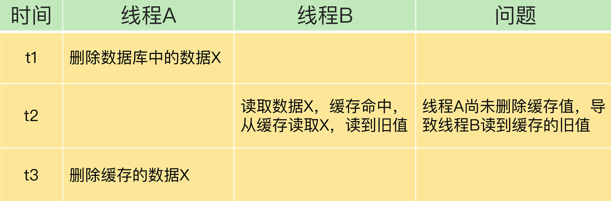

6. ==解决方法==：

      > - 删除缓存值或更新数据库==失败而导致数据不一致==，你可以使用==重试机制==确保删除或更新操作成功。
      > - 删除缓存值、更新数据库的这两步操作中，有其他线程的==并发读操作，导致其他线程读取到旧值==，应对方案是==延迟双删==。

7. ==小结==：

      > - 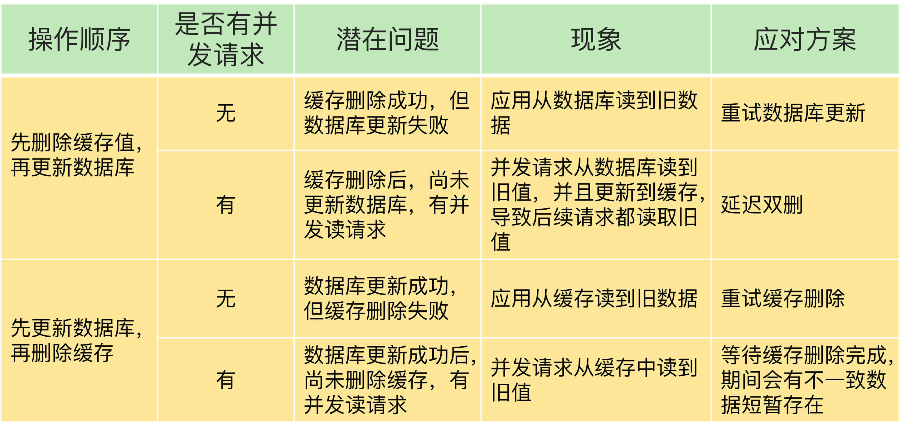
      > - ==优先使用先更新数据库再删除缓存的方法==，原因主要有两个：
      > 	- 先删除缓存值再更新数据库，有==可能导致请求因缓存缺失而访问数据库==，给==数据库带来压力==；
      > 	- 如果业务应用中读取数据库和写缓存的时间不好估算，那么==延迟双删中的等待时间就不好设置==。
      > - 当使用==先更新数据库再删除缓存时==，如果业务层要求必须读取一致的数据，就需要在==更新数据库时，先在 Redis 缓存客户端暂存并发读请求==，等==数据库更新完、缓存值删除后，再读取数据==，从而保证数据一致性。

---


### 27.缓存异常（下）：如何解决缓存雪崩、击穿、穿透难题？⭐️⭐️⭐️⭐️⭐️

1. ==缓存雪崩==

	> - 缓存雪崩是指==大量的应用请求无法在 Redis 缓存中进行处理==，紧接着，应用将==大量请求发送到数据库层，导致数据库层的压力激增==。
	>
	> - ==第一个原因==：==缓存中有大量数据同时过期==，导致大量请求无法得到处理。
	>
	> 	
	>
	> 	- ==解决方法==：==服务降级==：
	>
	> 		
	>
	> - ==第二个原因==：==Redis 缓存实例发生故障宕机了，无法处理请求==。
	>
	> 	- ==解决方法==：==服务熔断==：
	>
	> 		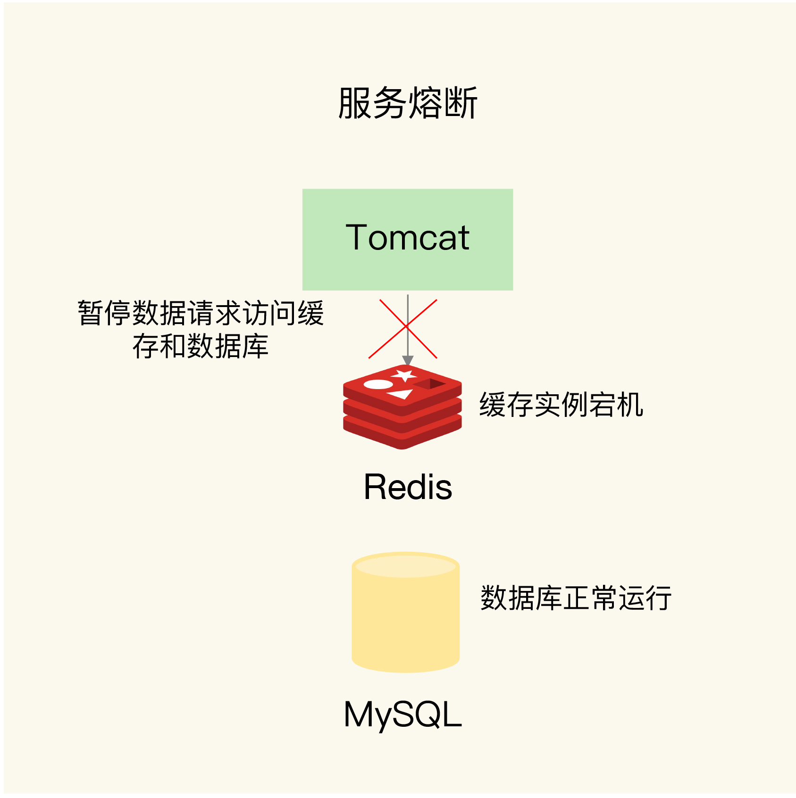
	>
	> 		==服务熔断虽然可以保证数据库的正常运行，但是暂停了整个缓存系统的访问==，对业务应用的影响范围大。为了尽可能减少这种影响，我们也可以进行==请求限流==。
	>
	> 	- ==解决方法==：==请求限流==：
	>
	> 		==即缓存雪崩时限流将每秒允许访问的请求数从10000降至1000==，避免数据库压力过大。
	>
	> 		
	>
	> - 缓存雪崩的根本处理方法：==主从节点构建高可靠缓存集群==：
	>
	> 	通过==主从节点==的方式构建 ==Redis 缓存高可靠集群==。如果 Redis 缓存的主节点故障宕机了，==从节点还可以切换成为主节点==，==继续提供缓存服务==，避免了由于缓存实例宕机而导致的缓存雪崩问题。

2. ==缓存击穿==

	> - 缓存击穿是指，针对==某个访问非常频繁的热点数据的请求==，==无法在缓存中进行处理==，紧接着，访问该数据的大量请求，==一下子都发送到了后端数据库==。
	>
	> 	
	>
	> - 缓存击穿的情况，经常发生在==热点数据过期失效==时。
	>
	> - 我们的解决方法也比较直接，==对于访问特别频繁的热点数据，我们就不设置过期时间了==。

3. ==缓存穿透==

	> - ==缓存穿透是指要访问的数据既不在 Redis 缓存中，也不在数据库中==，导致请求在访问缓存时，发生缓存缺失，再去访问数据库时，发现数据库中也没有要访问的数据。
	>
	> 	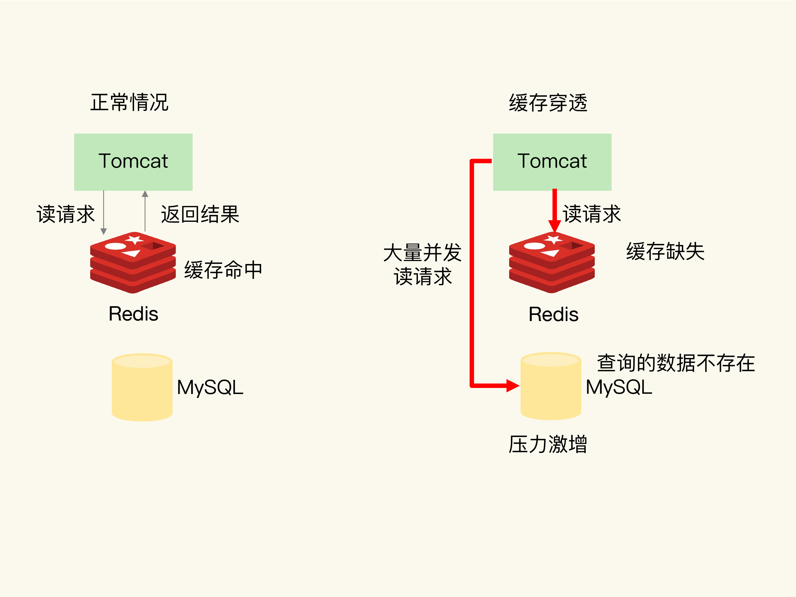
	>
	> - ==发生情况==：
	>
	> 	- 业务层误操作：缓存中的数据和数据库中的数据被==误删除==了，所以缓存和数据库中都没有数据；
	> 	- ==恶意攻击==：专门访问数据库中没有的数据。
	>
	> - ==第一种方案是，缓存空值或缺省值==。即把数据库给请求返回的空值缓存到Redis，这样在Redis上就直接返回空值了，无需访问数据库。
	>
	> - ==第二种方案是，使用布隆过滤器快速判断数据是否存在，避免从数据库中查询数据是否存在，减轻数据库压力==。
	>
	> 	
	>
	> 	当需要查询某个数据时，==先得到这个数据在 bit 数组中对应的 N 个位置==。==只要这 N 个 bit 值有一个不为 1，这就表明查询的数据一定没有在数据库中保存==。

4. ==小结==：

	> - ==缓存雪崩或击穿==时，一旦数据库中的数据被==再次写入到缓存==后，应用又可以在缓存中快速访问数据了；而==缓存穿透==发生时，Redis 缓存和数据库会同时==持续==承受请求压力。
	> - 

---


### 28.缓存被污染了，该怎么办？⭐️⭐️

1. 在一些场景下，有些数据被==访问的次数非常少，甚至只会被访问一次==，如果还==继续留存在缓存中的话，就只会白白占用缓存空间==。这种情况，就是缓存污染。

2. 如果这时==数据占满了缓存空间==，我们再==往缓存中写入新数据==时，就需要==先把这些数据逐步淘汰出缓存，这就会引入额外的操作时间开销==，进而会影响应用的性能。

3. ==LRU 缓存策略==

	> - 在每个数据对应的 ==RedisObject 结构体中设置一个 lru 字段==，用来记录数据的访问时间戳。在进行数据淘汰时，LRU 策略会在候选数据集中淘汰掉 lru 字段值最小的数据。
	> - ==只看数据的访问时间，使用 LRU 策略在处理扫描式单次查询操作时，无法解决缓存污染==。
	> - 

4. ==LFU 缓存策略的优化==

	> - 当使用 LFU 策略筛选淘汰数据时，==首先会根据数据的访问次数进行筛选==。
	>
	> - ==Redis 在实现 LFU 策略的时候，只是把原来 24bit 大小的 lru 字段，又进一步拆分成了两部分==。
	>
	> 	- ldt 值：lru 字段的前 16bit，表示数据的访问时间戳；counter 值：
	> 	- lru 字段的后 8bit，表示数据的访问次数。
	>
	> - ==在实现 LFU 策略时，Redis 并没有采用数据每被访问一次，就给对应的 counter 值加 1 的计数规则，而是采用了一个更优化的计数规则（不然最多纪录255次访问了）==。
	>
	> 	```c
	> 	double r = (double)rand()/RAND_MAX;
	> 	...
	> 	double p = 1.0/(baseval*server.lfu_log_factor+1);
	> 	if (r < p) counter++; 
	> 	```
	>
	> 	
	>
	> - Redis 在实现 LFU 策略时，还设计了一个 ==counter 值随时间衰减的机制==：LFU 策略会计算当前时间和数据最近一次访问时间的差值，并把这个差值换算成==以分钟为单位==。然后，LFU 策略再==把这个差值除以 lfu_decay_time 值==，所得的结果==就是数据 counter 要衰减的值==。

---


### 29.Pika：如何基于SSD实现大容量Redis？⭐️⭐️⭐️⭐️

1. 问题：==如何使用Redis存储大量数据==？使用==固态硬盘（Solid State Drive，SSD==）。它的成本很低，而且容量大，读写速度快，我们可以基于 SSD 来实现大容量的 Redis 实例。360 公司 DBA 和基础架构组联合开发的 ==Pika键值数据库==，正好实现了这一需求。

2. ==大内存 Redis 实例的潜在问题==

	> - ==内存快照 RDB 生成和恢复效率低==。RDB 文件增大，RDB 文件生成时的 ==fork 子进程时长增加==。
	> - ==主从节点全量同步时长增加（RDB文件增大）、缓冲区（环形缓冲区）易溢出==。

3. ==Pika 的整体架构==

	> - 
	>
	> - ==Pika 的网络框架==是对操作系统底层的网络函数进行了封装，负责底层网络请求的接收和发送。
	>
	> - ==Pika 线程模块==采用了多线程模型来具体处理客户端请求，概念图如下：
	>
	> 	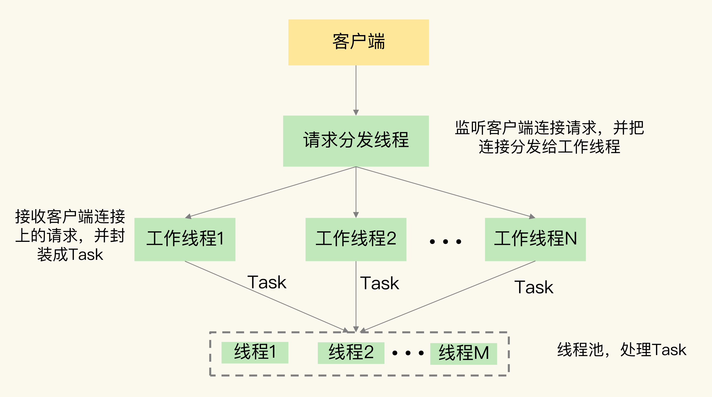
	>
	> - ==Nemo 模块==很容易理解，它实现了 ==Pika 和 Redis 的数据类型兼容==。
	>
	> - Pika 使用 ==binlog 机制记录写命令==，用于==主从节点的命令同步==。
	>
	> - ==RocksDB 提供的基于 SSD 保存数据的功能==。

4. ==Pika 如何基于 SSD 保存更多数据==？

	> - RocksDB ==写入数据==的基本流程：
	>
	> 	
	>
	> 	==RocksDB 会先用 Memtable 缓存数据，缓存写满后再将数据快速写入 SSD==。
	>
	> - RocksDB ==读取数据==的基本流程：
	>
	> 	
	>
	> - Pika 基于 RocksDB 保存了数据文件，==直接读取数据文件就能恢复==，==不需要再通过内存快照进行恢复==了。而且，==Pika 从库在进行全量同步时，可以直接从主库拷贝数据文件==，==不需要使用内存快照==，这样一来，Pika 就避免了大内存快照生成效率低的问题。
	>
	> - Pika 使用了 ==binlog 机制实现增量命令同步==，既节省了内存，还==避免了缓冲区溢出的问题==。当==全量同步结束后==，从库会==从 binlog 中把尚未同步的命令读取过来==，这样就和主库的数据保持一致。
	>
	> - ==binlog 是保存在 SSD 上的文件==，文件大小不像缓冲区，会受到内存容量的较多限制。

5. ==Pika 如何实现 Redis 数据类型兼容==？

	> - ==RocksDB 只提供了单值的键值对类型==，RocksDB 键值对中的值就是单个值，==而 Redis 键值对中的值还可以是集合类型==。
	> - 以下为 ==Nemo 模块解决 Redis 中集合类型的方法==：
	> - 
	> - 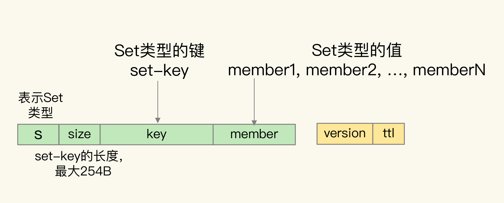
	> - 
	> - 

6. ==Pika 的其他优势与不足==

	> - Pika 最大的特点就是==使用了 SSD 来保存数据==，这个特点能带来的最直接好处就是，==Pika 单实例能保存更多的数据==了。
	> - ==实例重启快==。Pika 的数据在写入数据库时，是会保存到 SSD 上的。当 ==Pika 实例重启时，可以直接从 SSD 上的数据文件中读取数据==，不需要像 Redis 一样，从 RDB 文件全部重新加载数据或是从 AOF 文件中全部回放操作。
	> - ==主从库重新执行全量同步的风险低==。Pika 通过 ==binlog 机制实现写命令的增量同步，不再受内存缓冲区大小的限制==，所以，即使在数据量很大导致主从库同步耗时很长的情况下，Pika 也不用担心缓冲区溢出而触发的主从库重新全量同步。
	> - 当把==数据保存到 SSD 上后，会降低数据的访问性能==。这是因为，==数据操作毕竟不能在内存中直接执行了==，而是要在底层的 SSD 中进行存取，这肯定会影响，Pika 的性能。

---


### 30.无锁的原子操作：Redis如何应对并发访问？⭐️⭐️⭐️⭐️

1. 为了保证==并发访问的正确性==，Redis 提供了两种方法，分别是==加锁==和==原子操作==。

2. ==加锁有两个问题==：一个是，如果加锁操作多，会==降低系统的并发访问性能==；第二个是，Redis 客户端要加锁时，需要用到分布式锁，而==分布式锁实现复杂==，==需要用额外的存储系统==来提供加解锁操作。

3. ==原子操作==是指==执行过程保持原子性==的操作，而且原子操作执行时并不需要再加锁，实现了==无锁操作==。这样一来，既能保证并发控制，还能==减少对系统并发性能的影响==。

4. ==并发访问中需要对什么进行控制==？

	> - 一个==客户端对数据的修改==包括：“==读取 – 修改 – 写回==”操作（Read-Modify-Write，简称为 RMW）
	> - 
	> - 可以用==锁把并行操作变成串行操作==，==串行==操作就具有==互斥==性。==加锁也会导致系统并发性能降低==。

5. ==Redis 的两种原子操作方法==

	> - Redis 的==原子操作==采用了==两种方法==：
	>
	> 	1. 把==多个操作在 Redis 中实现成一个操作==，也就是==单命令操作==；
	> 	2. 把==多个操作写到一个 Lua 脚本==中，以原子性方式==执行单个 Lua 脚本==。
	>
	> - ==单命令操作==
	>
	> 	- Redis 提供了 ==INCR/DECR 命令==，==把这三个操作转变为一个原子操作==了。==INCR/DECR 命令可以对数据进行增值 / 减值操作==，而且它们本身就是单个命令操作，==Redis 采用单线程串行在执行它们时，本身就具有互斥性==。
	>
	> - ==Lua 脚本==
	>
	> 	- 我们要执行的操作不是简单地增减数据，而是有==更加复杂的判断逻辑或者是其他操作==。
	>
	> 	- ==Redis 会把整个 Lua 脚本作为一个整体执行==，在执行的过程中不会被其他命令打断，从而保证了 Lua 脚本中操作的原子性。我们可以使用 Redis 的 ==EVAL 命令来执行脚本==。
	>
	> 		```bash
	> 		redis-cli --eval lua.script [args...] 
	> 		```

6. ==小结==：

	> - Redis 提供了==两种原子操作的方法==来实现并发控制，分别是==单命令操作==和 ==Lua 脚本==。因为原子操作本身==不会对太多的资源限制访问==，可以维持==较高的系统并发性能==。
	> - 如果==把很多操作都放在 Lua 脚本中原子执行，会导致 Redis 执行脚本的时间增加，同样也会降低 Redis 的并发性能==。所以，我给你一个小建议：==在编写 Lua 脚本时，你要避免把不需要做并发控制的操作写入脚本中。==

---


### 31.如何使用Redis实现分布式锁？⭐️⭐️⭐️⭐️⭐️

1. ==分布式锁保存在一个共享存储系统中的==，==可以被多个客户端共享访问和获取==。而==Redis 本身可以被多个客户端共享访问，正好就是一个共享存储系统，可以用来保存分布式锁==。

2. ==单机上的锁和分布式锁的联系与区别==

	> - 和单机上的锁类似，分布式锁同样可以==用一个变量来实现。==客户端加锁和释放锁的操作逻辑，也和单机上的加锁和释放锁操作逻辑一致：==加锁时同样需要判断锁变量的值，根据锁变量值来判断能否加锁成功；释放锁时需要把锁变量值设置为 0，表明客户端不再持有锁==。
	> - 和线程在单机上操作锁不同的是，在分布式场景下，==锁变量需要由一个共享存储系统来维护==，只有这样，多个客户端才可以通过访问共享存储系统来访问锁变量。相应的，==加锁和释放锁的操作就变成了读取、判断和设置共享存储系统中的锁变量值==。

3. ==基于单个 Redis 节点实现分布式锁作为分布式锁==

	> - ==加锁==图示：
	>
	> 	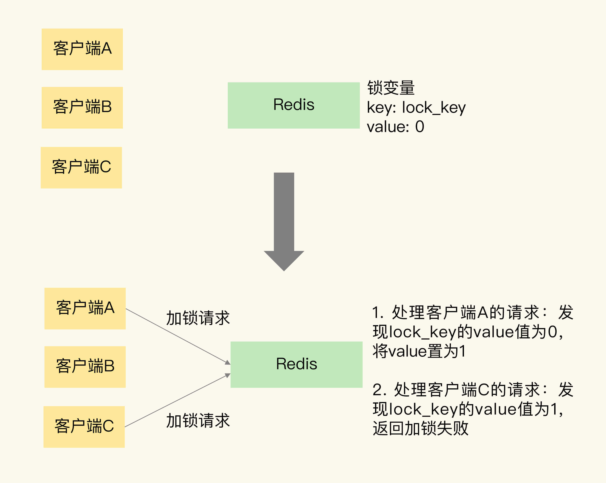
	>
	> - ==释放锁==图示：
	>
	> 	
	>
	> - ==加锁和释放锁的操作需要保证原子性==。
	>
	> - 我们就可以用 ==SETNX 和 DEL 命令组合来实现加锁和释放锁操作==。但这存在==两个风险==。
	>
	> 	- 假如某个客户端在执行了 SETNX 命令、加锁之后，紧接着却在操作共享数据时发生了异常，==结果一直没有执行最后的 DEL 命令释放锁==。解决方法是，==给锁变量设置一个过期时间==。
	> 	- 如果客户端 A 执行了 SETNX 命令加锁后，假设==客户端 B 执行了 DEL 命令释放锁==，此时，==客户端 A 的锁就被误释放了==。我们需要==能区分来自不同客户端的锁操作==。让==每个客户端给锁变量设置一个唯一值==，这里的唯一值就可以用来==标识当前操作的客户端==。在==释放锁操作==时，==客户端需要判断，当前锁变量的值是否和自己的唯一标识相等==。
	>
	> - ```bash
	> 	# 加锁, unique_value作为客户端唯一性的标识，过期时间10秒。
	> 	SET lock_key unique_value NX PX 10000 
	> 	```
	>
	> - ```lua
	> 	//释放锁 比较unique_value是否相等，避免误释放
	> 	if redis.call("get",KEYS[1]) == ARGV[1] then
	> 	    return redis.call("del",KEYS[1])
	> 	else
	> 	    return 0
	> 	end
	> 	```
	>
	> - ```bash
	> 	redis-cli  --eval  unlock.script lock_key , unique_value # 释放锁使用Lua原子性
	> 	```

4. ==基于多个 Redis 节点实现高可靠的分布式锁==

	> - Redlock 算法的基本思路，是==让客户端和多个独立的 Redis 实例依次请求加锁==，如果==客户端能够和半数以上的实例成功地完成加锁操作==，那么客户端成功地获得分布式锁了，否则加锁失败。
	>
	> - ==Redlock 算法加锁的执行步骤==：
	>
	> 	1. ==第一步是，客户端获取当前时间。==
	> 	2. ==第二步是，客户端按顺序依次向 N 个 Redis 实例执行加锁操作。==如果客户端在和一个 Redis 实例请求加锁时==超时==，那么就和下一个 Redis 实例继续请求加锁。==加锁操作的超时时间需要远远地小于锁的有效时间，一般也就是设置为几十毫秒==。
	> 	3. ==第三步是，客户端完成了和所有 Redis 实例的加锁操作后，计算整个加锁过程的总耗时。==
	>
	> 	客户端只有在满足下面的这两个条件时，才能认为是加锁成功。
	>
	> 	- 条件一：客户端从==超过半数（大于等于 N/2+1）的 Redis 实例上成功获取到了锁==；
	> 	- 条件二：==客户端获取锁的总耗时没有超过锁的有效时间==。
	>
	> - ==释放锁就直接对所有实例执行释放锁的Lua脚本即可==。

5. ==小结==：

	> - 基于==单个 Redis 实例==实现分布式锁时，对于==加锁操作==，我们需要满足三个条件。
	> 	- 加锁包括了读取锁变量、检查锁变量值和设置锁变量值三个操作，但需要以==原子操作==的方式完成，所以，我们==使用 SET 命令带上 NX 选项来实现加锁==；
	> 	- 锁变量需要==设置过期时间，以免客户端拿到锁后发生异常，导致锁一直无法释放==，所以，我们在 SET 命令执行时加上 ==EX/PX 选项==，设置其过期时间；
	> 	- 锁变量的值需要能==区分来自不同客户端的加锁操作==，==以免在释放锁时，出现误释放操作==，所以，我们使用 SET 命令设置锁变量值时，==每个客户端SET的VALUE是一个唯一值，用于标识客户端==。
	> - 释放锁也包含了读取锁变量值、判断锁变量值和删除锁变量三个操作，不过，==我们无法使用单个命令来实现==，所以，我们可以==采用 Lua 脚本执行释放锁操作==，==通过 Redis 原子性地执行 Lua 脚本，来保证释放锁操作的原子性==。

---


### 32.事务机制：Redis能实现ACID属性吗？⭐️⭐️⭐️⭐️⭐️

1. ==事务 ACID 属性的要求==

	> - 原子性的要求很明确，就是一个事务中的多个操作必须都完成，或者都不完成。
	> - 第二个属性是一致性。这个很容易理解，就是指==数据库中的数据在事务执行前后是一致的==。
	> - 第三个属性是隔离性。它要求数据库在执行一个事务时，==其它操作无法存取到正在执行事务访问的数据==。

2. ==Redis 如何实现事务==？

	> - Redis 实例只是把这些命令暂存到一个命令队列中，并不会立即执行。
	> - 当服务器端收到 EXEC 命令后，才会实际执行命令队列中的所有命令。

3. ==原子性==

	> - ==在执行 EXEC 命令前，客户端发送的操作命令本身就有错误（比如这个命令不存在）==，执行了 EXEC 命令之后，Redis 就会==拒绝执行所有提交的命令操作==，返回事务失败的结果。
	> - ==事务操作入队时，命令和操作的数据类型不匹配，但 Redis 实例没有检查出错误==。执行时，==虽然 Redis 会对错误命令报错，但还是会把正确的命令执行完==。在这种情况下，==事务的原子性就无法得到保证了==。
	> - ==Redis 中并没有提供回滚机制==。虽然 Redis 提供了 DISCARD 命令，但是，==这个命令只能用来主动放弃事务执行，把暂存的命令队列清空，起不到回滚的效果==。
	> - ==在执行事务的 EXEC 命令时，Redis 实例发生了故障，导致事务执行失败。==在这种情况下，如果 Redis 开启了 AOF 日志，那么，==只会有部分的事务操作被记录到 AOF 日志中==。我们需要使用 redis-check-aof 工具检查 AOF 日志文件，这个工具可以==把未完成的事务操作从 AOF 文件中去除==。这样一来，我们使用 AOF 恢复实例后，事务操作不会再被执行，从而保证了原子性。
	> - ==总结三种情况==：
	> 	1. 命令==入队时就报错，会放弃事务执行==，保证==原子性==；
	> 	2. 命令入队时没报错，==实际执行时报错==，==不保证原子性==；
	> 	3. XEC 命令执行时==实例故障，如果开启了 AOF 日志，可以保证原子性==。

4. ==一致性==：总结来说，在==命令出错==，==命令执行错误==或 ==Redis 发生故障==的情况下，Redis 事务机制对==一致性属性是有保证的==。

5. ==隔离性==：

	> - ==并发操作在 EXEC 命令前执行==，此时，隔离性要使用 WATCH 机制来实现，否则无法保证。
	>
	> 	使用 WATCH 机制：WATCH 机制的作用是，==在事务执行前，监控一个或多个键的值变化情况==，当事务调用 ==EXEC 命令执行时，WATCH 机制会先检查监控的键是否被其它客户端修改==了。如果==修改了，就放弃事务执行==，避免事务的隔离性被破坏。
	>
	> 	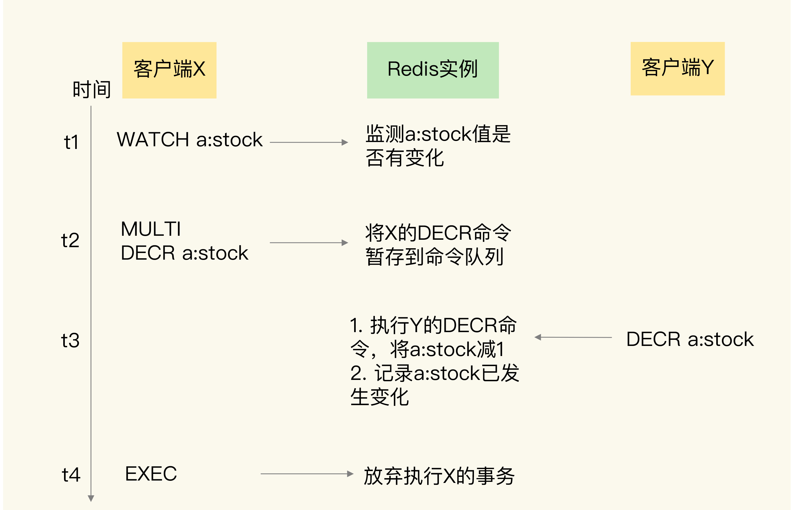
	>
	> 	不使用 WATCH 机制：客户端 X 发送的 EXEC 命令还没有执行，但是==客户端 Y 的 DECR 命令就执行了，此时，a:stock 的值会被修改==，这就==无法保证 X 发起的事务的隔离性==了。
	>
	> 	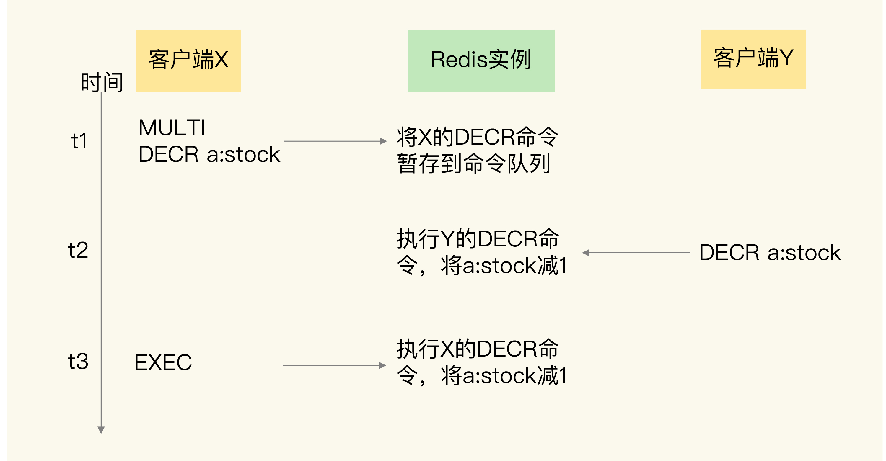
	>
	> - ==并发操作在 EXEC 命令之后被服务器端接收并执行。==
	>
	> 	因为 ==Redis 是用单线程执行命令==，因此 EXEC 命令执行后，Redis ==会保证先把命令队列中的所有命令执行完==。所以，在这种情况下，==并发操作不会破坏事务的隔离性==。

6. ==持久性==：

	> - 如果 Redis 没有使用 RDB 或 AOF，那么事务的持久化属性肯定得不到保证。如果 Redis 使用了 RDB 模式，那么，==在一个事务执行后，而下一次的 RDB 快照还未执行前，如果发生了实例宕机，这种情况下，事务修改的数据也是不能保证持久化==的。
	> - 如果 Redis 采用了 AOF 模式，因为 ==AOF 模式的三种配置选项 no、everysec 和 always 都会存在数据丢失的情况==，所以，事务的持久性属性也还是得不到保证。
	> - 所以，==不管 Redis 采用什么持久化模式，事务的持久性属性是得不到保证==的。

7. ==小结==：

	> 
	>
	> Redis 的事务机制==可以保证一致性和隔离性，但是无法保证持久性==。

---


### 33.Redis主从同步与故障切换，有哪些坑？⭐️⭐️⭐️

1. ==主从数据不一致==

	> - 这是因为==主从库间的命令复制是异步进行的。==
	>
	> - ==应对方式==：
	>
	> 	1. ==在硬件环境配置方面，我们要尽量保证主从库间的网络连接状况良好==。避免主从库间的传输延迟，导致从库不能及时地收到主库发送的命令
	>
	> 	2. ==我们还可以开发一个外部程序来监控主从库间的复制进度。==
	>
	> 		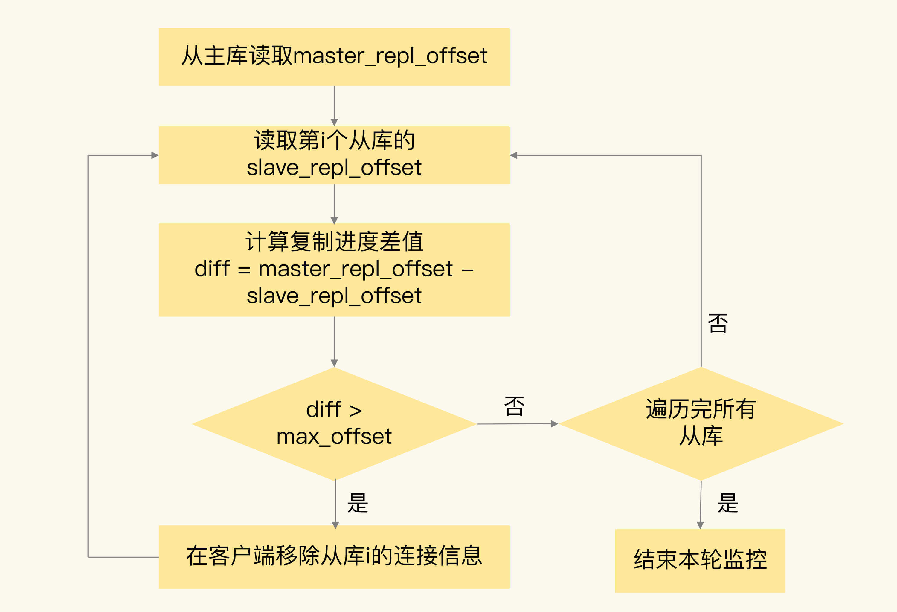

2. ==读取过期数据==

	> - ==Redis 同时使用了两种策略来删除过期的数据，分别是惰性删除策略和定期删除策略。==
	> - ==惰性删除==：当一个数据的过期时间到了以后，并不会立即删除数据，而是==等到再有请求来读写这个数据时，对数据进行检查，如果发现数据已经过期了，再删除这个数据==。这个策略会==导致大量已经过期的数据留存在内存中，占用较多的内存资源==。
	> - Redis 在使用这个策略的同时，还==使用了第二种策略：定期删除策略==。Redis 为了避免过多删除操作对性能产生影响，==每次定期随机检查数据的数量并不多==。如果==过期数据很多==，并且一直没有再被访问的话，这些数据==就会留存在 Redis 实例中==。
	> - 读取到过期数据时，主库会删除，但是==从库本身不会执行删除操作==，==如果客户端在从库中访问留存的过期数据，从库并不会触发数据删除，而是返回 null==。
	> - 
	> - 主库执行 EXPIRE 命令设置存活时间是==相对于当前的 60 秒后==，假设==9点主库执行该命令==，==主从同步用时2分钟==，那么==从库设置的过期时间则为9点3分==。因此虽然==9点2分时主库中该键已过期==，==但是从库中并未过期，客户端就会读到过期的键==。
	> - 因此，==在业务应用中使用 EXPIREAT/PEXPIREAT 命令，把数据的过期时间设置为具体的时间点，避免读到过期数据。==

3. ==不合理配置项导致的服务挂掉==

	> 1. ==protected-mode 配置项==
	>
	> 	- 这个配置项的作用是限定哨兵实例能否被其他服务器访问。当这个==配置项设置为 yes 时，哨兵实例只能在部署的服务器本地进行访问==。当==设置为 no 时，其他服务器也可以访问这个哨兵实例==。
	>
	> 	- 正因为这样，==如果 protected-mode 被设置为 yes，而其余哨兵实例部署在其它服务器，那么，这些哨兵实例间就无法通信==。==当主库故障时，哨兵无法判断主库下线，也无法进行主从切换==，最终 Redis 服务不可用。
	>
	> 	- 所以，我们在应用主从集群时，==要注意将 protected-mode 配置项设置为 no，并且将 bind 配置项设置为其它哨兵实例的 IP 地址==。这样一来，只有在 bind 中设置了 IP 地址的哨兵，才可以访问当前实例，既保证了实例间能够通信进行主从切换，也保证了哨兵的安全性。
	>
	> 	- ```java
	> 		protected-mode no
	> 		bind 192.168.10.3 192.168.10.4 192.168.10.5
	> 		```
	>
	> 2. ==cluster-node-timeout 配置项==
	>
	> 	- ==这个配置项设置了 Redis Cluster 中实例响应心跳消息的超时时间。==
	> 	- 如果执行==主从切换的实例超过半数，而主从切换时间又过长的话，就可能有半数以上的实例心跳超时，从而可能导致整个集群挂掉==。所以，我建议你将 cluster-node-timeout 调大些（例如 10 到 20 秒）。

4. ==小结==：

	> - 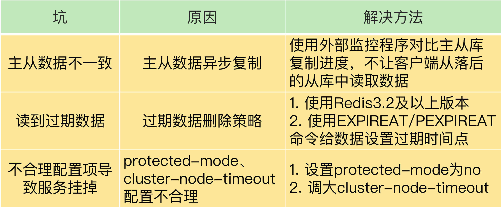
	> - Redis 中的 ==slave-serve-stale-data 配置项设置了从库能否处理数据读写命令，你可以把它设置为 no==。这样一来，==从库只能服务INFO、SLAVEOF 命令，这就可以避免在从库中读到不一致的数据==。
	
5. ==在主从集群中，我们把 slave-read-only 设置为 no，让从库也能直接删除数据，以此来避免读到过期数据。你觉得，这是一个好方法吗==？

  > - ==主从复制中的增删改操作都需要在主库执行==，即使从库能做删除，也==不要在从库删除==，否则会导致==数据不一致==。
  > - 例如，主从库上都有 a:stock 的键，客户端 A 给主库发送一个 SET 命令，修改 a:stock 的值，==客户端 B 给从库发送了一个 SET 命令，也修改 a:stock 的值==，此时，==相同键的值就不一样了==。所以，如果从库具备执行写操作的功能，就会==导致主从数据不一致==。

---


### 35.第23~33讲课后思考题答案及常见问题答疑⭐️⭐️⭐️⭐️

1. ==如何理解把 Redis 称为旁路缓存？==

	> - ==业务应用在使用 Redis 缓存时，需要在业务代码中显式地增加缓存的操作逻辑==。
	> - 我之所以强调 Redis 是一个旁路缓存，也是希望你能够记住，在==使用 Redis 缓存时，我们需要修改业务代码==。

2. ==使用 Redis 缓存时，应该用哪种模式？==

	> - 对于采用==异步写回==策略的读写缓存模式来说，==缓存系统需要能在脏数据被淘汰时，自行把数据写回数据库==，但是，==Redis 是无法实现这一点==的，所以我们使用 Redis 缓存时，==并不采用这个模式==。

---


### 37.Redis支撑秒杀场景的关键技术和实践都有哪些？⭐️⭐️⭐️

1. ==秒杀场景的负载特征对支撑系统的要求==

	> - ==当有大量并发请求涌入秒杀系统时，我们就需要使用 Redis 先拦截大部分请求，避免大量请求直接发送给数据库，把数据库压垮==。
	> - 秒杀场景一般==读多写少==，而且读操作都是简单的查询操作。秒杀活动中只有少部分用户能成功下单，所以，商品库存查询操作（读操作）要远多于库存扣减和下单操作（写操作）。

2. ==Redis 可以在秒杀场景的哪些环节发挥作用？==

	> - ==第一阶段是秒杀活动前==
	> 	- 用户会==不断刷新商品详情页==，这会导致详情页的瞬时请求量剧增。这个阶段的应对方案，一般是尽量==把商品详情页的页面元素静态化，然后使用 CDN 或是浏览器把这些静态化的元素缓存起来==。这样一来，==秒杀前的大量请求可以直接由 CDN 或是浏览器缓存服务，不会到达服务器端了，这就减轻了服务器端的压力==。
	> - ==第二阶段是秒杀活动开始==
	> 	- 这个阶段中==最大的并发压力都在库存查验操作上==。==使用 Redis 保存库存量==。
	> 	- ==订单处理可以在数据库中执行==。这些操作本身涉及数据库中的==多张数据表==，要==保证处理的事务性==，需要在数据库中完成。而且，==订单处理时的请求压力已经不大了==。
	> 	- ==为啥库存扣减操作不能在数据库执行呢==？
	> 		1. ==额外的开销==。Redis 中保存了库存量，而库存量的最新值又是数据库在维护，所以数据库更新后，==还需要和 Redis 进行同步==，这个过程增加了额外的操作逻辑，也带来了额外的开销。
	> 		2. ==下单量超过实际库存量，出现超售==。由于==数据库的处理速度较慢，不能及时更新库存余量，这就会导致大量库存查验的请求读取到旧的库存值==，并进行下单。此时，就会出现==下单数量大于实际的库存量，导致出现超售==，这就不符合业务层的要求了。
	> 	- ==在 Redis 中进行库存扣减==。并且==库存查验和库存扣减这两个操作需要保证原子性==。
	> - ==第三阶段就是秒杀活动结束后==
	> 	- 这个阶段中的==用户请求量已经下降很多了，服务器端一般都能支撑==，我们就不重点讨论了。
	> - 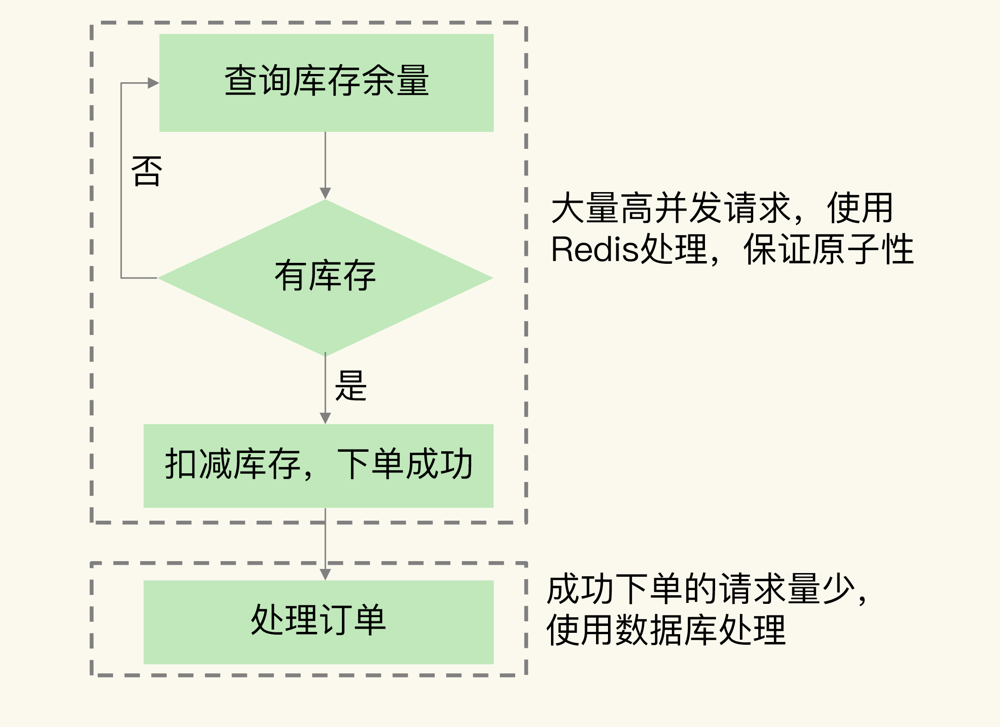

3. ==Redis 的哪些方法可以支撑秒杀场景？==

	> - ==根本要求有两个==：
	> 	1. ==支持高并发==。
	> 	2. ==保证库存查验和库存扣减原子性执行==。

4. ==基于原子操作支撑秒杀场景==

	> - 我们就需要==使用 Lua 脚本原子性地执行==这两个操作。
	> - 要想保证库存查验和扣减这两个操作的原子性，我们还有另一种方法，就是==使用分布式锁来保证多个客户端能互斥执行这两个操作==。

5. ==基于分布式锁来支撑秒杀场景==

	> - ==使用分布式锁来支撑秒杀场景的具体做法是，先让客户端向 Redis 申请分布式锁，只有拿到锁的客户端才能执行库存查验和库存扣减==。
	> - ==我们可以使用切片集群中的不同实例来分别保存分布式锁和商品库存信息==。以==减轻保存库存信息的实例的压力==。

6. ==小结==

	> - 秒杀系统是一个系统性工程，Redis 实现了对库存查验和扣减这个环节的支撑，除此之外，还有 4 个环节需要我们处理好。
	> 	1. ==前端静态页面的设计==。秒杀页面上能静态化处理的页面元素，我们都要==尽量静态化，这样可以充分利用 CDN 或浏览器缓存服务秒杀开始前的请求==。
	> 	2. ==请求拦截和流控==。在秒杀系统的接入层，==对恶意请求进行拦截，避免对系统的恶意攻击==，例如使用黑名单==禁止恶意 IP 进行访问==。如果 Redis 实例的访问压力过大，为了==避免实例崩溃==，我们也需要==在接入层进行限流，控制进入秒杀系统的请求数量==。
	> 	3. ==库存信息过期时间处理==。==Redis 中保存的库存信息其实是数据库的缓存==，为了==避免缓存击穿问题，我们不要给库存信息设置过期时间==。
	> 	4. ==数据库订单异常处理==。如果数据库没能成功处理订单，可以==增加订单重试功能，保证订单最终能被成功处理==。

---


