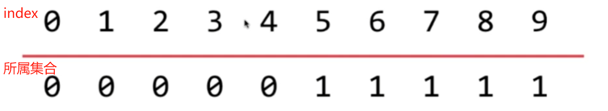
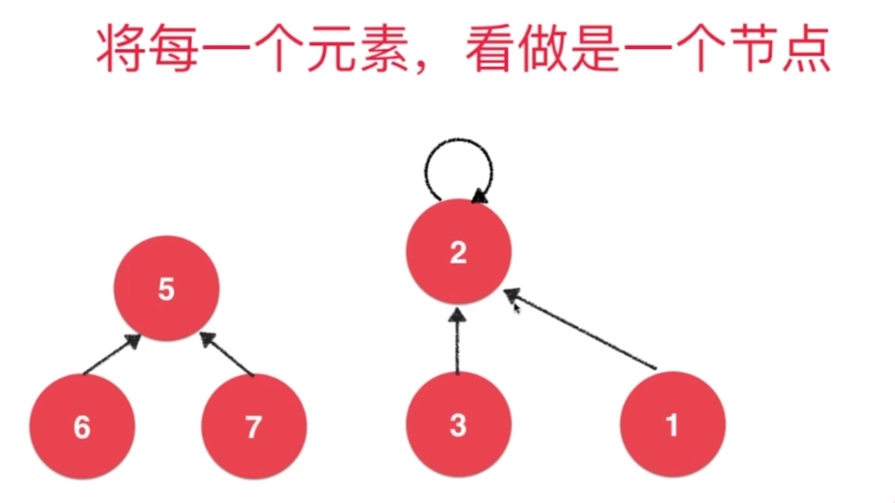
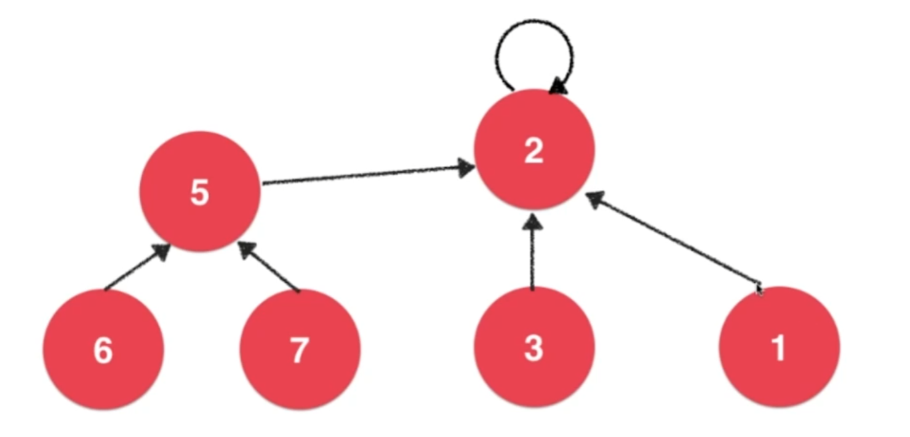
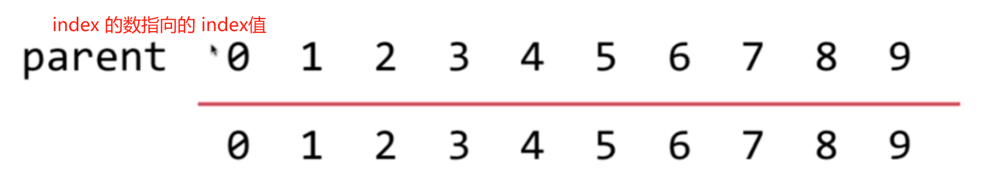
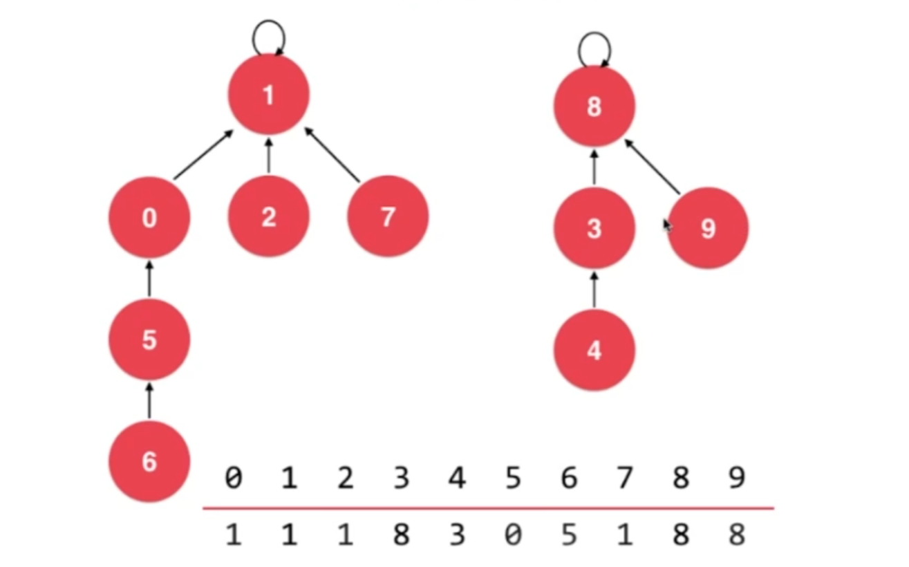
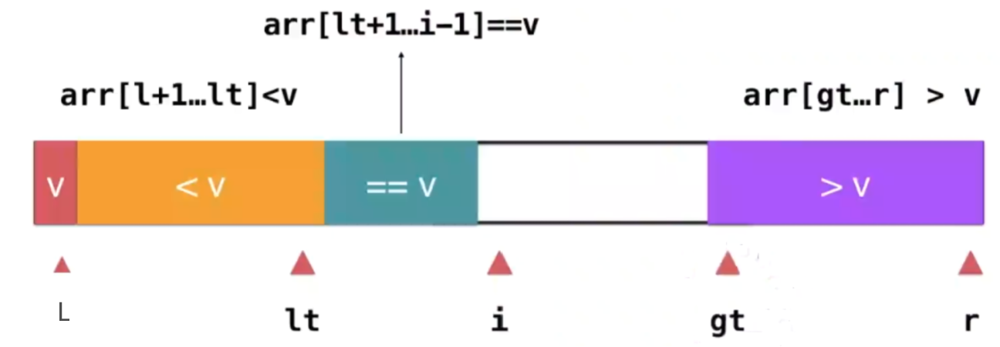
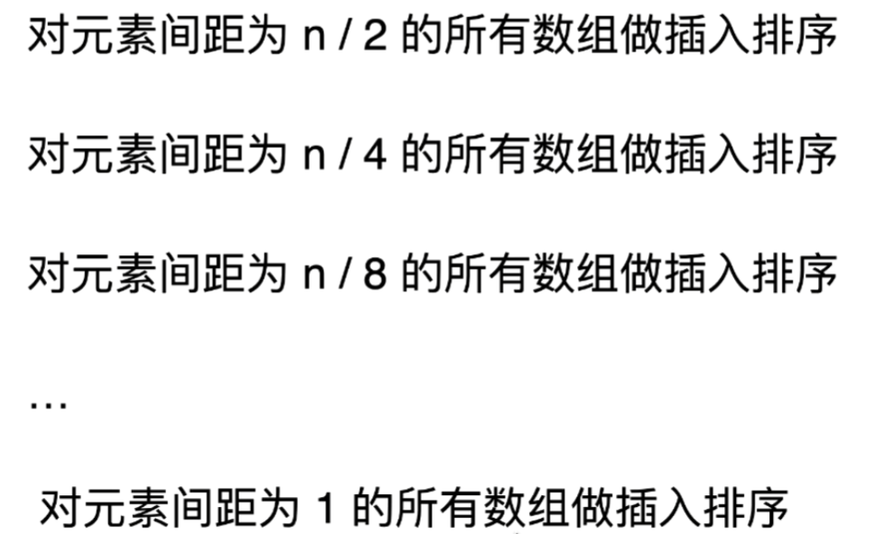

## 红黑树

1. > 

2. > 

3. 红黑树和2-3树是等价的，因此由于2-3树是绝对平衡的，因此红黑树根节点到任意一个空节点所经过的黑色节点（一个黑色节点代表要么是一个2节点，要么是一个3节点）总数是相同的。

4. 红黑树是一颗“黑平衡的树”，在添加和删除节点的过程中比AVL树有更好的性能。

---


## 并查集

1. 对于一组数据，支持两种操作：

	```java
	union(E p, E q);
	isConnected(E p, E q);
	// 之所以使用 E，是因为并查集中并不需要考虑两个元素的类型是什么，只需体现它们之间的连接关系
	```

2. ==基于 Quick Find 的实现思路==：

	> find O(1)，union O(n)
	>
	> 1. 
	>
	> 2. find 函数，查询 index 数据所属的集合
	>
	> 	```java
	> 	find(E q);
	> 	```
	>
	> 3. ```java
	> 	public UnionFind(int n) {
	> 	    parent = new int[n];
	> 	    for (int i = 0; i < n; i++) {
	> 	        parent[i] = i; // 每个元素最开始没有连接的时候，都独属于一个集合
	> 	    }
	> 	}
	> 	```
	>
	> 4. 假如上图中的 0 和 5 union，那么它们所属集合的所有元素也会相连，表现是最终所有元素相连。

3. 如果满足 `find(p) == find(q)`，那么就可以认为 p 和 q 所属同一个集合，即 `isConnected`。

4. ==基于 Quick Union 的实现思路（常用思路）==：

	> 1. 
	>
	> 2. ==执行 union 后的结果==：
	>
	> 	
	>
	> 3. 
	>
	> 4. 最终表现为树的结果，其中根节点的 parent 为自己，即指向自己。
	>
	> 	
	>
	> 5. Union O(h)，Find O(h)，其中 h 为树的高度。
	>
	> 6. ```java
	> 	class UnionFind {
	> 	    int[] parent;
	> 					
	> 	    public UnionFind(int n) {
	> 	        parent = new int[n];
	> 	        for (int i = 0; i < n; i++)
	> 	            parent[i] = i; // 每个元素最开始没有连接的时候，都指向自己，表示独立
	> 	    }
	> 					
	> 	    /*
	> 	     * 联合，本质就是将它们各自唯一的根节点连接起来
	> 	     */
	> 	    public void union(int index1, int index2) {
	> 	        parent[find(index2)] = find(index1); // index2 的根节点的父节点设置为 index1 的根节点
	> 	    }
	> 					
	> 	    public boolean isConnected(int index1, int index2) {
	> 	        return find(index1) == find(index2);
	> 	    }
	> 					
	> 	    /*
	> 	     * 查询 index 的根节点
	> 	     */
	> 	    public int find(int index) {
	> 	        if (parent[index] != index) // 父节点不是自己，即自己不是根节点，查询父节点的根节点
	> 	            return parent[index] = find(parent[index]);
	> 	        else
	> 	            return index;
	> 	    }
	> 	}
	> 	```
	
5. 然而我们基于 Quick Union 的方法还有很大的优化空间，因为我们在 union 的时候强行让 index2 的根节点指向 index1 的根节点，而这样可能导致一颗树高度过高，因此可以优化 union 中合并树的逻辑。

6. ==基于 size 的优化==：

      > - 在这种优化下，我们让 size 较小的树的根节点指向 size 较大的树的根节点，即小树指向大树。
      >
      > 	```java
      > 	class UnionFind {
      > 	    private final int[] parent;
      > 	    // 通过以 index 为根节点的树的节点的个数，优化 union 方法，降低树的高度
      > 	    private final int[] size;
      > 					
      > 	    public UnionFind(int n) {
      > 	        parent = new int[n];
      > 	        rank = new int[n];
      > 	        for (int i = 0; i < n; i++) {
      > 	            parent[i] = i;
      > 	            size[i] = 1; // 每棵树的节点个数初始为1
      > 	        }
      > 	    }
      > 					
      > 	    public void union(int index1, int index2) {
      > 	        int rootIndex1 = find(index1);
      > 	        int rootIndex2 = find(index2);
      > 	        if (size[rootIndex1] <= size[rootIndex2]) {
      > 	            parent[rootIndex1] = rootIndex2;
      > 	            size[rootIndex2] += size[rootIndex1];
      > 	        } else { // size[rootIndex1] > size[rootIndex2]
      > 	            parent[rootIndex2] = rootIndex1;
      > 	            size[rootIndex1] += size[rootIndex2];
      > 	        }
      > 	    }
      > 	}
      > 	```

7. ==基于树当前高度 rank 的优化==：

      > - 在这种优化下，我们让高度较小的树的根节点指向高度较大的树的根节点，即矮树指向高树。
      >
      > 	```java
      > 	class UnionFind {
      > 	    private final int[] parent;
      > 	    // 通过以 index 为根节点的树的高度，优化 union 方法，降低树的高度
      > 	    private final int[] rank;
      > 			
      > 	    public UnionFind(int n) {
      > 	        parent = new int[n];
      > 	        rank = new int[n];
      > 	        for (int i = 0; i < n; i++) {
      > 	            parent[i] = i;
      > 	            rank[i] = 1; // 每棵树的高度初始为1
      > 	        }
      > 	    }
      > 			
      > 	    public void union(int index1, int index2) {
      > 	        int rootIndex1 = find(index1);
      > 	        int rootIndex2 = find(index2);
      > 	        if (rank[rootIndex1] < rank[rootIndex2]) {
      > 	            parent[rootIndex1] = rootIndex2;
      > 	        } else if (rank[rootIndex1] > rank[rootIndex2]) {
      > 	            parent[rootIndex2] = rootIndex1;
      > 	        } else { // rank[rootIndex1] == rank[rootIndex2]
      > 	            parent[rootIndex2] = rootIndex1;
      > 	            // 只有高度相同时合并，才会影响更高的树的高度
      > 	            rank[rootIndex1] += 1;
      > 	        }
      > 	    }
      > 	}
      > 	```
      
8. 下面两个优化都不如第4点中给出的算法，因为第4点的进行了路径压缩，将所有的树的高度都压缩到2。

---


## 堆 & 堆排序

1. **寻找父节点和子节点**

	```java
	private int parent(int index) {
	    checkIndex(index);
	    return (index - 1) / 2;
	}
	
	private int leftChild(int index) {
	    checkIndex(index);
	    return index * 2 + 1;
	}
	
	private int rightChild(int index) {
	    checkIndex(index);
	    return index * 2 + 2;
	}
	```

2. **添加节点**

	```java
	public void add(int elem) {
	    checkSize();
	    arr[size++] = elem;
	    siftUp(size - 1); // 新增的最后一个节点上浮
	}
	
	public void siftUp(int index) {
	    while (index != 0 && comparator.compare(arr[parent(index)], arr[index]) >= 0) {
	        swap(index, parent(index));
	        index = parent(index);
	    }
	}
	```

3. **删除首节点**

	```java
	public int poll() {
	    int res = peek();
	    swap(0, --size);
	    siftDown(0); // 新增的第一个节点下沉
	    return res;
	}
	
	public void siftDown(int index) {
	    while (leftChild(index) < size) { // 当左节点还存在时
	        int i = leftChild(index);
	        if (i + 1 < size && comparator.compare(arr[i], arr[i + 1]) >= 0) {
	            i = rightChild(index); // 寻找左右子树的最大值
	        }
	        if (comparator.compare(arr[index], arr[i]) >= 0) {
	            swap(index, i);
	            index = i;
	        } else {
	            break;
	        }
	    }
	}
	```

4. **堆排序**

	> 1. 找到第一个非叶子节点：
	>
	> 	```java
	> 	parent(size - 1);
	> 	```
	>
	> 2. **从第一个非叶子节点起向前遍历，每个节点都开始下沉**：
	>
	> 	```java
	> 	for(int i = parent(size - 1); i >=0; i--)
	> 	    siftDown(i);
	> 	```
	>
	> 3. 此时**将无需的数组转化为了一个堆**。
	>
	> 4. 之后再**逐个 poll**，即可得到顺序的数组。

---


## 快速排序

1. **单路快速排序**

  > - ```java
  > 	public void sort(int[] arr, int left, int right) {
  > 	    if (left >= right)
  > 	        return;
  > 		
  > 	    int base = arr[left]; // 选取基准点
  > 	    int i = left + 1; // i 是右侧的结束位置，并用于遍历
  > 	    int j = left; // j 是左侧的结束位置
  > 	    /*
  > 	            =============== 初始化left, right, i, j
  > 	            l             r
  > 	            4 6 5 2 3 8 7 1
  > 	            j i
  > 	            =============== 如果arr[i]比arr[left]大，则继续遍历，因为i是右侧的边界嘛
  > 	            l             r
  > 	            4 6 5 2 3 8 7 1
  > 	            j   i
  > 	            =============== 此时arr[i]比arr[left]小，则说明左侧需要扩大了，++j，然后交换
  > 	            l             r
  > 	            4 6 5 2 3 8 7 1
  > 	            j     i
  > 	            =============== ++j
  > 	            l             r
  > 	            4 6 5 2 3 8 7 1
  > 	              j   i
  > 	            =============== 交换
  > 	            l             r
  > 	            4 2 5 6 3 8 7 1
  > 	              j   i
  > 	            =============== 遇到3比4小，同理++j，然后交换
  > 	            l             r
  > 	            4 2 5 6 3 8 7 1
  > 	              j     i
  > 	            ===============
  > 	            l             r
  > 	            4 2 5 6 3 8 7 1
  > 	                j   i
  > 	            ===============
  > 	            l             r
  > 	            4 2 3 6 5 8 7 1
  > 	                j   i
  > 	            ===============
  > 	            l             r
  > 	            4 2 3 6 5 8 7 1
  > 	                j     i
  > 	            ===============
  > 	            l             r
  > 	            4 2 3 6 5 8 7 1
  > 	                j       i
  > 	            ===============
  > 	            l             r
  > 	            4 2 3 6 5 8 7 1
  > 	                j         i
  > 	            =============== 最后[l+1, j]为左侧，[j+1, i]为右侧
  > 	            l             r
  > 	            4 2 3 1 5 8 7 6
  > 	                  j       i
  > 	            =============== 交换arr[left]和arr[j]
  > 	            l             r
  > 	            1 2 3 4 5 8 7 6
  > 	                  j       i
  > 	            =============== 之后进一步递归即可
  > 	         */
  > 	    while (i <= right) {
  > 	        if (comparator.compare(base, arr[i]) >= 0) // 当前的数换到左侧去
  > 	            swap(arr, ++j, i);
  > 	        i++;
  > 	    }
  > 	    swap(arr, left, j);
  > 		
  > 	    sort(arr, left, j - 1);
  > 	    sort(arr, j + 1, right);
  > 	}
  > 	```

2. **双路快速排序**

  > - 主要是为了解决当所有元素都相同时，将相同的元素全部放到左侧或者右侧，导致快速排序的性能从 O(nlogn) 退化到 O(n2) 的问题。
  >
  > - ```java
  > 	private int partition2(int[] arr, int left, int right) {
  > 	    int base = arr[left]; // 选取基准点
  > 	    int i = left + 1;
  > 	    int j = right;
  > 	    while (i <= j) {
  > 	        while (i <= j && !(arr[i] >= base)) { // 找到第一个>=base的数
  > 	            i++;
  > 	        }
  > 	        while (i <= j && !(arr[j] <= base)) { // 找到第一个<=base的数
  > 	            j--;
  > 	        }
  > 	        if (i <= j) { // 防止i出界，比如从小到大排序，比如[4,1]，i找不到>=4的数而出界，j找到的第一个<=4的数是4本身
  > 	            swap(arr, i, j);
  > 	            i++; // 如果已经i>j了，那么就不用再i++，j--了
  > 	            j--;
  > 	        }
  > 	    }
  > 	    swap(arr, left, j); // 交换left和j的位置，注意必须是j，因为i可能出界，但是j肯定不会出界，因为它可以遍历到left，arr[left]是满足<=arr[left]的
  > 	    return j;
  > 	}
  > 	```

3. **三路快速排序**

  > - 将区间划分为 `<V, ==V, >V` 三部分，这样遇到全部相同的情况时，直接就能返回，而无需像双路快速排序一样再遍历左侧和右侧相同的0。
  >
  > - 
  >
  > - ```java
  > 	/**
  > 	     * 三路快速排序
  > 	     * 将区间分成三部分，在解决所有元素都相同的情况下，只需遍历一级就直接返回，在这种情况下比双路更快
  > 	     *
  > 	     * @param arr
  > 	     * @param left
  > 	     * @param right
  > 	     */
  > 	public void sort3Ways(int[] arr, int left, int right) {
  > 	    if (left >= right)
  > 	        return;
  > 		
  > 	    int base = arr[left];
  > 		
  > 	    /*
  > 	            [left + 1, lt] 小于基准点，初始时由于 lt = left < left + 1，因此其为空区间，符合逻辑
  > 	            [lt + 1, gt - 1] 等于基准点
  > 	            [gt, r] 小于基准点，初始时由于 gt = right + 1 > right，因此其为空区间，符合逻辑
  > 	         */
  > 	    int lt = left;
  > 	    int i = left + 1;
  > 	    int gt = right + 1;
  > 		
  > 	    while (i < gt) { // i == gt 时就说明所有元素都已经遍历完了
  > 	        while (i < gt && comparator.compare(arr[i], base) == 0) { // 和基准点相等，i++，因为i的部分就是和基准点相等的部分
  > 	            i++;
  > 	        }
  > 	        while (i < gt && comparator.compare(arr[i], base) < 0) { // 小于基准点，和左侧交换
  > 	            swap(arr, ++lt, i++);
  > 	        }
  > 	        while (i < gt && comparator.compare(arr[i], base) > 0) { // 大于基准点，和右侧交换
  > 	            swap(arr, --gt, i);
  > 	        }
  > 	    }
  > 	    swap(arr, left, lt); // 最后left必须和lt交换，因为如果和gt交换可能出界！
  > 		
  > 	    sort3Ways(arr, left, lt - 1);
  > 	    sort3Ways(arr, gt, right);
  > 	}
  > 	```

---


## 冒泡排序

1. 可以优化，记录如果当前的一次冒泡是有序的，那么直接 break。

2. 还能优化，如果一次冒泡之后发现不止最后一个元素是有序的，还发现后面一连好几个数都属有序的，这时候我们就可以记录最后一次交换发生的地方即可。

	```java
	public void sort(int[] arr) {
	    for (int i = 0; i < arr.length; i++) {
	        boolean sorted = true;
	        int lastSortIndex = 0; // 最后一次交换的索引
	        for (int j = 0; j < arr.length - 1 - i; j++) {
	            if (arr[j] > arr[j + 1]) {
	                swap(arr, j, j + 1);
	                sorted = false;
	                lastSortIndex = j;
	            }
	        }
	        if (sorted)
	            break;
	        i += (arr.length - 2 - lastSortIndex); // 最坏的情况下，lastSortIndex = arr.length - 2，因此在此种情况下 i += 0
	    }
	}
	```

---


## 希尔排序

1. 原理图：

	> - 
	> - 
	> - 就是不断缩小间距进行插入排序。

2. ```java
	public void shellSort(int[] arr) {
	    int n = arr.length;
	    int h = n >> 1;
	    while ((h = h >> 1) >= 1) { // h初始为n>>1，之后逐渐减小，直到最小为1
	        for (int i = 0; i < h; i++) { // i为每个分组的开头
	            for (int j = i + h; j < n; j += h) { // j为遍历每个分组后续的数
	                // 下面为一个分组内的插入排序
	                int key = arr[j];
	                int k = j - h;
	                while (k >= 0 && comparator.compare(arr[k], key) > 0) {
	                    arr[k + h] = arr[k];
	                    k -= h;
	                }
	                arr[k + h] = key;
	            }
	        }
	    }
	}
	```

3. 可以修改步长序列以进一步改善算法效率：

	```java
	public void shellSort(int[] arr) {
	    int n = arr.length;
	    int h = 1;
	    while (h < n)
	        h = h * 3 + 1; // 如此处将1,2,4,8...改为1,4,13,40...
	    
	    while ((h = (h - 1) / 3) >= 1) { // h初始为n>>1，之后逐渐减小，直到最小为1
	        for (int i = 0; i < h; i++) { // i为每个分组的开头
	            for (int j = i + h; j < n; j += h) { // j为遍历每个分组后续的数
	                // 下面为一个分组内的插入排序
	                int key = arr[j];
	                int k = j - h;
	                while (k >= 0 && comparator.compare(arr[k], key) > 0) {
	                    arr[k + h] = arr[k];
	                    k -= h;
	                }
	                arr[k + h] = key;
	            }
	        }
	    }
	}
	```

---


